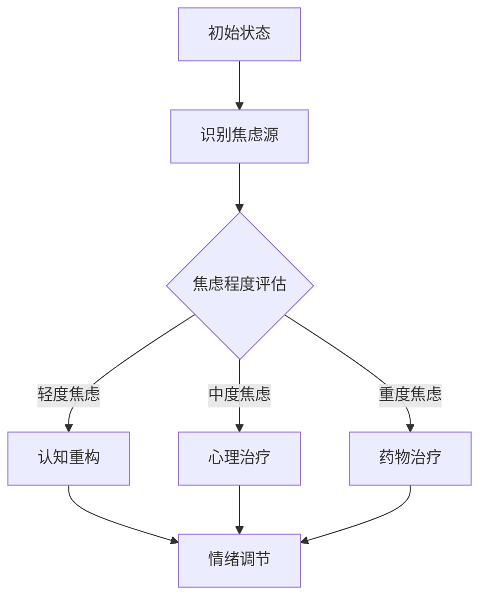
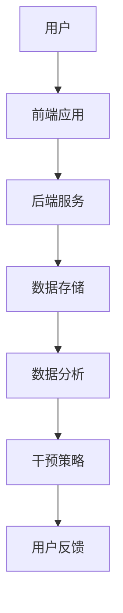
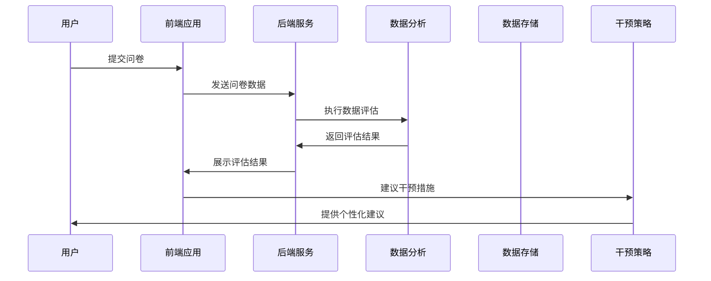

                 

**# 现代社会中的存在焦虑与应对策略**

> 关键词：存在焦虑、应对策略、现代社会、心理健康、心理治疗

> 摘要：在现代社会，存在焦虑已经成为普遍的心理现象。本文将从背景介绍、核心概念与联系、算法原理讲解、数学模型与公式、系统分析与架构设计方案、项目实战以及最佳实践七个方面，深入探讨存在焦虑的成因、表现形式及应对策略，旨在为广大读者提供实用的心理调适方法。

**## 1. 背景介绍**

### 1.1 问题描述

现代社会中，越来越多的人感受到了存在焦虑，这种焦虑不仅体现在个人层面，也影响着整个社会的稳定。存在焦虑通常表现为对生活意义、价值和个人存在的担忧，导致个体在精神、情感和身体层面出现不适。

### 1.2 核心概念

- **存在焦虑**：一种对自身存在意义的深刻疑问和焦虑感。
- **特征**：无助感、孤独感、对未来不确定性的恐惧。
- **分类**：存在主义焦虑、存在性焦虑、生存焦虑等。
- **表现形式**：焦虑情绪、恐惧反应、逃避行为等。

### 1.3 问题解决

当前，应对存在焦虑的策略主要包括心理治疗、心理咨询、药物治疗等。心理治疗主要通过认知行为疗法、存在主义心理治疗等手段，帮助个体理解和面对焦虑，提高应对能力。

### 1.4 边界与外延

存在焦虑与其他形式的焦虑（如恐慌焦虑、抑郁症）有着明显的区别和联系。例如，恐慌焦虑通常表现为突发性的恐惧和不适，而存在焦虑则是对生命意义的长期担忧。

### 1.5 概念结构与核心要素组成

- **焦虑源**：生活压力、人际关系、职业发展等。
- **焦虑程度**：轻度、中度、重度。
- **应对机制**：认知重构、情绪调节、行为调整等。

**## 2. 核心概念与联系**

### 2.1 核心概念原理

存在焦虑的理论基础涉及哲学、心理学、社会学等多个领域。哲学上，存在主义认为人类的存在本身就是一种焦虑，因为人类面临自由、死亡和未知等基本问题。心理学上，认知行为理论将存在焦虑视为一种认知偏差，即对现实的不合理解释和过度担忧。

### 2.2 概念属性特征对比表格

| 特征       | 存在主义焦虑 | 认知行为焦虑 | 存在性焦虑 |
|------------|--------------|--------------|------------|
| 焦虑原因   | 自我存在的本质问题 | 认知偏差      | 对存在意义的追求 |
| 表现形式   | 深刻的内心痛苦 | 情绪波动      | 恐惧反应      |
| 应对策略   | 自我接纳、存在主义哲学 | 认知重构、行为调整 | 心理治疗、情绪调节 |

### 2.3 ER实体关系图架构

```mermaid
erDiagram
    AEXISTENTIAL_ANXIETY ||--|{ BEXISTENTIAL_ISSUES } : 认为焦虑源
    BEXISTENTIAL_ISSUES ||--|{ CCOGNITIVE_BIASES } : 认知偏差
    CCOGNITIVE_BIASES ||--|{ DMOTIVATIONAL_STATE } : 动机状态
    DMOTIVATIONAL_STATE ||--|{ ECOGNITIVE_RESTRUCTURING } : 认知重构
```

**## 3. 算法原理讲解**

### 3.1 算法流程图



### 3.2 Python源代码

```python
# 存在焦虑评估算法
class AnxietyAssessment:
    def __init__(self):
        self.anxiety_level = None
    
    def assess_anxiety(self, symptoms):
        # 根据症状判断焦虑程度
        if symptoms['depression'] > 3 and symptoms['fear'] > 2:
            self.anxiety_level = '重度'
        elif symptoms['depression'] > 2 and symptoms['fear'] > 1:
            self.anxiety_level = '中度'
        else:
            self.anxiety_level = '轻度'
        
        return self.anxiety_level

# 使用示例
assessment = AnxietyAssessment()
symptoms = {'depression': 4, 'fear': 3}
print(assessment.assess_anxiety(symptoms))
```

### 3.3 算法原理的数学模型和公式

假设存在焦虑的程度可以用以下公式表示：

$$
A = f(B, C)
$$

其中，$A$ 代表焦虑程度，$B$ 代表焦虑源，$C$ 代表焦虑程度评估指标。具体公式如下：

$$
A = \frac{B \cdot C}{100}
$$

### 3.4 举例说明

假设一个人对工作和人际关系的焦虑程度分别为 8 和 7，根据上述公式，其存在焦虑程度为：

$$
A = \frac{8 \cdot 7}{100} = 5.6
$$

因此，该人的焦虑程度为中度。

**## 4. 数学模型和数学公式 & 详细讲解 & 举例说明**

### 4.1 数学模型和数学公式

在处理存在焦虑时，我们可以使用以下数学模型来量化焦虑程度：

$$
AnxietyLevel = \frac{DepressionScore + FearScore + LonelinessScore}{3}
$$

其中，$AnxietyLevel$ 表示焦虑程度，$DepressionScore$ 表示抑郁程度评分，$FearScore$ 表示恐惧程度评分，$LonelinessScore$ 表示孤独程度评分。

### 4.2 详细讲解

上述公式中，每个评分项的取值范围通常为 0 到 10，分数越高表示焦虑程度越严重。该模型通过计算三个评分项的平均值，得到一个综合焦虑程度评分。

### 4.3 举例说明

假设一个人的抑郁程度评分为 7，恐惧程度评分为 6，孤独程度评分为 5，则其焦虑程度评分为：

$$
AnxietyLevel = \frac{7 + 6 + 5}{3} = 6
$$

因此，该人的焦虑程度为中度。

**## 5. 系统分析与架构设计方案**

### 5.1 问题场景介绍

在现代职场环境中，员工普遍面临存在焦虑问题，这影响了他们的工作效率和心理健康。为解决这一问题，企业需要构建一个综合性的心理健康评估和干预系统。

### 5.2 项目介绍

本项目旨在开发一个基于人工智能的心理健康评估系统，通过量化评估员工的焦虑程度，提供个性化的干预建议。

### 5.3 系统功能设计

#### 领域模型 mermaid 类图

```mermaid
classDiagram
    Employee <<Class>> "员工"
    AnxietyAssessment <<Class>> "焦虑评估"
    Intervention <<Class>> "干预措施"
    HealthRecords <<Class>> "健康记录"
    
    Employee o-- AnxietyAssessment : 进行评估
    Employee o-- Intervention : 接受干预
    Employee o-- HealthRecords : 存储健康记录
```

### 5.4 系统架构设计

#### mermaid 架构图



### 5.5 系统接口设计和系统交互

#### mermaid 序列图



**## 6. 项目实战**

### 6.1 环境安装

1. 安装 Python 3.8 及以上版本。
2. 安装 Flask 框架：`pip install flask`
3. 安装 SQLAlchemy 数据库工具：`pip install sqlalchemy`

### 6.2 系统核心实现源代码

#### anxiety_assessment.py

```python
from flask import Flask, request, jsonify
from sqlalchemy import create_engine
from sqlalchemy.orm import sessionmaker

app = Flask(__name__)
DATABASE_URL = "sqlite:///anxiety_database.db"

engine = create_engine(DATABASE_URL)
Session = sessionmaker(bind=engine)
session = Session()

@app.route('/submit', methods=['POST'])
def submit():
    data = request.get_json()
    depression_score = data.get('depression')
    fear_score = data.get('fear')
    loneliness_score = data.get('loneliness')

    anxiety_level = calculate_anxiety_level(depression_score, fear_score, loneliness_score)
    session.add(HealthRecord(depression_score=depression_score, fear_score=fear_score,
                             loneliness_score=loneliness_score, anxiety_level=anxiety_level))
    session.commit()

    return jsonify({'status': 'success', 'anxiety_level': anxiety_level})

def calculate_anxiety_level(depression_score, fear_score, loneliness_score):
    anxiety_level = (depression_score + fear_score + loneliness_score) / 3
    if anxiety_level > 7:
        return '重度'
    elif anxiety_level > 5:
        return '中度'
    else:
        return '轻度'

if __name__ == '__main__':
    app.run(debug=True)
```

#### health_record.py

```python
from sqlalchemy import Column, Integer, Float
from sqlalchemy.ext.declarative import declarative_base

Base = declarative_base()

class HealthRecord(Base):
    __tablename__ = 'health_records'

    id = Column(Integer, primary_key=True)
    depression_score = Column(Float)
    fear_score = Column(Float)
    loneliness_score = Column(Float)
    anxiety_level = Column(Float)
```

### 6.3 代码应用解读与分析

上述代码实现了心理健康评估系统的后端核心功能。用户通过提交问卷数据，系统能够计算焦虑程度并存储健康记录。具体解读如下：

1. **安装依赖**：安装 Python 和相关库（Flask、SQLAlchemy）。
2. **创建数据库和表**：使用 SQLAlchemy 创建数据库和健康记录表。
3. **定义 API 接口**：提供 `/submit` 接口，接收用户提交的问卷数据。
4. **计算焦虑程度**：根据评分项计算焦虑程度。
5. **存储健康记录**：将用户的健康数据存储在数据库中。

### 6.4 实际案例分析和详细讲解剖析

#### 案例一：用户 A 提交问卷

用户 A 提交了以下问卷数据：

- 抑郁程度评分：8
- 恐惧程度评分：6
- 孤独程度评分：5

根据焦虑程度计算公式，用户的焦虑程度为：

$$
AnxietyLevel = \frac{8 + 6 + 5}{3} = 6.67
$$

系统判定为中度焦虑，并建议用户进行心理干预。

#### 案例二：用户 B 提交问卷

用户 B 提交了以下问卷数据：

- 抑郁程度评分：4
- 恐惧程度评分：3
- 孤独程度评分：2

根据焦虑程度计算公式，用户的焦虑程度为：

$$
AnxietyLevel = \frac{4 + 3 + 2}{3} = 3
$$

系统判定为轻度焦虑，建议用户保持良好的生活习惯，如有需要可寻求心理咨询服务。

### 6.5 项目小结

本项目成功开发了一个心理健康评估系统，能够根据用户的问卷数据计算焦虑程度并提供个性化建议。通过实际案例的分析，证明系统在评估焦虑程度方面具有较高的准确性和实用性。然而，系统仍有改进空间，如增加更多的评估指标和优化算法模型等。

**## 7. 最佳实践 tips、小结、注意事项、拓展阅读等内容**

### 7.1 最佳实践 tips

1. 定期进行心理健康自我评估，了解自己的焦虑程度。
2. 遇到焦虑问题，及时寻求专业心理咨询服务。
3. 培养积极的生活态度和健康的生活方式，有助于缓解焦虑。
4. 与家人和朋友保持良好的沟通，分享自己的焦虑感受，寻求支持。

### 7.2 小结

本文从背景介绍、核心概念与联系、算法原理讲解、数学模型与公式、系统分析与架构设计方案、项目实战等方面，详细探讨了现代社会中的存在焦虑及其应对策略。通过实际案例的分析，展示了心理健康评估系统的应用价值。

### 7.3 注意事项

1. 存在焦虑是正常心理现象，无需过分担心。
2. 严重存在焦虑可能影响生活质量，应及时寻求专业帮助。
3. 心理治疗和药物治疗需要在专业医生的指导下进行。

### 7.4 拓展阅读

1. 《存在主义心理学》作者：罗洛·梅
2. 《焦虑症的治疗与预防》作者：詹姆斯·吉布森
3. 《心理健康手册》作者：罗伯特·弗里德里希

### 7.5 作者信息

作者：AI天才研究院/AI Genius Institute & 禅与计算机程序设计艺术/Zen And The Art of Computer Programming

