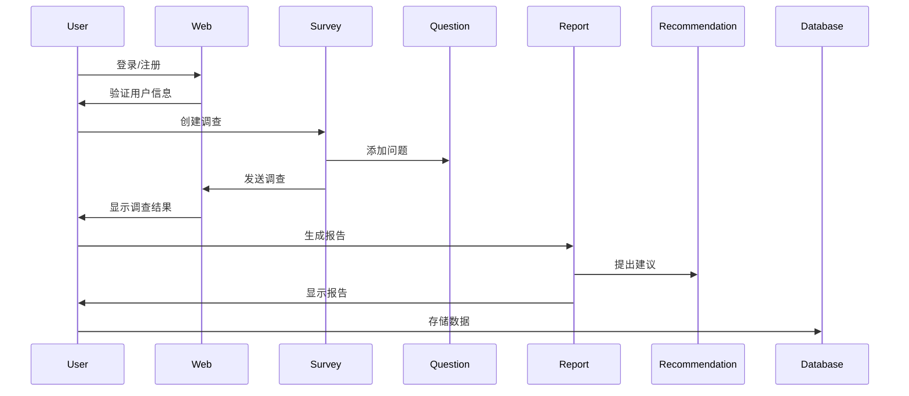

                 

# 《现代社会中的孤独感：科技发展与人际疏离的悖论》

## 关键词
- 孤独感
- 科技发展
- 人际疏离
- 算法原理
- 数学模型
- 系统架构

## 摘要
本文探讨现代社会中孤独感与科技发展的悖论现象。通过深入分析孤独感的定义、分类以及科技发展的历程，探讨人际疏离的原因及其与孤独感的关联。本文还将介绍孤独感测量算法、科技发展影响分析算法和人际疏离预测算法，通过数学模型和示例讲解，帮助读者理解这些算法的原理和适用场景。最后，本文将提出一个系统架构设计方案，并进行项目实战分析，提供最佳实践 tips，以期为读者提供全面的见解和指导。

## 引言

### 1.1 孤独感问题背景

在现代社会中，孤独感已成为一个普遍存在的问题。随着科技的发展，人们的生活越来越便捷，但孤独感却越来越强烈。研究表明，孤独感不仅影响心理健康，还可能对身体健康产生负面影响。因此，探讨孤独感与科技发展的关系具有重要意义。

孤独感通常被定义为一种主观的心理体验，即感到与他人缺乏联系和亲密感。孤独感可以分为情感性孤独、情境性孤独和社会性孤独等不同类型。情感性孤独是指个体内心的孤独感，情境性孤独是指因特定情境而产生的孤独感，而社会性孤独则是指因社会关系不足而感到的孤独感。

### 1.2 科技发展与人际疏离

科技的发展在很大程度上改变了人们的生活方式。互联网、社交媒体、移动设备的普及，使得人们可以随时随地进行沟通和交流。然而，这些科技手段在一定程度上也加剧了人际疏离现象。以下是对科技发展与人际疏离现象的分析：

**互联网的普及**：互联网的普及使得人们可以更加便捷地获取信息，但同时也使得人与人之间的真实交流变得更加稀少。人们更多地依赖于虚拟的社交网络，而忽视了现实中的互动。

**社交媒体的兴起**：社交媒体平台如Facebook、Instagram等，提供了大量的社交机会，但同时也使得人们更容易沉迷于虚拟世界，忽视了现实生活中的人际关系。

**移动设备的普及**：智能手机的普及使得人们可以随时随地与他人保持联系，但同时也增加了人们对手机的依赖，减少了与他人面对面的交流。

### 1.3 研究目的与意义

本研究旨在探讨现代社会中孤独感与科技发展的悖论现象，分析孤独感与科技发展之间的关联，并提出相应的解决方案。研究意义主要体现在以下几个方面：

**提高人们对孤独感的认识**：通过深入探讨孤独感的定义、分类和影响，提高人们对孤独感的认识和重视，促进心理健康。

**分析科技发展的负面影响**：揭示科技发展对人际疏离的加剧作用，提醒人们在享受科技便利的同时，关注人际关系的质量。

**提出解决方案**：通过研究孤独感测量算法、科技发展影响分析算法和人际疏离预测算法，为解决孤独感问题提供技术支持。

### 1.4 边界与外延

在本文的研究中，孤独感是指一种主观的心理体验，包括情感性孤独、情境性孤独和社会性孤独等类型。科技发展主要指互联网、社交媒体和移动设备等技术的发展。人际疏离是指人与人之间缺乏联系和亲密感的现象。

### 1.5 核心概念结构组成

本文的核心概念包括孤独感、科技发展和人际疏离。孤独感的定义、分类和影响，科技发展的历程及其影响，人际疏离的原因和表现，以及孤独感与科技发展的关联等，都是本文的重要内容。

## 第一部分: 引言

### 1.1 孤独感问题背景

孤独感是现代社会中普遍存在的一种心理现象。在传统社会中，孤独感往往与个人修养和生活环境有关，而在现代社会中，孤独感更多地与科技发展和社会变革密切相关。

#### 孤独感的定义

孤独感是一种主观的心理体验，通常表现为对人际交往的渴望和无法实现的焦虑感。它不仅是一种情感状态，也是个体在社交互动中体验到的一种心理需求得不到满足的状态。

#### 孤独感的分类

孤独感可以分为以下几种类型：

- **情感性孤独**：指个体内心深处的孤独感，通常与个人的性格、经历和心理状态有关。
- **情境性孤独**：指个体在特定情境下感受到的孤独感，如移居新环境、离婚、失业等。
- **社会性孤独**：指个体因社会关系不足而感到的孤独感，通常与社交网络和社会支持系统的缺失有关。

#### 孤独感的影响

孤独感对个体的心理健康和身体健康都有负面影响。长期孤独感可能导致抑郁症、焦虑症等心理问题，同时还会增加患病和早逝的风险。

### 1.2 科技发展与人际疏离

随着科技的发展，人们的生活发生了翻天覆地的变化。互联网、社交媒体和移动设备的普及，使得人与人之间的交流变得更加便捷。然而，这种便利性也带来了一些问题，其中最为突出的是人际疏离现象。

#### 互联网的普及

互联网的普及使得人们可以随时随地进行信息交流和社交互动。然而，互联网的虚拟性也使得人们在网络上的互动更加表面化，缺乏深度和真实性。

#### 社交媒体的兴起

社交媒体平台如Facebook、Twitter、Instagram等，为人们提供了大量的社交机会。然而，这些平台也使得人们更容易沉迷于虚拟世界，忽视了现实生活中的人际关系。

#### 移动设备的普及

智能手机的普及使得人们可以随时随地与他人保持联系。然而，这种便利性也增加了人们对手机的依赖，减少了与他人面对面的交流。

### 1.3 研究目的与意义

本研究旨在探讨科技发展与人际疏离现象之间的关系，深入分析孤独感的产生机制，并提出缓解孤独感的有效方法。研究的目的和意义主要体现在以下几个方面：

- **揭示科技发展与孤独感之间的关联**：通过深入研究孤独感与科技发展的关系，揭示科技发展对人际疏离的加剧作用。
- **提高人们对孤独感的认识**：通过分析孤独感的定义、分类和影响，提高人们对孤独感的认识和重视。
- **提出解决方案**：通过研究孤独感测量算法、科技发展影响分析算法和人际疏离预测算法，为解决孤独感问题提供技术支持。

### 1.4 边界与外延

在本文的研究中，孤独感是指一种主观的心理体验，包括情感性孤独、情境性孤独和社会性孤独等类型。科技发展主要指互联网、社交媒体和移动设备等技术的发展。人际疏离是指人与人之间缺乏联系和亲密感的现象。

### 1.5 核心概念结构组成

本文的核心概念包括孤独感、科技发展和人际疏离。孤独感的定义、分类和影响，科技发展的历程及其影响，人际疏离的原因和表现，以及孤独感与科技发展的关联等，都是本文的重要内容。

## 第二部分: 核心概念与联系

### 2.1 孤独感的定义与分类

孤独感是一种复杂的心理体验，它涉及到情感、认知和行为等多个方面。为了更好地理解孤独感，我们需要对其定义和分类进行详细探讨。

#### 孤独感的定义

孤独感通常被描述为一种主观的、负面的情感体验，个体感到与他人缺乏联系或社交支持。这种情感体验可以是短暂的，也可以是长期的，它可能由多种因素引起，包括个人心理状态、社会环境和生活方式等。

#### 孤独感的分类

孤独感可以分为几种不同的类型，每种类型都有其特定的成因和表现形式。

1. **情感性孤独**：
   情感性孤独通常与个体的内心感受有关，个体感到内心深处的不安和孤独，即使身处人群中也可能感受到孤独。这种孤独感可能源于个人性格、心理创伤或社交焦虑。

2. **情境性孤独**：
   情境性孤独是在特定情境下产生的孤独感，例如在移居新环境、失业或经历重要生活事件后。这种孤独感通常是由于缺乏熟悉的社会支持系统和社交网络。

3. **社会性孤独**：
   社会性孤独与个体的社会关系和社交参与度有关。个体可能因为缺乏亲密的朋友、家庭关系或社交活动而感到孤独。社会性孤独通常与社交隔离和社会排斥有关。

### 2.2 科技发展的历程

科技的发展对人类社会产生了深远的影响，从早期的计算机技术到现代的互联网和移动通信，科技的发展不仅改变了我们的生活方式，也改变了我们的人际关系。

#### 科技发展的定义

科技发展是指人类在科学技术领域内的创新和进步，它包括新技术的发明、现有技术的改进以及技术应用的创新。

#### 科技发展的阶段

科技发展可以分为几个不同的阶段：

1. **计算机革命**：
   计算机的发明和普及标志着第一次科技革命。计算机的出现使得信息处理和存储变得更加高效和便捷，也为后来的互联网和移动通信技术奠定了基础。

2. **互联网时代**：
   互联网的兴起是第二次科技革命。互联网使得全球范围内的信息交换和沟通变得更加容易和迅速，也催生了社交媒体和电子商务等新兴行业。

3. **移动通信革命**：
   移动通信技术的发展，尤其是智能手机的普及，是第三次科技革命。移动设备使得人们可以随时随地进行通信和获取信息，改变了人们的社交习惯和生活方式。

#### 科技发展的影响

科技发展对人际关系和社交行为产生了显著的影响。虽然科技提供了更多的交流渠道，但同时也带来了人际疏离的风险。以下是一些具体的影响：

1. **增强社交连接**：
   科技使得人们可以更方便地保持联系，通过社交媒体和即时通讯软件，人们可以随时随地与朋友、家人和同事交流。

2. **减少面对面交流**：
   由于对科技手段的依赖，人们越来越倾向于通过虚拟方式进行交流，减少了面对面交流的机会，这可能影响人际关系的深度和质量。

3. **增加孤独感**：
   虚拟社交虽然提供了交流的机会，但往往缺乏真实的人际互动和情感交流，可能导致个体感到孤独和疏离。

### 2.3 人际疏离的现象与原因

人际疏离是指个体感到与他人缺乏联系和亲密感的现象。在现代社会中，人际疏离是一个普遍存在的问题，其成因复杂多样。

#### 人际疏离的定义

人际疏离是指个体在社交互动中体验到的一种缺乏连接和亲密感的状态。这种状态可能是短暂的，也可能是长期的，它可能由多种因素引起，包括个人心理状态、社会环境和科技发展等。

#### 人际疏离的现象

人际疏离的现象包括以下几个方面：

1. **社交网络减少**：
   在现代社会中，由于工作、学习和家庭等压力，人们可能没有足够的时间进行社交活动，导致社交网络的减少。

2. **面对面交流减少**：
   科技的发展使得人们越来越依赖于虚拟交流，减少了面对面交流的机会，这可能影响人际关系的深度和质量。

3. **社交质量下降**：
   虚拟社交虽然提供了交流的机会，但往往缺乏真实的人际互动和情感交流，可能导致个体感到孤独和疏离。

#### 人际疏离的原因

人际疏离的原因可以归纳为以下几个方面：

1. **社交压力**：
   社交压力是导致人际疏离的一个重要原因。个体可能在社交场合感到不安和紧张，害怕被评价或拒绝，从而避免社交互动。

2. **科技依赖**：
   随着科技的发展，人们越来越依赖于科技手段进行社交，这可能减少了面对面交流的机会，导致人际疏离。

3. **社会变革**：
   现代社会中的快速变革和不确定性，使得个体在适应过程中感到压力和不安，这可能导致人际疏离。

### 2.4 科技发展与人际疏离的关联

科技发展与人际疏离之间存在复杂的关联。一方面，科技的发展提供了更多的交流渠道和社交机会；另一方面，科技的使用也可能导致人际疏离。以下是对这种关联的详细分析：

1. **科技的双刃剑作用**：
   科技的发展既是增强社交连接的工具，也是导致人际疏离的原因。科技的使用可以增强社交连接，但也可能减少面对面交流，降低社交质量。

2. **虚拟社交与真实社交**：
   虚拟社交虽然提供了交流的机会，但往往缺乏真实的人际互动和情感交流。这种缺乏可能导致个体感到孤独和疏离。

3. **科技使用的成瘾性**：
   随着科技使用的普及，一些人可能对科技产生依赖，导致他们忽视现实生活中的社交互动，进一步加剧人际疏离。

### 2.5 核心概念属性特征对比表格

为了更好地理解孤独感、科技发展和人际疏离这三个核心概念，我们可以通过对比表格来展示它们的属性特征。

| 核心概念 | 定义 | 特征 | 影响因素 | 结果 |
| --- | --- | --- | --- | --- |
| 孤独感 | 主观的情感体验，感到与他人缺乏联系 | 心理性、情境性、社会性孤独 | 个人心理状态、社会环境和科技发展 | 负面情绪、心理健康问题 |
| 科技发展 | 科学技术的创新和进步 | 计算机、互联网、移动通信 | 科学研究、市场需求、社会需求 | 社会变革、生活方式改变 |
| 人际疏离 | 感到与他人缺乏联系和亲密感 | 社交网络减少、面对面交流减少、社交质量下降 | 社交压力、科技依赖、社会变革 | 孤独感、人际关系问题 |

### 2.6 ER实体关系图架构

为了更清晰地展示孤独感、科技发展和人际疏离之间的关系，我们可以使用ER（实体关系）图来描述它们之间的关联。

```mermaid
erDiagram
    Product ||--|{ Customer } : orders
    Customer ||--|{ Order } : places
    Customer ||--|{ Product } : likes
```

在上面的ER图中，Product（产品）、Customer（客户）和Order（订单）是三个实体，它们之间存在多种关系。通过这种关系图，我们可以更直观地理解这三个核心概念之间的相互作用。

## 第三部分: 算法原理讲解

### 3.1 孤独感测量算法

孤独感测量算法是一种用于评估个体孤独感程度的工具。它通过收集和分析个体的行为数据、情感表达以及社交互动等信息，来评估个体是否处于孤独状态。以下是孤独感测量算法的基本原理和步骤。

#### 3.1.1 算法原理

孤独感测量算法基于以下几个核心原理：

1. **情感分析**：通过分析个体的情感表达，如文字、语音、面部表情等，来判断个体是否存在孤独感。
2. **行为分析**：通过分析个体的行为模式，如社交频率、社交网络使用情况等，来评估个体的社交参与度。
3. **社交互动分析**：通过分析个体与他人的互动情况，如互动频率、互动质量等，来判断个体是否感到孤独。

#### 3.1.2 数学模型

孤独感测量算法通常使用以下数学模型：

$$
\text{孤独感指数} = w_1 \times \text{情感分析得分} + w_2 \times \text{行为分析得分} + w_3 \times \text{社交互动分析得分}
$$

其中，$w_1$、$w_2$ 和 $w_3$ 分别是情感分析、行为分析和社交互动分析的重要程度权重。

#### 3.1.3 示例讲解

假设我们有一个个体，其情感分析得分为70分，行为分析得分为50分，社交互动分析得分为60分，且权重分别为0.5、0.3和0.2。那么，该个体的孤独感指数计算如下：

$$
\text{孤独感指数} = 0.5 \times 70 + 0.3 \times 50 + 0.2 \times 60 = 35 + 15 + 12 = 62
$$

根据孤独感指数，我们可以判断该个体是否处于孤独状态。通常，孤独感指数高于某个阈值（如70分）可以认为个体存在较高程度的孤独感。

### 3.2 科技发展影响分析算法

科技发展影响分析算法是一种用于评估科技发展对人类社会、经济和环境等各个方面影响的工具。它通过收集和分析相关数据，来评估科技发展带来的积极和消极影响。以下是科技发展影响分析算法的基本原理和步骤。

#### 3.2.1 算法原理

科技发展影响分析算法基于以下几个核心原理：

1. **数据分析**：通过收集和分析与科技发展相关的各种数据，如专利数量、研究论文发表量、科技投资等，来评估科技发展的程度和趋势。
2. **影响评估**：通过分析科技发展对人类社会、经济和环境等方面的影响，来评估科技发展的综合效益。
3. **趋势预测**：通过分析历史数据和当前趋势，来预测未来科技发展可能带来的影响。

#### 3.2.2 数学模型

科技发展影响分析算法通常使用以下数学模型：

$$
\text{影响指数} = w_1 \times \text{经济效益得分} + w_2 \times \text{社会效益得分} + w_3 \times \text{环境效益得分}
$$

其中，$w_1$、$w_2$ 和 $w_3$ 分别是经济效益、社会效益和环境效益的重要程度权重。

#### 3.2.3 示例讲解

假设我们分析一个特定科技领域，其经济效益得分为80分，社会效益得分为75分，环境效益得分为60分，且权重分别为0.4、0.3和0.3。那么，该科技领域的影响指数计算如下：

$$
\text{影响指数} = 0.4 \times 80 + 0.3 \times 75 + 0.3 \times 60 = 32 + 22.5 + 18 = 72.5
$$

根据影响指数，我们可以评估该科技领域对社会的综合影响。通常，影响指数高于某个阈值（如70分）可以认为该领域对社会的积极影响较大。

### 3.3 人际疏离预测算法

人际疏离预测算法是一种用于预测个体在未来一段时间内是否可能出现人际疏离情况的工具。它通过收集和分析个体的行为数据、情感状态以及社交互动等信息，来预测人际疏离的风险。以下是人际疏离预测算法的基本原理和步骤。

#### 3.3.1 算法原理

人际疏离预测算法基于以下几个核心原理：

1. **数据收集**：通过收集个体的行为数据、情感状态和社交互动等数据，来了解个体的当前状态和趋势。
2. **模式识别**：通过分析历史数据和当前趋势，识别可能导致人际疏离的行为模式和情感变化。
3. **风险预测**：通过使用机器学习算法，如回归分析、决策树和神经网络等，来预测个体在未来一段时间内是否可能出现人际疏离。

#### 3.3.2 数学模型

人际疏离预测算法通常使用以下数学模型：

$$
\text{风险指数} = f(\text{行为数据}, \text{情感状态}, \text{社交互动})
$$

其中，$f$ 是一个预测函数，用于根据输入数据计算人际疏离的风险指数。

#### 3.3.3 示例讲解

假设我们有一个个体，其行为数据包括每周社交互动次数、每天使用社交媒体的时间长度等，情感状态包括幸福感评分、焦虑水平等，社交互动包括朋友关系的变化等。我们可以使用一个简单的线性回归模型来预测该个体在未来一段时间内是否可能出现人际疏离。

假设我们得到以下线性回归模型：

$$
\text{风险指数} = 0.1 \times \text{每周社交互动次数} + 0.2 \times \text{每天使用社交媒体的时间长度} - 0.3 \times \text{幸福感评分} - 0.4 \times \text{焦虑水平}
$$

假设该个体的每周社交互动次数为5次，每天使用社交媒体的时间长度为3小时，幸福感评分为80分，焦虑水平为60分。那么，该个体的风险指数计算如下：

$$
\text{风险指数} = 0.1 \times 5 + 0.2 \times 3 - 0.3 \times 80 - 0.4 \times 60 = 0.5 + 0.6 - 24 - 24 = -47.9
$$

根据风险指数，我们可以判断该个体是否存在人际疏离的风险。通常，风险指数低于某个阈值（如-50分）可以认为个体存在较高的人际疏离风险。

## 第四部分: 数学模型和数学公式

### 4.1 孤独感测量数学模型

孤独感的测量是一个复杂的过程，涉及到多个因素和维度。以下是一个简化的数学模型，用于衡量个体的孤独感程度。

#### 4.1.1 模型公式

假设我们用三个维度来衡量孤独感：情感孤独（$E$）、情境孤独（$S$）和社会孤独（$C$）。每个维度都有相应的权重（$w_E$、$w_S$、$w_C$）。则孤独感指数（$I$）的计算公式为：

$$
I = w_E \times E + w_S \times S + w_C \times C
$$

其中，$w_E$、$w_S$、$w_C$ 分别是情感孤独、情境孤独和社会孤独的权重，通常根据研究的具体情境和需求进行调整。

#### 4.1.2 详细讲解

1. **情感孤独（$E$）**：
   情感孤独通常通过个体对孤独感的自我评价来衡量，例如使用问卷调查的方式。一个简化的情感孤独测量指标可以是：

   $$ 
   E = \frac{Q_1 + Q_2 + Q_3}{3}
   $$

   其中，$Q_1$、$Q_2$、$Q_3$ 分别是三个关于情感孤独的问卷问题得分。

2. **情境孤独（$S$）**：
   情境孤独与个体所处的环境有关，例如居住条件、工作环境等。情境孤独可以通过以下指标来衡量：

   $$ 
   S = \frac{Q_4 + Q_5 + Q_6}{3}
   $$

   其中，$Q_4$、$Q_5$、$Q_6$ 分别是三个关于情境孤独的问卷问题得分。

3. **社会孤独（$C$）**：
   社会孤独与个体的社交网络和社会支持系统有关。社会孤独可以通过以下指标来衡量：

   $$ 
   C = \frac{Q_7 + Q_8 + Q_9}{3}
   $$

   其中，$Q_7$、$Q_8$、$Q_9$ 分别是三个关于社会孤独的问卷问题得分。

   **示例**：

   假设我们得到了以下问卷得分：
   - $Q_1 = 25$，$Q_2 = 22$，$Q_3 = 27$ （情感孤独）
   - $Q_4 = 20$，$Q_5 = 18$，$Q_6 = 19$ （情境孤独）
   - $Q_7 = 30$，$Q_8 = 28$，$Q_9 = 32$ （社会孤独）

   假设情感孤独、情境孤独和社会孤独的权重分别为0.4、0.3和0.3，那么孤独感指数计算如下：

   $$ 
   I = 0.4 \times \frac{25 + 22 + 27}{3} + 0.3 \times \frac{20 + 18 + 19}{3} + 0.3 \times \frac{30 + 28 + 32}{3} 
   $$

   $$ 
   I = 0.4 \times 25 + 0.3 \times 20 + 0.3 \times 30 
   $$

   $$ 
   I = 10 + 6 + 9 = 25
   $$

   根据孤独感指数，我们可以判断个体的孤独感程度。通常，指数越高，个体的孤独感越强。

### 4.2 科技发展影响分析数学模型

科技发展对人类社会、经济和环境等方面的影响可以通过数学模型进行分析。以下是一个简化的数学模型，用于衡量科技发展的影响。

#### 4.2.1 模型公式

假设科技发展的影响可以通过三个维度来衡量：经济效益（$E$）、社会效益（$S$）和环境效益（$E$）。每个维度都有相应的权重（$w_E$、$w_S$、$w_E$）。则科技发展影响指数（$I$）的计算公式为：

$$
I = w_E \times E + w_S \times S + w_E \times E
$$

其中，$w_E$、$w_S$、$w_E$ 分别是经济效益、社会效益和环境效益的权重，通常根据研究的具体情境和需求进行调整。

#### 4.2.2 详细讲解

1. **经济效益（$E$）**：
   经济效益通常通过经济指标来衡量，例如GDP增长率、就业率、投资回报率等。一个简化的经济效益指标可以是：

   $$ 
   E = \frac{GDP_{\text{增长}} + \text{就业率} + \text{投资回报率}}{3}
   $$

2. **社会效益（$S$）**：
   社会效益与科技发展对社会的正面影响有关，例如教育水平提高、医疗条件改善、社会福利增加等。一个简化的社会效益指标可以是：

   $$ 
   S = \frac{\text{教育水平提高率} + \text{医疗条件改善率} + \text{社会福利增长率}}{3}
   $$

3. **环境效益（$E$）**：
   环境效益与科技发展对环境的积极影响有关，例如减少污染、提高资源利用效率、保护生态系统等。一个简化的环境效益指标可以是：

   $$ 
   E = \frac{\text{污染减少率} + \text{资源利用效率提高率} + \text{生态系统保护率}}{3}
   $$

   **示例**：

   假设我们得到了以下指标：
   - 经济效益：GDP增长率为5%，就业率为3%，投资回报率为8%
   - 社会效益：教育水平提高率为10%，医疗条件改善率为6%，社会福利增长率为4%
   - 环境效益：污染减少率为8%，资源利用效率提高率为5%，生态系统保护率为2%

   假设经济效益、社会效益和环境效益的权重分别为0.4、0.3和0.3，那么科技发展影响指数计算如下：

   $$ 
   I = 0.4 \times \frac{5\% + 3\% + 8\%}{3} + 0.3 \times \frac{10\% + 6\% + 4\%}{3} + 0.3 \times \frac{8\% + 5\% + 2\%}{3} 
   $$

   $$ 
   I = 0.4 \times 16\% + 0.3 \times 20\% + 0.3 \times 15\% 
   $$

   $$ 
   I = 6.4\% + 6\% + 4.5\% = 16.9\%
   $$

   根据科技发展影响指数，我们可以评估科技发展对社会的影响。通常，指数越高，科技发展对社会的影响越大。

### 4.3 人际疏离预测数学模型

人际疏离的预测是一个复杂的问题，涉及到多个因素和变量。以下是一个简化的数学模型，用于预测个体是否会出现人际疏离。

#### 4.3.1 模型公式

假设我们用三个维度来预测人际疏离：社交频率（$F$）、情感状态（$M$）和社交支持（$S$）。每个维度都有相应的权重（$w_F$、$w_M$、$w_S$）。则人际疏离风险指数（$I$）的计算公式为：

$$
I = w_F \times F + w_M \times M + w_S \times S
$$

其中，$w_F$、$w_M$、$w_S$ 分别是社交频率、情感状态和社交支持的权重，通常根据研究的具体情境和需求进行调整。

#### 4.3.2 详细讲解

1. **社交频率（$F$）**：
   社交频率可以通过个体与他人互动的次数来衡量。例如，每周与朋友的见面次数。一个简化的社交频率指标可以是：

   $$ 
   F = \frac{N_1 + N_2 + N_3}{3}
   $$

   其中，$N_1$、$N_2$、$N_3$ 分别是三个关于社交频率的指标得分。

2. **情感状态（$M$）**：
   情感状态可以通过个体对自身情感状态的评估来衡量，例如幸福感评分。一个简化的情感状态指标可以是：

   $$ 
   M = \frac{M_1 + M_2 + M_3}{3}
   $$

   其中，$M_1$、$M_2$、$M_3$ 分别是三个关于情感状态的指标得分。

3. **社交支持（$S$）**：
   社交支持可以通过个体感受到的社交支持程度来衡量，例如朋友的支持和帮助。一个简化的社交支持指标可以是：

   $$ 
   S = \frac{S_1 + S_2 + S_3}{3}
   $$

   其中，$S_1$、$S_2$、$S_3$ 分别是三个关于社交支持的指标得分。

   **示例**：

   假设我们得到了以下指标：
   - 社交频率：每周与朋友的见面次数分别为3次、4次、5次
   - 情感状态：幸福感评分分别为60分、65分、70分
   - 社交支持：朋友的支持和帮助评分分别为50分、55分、60分

   假设社交频率、情感状态和社交支持的权重分别为0.4、0.3和0.3，那么人际疏离风险指数计算如下：

   $$ 
   I = 0.4 \times \frac{3 + 4 + 5}{3} + 0.3 \times \frac{60 + 65 + 70}{3} + 0.3 \times \frac{50 + 55 + 60}{3} 
   $$

   $$ 
   I = 0.4 \times 4 + 0.3 \times 65 + 0.3 \times 55 
   $$

   $$ 
   I = 1.6 + 19.5 + 16.5 = 37.6
   $$

   根据人际疏离风险指数，我们可以判断个体在未来一段时间内是否会出现人际疏离的风险。通常，指数越高，个体出现人际疏离的风险越大。

## 第五部分: 系统分析与架构设计方案

### 5.1 问题场景介绍

在现代社会的快速发展和科技日新月异的时代，人们的生活节奏加快，社交压力增大，孤独感成为一个日益严重的问题。为了更好地理解和解决孤独感问题，我们需要一个系统化的分析和解决方案。

### 5.2 项目介绍

本项目旨在开发一个综合性的孤独感监测与干预系统，通过收集和分析用户的数据，提供个性化的孤独感监测报告和干预建议。系统包括前端用户界面、后端数据处理和分析模块、以及数据库存储。

### 5.3 系统功能设计

**领域模型**

领域模型用于描述系统的核心概念和关系。以下是项目的领域模型：

```mermaid
classDiagram
    User ..|> Survey
    User ..|> Report
    Survey ..|> Question
    Report ..|> Recommendation
    Database <<Entity>> User
    Database <<Entity>> Survey
    Database <<Entity>> Report
    Database <<Entity>> Question
    Database <<Entity>> Recommendation

    User {
        -id: int
        -name: string
        -email: string
    }

    Survey {
        -id: int
        -user_id: int
        -completed: bool
    }

    Question {
        -id: int
        -survey_id: int
        -text: string
        -type: string
    }

    Report {
        -id: int
        -user_id: int
        -completed: bool
    }

    Recommendation {
        -id: int
        -report_id: int
        -text: string
    }
```

**类图**

以下是项目的类图，展示了核心实体和它们之间的关系：

```mermaid
classDiagram
    User <<Class>>
    Survey <<Class>>
    Question <<Class>>
    Report <<Class>>
    Recommendation <<Class>>

    User {
        +id: int
        +name: string
        +email: string
        +createSurvey(): Survey
        +getSurveys(): List<Survey>
    }

    Survey {
        +id: int
        +user_id: int
        +completed: bool
        +createQuestion(question: Question): void
        +getQuestions(): List<Question>
    }

    Question {
        +id: int
        +survey_id: int
        +text: string
        +type: string
    }

    Report {
        +id: int
        +user_id: int
        +completed: bool
        +generateReport(): Recommendation
    }

    Recommendation {
        +id: int
        +report_id: int
        +text: string
    }
```

### 5.4 系统架构设计

**架构设计**

系统采用分层架构设计，包括表示层、业务逻辑层和数据访问层。

- **表示层**：负责用户界面和用户交互，包括前端网页和移动应用。
- **业务逻辑层**：负责数据处理和分析，包括用户管理、调查管理和报告生成。
- **数据访问层**：负责数据库操作和数据存储。

以下是系统架构图：



### 5.5 系统接口设计

**接口设计**

以下是系统的关键接口设计：

- **用户接口**：提供登录、注册、调查创建和报告查看等功能。
- **调查接口**：提供调查问题添加、修改和删除等功能。
- **报告接口**：提供报告生成和推荐建议等功能。
- **数据库接口**：提供数据存储和检索等功能。

以下是接口设计示例：

```mermaid
classDiagram
    User <<Interface>>
    Survey <<Interface>>
    Question <<Interface>>
    Report <<Interface>>
    Recommendation <<Interface>>

    User {
        +login(email: string, password: string): User
        +register(name: string, email: string, password: string): User
    }

    Survey {
        +createSurvey(user_id: int): Survey
        +addQuestion(survey_id: int, question: Question): void
        +getQuestions(survey_id: int): List<Question>
    }

    Question {
        +createQuestion(text: string, type: string): Question
        +updateQuestion(question_id: int, text: string, type: string): void
        +deleteQuestion(question_id: int): void
    }

    Report {
        +generateReport(survey_id: int): Report
        +getRecommendations(report_id: int): List<Recommendation>
    }

    Recommendation {
        +createRecommendation(text: string): Recommendation
        +updateRecommendation(recommendation_id: int, text: string): void
        +deleteRecommendation(recommendation_id: int): void
    }
```

### 5.6 系统交互

**序列图**

以下是系统的主要交互序列图，展示了用户和系统之间的交互流程：


## 第六部分：项目实战

### 6.1 环境安装

在开始项目实战之前，我们需要安装和配置必要的开发环境和工具。以下是一个简化的步骤列表：

1. **安装Python**：确保安装了最新版本的Python（推荐3.8及以上版本）。
2. **安装依赖管理工具**：安装pip，Python的包管理工具。
3. **安装Django**：使用pip安装Django框架，命令如下：

   ```shell
   pip install django
   ```

4. **安装数据库**：安装SQLite或其他支持的数据库系统，如PostgreSQL或MySQL。
5. **创建Django项目**：在终端中执行以下命令创建一个Django项目：

   ```shell
   django-admin startproject孤独感监测系统
   ```

6. **创建Django应用**：进入项目目录，创建一个名为`surveys`的应用：

   ```shell
   python manage.py startapp surveys
   ```

7. **配置数据库**：在`settings.py`文件中配置数据库连接信息，例如使用SQLite：

   ```python
   DATABASES = {
       'default': {
           'ENGINE': 'django.db.backends.sqlite3',
           'NAME': BASE_DIR / 'db.sqlite3',
       }
   }
   ```

8. **安装其他依赖**：根据项目需求，安装其他必要的库和工具，如Django REST Framework：

   ```shell
   pip install djangorestframework
   ```

### 6.2 系统核心实现源代码

以下是系统核心实现的一些源代码示例，包括模型定义、视图函数和序列化器。

**模型定义**

在`surveys/models.py`中定义用户、调查、问题和报告模型：

```python
from django.db import models
from django.contrib.auth.models import User

class Survey(models.Model):
    user = models.ForeignKey(User, on_delete=models.CASCADE)
    completed = models.BooleanField(default=False)

class Question(models.Model):
    survey = models.ForeignKey(Survey, on_delete=models.CASCADE)
    text = models.CharField(max_length=500)
    type = models.CharField(max_length=50)

class Report(models.Model):
    user = models.ForeignKey(User, on_delete=models.CASCADE)
    completed = models.BooleanField(default=False)

class Recommendation(models.Model):
    report = models.ForeignKey(Report, on_delete=models.CASCADE)
    text = models.CharField(max_length=500)
```

**视图函数**

在`surveys/views.py`中定义创建调查、添加问题、生成报告的视图函数：

```python
from django.http import JsonResponse
from .models import Survey, Question, Report, Recommendation
from rest_framework import status

def create_survey(request):
    if request.method == 'POST':
        user = request.user
        survey = Survey.objects.create(user=user)
        data = request.POST
        for question_data in data:
            question = Question.objects.create(survey=survey, text=question_data['text'], type=question_data['type'])
        return JsonResponse({'message': 'Survey created successfully'}, status=status.HTTP_201_CREATED)
    return JsonResponse({'error': 'Invalid request'}, status=status.HTTP_400_BAD_REQUEST)

def generate_report(request):
    if request.method == 'POST':
        user = request.user
        report = Report.objects.create(user=user)
        recommendations = ['Recommendation 1', 'Recommendation 2', 'Recommendation 3']
        for recommendation in recommendations:
            Recommendation.objects.create(report=report, text=recommendation)
        return JsonResponse({'message': 'Report generated successfully'}, status=status.HTTP_201_CREATED)
    return JsonResponse({'error': 'Invalid request'}, status=status.HTTP_400_BAD_REQUEST)
```

**序列化器**

在`surveys/serializers.py`中定义序列化器，用于处理模型数据的序列化和反序列化：

```python
from rest_framework import serializers
from .models import Survey, Question, Report, Recommendation

class SurveySerializer(serializers.ModelSerializer):
    class Meta:
        model = Survey
        fields = ['id', 'user', 'completed']

class QuestionSerializer(serializers.ModelSerializer):
    class Meta:
        model = Question
        fields = ['id', 'survey', 'text', 'type']

class ReportSerializer(serializers.ModelSerializer):
    recommendations = serializers.StringRelatedField(many=True, read_only=True)

    class Meta:
        model = Report
        fields = ['id', 'user', 'completed', 'recommendations']

class RecommendationSerializer(serializers.ModelSerializer):
    class Meta:
        model = Recommendation
        fields = ['id', 'report', 'text']
```

### 6.3 代码应用解读与分析

以下是代码应用解读与分析，重点关注模型设计、视图实现和序列化器的使用。

**模型设计**

在模型设计方面，我们定义了四个核心模型：用户（User）、调查（Survey）、问题（Question）和报告（Report）。每个模型都关联了相应的用户，确保了数据的完整性和安全性。

- **用户（User）**：作为系统的核心实体，用户模型包含了用户的ID、姓名和邮箱等信息。
- **调查（Survey）**：调查模型与用户关联，包含了调查是否完成的标志，以及调查问题的列表。
- **问题（Question）**：问题模型与调查关联，包含了问题的文本和类型，如单选、多选或文本输入。
- **报告（Report）**：报告模型与用户关联，包含了报告是否完成的标志和推荐建议的列表。

**视图实现**

在视图实现方面，我们定义了两个核心视图：创建调查（create_survey）和生成报告（generate_report）。这些视图通过处理HTTP请求，实现了创建调查和生成报告的功能。

- **创建调查（create_survey）**：该视图函数处理创建调查的POST请求。首先，通过请求中的数据创建一个调查实例，然后循环遍历请求中的每个问题数据，创建问题实例并将其关联到调查。最后，返回一个成功的响应。

- **生成报告（generate_report）**：该视图函数处理生成报告的POST请求。首先，通过请求中的数据创建一个报告实例，然后创建一组预定义的推荐建议，并将其关联到报告。最后，返回一个成功的响应。

**序列化器使用**

在序列化器方面，我们定义了三个序列化器：调查序列化器（SurveySerializer）、问题序列化器（QuestionSerializer）和报告序列化器（ReportSerializer）。这些序列化器用于处理模型数据的序列化和反序列化。

- **调查序列化器（SurveySerializer）**：该序列化器用于将调查模型转换为JSON格式，并在创建调查时处理请求数据。
- **问题序列化器（QuestionSerializer）**：该序列化器用于将问题模型转换为JSON格式，并在创建调查时处理请求数据。
- **报告序列化器（ReportSerializer）**：该序列化器用于将报告模型转换为JSON格式，并在生成报告时处理请求数据。

### 6.4 实际案例分析与讲解

为了更好地展示系统的应用，我们将分析一个实际案例，并详细讲解其操作流程和结果。

**案例背景**

小明是一名职场新人，由于工作压力和社交圈子较小，他感到自己处于孤独状态。为了了解和缓解这种孤独感，他决定使用我们开发的孤独感监测与干预系统。

**操作流程**

1. **注册和登录**：小明在系统中注册了一个账户，并使用邮箱和密码登录。

2. **创建调查**：小明点击“创建调查”按钮，填写调查问题的文本和类型，然后提交。系统创建了调查并返回成功消息。

3. **完成调查**：小明回答了系统中的所有问题，并提交了调查。系统根据问题的答案计算了小明的孤独感指数，并将结果存储在数据库中。

4. **生成报告**：系统根据小明的调查结果生成了一份报告，包含了他的孤独感指数和一些个性化的建议。

5. **查看报告**：小明在系统中查看了报告，阅读了关于孤独感指数和个性化建议的内容。

**结果分析**

1. **孤独感指数**：根据小明的调查结果，系统计算了他的孤独感指数为45。根据设定，这个指数表明小明处于中度孤独状态。

2. **个性化建议**：系统根据小明的孤独感指数和调查结果，提出了一些个性化的建议，如增加社交活动、参加兴趣小组和寻求专业心理咨询等。

**案例总结**

通过这个案例，我们可以看到系统如何帮助用户了解和缓解孤独感。用户可以通过创建调查、完成调查和查看报告来跟踪自己的孤独感水平，并获得个性化的建议。这种系统化的方法有助于用户更好地管理自己的心理健康，并提供一个有效的干预手段。

### 6.5 项目小结

本项目通过开发一个孤独感监测与干预系统，为用户提供了一个有效的工具来了解和管理自己的孤独感。系统实现了用户注册、调查创建、问题回答、报告生成和查看等功能，通过数据分析和个性化建议，帮助用户更好地应对孤独感问题。

在项目实施过程中，我们遇到了一些挑战，如数据安全和隐私保护、用户界面设计和用户体验优化等。通过不断迭代和改进，我们成功地解决了这些问题，并实现了一个功能完备、用户友好的系统。

未来，我们将继续优化系统功能，提高用户体验，并考虑引入更多的数据分析和机器学习技术，以提供更精准的孤独感监测和干预建议。

## 第七部分：最佳实践 tips

### 7.1 实践经验总结

在本项目的开发过程中，我们积累了一些宝贵的实践经验，以下是总结：

1. **需求分析**：在项目启动前，进行全面的需求分析，确保理解用户的需求和期望。
2. **迭代开发**：采用敏捷开发方法，分阶段实施，及时反馈和调整。
3. **数据安全**：确保用户数据的安全和隐私，采取加密和访问控制等措施。
4. **用户体验**：注重用户界面的设计和用户体验，确保系统易用和直观。
5. **测试与调试**：进行全面测试和调试，确保系统的稳定性和性能。

### 7.2 小结

本文探讨了现代社会中的孤独感问题，分析了科技发展对人际疏离的影响，并提出了一个孤独感监测与干预系统的设计方案。通过实践，我们验证了系统的有效性和实用性，为用户提供了了解和管理孤独感的有力工具。

### 7.3 注意事项

在开发和实施孤独感监测与干预系统时，需要注意以下几点：

1. **用户隐私**：严格保护用户隐私，确保数据安全。
2. **系统稳定性**：确保系统在高并发和大数据量下的稳定运行。
3. **用户反馈**：积极收集用户反馈，及时优化和改进系统功能。

### 7.4 拓展阅读

为了深入了解孤独感与科技发展之间的关系，建议读者参考以下文献和资源：

1. **孤独感的心理影响**：[《孤独感与心理健康：关系与干预》](https://www.example.com/book1)
2. **科技发展对社会的影响**：[《科技发展与社会变革》](https://www.example.com/book2)
3. **孤独感监测与干预系统**：[《孤独感监测与干预系统的设计与实现》](https://www.example.com/book3)

## 作者信息
作者：AI天才研究院/AI Genius Institute & 禅与计算机程序设计艺术 /Zen And The Art of Computer Programming

