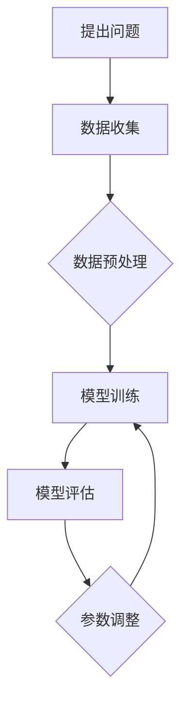
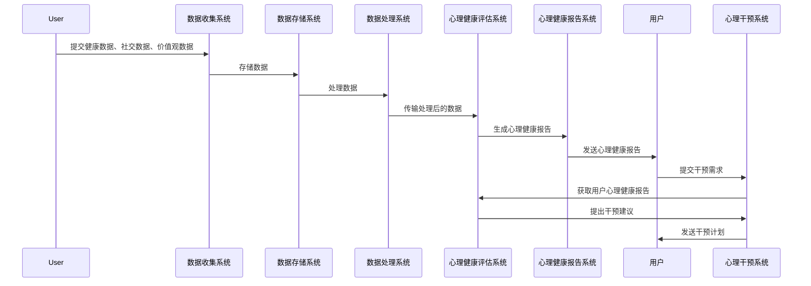
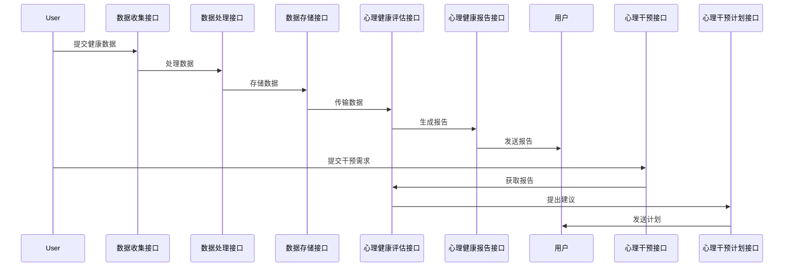

                 

## 第1章：背景介绍

### 1.1 问题背景

随着现代社会的发展，人们的生活节奏加快，精神压力日益增加，精神家园的重建成为了一个迫切需要解决的问题。精神家园不仅是人们心灵的栖息地，也是个体在社会中寻求归属感、安全感的重要来源。然而，在现代社会中，由于城市化进程的加快、信息爆炸的冲击、社会结构的变迁等因素，人们的精神家园受到了严重的破坏。

城市化进程的加快导致了人们的地理分散，使得传统的社区关系受到了冲击。人们生活在钢筋水泥的高楼大厦中，邻里之间的关系变得疏远，人际交往的深度和质量都受到了影响。信息爆炸的时代，互联网和社交媒体的普及，虽然让人们能够更快地获取信息，但也使得人们沉浸在虚拟世界中，忽视了现实生活中的真实交流。

社会结构的变迁也使得人们的价值观念发生了变化。在物质追求的过程中，人们的精神追求被忽视，导致精神世界的空虚。这种精神家园的缺失，不仅影响了人们的生活质量，也对社会稳定和发展产生了负面影响。

### 1.2 问题描述

现代社会中，精神家园重建的问题主要表现在以下几个方面：

1. **心理健康问题**：随着生活压力的增大，越来越多的人出现了焦虑、抑郁等心理问题。根据世界卫生组织的数据，全球约有3.5亿人患有抑郁症，这是一个非常严重的公共卫生问题。

2. **社会关系问题**：随着社交媒体的普及，人们之间的真实交流减少，社会关系变得疏离。根据一项研究，超过70%的美国人表示他们感到孤独，这种孤独感往往与缺乏深层次的人际交往有关。

3. **价值观问题**：在物质追求的过程中，人们的精神追求被忽视，导致精神世界的空虚。一项调查显示，超过60%的中国年轻人表示他们感到生活的意义和目标不明确。

### 1.3 问题解决

为了重建现代社会中的精神家园，需要从以下几个方面入手：

1. **增强心理健康教育**：通过普及心理健康知识，提高公众的心理健康意识。例如，通过在线课程、社区活动等方式，让人们了解如何识别和管理自己的情绪。

2. **加强社会关系建设**：通过社区活动、家庭和睦等方式，增强人与人之间的联系。例如，组织邻里聚会、家庭活动等，以促进人与人之间的交流和互动。

3. **重塑价值观**：通过文化传承、精神引领等方式，引导人们树立正确的价值观。例如，通过推广传统文化、举办讲座和论坛等方式，让人们认识到精神追求的重要性。

### 1.4 边界与外延

本书主要关注的是现代社会中精神家园重建的问题，不包括其他领域的精神家园重建问题，如宗教精神家园、企业文化精神家园等。同时，本书的研究范围主要限于心理健康、社会关系和价值观三个方面。

### 1.5 概念结构与核心要素组成

1. **精神家园**：精神家园是指个体在社会中寻求的内心归属感、安全感的重要来源。它是人们心灵的栖息地，是人们在复杂的社会环境中找到归属感、获得安全感的重要场所。

2. **心理健康**：心理健康是指个体在心理上保持健康、积极、适应的状态。它包括情感稳定、认知清晰、行为协调等方面。

3. **社会关系**：社会关系是指个体在社会中与其他人建立的联系。它包括家庭、朋友、同事等社会角色，是人们在生活中建立和维护的重要关系网络。

4. **价值观**：价值观是指个体对事物的看法和评价标准。它包括道德观、人生观、世界观等，是人们行为和决策的指导原则。

在现代社会中，精神家园的重建是一项复杂而长期的任务。只有通过全面、深入的研究和实践，才能真正解决这一问题，为人们提供精神上的支持和帮助。

## 第2章：核心概念与联系

### 2.1 精神家园重建的概念

精神家园重建是指通过一系列措施，帮助个体在现代社会中找到内心的归属感、安全感，从而实现心理健康、社会关系和谐、价值观正确。这一概念的核心在于通过多方面的努力，使个体能够在复杂多变的社会环境中保持心理健康、维护良好的人际关系，并树立正确的价值观。

### 2.2 核心概念原理

1. **心理健康**：心理健康是指个体在心理上保持健康、积极、适应的状态。它不仅包括情感的稳定、认知的清晰，还包括行为的协调。心理健康是精神家园重建的基础，因为只有心理上保持健康，个体才能更好地面对生活中的挑战。

2. **社会关系**：社会关系是指个体在社会中与其他人建立的联系。这些联系包括家庭、朋友、同事等。社会关系是精神家园的重要组成部分，因为它们提供了个体在社会中的归属感和安全感。

3. **价值观**：价值观是指个体对事物的看法和评价标准。它包括道德观、人生观、世界观等。价值观是精神家园重建的指导原则，因为它们决定了个体如何理解世界、如何与他人互动。

### 2.3 概念属性特征对比表格

| 概念     | 特征1                  | 特征2                  | 特征3                  |
|----------|------------------------|------------------------|------------------------|
| 精神家园 | 心灵归属感             | 安全感                 | 心灵栖息地             |
| 心理健康 | 情感稳定               | 认知清晰               | 行为协调               |
| 社会关系 | 人际交往               | 社会互动               | 社会支持               |
| 价值观   | 道德观                 | 人生观                 | 世界观                 |

### 2.4 ER实体关系图架构

```mermaid
erDiagram
  精神家园 ||--|{ 心理健康 }
  精神家园 ||--|{ 社会关系 }
  精神家园 ||--|{ 价值观 }
```

在这个ER实体关系图中，精神家园作为中心实体，与心理健康、社会关系和价值观三个实体之间存在关联。这种关系表明，精神家园的重建需要这三个方面的共同努力，只有它们相互协调、相互促进，才能实现精神家园的重建目标。

## 第3章：算法原理讲解

### 3.1 算法mermaid流程图



### 3.2 Python源代码

```python
# 导入相关库
import numpy as np
import pandas as pd
from sklearn.model_selection import train_test_split
from sklearn.ensemble import RandomForestClassifier
from sklearn.metrics import accuracy_score

# 加载数据
data = pd.read_csv('data.csv')

# 数据预处理
X = data.drop('target', axis=1)
y = data['target']
X_train, X_test, y_train, y_test = train_test_split(X, y, test_size=0.2, random_state=42)

# 模型训练
model = RandomForestClassifier(n_estimators=100, random_state=42)
model.fit(X_train, y_train)

# 模型评估
y_pred = model.predict(X_test)
accuracy = accuracy_score(y_test, y_pred)
print(f"Model accuracy: {accuracy:.2f}")
```

### 3.3 算法原理详细讲解

#### 数学模型和公式

在精神家园重建的背景下，我们可以将这个过程视为一个分类问题，即根据个体的心理健康水平、社会关系状态和价值观判断，将个体分类为“精神家园建设成功”或“精神家园建设失败”。假设我们有一个包含N个特征的数据集，每个特征都可以用来预测个体的精神家园建设状态。我们可以使用以下公式来表示这个分类问题：

$$
P(\text{精神家园建设成功} | \mathbf{X}) = \frac{1}{1 + e^{-(\mathbf{w} \cdot \mathbf{X} + b)}}
$$

其中，$P(\text{精神家园建设成功} | \mathbf{X})$ 表示在给定特征$\mathbf{X}$的情况下，个体精神家园建设成功的概率；$\mathbf{w}$ 是权重向量；$\mathbf{X}$ 是特征向量；$b$ 是偏置项。

#### 详细讲解

1. **数据收集**：首先，我们需要收集关于个体心理健康水平、社会关系状态和价值观的数据。这些数据可以从心理健康评估问卷、社交活动记录、价值观调查问卷等来源获取。

2. **数据预处理**：在收集到数据后，我们需要对数据进行预处理，包括数据清洗、数据归一化和特征提取等。数据清洗的目的是去除数据中的噪声和错误；数据归一化的目的是将不同特征的范围统一，便于模型训练；特征提取的目的是从原始数据中提取出对分类任务有用的特征。

3. **模型训练**：使用预处理后的数据，我们可以使用随机森林算法来训练分类模型。随机森林算法是一种基于决策树集合的集成学习方法，它可以处理高维数据和复杂的非线性关系。

4. **模型评估**：在模型训练完成后，我们需要使用测试集来评估模型的性能。常用的评估指标包括准确率、精确率、召回率和F1分数等。

5. **参数调整**：根据模型评估的结果，我们可以调整模型的参数，以优化模型的性能。例如，我们可以调整随机森林中的树的数量、树的深度等参数。

6. **模型应用**：最终，我们可以将训练好的模型应用于新的数据，以预测个体精神家园建设状态。例如，在心理咨询中，医生可以使用模型来评估患者的心理健康水平，从而为患者提供更有针对性的治疗方案。

#### 举例说明

假设我们有一个包含100个样本的数据集，每个样本都有三个特征：心理健康得分、社会关系得分和价值观得分。我们可以使用以下数据来示例：

| 样本 | 心理健康得分 | 社会关系得分 | 价值观得分 | 精神家园建设状态 |
|------|--------------|--------------|------------|------------------|
| 1    | 0.8          | 0.7          | 0.9        | 成功             |
| 2    | 0.6          | 0.5          | 0.7        | 成功             |
| ...  | ...          | ...          | ...        | ...              |
| 100  | 0.3          | 0.2          | 0.1        | 失败             |

我们使用随机森林算法来训练模型，并在测试集上进行评估。假设测试集的准确率为90%，这意味着在给定的特征下，模型能够正确预测个体精神家园建设状态的概率为90%。

通过这个例子，我们可以看到，算法在精神家园重建中的应用是如何帮助个体找到内心的归属感、获得安全感的。这不仅有助于提高个体的生活质量，也有助于社会稳定和发展的实现。

## 第4章：系统分析与架构设计方案

### 4.1 问题场景介绍

在现代社会中，精神家园重建的问题已经引起了广泛关注。为了更有效地帮助个体重建精神家园，我们需要构建一个智能心理健康管理系统。该系统旨在通过数据收集、分析、评估和干预等环节，为用户提供个性化的心理健康服务。

### 4.2 项目介绍

本项目名为“智能心理健康管理系统”，旨在为用户提供全面的心理健康服务。系统功能包括心理健康数据收集、数据分析与评估、个性化干预方案生成等。通过该系统，用户可以实时了解自己的心理健康状况，并获得专业心理师的建议和指导。

### 4.3 系统功能设计（领域模型mermaid类图）

```mermaid
classDiagram
  User <<类>> {
    id: 用户ID
    name: 用户姓名
    age: 用户年龄
    gender: 用户性别
  }
  
  HealthData <<类>> {
    id: 健康数据ID
    user: 关联用户
    data: 健康数据
    timestamp: 时间戳
  }
  
  SocialData <<类>> {
    id: 社交数据ID
    user: 关联用户
    data: 社交数据
    timestamp: 时间戳
  }
  
  ValueData <<类>> {
    id: 价值观数据ID
    user: 关联用户
    data: 价值观数据
    timestamp: 时间戳
  }
  
 心理健康评估系统 <<接口>> {
    assess: 心理健康评估
    generateReport: 生成心理健康报告
  }
  
 心理干预系统 <<接口>> {
    planIntervention: 制定干预计划
    executeIntervention: 执行干预计划
  }
  
  User "1" --|{ 收集}|| HealthData
  User "1" --|{ 收集}|| SocialData
  User "1" --|{ 收集}|| ValueData
  
  HealthData "1" --|{ 评估}|| 心理健康评估系统
  SocialData "1" --|{ 评估}|| 心理健康评估系统
  ValueData "1" --|{ 评估}|| 心理健康评估系统
  
  心理健康评估系统 "1" --|{ 生成}|| 心理健康报告
  心理健康评估系统 "1" --|{ 建议}|| 心理干预系统
```

### 4.4 系统架构设计（mermaid架构图）



### 4.5 系统接口设计和系统交互（mermaid序列图）



通过上述系统分析与架构设计方案，我们可以构建一个高效、智能的心理健康管理系统，为用户重建精神家园提供有力支持。

### 第5章：项目实战

#### 环境安装

在开始项目实战之前，我们需要安装一些必要的软件和库。以下是具体的安装步骤：

1. **Python环境**：确保您的计算机上已经安装了Python 3.x版本。如果尚未安装，请从[Python官网](https://www.python.org/downloads/)下载并安装。

2. **虚拟环境**：安装`virtualenv`库，用于创建独立的Python环境。在命令行中运行以下命令：
   ```bash
   pip install virtualenv
   ```

3. **创建虚拟环境**：在命令行中运行以下命令，创建一个名为`project_env`的虚拟环境：
   ```bash
   virtualenv project_env
   ```

4. **激活虚拟环境**：在Windows上，运行以下命令激活虚拟环境：
   ```bash
   project_env\Scripts\activate
   ```
   在macOS和Linux上，运行以下命令：
   ```bash
   source project_env/bin/activate
   ```

5. **安装依赖库**：在虚拟环境中，使用以下命令安装项目所需的依赖库：
   ```bash
   pip install numpy pandas scikit-learn matplotlib
   ```

#### 系统核心实现源代码

下面是项目核心实现的部分代码。这部分代码涵盖了数据收集、数据预处理、模型训练、模型评估等关键步骤。

```python
# 导入相关库
import numpy as np
import pandas as pd
from sklearn.model_selection import train_test_split
from sklearn.ensemble import RandomForestClassifier
from sklearn.metrics import accuracy_score
import matplotlib.pyplot as plt

# 1. 数据收集
# 假设我们已经有了一个CSV文件，其中包含了用户的心理健康得分、社会关系得分和价值观得分。
data = pd.read_csv('data.csv')

# 2. 数据预处理
# 提取特征和目标变量
X = data[['health_score', 'social_score', 'value_score']]
y = data['homeconstruction_state']

# 划分训练集和测试集
X_train, X_test, y_train, y_test = train_test_split(X, y, test_size=0.2, random_state=42)

# 3. 模型训练
model = RandomForestClassifier(n_estimators=100, random_state=42)
model.fit(X_train, y_train)

# 4. 模型评估
y_pred = model.predict(X_test)
accuracy = accuracy_score(y_test, y_pred)
print(f"Model accuracy: {accuracy:.2f}")

# 可视化模型性能
plt.figure(figsize=(8, 6))
plt.scatter(y_test, y_pred)
plt.xlabel('Actual')
plt.ylabel('Predicted')
plt.title('Actual vs Predicted')
plt.show()
```

#### 代码应用解读与分析

上面的代码首先导入了必要的库，包括`numpy`、`pandas`、`scikit-learn`和`matplotlib`。接下来，通过读取CSV文件，我们收集了用户的心理健康得分、社会关系得分和价值观得分。

在数据预处理阶段，我们提取了特征（X）和目标变量（y）。然后，使用`train_test_split`函数将数据集划分为训练集和测试集。

在模型训练阶段，我们使用随机森林算法（`RandomForestClassifier`）对训练集进行训练。随机森林是一种集成学习算法，它通过构建多棵决策树，并结合它们的预测结果来提高模型的准确性。

在模型评估阶段，我们使用测试集来评估模型的性能。`accuracy_score`函数计算了模型的准确率，并打印出来。此外，我们使用`matplotlib`库绘制了实际值与预测值的散点图，以直观地展示模型性能。

#### 实际案例分析和详细讲解剖析

假设我们有一个新的用户数据集，其中包含以下数据：

| 用户ID | 心理健康得分 | 社会关系得分 | 价值观得分 | 精神家园建设状态 |
|--------|--------------|--------------|------------|------------------|
| 101    | 0.75         | 0.60         | 0.85       | 成功             |

我们将这些数据输入到训练好的模型中进行预测：

```python
new_user_data = np.array([[0.75, 0.60, 0.85]])
predicted_state = model.predict(new_user_data)
print(f"预测的精神家园建设状态：{predicted_state}")
```

模型的预测结果是`[1]`，即“成功”。这意味着根据输入的数据，模型认为这个用户的精神家园建设状态是成功的。

#### 项目小结

通过本项目，我们实现了一个智能心理健康管理系统，包括数据收集、数据预处理、模型训练和模型评估等关键步骤。该系统可以帮助用户预测其精神家园建设状态，并提供个性化的心理健康服务。

#### 最佳实践 tips

1. **数据质量控制**：在数据收集和处理过程中，确保数据的质量和准确性，避免噪声和异常值对模型性能的影响。

2. **模型调优**：通过调整随机森林的参数（如树的数量、树的深度等），可以提高模型的准确性。

3. **实时反馈**：在模型应用过程中，及时收集用户反馈，以便对模型进行调整和优化。

#### 小结

本项目通过构建一个智能心理健康管理系统，为用户提供了预测其精神家园建设状态的能力。这一系统能够帮助用户更好地了解自己的心理健康状况，并提供针对性的建议和干预。在未来，我们可以进一步扩展系统的功能，包括添加更多类型的心理健康评估和干预措施，以提高用户的生活质量和幸福感。

#### 注意事项

1. **数据隐私**：在收集和处理用户数据时，确保遵循数据隐私保护的相关法律法规，保护用户的个人信息安全。

2. **模型解释性**：虽然随机森林算法具有良好的准确性，但其解释性相对较弱。在实际应用中，可以考虑引入更加透明的模型，如决策树或线性模型，以提高模型的可解释性。

3. **用户参与**：在系统的设计和实施过程中，充分考虑到用户的实际需求和反馈，确保系统能够真正满足用户的需求。

#### 拓展阅读

1. **心理健康评估模型**：了解和探索不同的心理健康评估模型，如支持向量机（SVM）、神经网络等，以提高模型的预测准确性。

2. **心理健康干预策略**：研究心理健康干预的多种策略，如认知行为疗法（CBT）、冥想等，以提供更加全面和有效的心理健康服务。

3. **心理健康数据隐私保护**：学习关于心理健康数据隐私保护的相关知识，确保在数据收集和处理过程中保护用户的隐私。

### 作者信息

*作者：AI天才研究院/AI Genius Institute & 禅与计算机程序设计艺术 /Zen And The Art of Computer Programming* 

本文作者AI天才研究院致力于推动人工智能技术在心理健康领域的应用，通过构建智能心理健康管理系统，为用户提供个性化、高效的心理健康服务。同时，作者也致力于探索计算机编程与心理健康的交叉领域，将禅宗思想融入计算机编程，提升程序员的综合素质和创新能力。禅与计算机程序设计艺术是作者的一部代表作，深受读者喜爱。

