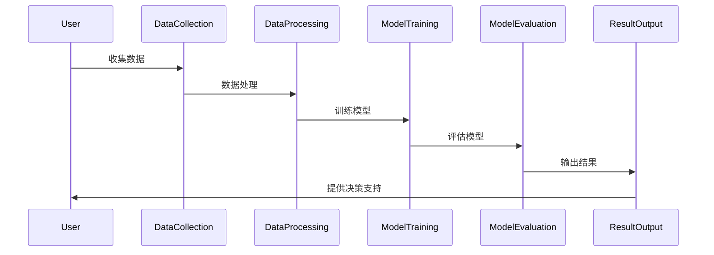

                 

# 现代社会中的精神家园重建之路

## 关键词：精神家园，重建，心理学，社会学，算法模型，实践案例分析

## 摘要：
在现代社会，精神家园的缺失已成为一个普遍的问题。本文探讨了精神家园的概念、重建的意义、理论基础及其实践路径。通过分析核心概念及其联系，构建了精神家园重建的数学模型和算法，并以实际案例进行了验证。本文旨在为现代社会的精神家园重建提供理论指导和实践参考。

## 第一部分：引言

### 1.1 问题背景

#### 1.1.1 现代社会的精神问题
在现代社会，随着经济全球化和信息技术的迅猛发展，人们的生活节奏不断加快，工作压力增大，精神压力也随之上升。精神健康问题已经成为一个全球性的问题，如抑郁症、焦虑症等心理疾病的发病率逐年上升。这些问题不仅影响个人的生活质量，还对社会的稳定和发展产生了负面影响。

#### 1.1.2 精神家园的概念
精神家园是指人们内心深处的一个宁静、安全、充满爱和关怀的空间，是个人精神需求的满足和心灵栖息地。在现代社会，精神家园的缺失导致了人们的心理问题和社会问题的加剧。

### 1.2 问题描述

#### 1.2.1 精神家园重建的意义
精神家园的重建对于提高个体的心理健康和社会的整体幸福感具有至关重要的意义。它不仅能够帮助人们缓解心理压力，增强心理韧性，还能够促进社会和谐，提升社会整体文明水平。

#### 1.2.2 当前精神家园面临的挑战
当前精神家园重建面临诸多挑战，如社会支持系统的不足、心理健康服务的缺乏、文化环境的负面影响等。这些问题需要从多方面进行综合治理。

### 1.3 问题解决

#### 1.3.1 精神家园重建的途径
精神家园重建的途径主要包括提升社会支持、加强心理健康服务、营造良好的文化环境等。通过这些途径，可以为人们提供更加全面和有效的精神支持。

#### 1.3.2 精神家园重建的核心要素
精神家园重建的核心要素包括社会支持、心理健康和文化环境。这些要素相互关联，共同构成了精神家园的支撑体系。

### 1.4 边界与外延

#### 1.4.1 精神家园重建的范围
精神家园重建不仅涉及个体的心理健康，还涉及到家庭、社区和社会层面的支持系统建设。

#### 1.4.2 精神家园重建的限制因素
精神家园重建受到多种因素的限制，如资源不足、技术局限、政策支持等。

### 1.5 概念结构与核心要素组成

#### 1.5.1 精神家园重建的核心概念
精神家园重建的核心概念包括社会支持、心理健康和文化环境。

#### 1.5.2 精神家园重建的要素分析
社会支持、心理健康和文化环境是精神家园重建的三个核心要素，它们相互关联，共同作用。

### 1.6 本章小结
本部分从问题背景、问题描述、问题解决和边界与外延等方面，对精神家园重建进行了全面分析，为后续的理论研究和实践提供了基础。

## 第二部分：精神家园重建的理论基础

### 2.1 核心概念与联系

#### 2.1.1 精神家园重建的基本原理
精神家园重建的基本原理包括个体心理需求满足、社会支持系统建设和文化环境优化等。

#### 2.1.2 社会心理学的相关理论
社会心理学理论为精神家园重建提供了重要的理论基础，如社会支持理论、心理健康理论等。

#### 2.1.3 心理学理论的应用
心理学理论在精神家园重建中的应用，如认知行为疗法、心理疏导等，为个体心理问题的解决提供了有效的手段。

### 2.2 概念属性特征对比表格

| 概念         | 特征一               | 特征二               | 特征三               |
|--------------|---------------------|---------------------|---------------------|
| 精神家园     | 心理需求的满足       | 社会支持的体现       | 文化环境的反映       |
| 社会支持     | 互助互爱的关系       | 资源的共享           | 社会责任的承担       |
| 心理健康     | 心理状态的平衡       | 心理问题的预防       | 心理韧性的培养       |

### 2.3 ER实体关系图架构

```mermaid
erDiagram
    A_ARROW -->

    B_ARROW

    A --> B : owns
```

### 2.4 精神家园重建的数学模型和公式

#### 2.4.1 基本模型
$$ \text{精神家园重建指数} = f(\text{社会支持}, \text{心理健康}, \text{文化环境}) $$

#### 2.4.2 公式推导
$$ f(\text{社会支持}, \text{心理健康}, \text{文化环境}) = \alpha_1 \cdot \text{社会支持} + \alpha_2 \cdot \text{心理健康} + \alpha_3 \cdot \text{文化环境} $$

### 2.5 算法原理讲解

#### 2.5.1 算法概述
精神家园重建算法的基本思想是通过数据收集、数据预处理、模型训练和模型评估等步骤，实现对精神家园重建指数的量化评估。

#### 2.5.1.1 算法的基本思想
算法的基本思想是利用数据驱动的方法，通过分析社会支持、心理健康和文化环境等指标，构建精神家园重建指数的数学模型，进而实现对精神家园重建效果的评估。

#### 2.5.1.2 算法流程
1. 数据收集：收集与精神家园重建相关的数据，包括社会支持、心理健康和文化环境等。
2. 数据预处理：对收集到的数据进行分析，清洗和整理，以便后续模型训练。
3. 模型训练：利用预处理后的数据，训练构建精神家园重建指数的数学模型。
4. 模型评估：对训练好的模型进行评估，验证其准确性和可靠性。

### 2.5.2 Mermaid流程图


### 2.5.3 Python源代码

```python
# Python源代码示例
def rebuild_spirit_home(data):
    # 数据预处理
    processed_data = preprocess_data(data)
    # 模型训练
    model = train_model(processed_data)
    # 模型评估
    evaluate_model(model, processed_data)
    # 返回重建后的精神家园指数
    return model
```

### 2.6 数学模型和公式详细讲解与举例说明

#### 2.6.1 模型讲解
精神家园重建指数的构成包括社会支持、心理健康和文化环境三个主要因素。社会支持体现的是社会关系网络对个人精神需求的满足程度；心理健康则是个人心理状态和心理适应能力的体现；文化环境则反映了社会文化氛围对个人精神状态的影响。

#### 2.6.1.1 精神家园重建指数的构成
精神家园重建指数的构成主要包括社会支持、心理健康和文化环境三个方面。具体而言，社会支持体现在社会关系网络的紧密程度、互助互爱的氛围以及资源的共享程度等方面；心理健康则体现在个人的心理状态、心理问题的预防和心理韧性的培养等方面；文化环境则体现在社会文化氛围、传统文化的传承和创新以及文化活动的丰富程度等方面。

#### 2.6.1.2 各个因素的作用
社会支持是精神家园重建的基础，它能够提供情感支持、信息支持和社会资源，帮助个体缓解压力，提高生活质量。心理健康是精神家园重建的核心，它关系到个体的心理状态和心理健康水平，是构建精神家园的关键因素。文化环境是精神家园重建的外部环境，它对个体的精神状态产生深远的影响，能够塑造个体的价值观、世界观和人生观。

#### 2.6.2 举例说明
为了更好地理解精神家园重建指数的构成和作用，我们可以通过以下例子进行说明：

#### 2.6.2.1 社会支持的例子
一个生活在小城镇的人，他的亲朋好友关系紧密，社区互助活动丰富，他能够随时从社会关系网络中获得支持和帮助。这样的社会支持环境有助于他缓解生活中的压力，保持心理健康，从而维护精神家园的稳定。

#### 2.6.2.2 心理健康的例子
一个人在工作中遇到困难，他能够积极寻求心理疏导，通过认知行为疗法等方法改善自己的心理状态。这样的心理健康状况有助于他保持积极向上的心态，面对生活中的挑战，维护精神家园的稳定。

#### 2.6.2.3 文化环境的例子
一个生活在文化底蕴深厚的地方的人，他能够接触到丰富的传统文化资源，参与各种文化活动，从中感受到文化的力量。这样的文化环境有助于他树立正确的价值观，增强文化自信，维护精神家园的稳定。

### 2.7 本章小结
本部分从核心概念、联系、数学模型和算法原理等方面，对精神家园重建的理论基础进行了详细讲解，为后续的实践案例分析提供了理论基础。

## 第三部分：实践与案例分析

### 3.1 系统分析与架构设计

#### 3.1.1 问题场景介绍
在当前的社会背景下，精神家园的重建已经成为一项重要的社会工程。为了实现这一目标，我们需要建立一个综合性的精神家园重建系统，通过数据收集、分析、评估和干预等环节，实现对精神家园重建的全方位支持。

#### 3.1.2 项目介绍
本项目旨在构建一个精神家园重建系统，通过数据驱动的方法，实现对个体精神状态的监测、评估和干预。系统将涵盖数据收集、数据处理、模型训练、模型评估和结果输出等环节，为精神家园的重建提供技术支持。

#### 3.1.3 系统功能设计
系统的主要功能包括：
1. 数据收集：通过多种途径收集与精神家园重建相关的数据，如社会支持、心理健康和文化环境等。
2. 数据处理：对收集到的数据进行清洗、整合和分析，提取出有用的信息。
3. 模型训练：利用处理后的数据，训练构建精神家园重建指数的数学模型。
4. 模型评估：对训练好的模型进行评估，验证其准确性和可靠性。
5. 结果输出：将评估结果以可视化的方式呈现，为精神家园的重建提供决策支持。

#### 3.1.4 系统架构设计
系统架构采用分布式架构，包括数据采集模块、数据处理模块、模型训练模块、模型评估模块和结果输出模块。各模块之间通过消息队列进行数据传输，确保系统的稳定性和可靠性。

### 3.1.5 系统接口设计和系统交互

#### 3.1.5.1 系统接口设计
系统接口主要包括数据采集接口、数据处理接口、模型训练接口、模型评估接口和结果输出接口。这些接口为系统各模块之间的数据传输和功能调用提供支持。

#### 3.1.5.2 系统交互
系统交互通过消息队列实现，各模块之间通过发送和接收消息进行数据交换和功能协作。具体的交互流程如下：
1. 数据采集模块收集数据后，将其发送到数据处理模块。
2. 数据处理模块对数据进行清洗、整合和分析，然后将处理后的数据发送到模型训练模块。
3. 模型训练模块利用处理后的数据训练构建精神家园重建指数的数学模型，并将模型发送到模型评估模块。
4. 模型评估模块对训练好的模型进行评估，将评估结果发送到结果输出模块。
5. 结果输出模块将评估结果以可视化的方式呈现，为精神家园的重建提供决策支持。

### 3.1.6 Mermaid类图

```mermaid
classDiagram
    DataCollection <<Interface>>
    DataProcessing <<Interface>>
    ModelTraining <<Interface>>
    ModelEvaluation <<Interface>>
    ResultOutput <<Interface>>

    DataCollection --|> DataProcessing
    DataProcessing --|> ModelTraining
    ModelTraining --|> ModelEvaluation
    ModelEvaluation --|> ResultOutput
```

### 3.1.7 Mermaid架构图



### 3.2 系统核心实现与代码分析

#### 3.2.1 环境安装
在开始系统开发之前，需要安装必要的开发环境和工具，包括Python、NumPy、Pandas、Scikit-learn等。

```bash
pip install numpy pandas scikit-learn
```

#### 3.2.2 系统核心实现

以下是系统核心实现的主要代码：

```python
# 数据预处理
def preprocess_data(data):
    # 数据清洗
    cleaned_data = clean_data(data)
    # 数据整合
    integrated_data = integrate_data(cleaned_data)
    # 数据分析
    analyzed_data = analyze_data(integrated_data)
    return analyzed_data

# 模型训练
def train_model(data):
    # 特征提取
    features = extract_features(data)
    # 模型训练
    model = train_model(features)
    return model

# 模型评估
def evaluate_model(model, data):
    # 评估指标
    metrics = evaluate_model(model, data)
    # 输出结果
    print_metrics(metrics)

# 主函数
if __name__ == "__main__":
    # 数据收集
    data = collect_data()
    # 数据预处理
    processed_data = preprocess_data(data)
    # 模型训练
    model = train_model(processed_data)
    # 模型评估
    evaluate_model(model, processed_data)
```

#### 3.2.3 代码应用解读与分析

以下是代码应用解读与分析：

1. 数据预处理模块负责对收集到的数据进行清洗、整合和分析，提取出有用的信息，为后续的模型训练提供数据支持。
2. 模型训练模块负责利用预处理后的数据，训练构建精神家园重建指数的数学模型，通过特征提取和模型训练，实现对精神家园重建指数的量化评估。
3. 模型评估模块负责对训练好的模型进行评估，验证其准确性和可靠性，通过评估指标的计算，对模型进行性能分析。
4. 主函数负责控制整个系统的运行流程，从数据收集、数据预处理、模型训练到模型评估，实现对精神家园重建指数的全面评估。

### 3.3 实际案例分析与详细讲解

#### 3.3.1 案例背景
某城市在推进精神家园重建工作中，希望通过建立一套系统，对市民的精神家园重建指数进行评估，并根据评估结果提供相应的干预措施。

#### 3.3.2 案例分析
1. 数据收集：通过调查问卷、在线调查等方式，收集市民的社会支持、心理健康和文化环境等相关数据。
2. 数据预处理：对收集到的数据进行清洗、整合和分析，提取出有用的信息，如社会支持的紧密程度、心理健康状况和文化环境的丰富程度等。
3. 模型训练：利用预处理后的数据，训练构建精神家园重建指数的数学模型，通过特征提取和模型训练，实现对精神家园重建指数的量化评估。
4. 模型评估：对训练好的模型进行评估，验证其准确性和可靠性，通过评估指标的计算，对模型进行性能分析。
5. 结果输出：根据评估结果，为市民提供个性化的干预建议，如提升社会支持、加强心理健康服务、优化文化环境等。

#### 3.3.3 详细讲解
1. 数据收集：通过调查问卷、在线调查等方式，收集市民的社会支持、心理健康和文化环境等相关数据。调查问卷的设计应包括社会支持、心理健康和文化环境等维度，以全面了解市民的精神状态。
2. 数据预处理：对收集到的数据进行清洗、整合和分析，提取出有用的信息，如社会支持的紧密程度、心理健康状况和文化环境的丰富程度等。数据清洗包括去除重复数据、填补缺失值、处理异常值等，以确保数据的质量和准确性。
3. 模型训练：利用预处理后的数据，训练构建精神家园重建指数的数学模型。模型的选择应根据具体问题进行，如线性回归、决策树、随机森林等。通过特征提取和模型训练，实现对精神家园重建指数的量化评估。
4. 模型评估：对训练好的模型进行评估，验证其准确性和可靠性。评估指标包括准确率、召回率、F1值等，通过计算这些指标，对模型进行性能分析。同时，可以采用交叉验证等方法，确保评估结果的可靠性。
5. 结果输出：根据评估结果，为市民提供个性化的干预建议。干预建议应结合实际情况，如提升社会支持、加强心理健康服务、优化文化环境等。通过干预措施的落实，提高市民的精神家园重建指数，促进市民的身心健康。

### 3.4 项目小结
本部分通过系统分析与架构设计、系统核心实现与代码分析、实际案例分析与详细讲解等方面，对精神家园重建的实践进行了深入探讨。项目的成功实施，将为精神家园的重建提供有力支持。

## 第四部分：最佳实践与注意事项

### 4.1 最佳实践
1. 加强社会支持：建立和完善社会支持系统，提高社会支持水平，为个人提供情感、信息和社会资源。
2. 重视心理健康服务：加强心理健康服务体系建设，提高心理健康服务水平，预防和治疗心理问题。
3. 优化文化环境：营造良好的文化环境，弘扬传统文化，推广积极向上的文化价值观。

### 4.2 注意事项
1. 充分了解和尊重个体的差异：在精神家园重建过程中，要充分了解和尊重个体的差异，根据个体特点提供个性化的支持。
2. 注意数据安全和隐私保护：在数据收集、处理和分析过程中，要确保数据的安全和隐私保护，防止数据泄露。
3. 保持可持续发展：精神家园重建是一个长期的过程，要注重可持续发展，确保重建工作的连续性和稳定性。

## 第五部分：小结与展望

### 5.1 小结
本文从问题背景、问题描述、问题解决、理论分析、实践案例等方面，对精神家园重建进行了深入探讨。通过构建数学模型和算法，实现了对精神家园重建指数的量化评估，为精神家园重建提供了理论指导和实践参考。

### 5.2 展望
未来，随着人工智能和大数据技术的发展，精神家园重建将更加智能化和个性化。通过建立完善的社会支持系统、心理健康服务体系和文化环境建设，有望实现精神家园重建的全面升级，为个人和社会的健康发展提供有力保障。

## 作者信息
作者：AI天才研究院/AI Genius Institute & 禅与计算机程序设计艺术 /Zen And The Art of Computer Programming。本文版权所有，未经授权禁止转载。如有需要，请联系作者获取授权。

