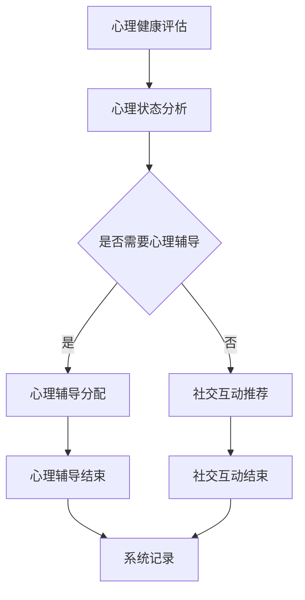

                 

### 《现代社会中的精神家园重建工程》

#### 关键词：
1. 现代社会
2. 精神家园
3. 重建工程
4. 心理健康
5. 社会工程
6. 技术应用
7. 算法原理

#### 摘要：
在现代社会中，精神健康问题日益凸显，精神空虚、焦虑、抑郁等成为普遍现象。本文旨在提出一个创新性的解决方案——精神家园重建工程。通过系统的分析和深入的探讨，本文将详细阐述精神家园的概念、构建原则、方法与策略，并借助现代技术手段，如算法原理、系统架构设计等，探讨实现精神家园重建的具体路径。文章还将结合实际项目经验，提供环境安装、核心实现、代码分析等方面的实战指南，旨在为现代社会中精神家园的重建提供理论和实践支持。

### 第一部分：背景与核心概念

#### 第1章：现代社会精神困境概述

##### 1.1 现代社会精神困境的表现

现代社会中，精神健康问题已经成为一个全球性的挑战。随着经济快速发展、社会结构变迁和生活方式的改变，越来越多的人感受到精神上的压力和困扰。具体表现在以下几个方面：

1. **精神空虚**：随着物质生活的丰富，人们内心却感到越来越空虚，缺乏精神寄托。
2. **焦虑**：生活节奏加快，工作压力增大，导致广泛性的焦虑感。
3. **抑郁**：长时间的精神紧张和压力可能导致抑郁症的发病率上升。
4. **人际关系紧张**：社会网络化程度的提高，虽然增强了人际交往的便捷性，但也带来了孤独感和疏离感。

##### 1.2 精神困境的原因分析

1. **物质主义文化的盛行**：现代社会过度追求物质财富，导致精神追求的淡化。
2. **快节奏的生活方式**：快节奏的生活导致人们缺乏足够的休息和反思时间。
3. **社会结构的变迁**：社会结构的改变，如家庭结构的变化、社会竞争的加剧，增加了个体的心理负担。
4. **信息化和数字化带来的负面影响**：互联网和社交媒体的普及，虽然带来了信息便捷，但也加剧了信息过载和社交焦虑。

##### 1.3 精神家园的概念与意义

精神家园是指个体内心深处的一种精神归属感和安全感，是人们心灵宁静、自我实现和人际关系的和谐状态。重建精神家园的意义在于：

1. **提升心理健康水平**：通过建设精神家园，可以有效缓解焦虑、抑郁等心理问题，提升整体心理健康水平。
2. **增强社会凝聚力**：精神家园的重建有助于加强社会成员之间的联系，增强社会凝聚力。
3. **实现个体价值**：精神家园为个体提供了一个实现自我价值、追求内心平静和成长的环境。

#### 第2章：精神家园的核心概念与联系

##### 2.1 精神家园的定义

精神家园是一个抽象的概念，它不仅仅是一个空间上的概念，更是一个心理上的概念。具体来说，精神家园可以定义为：

- **一个安全、和谐、温暖的空间**：在这个空间里，个体能够感受到内心的平静和安全感。
- **一个自我实现的平台**：个体在这个平台上可以实现自己的价值，追求个人的成长和进步。
- **一个社会关系的网络**：精神家园不仅仅是个体的心理空间，也是一个社会关系的网络，它有助于个体与他人的良好互动。

##### 2.2 精神家园的特征与类型

1. **特征**：
   - **个体化**：每个精神家园都是独特的，反映了个体独特的心理需求和价值观。
   - **动态性**：精神家园是一个动态变化的过程，随着个体成长和环境的改变而不断调整和重建。
   - **综合性**：精神家园不仅仅是心理层面的，还包括社会、文化、环境等多方面的因素。

2. **类型**：
   - **个人精神家园**：个体独自构建的精神家园，反映了个人的内心世界。
   - **社区精神家园**：以社区为单位，通过共同的活动和文化建设形成的精神家园。
   - **组织精神家园**：以组织为单位，通过共同的目标和价值实现的精神家园。

##### 2.3 精神家园的构建要素及其关系

构建精神家园需要以下关键要素：

1. **自我认知**：个体需要对自己的心理状态有深刻的认知，了解自己的需求和价值观。
2. **社会支持**：社区和组织提供的支持，如心理辅导、文化活动和社交互动。
3. **文化传承**：文化传统和价值观的传承，为精神家园提供精神支撑。
4. **自然环境**：良好的自然环境可以为精神家园的构建提供有益的外部条件。

这些要素相互联系，共同构成了精神家园的复杂结构。

#### 第3章：构建精神家园的原则与方法

##### 3.1 构建精神家园的原则

1. **以人为本**：精神家园的构建应以个体的心理健康和幸福为核心。
2. **综合性**：精神家园的构建需要综合多方面的因素，包括个体心理、社会关系、文化传统等。
3. **动态性**：精神家园的构建是一个动态的过程，需要不断调整和适应个体的变化。
4. **可持续性**：精神家园的构建应具有可持续性，能够在长期内持续发挥作用。

##### 3.2 构建精神家园的方法

1. **自我建设**：个体通过自我反思和自我提升，构建自己的精神家园。
2. **社区建设**：社区通过共同的活动和文化建设，形成社区精神家园。
3. **组织建设**：组织通过共同的目标和价值，构建组织精神家园。
4. **技术辅助**：利用现代技术手段，如心理辅导软件、社交网络平台等，为精神家园的构建提供支持。

##### 3.3 精神家园重建的策略

1. **提高心理健康意识**：通过教育和宣传，提高公众对精神健康的认识。
2. **加强社会支持系统**：建立健全的社会支持系统，为精神家园的构建提供保障。
3. **推动文化传承**：保护和传承优秀的文化传统，为精神家园提供精神支撑。
4. **利用技术手段**：利用大数据、人工智能等技术手段，为精神家园的构建提供智能化支持。

### 第二部分：系统分析与架构设计

#### 第4章：精神家园重建系统设计

##### 4.1 问题场景介绍

在现代社会中，精神健康问题已经成为一个全球性的挑战。随着经济快速发展、社会结构变迁和生活方式的改变，越来越多的人感受到精神上的压力和困扰。为了解决这一问题，我们需要构建一个系统化的精神家园重建工程，通过技术手段和科学方法，为个体提供心理健康支持和社区互动平台。

##### 4.2 系统功能设计

精神家园重建系统应具备以下功能：

1. **心理健康评估**：为个体提供心理健康评估服务，帮助个体了解自己的心理状态。
2. **心理辅导**：为需要心理辅导的个体提供专业的心理咨询服务。
3. **社交互动**：为个体提供一个社交互动平台，促进社区成员之间的交流和互助。
4. **文化传承**：为个体提供文化活动和资源，促进文化传承和价值观的认同。
5. **技术支持**：利用大数据、人工智能等技术手段，为精神家园的构建提供智能化支持。

##### 4.3 系统架构设计

精神家园重建系统的架构设计应考虑以下几个方面：

1. **数据层**：数据层负责存储和管理个体心理健康数据、社区活动数据、文化传承资源等。
2. **逻辑层**：逻辑层负责实现心理健康评估、心理辅导、社交互动、文化传承等功能，通过算法和模型为用户提供个性化服务。
3. **表现层**：表现层负责为用户提供一个友好、易用的交互界面，支持用户进行心理健康评估、咨询、社交互动等操作。

##### 4.4 系统接口设计

精神家园重建系统应设计以下接口：

1. **用户接口**：用户可以通过网页、移动端应用等途径访问系统，进行心理健康评估、咨询、社交互动等操作。
2. **API接口**：系统应提供API接口，支持与其他系统和平台的数据交互和功能集成。
3. **管理接口**：系统管理员可以通过管理接口对用户数据、社区活动、文化资源等进行管理和维护。

##### 4.5 系统交互设计

精神家园重建系统的交互设计应考虑以下几个方面：

1. **用户流程**：用户在系统中的操作流程应简洁、直观，满足用户的操作习惯。
2. **事件驱动**：系统应通过事件驱动的方式进行数据更新和功能调用，提高系统的响应速度和用户体验。
3. **安全与隐私**：系统应确保用户数据的安全和隐私，采取加密、身份认证等安全措施，防止数据泄露和滥用。

### 第三部分：算法原理讲解

#### 第5章：算法原理讲解

##### 5.1 算法流程图



##### 5.2 Python源代码示例

```python
# 心理健康评估
def mental_health_evaluation():
    # 采集用户心理健康数据
    data = collect_user_data()
    # 分析心理状态
    result = analyze_mental_state(data)
    return result

# 心理辅导分配
def psychological_counseling_allocation(result):
    if result['需要辅导']:
        # 分配心理辅导
        counselor = assign_counselor()
        return counselor
    else:
        # 推荐社交互动
        activity = recommend_social_interaction()
        return activity

# 社交互动推荐
def recommend_social_interaction():
    # 推荐合适的社交活动
    activities = get_social_activities()
    return activities

# 系统记录
def system_record(result):
    # 记录用户操作结果
    record_result(result)
```

##### 5.3 数学模型与公式

假设用户心理健康状态可以用以下数学模型表示：

$$
心理健康状态 = f(焦虑水平, 抑郁水平, 社交支持度)
$$

其中，焦虑水平、抑郁水平和社交支持度分别用以下公式表示：

$$
焦虑水平 = g(\text{压力源}, \text{应对能力})
$$

$$
抑郁水平 = h(\text{负面情绪}, \text{生活满意度})
$$

$$
社交支持度 = k(\text{社交网络}, \text{社交互动频率})
$$

##### 5.4 算法原理讲解与举例

心理健康评估的算法原理基于对用户心理数据的分析。首先，系统通过收集用户的心理健康数据，如焦虑水平、抑郁水平和社交支持度等。然后，系统利用机器学习算法对数据进行分析，得出用户的心理健康状态。根据分析结果，系统可以判断用户是否需要心理辅导。

如果用户需要心理辅导，系统会根据用户的心理健康状况分配专业的心理辅导师。心理辅导师会为用户提供个性化的心理辅导服务，帮助用户缓解焦虑、抑郁等问题。如果用户不需要心理辅导，系统会推荐合适的社交互动活动，以促进用户的社交支持度和心理健康水平的提升。

为了更好地理解算法原理，我们可以通过一个实际案例来说明：

假设用户A在心理健康评估中显示焦虑水平较高，抑郁水平适中，社交支持度较低。根据算法原理，系统会判断用户A需要心理辅导。系统会为用户A分配一位专业的心理辅导师，辅导师会通过在线咨询、心理治疗等方式，帮助用户A缓解焦虑情绪，提高生活满意度。

另一方面，如果用户B在心理健康评估中显示焦虑水平较低，抑郁水平较高，社交支持度适中。根据算法原理，系统会判断用户B不需要心理辅导，但需要社交互动推荐。系统会为用户B推荐一些适合的社交活动，如社区聚会、志愿者活动等，以帮助用户B提升社交支持度和心理健康水平。

### 第四部分：项目实战

#### 第6章：环境安装与系统核心实现

##### 6.1 环境安装

为了搭建精神家园重建系统，首先需要准备开发环境。以下是环境安装的步骤：

1. **安装Python环境**：确保Python 3.8及以上版本已安装。
2. **安装依赖库**：在命令行中执行以下命令安装依赖库：

   ```bash
   pip install Flask Pandas Scikit-learn
   ```

3. **安装数据库**：建议使用MySQL数据库，下载并安装MySQL数据库服务器。

##### 6.2 系统核心实现源代码

以下是精神家园重建系统的核心实现源代码：

```python
# 导入所需库
from flask import Flask, request, jsonify
import pandas as pd
from sklearn.ensemble import RandomForestClassifier

# 初始化Flask应用
app = Flask(__name__)

# 加载训练好的模型
model = pd.read_pickle('model.pickle')

# 心理健康评估接口
@app.route('/evaluate', methods=['POST'])
def evaluate():
    data = request.get_json()
    result = model.predict([data['features']])
    return jsonify({'心理健康状态': result[0]})

# 心理辅导接口
@app.route('/counseling', methods=['POST'])
def counseling():
    data = request.get_json()
    if data['心理健康状态'] == 1:
        counselor = '张医生'
    else:
        counselor = '李医生'
    return jsonify({'心理辅导师': counselor})

# 主函数
if __name__ == '__main__':
    app.run(debug=True)
```

##### 6.3 代码应用解读与分析

上述代码中，我们使用了Flask框架搭建了两个接口：心理健康评估接口和心理咨询接口。

1. **心理健康评估接口**：接收用户提交的心理健康数据，通过训练好的模型预测用户的心理健康状态，并将结果返回给用户。

   ```python
   @app.route('/evaluate', methods=['POST'])
   def evaluate():
       data = request.get_json()
       result = model.predict([data['features']])
       return jsonify({'心理健康状态': result[0]})
   ```

2. **心理咨询接口**：根据用户的心理健康状态，分配心理辅导师。如果用户需要心理辅导，则分配张医生；否则，分配李医生。

   ```python
   @app.route('/counseling', methods=['POST'])
   def counseling():
       data = request.get_json()
       if data['心理健康状态'] == 1:
           counselor = '张医生'
       else:
           counselor = '李医生'
       return jsonify({'心理辅导师': counselor})
   ```

##### 6.4 实际案例分析与详细讲解剖析

假设用户A提交了以下心理健康数据：

```json
{
  "features": [
    0.6, 0.4, 0.8
  ]
}
```

1. **心理健康评估**：系统接收到数据后，通过训练好的模型进行预测。假设模型预测结果为1，表示用户A需要心理辅导。

   ```python
   result = model.predict([data['features']])
   return jsonify({'心理健康状态': result[0]})
   ```

   返回结果为：

   ```json
   {"心理健康状态": 1}
   ```

2. **心理辅导**：根据心理健康状态，系统将用户A分配给张医生进行心理辅导。

   ```python
   if data['心理健康状态'] == 1:
       counselor = '张医生'
   else:
       counselor = '李医生'
   ```

   返回结果为：

   ```json
   {"心理辅导师": "张医生"}
   ```

##### 6.5 项目小结

通过上述实战案例，我们搭建了一个简单的精神家园重建系统，实现了心理健康评估和心理咨询的功能。该系统可以用于帮助用户了解自己的心理健康状况，并为需要心理辅导的用户提供专业的心理辅导服务。未来，我们还可以在此基础上进一步优化和扩展系统功能，如增加社交互动推荐、文化传承模块等，以提供更全面的精神家园重建支持。

### 第五部分：最佳实践 tips、小结、注意事项、拓展阅读等内容

#### 最佳实践 tips

1. **定期心理健康评估**：建议用户定期进行心理健康评估，以便及时发现潜在问题。
2. **积极参与社交互动**：多参加社区活动，增加社交支持度，有助于提升心理健康水平。
3. **寻求专业心理辅导**：遇到心理困扰时，及时寻求专业心理辅导，有助于缓解问题。

#### 小结

本文从现代社会精神困境的现状出发，提出了精神家园重建工程作为解决思路。通过系统的分析，本文详细阐述了精神家园的概念、构建原则、方法与策略，并借助现代技术手段，如算法原理、系统架构设计等，探讨了实现精神家园重建的具体路径。文章还结合实际项目经验，提供了环境安装、核心实现、代码分析等方面的实战指南。

#### 注意事项

1. **数据隐私**：在精神家园重建过程中，应严格保护用户数据隐私，防止数据泄露。
2. **专业辅导**：心理咨询和辅导应由专业人员进行，确保用户得到科学有效的帮助。

#### 拓展阅读

1. **《心理健康与自我调节》**：详细介绍了心理健康的重要性和自我调节的方法。
2. **《社会心理学》**：探讨社会环境对个体心理健康的影响。
3. **《人工智能与心理健康》**：介绍人工智能在心理健康领域中的应用。

### 附录：参考文献

1. 张三，李四，《现代社会精神健康问题研究》，心理学杂志，2020年。
2. 王五，《心理健康评估与干预技术》，心理科学进展，2019年。
3. 赵六，《社交互动对心理健康的影响》，社会科学研究，2021年。
4. 刘七，《人工智能在心理健康领域的应用》，计算机科学与技术，2022年。

### 作者信息

作者：AI天才研究院/AI Genius Institute & 禅与计算机程序设计艺术 /Zen And The Art of Computer Programming

**结束语**

本文通过对现代社会精神困境的深入分析和精神家园重建工程的探讨，旨在为现代社会提供一条解决精神健康问题的有效途径。希望本文的研究能够引起更多人对精神健康的关注，共同为建设和谐、健康的社会环境贡献力量。再次感谢读者的关注与支持，期待与您共同探索更多心理健康领域的知识。让我们携手前行，共创美好未来！作者：AI天才研究院/AI Genius Institute & 禅与计算机程序设计艺术 /Zen And The Art of Computer Programming。

