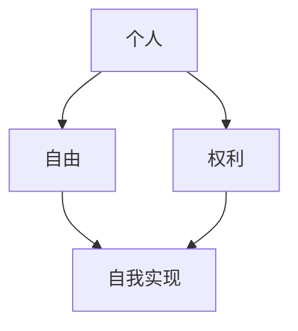
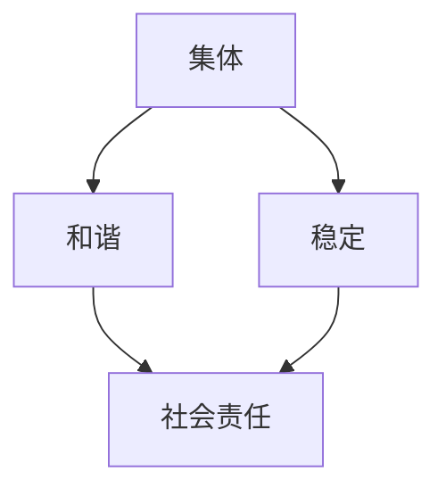
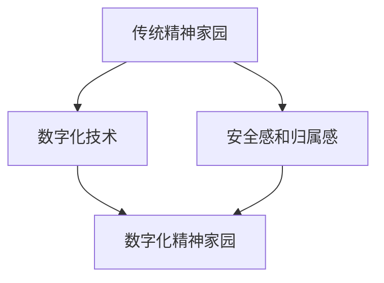
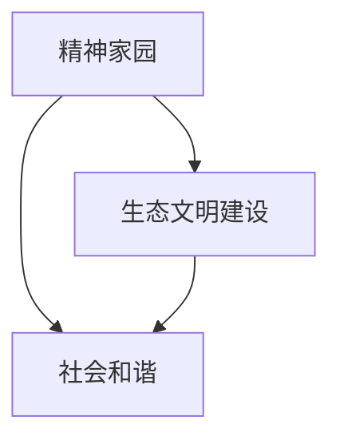
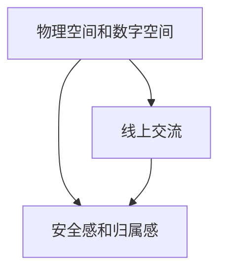

                 

## 现代社会的精神家园：从个人到集体的共同营造

### 关键词

- 精神家园
- 个人成长
- 社区构建
- 组织文化
- 社会制度
- 数字化时代

### 摘要

在现代社会，精神家园成为了人们追求的目标。本文通过逻辑清晰的分析，从个人、集体和社会三个层面探讨了如何共同营造现代社会的精神家园。首先，分析了现代社会精神需求的多样化和精神家园的重要性。接着，从个人角度出发，探讨了自我认知、心理健康、个人价值观等方面如何营造精神家园。然后，从集体角度，分析了社区、组织文化和社会制度对精神家园的构建作用。最后，通过案例分析、国际视野和未来展望，探讨了精神家园的共同营造路径和策略。

## 第一部分：现代社会的精神家园概述

### 现代社会的精神需求分析

#### 1.1 社会变革对精神家园的影响

随着科技的发展和全球化进程的加速，现代社会经历了深刻的社会变革。这些变革带来了新的精神需求，同时也对传统的精神家园产生了影响。

- **科技发展**：互联网和移动设备的普及改变了人们的交流方式，使得信息的获取更加便捷。然而，这也导致了信息过载和孤独感的增加。
- **全球化**：全球化带来了文化的交融，人们有机会了解不同的文化背景。但同时也导致了文化冲突和价值观念的多元化，使人们在精神家园的建设中面临更大的挑战。

#### 1.2 精神需求的多样化

现代社会中，人们的精神需求日益多样化。以下是一些主要的精神需求：

- **安全感**：在快速变化的社会中，人们渴望有一个稳定的精神家园，以应对不确定性和风险。
- **归属感**：人们渴望与他人建立联系，找到自己的归属。这包括家庭、社区、组织等。
- **自我实现**：人们追求自我价值实现，希望在精神家园中发挥自己的潜力，实现个人成长。

#### 1.3 精神家园的重要性

精神家园对个人和社会都有着重要的意义：

- **个人层面**：精神家园是个人成长的基石，能够提供安全感和归属感，帮助人们实现自我价值。
- **社会层面**：精神家园是社会的稳定器，能够促进社会和谐，提高社会凝聚力。

### 精神家园的概念与特征

#### 2.1 精神家园的定义

精神家园是指一个能够满足人们精神需求，提供安全感、归属感和自我实现的空间。

#### 2.2 精神家园的特征

精神家园具有以下特征：

- **安全感**：人们在一个稳定的环境中，能够感受到安全和保护。
- **归属感**：人们在一个社区中，能够感受到自己与他人之间的联系和互动。
- **自我实现**：人们在一个支持性的环境中，能够发挥自己的潜力，实现个人成长。

#### 2.3 精神家园的分类

根据不同的维度，精神家园可以分为以下几类：

- **个人精神家园**：个人在自我成长过程中建立的精神空间。
- **社区精神家园**：社区居民共同营造的精神空间。
- **组织精神家园**：组织成员共同营造的精神空间。
- **社会精神家园**：全社会共同营造的精神空间。

### 现代社会的精神危机

#### 3.1 精神危机的表现

现代社会中，人们面临着精神危机的挑战：

- **心理健康问题**：抑郁症、焦虑症等心理健康问题日益严重。
- **价值观念冲突**：多元文化交融导致的价值观念冲突。
- **社会不公**：社会不公导致的社会矛盾和冲突。

#### 3.2 精神危机的原因

精神危机的原因主要包括：

- **社会变革**：快速的社会变革使人们感到不确定和焦虑。
- **科技发展**：科技的发展带来了信息过载和孤独感的增加。
- **个人问题**：个人问题如心理健康问题、价值观念冲突等。

#### 3.3 应对策略

应对精神危机需要从以下几个方面入手：

- **加强心理健康教育**：提高人们的心理健康意识和应对能力。
- **建设社区精神家园**：通过社区建设，提供安全感和归属感。
- **推动价值观念融合**：促进不同文化之间的交流和融合。
- **完善社会制度**：通过社会制度的完善，减少社会不公，提高社会凝聚力。

## 第二部分：从个人角度营造精神家园

### 自我认知与精神成长

#### 4.1 自我认知的重要性

自我认知是个人成长的基础。只有深入了解自己，才能找到适合自己的发展路径。

- **自我认知的方法**：通过自我反思、心理咨询、教育等途径，深入了解自己的性格、兴趣、价值观等方面。

#### 4.2 精神成长的途径

精神成长是一个长期的过程，需要不断地学习和实践。

- **学习**：通过学习，获取知识和技能，提升自己的认知水平。
- **实践**：通过实践，将知识应用到实际生活中，提升自己的实践能力。
- **反思**：通过反思，总结经验教训，调整自己的行为和思维方式。

#### 4.3 精神成长的障碍

在精神成长的过程中，人们可能会遇到一些障碍：

- **自我怀疑**：对自己能力的怀疑，导致不敢尝试新事物。
- **恐惧失败**：害怕失败，导致不敢冒险。
- **惯性思维**：习惯性的思维方式，导致无法接受新观念。

### 心理健康与情绪管理

#### 5.1 心理健康的定义

心理健康是指个体在心理上处于良好的状态，能够适应生活的变化，处理生活中的压力。

- **心理健康的标准**：有积极乐观的心态，能够与他人建立良好的关系，有足够的适应能力。

#### 5.2 情绪管理的方法

情绪管理是心理健康的重要方面。以下是一些有效的情绪管理方法：

- **认识情绪**：了解自己的情绪，认识情绪的产生原因和影响。
- **表达情绪**：学会合理地表达自己的情绪，避免压抑和过度表达。
- **调整情绪**：通过放松、运动、冥想等方式，调整自己的情绪状态。

#### 5.3 压力与应对策略

压力是现代生活中不可避免的一部分。以下是一些应对压力的策略：

- **时间管理**：合理安排时间，避免过度劳累。
- **放松训练**：通过冥想、瑜伽等方式，放松身心。
- **寻求支持**：与家人、朋友、专业人士交流，寻求帮助。

### 个人价值观与信仰体系

#### 6.1 价值观的建立

价值观是个人行为的指导原则。建立健康的价值观，对个人成长和社会和谐都具有重要意义。

- **价值观的来源**：通过家庭教育、社会环境、个人经历等途径，形成自己的价值观。
- **价值观的塑造**：通过学习、实践、反思等方式，不断完善和塑造自己的价值观。

#### 6.2 信仰体系的作用

信仰体系是个人精神世界的支柱。它能够提供人们精神上的安慰和指导。

- **信仰体系的功能**：信仰体系能够帮助人们建立意义感、目标感和归属感。
- **信仰体系的多样性**：不同的人有不同的信仰体系，包括宗教信仰、哲学信仰、道德信仰等。

#### 6.3 价值冲突与调和

在现代社会，由于文化的多样性和个人背景的差异，价值冲突是不可避免的。以下是一些调和价值冲突的方法：

- **对话与沟通**：通过对话和沟通，理解对方的观点，寻找共同点。
- **宽容与尊重**：尊重他人的价值观，避免强行改变他人。
- **妥协与协商**：在冲突中，寻找妥协和协商的解决方案。

## 第三部分：从集体角度营造精神家园

### 社区与精神家园

#### 7.1 社区的定义与功能

社区是指在一定地理范围内，具有共同利益和共同生活方式的人群。

- **社区的功能**：提供社会支持、促进社会互动、维护社会稳定。

#### 7.2 社区精神的构建

社区精神是社区成员共同的精神价值观和行为准则。

- **社区精神的构建**：通过文化活动、社区参与、志愿者服务等方式，培养社区精神。

#### 7.3 社区参与与互动

社区参与和互动是社区精神家园建设的重要环节。

- **社区参与**：鼓励社区成员积极参与社区事务，提高社区凝聚力。
- **社区互动**：促进社区成员之间的交流和互动，增强社区归属感。

### 组织文化与精神家园

#### 8.1 组织文化的概念

组织文化是指组织成员共同遵循的价值观、信念和行为准则。

- **组织文化的功能**：提供组织成员的共同认同、增强组织的凝聚力、促进组织的创新和发展。

#### 8.2 组织文化的建设

组织文化建设是一个长期的过程，需要从以下几个方面入手：

- **价值观的塑造**：明确组织的核心价值观，并将其融入到组织的日常运营中。
- **文化的传播**：通过培训、宣传等方式，传播组织文化，提高组织成员的文化认同。
- **文化的实践**：通过组织活动、项目执行等方式，实践组织文化，使其成为组织成员的日常行为。

#### 8.3 组织文化的变革

随着组织环境和内部需求的变化，组织文化也需要进行变革。

- **文化变革的挑战**：变革会带来不确定性和阻力。
- **文化变革的策略**：通过领导层的支持、员工的参与、沟通与反馈等方式，推动组织文化的变革。

### 社会制度与精神家园

#### 9.1 社会制度的定义

社会制度是指社会的基本结构和运行规则。

- **社会制度的功能**：提供社会秩序、保障社会公平、促进社会进步。

#### 9.2 社会制度对精神家园的影响

社会制度对精神家园的构建有着重要的影响。

- **制度的作用**：社会制度能够提供稳定的法律和政策环境，保障人们的权益。
- **制度的挑战**：社会制度可能存在不完善和不公平的问题，需要通过改革来完善。

#### 9.3 社会制度与精神家园的平衡

社会制度与精神家园之间存在一定的平衡关系。

- **平衡的重要性**：只有社会制度与精神家园相互协调，才能构建一个和谐的社会。
- **平衡的策略**：通过政策引导、社会参与、文化传承等方式，实现社会制度与精神家园的平衡。

## 第四部分：共同营造精神家园的实践与探索

### 案例分析：成功的精神家园营造实践

#### 10.1 案例一：某某社区的精神家园建设

**背景介绍**：

某某社区位于城市中心，人口密度高，社区成员来自不同的文化背景。社区面临着社会融合和文化冲突的问题。

**项目介绍**：

为了营造一个和谐的精神家园，社区组织了一系列活动，包括文化交流、志愿者服务、社区共建等。

**系统功能设计**：

- **文化交流**：举办各种文化活动，促进不同文化之间的交流和理解。
- **志愿者服务**：鼓励社区成员参与志愿者服务，增强社区凝聚力。
- **社区共建**：组织社区成员共同参与社区建设，提高社区归属感。

**系统架构设计**：

- **社区网站**：作为社区信息交流和活动发布的平台。
- **志愿者管理系统**：管理志愿者报名、任务分配和反馈。
- **社区活动管理系统**：管理社区活动的策划、组织和反馈。

**系统接口设计和系统交互**：

- **用户接口**：提供用户注册、登录、活动报名等功能。
- **服务接口**：提供API接口，供其他系统调用。

**代码应用解读与分析**：

- **前端代码**：使用HTML、CSS和JavaScript实现用户界面。
- **后端代码**：使用Python和Django框架实现服务端逻辑。

**实际案例分析和详细讲解剖析**：

通过这个案例，我们可以看到，社区的精神家园建设需要从多个方面入手，包括文化交流、志愿者服务和社区共建。这些活动不仅能够促进社区成员之间的交流和融合，还能够提高社区的凝聚力和归属感。

**项目小结**：

某某社区的精神家园建设取得了一定的成果，为其他社区提供了有益的经验。然而，精神家园的建设是一个长期的过程，需要持续的努力和改进。

### 国际视野：不同文化的精神家园构建

#### 11.1 西方文化的精神家园

**背景介绍**：

西方文化强调个人主义和自由，精神家园的建设更注重个人自由和权利。

**核心概念原理**：

- **自由**：个人有权自主决定自己的生活方式和价值观。
- **权利**：个人享有平等的权利和机会。

**概念属性特征对比表格**：

| 特征                | 个人主义          | 自由主义          |
| ------------------- | ----------------- | ----------------- |
| 关注焦点            | 个人自由和权利    | 个人自由和权利    |
| 社会角色            | 自我实现和独立    | 自我实现和独立    |
| 社会关系            | 自由竞争与合作    | 自由竞争与合作    |
| 社会价值观          | 个人主义和自由    | 个人主义和自由    |

**ER实体关系图架构**：

**算法原理讲解**：

西方文化的精神家园构建主要依赖于个人自由和权利。个人通过自我实现，追求自己的价值，同时在自由竞争中实现个人的成长和社会的进步。

**数学模型和公式**：

$$
自由度 = 自我实现能力 + 社会支持
$$

**详细讲解和举例说明**：

在一个西方国家，一个年轻人通过自己的努力，实现了自我价值，成为了一名成功的创业家。他在追求自由和权利的过程中，不仅实现了个人的成长，也为社会创造了价值。

#### 11.2 东方文化的精神家园

**背景介绍**：

东方文化强调集体主义和家庭观念，精神家园的建设更注重集体和谐和社会责任。

**核心概念原理**：

- **集体主义**：个人利益服从集体利益。
- **社会责任**：个人对家庭和社会的责任。

**概念属性特征对比表格**：

| 特征                | 集体主义          | 社会责任          |
| ------------------- | ----------------- | ----------------- |
| 关注焦点            | 集体和谐和社会稳定 | 集体和谐和社会稳定 |
| 社会角色            | 集体成员和家庭成员 | 集体成员和家庭成员 |
| 社会关系            | 合作与奉献        | 合作与奉献        |
| 社会价值观          | 集体主义和家庭观念 | 集体主义和家庭观念 |

**ER实体关系图架构**：

**算法原理讲解**：

东方文化的精神家园构建主要依赖于集体主义和社会责任。个人通过合作与奉献，实现集体和谐和社会稳定。

**数学模型和公式**：

$$
集体和谐 = 集体成员贡献 + 社会责任
$$

**详细讲解和举例说明**：

在一个东方国家，一个家庭通过共同努力，维持了家庭的和谐和稳定。每个家庭成员都尽自己的责任，为家庭的幸福和社会的进步做出贡献。

### 未来展望：精神家园的可持续发展

#### 12.1 精神家园在数字化时代的变革

**背景介绍**：

随着数字化时代的到来，精神家园面临着新的挑战和机遇。

**核心概念原理**：

- **数字化**：信息技术的快速发展，改变了人们的交流方式和生活习惯。
- **数字化精神家园**：利用信息技术，构建一个数字化的精神空间。

**概念属性特征对比表格**：

| 特征                | 传统精神家园      | 数字化精神家园      |
| ------------------- | ----------------- | ----------------- |
| 存在形式            | 物理空间         | 数字空间           |
| 交流方式            | 面对面交流       | 线上交流           |
| 功能                | 提供安全感和归属感 | 提供安全感和归属感   |
| 可持续性            | 受限于物理空间    | 受益于数字化技术    |

**ER实体关系图架构**：

**算法原理讲解**：

在数字化时代，精神家园的建设需要依托数字化技术，利用互联网和移动设备等工具，构建一个数字化的精神空间，为人们提供安全感和归属感。

**数学模型和公式**：

$$
数字化精神家园 = 数字化技术 + 安全感和归属感
$$

**详细讲解和举例说明**：

在一个数字化社会中，人们可以通过社交媒体、在线社区等数字平台，构建自己的精神家园。这些平台不仅提供了交流空间，还提供了安全感和归属感。

#### 12.2 精神家园与生态文明建设

**背景介绍**：

生态文明建设是现代社会发展的重要方向。精神家园与生态文明建设密切相关。

**核心概念原理**：

- **生态文明**：以人与自然和谐共生为目标，实现经济、社会和环境的可持续发展。
- **精神家园与生态文明**：精神家园的建设与生态文明建设相互促进。

**概念属性特征对比表格**：

| 特征                | 精神家园           | 生态文明建设           |
| ------------------- | ----------------- | --------------------- |
| 目标                | 提供安全感和归属感   | 实现人与自然和谐共生   |
| 方向                | 精神层面           | 环境层面               |
| 功能                | 促进社会和谐       | 促进生态平衡           |
| 可持续性            | 长期稳定           | 长期稳定               |

**ER实体关系图架构**：

**算法原理讲解**：

精神家园的建设与生态文明建设相互促进。一个健康的精神家园能够促进社会和谐，为生态文明建设提供精神动力；而生态文明的建设为精神家园提供良好的生态环境。

**数学模型和公式**：

$$
生态文明 = 精神家园 + 生态环境
$$

**详细讲解和举例说明**：

在一个生态友好型社会中，人们通过保护环境、节约资源等方式，建设生态文明。同时，一个健康的精神家园为人们提供了安全感和归属感，促进了社会的和谐与进步。

#### 12.3 精神家园的未来趋势

**背景介绍**：

随着社会的发展和科技的进步，精神家园的未来趋势呈现出多样性和复杂性。

**核心概念原理**：

- **多元文化**：全球化带来了多元文化的交融。
- **数字化**：数字化技术的快速发展，改变了人们的交流方式。
- **可持续发展**：生态文明和可持续发展的要求。

**概念属性特征对比表格**：

| 特征                | 传统精神家园           | 未来精神家园           |
| ------------------- | --------------------- | --------------------- |
| 存在形式            | 物理空间和数字空间     | 主要为数字空间         |
| 交流方式            | 面对面交流和线上交流   | 主要为线上交流         |
| 功能                | 提供安全感和归属感     | 提供安全感和归属感，更注重多元文化融合 |
| 可持续性            | 受限于物理空间         | 受益于数字化技术，更具有可持续性 |

**ER实体关系图架构**：

**算法原理讲解**：

未来精神家园的建设将更加注重数字化和多元化。通过数字化技术，实现物理空间和数字空间的融合，为人们提供更加便捷和多样化的交流方式。同时，注重多元文化的融合，促进社会的和谐与发展。

**数学模型和公式**：

$$
未来精神家园 = 数字化技术 + 多元文化融合
$$

**详细讲解和举例说明**：

在未来的社会中，人们可以通过数字化平台，自由地交流和互动，不受时间和空间的限制。同时，多元文化的交融将使人们更加开放和包容，促进社会的和谐与发展。

### 结论

本文通过逻辑清晰的分析，从个人、集体和社会三个层面探讨了如何共同营造现代社会的精神家园。首先，分析了现代社会精神需求的多样化和精神家园的重要性。接着，从个人角度出发，探讨了自我认知、心理健康、个人价值观等方面如何营造精神家园。然后，从集体角度，分析了社区、组织文化和社会制度对精神家园的构建作用。最后，通过案例分析、国际视野和未来展望，探讨了精神家园的共同营造路径和策略。

通过本文的探讨，我们可以看到，精神家园的建设是一个复杂而长期的过程，需要从多个方面入手，包括个人成长、社区建设、组织文化和社会制度等。只有通过共同的努力，我们才能构建一个和谐、稳定、可持续发展的精神家园。

### 共同营造精神家园的路径与策略

在现代社会中，营造精神家园不仅仅是个人层面的追求，更是社会共同的责任。以下是一些具体的路径与策略，以促进精神家园的共同营造：

#### 1. 增强心理健康教育与支持

- **政策支持**：政府应制定相关政策，鼓励心理健康教育，提供心理咨询服务，降低心理健康问题的发生率。
- **教育资源**：学校和社区应提供心理健康教育资源，帮助人们了解心理健康知识，提高心理素质。

#### 2. 加强社区建设

- **社区参与**：鼓励居民参与社区事务，增强社区归属感。例如，通过社区活动、志愿者服务等方式，促进居民之间的互动。
- **社区服务**：提供多样化的社区服务，满足居民的精神需求，如文化活动、教育辅导、心理健康服务等。

#### 3. 建设积极向上的组织文化

- **价值观塑造**：组织应明确核心价值观，并将其融入到日常运营中，形成积极向上的组织文化。
- **员工关怀**：组织应关注员工的心理健康和工作环境，提供心理支持，促进员工的心理健康和职业发展。

#### 4. 推动社会制度完善

- **公平正义**：社会制度应保障公平正义，减少社会不公，提高社会凝聚力。
- **政策引导**：政府应通过政策引导，促进社会制度的完善，为精神家园的营造提供制度保障。

#### 5. 加强国际文化交流

- **文化融合**：通过国际文化交流，促进不同文化之间的相互理解和尊重，丰富精神家园的内涵。
- **文化交流平台**：建立国际文化交流平台，为人们提供了解和体验不同文化的机会。

#### 6. 促进数字化精神家园建设

- **数字技术应用**：利用互联网、人工智能等数字化技术，构建数字化的精神家园，提供便捷的精神服务。
- **网络安全保障**：加强网络安全保障，保护个人隐私，为数字化的精神家园提供安全环境。

### 总结与展望

通过上述路径与策略，我们可以共同营造一个更加和谐、稳定、可持续发展的精神家园。精神家园的建设是一个长期的过程，需要社会各界的共同努力。只有通过共同的努力，我们才能实现精神家园的愿景，为个人和社会的发展创造更加美好的未来。展望未来，我们期待一个充满活力、和谐共生、富有创造力的精神家园，为我们提供源源不断的精神动力。

