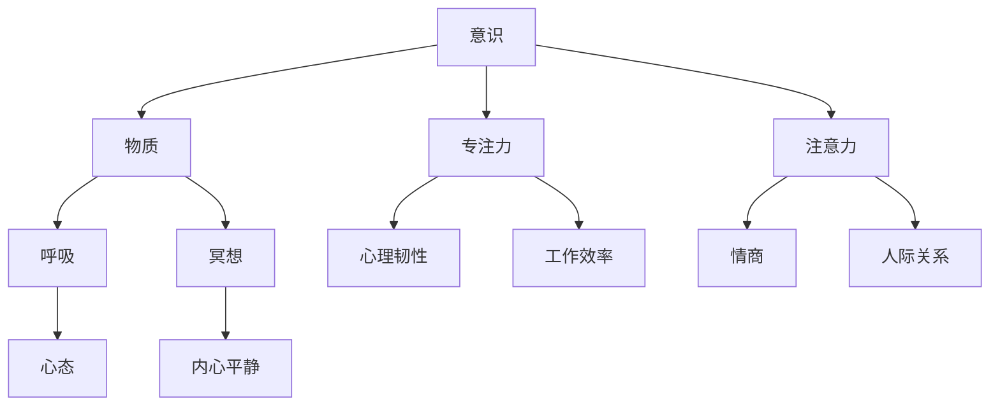

                 

# 现代禅修实践：在喧嚣中寻找内心的宁静

> 关键词：禅修，内心宁静，现代实践，心理健康，人际关系

> 摘要：本文旨在探讨禅修在现代生活中的实践方法，包括坐禅、行走禅、瑜伽禅和呼吸禅等。通过详细介绍每种禅修方法的理论、步骤及其在日常生活中的应用，本文旨在帮助读者找到一种在喧嚣世界中保持内心宁静的方法。

## 前言

在现代社会，我们似乎永远处于忙碌和喧嚣之中。工作压力、人际关系、家庭琐事等种种问题不断困扰着我们，使得我们很难找到内心的宁静。禅修作为一种古老的心灵修养方法，正逐渐被现代人认识和接受。本文将探讨禅修的核心概念和实践方法，旨在帮助读者在现代生活中找到内心的宁静。

### 书籍主题介绍

本书的主题是“现代禅修实践：在喧嚣中寻找内心的宁静”。我们将从禅修的历史、核心概念、实践方法以及禅修在日常生活中的应用等方面进行深入探讨，帮助读者了解和掌握禅修的实践技巧。

### 目标读者

本书的目标读者包括：
1. 对禅修感兴趣，希望了解和实践禅修的人。
2. 感到内心疲惫、需要寻找宁静的职场人士。
3. 对心理健康和人际关系感兴趣的人士。

### 书籍结构安排

本书分为四个部分：
1. **第一部分：禅修的背景与核心概念**，介绍禅修的定义、历史和意义。
2. **第二部分：禅修实践方法**，详细讲解坐禅、行走禅、瑜伽禅和呼吸禅等禅修方法。
3. **第三部分：禅修在日常生活中的应用**，探讨禅修在职场、家庭和个人成长中的应用。
4. **第四部分：禅修与心理健康**，分析禅修对心理健康的积极影响，并讨论禅修与人际关系的关系。

## 第一部分：禅修的背景与核心概念

### 第1章：禅修概述

#### 1.1 禅修的定义与发展历史

禅修，又称禅定或静坐，起源于古代印度，后传入中国，成为一种普遍的心灵修养方法。禅修的定义因不同文化和流派而有所不同，但核心目的都是通过冥想和静坐来达到内心的宁静和专注。

禅修的发展历史可以追溯到公元前5世纪，印度古代圣者乔达摩·悉达多（即佛陀）在菩提树下静坐七天七夜，最终悟道成佛。此后，禅修逐渐传入中国，并在唐朝时期达到鼎盛。禅修在中国经历了千年的发展，形成了多种流派，如汉传禅宗、临济禅宗等。

#### 1.2 现代禅修的意义

在现代生活中，禅修具有重要的意义。首先，禅修有助于缓解压力，提高心理韧性。长期处于高压环境下，人们容易感到疲惫和焦虑，禅修可以帮助我们放松身心，恢复精力。

其次，禅修有助于提高专注力和注意力。在现代工作中，专注力和注意力是成功的关键。通过禅修，我们可以训练自己的专注力，提高工作效率。

最后，禅修有助于培养情商，改善人际关系。禅修可以帮助我们更好地理解和控制自己的情绪，从而更好地与他人沟通和相处。

#### 1.3 在喧嚣中寻找内心的宁静

现代生活充满了喧嚣和干扰，我们很难找到内心的宁静。禅修提供了一种方法，让我们在喧嚣中找到内心的宁静。通过禅修，我们可以学会如何集中注意力，过滤外界的干扰，达到内心的平静。

### 第2章：禅修的核心概念与联系

#### 2.1 禅修的主要理论

禅修的理论基础主要包括以下几个方面：

1. **意识与物质的关系**：禅修认为，意识是物质世界的反映，通过冥想和静坐，我们可以调整自己的意识状态，达到内心的宁静。
2. **专注力与注意力**：禅修强调专注力和注意力的训练，通过不断地练习，我们可以提高专注力和注意力，从而更好地应对生活中的挑战。
3. **呼吸与冥想**：呼吸是禅修的核心，通过调整呼吸节奏，我们可以平静心态，达到冥想的状态。

#### 2.2 禅修的流派

禅修在不同文化和地区有不同的流派，其中最著名的包括：

1. **禅宗**：禅宗起源于中国，后传入日本，成为日本文化的重要组成部分。禅宗强调“直指人心，见性成佛”，强调内心的直接体验。
2. **净土宗**：净土宗主张通过念佛，祈求往生西方极乐世界。净土宗的禅修方法相对简单，适合初学者。
3. **天台宗**：天台宗强调五时八教，通过冥想和禅修，达到对佛法的深入理解。

#### 2.3 禅修核心概念的关系图

为了更好地理解禅修的核心概念，我们可以使用Mermaid流程图来展示它们之间的关系：



通过这个流程图，我们可以清晰地看到禅修的核心概念及其相互之间的关系。

## 第二部分：禅修实践方法

### 第3章：坐禅

#### 3.1 坐禅的基本步骤

坐禅是禅修中最基本的方法，其基本步骤如下：

1. **选择合适的环境**：选择一个安静、舒适的地方，避免噪音和干扰。
2. **选择坐姿**：可以选择莲花坐、半跏趺坐或坐姿禅修。无论哪种坐姿，都需要保持脊柱挺直。
3. **调整呼吸**：深呼吸几次，然后慢慢调整呼吸节奏，使其变得平稳和缓慢。
4. **集中注意力**：将注意力集中在呼吸上，感受每一次呼吸的进出，保持专注。
5. **放松身心**：在禅修过程中，如果出现杂念，不要强行抑制，而是让其自然消失，然后回到呼吸。

#### 3.2 坐禅的原理与Python代码实现

坐禅的原理是通过调整呼吸和集中注意力，达到内心的平静和专注。下面是一个简单的Python代码实现：

```python
import time

def sit_zazen():
    while True:
        print("深呼吸，然后慢慢调整呼吸节奏。")
        time.sleep(5)
        print("集中注意力，感受每一次呼吸的进出。")
        time.sleep(5)
        print("如果出现杂念，不要强行抑制，让其自然消失。")
        time.sleep(5)

sit_zazen()
```

通过这个简单的代码，我们可以模拟坐禅的过程，帮助我们在实际禅修中更好地掌握方法。

#### 3.3 坐禅的数学模型

坐禅的数学模型可以用来描述禅修过程中呼吸和专注力的变化。假设呼吸的节奏是一个正弦函数，专注力是一个指数函数，则可以表示为：

$$
呼吸节奏 = A \sin(\omega t + \phi)
$$

$$
专注力 = B e^{-\lambda t}
$$

其中，$A$ 和 $B$ 是常数，$\omega$ 和 $\lambda$ 是参数，$t$ 是时间。

通过这个模型，我们可以分析禅修过程中呼吸和专注力的变化规律，从而优化禅修的方法。

### 第4章：行走禅

#### 4.1 行走禅的基本步骤

行走禅是一种结合了运动和禅修的方法，其基本步骤如下：

1. **选择合适的场地**：选择一个开阔、安静的地方，避免干扰。
2. **调整呼吸**：在开始行走之前，先进行几次深呼吸，调整呼吸节奏。
3. **开始行走**：以稳定的步伐开始行走，注意保持身体的挺直和放松。
4. **集中注意力**：在行走过程中，将注意力集中在脚步的感觉上，感受每一次脚步的抬起和落下。
5. **放松身心**：在行走结束时，进行几次深呼吸，放松身心。

#### 4.2 行走禅的原理与Python代码实现

行走禅的原理是通过运动和专注力的训练，达到内心的平静和专注。下面是一个简单的Python代码实现：

```python
import time

def walk_zazen():
    while True:
        print("调整呼吸，然后开始行走。")
        time.sleep(5)
        print("集中注意力，感受脚步的感觉。")
        time.sleep(5)
        print("放松身心，结束行走。")
        time.sleep(5)

walk_zazen()
```

通过这个简单的代码，我们可以模拟行走禅的过程，帮助我们在实际禅修中更好地掌握方法。

#### 4.3 行走禅的数学模型

行走禅的数学模型可以用来描述禅修过程中呼吸和专注力的变化。假设呼吸的节奏是一个正弦函数，专注力是一个指数函数，则可以表示为：

$$
呼吸节奏 = A \sin(\omega t + \phi)
$$

$$
专注力 = B e^{-\lambda t}
$$

其中，$A$ 和 $B$ 是常数，$\omega$ 和 $\lambda$ 是参数，$t$ 是时间。

通过这个模型，我们可以分析禅修过程中呼吸和专注力的变化规律，从而优化禅修的方法。

### 第5章：瑜伽禅

#### 5.1 瑜伽禅的基本步骤

瑜伽禅是一种结合瑜伽和禅修的方法，其基本步骤如下：

1. **选择合适的体式**：根据个人身体状况，选择适合的瑜伽体式。
2. **调整呼吸**：在开始瑜伽禅之前，先进行几次深呼吸，调整呼吸节奏。
3. **保持体式**：以稳定的呼吸，保持所选体式一段时间。
4. **集中注意力**：在保持体式的过程中，将注意力集中在呼吸和身体的感觉上。
5. **放松身心**：在结束瑜伽禅后，进行几次深呼吸，放松身心。

#### 5.2 瑜伽禅的原理与Python代码实现

瑜伽禅的原理是通过体式和专注力的训练，达到内心的平静和专注。下面是一个简单的Python代码实现：

```python
import time

def yoga_zazen():
    while True:
        print("调整呼吸，然后选择一个瑜伽体式。")
        time.sleep(5)
        print("保持体式，集中注意力。")
        time.sleep(5)
        print("放松身心，结束瑜伽禅。")
        time.sleep(5)

yoga_zazen()
```

通过这个简单的代码，我们可以模拟瑜伽禅的过程，帮助我们在实际禅修中更好地掌握方法。

#### 5.3 瑜伽禅的数学模型

瑜伽禅的数学模型可以用来描述禅修过程中呼吸和专注力的变化。假设呼吸的节奏是一个正弦函数，专注力是一个指数函数，则可以表示为：

$$
呼吸节奏 = A \sin(\omega t + \phi)
$$

$$
专注力 = B e^{-\lambda t}
$$

其中，$A$ 和 $B$ 是常数，$\omega$ 和 $\lambda$ 是参数，$t$ 是时间。

通过这个模型，我们可以分析禅修过程中呼吸和专注力的变化规律，从而优化禅修的方法。

### 第6章：呼吸禅

#### 6.1 呼吸禅的基本步骤

呼吸禅是一种专注于呼吸的禅修方法，其基本步骤如下：

1. **选择合适的地点**：选择一个安静、舒适的地方，避免噪音和干扰。
2. **调整呼吸**：在开始呼吸禅之前，先进行几次深呼吸，调整呼吸节奏。
3. **专注于呼吸**：在呼吸过程中，将注意力集中在呼吸的感觉上，感受每一次呼吸的进出。
4. **放松身心**：在呼吸禅结束后，进行几次深呼吸，放松身心。

#### 6.2 呼吸禅的原理与Python代码实现

呼吸禅的原理是通过专注于呼吸，达到内心的平静和专注。下面是一个简单的Python代码实现：

```python
import time

def breathing_zazen():
    while True:
        print("调整呼吸，然后专注于呼吸的感觉。")
        time.sleep(5)
        print("感受每一次呼吸的进出。")
        time.sleep(5)
        print("放松身心，结束呼吸禅。")
        time.sleep(5)

breathing_zazen()
```

通过这个简单的代码，我们可以模拟呼吸禅的过程，帮助我们在实际禅修中更好地掌握方法。

#### 6.3 呼吸禅的数学模型

呼吸禅的数学模型可以用来描述禅修过程中呼吸节奏的变化。假设呼吸节奏是一个正弦函数，则可以表示为：

$$
呼吸节奏 = A \sin(\omega t + \phi)
$$

其中，$A$ 是常数，$\omega$ 是参数，$t$ 是时间。

通过这个模型，我们可以分析禅修过程中呼吸节奏的变化规律，从而优化禅修的方法。

## 第三部分：禅修在日常生活中的应用

### 第7章：禅修在职场中的应用

#### 7.1 禅修如何提高工作效率

禅修可以帮助职场人士提高工作效率，主要体现在以下几个方面：

1. **增强专注力**：通过禅修，我们可以提高专注力和注意力，从而在工作和学习中更有效地完成任务。
2. **缓解压力**：禅修可以帮助我们放松身心，缓解工作压力，提高工作效率。
3. **提高心理韧性**：禅修可以提高我们的心理韧性，使我们能够更好地应对职场挑战。

#### 7.2 禅修如何缓解职场压力

职场压力是现代职场人士面临的主要问题之一，禅修提供了一种有效的方法来缓解压力：

1. **深呼吸**：通过深呼吸，我们可以放松身心，缓解紧张情绪。
2. **专注呼吸**：将注意力集中在呼吸上，可以帮助我们摆脱杂念，达到内心的平静。
3. **放松训练**：通过放松训练，我们可以减轻身体的紧张和疼痛，提高睡眠质量。

#### 7.3 职场禅修案例分享

以下是一个职场禅修的案例：

小王是一名程序员，工作压力大，经常感到身心疲惫。他开始尝试禅修，每天早上和晚上各进行一次呼吸禅。经过一段时间的练习，小王发现他的工作效率提高了，压力也减轻了，睡眠质量也得到了改善。

### 第8章：禅修在家庭中的应用

#### 8.1 禅修如何改善家庭关系

禅修可以帮助改善家庭关系，主要体现在以下几个方面：

1. **增强沟通**：禅修可以提高我们的沟通能力，使我们更好地理解家人的需求和感受。
2. **增进理解**：通过禅修，我们可以更好地控制自己的情绪，减少冲突和误解。
3. **增强亲子关系**：禅修可以帮助父母更好地理解孩子，增进亲子关系。

#### 8.2 禅修如何提升家庭幸福感

禅修可以帮助提升家庭幸福感，主要体现在以下几个方面：

1. **增强情感交流**：禅修可以帮助家庭成员更好地交流情感，增进彼此的了解和信任。
2. **缓解压力**：禅修可以缓解家庭压力，提高家庭幸福感。
3. **增进和谐**：禅修可以帮助家庭成员更好地处理家庭矛盾，增进家庭和谐。

#### 8.3 家庭禅修案例分享

以下是一个家庭禅修的案例：

张女士是一家公司的中层管理者，工作压力大，家庭关系也变得紧张。她开始和丈夫一起进行禅修，每天晚上共同练习呼吸禅。经过一段时间的练习，张女士发现她的家庭关系变得更加和谐，丈夫也更愿意倾听她的需求，家庭幸福感大大提升。

### 第9章：禅修在个人成长中的应用

#### 9.1 禅修如何提升自我认知

禅修可以帮助个人提升自我认知，主要体现在以下几个方面：

1. **深入内心**：通过禅修，我们可以深入了解自己的内心世界，发现自己的优点和不足。
2. **反思自我**：禅修可以帮助我们反思自己的行为和决策，从而更好地认识自己。
3. **增强自我意识**：禅修可以提高我们的自我意识，使我们更好地掌握自己的情绪和行为。

#### 9.2 禅修如何增强心理韧性

禅修可以帮助增强心理韧性，主要体现在以下几个方面：

1. **提高自我调节能力**：禅修可以帮助我们更好地控制自己的情绪和行为，提高自我调节能力。
2. **增强应对能力**：禅修可以提高我们的心理韧性，使我们更好地应对生活中的挑战和压力。
3. **提高情绪稳定性**：禅修可以帮助我们保持情绪稳定，减少负面情绪的影响。

#### 9.3 个人禅修案例分享

以下是一个个人禅修的案例：

李先生是一位年轻的创业者，经常感到焦虑和压力。他开始进行坐禅和呼吸禅的练习，每天早晨和晚上各进行一次。经过一段时间的练习，李先生发现他的焦虑感减轻了，心理韧性也得到了提升，创业事业也取得了更好的发展。

## 第四部分：禅修与心理健康

### 第10章：禅修对心理健康的积极影响

禅修对心理健康有着积极的影响，主要体现在以下几个方面：

#### 10.1 禅修如何减少焦虑

1. **调节情绪**：禅修可以帮助我们更好地调节情绪，减少焦虑和紧张。
2. **放松身心**：通过禅修，我们可以放松身心，减轻压力。
3. **减少担忧**：禅修可以帮助我们减少对未来的担忧，提高当下意识。

#### 10.2 禅修如何减轻抑郁

1. **提高自尊和自信**：禅修可以帮助我们提高自尊和自信，减少抑郁情绪。
2. **改善睡眠**：禅修可以帮助改善睡眠质量，减少抑郁症状。
3. **减轻痛苦感**：禅修可以帮助我们减轻痛苦感，提高生活质量。

#### 10.3 禅修如何提高心理韧性

1. **增强自我调节能力**：禅修可以帮助我们更好地控制自己的情绪和行为，提高自我调节能力。
2. **增强应对能力**：禅修可以提高我们的心理韧性，使我们更好地应对生活中的挑战和压力。
3. **提高情绪稳定性**：禅修可以帮助我们保持情绪稳定，减少负面情绪的影响。

### 第11章：禅修与心理健康的数学模型

禅修对心理健康的积极影响可以用数学模型来描述。以下是一个简化的数学模型：

$$
心理健康水平 = f(禅修频率, 禅修时长, 生活压力)
$$

其中，$f$ 是一个非线性函数，表示禅修对心理健康水平的影响。$禅修频率$ 和 $禅修时长$ 表示禅修的频率和持续时间，$生活压力$ 表示生活中的压力水平。

通过这个模型，我们可以分析禅修对心理健康的影响程度，从而制定更有效的禅修计划。

## 第12章：禅修与人际关系

### 12.1 禅修如何改善人际关系

禅修可以帮助改善人际关系，主要体现在以下几个方面：

#### 12.1.1 增强沟通能力

1. **提高倾听能力**：禅修可以帮助我们更好地倾听他人的意见和需求。
2. **减少误解**：禅修可以帮助我们减少因误解导致的冲突和矛盾。

#### 12.1.2 增强同理心

1. **提高情感共鸣**：禅修可以帮助我们更好地理解他人的情感和需求。
2. **减少自私行为**：禅修可以帮助我们减少自私行为，提高对他人的关心和照顾。

#### 12.1.3 改善家庭关系

1. **增强亲子关系**：禅修可以帮助父母更好地理解孩子，增进亲子关系。
2. **增进夫妻和谐**：禅修可以帮助夫妻更好地处理家庭矛盾，增进夫妻和谐。

### 12.2 禅修如何增强沟通能力

禅修可以帮助增强沟通能力，主要体现在以下几个方面：

#### 12.2.1 提高专注力

1. **提高注意力**：禅修可以帮助我们提高注意力，更好地关注对方的言谈和表情。
2. **减少分心**：禅修可以帮助我们减少分心，专注于对方的沟通内容。

#### 12.2.2 提高倾听能力

1. **减少自我中心**：禅修可以帮助我们减少自我中心，更好地倾听对方的意见和需求。
2. **提高同理心**：禅修可以帮助我们提高同理心，更好地理解对方的情感和需求。

### 第13章：禅修实践案例

#### 13.1 案例一：职场人士的禅修实践

张先生是一名公司的项目经理，工作压力很大。他开始进行禅修实践，每天早上和晚上各进行一次呼吸禅。经过一段时间的练习，张先生发现他的工作效率提高了，压力也减轻了，与同事的关系也变得更加和谐。

#### 13.2 案例二：家庭主妇的禅修实践

李女士是一名家庭主妇，经常感到焦虑和压力。她开始和丈夫一起进行禅修，每天晚上共同练习呼吸禅。经过一段时间的练习，李女士发现她的焦虑感减轻了，家庭关系也变得更加和谐。

## 结语

禅修是一种古老的心灵修养方法，在现代社会中，它不仅可以帮助我们缓解压力，提高工作效率，还可以改善人际关系，提升心理健康。通过本文的介绍，我们了解了禅修的核心概念和实践方法，相信读者已经找到了适合自己的禅修方法。

让我们共同实践禅修，寻找内心的宁静，享受更加美好的生活。祝愿每一位读者在喧嚣的世界中找到属于自己的宁静角落。

### 附录：禅修资源推荐

为了帮助读者更好地实践禅修，我们推荐以下资源：

1. **书籍**：《禅与生活》、《禅修入门》、《现代禅修实践》等。
2. **网站**：Mindfulness.com、ZEN compostion、Headspace等，这些网站提供了丰富的禅修资源和教程。
3. **应用**：Moodfit、Calm、Insight Timer等，这些应用提供了实用的禅修指导和冥想音乐。
4. **课程**：各种在线禅修课程，如Udemy、Coursera等。

作者：AI天才研究院/AI Genius Institute & 禅与计算机程序设计艺术 /Zen And The Art of Computer Programming

