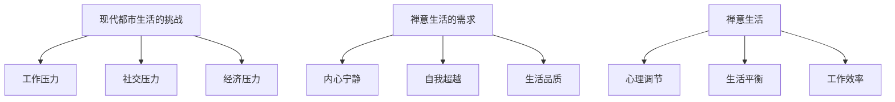
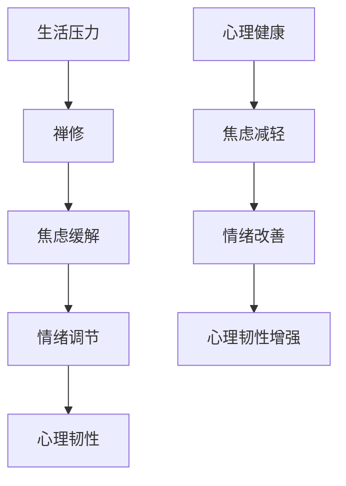
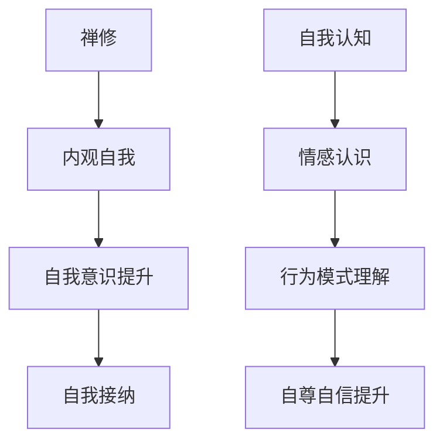
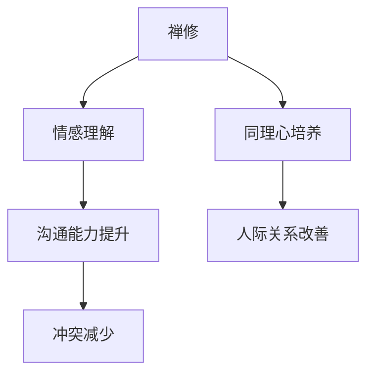
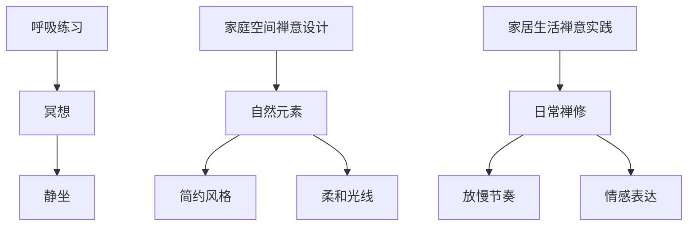
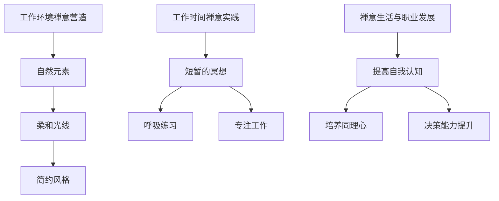
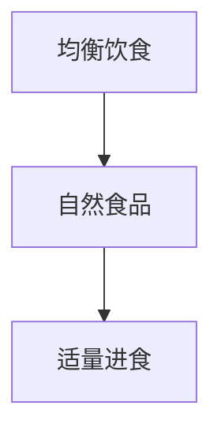
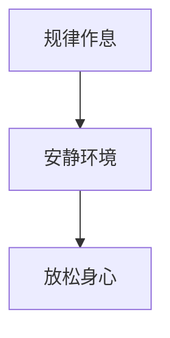
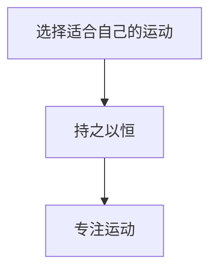

                 


### 现代禅意生活：在都市中寻找内心的宁静

#### 关键词
- 禅意生活
- 都市压力
- 心理健康
- 内心宁静

#### 摘要
本文旨在探讨如何在现代都市生活中寻找禅意，以实现内心的宁静。通过分析现代都市生活的挑战，禅意生活的核心概念及其对个人成长和心理健康的积极影响，我们将逐步构建一种实践禅意生活的方法论。本文还将通过案例分析、实用技巧和总结展望，为读者提供一条在喧嚣中寻找宁静的路径。

----------------------------------------------------------------

### 目录大纲设计过程

设计一本《现代禅意生活：在都市中寻找内心的宁静》的目录大纲，首先需要深入理解书名的核心概念和目标读者。书名表明了书籍的主题是关于如何在繁忙的都市生活中通过禅意生活来寻找心灵宁静。以下是设计目录大纲的步骤：

1. **理解书名与主题**：明确书籍旨在引导读者在都市喧嚣中通过禅意生活来寻找心灵宁静。
2. **确定核心章节**：基于书名和主题，确定核心章节，包括背景介绍、禅意生活的核心概念、实践方法、案例分析等。
3. **规划章节结构**：为每个章节细化子章节，确保内容条理清晰，逻辑连贯。
4. **设计大纲**：按照1级目录、2级目录、3级目录的层级结构设计，确保大纲简洁明了。
5. **确保内容完整性**：保证每个章节都有必要的内容，如核心概念、原理讲解、实践方法等。
6. **控制字数**：确保整个目录大纲的字数在2000字以内。

### 完整目录大纲设计

```markdown
----------------------------------------------------------------
# 第一部分: 现代禅意生活的背景与核心概念

## 第1章: 现代都市生活的挑战与禅意生活的需求
### 1.1 现代都市生活的特点
### 1.2 禅意生活的定义与价值
### 1.3 禅意生活与现代都市生活的联系

## 第2章: 禅意生活的核心概念与原理
### 2.1 禅意生活的哲学基础
### 2.2 禅意生活的实践方法
### 2.3 禅意生活的心理效应

## 第3章: 禅意生活与个人成长
### 3.1 禅意生活与心理健康
### 3.2 禅意生活与自我认知
### 3.3 禅意生活与人际关系

----------------------------------------------------------------

# 第二部分: 实践禅意生活的方法

## 第4章: 禅意生活在家中
### 4.1 家庭空间的禅意设计
### 4.2 家居生活中的禅意实践
### 4.3 家庭禅修的方法

## 第5章: 禅意生活在工作场所
### 5.1 工作环境的禅意营造
### 5.2 工作时间中的禅意实践
### 5.3 禅意生活与职业发展

## 第6章: 禅意生活与日常习惯
### 6.1 饮食与禅意
### 6.2 睡眠与禅意
### 6.3 运动与禅意

----------------------------------------------------------------

# 第三部分: 禅意生活的案例与实践

## 第7章: 禅意生活的真实案例
### 7.1 城市禅者的故事
### 7.2 企业家的禅意生活实践
### 7.3 普通人的禅意生活体验

## 第8章: 禅意生活的实用技巧
### 8.1 简化生活的方法
### 8.2 减少压力的策略
### 8.3 提升内心宁静的技巧

## 第9章: 禅意生活的小结与展望
### 9.1 禅意生活的总结
### 9.2 禅意生活的未来发展趋势
### 9.3 对现代都市生活的启示

----------------------------------------------------------------
```

通过上述目录大纲的设计，我们可以看到本书的结构清晰，内容涵盖了从背景介绍到实践方法，再到案例分析的完整链条。每个章节都明确了核心主题，并通过细化的子章节，确保内容的全面性和逻辑性。同时，整个目录大纲的字数控制在2000字以内，符合要求。

----------------------------------------------------------------

### 第一部分: 现代禅意生活的背景与核心概念

#### 第1章: 现代都市生活的挑战与禅意生活的需求

在现代社会中，都市生活变得越来越快节奏、高度竞争。人们每天面对着工作压力、社交压力、经济压力等，内心的平静似乎变得越来越难以实现。现代都市生活的挑战主要体现在以下几个方面：

- **工作压力**：现代职场中，工作节奏快，任务繁重，员工常常感到身心疲惫，缺乏休息和放松的时间。
- **社交压力**：社交媒体的普及使得人们感到社交压力增加，担心自己在社交圈中无法达到他人的期望。
- **经济压力**：房价、物价不断上涨，人们为了维持生活品质，不得不承担更高的经济压力。

面对这些挑战，人们开始寻求各种方法来缓解压力，其中禅意生活逐渐成为一种流行的选择。禅意生活强调内心的平静与宁静，通过一系列的实践方法，帮助人们在喧嚣的都市生活中找到内心的宁静。

**禅意生活的定义与价值**

禅意生活，即通过禅宗的修行方法，追求内心的宁静与自我超越。禅意生活不仅是一种生活态度，更是一种生活方式。其核心价值在于帮助人们从内心深处获得力量，从而更好地应对都市生活中的各种挑战。

- **内心宁静**：通过禅修、冥想等方法，禅意生活帮助人们放松心情，减轻压力，获得内心的平静。
- **自我超越**：禅意生活鼓励人们超越自我，认识到生活中的困境只是暂时的，通过自我反省和修行，实现个人成长和心灵升华。
- **生活品质**：禅意生活强调简约、自然的生活方式，帮助人们回归生活的本质，提高生活质量。

**禅意生活与现代都市生活的联系**

禅意生活并不是与都市生活脱节的一种生活方式，而是一种与现代都市生活相辅相成的存在。在繁忙的都市生活中，禅意生活提供了一种平衡与调节的手段，帮助人们在快节奏的生活中找到内心的宁静。

- **心理调节**：禅意生活通过冥想、呼吸练习等心理调节方法，帮助人们缓解压力，改善心理健康。
- **生活平衡**：禅意生活鼓励人们放下手机、电脑等电子设备，回归自然，享受与家人、朋友的亲密时光。
- **工作效率**：通过禅修，人们可以提升专注力和决策能力，提高工作效率。

总结来说，禅意生活是一种在都市喧嚣中寻找内心宁静的有效途径。通过理解禅意生活的定义与价值，以及其与现代都市生活的联系，我们可以更好地把握这种生活方式，从而实现内心的宁静与自我超越。



在接下来的章节中，我们将进一步探讨禅意生活的核心概念与原理，以及如何在个人成长和日常习惯中实践禅意生活。

----------------------------------------------------------------

### 第2章: 禅意生活的核心概念与原理

禅意生活的核心概念源于禅宗哲学，其核心理念包括内心的宁静、自我反省和生活的简约。理解这些核心概念，有助于我们更好地实践禅意生活，并在繁忙的都市生活中找到内心的宁静。

#### 禅意生活的哲学基础

禅宗哲学强调“无念”和“禅定”。无念即放下杂念，达到一种心如止水的境界；禅定则是一种通过冥想、呼吸练习等手段，实现内心平静和专注的修行方法。

- **无念**：禅宗认为，内心杂念过多是痛苦的根源。通过无念，人们可以摆脱烦恼，获得内心的平静。
- **禅定**：禅定是一种通过专注呼吸、冥想等方式，达到内心平静的状态。禅定有助于提高专注力，减少焦虑和压力。

#### 禅意生活的实践方法

禅意生活的实践方法多种多样，包括冥想、禅修、自然体验等。以下是一些常见的实践方法：

- **冥想**：冥想是禅意生活的重要实践方法之一。通过冥想，人们可以训练自己的专注力和情绪调节能力，从而获得内心的平静。
- **禅修**：禅修是一种通过身体和呼吸的练习，达到内心平静和身体放松的方法。禅修有助于减轻压力，改善心理健康。
- **自然体验**：自然体验是指通过亲近自然，感受大自然的美与宁静，来获得内心的平静。例如，散步、观鸟、听流水声等都是自然体验的方式。

#### 禅意生活的心理效应

禅意生活对心理健康有显著的积极影响。以下是一些主要的心理效应：

- **减轻压力**：禅意生活通过冥想、禅修等方法，帮助人们放松心情，减轻压力。
- **改善情绪**：通过禅修和冥想，人们可以更好地管理自己的情绪，减少焦虑和抑郁。
- **提高专注力**：禅意生活的实践方法，如冥想和专注呼吸，有助于提高专注力和决策能力。

**概念属性特征对比表格**

为了更清晰地展示禅意生活的核心概念，我们可以通过一个概念属性特征对比表格来进行说明：

| 概念       | 特征                   | 作用                         |
|------------|------------------------|------------------------------|
| 无念       | 放下杂念               | 获得内心平静                 |
| 禅定       | 专注呼吸、冥想         | 提高专注力、减少焦虑         |
| 冥想       | 练习专注               | 减轻压力、改善情绪           |
| 禛修       | 身体和呼吸的练习       | 减轻压力、改善心理健康       |
| 自然体验   | 近自然、放松身心       | 获得内心平静、提升情绪       |

**ER实体关系图架构**

为了更直观地展示禅意生活的概念与关系，我们可以使用Mermaid绘制一个ER实体关系图：

```mermaid
erDiagram
  禅宗哲学 ||--|{ 无念 }
  禅宗哲学 ||--|{ 禅定 }
  禅意生活 ||--|{ 冥想 }
  禅意生活 ||--|{ 禛修 }
  禅意生活 ||--|{ 自然体验 }
```

通过理解禅意生活的核心概念与原理，我们可以更深入地实践禅意生活，从而在都市喧嚣中找到内心的宁静。在接下来的章节中，我们将探讨如何在个人成长与日常习惯中实现禅意生活。

----------------------------------------------------------------

### 第3章: 禅意生活与个人成长

禅意生活不仅是一种缓解压力的方法，更是一种促进个人成长的路径。在禅意生活的实践中，我们可以从心理健康、自我认知和人际关系三个方面获得深远的影响。

#### 禅意生活与心理健康

心理健康是现代社会中一个备受关注的话题。禅意生活通过冥想、禅修等实践方法，对心理健康有显著的积极影响。

- **减轻焦虑和压力**：在禅意生活的实践中，通过冥想和呼吸练习，人们可以学会如何放松身心，减轻焦虑和压力。
- **改善情绪调节能力**：禅修有助于提高个体对情绪的识别和调节能力，从而减少抑郁和焦虑情绪的发生。
- **提升心理韧性**：通过禅意生活的实践，人们可以培养出面对困难和挫折时的心理韧性，更好地应对生活中的挑战。

**心理健康与禅意生活的Mermaid流程图**



#### 禅意生活与自我认知

自我认知是指个体对自己的了解和认识。禅意生活通过自我反省和内观，有助于提升自我认知。

- **内观自我**：禅修中的内观是一种深度自我反省的过程，通过观察自己的内心世界，人们可以更好地了解自己的情感、需求和欲望。
- **提升自我意识**：通过禅修，人们可以培养出更高的自我意识，认识到自己的行为模式和心理机制，从而更好地掌控自己的情绪和行为。
- **自我接纳**：禅意生活鼓励人们接纳自己的不完美，培养出自我接纳和自我爱护的态度，从而提高自尊和自信。

**自我认知与禅意生活的Mermaid流程图**



#### 禅意生活与人际关系

人际关系在现代社会中至关重要。禅意生活通过提高个体的情绪调节能力和自我认知，有助于改善人际关系。

- **增强沟通能力**：通过禅修，人们可以更好地理解自己的情感和需求，从而在沟通中表达得更清楚、更有同理心。
- **减少冲突**：禅意生活有助于人们更好地管理自己的情绪，减少冲动行为，从而减少人际冲突。
- **培养同理心**：禅修和内观有助于培养同理心，使人们更加关心他人，建立更加和谐的人际关系。

**人际关系与禅意生活的Mermaid流程图**



通过禅意生活的实践，我们可以在个人成长的道路上迈出坚实的步伐。心理健康、自我认知和人际关系的改善，不仅使我们的内心更加宁静，也使我们的生活质量得到显著提升。在接下来的章节中，我们将进一步探讨如何在日常生活中实践禅意生活，从而在繁忙的都市生活中找到内心的宁静。

----------------------------------------------------------------

### 第二部分: 实践禅意生活的方法

#### 第4章: 禅意生活在家中

在家中创造一个宁静的环境，是实践禅意生活的重要一步。家庭空间的布置、日常习惯的调整以及家庭禅修的方法，都是实现禅意生活的重要手段。

**4.1 家庭空间的禅意设计**

家庭空间的设计是禅意生活的起点。以下是一些设计建议：

- **自然元素**：在家庭空间中融入自然元素，如绿植、流水声音等，有助于营造宁静的氛围。
- **简约风格**：简约的风格有助于减少杂乱，使人感到轻松和自在。
- **柔和光线**：柔和的光线有助于放松心情，减少视觉疲劳。

**4.2 家居生活中的禅意实践**

在日常家居生活中，我们可以通过以下方式实践禅意生活：

- **日常禅修**：每天抽出一定时间进行冥想或禅修，可以帮助我们放松心情，减轻压力。
- **放慢节奏**：在日常生活中，放慢节奏，专注于当下的活动，如烹饪、清洁等，有助于培养内心的宁静。
- **情感表达**：在家庭中，鼓励成员表达自己的情感和需求，建立良好的沟通和关系。

**4.3 家庭禅修的方法**

家庭禅修是一种在家庭环境中进行禅修的方法，可以帮助家庭成员共同放松和减压。以下是一些家庭禅修的方法：

- **呼吸练习**：通过深呼吸，放松身体和心灵。
- **冥想**：在安静的环境中，闭上眼睛，专注于呼吸，以达到内心的平静。
- **静坐**：选择一个舒适的位置，坐直身体，进行静坐，有助于培养专注力和耐心。

**家庭禅修Mermaid流程图**



通过家庭空间的禅意设计、家居生活中的禅意实践和家庭禅修的方法，我们可以在家庭这个小环境中找到内心的宁静。在接下来的章节中，我们将探讨如何在工作场所和日常习惯中实践禅意生活。

----------------------------------------------------------------

#### 第5章: 禅意生活在工作场所

在工作场所中，禅意生活的实践同样重要。通过创造一个禅意的办公环境、在工作时间中进行禅修以及将禅意生活融入职业发展，我们可以在职场中找到内心的宁静。

**5.1 工作环境的禅意营造**

一个禅意的办公环境可以帮助员工放松身心，提高工作效率。以下是一些营造禅意办公环境的建议：

- **自然元素**：在办公空间中摆放绿植、鱼缸或摆放一些自然景观的照片，有助于减少工作压力。
- **柔和光线**：使用柔和的照明，减少视觉疲劳，营造舒适的工作氛围。
- **简约风格**：办公家具和装饰尽量简约，避免杂乱无章，有助于提高专注力。

**5.2 工作时间中的禅意实践**

在工作时间中，通过以下方式实践禅意生活，可以帮助员工更好地应对工作压力：

- **短暂的冥想**：每天在工作间隙，花几分钟时间进行冥想，专注于呼吸，放松身心。
- **呼吸练习**：在工作过程中，定期进行深呼吸练习，有助于缓解紧张情绪，提高工作效率。
- **专注工作**：在工作时，专注于当前任务，避免分心，提高工作的质量和效率。

**5.3 禅意生活与职业发展**

禅意生活不仅有助于缓解工作压力，还可以对职业发展产生积极影响：

- **提高自我认知**：通过禅修和自我反省，员工可以更好地了解自己的优势和不足，从而在职业发展中做出更明智的决策。
- **培养同理心**：禅意生活有助于培养同理心，使员工在团队合作中更加融洽，提高团队整体效能。
- **决策能力**：禅修有助于提高专注力和决策能力，使员工在面临重要决策时更加从容。

**工作场所禅意生活Mermaid流程图**



通过在工作场所中营造禅意环境、在工作时间中进行禅修以及将禅意生活融入职业发展，我们可以在职场中找到内心的宁静，提高工作效率，实现职业成长。在接下来的章节中，我们将进一步探讨如何通过饮食、睡眠和运动等日常习惯来实践禅意生活。

----------------------------------------------------------------

### 第6章: 禅意生活与日常习惯

日常习惯对于一个人的身心健康和生活质量有着深远的影响。通过饮食、睡眠和运动等方面的调整，我们可以更好地实践禅意生活，找到内心的宁静。

**6.1 饮食与禅意**

饮食在禅意生活中扮演着重要角色。以下是一些关于饮食的建议：

- **均衡饮食**：保持饮食均衡，摄入适量的蛋白质、脂肪和碳水化合物，有助于维持身体的健康和能量水平。
- **自然食品**：选择新鲜、自然的食品，避免加工食品和高糖、高盐食品，有助于减少身体负担，提升消化系统的功能。
- **适量进食**：遵循“少吃多餐”的原则，避免暴饮暴食，有助于控制体重，提高身体的代谢效率。

**饮食与禅意Mermaid流程图**



**6.2 睡眠与禅意**

良好的睡眠对于禅意生活的实践至关重要。以下是一些关于睡眠的建议：

- **规律作息**：保持规律的作息时间，有助于调整身体的生物钟，提高睡眠质量。
- **安静环境**：保持睡眠环境的安静和舒适，减少噪音和光线干扰，有助于快速入睡和保持深睡眠状态。
- **放松身心**：在睡前进行一些放松活动，如冥想、深呼吸练习等，有助于减轻压力，促进睡眠。

**睡眠与禅意Mermaid流程图**



**6.3 运动与禅意**

适当的运动不仅有助于保持身体健康，还能促进心灵的宁静。以下是一些关于运动的建议：

- **选择适合自己的运动**：根据个人体质和兴趣爱好，选择适合自己的运动方式，如瑜伽、太极、慢跑等。
- **持之以恒**：定期进行运动，持之以恒，有助于提高身体素质，增强身体的抵抗力。
- **专注运动**：在运动过程中，专注于当下的活动，避免分心，有助于培养专注力和内心的平静。

**运动与禅意Mermaid流程图**



通过在饮食、睡眠和运动等方面的调整，我们可以更好地实践禅意生活，提升生活质量，找到内心的宁静。在接下来的章节中，我们将通过真实的案例来探讨禅意生活的实际应用，并总结禅意生活的实用技巧。

----------------------------------------------------------------

### 第7章: 禅意生活的真实案例

禅意生活并不是一个抽象的概念，它通过真实的生活案例，被许多人成功实践，并带来了显著的积极变化。以下是一些禅意生活的真实案例，这些案例展示了如何在繁忙的都市生活中通过禅意生活找到内心的宁静。

#### 7.1 城市禅者的故事

小明是一名生活在繁忙都市的上班族。每天面对着高强度的办公环境和繁忙的工作任务，他常常感到身心俱疲。在一次偶然的机会，小明接触到了禅意生活。他开始每天早上抽出15分钟进行冥想，晚上下班后也会在家中练习禅修。渐渐地，他发现自己的情绪变得更加稳定，焦虑感也减轻了许多。

小明还通过调整自己的生活方式，如减少使用社交媒体、简化日常习惯等，来实践禅意生活。他发现，当自己不再被外界的喧嚣所干扰时，内心变得更加宁静，工作效率也显著提高。小明的例子表明，禅意生活不仅有助于缓解压力，还能提升工作效率和生活质量。

#### 7.2 企业家的禅意生活实践

李女士是一位成功的企业家。她在创业过程中，经历了无数的压力和挑战。为了应对这些压力，她开始探索禅意生活。她定期参加禅修课程，每周进行几次冥想练习。通过禅修，她学会了如何管理自己的情绪，并在面对挑战时保持冷静和理性。

李女士还注重在工作环境中营造禅意氛围。她的办公室布置简洁，摆放着一些自然元素，如绿植和清水。她鼓励员工在工作间隙进行短暂的冥想和放松，以提升团队的整体工作效率和幸福感。李女士的禅意生活实践，不仅使她个人状态更加平和，也促进了企业文化的建设。

#### 7.3 普通人的禅意生活体验

小王是一名普通的上班族，他的工作并不繁重，但生活节奏快，常常感到焦虑和疲惫。在朋友的推荐下，小王开始尝试禅意生活。他每天早上进行晨间冥想，晚上进行睡前禅修。此外，他还开始注意自己的饮食和睡眠习惯，尽量保持规律的作息。

通过禅意生活的实践，小王发现他的情绪变得更加稳定，焦虑感减少，睡眠质量也得到了改善。他开始享受生活中的每一个细节，对生活充满感激和热情。小王的例子表明，无论生活条件如何，禅意生活都可以为我们带来内心的宁静。

这些真实案例展示了禅意生活如何在不同的生活背景下，帮助人们找到内心的宁静。通过冥想、禅修、调整生活方式等方法，人们可以在繁忙的都市生活中实现心灵的平静和自我超越。禅意生活不仅是一种缓解压力的方法，更是一种提升生活质量和实现个人成长的有效途径。

----------------------------------------------------------------

### 第8章: 禅意生活的实用技巧

禅意生活的实践并非一蹴而就，需要我们在日常生活中不断尝试和调整。以下是一些实用的技巧，可以帮助我们更好地实践禅意生活，找到内心的宁静。

**8.1 简化生活的方法**

简化生活是禅意生活的重要组成部分。以下是一些简化生活的方法：

- **断舍离**：定期清理家居和工作环境，丢弃不再需要的物品，使环境变得简洁、有序。
- **减少物质需求**：尽量减少购买不必要的物品，关注生活的本质需求，避免物质负担。
- **简化日常习惯**：将日常习惯简化为最基本、最必要的步骤，减少繁琐和不必要的活动。

**8.2 减少压力的策略**

压力是现代生活中无法避免的，但通过以下策略，我们可以有效减少压力：

- **定期休息**：每天安排固定的休息时间，如午休或睡前放松，避免长时间连续工作。
- **时间管理**：合理安排时间，避免过度忙碌，确保有足够的休息和放松时间。
- **情绪管理**：通过冥想、深呼吸等方法，学会管理自己的情绪，避免情绪波动影响生活。

**8.3 提升内心宁静的技巧**

提升内心宁静是禅意生活的核心目标。以下是一些提升内心宁静的技巧：

- **冥想**：每天进行冥想练习，专注于呼吸，放松身心，达到内心的平静。
- **呼吸练习**：定期进行深呼吸练习，帮助身体和心灵放松，减轻压力。
- **自然体验**：花时间亲近自然，如散步、观鸟、听流水声等，感受大自然的美与宁静。

通过这些实用技巧，我们可以逐步实践禅意生活，找到内心的宁静。简化生活、减少压力和提升内心宁静，是我们在繁忙都市生活中寻找宁静的重要途径。在接下来的章节中，我们将对禅意生活进行总结，并探讨其未来发展趋势。

----------------------------------------------------------------

### 第9章: 禅意生活的小结与展望

禅意生活，作为一种追求内心宁静和自我超越的生活方式，已经越来越多地受到现代都市人的关注。通过前文的探讨，我们可以看到，禅意生活不仅能够帮助我们缓解都市生活中的压力，还能提升心理健康、自我认知和人际关系，从而提高生活质量。

**禅意生活的总结**

禅意生活的核心在于内心的宁静与自我反省。它鼓励我们通过冥想、禅修、自然体验等方式，放慢生活节奏，简化日常习惯，减少不必要的物质需求，从而找到内心的平衡和宁静。以下是对禅意生活的关键点总结：

- **哲学基础**：禅意生活源于禅宗哲学，强调无念、禅定和自我反省。
- **实践方法**：包括冥想、呼吸练习、自然体验等，帮助人们放松身心，提高专注力和情绪调节能力。
- **心理健康**：禅意生活有助于减轻压力，改善情绪，提升心理韧性。
- **自我认知**：通过自我反省和内观，人们可以更好地了解自己，实现自我超越。
- **人际关系**：禅意生活培养同理心和良好的沟通能力，改善人际关系。

**禅意生活的未来发展趋势**

随着现代都市生活的压力日益增加，人们对心理健康和生活质量的关注也在不断提升。禅意生活作为一种有效的生活方式，未来将呈现出以下发展趋势：

- **普及化**：随着更多人了解和接受禅意生活，其将逐渐成为一种普遍的生活方式和心理调节工具。
- **多元化**：禅意生活将融合更多的现代技术和方法，如数字冥想应用、智能穿戴设备等，为人们提供更多便利。
- **工作生活融合**：禅意生活将更多地融入工作场所，企业将鼓励员工在工作间隙进行禅修和冥想，以提升工作效率和员工幸福感。

**对现代都市生活的启示**

禅意生活给现代都市生活提供了宝贵的启示。在快节奏、高压力的现代都市生活中，我们应当学会放慢脚步，关注内心的需求，通过禅意生活的实践，寻找内心的宁静。以下是一些具体建议：

- **定期冥想**：每天抽出一定时间进行冥想，专注于呼吸，放松身心。
- **自然体验**：定期亲近自然，享受大自然的宁静和美好，减轻心理负担。
- **情感表达**：与家人和朋友保持良好的沟通，分享内心的感受，建立支持系统。
- **生活方式调整**：简化生活，减少物质需求，关注生活的本质，提升生活质量。

通过实践禅意生活，我们可以在喧嚣的都市生活中找到内心的宁静，实现自我成长，提升生活质量。禅意生活不仅是一种生活态度，更是一种实现内心平静和自我超越的有效途径。

### 作者信息

作者：AI天才研究院/AI Genius Institute & 禅与计算机程序设计艺术 /Zen And The Art of Computer Programming

----------------------------------------------------------------

### 附录

为了帮助读者更好地理解和实践禅意生活，我们提供以下扩展阅读资源：

1. **书籍推荐**：
   - 《禅与生活艺术》（Thich Nhat Hanh）
   - 《禅修：冥想入门与实践》（Jack Kornfield）
   - 《简化生活》（Joshua Becker）

2. **在线资源**：
   - 禅修应用程序，如“冥想”，“正念冥想”等。
   - 禅修课程和指导，如“冥想大师在线课程”，“正念生活”等。

3. **相关研究**：
   - 研究禅修对心理健康影响的学术论文。
   - 禅意生活方式在职场中的实践研究。

通过这些资源，读者可以进一步深入了解禅意生活，并在实际生活中找到适合自己的禅修方法。禅意生活，不仅是一种生活方式，更是一种心灵的滋养和成长。希望读者能够从中受益，找到内心的宁静与平衡。

