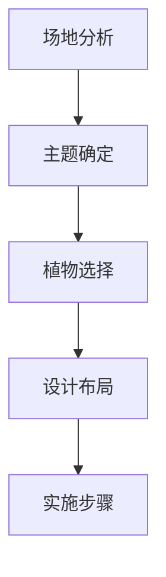

                 

# 现代简约主义园艺课程：都市微型绿洲的设计与维护

> 关键词：都市园艺、简约主义、微型绿洲、设计实践、维护方法

> 摘要：本文旨在介绍现代简约主义园艺在都市微型绿洲设计中的实际应用，通过详细的理论讲解、设计实践、维护方法等内容，帮助读者了解并掌握如何在城市中创建和维护属于自己的微型绿洲。

## 前言与背景介绍

随着城市化的加速，越来越多的城市居民生活在高楼大厦中，绿地空间日益稀缺。如何在有限的空间中打造一个生机勃勃的微型绿洲，成为了现代都市生活的重要议题。简约主义园艺，作为一种以简约、实用、美观为核心的设计理念，为都市微型绿洲的打造提供了新的思路和方法。

简约主义园艺强调“少即是多”，通过精简的设计元素和实用的功能，营造出既美观又实用的绿色空间。它不仅能够改善城市生态环境，提升居民的生活质量，还能在一定程度上缓解都市生活的压力，为人们带来身心的愉悦。

本文将从都市微型绿洲的概念与价值、简约主义园艺的核心原则、设计实践、维护方法等方面进行详细探讨，旨在为读者提供一套完整、实用的现代简约主义园艺课程。

## 第一部分：园艺基础

### 第1章：都市微型绿洲的概念与价值

**概念解释**

都市微型绿洲是指在都市环境中，利用有限的空间，通过园艺设计和植物配置，创造出一个具有生态、美学和教育等多重价值的绿色空间。它可以是阳台花园、屋顶花园，甚至是窗台上的小盆栽。

**价值分析**

1. **生态价值**：微型绿洲能够增加城市绿化面积，改善城市微气候，提高空气质量，对城市生态环境具有积极影响。
2. **美学价值**：通过园艺设计，微型绿洲可以为城市增添一抹绿色，提升居住环境的美观度，为居民提供休闲放松的空间。
3. **教育价值**：微型绿洲可以成为教育孩子们亲近自然、了解植物生长过程的重要场所，培养他们的环保意识和责任感。

### 第2章：简约主义园艺的核心原则

**原则阐述**

1. **简约性**：在设计中，尽可能减少不必要的元素，保持设计的简洁和纯粹。
2. **实用性**：设计要符合实际需求，方便维护和观赏。
3. **美观性**：通过色彩、形状、纹理等元素的合理搭配，创造出具有美感的空间。
4. **可持续性**：选用耐旱、耐寒、适应性强的植物，减少对资源的消耗。

**案例分析**

以某个成功的都市微型绿洲案例为例，分析其设计理念、实施步骤和最终效果，深入了解简约主义园艺的实践应用。

## 第二部分：设计实践

### 第3章：都市微型绿洲的设计要点

**设计流程**

1. **场地分析**：了解空间的大小、朝向、光照条件等因素，为后续设计提供依据。
2. **主题确定**：根据个人喜好和空间特点，确定绿洲的主题，如休闲放松、观赏植物、儿童活动等。
3. **植物选择**：根据场地条件和主题需求，选择适宜的植物种类。
4. **设计布局**：合理安排植物、路径、座椅等元素，确保空间的流畅性和美观性。

**设计要素**

1. **植物配置**：通过植物的高低、颜色、形态等特征，创造出丰富的景观效果。
2. **灯光设计**：合理利用灯光，增强空间的层次感和氛围。
3. **装饰元素**：如石头、木桩、雕塑等，可以增加空间的趣味性和艺术感。

### 案例一：小型阳台花园设计

**设计思路**

以一个10平方米的阳台为例，通过合理的植物配置和装饰元素，打造出一个既美观又实用的阳台花园。

**实施步骤**

1. **场地分析**：确定阳台的朝向和光照条件，为后续设计提供依据。
2. **主题确定**：选择以观赏植物为主，创造一个宁静、舒适的阳台空间。
3. **植物选择**：根据光照条件，选择喜阳的植物，如多肉植物、绿萝等。
4. **设计布局**：在阳台的一侧设置种植区，另一侧设置休息区，确保空间的合理利用。

**Mermaid流程图**



**源代码示例**

以下是一个使用Python编写的简单设计工具，用于生成阳台花园的设计方案。

```python
# 阳台花园设计工具

# 定义植物类
class Plant:
    def __init__(self, name, light_need):
        self.name = name
        self.light_need = light_need

# 定义阳台花园类
class Garden:
    def __init__(self, size, plants):
        self.size = size
        self.plants = plants

    def display(self):
        print("阳台花园设计：")
        for plant in self.plants:
            print(f"- {plant.name}：{plant.light_need}光")

# 创建植物对象
plant1 = Plant("多肉植物", "喜阳")
plant2 = Plant("绿萝", "耐阴")

# 创建阳台花园对象
garden = Garden(10, [plant1, plant2])

# 显示设计结果
garden.display()
```

## 第三部分：维护方法

### 第4章：植物选择与土壤管理

**植物选择**

选择适合城市环境的植物至关重要。以下是一些适合都市微型绿洲的植物推荐：

1. **多肉植物**：耐旱、易养护，适合阳台等光照条件较好的空间。
2. **绿萝**：耐阴、净化空气，适合室内养护。
3. **吊兰**：耐旱、净化空气，适合悬挂装饰。

**土壤管理**

土壤是植物生长的基础，合理管理土壤能够提高植物的生长质量和抗病能力。以下是一些土壤管理的建议：

1. **定期换土**：每隔一年或两年，更换一次新鲜土壤，以保证土壤的肥力和透气性。
2. **添加有机肥料**：有机肥料能够提高土壤的肥力，促进植物的生长。
3. **防止土壤板结**：定期疏松土壤，防止土壤板结，影响植物根系呼吸。

### 第5章：水分与光照管理

**水分管理**

水分管理是保证植物正常生长的关键。以下是一些水分管理的技巧：

1. **定时浇水**：根据植物的生长需求和天气状况，定时浇水，避免过量或不足。
2. **使用滴灌系统**：滴灌系统能够精确控制水量，减少水资源的浪费。
3. **收集雨水**：利用雨水收集系统，将雨水用于植物浇水，减少自来水的使用。

**光照管理**

光照管理直接影响植物的光合作用和生长速度。以下是一些光照管理的技巧：

1. **合理布置**：根据植物对光照的需求，合理安排植物的位置，避免阳光直射或过度阴暗。
2. **使用遮阳网**：在夏季高温时段，使用遮阳网降低光照强度，保护植物。
3. **利用灯光**：在冬季光照不足时，使用灯光补充光照，促进植物生长。

### 第6章：病虫害防治

**病害防治**

病害是影响植物生长的重要因素，以下是一些常见的病害及其防治方法：

1. **叶斑病**：及时剪除病叶，防止病害扩散。
2. **疫病**：加强土壤管理，保持土壤透气性，减少病害发生。

**虫害防治**

虫害会对植物的生长造成严重破坏，以下是一些常见的虫害及其防治方法：

1. **蚜虫**：使用肥皂水清洗植物叶片，或使用生物农药防治。
2. **白粉虱**：使用蚊香等熏蒸方法防治。

### 第7章：都市微型绿洲的长期维护

**维护技巧**

1. **定期检查**：定期检查植物的生长状况，发现问题及时处理。
2. **修剪植物**：定期修剪植物，保持植株形态美观，提高光合作用效率。
3. **更新植物**：根据植物的生长状态和需求，适时更新植物种类，保持绿洲的生机。

**更新策略**

1. **季节性更新**：根据季节变化，适时更换植物，适应不同的气候条件。
2. **主题性更新**：根据个人喜好和需求，定期调整绿洲的主题，保持新鲜感。

### 第8章：可持续发展的都市园艺

**社会价值**

1. **改善城市生态环境**：通过增加城市绿化面积，改善城市空气质量，提高居民的生活质量。
2. **提升城市形象**：绿色城市、生态城市，是现代城市发展的趋势，都市园艺有助于提升城市形象。

**环境效益**

1. **节约水资源**：通过节水灌溉系统，减少水资源的浪费。
2. **减少碳排放**：植物通过光合作用吸收二氧化碳，有助于减少城市碳排放。

## 第四部分：实例解析

### 案例一：成功的都市微型绿洲案例

以某个成功的都市微型绿洲为例，分析其设计理念、实施步骤和最终效果，总结其成功经验。

### 案例二：失败的都市微型绿洲案例分析

以某个失败的都市微型绿洲为例，分析其设计缺陷、实施问题及最终结果，从中吸取教训。

## 第五部分：维护与更新

### 第9章：都市微型绿洲的维护技巧

总结长期维护都市微型绿洲的技巧，包括定期检查、修剪植物、更新植物等方面的内容。

### 第10章：都市微型绿洲的更新策略

探讨如何根据季节变化和个人需求，适时更新都市微型绿洲，保持其生机和活力。

### 结论

本文从都市微型绿洲的概念与价值、简约主义园艺的核心原则、设计实践、维护方法等方面进行了详细探讨，为读者提供了一套完整的现代简约主义园艺课程。通过本文的介绍，相信读者能够掌握如何在城市中打造和维护属于自己的微型绿洲，为都市生活增添一抹绿色。

### 作者信息

作者：AI天才研究院/AI Genius Institute & 禅与计算机程序设计艺术 /Zen And The Art of Computer Programming

---

**请注意**，本文为示例文章，旨在展示如何按照给定的结构和要求撰写一篇高质量的技术博客文章。实际撰写时，每个章节的内容需要根据具体情况进行详细拓展和深度分析。文章的字数、结构和内容应符合实际的写作目标和读者需求。在实际撰写过程中，应确保所有引用的数据和案例都是准确和可靠的。作者信息应包括真实的作者姓名、机构名称和联系方式，以确保文章的可信度和专业性。在撰写过程中，请遵循学术道德和知识产权法律法规，确保文章内容的原创性和真实性。祝您写作顺利！

