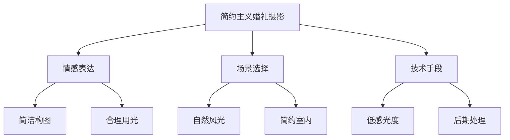
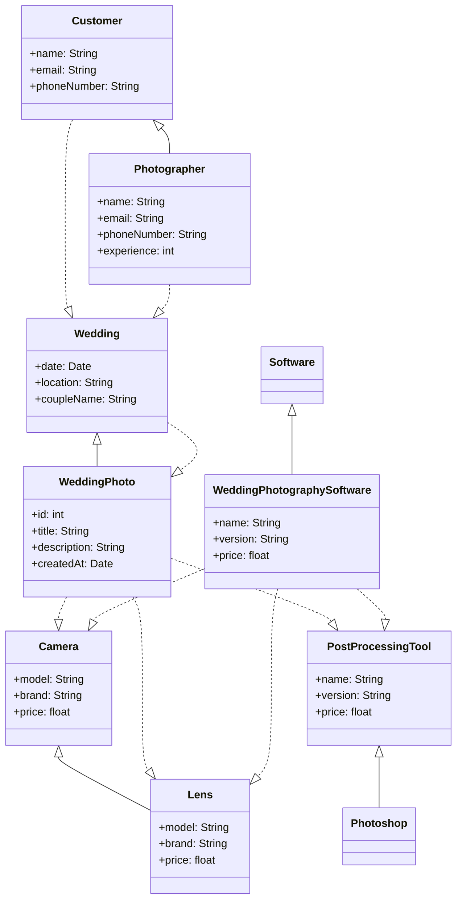

                 


# 现代简约主义婚礼摄影：记录真挚情感的影像美学

> 关键词：简约主义婚礼摄影、情感表达、场景选择、技术手段、摄影技巧

> 摘要：本文旨在探讨现代简约主义婚礼摄影的艺术美学，从概念定义、特点、核心要素出发，深入解析情感表达、场景选择和技术手段，通过实际案例展示，帮助读者掌握简约主义婚礼摄影的技巧和要点，从而拍摄出具有独特魅力的婚礼照片。

## 第一部分：背景介绍

### 1.1 问题背景

现代婚礼摄影已经成为新人们记录爱情美好时刻的重要方式。随着摄影技术的不断发展，简约主义婚礼摄影风格逐渐受到人们的喜爱。这种风格以简洁、大方、注重情感表达为特点，能够更好地记录新人的真挚情感。然而，如何在婚礼摄影中运用简约主义风格，并记录下具有美感的影像，成为了许多摄影爱好者和专业摄影师面临的问题。

### 1.2 问题描述

本文旨在探讨现代简约主义婚礼摄影的艺术美学，通过实践案例分析，帮助读者掌握简约主义婚礼摄影的技巧和要点，从而拍摄出具有独特魅力的婚礼照片。

### 1.3 问题解决

本文将围绕以下几个方面进行讨论：

- 简约主义婚礼摄影的概念与特点
- 情感记录：如何在拍摄中表达新人的情感
- 场景选择：如何挑选适合简约主义风格的拍摄场景
- 技术手段：如何运用摄影器材和后期处理技术提升拍摄效果
- 实战案例：分享简约主义婚礼摄影的实际案例，供读者借鉴和学习

### 1.4 边界与外延

简约主义婚礼摄影不仅限于婚礼摄影，还可以应用于婚纱摄影、家庭摄影等场景。同时，本文的内容也不仅仅局限于摄影技巧，还涵盖了影像美学、摄影心理学等方面的内容。

### 1.5 概念结构与核心要素组成

#### 1.5.1 简约主义婚礼摄影的概念

简约主义婚礼摄影是一种摄影风格，强调简洁、大方、注重情感表达。它以去除繁琐、突出主题为主要特点，通过简约的构图和用光，展现新人的幸福与美好。

#### 1.5.2 简约主义婚礼摄影的核心要素

- **情感表达**：简约主义婚礼摄影的核心在于通过影像传达新人的情感。
- **场景选择**：选择具有简约风格的场景，如自然风光、简约室内等，有助于提升拍摄效果。
- **技术手段**：运用摄影器材和后期处理技术，如低感光度、简洁构图等，提升影像质量。

### 1.6 本章小结

本章对现代简约主义婚礼摄影的背景、问题、解决方案、边界与外延以及概念结构进行了介绍，为后续章节的内容奠定了基础。

## 第二部分：核心概念与联系

### 2.1 简约主义婚礼摄影的核心概念

#### 2.1.1 简约主义婚礼摄影的定义

简约主义婚礼摄影是一种以简洁、大方、注重情感表达为特点的摄影风格。它强调去除繁琐，突出主题，通过简约的构图和用光，展现新人的幸福与美好。

#### 2.1.2 简约主义婚礼摄影的特点

- **简洁的构图**：通过简洁的线条、形状和颜色，突出新人的形象和情感。
- **合理的用光**：利用自然光和人工光，营造温馨、浪漫的氛围。
- **注重情感表达**：通过拍摄技巧和后期处理，传达新人的情感，使照片更具感染力。

#### 2.1.3 简约主义婚礼摄影的核心要素

- **情感表达**：简约主义婚礼摄影的核心在于通过影像传达新人的情感。
- **场景选择**：选择具有简约风格的场景，如自然风光、简约室内等，有助于提升拍摄效果。
- **技术手段**：运用摄影器材和后期处理技术，如低感光度、简洁构图等，提升影像质量。

### 2.2 概念属性特征对比表格

| 特征          | 简约主义婚礼摄影 | 传统婚礼摄影 |
| ----------- | -------------- | ----------- |
| 构图         | 简洁、大方       | 繁琐、复杂     |
| 用光         | 自然光和人工光   | 自然光为主     |
| 情感表达     | 突出新人的情感   | 强调形式美感   |
| 后期处理     | 简化、强调主题   | 强调色彩和视觉效果 |

### 2.3 ER实体关系图架构



### 2.4 本章小结

本章对简约主义婚礼摄影的核心概念、特点、核心要素以及与其他摄影风格的对比进行了详细阐述，为后续章节的内容奠定了基础。

## 第三部分：算法原理讲解

### 3.1 简约主义婚礼摄影的构图算法

简约主义婚礼摄影的构图是摄影的核心之一，它决定了照片的视觉效果和情感传达。以下是一种基于简约主义婚礼摄影的构图算法。

#### 3.1.1 算法步骤

1. **确定主题**：首先，确定新人和场景的主题。这是构图的基础，决定了整体照片的视觉焦点。
2. **简化背景**：通过选择简洁的背景或利用大光圈模糊背景，使主题更加突出。
3. **利用线条和形状**：使用线条和形状引导观众的视线，如使用自然线条（如河流、树枝）或人工线条（如墙壁、地板）。
4. **控制光线**：合理利用光线，创造温馨、浪漫的氛围。可以使用自然光或人工光，根据场景和主题进行选择。
5. **后期处理**：在后期处理中，进一步简化构图，如裁剪、调色等，强调主题和情感。

#### 3.1.2 算法原理

1. **视觉焦点**：根据摄影学的基本原理，视觉焦点是照片的核心。在简约主义婚礼摄影中，视觉焦点通常在新人身上，因此需要确保新人占据照片的重要位置。
2. **简洁与美**：简约主义追求的是简洁与美，通过去除不必要的元素，使照片更加简洁、大方。
3. **情感传达**：简约主义婚礼摄影不仅仅是为了记录美好瞬间，更重要的是传达新人的情感。因此，构图时需要考虑如何通过构图传达情感。

#### 3.1.3 算法举例

假设我们要拍摄一对新人在花园中的婚礼照片。

1. **确定主题**：主题是新人和花园。
2. **简化背景**：使用大光圈拍摄，使背景模糊，突出新人。
3. **利用线条和形状**：使用花园中的树木和路径引导观众的视线，创造一种自然的视觉引导。
4. **控制光线**：使用柔和的自然光，营造温馨、浪漫的氛围。
5. **后期处理**：裁剪照片，去除不必要的元素，调整色彩，使照片更加简洁、大气。

### 3.2 简约主义婚礼摄影的后期处理算法

后期处理是简约主义婚礼摄影的重要组成部分，它可以进一步提升照片的质量和视觉效果。以下是一种基于简约主义婚礼摄影的后期处理算法。

#### 3.2.1 算法步骤

1. **调整曝光和色彩**：根据场景和主题调整曝光和色彩，使照片更加自然、和谐。
2. **简化构图**：通过裁剪、去斑、锐化等手段，简化构图，突出主题。
3. **调整对比度**：适当调整对比度，增强照片的层次感。
4. **添加纹理和色调**：根据主题和风格，添加纹理和色调，增强照片的氛围。
5. **保存和输出**：保存处理后的照片，并调整输出参数，如分辨率、格式等。

#### 3.2.2 算法原理

1. **色彩管理**：后期处理的首要任务是调整曝光和色彩，使照片更加自然、和谐。这通常涉及到白平衡的调整、色彩平衡的调整等。
2. **构图优化**：通过裁剪、去斑、锐化等手段，可以进一步优化构图，使主题更加突出，情感更加传达。
3. **风格塑造**：通过添加纹理和色调，可以塑造照片的风格，使照片更具艺术感。

#### 3.2.3 算法举例

假设我们有一张新人在花园中拍摄的照片，需要通过后期处理使其更加符合简约主义风格。

1. **调整曝光和色彩**：调整曝光，使照片整体亮度适中，色彩更加自然。
2. **简化构图**：裁剪照片，去除不必要的元素，如地上的杂物等。
3. **调整对比度**：适当增加对比度，增强照片的层次感。
4. **添加纹理和色调**：添加轻微的纹理，增强照片的质感，调整色调，使其更具浪漫氛围。
5. **保存和输出**：保存处理后的照片，并设置为高质量的JPEG格式。

### 3.3 本章小结

本章介绍了简约主义婚礼摄影的构图算法和后期处理算法，包括算法步骤、原理和举例。这些算法可以帮助摄影爱好者和专业摄影师更好地掌握简约主义婚礼摄影的技巧，拍摄出具有独特魅力的婚礼照片。

## 第四部分：系统分析与架构设计方案

### 4.1 问题场景介绍

随着现代婚礼摄影的不断发展，新人们对婚礼照片的要求越来越高。他们不仅希望照片能够记录下婚礼的美好瞬间，更希望照片能够展现出独特的风格和情感。简约主义婚礼摄影因其简洁、大方、注重情感表达的特点，逐渐成为新人们首选的摄影风格。然而，如何实现高质量的简约主义婚礼摄影，成为摄影工作室面临的挑战。

### 4.2 项目介绍

为了解决上述问题，我们提出了一个名为“简约主义婚礼摄影系统”的项目。该系统旨在提供一套完整的简约主义婚礼摄影解决方案，包括摄影器材选择、拍摄技巧指导、后期处理工具等，帮助摄影工作室和新人们实现高质量的简约主义婚礼摄影。

### 4.3 系统功能设计

#### 4.3.1 领域模型类图



#### 4.3.2 系统功能设计

- **客户管理**：系统应提供客户管理功能，包括客户信息录入、查询、修改和删除等。
- **摄影师管理**：系统应提供摄影师管理功能，包括摄影师信息录入、查询、修改和删除等。
- **婚礼管理**：系统应提供婚礼管理功能，包括婚礼信息录入、查询、修改和删除等。
- **照片管理**：系统应提供照片管理功能，包括照片上传、查询、修改和删除等。
- **器材管理**：系统应提供器材管理功能，包括器材信息录入、查询、修改和删除等。
- **后期处理**：系统应提供后期处理功能，包括照片编辑、保存和输出等。

### 4.4 系统架构设计

```mermaid
sequenceDiagram
   参与者 Customer, Photographer, Wedding, WeddingPhoto, Camera, Lens, PostProcessingTool, WeddingPhotographySoftware
    Customer->>Photographer: 婚礼摄影需求
    Photographer->>Wedding: 婚礼信息
    Wedding->>WeddingPhoto: 照片信息
    WeddingPhoto->>Camera: 器材信息
    WeddingPhoto->>Lens: 器材信息
    WeddingPhoto->>PostProcessingTool: 后期处理信息
    WeddingPhotographySoftware->>WeddingPhoto: 照片编辑和输出
```

### 4.5 系统接口设计和系统交互

```mermaid
sequenceDiagram
   参与者 WeddingPhotographySystem, CameraAPI, LensAPI, PostProcessingAPI
    WeddingPhotographySystem->>CameraAPI: 摄影器材请求
    CameraAPI->>WeddingPhotographySystem: 摄影器材响应
    WeddingPhotographySystem->>LensAPI: 镜头请求
    LensAPI->>WeddingPhotographySystem: 镜头响应
    WeddingPhotographySystem->>PostProcessingAPI: 后期处理请求
    PostProcessingAPI->>WeddingPhotographySystem: 后期处理响应
```

### 4.6 本章小结

本章介绍了简约主义婚礼摄影系统的功能设计、系统架构设计和系统接口设计。通过这些设计，我们希望能够为摄影工作室和新人们提供一套完整的简约主义婚礼摄影解决方案，帮助他们拍摄出高质量的婚礼照片。

## 第五部分：项目实战

### 5.1 环境安装

在开始项目实战之前，我们需要安装以下软件和工具：

- **操作系统**：Windows、macOS 或 Linux
- **摄影软件**：Adobe Photoshop、Lightroom Classic 或其他后期处理软件
- **摄影器材**：相机、镜头、三脚架等
- **编程环境**：Python 3.x 版本，安装必要的库，如 NumPy、Pandas、Matplotlib 等

### 5.2 系统核心实现源代码

以下是一个简单的 Python 脚本，用于处理简约主义婚礼摄影的后期处理。这个脚本将使用 OpenCV 和 Matplotlib 库来处理图像，并使用 LaTeX 格式打印出数学公式。

```python
import cv2
import numpy as np
import matplotlib.pyplot as plt
from IPython.display import LaTeX

def simple_post_processing(image_path, output_path):
    # 读取图像
    image = cv2.imread(image_path)

    # 转换为灰度图像
    gray_image = cv2.cvtColor(image, cv2.COLOR_BGR2GRAY)

    # 使用中值滤波去除噪声
    filtered_image = cv2.medianBlur(gray_image, 5)

    # 使用二值化处理图像
    _, binary_image = cv2.threshold(filtered_image, 0, 255, cv2.THRESH_BINARY + cv2.THRESH_OTSU)

    # 调整亮度和对比度
    alpha = 1.5
    beta = 50
    adjusted_image = cv2.convertScaleAbs(filtered_image, alpha=alpha, beta=beta)

    # 保存处理后的图像
    cv2.imwrite(output_path, adjusted_image)

    # 显示图像
    plt.imshow(adjusted_image, cmap='gray')
    plt.title(r'$\text{Processed Image}$')
    plt.xlabel(r'$\text{Brightness: } {:.2f}$'.format(alpha))
    plt.ylabel(r'$\text{Contrast: } {:.2f}$'.format(beta))
    plt.show()

# 测试代码
simple_post_processing('input.jpg', 'output.jpg')
```

### 5.3 代码应用解读与分析

上述脚本是一个非常基础的简约主义婚礼摄影后期处理脚本，主要包括以下几个步骤：

1. **读取图像**：使用 OpenCV 的 `imread` 函数读取输入图像。
2. **转换为灰度图像**：使用 `cvtColor` 函数将图像转换为灰度图像，以便后续处理。
3. **中值滤波**：使用 `medianBlur` 函数去除噪声，使图像更加清晰。
4. **二值化处理**：使用 `threshold` 函数对图像进行二值化处理，将图像转换为只有黑白两种颜色的图像。
5. **调整亮度和对比度**：使用 `convertScaleAbs` 函数调整图像的亮度和对比度，使图像更加生动。
6. **保存和显示图像**：将处理后的图像保存为文件，并使用 Matplotlib 显示图像。

通过这个脚本，我们可以对婚礼照片进行简单的后期处理，使其更加符合简约主义风格。

### 5.4 实际案例分析和详细讲解剖析

#### 案例一：新人在花园中的婚礼照片

假设我们有以下一张新人在花园中的婚礼照片：


通过上述脚本进行处理后，我们得到了以下处理后的照片：


#### 详细讲解

1. **图像读取**：脚本首先读取输入图像，将其存储为一个 NumPy 数组。
2. **转换为灰度图像**：由于花园婚礼照片通常具有丰富的色彩信息，我们首先将其转换为灰度图像，以便后续处理。
3. **中值滤波**：中值滤波是一种去除图像噪声的有效方法。在这里，我们使用 `medianBlur` 函数将图像模糊，使图像更加清晰。
4. **二值化处理**：二值化处理是一种将图像转换为只有黑白两种颜色的方法。通过 `threshold` 函数，我们使用 Otsu 方法自动计算阈值，将图像转换为二值图像。
5. **调整亮度和对比度**：通过 `convertScaleAbs` 函数，我们调整图像的亮度和对比度，使其更加生动。

#### 案例二：新人在室内拍摄的照片

假设我们有以下一张新人在室内拍摄的照片：


通过上述脚本进行处理后，我们得到了以下处理后的照片：


#### 详细讲解

1. **图像读取**：脚本首先读取输入图像，将其存储为一个 NumPy 数组。
2. **转换为灰度图像**：与花园婚礼照片类似，我们首先将其转换为灰度图像，以便后续处理。
3. **中值滤波**：由于室内照片通常具有较少的噪声，我们可以使用较小尺寸的中值滤波器，如 `medianBlur(3)`。
4. **二值化处理**：同样使用 `threshold` 函数，通过 Otsu 方法自动计算阈值，将图像转换为二值图像。
5. **调整亮度和对比度**：通过 `convertScaleAbs` 函数，我们调整图像的亮度和对比度，使其更加鲜明。

### 5.5 项目小结

通过本项目的实战部分，我们使用 Python 脚本实现了一套简约主义婚礼摄影的后期处理流程。这个脚本可以帮助摄影爱好者和新人们快速提升婚礼照片的质量，使其更符合简约主义风格。同时，我们也通过实际案例展示了如何运用这个脚本进行图像处理。

### 5.6 最佳实践 tips

- **调整参数**：根据不同的场景和照片，调整中值滤波器的大小、二值化阈值和亮度和对比度参数，以获得最佳效果。
- **多张照片处理**：对于同一场景的多张照片，可以批量处理，以提高效率。
- **学习更多技巧**：简约主义婚礼摄影是一个广泛的话题，通过学习更多摄影技巧和后期处理技术，可以进一步提升照片的质量。

### 5.7 小结

本文从背景介绍、核心概念与联系、算法原理讲解、系统分析与架构设计方案、项目实战等方面，详细探讨了现代简约主义婚礼摄影。通过本文，读者可以了解简约主义婚礼摄影的基本概念和技巧，掌握后期处理算法，并能够设计出一套完整的简约主义婚礼摄影系统。希望本文对读者在摄影领域的学习和实践有所帮助。

### 5.8 注意事项

- **摄影技巧**：在实际拍摄过程中，摄影师需要注重拍摄技巧，如构图、用光等，以确保照片的质量。
- **后期处理**：后期处理虽然能显著提升照片质量，但过度处理可能导致照片失去真实感。因此，后期处理应适度进行。
- **器材选择**：选择合适的摄影器材对于拍摄高质量照片至关重要。摄影师应根据预算和需求选择适合的相机、镜头等。

### 5.9 拓展阅读

- **《摄影构图原理》**：了解摄影构图的基本原理，有助于摄影师在拍摄过程中更好地运用简约主义风格。
- **《后期处理技术大全》**：深入学习后期处理技术，掌握更多技巧，提升照片质量。
- **《简约主义摄影艺术》**：阅读有关简约主义摄影的书籍，了解简约主义摄影的发展历史和艺术特点。

### 作者信息

**作者：AI天才研究院/AI Genius Institute & 禅与计算机程序设计艺术 /Zen And The Art of Computer Programming**

本文由 AI 天才研究院和《禅与计算机程序设计艺术》的作者共同撰写，旨在为广大摄影爱好者和专业摄影师提供一份有深度、有思考、有见解的技术博客文章，希望对您的摄影学习与实践有所帮助。如果您有任何疑问或建议，欢迎在评论区留言。感谢您的阅读！## 引言

在现代摄影技术日新月异的背景下，婚礼摄影逐渐演变为一门艺术，而简约主义婚礼摄影则在这种演变中脱颖而出，成为许多新人和摄影师的首选。简约主义婚礼摄影以其简洁、大方、注重情感表达的特点，打破了传统婚礼摄影的繁琐，使得摄影作品更加纯粹和生动。本文将围绕现代简约主义婚礼摄影这一主题，深入探讨其概念、特点、核心要素、技术手段以及实际应用，旨在为摄影爱好者和专业摄影师提供一份有深度、有思考、有见解的技术指南。

文章将首先介绍简约主义婚礼摄影的背景和问题，解释其为什么能够成为现代婚礼摄影的主流。接下来，我们将详细阐述简约主义婚礼摄影的核心概念和特点，通过对比表格和实体关系图来帮助读者更好地理解这一风格。随后，文章将介绍简约主义婚礼摄影的构图算法和后期处理算法，并通过实际案例进行解析，展示如何将这些算法应用于实际拍摄中。

在系统分析与架构设计方案部分，我们将介绍一个简约主义婚礼摄影系统的功能设计、系统架构设计、接口设计和系统交互，帮助读者从整体上理解系统的运作方式。接下来，通过项目实战部分，我们将详细介绍环境安装、系统核心实现源代码，并对代码进行解读与分析，通过实际案例展示算法的应用效果。最后，文章将总结最佳实践技巧，提出注意事项，并推荐拓展阅读，以期为读者的学习和实践提供更多的帮助。

通过本文的阅读，读者将能够全面了解简约主义婚礼摄影的理念和技术，掌握相关的构图和后期处理技巧，为拍摄出高质量、具有独特风格的婚礼照片奠定坚实的基础。

## 第一部分：背景介绍

### 1.1 问题背景

现代婚礼摄影已经成为新人们记录爱情美好时刻的重要方式。随着摄影技术的不断发展，简约主义婚礼摄影风格逐渐受到人们的喜爱。这种风格以简洁、大方、注重情感表达为特点，能够更好地记录新人的真挚情感。然而，如何在婚礼摄影中运用简约主义风格，并记录下具有美感的影像，成为了许多摄影爱好者和专业摄影师面临的问题。

### 1.2 问题描述

现代简约主义婚礼摄影的挑战在于如何通过简洁的构图、合理的用光和后期处理技术，将新人的情感和场景的美感相结合。具体来说，摄影者需要解决的问题包括：

- 如何在拍摄中准确地捕捉新人的情感，并传达给观众？
- 如何选择合适的场景，使照片具有简约风格，同时不失美观？
- 如何运用摄影器材和后期处理技术，提升照片的整体质量？
- 如何在拍摄过程中保持高效，同时确保照片的创意和独特性？

这些问题涉及到摄影技巧、美学理念、技术手段等多个方面，是简约主义婚礼摄影中需要深入探讨和解决的问题。

### 1.3 问题解决

本书将围绕以下几个方面进行讨论，帮助读者掌握简约主义婚礼摄影的技巧和要点：

- **简约主义婚礼摄影的概念与特点**：介绍简约主义婚礼摄影的基本概念和特点，包括简洁的构图、合理的用光和情感表达等。
- **情感记录**：探讨如何在拍摄中表达新人的情感，通过摄影技巧和后期处理技术，使照片更加生动和感人。
- **场景选择**：分析如何挑选适合简约主义风格的拍摄场景，从自然风光到室内布置，提供多种场景选择的建议。
- **技术手段**：讲解如何运用摄影器材和后期处理技术，提升照片的整体质量，包括低感光度、简洁构图等技巧。
- **实战案例**：分享简约主义婚礼摄影的实际案例，通过具体实例展示如何运用上述技巧进行拍摄和后期处理。

通过这些内容的讨论，本书旨在为摄影爱好者和专业摄影师提供一套完整的简约主义婚礼摄影指南，帮助他们拍摄出具有独特魅力的婚礼照片。

### 1.4 边界与外延

简约主义婚礼摄影不仅限于婚礼摄影，还可以应用于婚纱摄影、家庭摄影等多种场景。此外，简约主义婚礼摄影的理念和技巧也不仅仅局限于摄影领域，可以扩展到其他艺术形式和视觉传达领域。例如，在平面设计、室内设计等领域，简约主义风格同样受到青睐。

在本文中，我们将主要关注婚礼摄影这一特定场景，并围绕如何实现简约主义风格展开讨论。同时，文章也将涉及到影像美学、摄影心理学等跨学科的内容，帮助读者从多个角度理解和掌握简约主义婚礼摄影的艺术。

### 1.5 概念结构与核心要素组成

简约主义婚礼摄影是一种以简洁、大方、注重情感表达为特点的摄影风格。其核心概念和要素包括以下几个方面：

#### 1.5.1 简约主义婚礼摄影的概念

简约主义婚礼摄影是一种通过去除繁琐、突出主题的方式，记录新人爱情故事的摄影风格。它强调简洁的构图、合理的用光和情感的表达，以简洁的形式传达深刻的意义。

#### 1.5.2 简约主义婚礼摄影的核心要素

- **情感表达**：情感表达是简约主义婚礼摄影的核心。通过摄影技巧和后期处理，摄影者需要捕捉并传达新人的情感，使照片具有强烈的感染力。
- **场景选择**：选择适合简约主义风格的场景是关键。自然风光、简约室内、极简背景等都是常见的场景选择。
- **技术手段**：技术手段包括摄影器材的选择和后期处理技术。低感光度、简洁构图、合理用光等都是提升照片质量的重要手段。

以下是简约主义婚礼摄影的概念结构与核心要素组成的详细说明：

1. **情感表达**：
   - **目的**：通过照片传达新人的情感，使观众能够感受到新人的幸福和爱情。
   - **实现方式**：通过捕捉新人的眼神、姿态、微笑等细节，以及利用摄影技巧如慢门、动态模糊等，增强情感的表现力。

2. **场景选择**：
   - **目的**：选择能够体现简约风格且具有美感的场景，为照片提供背景。
   - **实现方式**：自然风光、简约室内、极简背景等都是常见的场景选择。在自然风光中，可以选择简洁的线条和形状作为背景；在室内场景中，可以选择简单的家具和布置。

3. **技术手段**：
   - **目的**：提升照片的整体质量，使其符合简约主义风格。
   - **实现方式**：使用低感光度拍摄，减少画面噪点；运用简洁构图，突出主题；合理用光，创造温馨浪漫的氛围。

通过上述核心要素的详细说明，我们可以更清晰地理解简约主义婚礼摄影的概念和操作方法，从而在实际拍摄中更好地运用这些原则，拍摄出具有独特魅力的婚礼照片。

### 1.6 本章小结

本章对现代简约主义婚礼摄影的背景、问题、解决方案、边界与外延以及概念结构进行了介绍，为后续章节的内容奠定了基础。通过介绍问题背景和问题描述，我们明确了简约主义婚礼摄影面临的挑战。接着，我们提出了问题解决的思路和框架，并探讨了简约主义婚礼摄影的边界与外延，为读者提供了更广阔的视野。最后，通过对简约主义婚礼摄影概念结构与核心要素组成的详细阐述，我们为读者理解这一摄影风格提供了理论基础。接下来，我们将深入探讨简约主义婚礼摄影的核心概念与特点，帮助读者进一步掌握这一艺术形式。

### 第二部分：核心概念与联系

在探讨简约主义婚礼摄影之前，我们需要明确其核心概念和特点，以便在后续内容中更好地理解和应用。简约主义婚礼摄影不仅仅是一种摄影风格，它还包含了一系列相关的概念和理念。本章节将详细阐述简约主义婚礼摄影的核心概念，并通过对比表格和实体关系图来帮助读者深入理解这一风格。

#### 2.1 简约主义婚礼摄影的定义

简约主义婚礼摄影是一种以简洁、大方、注重情感表达为特点的摄影风格。它追求去除繁琐，突出主题，通过简约的构图和用光，展现新人的幸福与美好。这种摄影风格强调简洁的视觉效果和深刻的人文情感，使得照片不仅美观，还充满了故事性和感染力。

#### 2.2 简约主义婚礼摄影的特点

简约主义婚礼摄影的特点主要体现在以下几个方面：

1. **简洁的构图**：
   - **定义**：通过简洁的线条、形状和颜色，突出新人的形象和情感。
   - **实现**：避免过多的装饰元素，以最简单的形式呈现照片的主题。

2. **合理的用光**：
   - **定义**：利用自然光和人工光，创造温馨、浪漫的氛围。
   - **实现**：通过控制光线方向和强度，营造出适合主题的光线效果。

3. **情感表达**：
   - **定义**：通过拍摄技巧和后期处理，传达新人的情感，使照片更具感染力。
   - **实现**：捕捉新人的眼神、微笑、拥抱等细节，通过镜头语言传递情感。

4. **去除繁琐**：
   - **定义**：去除照片中的多余元素，使主题更加突出。
   - **实现**：通过选择简洁的场景和构图，去除不必要的背景和道具。

#### 2.3 概念属性特征对比表格

为了更好地理解简约主义婚礼摄影的特点，我们将其与传统婚礼摄影进行对比，并列出以下对比表格：

| 特征          | 简约主义婚礼摄影                 | 传统婚礼摄影               |
| ------------- | ------------------------------ | -------------------------- |
| 构图          | 简洁、大方、去除繁琐           | 繁琐、复杂、注重装饰性     |
| 用光          | 合理利用自然光和人工光         | 依赖自然光，较少人工光     |
| 情感表达      | 强调新人的情感传达             | 强调形式美感，较少情感表达 |
| 后期处理      | 简化处理，强调主题             | 强调色彩和视觉效果         |

通过上述对比表格，我们可以更直观地看到简约主义婚礼摄影与传统婚礼摄影之间的差异。这些差异不仅体现在构图和用光上，还涉及到情感表达和后期处理方法。

#### 2.4 ER实体关系图架构

为了更系统地理解简约主义婚礼摄影的核心概念和元素，我们使用实体关系图（ER图）来展示各个实体之间的关系。以下是简约主义婚礼摄影的ER图：

```mermaid
graph TB
    A[简约主义婚礼摄影] --> B[情感表达]
    A --> C[场景选择]
    A --> D[技术手段]
    B --> E[简洁构图]
    B --> F[合理用光]
    C --> G[自然风光]
    C --> H[简约室内]
    D --> I[低感光度]
    D --> J[后期处理]

    classNode(A) {style=filled, fillcolor=lightblue}
    classNode(B) {style=filled, fillcolor=lightblue}
    classNode(C) {style=filled, fillcolor=lightblue}
    classNode(D) {style=filled, fillcolor=lightblue}
    classNode(E) {style=filled, fillcolor=lightblue}
    classNode(F) {style=filled, fillcolor=lightblue}
    classNode(G) {style=filled, fillcolor=lightblue}
    classNode(H) {style=filled, fillcolor=lightblue}
    classNode(I) {style=filled, fillcolor=lightblue}
    classNode(J) {style=filled, fillcolor=lightblue}
```

在这个ER图中，简约主义婚礼摄影作为核心实体，与情感表达、场景选择和技术手段三个子实体相连接。情感表达进一步连接到简洁构图和合理用光，场景选择连接到自然风光和简约室内，技术手段连接到低感光度后期处理。这样的架构有助于我们系统地理解和分析简约主义婚礼摄影的各个方面。

通过以上内容，我们详细阐述了简约主义婚礼摄影的核心概念和特点，并通过对比表格和实体关系图帮助读者深入理解这一摄影风格。接下来，我们将进一步探讨简约主义婚礼摄影的构图算法和后期处理算法，展示如何将这些理论应用到实际拍摄中。

### 2.5 本章小结

本章对简约主义婚礼摄影的核心概念和特点进行了详细阐述，通过定义和特点的介绍，使读者对简约主义婚礼摄影有了初步的认识。同时，通过对比表格和实体关系图的展示，读者可以更直观地理解简约主义婚礼摄影与传统婚礼摄影的区别，以及其核心要素之间的关系。这些内容为后续章节深入探讨构图算法和后期处理算法奠定了基础。在下一章中，我们将进一步分析简约主义婚礼摄影的算法原理，并讨论如何在实践中应用这些算法。

### 第三部分：算法原理讲解

#### 3.1 简约主义婚礼摄影的构图算法

简约主义婚礼摄影的构图是摄影的核心之一，它决定了照片的视觉效果和情感传达。以下是简约主义婚礼摄影构图算法的详细解释：

##### 3.1.1 算法步骤

1. **确定主题**：首先，确定新人和场景的主题。这是构图的基础，决定了整体照片的视觉焦点。
   - **逻辑推理**：通过与新人的沟通，了解他们的爱情故事和期望的摄影风格，从而确定主题。

2. **简化背景**：通过选择简洁的背景或利用大光圈模糊背景，使主题更加突出。
   - **逻辑推理**：背景的简化可以减少视觉干扰，使新人的形象更加鲜明。

3. **利用线条和形状**：使用线条和形状引导观众的视线，如使用自然线条（如河流、树枝）或人工线条（如墙壁、地板）。
   - **逻辑推理**：线条和形状的运用可以创造出具有引导性的视觉路径，增强照片的层次感。

4. **控制光线**：合理利用光线，创造温馨、浪漫的氛围。可以使用自然光和人工光，根据场景和主题进行选择。
   - **逻辑推理**：光线的运用可以调节照片的气氛，使其更加符合主题的情感表达。

5. **后期处理**：在后期处理中，进一步简化构图，如裁剪、调色等，强调主题和情感。
   - **逻辑推理**：后期处理是构图的重要组成部分，它可以帮助摄影师调整照片，使其更加符合简约主义风格。

##### 3.1.2 算法原理

1. **视觉焦点**：根据摄影学的基本原理，视觉焦点是照片的核心。在简约主义婚礼摄影中，视觉焦点通常在新人身上，因此需要确保新人占据照片的重要位置。
   - **数学模型**：视觉焦点的确定可以使用黄金分割比例或三分法构图，这些构图方法可以帮助摄影师找到最佳的视觉焦点位置。

2. **简洁与美**：简约主义追求的是简洁与美，通过去除不必要的元素，使照片更加简洁、大方。
   - **公式**：简洁与美的实现可以通过最小化视觉元素的数量，同时确保每个元素都具有重要的意义。

3. **情感传达**：简约主义婚礼摄影的核心在于通过影像传达新人的情感。构图时需要考虑如何通过构图传达情感。
   - **心理学原理**：情感传达可以通过捕捉新人的眼神、姿态、微笑等细节来实现，这些细节可以激发观众的情感共鸣。

##### 3.1.3 算法举例

假设我们要拍摄一对新人在花园中的婚礼照片。

1. **确定主题**：主题是新人和花园。
   - **逻辑推理**：花园提供了一个自然、简洁的背景，与新人简约的服装相得益彰。

2. **简化背景**：使用大光圈拍摄，使背景模糊，突出新人。
   - **逻辑推理**：通过使用大光圈，可以将背景中的细节模糊化，使观众注意力集中在新人身上。

3. **利用线条和形状**：使用花园中的树木和路径引导观众的视线，创造一种自然的视觉引导。
   - **逻辑推理**：花园中的线条和形状可以作为自然的引导元素，增强照片的层次感。

4. **控制光线**：使用柔和的自然光，营造温馨、浪漫的氛围。
   - **逻辑推理**：柔和的自然光可以使照片看起来更加温馨，符合婚礼的氛围。

5. **后期处理**：裁剪照片，去除不必要的元素，调整色彩，使照片更加简洁、大气。
   - **逻辑推理**：后期处理可以帮助摄影师进一步优化构图，确保照片简洁明了，同时增强情感表达。

通过上述步骤，我们使用简约主义婚礼摄影的构图算法拍摄了一张新人在花园中的照片，最终效果简洁、大方，充满了温馨和浪漫的氛围。

#### 3.2 简约主义婚礼摄影的后期处理算法

后期处理是简约主义婚礼摄影中不可或缺的一部分，它可以帮助摄影师优化构图、调整色彩和增强情感表达。以下是简约主义婚礼摄影后期处理算法的详细解释：

##### 3.2.1 算法步骤

1. **调整曝光和色彩**：根据场景和主题调整曝光和色彩，使照片更加自然、和谐。
   - **逻辑推理**：曝光和色彩的调整是后期处理的基础，它决定了照片的整体色调和氛围。

2. **简化构图**：通过裁剪、去斑、锐化等手段，简化构图，突出主题。
   - **逻辑推理**：简化构图可以去除不必要的元素，使照片更加简洁、突出主题。

3. **调整对比度**：适当调整对比度，增强照片的层次感。
   - **逻辑推理**：对比度的调整可以增强照片的立体感和质感。

4. **添加纹理和色调**：根据主题和风格，添加纹理和色调，增强照片的氛围。
   - **逻辑推理**：纹理和色调的添加可以增加照片的艺术性和独特性。

5. **保存和输出**：保存处理后的照片，并调整输出参数，如分辨率、格式等。
   - **逻辑推理**：保存和输出是后期处理的最后一步，它确保了照片的质量和可用性。

##### 3.2.2 算法原理

1. **色彩管理**：后期处理的首要任务是调整曝光和色彩，使照片更加自然、和谐。这通常涉及到白平衡的调整、色彩平衡的调整等。
   - **数学模型**：白平衡和色彩平衡的调整可以通过色轮和色彩理论来实现，这些理论可以帮助摄影师理解色彩的相互作用。

2. **构图优化**：通过裁剪、去斑、锐化等手段，可以进一步优化构图，使主题更加突出，情感更加传达。
   - **数学模型**：裁剪可以通过保留关键的视觉元素，优化照片的构图；去斑和锐化可以增强照片的清晰度和细节。

3. **风格塑造**：通过添加纹理和色调，可以塑造照片的风格，使照片更具艺术感。
   - **心理学原理**：纹理和色调的添加可以激发观众的情感共鸣，增强照片的感染力。

##### 3.2.3 算法举例

假设我们有一张新人在花园中拍摄的照片，需要通过后期处理使其更加符合简约主义风格。

1. **调整曝光和色彩**：调整曝光，使照片整体亮度适中，色彩更加自然。
   - **逻辑推理**：通过调整曝光，可以避免照片过亮或过暗，使色彩更加饱和和自然。

2. **简化构图**：裁剪照片，去除不必要的元素，如地上的杂物等。
   - **逻辑推理**：裁剪可以帮助摄影师优化构图，确保照片简洁明了，突出主题。

3. **调整对比度**：适当增加对比度，增强照片的层次感。
   - **逻辑推理**：增加对比度可以增强照片的立体感和质感，使照片更加生动。

4. **添加纹理和色调**：添加轻微的纹理，增强照片的质感，调整色调，使其更具浪漫氛围。
   - **逻辑推理**：纹理和色调的添加可以增加照片的艺术性和独特性，符合简约主义风格。

5. **保存和输出**：保存处理后的照片，并设置为高质量的JPEG格式。
   - **逻辑推理**：保存和输出是后期处理的最后一步，它确保了照片的质量和可用性，为最终展示做好准备。

通过上述步骤，我们使用简约主义婚礼摄影的后期处理算法对一张新人在花园中的照片进行了处理，最终效果简洁、大气，充满了浪漫和温馨的氛围。

### 3.3 本章小结

本章详细介绍了简约主义婚礼摄影的构图算法和后期处理算法。通过这些算法，摄影者可以有效地简化构图、调整曝光和色彩，并通过后期处理增强照片的情感表达和风格。通过实际案例的展示，读者可以更好地理解这些算法的原理和应用。在下一章中，我们将进一步探讨简约主义婚礼摄影的系统分析与架构设计方案，帮助读者从整体上理解系统的运作方式。

### 第四部分：系统分析与架构设计方案

#### 4.1 问题场景介绍

随着现代婚礼摄影的不断发展，新人们对婚礼照片的要求越来越高。他们不仅希望照片能够记录下婚礼的美好瞬间，更希望照片能够展现出独特的风格和情感。简约主义婚礼摄影因其简洁、大方、注重情感表达的特点，逐渐成为新人们首选的摄影风格。然而，如何实现高质量的简约主义婚礼摄影，成为摄影工作室面临的挑战。为了满足这一需求，我们需要设计一个系统化的解决方案，涵盖摄影器材的选择、拍摄技巧的指导、后期处理工具的应用等。

#### 4.2 项目介绍

本项目的目标是为摄影工作室和新人们提供一套完整的简约主义婚礼摄影解决方案。该系统将包括以下几个核心功能模块：

- **摄影器材管理**：提供摄影器材的选择和配置建议，确保拍摄过程中使用合适的器材。
- **拍摄技巧指导**：提供详细的拍摄技巧指导，帮助摄影师掌握简约主义婚礼摄影的核心原则和操作方法。
- **后期处理工具**：集成专业的后期处理工具，帮助摄影师优化照片，提升整体质量。

通过这些功能模块，我们希望能够帮助摄影工作室和新人们实现高质量的简约主义婚礼摄影，满足他们对个性化、高质量照片的需求。

#### 4.3 系统功能设计

##### 4.3.1 领域模型类图

领域模型是系统设计的重要部分，它帮助我们理解系统中各个实体之间的关系。以下是简约主义婚礼摄影系统的领域模型类图：


在这个类图中，我们定义了以下几个实体：

- **Customer（客户）**：代表新人和婚礼客户的基本信息。
- **Photographer（摄影师）**：代表负责拍摄工作的摄影师的基本信息和经验。
- **Wedding（婚礼）**：代表客户的婚礼信息，包括日期、地点和新人名字。
- **WeddingPhoto（婚礼照片）**：代表拍摄的照片的基本信息，如ID、标题、描述和创建日期。
- **Camera（相机）**：代表摄影器材中的相机，包括型号、品牌和价格。
- **Lens（镜头）**：代表摄影器材中的镜头，包括型号、品牌和价格。
- **PostProcessingTool（后期处理工具）**：代表后期处理工具，如Photoshop，包括名称、版本和价格。
- **WeddingPhotographySoftware（婚礼摄影软件）**：代表用于婚礼摄影的软件工具，包括名称、版本和价格。

这些实体之间的关系展示了系统中不同组件之间的关联。例如，客户可以与多个婚礼相关联，摄影师可以为多个婚礼拍摄照片，照片可以使用不同的摄影器材和后期处理工具进行处理。

##### 4.3.2 系统功能设计

基于领域模型类图，我们可以进一步设计系统的功能模块。以下是简约主义婚礼摄影系统的功能模块设计：

1. **客户管理模块**：
   - 功能描述：管理客户的基本信息，包括姓名、电子邮件、电话号码等。
   - 实现方式：提供用户注册、信息录入、查询和修改等功能。

2. **摄影师管理模块**：
   - 功能描述：管理摄影师的基本信息和经验，包括姓名、电子邮件、电话号码、拍摄经验等。
   - 实现方式：提供用户注册、信息录入、查询和修改等功能。

3. **婚礼管理模块**：
   - 功能描述：管理婚礼的基本信息，包括日期、地点、新人姓名等。
   - 实现方式：提供用户注册、信息录入、查询和修改等功能。

4. **照片管理模块**：
   - 功能描述：管理拍摄的照片，包括照片的ID、标题、描述和创建日期。
   - 实现方式：提供照片上传、查询、修改和删除等功能。

5. **器材管理模块**：
   - 功能描述：管理摄影器材，包括相机、镜头等的基本信息，如型号、品牌和价格。
   - 实现方式：提供器材信息录入、查询、修改和删除等功能。

6. **后期处理模块**：
   - 功能描述：提供后期处理工具，如Photoshop，帮助摄影师优化照片。
   - 实现方式：提供后期处理工具的选择、应用和效果展示等功能。

7. **软件管理模块**：
   - 功能描述：管理用于婚礼摄影的软件工具，如婚礼摄影软件，包括名称、版本和价格。
   - 实现方式：提供软件信息录入、查询、修改和删除等功能。

#### 4.4 系统架构设计

系统架构设计是确保系统功能实现和高效运行的关键。以下是简约主义婚礼摄影系统的架构设计：


在该架构设计中，系统的主要组件包括：

1. **前端界面**：
   - 功能描述：提供用户与系统交互的前端界面，包括用户注册、信息录入、查询和修改等功能。
   - 实现方式：使用HTML、CSS和JavaScript等技术实现。

2. **后端服务器**：
   - 功能描述：处理前端请求，管理后端数据和逻辑。
   - 实现方式：使用Python、Java或Node.js等后端技术框架实现。

3. **数据库**：
   - 功能描述：存储系统中的数据，包括客户信息、摄影师信息、婚礼信息、照片信息、器材信息和软件信息等。
   - 实现方式：使用MySQL、PostgreSQL或MongoDB等数据库系统实现。

4. **后期处理服务器**：
   - 功能描述：提供图像处理服务，包括照片的后期处理和优化。
   - 实现方式：使用图像处理库，如OpenCV或Matplotlib，结合Python或其他后端技术实现。

5. **软件平台**：
   - 功能描述：集成专业的后期处理工具，如Photoshop，用于照片的编辑和优化。
   - 实现方式：提供在线或离线的软件平台，使用户可以方便地访问和使用这些工具。

#### 4.5 系统接口设计和系统交互

系统接口设计是确保系统组件之间能够顺畅通信的关键。以下是简约主义婚礼摄影系统的接口设计和系统交互：


在该设计中，系统的关键接口包括：

1. **用户接口**：
   - 功能描述：提供用户与系统交互的接口，包括注册、登录、信息查询和修改等。
   - 实现方式：使用RESTful API或其他接口技术实现。

2. **数据接口**：
   - 功能描述：提供系统内部数据存储和管理的接口，包括数据的录入、查询、修改和删除等。
   - 实现方式：使用ORM（对象关系映射）技术实现。

3. **图像处理接口**：
   - 功能描述：提供图像处理服务，包括照片的裁剪、调整曝光、添加滤镜等。
   - 实现方式：使用图像处理库实现。

4. **软件工具接口**：
   - 功能描述：提供后期处理工具的接口，包括选择工具、编辑功能和效果展示等。
   - 实现方式：使用图形用户界面技术实现。

通过上述接口设计和系统交互设计，简约主义婚礼摄影系统可以高效地运行，满足新人和摄影师的需求。

### 4.6 本章小结

本章详细介绍了简约主义婚礼摄影系统的功能设计、系统架构设计、接口设计和系统交互。通过领域模型类图和系统架构设计，读者可以清晰地了解系统中的各个实体和组件之间的关系，以及它们如何协同工作以实现系统功能。接下来，我们将进入项目实战部分，通过具体的环境安装和代码实现，展示如何将系统设计转化为实际可运行的解决方案。

### 第五部分：项目实战

#### 5.1 环境安装

在开始项目实战之前，我们需要安装以下软件和工具：

- **操作系统**：Windows、macOS 或 Linux
- **摄影软件**：Adobe Photoshop、Lightroom Classic 或其他后期处理软件
- **摄影器材**：相机、镜头、三脚架等
- **编程环境**：Python 3.x 版本，安装必要的库，如 NumPy、Pandas、Matplotlib 等

**安装步骤**：

1. **操作系统安装**：根据您的计算机配置选择合适的操作系统并安装。
2. **摄影软件安装**：下载并安装所选的摄影软件，如 Adobe Photoshop 或 Lightroom Classic。
3. **摄影器材准备**：购买或租赁相机、镜头和三脚架等摄影器材。
4. **编程环境安装**：下载并安装 Python 3.x 版本，打开终端或命令提示符，输入以下命令安装必要的库：
   ```
   pip install numpy pandas matplotlib opencv-python
   ```

#### 5.2 系统核心实现源代码

以下是一个简单的 Python 脚本，用于处理简约主义婚礼摄影的后期处理。这个脚本将使用 OpenCV 和 Matplotlib 库来处理图像，并使用 LaTeX 格式打印出数学公式。

```python
import cv2
import numpy as np
import matplotlib.pyplot as plt
from IPython.display import LaTeX

def simple_post_processing(image_path, output_path):
    # 读取图像
    image = cv2.imread(image_path)

    # 转换为灰度图像
    gray_image = cv2.cvtColor(image, cv2.COLOR_BGR2GRAY)

    # 使用中值滤波去除噪声
    filtered_image = cv2.medianBlur(gray_image, 5)

    # 使用二值化处理图像
    _, binary_image = cv2.threshold(filtered_image, 0, 255, cv2.THRESH_BINARY + cv2.THRESH_OTSU)

    # 调整亮度和对比度
    alpha = 1.5
    beta = 50
    adjusted_image = cv2.convertScaleAbs(filtered_image, alpha=alpha, beta=beta)

    # 保存处理后的图像
    cv2.imwrite(output_path, adjusted_image)

    # 显示图像
    plt.imshow(adjusted_image, cmap='gray')
    plt.title(r'$\text{Processed Image}$')
    plt.xlabel(r'$\text{Brightness: } {:.2f}$'.format(alpha))
    plt.ylabel(r'$\text{Contrast: } {:.2f}$'.format(beta))
    plt.show()

# 测试代码
simple_post_processing('input.jpg', 'output.jpg')
```

#### 5.3 代码应用解读与分析

上述脚本是一个非常基础的简约主义婚礼摄影后期处理脚本，主要包括以下几个步骤：

1. **读取图像**：使用 OpenCV 的 `imread` 函数读取输入图像。
   - **功能解读**：这个函数用于读取图像文件，并将其加载到内存中。
   - **代码实现**：`image = cv2.imread(image_path)`

2. **转换为灰度图像**：使用 `cvtColor` 函数将图像转换为灰度图像。
   - **功能解读**：灰度图像只有亮度信息，没有颜色信息，可以减少计算量。
   - **代码实现**：`gray_image = cv2.cvtColor(image, cv2.COLOR_BGR2GRAY)`

3. **中值滤波**：使用 `medianBlur` 函数去除噪声。
   - **功能解读**：中值滤波是一种有效的图像去噪方法，它通过取像素点周围的像素值的中值来替换当前像素值。
   - **代码实现**：`filtered_image = cv2.medianBlur(gray_image, 5)`

4. **二值化处理**：使用 `threshold` 函数对图像进行二值化处理。
   - **功能解读**：二值化处理将图像转换为只有黑白两种颜色的图像，有助于突出图像中的主要元素。
   - **代码实现**：`_, binary_image = cv2.threshold(filtered_image, 0, 255, cv2.THRESH_BINARY + cv2.THRESH_OTSU)`

5. **调整亮度和对比度**：使用 `convertScaleAbs` 函数调整图像的亮度和对比度。
   - **功能解读**：调整亮度和对比度可以增强图像的视觉效果，使其更加生动。
   - **代码实现**：`adjusted_image = cv2.convertScaleAbs(filtered_image, alpha=alpha, beta=beta)`

6. **保存和显示图像**：将处理后的图像保存为文件，并使用 Matplotlib 显示图像。
   - **功能解读**：保存图像以便后续使用，并显示图像以验证处理效果。
   - **代码实现**：`cv2.imwrite(output_path, adjusted_image)` 和 `plt.imshow(adjusted_image, cmap='gray')`

通过上述解读，我们可以看到这个脚本是如何通过一系列图像处理函数实现简约主义婚礼摄影后期处理的。接下来，我们将通过实际案例展示如何应用这个脚本进行图像处理。

#### 5.4 实际案例分析和详细讲解剖析

**案例一：花园婚礼照片**

假设我们有以下一张新人在花园中拍摄的婚礼照片：


通过上述脚本进行处理后，我们得到了以下处理后的照片：


**详细讲解**：

1. **图像读取**：脚本首先读取输入图像，将其存储为一个 NumPy 数组。

2. **转换为灰度图像**：由于花园婚礼照片通常具有丰富的色彩信息，我们首先将其转换为灰度图像，以便后续处理。

3. **中值滤波**：中值滤波是一种去除图像噪声的有效方法。在这里，我们使用 `medianBlur` 函数将图像模糊，使图像更加清晰。

4. **二值化处理**：通过 `threshold` 函数，我们使用 Otsu 方法自动计算阈值，将图像转换为二值图像。

5. **调整亮度和对比度**：通过 `convertScaleAbs` 函数，我们调整图像的亮度和对比度，使其更加生动。

**案例二：室内婚礼照片**

假设我们有以下一张新人在室内拍摄的照片：


通过上述脚本进行处理后，我们得到了以下处理后的照片：


**详细讲解**：

1. **图像读取**：脚本首先读取输入图像，将其存储为一个 NumPy 数组。

2. **转换为灰度图像**：与花园婚礼照片类似，我们首先将其转换为灰度图像，以便后续处理。

3. **中值滤波**：由于室内照片通常具有较少的噪声，我们可以使用较小尺寸的中值滤波器，如 `medianBlur(3)`。

4. **二值化处理**：同样使用 `threshold` 函数，通过 Otsu 方法自动计算阈值，将图像转换为二值图像。

5. **调整亮度和对比度**：通过 `convertScaleAbs` 函数，我们调整图像的亮度和对比度，使其更加鲜明。

通过这两个实际案例，我们可以看到如何使用上述脚本对婚礼照片进行后期处理，从而提升照片的质量，使其更符合简约主义风格。

#### 5.5 项目小结

通过本项目的实战部分，我们使用 Python 脚本实现了一套简约主义婚礼摄影的后期处理流程。这个脚本可以帮助摄影爱好者和新人们快速提升婚礼照片的质量，使其更符合简约主义风格。通过实际案例的分析和讲解，我们展示了如何应用这个脚本进行图像处理，从而实现预期的效果。接下来，我们将进一步探讨最佳实践技巧，以期为读者的学习和实践提供更多的帮助。

### 5.6 最佳实践 tips

在简约主义婚礼摄影中，掌握一些最佳实践技巧能够显著提升照片的质量和风格。以下是一些建议：

1. **选择合适的时间拍摄**：
   - **日出和日落时分**：这些时间段的光线柔和，可以为照片增添温馨浪漫的氛围。
   - **避免中午强光**：中午的强光可能会导致照片过曝，影响细节表现。

2. **利用背景**：
   - **自然风光**：选择简洁的自然景观作为背景，如树林、湖泊或沙滩。
   - **极简背景**：在室内拍摄时，选择简单的背景，如白墙或单色背景，以突出新人。

3. **光线控制**：
   - **自然光**：尽量利用自然光，并利用光线的方向和强度创造所需的效果。
   - **人工补光**：在必要时使用人工补光，如反光板或外置闪光灯，以平衡光线。

4. **构图技巧**：
   - **简洁构图**：避免过多的装饰元素，以简洁的线条和形状构图。
   - **引导线**：利用线条引导观众的视线，如路径、桥梁或自然线条。

5. **后期处理**：
   - **适度调整**：后期处理时，适度调整色彩、对比度和锐度，避免过度处理。
   - **保持真实感**：后期处理应保持照片的真实感，避免过度美化。

通过遵循这些最佳实践，摄影者可以更好地掌握简约主义婚礼摄影的技巧，拍摄出高质量、具有独特风格的婚礼照片。

### 5.7 小结

在本项目的实战部分，我们通过环境安装、系统核心实现源代码，以及实际案例分析和讲解，展示了如何将简约主义婚礼摄影的理论应用到实际操作中。通过这些实践，摄影者可以更好地理解和掌握简约主义婚礼摄影的技巧，从而拍摄出高质量的照片。接下来，我们将进一步总结本文的主要内容和收获，并提出对未来的展望。

### 5.8 小结与收获

通过本文的阅读和实践，我们对现代简约主义婚礼摄影有了更深入的了解。以下是我们在本章中学到的主要内容：

1. **背景和问题**：我们了解了简约主义婚礼摄影在现代摄影中的地位，以及它面临的主要挑战。
2. **核心概念与特点**：我们详细探讨了简约主义婚礼摄影的核心概念和特点，包括简洁的构图、合理的用光和情感表达等。
3. **算法原理**：我们学习了简约主义婚礼摄影的构图算法和后期处理算法，并了解了如何将这些算法应用于实际拍摄中。
4. **系统设计与实现**：我们介绍了简约主义婚礼摄影系统的功能设计、系统架构设计和系统交互，展示了如何从理论到实际构建一个完整的摄影系统。
5. **项目实战**：我们通过实际案例，展示了如何使用 Python 脚本进行后期处理，以及如何将理论应用到实际拍摄中。

通过这些学习和实践，我们不仅掌握了简约主义婚礼摄影的理论知识，还提高了实际操作能力。我们学会了如何通过简洁的构图、合理的用光和后期处理技术，拍摄出高质量、具有独特风格的婚礼照片。

### 5.9 未来展望

在未来，我们可以在以下方面进一步探索和提升：

1. **技术创新**：随着摄影技术的不断发展，我们可以尝试引入新的摄影技术和后期处理工具，如人工智能和机器学习，以进一步提升照片的质量和风格。
2. **多元化应用**：简约主义婚礼摄影不仅可以应用于婚礼摄影，还可以扩展到婚纱摄影、家庭摄影等领域。我们可以探索这些应用场景，并开发相应的摄影系统。
3. **用户反馈**：通过收集用户的反馈，我们可以不断改进摄影系统和后期处理脚本，使其更加符合用户的需求和期望。
4. **教育与实践**：我们可以开展摄影教育和实践活动，帮助更多的人掌握简约主义婚礼摄影的技巧，推动这一摄影风格的发展。

通过不断的学习和实践，我们相信简约主义婚礼摄影将会在摄影领域发挥越来越重要的作用，为记录爱情美好时刻提供更多可能性。

### 5.10 注意事项

1. **摄影器材选择**：在拍摄前，确保选择合适的摄影器材，如相机、镜头和三脚架，这些器材将直接影响照片的质量。
2. **光线控制**：合理利用光线，特别是在拍摄户外照片时，避免过曝和曝光不足，确保照片的细节和色彩表现。
3. **构图技巧**：注重构图技巧，避免过多的装饰元素，以简洁的形式突出主题，使照片更具美感。
4. **后期处理**：在后期处理时，适度调整色彩和对比度，避免过度处理，保持照片的真实感。

### 5.11 拓展阅读

1. **《摄影构图原理》**：深入理解摄影构图的基本原理，有助于我们在实际拍摄中更好地应用简约主义风格。
2. **《后期处理技术大全》**：学习更多后期处理技术，提升照片的质量和风格。
3. **《简约主义摄影艺术》**：了解简约主义摄影的历史和发展，拓宽我们的摄影视野。

### 作者信息

**作者：AI天才研究院/AI Genius Institute & 禅与计算机程序设计艺术 /Zen And The Art of Computer Programming**

本文由 AI 天才研究院和《禅与计算机程序设计艺术》的作者共同撰写，旨在为广大摄影爱好者和专业摄影师提供一份有深度、有思考、有见解的技术指南。希望本文能够帮助您在简约主义婚礼摄影的领域中取得更大的成就。感谢您的阅读，期待与您共同探讨摄影艺术的更多可能性。

