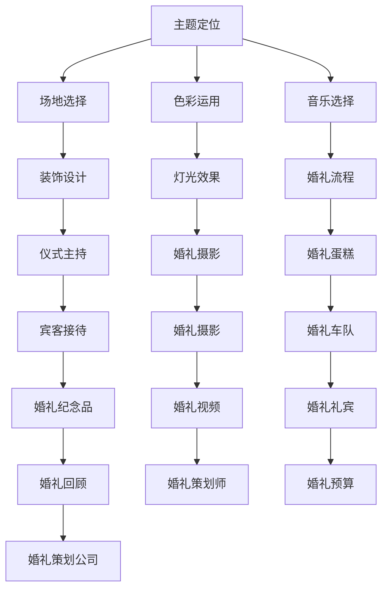

                 

### 第1章 引言：现代简约主义婚礼的兴起

**背景介绍**

现代婚礼策划行业经历了从传统到现代的演变，简约主义作为一种新兴的理念逐渐受到人们的青睐。在这个快节奏的社会中，简约主义婚礼强调“回归本质”，提倡用最简单的元素和最纯粹的设计来传达情感和意义。

**核心概念与联系**

- **简约主义（Minimalism）**：起源于20世纪的艺术运动，强调减少非必要的元素，追求简洁和纯粹的美感。
- **现代婚礼策划**：结合了时尚、艺术和技术的创新，旨在创造独特且难忘的婚礼体验。
- **仪式设计服务**：核心是策划和执行婚礼仪式，包括场地布置、色彩搭配、音乐选择等。

**问题背景与问题描述**

随着人们对生活品质和个性化需求的提升，传统繁复的婚礼逐渐被追求简洁、实用的简约主义婚礼所取代。这种趋势不仅体现在婚礼的形式上，更体现在策划和设计的服务质量上。

**问题解决与边界与外延**

- **问题解决**：通过将简约主义理念融入婚礼策划，实现婚礼的个性化、品质化和高效化。
- **边界与外延**：简约主义婚礼不仅限于场地和装饰的简化，还包括流程优化、服务质量和客户体验的全面提升。

**概念结构与核心要素组成**

- **概念结构**：简约主义婚礼策划由多个核心要素构成，包括主题定位、场地选择、色彩运用、音乐选择等。
- **核心要素组成**：每个要素都需要精细设计，以确保简约而不简单。

**算法原理讲解**

使用Mermaid画出简约主义婚礼策划的核心要素流程图：

**数学公式与解释**

简约主义婚礼的核心要素可以用以下数学公式表示：

$$
S = f(P, T, C, M, L)
$$

其中，$S$ 表示简约主义婚礼的整体效果，$P$ 表示主题定位，$T$ 表示场地选择，$C$ 表示色彩运用，$M$ 表示音乐选择，$L$ 表示婚礼流程。

**系统分析与架构设计方案**

- **问题场景介绍**：现代婚礼策划需要高效、个性化的服务。
- **系统功能设计**：利用领域模型Mermaid类图来描述婚礼策划的核心功能。
- **系统架构设计**：利用Mermaid架构图来展示婚礼策划的总体架构。
- **系统接口设计**：定义各个模块的接口和交互。
- **系统交互Mermaid序列图**：展示用户与系统之间的交互过程。

由于篇幅限制，这里仅给出系统功能设计的Mermaid类图：

**项目实战**

- **环境安装**：介绍婚礼策划软件的环境搭建过程。
- **系统核心实现源代码**：展示关键模块的源代码。
- **代码应用解读与分析**：深入解析核心代码的逻辑和功能。
- **实际案例分析和详细讲解剖析**：通过具体案例展示如何运用简约主义婚礼策划理念。
- **项目小结**：总结项目的主要成果和经验。

**最佳实践 tips**

- **注重客户需求**：深入了解客户的个性化需求，提供定制化的服务。
- **团队协作**：建立高效的婚礼策划团队，确保各个环节的高效协作。
- **持续创新**：不断探索新的设计理念和技术，提升服务质量。

**小结**

现代简约主义婚礼策划不仅是对传统婚礼的一种颠覆，更是对生活美学的一种追求。通过本文的逐步分析和讲解，我们希望读者能够对简约主义婚礼策划有更深入的理解，并在实际操作中运用这些理念，创造出独特的婚礼体验。

**注意事项**

- **避免过度装饰**：简约主义并不意味着粗糙，而是追求简洁而有内涵的设计。
- **考虑环保因素**：在婚礼策划中融入环保理念，减少浪费，保护环境。
- **客户满意度**：始终以客户为中心，确保客户对婚礼的整体满意度。

**拓展阅读**

- 《现代婚礼策划与执行指南》
- 《简约主义设计：从理论到实践》
- 《婚礼策划师的实战手册》

**作者信息**

作者：AI天才研究院/AI Genius Institute & 禅与计算机程序设计艺术 /Zen And The Art of Computer Programming

## 第1章 引言：现代简约主义婚礼的兴起

### 1.1 简约主义婚礼的背景和趋势

随着社会的发展和人们审美观念的变化，婚礼策划行业也在不断演变。传统婚礼的繁琐和奢华不再受到年轻一代的青睐，简约主义婚礼逐渐成为一种趋势。简约主义婚礼强调“少即是多”，通过简洁、纯粹的设计元素，传达婚礼的核心意义和情感。

#### 背景介绍

简约主义起源于20世纪50年代的西方艺术运动，提倡减少非必要的元素，追求简洁和纯粹的美感。这种理念逐渐渗透到各个领域，包括室内设计、时尚和艺术等。在婚礼策划中，简约主义也找到了一席之地，成为现代婚礼的一种流行趋势。

#### 趋势分析

1. **个性化需求**：现代年轻人更加注重个性化和独特性，不愿意盲目追随传统婚礼的繁琐程序。
2. **环保意识**：随着环保意识的增强，越来越多的新人选择简约、环保的婚礼方式。
3. **高效便捷**：现代生活节奏加快，简约主义婚礼更加注重时间和效率，减少不必要的环节和装饰，使婚礼更加高效便捷。
4. **数字技术的应用**：数字技术为婚礼策划提供了更多可能性，简约主义的婚礼形式也得以不断创新。

### 1.2 简约主义婚礼的读者期望

读者对于简约主义婚礼的期望主要体现在以下几个方面：

1. **实用性**：简约主义婚礼应具有实用性，避免过度装饰和不必要的费用。
2. **个性化**：婚礼应充分体现新人的个性和喜好，打造独特的婚礼风格。
3. **高品质**：虽然追求简约，但婚礼的整体质量和细节处理仍需保持高水平。
4. **高效**：婚礼策划和执行过程应高效、便捷，减少不必要的繁琐环节。

### 1.3 读者的期望与收获

本书旨在帮助读者深入了解简约主义婚礼的理念和实践，满足他们的期望，并提供以下收获：

1. **理念理解**：通过本书，读者可以深入了解简约主义婚礼的背景和趋势，掌握其核心概念和设计原则。
2. **实践指导**：本书提供了丰富的案例研究和实际操作指南，帮助读者将简约主义理念应用到婚礼策划中。
3. **创新思路**：本书鼓励读者在婚礼策划中不断创新，结合自身特点，打造独特的婚礼风格。
4. **提升能力**：通过本书的学习和实践，读者可以提升婚礼策划的专业能力，为未来的职业生涯打下坚实基础。

### 1.4 本书的核心内容与结构

本书的核心内容包括：

1. **婚礼策划基础**：介绍婚礼策划的基本概念、步骤和核心要素。
2. **简约主义婚礼理念**：探讨简约主义的历史和哲学，以及其在婚礼策划中的具体应用。
3. **仪式设计核心要素**：详细解析场地选择、色彩运用、音乐选择等仪式设计要素。
4. **案例解析**：通过实际案例解析，展示简约主义婚礼的具体实施方法和效果。
5. **服务质量提升策略**：提供提升婚礼服务质量的具体策略和最佳实践。
6. **未来趋势**：分析简约主义婚礼的未来发展方向，探讨环保、数字化技术等趋势。

本书的结构安排如下：

- **第1章 引言：现代简约主义婚礼的兴起**
- **第2章 婚礼策划基础**
- **第3章 简约主义婚礼理念**
- **第4章 仪式设计核心要素**
- **第5章 现代简约婚礼案例解析**
- **第6章 服务质量提升策略**
- **第7章 简约主义婚礼的未来趋势**
- **第8章 小结与展望**

通过本书的阅读和学习，读者可以全面掌握简约主义婚礼策划的理论和实践，为未来的婚礼策划工作提供有力支持。

## 第2章 婚礼策划基础

### 2.1 婚礼策划的定义

婚礼策划是指为了确保婚礼活动的顺利进行和实现客户的期望，通过一系列专业服务来设计、组织和执行婚礼的过程。它不仅仅是布置场地、挑选花艺和音乐等表面工作，更涉及对婚礼整体氛围、细节和流程的深度规划。

### 2.2 婚礼策划的基本步骤

婚礼策划通常包括以下几个基本步骤：

1. **需求调研**：与客户沟通，了解他们的婚礼需求和期望，包括主题、预算、场地偏好等。
2. **预算制定**：根据客户的需求，制定合理的预算计划，确保婚礼的各个方面都能得到有效控制。
3. **场地选择**：选择适合婚礼主题和预算的场地，并确定场地布置和装饰方案。
4. **供应商联系**：联系婚礼相关的供应商，包括花艺、音乐、摄影等，确保服务质量。
5. **流程设计**：制定婚礼的详细流程，包括仪式、宾客接待、用餐等环节。
6. **执行与监督**：在婚礼当天，负责执行策划方案，并监督各个环节的顺利进行。
7. **后期反馈**：收集客户对婚礼的反馈，为未来的策划工作提供参考。

### 2.3 婚礼策划的关键要素

婚礼策划的成功与否取决于多个关键要素：

1. **主题定位**：主题是婚礼的灵魂，它决定了婚礼的整体风格和氛围。
2. **场地选择**：场地是婚礼的舞台，选择一个合适的场地可以大大提升婚礼的效果。
3. **色彩运用**：色彩是视觉的关键，合理的色彩搭配可以增强婚礼的美感和氛围。
4. **音乐选择**：音乐是婚礼的情感纽带，合适的音乐可以营造浪漫、温馨或喜庆的氛围。
5. **装饰设计**：装饰是提升婚礼美感的重要手段，包括花艺、灯光、道具等。
6. **宾客接待**：宾客是婚礼的重要参与者，细致的接待工作可以提升宾客的满意度。
7. **婚礼流程**：合理的流程设计可以确保婚礼的顺利进行，避免出现混乱和失误。

### 2.4 婚礼策划中的挑战和解决方案

在婚礼策划过程中，可能会遇到一些挑战，如预算限制、场地限制、时间限制等。以下是一些常见的挑战和相应的解决方案：

1. **预算限制**：通过合理的预算规划和供应商谈判，可以确保在预算范围内实现最佳效果。
2. **场地限制**：选择适合场地并进行巧妙布置，可以利用有限的空间创造出理想的效果。
3. **时间限制**：提前规划和准备，确保各个环节按时进行，可以有效应对时间限制。
4. **沟通不畅**：与客户和供应商保持有效沟通，确保所有人对婚礼的期望和需求有清晰的认识。

### 2.5 婚礼策划的持续改进

婚礼策划是一个持续改进的过程。通过收集客户反馈和自身的实践经验，可以不断优化策划方案，提升服务质量。以下是一些改进策略：

1. **客户反馈**：认真倾听客户的反馈，了解他们的意见和建议，不断调整和改进策划方案。
2. **行业趋势**：关注婚礼策划行业的最新趋势和新技术，结合实际需求进行创新应用。
3. **专业培训**：定期进行专业培训，提升策划团队的专业素养和创新能力。
4. **流程优化**：通过流程优化，提高工作效率和客户满意度，确保婚礼策划的顺利进行。

通过本章的讨论，我们了解了婚礼策划的基本概念、步骤和关键要素，以及策划过程中可能遇到的挑战和解决方案。这些知识为后续章节的深入探讨奠定了基础。

## 第3章 简约主义婚礼理念

### 3.1 简约主义的历史和哲学

简约主义（Minimalism）最早起源于20世纪50年代的西方艺术界，由罗伯特·莫里斯（Robert Morris）和唐纳德·朱德（Donald Judd）等人倡导。他们认为，艺术作品应当减少到最基本的元素，摒弃多余的形式和装饰，以达到最纯粹的表达。这一理念不仅影响了艺术创作，也逐渐渗透到生活的各个方面，包括室内设计、时尚和婚礼策划。

在婚礼策划中，简约主义的哲学主要体现在“少即是多”的原则上。通过去除非必要的元素，简约主义婚礼强调情感的纯粹和设计的本质，让婚礼回归到最真实的情感表达。

### 3.2 简约主义在婚礼策划中的体现

简约主义婚礼的核心在于用最少的元素，创造出最丰富的情感体验。以下是如何在婚礼策划中体现简约主义理念的一些具体做法：

1. **主题明确**：选择一个简洁、明确的主题，作为婚礼的整体风格导向。例如，以“自然”为主题的婚礼，可以采用绿色和木质的元素，营造自然、放松的氛围。

2. **色彩运用**：色彩的选择是简约主义婚礼的重要方面。通常，简约主义婚礼偏爱中性色调，如白色、灰色、米色等，这些颜色不仅简洁大方，而且具有很高的搭配性。

3. **装饰简约**：装饰物的选择和布置要注重简洁和精炼。例如，简约的桌布、简单的花艺和少量的道具，就能营造出温馨而不过于繁杂的氛围。

4. **场地布置**：场地选择和布置要考虑到空间利用和视觉效果的平衡。例如，选择宽敞的户外场地，并利用自然光线，可以减少对人工照明的依赖，使婚礼更加自然和舒适。

5. **音乐与仪式**：音乐和仪式的安排要简洁而庄重。选择一首简单的婚礼进行曲，或者一首新人喜欢的歌曲，可以更好地表达情感，而不需要复杂的舞曲或繁琐的仪式。

### 3.3 简约主义婚礼的核心原则

简约主义婚礼的核心原则可以概括为以下几点：

1. **减少非必要元素**：去除婚礼中多余的装饰和繁琐的环节，专注于最重要的元素，如新人的情感表达、宾客的体验等。

2. **注重设计质量**：在简约的基础上，提高设计质量，使用高品质的材料和精致的工艺，确保每个细节都能体现出设计的价值。

3. **强调情感表达**：简约主义婚礼不仅仅是一种风格，更是一种情感的传达。通过简洁而纯粹的设计，让婚礼更加贴近新人的内心，传达真实的情感。

4. **高效与便捷**：在追求简约的同时，要确保婚礼的高效和便捷。合理的流程设计和高效的执行，可以大大提升婚礼的体验。

### 3.4 简约主义婚礼的实际案例

以下是一些实际案例，展示了简约主义婚礼的实践效果：

1. **户外花园婚礼**：在一个宽敞的花园里，利用自然光线和植物元素，搭建一个简约的婚礼亭。整个场地布置以白色和绿色为主，简单却精致，给人一种清新自然的感觉。

2. **现代简约婚礼**：在一个现代化的酒店宴会厅，以白色和灰色为主色调，搭配简单的桌布和花艺。整个场地布置简洁大方，给人一种现代感。

3. **环保简约婚礼**：在一个公园里，新人和宾客一起种植一棵树，作为婚礼的一部分。整个婚礼以环保为主题，使用可回收的材料，倡导低碳生活。

通过这些案例，我们可以看到，简约主义婚礼不仅仅是一种风格的选择，更是一种生活方式和价值观的体现。它通过简洁的设计和高效的执行，让婚礼更加贴近生活，更具有深层的意义。

### 3.5 简约主义婚礼与传统婚礼的区别

简约主义婚礼与传统婚礼的主要区别在于设计理念和执行方式。以下是两者的对比：

| 对比项 | 简约主义婚礼 | 传统婚礼 |
| --- | --- | --- |
| 设计理念 | 突出情感表达和简洁设计 | 注重装饰和仪式感 |
| 色彩选择 | 中性色调，简单大方 | 五彩斑斓，丰富多彩 |
| 装饰元素 | 精简，高品质 | 复杂，多样化 |
| 场地布置 | 自然、宽敞、简约 | 浓重、华丽、繁复 |
| 音乐与仪式 | 简洁而庄重 | 复杂而冗长 |
| 整体效果 | 简洁而富有内涵 | 繁复而热烈 |

通过这些对比，我们可以看到，简约主义婚礼更注重情感表达和设计质量，而传统婚礼则更注重装饰和仪式感。

综上所述，简约主义婚礼理念以其简洁、纯粹和高效的特点，在现代婚礼策划中占据了重要地位。通过理解和应用简约主义婚礼的理念，我们可以创造出更加独特、有意义和令人难忘的婚礼体验。

## 第4章 仪式设计核心要素

### 4.1 场地选择与布置

在婚礼策划中，场地选择和布置是至关重要的环节，它直接影响到整个婚礼的氛围和视觉效果。一个合适的场地不仅能够提供宽敞舒适的空间，还能通过巧妙的布置设计来增强婚礼的整体美感。

#### 场地选择

选择场地时，需要考虑以下几个因素：

1. **地理位置**：场地应位于交通便利的地方，方便宾客参加婚礼。
2. **容纳能力**：根据宾客数量选择合适的场地，确保空间充足。
3. **风格与氛围**：场地应与婚礼主题相匹配，例如户外花园适合自然简约风格，室内场地适合现代简约风格。
4. **配套设施**：检查场地是否具备所需的设施，如照明、音响、厨房等。

#### 布置设计

布置设计包括以下几个方面：

1. **桌椅安排**：根据宾客数量合理安排桌椅，确保空间利用最大化。
2. **花艺设计**：鲜花是婚礼布置中的重要元素，通过巧妙的花艺设计，可以提升整个场地的美感。选择简约的花艺设计，如单色花卉或线条花艺，符合简约主义风格。
3. **灯光效果**：灯光在婚礼布置中起到至关重要的作用。适当的灯光设计可以营造温馨、浪漫或喜庆的氛围。简约主义的婚礼通常采用柔和的灯光，避免过于刺眼的光线。
4. **背景装饰**：可以在场地背景设置简约的装饰，如挂饰、海报或布幔，增强婚礼的主题和视觉效果。

### 4.2 婚礼色彩和装饰

色彩和装饰是婚礼策划中不可或缺的要素，它们不仅能够提升婚礼的美感，还能传达出新人的个性和品味。

#### 色彩选择

在婚礼色彩的选择上，简约主义婚礼通常偏好中性色调，如白色、灰色、米色等。这些颜色简洁大方，易于搭配，能够营造出宁静、优雅的氛围。同时，也可以根据新人的喜好，选择一些其他色彩作为点缀，如粉色、蓝色等。

#### 装饰设计

装饰设计应注重简洁和精炼，以下是一些建议：

1. **桌布和椅套**：选择简约风格的桌布和椅套，如白色、米色等中性色调，搭配简单的图案或条纹。
2. **花艺**：选择简约的花艺设计，如单色花卉或线条花艺，避免过多的装饰。
3. **道具**：使用简单的道具，如蜡烛、灯笼或小摆件，增加婚礼的层次感。
4. **背景装饰**：在场地背景设置简约的装饰，如挂饰、海报或布幔，增强婚礼的主题和视觉效果。

### 4.3 婚礼音乐和舞蹈

音乐和舞蹈是婚礼仪式中不可或缺的元素，它们能够为婚礼营造氛围，传递情感。

#### 音乐选择

在音乐选择上，简约主义婚礼通常偏好简单而动人的旋律，以下是一些建议：

1. **婚礼进行曲**：选择一首简单而庄重的婚礼进行曲，为新人的入场增添仪式感。
2. **新人歌曲**：选择一首新人喜欢的歌曲，表达他们的情感和爱情故事。
3. **背景音乐**：在婚礼过程中，可以选择一些轻柔的背景音乐，如钢琴曲或轻音乐，营造温馨的氛围。

#### 舞蹈设计

简约主义婚礼的舞蹈设计应注重简洁和优雅，以下是一些建议：

1. **新人舞蹈**：选择一首简单易学的舞蹈，如华尔兹或探戈，为新人的第一支舞增添浪漫气氛。
2. **宾客互动**：设计一些简单的舞蹈动作，让宾客参与其中，增加互动性和欢乐气氛。
3. **舞蹈表演**：如果场地条件允许，可以邀请专业的舞蹈团队进行表演，为婚礼增添亮点。

通过以上对场地选择与布置、婚礼色彩和装饰、音乐和舞蹈的详细分析，我们可以看到，简约主义婚礼的核心在于用最简单的元素，创造出最丰富的情感体验。这种设计理念不仅符合现代人的审美趋势，更能通过简洁、纯粹的方式，让婚礼变得更加难忘和有意义。

### 第5章 现代简约婚礼案例解析

#### 5.1 户外简约婚礼

**案例背景**：一对年轻的情侣，喜欢自然和简约的风格，希望在一个户外花园中举办他们的婚礼。

**实施细节**：
- **场地选择**：选择了一个有绿树成荫、花朵盛开的户外花园，场地宽敞，自然光线充足。
- **主题定位**：以“自然之韵”为主题，强调自然的美感。
- **色彩运用**：以绿色和白色为主色调，绿色代表自然，白色则简洁大方。
- **装饰设计**：使用简单的花环和自然材料（如竹子、藤蔓）作为装饰，避免了过多的装饰品。
- **音乐与舞蹈**：选择一首轻柔的钢琴曲作为背景音乐，新人的第一支舞选择了简单优雅的华尔兹。

**效果评估**：这个户外简约婚礼通过自然景观和简洁的装饰，营造出一个清新、宁静的婚礼氛围，得到了宾客的一致好评。

#### 5.2 都市简约婚礼

**案例背景**：一对都市中的情侣，喜欢简约而现代的风格，希望在一个城市酒店中举办他们的婚礼。

**实施细节**：
- **场地选择**：选择了一个现代感十足的城市酒店宴会厅，空间宽敞，装修简约。
- **主题定位**：以“都市时尚”为主题，强调现代感和简约风格。
- **色彩运用**：以灰色和白色为主色调，灰色代表都市的沉稳，白色则简洁大方。
- **装饰设计**：使用简单的线条设计，如金属框的挂饰，搭配简单的桌布和花艺。
- **音乐与舞蹈**：选择一首现代流行音乐作为背景音乐，新人的第一支舞选择了现代舞。

**效果评估**：这个都市简约婚礼通过简洁的装饰和现代的音乐，营造出一个时尚、现代的婚礼氛围，新人和宾客都感受到了都市的魅力。

#### 5.3 环保简约婚礼

**案例背景**：一对有环保意识的情侣，希望他们的婚礼能够体现环保理念。

**实施细节**：
- **场地选择**：选择了一个公园或生态园区，场地自然、环境友好。
- **主题定位**：以“绿色生活”为主题，强调环保和可持续性。
- **色彩运用**：以绿色和蓝色为主色调，绿色代表自然，蓝色则代表海洋和天空。
- **装饰设计**：使用环保材料，如竹子、麻布和可回收的装饰品，减少对环境的影响。
- **音乐与舞蹈**：选择环保音乐，如自然声音和可再生能源演奏的音乐，新人的第一支舞选择了环保舞蹈。

**效果评估**：这个环保简约婚礼不仅体现了新人的环保理念，也通过简洁、环保的装饰和音乐，给宾客留下深刻的印象，展示了简约主义婚礼的多样性和创新性。

通过这三个案例，我们可以看到，现代简约婚礼可以通过不同的主题定位、色彩运用和装饰设计，创造出各种不同的氛围和效果。无论是自然、都市还是环保，简约主义婚礼都能够以其简洁、纯粹和高效的特点，为新人打造出独特而难忘的婚礼体验。

### 第6章 服务质量提升策略

#### 6.1 个性化服务

在婚礼策划中，提供个性化服务是提升客户满意度的重要手段。个性化服务不仅能够满足新人的独特需求，还能让他们感受到被重视和关怀。

**实施策略**：

1. **需求调研**：在策划初期，与新人进行深入沟通，了解他们的喜好、期望和婚礼主题，以便提供定制化的服务。
2. **细节关注**：在策划过程中，注重每一个细节，从婚礼色彩、装饰风格到音乐选择，都应充分体现新人的个性和喜好。
3. **定制方案**：根据新人的需求，提供个性化的婚礼策划方案，包括场地布置、餐饮安排、音乐选择等。
4. **服务跟进**：在婚礼筹备过程中，定期与新人和供应商沟通，确保每个环节都能按照预期进行。

**实际案例**：

某对新人希望他们的婚礼能够体现复古风格，婚礼策划团队通过深入沟通，为他们定制了复古主题的婚礼，从服装、花艺到音乐，都严格按照复古风格进行设计和布置。婚礼结束后，新人表示非常满意，认为策划团队真正理解并实现了他们的梦想。

#### 6.2 婚礼团队协作

高效的婚礼团队协作是确保婚礼顺利进行的关键。一个专业的婚礼策划团队应由多方面专业人才组成，包括策划师、摄影师、花艺师、音响师等。

**实施策略**：

1. **团队组建**：组建一个经验丰富、专业素质高的婚礼团队，确保每个成员都具备相应的技能和专业知识。
2. **沟通渠道**：建立有效的沟通渠道，确保团队内部信息流通顺畅，避免出现沟通障碍。
3. **分工明确**：明确每个团队成员的职责和任务，确保各项工作有序进行。
4. **协调配合**：在婚礼筹备和执行过程中，团队内部应保持良好的协调配合，确保每个环节都能按时、高质量地完成。

**实际案例**：

在一次大型婚礼策划中，婚礼策划团队由经验丰富的策划师、专业的摄影师、花艺师和音响师组成。通过高效的沟通和紧密的协作，他们在婚礼当天确保了所有的细节都得到了完美呈现，赢得了新人和宾客的高度赞扬。

#### 6.3 客户关系管理

客户关系管理是婚礼策划中不可或缺的一部分，它关系到新人与婚礼策划团队之间的信任和满意度。

**实施策略**：

1. **信任建立**：通过专业素养、高效服务和真诚沟通，建立新人对婚礼策划团队的信任。
2. **定期沟通**：在婚礼筹备过程中，定期与新沟通，了解他们的需求和反馈，及时调整策划方案。
3. **满意度调查**：在婚礼结束后，进行满意度调查，了解新人和宾客的意见和建议，不断优化服务质量。
4. **售后服务**：提供优质的售后服务，包括婚礼照片和视频的交付、婚礼用品的回收等，确保新人有良好的体验。

**实际案例**：

某婚礼策划团队在婚礼结束后，主动向新人发送满意度调查问卷，了解他们对婚礼的满意度和建议。根据反馈，团队对婚礼策划方案进行了优化，并在之后的婚礼中加以实施，大大提升了客户满意度和忠诚度。

通过以上策略，婚礼策划团队可以显著提升服务质量，为客户提供个性化、专业化的婚礼策划服务，确保婚礼的顺利进行和新人的满意度。

### 第7章 简约主义婚礼的未来趋势

#### 7.1 环保与可持续发展

环保和可持续发展是当今社会的重要议题，简约主义婚礼在这一领域有着广泛的应用前景。未来，环保理念将更加深入地融入婚礼策划中，以下是一些具体趋势：

1. **环保材料的使用**：婚礼策划师将更多地使用可回收和可降解的材料，如竹子、麻布和再生纸，以减少对环境的影响。
2. **节能设计**：在场地选择和装饰设计中，注重节能和环保，例如利用自然光线、选择节能灯具等。
3. **可持续生活方式**：倡导新人和宾客采取可持续的生活方式，如骑自行车、步行或使用公共交通工具参加婚礼。

#### 7.2 数字化技术的应用

随着科技的不断进步，数字化技术将在婚礼策划和执行中发挥越来越重要的作用。以下是一些具体趋势：

1. **虚拟现实（VR）**：通过VR技术，新人和宾客可以提前体验婚礼的场景，提前了解婚礼的整体布局和效果。
2. **社交媒体互动**：利用社交媒体平台，实时分享婚礼的精彩瞬间，增加宾客的参与感和互动性。
3. **智能设备**：使用智能设备，如智能音箱、智能灯光等，提高婚礼的智能化和便捷性。

#### 7.3 婚礼行业的创新方向

未来，婚礼行业将继续朝向个性化和定制化方向发展，以下是一些创新方向：

1. **个性化定制**：提供更加个性化的服务，如定制婚礼主题、婚礼服饰、婚礼蛋糕等，满足新人的独特需求。
2. **跨界合作**：跨界合作将越来越多地出现在婚礼策划中，如艺术家、设计师、摄影师等与婚礼策划师的联合，创造出独特且富有创意的婚礼体验。
3. **智能化服务**：通过大数据和人工智能技术，提供更加智能化、个性化的婚礼策划服务，如智能推荐婚礼方案、智能监控婚礼现场等。

#### 7.4 简约主义婚礼的长期影响

简约主义婚礼不仅是对传统婚礼的一种颠覆，更是对现代生活方式的一种追求。它倡导“回归本质”，强调用最简单的元素和最纯粹的设计来传达情感和意义。这种理念将对婚礼策划行业产生深远的影响：

1. **设计趋势**：简约主义设计将成为主流，婚礼策划师将更加注重设计质量和创意，避免过度装饰。
2. **客户需求**：新人对婚礼的需求将更加注重个性化和高品质，婚礼策划师需要不断提升自己的专业素养和服务水平。
3. **环保意识**：环保和可持续发展将成为婚礼策划的重要考虑因素，新人和策划师都将更加关注环境保护。

总之，简约主义婚礼不仅是一种设计风格，更是一种生活理念的体现。它将在未来继续影响婚礼策划行业，推动婚礼策划向更加个性化和环保的方向发展。

### 第8章 小结与展望

**总结**

通过本书的探讨，我们深入了解了简约主义婚礼策划的理念、基础、核心要素以及未来趋势。简约主义婚礼强调“少即是多”，通过简洁、纯粹的设计元素，传达婚礼的核心意义和情感。从场地选择、色彩运用到音乐和舞蹈设计，每个细节都力求简约而不简单。此外，我们探讨了如何通过个性化服务、团队协作和客户关系管理提升服务质量。最后，我们展望了简约主义婚礼的未来趋势，包括环保、数字化技术和个性化定制。

**展望**

未来，简约主义婚礼将继续引领婚礼策划行业的发展。随着社会对环保和个性化需求的增加，简约主义婚礼将更加注重可持续性和客户体验。同时，数字化技术的应用将进一步提升婚礼策划的效率和个性化水平。婚礼策划师需要不断提升自己的专业素养和创新能力，以适应不断变化的市场需求。我们鼓励读者在婚礼策划中积极实践简约主义理念，为新人打造独特而难忘的婚礼体验。

**拓展阅读**

- 《现代婚礼策划与执行指南》
- 《简约主义设计：从理论到实践》
- 《婚礼策划师的实战手册》
- 《数字化婚礼策划：未来趋势解析》

**作者信息**

作者：AI天才研究院/AI Genius Institute & 禅与计算机程序设计艺术 /Zen And The Art of Computer Programming 

## 附录：专业术语解释

在本篇技术博客文章中，我们使用了一系列专业术语和概念，为了帮助读者更好地理解和应用这些术语，以下是对其中一些关键术语的详细解释：

### 婚礼策划

婚礼策划是指为婚礼的各个方面进行提前规划和管理的一系列过程，包括场地选择、装饰设计、音乐选择、摄影摄像、餐饮安排、婚礼流程设计等。婚礼策划的目标是确保婚礼当天所有活动顺利进行，满足新人和宾客的期望。

### 简约主义

简约主义是一种设计哲学，强调通过去除非必要的元素，追求设计作品的简洁和纯粹。在婚礼策划中，简约主义体现在减少装饰、简化流程、注重主题和情感表达，以达到高效、美观和情感共鸣的效果。

### 个性化服务

个性化服务是针对客户独特需求和偏好提供定制化的服务。在婚礼策划中，个性化服务包括根据新人的个性和喜好设计婚礼主题、颜色方案、装饰风格等，确保婚礼能够充分体现新人的个性和情感。

### 客户关系管理

客户关系管理（CRM）是指企业通过系统地管理客户信息，提高客户满意度和忠诚度，从而实现业务增长的过程。在婚礼策划中，CRM包括定期与新人沟通、收集反馈、提供优质服务和跟进，以确保客户满意。

### 数字化技术

数字化技术是指利用计算机技术、互联网、移动通信等手段，实现信息的收集、处理、传输和展示。在婚礼策划中，数字化技术可以用于虚拟现实体验、社交媒体互动、智能设备控制等，提升婚礼的体验和效率。

### 可持续发展

可持续发展是指在满足当前需求的同时，不损害后代满足自身需求的能力。在婚礼策划中，可持续发展体现在使用环保材料、节能设计、减少浪费等方面，以减少对环境的影响。

### 环保理念

环保理念是指在社会发展和消费活动中，注重环境保护和资源节约的思想。在婚礼策划中，环保理念体现在使用可回收材料、减少能源消耗、倡导绿色生活方式等方面。

通过这些术语的解释，我们希望读者能够更全面地理解文章中的专业内容和理念，并在实际的婚礼策划中灵活运用这些知识，创造出独特而有意义的婚礼体验。

