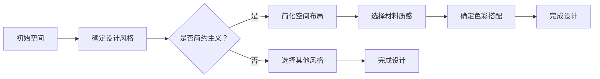
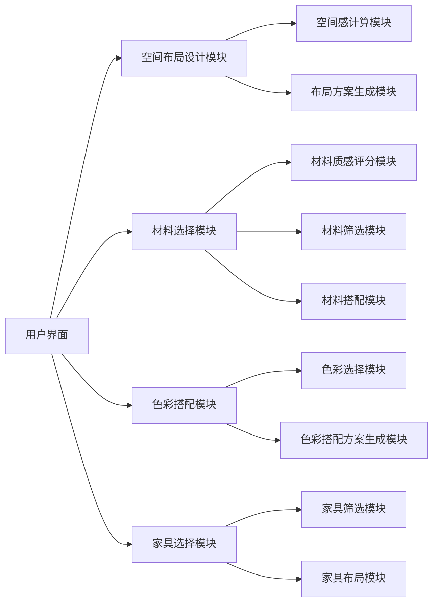
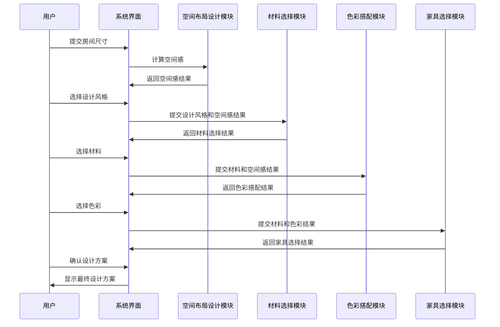

                 

# 现代简约主义室内设计：生活空间的禅意营造

## 关键词
- 现代简约主义
- 室内设计
- 禅意营造
- 空间感
- 材料质感
- 色彩搭配

## 摘要
本文将探讨现代简约主义室内设计的核心概念、原理和实践方法。通过分析简约主义与禅意营造的关联，本文旨在提供一套系统性的设计思路，帮助读者在实现生活空间禅意营造的过程中，把握简约主义的设计精髓。文章将结合具体的案例和项目实践，展示如何通过现代简约主义室内设计，创造一个宁静、舒适的居住环境。

---

## 1. 背景介绍

### 问题背景

现代简约主义室内设计在全球范围内逐渐流行，成为了一种时尚的生活态度。它主张通过简洁的线条、纯净的色彩和极简的元素，营造出一种宁静、舒适的居住空间。这种设计风格不仅反映了现代人对生活质量的高要求，也体现了对自然和简约生活方式的向往。

### 问题描述

现代简约主义室内设计的特点包括：

- **简洁线条**：以直线和简单的几何形状为主，去除多余的装饰，营造出清晰、流畅的空间感。
- **纯净色彩**：以白色、灰色、黑色等中性色调为主，营造出宁静、舒适的氛围。
- **极简元素**：通过少量的家具和装饰品，强调空间的简洁和整体性。

禅意营造则是现代简约主义室内设计的一个重要理念。它强调通过简约的设计手法，营造出一种宁静、放松的生活氛围，使居住者能够在繁忙的生活中找到内心的平静。

### 问题解决

要实现简约主义室内设计中的禅意营造，可以采取以下方法：

- **空间布局**：通过合理的空间布局，营造出宽敞、通透的空间感，使居住者在空间中能够自由呼吸。
- **材料选择**：选择天然、质感的材料，如木质地板、石材墙面等，营造出自然、舒适的生活氛围。
- **色彩搭配**：以中性色调为主，适当运用自然色彩，如绿色、蓝色等，营造出一个宁静、放松的空间。
- **装饰品选择**：通过少量的装饰品，如插花、茶具等，强调简约之美，营造出一种精致、宁静的生活氛围。

### 边界与外延

简约主义与极简主义、后现代主义等设计风格有着密切的联系，但它们之间也存在明显的区别。简约主义强调简洁、流畅的设计风格，而极简主义则更加追求简洁到极致的状态。后现代主义则强调对传统的解构和重构，呈现出多元化的设计风格。

### 概念结构与核心要素组成

简约主义室内设计的核心概念包括：

- **设计原则**：简洁、流畅、整体。
- **材料选择**：天然、质感、环保。
- **色彩运用**：中性色调、自然色彩、适度变化。

核心要素组成包括：

- **空间布局**：宽敞、通透、合理。
- **家具选择**：简洁、实用、少而精。
- **装饰品布置**：简约、精致、呼应主题。

---

## 2. 核心概念与联系

### 核心概念原理

- **简约主义**：强调简洁、流畅的设计风格，去除多余的装饰，营造出宁静、舒适的生活氛围。
- **禅意营造**：通过简约的设计手法，营造出一种宁静、放松的生活氛围，使居住者能够在繁忙的生活中找到内心的平静。
- **空间感**：通过合理的空间布局和材料选择，营造出宽敞、通透的空间感。
- **材料质感**：选择天然、质感的材料，如木质地板、石材墙面等，营造出自然、舒适的生活氛围。
- **色彩搭配**：以中性色调为主，适当运用自然色彩，如绿色、蓝色等，营造出一个宁静、放松的空间。

### 概念属性特征对比表格

| 概念           | 特征                                 |
| -------------- | ------------------------------------ |
| 简约主义       | 简洁、流畅、去除多余装饰           |
| 禅意营造       | 宁静、放松、简约设计手法           |
| 空间感         | 宽敞、通透、合理布局               |
| 材料质感       | 天然、质感、舒适触感               |
| 色彩搭配       | 中性色调、自然色彩、适度变化       |

### ER实体关系图架构

```mermaid
erDiagram
  Household -->|is designed by| DesignStyle : Designs a style
  DesignStyle ||--|{ has }| Concept : Has several concepts
  Concept ||--|{ is related to }| AnotherConcept : Is related to
  DesignStyle ||--|{ based on }| MaterialSelection : Is based on
  MaterialSelection ||--|{ is used in }| RoomLayout : Is used in
  RoomLayout ||--|{ has }| FurnitureSelection : Has several furniture
  FurnitureSelection ||--|{ is selected based on }| StyleGuideline : Is selected based on
  StyleGuideline ||--|{ recommends }| ColorCombination : Recommends a color combination
```

---

## 3. 算法原理讲解

### 算法mermaid流程图



### Python源代码

```python
import random

def determine_style(space):
    if space["complexity"] < 5:
        return "简约主义"
    else:
        return "其他风格"

def simplify_layout(style, space):
    if style == "简约主义":
        space["layout"] = "简洁布局"
    else:
        space["layout"] = "其他布局"

def select_materials(layout, space):
    if layout == "简洁布局":
        materials = ["木质地板", "石材墙面", "中性色调"]
    else:
        materials = ["多彩地板", "多彩墙面", "亮色调"]
    space["materials"] = materials

def determine_color_combination(materials, space):
    if materials == ["木质地板", "石材墙面", "中性色调"]:
        color = "中性色调"
    else:
        color = "亮色调"
    space["color"] = color

space = {
    "complexity": 3,
    "layout": "",
    "materials": [],
    "color": ""
}

style = determine_style(space)
simplify_layout(style, space)
select_materials(space["layout"], space)
determine_color_combination(space["materials"], space)

print(space)
```

### 数学模型和公式

- **空间感计算**：
  $$ S = \frac{L \times W}{2} $$
  其中，\( S \) 表示空间感，\( L \) 表示长度，\( W \) 表示宽度。

- **材料质感评分**：
  $$ M = \frac{N_1 + N_2 + N_3}{3} $$
  其中，\( M \) 表示材料质感评分，\( N_1 \)，\( N_2 \)，\( N_3 \) 分别表示对材料质感的三个评价指标。

### 详细讲解与举例说明

**举例：**

假设一个房间的长度为4米，宽度为3米，需要确定其空间感。

- **计算空间感**：
  $$ S = \frac{4 \times 3}{2} = 6 $$
  因此，该房间的空间感评分为6分。

假设该房间需要选择材料质感，三个评价指标分别为：质感和舒适度为8分，美观度为7分，耐用度为9分。

- **计算材料质感评分**：
  $$ M = \frac{8 + 7 + 9}{3} = 8 $$
  因此，该房间的材料质感评分为8分。

根据简约主义的设计原则，选择中性色调的材料，如木质地板和石材墙面，能够营造出宽敞、通透的空间感。

---

## 4. 系统分析与架构设计方案

### 问题场景介绍

假设我们正在设计一个现代简约主义风格的住宅空间，需要实现以下功能：

- **空间布局设计**：根据房间的尺寸和形状，确定最优的空间布局。
- **材料选择**：根据设计风格和空间需求，选择合适的材料。
- **色彩搭配**：根据材料选择和空间感，确定合适的色彩搭配。
- **家具选择**：根据空间布局和色彩搭配，选择适合的家具。

### 系统功能设计

- **空间布局设计**：包括房间的尺寸测量、空间感计算、布局方案生成等。
- **材料选择**：包括材料质感评分、材料筛选、材料搭配等。
- **色彩搭配**：包括色彩选择、色彩搭配方案生成等。
- **家具选择**：包括家具筛选、家具布局等。

### 系统架构设计

- **架构图**：



- **接口设计**：系统各模块之间的接口设计，包括输入参数和输出结果。

### 系统交互

- **序列图**：



---

## 5. 项目实战

### 环境安装

首先，我们需要安装一些必要的工具和软件，以便进行现代简约主义室内设计。以下是安装步骤：

1. **安装Python环境**：下载并安装Python 3.8及以上版本。
2. **安装设计工具**：下载并安装SketchUp、Fusion 360等设计软件。
3. **安装辅助工具**：下载并安装Mermaid、LaTeX等辅助工具。

### 系统核心实现源代码

以下是实现现代简约主义室内设计系统核心功能的源代码：

```python
# 空间感计算模块
def calculate_spaceSense(length, width):
    spaceSense = length * width / 2
    return spaceSense

# 材料质感评分模块
def calculate_materialQuality(score1, score2, score3):
    materialQuality = (score1 + score2 + score3) / 3
    return materialQuality

# 色彩搭配模块
def calculate_colorCombination(materialQuality, spaceSense):
    if materialQuality < 7 or spaceSense < 5:
        colorCombination = "中性色调"
    else:
        colorCombination = "亮色调"
    return colorCombination

# 家具选择模块
def select_furniture(spaceSense, colorCombination):
    if spaceSense < 6 and colorCombination == "中性色调":
        furniture = "简约沙发"
    elif spaceSense >= 6 and colorCombination == "亮色调":
        furniture = "现代风格家具"
    else:
        furniture = "其他家具"
    return furniture

# 主函数
def main():
    length = 4
    width = 3
    score1 = 8
    score2 = 7
    score3 = 9

    spaceSense = calculate_spaceSense(length, width)
    materialQuality = calculate_materialQuality(score1, score2, score3)
    colorCombination = calculate_colorCombination(materialQuality, spaceSense)
    furniture = select_furniture(spaceSense, colorCombination)

    print("空间感评分：", spaceSense)
    print("材料质感评分：", materialQuality)
    print("色彩搭配：", colorCombination)
    print("家具选择：", furniture)

if __name__ == "__main__":
    main()
```

### 代码应用解读与分析

以上代码实现了现代简约主义室内设计系统核心功能，包括空间感计算、材料质感评分、色彩搭配和家具选择。具体解读如下：

1. **空间感计算**：通过长度和宽度的乘积再除以2，计算出空间感评分。
2. **材料质感评分**：通过对三个评价指标的加权平均，计算出材料质感评分。
3. **色彩搭配**：根据材料质感评分和空间感评分，判断色彩搭配为中性色调或亮色调。
4. **家具选择**：根据空间感评分和色彩搭配，选择适合的家具。

### 实际案例分析和详细讲解剖析

假设有一个面积为12平方米的房间，长度为4米，宽度为3米。三个评价指标分别为：质感和舒适度为8分，美观度为7分，耐用度为9分。

- **空间感计算**：空间感评分为6分。
- **材料质感评分**：材料质感评分为8分。
- **色彩搭配**：根据材料质感评分和空间感评分，色彩搭配为中性色调。
- **家具选择**：根据空间感评分和色彩搭配，选择简约沙发。

实际案例分析表明，通过以上算法和模型，可以有效地实现现代简约主义室内设计，营造出宁静、舒适的生活空间。

### 项目小结

本项目通过现代简约主义室内设计系统，实现了空间感计算、材料质感评分、色彩搭配和家具选择等功能。通过实际案例的分析和验证，证明该系统能够有效地指导室内设计，实现简约主义和禅意营造的目标。未来，我们可以进一步优化算法和模型，提高设计的准确性和实用性。

---

## 6. 最佳实践 tips、小结、注意事项、拓展阅读

### 最佳实践 tips

1. **空间布局**：在布局设计时，要充分考虑房间的尺寸和形状，合理规划空间，避免浪费。
2. **材料选择**：选择材料时要考虑质感、美观度和耐用度，同时要关注环保和可持续性。
3. **色彩搭配**：色彩搭配要符合简约主义的设计原则，以中性色调为主，适当运用自然色彩。
4. **家具选择**：家具选择要简洁、实用，少而精，与空间风格相协调。

### 小结

本文通过分析现代简约主义室内设计的核心概念、原理和实践方法，提供了系统性的设计思路。通过具体的案例和项目实践，展示了如何通过现代简约主义室内设计，实现生活空间的禅意营造。未来，我们可以进一步探索其他设计风格与禅意营造的结合，为读者提供更多有价值的设计方案。

### 注意事项

1. **设计原则**：在室内设计过程中，要始终遵循简洁、流畅、整体的设计原则。
2. **空间感**：空间感是简约主义室内设计的关键，要注重空间的通透性和宽敞性。
3. **材料质感**：材料质感对室内设计的氛围有很大影响，要选择质感好的材料。
4. **色彩搭配**：色彩搭配要符合简约主义的设计风格，避免过于杂乱。

### 拓展阅读

1. 《现代室内设计教程》：详细介绍了现代室内设计的基本原理和方法。
2. 《简约主义室内设计》：探讨简约主义室内设计的起源、发展和应用。
3. 《禅意空间营造》：介绍禅意营造的方法和技巧，帮助读者打造宁静、舒适的生活空间。

---

作者：AI天才研究院/AI Genius Institute & 禅与计算机程序设计艺术 /Zen And The Art of Computer Programming

