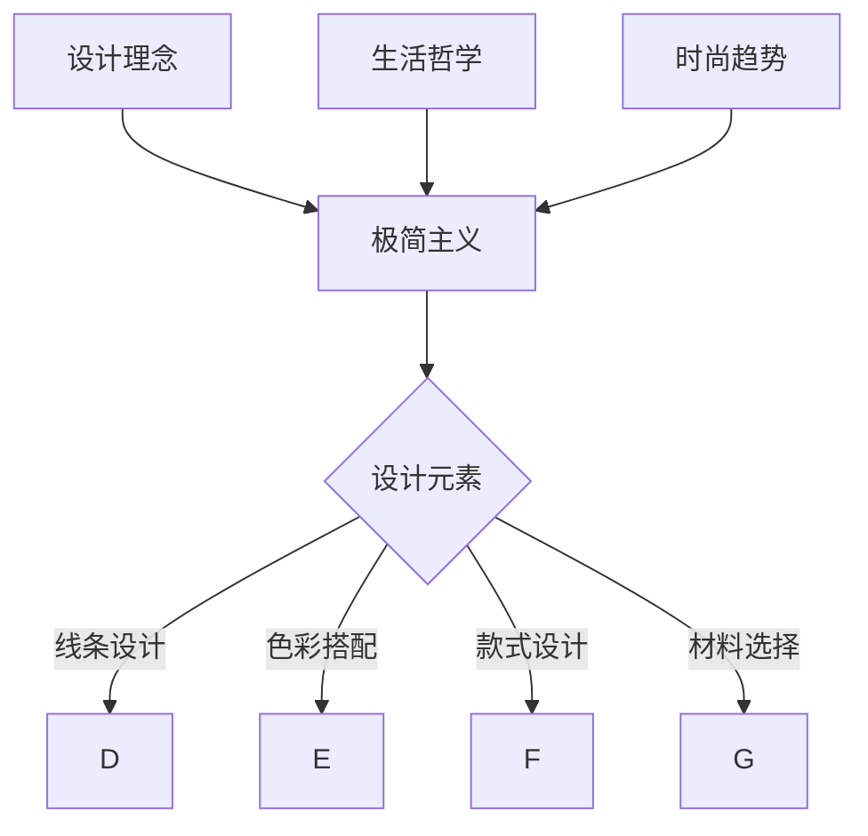
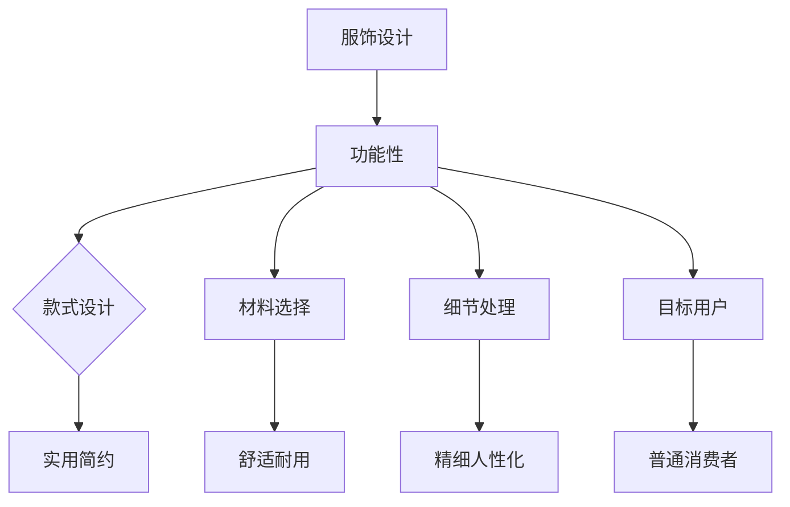
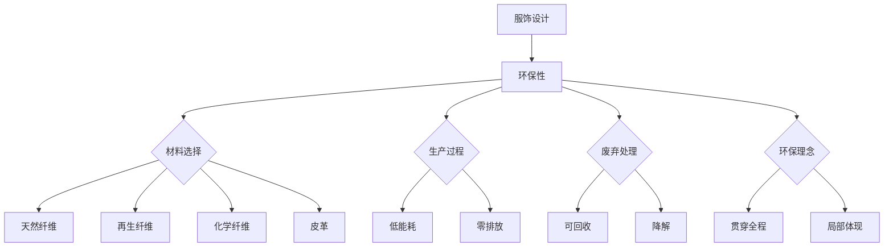
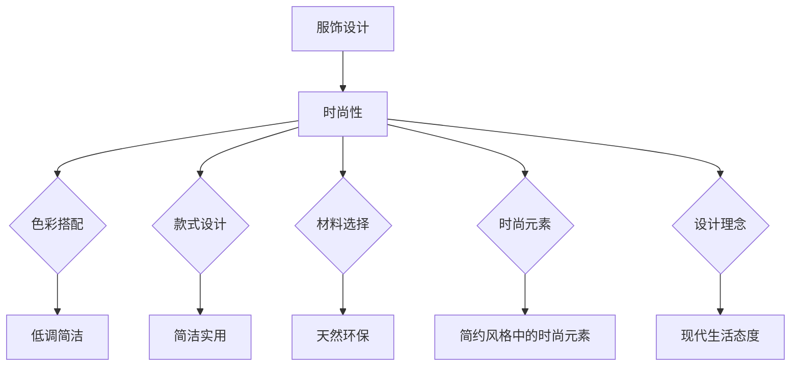
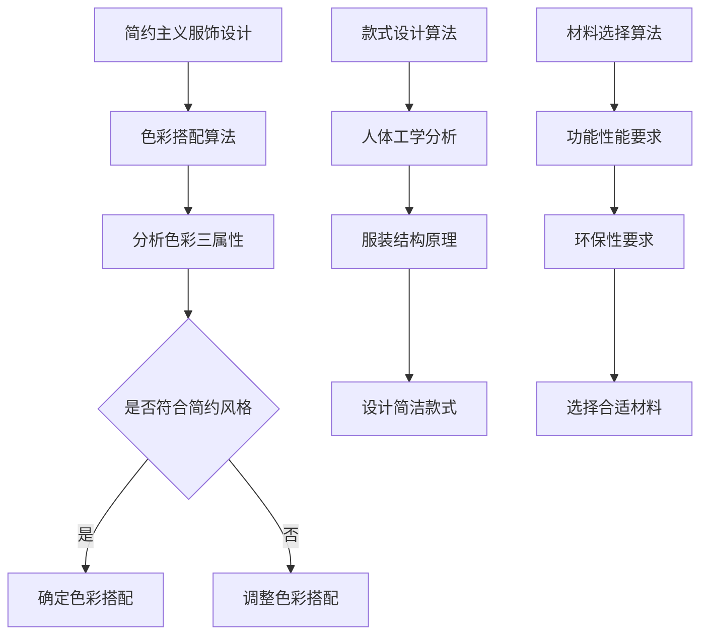
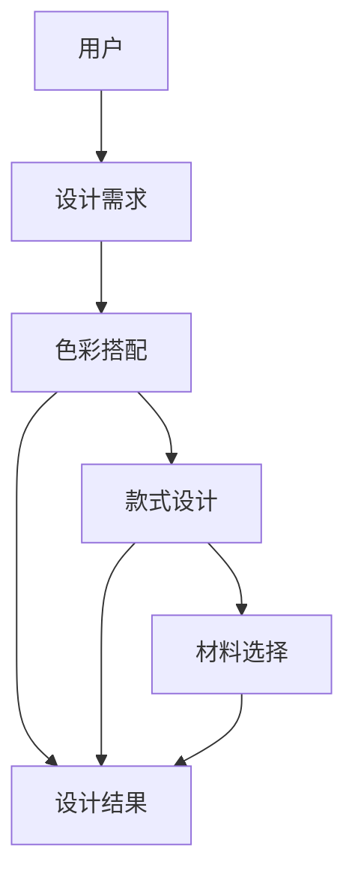
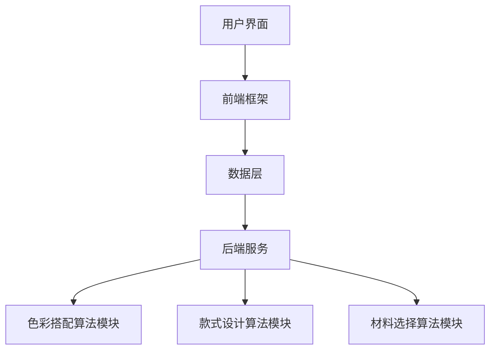
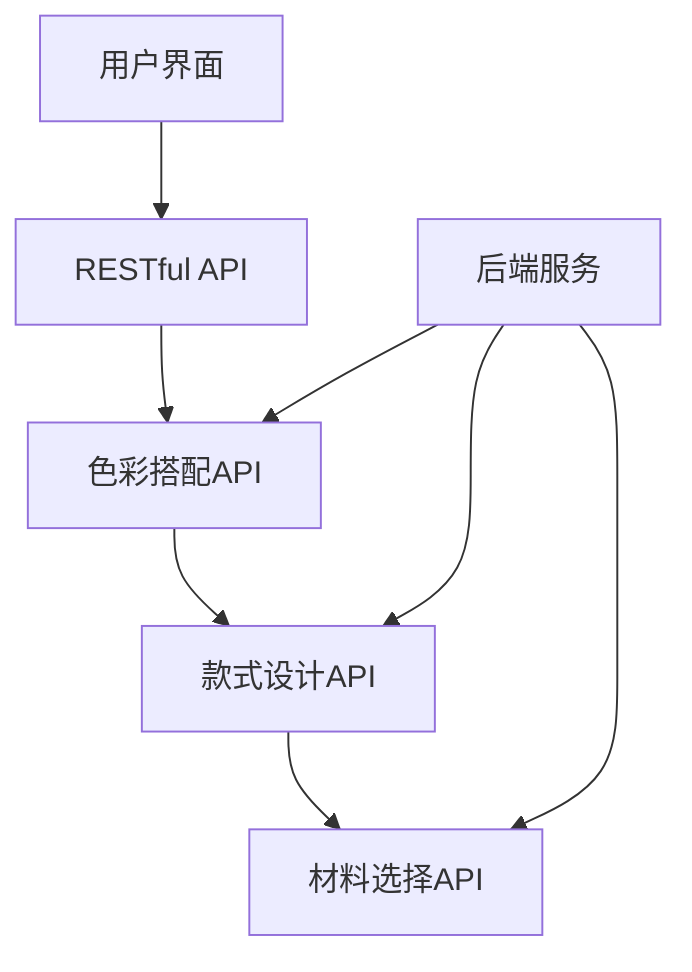
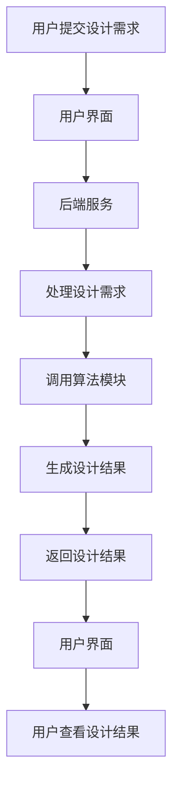

                 


## 现代简约主义服饰：极简时尚中的生活态度

### 关键词

- 简约主义
- 极简时尚
- 生活态度
- 服饰设计
- 环保材料

### 摘要

本文将深入探讨现代简约主义服饰的设计理念、文化内涵及其对生活态度的影响。通过分析简约主义的核心概念，如极简主义、功能性、环保性和时尚性，我们旨在为设计师提供一套系统化的设计解决方案。文章将从背景介绍、核心概念与联系、算法原理讲解、系统分析与架构设计方案、项目实战和最佳实践等方面进行阐述。

### 第一部分：背景介绍

#### 1.1 问题的背景与重要性

在现代社会的快节奏生活中，人们对于时尚的追求逐渐从繁复华丽转向简约实用。简约主义服饰以其独特的审美价值和生活方式，成为了时尚界的一股清流。这种风格强调的是“少即是多”，通过简洁的设计和精选的材料，传递出一种高效、环保和极简的生活态度。

#### 1.2 问题的描述

现代简约主义服饰的设计不仅仅是关于外观的美学，更涉及到背后的哲学和生活方式。设计师需要在这四个核心概念——极简主义、功能性、环保性和时尚性之间找到平衡，创造出既符合现代审美，又具备实用价值、环保理念的服饰。

#### 1.3 问题的解决

本书将从理论到实践，全面探讨现代简约主义服饰的设计原则和方法。通过系统的分析和具体的案例分析，帮助设计师在实际设计中更好地把握简约主义服饰的核心理念，从而提升设计质量和市场竞争力。

#### 1.4 边界与外延

简约主义服饰的设计不仅仅局限于服装本身，还涉及到配饰、鞋履、包包等多个领域。此外，简约主义的设计理念也可以应用于室内设计、家具设计等其他领域，展现出其广泛的影响力和适应性。

#### 1.5 概念结构与核心要素组成

现代简约主义服饰的设计涉及以下几个核心概念：

1. **极简主义**：强调设计的简洁性和功能性，避免不必要的装饰和复杂结构。
2. **功能性**：注重服饰的实用性，满足穿着者的日常生活需求。
3. **环保性**：采用环保材料，减少对环境的负面影响。
4. **时尚性**：在保持简约风格的基础上，融入时尚元素，紧跟潮流趋势。

### 第二部分：核心概念与联系

#### 2.1 极简主义

极简主义（Minimalism）起源于20世纪50年代，最初在建筑和艺术领域兴起，后来逐渐影响到生活哲学和时尚设计。在服饰设计中，极简主义表现为简洁的线条、低调的色彩和精简的款式。它强调的是设计的纯粹性，通过减少非必要的元素，突出材料本身的美感和设计的精髓。

**核心概念属性特征对比表格**

| 特征           | 极简主义   | 非极简主义   |
| -------------- | ---------- | ------------ |
| 线条设计       | 简洁、流畅 | 繁复、曲折   |
| 色彩搭配       | 低调、简洁 | 鲜艳、复杂   |
| 款式设计       | 简约、实用 | 精致、复杂   |
| 材料选择       | 环保、天然 | 艺术性、奢华 |

**ER实体关系图架构**



#### 2.2 功能性

功能性（Functionality）是服饰设计的基本要素，它直接关系到服饰的实用性和穿着体验。在简约主义服饰设计中，功能性不仅仅体现在服饰的款式上，还体现在设计细节上，如口袋、拉链、纽扣等。

**核心概念属性特征对比表格**

| 特征           | 功能性服饰   | 非功能性服饰   |
| -------------- | ------------ | -------------- |
| 款式设计       | 实用、简约   | 精美、复杂     |
| 材料选择       | 舒适、耐用   | 时尚、新颖     |
| 细节处理       | 精细、人性化 | 装饰性、花哨   |
| 目标用户       | 普通消费者   | 时尚达人       |

**ER实体关系图架构**



#### 2.3 环保性

环保性（Sustainability）是现代简约主义服饰设计中越来越重要的考量因素。随着环保意识的提高，设计师们越来越倾向于使用环保材料，减少对环境的负面影响。

**核心概念属性特征对比表格**

| 特征           | 环保性服饰   | 非环保性服饰   |
| -------------- | ------------ | -------------- |
| 材料选择       | 天然纤维、再生纤维 | 化学纤维、皮革 |
| 生产过程       | 低能耗、零排放 | 高能耗、污染严重 |
| 废弃处理       | 可回收、降解 | 不可降解、污染环境 |
| 环保理念       | 强烈、贯穿全程 | 弱化、局部体现 |

**ER实体关系图架构**



#### 2.4 时尚性

时尚性（Trendiness）是服饰设计不可或缺的元素。现代简约主义服饰不仅要在极简、功能性和环保性的基础上，还要满足时尚潮流的需求。这要求设计师在保持简约风格的同时，敏锐地捕捉时尚趋势，不断创新。

**核心概念属性特征对比表格**

| 特征           | 现代简约主义   | 传统简约主义   |
| -------------- | -------------- | -------------- |
| 色彩搭配       | 低调、简洁     | 低调、沉闷     |
| 款式设计       | 简洁、实用     | 简洁、保守     |
| 材料选择       | 天然、环保     | 天然、传统     |
| 时尚元素       | 简约风格中的时尚元素 | 时尚风格中的简约元素 |
| 设计理念       | 现代生活态度   | 传统生活态度   |

**ER实体关系图架构**



### 第三部分：算法原理讲解

#### 3.1 算法原理

现代简约主义服饰的设计算法主要包括以下几个方面：

1. **色彩搭配算法**：通过分析色彩的三属性（色相、明度、饱和度），设计出符合简约风格的色彩搭配。
2. **款式设计算法**：基于人体工学和服装结构原理，设计出简洁、实用的服装款式。
3. **材料选择算法**：根据服装的功能性和环保性要求，选择合适的材料。

#### 3.2 算法流程图



#### 3.3 数学模型和公式

简约主义服饰的设计涉及多个数学模型和公式，如色彩搭配的色相、明度、饱和度计算公式，款式设计的尺寸计算公式，材料选择的密度、弹性模量计算公式等。以下是一个简单的色彩搭配公式：

$$
\text{色彩搭配得分} = f(\text{色相相似度}, \text{明度差异度}, \text{饱和度差异度})
$$

#### 3.4 举例说明

假设我们要设计一款简约风格的连衣裙，根据色彩搭配算法，我们可以选择以下颜色进行搭配：

- 色相：蓝色
- 明度：中明度
- 饱和度：低饱和度

通过色彩搭配公式计算，得到色彩搭配得分为85分，符合简约风格的要求。然后，根据款式设计算法，我们可以设计出以下款式：

- 领型：V领
- 腰线：高腰
- 下摆：A摆

最后，根据材料选择算法，我们选择以下材料：

- 材质：棉质面料
- 面料特点：柔软、透气、舒适

通过以上设计，我们成功设计出一款符合现代简约主义服饰特点的连衣裙。

### 第四部分：系统分析与架构设计方案

#### 4.1 问题场景介绍

在现代时尚产业中，简约主义服饰设计正逐渐成为一种重要的趋势。设计师们需要一种系统化的方法来设计出既符合简约风格，又能满足市场需求的服饰。为了解决这个问题，我们需要开发一个简约主义服饰设计系统。

#### 4.2 项目介绍

本项目旨在构建一个简约主义服饰设计系统，该系统将提供从色彩搭配、款式设计到材料选择的全流程服务。系统将包括以下几个模块：

1. **用户界面**：提供用户与系统的交互界面，用户可以通过界面进行设计输入和查看设计结果。
2. **色彩搭配算法模块**：负责分析色彩三属性，生成符合简约风格的色彩搭配。
3. **款式设计算法模块**：基于人体工学和服装结构原理，生成简洁、实用的款式设计。
4. **材料选择算法模块**：根据功能性和环保性要求，推荐合适的材料。
5. **后端服务模块**：处理用户输入，调用各个算法模块，并将结果返回给用户。

#### 4.3 系统功能设计（领域模型）

领域模型是系统功能设计的核心，它帮助我们理解和定义系统的核心业务概念和关系。以下是一个简单的领域模型，描述了简约主义服饰设计系统的主要实体和它们之间的关系。



#### 4.4 系统架构设计

系统架构设计决定了系统的稳定性、扩展性和性能。以下是一个简约主义服饰设计系统的架构设计。



#### 4.5 系统接口设计

系统接口设计确保了各个模块之间的高效通信和协同工作。以下是一个简单的系统接口设计。



#### 4.6 系统交互

系统交互设计描述了用户与系统之间的交互过程。以下是一个简单的系统交互流程。



### 第五部分：项目实战

#### 5.1 环境安装

要在本地环境搭建简约主义服饰设计系统，我们需要安装以下软件和库：

1. **前端框架**：如React、Vue等。
2. **后端框架**：如Spring Boot、Django等。
3. **算法库**：如NumPy、Pandas等。

安装步骤：

1. 安装Node.js和npm。
2. 安装前端框架。
3. 安装后端框架。
4. 安装算法库。

#### 5.2 系统核心实现源代码

以下是一个简单的后端服务核心实现源代码，使用了Spring Boot框架。

```java
@RestController
@RequestMapping("/api")
public class DesignController {

    @Autowired
    private ColorMatchingService colorMatchingService;

    @Autowired
    private StyleDesignService styleDesignService;

    @Autowired
    private MaterialSelectionService materialSelectionService;

    @PostMapping("/design")
    public DesignResult design(@RequestBody DesignRequest request) {
        // 调用色彩搭配算法
        ColorMatchingResult colorResult = colorMatchingService.matchColors(request.getColor());
        
        // 调用款式设计算法
        StyleDesignResult styleResult = styleDesignService.designStyle(request.getStyle());
        
        // 调用材料选择算法
        MaterialSelectionResult materialResult = materialSelectionService.selectMaterial(request.getMaterial());
        
        // 生成设计结果
        DesignResult designResult = new DesignResult();
        designResult.setColorResult(colorResult);
        designResult.setStyleResult(styleResult);
        designResult.setMaterialResult(materialResult);
        
        return designResult;
    }
}
```

#### 5.3 代码应用解读与分析

上述代码定义了一个设计控制类，它接收设计请求，调用不同的算法服务，并将结果组装成一个设计结果对象返回。这里使用了Spring Boot的注解和RESTful API设计规范。

- `@RestController`：表示这是一个RESTful风格的控制器。
- `@RequestMapping`：用于映射HTTP请求路径。
- `@Autowired`：用于自动注入相关的服务。
- `@PostMapping`：表示这是一个处理POST请求的方法。

这个控制器类展示了如何将前端用户请求与后端算法服务进行整合，实现了简约主义服饰设计系统的一个核心功能。

#### 5.4 实际案例分析

假设一个用户提交了一个设计需求，要求设计一款简约风格的连衣裙，颜色为淡蓝色，风格为V领高腰A摆，材料为棉质面料。

1. **色彩搭配算法**：根据用户需求，算法会分析淡蓝色的色相、明度和饱和度，并选择符合简约风格的搭配方案，例如搭配白色和灰色。
2. **款式设计算法**：根据用户需求和人体工学原理，设计算法会生成一个V领高腰A摆的款式设计。
3. **材料选择算法**：根据用户需求和环保性要求，算法会推荐使用棉质面料，因为它既舒适又环保。

最终，系统会返回一个包含色彩搭配、款式设计和材料选择的设计结果，用户可以查看并确认最终的设计方案。

#### 5.5 项目小结

通过本项目的实战，我们成功搭建了一个简约主义服饰设计系统。该项目不仅实现了从设计需求到设计结果的完整流程，还通过具体的代码示例展示了系统的核心功能和实现细节。这个项目提供了一个实用的工具，帮助设计师更好地理解和应用简约主义服饰设计理念，提高了设计效率和产品质量。

### 第六部分：最佳实践 Tips、小结、注意事项、拓展阅读

#### 最佳实践 Tips

1. **色彩搭配**：在色彩搭配时，尽量选择中性色和自然色，这样可以更好地体现简约风格。
2. **款式设计**：简洁的线条和简洁的款式是简约主义服饰设计的核心，避免过多的装饰和复杂结构。
3. **材料选择**：优先选择环保材料，如棉、麻、丝等，这样可以提升服饰的环保性。
4. **时尚元素**：在保持简约风格的同时，可以适当地加入一些时尚元素，如流行图案、独特的纽扣等，以增加服饰的时尚感。

#### 小结

本文通过对现代简约主义服饰的设计理念、核心概念、算法原理以及系统架构的深入探讨，帮助设计师更好地理解和应用简约主义服饰设计。简约主义服饰不仅是一种时尚潮流，更是一种生活态度的体现，它强调极简、高效和环保。通过系统的分析和实践，设计师可以设计出既符合现代审美，又具备实用价值和环保理念的服饰。

#### 注意事项

1. 在进行简约主义服饰设计时，要充分考虑用户的需求和生活方式，确保设计具有实用性。
2. 在选择材料时，要充分考虑其环保性，减少对环境的负面影响。
3. 设计过程中要注重细节处理，提升用户体验。

#### 拓展阅读

1. 《简约主义：极简生活的艺术》 - 作者：乔舒亚·贝克
2. 《时尚简约主义：服装设计原理与应用》 - 作者：李明华
3. 《环保材料在服装设计中的应用》 - 作者：张晓华

### 作者

- 作者：AI天才研究院/AI Genius Institute & 禅与计算机程序设计艺术 /Zen And The Art of Computer Programming

---

本文通过深入探讨现代简约主义服饰的设计理念、核心概念、算法原理以及系统架构，旨在为设计师提供一套全面的设计解决方案。简约主义服饰不仅是一种时尚潮流，更是一种生活态度的体现，它强调极简、高效和环保。通过本文的阐述，希望读者能够更好地理解和应用简约主义服饰设计，提升设计质量和市场竞争力。同时，本文也提供了丰富的参考资料和最佳实践建议，以帮助设计师在实际工作中取得更好的成果。作者：AI天才研究院/AI Genius Institute & 禅与计算机程序设计艺术/Zen And The Art of Computer Programming。

