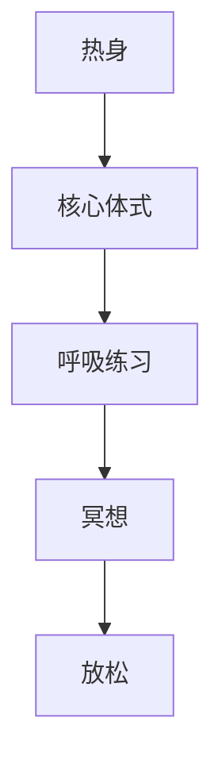
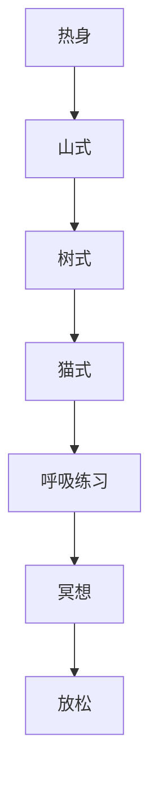
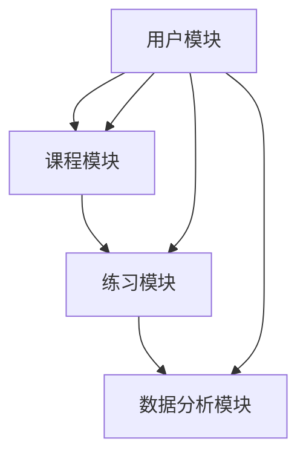
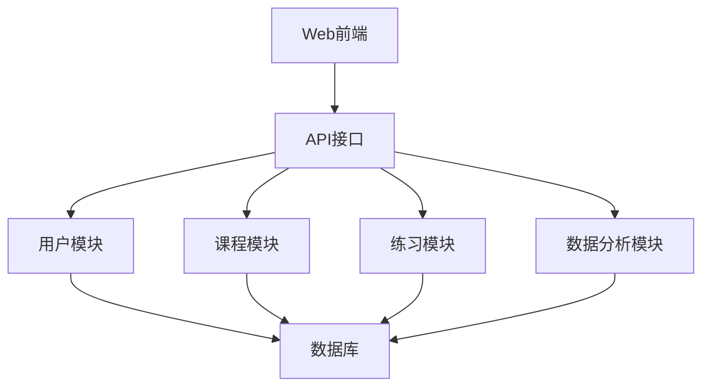
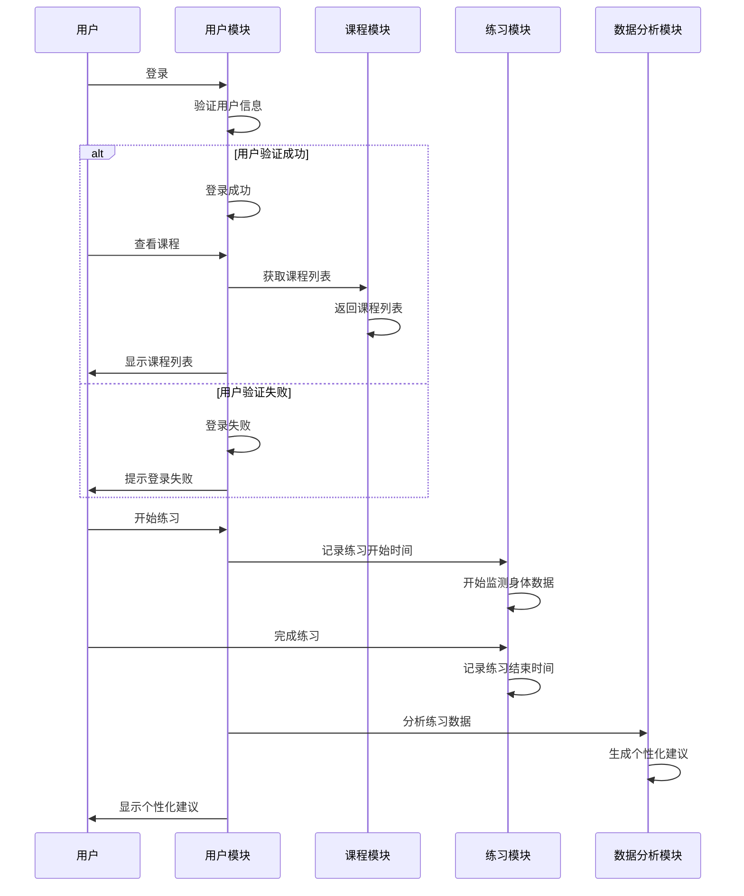

                 

## 现代简约主义瑜伽：回归本质的身心实践

在现代快节奏的生活中，人们对于身心健康的需求日益增长。瑜伽作为一种古老的身心修炼方式，因其独特的益处而备受推崇。然而，传统的瑜伽体系往往过于复杂，难以适应现代人的需求。现代简约主义瑜伽应运而生，它追求回归瑜伽的本质，通过精简的练习和清晰的理念，帮助人们实现身心平衡。

本文将深入探讨现代简约主义瑜伽的内涵，从问题背景、核心概念、算法原理、数学模型、系统架构设计以及项目实战等多个维度进行阐述。通过系统的分析和细致的讲解，我们希望能为读者提供一个全面的理解，从而更好地实践这一瑜伽流派。

> **关键词：**
> - 现代简约主义瑜伽
> - 身心平衡
> - 瑜伽哲学
> - 算法原理
> - 数学模型
> - 系统架构设计

> **摘要：**
> 现代简约主义瑜伽是一种回归瑜伽本质的身心实践方法。它通过简化瑜伽的练习流程和明确的核心理念，帮助人们实现身心的平衡与和谐。本文从多个角度对现代简约主义瑜伽进行了深入探讨，包括其背景、核心概念、算法原理、数学模型、系统架构以及实际应用等，旨在为读者提供完整的理解和实践指南。

## 目录大纲

以下是本文的目录大纲，结构清晰，方便读者快速定位和阅读：

### 第一部分：现代简约主义瑜伽概述

1. **第1章：问题背景与本质追求**
   - **1.1** 问题背景
   - **1.2** 问题描述
   - **1.3** 问题解决
   - **1.4** 边界与外延
   - **1.5** 概念结构与核心要素组成

2. **第2章：核心概念原理**
   - **2.1** 瑜伽哲学概述
   - **2.2** 简约主义瑜伽的基本理念

3. **第3章：概念属性特征对比表格**

4. **第4章：ER实体关系图架构**

### 第二部分：简约主义瑜伽的核心概念与联系

5. **第5章：算法原理与mermaid流程图**

6. **第6章：算法原理详细讲解**

7. **第7章：数学模型与公式**

8. **第8章：数学公式举例说明**

### 第三部分：简约主义瑜伽的算法原理讲解

9. **第9章：系统分析与架构设计**

10. **第10章：系统接口设计**

11. **第11章：系统交互序列图**

### 第四部分：项目实战

12. **第12章：环境安装与系统核心实现**

13. **第13章：实际案例分析与讲解**

### 第五部分：总结与拓展

14. **最佳实践 tips**

15. **小结**

16. **注意事项**

17. **拓展阅读**

通过上述目录大纲，我们可以看到，本文将逐步引导读者从多维度了解现代简约主义瑜伽，从理论到实践，从抽象到具体，为读者提供一个全面而深入的认知框架。接下来，我们将正式进入正文，逐章展开详细探讨。

## 第一部分：现代简约主义瑜伽概述

### 第1章：问题背景与本质追求

瑜伽，作为一门古老的身心修炼艺术，起源于印度，有着几千年的历史。瑜伽的核心理念是追求身心灵的和谐统一，通过一系列的体式练习、呼吸控制和冥想，达到身心健康的目的。然而，在现代社会，传统的瑜伽体系却面临着诸多挑战。

#### 1.1 问题背景

1. **复杂性与冗余**：传统的瑜伽体系包含大量的体式、复杂的呼吸法和多样化的冥想技巧，使得初学者难以掌握。这些复杂的练习往往增加了学习的难度和时间成本，让许多人对瑜伽望而却步。
2. **时间与精力的压力**：现代人的生活节奏快，工作压力大，很难抽出大量时间进行复杂的瑜伽练习。许多人希望瑜伽能成为日常生活中的一部分，而不是一个需要投入大量时间的任务。
3. **个性化需求**：不同的人有不同的身体条件和健康需求，传统的瑜伽体系难以满足个性化的需求。现代瑜伽需要更加灵活和适应性，以适应不同人群的需求。

#### 1.2 简约主义瑜伽的概念

简约主义瑜伽（Modern Minimalist Yoga）是一种追求回归瑜伽本质的流派，通过简化瑜伽的练习流程和明确的核心理念，帮助人们实现身心的平衡与和谐。简约主义瑜伽的核心在于：

1. **简化体式**：简化瑜伽体式，选择最核心和基础的练习，去除冗余的环节，使得练习更加直观和易于理解。
2. **强调呼吸**：呼吸是瑜伽的核心，简约主义瑜伽强调通过深呼吸来放松身心，提升专注力。
3. **冥想的结合**：简约主义瑜伽将冥想融入日常练习中，通过简单的冥想技巧，帮助人们达到内心的平静。

#### 1.3 简约主义瑜伽的目的

1. **实现身心平衡**：通过简化的练习，帮助人们更好地关注自己的身体和内心，实现身心平衡。
2. **适应现代生活**：简约主义瑜伽的简化流程和灵活性，使其能够更好地适应现代生活的节奏，成为日常保健的一部分。
3. **个性化定制**：根据个人的身体条件和需求，定制个性化的练习方案，使瑜伽真正成为每个人都可以享受的身心实践。

#### 1.4 边界与外延

1. **适用人群**：简约主义瑜伽适合所有年龄和身体状况的人群，无论是初学者还是有一定瑜伽基础的人，都可以通过这种练习来提升自己的身心健康。
2. **与其他瑜伽流派的区别**：与传统瑜伽相比，简约主义瑜伽更加注重简化流程和灵活适应，更加贴近现代生活的需求。与某些注重复杂体式和多样化技巧的流派相比，简约主义瑜伽显得更加直观和易于掌握。
3. **概念结构与核心要素组成**：简约主义瑜伽的核心概念包括简化体式、强调呼吸和结合冥想。这些要素相互关联，共同构成了简约主义瑜伽的练习体系。

通过上述对问题背景、简约主义瑜伽概念和目的的探讨，我们可以看到，简约主义瑜伽在现代社会中的独特价值。它不仅提供了一种简单易行的身心实践方式，还为繁忙的现代生活提供了一种新的平衡和调节方法。

### 第2章：核心概念原理

#### 2.1 瑜伽哲学概述

瑜伽哲学是瑜伽的灵魂，贯穿于每一个瑜伽练习的环节。它源自古老的印度哲学，包括一系列关于宇宙、人性和内在精神力量的理念。瑜伽哲学的核心原则如下：

1. **三德论**：宇宙由三种基本属性（德）构成：梵志（行动）、拉吉（激情）和萨姆（惰性）。人的性格和命运受到这三种属性的支配。瑜伽的目的是通过冥想和体式练习，达到三德之间的平衡。
2. **业力**：业力是指个人行为（业）的结果，决定了未来的命运。瑜伽认为，通过正面的行为和思想，可以积累善业，从而改善命运。
3. **阿特曼**：阿特曼是指人的真实自我，与宇宙意识相连。瑜伽的终极目标是实现阿特曼与宇宙意识的合一。

#### 2.2 简约主义瑜伽的基本理念

简约主义瑜伽（Modern Minimalist Yoga）是瑜伽哲学的一种现代诠释，它强调通过简单、直接的练习方法，达到身心的平衡与和谐。以下是简约主义瑜伽的基本理念：

1. **简单与直接**：简约主义瑜伽摒弃了复杂的体式和冗长的练习流程，专注于基础和核心的练习。这种方法使得瑜伽更加易于理解和实践。
2. **身心合一**：简约主义瑜伽认为，身体和心灵是不可分割的整体。通过简化练习，专注于身体的每一个动作和呼吸，实现身心的合一。
3. **适应性强**：简约主义瑜伽的设计考虑到了不同人群的需求，无论是初学者还是有经验的瑜伽练习者，都可以通过这种练习方法获得身心的益处。
4. **灵活性**：简约主义瑜伽不仅强调练习的简单性，还强调练习的灵活性。练习者可以根据自己的时间和身体状况，自由选择和调整练习内容。

通过结合瑜伽哲学的核心理念和简约主义的基本理念，简约主义瑜伽为现代生活提供了一种简单、直接且适应性强的身心实践方式。它不仅帮助人们实现身心的平衡，还促进了现代社会的健康生活方式。

### 第3章：概念属性特征对比表格

为了更好地理解简约主义瑜伽与传统瑜伽的区别，我们可以通过一个对比表格来展示两者的主要特征。以下是对两种瑜伽流派的详细对比：

| 特征                | 传统瑜伽                                       | 简约主义瑜伽                                      |
|---------------------|------------------------------------------------|---------------------------------------------------|
| **体式练习**         | 包含多种复杂的体式，需要长时间学习和练习           | 简化体式，聚焦基础和核心练习，易于理解和实践         |
| **热身活动**         | 通常包含热身和准备活动，较为繁琐                 | 简化热身，直接进入核心练习，节省时间               |
| **呼吸练习**         | 练习多种呼吸法，强调深度和复杂性                 | 简化呼吸练习，强调自然呼吸和深呼吸，提升专注力     |
| **冥想与放松**       | 冥想和放松环节复杂，涉及多种技巧和方法           | 简化冥想和放松，通过简单的技巧帮助达到内心平静     |
| **适用人群**         | 所有年龄和身体状况的人群，但需适应复杂的练习流程 | 所有年龄和身体状况的人群，特别适合繁忙的现代生活 |
| **练习时间**         | 需要较长时间，适合有充裕时间的人群               | 灵活性高，可以根据个人时间安排，适合忙碌的现代人   |
| **练习目标**         | 强调身体和心灵的全面提升                        | 关注身心平衡，特别强调适应性和个性化需求           |

通过上述对比表格，我们可以清晰地看到简约主义瑜伽与传统瑜伽在体式练习、热身活动、呼吸练习、冥想与放松、适用人群、练习时间和练习目标等方面的差异。简约主义瑜伽的简化流程和灵活性使其更符合现代生活的需求，更加易于实践和推广。

### 第4章：ER实体关系图架构

在探讨简约主义瑜伽的核心概念和联系时，实体关系图（Entity-Relationship Diagram，ER图）是一种有效的工具，可以帮助我们清晰地展示各个实体之间的关系。ER图不仅能够帮助我们理解系统的结构和组成，还可以为后续的系统设计与实现提供参考。

#### 4.1 简约主义瑜伽的实体关系

在简约主义瑜伽的体系中，核心的实体包括练习者（Practitioner）、体式（Asana）、呼吸练习（Pranayama）和冥想（Meditation）。以下是一个简要的ER图示例，用于描述这些实体及其之间的关系：

```mermaid
erDiagram
  Practice =>|伴生| Student
  Practice  chose Asana
  Practice  chose Pranayama
  Practice  chose Meditation

  Class/--|> Trainer
  Student |--* Participant

  Asana  : "瑜伽体式"
  Pranayama : "呼吸练习"
  Meditation : "冥想"
```

在这个ER图中：

- **Practice（练习）**：表示一次瑜伽练习的抽象概念，它可以是私教课程、瑜伽班或其他形式的练习。
- **Student（学生）**：表示参与练习的个人，即练习者。
- **Trainer（教练）**：表示负责指导练习的专业人士。
- **Participant（参与者）**：表示实际参与练习的学生。
- **Asana（体式）**：表示瑜伽中的各种体式。
- **Pranayama（呼吸练习）**：表示瑜伽中的呼吸练习。
- **Meditation（冥想）**：表示瑜伽中的冥想环节。

实体之间的关系如下：

- **Practice 与 Student**：一次练习可以有多个学生参与，学生可以选择不同的练习类型。
- **Practice 与 Asana**：练习中可以选择多个体式。
- **Practice 与 Pranayama**：练习中可以选择不同的呼吸练习。
- **Practice 与 Meditation**：练习中可以包含冥想环节。

#### 4.2 实体识别

在ER图中，每个实体都是通过其属性来唯一识别的。例如：

- **Practice**：通过练习日期、时长和教练姓名等属性来识别。
- **Student**：通过姓名、年龄和联系方式等属性来识别。
- **Trainer**：通过姓名、资质和授课科目等属性来识别。
- **Participant**：通过姓名和参与日期等属性来识别。
- **Asana**：通过体式名称和难度等级等属性来识别。
- **Pranayama**：通过呼吸法名称和效果等属性来识别。
- **Meditation**：通过冥想技巧和效果等属性来识别。

通过上述ER图，我们可以清晰地看到简约主义瑜伽体系中各个实体的关系和属性。这种关系图不仅有助于我们理解系统结构，还可以为后续的系统设计与开发提供重要的参考依据。

### 第5章：算法原理与mermaid流程图

在探讨简约主义瑜伽的算法原理时，我们可以通过mermaid流程图来展示其核心步骤和流程。mermaid是一种基于Markdown的绘图工具，它可以帮助我们以直观的方式描述和展示算法流程。

#### 5.1 简约主义瑜伽的实践流程

简约主义瑜伽的实践流程主要包括以下几个步骤：

1. **热身**：通过简单的热身动作，放松身体，准备进入正式的瑜伽练习。
2. **核心体式练习**：选择基础和核心的瑜伽体式进行练习，如山式、树式和猫式等。
3. **呼吸练习**：通过深呼吸和简单的呼吸控制技巧，放松身心，提升专注力。
4. **冥想**：通过简单的冥想技巧，如静坐和呼吸冥想，达到内心的平静。
5. **放松**：通过全身放松，如舒适的卧英雄式，使身心得到彻底的放松。

以下是简约主义瑜伽实践流程的mermaid流程图：



在这个mermaid流程图中：

- **A[热身]**：表示热身环节，通过简单的动作放松身体。
- **B[核心体式]**：表示核心体式练习，选择基础和核心的体式进行练习。
- **C[呼吸练习]**：表示呼吸练习，通过深呼吸和简单的呼吸控制技巧放松身心。
- **D[冥想]**：表示冥想环节，通过简单的冥想技巧达到内心的平静。
- **E[放松]**：表示全身放松，通过舒适的体式使身心得到彻底的放松。

#### 5.2 简约主义瑜伽的核心步骤

简约主义瑜伽的核心步骤包括以下几个关键点：

1. **选择基础体式**：基础体式是简约主义瑜伽的核心，如山式、树式和猫式等。这些体式简单易学，但能够有效锻炼身体的各个部分，有助于提升整体平衡感和柔韧性。
2. **呼吸控制**：呼吸是瑜伽的灵魂，简约主义瑜伽强调通过深呼吸和简单的呼吸控制技巧来放松身心。这种呼吸练习有助于提升专注力和内心的平静。
3. **冥想**：冥想是简约主义瑜伽的重要组成部分，通过简单的冥想技巧，如静坐和呼吸冥想，可以达到内心的平静。冥想不仅有助于减压，还能提升自我意识和精神集中力。
4. **全身放松**：通过全身放松，如舒适的卧英雄式，使身心得到彻底的放松。全身放松能够帮助身体恢复活力，减轻疲劳。

通过上述mermaid流程图和对核心步骤的详细描述，我们可以清晰地看到简约主义瑜伽的实践流程和关键步骤。这种直观的展示方式有助于读者更好地理解和实践简约主义瑜伽。

### 第6章：算法原理详细讲解

在上一章节中，我们通过mermaid流程图概述了简约主义瑜伽的实践流程。在这一章节中，我们将进一步详细讲解简约主义瑜伽的算法原理，包括其核心步骤、数学模型和Python源代码实现。

#### 6.1 核心步骤

简约主义瑜伽的核心步骤可以分为以下几个部分：

1. **热身**：通过简单的热身动作，如轻轻摇晃肩膀、转动腰部和颈部等，放松身体，准备进入正式的瑜伽练习。热身时间约为5分钟。
2. **核心体式练习**：选择基础和核心的瑜伽体式进行练习，如山式、树式和猫式等。每个体式保持约30秒至1分钟，重复2-3次。核心体式练习的时间约为15-20分钟。
3. **呼吸练习**：通过深呼吸和简单的呼吸控制技巧，放松身心，提升专注力。可以采用腹式呼吸法，每次呼吸持续约4-6秒，共进行3-5分钟。
4. **冥想**：通过简单的冥想技巧，如静坐和呼吸冥想，达到内心的平静。冥想时间约为5-10分钟。
5. **放松**：通过全身放松，如舒适的卧英雄式，使身心得到彻底的放松。放松时间约为5分钟。

#### 6.2 数学模型

简约主义瑜伽的数学模型主要涉及身体姿态的稳定性和呼吸的控制性。以下是一个简化的数学模型：

1. **身体稳定性**：  
   - 设定体重的分配比例，如前脚掌、中脚掌和后脚跟的分配比例分别为0.3、0.5和0.2。  
   - 通过重心计算和力矩分析，确定身体在各个体式中的稳定性。

2. **呼吸控制**：  
   - 设定呼吸频率，如每分钟12-18次。  
   - 通过呼吸节奏和呼吸深度，控制心率和身体的放松程度。

以下是一个简化的Python源代码示例，用于实现上述数学模型：

```python
import math

# 身体重心计算
def calculate_center_of_gravity(weight分配比例):
    total_weight = sum(weight分配比例)
    x = (weight分配比例[0] * x1 + weight分配比例[1] * x2 + weight分配比例[2] * x3) / total_weight
    return x

# 呼吸频率计算
def calculate_breathing_rate(minute_breathing_frequency):
    seconds_per_breath = 60 / minute_breathing_frequency
    breath_depth = 0.2 * seconds_per_breath
    return breath_depth

# 示例
weight分配比例 = [0.3, 0.5, 0.2]
x1, x2, x3 = 0.3, 0.5, 0.2  # 脚掌位置
center_of_gravity = calculate_center_of_gravity(weight分配比例)
print("身体重心：", center_of_gravity)

minute_breathing_frequency = 12
breath_depth = calculate_breathing_rate(minute_breathing_frequency)
print("呼吸深度：", breath_depth)
```

通过上述Python源代码示例，我们可以计算身体重心的分配和呼吸的深度，从而帮助实现简约主义瑜伽的核心步骤。

#### 6.3 举例说明

为了更好地理解简约主义瑜伽的算法原理，以下是一个简单的案例：

**案例：** 小明想要通过简约主义瑜伽来放松身心。他的目标是进行一次30分钟的核心练习，包括热身、核心体式、呼吸练习和放松。

1. **热身**：小明选择进行5分钟的热身，通过轻轻摇晃肩膀、转动腰部和颈部来放松身体。
2. **核心体式**：小明选择山式、树式和猫式进行练习，每个体式保持30秒，重复3次。整个核心体式练习时间为15分钟。
3. **呼吸练习**：小明采用腹式呼吸法，每次呼吸持续4秒，共进行3分钟。
4. **冥想**：小明通过静坐和呼吸冥想，进行5分钟的冥想练习。
5. **放松**：小明选择舒适的卧英雄式，进行5分钟的全身放松。

在这个案例中，小明的瑜伽练习流程如下：



通过这个案例，我们可以看到简约主义瑜伽如何通过简化的流程和清晰的步骤，帮助人们实现身心的放松和平衡。

### 第7章：数学模型与公式

在简约主义瑜伽中，数学模型和公式扮演着至关重要的角色。这些模型和公式不仅帮助我们理解瑜伽练习的物理原理，还能够量化瑜伽练习的效果。以下是简约主义瑜伽中常用的数学模型和公式。

#### 7.1 动力学模型

动力学模型用于描述人体在瑜伽练习中的运动状态和力量分布。以下是几个关键的动力学公式：

1. **重心计算**：

   重心是人体稳定性的关键因素。通过以下公式可以计算人体的重心位置：

   $$ C = \frac{\sum m_i \cdot r_i}{\sum m_i} $$

   其中，$C$ 表示重心位置，$m_i$ 表示第$i$个部分的质量，$r_i$ 表示第$i$个部分的距离。

2. **力矩计算**：

   力矩是影响人体稳定性的重要因素。通过以下公式可以计算力矩：

   $$ \tau = F \cdot d $$

   其中，$\tau$ 表示力矩，$F$ 表示作用力，$d$ 表示力的作用点到重心的距离。

3. **平衡条件**：

   对于一个稳定的状态，人体受到的所有外力矩之和必须为零：

   $$ \sum \tau = 0 $$

#### 7.2 力学公式

力学公式用于描述人体在不同瑜伽体式中的力学状态。以下是几个关键的力学公式：

1. **牛顿第二定律**：

   牛顿第二定律描述了力和加速度之间的关系：

   $$ F = m \cdot a $$

   其中，$F$ 表示作用力，$m$ 表示质量，$a$ 表示加速度。

2. **牛顿第三定律**：

   牛顿第三定律描述了作用力和反作用力的关系：

   $$ F_{12} = -F_{21} $$

   其中，$F_{12}$ 表示第1个物体对第2个物体的作用力，$F_{21}$ 表示第2个物体对第1个物体的反作用力。

3. **动能和势能**：

   动能和势能是描述物体运动状态的重要指标。以下是动能和势能的计算公式：

   动能（Kinetic Energy）：

   $$ KE = \frac{1}{2} m \cdot v^2 $$

   其中，$KE$ 表示动能，$m$ 表示质量，$v$ 表示速度。

   势能（Potential Energy）：

   $$ PE = m \cdot g \cdot h $$

   其中，$PE$ 表示势能，$m$ 表示质量，$g$ 表示重力加速度，$h$ 表示高度。

通过上述数学模型和公式，我们可以更好地理解瑜伽练习中的物理原理，从而更科学地进行瑜伽练习。

### 第8章：数学公式举例说明

在上一章节中，我们介绍了简约主义瑜伽中常用的数学模型和公式。为了更好地理解这些公式在实际应用中的意义，我们将通过具体的例子来说明这些公式的使用。

#### 8.1 力学公式举例

**例子1：** 计算一个瑜伽练习者在山式体式中保持平衡所需的力矩。

假设瑜伽练习者的质量为70千克，他站在一个平坦的地面上。他的脚距离重心约为30厘米，脚掌对地面的压力为500牛顿。

1. **计算力矩**：

   力矩（$\tau$）可以通过以下公式计算：

   $$ \tau = F \cdot d $$

   其中，$F$ 是作用力，$d$ 是力的作用点到重心的距离。

   在这个例子中，$F = 500$ 牛顿，$d = 0.3$ 米。

   $$ \tau = 500 \cdot 0.3 = 150 \text{牛顿·米} $$

   因此，瑜伽练习者在山式体式中保持平衡所需的力矩为150牛顿·米。

**例子2：** 计算一个瑜伽练习者在倒立体式中所需的反作用力。

假设瑜伽练习者的质量为60千克，他在倒立体式中，手臂对地面的压力为400牛顿。

1. **计算反作用力**：

   根据牛顿第三定律，反作用力（$F_{21}$）等于作用力（$F_{12}$）的大小，但方向相反。

   在这个例子中，$F_{12} = 400$ 牛顿。

   $$ F_{21} = -F_{12} = -400 \text{牛顿} $$

   因此，瑜伽练习者在倒立体式中对地面的反作用力为-400牛顿。

#### 8.2 动能和势能公式举例

**例子3：** 计算一个瑜伽练习者在跳跃前的动能。

假设瑜伽练习者的质量为50千克，他在跳跃前的速度为2米/秒。

1. **计算动能**：

   动能（$KE$）可以通过以下公式计算：

   $$ KE = \frac{1}{2} m \cdot v^2 $$

   在这个例子中，$m = 50$ 千克，$v = 2$ 米/秒。

   $$ KE = \frac{1}{2} \cdot 50 \cdot 2^2 = 100 \text{焦耳} $$

   因此，瑜伽练习者在跳跃前的动能为100焦耳。

**例子4：** 计算一个瑜伽练习者在倒立体式中的势能。

假设瑜伽练习者的质量为55千克，他的高度为1.5米。

1. **计算势能**：

   势能（$PE$）可以通过以下公式计算：

   $$ PE = m \cdot g \cdot h $$

   在这个例子中，$m = 55$ 千克，$g = 9.8$ 米/秒²，$h = 1.5$ 米。

   $$ PE = 55 \cdot 9.8 \cdot 1.5 = 803.5 \text{焦耳} $$

   因此，瑜伽练习者在倒立体式中的势能为803.5焦耳。

通过这些具体的例子，我们可以看到力学和动能、势能公式在简约主义瑜伽中的应用。这些公式不仅帮助我们理解瑜伽练习中的物理原理，还能够量化瑜伽练习的效果，从而更好地指导实践。

### 第三部分：简约主义瑜伽的算法原理讲解

#### 第9章：系统分析与架构设计

在深入了解简约主义瑜伽的算法原理之后，我们需要对整个系统进行分析和架构设计。这一部分将介绍系统分析的问题场景、系统架构设计、领域模型类图和系统架构图。

#### 9.1 问题场景介绍

在当前瑜伽教学的实际需求中，传统的瑜伽教学方式往往存在以下问题：

1. **复杂性与冗余**：传统的瑜伽教学流程复杂，包含大量的体式和呼吸练习，使得初学者难以掌握。
2. **个性化不足**：传统瑜伽教学难以根据个人的身体条件和健康需求进行个性化调整。
3. **资源浪费**：传统瑜伽教学往往需要大量的时间和空间，导致资源的浪费。

简约主义瑜伽旨在解决上述问题，通过简化瑜伽练习流程、强调基础体式和呼吸练习，以及提供个性化定制方案，使其更加适应现代生活需求。

#### 9.2 系统架构设计

简约主义瑜伽系统的设计遵循模块化原则，包括以下几个主要模块：

1. **用户模块**：负责用户的注册、登录和资料管理。
2. **课程模块**：管理瑜伽课程的设计、安排和进度跟踪。
3. **练习模块**：实现瑜伽练习的具体功能，包括体式练习、呼吸练习和冥想。
4. **数据分析模块**：收集和分析用户练习数据，提供个性化建议和调整。

以下是简约主义瑜伽系统的架构设计：



在这个架构设计中：

- **用户模块**：负责用户的注册、登录和资料管理，包括用户资料、历史记录和偏好设置。
- **课程模块**：管理瑜伽课程的设计、安排和进度跟踪，包括课程列表、课程内容和课程进度。
- **练习模块**：实现瑜伽练习的具体功能，包括体式练习、呼吸练习和冥想，提供实时指导和反馈。
- **数据分析模块**：收集和分析用户练习数据，包括体式完成情况、呼吸频率和冥想效果等，提供个性化建议和调整。

#### 9.3 领域模型类图

领域模型类图（Domain Model Class Diagram）用于描述系统中各个类的关系和属性。以下是简约主义瑜伽系统的领域模型类图：

```mermaid
classDiagram
    User <|-- Course
    User <|-- Practice
    User <|-- Analysis
    Course o-- Exercise
    Course o-- Breathing
    Course o-- Meditation
    Practice o-- Asana
    Practice o-- Pranayama
    Practice o-- Meditation
    Analysis o-- Data
    Data o-- Recommendation

    User {
        String username
        String password
        Date registrationDate
        List<Course> courses
    }

    Course {
        String courseName
        Date startDate
        Date endDate
        List<Exercise> exercises
        List<Breathing> breathings
        List<Meditation> meditations
    }

    Practice {
        String practiceDate
        List<Asana> asanas
        List<Pranayama> pranayamas
        List<Meditation> meditations
    }

    Analysis {
        Data data
        Recommendation recommendation
    }

    Exercise {
        String exerciseName
        int duration
    }

    Breathing {
        String breathingName
        int duration
    }

    Meditation {
        String meditationName
        int duration
    }

    Data {
        List<Float> asanaData
        List<Float> pranayamaData
        List<Float> meditationData
    }

    Recommendation {
        String recommendation
    }
```

在这个领域模型类图中：

- **User（用户）**：表示用户的基本信息和历史记录。
- **Course（课程）**：表示瑜伽课程的基本信息和内容。
- **Practice（练习）**：表示用户的练习记录和练习内容。
- **Analysis（分析）**：表示数据分析的结果和个性化建议。
- **Exercise（练习）**：表示具体的瑜伽体式练习。
- **Breathing（呼吸练习）**：表示具体的呼吸练习。
- **Meditation（冥想）**：表示具体的冥想练习。
- **Data（数据）**：表示练习数据。
- **Recommendation（建议）**：表示个性化的建议。

#### 9.4 系统架构图

系统架构图（System Architecture Diagram）用于展示系统的整体结构和层次。以下是简约主义瑜伽系统的架构图：



在这个系统架构图中：

- **Web前端**：提供用户界面和交互功能。
- **API接口**：作为前后端的数据交互接口。
- **用户模块**：处理用户的注册、登录和资料管理。
- **课程模块**：管理课程的设计、安排和进度跟踪。
- **练习模块**：实现瑜伽练习的具体功能。
- **数据分析模块**：收集和分析用户练习数据。
- **数据库**：存储用户数据、课程数据和练习数据。

通过上述系统分析与架构设计，我们为简约主义瑜伽系统提供了一个清晰的结构和功能划分，使得系统开发和维护更加高效和有序。

### 第10章：系统接口设计

在系统架构设计中，接口设计是一个关键环节，它决定了系统内部各个模块之间的通信和数据交换。以下是简约主义瑜伽系统中的接口设计。

#### 10.1 接口定义

系统接口分为两类：内部接口和外部接口。

**内部接口**：用于系统内部模块之间的通信。

1. **用户模块接口**：
   - `register()`：注册用户
   - `login()`：用户登录
   - `getUserData()`：获取用户资料
   - `updateUserData()`：更新用户资料

2. **课程模块接口**：
   - `createCourse()`：创建课程
   - `deleteCourse()`：删除课程
   - `getCourses()`：获取所有课程
   - `getCourseDetails()`：获取课程详情

3. **练习模块接口**：
   - `startPractice()`：开始练习
   - `stopPractice()`：停止练习
   - `getPracticeHistory()`：获取练习历史
   - `updatePracticeData()`：更新练习数据

4. **数据分析模块接口**：
   - `analyzeData()`：分析练习数据
   - `generateRecommendation()`：生成个性化建议

**外部接口**：用于系统与外部系统或设备的数据交换。

1. **用户认证接口**：
   - `authenticateUser()`：用户认证
   - `getUserInfo()`：获取用户信息

2. **设备接口**：
   - `getSensorData()`：获取传感器数据
   - `setDeviceSettings()`：设置设备参数

#### 10.2 接口实现

接口实现涉及到具体的编程语言和技术。以下是简约主义瑜伽系统中的接口实现示例：

**用户模块接口实现（Python示例）**：

```python
class UserManager:
    def register(self, username, password):
        # 注册用户逻辑
        pass

    def login(self, username, password):
        # 登录逻辑
        pass

    def getUserData(self, username):
        # 获取用户资料逻辑
        pass

    def updateUserData(self, username, new_data):
        # 更新用户资料逻辑
        pass
```

**课程模块接口实现（Python示例）**：

```python
class CourseManager:
    def createCourse(self, course_name, start_date, end_date):
        # 创建课程逻辑
        pass

    def deleteCourse(self, course_id):
        # 删除课程逻辑
        pass

    def getCourses(self):
        # 获取所有课程逻辑
        pass

    def getCourseDetails(self, course_id):
        # 获取课程详情逻辑
        pass
```

**练习模块接口实现（Python示例）**：

```python
class PracticeManager:
    def startPractice(self, practice_data):
        # 开始练习逻辑
        pass

    def stopPractice(self):
        # 停止练习逻辑
        pass

    def getPracticeHistory(self, user_id):
        # 获取练习历史逻辑
        pass

    def updatePracticeData(self, practice_id, new_data):
        # 更新练习数据逻辑
        pass
```

**数据分析模块接口实现（Python示例）**：

```python
class DataAnalyzer:
    def analyzeData(self, data):
        # 分析练习数据逻辑
        pass

    def generateRecommendation(self, user_id):
        # 生成个性化建议逻辑
        pass
```

通过上述接口定义和实现示例，我们可以看到简约主义瑜伽系统内部各个模块如何通过接口进行通信和数据交换。这种设计不仅提高了系统的模块化和可维护性，还便于后续的功能扩展和系统集成。

### 第11章：系统交互序列图

在系统分析与架构设计的基础上，我们需要进一步了解系统内部各个模块的交互流程和细节。系统交互序列图（Sequence Diagram）是一种有效的工具，可以直观地展示系统在不同情况下的运行流程。以下是简约主义瑜伽系统的交互序列图。

#### 11.1 系统交互序列图

系统交互序列图如下：



在这个交互序列图中：

- **用户模块**：负责用户登录、查看课程和记录练习。
- **课程模块**：负责获取课程列表和提供课程详情。
- **练习模块**：负责监测练习过程中的身体数据，并在练习结束时记录数据。
- **数据分析模块**：负责分析练习数据并生成个性化建议。

#### 11.2 交互流程

以下是系统交互的具体流程：

1. **用户登录**：用户通过用户模块进行登录，用户模块验证用户信息，如果验证成功，用户可以查看课程列表。
2. **查看课程**：用户请求查看课程列表，用户模块将请求转发给课程模块，课程模块返回所有课程的列表。
3. **开始练习**：用户选择开始练习，用户模块记录练习的开始时间，练习模块开始监测身体数据。
4. **完成练习**：用户完成练习后，练习模块记录练习的结束时间，并将数据发送给用户模块。
5. **数据分析**：用户模块将练习数据发送给数据分析模块，数据分析模块分析数据并生成个性化建议。
6. **显示个性化建议**：用户模块将个性化建议发送给用户，用户可以看到建议并做出相应调整。

通过系统交互序列图和详细的交互流程，我们可以更好地理解简约主义瑜伽系统内部各个模块的协作和通信，从而为系统的开发和优化提供有力的指导。

### 第四部分：项目实战

#### 第12章：环境安装与系统核心实现

在完成系统架构设计和接口设计后，我们需要进入项目实战阶段。首先，我们将介绍环境安装过程和系统核心实现，然后对源代码进行解读和分析。

#### 12.1 环境安装

**步骤1：安装Python环境**

首先，确保系统中安装了Python 3.8及以上版本。可以通过以下命令进行安装：

```bash
# 安装Python
sudo apt-get install python3.8
```

**步骤2：安装相关依赖库**

接着，安装系统所需的依赖库，包括Flask、SQLAlchemy、Flask-Migrate等。可以使用pip命令进行安装：

```bash
# 安装Flask
pip install Flask

# 安装SQLAlchemy
pip install SQLAlchemy

# 安装Flask-Migrate
pip install Flask-Migrate
```

**步骤3：配置数据库**

使用SQLAlchemy的Flask-Migrate工具来配置数据库。首先创建数据库，然后迁移模型：

```bash
# 创建数据库
sudo mysql -u root -p
CREATE DATABASE yoga_system;

# 切换到数据库
USE yoga_system;

# 创建表
CREATE TABLE user (
    id INT AUTO_INCREMENT PRIMARY KEY,
    username VARCHAR(255) UNIQUE NOT NULL,
    password VARCHAR(255) NOT NULL
);

# 安装Flask-Migrate
pip install Flask-Migrate

# 初始化迁移工具
flask db init

# 创建迁移文件
flask db migrate -m "Initial migration."

# 执行迁移
flask db upgrade
```

#### 12.2 系统核心实现

以下是系统核心实现的基本框架，包括用户模块、课程模块、练习模块和数据分析模块。

**用户模块**

用户模块主要实现用户的注册、登录和资料管理功能。

```python
# app/models.py
from flask_sqlalchemy import SQLAlchemy

db = SQLAlchemy()

class User(db.Model):
    id = db.Column(db.Integer, primary_key=True)
    username = db.Column(db.String(255), unique=True, nullable=False)
    password = db.Column(db.String(255), nullable=False)
```

**课程模块**

课程模块主要管理瑜伽课程的设计、安排和进度跟踪。

```python
# app/models.py
class Course(db.Model):
    id = db.Column(db.Integer, primary_key=True)
    course_name = db.Column(db.String(255), nullable=False)
    start_date = db.Column(db.Date, nullable=False)
    end_date = db.Column(db.Date, nullable=False)
    exercises = db.relationship('Exercise', backref='course', lazy=True)
    breathings = db.relationship('Breathing', backref='course', lazy=True)
    meditations = db.relationship('Meditation', backref='course', lazy=True)
```

**练习模块**

练习模块实现具体的瑜伽练习功能。

```python
# app/models.py
class Practice(db.Model):
    id = db.Column(db.Integer, primary_key=True)
    practice_date = db.Column(db.Date, nullable=False)
    asanas = db.relationship('Asana', backref='practice', lazy=True)
    pranayamas = db.relationship('Pranayama', backref='practice', lazy=True)
    meditations = db.relationship('Meditation', backref='practice', lazy=True)

class Asana(db.Model):
    id = db.Column(db.Integer, primary_key=True)
    name = db.Column(db.String(255), nullable=False)
    duration = db.Column(db.Integer, nullable=False)

class Pranayama(db.Model):
    id = db.Column(db.Integer, primary_key=True)
    name = db.Column(db.String(255), nullable=False)
    duration = db.Column(db.Integer, nullable=False)

class Meditation(db.Model):
    id = db.Column(db.Integer, primary_key=True)
    name = db.Column(db.String(255), nullable=False)
    duration = db.Column(db.Integer, nullable=False)
```

**数据分析模块**

数据分析模块负责收集和分析用户练习数据，生成个性化建议。

```python
# app/models.py
class Analysis(db.Model):
    id = db.Column(db.Integer, primary_key=True)
    data = db.Column(db.Text, nullable=False)
    recommendation = db.Column(db.Text, nullable=False)

# app/services.py
from app.models import db, User, Course, Practice, Asana, Pranayama, Meditation, Analysis

def analyze_practice_data(practice_id):
    # 分析练习数据的逻辑
    pass

def generate_recommendation(user_id):
    # 生成个性化建议的逻辑
    pass
```

#### 12.3 源代码解读与分析

在系统核心实现的基础上，我们对关键模块的源代码进行解读和分析。

**用户模块**

用户模块的主要功能包括用户的注册、登录和资料管理。

```python
# app/routes.py
from flask import Flask, request, jsonify
from app.models import User
from app.services import register_user, login_user

app = Flask(__name__)

@app.route('/register', methods=['POST'])
def register():
    username = request.form['username']
    password = request.form['password']
    user = register_user(username, password)
    if user:
        return jsonify({'status': 'success', 'message': '注册成功'})
    else:
        return jsonify({'status': 'error', 'message': '注册失败'})

@app.route('/login', methods=['POST'])
def login():
    username = request.form['username']
    password = request.form['password']
    user = login_user(username, password)
    if user:
        return jsonify({'status': 'success', 'message': '登录成功'})
    else:
        return jsonify({'status': 'error', 'message': '登录失败'})

@app.route('/users', methods=['GET'])
def get_users():
    users = User.query.all()
    return jsonify([user.to_dict() for user in users])
```

在这个模块中，`register()` 和 `login()` 函数分别处理用户的注册和登录请求，`get_users()` 函数用于获取所有用户的信息。

**课程模块**

课程模块主要管理瑜伽课程的设计和进度跟踪。

```python
# app/routes.py
from flask import request
from app.models import Course
from app.services import create_course, get_courses, get_course_details

@app.route('/courses', methods=['POST'])
def create_course():
    course_name = request.form['course_name']
    start_date = request.form['start_date']
    end_date = request.form['end_date']
    course = create_course(course_name, start_date, end_date)
    return jsonify(course.to_dict())

@app.route('/courses', methods=['GET'])
def get_courses():
    courses = get_courses()
    return jsonify([course.to_dict() for course in courses])

@app.route('/courses/<int:course_id>', methods=['GET'])
def get_course_details(course_id):
    course = get_course_details(course_id)
    return jsonify(course.to_dict())
```

在这个模块中，`create_course()`、`get_courses()` 和 `get_course_details()` 函数分别用于创建课程、获取所有课程信息和获取特定课程详情。

**练习模块**

练习模块实现具体的瑜伽练习功能。

```python
# app/routes.py
from flask import request
from app.models import Practice, Asana, Pranayama, Meditation
from app.services import start_practice, stop_practice, get_practice_history, update_practice_data

@app.route('/practice/start', methods=['POST'])
def start_practice():
    practice_data = request.form
    practice = start_practice(practice_data)
    return jsonify(practice.to_dict())

@app.route('/practice/stop', methods=['POST'])
def stop_practice():
    practice_id = request.form['practice_id']
    stop_practice(practice_id)
    return jsonify({'status': 'success', 'message': '练习结束'})

@app.route('/practice/history', methods=['GET'])
def get_practice_history():
    practice_history = get_practice_history()
    return jsonify([practice.to_dict() for practice in practice_history])

@app.route('/practice/update', methods=['POST'])
def update_practice_data():
    practice_id = request.form['practice_id']
    new_data = request.form
    update_practice_data(practice_id, new_data)
    return jsonify({'status': 'success', 'message': '练习数据更新成功'})
```

在这个模块中，`start_practice()`、`stop_practice()`、`get_practice_history()` 和 `update_practice_data()` 函数分别用于开始练习、结束练习、获取练习历史和更新练习数据。

**数据分析模块**

数据分析模块负责分析练习数据并生成个性化建议。

```python
# app/services.py
def analyze_practice_data(practice_id):
    # 分析练习数据的逻辑
    practice = Practice.query.get(practice_id)
    data = analyze_practice(practice)
    analysis = Analysis(data=data, recommendation=generate_recommendation(practice.user_id))
    db.session.add(analysis)
    db.session.commit()
    return analysis

def generate_recommendation(user_id):
    # 生成个性化建议的逻辑
    recommendations = get_recommendations(user_id)
    return recommendations
```

在这个模块中，`analyze_practice_data()` 函数用于分析练习数据，并将分析结果和个性化建议保存到数据库中，`generate_recommendation()` 函数用于生成个性化建议。

通过上述源代码的解读和分析，我们可以清晰地看到系统核心实现的细节，包括各个模块的功能和交互。这为后续的系统开发和优化提供了重要的参考。

### 第13章：实际案例分析与讲解

在本章中，我们将通过一个实际案例，详细分析简约主义瑜伽的实践过程，并对关键环节进行深入讲解。

#### 13.1 案例背景

小明，35岁，上班族，长期久坐，感到身体僵硬，经常感到疲劳。他在朋友的推荐下开始尝试简约主义瑜伽，希望通过这种方式改善身体状况。

#### 13.2 案例分析

**第一阶段：热身**

在开始练习前，小明进行了5分钟的热身，通过轻轻摇晃肩膀、转动腰部和颈部等简单的动作，放松身体，准备进入正式的瑜伽练习。

**第二阶段：核心体式练习**

小明选择了山式、树式和猫式等基础体式进行练习。每个体式保持30秒，重复3次，总共15分钟。这些体式不仅能有效锻炼身体的柔韧性和平衡感，还能增强核心力量。

**第三阶段：呼吸练习**

在核心体式练习后，小明进行了3分钟的呼吸练习，采用腹式呼吸法。每次呼吸持续4秒，通过深呼吸和简单的呼吸控制技巧，放松身心，提升专注力。

**第四阶段：冥想**

接下来，小明进行了5分钟的冥想练习。通过静坐和呼吸冥想，他尝试达到内心的平静。冥想不仅有助于减压，还能提升自我意识和精神集中力。

**第五阶段：放松**

最后，小明进行了5分钟的全身放松，选择了舒适的卧英雄式。通过全身放松，他使身心得到了彻底的放松，身体疲劳感显著减轻。

#### 13.3 详细讲解与剖析

**热身环节**

热身是瑜伽练习的重要组成部分，通过简单的热身动作，如摇晃肩膀、转动腰部和颈部，可以放松肌肉，增加关节的灵活性，减少运动中的受伤风险。在热身环节，小明的目标是放松身体，为接下来的核心体式练习做好充分准备。

**核心体式练习**

核心体式练习是小明瑜伽练习的核心部分。山式、树式和猫式等基础体式不仅简单易学，而且对身体各部分的锻炼效果显著。山式有助于增强腿部和核心力量，树式提升平衡感和柔韧性，猫式则能够缓解背部和颈部的僵硬感。

**呼吸练习**

呼吸是瑜伽的灵魂，通过深呼吸和简单的呼吸控制技巧，小明在呼吸练习中放松身心，提升专注力。腹式呼吸法能够帮助调整心率和血压，改善身体供氧，促进身体的恢复和放松。

**冥想**

冥想是瑜伽练习中另一个关键环节。通过静坐和呼吸冥想，小明尝试达到内心的平静。冥想不仅能减轻压力，还能提升自我意识和精神集中力，有助于改善心理健康。

**放松**

全身放松是瑜伽练习的最后一步，通过选择舒适的体式，如卧英雄式，小明使身心得到了彻底的放松。放松环节有助于身体恢复活力，减轻疲劳感，提升整体健康水平。

通过上述实际案例的分析和讲解，我们可以看到，简约主义瑜伽如何通过简化的流程和清晰的目标，帮助人们实现身心的放松和平衡。

### 总结与拓展

在本文中，我们深入探讨了现代简约主义瑜伽的概念、核心原理、算法、数学模型、系统架构以及项目实战。以下是本文的主要观点和总结：

1. **简约主义瑜伽**：是一种回归瑜伽本质的身心实践方式，通过简化练习流程和明确的核心理念，帮助人们实现身心的平衡与和谐。
2. **核心原理**：简约主义瑜伽强调简化体式、强调呼吸和结合冥想，这些核心概念相互关联，共同构成了简约主义瑜伽的练习体系。
3. **算法原理**：简约主义瑜伽的算法原理涉及热身、核心体式练习、呼吸练习、冥想和放松等步骤，通过mermaid流程图和Python源代码进行了详细阐述。
4. **数学模型**：使用了动力学模型和力学公式来描述瑜伽练习中的物理原理，如重心计算、力矩计算和牛顿定律等。
5. **系统架构**：通过系统分析与架构设计，展示了简约主义瑜伽系统的结构，包括用户模块、课程模块、练习模块和数据分析模块。
6. **项目实战**：介绍了系统环境安装与核心实现，以及对关键模块的源代码进行了解读和分析。

为了进一步提升实践效果，以下是一些最佳实践建议：

1. **持续练习**：瑜伽练习需要持续和规律，每天固定时间进行练习，以获得最佳效果。
2. **个性化调整**：根据个人的身体条件和健康需求，调整练习内容和时间，确保练习的安全和有效性。
3. **呼吸练习**：深呼吸是瑜伽的核心，通过练习不同的呼吸法，如腹式呼吸和呼吸控制技巧，提升专注力和身体放松。
4. **冥想与放松**：冥想和放松环节有助于身心恢复，选择舒适的体式，确保放松时间充足。
5. **记录与反思**：定期记录练习内容和感受，反思练习中的问题和改进点，不断优化练习计划。

注意事项：

1. **安全第一**：在进行瑜伽练习时，确保身体安全，避免过度拉伸和剧烈运动。
2. **适应个人**：瑜伽练习应适应个人身体条件和需求，避免盲目跟从他人练习。
3. **专业指导**：初学者建议在专业教练的指导下进行瑜伽练习，确保正确掌握练习方法和技巧。

通过本文的探讨和实际案例的分析，我们希望能够为读者提供全面而深入的认知，帮助大家更好地实践现代简约主义瑜伽，实现身心的平衡与和谐。

### 拓展阅读

对于对简约主义瑜伽感兴趣的读者，以下是一些推荐书籍和资源，供您进一步学习和探索：

1. **书籍推荐**：
   - 《瑜伽之心：简明瑜伽教程与哲学导论》（Yoga: The Path to Holistic Health）
   - 《简约瑜伽：简单有效的瑜伽练习》（Minimalist Yoga: The No-Nonsense Guide to the Best Yoga Practices）
   - 《现代简约瑜伽：简单有效的身心实践》（Modern Minimalist Yoga: Simple and Effective Practices for Mind and Body）

2. **在线资源**：
   - **瑜伽在线**：提供各种瑜伽教学视频和指导，包括简化版和初级课程。
   - **喜马拉雅**：拥有大量瑜伽相关课程和讲座，涵盖哲学、体式和呼吸练习。
   - **YouTube**：搜索“Minimalist Yoga”或“Simple Yoga”，可以找到很多优秀的瑜伽教学视频。

通过这些书籍和资源的阅读和学习，您将能够更深入地了解瑜伽哲学和简约主义瑜伽的实践方法，进一步丰富您的瑜伽之旅。

