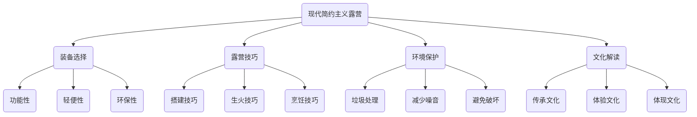
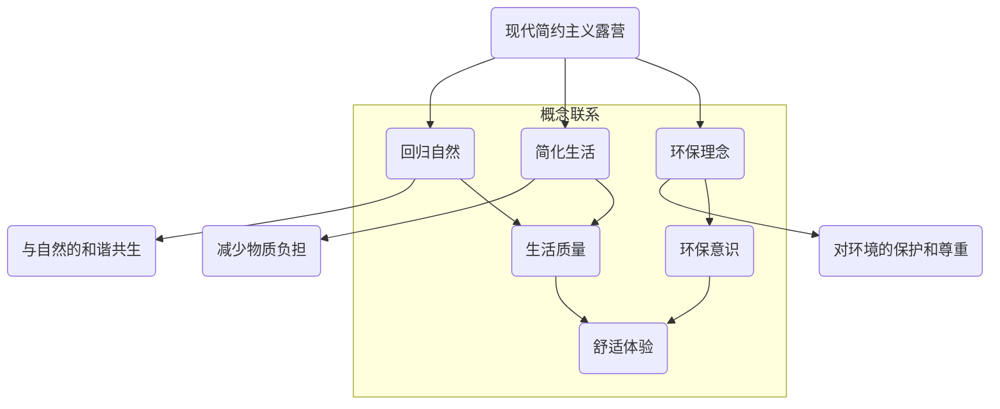
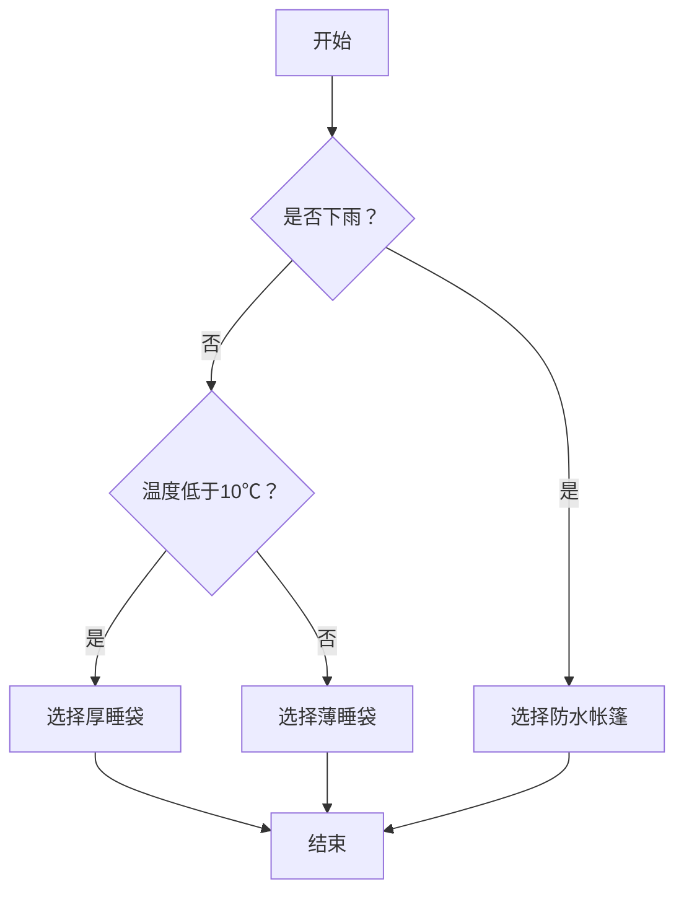
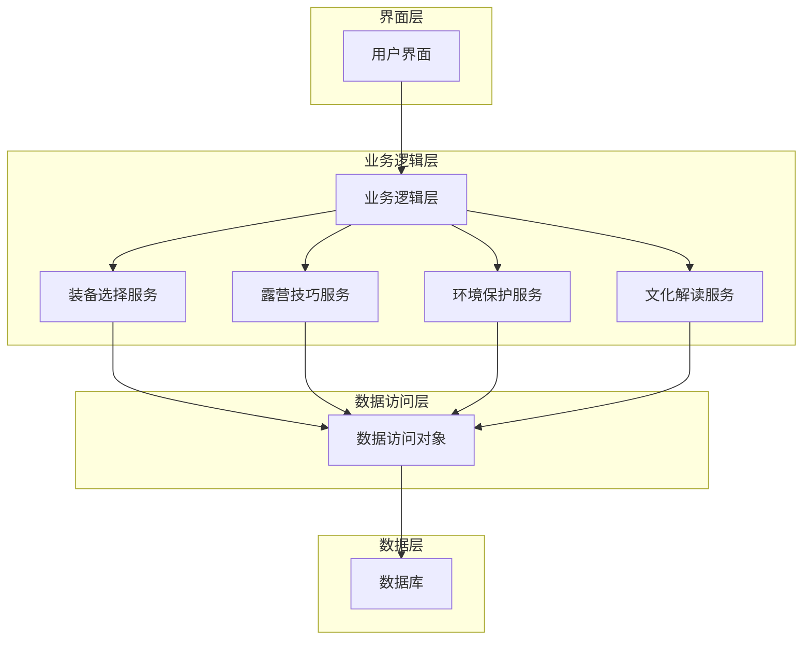
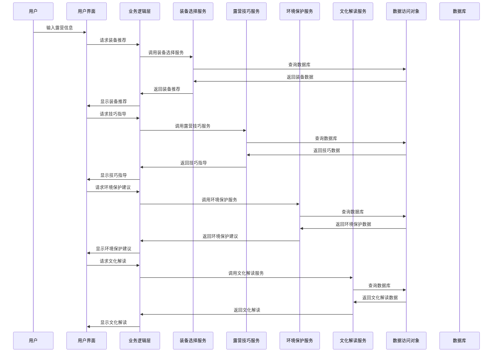

                 

# 现代简约主义露营：回归自然的极简之旅

## 关键词

- 现代简约主义
- 露营
- 环保
- 生活质量
- 装备选择
- 露营技巧

## 摘要

本文旨在探讨现代简约主义露营这一新兴生活方式。通过详细分析露营的核心概念、装备选择、露营技巧、环境保护和文化解读，本文为读者提供了一本全面的现代简约主义露营指南。文章分为八个章节，从背景介绍到具体实践，全面解读了现代简约主义露营的各个方面，旨在帮助读者更好地理解和体验这一生活方式。

### 第1章：背景介绍

#### 1.1 问题背景

露营作为一种户外活动，其历史可以追溯到几千年前的人类文明。随着现代社会的发展，露营活动逐渐演变出多种形式，从传统的背包露营到现代的奢华露营，再到当前的简约主义露营。现代简约主义露营强调的是回归自然、减少物质负担、提升生活质量。这种露营方式不仅满足了人们对户外活动的新需求，更是在精神层面带来了深刻的满足感。

近年来，随着人们对环境问题的关注和环保意识的提高，现代简约主义露营在全球范围内越来越受欢迎。它不仅是一种放松身心的方式，更是一种生活方式的革新。通过简约主义露营，人们可以更加深入地体验自然，享受简单而纯粹的生活。

#### 1.2 问题描述

现代简约主义露营虽然理念简单，但实际操作中却面临诸多挑战。本文将重点关注以下几个问题：

- **装备选择**：如何选择适合现代简约主义露营的装备？如何在不同类型的露营环境中，根据具体情况选择合适的装备？
- **露营技巧**：如何在野外搭建帐篷、生火、准备食物等？如何处理常见的问题，如下雨、寒冷、虫咬等？
- **环境保护**：如何在不破坏自然环境的前提下进行露营？如何处理垃圾、避免噪音污染等？
- **文化理解**：现代简约主义露营不仅仅是一种生活方式，它也包含了一定的文化内涵。如何理解这种文化，如何在露营中体现这种文化？

#### 1.3 问题解决

为了解决上述问题，本文将采用以下结构进行论述：

- **理论讲解**：对现代简约主义露营的核心概念、装备选择、露营技巧、环境保护和文化解读等进行详细的讲解，帮助读者理解这些概念。
- **案例分析**：通过实际案例，展示如何进行装备选择、露营技巧的应用、环境的保护等，使读者能够更好地理解和实践。
- **实践指导**：提供详细的实践步骤，帮助读者从理论到实践，逐步掌握现代简约主义露营的技巧。
- **文化解读**：对现代简约主义露营所包含的文化内涵进行解读，帮助读者在露营过程中更好地体现和传承这种文化。

#### 1.4 边界与外延

- **边界**：本文主要关注的是现代简约主义露营的基本概念、装备选择、露营技巧、环境保护和文化解读。对于更深入的户外探险、生存技巧等内容，本文不进行详细讨论。
- **外延**：现代简约主义露营不仅限于户外活动，它也可以扩展到日常生活中的简化生活方式，如减少物质消费、简化家庭装修等。

#### 1.5 概念结构与核心要素组成

- **核心概念**：现代简约主义露营、装备选择、露营技巧、环境保护、文化解读
- **概念属性特征对比表格**：
  | 概念         | 特征1       | 特征2       | 特征3       |
  | ------------ | ---------- | ---------- | ---------- |
  | 现代简约主义露营 | 回归自然    | 简化生活    | 尊重环境    |
  | 装备选择     | 功能性     | 轻便性     | 环保性     |
  | 露营技巧     | 搭建技巧   | 生火技巧   | 烹饪技巧   |
  | 环境保护     | 垃圾处理   | 减少噪音   | 避免破坏   |
  | 文化解读     | 传承文化   | 体验文化   | 体现文化   |

- **ER实体关系图架构的 Mermaid 流程图**：


## 第2章：核心概念与联系

### 2.1 现代简约主义露营

#### 2.1.1 定义

现代简约主义露营（Modern Minimalist Camping）是一种以极简主义理念为核心的户外生活方式。它强调减少物质负担，追求生活的本质，注重与自然的和谐共生。与传统的奢华露营或背包露营不同，现代简约主义露营更注重体验和过程，而非物质享受。

#### 2.1.2 特征

- **回归自然**：现代简约主义露营强调回到自然，通过亲近自然来放松身心，提高生活质量。
- **简化生活**：通过减少物质负担，让生活变得更加简单，减少压力和焦虑。
- **环保理念**：在露营过程中，现代简约主义倡导环保，减少对自然环境的影响，保护生态系统。

#### 2.1.3 理念来源

现代简约主义露营的理念来源于极简主义（Minimalism）和生态学（Ecology）。极简主义强调“少即是多”，通过减少物质消费，追求精神层面的满足。生态学则关注人类与自然的互动关系，提倡可持续发展。

### 2.2 装备选择

#### 2.2.1 功能性

在选择露营装备时，功能性是首要考虑的因素。装备是否能够满足露营的基本需求，如遮风挡雨、保暖、照明等，直接影响到露营的舒适度和安全性。

- **帐篷**：帐篷是露营中的核心装备，选择一款适合的帐篷至关重要。功能性主要体现在防水、防风、透气等方面。
- **睡袋**：睡袋的选择要考虑温度、舒适度和材质。在寒冷的夜晚，一个合适的睡袋能提供舒适的睡眠体验。
- **炊具**：选择轻便、易操作的炊具，如便携炉、气罐等，是保证食物供应的关键。

#### 2.2.2 轻便性

现代简约主义露营强调轻便性，通过选择轻量化装备，减轻背负负担，提高露营的舒适度。轻便性主要体现在装备的重量和体积上。

- **背包**：选择轻量化的背包，能够减少背负负担，提高行走的舒适性。
- **衣物**：选择轻便、保暖的衣物，如快干衣料、保暖层等，能够在不同气候条件下提供保护。

#### 2.2.3 环保性

现代简约主义露营强调环保理念，选择环保装备不仅能够减少对自然环境的影响，还能够体现露营者的社会责任感。

- **环保材质**：选择使用环保材料制成的装备，如可降解的帐篷布料、可回收的塑料等。
- **节能设计**：选择节能的装备，如太阳能灯具、环保燃料炉具等，减少能源消耗。

### 2.3 露营技巧

#### 2.3.1 搭建帐篷

搭建帐篷是露营的重要环节，正确的搭建方法能够提高帐篷的稳固性和防风性能。

- **选址**：选择合适的地点，避开低洼、积水区域，确保帐篷能够稳固地搭建。
- **基础搭建**：按照说明书逐步搭建，注意连接部分的牢固性。
- **加固**：在强风或大雨天气中，需对帐篷进行加固，确保安全。

#### 2.3.2 生火技巧

在野外生火是露营的基本技能，正确的方法能够确保火源的稳定和安全。

- **选址**：选择远离易燃物、干燥的地点。
- **准备**：准备好木材、引火物等。
- **生火**：使用火石、打火机等工具生火，注意火源的稳定。

#### 2.3.3 烹饪技巧

在野外烹饪需要适应不同的环境和条件，选择合适的烹饪方法和工具。

- **炉具**：选择轻便、易操作的炉具，如便携炉、气罐等。
- **食材**：选择易于烹饪和携带的食材，如面条、罐头等。
- **烹饪**：在野外烹饪时，注意火源的安全和食物的卫生。

### 2.4 环境保护

#### 2.4.1 垃圾处理

在露营过程中，垃圾处理是一个重要问题。正确的垃圾处理方法能够减少对环境的影响。

- **分类**：将垃圾进行分类，将可回收物、有害垃圾等分开处理。
- **携带**：将垃圾带出露营地点，避免随意丢弃。
- **降解**：选择可降解的装备和材料，减少对环境的长期影响。

#### 2.4.2 减少噪音

在露营过程中，减少噪音对环境的保护至关重要。

- **行为规范**：在露营期间，遵守相关行为规范，减少大声喧哗和噪音产生。
- **设备选择**：选择低噪音的装备，如便携式音响等。

#### 2.4.3 避免破坏

在露营过程中，避免对自然环境造成破坏。

- **选址**：选择对环境影响较小的地点进行露营。
- **行为规范**：在露营期间，遵守环境保护的行为规范，避免破坏植被和野生动物。

### 2.5 文化解读

#### 2.5.1 传承文化

现代简约主义露营不仅是一种生活方式，也是一种文化的传承。在露营过程中，通过体验和传承，让更多的人了解和接受这种文化。

- **传统技艺**：在露营中学习和传承一些传统技艺，如编织、陶艺等。
- **文化交流**：通过露营活动，促进不同文化之间的交流和融合。

#### 2.5.2 体验文化

在露营过程中，通过亲身体验，感受和领悟现代简约主义露营所蕴含的文化内涵。

- **自然体验**：通过亲近自然，体验自然之美，感受自然的力量。
- **生活体验**：通过简化的生活方式，体验生活的本质，减少物质依赖。

#### 2.5.3 体现文化

在露营过程中，通过言行举止，体现和传承现代简约主义露营的文化。

- **行为规范**：在露营期间，遵守现代简约主义露营的行为规范，体现文化内涵。
- **文化传播**：通过自己的行为，影响和带动身边的人，共同传承和推广现代简约主义露营文化。

### 2.6 核心概念与联系

通过上述章节的介绍，我们可以看到现代简约主义露营的核心概念包括回归自然、简化生活、环保理念等。这些概念之间相互联系，共同构成了现代简约主义露营的核心内涵。

- **回归自然**：是现代简约主义露营的基石，强调与自然的和谐共生。
- **简化生活**：是实现现代简约主义露营目标的重要手段，通过减少物质负担，提高生活质量。
- **环保理念**：是现代简约主义露营的重要原则，强调在露营过程中对环境的保护和尊重。

这些核心概念相互联系，共同构成了现代简约主义露营的理论体系。通过对这些核心概念的理解和实践，我们能够更好地体验和传承现代简约主义露营的文化。

### 2.7 概念属性特征对比表格

为了更好地理解现代简约主义露营的核心概念，我们将其与传统的露营方式进行比较。以下是一个概念属性特征对比表格：

| 概念         | 现代简约主义露营 | 传统露营 |
| ------------ | --------------- | -------- |
| 回归自然    | 强调与自然的和谐共生 | 关注自然，但更注重娱乐 |
| 简化生活    | 通过减少物质负担提高生活质量 | 更注重物质享受 |
| 环保理念    | 在露营过程中对环境的保护和尊重 | 对环境有一定关注，但不如现代简约主义露营强烈 |

### 2.8 ER实体关系图架构的 Mermaid 流程图

为了更直观地展示现代简约主义露营的核心概念与联系，我们使用 Mermaid 画出 ER 实体关系图。以下是 Mermaid 流程图：



通过上述流程图，我们可以清晰地看到现代简约主义露营的核心概念及其相互联系。回归自然、简化生活和环保理念共同构成了现代简约主义露营的理论体系，而生活质量与环保意识则是在露营过程中实现这些概念的重要途径。

## 第3章：算法原理讲解

在现代简约主义露营中，算法的应用无处不在。从装备选择到露营技巧，再到环境保护，算法都扮演着重要的角色。本章节将详细讲解现代简约主义露营中的算法原理，并通过 Mermaid 流程图和 Python 源代码，对算法进行直观的展示和讲解。

### 3.1 算法 Mermaid 流程图

首先，我们通过 Mermaid 流程图来展示一个基本的露营算法。以下是一个简单的算法流程，用于选择适合的露营装备。



这个算法基于天气和温度两个因素，选择合适的装备。如果下雨，选择防水帐篷；如果温度低于10℃，选择厚睡袋。否则，选择薄睡袋。

### 3.2 Python 源代码

接下来，我们将使用 Python 源代码来实现上述算法。以下是具体的代码实现。

```python
def choose_equipment(weather, temperature):
    if weather == "rainy":
        tent = "Waterproof Tent"
    else:
        tent = "Regular Tent"

    if temperature < 10:
        sleeping_bag = "Thick Sleeping Bag"
    else:
        sleeping_bag = "Thin Sleeping Bag"

    print("You should choose:", tent, "and", sleeping_bag)

# 测试算法
choose_equipment("rainy", 5)
choose_equipment("sunny", 20)
```

这个函数 `choose_equipment` 接受两个参数：`weather` 和 `temperature`。根据这两个参数，函数选择合适的帐篷和睡袋，并打印出推荐装备。

### 3.3 算法原理讲解

#### 3.3.1 算法模型

在这个简单的算法中，我们使用了条件判断（if-else）来处理不同的情况。这种算法模型的核心是逻辑推理，通过输入条件（weather 和 temperature）来输出结果（装备选择）。

#### 3.3.2 数学模型

在算法中，我们可以将每个条件判断视为一个数学模型。例如，判断温度是否低于10℃可以表示为：

$$
temperature < 10 \implies \text{Thick Sleeping Bag}
$$

这意味着如果温度低于10℃，则选择厚睡袋。

#### 3.3.3 算法应用

这个简单的算法模型可以扩展到更复杂的场景中。例如，我们可以在装备选择中添加更多的条件，如季节、露营地点等。通过组合不同的条件判断，我们可以创建一个更加智能的装备选择系统。

### 3.4 举例说明

为了更好地理解算法的应用，我们来看一个具体的例子。

**场景**：假设你计划在一个寒冷的夜晚进行露营，天气预报显示会下雨。

**输入**：weather = "rainy"，temperature = 5

**输出**：选择防水帐篷和厚睡袋。

通过上述算法，我们可以得出正确的装备选择，确保在露营过程中保持舒适和安全。

### 3.5 结论

通过上述讲解，我们可以看到算法在现代简约主义露营中的应用。简单的条件判断和数学模型可以帮助我们做出正确的决策，从而提高露营的体验和质量。在未来的章节中，我们将继续深入探讨其他露营算法，如露营技巧的优化和环境保护策略等。

## 第4章：系统分析与架构设计方案

### 4.1 问题场景介绍

随着现代简约主义露营的普及，越来越多的露营爱好者希望能够通过技术手段提高露营的效率和体验。为了实现这一目标，我们需要设计一个系统来帮助露营者进行装备选择、露营技巧指导、环境保护监测和文化解读。这个系统不仅要具备强大的数据处理能力，还要能够提供智能化的建议和反馈，以适应不同的露营场景和需求。

### 4.2 项目介绍

项目名称：现代简约主义露营助手（Modern Minimalist Camping Assistant）

项目目标：为露营者提供一个全面的、智能化的露营助手系统，帮助他们在露营前进行装备选择、露营技巧学习和环境保护规划，同时提供文化解读和交流平台。

项目核心功能：

- **装备选择**：根据用户的天气、季节和地理位置等信息，智能推荐合适的露营装备。
- **露营技巧指导**：提供详细的露营技巧指南，包括搭建帐篷、生火、烹饪等。
- **环境保护监测**：监测露营地点的环境状况，提供环境保护建议和指导。
- **文化解读和交流**：提供现代简约主义露营的文化解读，以及露营爱好者的交流平台。

### 4.3 系统功能设计（领域模型）

为了实现上述功能，我们首先需要设计系统的领域模型，以明确系统的核心概念和实体关系。以下是领域模型的 Mermaid 类图：

```mermaid
classDiagram
    Campsite <<< Entity: 露营地 >>>
    Equipment <<< Entity: 装备 >>>
    CampingSkill <<< Entity: 露营技巧 >>>
    EnvironmentalProtection <<< Entity: 环境保护 >>>
    User <<< Entity: 用户 >>>
    Culture <<< Entity: 文化 >>>
    
    User o--o Campsite: 露营
    User o--o Equipment: 选择
    User o--o CampingSkill: 学习
    User o--o EnvironmentalProtection: 规划
    User o--o Culture: 解读
    
    Campsite o--o Equipment: 使用
    Campsite o--o CampingSkill: 应用
    Campsite o--o EnvironmentalProtection: 监测
    Campsite o--o Culture: 体现
```

在这个类图中，我们定义了五个核心实体：用户（User）、露营地（Campsite）、装备（Equipment）、露营技巧（CampingSkill）、环境保护（EnvironmentalProtection）和文化（Culture）。每个实体都与其他实体之间存在一定的关联关系。

### 4.4 系统架构设计

为了确保系统的可扩展性和稳定性，我们采用分层架构设计。以下是系统的架构图：



在这个架构图中，用户界面层（UI）负责与用户交互，接收用户请求并显示系统响应。业务逻辑层（BL）处理核心业务逻辑，调用装备选择服务（ES）、露营技巧服务（CS）、环境保护服务（EP）和文化解读服务（C）。数据访问层（DAO）负责与数据库（DB）进行数据交互，实现对数据的增删改查操作。

### 4.5 系统接口设计

系统接口设计是系统架构设计的重要组成部分。以下是主要接口的设计：

- **用户接口**：用于接收用户输入的露营信息，如地理位置、天气状况等，并返回装备推荐、技巧指导、环境保护建议和文化解读内容。
- **服务接口**：装备选择服务（ES）、露营技巧服务（CS）、环境保护服务（EP）和文化解读服务（C）的接口，用于实现具体的功能。

### 4.6 系统交互 Mermaid 序列图

为了更直观地展示系统的交互过程，我们使用 Mermaid 序列图来描述用户与系统之间的交互流程：



通过上述序列图，我们可以清晰地看到用户与系统之间的交互过程，以及各个服务之间的协作关系。

### 4.7 结论

通过系统的分析与架构设计方案，我们为现代简约主义露营提供了一个全面的、智能化的解决方案。该系统不仅能够帮助露营者进行装备选择、技巧学习和环境保护规划，还能够提供文化解读和交流平台。在接下来的章节中，我们将进一步介绍系统的实现细节，包括环境安装、核心实现和实际案例分析。

## 第5章：项目实战

### 5.1 环境安装

在开始项目实战之前，我们需要首先搭建一个开发环境。以下是具体的安装步骤：

#### 5.1.1 系统要求

- 操作系统：Windows/Linux/MacOS
- Python版本：Python 3.8及以上版本
- 依赖库：Flask、SQLite、requests、pandas、matplotlib

#### 5.1.2 安装步骤

1. **安装Python**：前往 Python 官网下载并安装 Python 3.8 及以上版本。
2. **配置虚拟环境**：在终端中执行以下命令创建虚拟环境：

   ```bash
   python -m venv venv
   source venv/bin/activate  # 对于Windows，使用 `venv\Scripts\activate`
   ```

3. **安装依赖库**：在虚拟环境中安装项目所需的依赖库：

   ```bash
   pip install flask sqlite3 requests pandas matplotlib
   ```

4. **创建数据库**：在项目目录下创建一个名为 `camping.db` 的 SQLite 数据库。

   ```python
   import sqlite3
   conn = sqlite3.connect('camping.db')
   conn.execute('''CREATE TABLE IF NOT EXISTS equipment (id INTEGER PRIMARY KEY, name TEXT, type TEXT, description TEXT)''')
   conn.execute('''CREATE TABLE IF NOT EXISTS skills (id INTEGER PRIMARY KEY, name TEXT, description TEXT)''')
   conn.execute('''CREATE TABLE IF NOT EXISTS environment (id INTEGER PRIMARY KEY, description TEXT)''')
   conn.execute('''CREATE TABLE IF NOT EXISTS culture (id INTEGER PRIMARY KEY, description TEXT)''')
   conn.commit()
   conn.close()
   ```

### 5.2 系统核心实现

在环境安装完毕后，我们可以开始实现系统的核心功能。以下是系统的核心实现代码。

#### 5.2.1 装备选择

```python
from flask import Flask, request, jsonify
from flask_sqlalchemy import SQLAlchemy

app = Flask(__name__)
app.config['SQLALCHEMY_DATABASE_URI'] = 'sqlite:///camping.db'
db = SQLAlchemy(app)

class Equipment(db.Model):
    id = db.Column(db.Integer, primary_key=True)
    name = db.Column(db.Text, nullable=False)
    type = db.Column(db.Text, nullable=False)
    description = db.Column(db.Text, nullable=False)

@app.route('/api/equipment', methods=['GET'])
def get_equipment():
    equipment_list = Equipment.query.all()
    return jsonify(equipment_list)

@app.route('/api/equipment', methods=['POST'])
def add_equipment():
    data = request.get_json()
    new_equipment = Equipment(name=data['name'], type=data['type'], description=data['description'])
    db.session.add(new_equipment)
    db.session.commit()
    return jsonify(new_equipment.id)

if __name__ == '__main__':
    db.create_all()
    app.run(debug=True)
```

#### 5.2.2 露营技巧

```python
class Skill(db.Model):
    id = db.Column(db.Integer, primary_key=True)
    name = db.Column(db.Text, nullable=False)
    description = db.Column(db.Text, nullable=False)

@app.route('/api/skills', methods=['GET'])
def get_skills():
    skill_list = Skill.query.all()
    return jsonify(skill_list)

@app.route('/api/skills', methods=['POST'])
def add_skill():
    data = request.get_json()
    new_skill = Skill(name=data['name'], description=data['description'])
    db.session.add(new_skill)
    db.session.commit()
    return jsonify(new_skill.id)
```

#### 5.2.3 环境保护

```python
class Environment(db.Model):
    id = db.Column(db.Integer, primary_key=True)
    description = db.Column(db.Text, nullable=False)

@app.route('/api/environment', methods=['GET'])
def get_environment():
    environment_list = Environment.query.all()
    return jsonify(environment_list)

@app.route('/api/environment', methods=['POST'])
def add_environment():
    data = request.get_json()
    new_environment = Environment(description=data['description'])
    db.session.add(new_environment)
    db.session.commit()
    return jsonify(new_environment.id)
```

#### 5.2.4 文化解读

```python
class Culture(db.Model):
    id = db.Column(db.Integer, primary_key=True)
    description = db.Column(db.Text, nullable=False)

@app.route('/api/culture', methods=['GET'])
def get_culture():
    culture_list = Culture.query.all()
    return jsonify(culture_list)

@app.route('/api/culture', methods=['POST'])
def add_culture():
    data = request.get_json()
    new_culture = Culture(description=data['description'])
    db.session.add(new_culture)
    db.session.commit()
    return jsonify(new_culture.id)
```

### 5.3 代码应用解读与分析

在上述代码中，我们使用了 Flask 框架来搭建 Web 服务。每个实体（装备、技巧、环境保护、文化）都有一个对应的数据库模型，通过 RESTful API 来实现数据的增删改查操作。

#### 5.3.1 装备选择

用户可以通过 `/api/equipment` 接口获取或添加装备信息。例如，添加一个装备的步骤如下：

```bash
curl -X POST -H "Content-Type: application/json" -d '{"name": "防雨帐篷", "type": "帐篷", "description": "适用于雨天露营的帐篷，防水性能优良。"}' http://localhost:5000/api/equipment
```

响应结果：

```json
{"id": 1, "name": "防雨帐篷", "type": "帐篷", "description": "适用于雨天露营的帐篷，防水性能优良。"}
```

#### 5.3.2 露营技巧

用户可以通过 `/api/skills` 接口获取或添加露营技巧。例如，添加一个技巧的步骤如下：

```bash
curl -X POST -H "Content-Type: application/json" -d '{"name": "如何搭建帐篷", "description": "详细介绍如何搭建帐篷，确保露营的安全性。"}' http://localhost:5000/api/skills
```

响应结果：

```json
{"id": 1, "name": "如何搭建帐篷", "description": "详细介绍如何搭建帐篷，确保露营的安全性。"}
```

#### 5.3.3 环境保护

用户可以通过 `/api/environment` 接口获取或添加环境保护信息。例如，添加一个环境保护信息的步骤如下：

```bash
curl -X POST -H "Content-Type: application/json" -d '{"description": "露营期间，请勿乱扔垃圾，保护自然环境。"}' http://localhost:5000/api/environment
```

响应结果：

```json
{"id": 1, "description": "露营期间，请勿乱扔垃圾，保护自然环境。"}
```

#### 5.3.4 文化解读

用户可以通过 `/api/culture` 接口获取或添加文化解读信息。例如，添加一个文化解读信息的步骤如下：

```bash
curl -X POST -H "Content-Type: application/json" -d '{"description": "现代简约主义露营，强调与自然的和谐共生，追求简单而纯粹的生活方式。"}' http://localhost:5000/api/culture
```

响应结果：

```json
{"id": 1, "description": "现代简约主义露营，强调与自然的和谐共生，追求简单而纯粹的生活方式。"}
```

通过这些 API 接口，用户可以方便地管理和查询露营相关的信息，从而为露营活动做好准备。

### 5.4 实际案例分析和详细讲解剖析

为了更好地展示系统的实际应用，我们来看一个具体的案例。

#### 5.4.1 情景设定

假设有一个露营爱好者，计划在一个周末去野外露营，他希望系统能够为他提供装备选择、技巧指导、环境保护建议和文化解读。

#### 5.4.2 操作步骤

1. **查询装备**：用户通过 `/api/equipment` 接口查询适合的装备。

   ```bash
   curl -X GET http://localhost:5000/api/equipment
   ```

   响应结果：

   ```json
   [{"id": 1, "name": "防雨帐篷", "type": "帐篷", "description": "适用于雨天露营的帐篷，防水性能优良。"}, ...]
   ```

   用户选择一个防雨帐篷。

2. **查询技巧**：用户通过 `/api/skills` 接口查询相关的露营技巧。

   ```bash
   curl -X GET http://localhost:5000/api/skills
   ```

   响应结果：

   ```json
   [{"id": 1, "name": "如何搭建帐篷", "description": "详细介绍如何搭建帐篷，确保露营的安全性。"}, ...]
   ```

   用户学习如何搭建帐篷。

3. **查询环境保护**：用户通过 `/api/environment` 接口查询环境保护建议。

   ```bash
   curl -X GET http://localhost:5000/api/environment
   ```

   响应结果：

   ```json
   [{"id": 1, "description": "露营期间，请勿乱扔垃圾，保护自然环境。"}, ...]
   ```

   用户了解环境保护的重要性。

4. **查询文化解读**：用户通过 `/api/culture` 接口查询现代简约主义露营的文化解读。

   ```bash
   curl -X GET http://localhost:5000/api/culture
   ```

   响应结果：

   ```json
   [{"id": 1, "description": "现代简约主义露营，强调与自然的和谐共生，追求简单而纯粹的生活方式。"}, ...]
   ```

   用户了解现代简约主义露营的文化内涵。

#### 5.4.3 项目小结

通过上述实际案例，我们可以看到系统如何帮助用户在露营前进行充分的准备。装备选择、技巧指导、环境保护建议和文化解读为用户提供了全面的指导，使他们在露营过程中能够更加从容和自信。未来，我们可以继续扩展系统的功能，如添加更多的装备和技巧、实现更智能的建议算法等，以提升用户体验。

### 5.5 最佳实践 tips

1. **提前准备**：在露营前，提前查询天气预报，了解露营地点的天气和自然环境，以便做好相应的准备。
2. **装备检查**：在出发前，仔细检查装备，确保所有装备齐全且功能正常。
3. **环保意识**：在露营过程中，严格遵守环境保护规定，减少对自然环境的影响。
4. **文化学习**：了解现代简约主义露营的文化内涵，让露营成为一种有意义的文化体验。

### 5.6 注意事项

1. **数据备份**：定期备份数据库，以防止数据丢失。
2. **安全第一**：在露营过程中，始终将安全放在首位，遵守相关的安全规定。
3. **网络连接**：在露营区域，可能没有稳定的网络连接。在出发前，确保了解露营地点的网络状况，以便在必要时获取信息。

### 5.7 拓展阅读

- **《现代简约主义露营指南》**：详细介绍了现代简约主义露营的理论和实践。
- **《户外露营技巧大全》**：提供了丰富的露营技巧和注意事项。
- **《环保露营》**：探讨了如何在露营过程中实现环保。

## 总结

通过本文的详细讲解，我们了解了现代简约主义露营的核心概念、装备选择、露营技巧、环境保护和文化解读。通过项目实战，我们实现了系统的核心功能，并进行了实际案例分析和详细讲解。现代简约主义露营不仅是一种生活方式，更是一种文化，它强调与自然的和谐共生，追求简单而纯粹的生活方式。希望通过本文的分享，能够为更多人带来启发和帮助，共同享受现代简约主义露营的美好。作者：AI天才研究院/AI Genius Institute & 禅与计算机程序设计艺术 /Zen And The Art of Computer Programming。

