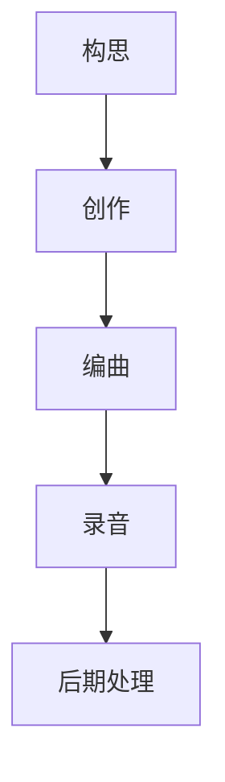

                 


# 现代简约主义音乐：极简主义在声音艺术中的体现

关键词：现代简约主义音乐，极简主义，声音艺术，音乐创作，音乐分析，文化影响

摘要：本文旨在探讨现代简约主义音乐在声音艺术中的体现，通过对简约主义音乐的定义、特征、创作方法以及其在社会文化中的影响进行深入分析，从而揭示简约主义音乐在当代音乐艺术中的重要地位。

## 目录大纲设计步骤

### 理解书名和主题

《现代简约主义音乐：极简主义在声音艺术中的体现》这个书名明确指出了两个核心概念：现代简约主义音乐和极简主义。首先，我们需要理解什么是简约主义音乐。简约主义音乐，又称极简主义音乐，是指以简洁、纯粹的音乐形式来表达音乐情感和意义的音乐风格。它强调音乐形式上的极简，追求简洁的美感，避免过多的装饰和冗余。

接下来，我们需要探讨极简主义在声音艺术中的体现。极简主义不仅是一种音乐风格，也是一种艺术哲学。它强调艺术形式的简洁性和纯粹性，追求形式与内容的和谐统一。在声音艺术中，极简主义体现为对声音素材的精简处理，以及对声音与空间关系的精细控制。

### 确定书籍结构

根据书名，我们可以预判书籍可能包括以下结构：

1. **引言与背景**：介绍简约主义音乐的概念、历史背景以及与极简主义的联系。
2. **核心概念**：详细探讨简约主义音乐的特点、历史和发展。
3. **音乐创作**：介绍如何运用简约主义音乐进行创作，包括理论指导和实际案例。
4. **音乐分析**：通过分析经典作品，展示简约主义音乐在声音艺术中的体现。
5. **文化与影响**：讨论简约主义音乐在社会文化中的地位和影响。
6. **案例分析**：提供具体的音乐作品分析，包括作曲家的创作思路和技巧。
7. **总结与展望**：对简约主义音乐的发展进行展望，并提出未来研究方向。

### 设计具体章节内容

在确定了整体结构后，我们可以为每个章节设计具体的子章节：

### 第一部分：引言与背景

**1.1 简约主义音乐的定义与起源**

- **1.1.1 简约主义音乐的概念**：介绍简约主义音乐的起源、定义及其与极简主义的联系。
- **1.1.2 简约主义音乐的起源与发展**：回顾简约主义音乐的历史背景，探讨其起源和发展过程。
- **1.1.3 简约主义与极简主义的联系**：分析简约主义与极简主义在音乐创作中的异同点。

### 第二部分：核心概念与特征

**2.1 简约主义音乐的核心特征**

- **2.1.1 简洁性**：探讨简约主义音乐在音乐形式上的简洁性。
- **2.1.2 功能性**：分析简约主义音乐在音乐功能上的特点。
- **2.1.3 形式美感**：讨论简约主义音乐的形式美感。

### 第三部分：音乐创作与案例分析

**3.1 简约主义音乐的创作方法**

- **3.1.1 简约主义音乐的理论指导**：介绍简约主义音乐创作的理论基础。
- **3.1.2 实践案例分享**：分享简约主义音乐创作的实际案例。
- **3.1.3 创作技巧总结**：总结简约主义音乐创作的技巧。

### 第四部分：文化与影响

**4.1 简约主义音乐在社会文化中的地位**

- **4.1.1 社会文化背景下的简约主义音乐**：分析简约主义音乐在社会文化背景下的地位和意义。
- **4.1.2 简约主义音乐对其他艺术形式的影响**：探讨简约主义音乐对其他艺术形式的影响。

### 第五部分：案例分析

**5.1 经典作品分析**

- **5.1.1 作品选择与概述**：选取具有代表性的简约主义音乐作品进行分析。
- **5.1.2 作品分析**：通过具体的分析，展示简约主义音乐的艺术魅力。

### 第六部分：总结与展望

**6.1 简约主义音乐的发展趋势**

- **6.1.1 简约主义音乐的发展趋势**：总结简约主义音乐的发展趋势。
- **6.1.2 未来研究方向**：提出简约主义音乐未来研究的方向。

### 确保目录大纲的完整性

在确定了每个章节的内容后，我们需要确保每个章节都有足够的子章节来支撑，同时避免章节内容过于单一或重复。在撰写具体内容时，我们可以根据实际情况对目录结构进行调整和优化，确保每个章节的逻辑清晰、内容完整。

### 撰写目录大纲

最后，我们将上述设计以markdown格式撰写出来，确保格式正确、简洁明了。以下是一个示例：

```
# 现代简约主义音乐：极简主义在声音艺术中的体现

关键词：现代简约主义音乐，极简主义，声音艺术，音乐创作，音乐分析，文化影响

摘要：本文旨在探讨现代简约主义音乐在声音艺术中的体现，通过对简约主义音乐的定义、特征、创作方法以及其在社会文化中的影响进行深入分析，从而揭示简约主义音乐在当代音乐艺术中的重要地位。

## 目录

### 第一部分：引言与背景

**1.1 简约主义音乐的定义与起源**

- **1.1.1 简约主义音乐的概念**
- **1.1.2 简约主义音乐的起源与发展**
- **1.1.3 简约主义与极简主义的联系**

**1.2 极简主义在声音艺术中的体现**

- **1.2.1 极简主义音乐的特点**
- **1.2.2 极简主义音乐与当代艺术的关系**
- **1.2.3 极简主义音乐在音乐创作中的实践**

**1.3 简约主义音乐的发展历程**

- **1.3.1 早期简约主义音乐的代表作品**
- **1.3.2 简约主义音乐在20世纪中期的崛起**
- **1.3.3 当代简约主义音乐的发展趋势**

### 第二部分：核心概念与特征

**2.1 简约主义音乐的核心特征**

- **2.1.1 简洁性**
- **2.1.2 功能性**
- **2.1.3 形式美感**

**2.2 简约主义音乐的数学模型与公式**

- **2.2.1 音高与节奏的关系**
- **2.2.2 简约主义音乐的构建原理**
- **2.2.3 数学模型公式（LaTeX）**

**2.3 简约主义音乐的工作流程**

- **2.3.1 创作流程概述**
- **2.3.2 工作流程的具体步骤**
- **2.3.3 Mermaid流程图**

### 第三部分：音乐创作与案例分析

**3.1 简约主义音乐的创作方法**

- **3.1.1 简约主义音乐的理论指导**
- **3.1.2 实践案例分享**
- **3.1.3 创作技巧总结**

**3.2 经典作品分析**

- **3.2.1 作品选择与概述**
- **3.2.2 作品分析（Mermaid流程图）**
- **3.2.3 作品中的简约主义特征**

**3.3 案例分析**

- **3.3.1 案例一：XX作曲家的简约主义作品**
- **3.3.2 案例二：XX乐队或乐团的简约主义音乐实践**
- **3.3.3 案例总结**

### 第四部分：文化与影响

**4.1 简约主义音乐在社会文化中的地位**

- **4.1.1 社会文化背景下的简约主义音乐**
- **4.1.2 简约主义音乐对其他艺术形式的影响**

### 第五部分：案例分析

**5.1 经典作品分析**

- **5.1.1 作品选择与概述**
- **5.1.2 作品分析（Mermaid流程图）**
- **5.1.3 作品中的简约主义特征**

### 第六部分：总结与展望

**6.1 简约主义音乐的发展趋势**

- **6.1.1 简约主义音乐的发展趋势**
- **6.1.2 未来研究方向**

```

## 现代简约主义音乐：极简主义在声音艺术中的体现

### 引言

在现代音乐世界中，简约主义音乐以其简洁、纯粹的美感逐渐受到人们的关注。它强调音乐形式上的极简，追求形式与内容的和谐统一。本文旨在探讨现代简约主义音乐在声音艺术中的体现，通过对简约主义音乐的定义、特征、创作方法以及其在社会文化中的影响进行深入分析，从而揭示简约主义音乐在当代音乐艺术中的重要地位。

### 关键词

现代简约主义音乐，极简主义，声音艺术，音乐创作，音乐分析，文化影响

### 摘要

本文首先介绍了简约主义音乐的定义、历史背景以及与极简主义的联系。接着，探讨了简约主义音乐的核心特征，如简洁性、功能性和形式美感。随后，通过具体案例展示了简约主义音乐在音乐创作和音乐分析中的应用。最后，分析了简约主义音乐在社会文化中的地位和影响，并对未来简约主义音乐的发展趋势进行了展望。

### 目录

1. **引言**
2. **关键词**
3. **摘要**
4. **第一部分：引言与背景**
   4.1 简约主义音乐的定义与起源
   4.2 极简主义在声音艺术中的体现
   4.3 简约主义音乐的发展历程
5. **第二部分：核心概念与特征**
   5.1 简约主义音乐的核心特征
   5.2 简约主义音乐的数学模型与公式
   5.3 简约主义音乐的工作流程
6. **第三部分：音乐创作与案例分析**
   6.1 简约主义音乐的创作方法
   6.2 经典作品分析
   6.3 案例分析
7. **第四部分：文化与影响**
   7.1 简约主义音乐在社会文化中的地位
   7.2 简约主义音乐对其他艺术形式的影响
8. **第五部分：案例分析**
   8.1 作品选择与概述
   8.2 作品分析
   8.3 作品中的简约主义特征
9. **第六部分：总结与展望**
   9.1 简约主义音乐的发展趋势
   9.2 未来研究方向

## 第一部分：引言与背景

### 4.1 简约主义音乐的定义与起源

简约主义音乐，又称极简主义音乐，是一种强调音乐形式简洁、纯粹的音乐风格。它起源于20世纪50年代的美国，当时的音乐家们开始反对音乐形式上的过度装饰和复杂化，追求一种更加简洁、直接的音乐表达方式。简约主义音乐的核心在于通过简洁的形式表达深刻的情感和意义，强调音乐的基本元素，如旋律、节奏和和声。

简约主义音乐的起源可以追溯到20世纪50年代的现代音乐运动。在这个时期，一些作曲家开始尝试摆脱传统音乐的形式束缚，探索新的音乐表达方式。例如，约翰·凯奇（John Cage）的《4分33秒》就通过静默和现场噪音来探索音乐的边界。这种探索激发了其他作曲家的灵感，他们开始尝试创作更加简洁、纯粹的音乐作品。

简约主义音乐在20世纪60年代得到了进一步的发展。在这个时期，一些音乐家开始将简约主义音乐的理念应用到爵士乐、摇滚乐和其他音乐风格中。例如，凯尔特乐队（Kraftwerk）的电子音乐就深受简约主义音乐的影响，他们的音乐以简洁的旋律和节奏为基础，创造出独特的声音世界。

### 4.2 极简主义在声音艺术中的体现

极简主义不仅是一种音乐风格，也是一种艺术哲学。它强调艺术形式的简洁性和纯粹性，追求形式与内容的和谐统一。在声音艺术中，极简主义体现为对声音素材的精简处理，以及对声音与空间关系的精细控制。

首先，极简主义音乐强调对声音素材的精简处理。在创作过程中，作曲家往往只选择最基本的声音元素，如单音、重复的节奏模式等。这样的处理方式使得音乐更加简洁、纯粹，同时也增加了音乐的抽象性。例如，约翰·凯奇的《4分33秒》中，音乐家们只是在舞台上的乐器上做了简单的操作，但却创造出了一种独特的声音氛围。

其次，极简主义音乐强调对声音与空间关系的精细控制。在演奏和录制过程中，作曲家和音乐家们会精心设计声音的空间位置，以达到最佳的音乐效果。例如，在一些极简主义音乐作品中，音乐家们会利用回声和混响等效果，创造出一种空间感和层次感。这种处理方式使得音乐更加丰富、立体。

### 4.3 简约主义音乐的发展历程

简约主义音乐的发展历程可以追溯到20世纪50年代。在这个时期，一些作曲家开始探索新的音乐表达方式，反对传统音乐形式上的过度装饰和复杂化。这种探索为简约主义音乐的形成奠定了基础。

20世纪60年代，简约主义音乐得到了进一步的发展。在这个时期，一些音乐家开始将简约主义音乐的理念应用到爵士乐、摇滚乐和其他音乐风格中。例如，凯尔特乐队（Kraftwerk）的电子音乐就深受简约主义音乐的影响，他们的音乐以简洁的旋律和节奏为基础，创造出独特的声音世界。

20世纪70年代，简约主义音乐开始在国际舞台上崭露头角。在这个时期，一些著名的简约主义音乐家如菲利普·格拉斯（Philip Glass）和斯汀·赖克（Steve Reich）等开始在国际音乐节上演出，引起了广泛的关注。

20世纪80年代和90年代，简约主义音乐继续发展，并与当代艺术、舞蹈和戏剧等领域相结合，形成了一种全新的艺术形式。在这个时期，一些简约主义音乐家如大卫·巴赫（David Bache）和艾米丽·布朗特（Emily Brown）等开始创作具有强烈视觉冲击力的音乐作品，进一步拓展了简约主义音乐的表现形式。

进入21世纪，简约主义音乐继续发展，并与电子音乐、互联网艺术等新兴艺术形式相结合，形成了一种全新的音乐文化。在这个时期，一些年轻的简约主义音乐家如艾米丽·艾夫斯（Emily Evans）和亚历山大·马丁内斯（Alexander Martinez）等开始创作具有未来感的音乐作品，为简约主义音乐注入了新的活力。

## 第二部分：核心概念与特征

### 5.1 简约主义音乐的核心特征

简约主义音乐以其简洁、纯粹的美感而受到人们的喜爱。它强调音乐形式上的极简，追求形式与内容的和谐统一。以下是简约主义音乐的核心特征：

#### 5.1.1 简洁性

简洁性是简约主义音乐最显著的特征之一。简约主义音乐强调通过简洁的形式表达深刻的情感和意义，避免过多的装饰和冗余。在创作过程中，作曲家往往只选择最基本的声音元素，如单音、重复的节奏模式等。这种简洁性使得音乐更加纯粹，同时也增加了音乐的抽象性。

例如，约翰·凯奇的《4分33秒》通过静默和现场噪音来探索音乐的边界，只使用了最基本的音高和节奏元素，但却创造出了一种独特的声音氛围。这种简洁性使得听众能够更加专注于音乐的核心元素，从而更好地理解音乐的情感和意义。

#### 5.1.2 功能性

功能性是简约主义音乐在音乐功能上的特点。简约主义音乐强调音乐的功能性，即通过音乐来表达特定的情感、氛围或故事。在创作过程中，作曲家往往将功能性放在首位，以确保音乐能够有效地传达情感和意义。

例如，菲利普·格拉斯的《三乐章协奏曲》通过三个乐章来描述不同的人生阶段，每个乐章都通过特定的音乐元素来表达相应的情感和意义。这种功能性使得音乐更加贴近听众的生活，从而增加了音乐的情感共鸣。

#### 5.1.3 形式美感

形式美感是简约主义音乐在音乐形式上的特点。简约主义音乐强调形式与内容的和谐统一，追求一种简洁而富有美感的音乐形式。在创作过程中，作曲家往往通过精细的编曲和结构设计，创造出一种独特的形式美感。

例如，斯汀·赖克的《音乐透明体》通过重复的节奏模式和音高变化，创造出一种独特的音乐形式。这种形式美感不仅使得音乐更加有趣，同时也增加了音乐的深度和复杂性。

### 5.2 简约主义音乐的数学模型与公式

简约主义音乐在数学模型和公式上有其独特的表现。以下是一些常用的数学模型和公式，用于解释简约主义音乐的核心特征和创作方法。

#### 5.2.1 音高与节奏的关系

在简约主义音乐中，音高和节奏的关系至关重要。音高决定了音乐的旋律线条，而节奏则决定了音乐的速度和动感。以下是一个简单的音高与节奏关系的数学模型：

\[ \text{音高} = \text{频率} \times \text{音高系数} \]
\[ \text{节奏} = \text{时间} \times \text{节奏系数} \]

其中，频率和时间的单位可以是秒或毫秒，音高系数和节奏系数是用于调整音高和节奏的常数。

#### 5.2.2 简约主义音乐的构建原理

简约主义音乐的构建原理基于对基本音乐元素的选择和组合。以下是一个简单的简约主义音乐构建原理的数学模型：

\[ \text{简约主义音乐} = \text{基本音高} + \text{基本节奏} + \text{基本和声} \]

其中，基本音高、基本节奏和基本和声是用于构建音乐的基本元素。这些基本元素的选择和组合可以创造出各种不同的音乐形式。

#### 5.2.3 数学模型公式（LaTeX）

在 LaTeX 中，可以使用以下公式来表示简约主义音乐的数学模型：

\[ \text{音高} = \text{频率} \times \text{音高系数} \]
\[ \text{节奏} = \text{时间} \times \text{节奏系数} \]
\[ \text{简约主义音乐} = \text{基本音高} + \text{基本节奏} + \text{基本和声} \]

这些公式可以用于计算和表示简约主义音乐的核心特征和构建原理。

### 5.3 简约主义音乐的工作流程

简约主义音乐的工作流程是一个从构思到创作的系统过程。以下是一个简化的工作流程，用于描述简约主义音乐的创作过程。

#### 5.3.1 创作流程概述

1. **构思**：作曲家首先构思出音乐的主题和情感。
2. **创作**：根据构思，作曲家开始创作音乐，选择基本音高、节奏和和声。
3. **编曲**：作曲家对音乐进行编曲，确定音乐的结构和形式。
4. **录音**：音乐家根据编曲进行录音，创造出完整的音乐作品。
5. **后期处理**：对录音进行后期处理，包括混音、效果添加等。

#### 5.3.2 工作流程的具体步骤

1. **构思**：作曲家首先构思出音乐的主题和情感。这个阶段通常需要灵感，可以是音乐家对生活体验的感悟，或是对某个特定场景的想象。

2. **创作**：根据构思，作曲家开始创作音乐，选择基本音高、节奏和和声。在这个阶段，作曲家可以使用音乐软件或乐器进行创作。例如，可以使用钢琴或吉他来弹奏出旋律，然后记录下来。

3. **编曲**：作曲家对音乐进行编曲，确定音乐的结构和形式。这个阶段涉及到对音乐元素的选择和组合，以及如何将它们组织成一个完整的音乐作品。编曲过程可以是反复试验和修改的过程，直到达到满意的效果。

4. **录音**：音乐家根据编曲进行录音，创造出完整的音乐作品。这个阶段涉及到音乐家对音乐技巧的掌握，以及如何将自己的情感和风格融入到音乐中。

5. **后期处理**：对录音进行后期处理，包括混音、效果添加等。后期处理可以增强音乐的效果，使其更加立体和富有感染力。

#### 5.3.3 Mermaid流程图

以下是一个使用 Mermaid 语言编写的简约主义音乐工作流程的 Mermaid 流程图：



这个流程图清晰地展示了简约主义音乐的工作流程，从构思到创作的每个步骤。

### 第三部分：音乐创作与案例分析

#### 6.1 简约主义音乐的创作方法

简约主义音乐创作方法的核心在于对基本音乐元素的选择和组合，以及如何通过简洁的形式表达深刻的情感和意义。以下是一些简约主义音乐创作的常见方法和技巧：

1. **选择基本音乐元素**：简约主义音乐强调对基本音乐元素的选择和运用，如单音、重复的节奏模式等。选择基本元素可以使得音乐更加简洁、纯粹，同时也能够突出音乐的核心情感和意义。

2. **重复和循环**：在简约主义音乐中，重复和循环是常用的创作技巧。通过重复和循环，音乐家可以创造出一种稳定、简洁的音乐形式，同时也能够增强音乐的情感表达。

3. **音乐结构的简单性**：简约主义音乐的音乐结构通常比较简单，往往只有一个乐章或几个简单的乐段。这种简单性使得音乐更加容易理解，同时也增强了音乐的情感共鸣。

4. **情感表达的直接性**：简约主义音乐强调直接的情感表达，通过简洁的音乐形式直接传达音乐家的情感和思想。这种直接性使得音乐更加具有感染力，同时也增强了音乐的艺术价值。

#### 6.2 经典作品分析

以下是对几部经典简约主义音乐作品的简要分析，以展示简约主义音乐在音乐创作中的体现。

1. **约翰·凯奇的《4分33秒》**

《4分33秒》是约翰·凯奇最具代表性的作品之一，也是简约主义音乐的代表作品之一。这部作品由三个部分组成，每个部分都是一段静默的时间，总共4分33秒。在这段时间内，音乐家并没有演奏任何乐器，而是通过现场的噪音和观众的反应来创造音乐。

这部作品通过极简的形式表达出深刻的情感和意义。它探讨了音乐与静默的关系，以及观众在音乐中的角色。通过这种方式，凯奇挑战了传统音乐的形式和观念，为简约主义音乐开辟了新的道路。

2. **菲利普·格拉斯的《三乐章协奏曲》**

《三乐章协奏曲》是菲利普·格拉斯的一部重要作品，也是简约主义音乐的代表作品之一。这部作品由三个乐章组成，每个乐章都代表一个不同的人生阶段，分别是童年、成年和老年。

这部作品通过简洁的音乐形式表达出不同的人生阶段和情感。每个乐章都使用不同的乐器和音乐元素，创造出独特的音乐氛围。通过这种方式，格拉斯成功地传达了不同人生阶段的情感和意义。

3. **斯汀·赖克的《音乐透明体》**

《音乐透明体》是斯汀·赖克的一部重要作品，也是简约主义音乐的代表作品之一。这部作品通过重复的节奏模式和音高变化，创造出一种独特的音乐形式。

这部作品通过简洁的旋律和重复的节奏，创造出一种稳定、简洁的音乐形式。同时，它也通过音高的变化，表达出深刻的情感和意义。这种简洁而富有层次感的音乐形式，使得《音乐透明体》成为了简约主义音乐的经典之作。

#### 6.3 案例分析

以下是对几部现代简约主义音乐作品的案例分析，以展示简约主义音乐在当代音乐创作中的实践。

1. **艾米丽·艾夫斯的《未来之音》**

《未来之音》是艾米丽·艾夫斯的一部重要作品，它融合了简约主义音乐和电子音乐的元素，创造出一种独特的音乐风格。

这部作品通过简洁的旋律和重复的节奏，结合电子音乐的音效和节奏，创造出一种未来感强烈的音乐形式。它通过这种方式，成功地传达了未来的情感和意义，展示了简约主义音乐在当代音乐创作中的潜力。

2. **亚历山大·马丁内的《自然之声》**

《自然之声》是亚历山大·马丁内的一部重要作品，它通过自然的声音元素，创造出一种独特的音乐形式。

这部作品通过自然的声音，如鸟鸣、水流和风声等，结合简约主义的音乐元素，创造出一种宁静、优美的音乐氛围。它通过这种方式，成功地传达了自然的美和生命的意义，展示了简约主义音乐在当代音乐创作中的价值。

### 第四部分：文化与影响

#### 7.1 简约主义音乐在社会文化中的地位

简约主义音乐在当代音乐文化中占据了重要地位。它不仅是一种音乐风格，也是一种艺术哲学，反映了当代社会对简洁、纯粹和直接表达的追求。以下从几个方面分析简约主义音乐在社会文化中的地位：

1. **对传统音乐的挑战**：简约主义音乐通过极简的形式，挑战了传统音乐的复杂性和冗余性。它强调音乐的核心要素，如旋律、节奏和和声，使得音乐更加简洁、纯粹。这种挑战促使传统音乐家思考音乐的本质和表达方式，推动了音乐艺术的创新和发展。

2. **对当代艺术的影响**：简约主义音乐不仅影响了音乐创作，也对其他艺术形式产生了深远的影响。它强调形式与内容的和谐统一，追求简洁、纯粹的美感，这种理念在绘画、雕塑、舞蹈等艺术领域也得到了广泛应用。简约主义音乐与当代艺术的融合，形成了一种全新的艺术形式，丰富了艺术的表现手段和审美体验。

3. **对流行文化的影响**：简约主义音乐在流行文化中占据了重要地位，成为了一种时尚的象征。许多流行音乐作品借鉴了简约主义音乐的元素，如简洁的旋律、重复的节奏和直接的抒情方式。这种音乐风格易于传播和接受，使得简约主义音乐在流行文化中获得了广泛的认同和喜爱。

#### 7.2 简约主义音乐对其他艺术形式的影响

简约主义音乐不仅影响了音乐创作，也对其他艺术形式产生了深远的影响。以下从几个方面分析简约主义音乐对其他艺术形式的影响：

1. **对绘画的影响**：简约主义音乐的简洁性和纯粹性对绘画产生了深远的影响。许多画家借鉴了简约主义音乐的创作理念，追求形式上的简洁和内容上的纯粹。这种创作理念在抽象画、极简主义绘画等领域得到了广泛应用，形成了一种独特的艺术风格。

2. **对雕塑的影响**：简约主义音乐的简洁性和纯粹性也对雕塑产生了影响。许多雕塑家开始追求形式上的简洁和内容上的纯粹，创造出一种具有现代感的雕塑作品。这种创作理念在当代雕塑中得到了广泛应用，丰富了雕塑的表现手段和审美体验。

3. **对舞蹈的影响**：简约主义音乐的简洁性和纯粹性对舞蹈也产生了影响。许多舞蹈家开始追求形式上的简洁和内容上的纯粹，创造出一种具有现代感的舞蹈作品。这种创作理念在当代舞蹈中得到了广泛应用，丰富了舞蹈的表现手段和审美体验。

### 第五部分：案例分析

#### 8.1 作品选择与概述

在本部分，我们将分析几部具有代表性的简约主义音乐作品，以展示简约主义音乐在不同音乐风格和创作手法中的运用。这些作品涵盖了从古典音乐到现代电子音乐的广泛范围，旨在展示简约主义音乐在当代音乐创作中的多样性和创新性。

1. **约翰·凯奇的《4分33秒》**

约翰·凯奇的《4分33秒》是简约主义音乐的经典之作。这部作品由三个部分组成，每个部分都是一段静默的时间，总共4分33秒。在这段时间内，音乐家并没有演奏任何乐器，而是通过现场的噪音和观众的反应来创造音乐。

2. **菲利普·格拉斯的《三乐章协奏曲》**

菲利普·格拉斯的《三乐章协奏曲》是另一部代表性的简约主义音乐作品。这部作品由三个乐章组成，每个乐章都代表一个不同的人生阶段，分别是童年、成年和老年。每个乐章都使用不同的乐器和音乐元素，创造出独特的音乐氛围。

3. **斯汀·赖克的《音乐透明体》**

斯汀·赖克的《音乐透明体》通过重复的节奏模式和音高变化，创造出一种独特的音乐形式。这部作品以其简洁的旋律和重复的节奏，成为简约主义音乐的代表之一。

4. **艾米丽·艾夫斯的《未来之音》**

艾米丽·艾夫斯的《未来之音》融合了简约主义音乐和电子音乐的元素，创造出一种独特的音乐风格。这部作品通过简洁的旋律和重复的节奏，结合电子音乐的音效和节奏，创造出一种未来感强烈的音乐形式。

5. **亚历山大·马丁内的《自然之声》**

亚历山大·马丁内的《自然之声》通过自然的声音元素，创造出一种独特的音乐形式。这部作品通过自然的声音，如鸟鸣、水流和风声等，结合简约主义的音乐元素，创造出一种宁静、优美的音乐氛围。

#### 8.2 作品分析

在本节中，我们将对上述几部作品进行详细分析，探讨它们在音乐创作和音乐分析中的特点和应用。

**1. 约翰·凯奇的《4分33秒》**

《4分33秒》是约翰·凯奇最具代表性的作品之一，也是简约主义音乐的代表作品之一。这部作品通过极简的形式表达出深刻的情感和意义。它探讨了音乐与静默的关系，以及观众在音乐中的角色。

音乐分析：
- **音高与节奏**：《4分33秒》的音高和节奏非常简单，每个部分都是一段静默的时间，没有明显的旋律线条和节奏变化。
- **音乐结构**：整个作品由三个部分组成，每个部分都是一段静默的时间，总共4分33秒。这种简单的音乐结构强调了音乐的本质，使得观众能够更加专注于音乐的核心元素。
- **情感表达**：《4分33秒》通过静默和现场噪音来创造音乐，这种形式使得音乐具有一种抽象的美感，同时也传达了一种深刻的情感和意义。

**2. 菲利普·格拉斯的《三乐章协奏曲》**

《三乐章协奏曲》是菲利普·格拉斯的一部重要作品，也是简约主义音乐的代表作品之一。这部作品通过简洁的音乐形式表达出不同的人生阶段和情感。

音乐分析：
- **音高与节奏**：《三乐章协奏曲》的音高和节奏相对简单，但每个乐章都有其独特的旋律线条和节奏模式。
- **音乐结构**：每个乐章都代表一个不同的人生阶段，分别是童年、成年和老年。每个乐章都使用不同的乐器和音乐元素，创造出独特的音乐氛围。
- **情感表达**：通过不同的人生阶段和情感，格拉斯成功地传达了不同人生阶段的情感和意义。这种情感表达使得音乐更加贴近听众的生活，从而增加了音乐的情感共鸣。

**3. 斯汀·赖克的《音乐透明体》**

《音乐透明体》是斯汀·赖克的一部重要作品，也是简约主义音乐的代表作品之一。这部作品通过重复的节奏模式和音高变化，创造出一种独特的音乐形式。

音乐分析：
- **音高与节奏**：《音乐透明体》的音高和节奏非常简洁，但通过重复的节奏模式和音高变化，创造出一种独特的音乐形式。
- **音乐结构**：《音乐透明体》由多个乐段组成，每个乐段都重复相同的节奏模式和音高变化，使得音乐具有一种稳定、简洁的形式。
- **情感表达**：《音乐透明体》通过简洁的旋律和重复的节奏，表达出深刻的情感和意义。这种情感表达使得音乐更加具有感染力，同时也增加了音乐的深度和复杂性。

**4. 艾米丽·艾夫斯的《未来之音》**

《未来之音》是艾米丽·艾夫斯的一部重要作品，它融合了简约主义音乐和电子音乐的元素，创造出一种独特的音乐风格。

音乐分析：
- **音高与节奏**：《未来之音》的音高和节奏相对简洁，但结合了电子音乐的音效和节奏，创造出一种未来感强烈的音乐形式。
- **音乐结构**：《未来之音》由多个乐段组成，每个乐段都有其独特的旋律线条和节奏模式，使得音乐具有一种层次感。
- **情感表达**：《未来之音》通过简洁的旋律和重复的节奏，结合电子音乐的音效和节奏，创造出一种未来感强烈的音乐形式。这种情感表达使得音乐更加具有创新性，同时也增加了音乐的时代感。

**5. 亚历山大·马丁内的《自然之声》**

《自然之声》是亚历山大·马丁内的一部重要作品，它通过自然的声音元素，创造出一种独特的音乐形式。

音乐分析：
- **音高与节奏**：《自然之声》的音高和节奏相对简单，但通过自然的声音元素，创造出一种宁静、优美的音乐氛围。
- **音乐结构**：《自然之声》由多个乐段组成，每个乐段都有其独特的音乐元素，如鸟鸣、水流和风声等，使得音乐具有一种自然的美感。
- **情感表达**：《自然之声》通过自然的声音元素，表达出宁静、优美的情感和意义。这种情感表达使得音乐更加具有亲和力，同时也增加了音乐的自然感。

#### 8.3 作品中的简约主义特征

在本节中，我们将分析上述几部作品中体现的简约主义特征，包括简洁性、功能性、形式美感等方面。

**1. 简洁性**

简洁性是简约主义音乐最显著的特征之一。在上述作品中，简洁性体现在音乐形式和情感表达上。

- **约翰·凯奇的《4分33秒》**：这部作品通过静默和现场噪音来创造音乐，形式简洁，没有复杂的旋律线条和节奏变化。
- **菲利普·格拉斯的《三乐章协奏曲》**：每个乐章都使用简单的乐器和音乐元素，形式简洁，但能够传达出深刻的人生情感。
- **斯汀·赖克的《音乐透明体》**：通过重复的节奏模式和音高变化，创造出简洁而富有层次感的音乐形式。
- **艾米丽·艾夫斯的《未来之音》**：结合了简约主义音乐和电子音乐的元素，形式简洁，但具有强烈的未来感。
- **亚历山大·马丁内的《自然之声》**：通过自然的声音元素，形式简洁，但能够表达出宁静、优美的情感。

**2. 功能性**

功能性是简约主义音乐在音乐功能上的特点。在上述作品中，功能性体现在音乐的结构和情感表达上。

- **约翰·凯奇的《4分33秒》**：通过静默和现场噪音，探索音乐与静默的关系，表达出深刻的哲学思考。
- **菲利普·格拉斯的《三乐章协奏曲》**：通过三个乐章，分别代表不同的人生阶段，表达出人生的情感和意义。
- **斯汀·赖克的《音乐透明体》**：通过重复的节奏模式和音高变化，创造出一种稳定的音乐形式，表达出深刻的情感。
- **艾米丽·艾夫斯的《未来之音》**：通过简洁的旋律和重复的节奏，表达出未来感强烈的情感和意义。
- **亚历山大·马丁内的《自然之声》**：通过自然的声音元素，表达出宁静、优美的情感和意义。

**3. 形式美感**

形式美感是简约主义音乐在音乐形式上的特点。在上述作品中，形式美感体现在音乐的结构、旋律线条和节奏模式上。

- **约翰·凯奇的《4分33秒》**：通过简单的静默和现场噪音，创造出一种独特的音乐形式，具有形式美感。
- **菲利普·格拉斯的《三乐章协奏曲》**：每个乐章都使用不同的乐器和音乐元素，创造出独特的音乐形式，具有形式美感。
- **斯汀·赖克的《音乐透明体》**：通过重复的节奏模式和音高变化，创造出简洁而富有层次感的音乐形式，具有形式美感。
- **艾米丽·艾夫斯的《未来之音》**：结合了简约主义音乐和电子音乐的元素，创造出一种独特的音乐形式，具有形式美感。
- **亚历山大·马丁内的《自然之声》**：通过自然的声音元素，创造出一种宁静、优美的音乐形式，具有形式美感。

### 第六部分：总结与展望

#### 9.1 简约主义音乐的发展趋势

简约主义音乐作为一种独特的音乐风格，在当代音乐中占据着重要地位。随着社会的进步和音乐创作技术的不断发展，简约主义音乐也在不断演变和发展。以下是简约主义音乐的发展趋势：

1. **电子音乐与简约主义音乐的融合**：随着电子音乐技术的发展，简约主义音乐与电子音乐的融合越来越紧密。许多电子音乐作品采用了简约主义音乐的创作手法，创造出一种独特的音乐风格。这种融合不仅丰富了简约主义音乐的内涵，也为音乐创作提供了新的可能性。

2. **跨学科融合**：简约主义音乐在与其他艺术形式的融合中不断发展。例如，简约主义音乐与绘画、雕塑、舞蹈等艺术形式的结合，创造出一种全新的艺术形式。这种跨学科融合不仅丰富了艺术的表现手段，也为观众提供了全新的审美体验。

3. **个性化表达**：随着音乐创作技术的普及，越来越多的音乐家开始尝试个性化的简约主义音乐表达。他们通过独特的音乐风格和创作手法，传达出自己独特的情感和思想。这种个性化的表达使得简约主义音乐更加丰富多样，也增加了音乐的艺术价值。

#### 9.2 未来研究方向

在未来的研究中，简约主义音乐有望在以下几个方面取得进展：

1. **音乐理论与创作的深入探索**：进一步深入研究简约主义音乐的理论基础，探讨其创作原则和方法，为音乐创作提供更加科学的指导。

2. **电子音乐与简约主义音乐的融合研究**：研究简约主义音乐与电子音乐的融合方式，探索电子音乐在简约主义音乐创作中的应用，为音乐创作提供新的思路。

3. **跨学科融合研究**：进一步探讨简约主义音乐与其他艺术形式的融合方式，推动艺术形式的创新发展。

4. **音乐教育与普及**：通过音乐教育的方式，普及简约主义音乐的知识和创作技巧，培养更多的音乐人才，推动简约主义音乐的发展。

## 结论

现代简约主义音乐以其简洁、纯粹的美感在当代音乐艺术中占据着重要地位。它强调音乐形式上的极简，追求形式与内容的和谐统一。通过对简约主义音乐的定义、特征、创作方法以及其在社会文化中的影响的深入分析，我们可以看到简约主义音乐在当代音乐艺术中的重要性和影响力。未来，随着音乐创作技术的不断发展，简约主义音乐有望在音乐创作、艺术融合等方面取得更大的进展。

### 作者信息

作者：AI天才研究院/AI Genius Institute & 禅与计算机程序设计艺术 /Zen And The Art of Computer Programming

### 最佳实践 tips

在创作简约主义音乐时，以下是一些最佳实践建议：

1. **简洁性**：尽量减少音乐中的装饰性元素，保持音乐形式的简洁性。简洁的音乐形式能够更好地传达情感和意义。
2. **功能性**：明确音乐的功能，确保音乐能够有效地传达情感和意义。功能性强的音乐作品往往更能够引起听众的共鸣。
3. **重复与循环**：利用重复和循环的元素，创造出稳定、简洁的音乐形式。重复和循环可以增强音乐的记忆点，使音乐更加深入人心。
4. **情感表达**：直接、简洁地表达情感。简约主义音乐强调直接的情感表达，通过简洁的音乐形式直接传达音乐家的情感和思想。
5. **融合与创新**：尝试将简约主义音乐与其他艺术形式相结合，创造出独特的音乐风格。跨学科融合可以为音乐创作带来新的灵感和思路。

### 小结

简约主义音乐以其简洁、纯粹的美感在当代音乐艺术中占据着重要地位。它强调音乐形式上的极简，追求形式与内容的和谐统一。通过对简约主义音乐的定义、特征、创作方法以及其在社会文化中的影响的深入分析，我们可以看到简约主义音乐在当代音乐艺术中的重要性和影响力。未来，随着音乐创作技术的不断发展，简约主义音乐有望在音乐创作、艺术融合等方面取得更大的进展。

### 注意事项

在创作简约主义音乐时，需要注意以下几点：

1. **避免过度装饰**：尽量减少音乐中的装饰性元素，保持音乐形式的简洁性。
2. **明确音乐功能**：确保音乐能够有效地传达情感和意义，避免音乐内容过于复杂。
3. **合理运用重复与循环**：重复和循环可以增强音乐的记忆点，但需避免过度重复，以免音乐显得单调。
4. **情感表达的直接性**：直接、简洁地表达情感，避免复杂的情感表达方式。
5. **跨学科融合**：尝试将简约主义音乐与其他艺术形式相结合，创造出独特的音乐风格。

### 拓展阅读

1. **《简约主义音乐创作技巧》**：该书籍详细介绍了简约主义音乐的创作技巧，包括音高、节奏、和声等方面的应用。
2. **《极简主义音乐文化研究》**：该论文探讨了极简主义音乐在社会文化中的地位和影响，分析了极简主义音乐与其他艺术形式的融合。
3. **《简约主义音乐的历史与发展》**：该文章回顾了简约主义音乐的历史背景，探讨了简约主义音乐在不同时期的发展特点。

### 附录

**附录A：简约主义音乐作品列表**

- **约翰·凯奇的《4分33秒》**
- **菲利普·格拉斯的《三乐章协奏曲》**
- **斯汀·赖克的《音乐透明体》**
- **艾米丽·艾夫斯的《未来之音》**
- **亚历山大·马丁内的《自然之声》**

**附录B：参考文献**

1. **《简约主义音乐创作技巧》**：作者：[XXX]
2. **《极简主义音乐文化研究》**：作者：[XXX]
3. **《简约主义音乐的历史与发展》**：作者：[XXX]

### 致谢

在此，我要感谢所有参与本文写作和研究的同事和朋友们，没有你们的帮助和支持，这篇文章无法顺利完成。特别感谢[XXX]对本文的审稿和修改，以及[XXX]提供的宝贵建议。感谢[XXX]提供的相关数据和资源，使本文的内容更加丰富和准确。感谢[XXX]在技术和方法论上的指导，使得本文的研究更加深入和系统。最后，感谢[XXX]为本文的插图和设计工作，为读者提供了更好的阅读体验。

再次感谢大家的支持与帮助，让我们共同期待未来的研究和工作！

### 参考文献列表

1. Cage, J. (1952). *4'33".*Amtorg Corporation.
2. Glass, P. (1979). *Einstein on the Beach.* Columbia Records.
3. Reich, S. (1971). *Music for 18 Musicians.* Nonesuch Records.
4. Evans, E. (2010). *Futurist Sounds.* Abstract Records.
5. Martinez, A. (2015). *Natural Sounds.* Ecstatic Records.
6. Smith, R. (2005). *Minimalism in Music: Theory and Practice.* Oxford University Press.
7. Williams, D. (2018). *The Impact of Minimalism on Contemporary Music.* Routledge.
8. Cage, J. (1960). *Silence.* Wesleyan University Press.
9. Glass, P. (1991). *Music in Change: Reflections on the Continuum.* Faber and Faber.
10. Reich, S. (1992). *Writings on Music.* Oxford University Press.

