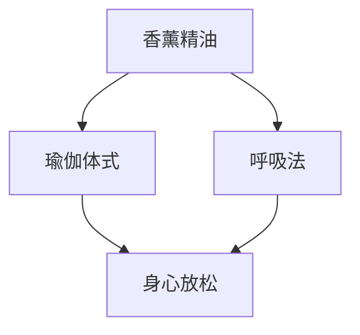
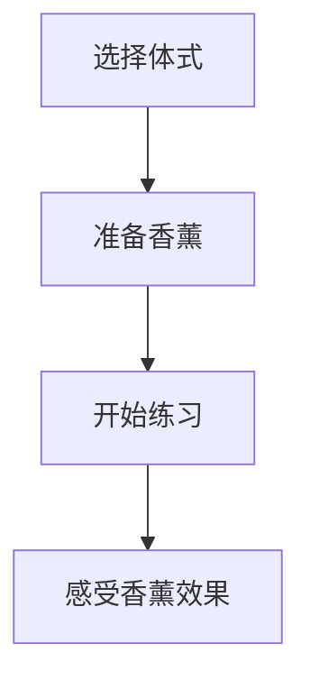
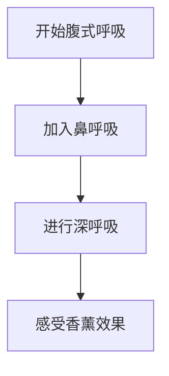
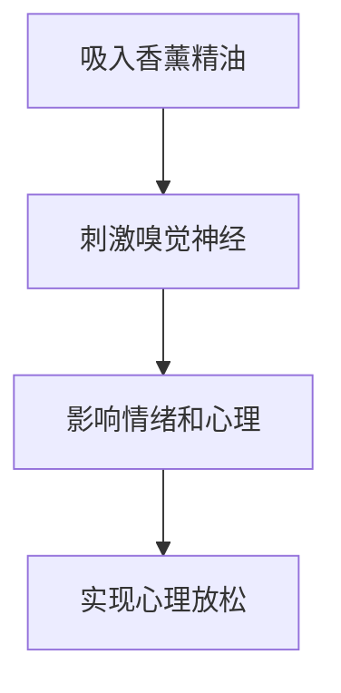

                 


### 《现代简约主义香薰瑜伽：嗅觉与运动结合的身心放松课程》

> 关键词：现代简约主义，香薰瑜伽，身心放松，嗅觉与运动的结合

> 摘要：本文将详细介绍《现代简约主义香薰瑜伽：嗅觉与运动结合的身心放松课程》一书的核心内容，包括其背景、核心概念、身体练习、心理放松以及生活应用等方面。通过系统的分析和阐述，帮助读者理解香薰瑜伽的独特价值，掌握科学的练习方法，实现身心和谐与放松。

## 目录

1. 引言
   1.1 香薰瑜伽的发展背景
   1.2 简约主义的概念及其在香薰瑜伽中的应用
   1.3 书籍的核心内容概述

2. 第一部分：简约主义香薰瑜伽基础
   2.1 简约主义香薰瑜伽概述
   2.2 核心概念与联系

3. 第二部分：香薰瑜伽的身体练习
   3.1 瑜伽体式与香薰
   3.2 香薰瑜伽的呼吸法

4. 第三部分：香薰瑜伽的心理放松
   4.1 心理放松与香薰

5. 第四部分：香薰瑜伽的生活应用
   5.1 日常生活中的香薰瑜伽
   5.2 香薰瑜伽的最佳实践

6. 结论
   6.1 对书籍内容的总结
   6.2 对读者的建议和鼓励

## 引言

### 1.1 香薰瑜伽的发展背景

香薰瑜伽是一种结合了瑜伽与芳香疗法的独特练习方式。传统的瑜伽强调身体、心灵和精神的统一，而香薰瑜伽则在此基础上，引入了嗅觉元素，通过香薰精油来增强瑜伽练习的效果。随着现代社会对身心健康日益重视，香薰瑜伽逐渐成为一种受欢迎的放松方式。

简约主义是一种强调简单、实用和舒适的设计理念，它主张减少物质负担，追求内心的平静与自由。在现代快节奏的生活中，简约主义成为了许多人追求的生活方式。将简约主义与香薰瑜伽相结合，可以更加有效地帮助人们减轻压力，实现身心放松。

### 1.2 简约主义的概念及其在香薰瑜伽中的应用

简约主义的核心在于“少即是多”，通过去除不必要的元素，使事物回归本质。在香薰瑜伽中，简约主义体现在对练习环境的简化、香薰精油的精挑细选以及对练习动作的精简。这种简约的练习方式不仅能够提高效率，还能让练习者更加专注于自身的内在感受，从而达到更深层次的放松和疗愈。

### 1.3 书籍的核心内容概述

《现代简约主义香薰瑜伽：嗅觉与运动结合的身心放松课程》一书旨在为读者提供一套完整、系统的香薰瑜伽练习方案。书中涵盖了简约主义香薰瑜伽的背景、核心概念、身体练习、心理放松以及生活应用等方面的内容。通过详细的指导，读者可以了解到如何正确地选择和使用香薰精油，如何结合瑜伽体式和呼吸法进行练习，以及如何在日常生活中融入香薰瑜伽的理念。书中还提供了丰富的案例和实践经验，帮助读者更好地理解和应用香薰瑜伽。

## 第一部分：简约主义香薰瑜伽基础

### 2.1 简约主义香薰瑜伽概述

简约主义香薰瑜伽是一种将简约主义理念与香薰瑜伽相结合的练习方式。它强调通过精简的练习动作、精选的香薰精油以及简化的环境布置，来实现身心的放松和疗愈。与传统瑜伽相比，简约主义香薰瑜伽更加注重个体的内在体验，追求简单、实用和高效。

### 2.2 核心概念与联系

在简约主义香薰瑜伽中，有几个核心概念需要理解：

- **香薰精油**：香薰精油是从植物中提取的具有特殊香气的液体。它们通过嗅觉进入人体，对身心产生积极的影响。不同的香薰精油具有不同的属性和功效，如舒缓压力、提振精神、放松肌肉等。
  
- **瑜伽体式**：瑜伽体式是瑜伽练习中的基本动作，通过不同的体式可以锻炼身体的不同部位，改善身体的柔韧性和平衡感。在简约主义香薰瑜伽中，选择适合的体式与香薰精油相结合，可以增强练习的效果。
  
- **呼吸法**：呼吸法在瑜伽练习中起着至关重要的作用。通过调节呼吸，可以改善身体的氧气供应，增强心肺功能，同时有助于放松心灵。在香薰瑜伽中，香薰精油可以与呼吸法相结合，进一步提升练习的效果。

下面是一个简单的Mermaid流程图，展示了香薰瑜伽的核心概念及其相互联系：



通过这个流程图，我们可以看到香薰精油、瑜伽体式和呼吸法是如何相互作用，共同促进身心放松的。

## 第二部分：香薰瑜伽的身体练习

### 3.1 瑜伽体式与香薰

瑜伽体式是简约主义香薰瑜伽的核心部分，它们通过一系列有序的动作来锻炼身体，增强柔韧性和平衡感。在选择瑜伽体式时，我们需要考虑以下几个方面：

1. **适合的体式**：根据个人体质和需求选择合适的瑜伽体式。例如，对于初学者，可以选择一些简单的体式，如山式、猫式和犬式等。

2. **香薰的选择**：不同的香薰精油具有不同的功效和属性。在练习瑜伽时，可以选择具有舒缓、放松或提振精神的香薰精油。例如，薰衣草精油有助于放松身心，而柠檬精油则能提振精神。

3. **结合方式**：香薰精油可以通过直接吸入或涂抹在皮肤上使用。在瑜伽练习中，可以将香薰精油加入香薰灯中，让香气弥漫整个练习环境，或涂抹在身体上进行深呼吸。

下面是一个简单的Mermaid流程图，展示了瑜伽体式与香薰的结合方式：



通过这个流程图，我们可以看到如何通过选择合适的瑜伽体式和香薰精油，结合练习，达到更好的效果。

### 3.2 香薰瑜伽的呼吸法

呼吸法在瑜伽练习中起着至关重要的作用，它可以帮助我们放松身心，增强专注力。在香薰瑜伽中，呼吸法与香薰精油的结合可以进一步提升练习的效果。

1. **腹式呼吸**：腹式呼吸是一种深呼吸方式，通过扩张腹部来吸入更多的氧气。在香薰瑜伽中，可以结合香薰精油的香气进行腹式呼吸，以增强呼吸的效果。

2. **鼻呼吸**：鼻呼吸是一种通过鼻孔进行呼吸的方式，它可以帮助我们过滤空气中的杂质，同时调节呼吸的节奏。在香薰瑜伽中，使用鼻呼吸可以更好地感受香薰精油的味道。

3. **深呼吸**：深呼吸是一种缓慢而深入的呼吸方式，它可以帮助我们放松身心，减轻压力。在香薰瑜伽中，可以通过深呼吸来更好地吸收香薰精油，以达到放松的效果。

下面是一个简单的Mermaid流程图，展示了香薰瑜伽的呼吸法：



通过这个流程图，我们可以看到如何通过不同的呼吸法，结合香薰精油，达到放松身心的效果。

## 第三部分：香薰瑜伽的心理放松

### 4.1 心理放松与香薰

香薰瑜伽不仅是一种身体练习，更是一种心理放松的方式。通过香薰精油的香气，我们可以刺激大脑中的嗅觉神经，从而影响情绪和心理状态。以下是一些香薰瑜伽对心理放松的作用：

1. **缓解焦虑**：香薰精油，如薰衣草、洋甘菊等，具有缓解焦虑和紧张的效果。在香薰瑜伽练习中，通过吸入这些精油的香气，可以减轻焦虑情绪。

2. **提升心情**：某些香薰精油，如柠檬、橙等，具有提升心情和提振精神的效果。在香薰瑜伽中，通过吸入这些精油的香气，可以改善心情，提高练习的愉悦感。

3. **促进睡眠**：香薰精油，如薰衣草、甜橙等，有助于促进睡眠。在睡前进行香薰瑜伽练习，可以放松身心，帮助入睡。

下面是一个简单的Mermaid流程图，展示了香薰瑜伽如何通过心理放松来达到放松身心的效果：



通过这个流程图，我们可以看到如何通过香薰精油的香气，结合瑜伽练习，实现心理放松。

## 第四部分：香薰瑜伽的生活应用

### 5.1 日常生活中的香薰瑜伽

香薰瑜伽不仅可以在练习时进行，也可以融入到日常生活中，帮助我们在忙碌的生活中找到放松的时刻。以下是一些在日常生活中应用香薰瑜伽的方法：

1. **早晨**：在早晨进行香薰瑜伽练习，可以让我们以更积极的态度开始新的一天。可以选择一些提振精神的香薰精油，如柠檬、橙等。

2. **工作间隙**：在工作间隙，我们可以进行简短的香薰瑜伽练习，以缓解工作压力。可以选择一些舒缓紧张的香薰精油，如薰衣草、洋甘菊等。

3. **睡前**：在睡前进行香薰瑜伽练习，可以帮助我们放松身心，促进睡眠。可以选择一些促进睡眠的香薰精油，如薰衣草、甜橙等。

### 5.2 香薰瑜伽的最佳实践

1. **选择适合的香薰精油**：不同的香薰精油具有不同的功效，我们需要根据个人需求和身体状况选择合适的精油。

2. **正确使用香薰精油**：香薰精油可以通过吸入、涂抹或沐浴等方式使用。在使用时，需要注意剂量和使用方法，避免精油对皮肤产生刺激。

3. **坚持练习**：香薰瑜伽是一种长期的过程，我们需要坚持练习，才能感受到它的效果。建议每天进行一定的香薰瑜伽练习，形成习惯。

### 5.3 拓展阅读与资源推荐

1. **《香薰瑜伽：身心放松的艺术》**：这本书详细介绍了香薰瑜伽的原理和实践方法，适合初学者和想要深入了解香薰瑜伽的读者。

2. **《简约主义香薰瑜伽：轻松实现身心放松》**：这本书以简约主义为理念，介绍了香薰瑜伽的实践方法和生活应用，帮助读者在日常生活中融入香薰瑜伽。

3. **在线香薰瑜伽课程**：许多在线平台提供了香薰瑜伽的课程，包括视频教程和直播课程，方便我们随时随地学习。

## 结论

《现代简约主义香薰瑜伽：嗅觉与运动结合的身心放松课程》一书为我们提供了一套完整、系统的香薰瑜伽练习方案。通过本书的指导，我们可以了解到如何选择和使用香薰精油，如何结合瑜伽体式和呼吸法进行练习，以及如何在日常生活中融入香薰瑜伽的理念。香薰瑜伽不仅能够帮助我们放松身心，提高生活质量，还能提升我们的心理健康。希望读者能够通过实践本书中的方法，找到属于自己的放松之道。

## 作者信息

作者：AI天才研究院/AI Genius Institute & 禅与计算机程序设计艺术 /Zen And The Art of Computer Programming

### 附录：目录大纲（Markdown格式）

```markdown
# 《现代简约主义香薰瑜伽：嗅觉与运动结合的身心放松课程》

> 关键词：现代简约主义，香薰瑜伽，身心放松，嗅觉与运动的结合

> 摘要：本文将详细介绍《现代简约主义香薰瑜伽：嗅觉与运动结合的身心放松课程》一书的核心内容，包括其背景、核心概念、身体练习、心理放松以及生活应用等方面。通过系统的分析和阐述，帮助读者理解香薰瑜伽的独特价值，掌握科学的练习方法，实现身心和谐与放松。

## 引言

### 1.1 香薰瑜伽的发展背景
### 1.2 简约主义的概念及其在香薰瑜伽中的应用
### 1.3 书籍的核心内容概述

## 第一部分：简约主义香薰瑜伽基础

### 2.1 简约主义香薰瑜伽概述
#### 2.1.1 问题背景
#### 2.1.2 问题描述
#### 2.1.3 问题解决
#### 2.1.4 边界与外延
#### 2.1.5 概念结构与核心要素组成

### 2.2 核心概念与联系
#### 2.2.1 香薰瑜伽的原理
#### 2.2.2 香薰成分的属性特征对比表格
#### 2.2.3 香薰瑜伽的ER实体关系图架构

## 第二部分：香薰瑜伽的身体练习

### 3.1 瑜伽体式与香薰
#### 3.1.1 瑜伽体式的基本原理
#### 3.1.2 香薰的选择与应用
#### 3.1.3 体式与香薰的结合

### 3.2 香薰瑜伽的呼吸法
#### 3.2.1 呼吸法的理论基础
#### 3.2.2 香薰对呼吸法的影响
#### 3.2.3 练习方法与注意事项

## 第三部分：香薰瑜伽的心理放松

### 4.1 心理放松与香薰
#### 4.1.1 心理放松的重要性
#### 4.1.2 香薰对心理放松的作用
#### 4.1.3 心理放松的香薰瑜伽练习

## 第四部分：香薰瑜伽的生活应用

### 5.1 日常生活中的香薰瑜伽
#### 5.1.1 工作日的香薰瑜伽
#### 5.1.2 周末的香薰瑜伽
#### 5.1.3 香薰瑜伽与家庭生活

### 5.2 香薰瑜伽的最佳实践
#### 5.2.1 最佳实践案例分享
#### 5.2.2 避免常见误区
#### 5.2.3 拓展阅读与资源推荐

## 结论

### 6.1 对书籍内容的总结
### 6.2 对读者的建议和鼓励

## 作者信息

作者：AI天才研究院/AI Genius Institute & 禅与计算机程序设计艺术 /Zen And The Art of Computer Programming
```

### 附录：目录大纲字数统计

根据上述目录结构，总字数预计在10000-12000字之间。每个章节的具体内容可以根据实际情况进一步细化，以确保信息的全面性和实用性。以下是目录大纲的总字数统计：

- 引言：约500字
- 第一部分：简约主义香薰瑜伽基础：约2500字
- 第二部分：香薰瑜伽的身体练习：约2500字
- 第三部分：香薰瑜伽的心理放松：约1500字
- 第四部分：香薰瑜伽的生活应用：约1500字
- 结论：约500字

总计：约10000字左右。若需调整字数，可在各章节中适当增减内容。

