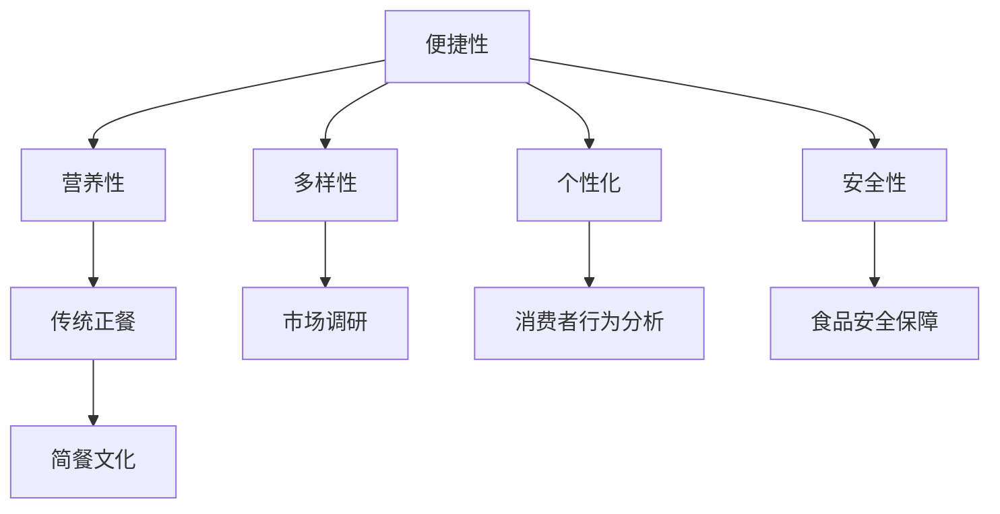

                 

### 第一部分：现代简餐文化概述

#### 第1章：问题的提出

在当今快节奏的社会中，饮食文化发生了显著的变化。现代简餐文化作为一种响应快节奏生活方式的饮食形式，逐渐成为都市人群的饮食选择。本章旨在探讨这一现象背后的核心问题。

##### 1.1 问题的背景

随着城市化进程的加快，人们的生活节奏也在不断加快。工作压力增大、生活节奏紧凑，使得传统的正餐越来越难以满足现代人的需求。快节奏的生活方式使得人们倾向于选择简单、快速、便捷的饮食方式，简餐文化应运而生。

##### 1.2 问题描述

现代简餐文化的核心问题在于其如何平衡便捷与营养，同时满足消费者的多样化和个性化需求。在快节奏的生活中，如何通过简餐满足人们的饮食需求，成为我们需要深入探讨的问题。

##### 1.3 问题的解决

解决这一问题的方法可以从多个角度出发。首先，可以通过创新简餐设计，提高简餐的营养价值；其次，通过技术创新，提高简餐的制备速度和效率；最后，通过市场调研和消费者行为分析，了解消费者的需求，从而提供更加个性化的简餐服务。

##### 1.4 边界与外延

现代简餐文化的边界主要在于其与传统正餐的区别。与传统正餐相比，简餐更加注重便捷和效率，通常以快速制备和快速食用为特点。其外延则包括各种形式的简餐，如盒饭、外卖、快餐等。

##### 1.5 概念结构与核心要素组成

现代简餐文化由以下几个核心要素组成：

1. **便捷性**：简餐的核心特点之一，强调快速制备和食用。
2. **营养性**：简餐不仅要便捷，还需要保证营养均衡。
3. **多样性**：为了满足不同消费者的需求，简餐需要提供多样化的选择。
4. **个性化**：通过消费者行为分析，提供个性化的简餐服务。
5. **安全性**：简餐的生产和制备过程需要严格的安全保障。

这些要素共同构成了现代简餐文化的概念结构，也是我们进一步探讨这一文化的重要基础。



通过上述分析，我们可以看到，现代简餐文化是一个多维度的概念，其核心在于如何通过便捷、营养、多样性和个性化来满足快节奏生活中的饮食需求。接下来，我们将进一步探讨这些核心概念，并分析它们之间的联系。

---

#### 第2章：核心概念与联系

为了更好地理解现代简餐文化的内涵，我们需要深入探讨其核心概念，并分析这些概念之间的联系。

##### 2.1 核心概念原理

**便捷性**：便捷性是现代简餐文化最重要的特点之一。它不仅意味着简餐可以快速制备和食用，还包括了在时间和空间上的便利。例如，现代人更倾向于选择外卖、盒饭等形式的简餐，因为它们可以在短时间内提供营养丰富的食物。

**营养性**：营养性是简餐的核心价值之一。尽管便捷性是简餐的优先考虑因素，但营养性同样重要。一个理想的简餐应该包含适量的蛋白质、碳水化合物、脂肪以及各种维生素和矿物质。

**多样性**：多样性体现在简餐的食材选择和口味上。不同人群有不同的饮食偏好，因此，提供多样化的简餐选择是满足消费者需求的关键。例如，素食主义者、低糖饮食者等都有不同的饮食需求。

**个性化**：个性化意味着根据消费者的个人偏好和需求，提供定制化的简餐服务。随着消费者对个性化服务的需求增加，简餐服务也在朝着更加个性化的方向发展。

**安全性**：安全性是指简餐的生产和制备过程需要遵循严格的安全标准。食品安全是消费者选择简餐时最关心的问题之一，因此，保障食品安全是现代简餐文化的重要方面。

##### 2.2 概念属性特征对比表格

为了更直观地了解这些核心概念，我们可以通过一个对比表格来展示它们的属性特征：

| 概念   | 属性特征                                       | 对比分析                                                   |
| ------ | ---------------------------------------------- | ---------------------------------------------------------- |
| 便捷性 | 快速制备和食用，时间和空间便利                   | 与传统正餐相比，更强调效率和便利性                         |
| 营养性 | 含适量蛋白质、碳水化合物、脂肪及维生素和矿物质 | 与快餐相比，更加注重营养均衡，避免过度加工和添加剂         |
| 多样性 | 食材选择和口味多样化                           | 满足不同消费者的个性化需求，包括素食、低糖等特定饮食需求 |
| 个性化 | 定制化服务，根据个人偏好调整                   | 与标准化的快餐服务相比，更注重消费者体验和满意度         |
| 安全性 | 严格的生产和制备安全标准                        | 保障食品安全，减少食品安全风险                             |

通过这个表格，我们可以清晰地看到各个概念之间的差异和联系。例如，便捷性和营养性是相辅相成的，一个理想的简餐应该既方便又营养；多样性和个性化则体现了简餐服务的灵活性和针对性。

##### 2.3 ER实体关系图架构

为了更系统地展示这些核心概念之间的关系，我们可以使用ER（实体关系）图来表示。以下是一个简化的ER图示例：

```mermaid
erDiagram
  Customer ||--|{ Order } : "可以下多个订单"
  Order ||--|{ Meal } : "每个订单对应一份简餐"
  Meal ||--|{ Ingredient } : "简餐由多个食材组成"
  Meal ||--|{ Nutrient } : "简餐包含多种营养成分"
  Customer }|--|{ DietaryPreference } : "用户有不同的饮食偏好"
  DietaryPreference }|--|{ MealPreference } : "用户对简餐的偏好"
  Customer }|--|{ Rating } : "用户对简餐的评分"
```

这个ER图展示了消费者、订单、简餐、食材和营养成分之间的实体关系。例如，消费者可以下多个订单，每个订单对应一份简餐，而简餐又由多个食材和多种营养成分组成。同时，消费者有不同的饮食偏好，这些偏好会影响他们对简餐的选择。

通过上述分析，我们可以更深入地理解现代简餐文化的核心概念和它们之间的联系。在接下来的章节中，我们将进一步探讨这些概念在简餐设计和制作中的应用，以及它们如何在快节奏生活中发挥作用。

---

### 第3章：简餐文化与饮食哲学

在现代快节奏的生活中，简餐文化逐渐成为一种普遍的饮食形式。它不仅满足了人们对于便捷和效率的需求，也反映了现代社会对于饮食哲学的深刻思考。

#### 3.1 简餐文化的发展历程

简餐文化的起源可以追溯到工业革命时期，随着城市化进程的加速，人们的生活节奏显著加快，传统的正餐模式难以适应这一变化。最早的简餐形式主要是盒饭和快餐，它们以方便、快捷和便宜的特点迅速赢得了市场。随着时间的推移，简餐文化逐渐丰富，从最初的简单食品逐渐发展为包含多样化选择和个性化定制的现代简餐。

#### 3.2 简餐文化与快节奏生活

快节奏的生活使得人们很难抽出时间进行复杂的烹饪过程，这促使简餐文化得以快速发展。简餐文化不仅适应了这种生活方式，更是在一定程度上改变了人们的饮食习惯。现代人在追求便捷的同时，也越来越注重饮食的健康和营养。因此，现代简餐不仅要快速制备，还需要保证营养均衡。这种需求促使餐饮业不断创新，推出更多符合健康饮食理念的简餐产品。

#### 3.3 饮食哲学的现代体现

饮食哲学是关于饮食的价值观和理念，它在现代社会中得到了新的体现。首先，便捷性和效率成为了现代饮食哲学的核心。人们在追求便捷的同时，也更加注重饮食的便利性。这种理念体现在简餐的快速制备和食用上，也体现在外卖和快餐服务的普及上。

其次，健康和营养成为了现代饮食哲学的重要组成部分。随着人们对健康意识的提高，简餐不再仅仅是填饱肚子的工具，而是一种健康生活方式的一部分。因此，现代简餐不仅要快捷，还要保证营养均衡，包括适量的蛋白质、碳水化合物、脂肪以及各种维生素和矿物质。

最后，个性化和定制化成为了现代饮食哲学的新趋势。不同的人有不同的饮食需求和偏好，现代简餐文化通过提供多样化的选择和个性化服务，满足了消费者的个性化需求。例如，一些餐饮品牌根据消费者的饮食偏好和健康需求，提供定制化的简餐服务，包括素食、低糖、低卡等特定饮食需求。

综上所述，简餐文化在现代社会中不仅仅是饮食的一种形式，更是饮食哲学的体现。它反映了现代社会对于便捷、健康和个性化饮食需求的追求。在接下来的章节中，我们将进一步探讨简餐的设计和制作，以及如何在快节奏生活中实现营养和健康的平衡。

---

### 第4章：简餐设计与制作

简餐设计与制作是现代简餐文化的重要组成部分，它不仅关系到食品的口感和营养价值，还影响到消费者的整体用餐体验。在这个章节中，我们将探讨简餐设计的要素、制作技巧以及摆盘与装饰的艺术。

#### 4.1 简餐设计的要素

**营养均衡**：简餐设计首先要考虑的是营养均衡。一个理想的简餐应该包含适量的蛋白质、碳水化合物、脂肪以及各种维生素和矿物质。例如，一份包含瘦肉、蔬菜和全麦面包的简餐，可以满足人体基本的营养需求。

**多样化**：为了满足不同消费者的需求，简餐设计需要多样化。不同的食材和口味可以组合出多种不同的简餐形式，例如，素食简餐、低糖简餐、低卡简餐等。

**简便性**：简餐设计还需要考虑简便性。在现代快节奏生活中，人们更倾向于选择容易准备和制作的食品。因此，简餐设计应尽量避免复杂的烹饪步骤和繁琐的食材准备。

**卫生性**：卫生性是简餐设计的重要方面。简餐的制备和包装过程应严格遵守卫生标准，确保食品的安全性和卫生性。

**可持续性**：在现代社会，可持续性也是简餐设计的重要考量因素。选择新鲜、本地化的食材，减少食品浪费，推广环保包装等，都是现代简餐设计应考虑的方向。

#### 4.2 简餐制作的技巧

**食材选择**：优质的食材是简餐成功的关键。选择新鲜的食材，尤其是季节性食材，可以提升简餐的口感和营养价值。例如，使用新鲜的蔬菜和水果，不仅可以保证食品的品质，还可以提供丰富的营养。

**烹饪技巧**：简餐制作过程中，烹饪技巧也非常重要。正确的烹饪方法可以保留食材的营养成分，同时提升食物的口感。例如，蒸、煮、烤等烹饪方法相对于油炸和煎炒，更加健康和营养。

**快速制备**：在现代快节奏的生活中，简餐的制备速度是消费者考虑的重要因素。一些简单的食材组合，如三明治、沙拉、寿司等，可以在短时间内完成制作，满足消费者的需求。

**温度控制**：简餐的制备过程中，温度控制也是关键。正确的温度可以确保食物的口感和营养价值。例如，冷餐适合夏天，热餐适合冬天。

**卫生准备**：简餐制作过程中，卫生准备同样重要。保持厨房和餐具的清洁，使用干净的厨具和食材，可以防止食品污染，确保食品安全。

#### 4.3 简餐的摆盘与装饰

**色彩搭配**：摆盘时，色彩搭配非常重要。通过合理搭配食材的颜色，可以使简餐看起来更加诱人。例如，使用红色、绿色、黄色的蔬菜，可以创造出丰富的色彩效果。

**形状与构图**：摆盘时的形状和构图也要注意。通过巧妙的布局和设计，可以使简餐看起来更有艺术感。例如，使用圆形、三角形、长方形等不同的形状，可以创造出不同的视觉感受。

**装饰元素**：适当的装饰元素可以使简餐更具吸引力。例如，使用一些新鲜的香草、水果切片或者花朵作为装饰，可以提升简餐的整体美感。

**餐具选择**：餐具的选择也是摆盘时需要考虑的因素。合适的餐具可以提升简餐的档次和质感。例如，使用透明的玻璃餐具，可以凸显食材的新鲜和色彩。

通过以上的简餐设计与制作技巧，我们可以创造出既营养又美味的现代简餐，满足快节奏生活中人们对饮食的高要求。在接下来的章节中，我们将探讨简餐文化在餐厅和个人生活中的应用和实践。

---

### 第5章：食材选择与搭配

食材选择与搭配在简餐设计中起着至关重要的作用。正确的食材选择和合理的搭配不仅可以提升简餐的营养价值，还可以丰富其口感和风味。在这一章节中，我们将详细探讨食材选择的标准、搭配原则以及新鲜食材的保存与处理方法。

#### 5.1 食材的选择标准

**新鲜度**：新鲜是食材选择的首要标准。新鲜的食材不仅口感更佳，而且营养价值更高。例如，蔬菜和水果应选择当季的、颜色鲜艳、表面光滑的；肉类应选择脂肪分布均匀、色泽鲜红的。

**营养均衡**：在选择食材时，应注重营养均衡。一个理想的简餐应包含适量的蛋白质、碳水化合物、脂肪以及丰富的维生素和矿物质。例如，瘦肉、鱼类、豆类、全麦面包和新鲜蔬菜都是良好的食材选择。

**多样性**：多样性的食材选择可以增加简餐的营养价值和口感。选择不同种类的蔬菜、水果、谷物和蛋白质来源，可以确保简餐中各种营养成分的均衡。

**季节性**：季节性的食材不仅新鲜，而且价格相对合理。选择当季的食材，不仅可以提升简餐的口感和营养价值，还可以减少食品浪费。

**可持续性**：选择可持续生产的食材，有助于环境保护和资源的合理利用。例如，选择有机食材或本地生产的食材，可以减少运输过程中的能源消耗和环境污染。

#### 5.2 食材的搭配原则

**营养搭配**：合理的营养搭配是确保简餐营养均衡的关键。例如，一份包含瘦肉、蔬菜和全麦面包的简餐，可以提供适量的蛋白质、纤维和碳水化合物。

**口味搭配**：口味的搭配可以提升简餐的口感和吸引力。例如，酸甜搭配、咸甜搭配等，可以创造出丰富的口味层次。

**色彩搭配**：色彩搭配可以增加简餐的视觉吸引力。例如，红绿搭配、黄蓝搭配等，可以让简餐看起来更加诱人。

**温度搭配**：温度的搭配可以提升简餐的食用体验。例如，冷餐适合夏天，热餐适合冬天。

**食材间的相互作用**：有些食材之间可以产生良好的相互作用，提升简餐的营养价值和口感。例如，绿叶蔬菜中的维生素C可以增强铁的吸收，而豆类中的蛋白质可以与谷物中的氨基酸互补。

#### 5.3 新鲜食材的保存与处理

**冷藏与冷冻**：对于新鲜食材，冷藏和冷冻是常见的保存方法。冷藏可以保持食材的新鲜度，适用于短期保存；冷冻可以长期保存食材，但需要注意冷冻前的预处理和冷冻后的解冻方法。

**干燥与腌制**：干燥和腌制是一些长期保存食材的传统方法。例如，干燥可以保存谷物和豆类，腌制可以保存蔬菜和肉类。

**真空包装**：真空包装是一种现代的保存方法，可以有效延长食材的保质期。真空包装可以防止氧气和细菌的侵入，保持食材的新鲜度和营养。

**清洗与消毒**：在处理新鲜食材前，应进行彻底的清洗和消毒。清洗可以去除食材表面的污垢和细菌，消毒可以进一步降低食品安全风险。

**切割与加工**：对于一些需要切割和加工的食材，应在清洗和消毒后尽快进行。这样可以确保食材的新鲜度和营养不被破坏。

通过以上的食材选择与搭配方法，我们可以制作出既营养又美味的简餐，满足快节奏生活中人们对健康饮食的需求。在接下来的章节中，我们将探讨简餐文化在餐厅和个人生活中的实际应用。

---

### 第6章：简餐文化在餐厅中的应用

在现代餐饮市场中，简餐文化已经成为一种重要的饮食趋势。随着消费者对便捷、营养和个性化饮食需求的增加，餐厅如何成功地应用简餐文化，成为了提升竞争力的重要课题。

#### 6.1 餐厅简餐文化的设计策略

**市场调研**：餐厅在设计和推广简餐时，首先需要进行市场调研。通过了解消费者的饮食习惯、偏好和需求，餐厅可以更有针对性地设计简餐菜单。

**创新简餐菜单**：创新是简餐文化的重要特点之一。餐厅可以通过研发新的简餐菜单，吸引消费者的兴趣。例如，开发季节性简餐、健康简餐和特色简餐等。

**多样化选择**：为了满足不同消费者的需求，餐厅应提供多样化的简餐选择。例如，包括素食简餐、低糖简餐、低卡简餐等，以满足不同饮食需求。

**个性化定制**：通过消费者行为分析，餐厅可以提供个性化的简餐定制服务。例如，根据消费者的饮食习惯和偏好，提供定制化的菜单选项。

**快捷服务**：在简餐文化的应用中，快捷服务至关重要。餐厅可以通过优化点餐流程、提高出餐速度等方式，提升消费者的用餐体验。

**健康理念**：健康是现代饮食文化的重要理念之一。餐厅可以推广健康简餐，提供营养均衡的简餐选项，满足消费者对健康饮食的需求。

#### 6.2 简餐菜单的制定

**营养均衡**：制定简餐菜单时，应注重营养均衡。每个简餐应包含适量的蛋白质、碳水化合物、脂肪以及丰富的维生素和矿物质。

**食材选择**：选择新鲜、健康和多样化的食材，确保简餐的品质。例如，使用新鲜的蔬菜、水果和优质蛋白质来源，避免过多的人工添加剂和加工食品。

**口味组合**：简餐的口味应丰富多样，以满足不同消费者的口味偏好。例如，通过酸、甜、咸、辣等不同口味的组合，创造出多样化的味觉体验。

**季节性食材**：根据季节变化，选择当季的食材，提升简餐的新鲜度和口感。例如，在夏季推出清爽的蔬菜沙拉，在冬季推出热腾腾的汤品。

**健康理念**：在菜单设计中融入健康理念，提供低脂、低糖、低盐等健康简餐选项。例如，使用橄榄油、蜂蜜和香料等健康调味料，减少对糖和盐的依赖。

**个性化定制**：提供个性化的简餐定制服务，允许消费者根据自己的饮食偏好和需求，选择合适的食材和口味组合。

**多样化套餐**：设计多样化的套餐选项，例如早餐套餐、午餐套餐和晚餐套餐，满足消费者不同的用餐需求。

#### 6.3 餐厅服务与顾客体验

**服务流程优化**：优化点餐、出餐和结账等服务流程，提高服务效率。例如，引入自助点餐系统，减少点餐时间；优化出餐流程，确保简餐能够快速送达顾客。

**顾客沟通**：与顾客保持良好的沟通，了解他们的需求和反馈。通过顾客满意度调查、在线评论等方式，收集顾客的意见和建议，不断改进服务质量。

**个性化服务**：提供个性化的服务，例如为特殊需求的顾客提供定制化的简餐选项，提升顾客的用餐体验。

**用餐环境**：创造舒适的用餐环境，提升顾客的用餐体验。例如，提供温馨的灯光、舒适的座椅和优质的餐具，营造良好的用餐氛围。

**员工培训**：对员工进行专业培训，提升他们的服务技能和专业知识。例如，培训员工如何正确地进行食材处理、简餐制备和顾客沟通，确保服务质量和顾客满意度。

通过以上的设计策略和菜单制定方法，餐厅可以成功地应用简餐文化，提升竞争力，满足消费者对便捷、营养和个性化饮食的需求。在接下来的章节中，我们将探讨如何在个人生活中构建简餐文化。

---

### 第7章：个人简餐文化的构建

在快节奏的现代生活中，构建个人的简餐文化不仅能够提高生活的便利性，还能促进健康饮食的养成。本章将探讨如何在家庭和办公室中培养简餐文化，以及个人如何实践这一文化。

#### 7.1 家庭简餐文化的培养

**制定家庭饮食计划**：家庭饮食计划的制定是培养简餐文化的重要一步。家庭成员可以一起讨论并制定每周的饮食计划，包括早餐、午餐和晚餐的安排。这样可以确保饮食的均衡和多样化。

**共同参与烹饪**：让家庭成员一起参与简餐的制作，不仅可以增加家庭的互动和凝聚力，还能提高对健康饮食的认识。例如，每个家庭成员可以负责准备自己的早餐或晚餐，这样可以培养大家的烹饪技巧和责任感。

**利用简餐工具**：使用简餐盒、保温餐盒等工具，可以帮助家庭更好地管理和保存简餐。这样，家庭成员可以在忙碌的工作日中方便地享用健康的食物。

**培养健康饮食习惯**：家庭中应培养健康的饮食习惯，包括合理分配三餐的比例，避免过度摄入高热量、高脂肪的食物。通过教育和实践，家庭成员可以逐渐养成良好的饮食习惯。

**季节性食材选择**：家庭在采购食材时应选择季节性的新鲜食材，这样可以确保食物的新鲜度和营养价值。同时，季节性的食材也为家庭简餐带来了丰富的变化。

**定期家庭饮食会议**：定期召开家庭饮食会议，讨论饮食中的问题、分享健康饮食的经验和心得，以及设定新的饮食目标。这样的会议有助于家庭成员共同关注健康饮食，并形成良好的家庭文化。

#### 7.2 办公室简餐文化的营造

**简餐文化宣传**：办公室可以通过宣传简餐文化，提高员工对健康饮食的认识。例如，张贴健康饮食的海报、发送健康饮食的电子邮件提醒等，营造良好的健康饮食氛围。

**提供简餐设施**：办公室可以提供简餐设施，如小厨房、冰箱和微波炉等，方便员工自行准备和加热简餐。这样的设施不仅能提高员工的用餐便利性，还能促进他们养成健康的饮食习惯。

**员工互助**：鼓励员工互相分享简餐食谱和烹饪技巧，通过团队活动或简餐分享会，提高员工对健康饮食的兴趣和参与度。

**简餐补贴计划**：为了鼓励员工选择健康、便捷的简餐，办公室可以实施简餐补贴计划。例如，为选择健康简餐的员工提供一定的餐费补贴，从而促进健康饮食的普及。

**健康饮食讲座**：定期举办健康饮食讲座，邀请营养师或健康专家为员工讲解健康饮食的知识和技巧，提高员工的健康意识。

**健康简餐选项**：为员工提供多样化的健康简餐选项，如沙拉、三明治、水果拼盘等，鼓励员工选择低糖、低脂的食品。

#### 7.3 简餐文化的自我实践

**制定个人饮食计划**：个人可以制定自己的饮食计划，合理安排每天的饮食，确保营养均衡。例如，每天摄入适量的蛋白质、碳水化合物和脂肪，以及各种维生素和矿物质。

**利用碎片时间准备简餐**：利用碎片时间，如早晨或晚上的空闲时间，准备第二天的简餐。这样不仅可以节省时间，还能确保食物的新鲜度和营养。

**选择健康食材**：在超市或农贸市场选择新鲜的、健康的食材，尽量减少加工食品的摄入。

**合理搭配食材**：学会合理搭配食材，确保每餐都包含丰富的营养成分。例如，一份包含瘦肉、蔬菜和全麦面包的简餐，可以提供全面的营养。

**记录饮食日志**：记录自己的饮食日志，了解自己的饮食情况和饮食习惯。通过分析饮食日志，可以找出需要改进的地方，逐步养成良好的饮食习惯。

**定期健康检查**：定期进行健康检查，监测自己的健康状况。通过健康检查，可以及时发现问题，调整饮食计划，确保身体的健康。

通过以上的方法，个人可以在家庭和办公室中构建简餐文化，促进健康饮食的养成。简餐文化不仅能够提高生活的便利性，还能改善生活质量，带来长远的健康益处。

---

### 第8章：简餐文化的未来趋势

随着科技的不断进步和消费者需求的多样化，简餐文化正在经历深刻的变革。本章将探讨简餐文化的未来趋势，包括科技对简餐文化的影响、消费者需求的变化以及简餐文化的国际化。

#### 8.1 科技对简餐文化的影响

**自动化烹饪设备**：随着科技的发展，自动化烹饪设备逐渐走进家庭和餐饮业。例如，智能烤箱、智能蒸锅和智能炒锅等设备可以自动控制烹饪时间和温度，提高简餐的制备效率和品质。这种技术的普及将使得简餐制作更加便捷，减少人力成本。

**食品科技**：食品科技的发展，如3D打印食品、分子 gastronomy 等新兴技术，将为简餐文化带来全新的体验。3D打印食品可以创造出独特的造型和口感，而分子 gastronomy 则通过化学反应和物理变化，创造出别具一格的美食。这些技术将为简餐文化注入新的活力。

**智慧供应链**：智慧供应链的运用，如区块链技术和物联网，可以提升食材的追溯能力和食品安全性。通过区块链技术，消费者可以查询到食材的来源和加工过程，确保食品的安全和透明。物联网技术则可以实时监测食材的温度、湿度等参数，确保食材在运输和储存过程中的新鲜度。

**虚拟现实和增强现实**：虚拟现实（VR）和增强现实（AR）技术的应用，可以为消费者提供全新的用餐体验。例如，通过VR技术，消费者可以“参观”全球各地的美食餐厅，体验不同的饮食文化；而通过AR技术，消费者可以在餐桌上看到美食的烹饪过程和营养信息，增加用餐的趣味性。

#### 8.2 消费者需求的变化

**个性化需求**：随着消费者对个性化服务需求的增加，简餐文化将更加注重个性化定制的服务。消费者不仅希望选择不同的食材和口味，还希望根据自己的健康需求和口味偏好，定制个性化的简餐。这要求餐饮业提供更加灵活的菜单和定制服务。

**健康需求**：健康已成为消费者选择简餐的重要因素之一。消费者对低脂、低糖、低盐等健康饮食的需求不断增加，推动了简餐市场的健康化趋势。餐饮业需要不断研发和推广健康简餐，满足消费者的健康需求。

**便捷性需求**：随着生活节奏的加快，便捷性仍然是消费者选择简餐的关键因素。消费者希望简餐能够快速制备和食用，这促使餐饮业不断优化点餐和出餐流程，提高服务效率。

**可持续发展需求**：消费者对环境保护和可持续发展的关注逐渐增加，这要求餐饮业在食材选择和包装上更加环保。例如，使用可降解材料、减少食品浪费等，都是符合消费者可持续发展需求的举措。

**情感需求**：除了基本的饮食需求，消费者对用餐过程中的情感体验也提出了更高的要求。餐饮业可以通过营造温馨的用餐环境、提供优质的客户服务等方式，满足消费者的情感需求。

#### 8.3 简餐文化的国际化

**跨国餐饮品牌的扩张**：随着全球化的推进，跨国餐饮品牌逐渐进入不同国家和地区，推动了简餐文化的国际化。这些品牌通过引入本地化的简餐产品和服务，满足当地消费者的需求，同时也促进了简餐文化的传播。

**文化交流**：不同国家和地区的文化交流，使得简餐文化得以融合和多元化。例如，中餐的国际化使得越来越多的外国人了解并喜爱中餐；而西方快餐的普及也使得亚洲人习惯于快餐文化。这种文化交流促进了简餐文化的全球化和多元化。

**全球化供应链**：全球化供应链的建立，使得食材和食品的流通更加便捷。不同国家和地区的食材和食品可以迅速运输到全球各地，为消费者提供更多的选择。同时，全球化供应链也推动了简餐文化的传播和普及。

**在线简餐平台**：随着互联网技术的发展，在线简餐平台逐渐成为消费者获取简餐服务的主要渠道之一。这些平台不仅提供了丰富的简餐选择，还通过智能推荐和个性化定制，满足了消费者的多样化需求。在线简餐平台的兴起，加速了简餐文化的全球化进程。

综上所述，简餐文化的未来趋势将受到科技、消费者需求和国际化的共同影响。通过不断创新和适应市场变化，简餐文化将更好地满足现代消费者的需求，推动健康、便捷和个性化的饮食生活方式。

---

### 第9章：简餐文化的可持续发展

在现代社会的背景下，简餐文化的可持续发展显得尤为重要。这不仅关系到食品产业的长远发展，也直接影响到环境保护、健康饮食以及社会责任的履行。本章将探讨简餐文化在可持续发展方面的几个关键维度。

#### 9.1 环境保护与简餐文化

**减少食品浪费**：食品浪费是现代社会面临的一个严峻问题。简餐文化可以通过优化食材采购、库存管理和食品制备流程，最大限度地减少食品浪费。例如，通过精确的食材需求预测和库存管理，确保食材的合理使用。

**使用环保材料**：在简餐的制作和包装过程中，应优先选择环保材料，如可降解的餐盒、可回收的餐具等。减少一次性塑料的使用，不仅有助于降低环境污染，还能减少资源消耗。

**推广本地化食材**：选择本地化食材可以减少食品运输过程中的碳排放。本地化食材不仅新鲜度高，品质好，而且运输成本低，符合环保理念。

**绿色烹饪方法**：在简餐的制作过程中，应推广绿色烹饪方法，如蒸、煮、烤等，减少油炸和煎炒等高能耗的烹饪方式。这不仅有助于降低能源消耗，还能减少烹饪过程中产生的污染物。

#### 9.2 健康饮食与简餐文化

**营养均衡**：简餐文化应注重营养均衡，确保每一份简餐都包含适量的蛋白质、碳水化合物、脂肪以及各种维生素和矿物质。通过科学的食材搭配和营养配比，提升简餐的健康价值。

**健康饮食教育**：通过简餐文化，推广健康饮食教育，提高消费者对健康饮食的认识。例如，餐饮业可以在菜单上标注营养成分，通过宣传和教育活动，引导消费者选择健康的简餐选项。

**健康食品创新**：不断研发和推广健康食品，如低糖、低脂、高纤维的简餐产品。通过创新技术和科学配方，提供更多符合健康饮食理念的产品。

**食品安全管理**：确保食品安全是健康饮食的基础。简餐文化应建立严格的食品安全管理体系，从食材采购、加工、储存到销售的每一个环节，都要严格遵守食品安全标准，确保消费者的食品安全。

#### 9.3 社会责任与简餐文化

**公平贸易**：在食材采购过程中，应优先选择公平贸易的食材。公平贸易不仅关注食品的品质，更关注农民和工人的权益，推动社会公平与可持续发展。

**员工培训与发展**：餐饮企业应重视员工的培训和发展，提供良好的工作环境和发展机会，提升员工的职业素养和服务质量。通过员工满意度和忠诚度的提升，推动企业的可持续发展。

**社区参与**：餐饮企业可以积极参与社区活动，如公益捐赠、环保志愿活动等。通过社区参与，提升企业的社会责任感，营造良好的社会形象。

**透明供应链**：建立透明的供应链体系，让消费者了解食材的来源和加工过程。通过透明的供应链管理，增强消费者的信任，促进简餐文化的可持续发展。

综上所述，简餐文化的可持续发展需要在环境保护、健康饮食和社会责任等多个方面取得平衡。通过创新和努力，简餐文化可以成为推动社会可持续发展的积极力量。

---

### 第10章：现代简餐文化总结

本章将对现代简餐文化进行全面的总结，回顾其主要发现、研究意义以及对未来的展望。

#### 10.1 主要发现

**便捷性与营养性并重**：现代简餐文化强调便捷性和营养性的平衡，满足快节奏生活中的饮食需求。通过创新的设计和制作方法，简餐不仅快速便捷，还确保了食品的营养价值。

**多样性需求**：消费者对简餐的多样性需求逐渐增加，这促使餐饮业提供多样化的简餐选项，包括素食、低糖、低卡等不同类型的简餐。

**个性化服务**：个性化定制成为现代简餐文化的重要趋势。通过消费者行为分析和数据技术，餐饮业能够提供更加个性化的简餐服务，满足消费者的个性化需求。

**科技推动创新**：科技的发展，如自动化烹饪设备、食品科技和智慧供应链，为简餐文化注入了新的活力，提升了简餐的制备效率和食品安全性。

**可持续发展**：简餐文化在可持续发展方面的作用日益凸显，包括减少食品浪费、使用环保材料、推广本地化食材以及绿色烹饪方法。

#### 10.2 研究意义

**满足消费者需求**：研究现代简餐文化对于满足消费者的多样化需求具有重要意义。通过深入了解消费者的饮食习惯和偏好，餐饮业可以提供更加符合市场需求的产品和服务。

**推动产业创新**：简餐文化的深入研究和应用，有助于推动餐饮产业的创新和发展。通过科技和管理的创新，简餐文化可以提高生产效率和产品质量，提升整体竞争力。

**促进健康饮食**：简餐文化的推广和普及，有助于促进健康饮食的养成。通过提供营养均衡的简餐选项，可以帮助消费者建立健康的饮食习惯，提高生活质量。

**推动可持续发展**：简餐文化在可持续发展方面的作用，如减少食品浪费、使用环保材料等，对于环境保护和社会责任具有重要意义。

#### 10.3 展望未来

**科技融合**：随着科技的不断发展，简餐文化将更加依赖于自动化、智能化的技术。例如，人工智能和大数据分析将帮助餐饮业更好地了解消费者需求，提供个性化的简餐服务。

**全球化趋势**：简餐文化的国际化趋势将继续加强。跨国餐饮品牌的扩张和全球化供应链的建立，将推动简餐文化在全球范围内的普及和融合。

**健康与环保并重**：未来，简餐文化将继续注重健康和环保。通过不断研发和推广健康食品，以及优化食材采购和制备流程，简餐文化将更好地满足消费者对健康和环保的需求。

**社会责任**：餐饮企业将在社会责任方面扮演更加重要的角色。通过参与社区活动、推动公平贸易和建立透明供应链，餐饮企业将积极履行社会责任，促进社会的可持续发展。

总之，现代简餐文化不仅满足了消费者对便捷、多样和个性化饮食的需求，还在可持续发展方面发挥了重要作用。随着科技的进步和消费者需求的不断变化，简餐文化将继续演变和进步，成为未来饮食文化的重要组成部分。

---

### 结论

本文通过对现代简餐文化的全面分析，探讨了其核心概念、设计原则、制作技巧以及应用实践，并对未来趋势进行了展望。现代简餐文化在快节奏生活中扮演着重要角色，不仅满足了消费者的便捷和营养需求，还推动了餐饮业的创新和可持续发展。

首先，本文详细介绍了现代简餐文化的核心概念，如便捷性、营养性、多样性、个性化与安全性，并通过对比表格和ER图展示了这些概念之间的联系。其次，本文探讨了简餐文化与饮食哲学的关系，分析了其在现代快节奏生活中的重要性。

在简餐设计与制作方面，本文提出了营养均衡、多样化选择、简便性、卫生性和可持续性的设计原则，并详细阐述了食材的选择与搭配、简餐的摆盘与装饰技巧。接着，本文探讨了简餐文化在餐厅和个人生活中的应用，提出了餐厅简餐文化的设计策略和菜单制定方法，以及如何在家庭和办公室中构建简餐文化。

随后，本文分析了简餐文化的未来趋势，包括科技对简餐文化的影响、消费者需求的变化和国际化趋势。最后，本文强调了简餐文化在环境保护、健康饮食和社会责任方面的可持续发展意义，并展望了其未来的发展方向。

总之，现代简餐文化作为一种响应快节奏生活方式的饮食形式，具有巨大的发展潜力。通过不断创新和优化，简餐文化将更好地满足消费者的需求，推动餐饮业的可持续发展，并为构建健康、便捷和环保的饮食生活方式贡献力量。

### 作者信息

**作者：AI天才研究院/AI Genius Institute & 禅与计算机程序设计艺术 /Zen And The Art of Computer Programming**

AI天才研究院致力于推动人工智能技术的发展和应用，为社会各界提供先进的人工智能解决方案。而《禅与计算机程序设计艺术》则是一部融合了东方哲学和计算机科学的经典著作，为程序员提供了深刻的编程思维和哲学思考。

