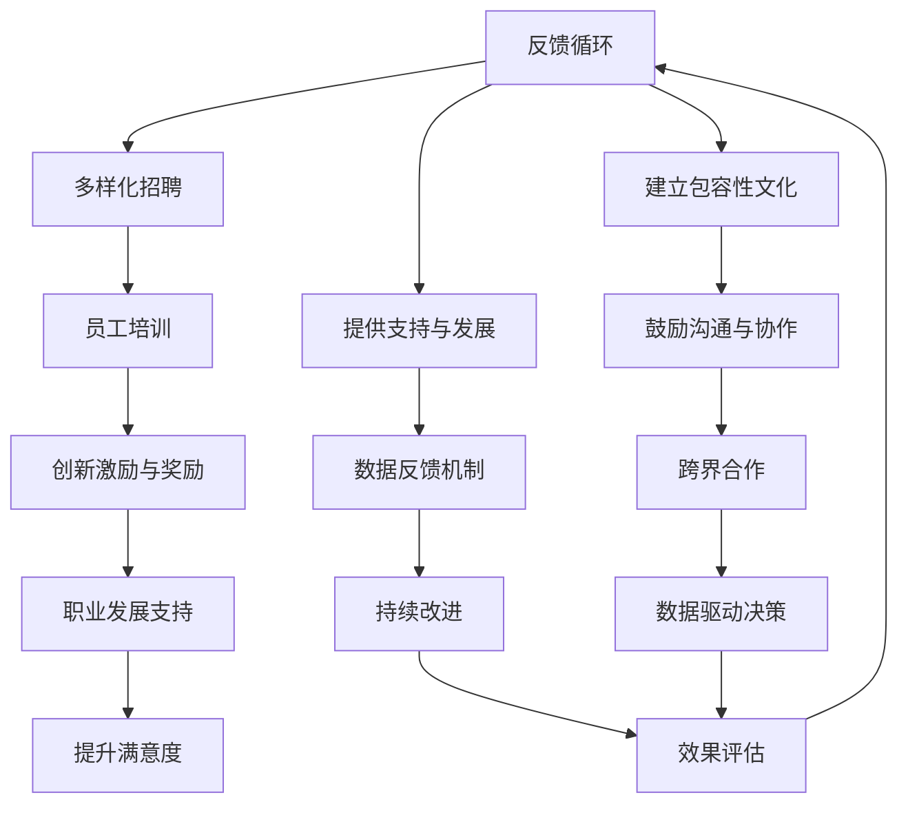

                 

### 第一部分：多样性管理概述

#### 第1章：现代职场多样性挑战与重要性

在当今快速变化和全球化的商业环境中，多样性已经成为企业成功的关键因素之一。多样性不仅包括性别、种族、年龄、文化和背景等方面，还包括个人技能、经验和观点的多样性。在信息技术行业，这种多样性尤为关键，因为它可以带来创新思维、提高问题解决能力和增强团队协作。

**核心概念术语说明**：

- **多样性管理**：是指企业通过政策和实践来确保不同背景的人才得到公平对待和机会，从而实现多元化、公平和包容的工作环境。

- **包容性文化**：是一种工作氛围，它尊重并欢迎所有员工，无论他们的性别、种族、文化或背景如何。这种文化能够促进不同观点的交流和融合，从而提高创新能力和员工满意度。

- **管理策略**：是指企业采取的具体措施和行动，以促进多样性管理和包容性文化的建设。

- **员工满意度**：是指员工对企业文化和工作环境的满意程度，它直接影响员工的工作积极性和绩效。

- **组织绩效**：是指企业通过有效管理和利用多样性所带来的综合效益，包括创新、效率和市场竞争力等方面的提升。

**问题背景**：

随着全球化的加速和信息技术的发展，企业的员工结构和市场环境都变得更加多元和复杂。这不仅带来了新的机遇，也带来了新的挑战。传统的单一文化模式已经无法满足企业发展的需求，多样性和包容性成为企业成功的关键因素。

- **多样性管理的挑战**：如何在不同文化和背景的员工之间建立有效的沟通和协作机制？如何确保所有员工都得到公平的机会和待遇？

- **包容性文化的挑战**：如何营造一个尊重和欢迎不同观点的工作环境？如何消除偏见和歧视，促进团队内部的合作和信任？

**问题描述**：

现代职场中的多样性管理主要面临以下问题：

- 多样性管理策略的实施缺乏系统性和可持续性。

- 包容性文化尚未在企业内部扎根，员工之间缺乏相互理解和尊重。

- 员工满意度和组织绩效的提升受到多样性管理不足的影响。

**问题解决**：

为了解决这些问题，企业需要采取以下策略：

- 制定明确的多样性管理政策和目标，并将其纳入企业战略和运营流程。

- 建立包容性文化，通过培训和教育提高员工对多样性和包容性的认识和意识。

- 采用多样化的招聘和晋升策略，确保不同背景的人才得到公平的机会。

- 通过数据分析和反馈机制，不断评估和改进多样性管理的实施效果。

**边界与外延**：

- **多样性管理的范围**：包括性别、种族、文化、年龄、经验等方面的多样性。

- **适用行业**：信息技术、金融、医疗等需要高度协作和创新能力的行业。

- **局限性和潜在问题**：多样性管理需要时间和资源的投入，可能面临实施难度和成本问题。

- **外部环境的影响**：全球化和技术进步等因素对多样性管理提出了新的要求和挑战。

通过以上策略和措施，企业可以在现代职场中有效管理多样性，提升包容性文化，增强创新动力，从而实现组织绩效的持续提升。

#### 第2章：多样性管理核心概念与联系

在深入探讨多样性管理之前，我们需要明确几个核心概念，并理解它们之间的相互联系。这些概念包括多样性管理、包容性文化、创新动力等。

**多样性管理的定义与特点**：

多样性管理是一种系统性的方法，旨在确保企业在人员构成、观点、经验和技能等方面具有多样性。其核心目标是：

- **促进公平性**：确保所有员工，无论其背景如何，都能在工作和生活中得到公平对待。

- **提高生产力**：通过多样化的团队和思维，增强企业的创新能力和问题解决能力。

- **增强员工满意度**：营造一个包容和尊重多元文化的工作环境，提高员工的满意度和忠诚度。

- **优化组织绩效**：利用多样性带来的多角度思维和丰富资源，提升企业的市场竞争力。

多样性管理的主要特点包括：

- **系统性**：需要企业从战略高度制定明确的多样性和包容性目标，并确保各项政策和实践的一致性和连贯性。

- **动态性**：多样性管理是一个持续的过程，需要不断适应外部环境和企业内部变化。

- **多层次性**：涉及企业的人力资源政策、员工培训、团队建设等多个方面。

**包容性文化的概念、内涵与价值**：

包容性文化是一种价值观和工作方式，它倡导尊重、接纳和欣赏多样性。具体包括以下内涵：

- **尊重差异**：不仅接受和尊重不同的观点和背景，还鼓励员工在多样性和包容性环境中发挥自己的优势。

- **提供支持**：为员工提供平等的机会和支持，帮助他们克服障碍，实现个人和职业发展。

- **促进协作**：通过建立开放的沟通渠道和协作机制，促进不同背景员工之间的互动和合作。

包容性文化的价值主要体现在以下几个方面：

- **提高员工满意度**：员工在一个包容性环境中感到被尊重和认可，从而更加投入工作，提升满意度。

- **增强创新能力**：多样性带来的不同视角和经验有助于激发创新思维，提高企业的竞争力。

- **促进团队协作**：包容性文化能够促进团队成员之间的信任和合作，提升团队绩效。

- **增强企业形象**：企业在公众中的形象和声誉得到提升，有利于吸引和留住优秀人才。

**创新动力的来源、影响因素和作用机制**：

创新动力是企业持续发展的关键因素，它来源于多样性和包容性文化。具体来说，创新动力的来源和影响因素包括：

- **多样性的思维碰撞**：不同背景和经验的员工能够带来不同的视角和方法，促进思维的创新和碰撞。

- **开放的沟通环境**：包容性文化鼓励员工表达不同的观点和意见，为创新提供土壤。

- **激励与支持**：企业通过奖励机制和创新支持政策，激发员工的创新潜能。

创新动力的作用机制主要体现在：

- **激发创意**：多样性带来新的思路和想法，激发员工的创造力。

- **促进转化**：创新的创意需要通过团队协作和资源整合转化为实际的产品和服务。

- **提高竞争力**：创新能够帮助企业不断适应市场和客户需求的变化，提升竞争力。

通过以上核心概念和联系的阐述，我们可以看到多样性管理、包容性文化和创新动力之间的密切关系。只有通过有效的多样性管理，建立包容性文化，才能激发创新动力，实现企业的长期可持续发展。

#### 第3章：包容性文化与多样性管理

包容性文化在多样性管理中起着至关重要的作用，它不仅是一个价值观的体现，更是一种实践和策略。通过建立和巩固包容性文化，企业可以更好地管理多样性，提高员工满意度和组织绩效。

**包容性文化的定义与内涵**：

包容性文化是指一种工作环境，其中所有员工都感到被尊重、被认可，他们的独特性、背景和观点都得到肯定。这种文化不仅包括对多样性的接受，更强调对多样性的尊重和价值的认可。具体来说，包容性文化的内涵包括以下几个方面：

- **尊重差异**：包容性文化倡导尊重每个员工的不同观点、背景和文化。这种尊重体现在对个体差异的认可和包容，而不是简单地接受或容忍。

- **开放沟通**：包容性文化鼓励开放和诚实的沟通，员工可以自由地表达自己的观点和想法，无论是正面还是负面的。这种沟通不仅有助于解决冲突，还能促进创新和协作。

- **公平机会**：包容性文化确保所有员工，无论其背景如何，都能获得公平的机会和发展空间。这种公平体现在招聘、晋升和奖励等方面。

- **支持多样性**：包容性文化不仅接受多样性，还主动支持和鼓励多样性。企业通过培训、活动和政策，帮助员工理解和欣赏多样性，并在实际工作中体现出来。

**包容性文化与多样性管理的关系**：

包容性文化是多样性管理的重要组成部分，它们之间存在着密切的联系和互动。具体来说，包容性文化对多样性管理的作用主要体现在以下几个方面：

- **促进多样性的融合**：包容性文化为不同背景的员工提供了一个共同的平台，使他们在工作中能够更好地融合和协作。这种融合不仅提高了团队的效能，也增强了员工的归属感和认同感。

- **增强创新动力**：包容性文化鼓励员工自由地表达和分享他们的想法和观点。这种开放的环境有助于激发创新思维，推动企业不断创新和进步。

- **提升员工满意度**：在包容性文化中，员工感到被尊重和重视，这直接提高了他们的工作满意度和忠诚度。高满意度的员工往往更加投入工作，提高生产力和绩效。

- **优化组织绩效**：包容性文化能够吸引和留住多样化的优秀人才，提高企业的创新能力和竞争力。此外，一个包容性的工作环境还能够提高员工的工作效率和团队合作能力，从而优化整体组织绩效。

**包容性文化的构建策略**：

为了建立和巩固包容性文化，企业可以采取以下策略：

- **领导示范**：企业领导者的行为和态度对文化建设至关重要。领导者应该以身作则，展示对多样性和包容性的尊重和重视。

- **制定明确政策**：企业需要制定明确的多样性和包容性政策，并将其纳入企业的核心价值观和战略中。这些政策应该涵盖招聘、晋升、培训、奖励等方面。

- **培训和教育**：企业可以通过培训和教育，提高员工对多样性和包容性的认识和意识。这些培训可以包括敏感度培训、文化多样性课程等。

- **建立反馈机制**：企业应该建立有效的反馈机制，鼓励员工表达他们的意见和建议。这些反馈可以帮助企业及时识别和解决多样性和包容性管理中的问题。

- **激励和奖励**：企业可以通过激励和奖励机制，鼓励员工积极参与多样性和包容性文化建设。这些奖励可以包括奖金、晋升机会、公开表彰等。

通过以上策略，企业可以逐步建立和巩固包容性文化，从而在多样性管理中取得更好的效果，提高员工的满意度和组织绩效。

#### 第4章：多样性管理策略

为了有效管理多样性，企业需要制定和实施一系列具体策略。这些策略不仅有助于促进多样性和包容性文化的建设，还能够提升员工的满意度和组织绩效。以下是多样性管理的主要策略：

**1. 制定明确的多样性目标**：

- **设定具体目标**：企业应该明确设定多样性目标，包括性别、种族、年龄、文化和经验等方面的多样性。这些目标应该与企业的长期战略和愿景相一致。
- **纳入绩效考核**：将多样性目标纳入员工和团队的绩效考核体系，确保各级管理人员重视和关注多样性管理。
- **定期评估进展**：定期评估多样性目标的进展情况，并根据评估结果进行调整和优化。

**2. 实施多样化的招聘策略**：

- **多元化招聘渠道**：通过多元化的招聘渠道，吸引不同背景和经历的人才。例如，可以通过专业社交平台、社区活动、多元化招聘会等途径进行招聘。
- **公平招聘流程**：确保招聘流程的公平性和透明度，避免潜在的偏见和歧视。例如，可以采用匿名简历、多轮面试等方式。
- **多样化团队建设**：在招聘过程中，注重团队构成的多样性，确保团队在性别、种族、文化和经验等方面具有代表性。

**3. 建立包容性文化**：

- **培养领导力**：通过领导力培训，提高管理层对多样性和包容性的认识和重视。领导者应该以身作则，展示对多样性和包容性的尊重和重视。
- **开展员工培训**：定期开展多样性培训，提高员工对多样性的认识和意识。这些培训可以包括文化多样性、敏感度训练、无歧视意识等。
- **营造开放沟通环境**：鼓励员工自由地表达不同的观点和想法，建立开放和诚实的沟通渠道。这有助于促进团队合作和创新。

**4. 提供支持和发展机会**：

- **提供平等机会**：确保所有员工，无论其背景如何，都能获得平等的职业发展机会。这包括培训、晋升和奖励等方面。
- **支持员工发展**：提供个性化的职业发展计划，帮助员工发挥其潜力，实现个人和职业目标。
- **提供资源和支持**：为不同背景的员工提供必要的资源和支持，例如语言培训、文化适应计划等。

**5. 数据分析和反馈机制**：

- **收集多样性数据**：定期收集和分析员工多样性数据，了解企业多样性管理的现状和问题。
- **建立反馈机制**：建立有效的员工反馈机制，鼓励员工表达他们对多样性和包容性管理的意见和建议。
- **持续改进**：根据反馈和数据分析结果，不断改进多样性管理的策略和实践，确保其有效性。

**6. 激励和奖励**：

- **设立多样性奖项**：设立多样性奖项，表彰在多样性管理方面表现出色的员工和团队。
- **激励多样性倡导者**：通过激励措施，鼓励员工积极参与多样性和包容性文化建设。
- **提升员工满意度**：多样性管理不仅有助于提升员工的职业满意度，还能提高整体员工满意度。

**案例分析**：

以某国际知名科技公司为例，该公司通过以下措施有效管理多样性：

- **明确多样性目标**：公司将多样性和包容性作为核心战略，明确设定了性别、种族、文化和经验等方面的多样性目标。
- **多元化招聘渠道**：公司通过多元化的招聘渠道，吸引了来自不同背景和文化的员工。例如，通过专业社交平台和多元化招聘会，提高了招聘的多样性和公平性。
- **建立包容性文化**：公司定期开展多样性培训，提高员工对多样性的认识和意识。同时，公司鼓励开放和诚实的沟通，建立了一个包容性的工作环境。
- **提供支持和发展机会**：公司为不同背景的员工提供平等的职业发展机会，并设立个性化的职业发展计划，帮助员工实现个人和职业目标。
- **数据分析和反馈机制**：公司定期收集和分析员工多样性数据，根据反馈和数据分析结果，不断改进多样性管理的策略和实践。

通过这些措施，该公司成功建立了包容性文化，提高了员工的满意度和组织绩效，取得了显著的商业成功。

综上所述，通过制定明确的多样性目标、实施多样化的招聘策略、建立包容性文化、提供支持和发展机会、数据分析和反馈机制以及激励和奖励，企业可以有效地管理多样性，提升员工的满意度和组织绩效。

#### 第5章：包容性文化建设策略

建立包容性文化是企业实现长期成功的关键。以下是一些具体的策略和措施，可以帮助企业营造一个多样性和包容性并存的工作环境。

**1. 强化领导层对多样性和包容性的承诺**：

- **领导层示范**：企业的高层管理者应该通过自己的言行，展示对多样性和包容性的重视。例如，可以通过公开演讲、会议讨论等方式，表达对多样性和包容性的支持。

- **明确政策和目标**：企业应该将多样性和包容性纳入公司战略和价值观，并设定明确的多样性目标和包容性文化建设计划。

- **设立多样性和包容性委员会**：设立专门的多样性和包容性委员会，负责监督和推动公司的多样性管理和文化建设。

**2. 增强员工对多样性和包容性的认识和意识**：

- **多样性培训**：定期为员工提供多样性培训，帮助他们了解多样性的重要性，以及如何在工作环境中尊重和欣赏多样性。这些培训可以包括文化敏感性训练、无歧视教育等。

- **宣传多样性和包容性的价值**：通过内部通讯、社交媒体、公告板等多种渠道，宣传多样性和包容性的价值和优势。例如，可以分享公司多样性管理的成功案例和员工故事。

- **鼓励员工参与**：鼓励员工参与多样性相关的活动和项目，例如多样性研讨会、文化交流活动等。通过这些活动，员工可以加深对多样性和包容性的理解，并积极参与文化建设。

**3. 营造开放和诚实的沟通环境**：

- **建立沟通渠道**：建立开放的沟通渠道，让员工能够自由地表达自己的观点和想法。例如，可以设立匿名反馈系统、员工意见箱等。

- **鼓励跨部门合作**：通过跨部门项目和工作小组，促进不同背景的员工之间的交流和合作。这种合作有助于打破部门壁垒，增强团队凝聚力。

- **开展团队建设活动**：定期开展团队建设活动，例如团队拓展训练、团建旅游等，帮助团队成员建立信任和友谊。

**4. 提供支持和资源**：

- **职业发展支持**：为不同背景的员工提供平等的职业发展机会和支持。例如，设立导师计划、培训课程、晋升机会等。

- **文化适应计划**：为来自不同文化的员工提供文化适应计划，帮助他们更好地融入公司文化和工作环境。这些计划可以包括语言培训、文化介绍会等。

- **心理健康支持**：提供心理健康支持服务，帮助员工应对工作中的压力和挑战。例如，可以设立心理咨询热线、员工援助计划等。

**5. 激励和奖励**：

- **设立多样性奖项**：设立多样性奖项，表彰在多样性管理和文化建设方面做出杰出贡献的员工和团队。

- **激励多样性倡导者**：通过激励措施，鼓励员工积极参与多样性和包容性文化建设。这些激励措施可以包括奖金、晋升机会、公开表彰等。

- **提升员工满意度**：多样性管理不仅有助于提升员工的职业满意度，还能提高整体员工满意度。通过关注员工的多样性和需求，企业可以增强员工的归属感和忠诚度。

**6. 持续改进和监测**：

- **定期评估**：定期评估多样性管理和包容性文化建设的进展和效果，识别存在的问题和改进机会。

- **员工反馈**：通过员工反馈机制，收集员工对多样性和包容性管理的意见和建议，不断优化相关政策和实践。

- **持续学习和更新**：随着外部环境的变化和企业发展，多样性管理和包容性文化建设也需要不断更新和改进。企业应该持续学习和借鉴最佳实践，确保其多样性和包容性文化始终保持活力和竞争力。

通过以上策略和措施，企业可以有效地建立和巩固包容性文化，提升员工的满意度和组织绩效，从而在激烈的市场竞争中脱颖而出。

### 第6章：多样性管理案例分析

为了更好地理解多样性管理的实际效果和最佳实践，我们可以通过几个具体案例来分析多样性管理策略的成功实施和带来的积极影响。

**案例一：谷歌的多样性管理实践**

谷歌作为全球领先的科技公司，一直以来都非常重视多样性管理。以下是一些关键策略和成果：

- **多样化的招聘**：谷歌通过多元化的招聘渠道，如与多元化组织合作、参加多元文化招聘会等，吸引了来自不同背景和文化的候选人。谷歌还实施了匿名简历政策，以减少招聘过程中的潜在偏见。

- **内部多样性培训**：谷歌定期为员工提供多样性培训，内容包括无歧视意识、文化敏感性和团队协作技巧等。这些培训有助于增强员工的多样性和包容性意识。

- **包容性领导**：谷歌的高层领导积极参与多样性文化建设，通过公开演讲和倡导，展示了公司对多样性和包容性的承诺。

- **多样性和包容性报告**：谷歌每年发布多样性报告，详细说明公司多样性的现状、面临的挑战以及采取的措施。这些报告不仅提高了透明度，还为持续改进提供了数据支持。

- **成果**：通过一系列的多样性管理实践，谷歌在员工满意度和创新力方面取得了显著提升。公司吸引了来自不同文化和背景的优秀人才，增强了团队的创新能力和问题解决能力。

**案例二：P&G的包容性文化建设**

宝洁公司（P&G）在建立包容性文化方面也取得了显著成果：

- **性别平等**：P&G制定了明确的性别平等目标，并通过多种渠道招聘女性人才，如设立女性领导力项目、参与女性领导力论坛等。

- **文化多样性**：P&G在全球范围内推行文化多样性计划，鼓励员工分享和庆祝不同文化的节日，并在公司内部设立多元文化俱乐部。

- **员工反馈**：P&G建立了员工反馈机制，定期收集员工的意见和建议，并根据反馈调整多样性和包容性政策。

- **职业发展**：P&G为不同背景的员工提供平等的职业发展机会，通过导师计划和领导力发展项目，帮助员工实现职业目标。

- **成果**：通过这些措施，P&G成功提升了员工的满意度和生产力，增强了公司的创新能力和市场竞争力。公司在性别多样性和文化多样性方面的表现也得到了社会各界的认可。

**案例三：Adobe的多样性和包容性策略**

Adobe公司在多样性和包容性管理方面也有一套成功的实践：

- **多样性委员会**：Adobe成立了多样性委员会，负责监督和推动公司的多样性管理策略。该委员会由员工代表和高层领导共同组成，确保多样性管理的实施和监督。

- **员工资源小组**：Adobe设立了多个员工资源小组，如女性网络、有色人种网络、LGBTQ+网络等，为员工提供交流和支持的平台。

- **职业发展支持**：Adobe为不同背景的员工提供个性化的职业发展计划，包括领导力培训、技术课程和工作坊等。

- **公平晋升政策**：Adobe确保晋升政策透明和公平，避免任何形式的偏见和歧视。

- **成果**：通过多样性管理实践，Adobe提高了员工的满意度和忠诚度，增强了公司的创新能力和市场竞争力。公司在多样性和包容性方面的努力也为其赢得了业界的赞誉。

**总结与启示**：

从这些案例中，我们可以得出以下几点启示：

1. **领导层的支持至关重要**：高层领导的支持和参与是多样性管理和包容性文化建设成功的关键。

2. **持续的教育和培训**：定期开展多样性和包容性培训，提高员工的意识和技能，有助于建立和巩固包容性文化。

3. **建立反馈机制**：通过员工反馈和监测机制，及时发现和解决多样性管理中的问题，确保策略的有效性和可持续性。

4. **提供公平的机会和支持**：确保所有员工，无论其背景如何，都能获得公平的职业发展机会和支持。

5. **数据驱动的决策**：通过数据分析和监测，了解多样性管理的现状和效果，为决策提供有力支持。

通过借鉴这些成功案例，企业可以更好地实施多样性管理，建立包容性文化，提升员工的满意度和组织绩效，实现长期可持续发展。

### 第7章：创新动力与多样性管理的关系

创新动力是企业在激烈竞争环境中保持领先地位的关键因素。而多样性管理作为一种有效策略，可以显著提升企业的创新能力和创新动力。在本章节中，我们将探讨多样性管理如何通过多角度、多层次的方式激发创新动力，从而推动企业的发展。

**多样性管理对创新动力的直接影响**：

1. **多视角思考**：多样性管理通过引入不同背景、经验和技能的员工，为团队带来了多元化的视角和思考方式。这种多元化的思维碰撞能够激发新的创意和解决方案，有助于突破传统思维模式的限制。

2. **跨文化协作**：多样性管理促进了不同文化背景员工之间的交流和合作。跨文化的协作不仅可以借鉴不同的文化优势，还能在团队中形成更加开放和包容的沟通氛围，从而激发创新的火花。

3. **创新的多样性**：在多样性管理下，企业能够吸引到具有不同技能和经验的员工，这为创新提供了更多的可能性。例如，一个工程团队可能包括软件工程师、数据科学家和用户体验设计师，这种组合能够创造出更加全面和创新的解决方案。

**多样性管理对创新动力的间接影响**：

1. **员工满意度和归属感**：多样性管理通过营造一个包容和尊重的工作环境，提升了员工的满意度和归属感。满意的员工往往更加投入工作，愿意分享他们的创意和想法，从而增强企业的创新动力。

2. **减少偏见和歧视**：多样性管理通过消除偏见和歧视，为所有员工提供了一个公平的竞争平台。这种公平的环境有助于激发员工的创造力和自信心，从而促进创新。

3. **组织文化的多样性**：多样性管理不仅关注员工的多样性，还包括企业文化和价值观的多样性。这种文化的多样性能够吸引更多具有不同背景和观点的人才，为创新提供更多的资源和动力。

**多样性管理激发创新动力的案例分析**：

1. **微软的多样性创新**：微软通过实施多样性管理，吸引了来自不同国家和文化背景的顶尖人才。这些多元化的员工在项目中带来了不同的视角和解决方案，帮助微软在多个领域实现了重大创新，如云计算和人工智能。

2. **IBM的包容性文化**：IBM通过建立包容性文化，鼓励员工自由表达和分享他们的观点。这种开放的环境不仅激发了员工的工作热情，还推动了公司在多个领域的创新，如区块链和量子计算。

3. **谷歌的多元视角**：谷歌在多样性管理方面采取了多种策略，包括多元化的招聘、内部培训和文化活动。这些措施帮助谷歌在技术研发和产品创新方面取得了显著成就，如智能助手和自动驾驶汽车。

**最佳实践与启示**：

1. **重视多样性招聘**：通过多元化的招聘策略，吸引不同背景和技能的员工，为团队注入新的活力和视角。

2. **建立包容性文化**：通过培训和教育，提高员工对多样性和包容性的认识和意识，营造一个开放和尊重的工作环境。

3. **鼓励跨部门合作**：促进不同部门之间的交流和合作，激发创新的火花。

4. **提供支持和资源**：为员工提供必要的支持和资源，如培训、导师计划和研发资金，帮助他们实现创新目标。

5. **数据驱动的多样性管理**：通过数据分析和反馈机制，了解多样性管理的效果和问题，不断优化相关策略和实践。

通过以上策略和实践，企业可以有效地激发创新动力，提升创新能力，从而在市场竞争中脱颖而出。

### 第8章：提升创新动力的多样性管理实践

要提升创新动力，企业不仅需要认识到多样性管理的重要性，还需要采取一系列具体措施来实践和落实。以下是几种有效的多样性管理实践，这些实践不仅能够提升员工的创新动力，还能够促进企业的持续创新。

**1. 多元化团队建设**

多元化团队建设是提升创新动力的基础。通过组建包含不同背景、经验和技能的团队，企业可以促进多角度、多层次的思维碰撞。具体实践包括：

- **跨部门团队**：鼓励不同部门之间的合作，将来自不同部门的员工组成跨部门团队，共同应对复杂的业务挑战。
- **虚拟团队**：利用现代通信技术，组建跨区域、跨文化的虚拟团队，这些团队可以利用不同文化背景的员工独特的视角和技能。
- **任务轮换**：定期让员工在不同的项目中轮换任务，使他们接触到不同的工作内容和文化，从而激发创新思维。

**2. 包容性文化培养**

建立包容性文化是激发创新动力的关键。以下是一些具体策略：

- **领导示范**：企业领导层应该通过自己的言行，展示对多样性和包容性的尊重和重视。通过领导层的示范作用，可以带动整个组织形成包容性的文化。
- **员工参与**：鼓励员工参与多样性和包容性文化的建设，例如通过员工委员会、员工论坛等渠道，收集员工的意见和建议。
- **培训和教育**：定期开展多样性培训和教育，提高员工对多样性和包容性的认识和意识。这些培训可以包括文化敏感性训练、无歧视意识培养等。

**3. 创新激励和奖励**

为了激发员工的创新动力，企业需要建立有效的激励和奖励机制。以下是一些具体措施：

- **创新竞赛**：定期举办创新竞赛，鼓励员工提出创新的想法和解决方案。通过竞赛，不仅可以激发员工的创新热情，还可以发掘和培养潜在的创新能力。
- **奖金和认可**：对在创新方面表现突出的员工和团队给予奖金和其他形式的认可，如公开表彰、荣誉称号等。
- **职业发展支持**：为在创新方面有潜力的员工提供职业发展机会，如晋升、培训和领导力发展项目等。

**4. 跨界合作**

通过跨界合作，企业可以引入外部的创新资源和思维。以下是一些跨界合作的实践：

- **合作伙伴关系**：与外部合作伙伴建立紧密的合作关系，共同开展创新项目。这种合作可以引入不同的视角和技术，促进创新。
- **开放创新平台**：建立开放的创新平台，邀请外部企业和个人参与创新活动。通过这种开放合作，企业可以吸收外部的创新思维和资源。
- **创新孵化器**：投资或建立创新孵化器，为初创企业提供一个支持创新的环境。通过孵化器，企业可以接触到最新的技术趋势和商业模式。

**5. 数据驱动的决策**

数据驱动是现代企业提升创新动力的重要手段。通过数据分析和反馈机制，企业可以：

- **识别创新机会**：通过分析市场和客户数据，识别潜在的创新机会。
- **优化创新流程**：通过数据反馈，不断优化创新流程和管理策略。
- **评估创新效果**：通过数据评估创新项目的效果，为后续的创新活动提供依据。

**案例分析**：

以某国际知名科技公司为例，该公司通过以下措施有效提升创新动力：

- **多元化团队建设**：公司通过跨部门项目，将不同部门的专业人士组合在一起，形成多元化的团队。这些团队在项目中展示了卓越的创新能力，推出了多个成功的创新产品。
- **包容性文化培养**：公司领导层通过定期的会议和活动，展示对多样性和包容性的重视。公司还建立了员工论坛，鼓励员工自由表达和创新建议。
- **创新激励和奖励**：公司定期举办创新竞赛，并对获奖团队进行表彰和奖励。此外，公司还为在创新方面有潜力的员工提供职业发展机会。
- **跨界合作**：公司与多家外部合作伙伴建立了紧密的合作关系，共同开展创新项目。通过这种合作，公司不仅获得了外部的创新资源，还提升了自身的创新能力。
- **数据驱动的决策**：公司通过数据分析和反馈机制，不断优化创新流程和管理策略。公司还定期评估创新项目的效果，确保创新活动的有效性和可持续性。

通过以上措施，该公司成功提升了员工的创新动力，推动了企业的持续创新，取得了显著的商业成功。

总之，通过多元化团队建设、包容性文化培养、创新激励和奖励、跨界合作以及数据驱动的决策，企业可以有效地提升创新动力，推动企业的持续发展和竞争优势。

### 第9章：多样性管理与员工满意度

多样性管理不仅对企业的创新能力和市场竞争力有重要影响，还直接关系到员工的满意度和工作体验。在本章节中，我们将探讨多样性管理如何通过提升员工满意度，从而对企业的整体绩效产生积极的影响。

**多样性管理对员工满意度的影响**：

1. **公平感和归属感**：多样性管理确保所有员工，无论其背景如何，都能在工作和生活中得到公平对待和机会。这种公平感有助于提高员工的归属感，使他们更加愿意留在企业。

2. **多样性的认可与尊重**：在多样性管理下，员工的独特性和多样性得到认可和尊重。这种尊重不仅体现在企业的政策和行动中，也体现在日常的工作环境中。员工在这种环境中感受到自己的价值和贡献，从而提升满意度。

3. **职业发展机会**：多样性管理提供了平等的职业发展机会，使员工有机会在各个层级获得晋升和成长。这种公平的晋升机制有助于提高员工的职业满意度和忠诚度。

4. **心理健康和工作压力**：多样性管理通过营造一个包容和尊重的工作环境，有助于减轻员工的心理压力。员工在这种环境中更容易获得支持，从而提高心理健康和工作满意度。

**提升员工满意度的多样性管理实践**：

1. **包容性文化培训**：企业可以通过定期的多样性培训，提高员工对多样性和包容性的认识和意识。这些培训不仅有助于员工理解和尊重不同的文化，还能提升他们的沟通和协作能力，从而提高整体满意度。

2. **反馈机制**：建立有效的员工反馈机制，让员工能够自由地表达自己的意见和建议。这种反馈机制不仅有助于企业了解员工的实际需求和工作体验，还能增强员工的参与感和满意度。

3. **平等机会和晋升机制**：确保所有员工，无论其背景如何，都能获得平等的职业发展机会。企业可以通过透明的晋升机制和公平的评估标准，确保员工的晋升和成长机会。

4. **支持心理健康**：提供心理健康支持和咨询服务，帮助员工应对工作压力和挑战。这些服务可以包括心理咨询、压力管理培训等，有助于提高员工的心理健康和工作满意度。

**多样性管理对员工满意度的长期影响**：

1. **增强员工忠诚度**：通过多样性管理，企业能够吸引和留住高素质的人才。满意的员工往往更忠诚于企业，从而减少员工流失率，提高整体绩效。

2. **提升团队合作能力**：多样性管理有助于促进团队合作，因为不同背景和技能的员工可以相互补充，共同解决复杂的问题。这种高效的团队合作不仅提高了工作效率，也增强了员工的满意度。

3. **促进创新和创造力**：多样性管理为员工提供了一个开放和包容的工作环境，有助于激发员工的创新思维和创造力。满意的员工往往更加愿意分享他们的想法和创意，从而推动企业的持续创新。

4. **提升企业形象**：通过有效的多样性管理，企业能够提升其在公众中的形象和声誉。这种积极的形象有助于吸引更多优秀的人才和客户，从而提高企业的整体竞争力。

总之，多样性管理对员工满意度有着深远的影响。通过建立包容性文化、提供公平机会、支持心理健康以及促进团队合作，企业可以显著提升员工的满意度，从而实现长期的发展和成功。

### 第10章：多样性管理的最佳实践

为了确保多样性管理策略的有效实施，以下是一些最佳实践和实用技巧：

1. **领导层的支持与参与**：领导层应明确表示对多样性管理的支持，并通过自身言行树立榜样。定期与员工交流，了解多样性和包容性管理中的问题与挑战，并提供必要的资源和支持。

2. **数据驱动的决策**：定期收集和分析多样性数据，了解员工背景和表现，以便制定和调整多样性管理策略。使用这些数据来识别成功实践和需要改进的领域。

3. **培训和教育**：为员工提供定期的多样性培训，提高他们对多样性和包容性的认识和意识。这些培训可以包括文化敏感性训练、无歧视意识培养等。

4. **建立反馈机制**：鼓励员工通过匿名反馈渠道表达意见和建议，定期收集和评估这些反馈，以便及时改进多样性和包容性管理实践。

5. **多样性的招聘策略**：采用多元化的招聘渠道，如专业社交平台、多元化招聘会等，以确保吸引到具有不同背景和技能的候选人。实施匿名简历和多元面试策略，减少招聘过程中的潜在偏见。

6. **公平的晋升机制**：确保晋升和奖励机制透明、公平，避免任何形式的偏见和歧视。为不同背景的员工提供平等的职业发展机会和支持。

7. **建立多样性委员会**：设立专门的多样性委员会，负责监督和推动公司的多样性管理和文化建设。该委员会应由员工代表和高层领导共同组成，确保多样性管理的实施和监督。

8. **跨部门合作与交流**：鼓励不同部门之间的合作和交流，促进多样性和包容性文化的形成。通过跨部门项目和工作小组，增强团队协作和创新能力。

9. **激励和奖励**：设立多样性奖项和激励机制，表彰在多样性管理和文化建设方面表现出色的员工和团队。通过公开表彰和奖励，激励更多员工积极参与多样性管理。

10. **持续改进与监测**：定期评估多样性管理的进展和效果，识别存在的问题和改进机会。通过持续改进和监测，确保多样性管理策略的可持续性和有效性。

通过以上最佳实践，企业可以有效地管理多样性，建立包容性文化，提升员工的满意度和组织绩效，从而实现长期可持续发展。

### 第11章：多样性管理总结与展望

多样性管理作为现代企业的重要战略，对于提升组织绩效、增强创新动力和促进员工满意度具有深远的影响。在本章节中，我们将对全书内容进行总结，并探讨未来多样性管理的发展方向。

**核心内容回顾**：

1. **多样性管理的定义与重要性**：多样性管理是指通过政策和实践确保企业在人员构成、观点、经验和技能等方面具有多样性。其核心目标是促进公平性、提高生产力、增强员工满意度和优化组织绩效。

2. **包容性文化的建立与维护**：包容性文化是一种工作氛围，它尊重并欢迎所有员工，无论其性别、种族、文化或背景如何。通过建立包容性文化，企业可以促进多样性的融合，增强创新能力，提高员工满意度和组织绩效。

3. **多样性管理策略与实践**：企业可以通过制定明确的多样性目标、实施多样化的招聘策略、建立包容性文化、提供支持和发展机会、数据分析和反馈机制以及激励和奖励等措施，来有效管理多样性。

4. **创新动力与多样性管理的关系**：多样性管理能够通过多视角思考、跨文化协作和创新的多样性等方式，显著提升企业的创新能力和创新动力。

5. **员工满意度与多样性管理**：多样性管理通过营造公平、尊重和包容的工作环境，提升了员工的满意度和归属感，进而促进了组织的长期发展。

**未来发展方向**：

1. **数据驱动的多样性管理**：随着大数据和人工智能技术的发展，企业可以利用数据分析和人工智能技术，更精确地评估多样性管理的成效，并制定更加个性化的多样性策略。

2. **全球化背景下的多样性管理**：在全球化背景下，企业需要更加关注跨文化多样性和国际化管理。通过建立全球化的多样性管理框架，企业可以更好地适应国际市场的需求。

3. **技术赋能的多样性管理**：利用先进的技术工具，如区块链、虚拟现实和人工智能等，企业可以实现更加高效和透明的多样性管理，提高多样性和包容性文化的实施效果。

4. **多样性与可持续发展**：未来，多样性管理将更加注重与可持续发展相结合，通过促进社会包容性和环境保护，实现企业的社会责任和可持续发展目标。

**总结**：

多样性管理不仅是企业提升竞争力的重要手段，更是构建包容性和创新性组织文化的关键。通过有效的多样性管理，企业可以激发员工的创造力，提升员工的满意度和组织绩效，实现长期可持续发展。未来，企业应不断探索和创新多样性管理的方法和实践，以适应快速变化的市场环境，并在全球化的竞争中保持领先地位。

### 附录

#### 附录A：相关资源与参考文献

1. **《多样性、公平与包容性：企业管理的未来》** - 作者：John J. Gabarro 和 John P. Kotter。本书详细阐述了多样性、公平和包容性在企业管理中的重要性，提供了多种实践案例。

2. **《多样性管理：理论与实践》** - 作者：Judith R. Jackson。这本书提供了关于多样性管理的全面概述，包括多样性的类型、多样性管理的策略和实践。

3. **《包容性组织：如何创造无障碍的文化》** - 作者：Timothy M. Feeney 和 Jeanie Batchelor。本书探讨了如何建立包容性文化，以及如何消除组织中的障碍。

4. **《创新者的窘境》** - 作者：Clayton M. Christensen。这本书讨论了企业在创新过程中面临的挑战，以及如何通过多样性管理来激发创新动力。

5. **《多样性研究报告》** - 国际劳工组织。该报告提供了全球范围内多样性管理的现状和趋势，为企业的多样性管理实践提供了宝贵的参考。

#### 附录B：Python代码与数据集

在本附录中，我们将提供一段Python代码示例，用于说明多样性管理中的数据分析和处理。以下是代码的简要说明：

```python
import pandas as pd
import numpy as np

# 读取数据集
data = pd.read_csv('diversity_data.csv')

# 数据预处理
data['Age'] = data['Age'].astype(int)
data['Gender'] = data['Gender'].astype(str)
data['Region'] = data['Region'].astype(str)

# 计算多样性指标
diversity_index = data['Gender'].nunique()
print(f"Diversity Index (Gender): {diversity_index}")

# 绘制多样性分布图
import matplotlib.pyplot as plt

plt.figure(figsize=(8, 6))
data['Gender'].value_counts().plot(kind='bar')
plt.title('Gender Distribution')
plt.xlabel('Gender')
plt.ylabel('Count')
plt.show()

# 数据分析与反馈
# （此处可以添加更多的数据分析代码，如性别、年龄、地区的分布情况，以及与绩效相关的分析等）

```

数据集（`diversity_data.csv`）包含了员工的性别、年龄、地区等基本信息，以及相关的绩效数据。读者可以根据实际数据情况调整代码，进行详细的数据分析和反馈。

#### 附录C：Mermaid图示例

以下是使用Mermaid绘制的多样性管理流程图的示例：



这张流程图展示了多样性管理的各个环节及其相互关系，有助于读者更好地理解多样性管理的过程。读者可以根据实际需求调整和优化Mermaid图的内容和结构。

