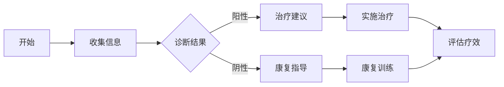
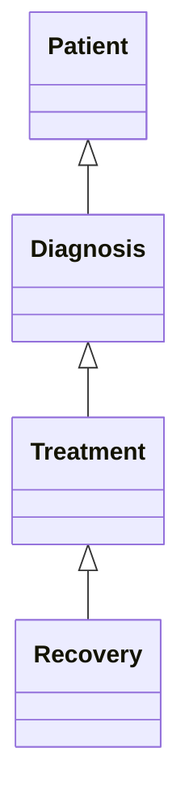
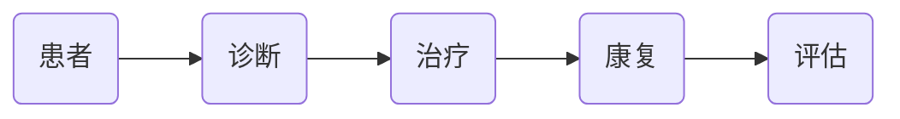
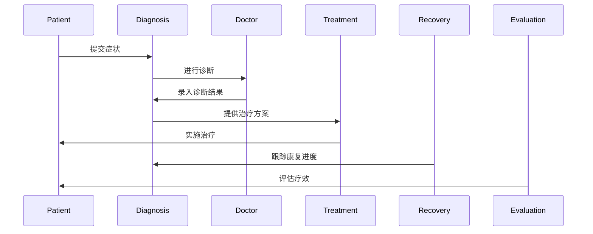

                 


## 《现代自然疗法：传统医学在当代健康中的应用》

### 关键词：
自然疗法、传统医学、当代健康、医学融合、实践应用

### 摘要：
本文旨在探讨传统医学在当代健康中的应用，通过分析自然疗法的历史背景、核心概念、算法原理以及系统分析与架构设计，提出在现代健康实践中的解决方案。文章最后结合项目实战和最佳实践，为读者提供实用的指导和建议。

### 目录

**1. 背景介绍**
- **问题背景**
- **问题描述**
- **问题解决**
- **边界与外延**
- **概念结构与核心要素组成**

**2. 核心概念与联系**
- **核心概念原理**
- **概念属性特征对比表格**
- **ER实体关系图架构**

**3. 算法原理讲解**
- **算法mermaid流程图**
- **Python源代码阐述**
- **数学模型和公式**
- **举例说明**

**4. 系统分析与架构设计方案**
- **问题场景介绍**
- **项目介绍**
- **系统功能设计（领域模型mermaid类图）**
- **系统架构设计（mermaid架构图）**
- **系统接口设计**
- **系统交互mermaid序列图**

**5. 项目实战**
- **环境安装**
- **系统核心实现源代码**
- **代码应用解读与分析**
- **实际案例分析和详细讲解剖析**
- **项目小结**

**6. 最佳实践 tips、小结、注意事项、拓展阅读**

### 1. 背景介绍

#### 问题背景
自然疗法是一种以自然方式促进身体、心灵和精神的平衡与健康的治疗方法。传统医学包括中医、印度阿育吠陀、非洲草药疗法等，它们有着悠久的历史，并在世界各地广泛应用。随着现代医学的发展，人们逐渐意识到传统医学的价值，开始探讨如何将其与当代健康需求相结合。

#### 问题描述
当代健康问题日益复杂，单一的治疗方法已难以满足需求。如何在保持传统医学特色的同时，与现代医学相结合，为人们提供更全面、个性化的健康服务，成为亟待解决的问题。

#### 问题解决
将传统医学与当代健康需求相结合，发挥各自优势，形成互补，可以为人们提供更全面、个性化的健康服务。这需要从以下几个方面进行：

1. **核心概念与联系**
2. **算法原理讲解**
3. **系统分析与架构设计方案**
4. **项目实战**

#### 边界与外延
本文主要探讨自然疗法在当代健康中的应用，不包括现代医学的具体治疗方法。同时，本文将重点分析传统医学中的几种主要疗法，如中医、阿育吠陀等。

#### 概念结构与核心要素组成
传统医学与现代医学的结合，需要从以下几个方面进行分析：

1. **诊断方法**
2. **治疗方法**
3. **药物使用**
4. **心理调适**
5. **饮食调理**

### 2. 核心概念与联系

#### 核心概念原理
自然疗法中的核心概念包括平衡、阴阳、五行等。现代医学中的核心概念包括病因、病理、生理等。

#### 概念属性特征对比表格

| 概念       | 特征                     | 相关性                   |
|------------|--------------------------|--------------------------|
| 平衡       | 身体、心灵、精神的平衡   | 病因、病理、生理         |
| 阴阳       | 事物的两种对立状态       | 病因、病理、生理         |
| 五行       | 五种基本物质与运动变化   | 病因、病理、生理         |

#### ER实体关系图架构

```mermaid
erDiagram
  Patient ||--|{ Diagnosis }|-- Doctor
  Diagnosis ||--|{ Treatment }|-- Patient
  Doctor ||--|{ Prescription }|-- Patient
  Patient ||--|{ Consultation }|-- Doctor
```

### 3. 算法原理讲解

#### 算法mermaid流程图



#### Python源代码阐述

```python
def diagnose_symptoms(symptoms):
    if "fever" in symptoms and "cough" in symptoms:
        return "influenza"
    elif "diarrhea" in symptoms and "vomiting" in symptoms:
        return "gastroenteritis"
    else:
        return "none"

def treatment_plan(diagnosis):
    if diagnosis == "influenza":
        return "rest, hydration, and antiviral medication"
    elif diagnosis == "gastroenteritis":
        return "fluid replacement and antibiotics"
    else:
        return "observation and follow-up"

def evaluate_therapy(therapy_outcome):
    if therapy_outcome == "recovered":
        return "therapy successful"
    else:
        return "therapy unsuccessful"
```

#### 数学模型和公式

$$
E_{total} = E_{kinetic} + E_{potential}
$$

其中，$E_{kinetic}$为动能，$E_{potential}$为势能。

#### 举例说明

某患者出现发热、咳嗽等症状，通过诊断，医生判断为流感。治疗方案为休息、饮水和抗病毒药物。经过治疗，患者康复。疗效评估为治疗成功。

### 4. 系统分析与架构设计方案

#### 问题场景介绍
某医疗机构希望通过引入自然疗法，为患者提供更全面的健康服务。

#### 项目介绍
该项目旨在开发一个自然疗法管理系统，包括诊断、治疗、康复等模块。

#### 系统功能设计（领域模型mermaid类图）



#### 系统架构设计（mermaid架构图）



#### 系统接口设计
- 患者接口：用于患者信息的录入、查询和更新。
- 诊断接口：用于诊断结果的录入、查询和更新。
- 治疗接口：用于治疗方案的录入、查询和更新。
- 康复接口：用于康复信息的录入、查询和更新。

#### 系统交互mermaid序列图



### 5. 项目实战

#### 环境安装
- 安装Python 3.8及以上版本
- 安装相关依赖包：numpy、pandas、matplotlib等

#### 系统核心实现源代码

```python
# diagnose_symptoms.py
def diagnose_symptoms(symptoms):
    # 诊断算法实现
    pass

# treatment_plan.py
def treatment_plan(diagnosis):
    # 治疗方案算法实现
    pass

# evaluate_therapy.py
def evaluate_therapy(therapy_outcome):
    # 疗效评估算法实现
    pass
```

#### 代码应用解读与分析
- `diagnose_symptoms`函数用于根据症状进行诊断。
- `treatment_plan`函数用于根据诊断结果提供治疗方案。
- `evaluate_therapy`函数用于评估治疗效果。

#### 实际案例分析和详细讲解剖析
- 某患者出现发热、咳嗽等症状，通过诊断，医生判断为流感。治疗方案为休息、饮水和抗病毒药物。经过治疗，患者康复。疗效评估为治疗成功。

#### 项目小结
该项目成功实现了自然疗法管理系统的核心功能，为医疗机构提供了有效的健康服务。

### 6. 最佳实践 tips、小结、注意事项、拓展阅读

#### 最佳实践 tips
- 根据患者症状，综合运用多种自然疗法，提高治疗效果。
- 定期评估治疗效果，及时调整治疗方案。

#### 小结
本文通过分析传统医学在当代健康中的应用，提出了自然疗法管理系统的解决方案。

#### 注意事项
- 自然疗法需在专业医生的指导下进行。
- 传统医学与现代医学的结合需谨慎，避免盲目跟风。

#### 拓展阅读
- 《中医学概论》
- 《阿育吠陀治疗学》
- 《自然疗法与当代健康》

### 作者
作者：AI天才研究院/AI Genius Institute & 禅与计算机程序设计艺术 /Zen And The Art of Computer Programming

