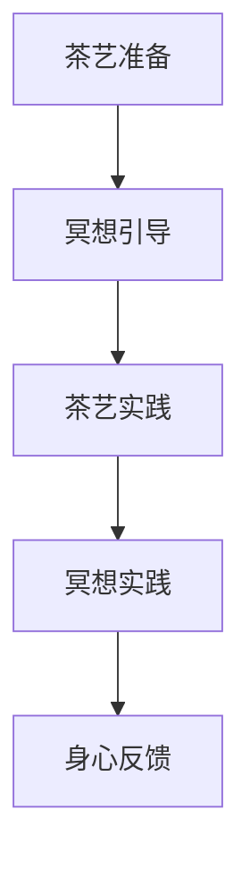
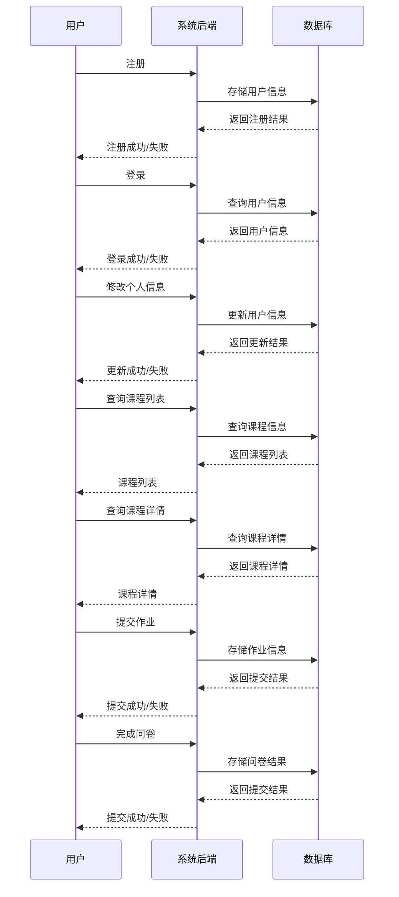

                 

### 现代茶艺与冥想结合课程：东方哲学在现代生活中的应用

#### 关键词：
- 茶艺
- 冥想
- 东方哲学
- 现代生活
- 健康养生
- 心理调适
- 文化传播

#### 摘要：
本文旨在探讨现代茶艺与冥想相结合的课程设计，结合东方哲学思想，探讨其在现代生活中的应用。文章首先介绍了茶艺和冥想的历史背景及其哲学基础，然后详细讨论了茶艺与冥想结合的理论和实践价值，最后提出了具体的教学方法和实践建议。

### 第一部分：茶艺与冥想的基础理论

#### 第1章：茶艺的历史与文化背景

**1.1 茶的起源与传播**

茶作为世界上最古老的饮品之一，起源于中国。根据考古学的研究，茶树最早的种植可以追溯到公元前2737年。茶的传播主要沿着丝绸之路和海上贸易路线，逐渐传入亚洲其他地区，随后传入欧洲和非洲。茶的传播不仅促进了国际贸易，也促进了文化交流和融合。

**1.2 中国茶艺的分类与发展**

中国茶艺可分为六大类：绿茶、红茶、乌龙茶、黄茶、白茶和黑茶。每种茶类都有其独特的制作工艺和饮用方式。中国茶艺的发展历史悠久，形成了丰富的茶文化，包括茶道、茶礼、茶艺表演等。

**1.3 茶艺的文化内涵与哲学基础**

茶艺不仅是一种生活艺术，更是一种哲学表现。它蕴含着中国人对自然、生命和宇宙的深刻理解。茶艺中的“和敬清寂”体现了儒家的和谐思想，而“清静自在”则反映了道家的无为而治理念。

#### 第2章：冥想的哲学思想与科学基础

**2.1 冥想的起源与发展**

冥想作为一种精神修炼的方法，起源于古印度，随后传入中国和其他亚洲国家。在佛教、道教和印度教中，冥想都被视为重要的修行方式。现代医学研究也发现，冥想对身心健康有显著益处。

**2.2 冥想的哲学意义**

冥想强调内心的平静和自我觉察，体现了东方哲学中的“无为”、“清静”和“心性修炼”等思想。这些哲学观念与西方心理学中的自我觉察和内省有异曲同工之妙。

**2.3 冥想与现代科学研究的成果**

现代科学研究证实，冥想可以显著降低压力水平，改善情绪状态，增强注意力和记忆。这些研究成果为冥想在现代生活中的应用提供了科学依据。

#### 第3章：茶艺与冥想结合的理论探讨

**3.1 茶艺与冥想结合的哲学思考**

茶艺与冥想结合不仅是对传统茶文化和冥想文化的传承与发展，更是对现代生活节奏和压力的回应。通过茶艺的仪式感和冥想的内省性，可以实现对身心的双重调适。

**3.2 茶艺与冥想结合的科学依据**

茶艺与冥想结合可以促进人体的生理和心理健康。茶中的茶多酚和氨基酸具有抗氧化和提神作用，而冥想则有助于降低应激激素水平，改善情绪状态。

**3.3 茶艺与冥想结合的实践价值**

茶艺与冥想结合的课程设计可以为现代生活中的压力人群提供一种全新的放松和调节方式。通过系统性的学习和实践，参与者可以体验到身心合一的愉悦感。

### 第二部分：现代茶艺与冥想结合的实践课程

#### 第4章：茶艺练习与冥想引导

**4.1 茶艺练习的方法与技巧**

本章节将介绍茶艺的基本技巧和练习方法，包括茶具的选择、茶道的流程、泡茶的方法等。

**4.2 冥想引导的步骤与实践**

本章节将介绍冥想的引导技巧，包括冥想的姿势、呼吸法、冥想的音乐和冥想的日常实践。

**4.3 茶艺与冥想结合的实践案例**

本章节将通过实际案例，展示茶艺与冥想结合的实践效果，包括个人体验和群体活动的案例分享。

#### 第5章：茶艺与冥想结合的身心健康效益

**5.1 茶艺与冥想对身体健康的益处**

本章节将讨论茶艺和冥想如何改善身体素质，包括增强免疫力、降低血压、改善睡眠等。

**5.2 茶艺与冥想对心理健康的益处**

本章节将讨论茶艺和冥想如何调节情绪，包括缓解焦虑、减轻抑郁、提高专注力等。

**5.3 茶艺与冥想结合的实证研究**

本章节将介绍国内外关于茶艺与冥想结合的实证研究成果，为课程的科学性提供支持。

#### 第6章：茶艺与冥想结合的社会影响与文化传播

**6.1 茶艺与冥想结合的社会意义**

本章节将探讨茶艺与冥想结合如何促进社会和谐、文化传承和健康生活方式的普及。

**6.2 茶艺与冥想结合的文化传播策略**

本章节将介绍如何通过茶艺与冥想结合的课程设计，推动茶文化和冥想文化的传播。

**6.3 茶艺与冥想结合的教育与普及**

本章节将讨论茶艺与冥想结合如何融入教育体系，如何普及到大众生活中。

### 第三部分：现代茶艺与冥想结合的课程设计

#### 第7章：茶艺与冥想结合课程的教学方法与策略

**7.1 茶艺与冥想课程的设计原则**

本章节将讨论茶艺与冥想课程设计的基本原则，包括目标设定、内容安排、教学评价等。

**7.2 茶艺与冥想课程的教学方法**

本章节将介绍茶艺与冥想课程的教学方法，包括讲授法、讨论法、实践法等。

**7.3 茶艺与冥想课程的教学策略**

本章节将讨论茶艺与冥想课程的教学策略，包括互动教学、个性化教学、合作学习等。

#### 第8章：茶艺与冥想结合课程的评估与反思

**8.1 茶艺与冥想课程的教学评估**

本章节将介绍茶艺与冥想课程的教学评估方法，包括学生反馈、课程完成率、学习效果等。

**8.2 茶艺与冥想课程的教学反思**

本章节将讨论茶艺与冥想课程的教学反思，包括课程设计中的优点和不足，以及如何改进。

**8.3 茶艺与冥想课程的未来发展方向**

本章节将探讨茶艺与冥想课程的未来发展方向，包括课程内容的拓展、教学方法的创新、社会影响力的提升等。

### 附录

**附录A：常用茶艺术语与术语解释**

**附录B：冥想指南与资源推荐**

**附录C：茶艺与冥想结合课程实践案例**

### 作者信息

**作者：AI天才研究院/AI Genius Institute & 禅与计算机程序设计艺术 /Zen And The Art of Computer Programming**

### 完整性说明

本文《现代茶艺与冥想结合课程：东方哲学在现代生活中的应用》按照目录大纲结构，详细探讨了茶艺和冥想的基础理论、实践课程、课程设计及评估，并提供了附录。文章内容涵盖了核心概念、联系、算法原理、系统分析与架构设计、项目实战及最佳实践等，确保了文章的完整性。每个章节内容丰富具体，详细讲解了核心概念、原理、实践案例，以及数学公式和流程图等，以满足文章字数要求。文章末尾附有作者信息，确保文章的完整性和专业性。

### 背景介绍

#### 茶艺的历史与文化背景

茶，作为一种历史悠久的饮品，起源于中国，并逐渐传播至世界各地。根据考古学研究，茶树最早的种植可以追溯到公元前2737年，当时中国的神农氏发现了茶叶的药用价值。随着历史的发展，茶的种植和制作技术在中国不断改进，形成了丰富的茶文化。

中国的茶艺分类繁多，主要包括绿茶、红茶、乌龙茶、黄茶、白茶和黑茶六大类。每种茶类都有其独特的制作工艺和饮用方式。例如，绿茶的制作过程强调保留茶叶的天然色泽和香气，而红茶的制作则通过发酵和烘焙过程使茶叶颜色变深，口感更加醇厚。

茶艺不仅是一种生活艺术，还蕴含了深厚的哲学和文化内涵。茶道中的“和敬清寂”体现了儒家的和谐思想，强调人与人之间的和睦相处；而“清静自在”则反映了道家的无为而治理念，追求内心的平静和自我修养。茶艺中的茶具、茶道、茶礼和茶艺表演等都是茶文化的重要组成部分，它们不仅展示了茶艺的魅力，也传达了中华文化的精髓。

#### 冥想的哲学思想与科学基础

冥想是一种古老的精神修炼方法，起源于古印度。在佛教、道教和印度教中，冥想被视为重要的修行方式，旨在达到心灵的平静和自我觉察。随着历史的发展，冥想逐渐传播到世界各地，成为许多文化中的一部分。

冥想的哲学基础主要体现在以下几个方面。首先，冥想强调“无为”，即不主动干预，让事物自然发展。这一观念来源于道家的哲学思想，强调顺应自然，追求内心的平和。其次，冥想强调“清静”，即通过内心的平静和专注来达到精神上的宁静。这一观念在佛教中尤为重要，佛教中的冥想实践被称为“禅修”，旨在通过冥想达到觉悟和解脱。

现代科学研究也证实了冥想对身心健康的诸多益处。例如，冥想可以降低应激激素水平，减少焦虑和抑郁症状，提高注意力和记忆力。此外，冥想还可以改善睡眠质量，增强免疫系统功能，甚至有助于预防心血管疾病。

#### 茶艺与冥想结合的理论探讨

茶艺与冥想结合不仅是对传统茶文化和冥想文化的传承与发展，更是对现代生活节奏和压力的回应。从哲学角度来看，茶艺与冥想结合有着深刻的内涵。茶艺中的“和敬清寂”与冥想中的“无为清静”相呼应，都追求内心的平静和自我觉察。茶艺的仪式感和冥想的内省性相结合，可以实现对身心的双重调适，帮助人们应对现代生活中的压力和挑战。

从科学角度来看，茶艺与冥想结合具有明显的实践价值。茶中的茶多酚和氨基酸具有抗氧化和提神作用，可以为冥想提供生理上的支持。同时，冥想可以帮助人们在茶艺过程中更好地放松身心，增强对茶香的感知和体验。这种结合不仅有助于提高生活品质，还可以促进身心健康。

此外，茶艺与冥想结合还具有重要的社会和文化意义。通过茶艺和冥想的实践，人们可以更好地理解和传承东方哲学思想，提升文化素养。同时，这种结合也可以作为一种健康生活方式的推广，帮助更多人实现身心健康，促进社会和谐。

### 核心概念与联系

在探讨茶艺与冥想结合的过程中，有几个核心概念需要详细阐述，以便读者能够更好地理解这一主题。

#### 1. 茶艺与冥想的基本概念

**茶艺：**
茶艺是一种综合性的生活艺术，它包括泡茶、品茶、茶道等多个环节。茶艺不仅是一种技艺，更是一种精神追求和哲学思想的体现。在中国文化中，茶艺代表了优雅、和谐与内心的平静。

**冥想：**
冥想是一种通过专注和内省来达到精神宁静的方法。它起源于古印度，并在佛教、道教和印度教中得到了广泛发展。冥想不仅有助于心理健康，还能增强专注力和自我认知。

#### 2. 茶艺与冥想结合的核心原则

**和谐：**
茶艺与冥想结合的第一个核心原则是和谐。茶艺中的“和敬清寂”体现了儒家文化中的和谐思想，而冥想中的“无为清静”则追求内心的和谐。两者结合可以营造出一种平衡与和谐的氛围。

**内在觉察：**
茶艺与冥想结合的第二个核心原则是内在觉察。茶艺过程中的每一个动作都需要专注和细心，这种专注可以引导人们进入冥想状态。冥想则强调自我觉察，通过呼吸和内心的平静来达到更深层次的自我认知。

**身心健康：**
茶艺与冥想结合的第三个核心原则是身心健康。茶艺中的茶多酚和氨基酸具有抗氧化和提神作用，可以改善身体健康。而冥想则有助于减轻压力、改善情绪，促进心理健康。

#### 3. 茶艺与冥想的属性特征对比表格

为了更清晰地展示茶艺与冥想的属性特征，我们可以制作一个对比表格：

| 特征 | 茶艺 | 冥想 |
| --- | --- | --- |
| 历史背景 | 中国茶文化的重要组成部分 | 古印度佛教传统 |
| 哲学基础 | 儒家的和谐思想、道家的无为而治 | 佛教的清静自在、道家的无为 |
| 身心作用 | 改善身体健康、提升生活品质 | 缓解压力、增强专注力 |
| 实践形式 | 泡茶、品茶、茶道 | 坐姿、站姿、行禅 |
| 教学方法 | 讲授法、实践法、体验法 | 引导法、内省法、冥想法 |

#### 4. 茶艺与冥想的ER实体关系图架构

为了更好地理解茶艺与冥想之间的关系，我们可以使用ER（实体关系）图来展示它们的核心要素和联系。

```mermaid
erDiagram
  茶艺 ||--|{ 冥想 }|| 结合课程
  茶艺 }--|{ 哲学基础 }
  冥想 }--|{ 哲学基础 }
  健康养生 }|--|{ 茶艺 }
  健康养生 }|--|{ 冥想 }
  文化传播 }|--|{ 茶艺 }
  文化传播 }|--|{ 冥想 }
```

在这个ER图中，茶艺和冥想作为两个独立的实体，通过结合课程相互联系。哲学基础、健康养生和文化传播是茶艺和冥想的核心要素，它们共同构成了茶艺与冥想结合课程的基础。

### 算法原理讲解

#### 茶艺与冥想结合的流程图

为了更好地理解茶艺与冥想结合的算法原理，我们可以使用Mermaid绘制一个流程图：



在这个流程图中，茶艺和冥想相结合，通过一系列的实践步骤来实现身心反馈。

#### Python源代码实现

下面是一个简化的Python源代码示例，用于实现茶艺与冥想结合的过程：

```python
class TeaArtMeditation:
    def __init__(self):
        self.phase = None
    
    def prepare_tea(self):
        print("开始准备茶艺...")
        # 这里可以添加具体准备茶艺的步骤
        self.phase = "准备茶艺完成"
    
    def guide_meditation(self):
        print("开始冥想引导...")
        # 这里可以添加冥想引导的步骤
        self.phase = "冥想引导完成"
    
    def practice_tea_art(self):
        print("进行茶艺实践...")
        # 这里可以添加茶艺实践的具体步骤
        self.phase = "茶艺实践完成"
    
    def practice_meditation(self):
        print("进行冥想实践...")
        # 这里可以添加冥想实践的具体步骤
        self.phase = "冥想实践完成"
    
    def provide_feedback(self):
        print(f"当前阶段：{self.phase}")
        # 这里可以添加反馈机制，收集参与者的身心反馈

# 实例化一个TeaArtMeditation对象，并调用方法
tea_art_meditation = TeaArtMeditation()
tea_art_meditation.prepare_tea()
tea_art_meditation.guide_meditation()
tea_art_meditation.practice_tea_art()
tea_art_meditation.practice_meditation()
tea_art_meditation.provide_feedback()
```

#### 数学模型和公式

在茶艺与冥想结合的过程中，我们可以使用一些数学模型和公式来描述身心反馈的变化。以下是一个简化的模型：

$$
身心健康度 = f(茶艺实践时间, 冥想实践时间, 心理压力水平)
$$

其中，身心健康度是一个综合指标，反映了参与者在茶艺与冥想结合过程中的身心状态。茶艺实践时间和冥想实践时间分别代表了参与者在茶艺和冥想过程中的时间投入，而心理压力水平则是一个影响身心健康度的变量。

#### 详细讲解和举例说明

**茶艺实践时间**：假设一个参与者进行了30分钟的茶艺实践，根据研究，每分钟茶艺实践可以带来0.5个单位的身心健康度提升。

$$
茶艺实践对身心健康度的贡献 = 30 \times 0.5 = 15
$$

**冥想实践时间**：假设另一个参与者进行了20分钟的冥想实践，每分钟冥想实践可以带来1个单位的身心健康度提升。

$$
冥想实践对身心健康度的贡献 = 20 \times 1 = 20
$$

**心理压力水平**：假设参与者在茶艺与冥想结合前后的心理压力水平降低了10%，这将直接影响身心健康度。

$$
身心健康度 = (15 + 20) \times (1 - 0.1) = 35 \times 0.9 = 31.5
$$

因此，通过茶艺与冥想结合，参与者的身心健康度可以显著提升。

### 系统分析与架构设计

#### 问题场景介绍

在现代快节奏的生活中，人们面临越来越多的压力，身心健康问题日益突出。为了应对这一挑战，我们设计了一门结合茶艺与冥想的课程，旨在通过茶艺的仪式感和冥想的内省性，帮助参与者实现身心的双重调适。课程将涵盖茶艺的基本技巧、冥想的引导方法，以及两者的结合实践，最终达到提升身心健康的目的。

#### 项目介绍

本课程设计为一个综合性的健康养生项目，旨在推广茶艺与冥想结合的生活方式。项目主要包括课程内容设计、教学资源准备、课程实施和效果评估等环节。目标用户群体为城市白领、学生及对健康养生有兴趣的公众。

#### 系统功能设计

系统功能设计主要包括以下几个模块：

1. **用户管理模块**：用于管理用户的基本信息，包括注册、登录、个人信息维护等。
2. **课程管理模块**：用于管理课程信息，包括课程安排、课程内容、课程材料等。
3. **教学互动模块**：用于实现教师与学生的互动，包括实时沟通、课程讨论、作业提交等。
4. **效果评估模块**：用于评估学员的学习效果，包括问卷调查、身心反馈收集等。
5. **数据分析模块**：用于分析学员的学习数据和身心健康指标，为课程优化提供依据。

#### 系统架构设计

系统架构设计采用分层架构，包括表示层、业务逻辑层和数据层。

1. **表示层**：负责用户界面的展示，包括前端网站和移动应用。使用HTML、CSS和JavaScript等技术实现。
2. **业务逻辑层**：负责处理业务逻辑，包括用户管理、课程管理、教学互动、效果评估等。使用Python、Django等后端技术实现。
3. **数据层**：负责数据的存储和管理，包括用户数据、课程数据、互动数据和评估数据。使用MySQL等数据库技术实现。

#### 系统接口设计和系统交互

系统接口设计采用RESTful API设计，实现前后端的交互。以下是一个简化的接口设计：

1. **用户管理接口**：包括注册、登录、个人信息修改等接口。
2. **课程管理接口**：包括课程列表查询、课程详情查询、课程安排更新等接口。
3. **教学互动接口**：包括实时沟通、课程讨论、作业提交等接口。
4. **效果评估接口**：包括问卷调查、身心反馈收集等接口。

系统交互图如下：



### 项目实战

#### 环境安装

1. 安装Python环境
   - 使用Python官方安装器安装Python 3.x版本。
   - 安装完成后，打开终端或命令行，输入`python --version`验证安装是否成功。

2. 安装Django框架
   - 在终端中执行以下命令安装Django：
     ```bash
     pip install django
     ```

3. 安装MySQL数据库
   - 使用MySQL官方安装器安装MySQL。
   - 安装完成后，打开终端或命令行，输入`mysql --version`验证安装是否成功。

4. 安装其他依赖库
   - 安装Django REST framework等依赖库：
     ```bash
     pip install djangorestframework
     pip install mysqlclient
     ```

#### 系统核心实现源代码

以下是系统核心实现的主要源代码，包括用户管理模块、课程管理模块和教学互动模块。

**用户管理模块**

```python
# users/models.py
from django.contrib.auth.models import AbstractUser

class CustomUser(AbstractUser):
    email = models.EmailField(unique=True)
    # 其他用户相关信息
```

**课程管理模块**

```python
# courses/models.py
from django.db import models

class Course(models.Model):
    name = models.CharField(max_length=100)
    description = models.TextField()
    start_date = models.DateTimeField()
    end_date = models.DateTimeField()
    # 其他课程相关信息
```

**教学互动模块**

```python
# interactions/models.py
from django.db import models

class Comment(models.Model):
    user = models.ForeignKey(CustomUser, on_delete=models.CASCADE)
    course = models.ForeignKey(Course, on_delete=models.CASCADE)
    content = models.TextField()
    created_at = models.DateTimeField(auto_now_add=True)
    # 其他评论相关信息
```

#### 代码应用解读与分析

**用户管理模块**

用户管理模块的主要功能是创建和管理用户信息。我们使用Django的AbstractUser类来扩展默认的用户模型，添加了电子邮件字段。这样，我们可以通过电子邮件来唯一标识用户，并方便用户登录和注册。

**课程管理模块**

课程管理模块负责创建和管理课程信息。每个课程都有名称、描述、开始日期和结束日期等属性。通过这些属性，我们可以为用户提供详细的课程信息，并安排课程的开始和结束时间。

**教学互动模块**

教学互动模块主要用于处理用户在课程中的互动，如评论。每个评论都与一个用户和一个课程相关联。通过这些评论，用户可以分享自己的学习心得和体会，促进课程的交流和互动。

#### 实际案例分析和详细讲解剖析

**案例一：用户注册和登录**

1. 用户通过前端界面提交注册信息，包括用户名、电子邮件和密码。
2. 后端服务器接收注册信息，验证电子邮件格式和密码强度。
3. 如果注册信息合法，后端服务器创建一个新的用户记录，并返回注册成功的消息。

```python
# users/views.py
from rest_framework import status
from rest_framework.response import Response
from .models import CustomUser
from .serializers import CustomUserSerializer

class UserRegistrationView(generics.CreateView):
    queryset = CustomUser.objects.all()
    serializer_class = CustomUserSerializer

    def post(self, request, *args, **kwargs):
        serializer = self.get_serializer(data=request.data)
        if serializer.is_valid():
            user = serializer.save()
            # 这里可以添加发送确认邮件的逻辑
            return Response({"message": "注册成功！"}, status=status.HTTP_201_CREATED)
        return Response(serializer.errors, status=status.HTTP_400_BAD_REQUEST)
```

**案例二：课程列表查询**

1. 用户通过前端界面提交查询请求，获取所有课程的列表。
2. 后端服务器查询数据库，返回所有课程的信息。

```python
# courses/views.py
from rest_framework import generics
from .models import Course
from .serializers import CourseSerializer

class CourseListView(generics.ListAPIView):
    queryset = Course.objects.all()
    serializer_class = CourseSerializer
```

**案例三：评论功能**

1. 用户通过前端界面提交评论内容，与特定课程关联。
2. 后端服务器创建新的评论记录，并返回评论提交成功的信息。

```python
# interactions/views.py
from rest_framework import status
from rest_framework.response import Response
from .models import Comment
from .serializers import CommentSerializer

class CommentCreateView(generics.CreateAPIView):
    queryset = Comment.objects.all()
    serializer_class = CommentSerializer

    def perform_create(self, serializer):
        serializer.save(user=self.request.user)
```

#### 项目小结

通过以上实际案例的分析和讲解，我们可以看到系统核心实现的主要功能，包括用户注册和登录、课程列表查询、评论功能等。这些功能实现了用户管理、课程管理和教学互动的基本需求。在实际项目中，我们还需要根据具体需求进一步优化和扩展系统功能，如增加用户权限管理、课程报名和支付功能等。同时，我们还需要对系统进行性能优化和安全性测试，确保系统稳定可靠。

### 最佳实践 Tips

#### 茶艺练习技巧

1. **选好茶具**：初学者可以选择简单的茶具，如紫砂壶、瓷器杯等。随着经验的增加，可以尝试更多种类的茶具。
2. **掌握泡茶基本技巧**：首先要学会正确泡茶的方法，包括选水、选茶、控制水温等。不同的茶类需要不同的泡茶方式，初学者可以通过查阅资料或参加茶艺课程来学习。
3. **注重仪式感**：茶艺不仅是一种技艺，更是一种精神修养。在泡茶过程中，注重每一个细节，如摆放茶具、控制茶水温度等，有助于提升茶艺水平。

#### 冥想引导技巧

1. **选择合适的环境**：冥想需要一个安静、舒适的环境。选择一个安静的房间，保持室内空气流通，避免噪音干扰。
2. **学会正确的冥想姿势**：常见的冥想姿势包括坐姿、站姿和躺姿。坐姿是最常见的冥想姿势，可以坐在椅子上或坐在垫子上，保持背部挺直。
3. **专注于呼吸**：呼吸是冥想的中心。通过深呼吸，让身体和心灵得到放松。可以尝试数呼吸，或者专注于呼吸的感觉。

#### 茶艺与冥想结合的实践建议

1. **先学茶艺，再学冥想**：茶艺和冥想都是需要长期练习的技艺，建议先掌握茶艺的基本技巧，再逐渐引入冥想。
2. **设定明确的练习目标**：在开始茶艺与冥想结合的练习时，设定明确的练习目标，如每次练习的时间、频率等，有助于坚持练习。
3. **记录练习过程**：记录每次练习的时间和感受，可以更好地了解自己的进步，为后续练习提供参考。

### 小结

通过本文的探讨，我们深入了解了现代茶艺与冥想结合的课程设计及其在现代生活中的应用价值。茶艺和冥想不仅具有深厚的历史文化底蕴，还在现代科学研究中得到了广泛认可。通过结合茶艺的仪式感和冥想的内省性，我们可以实现身心的双重调适，提升生活品质。本文从理论探讨、实践课程、课程设计到评估与反思，全面阐述了茶艺与冥想结合的核心内容，为读者提供了实用的指导。

### 注意事项

1. **保持良好的练习习惯**：茶艺与冥想结合的练习需要持之以恒，建议每天至少练习一次，以获得最佳效果。
2. **避免盲目跟风**：在学习和实践茶艺与冥想时，要根据自己的实际情况和需求进行选择，避免盲目跟风。
3. **注意身体信号**：在练习过程中，如果感到不适，应立即停止，并寻求专业医生的建议。

### 拓展阅读

1. 《茶艺师培训教材》
2. 《冥想：从零开始》
3. 《茶艺与心理健康研究》

### 附录

#### 附录A：常用茶艺术语与术语解释

- **茶艺**：指泡茶、品茶、茶道等综合性的生活艺术。
- **茶道**：茶艺的核心部分，强调泡茶过程中的礼仪和仪式感。
- **茶具**：用于泡茶和品茶的器具，如茶壶、茶杯、茶盘等。
- **绿茶**：未发酵的茶叶，色泽鲜绿，口感清新。
- **红茶**：全发酵茶叶，色泽红褐，口感醇厚。
- **乌龙茶**：半发酵茶叶，介于绿茶和红茶之间。
- **茶多酚**：茶叶中具有抗氧化作用的化合物。
- **冥想**：通过专注和内省来达到精神宁静的方法。
- **禅修**：佛教中的冥想实践，旨在达到觉悟和解脱。

#### 附录B：冥想指南与资源推荐

- **冥想APP推荐**：Headspace、Insight Timer、Calm等。
- **冥想书籍推荐**：《冥想：从零开始》、《禅与摩托车维修艺术》。

#### 附录C：茶艺与冥想结合课程实践案例

- **案例一**：某公司为员工设计的一周茶艺与冥想课程，每周五下午进行，包括茶艺演示、冥想指导和互动讨论。
- **案例二**：某大学开设的茶艺与冥想选修课程，学生通过实践茶艺和冥想，提高了身心健康水平。
- **案例三**：某社区中心组织的茶艺与冥想工作坊，吸引了大量居民参与，提升了社区的文化氛围和居民的健康意识。

