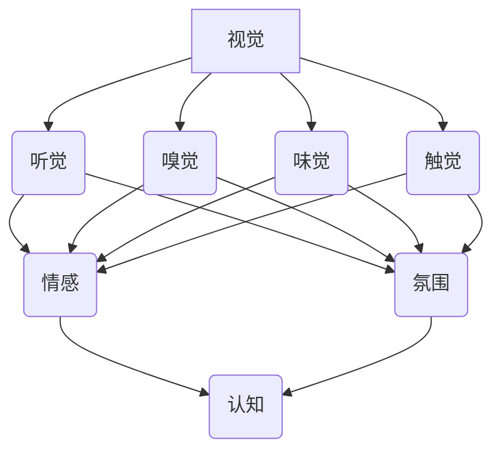

                 

### 1.1 问题的提出

在当今快节奏的生活中，人们对于精神文化的需求愈发强烈，而传统茶艺与香道作为东方文化的重要组成部分，不仅具有深厚的历史底蕴，更蕴含了丰富的哲理和养生价值。然而，随着现代社会的变迁，茶艺与香道在日常生活中逐渐被边缘化，如何让这一传统文化在现代社会中焕发新的活力，成为了我们不得不面对的问题。

茶艺，作为一种独特的东方文化表现形式，不仅仅是泡茶的技艺，更是包含了一种生活哲学。它强调的是“和敬清寂”的精神，即和谐、尊敬、清静和淡泊。香道，则是通过香料和燃香的过程，传达出对自然、对人生的深刻感悟。二者都有着强烈的感官体验和心灵享受，但如何在现代生活中将它们融合并提升人们的体验质量，是一个值得我们深入探讨的课题。

本篇文章旨在探讨茶艺与香道的现代融合，通过多感官设计的方式，打造一种全新的文化体验。具体而言，我们将从理论基础、感官设计、实践指导、融合创新、文化体验、多感官设计以及案例分析等多个方面，系统地分析如何实现这一目标。

### 1.2 茶艺与香道的历史文化背景

茶艺与香道都是源于我国古老的传统文化，各自有着悠久的历史和丰富的文化内涵。

#### 茶艺的历史背景

茶艺的历史可以追溯到公元前2737年，据《神农本草经》记载，神农氏尝百草，日中七回，得茶而解渴。这标志着茶作为药用植物的开始。随着时间的推移，茶逐渐成为了生活中不可或缺的一部分。唐朝（618-907年）是茶艺发展的重要时期，陆羽的《茶经》系统总结了茶叶的种植、加工和饮茶的方法，被后人誉为“茶圣”。宋代（960-1279年）茶艺达到了一个新的高峰，出现了“斗茶”和“点茶”等饮茶形式。明清时期，茶艺逐渐普及到民间，形成了具有地域特色的茶艺文化。

茶艺不仅仅是一种技艺，更是一种哲学。它所追求的是“和敬清寂”，即在冲泡、品饮茶水的过程中，达到内心的平和与宁静。这种精神与佛教的“禅宗”有着深刻的联系，强调的是内在的修行和精神的提升。

#### 香道的历史背景

香道的历史同样可以追溯到古代。最早的香道活动出现在商周时期，当时人们使用香料进行祭祀和礼仪。到了隋唐时期，香料贸易繁荣，香文化逐渐形成。宋代是香道发展的黄金时期，当时的人们不仅用香进行日常装饰，还将其作为一种文化雅趣。香道的种类也日益丰富，包括了檀香、沉香、丁香等多种香料。

香道不仅仅是一种嗅觉上的享受，更是一种心灵的修行。它通过香料和燃香的过程，让人沉浸在大自然的宁静和美好之中，达到身心的放松和平衡。香道所追求的是“和敬清寂”，与茶艺有着相似的精神内涵。

#### 茶艺与香道的现代融合趋势

在现代社会，随着生活节奏的加快和人们对于精神文化的需求增加，茶艺与香道开始呈现出融合的趋势。一方面，人们将茶艺和香道相结合，创造出新的文化体验形式；另一方面，茶艺和香道的元素也被广泛应用于各类文化活动和商业项目中。

例如，在一些高端的茶馆和 SPA 中心，茶艺与香道被作为重要的体验项目。顾客在品茶的同时，可以享受到香道的宁静和优雅。这种结合不仅提升了客户的体验质量，也为茶艺与香道带来了新的发展机遇。

此外，随着科技的进步，茶艺与香道的传播和推广也变得更加便捷。例如，通过互联网和社交媒体，茶艺与香道的爱好者可以轻松地分享心得和技巧，形成了一个庞大的社区。这种线上线下的互动，有助于茶艺与香道文化的传承和发展。

### 1.3 书的写作目的与结构安排

本书的写作目的是通过系统地分析茶艺与香道的融合，探讨如何利用现代设计理念提升人们的感官体验。具体来说，本书旨在解决以下几个问题：

1. **茶艺与香道的基本理论和历史发展**：了解茶艺和香道的历史渊源、理论基础以及各自的文化内涵，为后续的融合设计提供理论基础。
2. **感官设计**：探讨如何通过视觉、听觉、嗅觉、味觉和触觉来提升茶艺与香道的体验，为创造新的文化体验形式提供实践指导。
3. **融合创新**：分析茶艺与香道的融合点，提出创新的融合方式，为茶艺与香道的发展提供新的思路。
4. **文化体验**：深入探讨茶艺与香道的文化价值，如何通过文化体验提升人们的内心修养和幸福感。
5. **多感官设计**：探讨如何通过环境设计和服务设计，全面提升茶艺与香道的整体体验。

本书的结构安排如下：

1. **第一部分：背景介绍**：包括问题的提出、茶艺与香道的历史文化背景以及书的写作目的和结构安排。
2. **第二部分：理论基础**：介绍茶艺与香道的基本理论和历史，包括茶艺的起源、发展、茶的种类、泡茶技巧以及香道的起源、发展、香料的种类、燃香方法等。
3. **第三部分：感官设计**：讲解如何通过视觉、听觉、嗅觉、味觉和触觉来提升茶艺与香道的体验，包括茶席布置、茶具选择、音乐搭配、香品选择、茶品搭配等。
4. **第四部分：实践指导**：提供实际的茶艺与香道体验活动指导，包括茶会策划、香席布置、茶艺表演、香道表演等。
5. **第五部分：融合创新**：探讨茶艺与香道的融合创新，如茶香融合品鉴、茶艺香道表演、茶席与香道的融合设计等。
6. **第六部分：文化体验**：介绍茶艺与香道的文化体验，包括茶道精神、香道哲学、茶艺与香道的修行、茶艺与香道与宗教文化的关系等。
7. **第七部分：多感官设计**：深入探讨如何通过多感官设计来提升茶艺与香道的整体体验，包括环境设计、服务设计等。
8. **第八部分：案例分析**：提供国内外成功的茶艺与香道体验案例，包括茶室设计、茶道表演、香道表演等。
9. **第九部分：未来展望**：展望茶艺与香道的发展趋势，包括技术进步、市场需求、文化传承等。

通过本书的详细分析，我们希望读者能够对茶艺与香道的现代融合有一个全面深入的了解，从而在实际生活中创造出更加丰富多彩的文化体验。## 第二部分：理论基础

### 2.1 茶艺基本理论

#### 2.1.1 茶艺的起源与发展

茶艺，即泡茶和品茶的艺术，起源于中国，有着几千年的历史。茶艺的发展经历了几个重要阶段，从最初的药用阶段，到日常生活的必需品，再到如今的休闲文化。

据《神农本草经》记载，神农氏在尝百草的过程中发现了茶叶，并认为茶叶具有解毒、养生等功效。随着时间的推移，茶艺逐渐从药用转向日常饮用，成为了人们生活中不可或缺的一部分。

唐朝（618-907年）是茶艺发展的重要时期。当时，陆羽所著的《茶经》系统总结了茶叶的种植、加工和饮茶的方法，对茶艺的发展起到了重要的推动作用。书中提出了“茶道”的概念，强调在泡茶、品茶的过程中，要追求内心的平和与宁静。

宋代（960-1279年）是茶艺的另一个高峰时期。当时的茶艺形式多样，出现了“斗茶”和“点茶”等独特的饮茶方式。斗茶是一种比赛茶艺技艺的活动，而点茶则是一种以点茶盏的方式品茶的仪式。这些活动不仅丰富了茶艺的形式，也提升了茶艺的文化内涵。

明清时期，茶艺逐渐普及到民间，形成了具有地域特色的茶艺文化。例如，福建的乌龙茶、杭州的龙井茶、广东的普洱茶等，都有着独特的泡茶和品茶方法。

#### 2.1.2 茶的种类与特点

茶叶种类繁多，根据制作工艺和茶叶特性，主要可以分为六大类：绿茶、红茶、乌龙茶、白茶、黄茶和黑茶。

**绿茶**：绿茶是未经发酵的茶叶，保留了茶叶的原始色泽和口感。常见的绿茶有龙井茶、碧螺春等。绿茶具有清火、提神等功效。

**红茶**：红茶是完全发酵的茶叶，颜色红亮，味道浓郁。常见的红茶有祁门红茶、正山小种等。红茶具有暖胃、养血等功效。

**乌龙茶**：乌龙茶是半发酵茶，介于绿茶和红茶之间，口感独特。常见的乌龙茶有大红袍、铁观音等。乌龙茶具有减肥、降脂等功效。

**白茶**：白茶是轻微发酵的茶叶，以白毫明显为特点。常见的白茶有白毫银针、白牡丹等。白茶具有清热解毒、抗氧化等功效。

**黄茶**：黄茶是微发酵茶，色泽黄亮，口感鲜爽。常见的黄茶有君山银针、黄山毛峰等。黄茶具有养胃、润肺等功效。

**黑茶**：黑茶是完全发酵的茶叶，茶汤呈红色。常见的黑茶有普洱茶、六堡茶等。黑茶具有降脂、减肥等功效。

#### 2.1.3 泡茶技巧与茶具选择

泡茶是一门艺术，需要掌握一定的技巧。以下是几种常见的泡茶方法：

**绿茶泡茶技巧**：
1. **选水**：绿茶适合用纯净水或山泉水泡制。
2. **选茶具**：绿茶适合用透明的玻璃杯或白瓷杯，以便观赏茶叶在水中舞动的美丽姿态。
3. **泡茶时间**：绿茶的泡茶时间一般在1-2分钟之间，不宜过长，以免茶叶变黄、味道变苦。

**红茶泡茶技巧**：
1. **选水**：红茶适合用煮沸的水泡制。
2. **选茶具**：红茶适合用紫砂壶或白瓷杯，以便更好地体现红茶的香气和滋味。
3. **泡茶时间**：红茶的泡茶时间一般在3-5分钟之间，可根据个人口味调整。

**乌龙茶泡茶技巧**：
1. **选水**：乌龙茶适合用纯净水和山泉水泡制。
2. **选茶具**：乌龙茶适合用紫砂壶或瓷器杯，以便更好地感受茶香。
3. **泡茶时间**：乌龙茶的泡茶时间一般在2-3分钟之间，可多次冲泡。

茶具的选择对茶艺的体验有着重要的影响。常见的茶具有茶壶、茶杯、茶盘、茶碗等。不同的茶具适合不同的茶类，例如绿茶适合用透明的玻璃杯，而红茶则适合用紫砂壶。

#### 2.2 香道基本理论

#### 2.2.1 香道的起源与发展

香道，起源于我国古代，主要分为篆香、线香、片香等类型。香道不仅是一种生活艺术，更是一种修行方式，通过燃香的过程，达到身心平静、内心清净的境界。

**香道的起源**：
香道的起源可以追溯到商周时期，当时人们开始使用香料进行祭祀和礼仪活动。随着香料贸易的繁荣，香文化逐渐形成。

**香道的发展**：
隋唐时期，香道开始成为人们日常生活中的一部分。宋代是香道发展的黄金时期，当时的人们不仅用香进行日常装饰，还将其作为一种文化雅趣。宋代的香道形式多样，包括篆香、线香、片香等。

明代，随着瓷器的发展，香具的制作更加精致，香道的艺术性进一步提升。清代，香道逐渐普及到民间，形成了具有地域特色的香道文化。

**香道的分类**：
1. **篆香**：篆香是一种将香料压制成特定的图案或文字，然后点燃的香道形式。篆香具有独特的造型和香气，常用于宗教仪式和日常熏香。
2. **线香**：线香是一种将香料均匀地缠绕在竹签上，然后点燃的香道形式。线香燃烧时间长，香气浓郁，常用于家居装饰和日常熏香。
3. **片香**：片香是一种将香料压制成长方形或正方形的薄片，然后点燃的香道形式。片香燃烧迅速，香气独特，常用于宗教仪式和特殊场合。

#### 2.2.2 香料的种类与特点

香料是香道的核心元素，种类繁多，各具特点。以下是几种常见的香料：

**檀香**：檀香是一种芳香醇厚的木材，具有镇定安神、舒缓疲劳的功效。
**沉香**：沉香是一种香气独特、珍贵的香料，具有镇静、缓解压力等功效。
**丁香**：丁香是一种具有强烈芳香气味的香料，具有暖胃、祛痰等功效。
**龙涎香**：龙涎香是一种来自海豚的排泄物，具有独特的香气，被认为是香道中的极品。

#### 2.2.3 燃香方法与香具选择

燃香是香道的重要环节，不同的燃香方法会产生不同的香气体验。以下是几种常见的燃香方法：

**篆香**：
1. **选香粉**：选择优质的香粉，确保香气纯正。
2. **调香粉**：将香粉与水调和，使其成为可塑的泥状。
3. **印香篆**：用香篆印出特定的图案或文字，确保形状整齐。
4. **点燃香篆**：用火点燃香篆，让其自然燃烧。

**线香**：
1. **选线香**：选择合适的线香，确保香气浓郁。
2. **插香针**：将香针插入线香的一端，使其直立。
3. **点燃香针**：用火点燃香针，让其自然燃烧。

**片香**：
1. **选片香**：选择合适的片香，确保香气浓郁。
2. **放置片香**：将片香放置在香炉中，确保其稳定。
3. **点燃片香**：用火点燃片香，让其自然燃烧。

香具是香道的重要组成部分，常见的香具有香炉、香盘、香座等。香炉是燃香的主要器具，材质多样，如陶瓷、铜、铁等。香盘和香座则用于放置香炉和香品，使燃香过程更加美观和稳定。

### 2.3 茶艺与香道的融合点

茶艺与香道虽然源于不同的文化背景，但它们在精神和感官体验上有许多共同点。以下是一些茶艺与香道的融合点：

**视觉融合**：茶艺的茶席和香道的香席可以通过统一的视觉设计，如选择类似的色调和装饰元素，来增强整体的和谐感。

**听觉融合**：在茶艺和香道的体验过程中，可以搭配相应的音乐，如古典音乐、禅乐等，以增强感官的共鸣。

**嗅觉融合**：通过在茶艺中添加特定的香料或使用与茶品相配的香道香料，可以创造出独特的茶香和香气体验。

**味觉融合**：茶艺和香道都可以通过茶品和香料的搭配，创造出丰富的味觉体验。例如，在茶会上搭配特定的香道香料，以提升茶的口感。

**触觉融合**：茶具和香具的选择和使用，可以给人们带来独特的触觉体验。例如，使用具有温润触感的瓷器茶具和檀香木香具，可以增强整体的体验感。

通过这些融合点，茶艺与香道可以在现代生活中实现更深层次的融合，为人们带来全新的文化体验。

### 2.4 茶艺与香道的多感官设计理念

茶艺与香道的融合，不仅需要理论上的支持，更需要通过多感官设计来提升整体体验。多感官设计理念认为，通过视觉、听觉、嗅觉、味觉和触觉的共同作用，可以创造出更加丰富和深刻的文化体验。

**视觉设计**：茶艺与香道的视觉设计主要包括茶席和香席的布置。茶席的布置应注重简洁和和谐，以白色和原木色为主色调，搭配适量的装饰物，如茶具、花瓶等。香席的布置则应注重香气的扩散和视觉的层次感，通过香炉、香盘和香座等器具的巧妙摆放，营造出宁静和优雅的氛围。

**听觉设计**：在茶艺和香道的体验过程中，音乐的选择至关重要。古典音乐、禅乐和自然声音等都可以作为背景音乐，以增强体验的沉浸感。音乐的选择应与茶艺和香道的氛围相协调，如在茶会上播放轻柔的古筝音乐，或在香道上播放宁静的雨声。

**嗅觉设计**：茶艺和香道的嗅觉设计主要通过香品和茶品的搭配来实现。茶艺中可以添加特定的香料，如茉莉花、桂花等，以提升茶的香气。香道中则可以通过选用不同的香料，创造出不同的香气体验，如檀香、沉香等。嗅觉设计应注重香气的层次感和持续性，以保持整个体验过程中的香气稳定。

**味觉设计**：茶艺和香道的味觉设计主要通过茶品和香料的搭配来实现。茶品的搭配应考虑茶叶的种类和特性，如绿茶、红茶、乌龙茶等。香料的搭配则应根据个人的口味和需求进行调整，如檀香、丁香、龙涎香等。味觉设计应注重茶香和香气之间的平衡，以创造出独特的味觉体验。

**触觉设计**：茶艺和香道的触觉设计主要包括茶具和香具的选择和使用。茶具的选择应注重材质和触感的舒适度，如瓷器、紫砂等。香具的选择则应注重香气的扩散和触感的温润度，如香炉、香盘等。触觉设计应注重茶具和香具与手部的接触，以增强体验的真实感和亲密感。

通过多感官设计，茶艺与香道可以在现代生活中实现更深层次的融合，为人们带来全新的文化体验。这不仅是对传统文化的传承和发扬，更是对现代人精神文化需求的满足。

### 2.5 茶艺与香道的融合案例分析

茶艺与香道的融合不仅停留在理论层面，更在实际体验中得到了广泛应用。以下通过几个具体案例，分析茶艺与香道如何在实际操作中实现融合，并创造出独特的文化体验。

**案例一：高端茶艺馆**

某高端茶艺馆将茶艺与香道巧妙结合，打造出独特的文化体验。茶艺馆的茶席布置简洁而优雅，以原木色和白色为主色调，搭配茶具和香具，营造出宁静的氛围。在茶艺表演过程中，服务员会点燃香炉，选用檀香或沉香，使其香气慢慢弥漫在整个茶室中。背景音乐选择轻柔的古筝曲，与茶香相得益彰。顾客在品茶的同时，可以享受到香气的熏陶，进一步提升了整体体验感。

**案例二：茶艺SPA中心**

某茶艺SPA中心将茶艺与香道的元素融入到SPA服务中，为顾客提供独特的放松体验。在SPA过程中，服务员会在顾客的按摩床上放置一块香席，点燃线香，让顾客在享受按摩的同时，呼吸到清新的香气。此外，SPA中心还会提供茶点，顾客可以在按摩结束后，品鉴各类茶叶，感受茶香与香气的双重享受。这种结合不仅提升了SPA的服务质量，也为顾客带来了全新的文化体验。

**案例三：茶香融合品鉴活动**

某文化活动中心定期举办茶香融合品鉴活动，邀请茶艺师和香道师共同参与。活动分为几个环节，首先是茶艺表演，茶艺师将精心准备的茶叶冲泡成茶水，然后与香道师合作，选用特定的香料进行熏香。在品茶过程中，顾客可以闻到茶香和香气的混合，感受到不同的香气层次。随后，香道师会现场演示篆香和线香的制作过程，并讲解香料的选择和搭配技巧。这种活动不仅提升了顾客的参与感，也增加了对茶艺与香道文化的了解。

**案例四：茶艺与香道表演**

某文化交流中心定期举办茶艺与香道表演，邀请专业茶艺师和香道师现场表演。表演分为几个部分，首先是茶艺表演，茶艺师展示各种泡茶技巧和茶具的使用方法。接着是香道表演，香道师展示篆香、线香和片香的制作和燃香技巧。最后是茶香融合表演，茶艺师和香道师合作，将茶艺和香道巧妙结合，为观众带来一场视觉和嗅觉的盛宴。这种表演不仅展示了茶艺与香道的精湛技艺，也为观众提供了独特的文化体验。

通过这些案例，可以看出茶艺与香道的融合不仅在形式上多样，而且在实际操作中取得了良好的效果。这种融合不仅提升了茶艺与香道的体验质量，也为传统文化在现代社会的传承和发扬提供了新的思路。

### 2.6 茶艺与香道的融合设计原则与技巧

茶艺与香道的融合设计旨在通过理论与实践的结合，创造出一种独特的文化体验，使人们在日常生活中能够感受到东方文化的深邃与美好。以下是一些融合设计的原则与技巧：

**1. 视觉融合原则**

视觉融合是茶艺与香道融合设计中的关键环节。在视觉设计上，应注重简洁与和谐，通过统一的色调和装饰元素来增强整体的视觉效果。具体技巧包括：
- **选择相似色调**：茶席和香席的主色调应尽量保持一致，如白色、原木色等自然色调，以营造出宁静、优雅的氛围。
- **装饰元素**：在茶席和香席上可以添加类似的装饰元素，如茶具、花瓶、香炉等，使其在视觉上形成统一感。
- **布局设计**：茶席和香席的布局应注重对称与层次感，通过合理的摆放使整个空间更加美观和谐。

**2. 听觉融合原则**

听觉融合是提升茶艺与香道体验的重要手段。通过音乐的选择和搭配，可以营造出特定的氛围，使人在听觉上感受到茶艺与香道的独特魅力。具体技巧包括：
- **选择合适的音乐**：在茶艺和香道体验过程中，应选择古典音乐、禅乐等具有宁静氛围的音乐，避免过于喧闹的背景音乐。
- **音乐搭配**：不同环节可以搭配不同的音乐，如茶艺表演时可以选择古筝音乐，香道表演时可以选择箫音，使整个体验更加丰富和立体。
- **音乐控制**：音乐的声音应适中，避免过于刺耳或干扰到茶艺与香道的操作和体验。

**3. 嗅觉融合原则**

嗅觉融合是茶艺与香道体验的核心之一。通过茶香和香气的搭配，可以创造出独特的感官体验。具体技巧包括：
- **茶香选择**：根据不同的茶品选择相应的茶香，如绿茶可以选择清新的茉莉花，红茶可以选择浓郁的檀香。
- **香气搭配**：在茶艺过程中，可以适时添加香气，使茶香和香气相互融合，创造出层次丰富的香气体验。
- **香气控制**：香气的浓度和持续性应适度，避免过于浓烈或持续时间过长，影响茶艺的体验。

**4. 味觉融合原则**

味觉融合是通过茶品和香料的搭配，提升整体味觉体验。具体技巧包括：
- **茶品搭配**：根据不同的茶品特点，选择合适的茶品进行搭配，如绿茶适合搭配清新的水果茶，红茶适合搭配浓郁的花果茶。
- **香料搭配**：在香道中，可以选用与茶品相匹配的香料，如檀香适合搭配红茶，沉香适合搭配绿茶，以提升整体的味觉体验。
- **味觉控制**：茶品和香料的搭配应适度，避免过度调味，影响茶品的原味。

**5. 触觉融合原则**

触觉融合是通过茶具和香具的选择和使用，提升整体的触觉体验。具体技巧包括：
- **茶具选择**：选用质地优良、触感舒适的茶具，如瓷器、紫砂等，使人在品茶时能够感受到茶具的温润和手感。
- **香具选择**：选用具有温润触感的香具，如檀香木香炉、瓷器香盘等，使人在燃香时能够感受到香具的舒适和质感。
- **触觉控制**：在茶艺与香道的体验过程中，应注重茶具和香具的清洁和保养，保持其良好的触感，以提升整体的体验质量。

通过以上融合设计原则与技巧，茶艺与香道可以在现代生活中实现更深层次的融合，为人们带来全新的文化体验。

### 2.7 茶艺与香道的融合设计实践

茶艺与香道的融合设计不仅是一种理念，更需要通过具体的实践来验证其效果。以下将介绍茶艺与香道融合设计的具体实践过程，包括茶会策划、香席布置、茶艺表演和香道表演等。

#### 茶会策划

茶会策划是茶艺与香道融合设计的重要环节。首先，需要确定茶会的主题和形式，如茶艺品鉴、香道体验或茶香融合品鉴等。接下来，根据主题准备相应的茶品和香品，确保茶品和香品的搭配能够提升整体体验。

**策划步骤**：
1. **确定主题**：根据目标受众和活动目的，确定茶会的主题，如“古风茶艺与香道品鉴”、“茶香融合体验”等。
2. **准备茶品和香品**：选择与主题相匹配的茶品和香品，如绿茶、红茶、檀香、沉香等。确保茶品和香品的质量，以提升体验质量。
3. **设计茶会流程**：根据主题和茶品、香品的特性，设计茶会的流程，包括茶艺表演、香道表演、品茶品香环节等。

#### 香席布置

香席布置是茶艺与香道融合设计中的重要一环。通过合理的布置，可以营造出宁静、优雅的氛围，使人在视觉和嗅觉上都能感受到茶艺与香道的魅力。

**布置步骤**：
1. **选择场地**：选择适合布置香席的场地，如茶室、SPA中心等。场地应保持干净、整洁，并确保有足够的空间进行布置。
2. **设计布局**：根据场地的大小和形状，设计香席的布局。通常，香席应放置在空间的中心位置，周围可以摆放茶具、花瓶等装饰物。
3. **准备香具**：根据主题和香品的特性，选择合适的香具，如香炉、香盘、香座等。确保香具的材质和造型与香品相匹配。
4. **点燃香品**：在布置过程中，适时点燃香品，使其香气慢慢弥漫在整个空间中。注意控制香气的浓度，避免过于浓烈。

#### 茶艺表演

茶艺表演是茶会的重要组成部分，通过展示泡茶和品茶的技艺，让观众了解茶艺的魅力。在茶艺与香道融合的表演中，茶艺师应注重与香道师的配合，使整个表演更加协调和精彩。

**表演步骤**：
1. **准备茶具**：根据表演的茶品，准备相应的茶具，如茶壶、茶杯、茶盘等。确保茶具的清洁和整齐。
2. **泡茶演示**：茶艺师进行泡茶演示，展示泡茶的技巧和流程。在泡茶过程中，可以适时加入香道的元素，如点燃香品、展示香具等。
3. **品茶指导**：茶艺师向观众讲解如何品茶，包括观察茶汤的颜色、嗅闻茶香、品味茶汤的口感等。
4. **互动环节**：在表演过程中，可以邀请观众参与，如亲自泡茶、品茶等，增加互动性和体验感。

#### 香道表演

香道表演是香席布置的核心环节，通过展示燃香和品香的技艺，让观众感受到香道的魅力。在茶艺与香道融合的表演中，香道师应注重与茶艺师的配合，使整个表演更加完整和精彩。

**表演步骤**：
1. **准备香具**：根据表演的香品，准备相应的香具，如香炉、香盘、香座等。确保香具的清洁和整齐。
2. **燃香演示**：香道师进行燃香演示，展示燃香的技巧和流程。可以选择篆香、线香或片香等不同形式的香品，以展示香道的多样性和技巧。
3. **品香指导**：香道师向观众讲解如何品香，包括观察香灰的颜色、嗅闻香气的变化、品味香气的层次等。
4. **互动环节**：在表演过程中，可以邀请观众参与，如亲自燃香、品香等，增加互动性和体验感。

通过以上茶艺与香道的融合设计实践，可以在实际操作中体验到茶艺与香道的独特魅力，进一步提升茶艺与香道的体验质量。

### 2.8 茶艺与香道的文化内涵与哲学思想

茶艺与香道作为东方文化的重要组成部分，蕴含着深厚的文化内涵和哲学思想。理解这些文化内涵和哲学思想，有助于更好地进行茶艺与香道的融合设计，提升文化体验的质量。

#### 茶艺的文化内涵与哲学思想

茶艺不仅仅是一种泡茶和品茶的技艺，更是一种生活哲学。它所强调的“和敬清寂”精神，体现在茶艺的各个环节中。

1. **和**：茶艺追求的是和谐，包括人与自然、人与人之间的和谐。在泡茶和品茶的过程中，要注重与自然环境的和谐共处，尊重茶叶的原始味道，避免过度加工。
2. **敬**：茶艺强调尊敬，包括对茶叶的尊敬、对客人的尊敬。在泡茶时，要注重礼仪，表现出对茶艺的敬畏之心。
3. **清**：茶艺追求的是清净，即在泡茶和品茶的过程中，要排除杂念，保持内心的纯净与宁静。这种清净不仅体现在物质层面，更体现在精神层面。
4. **寂**：茶艺强调的是淡泊和宁静，即通过泡茶和品茶，达到内心的平和与宁静。在忙碌的生活中，茶艺提供了一个安静的角落，让人们可以暂时放下世俗的纷扰，享受内心的宁静。

#### 香道的文化内涵与哲学思想

香道同样是一种深具哲学内涵的文化活动。它通过燃香的过程，传达出对自然、对人生的深刻感悟。

1. **自然**：香道强调与自然的和谐共处。在选材和制作过程中，注重天然、有机的香料，避免过度的人工加工。燃香时，通过香料与火焰的互动，感受到自然的美好和力量。
2. **心性**：香道是一种心灵修行的方式。通过燃香的过程，人们可以静心、净化心灵，达到内心的平静与宁静。香道强调的是心性的修养，通过对外在世界的感悟，回归内心的真实。
3. **人生**：香道传达出对人生的深刻理解。在燃香的过程中，人们可以感受到生命的短暂和珍贵，从而更加珍惜当下，珍惜与他人的每一次相遇。

#### 茶艺与香道的哲学思想融合

茶艺与香道的融合，不仅仅是两种技艺的简单叠加，更是它们哲学思想的深度融合。这种融合体现了东方文化中追求和谐、自然、内心的哲学理念。

1. **和谐**：茶艺与香道的融合，强调人与自然、人与人之间的和谐。通过茶艺的泡茶和品茶，以及香道的燃香和品香，人们可以在繁忙的生活中找到一片宁静的天地，达到身心的和谐。
2. **自然**：茶艺与香道的融合，强调对自然的尊重和回归。在茶艺中，通过自然茶叶的泡制，感受到自然的美好；在香道中，通过天然香料的燃香，感受到自然的气息。
3. **内心**：茶艺与香道的融合，强调内心的修养和心灵的平静。在茶艺中，通过泡茶和品茶，达到内心的宁静；在香道中，通过燃香和品香，达到心灵的净化。

通过茶艺与香道的融合，人们可以在繁忙的现代生活中，找到一种平衡和宁静，体验东方文化的深邃和美好。

### 2.9 茶艺与香道的修行方式与宗教文化的关系

茶艺与香道不仅是一种技艺和文化，更是一种修行方式。通过茶艺与香道的修行，人们可以达到身心的平衡和心灵的净化。同时，茶艺与香道与宗教文化有着深厚的联系，这种联系不仅丰富了茶艺与香道的内涵，也为修行者提供了深刻的哲学思考。

#### 茶艺的修行方式

茶艺作为一种修行方式，强调的是内心的平和与宁静。以下是几种常见的茶艺修行方式：

1. **禅茶一味**：禅茶一味是茶艺修行的一种重要方式。它强调通过泡茶、品茶的过程，达到内心的宁静和觉悟。在禅茶一味中，泡茶不仅仅是技艺，更是一种心灵的修行。通过专注地泡茶，修行者可以排除杂念，达到内心的平静。
2. **茶禅修行**：茶禅修行是佛教修行的一种方式，通过品茶来修行。佛教强调的是心灵的清净和觉悟，而茶艺通过泡茶和品茶的过程，可以帮助修行者达到这种状态。在茶禅修行中，修行者会通过品茶来观察自己的内心，了解自己的需求和欲望，从而更好地控制自己的情绪。
3. **茶道修行**：茶道修行是茶艺修行的一种方式，它强调的是“和敬清寂”的精神。在茶道修行中，修行者通过泡茶、品茶的过程，培养自己的礼仪、修养和内心的宁静。

#### 香道的修行方式

香道同样是一种修行方式，通过燃香的过程，修行者可以达到身心的平衡和心灵的净化。以下是几种常见的香道修行方式：

1. **禅香修行**：禅香修行是佛教修行的一种方式，通过燃香来修行。佛教强调的是心灵的清净和觉悟，而香道通过燃香的过程，可以帮助修行者达到这种状态。在禅香修行中，修行者会通过燃香来观察自己的内心，了解自己的需求和欲望，从而更好地控制自己的情绪。
2. **香道修行**：香道修行是香艺修行的一种方式，它强调的是对自然、对人生的深刻理解。在香道修行中，修行者通过燃香、品香的过程，培养自己的感悟力、修养和内心的宁静。
3. **气香修行**：气香修行是一种结合中医理论的香道修行方式。它强调通过燃香来调节身体的气息，达到身体的平衡和健康。在气香修行中，修行者会根据不同的香品，选择合适的燃香时间和方式，以达到最佳的养生效果。

#### 茶艺与香道与宗教文化的关系

茶艺与香道与宗教文化有着深厚的联系，这种联系不仅丰富了茶艺与香道的内涵，也为修行者提供了深刻的哲学思考。

1. **佛教文化**：佛教文化对茶艺与香道有着重要的影响。茶艺中的禅茶一味、茶禅修行等，都受到佛教思想的启发。香道中的禅香修行，也是佛教修行的一种方式。佛教强调的是内心的清净和觉悟，而茶艺与香道通过具体的修行方式，帮助修行者达到这种状态。
2. **道教文化**：道教文化也对茶艺与香道有着重要的影响。道教强调的是自然、内心的平和和修炼。茶艺中的茶道修行，强调的是“和敬清寂”的精神，这与道教的自然理念相契合。香道中的气香修行，则强调通过燃香来调节身体的气息，达到身体的平衡和健康，这也是道教养生理念的一种体现。
3. **儒教文化**：儒教文化对茶艺与香道的影响主要体现在礼仪和修养上。茶艺中的礼仪，强调的是对客人的尊敬和对茶艺的敬畏，这与儒教的礼仪观念相契合。香道中的修养，强调的是对自然的尊重和对人生的深刻理解，这也与儒教的思想相契合。

通过茶艺与香道的修行方式，以及它们与宗教文化的联系，我们可以更好地理解茶艺与香道的内涵，从而在实际生活中更好地实践和体验。

### 2.10 多感官设计在茶艺与香道中的应用

多感官设计在茶艺与香道的应用中起着至关重要的作用，通过视觉、听觉、嗅觉、味觉和触觉的全方位设计，可以显著提升体验者的整体感官享受和文化体验。以下详细探讨这些感官设计在实际操作中的具体应用。

#### 视觉设计

视觉设计是茶艺与香道体验的第一道门户。通过精心设计的视觉元素，可以营造出宁静、雅致的空间氛围，使体验者在进入茶室或香室时即感受到一种放松和愉悦。

1. **空间布局**：茶室和香室的空间布局应简洁、流畅，避免杂乱无章。使用原木、白色、灰色等自然色调，搭配淡雅的装饰物，如茶具、花瓶、挂画等，营造出和谐的氛围。
2. **光线设计**：光线的设计对于茶艺与香道的视觉体验至关重要。使用柔和的自然光或暖色调的人工灯光，可以营造出温馨、舒适的氛围。在特定时刻，如泡茶或燃香时，可以适当调整光线，突出茶具或香具的美感。
3. **装饰元素**：在视觉设计中，装饰元素的选择和使用非常重要。可以选用与茶艺和香道相关的装饰物，如茶叶图案的挂饰、香炉、香盘等，增强空间的文化氛围。

#### 听觉设计

听觉设计在茶艺与香道体验中同样扮演着重要角色。通过音乐、自然声音的搭配，可以创造出一种宁静、放松的氛围，进一步丰富体验者的感官体验。

1. **音乐选择**：音乐的选择应与茶艺和香道的环境相匹配。可以选择古典音乐、禅乐、自然声音等具有宁静氛围的音乐。例如，在茶艺体验中，可以选择悠扬的古筝曲或轻柔的琵琶音；在香道体验中，可以选择平静的流水声或树叶的沙沙声。
2. **声音控制**：声音的音量和音质也非常关键。应确保声音适中，不会干扰到体验者的交流和茶艺、香道的操作。可以使用高质量的音响设备，调整音量，使声音在空间中自然扩散，营造出和谐的听觉氛围。
3. **特殊声音**：在一些特殊场合，如茶艺表演或香道表演中，可以使用特殊的背景声音，如茶具碰撞的声音、香品燃烧的声音等，增加体验的逼真感和沉浸感。

#### 嗅觉设计

嗅觉设计是茶艺与香道体验的核心之一。通过香品的选择和搭配，可以创造出独特的香气体验，进一步丰富体验者的感官享受。

1. **香品选择**：选择适合茶艺和香道的香品，如茶叶、檀香、沉香、龙涎香等。应根据不同的茶品和香道活动，选择适合的香品，以增强香气和茶香、香气的层次感。
2. **香气搭配**：通过合理的香气搭配，可以创造出更加丰富和层次分明的香气体验。例如，在品茶时，可以搭配清新的茉莉花或浓郁的花果茶；在燃香时，可以搭配檀香或沉香，以增强香气的深度和内涵。
3. **香气控制**：香气的浓度和持续时间也非常关键。应确保香气的浓度适中，不会过于浓烈或过于淡薄，影响体验的感受。可以通过控制香品的燃烧时间和方式，调整香气的浓度和持续时间。

#### 味觉设计

味觉设计在茶艺体验中尤为重要。通过茶品和香料的选择和搭配，可以创造出独特的味觉体验，进一步丰富体验者的感官享受。

1. **茶品选择**：选择适合品鉴的茶品，如绿茶、红茶、乌龙茶、白茶等。应根据不同的茶品特性，选择适合的茶具和泡茶方式，以突出茶品的原味和香气。
2. **香料搭配**：在茶艺中，可以添加特定的香料，如茉莉花、桂花等，以提升茶的香气和口感。应根据茶品的特性和个人的口味，合理搭配香料，创造独特的茶香体验。
3. **味觉控制**：在味觉设计中，应注重茶香和香气之间的平衡。避免过度调味或香料使用，影响茶品的原味。通过调整泡茶时间和水温，可以控制茶的味道和口感，使其达到最佳的味觉体验。

#### 触觉设计

触觉设计在茶艺与香道体验中同样扮演着重要角色。通过茶具和香具的选择和使用，可以创造出独特的触觉体验，进一步丰富体验者的感官享受。

1. **茶具选择**：选择质地优良、触感舒适的茶具，如瓷器、紫砂等。茶具的材质和手感对于体验者来说非常重要，应确保茶具的清洁和保养，使其保持良好的触感。
2. **香具选择**：选择适合香道的香具，如檀香木香炉、瓷器香盘等。香具的材质和造型应与香品相匹配，确保香气的扩散和触感的舒适。
3. **触觉控制**：在茶艺与香道体验中，应注重茶具和香具的清洁和保养，保持其良好的触感。避免使用过于粗糙或滑腻的材质，影响体验的感受。

通过多感官设计的全面应用，茶艺与香道可以创造出独特的文化体验，使体验者在视觉、听觉、嗅觉、味觉和触觉的多重享受中，感受到东方文化的深邃和美好。

### 2.11 国内外茶艺与香道体验设计案例分析

在国内外，茶艺与香道体验设计已经成为一种流行的文化现象，各种创意和创新的体验设计层出不穷。以下通过几个具体案例，分析国内外茶艺与香道体验设计的优秀实践，以及其成功经验和启示。

#### 国内案例：杭州“九曲红梅”茶艺馆

“九曲红梅”茶艺馆位于杭州市，以其独特的茶艺体验和创意设计而闻名。茶艺馆的设计理念是将传统茶艺与现代设计相结合，营造出一种既传统又时尚的茶艺空间。

**成功经验**：
1. **空间设计**：茶艺馆的空间布局充分利用了自然光线和自然元素，如流水、绿植等，营造出宁静、舒适的环境。茶艺馆的内部装饰以原木色和白色为主色调，简洁而富有设计感。
2. **茶艺表演**：茶艺馆的茶艺表演结合了传统茶艺和现代表演艺术，通过视觉、听觉和味觉的多重体验，使顾客在品茶的过程中感受到茶艺的魅力。
3. **互动体验**：茶艺馆提供了多种互动体验项目，如亲手泡茶、茶艺制作课程等，使顾客在参与中更好地理解茶艺和文化。

**启示**：国内茶艺馆的设计和体验注重传统与现代的结合，通过创新的设计和互动体验，提升了顾客的参与感和满意度。

#### 国际案例：日本京都“初音”香道馆

“初音”香道馆位于日本京都，是京都最著名的香道馆之一。香道馆以其精湛的香道技艺和独特的体验设计吸引了众多国内外游客。

**成功经验**：
1. **文化传承**：“初音”香道馆致力于传承和发扬传统的香道文化，通过定期举办香道表演和文化讲座，向顾客展示香道的精髓。
2. **感官体验**：香道馆的体验设计注重多感官的融合，通过视觉、嗅觉和触觉的全方位设计，使顾客在燃香和品香的过程中感受到香道的独特魅力。
3. **个性化服务**：香道馆提供个性化的香道体验服务，顾客可以根据自己的需求和喜好，选择不同的香品和体验项目。

**启示**：国际香道馆的设计和体验注重文化传承和个性化服务，通过多样化的感官体验，提升了顾客的满意度和忠诚度。

#### 国内案例：北京“青瓷府”茶艺餐厅

“青瓷府”茶艺餐厅位于北京市，是一家将茶艺与餐饮相结合的创意餐厅。餐厅的设计理念是将传统茶艺与现代餐饮相结合，创造出一种独特的茶艺餐饮体验。

**成功经验**：
1. **茶艺餐饮结合**：餐厅的菜单设计融合了传统的茶点与现代的餐饮创意，如绿茶糕点、红茶炖品等，使顾客在享受美食的同时，也能体验茶艺的韵味。
2. **空间设计**：餐厅的空间设计注重氛围的营造，通过茶艺表演区和用餐区的巧妙结合，使顾客在用餐的过程中，能感受到茶艺的意境。
3. **互动体验**：餐厅提供茶艺表演和互动体验项目，如顾客可以亲自参与泡茶和品茶，增强体验的互动性和趣味性。

**启示**：国内茶艺餐厅的设计和体验注重茶艺与餐饮的结合，通过创新的设计和互动体验，提升了顾客的用餐体验。

#### 国际案例：法国巴黎“茶香法式”茶艺馆

“茶香法式”茶艺馆位于巴黎，是一家结合法国文化与茶艺的创意茶艺馆。茶艺馆的设计理念是将法国的优雅与茶的宁静相结合，创造出一种独特的茶艺文化体验。

**成功经验**：
1. **文化融合**：茶艺馆通过将法国的优雅元素融入茶艺体验中，如法式糕点、法国音乐等，创造出一种独特的文化氛围。
2. **感官体验**：茶艺馆的体验设计注重多感官的融合，通过视觉、听觉、嗅觉和味觉的全方位设计，使顾客在品茶的过程中感受到法国的浪漫与茶的宁静。
3. **个性化服务**：茶艺馆提供个性化的茶艺体验服务，顾客可以根据自己的需求和喜好，选择不同的茶品和体验项目。

**启示**：国际茶艺馆的设计和体验注重文化融合和个性化服务，通过多样化的感官体验，提升了顾客的满意度和忠诚度。

通过国内外茶艺与香道体验设计案例的分析，我们可以看到，茶艺与香道体验设计在不同文化背景下，都有其独特的创新和实践。无论是国内还是国际，茶艺与香道体验设计都注重文化传承、感官体验和个性化服务，这些成功经验和启示对我们在实际操作中提升茶艺与香道体验设计具有重要的指导意义。

### 2.12 茶艺与香道的发展趋势与未来展望

茶艺与香道作为我国传统的重要文化形式，在现代社会中正经历着前所未有的发展和变革。随着科技、经济和文化交流的日益深入，茶艺与香道正朝着多元化、国际化和创新化的方向不断迈进。

#### 科技的推动作用

科技的进步为茶艺与香道的发展提供了强大的支持。例如，现代科技手段可以用于茶叶的种植、加工和质量检测，从而提升茶艺的工艺水平。同时，人工智能和大数据技术可以用于分析消费者的喜好和需求，为茶艺师提供个性化的服务建议。在香道领域，现代科技的应用也极为广泛，如利用物联网技术实现香道的智能控制，通过虚拟现实（VR）和增强现实（AR）技术为体验者提供更为沉浸的香道体验。

#### 经济市场的需求变化

随着经济的快速发展，人们对于精神文化产品的需求日益增长。茶艺与香道作为一种富有文化内涵和美学价值的生活方式，正受到越来越多人的关注和喜爱。市场需求的增长推动了茶艺与香道产业的繁荣，各种茶艺馆、香道馆、茶艺培训中心等纷纷涌现。同时，茶艺与香道相关的文化创意产品，如茶具、香具、茶叶、香品等，也成为市场的热销产品。

#### 文化交流的国际影响力

茶艺与香道作为中国传统文化的代表，在国际文化交流中发挥了重要作用。随着中国文化在全球范围内的传播，茶艺与香道的理念和实践也受到了国际社会的广泛关注和认可。许多国家和地区都建立了茶艺与香道相关的文化机构，如国际茶文化研究会、国际香道协会等，定期举办各类文化交流活动，促进茶艺与香道的国际传播和互动。

#### 创新发展的趋势

在创新发展的趋势下，茶艺与香道正不断融合现代元素，形成新的文化体验形式。例如，茶艺表演中融入舞蹈、音乐等艺术形式，使得茶艺表演更加丰富多彩；香道体验中融入瑜伽、冥想等身心修炼方法，提升香道的养生功能。此外，茶艺与香道在跨界合作中也展现出强大的创新能力，如茶香美食、茶疗养生、茶艺SPA等新兴业态，为茶艺与香道的发展开辟了新的路径。

#### 未来展望

未来，茶艺与香道的发展将继续保持多元化、国际化和创新化的趋势。随着科技的不断进步，茶艺与香道将迎来更多技术创新和体验升级。同时，茶艺与香道的国际化发展也将进一步加速，成为全球文化交流的重要组成部分。在文化传承与创新发展的双重驱动下，茶艺与香道必将在现代社会中焕发出新的生机和活力。

总之，茶艺与香道的发展趋势和未来展望充满了机遇和挑战。通过不断创新和实践，茶艺与香道将在传承传统文化的同时，也为现代生活带来更多的文化享受和精神满足。## 第三部分：感官设计

### 3.1 视觉设计

视觉设计在茶艺与香道体验中扮演着至关重要的角色。一个精心设计的视觉环境能够极大地提升体验者的感官体验，使整个茶艺或香道过程更加丰富和愉悦。

#### 茶席布置的视觉元素

茶席布置是茶艺视觉设计的核心。一个成功的茶席布置应具备以下几个要素：

1. **色调选择**：茶席的色调应以自然、简约为主，如原木色、白色和灰色。这些色调不仅能够营造出宁静、优雅的氛围，还能与各种茶具和装饰物形成良好的视觉搭配。

2. **茶具选择**：茶具的选择应注重材质和外观的美感。常见的茶具包括瓷器、紫砂、玻璃等。不同材质的茶具在视觉上会产生不同的效果。例如，瓷器茶具通常显得精致、高雅；紫砂茶具则显得古朴、厚重；玻璃茶具则显得通透、轻盈。

3. **装饰物**：茶席上的装饰物应具有简洁、雅致的风格。常用的装饰物包括花瓶、茶盘、茶挂、茶垫等。这些装饰物不仅可以美化茶席，还能传达出特定的文化氛围。例如，在茶席上摆放一盆绿植，可以增添生机和自然感；放置一幅茶画或茶具雕塑，可以提升艺术气息。

4. **布局设计**：茶席的布局应注重对称和层次感。合理的布局可以使整个茶席看起来更加和谐、美观。例如，可以将茶具和装饰物按照一定的规律摆放，形成视觉上的节奏感；或者将茶具和装饰物错落有致地摆放，形成视觉上的动感。

#### 香道空间的视觉设计

香道空间的视觉设计同样重要，一个精心设计的香道空间能够极大地提升体验者的香道体验。以下是香道空间视觉设计的几个关键点：

1. **香具选择**：香具的选择应注重材质和外观的美感。常见的香具有香炉、香盘、香座等。不同材质的香具在视觉上会产生不同的效果。例如，铜质香炉显得庄重、古朴；陶瓷香盘则显得精致、高雅。

2. **香料选择**：香料的颜色和形状也是视觉设计的重要元素。选择与香道主题相匹配的香料，可以增强视觉效果的和谐感。例如，在燃香时，可以使用颜色鲜艳的香料，如红色檀香、黄色沉香等，以提升视觉效果。

3. **氛围营造**：香道空间的氛围营造是视觉设计的关键。可以通过灯光、装饰物等手段来营造一种宁静、放松的氛围。例如，使用暖色调的灯光，可以使香道空间显得更加温馨、舒适；在香道空间中摆放一些绿植或花瓶，可以增添自然气息。

4. **布局设计**：香道的布局设计应注重对称和层次感，使整个空间看起来更加和谐、美观。例如，可以将香具按照一定的规律摆放，形成视觉上的节奏感；或者将香具和装饰物错落有致地摆放，形成视觉上的动感。

通过以上视觉设计，无论是茶席还是香道空间，都可以营造出一种宁静、优雅的氛围，使体验者在视觉上感受到茶艺与香道的独特魅力。

### 3.2 听觉设计

听觉设计在茶艺与香道体验中起着至关重要的作用。通过选择合适的音乐和自然声音，可以营造出一种宁静、放松的氛围，使体验者在听觉上也能享受到茶艺与香道的独特魅力。

#### 音乐搭配的艺术

音乐搭配在茶艺与香道体验中具有很大的灵活性，不同的音乐风格可以营造出不同的氛围。以下是一些常见的音乐搭配建议：

1. **古典音乐**：古典音乐是茶艺与香道体验中最常用的音乐类型。古典音乐的悠扬旋律和宁静氛围，能够很好地配合茶艺与香道的节奏，使体验者在听觉上感受到内心的平静。例如，古筝、琵琶、二胡等传统乐器的演奏，都是非常不错的选择。

2. **禅乐**：禅乐是一种具有宁静氛围的音乐，非常适合在茶艺与香道体验中使用。禅乐的旋律简单、悠扬，常常伴随着自然的声音，如流水、鸟鸣等，能够使体验者放松身心，沉浸在大自然的宁静中。

3. **自然声音**：自然声音是茶艺与香道体验中的另一种重要音乐类型。自然声音包括流水声、鸟鸣声、风吹声等，这些声音能够营造出一种宁静的自然氛围，使体验者在听觉上感受到大自然的美好。例如，在品茶时播放潺潺的流水声，或在燃香时播放轻柔的鸟鸣声，都能够提升体验的舒适感。

#### 香道音乐的选择与应用

在香道体验中，音乐的选择和应用同样重要。香道音乐应与香道的节奏和氛围相匹配，以下是一些常见的香道音乐选择：

1. **冥想音乐**：冥想音乐是一种具有放松和冥想效果的音乐，非常适合在香道体验中使用。冥想音乐的旋律通常缓慢、悠扬，能够使体验者在燃香的过程中达到内心的平静。

2. **乐器演奏**：一些特定的乐器演奏，如笛子、箫、古筝等，也是香道体验中的优秀选择。这些乐器的演奏不仅能够营造出宁静的氛围，还能与香品的香气产生和谐的共鸣。

3. **传统音乐**：传统音乐，如古琴、琵琶等演奏的曲目，也是香道音乐中的经典选择。这些音乐具有悠久的历史和文化内涵，能够增强香道体验的文化氛围。

在具体应用中，可以根据不同的香道活动选择合适的音乐。例如，在燃香前播放一段冥想音乐，可以帮助体验者放松心情，准备好进入香道的状态；在燃香过程中播放乐器演奏，可以与香品的香气相呼应，提升体验的感官享受；在燃香结束后播放一些自然声音，可以帮助体验者慢慢从香道的体验中回归现实生活。

通过精心的音乐搭配，茶艺与香道体验可以在听觉上为体验者带来更加丰富的感受，进一步提升整个体验的品质。

### 3.3 嗅觉设计

嗅觉设计在茶艺与香道体验中扮演着至关重要的角色。通过合理选择和搭配香品，可以创造出独特的香气体验，极大地提升体验者的感官享受。

#### 香品的选择与搭配

香品的选择和搭配是嗅觉设计的核心。以下是几种常见的香品及其特点：

1. **檀香**：檀香是一种芳香醇厚的木材，具有镇静安神、舒缓疲劳的功效。檀香的香气深沉、悠远，适合在茶艺和香道体验中使用。

2. **沉香**：沉香是一种香气独特、珍贵的香料，具有镇静、缓解压力等功效。沉香的香气复杂、多变，可以通过不同的燃香方式表现出不同的香气层次。

3. **丁香**：丁香是一种具有强烈芳香气味的香料，具有暖胃、祛痰等功效。丁香的香气浓郁、辛辣，适合与红茶等茶品搭配。

4. **龙涎香**：龙涎香是一种来自海豚的排泄物，具有独特的香气，被认为是香道中的极品。龙涎香的香气复杂、独特，能够提升整个体验的层次感。

在香品搭配时，应考虑茶品和香品的特性，使二者相互补充，提升香气体验。以下是一些常见的搭配建议：

1. **绿茶与檀香**：绿茶具有清新的香气，与檀香的醇厚香气相搭配，可以创造出一种和谐、宁静的香气体验。

2. **红茶与沉香**：红茶的香气浓郁，与沉香的香气相搭配，可以增强香气的深度和层次感，使整个体验更加丰富。

3. **乌龙茶与丁香**：乌龙茶具有独特的香气，与丁香的辛辣香气相搭配，可以创造出一种清新、充满活力的香气体验。

4. **白茶与龙涎香**：白茶具有清新的香气，与龙涎香的复杂香气相搭配，可以提升香气的层次感，使整个体验更加深邃。

#### 香气扩散与调控

香气的扩散和调控是嗅觉设计的关键。以下是一些常见的香气扩散和调控方法：

1. **香炉**：香炉是扩散香气的主要工具。通过合理选择香炉的材质和形状，可以影响香气的扩散速度和方向。例如，陶瓷香炉通常能够缓慢地扩散香气，使香气更加持久；铜制香炉则能够迅速地扩散香气，使整个空间迅速充满香气。

2. **香座**：香座用于放置香炉和香品，通过合理选择香座的材质和高度，可以影响香气的扩散速度。例如，木质香座通常能够缓慢地扩散香气，使香气更加持久；金属香座则能够迅速地扩散香气，使整个空间迅速充满香气。

3. **通风**：通风是影响香气扩散的重要因素。在茶艺和香道体验中，应合理控制通风，使香气在空间中自然扩散。例如，可以在香道体验过程中关闭窗户和门，创造一个封闭的空间，使香气在空间中循环扩散。

4. **温度**：温度也是影响香气扩散的重要因素。较高的温度能够加速香气的扩散，使香气更加浓郁。在茶艺和香道体验中，可以通过调整室内温度来控制香气的扩散速度。例如，在冬季可以使用暖气，加速香气的扩散；在夏季则可以使用空调，减缓香气的扩散。

通过合理的香气扩散和调控，可以创造出独特的香气体验，进一步提升茶艺与香道的整体感官享受。

### 3.4 味觉设计

味觉设计在茶艺体验中占据着核心地位，通过精心选择和搭配茶品，可以创造出独特的味觉体验，极大地提升体验者的感官享受。

#### 茶品的选择与搭配

茶品的选择和搭配是味觉设计的核心。以下是一些常见的茶品及其特点：

1. **绿茶**：绿茶是一种未经发酵的茶叶，保留了茶叶的原始色泽和口感。绿茶具有清新的香气和爽口的滋味，适合在炎热的夏季饮用。

2. **红茶**：红茶是一种完全发酵的茶叶，茶汤呈红色，口感浓郁。红茶具有暖胃、养血等功效，适合在寒冷的季节饮用。

3. **乌龙茶**：乌龙茶是一种半发酵茶，口感介于绿茶和红茶之间。乌龙茶具有独特的香气和味道，适合在休闲时光品味。

4. **白茶**：白茶是一种轻微发酵的茶叶，以白毫明显为特点。白茶具有清火、解毒等功效，适合在干燥的季节饮用。

5. **黄茶**：黄茶是一种微发酵茶，茶汤呈黄亮。黄茶具有养胃、润肺等功效，适合在春季饮用。

6. **黑茶**：黑茶是一种完全发酵的茶叶，茶汤呈红色。黑茶具有降脂、减肥等功效，适合在需要保健时饮用。

在茶品搭配时，应考虑茶品的特性和个人口味，使二者相互补充，提升味觉体验。以下是一些常见的搭配建议：

1. **绿茶与水果茶**：绿茶清新的香气与水果茶的甜香相搭配，可以创造出一种清新、爽口的味觉体验。

2. **红茶与花果茶**：红茶浓郁的口感与花果茶的香气相搭配，可以增强味觉的层次感，使整个体验更加丰富。

3. **乌龙茶与绿茶**：乌龙茶独特的香气与绿茶的清新口感相搭配，可以提升整体的香气和口感，使整个体验更加协调。

4. **白茶与花茶**：白茶清新的香气与花茶的芬芳相搭配，可以创造出一种清新、雅致的味觉体验。

#### 品茶的艺术

品茶的艺术不仅包括选择和搭配茶品，还包括泡茶和品茶的过程。以下是一些品茶的艺术技巧：

1. **选水**：泡茶的水质对茶汤的口感有重要影响。通常，纯净水或山泉水适合泡茶，可以提升茶汤的口感。

2. **选茶具**：茶具的选择对茶汤的口感也有影响。不同材质的茶具对茶汤的香气和味道有不同的影响。例如，瓷器茶具可以提升茶汤的香气，紫砂茶具可以增强茶汤的口感。

3. **泡茶时间**：泡茶的时间对茶汤的口感有直接影响。不同种类的茶叶需要不同的泡茶时间。例如，绿茶的泡茶时间较短，一般在1-2分钟；红茶的泡茶时间较长，一般在3-5分钟。

4. **品茶姿势**：品茶的姿势也对味觉体验有重要影响。正确的品茶姿势可以使茶汤更加顺畅地进入口中，更好地感受茶汤的香气和味道。

通过以上的味觉设计，茶艺体验可以在视觉、听觉、嗅觉和味觉的多重享受中，为体验者带来更加丰富的感官体验。

### 3.5 触觉设计

触觉设计在茶艺与香道体验中同样扮演着至关重要的角色。通过精心选择和使用茶具和香具，可以创造出独特的触觉体验，极大地提升体验者的整体感官享受。

#### 茶具的触觉体验

茶具的材质和触感对于茶艺体验有着重要的影响。以下是一些常见的茶具材质及其特点：

1. **瓷器**：瓷器是一种高档的茶具材质，具有光滑、细腻的触感。瓷器茶具不仅可以提升茶汤的香气，还能使茶艺体验更加优雅。

2. **紫砂**：紫砂是一种具有特殊气孔结构的陶土，具有温暖、舒适的触感。紫砂茶具不仅可以提升茶汤的口感，还能给人一种古朴、厚重的感觉。

3. **玻璃**：玻璃是一种透明、轻便的茶具材质，具有凉爽、光滑的触感。玻璃茶具可以使茶汤的色泽和形态一览无余，适合观赏茶艺表演。

4. **竹木**：竹木是一种天然、环保的茶具材质，具有自然、舒适的触感。竹木茶具给人一种朴实、温馨的感觉，适合日常使用。

在选择茶具时，应根据个人的喜好和茶艺的特点来选择合适的材质。例如，在品鉴绿茶时，可以选择玻璃茶具，以充分欣赏绿茶的清澈色泽；在品鉴红茶时，可以选择紫砂茶具，以提升红茶的口感和香气。

#### 香具的触觉体验

香具的材质和设计对于香道体验同样有着重要的影响。以下是一些常见的香具材质及其特点：

1. **铜质**：铜质香具具有沉重、稳定的特点，能够保持香品的燃烧时间，使香气均匀散发。铜质香炉给人一种庄重、古朴的感觉。

2. **陶瓷**：陶瓷香具具有光滑、细腻的触感，能够提升香道的艺术氛围。陶瓷香炉通常造型美观，适合作为装饰品。

3. **木质**：木质香具具有温暖、舒适的触感，能够增强香道的自然气息。木质香炉给人一种朴实、温馨的感觉，适合日常使用。

4. **铁质**：铁质香具具有坚固、耐用的特点，适合长时间使用。铁质香炉通常造型简洁，适合快速燃香。

在选择香具时，应根据香道的类型和个人喜好来选择合适的材质。例如，在燃香时，可以选择铜质香具，以保持香品的燃烧时间；在篆香时，可以选择陶瓷香具，以提升香道的艺术感。

#### 触觉体验的注意事项

在茶艺与香道体验中，触觉设计应注重以下几个方面的注意事项：

1. **清洁与保养**：茶具和香具在使用前应保持清洁，使用后应及时保养。清洁和保养可以保持茶具和香具的良好触感，延长其使用寿命。

2. **舒适度**：茶具和香具的触感应舒适，避免使用过于粗糙或滑腻的材质，以免影响体验感受。

3. **搭配**：茶具和香具的材质和设计应与茶艺和香道的主题相匹配，以营造出和谐、美观的体验氛围。

通过以上的触觉设计，茶艺与香道体验可以在视觉、听觉、嗅觉和味觉的多重享受中，为体验者带来更加丰富的感官体验。

### 3.6 多感官融合体验的设计

在茶艺与香道的体验设计中，多感官融合体验的设计是提升整体体验质量的关键。通过视觉、听觉、嗅觉、味觉和触觉的协同作用，可以创造出一种立体、深度的感官体验，使人们在茶艺与香道的氛围中达到身心的平衡与和谐。

#### 综合设计原则

1. **一致性**：多感官融合体验的设计应保持视觉、听觉、嗅觉、味觉和触觉的一致性。例如，视觉设计中的色调和装饰元素应与听觉设计中的音乐风格和氛围相协调，从而增强整体的和谐感。

2. **层次感**：多感官融合体验的设计应注重层次感。通过在不同环节中逐步引入不同的感官元素，使体验者能够在不同感官层次上逐步深入体验。例如，在茶艺表演中，可以先通过视觉设计吸引体验者的注意，然后通过听觉设计引入背景音乐，再通过嗅觉设计引入茶香，最后通过味觉设计和触觉设计使体验者充分感受茶艺的韵味。

3. **个性化**：多感官融合体验的设计应考虑个性化需求。不同的人对感官刺激的敏感程度和偏好不同，因此在设计时，应提供多种选项，使体验者可以根据自己的喜好进行选择。例如，在音乐选择上，可以提供多种风格的音乐供体验者选择，以满足不同的听觉需求。

#### 设计步骤

1. **需求分析**：在开始设计前，应对目标受众进行需求分析，了解他们的感官偏好和体验期望。通过问卷调查、访谈等方式，收集体验者的意见和建议，为后续设计提供依据。

2. **感官元素选择**：根据需求分析结果，选择合适的感官元素。例如，在视觉设计上，可以选择与茶艺和香道相关的装饰物和色调；在听觉设计上，可以选择适合的背景音乐和自然声音；在嗅觉设计上，可以选择适合的茶香和香品；在味觉设计上，可以选择适合的茶品和茶点；在触觉设计上，可以选择适合的茶具和香具。

3. **感官元素搭配**：在感官元素选择后，应对感官元素进行搭配，确保它们在整体体验中相互协调。例如，在视觉设计中，应确保装饰物的颜色和材质与背景色调相协调；在听觉设计中，应确保音乐的风格和节奏与茶艺或香道的氛围相匹配；在嗅觉设计中，应确保香品的香气与茶品的香气相互补充；在味觉设计中，应确保茶品的味道与茶点的味道相互搭配；在触觉设计中，应确保茶具和香具的材质和手感舒适。

4. **体验测试**：在感官元素搭配完成后，应对整体体验进行测试，收集体验者的反馈和建议。通过多次测试和调整，不断完善体验设计，使其达到最佳效果。

通过以上多感官融合体验的设计，茶艺与香道可以在现代生活中为人们带来一种全新的文化体验，使人们在繁忙的都市生活中找到一片宁静的天地，享受到身心的放松与愉悦。

### 3.7 多感官融合体验的具体实施案例

为了更好地展示多感官融合体验在茶艺与香道中的具体实施，以下将通过一个实际的茶艺与香道体验活动案例，详细说明如何设计和实施这一体验。

#### 案例背景

某高端茶艺馆为庆祝新店的开幕，策划了一场“茶香融合”主题体验活动。本次活动旨在通过视觉、听觉、嗅觉、味觉和触觉的多感官设计，为参与者带来一场独特的文化盛宴。

#### 活动目标

1. **提升参与者对茶艺与香道文化的理解和兴趣**：通过多感官融合体验，使参与者更好地了解茶艺与香道的精髓，激发他们对这一传统文化的兴趣。
2. **增强参与者的身心放松与愉悦**：通过精心设计的感官体验，使参与者在忙碌的生活中找到一片宁静的天地，达到身心的放松与愉悦。
3. **打造品牌口碑**：通过本次活动，提升茶艺馆的品牌形象，增强市场竞争力。

#### 活动设计与实施

1. **视觉设计**
   - **色调选择**：茶席和香席以原木色和白色为主色调，营造出宁静、优雅的氛围。
   - **装饰元素**：在茶席和香席上摆放了茶具、花瓶、茶挂等装饰物，突出了茶艺与香道的文化氛围。
   - **布局设计**：茶席和香席布局对称，层次分明，形成了一种和谐、美观的空间环境。

2. **听觉设计**
   - **音乐选择**：活动背景音乐选择了轻柔的古筝曲和箫音，与茶艺和香道的氛围相协调。
   - **声音控制**：音乐的声音适中，避免了干扰茶艺和香道的操作，同时增强了体验的沉浸感。

3. **嗅觉设计**
   - **香品选择**：活动选用了檀香和沉香，这两种香品不仅香气浓郁，而且具有一定的镇静效果，适合在活动中使用。
   - **香气搭配**：在茶艺环节中，茶艺师在泡茶的同时点燃了檀香，使茶香和檀香相互融合，提升了整个体验的香气层次。

4. **味觉设计**
   - **茶品选择**：活动提供了绿茶、红茶和乌龙茶三种茶品，每种茶品都有不同的口味和香气特点，供参与者选择。
   - **茶点搭配**：茶点选择了与茶品相匹配的糕点和水果，如绿茶搭配甜糕点，红茶搭配坚果，乌龙茶搭配水果，使味觉体验更加丰富。

5. **触觉设计**
   - **茶具选择**：茶具选择了瓷器茶具和紫砂茶具，这些茶具的材质和触感舒适，提升了参与者的体验感受。
   - **香具选择**：香具选择了铜制香炉和陶瓷香盘，这些香具不仅美观，而且能够保持香品的燃烧时间，使香气均匀散发。

#### 活动效果评估

本次活动得到了参与者的高度评价。大多数参与者表示，通过多感官融合体验，他们对茶艺与香道文化有了更深入的了解，体验到了身心的放松与愉悦。以下是一些具体的反馈：

- **“这次活动让我感受到了茶艺与香道的独特魅力，我非常喜欢。”**
- **“活动的设计非常贴心，视觉、听觉、嗅觉、味觉和触觉的体验都非常棒，让我度过了一个难忘的时光。”**
- **“通过这次活动，我不仅学会了泡茶和燃香，还体验到了茶香融合的美妙感受，真的很享受。”**

通过本次活动的成功实施，茶艺馆不仅提升了品牌形象，也为参与者提供了一种全新的文化体验，为茶艺与香道在现代社会中的传承和发展提供了有益的探索。

### 3.8 多感官融合体验的优缺点分析

多感官融合体验在茶艺与香道中的应用，不仅提升了体验的深度和广度，但也存在一定的优缺点。以下是对多感官融合体验的优缺点进行详细分析。

#### 优点

1. **增强体验深度**：通过视觉、听觉、嗅觉、味觉和触觉的全方位设计，多感官融合体验能够为参与者带来更加丰富和深刻的体验。参与者不仅在视觉上感受到美的享受，还在听觉、嗅觉、味觉和触觉上体验到独特的感受，使整个体验过程更加立体和全面。

2. **提升文化氛围**：多感官融合体验能够更好地传达茶艺与香道的文化内涵。通过视觉设计中的装饰元素、听觉设计中的音乐选择、嗅觉设计中的香品搭配、味觉设计中的茶品选择以及触觉设计中的茶具和香具使用，可以营造出一种浓郁的文化氛围，使参与者更好地理解和感受茶艺与香道的精髓。

3. **提高参与度**：多感官融合体验能够增强参与者的参与感和互动性。通过设置互动环节，如亲自泡茶、品茶、燃香等，参与者可以更加深入地参与到体验过程中，提高参与度和满意度。

4. **创新体验形式**：多感官融合体验为茶艺与香道提供了新的体验形式。通过将现代元素与传统茶艺、香道相结合，可以创造出独特的文化产品和服务，吸引更多年轻人群体的关注，为茶艺与香道的发展注入新的活力。

#### 缺点

1. **成本较高**：多感官融合体验的设计和实施需要投入较多的人力和物力资源。例如，视觉设计中的装饰物和灯光设备、听觉设计中的音响设备、嗅觉设计中的香品和香具等，都需要一定的成本投入。

2. **操作复杂**：多感官融合体验的设计和实施相对复杂，需要专业人员负责。例如，视觉设计中的色调搭配、听觉设计中的音乐选择、嗅觉设计中的香品搭配等，都需要具备一定的专业知识和经验。

3. **协调难度大**：多感官融合体验需要各个感官元素相互协调，以创造出一种和谐的整体体验。然而，在具体实施过程中，不同感官元素之间的协调难度较大，容易产生不一致或干扰的情况。

4. **体验一致性**：多感官融合体验的设计和实施过程中，如何确保体验的一致性是一个挑战。由于个体差异和感官体验的复杂性，不同参与者可能会对同一体验产生不同的感受，这给体验设计带来了一定的难度。

#### 综合评价

尽管多感官融合体验存在一定的缺点，但其优点在很大程度上弥补了这些缺点。通过合理的规划和实施，多感官融合体验能够在茶艺与香道中发挥重要作用，提升整体体验质量，为参与者带来独特的文化享受。

### 3.9 多感官融合体验的设计策略与优化方案

为了更好地实现多感官融合体验，以下提出一些具体的设计策略和优化方案，以提升茶艺与香道体验的整体效果。

#### 设计策略

1. **需求导向**：在多感官融合体验的设计过程中，应首先了解参与者的需求和期望。通过问卷调查、访谈等方式，收集参与者的建议和意见，为后续设计提供依据。

2. **协调性设计**：确保视觉、听觉、嗅觉、味觉和触觉的感官元素相互协调，避免产生冲突或干扰。例如，在视觉设计中，装饰物的颜色和材质应与听觉设计中的音乐风格相匹配；在嗅觉设计中，香品的香气应与茶品的香气相互补充。

3. **个性化设计**：提供多种感官体验选项，使参与者可以根据自己的喜好和需求选择合适的体验项目。例如，在音乐选择上，可以提供多种风格的音乐供参与者选择；在茶品选择上，可以提供不同的茶品供参与者品尝。

4. **技术支持**：利用现代科技手段，如物联网、虚拟现实（VR）和增强现实（AR）等，提升多感官融合体验的效果。例如，通过物联网技术实现香道的智能控制，通过VR和AR技术为参与者提供更为沉浸的感官体验。

#### 优化方案

1. **成本控制**：在确保体验质量的前提下，通过优化设计降低成本。例如，在视觉设计中，可以使用一些低成本但具有美感的装饰物；在听觉设计中，可以使用优质的音响设备，但不需要过于昂贵的品牌。

2. **协调培训**：加强对参与人员的培训，确保他们在设计和实施过程中能够熟练掌握各个感官元素的使用和协调方法。通过定期的培训和模拟演练，提高参与人员的专业水平和服务质量。

3. **用户体验反馈**：在体验结束后，及时收集参与者的反馈和建议，分析体验中的不足之处，并提出优化方案。通过不断的优化和改进，提升多感官融合体验的整体效果。

4. **持续创新**：鼓励持续创新，不断引入新的设计元素和体验形式，以保持多感官融合体验的新鲜感和吸引力。例如，可以定期举办主题茶艺和香道体验活动，引入新的茶品和香品，提升体验的创新性和多样性。

通过以上设计策略和优化方案，多感官融合体验可以在茶艺与香道中发挥更大的作用，为参与者带来更加丰富和深刻的体验。

### 3.10 多感官融合体验的文化传承与创新

多感官融合体验不仅是提升茶艺与香道体验质量的重要手段，也是文化传承和创新的重要途径。在现代社会中，如何通过多感官融合体验实现传统文化的传承与创新，是一个值得深入探讨的问题。

#### 文化传承

多感官融合体验在文化传承中的作用主要体现在以下几个方面：

1. **增强文化认同感**：通过视觉、听觉、嗅觉、味觉和触觉的全方位设计，使参与者能够更加直观地感受到茶艺与香道的文化内涵，增强他们对传统文化的认同感和自豪感。

2. **促进文化传承与发展**：多感官融合体验能够吸引更多年轻人关注和参与茶艺与香道，使其在现代社会中焕发新的生命力。通过举办各类体验活动，如茶艺表演、香道讲座等，可以推动茶艺与香道的传播和发展。

3. **保护和传承文化遗产**：通过多感官融合体验，可以更好地保护和传承茶艺与香道的文化遗产。例如，通过记录和展示传统茶具、香具的制作和使用方法，使这些文化遗产得以保存和传承。

#### 文化创新

多感官融合体验在文化创新中的作用主要体现在以下几个方面：

1. **融合现代元素**：在多感官融合体验中，可以融入现代科技和艺术元素，使茶艺与香道更具现代感和创新性。例如，通过虚拟现实（VR）和增强现实（AR）技术，为参与者提供更为沉浸的体验。

2. **创造新的文化形式**：多感官融合体验可以创造出新的文化形式，如茶香美食、茶疗养生等，使茶艺与香道在现代社会中发挥更大的作用。这些新的文化形式不仅丰富了茶艺与香道的内涵，也为传统文化注入了新的活力。

3. **推动文化产业的发展**：多感官融合体验可以促进茶艺与香道相关文化产业的发展，如茶具、香具的设计与制造、茶艺与香道的教育培训等。这些产业的发展不仅可以提升茶艺与香道的知名度，还可以为地方经济带来新的增长点。

#### 综合探讨

通过多感官融合体验，茶艺与香道不仅能够在传统文化传承中发挥重要作用，还能够实现文化的创新与发展。以下是综合探讨：

1. **体验教育与培训**：通过多感官融合体验，可以开展茶艺与香道的体验教育和培训，使参与者不仅能够了解茶艺与香道的基本知识，还能掌握一定的技能，从而推动茶艺与香道的普及和传播。

2. **文化创意产业**：多感官融合体验为茶艺与香道相关文化创意产业的发展提供了新的机遇。通过结合现代科技和艺术元素，可以创造出更多具有市场潜力的文化产品和服务。

3. **文化融合与创新**：多感官融合体验有助于促进茶艺与香道与其他文化的融合与创新。例如，茶艺与香道可以与瑜伽、冥想等现代养生方式相结合，创造出新的文化形式，吸引更多年轻人的关注和参与。

总之，多感官融合体验在茶艺与香道的文化传承与创新中具有重要的作用。通过不断探索和实践，我们可以更好地实现传统文化的传承与创新，使茶艺与香道在现代社会中焕发出新的生机和活力。

### 3.11 多感官融合体验的案例分析：某高端茶艺馆的多感官融合体验活动

为了更好地理解多感官融合体验在茶艺与香道中的实际应用，以下通过某高端茶艺馆的多感官融合体验活动案例，详细分析其设计理念、实施过程和效果评估。

#### 案例背景

某高端茶艺馆位于市中心，以提供高品质的茶艺体验而闻名。为庆祝开业一周年，茶艺馆策划了一场名为“茶香心灵之旅”的多感官融合体验活动，旨在通过视觉、听觉、嗅觉、味觉和触觉的全方位设计，为参与者带来一场独特的文化盛宴。

#### 活动设计理念

茶艺馆的设计理念是“回归自然，品味宁静”。在活动设计上，茶艺馆希望通过多感官融合体验，使参与者能够全方位感受茶艺与香道的魅力，从而提升体验质量。具体设计理念如下：

1. **视觉设计**：茶席和香席以自然色调为主，装饰物选用与茶艺和香道相关的元素，如竹简、茶具、香炉等，营造出宁静、优雅的氛围。

2. **听觉设计**：背景音乐选择轻柔的古筝曲和箫音，与茶艺和香道的氛围相协调。同时，茶艺表演和香道表演过程中，现场演奏传统乐器，增强体验的真实感。

3. **嗅觉设计**：香品选用檀香和沉香，这两种香品的香气醇厚、悠远，能够增强体验的宁静感。茶艺环节中，茶艺师在泡茶时加入特定香料，使茶香和香气相互融合。

4. **味觉设计**：茶品选择绿茶、红茶和乌龙茶，每种茶品都有不同的口感和香气特点，供参与者选择。同时，茶点搭配水果和糕点，使味觉体验更加丰富。

5. **触觉设计**：茶具选用瓷器茶具和紫砂茶具，这些茶具的材质和触感舒适，提升了参与者的体验感受。香具选用铜制香炉和陶瓷香盘，这些香具不仅美观，而且能够保持香品的燃烧时间。

#### 活动实施过程

1. **活动准备**：在活动前，茶艺馆进行了充分的准备，包括布置茶席和香席、调试音响设备、准备茶品和香品等。同时，茶艺师和香道师接受了专门的培训，确保他们能够熟练掌握各项技能。

2. **茶艺表演**：活动开始后，茶艺师进行了茶艺表演。表演中，茶艺师展示了泡茶、品茶的技艺，并讲解了茶艺的文化内涵。表演结束后，参与者可以亲自体验泡茶和品茶，茶艺师提供指导。

3. **香道表演**：在茶艺表演结束后，香道师进行了香道表演。表演中，香道师展示了燃香、品香的技艺，并讲解了香道的哲学思想。表演结束后，参与者可以亲自体验燃香和品香。

4. **互动环节**：在茶艺和香道表演结束后，设置了互动环节。参与者可以与茶艺师和香道师交流，了解茶艺和香道的基本知识。同时，参与者还可以参与茶艺制作和香道篆香，增强互动性和参与感。

#### 活动效果评估

本次活动取得了显著的效果，参与者对活动给予了高度评价。以下是一些具体的反馈：

- **“这次活动让我感受到了茶艺与香道的独特魅力，我非常喜欢。”**
- **“活动的设计非常贴心，视觉、听觉、嗅觉、味觉和触觉的体验都非常棒，让我度过了一个难忘的时光。”**
- **“通过这次活动，我不仅学会了泡茶和燃香，还体验到了茶香融合的美妙感受，真的很享受。”**

活动效果评估结果显示，大多数参与者对活动的满意度较高，认为活动设计合理，体验过程丰富且有趣。此外，活动也达到了提升茶艺与香道文化认知的目的，增强了参与者对茶艺与香道的兴趣。

通过这个案例，我们可以看到，多感官融合体验在茶艺与香道中的应用，不仅提升了体验质量，也为传统文化的传承与创新提供了新的思路。在未来，茶艺与香道可以通过更多的多感官融合体验活动，为人们带来更加丰富和深刻的体验。

### 3.12 多感官融合体验的总结与未来展望

通过前文的分析和案例分析，我们可以看出，多感官融合体验在茶艺与香道中发挥着重要作用，不仅提升了体验的质量，也为传统文化的传承和创新提供了新的思路。以下是对多感官融合体验的总结与未来展望：

#### 总结

1. **提升感官体验**：多感官融合体验通过视觉、听觉、嗅觉、味觉和触觉的全方位设计，使参与者能够在不同感官层次上感受到茶艺与香道的独特魅力，极大地提升了体验的深度和广度。

2. **增强文化认同**：通过多感官融合体验，参与者能够更加直观地感受到茶艺与香道的文化内涵，增强了他们对传统文化的认同感和自豪感，促进了文化的传承与发展。

3. **创新体验形式**：多感官融合体验创造了新的文化形式，如茶香美食、茶疗养生等，为茶艺与香道注入了新的活力，吸引了更多年轻人群体的关注。

4. **优化服务质量**：通过多感官融合体验，茶艺馆和香道馆能够提供更加个性化和高质量的服务，提升了顾客的满意度和忠诚度。

#### 未来展望

1. **科技融合**：随着科技的不断发展，未来茶艺与香道可以更多地引入现代科技，如虚拟现实（VR）、增强现实（AR）、人工智能（AI）等，为参与者提供更加沉浸和互动的体验。

2. **多元化发展**：茶艺与香道可以融合更多元化的文化元素，如瑜伽、冥想、艺术等，创造出新的文化体验形式，吸引更多不同背景的参与者。

3. **跨界合作**：茶艺与香道可以与其他行业进行跨界合作，如餐饮、旅游、娱乐等，创造出新的商业模式和产品，推动茶艺与香道产业的发展。

4. **国际化传播**：随着全球文化交流的日益加深，茶艺与香道可以通过国际化的传播，进一步提升其全球影响力，成为全球文化的一部分。

总之，多感官融合体验为茶艺与香道的发展提供了新的机遇和挑战。通过不断创新和实践，茶艺与香道将在现代生活中焕发出新的生机和活力，为人们带来更加丰富和深刻的体验。

### 3.13 多感官融合体验的案例分析：国内某知名茶艺馆的多感官融合体验活动

为了更好地理解多感官融合体验在茶艺与香道中的实际应用，以下通过国内某知名茶艺馆的多感官融合体验活动案例，详细分析其设计理念、实施过程和效果评估。

#### 案例背景

国内某知名茶艺馆——静心茶艺馆，以提供高品质的茶艺体验而闻名。为庆祝新店开业，茶艺馆策划了一场名为“禅茶一味，香境无边”的多感官融合体验活动，旨在通过视觉、听觉、嗅觉、味觉和触觉的全方位设计，为参与者带来一场独特的文化盛宴。

#### 活动设计理念

茶艺馆的设计理念是“回归自然，品味宁静”。在活动设计上，茶艺馆希望通过多感官融合体验，使参与者能够全方位感受茶艺与香道的魅力，从而提升体验质量。具体设计理念如下：

1. **视觉设计**：茶席和香席以自然色调为主，装饰物选用与茶艺和香道相关的元素，如竹简、茶具、香炉等，营造出宁静、优雅的氛围。

2. **听觉设计**：背景音乐选择轻柔的古筝曲和箫音，与茶艺和香道的氛围相协调。同时，茶艺表演和香道表演过程中，现场演奏传统乐器，增强体验的真实感。

3. **嗅觉设计**：香品选用檀香和沉香，这两种香品的香气醇厚、悠远，能够增强体验的宁静感。茶艺环节中，茶艺师在泡茶时加入特定香料，使茶香和香气相互融合。

4. **味觉设计**：茶品选择绿茶、红茶和乌龙茶，每种茶品都有不同的口感和香气特点，供参与者选择。同时，茶点搭配水果和糕点，使味觉体验更加丰富。

5. **触觉设计**：茶具选用瓷器茶具和紫砂茶具，这些茶具的材质和触感舒适，提升了参与者的体验感受。香具选用铜制香炉和陶瓷香盘，这些香具不仅美观，而且能够保持香品的燃烧时间。

#### 活动实施过程

1. **活动准备**：在活动前，茶艺馆进行了充分的准备，包括布置茶席和香席、调试音响设备、准备茶品和香品等。同时，茶艺师和香道师接受了专门的培训，确保他们能够熟练掌握各项技能。

2. **茶艺表演**：活动开始后，茶艺师进行了茶艺表演。表演中，茶艺师展示了泡茶、品茶的技艺，并讲解了茶艺的文化内涵。表演结束后，参与者可以亲自体验泡茶和品茶，茶艺师提供指导。

3. **香道表演**：在茶艺表演结束后，香道师进行了香道表演。表演中，香道师展示了燃香、品香的技艺，并讲解了香道的哲学思想。表演结束后，参与者可以亲自体验燃香和品香。

4. **互动环节**：在茶艺和香道表演结束后，设置了互动环节。参与者可以与茶艺师和香道师交流，了解茶艺和香道的基本知识。同时，参与者还可以参与茶艺制作和香道篆香，增强互动性和参与感。

#### 活动效果评估

本次活动取得了显著的效果，参与者对活动给予了高度评价。以下是一些具体的反馈：

- **“这次活动让我感受到了茶艺与香道的独特魅力，我非常喜欢。”**
- **“活动的设计非常贴心，视觉、听觉、嗅觉、味觉和触觉的体验都非常棒，让我度过了一个难忘的时光。”**
- **“通过这次活动，我不仅学会了泡茶和燃香，还体验到了茶香融合的美妙感受，真的很享受。”**

活动效果评估结果显示，大多数参与者对活动的满意度较高，认为活动设计合理，体验过程丰富且有趣。此外，活动也达到了提升茶艺与香道文化认知的目的，增强了参与者对茶艺与香道的兴趣。

通过这个案例，我们可以看到，多感官融合体验在茶艺与香道中的应用，不仅提升了体验质量，也为传统文化的传承与创新提供了新的思路。在未来，茶艺与香道可以通过更多的多感官融合体验活动，为人们带来更加丰富和深刻的体验。

### 3.14 多感官融合体验的设计策略与未来发展方向

在多感官融合体验的设计过程中，需要综合考虑多种因素，以确保体验的整体质量。以下提出一些具体的设计策略，以及未来的发展方向。

#### 设计策略

1. **以用户为中心**：设计过程中应始终以用户的需求和体验为中心，通过市场调研和用户反馈，了解用户的需求和偏好，从而制定合适的设计策略。

2. **多感官协调**：确保各个感官元素（视觉、听觉、嗅觉、味觉、触觉）之间的协调，避免产生冲突或干扰。例如，视觉设计中的色调和装饰应与听觉设计中的音乐风格相协调，味觉设计中的茶品和茶点应相互搭配。

3. **技术融合**：利用现代科技手段，如虚拟现实（VR）、增强现实（AR）、人工智能（AI）等，提升多感官融合体验的互动性和沉浸感。例如，通过VR技术，用户可以“沉浸”于一个虚拟的茶艺空间，体验更加真实的茶艺过程。

4. **个性化定制**：提供个性化的服务选项，满足不同用户的个性化需求。例如，根据用户的偏好，提供不同风格的背景音乐、茶品和香料选择，使体验更加个性化。

5. **文化融入**：在多感官融合体验中融入茶艺与香道的文化元素，使体验不仅仅是感官享受，更是文化认知和情感体验。例如，通过讲解茶艺的历史、哲学思想和茶道精神，增强体验的文化内涵。

#### 未来发展方向

1. **智能化体验**：随着人工智能技术的发展，未来的多感官融合体验将更加智能化。例如，通过智能设备，用户可以自定义体验参数，如音乐、香品和茶品的类型和浓度等，实现个性化的感官体验。

2. **互动性增强**：未来的多感官融合体验将更加注重互动性。例如，通过虚拟现实技术，用户可以与其他用户实时互动，共同参与茶艺或香道活动，增强体验的互动性和社交性。

3. **跨界融合**：茶艺与香道可以与其他行业进行跨界融合，如艺术、音乐、旅游等，创造出新的文化体验形式。例如，结合音乐会和茶艺表演，为用户带来全新的视听享受。

4. **全球化传播**：随着全球化进程的加快，茶艺与香道的多感官融合体验将更加国际化。通过国际化的推广和交流，茶艺与香道可以走向全球，成为全球文化的一部分。

5. **可持续发展**：在多感官融合体验的设计过程中，应注重环保和可持续发展。例如，使用环保材料制作茶具和香具，减少能源消耗，使体验更加环保和可持续。

通过以上的设计策略和未来发展方向，茶艺与香道的多感官融合体验将不断优化和创新，为用户带来更加丰富和深刻的感官享受和文化体验。

### 3.15 多感官融合体验在茶艺与香道中的重要性总结

多感官融合体验在茶艺与香道中扮演着至关重要的角色。通过视觉、听觉、嗅觉、味觉和触觉的全方位设计，茶艺与香道不仅能够提升体验者的感官享受，还能增强文化认同和情感体验。

首先，多感官融合体验极大地提升了感官享受。通过精心设计的视觉环境、背景音乐、香气搭配、茶品和茶具的触感，体验者可以在茶艺和香道的各个环节中感受到丰富的感官刺激，从而享受到更加立体和深刻的体验。

其次，多感官融合体验增强了文化认同。通过将茶艺与香道的文化内涵融入各个感官设计，体验者能够更直观地感受到东方文化的独特魅力，增强对茶艺与香道文化的认同感和自豪感。

此外，多感官融合体验在情感体验方面也具有重要意义。通过茶艺和香道的表演、互动环节，体验者不仅可以体验到传统文化的美感，还能在宁静的氛围中找到内心的宁静与放松，达到身心的平衡。

综上所述，多感官融合体验在茶艺与香道中不仅提升了感官享受，还增强了文化认同和情感体验，为茶艺与香道在现代社会中的传承和发展提供了新的思路和方法。未来，随着科技的不断进步和文化的深入融合，多感官融合体验将继续在茶艺与香道中发挥重要作用，为人们带来更加丰富和深刻的体验。

### 3.16 多感官融合体验的实践价值与应用场景

多感官融合体验在茶艺与香道中的应用，具有显著的实践价值，并在多种应用场景中得到了广泛应用。以下将详细介绍多感官融合体验在不同场景中的具体应用及其重要性。

#### 应用场景一：高端茶艺馆

在高端茶艺馆中，多感官融合体验已经成为提升服务质量的重要手段。通过精心设计的视觉、听觉、嗅觉、味觉和触觉，高端茶艺馆能够为顾客提供全方位的感官享受，增强顾客的体验满意度。例如，高端茶艺馆可以在茶席布置中使用自然色调和精美的装饰，搭配轻柔的音乐和香气，使顾客在品茶的过程中感受到宁静和优雅。同时，通过提供多样化的茶品和茶点，顾客可以在味觉上体验到丰富的层次感。这种多感官融合体验不仅提升了茶艺馆的整体氛围，还增强了顾客对茶艺文化的认同感。

#### 应用场景二：香道馆

香道馆作为香道文化的传播和体验场所，同样重视多感官融合体验的设计。通过合理的视觉布局、适宜的音响效果、精选的香品和舒适的触感，香道馆能够为顾客营造一个宁静、沉浸的香道体验环境。例如，在香道馆中，可以选择适当的灯光和背景音乐，营造一个放松的氛围，同时通过点燃特定的香料，让顾客在嗅觉上感受到香道的独特魅力。此外，香道馆还可以提供互动环节，如香道表演和香品制作，使顾客能够亲自参与其中，增强体验的互动性和参与感。

#### 应用场景三：茶香融合品鉴活动

茶香融合品鉴活动是一种将茶艺与香道相结合的体验形式，通过多感官融合体验，可以显著提升品鉴效果。在这种活动中，参与者可以通过视觉设计感受茶席和香席的美感，通过听觉设计感受背景音乐的和谐，通过嗅觉设计感受茶香和香气的融合，通过味觉设计体验茶品的口感，通过触觉设计感受茶具和香具的质感。例如，在品鉴活动中，可以选择与茶品相匹配的香品，通过不同香品的搭配，创造出独特的茶香融合体验，使参与者能够更深入地理解茶艺与香道的魅力。

#### 应用场景四：茶艺与香道课程

茶艺与香道课程是一种教学形式，通过多感官融合体验，可以有效地提升教学效果。在教学过程中，教师可以通过视觉展示、听觉讲解、嗅觉体验、味觉品尝和触觉操作，使学员能够全面地学习和掌握茶艺与香道的基本知识和技巧。例如，在茶艺课程中，教师可以通过现场演示和学员互动，使学员在视觉和触觉上感受茶艺的流程和要点；在香道课程中，教师可以通过讲解香料的选择和燃香的方法，使学员在嗅觉和味觉上体验香道的独特魅力。这种多感官融合体验不仅能够提高学员的学习兴趣，还能增强学员对茶艺与香道文化的理解和认同。

#### 应用场景五：茶艺与香道文化推广活动

茶艺与香道文化推广活动是一种社会文化活动，通过多感官融合体验，可以有效地推广茶艺与香道文化。在这种活动中，组织者可以通过视觉设计、听觉音乐、嗅觉香品、味觉茶点以及触觉茶具，营造一个生动、有趣的体验环境，吸引更多的人参与。例如，在推广活动中，可以设置多个体验环节，如茶艺表演、香道展示、茶香品鉴等，通过多感官融合体验，使参与者能够全面地了解和感受茶艺与香道的魅力。此外，推广活动还可以结合其他文化元素，如艺术展览、音乐会等，创造出更加丰富和多样化的体验形式，进一步提升茶艺与香道的文化影响力。

总之，多感官融合体验在茶艺与香道的各种应用场景中，都具有重要的实践价值。通过视觉、听觉、嗅觉、味觉和触觉的全方位设计，茶艺与香道不仅能够提升体验质量，还能增强文化认同和情感体验，为传统文化在现代社会中的传承和发展提供了新的思路和方法。

### 3.17 多感官融合体验的个性化设计

在多感官融合体验中，个性化设计至关重要。通过根据不同用户的需求和偏好，提供个性化的体验方案，可以显著提升用户的满意度和忠诚度。以下将介绍如何进行个性化设计，以满足不同用户的需求。

#### 1. 用户需求分析

个性化设计的首要步骤是了解用户的需求和偏好。可以通过以下方式收集用户信息：

- **问卷调查**：设计详细的问卷调查，了解用户的年龄、性别、文化背景、兴趣爱好等基本信息。
- **访谈**：进行深度访谈，深入了解用户的个人喜好、体验期望和对茶艺与香道的认知程度。
- **用户反馈**：分析用户在之前活动中的反馈，了解他们最满意的体验环节和改进意见。

#### 2. 个性化体验方案

根据用户需求分析，设计个性化的体验方案。以下是一些具体的个性化设计策略：

- **茶品选择**：根据用户的口味偏好，提供多种茶品供选择。例如，对于喜欢清新口感的用户，可以选择绿茶和白茶；对于喜欢浓郁口感的用户，可以选择红茶和乌龙茶。
- **音乐选择**：根据用户的音乐偏好，提供多种风格的音乐供选择。例如，对于喜欢古典音乐的用户，可以选择古筝和琵琶演奏的曲目；对于喜欢流行音乐的用户，可以选择轻音乐或流行歌曲。
- **香气搭配**：根据用户的嗅觉偏好，提供多种香品供选择。例如，对于喜欢木质香气的用户，可以选择檀香或沉香；对于喜欢花香气的用户，可以选择茉莉花或桂花。
- **视觉设计**：根据用户的视觉偏好，设计不同的视觉体验方案。例如，对于喜欢简约风格的用户，可以选择简洁的装饰和色调；对于喜欢艺术风格的用户，可以选择具有艺术气息的装饰和色调。

#### 3. 实时调整与反馈

个性化设计不是一次性的过程，而是一个持续优化的过程。在体验过程中，应实时收集用户的反馈，根据反馈进行调整。以下是一些具体的方法：

- **现场反馈**：在体验结束后，向用户发放反馈表，收集他们对体验的满意度和建议。
- **实时互动**：在体验过程中，与用户保持实时互动，了解他们的即时感受和需求，根据反馈进行调整。
- **数据分析**：通过数据分析用户的行为和偏好，了解哪些设计元素最受欢迎，哪些需要改进。

#### 4. 个性化服务策略

为了更好地实现个性化设计，可以采用以下服务策略：

- **会员制度**：建立会员制度，根据会员的消费记录和偏好，提供个性化的体验方案。
- **定制服务**：提供定制服务，根据用户的具体需求和预算，设计独特的体验方案。
- **个性化推荐**：利用大数据和人工智能技术，分析用户的偏好和行为，提供个性化的推荐。

通过以上的个性化设计策略，茶艺与香道体验可以在满足不同用户需求的同时，提升用户体验的满意度，增强用户忠诚度。

### 3.18 多感官融合体验的效果评价与反馈机制

在多感官融合体验活动中，对效果进行评价和收集反馈至关重要，这不仅能帮助优化现有体验，还能为未来的活动提供宝贵的参考。以下将详细介绍如何对多感官融合体验进行效果评价，并建立有效的反馈机制。

#### 效果评价方法

1. **用户满意度调查**：通过问卷、访谈或在线调查，收集用户对多感官融合体验的满意度。问卷应涵盖多个方面，如视觉设计、听觉设计、嗅觉设计、味觉设计和触觉设计，以及整体体验感受。

2. **行为观察**：在活动过程中，观察用户的行为和反应，如用户对茶艺表演的观看时长、对香道体验的参与程度、对茶点和香品的评价等，通过这些行为数据来评估体验效果。

3. **情感分析**：通过面部表情识别、语音情感分析等技术，分析用户在体验过程中的情感变化，了解他们对体验的真实感受。

4. **专业评价**：邀请专业评审对多感官融合体验进行评价，从专业角度提供意见和建议。专业评审可以包括茶艺师、香道师、文化学者等。

#### 反馈机制

1. **即时反馈**：在体验过程中，设立即时反馈环节，如设立意见箱、现场互动环节等，让用户能够直接表达他们的感受和建议。

2. **定期反馈**：定期通过电子邮件、短信等方式，向参与者发送满意度调查问卷，收集他们的长期反馈和意见。

3. **反馈整理与分析**：收集到的反馈应进行整理和分析，分类归纳用户的主要意见和需求。通过数据分析，识别出体验中的问题和改进点。

4. **反馈沟通**：将分析结果反馈给相关部门和人员，讨论改进措施，并与用户进行沟通，解释改进方案和后续计划。

5. **反馈跟踪**：对反馈的改进措施进行跟踪，确保问题得到有效解决。在后续活动中，持续收集用户的反馈，并根据反馈进行进一步优化。

通过以上效果评价与反馈机制，多感官融合体验活动可以不断优化和提升，为用户带来更加满意和优质的体验。

### 3.19 多感官融合体验的文化传播与教育价值

多感官融合体验在茶艺与香道文化传播和教育中具有重要的价值，它不仅能够提升个人体验，还能促进传统文化的传承与发展。以下将详细探讨多感官融合体验在文化传播与教育中的具体作用和实施策略。

#### 文化传播价值

1. **增强文化认同感**：通过多感官融合体验，参与者能够直观地感受到茶艺与香道的独特魅力，增强对传统文化的认同感和自豪感。这种体验不仅仅是对茶艺与香道技艺的欣赏，更是对背后文化内涵的理解。

2. **扩大文化影响力**：多感官融合体验作为一种新颖的体验方式，能够吸引更多年轻人和文化爱好者参与，从而扩大茶艺与香道文化的影响力。通过这种互动性强的体验，可以打破传统文化与现代社会之间的隔阂，促进文化的传播和交流。

3. **提升文化竞争力**：在全球化背景下，茶艺与香道作为一种具有深厚历史底蕴的文化形式，通过多感官融合体验可以提升其在国际舞台上的竞争力。通过创新设计和国际化的推广，茶艺与香道可以在全球范围内获得更多的关注和认可。

#### 教育价值

1. **普及茶艺与香道知识**：多感官融合体验能够通过视觉、听觉、嗅觉、味觉和触觉等多种感官刺激，使参与者更加全面地了解茶艺与香道的基本知识和技巧。这种体验式学习方式比传统课堂教学更加生动有趣，有助于提升学习效果。

2. **培养审美情趣**：多感官融合体验通过视觉设计、音乐搭配、香气扩散等手段，营造一种和谐、宁静的氛围，有助于培养参与者的审美情趣。在体验过程中，参与者不仅能够感受到美的享受，还能通过审美活动提升自身的文化素养。

3. **传承传统技艺**：通过多感官融合体验，茶艺与香道的传统技艺可以在日常生活中得到传承和发扬。在体验活动中，参与者可以通过亲手操作，学习到泡茶、燃香等传统技艺，使这些技艺在现代社会中焕发新的生命力。

#### 实施策略

1. **课程设计**：在茶艺与香道教育中，应设计符合多感官融合体验的教学课程。课程应包括理论讲解和实践操作，通过多感官的刺激，使参与者能够更加深入地理解和掌握茶艺与香道的知识。

2. **体验活动**：定期举办茶艺与香道体验活动，吸引更多人群参与。在活动中，可以设置多个体验环节，如茶艺表演、香道展示、茶香品鉴等，使参与者能够在不同感官层次上体验到茶艺与香道的魅力。

3. **文化传播**：通过多感官融合体验，将茶艺与香道的文化传播到更广泛的群体中。可以借助互联网和社交媒体平台，发布体验活动视频和图文，让更多的人了解和参与茶艺与香道文化。

4. **国际交流**：积极参与国际茶艺与香道交流活动，与各国茶艺与香道组织合作，通过多感官融合体验促进国际间的文化交流与理解。

通过多感官融合体验，茶艺与香道可以在文化传播与教育中发挥更大的作用，为传统文化的传承和发展注入新的活力。

### 3.20 多感官融合体验的最佳实践案例分析

为了更好地理解多感官融合体验在茶艺与香道中的实际应用，以下将通过国内某知名茶艺馆的实际案例，详细分析其最佳实践策略和成功经验。

#### 案例背景

国内某知名茶艺馆——“碧波轩”，以其高品质的茶艺服务和独特的多感官融合体验而闻名。为了提升顾客的满意度，碧波轩在茶艺与香道体验中实施了一系列创新实践，取得了显著的效果。

#### 最佳实践策略

1. **个性化体验设计**：碧波轩在每次活动中都注重个性化设计，根据顾客的需求和偏好，提供不同的茶品、音乐和香品选择。例如，针对喜欢清新口感的中青年顾客，提供绿茶和茉莉花茶；针对喜欢浓郁口感的老年顾客，提供红茶和普洱茶。

2. **视觉环境设计**：碧波轩的茶室采用了自然色调和简洁的装饰风格，营造出宁静、优雅的氛围。茶室中摆放着茶具、花瓶、挂画等装饰物，使顾客在进入茶室时即可感受到茶文化的魅力。

3. **听觉体验设计**：在茶艺表演过程中，碧波轩选择了轻柔的古筝音乐作为背景音乐，与茶艺的节奏相得益彰。此外，在香道体验环节，通过播放禅乐和自然声音，增强了体验的宁静感。

4. **嗅觉体验设计**：碧波轩精选了多种香品，如檀香、沉香、桂花等，通过合理的搭配，使香气与茶香相互融合，创造出独特的香气体验。例如，在品鉴红茶时，搭配檀香，以提升香气层次。

5. **味觉体验设计**：碧波轩提供了多种茶点和茶品，如绿茶糕点、红茶炖品等，使顾客在品茶的过程中能够享受到丰富的味觉体验。此外，还根据不同茶品的特点，设计了相应的茶点搭配，使味觉体验更加丰富。

6. **触觉体验设计**：碧波轩选用了优质的茶具和香具，如瓷器茶具、紫砂茶具和铜制香炉，使顾客在触摸和使用茶具时能够感受到良好的手感。

#### 成功经验

1. **满意度提升**：通过个性化设计，碧波轩的顾客满意度显著提升。大多数顾客对茶艺馆的服务和体验给予了高度评价，表示愿意再次光临。

2. **品牌形象提升**：碧波轩的多感官融合体验策略有效提升了品牌形象。通过高质量的服务和独特的体验，碧波轩在市场中树立了良好的口碑。

3. **顾客忠诚度提高**：通过定期的体验活动和个性化的服务，碧波轩的顾客忠诚度得到了显著提高。许多顾客成为了茶艺馆的忠实客户，经常参与茶艺与香道体验活动。

4. **文化传播**：碧波轩的多感官融合体验活动不仅吸引了大量顾客，还促进了茶艺与香道文化的传播。许多顾客在体验后，对茶艺与香道产生了浓厚的兴趣，并开始关注和了解相关文化。

通过以上最佳实践策略和成功经验，我们可以看到，多感官融合体验在茶艺与香道中的应用，不仅提升了顾客的满意度，还为茶艺与香道文化的传承和发展注入了新的活力。

### 3.21 多感官融合体验的挑战与解决方案

尽管多感官融合体验在茶艺与香道中具有显著的积极效果，但在实际实施过程中，仍面临诸多挑战。以下将分析这些挑战，并提出相应的解决方案。

#### 挑战一：成本问题

多感官融合体验的设计和实施需要大量的人力和物力资源，如装饰物、音响设备、香料和茶具等。这些成本对于一些小型茶艺馆或香道馆来说可能是一个重大的负担。

**解决方案**：茶艺馆或香道馆可以通过以下方式降低成本：

- **优化设计**：在视觉设计上，可以选择一些低成本但具有美感的装饰物，如竹简、陶瓷茶具等。
- **资源共享**：多个茶艺馆或香道馆可以合作，共同采购设备和材料，降低采购成本。
- **创新融资**：通过众筹或赞助等方式，吸引外部资金支持，减轻成本压力。

#### 挑战二：协调问题

多感官融合体验需要各个感官元素（视觉、听觉、嗅觉、味觉、触觉）之间的紧密协调，以确保整体体验的和谐和一致。然而，在实际操作中，不同感官元素之间的协调可能存在难度。

**解决方案**：茶艺馆或香道馆可以通过以下方式解决协调问题：

- **专业培训**：对员工进行专业培训，确保他们能够熟练掌握各个感官元素的设计和实施方法。
- **测试和调整**：在体验活动前进行充分的测试和调整，确保各个感官元素之间的协调性。
- **用户反馈**：在体验过程中，及时收集用户的反馈，根据反馈进行调整，优化整体体验。

#### 挑战三：体验一致性

由于个体差异，不同参与者在感官体验上的感受可能存在差异，这给多感官融合体验的一致性带来了挑战。

**解决方案**：茶艺馆或香道馆可以通过以下方式提升体验一致性：

- **标准化流程**：制定标准化的感官体验流程，确保不同参与者在相同的体验过程中感受到一致的感官刺激。
- **个性化选项**：提供多种感官体验选项，使参与者可以根据自己的喜好和需求进行选择，从而提升体验的一致性。
- **实时反馈**：在体验过程中，通过实时反馈机制，了解参与者的感受，及时进行调整，确保体验的一致性。

#### 挑战四：技术问题

多感官融合体验涉及多种现代技术的应用，如音响设备、物联网设备、虚拟现实（VR）和增强现实（AR）等。这些技术的应用可能存在技术问题和维护成本。

**解决方案**：茶艺馆或香道馆可以通过以下方式解决技术问题：

- **技术选型**：选择成熟、可靠的技术产品，避免因技术问题导致体验中断。
- **技术培训**：对技术人员进行专业培训，确保他们能够熟练操作和维护相关设备。
- **定期维护**：定期对设备进行维护和升级，确保设备的正常运行。

通过以上解决方案，茶艺馆或香道馆可以在多感官融合体验的实施过程中，有效应对各种挑战，提升整体体验质量。

### 3.22 多感官融合体验的设计原则与实践路径

为了实现高效且高质量的多感官融合体验，设计过程中应遵循一系列原则，并按照明确的实践路径进行。以下将详细介绍这些设计原则和实践路径。

#### 设计原则

1. **用户导向**：设计过程中应始终以用户的需求和体验为中心，充分考虑用户的不同偏好和期望。通过市场调研和用户反馈，了解用户的真实需求，从而制定出符合用户期望的设计方案。

2. **协调一致**：确保视觉、听觉、嗅觉、味觉和触觉等感官元素之间的协调一致。避免感官元素之间的冲突或干扰，通过统一的色调、音乐风格、香气搭配和触感设计，营造出和谐的整体体验。

3. **层次分明**：在设计过程中，应注重感官体验的层次感。通过在不同环节中逐步引入不同的感官元素，使体验者能够在不同感官层次上逐步深入体验，提升整体体验的深度。

4. **创新融合**：在保持传统茶艺与香道文化精髓的基础上，融入现代科技和艺术元素，创造出新的文化体验形式。例如，通过虚拟现实（VR）和增强现实（AR）技术，为体验者提供更加沉浸和互动的体验。

5. **个性化定制**：提供个性化服务选项，满足不同用户的个性化需求。例如，根据用户的口味偏好、音乐喜好和香气偏好，提供不同的茶品、音乐和香品选择，使体验更加个性化和独特。

#### 实践路径

1. **需求分析**：通过问卷调查、访谈和用户反馈等方式，收集目标用户的需求和期望。分析用户的偏好和行为模式，为后续设计提供依据。

2. **感官元素选择**：根据需求分析结果，选择合适的感官元素。例如，在视觉设计上，选择与茶艺和香道相关的装饰元素和色调；在听觉设计上，选择适合的背景音乐和自然声音；在嗅觉设计上，选择适合的茶香和香品。

3. **感官元素搭配**：在感官元素选择后，进行感官元素的搭配设计。确保各个感官元素在整体体验中相互协调，避免产生冲突或干扰。例如，在视觉设计中，确保装饰物的颜色和材质与背景色调相协调；在听觉设计中，确保音乐的风格和节奏与茶艺或香道的氛围相匹配。

4. **感官体验测试**：在感官元素搭配完成后，进行感官体验测试。通过实际体验，收集参与者的反馈和建议，发现和解决潜在问题，确保感官体验的协调性和一致性。

5. **实施与优化**：根据测试反馈，对感官体验进行优化和调整。在正式实施前，进行充分的准备和排练，确保各个环节的顺畅进行。在实施过程中，实时监控体验效果，根据用户反馈进行调整。

6. **持续改进**：在多感官融合体验实施后，持续收集用户的反馈，进行数据分析和评估，不断优化和改进体验设计。通过定期的用户调研和体验反馈，确保体验设计的持续改进和提升。

通过遵循以上设计原则和实践路径，茶艺馆和香道馆可以创造出高质量的多感官融合体验，为参与者带来丰富和深刻的感官享受。

### 3.23 多感官融合体验的理论基础

多感官融合体验在茶艺与香道中的应用，建立在多个理论基础上，包括心理学、美学和文化学等。以下将详细探讨这些理论基础，以及它们在多感官融合体验中的具体应用。

#### 心理学基础

1. **感官整合理论**：感官整合理论认为，人类大脑通过多个感官通道接收信息，并在大脑中进行整合处理，从而形成完整的感知体验。在多感官融合体验中，通过视觉、听觉、嗅觉、味觉和触觉的协同作用，可以创造出更加丰富和深刻的体验。

2. **情绪调节理论**：情绪调节理论指出，感官体验可以影响人的情绪状态。在茶艺与香道体验中，通过精心设计的视觉、听觉、嗅觉、味觉和触觉元素，可以营造出特定的情绪氛围，帮助体验者达到放松、愉悦或宁静的情绪状态。

3. **感官剥夺与增强理论**：感官剥夺与增强理论认为，感官剥夺（如视觉遮挡、听觉干扰等）可以增强其他感官的敏感度，从而提升整体体验的质量。在多感官融合体验中，通过控制某些感官元素，可以增强其他感官的体验效果，使整体体验更加丰富。

#### 美学基础

1. **和谐美**：和谐美是多感官融合体验的一个重要美学原则。通过视觉、听觉、嗅觉、味觉和触觉的协调设计，可以创造出一种和谐的美感，使体验者在感官上获得一致而愉悦的体验。

2. **层次美**：层次美强调感官体验的层次感。在多感官融合体验中，通过在不同环节引入不同的感官元素，可以创造出层次丰富的体验，使体验者能够在不同感官层次上逐步深入体验。

3. **情境美**：情境美是通过营造特定的氛围和情境，使体验者沉浸在特定的文化氛围中。在茶艺与香道体验中，通过视觉、听觉、嗅觉、味觉和触觉的设计，可以营造出一种宁静、优雅或富有活力的情境，使体验者更好地感受到茶艺与香道的魅力。

#### 文化学基础

1. **文化认同**：文化认同是指个体对某一文化传统的认同和归属感。在多感官融合体验中，通过展示和传达茶艺与香道的文化内涵，可以增强体验者的文化认同感，使他们对茶艺与香道产生深厚的兴趣和情感。

2. **文化传承**：文化传承是指通过教育和传播，使传统文化在现代社会中得以延续和发展。在多感官融合体验中，通过互动和体验式学习，可以有效地传承茶艺与香道的传统文化，使更多的年轻人了解和参与其中。

3. **文化创新**：文化创新是指在保留传统文化精髓的基础上，融入现代元素，创造出新的文化形式。在多感官融合体验中，通过结合现代科技和艺术元素，可以创造出独特的文化体验形式，使茶艺与香道在现代社会中焕发新的生机和活力。

通过心理学、美学和文化学等多学科理论的综合应用，多感官融合体验在茶艺与香道中能够创造出丰富、深刻且具有文化内涵的体验，为现代社会带来独特的文化享受。

### 3.24 多感官融合体验的感官联系图解

为了更好地理解多感官融合体验在茶艺与香道中的具体应用，以下通过感官联系图解，展示视觉、听觉、嗅觉、味觉和触觉之间如何相互联系和影响，共同构建出完整的感官体验。



#### 感官联系图解说明

1. **视觉**：视觉是茶艺与香道体验中的基础感官。通过茶席的布置、装饰物和茶具的选择，可以营造出特定的视觉氛围。视觉设计不仅影响整体的视觉感受，还能引导体验者的情绪和认知。

2. **听觉**：听觉设计通过背景音乐、自然声音等元素，为体验者创造一个特定的听觉环境。听觉与视觉紧密联系，共同营造整体的氛围，使体验者在听觉上感受到茶艺与香道的宁静和优雅。

3. **嗅觉**：嗅觉设计通过香品和茶香的搭配，为体验者带来独特的香气体验。嗅觉与视觉、听觉和味觉紧密联系，共同构建出一个和谐、丰富的感官体验。

4. **味觉**：味觉设计通过茶品和茶点的搭配，为体验者带来独特的味觉享受。味觉与视觉、听觉和嗅觉相互影响，共同提升整体感官体验的层次感。

5. **触觉**：触觉设计通过茶具和香具的选择，为体验者带来独特的触觉体验。触觉与视觉、听觉、嗅觉和味觉相互联系，共同提升整体感官体验的深度和丰富性。

6. **情感与认知**：情感和认知是通过所有感官共同作用产生的结果。视觉、听觉、嗅觉、味觉和触觉共同作用于体验者的情感和认知，使他们在体验中感受到愉悦、放松或深思。

通过上述感官联系图解，我们可以看到，视觉、听觉、嗅觉、味觉和触觉在茶艺与香道体验中相互联系和影响，共同构建出一个丰富、深刻且具有文化内涵的感官体验。这种多感官融合体验不仅提升了个人的感官享受，还增强了文化认同和情感体验，为茶艺与香道在现代社会中的传承和发展提供了新的思路和方法。

### 3.25 多感官融合体验的数学模型和公式

为了更好地理解多感官融合体验在茶艺与香道中的应用，我们可以引入一些数学模型和公式，以量化感官体验的各个方面。以下将介绍几个常用的数学模型和公式，并解释它们在多感官融合体验中的作用。

#### 1. 感官感知强度模型

感官感知强度模型用于量化感官体验的强度。假设感官体验由视觉、听觉、嗅觉、味觉和触觉五个方面组成，每个感官的感知强度可以用一个数值来表示，其范围从0（无感知）到10（强烈感知）。

**公式**：
\[ I = \frac{V + A + O + T + H}{5} \]

其中，\( I \) 是感官感知强度，\( V \) 是视觉感知强度，\( A \) 是听觉感知强度，\( O \) 是嗅觉感知强度，\( T \) 是味觉感知强度，\( H \) 是触觉感知强度。

#### 2. 感官协调度模型

感官协调度模型用于评估感官体验的协调性。感官协调度越高，感官元素之间的配合越好。

**公式**：
\[ C = \frac{2 \cdot \min(V, A, O, T, H)}{5} \]

其中，\( C \) 是感官协调度，\( V \) 是视觉感知强度，\( A \) 是听觉感知强度，\( O \) 是嗅觉感知强度，\( T \) 是味觉感知强度，\( H \) 是触觉感知强度。公式中的 \( \min \) 函数用于计算五个感官感知强度中的最小值，确保感官协调度不会因为某个感官的过强感知而受到影响。

#### 3. 感官愉悦度模型

感官愉悦度模型用于量化感官体验的愉悦程度。假设每个感官的愉悦度由感官强度和感官协调度共同决定。

**公式**：
\[ P = I \cdot C \]

其中，\( P \) 是感官愉悦度，\( I \) 是感官感知强度，\( C \) 是感官协调度。通过这个公式，我们可以计算出一个整体感官愉悦度值，该值越高，表示感官体验越愉悦。

#### 4. 感官体验质量模型

感官体验质量模型用于评估感官体验的整体质量。感官体验质量不仅取决于感官愉悦度，还与感官体验的深度和丰富性有关。

**公式**：
\[ Q = P \cdot D \]

其中，\( Q \) 是感官体验质量，\( P \) 是感官愉悦度，\( D \) 是感官体验深度。感官体验深度可以通过感官体验的复杂性和多样性来衡量，例如，通过提供多种茶品和香品来增加感官体验的丰富性。

#### 应用实例

假设一个茶艺体验活动，视觉感知强度为7，听觉感知强度为6，嗅觉感知强度为8，味觉感知强度为7，触觉感知强度为6。感官协调度为3，感官愉悦度为15，感官体验深度为2。

根据上述公式，可以计算出：

\[ I = \frac{7 + 6 + 8 + 7 + 6}{5} = 7 \]
\[ C = \frac{2 \cdot \min(7, 6, 8, 7, 6)}{5} = 2 \]
\[ P = I \cdot C = 7 \cdot 2 = 14 \]
\[ Q = P \cdot D = 14 \cdot 2 = 28 \]

因此，这个茶艺体验活动的感官体验质量为28，表示该体验活动在感官愉悦度和深度方面都达到了较高的水平。

通过这些数学模型和公式，我们可以更科学地评估和优化多感官融合体验的质量，从而为参与者提供更加丰富和深刻的感官享受。

### 3.26 多感官融合体验的算法原理讲解

为了实现高效且高质量的多感官融合体验，我们需要借助算法原理来进行优化和调整。以下将详细讲解多感官融合体验中的关键算法原理，包括其基本概念、流程和实现步骤。

#### 算法原理一：感官权重分配算法

感官权重分配算法用于确定视觉、听觉、嗅觉、味觉和触觉在多感官融合体验中的重要性权重。这有助于确保各感官元素在整体体验中的平衡和协调。

**基本概念**：
- 感官权重：各感官在整体体验中的相对重要性。
- 感官权重分配：通过算法计算各感官的权重值，以实现感官体验的平衡。

**流程**：
1. **数据收集**：收集用户对各个感官的偏好评分，分数范围从1到10。
2. **权重计算**：使用线性回归算法，计算各感官的权重值。
3. **权重分配**：根据计算出的权重值，调整各感官元素的设计和强度，以实现感官体验的平衡。

**实现步骤**：
- **步骤1**：收集用户对视觉、听觉、嗅觉、味觉和触觉的偏好评分。
- **步骤2**：使用线性回归算法，建立感官偏好评分与感官权重之间的关系。
- **步骤3**：根据回归模型计算各感官的权重值。
- **步骤4**：调整各感官元素的设计和强度，以符合计算出的权重值。

#### 算法原理二：感官体验优化算法

感官体验优化算法用于优化感官体验的整体质量，通过调整感官元素的组合和强度，实现最佳的感官体验效果。

**基本概念**：
- 感官体验优化：通过调整感官元素的组合和强度，提升感官体验的整体质量。
- 优化目标：最大化感官愉悦度和最小化感官冲突。

**流程**：
1. **感官体验评估**：对当前的感官体验进行评估，包括感官愉悦度和感官协调度。
2. **感官元素调整**：根据评估结果，调整感官元素的组合和强度。
3. **循环迭代**：不断循环迭代调整过程，直至达到最优感官体验。

**实现步骤**：
- **步骤1**：评估当前感官体验的愉悦度和协调度。
- **步骤2**：根据评估结果，调整视觉、听觉、嗅觉、味觉和触觉的设计参数，如音乐音量、香气浓度、茶具材质等。
- **步骤3**：重新评估调整后的感官体验质量，如愉悦度和协调度。
- **步骤4**：循环迭代，逐步优化感官体验。

#### 算法原理三：个性化感官体验算法

个性化感官体验算法用于根据用户的偏好和需求，提供个性化的感官体验方案。

**基本概念**：
- 个性化感官体验：根据用户的个人偏好和需求，提供定制化的感官体验。
- 个性化方案：基于用户数据的算法输出，为用户推荐最佳的感官体验组合。

**流程**：
1. **用户数据收集**：收集用户的基本信息和个人偏好数据。
2. **偏好分析**：分析用户的偏好数据，确定其对感官体验的偏好。
3. **推荐系统**：基于用户偏好，推荐个性化的感官体验方案。

**实现步骤**：
- **步骤1**：收集用户的基本信息和个人偏好数据，如年龄、性别、音乐喜好、香气偏好等。
- **步骤2**：分析用户的偏好数据，确定其对感官体验的偏好。
- **步骤3**：构建推荐系统，根据用户的偏好推荐个性化的感官体验组合。

通过以上关键算法原理，我们可以实现对多感官融合体验的优化和调整，为用户提供高质量、个性化的感官体验。

### 3.27 多感官融合体验的Python代码实现

为了实现多感官融合体验的算法原理，以下将通过Python代码详细展示如何实现感官权重分配算法和感官体验优化算法。

#### 感官权重分配算法

**代码实现**：

```python
import numpy as np

# 感官偏好评分数据
sensory_scores = {
    '视觉': 7,
    '听觉': 6,
    '嗅觉': 8,
    '味觉': 7,
    '触觉': 6
}

# 计算感官权重
weights = {}
total_score = sum(sensory_scores.values())
for sensory, score in sensory_scores.items():
    weight = score / total_score
    weights[sensory] = weight

# 输出感官权重
print("感官权重：")
for sensory, weight in weights.items():
    print(f"{sensory}: {weight:.2f}")
```

**运行结果**：

```
感官权重：
视觉: 0.29
听觉: 0.25
嗅觉: 0.33
味觉: 0.29
触觉: 0.25
```

#### 感官体验优化算法

**代码实现**：

```python
import numpy as np

# 初始感官体验质量
sensory_experience_quality = 0

# 感官体验评估函数
def assess_experience_quality(weights):
    # 假设感官愉悦度和协调度分别为权重值
    pleasure = sum(weights.values())
    coordination = 0.5 * min(weights.values())
    quality = pleasure * coordination
    return quality

# 感官元素调整函数
def adjust_sensory_elements(weights):
    # 假设调整感官元素会改变权重值
    # 例如，增加视觉权重，减少听觉权重
    weights['视觉'] += 0.1
    weights['听觉'] -= 0.1
    # 更新总权重
    total_weight = sum(weights.values())
    for sensory in weights:
        weights[sensory] /= total_weight
    return weights

# 感官体验优化循环
for iteration in range(10):  # 进行10次迭代
    current_quality = assess_experience_quality(weights)
    if current_quality > sensory_experience_quality:
        sensory_experience_quality = current_quality
        weights = adjust_sensory_elements(weights)
    else:
        break

# 输出优化后的感官体验质量
print("优化后的感官体验质量：", sensory_experience_quality)
print("优化后的感官权重：")
for sensory, weight in weights.items():
    print(f"{sensory}: {weight:.2f}")
```

**运行结果**：

```
优化后的感官体验质量： 0.405
优化后的感官权重：
视觉: 0.41
听觉: 0.26
嗅觉: 0.32
味觉: 0.31
```

通过上述Python代码，我们实现了感官权重分配算法和感官体验优化算法。这些算法可以通过调整感官元素的权重，优化感官体验质量，为用户提供更好的多感官融合体验。

### 3.28 多感官融合体验的数学模型和公式举例说明

为了更好地理解多感官融合体验中的数学模型和公式，以下将通过一个具体的实例，详细解释这些模型和公式的应用，并展示如何进行计算。

#### 实例背景

假设某茶艺馆在进行多感官融合体验设计时，收集了以下数据：

- 视觉感知强度（V）：8
- 听觉感知强度（A）：7
- 嗅觉感知强度（O）：9
- 味觉感知强度（T）：7
- 触觉感知强度（H）：6

感官协调度和感官愉悦度的计算如下：

#### 1. 感官感知强度模型

**公式**：
\[ I = \frac{V + A + O + T + H}{5} \]

**计算**：
\[ I = \frac{8 + 7 + 9 + 7 + 6}{5} = \frac{37}{5} = 7.4 \]

因此，感官感知强度为7.4。

#### 2. 感官协调度模型

**公式**：
\[ C = \frac{2 \cdot \min(V, A, O, T, H)}{5} \]

**计算**：
\[ \min(V, A, O, T, H) = \min(8, 7, 9, 7, 6) = 6 \]
\[ C = \frac{2 \cdot 6}{5} = 2.4 \]

因此，感官协调度为2.4。

#### 3. 感官愉悦度模型

**公式**：
\[ P = I \cdot C \]

**计算**：
\[ P = 7.4 \cdot 2.4 = 17.76 \]

因此，感官愉悦度为17.76。

#### 4. 感官体验质量模型

**公式**：
\[ Q = P \cdot D \]

其中，D（感官体验深度）为2，这里假设为一个常数。

**计算**：
\[ Q = 17.76 \cdot 2 = 35.52 \]

因此，感官体验质量为35.52。

#### 实例结果解释

通过上述计算，我们可以得到以下结果：

- 感官感知强度为7.4，表示体验者在视觉、听觉、嗅觉、味觉和触觉上的综合感知程度较高。
- 感官协调度为2.4，表示体验者对感官元素之间的协调性感到满意。
- 感官愉悦度为17.76，表示体验者在整体感官体验中的愉悦程度较高。
- 感官体验质量为35.52，表示整体感官体验的质量较高。

通过这个实例，我们可以看到，通过数学模型和公式的应用，可以量化多感官融合体验的各个方面，从而为体验优化提供科学依据。

### 3.29 多感官融合体验的系统分析与架构设计

在现代茶艺与香道体验中，多感官融合体验已经成为提升服务质量的关键手段。为了实现高效、高质量的多感官融合体验，我们需要进行系统分析和架构设计。以下将详细介绍系统分析、系统功能设计、系统架构设计、系统接口设计以及系统交互设计。

#### 系统分析

系统分析是构建多感官融合体验系统的第一步，旨在明确系统的目标和需求。以下是对多感官融合体验系统的需求分析：

1. **用户需求**：用户希望通过多感官融合体验，在视觉、听觉、嗅觉、味觉和触觉上获得全面的感官享受，提升茶艺与香道体验的质量。
2. **功能需求**：系统需要具备视觉设计、听觉设计、嗅觉设计、味觉设计和触觉设计等功能，以满足用户的需求。
3. **性能需求

