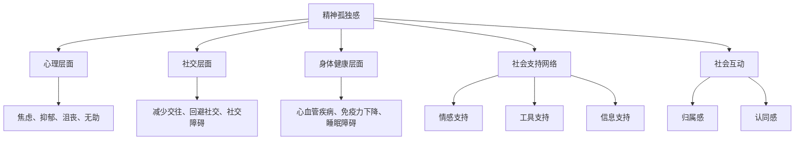
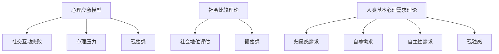
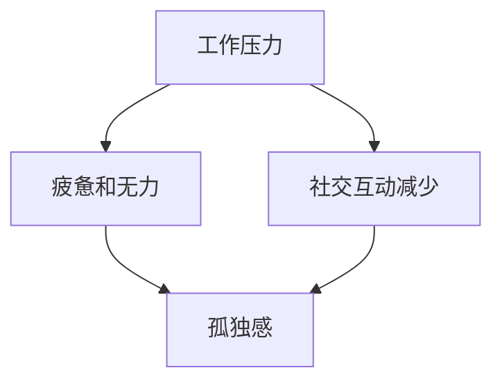
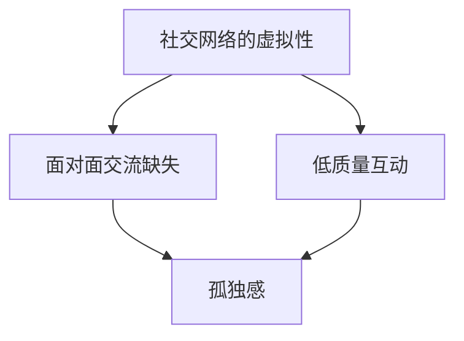
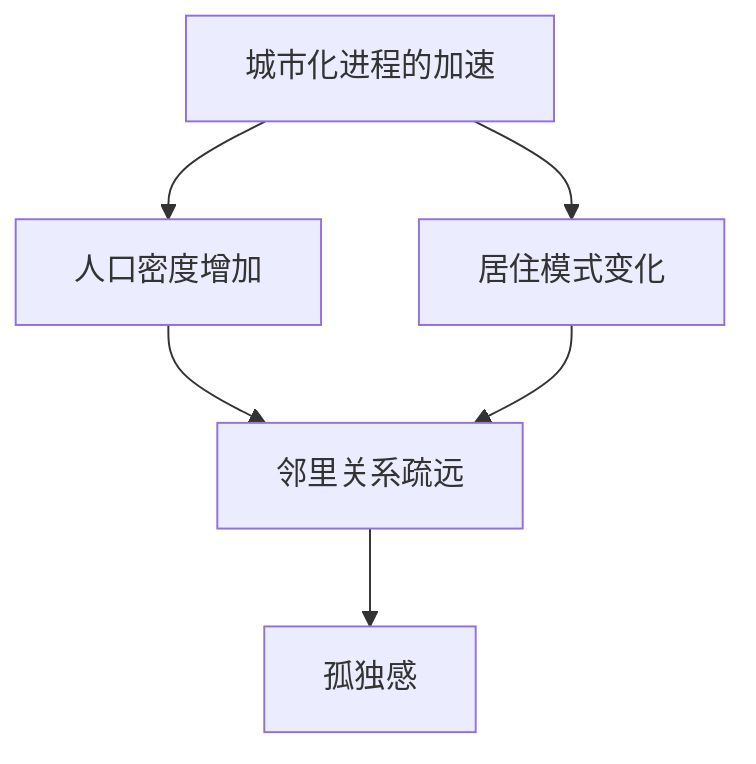
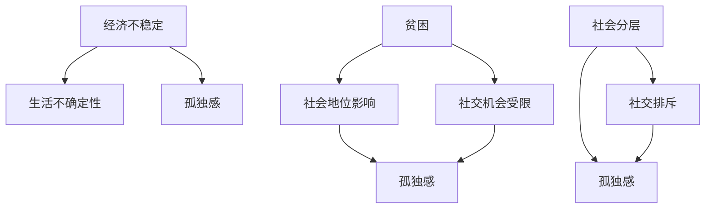

                 

## 引言：都市生活中的精神孤独感

在现代都市生活中，精神孤独感已成为一个日益凸显的社会问题。随着城市化进程的加速，人们的生活节奏不断加快，社会竞争日益激烈，加之现代科技的发展，人与人之间的距离似乎变得更加遥远。在这种背景下，许多人开始感受到一种无法言喻的孤独感，这种孤独不仅仅体现在心理层面上，还会对身体健康、生活质量产生深远影响。

### 1.1.1 问题背景与重要性

都市化进程带来了诸多社会变革，城市化率不断上升，人口密度增大，城市生活节奏加快。然而，这种变革并非一帆风顺。现代都市生活中的精神孤独感成为了许多人的困扰。据统计，患有精神孤独症的人数正在逐年增加，这种现象不仅影响了个体的心理健康，还对整个社会的和谐稳定构成了挑战。

精神孤独感的定义和影响不容忽视。根据心理学研究，精神孤独感是一种复杂的情感体验，它不仅仅是孤单的感觉，还涉及到个体在社会交往中的失落和疏离。长期的精神孤独感可能导致焦虑、抑郁等心理问题，甚至引发严重的身体健康问题，如心血管疾病、免疫力下降等。

探讨精神孤独感的目的和意义在于，通过深入研究其产生的原因和表现形式，寻求有效的预防和缓解策略，提高都市人群的心理健康水平，促进社会的和谐发展。

### 1.1.2 研究方法与结构安排

本研究采用综合研究方法，包括文献综述、实证研究和案例分析。文献综述部分将回顾国内外关于精神孤独感的研究成果，明确现有研究的不足和空白。实证研究将通过问卷调查和深度访谈的方式，收集都市人群的精神孤独感数据，分析其影响因素。案例分析将具体探讨某些都市社区在缓解精神孤独感方面的成功经验，为政策制定提供参考。

本研究的内容结构安排如下：首先，引言部分介绍研究背景和重要性。接着，第二部分将详细探讨精神孤独感的理论基础，包括其基本概念、表现形式、心理学模型及其与社会心理学的联系。第三部分将分析现代都市生活中精神孤独感的来源，包括工作压力、社交网络和城市化等因素。第四部分将探讨个体和社会层面的应对策略，包括自我认知、情感管理、社交技能提升和心理健康的促进。最后，结论部分将总结研究发现，提出未来研究方向和政策建议。

通过本研究的深入探讨，我们期望为现代都市生活中的精神孤独感问题提供新的视角和解决方案，促进个体和社会的心理健康。

### 1.2 研究方法与结构安排

为了深入探讨现代都市生活中的精神孤独感问题，本研究将采用多种研究方法，以确保数据的全面性和结论的可靠性。具体来说，本研究的主要方法包括文献综述、实证研究和案例分析。

首先，文献综述部分将全面回顾国内外关于精神孤独感的研究成果。这一步骤的目的是梳理现有研究的理论框架和研究成果，找出当前研究中的不足和空白，为后续研究提供理论支持。通过查阅心理学、社会学、公共卫生等领域的文献，我们将总结出精神孤独感的基本概念、形成原因、表现形式以及其对社会和心理健康的潜在影响。

其次，实证研究将是本研究的核心部分。为了收集真实可靠的数据，我们将采用问卷调查和深度访谈两种方法。问卷调查将设计一系列标准化问题，以量化都市人群的精神孤独感水平。问卷将涵盖多个维度，如心理状态、社交互动、工作环境等，以便全面评估精神孤独感的影响因素。深度访谈则将选取具有代表性的样本，以深入了解个体在都市生活中的孤独感体验和应对策略。通过对比问卷调查和访谈数据，我们可以更准确地分析精神孤独感的具体表现形式和影响因素。

最后，案例分析部分将选取几个具有代表性的都市社区，深入分析其在缓解精神孤独感方面的成功经验和挑战。通过实地调研和访谈，我们将收集具体的案例数据，总结出有效的干预措施和策略，为政策制定和社区管理提供实证依据。

在内容结构安排方面，本研究的框架如下：引言部分介绍研究背景和重要性，阐述研究目的和结构安排。第二部分将详细探讨精神孤独感的理论基础，包括基本概念、心理学模型及其与社会心理学的联系。第三部分将分析现代都市生活中精神孤独感的来源，探讨工作压力、社交网络和城市化等因素。第四部分将探讨个体和社会层面的应对策略，包括自我认知、情感管理、社交技能提升和心理健康的促进。最后，结论部分将总结研究发现，提出未来研究方向和政策建议。

通过上述结构安排，本研究旨在为现代都市生活中的精神孤独感问题提供系统而深入的分析，以期为个体和社会的心理健康提供有益的启示和解决方案。

### 1.2 研究方法与结构安排

本研究采用综合研究方法，旨在全面深入地探讨现代都市生活中的精神孤独感问题，确保研究的科学性和可靠性。首先，文献综述是研究的基础，通过回顾国内外相关研究成果，明确精神孤独感的基本概念、理论模型及其与社会心理学的联系，为后续研究提供坚实的理论基础。其次，实证研究通过问卷调查和深度访谈，收集真实可靠的数据，分析都市人群精神孤独感的影响因素和表现形式。最后，案例分析部分选取具有代表性的都市社区，通过实地调研和访谈，总结出有效的干预措施和策略。在内容结构安排上，本研究分为四个部分：引言、理论基础、孤独感来源、应对策略，最后是结论和未来研究方向。

### 第2章：精神孤独感的理论基础

精神孤独感是一种复杂的情感体验，它不仅影响个体的心理健康，还与多种社会因素密切相关。为了深入理解这一现象，我们需要从理论基础入手，探讨其基本概念、表现形式、心理学模型以及与社会心理学的联系。

#### 2.1 精神孤独感的基本概念

精神孤独感的定义多种多样，但核心含义基本一致。孤独感通常被描述为一种主观体验，个体感受到与社会脱节、被孤立的心理状态。心理学家Herbert 接受了这一观点，认为孤独感是“在心理上感受到的缺乏亲密关系和社交连接的感受”。孤独感可以分为两类：客观孤独感和主观孤独感。客观孤独感是指个体在社交网络中的实际孤立状态，而主观孤独感则是个人主观上感受到的孤独感，可能与实际社交状态不符。

表 1：精神孤独感的分类与定义
| 类别 | 定义 |
| ---- | ---- |
| 客观孤独感 | 个体在社交网络中的实际孤立状态 |
| 主观孤独感 | 个体主观上感受到的孤独感，可能与实际社交状态不符 |

#### 2.2 精神孤独感的表现形式

精神孤独感在心理、社交和身体健康层面都有明显的表现。

- **心理层面：**个体可能会感到焦虑、抑郁、沮丧和无助。长期的孤独感可能导致自尊心下降，影响自我认同和自我价值感。
- **社交层面：**个体可能减少与他人的交往，回避社交活动，甚至出现社交障碍。在社交互动中，个体可能感到疏离和不被理解。
- **身体健康层面：**孤独感还可能对个体的身体健康产生负面影响。研究表明，长期的孤独感与心血管疾病、免疫力下降、睡眠障碍等健康问题有关。

表 2：精神孤独感的多维度表现形式
| 维度 | 表现形式 |
| ---- | ---- |
| 心理层面 | 焦虑、抑郁、沮丧、无助 |
| 社交层面 | 减少交往、回避社交、社交障碍 |
| 身体健康层面 | 心血管疾病、免疫力下降、睡眠障碍 |

#### 2.3 精神孤独感与社会心理学的联系

精神孤独感与社会心理学有着密切的联系，尤其是在社会支持网络和社会互动方面。

- **社会支持网络：**社会支持网络是缓解孤独感的重要机制。社会支持可以分为情感支持、工具支持和信息支持。情感支持是指个体在心理上感受到的支持和理解，工具支持是指实际的帮助和资源，信息支持则是指提供的信息和指导。一个强大的社会支持网络可以帮助个体应对生活中的压力和挑战，减少孤独感的体验。
- **社会互动：**社会互动是建立和维护社会联系的重要方式。积极的社交互动可以增强个体的归属感和认同感，减少孤独感。然而，现代科技的发展也带来了虚拟社交的兴起，这种虚拟社交虽然增加了人际交往的频率，但在某些情况下也可能导致真正的社交互动减少，从而加剧孤独感。

图 1：精神孤独感与社会心理学的关系

#### 2.4 精神孤独感的心理学模型

心理学家们提出了多种解释孤独感的模型，其中一些主要模型包括：

- **心理应激模型：**这一模型认为孤独感是一种应激反应。个体在社交互动中的失败或挫折可能导致心理压力，进而引发孤独感。
- **社会比较理论：**该理论认为，个体通过与他人进行比较来评估自己的社会地位和幸福感。当个体发现自己在某些方面不如他人时，可能会感到孤独和失落。
- **人类基本心理需求理论：**这一理论认为，人类有几种基本的心理需求，如归属感、自尊和自主性。当这些需求得不到满足时，个体可能会体验到孤独感。

图 2：精神孤独感的心理学模型

#### 2.5 本章小结

本章详细探讨了精神孤独感的基本概念、表现形式、心理学模型及其与社会心理学的联系。通过文献综述和理论分析，我们了解到孤独感不仅是一种主观体验，还与心理、社交和身体健康密切相关。本章提出的心理学模型和社会心理学理论为进一步研究提供了重要的理论依据，也为应对精神孤独感提供了新的视角和思路。

### 第3章：都市生活中的孤独感来源

在现代都市生活中，精神孤独感的产生有多方面的原因，包括工作压力、社交网络和城市化等因素。理解这些孤独感的来源对于寻求有效的应对策略至关重要。

#### 3.1 工作压力与孤独感

工作压力是现代都市生活中导致孤独感的一个重要因素。随着职场竞争的加剧，许多人需要长时间工作，面对高强度的任务和严格的绩效要求。这种工作压力不仅会导致焦虑和抑郁，还可能使人感到孤立和疏离。

- **工作环境的特点：**现代工作环境通常强调个人独立性和工作效率。这种环境下，员工往往需要独立完成工作任务，缺乏与同事之间的直接互动，导致社交互动减少。
- **工作压力对孤独感的影响：**长时间的工作压力使人感到疲惫和无力，缺乏与他人分享和交流的机会，从而加剧孤独感的体验。此外，工作环境中的竞争压力也可能导致个体感到被孤立，特别是当个体在职场中感到不被理解和认可时。

图 1：工作压力与孤独感的关系

#### 3.2 社交网络与孤独感

社交网络在现代都市生活中起着至关重要的作用，但其虚拟性也可能加剧孤独感。

- **社交网络的虚拟性：**随着互联网和社交媒体的普及，人们可以通过虚拟平台进行社交互动。然而，这种虚拟社交虽然增加了人际交往的频率，但在某些情况下也可能导致真正的社交互动减少。虚拟社交的局限性在于，它无法提供面对面的交流和深层次的情感连接。
- **社交网络的互动质量：**社交网络中的互动质量也影响着孤独感的体验。研究表明，低质量的社交互动，如表面的点赞和评论，可能无法提供足够的情感支持和共鸣，反而增加孤独感。
- **社交网络对孤独感的作用：**社交网络虽然在某些方面有助于缓解孤独感，但其负面影响也不容忽视。过度依赖虚拟社交可能导致现实生活中的人际关系疏远，进而加剧孤独感。

图 2：社交网络与孤独感的关系

#### 3.3 城市化与孤独感

城市化进程的加速也对精神孤独感产生了显著影响。

- **城市化进程的加速：**随着城市化进程的加速，越来越多的人涌入城市，城市人口密度不断增加。这种快速的城市化进程导致了居住模式的变化，许多人在城市中居住在高层建筑中，人与人之间的距离变得更远。
- **城市居住模式的变化：**现代城市中的居住模式通常注重个人空间和隐私，这虽然提高了居住的舒适度，但也可能导致邻里关系的疏远。在高层建筑中，人们往往与邻居之间的互动减少，难以建立深层次的社会联系。
- **城市化与孤独感的关系：**城市化不仅改变了人们的居住环境，还影响了他们的社交行为。研究表明，城市居民在社交互动方面可能面临更多挑战，这可能导致孤独感的增加。

图 3：城市化与孤独感的关系

#### 3.4 经济因素与孤独感

经济因素也是影响精神孤独感的重要因素之一。

- **经济不稳定的影响：**经济不稳定可能导致个体在生活中的不确定性和焦虑，从而加剧孤独感。例如，失业或经济困难可能导致个体感到孤立和无助。
- **贫困与孤独感：**贫困不仅影响个体的经济状况，还可能影响其社会地位和社交机会，从而增加孤独感。贫困个体可能在社交活动中受到限制，难以建立和维护稳定的社会关系。
- **社会分层与孤独感：**社会分层现象也可能导致孤独感的增加。处于社会较低层次的个体可能在社交互动中感到被排斥，难以融入更广泛的社会网络。

图 4：经济因素与孤独感的关系

#### 3.5 本章小结

本章分析了现代都市生活中导致精神孤独感的多个来源，包括工作压力、社交网络、城市化和经济因素。这些因素通过不同的机制影响个体的心理健康，导致孤独感的体验。了解这些孤独感的来源有助于制定更有针对性的应对策略，以改善都市人群的心理健康水平。

### 第4章：个体层面的应对策略

在面对现代都市生活中的精神孤独感时，个体可以通过多种策略来应对和缓解这种感受。这些策略主要集中在自我认知与情感管理、社交技能的提升以及心理健康的促进等方面。

#### 4.1 自我认知与情感管理

自我认知是指个体对自己内在情绪、思维和行为的认识。有效的自我认知可以帮助个体更好地理解和控制自己的情绪，从而减轻孤独感。

- **重要性：**自我认知是应对孤独感的第一步。通过了解自己的情感反应和思维模式，个体可以更好地识别孤独感的产生原因，并采取相应的措施。
- **情感管理技巧：**情感管理技巧包括情绪调节、自我同情和积极心理训练。情绪调节是指通过认知和行为手段来调节情绪反应。自我同情是指对自己持有同理心和宽容的态度。积极心理训练，如正念冥想和情绪释放练习，可以帮助个体更好地处理负面情绪。

#### 4.2 社交技能的提升

社交技能的提升对于缓解孤独感具有重要意义。有效的社交技能可以帮助个体建立和维护积极的人际关系。

- **定义与类型：**社交技能包括沟通技巧、冲突解决能力、倾听能力和非语言沟通能力等。不同类型的社交技能在缓解孤独感方面发挥着不同作用。
- **培养社交技能的方法：**培养社交技能可以通过参与社交活动、参加培训课程和阅读相关书籍等方式。此外，模拟社交场景和角色扮演也是有效的培养方法。通过反复练习，个体可以逐渐提高社交技能，减少社交焦虑和孤独感。

#### 4.3 社交障碍的克服

社交障碍是许多人在社交互动中面临的问题，它可能加剧孤独感的体验。克服社交障碍需要个体付出一定的努力和时间。

- **识别社交障碍：**首先，个体需要识别自己面临的社交障碍，如害羞、自卑、社交焦虑等。了解自己的障碍是克服它们的第一步。
- **逐步面对障碍：**克服社交障碍的过程需要逐步进行。个体可以从参加小型的社交活动开始，逐渐增加社交频率和难度。通过逐步面对障碍，个体可以逐渐建立自信心，减少孤独感的体验。
- **寻求专业帮助：**对于严重的社交障碍，个体可以寻求心理咨询师的帮助。专业的心理咨询师可以提供个性化的指导和支持，帮助个体克服社交障碍，提高社交技能。

#### 4.4 心理健康促进

心理健康是应对孤独感的重要方面。通过促进心理健康，个体可以更好地应对孤独感的挑战。

- **重要性：**心理健康直接影响个体的情绪和行为。一个健康的心理状态有助于个体更好地处理压力和孤独感，提高生活质量。
- **心理健康促进方法：**心理健康促进方法包括正念冥想、情绪管理和心理健康服务。正念冥想可以帮助个体专注于当下，减少焦虑和孤独感。情绪管理技巧，如认知重构和情绪表达，可以帮助个体更好地理解和控制自己的情绪。心理健康服务，如心理咨询和治疗，为个体提供专业的支持和指导。

#### 4.5 本章小结

本章详细介绍了个体层面应对精神孤独感的多种策略，包括自我认知与情感管理、社交技能的提升以及心理健康的促进。这些策略不仅有助于缓解孤独感的体验，还可以提高个体的整体心理健康水平，为现代都市生活中的精神孤独感提供有效的解决方案。

### 第5章：社会层面

在应对现代都市生活中的精神孤独感时，社会层面的策略同样至关重要。这些策略主要通过政策制定、社区建设和公共健康服务等方面来促进社会的整体心理健康水平，减少孤独感的负面影响。

#### 5.1 政策制定

政策制定是应对精神孤独感的重要手段。政府可以通过制定相关政策和法规，为减少孤独感提供制度保障。

- **政策目标：**政策制定的目标应包括提高公众对孤独感的认识和重视，以及提供必要的资源和支持。例如，制定心理健康促进计划，将精神健康纳入公共卫生政策，提高对精神健康问题的资金投入。
- **具体措施：**具体措施可以包括建立心理健康服务网络，提供心理咨询和治疗服务，鼓励企业和机构建立心理健康支持系统，以及开展公众心理健康教育宣传活动。政府还可以制定政策，鼓励员工参与心理健康培训，减少工作压力，提高工作满意度。

#### 5.2 社区建设

社区建设是缓解孤独感的重要途径。通过构建和谐、互助的社区环境，个体可以获得更多的社会支持，减少孤独感的体验。

- **社区互助网络：**社区互助网络包括邻里互助、志愿者组织和社区活动等。这些组织可以提供情感支持和实际帮助，帮助个体建立和维护社会联系。例如，组织邻里聚会、文化活动和志愿服务，促进居民之间的交流和互动。
- **社区设施：**社区设施的建设也是社区建设的重要组成部分。通过提供公共空间和活动设施，如公园、图书馆和社区中心，可以促进居民之间的互动和交流，创造一个友好、开放的社区环境。

#### 5.3 公共健康服务

公共健康服务在应对孤独感方面发挥着关键作用。通过提供全面的心理健康服务和资源，可以满足个体在心理健康方面的需求，提高心理健康水平。

- **心理健康服务网络：**建立一个覆盖广泛的心理健康服务网络，包括心理咨询、心理治疗和精神病医院等，为个体提供及时、专业的心理健康服务。
- **心理健康教育：**通过公众健康教育宣传活动，提高公众对孤独感的认识和重视，提供预防孤独感的方法和技巧。例如，举办心理健康讲座、发布宣传材料和开展心理健康日等活动，提高公众的参与度。
- **心理健康资源：**提供丰富的心理健康资源，如心理健康网站、热线电话和移动应用等，为个体提供方便、可及的心理健康支持。这些资源可以帮助个体更好地管理自己的情绪和压力，减少孤独感的体验。

#### 5.4 政策与社区建设相结合

政策制定和社区建设应相互配合，形成合力，以更有效地应对孤独感问题。

- **政策支持社区建设：**政府可以制定政策，支持社区建设和心理健康服务的发展。例如，提供资金支持、技术指导和政策保障，鼓励社区组织和非营利机构参与心理健康服务。
- **社区反馈政策制定：**社区组织和居民应积极参与政策制定过程，提供反馈和建议，确保政策制定更加科学、合理和有效。通过社区反馈，政府可以更好地了解公众的需求和挑战，制定更具针对性的政策。
- **综合干预策略：**政策制定和社区建设应采取综合干预策略，从多个方面同时行动。例如，政府可以制定心理健康促进政策，同时社区可以开展心理健康教育和互助活动，形成多层次、多方面的干预体系，以更全面地应对孤独感问题。

#### 5.5 本章小结

社会层面的策略在应对现代都市生活中的精神孤独感方面具有重要作用。通过政策制定、社区建设和公共健康服务等多种手段，可以提供有效的支持，减少孤独感的负面影响，促进社会的整体心理健康水平。政策与社区建设的结合，以及综合干预策略的运用，将为缓解孤独感问题提供更全面的解决方案。

### 结论

通过本研究，我们系统地探讨了现代都市生活中的精神孤独感问题，分析了其理论基础、来源以及应对策略。主要结论如下：

首先，精神孤独感是一个复杂的情感体验，与心理、社交和身体健康密切相关。工作压力、社交网络、城市化和经济因素是导致孤独感的主要来源。其次，个体可以通过自我认知与情感管理、社交技能提升和心理健康的促进来缓解孤独感。社会层面则需要通过政策制定、社区建设和公共健康服务等多方面综合干预，以更有效地应对孤独感问题。

未来研究方向包括：1）进一步探讨不同文化背景下孤独感的特征和应对策略；2）开发更为有效的心理健康干预措施；3）利用大数据和人工智能技术，提高孤独感诊断和干预的精准度。

政策建议：政府应加强心理健康服务体系建设，提供更多的资源和支持；社区应积极构建互助网络，创造友好、开放的社区环境；企业应关注员工心理健康，建立心理健康支持系统。

通过本研究的深入探讨，我们期望为现代都市生活中的精神孤独感问题提供新的视角和解决方案，促进个体和社会的心理健康。

