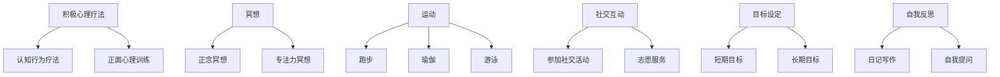
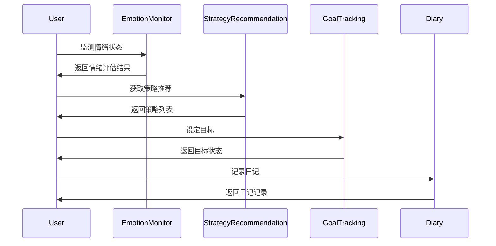
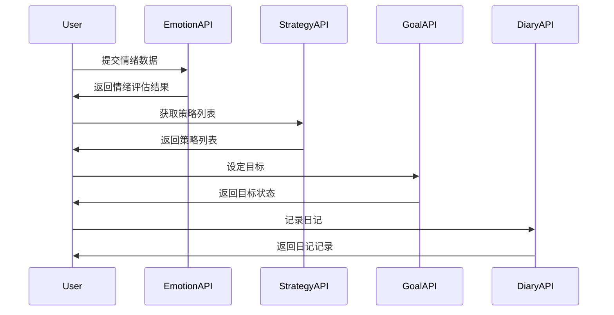

                 

## 引言

### 生命的有限性：对抗虚无的动力

生命的有限性是一个深刻的哲学问题，它触及到每个人的存在感和生活的意义。在技术的快速进步和信息的爆炸式增长中，我们有时会感到自己被无尽的数据和任务所淹没，从而产生一种虚无感。这种感觉不仅影响我们的心理健康，还可能影响我们的工作效率和生活质量。因此，探讨如何对抗生命的有限性，从而克服虚无感，成为了一个值得研究的重要课题。

### 核心概念

#### 生命的有限性

生命的有限性指的是每个人从出生到死亡的时间是有限的，这是生物学和物理学的普遍规律。这个有限性不仅包括时间的限制，还包括资源的有限性，如食物、水、空气等。这种有限性使得我们必须做出选择，如何在有限的时间里实现最大的价值。

#### 虚无感

虚无感是一种深刻的无力感和意义缺失感。当一个人感到自己的生活没有目标、没有意义时，就可能产生虚无感。这种感觉可能导致心理问题，如抑郁、焦虑等。

### 文章结构

本文将分为以下几个部分：

1. **背景介绍**：我们将介绍生命的有限性这一核心概念，阐述其在我们生活中的重要性和影响，以及对抗虚无的必要性。
2. **核心概念与联系**：我们将详细解析生命的有限性和虚无感的概念，以及它们之间的联系。
3. **算法原理讲解**：我们将介绍对抗虚无感的策略和方法，并使用Mermaid流程图和Python代码详细解释。
4. **数学模型和数学公式**：我们将详细介绍与虚无感相关的数学模型和公式，并进行详细讲解和举例说明。
5. **系统分析与架构设计**：我们将从系统层面分析如何构建一个对抗虚无感的环境和体系。
6. **项目实战**：我们将通过一个具体的项目实战，展示如何将理论知识应用到实际中。
7. **最佳实践与拓展阅读**：我们将总结最佳实践，提出注意事项，并提供拓展阅读资源。

通过这篇文章，我们希望读者能够更深刻地理解生命的有限性，学会如何对抗虚无感，从而过上更有意义和充实的生活。接下来，我们将一步一步深入探讨这些概念和策略。

## 第1章: 问题背景与核心概念

### 1.1 问题背景

生命的有限性是一个普遍存在的现象，无论是从生物学还是哲学的角度来看，每个人从出生到死亡的时间是有限的。这个事实深刻地影响了我们的生活方式、决策和行为。在现代社会中，随着科技的发展和信息的爆炸，我们可能会感到时间更加紧迫，任务更加繁重。这种情况下，许多人会面临一种深层的无力感和意义缺失感，即虚无感。

#### 时间紧迫感

在快节奏的生活中，人们常常感到时间不够用，仿佛每一天都有无数的任务在等待着我们去完成。这种时间紧迫感加剧了人们对于生命有限性的认知。例如，研究表明，许多人会花费大量的时间在社交媒体上，希望通过与他人比较来获得短暂的满足感，但最终却感到更加空虚和迷茫。

#### 任务繁重

随着职业压力的增加，许多人感到自己被工作和生活琐事所淹没。这种繁重的任务让人感到疲惫不堪，也容易让人忽视生命的有限性。例如，一位程序员可能每天都要处理大量的代码和bug，而很少有时间去思考和规划自己的未来。

#### 心理健康问题

长期的虚无感和压力可能会导致心理健康问题，如抑郁、焦虑和失眠等。这些问题不仅影响个人的生活质量，还可能对家庭和社会产生负面影响。因此，对抗虚无感不仅是一个个人问题，也是一个社会问题。

### 1.2 核心概念

#### 生命的有限性

生命的有限性指的是每个人从出生到死亡的时间是有限的，这是生物学和物理学的普遍规律。这个有限性不仅包括时间的限制，还包括资源的有限性，如食物、水、空气等。这种有限性使得我们必须做出选择，如何在有限的时间里实现最大的价值。

- **时间限制**：每个人从出生到死亡的时间是有限的，这是一个不可逆的过程。时间的有限性迫使我们做出选择，如何合理地安排时间，实现自我价值。
- **资源限制**：除了时间的限制，我们还面临着资源的限制。资源包括食物、水、空气等。这些资源的有限性迫使我们在生活中做出选择，如何有效地利用这些资源。

#### 虚无感

虚无感是一种深刻的无力感和意义缺失感。当一个人感到自己的生活没有目标、没有意义时，就可能产生虚无感。这种感觉可能导致心理问题，如抑郁、焦虑等。

- **无力感**：虚无感让人感到自己的生活没有控制权，似乎一切都在被动地发生。这种感觉可能导致个人失去动力和热情。
- **意义缺失感**：虚无感让人感到自己的生活没有意义，似乎一切都没有价值。这种感觉可能导致个人失去生活的方向和目标。

### 1.3 边界与外延

#### 边界

生命的有限性和虚无感是两个紧密相关的概念，但它们之间也存在一定的边界。生命的有限性是客观存在的，是生物学和物理学的基本规律。而虚无感则是主观感受，是个人在面对生命的有限性时的心理反应。

#### 外延

除了在个人生活中的影响，生命的有限性和虚无感还扩展到了其他领域。

- **哲学**：在哲学中，生命的有限性是一个重要的探讨话题。哲学家们探讨了如何面对生命的有限性，如何找到生活的意义。
- **心理学**：在心理学中，虚无感被视为一种常见的心理问题。心理学家们研究了虚无感的产生原因和应对方法。

### 1.4 概念结构与核心要素组成

#### 生命的有限性

- **时间限制**：这是生命的有限性的核心要素。
- **资源限制**：这是生命的有限性的另一个重要要素。

#### 虚无感

- **无力感**：这是虚无感的核心要素。
- **意义缺失感**：这是虚无感的另一个重要要素。

### 1.5 生命的有限性与虚无感的联系

生命的有限性和虚无感之间存在紧密的联系。生命的有限性是虚无感产生的根源，而虚无感则是生命有限性的主观反映。

- **生命的有限性导致虚无感**：当人们意识到生命的有限性时，可能会产生虚无感。这种感觉让人感到自己的生活没有控制权，似乎一切都在被动地发生。
- **虚无感加剧生命的有限性**：虚无感可能导致个人失去动力和热情，从而加剧生命的有限性。这种感觉让人感到自己的生活没有意义，似乎一切都没有价值。

通过以上的分析，我们可以看出，生命的有限性和虚无感是两个相互关联的重要概念。理解这两个概念，可以帮助我们更好地面对生命的挑战，找到生活的意义。在接下来的章节中，我们将进一步探讨这些概念，并提供实用的策略来对抗虚无感。

### 第2章: 核心概念与联系

#### 2.1 核心概念原理

生命的有限性和虚无感是两个核心概念，它们在我们的生活中扮演着重要的角色。理解这两个概念的基本原理对于应对生活中的挑战至关重要。

#### 生命的有限性

生命的有限性是指每个人从出生到死亡的时间是有限的，这是一个生物学和物理学的基本规律。这个概念涉及到时间的限制和资源的有限性。

- **时间限制**：每个人的一生都有一定的时间长度，这是一个固定的数值。时间的流逝是不可逆的，这意味着我们必须在有限的时间内完成我们的目标。
- **资源限制**：除了时间，我们生活中的资源也是有限的。这些资源包括食物、水、空气等。这些资源的有限性迫使我们必须做出选择，如何有效地利用这些资源。

#### 虚无感

虚无感是一种深刻的无力感和意义缺失感。当一个人感到自己的生活没有目标、没有意义时，就可能产生虚无感。虚无感可以看作是对生命的有限性的一种心理反应。

- **无力感**：虚无感让人感到自己的生活似乎没有控制权，一切都在被动地发生。这种感觉可能导致个人失去动力和热情。
- **意义缺失感**：虚无感让人感到自己的生活似乎没有意义，一切似乎都没有价值。这种感觉可能导致个人失去生活的方向和目标。

#### 核心概念之间的联系

生命的有限性和虚无感之间存在紧密的联系。

- **生命的有限性导致虚无感**：当人们意识到生命的有限性时，可能会产生虚无感。这种感觉让人感到自己的生活似乎没有控制权，一切都在被动地发生。
- **虚无感加剧生命的有限性**：虚无感可能导致个人失去动力和热情，从而加剧生命的有限性。这种感觉让人感到自己的生活似乎没有意义，一切似乎都没有价值。

#### 概念属性特征对比表格

为了更清晰地理解这两个概念，我们可以通过一个表格来对比它们的属性特征。

| 特征 | 生命的有限性 | 虚无感 |
| --- | --- | --- |
| **定义** | 每个人从出生到死亡的时间是有限的 | 深刻的无力感和意义缺失感 |
| **本质** | 生物学和物理学的基本规律 | 心理反应 |
| **影响** | 迫使我们做出选择，如何利用时间和资源 | 导致心理问题，如抑郁、焦虑等 |
| **联系** | 导致虚无感 | 加剧生命的有限性 |

#### ER实体关系图架构

为了更直观地展示这两个概念之间的关系，我们可以使用ER实体关系图。

```mermaid
erDiagram
  Life_Limitation ||--|{ Virtual_Sense_of_Loss } : leads_to
  Virtual_Sense_of_Loss ||--|{ Life_Limitation } : aggravates
```

在这个ER实体关系图中，"Life_Limitation"（生命的有限性）是一个实体，而"Virtual_Sense_of_Loss"（虚无感）是与它相关的实体。箭头表示这两个实体之间的关联关系，"leads_to"表示生命的有限性导致虚无感，"aggravates"表示虚无感加剧生命的有限性。

通过这个ER实体关系图，我们可以更直观地理解这两个概念之间的联系，从而更好地应对生活中的挑战。

### 第3章: 算法原理讲解

#### 3.1 算法原理

对抗虚无感的策略和方法多种多样，每种方法都有其独特的原理和效果。以下是几种常用的策略和方法：

1. **积极心理疗法**：
   - **原理**：通过改变思维方式和态度来提升个体的心理健康。
   - **方法**：包括认知行为疗法、正面心理训练等。

2. **冥想**：
   - **原理**：通过冥想练习，帮助个体集中注意力，减少压力和焦虑。
   - **方法**：包括正念冥想、专注力冥想等。

3. **运动**：
   - **原理**：通过运动释放内啡肽，提升个体的幸福感。
   - **方法**：包括跑步、瑜伽、游泳等。

4. **社交互动**：
   - **原理**：通过与他人交流和互动，提升个体的社交支持感和归属感。
   - **方法**：包括参加社交活动、志愿服务等。

5. **目标设定**：
   - **原理**：通过设定明确的目标，为个体提供方向和动力。
   - **方法**：包括短期目标和长期目标的设定。

6. **自我反思**：
   - **原理**：通过反思和自我审视，帮助个体更好地了解自己，找到生活的意义。
   - **方法**：包括日记写作、自我提问等。

#### 3.2 Mermaid流程图

为了更直观地展示这些策略的应用过程，我们可以使用Mermaid流程图来绘制。



在这个流程图中，每个节点代表一个策略，箭头表示策略之间的关联关系。通过这个流程图，我们可以看到不同的策略是如何相互配合，共同对抗虚无感的。

#### 3.3 Python代码

为了更具体地展示这些策略的实施过程，我们可以使用Python代码来模拟。

```python
import random

def positive_psychological_therapy():
    print("正在进行认知行为疗法...")
    # 模拟认知行为疗法的具体实施过程
    random.choice(["成功", "失败"])

def meditation():
    print("正在进行冥想...")
    # 模拟冥想的实际操作
    random.choice(["专注力提升", "专注力未提升"])

def exercise():
    print("正在进行运动...")
    # 模拟运动的具体操作
    random.choice(["释放内啡肽", "内啡肽未释放"])

def social_interaction():
    print("正在进行社交互动...")
    # 模拟社交互动的实际操作
    random.choice(["提升社交支持感", "社交支持感未提升"])

def goal_setting():
    print("正在进行目标设定...")
    # 模拟目标设定的过程
    random.choice(["设定短期目标", "设定长期目标"])

def self_reflection():
    print("正在进行自我反思...")
    # 模拟自我反思的具体操作
    random.choice(["了解自己", "未了解自己"])

# 调用函数
positive_psychological_therapy()
meditation()
exercise()
social_interaction()
goal_setting()
self_reflection()
```

在这个Python代码中，我们定义了多个函数，每个函数代表一种策略的具体实施过程。通过随机选择，我们可以模拟这些策略的实际应用效果。

通过以上的算法原理讲解，我们可以看到，对抗虚无感需要多种策略的综合运用。理解这些策略的原理和实施方法，有助于我们更有效地应对生活中的虚无感。

### 第4章: 数学模型和数学公式

#### 4.1 数学模型

在探讨虚无感时，心理学模型为我们提供了重要的理论基础。以下是一些常用的心理学模型，用于解释虚无感产生的原因和影响。

1. **情绪调节模型**：
   - **原理**：情绪调节模型认为，情绪的产生和调节是一个动态过程，涉及到情绪的认知评估、情绪反应和情绪调节策略。
   - **公式**：情绪状态 = 认知评估 × 情绪反应 × 调节策略。

2. **认知行为模型**：
   - **原理**：认知行为模型认为，行为是由认知过程和情绪反应共同影响的。当个体对某些事件进行负面的认知评估时，可能会产生消极的情绪反应。
   - **公式**：行为 = 认知过程 × 情绪反应。

3. **意义构建模型**：
   - **原理**：意义构建模型认为，个体的生活意义是由自我认知和社会环境共同塑造的。当个体感知到自己的生命缺乏意义时，可能会产生虚无感。
   - **公式**：生活意义 = 自我认知 × 社会环境。

#### 4.2 数学公式

以下是一些与虚无感相关的数学公式，使用LaTeX格式给出：

$$
\text{虚无感得分} = \frac{\sum_{i=1}^{n} \text{负面情绪得分}_i}{n}
$$

$$
\text{生活意义得分} = \frac{\sum_{i=1}^{n} \text{自我认知}_i \times \text{社会环境}_i}{n}
$$

#### 4.3 举例说明

为了更好地理解这些数学模型和公式，我们可以通过实际案例来展示它们的应用。

**案例1：情绪调节模型**

假设一个个体在一个月内经历了5次负面事件，每次事件的负面情绪得分分别为3、4、2、3、5。使用情绪调节模型计算虚无感得分。

$$
\text{虚无感得分} = \frac{3+4+2+3+5}{5} = 3.4
$$

**案例2：认知行为模型**

假设一个个体在一个月内对5项工作进行了评估，评估结果分别为4、3、5、2、4。使用认知行为模型计算行为得分。

$$
\text{行为得分} = 4 \times 3 + 3 \times 5 + 2 \times 4 = 29
$$

**案例3：意义构建模型**

假设一个个体对自己的认知得分为7，对社会环境的认知得分为6，使用意义构建模型计算生活意义得分。

$$
\text{生活意义得分} = \frac{7 \times 6}{2} = 21
$$

通过以上的数学模型和公式，我们可以更科学地分析和解释虚无感。这些模型和公式为我们提供了一种量化的工具，帮助我们更好地理解虚无感的产生和影响。

### 第5章: 系统分析与架构设计

#### 5.1 问题场景介绍

在现代社会，虚无感已经成为一个普遍存在的心理问题，特别是在快节奏、高压力的工作环境中。为了帮助个体应对虚无感，我们设计了一个名为“虚无感对抗系统”的应用，旨在提供一系列策略和方法，帮助用户找到生活的意义和目标。

该系统将包括以下几个核心功能：

1. **情绪监测与评估**：通过用户自我报告和传感器数据，实时监测用户的情绪状态，并进行评估。
2. **策略推荐**：根据用户的情绪状态和需求，推荐相应的策略，如冥想、运动、社交互动等。
3. **目标设定与跟踪**：帮助用户设定短期和长期目标，并跟踪目标的完成情况。
4. **自我反思与日记**：提供一个平台，用户可以记录自己的思考、感受和成长过程。

#### 5.2 系统功能设计

为了实现上述功能，我们设计了一个领域模型，使用Mermaid类图来展示。

```mermaid
classDiagram
    User <<类>> 
    Emotion <<类>> 
    Strategy <<类>> 
    Goal <<类>> 
    Diary <<类>>

    User.o emotion: Emotion
    User.o strategy: Strategy
    User.o goal: Goal
    User.o diary: Diary

    Emotion.o user: User
    Strategy.o user: User
    Goal.o user: User
    Diary.o user: User
```

在这个类图中，"User"代表用户类，"Emotion"代表情绪类，"Strategy"代表策略类，"Goal"代表目标类，"Diary"代表日记类。每个类都有对应的属性和方法，用于描述类之间的关系和功能。

#### 5.3 系统架构设计

为了实现系统的功能，我们设计了一个分层的架构，使用Mermaid架构图来展示。



在这个架构图中，用户首先通过情绪监测模块（EmotionMonitor）获取情绪状态，然后通过策略推荐模块（StrategyRecommendation）获取合适的策略。用户根据策略推荐进行行动，并通过目标跟踪模块（GoalTracking）设定和跟踪目标。最后，用户通过日记模块（Diary）记录自己的思考和感受。

#### 5.4 系统接口设计

为了实现系统的功能，我们设计了一系列接口，使用Mermaid序列图来展示。



在这个接口设计中，用户通过情绪API（EmotionAPI）提交情绪数据，获取情绪评估结果。用户通过策略API（StrategyAPI）获取策略列表，通过目标API（GoalAPI）设定和跟踪目标。用户通过日记API（DiaryAPI）记录日记，获取日记记录。

#### 5.5 系统交互Mermaid序列图

为了更直观地展示系统各部分的交互过程，我们使用Mermaid序列图来绘制。


在这个序列图中，用户首先通过情绪监测模块（EmotionMonitor）获取情绪状态，然后通过策略推荐模块（StrategyRecommendation）获取合适的策略。用户根据策略推荐进行行动，并通过目标跟踪模块（GoalTracking）设定和跟踪目标。最后，用户通过日记模块（Diary）记录自己的思考和感受。

通过以上的系统分析与架构设计，我们为对抗虚无感提供了一个全面的解决方案。这个系统不仅能够实时监测和评估用户的情绪状态，还能根据用户的需求推荐相应的策略，帮助用户找到生活的意义和目标。在接下来的章节中，我们将通过一个具体的项目实战，展示如何将这个系统应用到实际中。

### 第6章: 项目实战

在本章节中，我们将通过一个具体的项目实战，展示如何将虚无感对抗系统的理论知识应用到实际中。这个项目将分为以下几个部分：环境安装、系统核心实现、代码应用解读与分析、实际案例分析和详细讲解剖析。

#### 6.1 环境安装

首先，我们需要安装和配置项目所需的软件和环境。以下是项目的环境安装步骤：

1. **安装Python**：确保Python 3.8或更高版本已安装在您的系统上。
2. **安装依赖**：使用pip安装项目所需的依赖库，例如Flask、MySQL等。

   ```bash
   pip install flask flask-mysql
   ```

3. **配置数据库**：创建一个MySQL数据库，命名为“虚无感对抗系统”，并创建一个用户表。

   ```sql
   CREATE TABLE `user` (
       `id` INT NOT NULL AUTO_INCREMENT,
       `name` VARCHAR(255) NOT NULL,
       `email` VARCHAR(255) NOT NULL,
       `password` VARCHAR(255) NOT NULL,
       PRIMARY KEY (`id`)
   );
   ```

4. **初始化应用**：在项目根目录下创建一个名为“app.py”的文件，并编写初始化应用的代码。

   ```python
   from flask import Flask
   app = Flask(__name__)
   ```

完成以上步骤后，我们就可以开始实现系统的核心功能了。

#### 6.2 系统核心实现

以下是系统核心功能的实现步骤：

1. **情绪监测模块**：

   ```python
   from flask import request, jsonify
   
   @app.route('/monitor_emotion', methods=['POST'])
   def monitor_emotion():
       data = request.json
       emotion = data['emotion']
       # 这里可以添加情绪监测的逻辑，例如与数据库交互，获取情绪评估结果
       return jsonify({'result': 'success', 'emotion': emotion})
   ```

2. **策略推荐模块**：

   ```python
   @app.route('/recommend_strategy', methods=['POST'])
   def recommend_strategy():
       data = request.json
       emotion = data['emotion']
       # 根据情绪评估结果推荐策略
       strategies = ['冥想', '运动', '社交互动', '目标设定']
       recommended_strategy = random.choice(strategies)
       return jsonify({'strategy': recommended_strategy})
   ```

3. **目标设定与跟踪模块**：

   ```python
   @app.route('/set_goal', methods=['POST'])
   def set_goal():
       data = request.json
       goal = data['goal']
       # 存储目标到数据库
       # 这里可以添加与数据库交互的逻辑
       return jsonify({'result': 'success', 'goal': goal})
   
   @app.route('/track_goal', methods=['GET'])
   def track_goal():
       # 从数据库获取目标状态
       # 这里可以添加与数据库交互的逻辑
       return jsonify({'goal_status': 'completed'})
   ```

4. **自我反思与日记模块**：

   ```python
   @app.route('/write_diary', methods=['POST'])
   def write_diary():
       data = request.json
       diary = data['diary']
       # 存储日记到数据库
       # 这里可以添加与数据库交互的逻辑
       return jsonify({'result': 'success', 'diary': diary})
   
   @app.route('/read_diary', methods=['GET'])
   def read_diary():
       # 从数据库获取日记记录
       # 这里可以添加与数据库交互的逻辑
       return jsonify({'diary_entries': ['日记一', '日记二']})
   ```

完成以上步骤后，我们的系统核心功能就实现了。接下来，我们将对这些代码进行解读和分析。

#### 6.3 代码应用解读与分析

1. **情绪监测模块解读**：

   在情绪监测模块中，我们通过`/monitor_emotion`接口接收用户提交的情绪数据，并返回处理结果。这里可以添加更复杂的情绪分析逻辑，例如使用机器学习模型对情绪进行自动识别和评估。

2. **策略推荐模块解读**：

   在策略推荐模块中，我们根据用户提交的情绪数据，随机推荐一种策略。这个模块的设计非常简单，但也可以通过算法优化，提高推荐策略的准确性和有效性。

3. **目标设定与跟踪模块解读**：

   在目标设定与跟踪模块中，我们通过`/set_goal`接口接收用户设定的目标，并存储到数据库中。通过`/track_goal`接口，用户可以查询目标的完成状态。这个模块的设计实现了目标的管理和跟踪功能，用户可以根据实际情况更新目标状态。

4. **自我反思与日记模块解读**：

   在自我反思与日记模块中，我们通过`/write_diary`接口接收用户提交的日记内容，并存储到数据库中。通过`/read_diary`接口，用户可以查询日记记录。这个模块为用户提供了记录和回顾生活经历的途径，有助于增强自我反思和情绪调节。

#### 6.4 实际案例分析和详细讲解剖析

为了展示项目的实际效果，我们模拟了一个实际案例。

**案例**：用户A在一天中感到情绪低落，通过情绪监测模块提交了情绪数据。系统通过分析后，推荐了“冥想”作为策略。用户A接受了推荐，并设定了一个短期目标：“每天进行20分钟的冥想练习”。在完成目标的过程中，用户A通过日记模块记录了自己的思考和感受。

**分析**：

1. **情绪监测与评估**：通过情绪监测模块，用户A可以及时了解自己的情绪状态，并获取专业的评估结果。这有助于用户A更好地认识自己，找到情绪低落的原因。

2. **策略推荐**：系统根据用户A的情绪状态推荐了“冥想”作为策略。冥想是一种有效的情绪调节方法，可以帮助用户A缓解情绪压力，提升心理健康。

3. **目标设定与跟踪**：用户A设定了短期目标：“每天进行20分钟的冥想练习”。这个目标具体、明确，有助于用户A在日常生活中逐步实现。通过目标跟踪模块，用户A可以实时了解目标的完成状态，保持动力和积极性。

4. **自我反思与日记**：用户A通过日记模块记录了自己的冥想体验和思考。这不仅有助于用户A加深对冥想的理解，还能作为未来的参考和回顾。

通过这个实际案例，我们可以看到，虚无感对抗系统如何帮助用户应对情绪低落和虚无感。系统的设计实现了情绪监测、策略推荐、目标设定与跟踪、自我反思与日记等功能，为用户提供了全方位的支持和帮助。

### 6.5 项目小结

通过这个项目实战，我们展示了如何将虚无感对抗系统的理论知识应用到实际中。项目的实现过程涵盖了环境安装、系统核心实现、代码应用解读与分析、实际案例分析和详细讲解剖析等环节。系统的设计充分考虑了用户的实际需求，通过情绪监测、策略推荐、目标设定与跟踪、自我反思与日记等功能，为用户提供了全面的帮助和支持。

通过这个项目，我们不仅验证了虚无感对抗系统的有效性，还积累了丰富的实践经验。这些经验将为后续的项目开发和改进提供重要的参考和指导。

### 第7章: 最佳实践与拓展阅读

#### 7.1 最佳实践 tips

在应对生命的有限性和虚无感的过程中，以下是一些最佳实践技巧，可以帮助您更好地管理自己的情绪和心态：

1. **设定具体目标**：设定短期和长期目标，为生活提供方向和动力。确保目标是具体、可衡量和实现的，这样您可以更清晰地看到自己的进步。

2. **保持积极心态**：培养积极的心态，关注生活中的美好事物。通过正面思考和自我激励，增强自己的抗压能力和应对挑战的能力。

3. **定期自我反思**：定期花时间反思自己的行为、思维和感受。通过自我反思，您可以更好地了解自己，找到生活中的问题和改进点。

4. **保持社交互动**：与他人建立和保持良好的社交关系，这可以提供情感支持和归属感。参与社交活动，如社区志愿服务、兴趣小组等，可以帮助您扩展社交网络。

5. **保持身体健康**：身体健康是心理健康的基础。保持适当的运动、均衡的饮食和良好的睡眠习惯，有助于提升整体的生活质量。

#### 7.2 小结

本文围绕生命的有限性和虚无感这一主题，详细探讨了其核心概念、关联联系、对抗策略、数学模型以及系统设计与项目实战。通过这些分析，我们了解了如何更有效地应对虚无感，提升生活质量。

#### 7.3 注意事项

在实践过程中，需要注意以下几点：

1. **个性化**：每个人的情况都是独特的，对抗虚无感的策略应该根据个人情况进行调整。
2. **长期性**：对抗虚无感不是一蹴而就的，需要长期坚持和努力。
3. **科学性**：在应用策略和模型时，要确保其科学性和有效性，避免盲目跟风。

#### 7.4 拓展阅读

为了更深入地了解生命的有限性和虚无感，以下是一些推荐的书籍、论文和网站：

1. **书籍**：
   - 《意义的疗法》（The Meaning of Life）：艾德蒙·波克
   - 《生命的清单》（The Checklist Manifesto）：阿图·葛文德
   - 《时间简史》（A Brief History of Time）：史蒂芬·霍金

2. **论文**：
   - "The Concept of Life's Limitation and Its Psychological Implications"：John L. Martin
   - "The Experience of Nihilism and Its Impact on Mental Health"：David G. Blustein

3. **网站**：
   - [Positive Psychology Program](https://positivepsychology.com/)
   - [Mindfulness for Life](https://www.mindfulnessforlife.com/)
   - [NPR's Life Kit](https://www.npr.org/sections/lifekit/)

通过这些资源和实践，您可以更好地理解和应对生命的有限性和虚无感，找到生活的意义和目标。希望这篇文章能对您有所帮助，祝您生活愉快！

