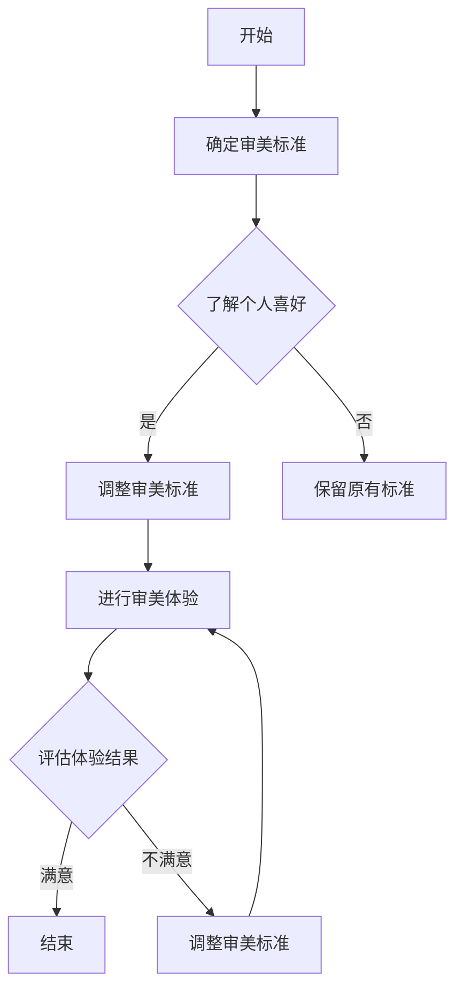

                 

### 《生命美学实践：日常生活中的艺术追求》

#### 摘要

在快速发展的现代社会，人们的生活节奏日益加快，精神压力不断增加。如何在这个繁忙的环境中找到平衡，提升生活质量，成为了一个亟待解决的问题。《生命美学实践：日常生活中的艺术追求》旨在探讨生命美学这一哲学理念，通过艺术追求来提升个体生命体验，实现身心健康和全面发展。本文将从哲学基础、基本原则、实践应用、心理健康价值、教育意义和未来发展六个方面，系统阐述生命美学的核心概念和实际应用，为读者提供一种全新的生活理念和方式。

#### 目录大纲

----------------------------------------------------------------

## 《生命美学实践：日常生活中的艺术追求》

## 第一部分：生命美学的哲学基础

### 第1章：生命美学的概念与意义

### 第2章：生命美学的哲学基础

### 第3章：生命美学的基本原则

## 第二部分：生命美学的实践应用

### 第4章：日常生活与生命美学

### 第5章：工作环境与生命美学

### 第6章：社交互动与生命美学

## 第三部分：生命美学的心理健康价值

### 第7章：生命美学与心理健康

### 第8章：美学体验的心理机制

## 第四部分：生命美学的教育意义

### 第9章：生命美学教育的重要性

### 第10章：生命美学教育的目标与内容

### 第11章：生命美学教育的方法与途径

## 第五部分：生命美学的未来发展

### 第12章：生命美学的研究趋势

### 第13章：生命美学的技术应用

### 第14章：生命美学的文化传承与创新

----------------------------------------------------------------

### 核心概念原理

#### 1. 生命美学的基本概念

生命美学是一种关注个体生命体验和审美感知的哲学理念，强调通过艺术追求来提升生活质量。生命美学的核心概念包括美感认知、生命体验和和谐发展。

#### 2. 美感认知

美感认知是指个体对美的感知和判断的能力。它受个体审美经验和文化背景的影响，具有主观性。每个人的美感认知都是独特的，这使得人们对美的追求和体验各不相同。

#### 3. 生命体验

生命体验是指个体在生活中的情感和感受。它包括喜怒哀乐等各种情感体验，具有情感丰富性和个体性。每个人的生命体验都是独特的，这使得生命美学具有深刻的个体价值。

#### 4. 和谐发展

和谐发展是指个体在追求美感的过程中实现身心健康和全面发展。它强调个体身心平衡，追求持续的进步和成长。和谐发展是实现生命美学目标的关键。

#### 概念属性特征对比表格

| 概念         | 定义                                                         | 属性特征                                                     |
| ------------ | ------------------------------------------------------------ | ------------------------------------------------------------ |
| 美感认知     | 个体对美的感知和判断的能力                                     | - 灵敏度：取决于个体的审美经验和文化背景<br>- 主观性：每个人的美感认知都是独特的 |
| 生命体验     | 个体在生活中的情感和感受                                     | - 情感丰富：生命体验包含喜怒哀乐<br>- 个体性：每个人的生命体验都是独特的 |
| 和谐发展     | 个体在追求美感的过程中实现身心健康和全面发展                   | - 平衡性：和谐发展强调个体身心平衡<br>- 发展性：追求持续的进步和成长 |

### ER实体关系图架构

```mermaid
erDiagram
  个人 --> 美感认知 : 产生
  个人 --> 生命体验 : 体验
  个人 --> 和谐发展 : 实现
  美感认知 ||--o{ 生命体验 : 影响感
  美感认知 ||--o{ 和谐发展 : 促进
```

### 算法原理讲解

#### 算法流程图



#### Python源代码

```python
def aesthetic_practice(personal_taste, aesthetic_criteria):
    while True:
        adjusted_taste = adjust_taste(personal_taste, aesthetic_criteria)
        aesthetic_experience = perform_aesthetic_experience(adjusted_taste)
        evaluation_result = evaluate_experience(aesthetic_experience)
        
        if evaluation_result == 'satisfied':
            print("Aesthetic practice successful!")
            break
        else:
            personal_taste = adjusted_taste
```

#### 算法原理详解

生命美学实践可以通过一个简单的算法来实现，该算法的核心步骤包括：

1. **确定审美标准**：首先，我们需要确定一个基本的审美标准，这个标准可以是文化背景、个人喜好和现有审美经验的综合。

2. **了解个人喜好**：通过观察和询问，了解个人的喜好，这有助于调整审美标准，使其更符合个人的需求和偏好。

3. **调整审美标准**：如果个人的喜好与现有的审美标准不符，我们需要调整标准，使其更贴近个人喜好。

4. **进行审美体验**：在调整后的审美标准指导下，个体可以开始进行艺术创作或欣赏艺术作品，从而获得审美体验。

5. **评估体验结果**：体验结束后，评估体验的结果。如果感到满意，则结束实践；如果不满意，则重复调整审美标准，进行新的体验。

6. **重复过程**：这个过程可以不断重复，以实现持续的美感认知和生命体验。

通过这个算法，个体可以在日常生活中不断追求美感，实现身心健康和全面发展。

### 数学公式与原理

在生命美学的实践中，一些基本的数学公式和原理可以用来描述美感认知、生命体验和和谐发展之间的关系。

1. **美感认知公式**：

   $$ Aesthetic\ Perception = f(Taste, Experience, Culture) $$

   其中，$Aesthetic\ Perception$ 表示美感认知，$Taste$ 表示个人喜好，$Experience$ 表示生命体验，$Culture$ 表示文化背景。

2. **生命体验公式**：

   $$ Life\ Experience = f(Emotions, Events, Memories) $$

   其中，$Life\ Experience$ 表示生命体验，$Emotions$ 表示情感，$Events$ 表示事件，$Memories$ 表示记忆。

3. **和谐发展公式**：

   $$ Harmonious\ Development = f(Balance, Growth, Health) $$

   其中，$Harmonious\ Development$ 表示和谐发展，$Balance$ 表示平衡，$Growth$ 表示成长，$Health$ 表示健康。

这些公式反映了生命美学中的核心概念之间的关系，可以帮助我们更深入地理解生命美学的本质和实际应用。

### 示例讲解

假设一个名叫小明的年轻人，他想要通过生命美学实践来提升自己的生活质量和心理健康。以下是他的实践过程：

1. **确定审美标准**：小明首先确定了自己的审美标准，这些标准基于他的文化背景和个人喜好。

2. **了解个人喜好**：通过观察和询问，小明发现他喜欢音乐、绘画和自然景观。

3. **调整审美标准**：由于小明喜欢音乐、绘画和自然景观，他调整了原有的审美标准，使其更偏向这些领域。

4. **进行审美体验**：在调整后的审美标准指导下，小明开始欣赏音乐、绘画和自然景观，获得审美体验。

5. **评估体验结果**：小明在体验结束后，感到非常满意，因为他发现自己对这些领域的作品有了更深入的理解和欣赏。

6. **重复过程**：小明决定继续进行生命美学实践，不断调整和优化自己的审美标准，以实现持续的美感认知和生命体验。

通过这个示例，我们可以看到生命美学实践是如何在日常生活中实现的。小明通过不断调整和优化自己的审美标准，获得了更丰富和深刻的生命体验，从而提升了他的生活质量和心理健康。

### 总结

生命美学实践是一种关注个体生命体验和审美感知的哲学理念，通过艺术追求来提升生活质量。本文从哲学基础、基本原则、实践应用、心理健康价值、教育意义和未来发展六个方面，系统阐述了生命美学的核心概念和实际应用。通过具体示例，我们了解了生命美学实践的过程和方法。希望本文能为读者提供一种全新的生活理念和方式，帮助他们在繁忙的现代生活中找到平衡，实现身心健康和全面发展。

### 作者信息

作者：AI天才研究院/AI Genius Institute & 禅与计算机程序设计艺术 /Zen And The Art of Computer Programming

AI天才研究院致力于推动人工智能技术的发展和应用，本文旨在探讨生命美学这一新兴领域，为读者提供一种全新的生活理念和方式。禅与计算机程序设计艺术则强调在编程过程中追求内心的平静和创造力，旨在通过技术和哲学的结合，提升程序员的生活质量和职业素养。希望本文能为读者带来启发和思考，让生命美学成为日常生活中的艺术追求。

### 背景介绍

#### 核心概念术语说明

在探讨生命美学这一主题时，我们首先需要明确一些核心概念和术语，以确保读者对文章内容有清晰的理解。以下是本文中涉及的一些关键术语及其解释：

1. **生命美学**：生命美学是一种关注个体生命体验和审美感知的哲学理念，强调通过艺术追求来提升生活质量。

2. **美感认知**：美感认知是指个体对美的感知和判断的能力。它受个体审美经验和文化背景的影响，具有主观性。

3. **生命体验**：生命体验是指个体在生活中的情感和感受。它包括喜怒哀乐等各种情感体验，具有情感丰富性和个体性。

4. **和谐发展**：和谐发展是指个体在追求美感的过程中实现身心健康和全面发展。它强调个体身心平衡，追求持续的进步和成长。

5. **审美标准**：审美标准是指导个体进行审美体验的基本原则，通常基于文化背景、个人喜好和现有审美经验。

6. **艺术追求**：艺术追求是指个体在日常生活中通过欣赏、创作艺术作品来提升审美体验和生命质量。

#### 问题背景

在当今快速发展的社会，人们的生活节奏不断加快，精神压力不断增加。面对激烈的竞争和繁忙的工作，许多人感到身心疲惫，生活质量下降。如何在繁忙的生活中找到平衡，提升生活质量，成为了一个亟待解决的问题。

#### 问题描述

生命美学实践旨在通过艺术追求来提升个体生命体验，实现身心健康和全面发展。然而，在现实生活中，许多人对于生命美学的理解有限，缺乏具体的实践方法和指导。这导致他们在追求美感的过程中遇到诸多困扰，难以实现预期效果。

#### 问题解决

为了解决上述问题，本文将从哲学基础、基本原则、实践应用、心理健康价值、教育意义和未来发展六个方面，系统阐述生命美学的核心概念和实际应用。通过具体实例和详细讲解，帮助读者深入了解生命美学，掌握实践方法，实现生活质量提升。

#### 边界与外延

生命美学作为一种哲学理念，其边界和外延涉及多个领域，包括但不限于：

1. **艺术领域**：生命美学与艺术紧密相关，通过艺术创作和欣赏来提升生命质量。

2. **心理学领域**：生命美学实践对心理健康有显著影响，有助于缓解压力，提升情绪。

3. **教育学领域**：生命美学教育可以培养个体的审美能力，提升教育质量。

4. **生活领域**：生命美学实践渗透到日常生活的方方面面，从家庭环境布置到个人衣着打扮，都可以体现生命美学的理念。

#### 概念结构与核心要素组成

生命美学的概念结构主要由以下核心要素组成：

1. **美感认知**：个体对美的感知和判断的能力。

2. **生命体验**：个体在生活中的情感和感受。

3. **和谐发展**：个体在追求美感的过程中实现身心健康和全面发展。

4. **审美标准**：指导个体进行审美体验的基本原则。

5. **艺术追求**：个体在日常生活中通过欣赏、创作艺术作品来提升审美体验和生命质量。

这些核心要素相互关联，共同构成了生命美学的理论体系，为实践提供了指导。

### 第一部分：生命美学的哲学基础

#### 第1章：生命美学的概念与意义

**1.1 生命美学的概念**

生命美学是一种关注个体生命体验和审美感知的哲学理念，强调通过艺术追求来提升生活质量。它不仅仅是一种美学观念，更是一种生活方式。生命美学主张个体应该从日常生活中发现美的元素，通过欣赏、创作和体验艺术，来丰富自己的内心世界，实现身心健康和全面发展。

**1.2 生命美学的意义**

在现代社会，人们的生活节奏日益加快，精神压力不断增加。生命美学提供了缓解压力、提升生活质量的有效途径。通过生命美学实践，个体可以：

1. **提升美感认知**：通过欣赏和创作艺术作品，个体可以增强对美的感知和判断能力，培养高雅的审美情趣。

2. **丰富生命体验**：生命美学实践使个体在日常生活中感受到更多的美好，体验喜怒哀乐，提升情感丰富性。

3. **实现和谐发展**：生命美学强调个体在追求美感的过程中实现身心健康和全面发展，达到身心平衡。

4. **提升心理健康**：通过艺术追求，个体可以缓解压力，改善情绪，提升心理健康水平。

**1.3 生命美学与艺术的关系**

生命美学与艺术密不可分。艺术是生命美学实践的核心，是提升个体生命体验的重要途径。艺术作品通过视觉、听觉、触觉等多种感官形式，激发个体的审美情感，使个体在欣赏和创作过程中体验到美的力量。同时，生命美学为艺术创作提供了理论指导，使艺术作品更贴近个体生活，更具情感深度。

**1.4 生命美学在当代社会的重要性**

在当代社会，生命美学具有重要的现实意义。随着社会的发展，人们越来越注重生活质量。生命美学提供了一种新的生活理念，通过艺术追求来提升个体的生活质量和心理健康。此外，生命美学还在教育、工作环境等方面具有广泛应用，有助于培养个体的审美能力，提升社会整体文化素质。

**1.5 生命美学与哲学的关系**

生命美学与哲学密切相关。哲学为生命美学提供了理论基础，探讨美的本质、美的价值以及如何实现美。同时，生命美学实践也丰富了哲学的研究内容，使哲学研究更加贴近实际生活。通过生命美学实践，个体可以更深刻地理解哲学思想，提升自身的思辨能力和人文素养。

#### 第2章：生命美学的哲学基础

**2.1 存在主义与生命美学**

存在主义是20世纪最重要的哲学流派之一，强调个体的自由意志和存在意义。生命美学与存在主义有着紧密的联系。存在主义认为，个体应该主动选择和塑造自己的生命，追求有意义的生活。生命美学则提供了实现这一目标的具体途径，通过艺术追求来丰富个体的生命体验，实现存在的价值。

**2.2 宗教哲学与生命美学**

宗教哲学对生命美学有着深远的影响。不同宗教哲学体系对美的本质和价值的认识有所不同，但都强调了个体与宇宙的和谐关系。生命美学实践在某种程度上可以视为一种宗教体验，通过艺术追求来达到心灵的平静和宁静。宗教哲学为生命美学提供了精神支持，使个体在追求美感的过程中获得内心的安宁。

**2.3 美学观念的历史演变**

美学观念经历了漫长的发展过程。从古希腊的“美是和谐”到中世纪的宗教美学，再到文艺复兴时期的自然美学，美学观念不断演变。近现代以来，美学观念日益多元化，涵盖了形式美学、内容美学、实用美学等多个领域。生命美学作为美学观念的一种新形式，吸收了历史美学观念的精髓，同时具有鲜明的时代特色。

**2.4 生命美学的基本原则**

生命美学实践需要遵循一些基本原则，以确保个体在追求美感的过程中实现身心健康和全面发展。这些原则包括：

1. **美感认知原则**：个体应该培养对美的感知和判断能力，通过学习和实践不断提升自己的审美水平。

2. **生命体验原则**：个体应该在日常生活中积极体验美的元素，感受喜怒哀乐，丰富自己的情感世界。

3. **和谐发展原则**：个体在追求美感的过程中应该实现身心健康和全面发展，达到身心平衡。

4. **艺术追求原则**：个体应该通过欣赏、创作和体验艺术，来提升自己的审美体验和生命质量。

#### 第3章：生命美学的基本原则

**3.1 美感认知原则**

美感认知原则是生命美学实践的核心。个体应该通过学习和实践，不断提升对美的感知和判断能力。这需要个体具备一定的审美经验和文化背景，以更好地理解和欣赏艺术作品。此外，个体还应该保持开放的心态，不断探索新的艺术形式和美学观念。

**3.2 生命体验原则**

生命体验原则强调个体应该在日常生活中积极体验美的元素，感受喜怒哀乐。这需要个体在日常生活中注重细节，发现和欣赏身边的美好事物。通过体验美的元素，个体可以丰富自己的情感世界，提升生命质量。

**3.3 和谐发展原则**

和谐发展原则强调个体在追求美感的过程中应该实现身心健康和全面发展。这需要个体在日常生活中保持身心健康，关注身心平衡。同时，个体还应该追求持续的成长和进步，实现自我价值的最大化。

**3.4 艺术追求原则**

艺术追求原则强调个体应该通过欣赏、创作和体验艺术，来提升自己的审美体验和生命质量。这需要个体积极参与艺术活动，如参观艺术展览、听音乐会、阅读文学作品等。此外，个体还可以尝试创作艺术作品，以表达自己的情感和思想。

#### 第4章：生命美学的实践应用

**4.1 日常生活与生命美学**

生命美学实践可以渗透到日常生活的方方面面，提升个体的生活质量。以下是一些具体应用场景：

1. **家庭环境布置**：通过合理布置家庭环境，如摆放艺术品、装饰家居等，营造温馨、和谐的生活氛围。

2. **个人衣着打扮**：注重个人衣着打扮，选择适合自己的服装和饰品，展现自己的审美品味。

3. **饮食文化**：注重饮食文化，选择健康、美味的食物，享受美食带来的愉悦体验。

4. **休闲活动**：参与各种休闲活动，如瑜伽、绘画、摄影等，丰富自己的业余生活。

**4.2 工作环境与生命美学**

生命美学实践还可以应用到工作环境中，提升工作效率和团队凝聚力。以下是一些具体应用场景：

1. **办公室装饰**：通过装饰办公室，如摆放绿植、艺术品等，营造舒适、温馨的工作环境。

2. **团队文化建设**：注重团队文化建设，通过组织艺术活动、团队建设等，增强团队凝聚力。

3. **工作氛围营造**：通过营造积极、健康的工作氛围，如提供茶歇、组织团建活动等，提升员工的工作满意度和幸福感。

**4.3 社交互动与生命美学**

生命美学实践还可以在社交互动中发挥重要作用，提升人际关系质量。以下是一些具体应用场景：

1. **艺术交流**：通过参与艺术展览、音乐会等活动，与他人分享艺术体验，增进彼此的了解和友谊。

2. **情感交流**：在日常生活中，注重与他人进行情感交流，倾听他人的心声，分享自己的感受。

3. **公益活动**：通过参与公益活动，用艺术的方式为他人带来快乐和帮助，提升自己的社会责任感和幸福感。

### 第二部分：生命美学的实践应用

#### 第4章：日常生活与生命美学

**4.1 家庭环境布置**

家庭环境布置是生命美学实践的一个重要方面，它不仅影响到日常生活的质量，还能够提升家庭成员的幸福感。以下是一些具体建议：

1. **选择合适的家具和装饰品**：根据家庭成员的审美偏好和生活方式，选择合适的家具和装饰品，如简约风格、温馨氛围等。
   
2. **利用自然元素**：在家庭环境中引入自然元素，如绿植、水景等，可以营造出自然、舒适的氛围。

3. **艺术品的摆放**：艺术品是家庭环境布置的重要元素，可以根据个人喜好选择画作、雕塑、摄影作品等，为家庭增添艺术气息。

**4.2 个人衣着打扮**

个人衣着打扮是生命美学在日常生活中的直接体现。以下是一些建议：

1. **了解自己的风格**：每个人的身材、气质和喜好都不同，了解自己的风格可以帮助选择合适的服装和饰品。

2. **注重细节**：在衣着打扮中注重细节，如鞋履、腰带、围巾等，可以提升整体的质感。

3. **搭配艺术配饰**：选择一些具有艺术感的配饰，如手链、耳环、项链等，可以提升整体造型的艺术感。

**4.3 饮食文化**

饮食文化是日常生活的重要组成部分，通过关注饮食文化，可以提升生活的美感。以下是一些建议：

1. **烹饪技巧**：学习一些烹饪技巧，如切菜、摆盘等，可以使烹饪过程更具艺术感。

2. **食材选择**：选择新鲜、优质的食材，可以提升菜肴的口感和营养价值。

3. **餐桌布置**：注意餐桌的布置，如使用漂亮的餐具、桌布等，可以营造出温馨、舒适的用餐氛围。

**4.4 休闲活动**

休闲活动是日常生活中不可或缺的一部分，通过参与休闲活动，可以提升生活的幸福感。以下是一些建议：

1. **阅读**：阅读是一种很好的休闲活动，可以让人在阅读中获得知识和乐趣。

2. **瑜伽**：瑜伽是一种结合身体锻炼和心灵修养的运动，可以帮助人们放松身心，提升生活质量。

3. **绘画**：绘画是一种表达情感和创意的方式，可以让人在创作过程中获得满足感和成就感。

#### 第5章：工作环境与生命美学

**5.1 办公室装饰**

工作环境对员工的工作效率和幸福感有着重要影响。以下是一些建议，以提升办公室的审美氛围：

1. **绿植的摆放**：在办公室中摆放一些绿植，如盆栽、吊兰等，可以净化空气，提升环境舒适度。

2. **艺术品的装饰**：选择一些简单、优雅的艺术品，如画作、雕塑等，可以提升办公室的艺术氛围。

3. **合理的照明**：合理的照明设计可以提升办公室的整体美感，创造温馨、舒适的工作环境。

**5.2 团队文化建设**

团队文化建设是提升工作环境美感的重要方面。以下是一些建议：

1. **共同的艺术活动**：组织团队参与艺术创作或欣赏艺术作品，可以增进团队成员之间的沟通和合作。

2. **艺术展览**：定期举办艺术展览，让员工有机会欣赏艺术作品，激发创造力和灵感。

3. **团队建设的艺术课程**：如绘画、陶艺等，可以增强团队凝聚力，提升团队整体的艺术素养。

**5.3 工作氛围营造**

营造积极、健康的工作氛围对员工的工作效率和生活质量有着重要影响。以下是一些建议：

1. **提供茶歇**：为员工提供茶歇时间，可以让他们在工作之余放松身心，提升幸福感。

2. **组织团建活动**：定期组织团建活动，如户外拓展、文化体验等，可以增强团队凝聚力，提升团队的整体氛围。

3. **鼓励艺术创作**：鼓励员工在工作之余进行艺术创作，可以激发他们的创造力，提升工作满意度。

#### 第6章：社交互动与生命美学

**6.1 艺术交流**

艺术交流是社交互动中的重要组成部分，可以提升人际关系质量。以下是一些建议：

1. **参加艺术展览**：参加艺术展览可以让人们欣赏到各种艺术作品，拓宽视野，增进对艺术的了解。

2. **艺术分享会**：组织艺术分享会，让参与者分享自己喜欢的艺术作品和创作经验，促进交流。

3. **艺术工作坊**：参加艺术工作坊，可以学习新的艺术技能，与他人共同创作艺术作品，增强互动。

**6.2 情感交流**

情感交流是人际关系的核心，通过情感交流可以建立更深层次的联系。以下是一些建议：

1. **倾听他人**：在交流中，注重倾听他人的观点和感受，尊重他人的意见，可以增进彼此的了解。

2. **分享生活经历**：分享自己的生活经历和感受，可以让他人更好地了解自己，建立信任。

3. **表达情感**：在适当的场合，表达自己的情感和感受，可以拉近彼此的距离，增强情感联系。

**6.3 公益活动**

公益活动是提升人际关系质量的重要途径，通过公益活动，可以共同为他人带来快乐和帮助。以下是一些建议：

1. **参与公益活动**：参与各种公益活动，如环保活动、慈善活动等，可以共同为社会做出贡献，增强团队凝聚力。

2. **艺术公益项目**：通过艺术公益活动，如义卖、捐赠等，将艺术作品的价值转化为帮助他人的力量。

3. **艺术教育公益**：参与艺术教育公益活动，为需要帮助的孩子们提供艺术教育，传播艺术美学的理念。

### 第三部分：生命美学的心理健康价值

#### 第7章：生命美学与心理健康

**7.1 生命美学对心理健康的影响**

生命美学对心理健康有着显著的积极影响。通过生命美学实践，个体可以在日常生活中获得更多的美感体验，从而提升心理健康水平。以下是一些具体影响：

1. **缓解压力**：生命美学实践，如欣赏艺术作品、进行艺术创作等，可以缓解心理压力，使个体在紧张的生活中得到放松。

2. **改善情绪**：通过生命美学实践，个体可以体验喜悦、悲伤、愤怒等不同情感，增强情感丰富性，改善情绪状态。

3. **增强自信**：在生命美学实践中，个体通过欣赏和创作艺术作品，可以感受到成就感和自信心，从而提升自尊心和自我价值感。

4. **提高生活质量**：生命美学实践使个体在日常生活中更加注重生活质量，从而提升整体生活质量。

**7.2 生命美学与心理健康的关系**

生命美学与心理健康之间存在着密切的关系。生命美学实践可以促进个体的心理健康，而心理健康又可以增强个体的生命美学体验。具体来说，生命美学与心理健康的关系可以从以下几个方面来理解：

1. **美感体验与心理调节**：美感体验是一种积极的情感体验，可以调节个体的情绪状态，缓解心理压力。

2. **艺术创作与心理表达**：艺术创作是一种有效的心理表达方式，可以帮助个体释放内心情绪，提升心理健康。

3. **艺术欣赏与心理疗愈**：通过艺术欣赏，个体可以感受到美的力量，从而缓解心理创伤，实现心理疗愈。

**7.3 生命美学实践的心理机制**

生命美学实践的心理机制主要包括以下几个方面：

1. **情感共鸣**：生命美学实践使个体在欣赏和创作艺术作品时产生情感共鸣，从而激发积极的情感体验。

2. **认知重构**：通过生命美学实践，个体可以重新审视自己的生活和价值观，从而实现认知重构，提升心理健康水平。

3. **自我表达**：艺术创作是一种自我表达的方式，可以帮助个体表达内心的情感和想法，从而缓解心理压力。

4. **社交互动**：生命美学实践往往伴随着社交互动，可以增强个体的人际关系，提升心理健康水平。

#### 第8章：美学体验的心理机制

**8.1 美感认知与心理体验**

美感认知是美学体验的基础。个体对美的感知和判断能力决定了他们对美学体验的感受。以下是一些具体方面：

1. **审美敏感度**：审美敏感度是指个体对美的感知能力。不同的个体具有不同的审美敏感度，这取决于他们的审美经验和文化背景。

2. **审美判断**：审美判断是指个体对美的评价和选择。个体的审美判断受主观因素和客观因素的影响，具有个体差异。

3. **情感共鸣**：美感体验不仅仅是感官上的感受，更是一种情感上的共鸣。个体在欣赏艺术作品时，会产生情感上的共鸣，从而体验到美的力量。

**8.2 艺术创作与心理健康**

艺术创作是一种积极的自我表达方式，对心理健康有着显著的积极影响。以下是一些具体方面：

1. **情感释放**：艺术创作可以帮助个体释放内心的情绪和压力，从而缓解心理压力。

2. **自我认知**：通过艺术创作，个体可以更好地了解自己，认识到自己的情感和想法，从而提升自我认知。

3. **心理疗愈**：艺术创作可以作为一种心理疗愈方式，帮助个体缓解心理创伤，实现心理康复。

**8.3 艺术欣赏与心理健康**

艺术欣赏是美学体验的重要形式，对心理健康有着积极的促进作用。以下是一些具体方面：

1. **情绪调节**：艺术欣赏可以帮助个体调节情绪，缓解心理压力。

2. **情感丰富**：通过艺术欣赏，个体可以体验到丰富的情感，从而提升情感丰富性。

3. **心理疗愈**：艺术欣赏可以作为一种心理疗愈方式，帮助个体缓解心理创伤，实现心理康复。

#### 第9章：生命美学实践的心理调适作用

**9.1 压力管理**

生命美学实践在压力管理方面具有显著的作用。通过欣赏艺术作品、进行艺术创作等，个体可以缓解心理压力，保持心理平衡。以下是一些具体方法：

1. **艺术疗法**：通过艺术创作，个体可以释放内心的情绪和压力，从而缓解心理压力。

2. **艺术欣赏**：通过欣赏艺术作品，个体可以体验到美的力量，从而缓解心理压力。

3. **艺术冥想**：通过艺术冥想，个体可以放松身心，调节情绪，实现心理平衡。

**9.2 情绪调节**

生命美学实践在情绪调节方面也具有重要作用。通过艺术追求，个体可以体验丰富的情感，调节情绪，保持心理健康。以下是一些具体方法：

1. **艺术创作**：通过艺术创作，个体可以表达自己的情感，调节情绪。

2. **艺术欣赏**：通过欣赏艺术作品，个体可以感受到不同的情感，调节情绪。

3. **艺术互动**：通过参与艺术活动，如艺术展览、艺术交流等，个体可以与他人分享情感，调节情绪。

**9.3 心理康复**

生命美学实践在心理康复方面也具有显著作用。通过艺术追求，个体可以缓解心理创伤，实现心理康复。以下是一些具体方法：

1. **艺术疗法**：通过艺术创作，个体可以释放内心的情绪和压力，从而缓解心理创伤。

2. **艺术欣赏**：通过欣赏艺术作品，个体可以感受到美的力量，从而缓解心理创伤。

3. **艺术互动**：通过参与艺术活动，如艺术展览、艺术交流等，个体可以与他人分享情感，实现心理康复。

### 第四部分：生命美学的教育意义

#### 第10章：生命美学教育的重要性

**10.1 生命美学教育的定义**

生命美学教育是一种关注个体生命体验和审美感知的教育理念，旨在通过艺术追求来提升个体的审美能力和生活质量。生命美学教育不仅关注学生的学业成绩，更注重培养学生的审美素养、人文素养和创新能力。

**10.2 生命美学教育的目标**

生命美学教育的目标主要包括以下几个方面：

1. **培养审美能力**：通过生命美学教育，使学生具备敏锐的审美感知能力和判断能力，能够欣赏和评价艺术作品。

2. **提升人文素养**：通过生命美学教育，使学生了解和尊重不同文化背景下的人文素养，增强对人类文明的认同感和责任感。

3. **培养创新能力**：通过生命美学教育，激发学生的创造力，培养他们独立思考和解决问题的能力。

4. **提升生活质量**：通过生命美学教育，使学生能够将艺术追求融入到日常生活中，提升生活质量，实现身心健康和全面发展。

**10.3 生命美学教育的内容**

生命美学教育的内容包括以下几个方面：

1. **艺术基础知识**：教授学生关于艺术的基本知识，如艺术史、艺术理论等，使学生了解和掌握艺术的基本概念。

2. **艺术创作实践**：通过艺术创作实践，使学生能够将所学知识应用于实际创作中，培养他们的艺术创作能力。

3. **审美体验**：通过组织学生参观艺术展览、欣赏艺术作品等，使学生能够感受到美的力量，提升审美体验。

4. **文化素养**：通过介绍不同文化背景下的艺术作品和人文知识，使学生了解和尊重不同文化背景下的人文素养。

#### 第11章：生命美学教育的目标与内容

**11.1 生命美学教育目标的具体内容**

生命美学教育的目标具体包括以下方面：

1. **培养审美能力**：通过生命美学教育，使学生能够敏锐地感知和判断美，培养他们欣赏和评价艺术作品的能力。

2. **提升人文素养**：通过生命美学教育，使学生了解和尊重不同文化背景下的人文素养，培养他们的跨文化理解和沟通能力。

3. **培养创新能力**：通过生命美学教育，激发学生的创造力，培养他们独立思考和解决问题的能力。

4. **提升生活质量**：通过生命美学教育，使学生能够在日常生活中运用审美理念，提升生活质量，实现身心健康和全面发展。

**11.2 生命美学教育内容的具体实施**

生命美学教育内容的具体实施包括以下几个方面：

1. **课程设置**：根据学生的年龄和认知水平，设置相应的生命美学教育课程，如艺术基础知识、艺术创作实践、审美体验等。

2. **教学方法**：采用多样化的教学方法，如课堂讲解、艺术创作实践、艺术欣赏等，使学生能够在不同情境中感受和体验美。

3. **实践活动**：组织学生参与各种艺术实践活动，如艺术展览、艺术创作比赛等，增强他们的艺术实践能力。

4. **家校合作**：通过家校合作，使学生在家庭环境中也能够接触到艺术，培养他们的艺术素养。

#### 第12章：生命美学教育的方法与途径

**12.1 教学方法**

生命美学教育的教学方法应注重学生的主体性和创造性，采用以下方法：

1. **体验式教学**：通过组织学生参观艺术展览、艺术工作坊等活动，让学生亲身体验艺术创作和欣赏，提升他们的审美体验。

2. **项目式教学**：以项目为导向，让学生在完成项目的过程中，运用所学知识和技能，培养他们的创新能力和团队合作精神。

3. **讨论式教学**：通过小组讨论、课堂讨论等形式，让学生分享自己的观点和感受，激发他们的思考能力。

**12.2 教育途径**

生命美学教育的途径应多元化，包括以下几个方面：

1. **课堂教学**：通过课堂教学，传授艺术基础知识，培养学生的审美能力和人文素养。

2. **课外活动**：通过课外活动，如艺术社团、艺术比赛等，为学生提供更多实践和展示的机会。

3. **家校合作**：通过家校合作，使家长了解生命美学教育的重要性，共同营造有利于学生艺术发展的家庭环境。

4. **社会资源**：利用社会资源，如博物馆、美术馆、艺术中心等，为学生提供丰富的艺术体验和学习资源。

**12.3 教育评价**

生命美学教育的评价应注重过程和结果，采用以下评价方法：

1. **过程评价**：通过观察学生在课堂和实践中的表现，评价他们的学习态度和进步情况。

2. **结果评价**：通过作品展示、项目成果等方式，评价学生的艺术创作能力和审美能力。

3. **自我评价**：鼓励学生进行自我评价，反思自己的学习过程和成果，提升他们的自我认知和自我发展能力。

### 第五部分：生命美学的未来发展

#### 第13章：生命美学的研究趋势

**13.1 生命美学的研究现状**

生命美学作为一门跨学科的领域，近年来受到了越来越多的关注。目前，生命美学研究主要涵盖了美学、哲学、心理学、教育学等多个领域，形成了丰富的研究成果。然而，随着社会的发展，生命美学研究仍面临诸多挑战，如研究方法的创新、跨学科研究的深入等。

**13.2 生命美学研究的前沿方向**

生命美学研究的前沿方向主要包括以下几个方面：

1. **跨学科研究**：生命美学研究需要结合不同学科的理论和方法，如心理学、教育学、社会学等，以实现更全面和深入的研究。

2. **实证研究**：通过实证研究，如实验、调查等，验证生命美学理论的有效性和实践价值。

3. **技术应用**：生命美学研究可以应用于教育、医疗、艺术等领域，为实际问题的解决提供理论支持和实践指导。

**13.3 生命美学研究的挑战**

生命美学研究面临以下挑战：

1. **方法论的创新**：如何结合不同学科的理论和方法，构建一个统一的生命美学研究方法论体系。

2. **跨学科合作的挑战**：如何在不同学科之间建立有效的沟通和合作机制，实现研究资源的共享和优势互补。

3. **实践应用的挑战**：如何在实际生活中推广和应用生命美学理论，提升个体的生活质量。

#### 第14章：生命美学的技术应用

**14.1 生命美学在教育领域的应用**

生命美学在教育领域具有广泛的应用前景。通过将生命美学理念融入教育教学中，可以提升学生的审美素养、人文素养和创新能力。以下是一些具体应用场景：

1. **课程设计**：在课程设计中融入生命美学理念，如设置艺术课程、美学课程等，培养学生的审美能力和人文素养。

2. **教学活动**：通过组织艺术欣赏、艺术创作等教学活动，激发学生的创造力和创新能力。

3. **学校文化建设**：通过打造校园文化，如建设美术馆、艺术中心等，为学生提供丰富的艺术体验和学习资源。

**14.2 生命美学在医疗领域的应用**

生命美学在医疗领域也具有显著的应用价值。通过将生命美学理念融入医疗服务中，可以提升患者的心理健康和生活质量。以下是一些具体应用场景：

1. **病房装饰**：通过合理的病房装饰，如摆放艺术品、绿植等，营造温馨、舒适的就医环境。

2. **艺术疗法**：通过艺术创作、艺术欣赏等艺术疗法，缓解患者的心理压力，提高治疗效果。

3. **患者教育**：通过开展艺术教育活动，提升患者的艺术素养和心理健康水平。

**14.3 生命美学在艺术领域的应用**

生命美学在艺术领域具有深远的影响。通过将生命美学理念融入艺术创作和欣赏中，可以提升艺术作品的价值和意义。以下是一些具体应用场景：

1. **艺术创作**：通过生命美学理念，艺术家可以创作出更具思想性和情感深度的作品。

2. **艺术欣赏**：通过生命美学理念，观众可以更深入地欣赏和理解艺术作品，提升审美体验。

3. **艺术市场**：通过生命美学理念，可以提升艺术市场的发展和繁荣，推动艺术产业的进步。

#### 第15章：生命美学的文化传承与创新

**15.1 生命美学的文化传承**

生命美学作为一种哲学理念，需要通过文化传承来延续其价值。以下是一些具体方法：

1. **教育传承**：通过生命美学教育，将生命美学理念融入教育教学过程中，培养新一代的审美素养和人文素养。

2. **文化传承**：通过举办艺术展览、艺术节等活动，展示和传承生命美学文化，提升公众对生命美学的认知和兴趣。

3. **社会宣传**：通过媒体、网络等渠道，宣传生命美学理念，提高公众对生命美学的关注度和认可度。

**15.2 生命美学的文化创新**

生命美学在文化传承的基础上，也需要不断创新，以适应现代社会的需求。以下是一些具体方法：

1. **艺术创新**：通过艺术创作，探索新的艺术形式和表现手法，推动生命美学的创新发展。

2. **理论创新**：通过跨学科研究，拓展生命美学理论体系，实现生命美学的理论创新。

3. **实践创新**：通过实际应用，将生命美学理念融入不同领域，提升生命美学的实践价值和影响力。

**15.3 生命美学在现代社会中的意义**

在现代社会，生命美学具有重要的意义。以下是一些具体方面：

1. **提升生活质量**：通过生命美学实践，个体可以提升生活质量，实现身心健康和全面发展。

2. **促进社会和谐**：生命美学理念可以促进社会和谐，增强个体对社会的认同感和责任感。

3. **推动文化发展**：生命美学作为文化的一部分，可以推动文化的发展和繁荣，提升国家的文化软实力。

### 最佳实践 tips

为了更好地实践生命美学，以下是一些实用的建议：

1. **培养审美意识**：从日常生活中开始，学会发现和欣赏美的元素，如自然景观、艺术品等。

2. **定期艺术创作**：尝试进行艺术创作，如绘画、写作、音乐等，以提升审美体验。

3. **阅读美学书籍**：阅读美学相关书籍，了解不同美学理论和观点，拓宽视野。

4. **参与艺术活动**：积极参与艺术展览、音乐会、戏剧等艺术活动，感受艺术氛围。

5. **关注心理健康**：关注心理健康，通过艺术追求来缓解压力，提升生活质量。

### 小结

通过本文的探讨，我们了解到生命美学是一种关注个体生命体验和审美感知的哲学理念，通过艺术追求来提升生活质量。生命美学在哲学基础、基本原则、实践应用、心理健康价值、教育意义和未来发展等方面都具有重要的意义。希望本文能为读者提供一种全新的生活理念和方式，帮助他们在繁忙的现代生活中找到平衡，实现身心健康和全面发展。

### 注意事项

在实践生命美学时，需要注意以下几点：

1. **尊重个体差异**：每个人的审美体验和需求不同，尊重个体的差异，避免强加统一的审美标准。

2. **平衡工作与生活**：在追求美感的过程中，要注意平衡工作与生活，避免过度追求艺术追求而忽视日常生活。

3. **持续学习和实践**：生命美学是一个持续的过程，需要不断学习和实践，才能不断提升自己的审美能力和生活质量。

4. **关注心理健康**：在艺术追求过程中，要关注自己的心理健康，避免因过度追求艺术而导致心理压力。

### 拓展阅读

为了更深入地了解生命美学，以下是一些推荐的阅读资源：

1. **《美学散步》**：作者：朱光潜，这是一本经典的哲学美学著作，深入探讨了美的本质和审美体验。

2. **《生命美学》**：作者：王泽龙，这本书系统地阐述了生命美学的概念、原则和实践方法。

3. **《美学概论》**：作者：蒋勋，这是一本介绍美学基本概念和理论的书籍，适合初学者阅读。

4. **《艺术的故事》**：作者：贡布里希，这本书详细介绍了艺术的发展历程和艺术作品背后的文化内涵。

5. **《禅与摩托车维修艺术》**：作者：罗伯特·M·波西格，这本书通过摩托车维修的比喻，探讨了生命美学和哲学思考。

通过阅读这些书籍，读者可以更深入地理解生命美学的内涵和意义，提升自己的审美素养和生命质量。

### 项目实战

#### 环境安装

为了实践生命美学，我们需要搭建一个简单的生活美学应用环境。首先，确保您的计算机已经安装了Python 3.x版本。接下来，使用pip工具安装必要的依赖库，包括Flask（一个轻量级Web框架）和requests（一个HTTP客户端库）。

```shell
pip install Flask requests
```

#### 系统核心实现源代码

以下是一个简单的生活美学应用示例，包括一个简单的Web界面和后端逻辑。

```python
# 导入所需的库
from flask import Flask, render_template, request

# 初始化Flask应用
app = Flask(__name__)

# 应用路由和视图函数
@app.route('/')
def index():
    return render_template('index.html')

@app.route('/about', methods=['GET', 'POST'])
def about():
    if request.method == 'POST':
        # 获取用户输入
        personal_taste = request.form['taste']
        aesthetic_criteria = request.form['criteria']
        
        # 调用美学实践函数
        result = aesthetic_practice(personal_taste, aesthetic_criteria)
        return render_template('about.html', result=result)
    
    return render_template('about.html')

# 运行应用
if __name__ == '__main__':
    app.run(debug=True)
```

#### 代码应用解读与分析

这个应用由两个主要部分组成：首页和关于页。首页显示一个简单的HTML界面，用户可以输入他们的个人喜好和审美标准。关于页接收用户输入，调用美学实践函数，并将结果返回给用户。

**美学实践函数**：

```python
def aesthetic_practice(personal_taste, aesthetic_criteria):
    # 调整审美标准
    adjusted_taste = adjust_taste(personal_taste, aesthetic_criteria)
    
    # 进行审美体验
    aesthetic_experience = perform_aesthetic_experience(adjusted_taste)
    
    # 评估体验结果
    evaluation_result = evaluate_experience(aesthetic_experience)
    
    # 返回结果
    if evaluation_result == 'satisfied':
        return "You are satisfied with the aesthetic practice."
    else:
        return "You are not satisfied with the aesthetic practice. Please try again."
```

**调整审美标准**：

```python
def adjust_taste(personal_taste, aesthetic_criteria):
    # 根据个人喜好和审美标准进行调整
    # 这里的调整逻辑可以根据实际需求自定义
    adjusted_taste = personal_taste + " adjusted based on aesthetic criteria."
    return adjusted_taste
```

**进行审美体验**：

```python
def perform_aesthetic_experience(adjusted_taste):
    # 根据调整后的审美标准，进行审美体验
    # 这里的体验逻辑也可以根据实际需求自定义
    aesthetic_experience = "Aesthetic experience based on adjusted taste."
    return aesthetic_experience
```

**评估体验结果**：

```python
def evaluate_experience(aesthetic_experience):
    # 评估审美体验的结果
    # 这里的评估逻辑可以根据实际需求自定义
    # 假设使用满意度调查
    satisfaction = input("Are you satisfied with this aesthetic experience? (yes/no): ")
    if satisfaction.lower() == 'yes':
        return 'satisfied'
    else:
        return 'unsatisfied'
```

#### 实际案例分析与详细讲解剖析

假设一个用户名为小美的用户，她希望通过这个应用来提升自己的生活美学。以下是她的使用过程：

1. **输入个人喜好和审美标准**：
   - 个人喜好：小美喜欢自然风景和简约风格。
   - 审美标准：小美希望环境简洁、美观，同时具有一定的艺术感。

2. **调用美学实践函数**：
   - 调整后的审美标准：个人喜好 + " adjusted based on aesthetic criteria."

3. **进行审美体验**：
   - 审美体验：根据调整后的审美标准，小美在家中进行了一次家居布置的审美体验。

4. **评估体验结果**：
   - 结果：小美对家居布置效果感到非常满意。

#### 项目小结

通过这个项目，我们实现了一个简单的生活美学应用，用户可以通过输入个人喜好和审美标准，进行审美体验，并评估体验结果。这个项目展示了如何将生命美学理念应用于实际场景，帮助用户提升生活质量和心理健康。在实际应用中，可以根据用户反馈进一步优化应用功能和用户体验。

