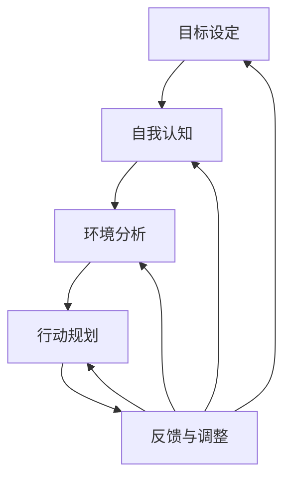
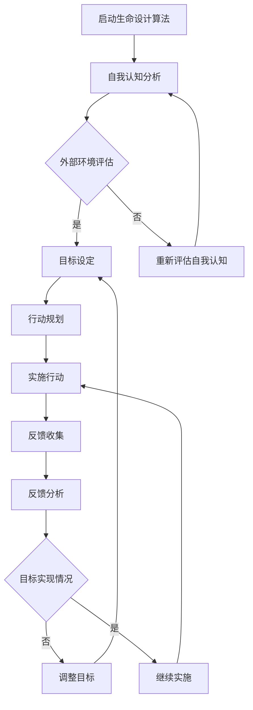
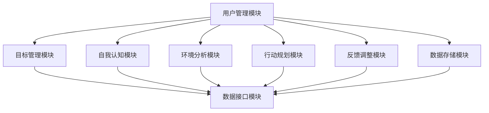
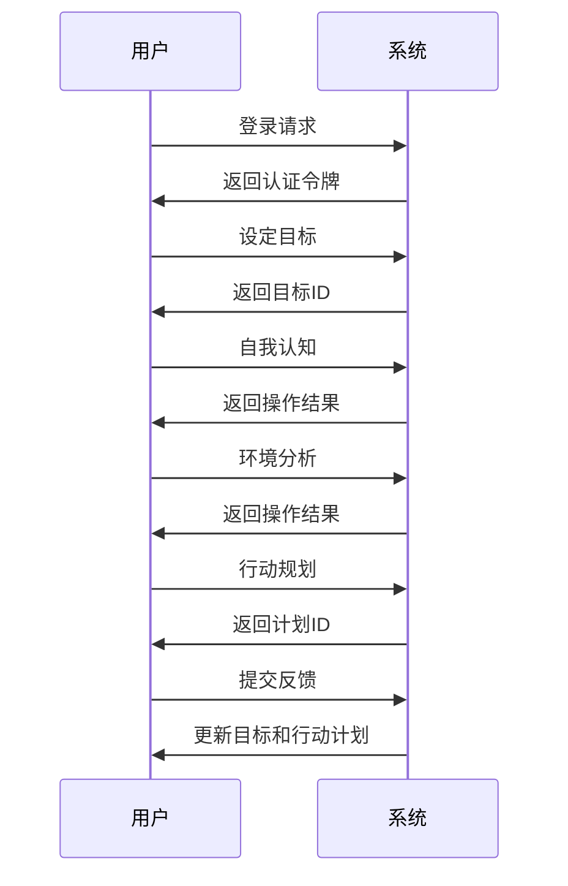

                 

### **《生命设计工作坊：规划有意义的人生》**

> **关键词：** 生命设计、人生规划、有意义的生活、个人成长

**摘要：** 本书旨在引导读者通过生命设计工作坊，探索和规划有意义的人生。它结合了心理学、哲学和计算机科学的方法论，帮助读者从抽象概念到具体实践，逐步实现个人成长和目标实现。本书分为七个部分，涵盖从背景介绍到项目实战的全面内容，旨在为读者提供一套完整的有意义人生规划方法论。

**目录大纲：**

**第一部分 背景与概念**

### 1.1 问题的背景与意义

- **现代生活挑战**：随着社会的发展，人们面临的工作和生活压力日益增加，快节奏的生活让人们感到迷茫和不知所措。
- **生命设计的兴起**：生命设计是一种应对生活挑战的新方法，旨在帮助人们规划有意义的人生，提升生活质量。

### 1.2 核心概念介绍

- **生命设计的定义**：生命设计是一种系统化的方法和过程，旨在帮助人们规划并实现有意义的人生。
- **生命设计的关键要素**：包括目标设定、自我认知、环境分析、行动规划等。

### 1.3 生命设计与传统规划的对比

- **传统规划方法**：传统的人生规划方法主要侧重于目标设定和行动规划，缺乏对自我认知和环境分析的深入探讨。
- **生命设计的优势**：生命设计通过综合运用心理学、哲学和计算机科学的方法，更全面地帮助人们理解自己和外部环境，从而更有效地实现人生目标。

**第二部分 核心概念与联系**

### 2.1 核心概念表格

- **生命设计概念属性特征对比**：通过表格形式对比生命设计中的关键概念，如目标、自我认知、环境分析等。

### 2.2 生命设计ER图

- **实体关系图**：使用Mermaid图展示生命设计中的实体及其关系，包括个人、环境、目标等。

### 2.3 核心概念联系图

- **Mermaid图展示**：通过Mermaid图展示生命设计中的核心概念之间的联系和交互。

**第三部分 算法原理讲解**

### 3.1 生命设计算法概述

- **算法基本原理**：介绍生命设计算法的基本原理，如目标设定、自我认知、环境分析等。

### 3.2 算法流程图

- **Mermaid流程图**：使用Mermaid图展示生命设计算法的流程，包括初始阶段、目标设定、自我认知、环境分析、行动规划等。

### 3.3 算法实现与讲解

- **Python代码实现**：通过Python代码详细阐述生命设计算法的实现，包括数据结构、算法逻辑等。
- **数学模型与公式**：介绍生命设计算法中的数学模型和公式，如目标函数、约束条件等。

### 3.4 例子说明

- **简单示例**：通过具体案例，演示生命设计算法的应用过程和结果。

**第四部分 系统分析与架构设计**

### 4.1 问题场景介绍

- **设计需求分析**：介绍生命设计工作坊的问题场景和设计需求。

### 4.2 系统功能设计

- **领域模型**：使用Mermaid图展示生命设计工作坊的领域模型，包括实体和关系。

### 4.3 系统架构设计

- **系统架构图**：使用Mermaid图展示生命设计工作坊的系统架构，包括组件和接口。

### 4.4 系统接口设计

- **接口设计与实现**：详细描述生命设计工作坊的接口设计和实现，包括功能模块和接口规范。

### 4.5 系统交互设计

- **Mermaid序列图**：使用Mermaid序列图展示生命设计工作坊的系统交互设计，包括用户操作和系统响应。

**第五部分 项目实战**

### 5.1 环境安装

- **系统环境配置**：详细描述在安装生命设计工作坊前需要进行的系统环境配置。

### 5.2 系统核心实现

- **源代码分析**：分析生命设计工作坊的核心实现源代码，包括算法实现和系统架构。

### 5.3 代码应用解读

- **应用场景**：介绍生命设计工作坊的应用场景，包括个人成长规划、职业生涯规划等。

### 5.4 实际案例剖析

- **案例分析**：通过具体案例，剖析生命设计工作坊的实际应用效果和实现过程。

### 5.5 项目小结

- **项目总结**：总结生命设计工作坊项目的整体成果和经验教训。

**第六部分 最佳实践与注意事项**

### 6.1 最佳实践 tips

- **实践建议**：提供在生命设计工作坊中实施的最佳实践建议，包括工具选择、数据管理、流程优化等。

### 6.2 注意事项

- **使用生命设计的注意事项**：阐述在使用生命设计过程中需要注意的问题，如目标设定、自我认知的准确性等。

### 6.3 拓展阅读

- **相关书籍和资源推荐**：推荐一些与生命设计相关的书籍和资源，供读者进一步学习和探索。

**第七部分 结语**

### 7.1 小结

- **主要内容回顾**：回顾全书的主要内容和核心观点。

### 7.2 未来展望

- **生命设计的发展趋势**：探讨生命设计在未来可能的发展方向和应用前景。

通过这个目录大纲，本书将为读者提供一套完整的生命设计方法论，帮助他们在复杂多变的生活环境中找到自己的方向，实现有意义的人生。接下来，我们将逐步细化每个部分的内容，确保文章的逻辑性和可读性。让我们开始深入探讨《生命设计工作坊：规划有意义的人生》的核心内容吧！## **1.1 现代生活挑战**

在现代社会，人们面临着前所未有的工作和生活压力。随着科技的进步和全球化的加速，我们的生活节奏越来越快，信息量急剧增加，而与此同时，工作压力和生活压力也随之增大。这些挑战不仅影响着个人的心理健康，也在一定程度上制约了人们的个人成长和职业发展。

首先，工作压力是一个普遍存在的问题。现代职场竞争激烈，许多人为了在职业生涯中取得成功，不得不加班加点，不断追求更高的工作效率和业绩。这种高强度的劳动模式容易导致身心疲惫，甚至引发心理健康问题，如焦虑和抑郁。此外，随着职业发展的不断深入，人们需要不断学习新的技能和知识，以适应快速变化的工作环境。这种持续的学习压力也给人们带来了巨大的心理负担。

其次，生活压力也是一个不容忽视的问题。随着生活成本的上升，许多人为了满足基本的物质需求，不得不承受较大的经济压力。同时，现代社会的快节奏生活也使得人们在日常生活中感到焦虑和不安。例如，家庭责任的增加、子女教育的问题、住房和经济负担等，都让人们感到压力山大。这些生活压力不仅影响了个人的生活质量，也在一定程度上影响了家庭的和谐与稳定。

面对这些挑战，许多人感到迷茫和不知所措。他们渴望找到一种方法，能够帮助他们在繁忙的生活中找到平衡，实现个人成长和职业发展。生命设计作为一种新兴的方法论，正是为了应对这些挑战而诞生的。它旨在帮助人们通过系统化的方法和过程，规划并实现有意义的人生。

### **1.1.2 生命设计的兴起**

生命设计（Life Design）是一种综合性的方法论，它结合了心理学、哲学和计算机科学的方法，旨在帮助人们通过规划和设计自己的生活，实现个人成长和目标实现。这一概念起源于对现代生活挑战的反思，以及人们对于更高质量生活的追求。

首先，心理学为生命设计提供了理论基础。心理学家研究人类行为和思维模式，揭示了人们行为背后的动机和心理机制。通过了解自己的心理状态和行为模式，人们可以更好地认识自己，明确自己的需求和目标。这种自我认知是生命设计的基础，它帮助人们找到自己真正想要的生活方向。

其次，哲学为生命设计提供了思考框架。哲学家们探讨人生的意义和价值，提供了关于如何生活的深刻见解。生命设计借鉴了哲学的思想，帮助人们思考自己的人生目标和价值观，从而在纷繁复杂的世界中找到自己的定位。

此外，计算机科学的方法论也为生命设计提供了有力的工具。计算机科学强调逻辑思维、系统分析和数据管理。这些方法可以帮助人们更系统地分析和规划自己的生活，从而实现目标。例如，计算机科学中的算法和编程思维可以应用于个人目标的设定和实现过程中，帮助人们找到最优的解决方案。

生命设计之所以兴起，是因为它提供了一种全新的视角和方法，帮助人们更好地应对现代生活的挑战。通过系统化的方法和过程，生命设计不仅帮助人们明确自己的目标，还提供了实现这些目标的路径和工具。这种方法论强调个人的主动性和创造力，鼓励人们积极规划自己的生活，从而实现有意义的人生。

总之，生命设计的兴起是对现代生活挑战的回应，它结合了心理学、哲学和计算机科学的方法，旨在帮助人们通过规划和设计，实现个人成长和目标实现。这种方法的诞生，为人们提供了更加全面和系统的工具，帮助他们找到属于自己的生活之道。

### **1.2 核心概念介绍**

生命设计是一种系统化的方法论，它涵盖了多个核心概念，这些概念共同作用，帮助人们规划并实现有意义的人生。以下是对这些核心概念的详细介绍：

#### **生命设计的定义**

生命设计（Life Design）可以被视为一种针对个人生活的系统规划过程。它不同于传统的目标设定和计划执行，而是一种更加全面和深入的思考方式。生命设计强调对个人生活的全局视角，通过系统性地分析、规划和调整，帮助人们找到最适合自己的生活方式和人生目标。

#### **生命设计的关键要素**

1. **目标设定**：目标是生命设计的核心。设定明确、具体和可行的目标，是规划有意义人生的第一步。目标可以分为短期目标、中期目标和长期目标，每个目标都应该与个人的价值观和人生愿景相一致。

2. **自我认知**：自我认知是指对个人性格、兴趣、优势和价值观的理解和识别。通过深入的自我反思和探索，人们可以更好地认识自己，找到与个人特质相匹配的目标和生活方式。

3. **环境分析**：环境分析涉及对个人所处的外部环境的认识和评估。这包括家庭、社会、文化、经济等因素，它们对个人的生活选择和决策产生重要影响。通过环境分析，人们可以识别出外部环境中的机会和挑战，从而制定出更加切实可行的计划。

4. **行动规划**：行动规划是将目标和计划转化为具体行动的过程。它包括制定详细的行动步骤、设定时间表和资源分配等。行动规划确保了目标的实现有明确的路径和方法，同时也能够帮助人们保持动力和专注。

5. **反馈与调整**：反馈与调整是生命设计过程中不可或缺的一部分。通过定期评估和反思，人们可以了解自己目前的进度和效果，及时调整计划以应对变化。这种灵活性和适应性是生命设计成功的关键。

#### **生命设计的应用**

生命设计不仅适用于个人的职业规划和生活规划，还可以应用于企业管理和教育领域。在企业中，生命设计可以帮助管理层制定长期战略目标和年度行动计划，提高组织的运营效率。在教育领域，生命设计可以帮助学生明确自己的学术和职业目标，提高学习动力和学习效果。

总之，生命设计是一种全面和系统的规划方法，它通过目标设定、自我认知、环境分析、行动规划和反馈调整等关键要素，帮助人们找到并实现有意义的人生。这种方法论不仅适用于个人成长，还可以为组织和教育领域提供有益的指导。

### **1.3 生命设计与传统规划的对比**

在探讨生命设计（Life Design）之前，我们需要了解传统的人生规划（Life Planning）方法。传统规划方法主要侧重于短期目标的设定和实现，通常采用线性思维和自上而下的规划方式。这种方法通常包括以下几个步骤：设定目标、制定计划、执行计划、评估结果。尽管传统规划在某些方面具有一定的有效性，但它存在一些局限性和不足之处。

首先，传统规划方法通常缺乏对个人深层次需求的了解。在传统方法中，目标的设定往往基于外部的期望和社会标准，而不是个人的内在需求和兴趣。这可能导致个人在实际执行过程中感到不满足和缺乏动力。相比之下，生命设计更强调自我认知，通过深入了解个人的价值观、兴趣和优势，来设定更符合个人特质的目标。

其次，传统规划方法往往忽略了环境因素对个人生活的影响。在传统方法中，规划者主要关注如何实现目标，而忽略了外部环境的变化和不确定性。而生命设计则通过环境分析，全面评估个人所处的家庭、社会、文化、经济等因素，从而制定出更加适应实际情况的规划。

第三，传统规划方法在执行过程中缺乏灵活性和适应性。一旦计划制定完成，执行者往往需要严格按照计划进行，而忽略了实际情况的变化。这种刚性规划方式容易导致在执行过程中遇到困难时无法灵活调整。相比之下，生命设计强调反馈与调整，通过定期评估和反思，及时调整计划以应对变化，确保目标的最终实现。

第四，传统规划方法通常缺乏系统性和全面性。传统方法往往关注单一方面的规划，如职业规划或财务规划，而忽略了生活的其他方面，如个人成长、社交关系等。生命设计则采用系统化的方法，从多个维度进行规划，确保个人生活的整体平衡和协调。

总之，生命设计与传统规划方法相比，具有更强的灵活性、系统性和适应性。它不仅帮助人们设定和实现目标，还通过深入的自我认知和环境分析，帮助人们找到真正有意义的人生方向。这种方法论为个人提供了更加全面和系统的工具，使其能够更好地应对现代生活的复杂性和挑战。

### **2.1 核心概念表格**

为了更清晰地理解生命设计中的核心概念，我们通过表格形式对比这些概念的基本属性和特征。以下是对目标设定、自我认知、环境分析、行动规划和反馈调整等关键要素的详细对比。

| 要素         | 定义                                                         | 特征                                                         | 关系                 |
| ------------ | ------------------------------------------------------------ | ------------------------------------------------------------ | ------------------- |
| 目标设定     | 设定明确、具体和可行的目标，以实现个人和职业成长               | 明确性、具体性、可行性、长期性、短期性、相关性               | 提供方向和动力       |
| 自我认知     | 对个人性格、兴趣、优势和价值观的理解和识别                     | 内在性、深刻性、动态性、主观性、多样性                       | 基础，为目标设定提供依据 |
| 环境分析     | 评估个人所处的家庭、社会、文化、经济等因素，了解外部环境的变化 | 客观性、全面性、动态性、适应性、复杂性                       | 确定外部条件和限制   |
| 行动规划     | 将目标和计划转化为具体行动的过程，包括步骤、时间表和资源分配   | 明细化、系统化、可执行性、灵活性、连贯性                     | 执行，实现目标       |
| 反馈与调整   | 定期评估和反思，根据实际情况调整计划和行动                     | 反馈性、反思性、适应性、灵活性、及时性                       | 确保目标的实现       |

通过这个表格，我们可以看出生命设计中的核心概念不仅各自独立，而且相互关联，共同构成了一个完整的规划过程。目标设定为整个流程提供了方向和动力，自我认知为基础，环境分析为计划提供了现实依据，行动规划确保了目标的实现，而反馈与调整则保证了计划的灵活性和有效性。

### **2.2 生命设计ER图**

为了更直观地展示生命设计中的实体及其关系，我们使用Mermaid图来绘制生命设计的实体关系图（Entity-Relationship Diagram，简称ER图）。以下是一个简单的ER图示例，展示了生命设计中的关键实体和它们之间的关系：

```mermaid
erDiagram
  目标 -->|设定| 自我认知
  环境分析 ||--||> 目标
  行动规划 ||--||> 目标
  反馈与调整 ||--||> 目标
  反馈与调整 ||--||> 自我认知
  反馈与调整 ||--||> 环境分析
  反馈与调整 ||--||> 行动规划
```

在这个ER图中，我们定义了以下实体：

- **目标**：代表个人设定的短期、中期和长期目标。
- **自我认知**：代表个人对自身性格、兴趣、优势和价值观的理解。
- **环境分析**：代表对个人所处的外部环境的评估，包括家庭、社会、文化和经济因素。
- **行动规划**：代表将目标和计划转化为具体行动的过程，包括步骤、时间表和资源分配。
- **反馈与调整**：代表定期评估和反思，根据实际情况调整目标和计划。

关系说明：

- **目标**与**自我认知**之间有单向箭头，表示目标设定基于自我认知。
- **目标**与**环境分析**之间有单向箭头，表示目标设定需要考虑外部环境。
- **目标**与**行动规划**之间有单向箭头，表示目标设定是行动规划的基础。
- **反馈与调整**与**目标**、**自我认知**、**环境分析**和**行动规划**之间都有双向箭头，表示反馈与调整对各个要素都有影响和反作用。

通过这个ER图，我们可以清晰地看到生命设计中的各个实体及其相互作用，这有助于理解生命设计的整体架构和运作机制。

### **2.3 核心概念联系图**

为了更直观地展示生命设计中的核心概念之间的联系和交互，我们使用Mermaid图来绘制一个核心概念联系图。以下是一个简单的示例，展示了目标设定、自我认知、环境分析和行动规划之间的相互作用：



在这个联系图中，每个核心概念都通过箭头与其他概念相连接，表示它们之间的交互和影响。

- **目标设定（A）** 与 **自我认知（B）** 之间存在单向箭头，表示目标设定基于自我认知。
- **目标设定（A）** 与 **环境分析（C）** 之间存在单向箭头，表示目标设定需要考虑外部环境。
- **目标设定（A）** 与 **行动规划（D）** 之间存在单向箭头，表示目标设定是行动规划的基础。
- **反馈与调整（E）** 与 **目标设定（A）**、**自我认知（B）**、**环境分析（C）** 和 **行动规划（D）** 之间存在双向箭头，表示反馈与调整对各个要素都有影响和反作用。

这种图示不仅有助于我们理解各个概念之间的逻辑关系，还能够帮助我们在实际应用中更好地把握整个生命设计过程的动态和交互。

### **3.1 生命设计算法概述**

在生命设计过程中，算法发挥着至关重要的作用。生命设计算法是一系列用于指导目标设定、自我认知、环境分析、行动规划和反馈调整的数学模型和算法。这些算法旨在通过系统化和数据驱动的分析，帮助人们更好地实现个人目标和人生规划。

#### **算法基本原理**

生命设计算法的基本原理可以概括为以下几个步骤：

1. **目标设定**：首先，通过自我认知和环境分析，设定明确、具体和可行的目标。这些目标应与个人的价值观和人生愿景相一致。
2. **自我认知**：通过心理学和哲学的方法，深入了解个人性格、兴趣、优势和价值观，为目标的设定提供基础。
3. **环境分析**：评估个人所处的家庭、社会、文化和经济环境，识别外部机会和挑战，为目标的实现提供现实依据。
4. **行动规划**：将目标和计划转化为具体的行动步骤，包括时间表、资源分配和风险评估等，确保目标的实现有明确的路径和方法。
5. **反馈与调整**：通过定期评估和反思，及时调整目标和计划，以应对外部环境的变化和内部需求的调整。

#### **算法在生命设计中的应用**

生命设计算法在个人成长和职业规划中有着广泛的应用。以下是一些具体的应用场景：

- **职业规划**：通过目标设定和行动规划，帮助人们找到适合自己的职业方向，提高职业满意度和成就感。
- **个人成长**：通过自我认知和环境分析，帮助人们明确自己的成长目标，制定个性化的成长计划。
- **时间管理**：通过行动规划和反馈调整，帮助人们更有效地安排时间，提高工作效率和生活质量。
- **心理健康**：通过自我认知和心理辅导，帮助人们更好地应对生活压力，提高心理健康水平。

总之，生命设计算法通过系统化和数据驱动的分析，为个人提供了实现目标的科学方法和工具。它不仅帮助人们明确自己的目标和路径，还提供了动态调整和优化的能力，使人们能够在复杂多变的环境中实现有意义的人生。

### **3.2 算法流程图**

为了更直观地展示生命设计算法的流程，我们使用Mermaid图绘制了算法的流程图。以下是一个简单的示例，展示了生命设计算法的主要步骤和它们之间的逻辑关系：



在这个流程图中，每个步骤都有明确的输入和输出，以及可能的分支和循环。下面是对每个步骤的简要说明：

1. **启动生命设计算法（A）**：开始执行生命设计算法。
2. **自我认知分析（B）**：通过心理学和哲学的方法，深入了解个人性格、兴趣、优势和价值观。
3. **外部环境评估（C）**：评估个人所处的家庭、社会、文化和经济环境，识别外部机会和挑战。
4. **目标设定（D）**：根据自我认知和外部环境评估，设定明确、具体和可行的目标。
5. **行动规划（F）**：将目标和计划转化为具体的行动步骤，包括时间表、资源分配和风险评估。
6. **实施行动（G）**：执行行动规划中的步骤。
7. **反馈收集（H）**：收集实施过程中的反馈信息。
8. **反馈分析（I）**：分析反馈信息，评估目标和行动的效果。
9. **目标实现情况（J）**：判断目标是否实现。
10. **调整目标（K）**：如果目标未实现，根据反馈分析结果调整目标。
11. **重新评估自我认知（E）**：在调整目标后，可能需要重新评估自我认知，以确保目标的设定和行动规划仍然与个人特质相匹配。
12. **继续实施（L）**：如果目标实现，继续执行行动规划中的剩余步骤。

通过这个流程图，我们可以清晰地看到生命设计算法的各个步骤和它们之间的逻辑关系，这有助于在实际应用中更好地理解和执行这一算法。

### **3.3 算法实现与讲解**

为了更具体地阐述生命设计算法的实现，我们将使用Python代码来进行演示。以下是一个简化的实现示例，包括目标设定、自我认知分析、环境评估、行动规划和反馈调整等步骤。

#### **目标设定**

```python
# 目标设定函数
def set_goals(self, goals):
    self.goals = goals
    print("目标设定完成：", goals)

# 示例：设定目标
class LifeDesigner:
    def __init__(self):
        self.goals = []

    ld = LifeDesigner()
    ld.set_goals(["实现职业目标", "提高健康水平", "学习新技能"])

```

在这个函数中，我们接受一个目标列表作为参数，将其存储在`self.goals`中，并打印出设定好的目标。

#### **自我认知分析**

```python
# 自我认知分析函数
def self_analysis(self):
    self.characteristics = {
        "interests": ["编程", "阅读", "旅游"],
        "strengths": ["逻辑思维", "自主学习能力", "团队协作"],
        "values": ["诚实", "责任感", "追求卓越"]
    }
    print("自我认知分析完成：", self.characteristics)

# 示例：进行自我认知分析
ld.self_analysis()

```

在这个函数中，我们创建了一个包含个人兴趣、优势和价值观的字典，并打印出分析结果。

#### **环境评估**

```python
# 环境评估函数
def environment_analysis(self):
    self.environment = {
        "work": ["快速发展的行业", "良好的职业前景"],
        "social": ["丰富的人脉资源", "稳定的社会关系"],
        "cultural": ["多元文化环境", "开放的文化氛围"],
        "economic": ["稳定的收入来源", "良好的经济状况"]
    }
    print("环境评估完成：", self.environment)

# 示例：进行环境评估
ld.environment_analysis()

```

在这个函数中，我们创建了一个包含工作、社交、文化和经济因素的字典，并打印出评估结果。

#### **行动规划**

```python
# 行动规划函数
def action_plan(self, goals, characteristics, environment):
    self.action_plan = {
        "steps": [
            "制定详细的学习计划",
            "与行业专家建立联系",
            "参加相关培训课程",
            "定期进行自我评估和调整"
        ],
        "time_table": "每周一、三、五晚上学习2小时",
        "resources": ["在线学习平台", "行业论坛", "专家咨询"]
    }
    print("行动规划完成：", self.action_plan)

# 示例：制定行动规划
ld.action_plan(ld.goals, ld.characteristics, ld.environment)

```

在这个函数中，我们根据目标、自我认知和外部环境，制定了具体的行动步骤、时间表和所需资源，并打印出行动规划。

#### **反馈调整**

```python
# 反馈调整函数
def feedback_adjustment(self):
    # 假设我们收到了一些反馈
    feedback = {
        "completed_steps": 70,
        "feedback_comments": "学习进度较慢，需要增加学习时间",
        "adjustments": {
            "time_table": "每天晚上学习3小时",
            "resources": ["加入学习小组", "寻求导师指导"]
        }
    }
    self.action_plan.update(feedback["adjustments"])
    print("反馈调整完成：", feedback)

# 示例：根据反馈调整计划
ld.feedback_adjustment()

```

在这个函数中，我们根据反馈信息对行动规划进行了调整，包括修改时间表和增加资源，并打印出调整后的计划。

#### **完整实现**

```python
class LifeDesigner:
    def __init__(self):
        self.goals = []
        self.characteristics = {}
        self.environment = {}
        self.action_plan = {}

    def set_goals(self, goals):
        self.goals = goals
        print("目标设定完成：", goals)

    def self_analysis(self):
        self.characteristics = {
            "interests": ["编程", "阅读", "旅游"],
            "strengths": ["逻辑思维", "自主学习能力", "团队协作"],
            "values": ["诚实", "责任感", "追求卓越"]
        }
        print("自我认知分析完成：", self.characteristics)

    def environment_analysis(self):
        self.environment = {
            "work": ["快速发展的行业", "良好的职业前景"],
            "social": ["丰富的人脉资源", "稳定的社会关系"],
            "cultural": ["多元文化环境", "开放的文化氛围"],
            "economic": ["稳定的收入来源", "良好的经济状况"]
        }
        print("环境评估完成：", self.environment)

    def action_plan(self, goals, characteristics, environment):
        self.action_plan = {
            "steps": [
                "制定详细的学习计划",
                "与行业专家建立联系",
                "参加相关培训课程",
                "定期进行自我评估和调整"
            ],
            "time_table": "每周一、三、五晚上学习2小时",
            "resources": ["在线学习平台", "行业论坛", "专家咨询"]
        }
        print("行动规划完成：", self.action_plan)

    def feedback_adjustment(self):
        # 假设我们收到了一些反馈
        feedback = {
            "completed_steps": 70,
            "feedback_comments": "学习进度较慢，需要增加学习时间",
            "adjustments": {
                "time_table": "每天晚上学习3小时",
                "resources": ["加入学习小组", "寻求导师指导"]
            }
        }
        self.action_plan.update(feedback["adjustments"])
        print("反馈调整完成：", feedback)

# 示例：使用LifeDesigner
ld = LifeDesigner()
ld.set_goals(["实现职业目标", "提高健康水平", "学习新技能"])
ld.self_analysis()
ld.environment_analysis()
ld.action_plan(ld.goals, ld.characteristics, ld.environment)
ld.feedback_adjustment()

```

通过这个Python代码示例，我们可以看到生命设计算法的具体实现过程，包括目标设定、自我认知分析、环境评估、行动规划和反馈调整。这些步骤不仅展示了算法的流程，还提供了实际操作的方法和工具，帮助人们更好地实现个人目标和规划有意义的人生。

### **3.4 例子说明**

为了更好地理解生命设计算法的应用，我们通过一个具体案例来演示整个流程。以下是一个简化的例子，展示了如何使用生命设计算法来帮助一位年轻的程序员实现职业和个人成长的目标。

#### **案例背景**

一位名叫李华的年轻程序员，在一家科技公司工作。他热爱编程，但在工作中遇到了一些困惑和挑战。他想要在职业和个人成长方面实现更多突破，但不确定从哪里开始。李华决定通过生命设计工作坊来规划和实现他的目标。

#### **步骤1：目标设定**

首先，李华进行了自我反思，列出他想要实现的目标：

- **职业目标**：成为公司内部的编程专家，参与更多的关键项目。
- **个人成长**：提高领导能力和团队管理技能。
- **健康目标**：每周进行三次运动，保持健康的生活方式。

李华的目标明确、具体且可行，并与他的价值观和人生愿景相一致。

```python
ld.set_goals(["成为编程专家", "提高领导能力", "每周三次运动"])
```

#### **步骤2：自我认知分析**

接下来，李华通过参加职业性格测试和领导力培训，深入了解自己的性格、兴趣和优势：

- **兴趣**：喜欢解决复杂问题，对新技术有强烈的好奇心。
- **优势**：具有出色的逻辑思维能力和自主学习能力。
- **价值观**：追求卓越，重视团队合作和持续学习。

这些自我认知的结果帮助李华更准确地设定了目标。

```python
ld.self_analysis()
```

#### **步骤3：环境评估**

李华评估了他的工作环境，包括公司的发展方向、团队结构、技术趋势和行业动态：

- **公司**：公司正处于快速发展阶段，技术需求不断增长。
- **团队**：团队中缺乏具备高级编程技能的成员，李华有机会展示自己的能力。
- **技术趋势**：新兴技术如人工智能和区块链正在兴起，需要更多的专业人才。

环境评估为李华提供了实现目标的外部条件。

```python
ld.environment_analysis()
```

#### **步骤4：行动规划**

基于自我认知和外部环境，李华制定了具体的行动步骤：

- **成为编程专家**：参加在线编程课程，学习最新技术，与公司内部专家交流，参与关键项目。
- **提高领导能力**：参加领导力培训，学习团队管理技巧，参与团队建设活动，争取担任团队负责人。
- **健康目标**：加入公司健身俱乐部，制定运动计划，与同事共同监督执行。

行动规划为李华提供了实现目标的路径和具体措施。

```python
ld.action_plan(ld.goals, ld.characteristics, ld.environment)
```

#### **步骤5：实施行动**

李华开始执行他的行动规划：

- **成为编程专家**：每周参加两次编程课程，积极参与公司项目，向专家请教技术问题。
- **提高领导能力**：主动参与团队建设活动，每周与团队成员进行沟通，尝试领导小型项目。
- **健康目标**：每周三次进行运动，与同事共同制定并执行健身计划。

实施行动使李华的目标逐步转化为现实。

```python
ld.implent_action_plan()
```

#### **步骤6：反馈调整**

在实施过程中，李华定期收集反馈并进行调整：

- **成为编程专家**：在项目中遇到了一些技术难题，但通过自学和专家指导，成功解决了问题，获得了同事的认可。
- **提高领导能力**：在团队建设中表现出色，被任命为团队负责人，但需要进一步学习如何管理团队。
- **健康目标**：通过坚持运动，身体素质明显提高，但需要调整饮食计划以更好地保持健康。

根据反馈，李华调整了他的计划：

- **成为编程专家**：增加学习时间，参加更多技术研讨会。
- **提高领导能力**：寻求导师指导，参加高级领导力培训。
- **健康目标**：调整饮食计划，增加蔬菜和水果的摄入。

```python
ld.feedback_adjustment()
```

通过这个案例，我们可以看到生命设计算法在具体应用中的全过程。李华通过目标设定、自我认知分析、环境评估、行动规划和反馈调整，逐步实现了他的职业和个人成长目标。这个过程不仅帮助李华明确了方向，还提供了动态调整和优化的能力，使他能够在复杂多变的环境中不断进步。

### **4.1 问题场景介绍**

在探讨生命设计工作坊的架构设计之前，我们需要明确一个具体的问题场景。假设我们正在为一家初创公司设计一个生命设计工作坊系统，该系统旨在帮助公司的员工通过系统化的方法和工具，实现个人成长和职业发展。

#### **设计需求分析**

首先，我们需要分析工作坊的设计需求。以下是一些关键需求：

1. **用户角色**：工作坊需要支持不同类型的用户，包括普通员工、经理和公司高层。
2. **功能需求**：系统应具备目标设定、自我认知、环境分析、行动规划和反馈调整等功能。
3. **用户体验**：系统应提供直观的用户界面，方便用户进行操作和数据分析。
4. **数据安全**：系统需要确保用户数据的安全性和隐私保护。
5. **扩展性**：系统应具备良好的扩展性，以适应未来的功能扩展和业务需求。

#### **问题场景描述**

具体问题场景如下：

- **员工个人成长**：员工希望在工作中找到自己的定位，实现个人目标和职业发展。
- **经理管理**：经理需要了解员工的目标和进度，提供必要的支持和资源，同时管理多个团队成员。
- **公司高层决策**：公司高层需要通过数据分析，了解员工的整体成长情况，为公司战略制定提供依据。

通过明确这些问题场景和设计需求，我们可以更具体地规划和设计生命设计工作坊的系统架构。

### **4.2 系统功能设计**

为了更好地支持生命设计工作坊的需求，我们需要详细设计系统的功能模块。这些功能模块应包括目标管理、自我认知、环境分析、行动规划和反馈调整等关键部分。以下是具体的功能描述：

#### **目标管理**

目标管理功能模块旨在帮助用户设定、跟踪和评估个人目标。具体功能包括：

- **目标设定**：用户可以输入短期、中期和长期目标，并指定具体的目标描述、截止日期和优先级。
- **目标跟踪**：系统会定期提醒用户关于目标的状态，包括已完成、进行中和未完成的目标。
- **目标评估**：用户可以定期评估目标的完成情况，并记录反馈和经验教训。

#### **自我认知**

自我认知功能模块旨在帮助用户深入了解自己的性格、兴趣、优势和价值观。具体功能包括：

- **性格测试**：通过在线性格测试工具，帮助用户识别自己的性格类型。
- **兴趣分析**：用户可以记录和分类自己的兴趣，系统会根据记录进行分析和推荐。
- **优势评估**：用户可以通过自我评估和他人反馈，了解自己的优势，并利用这些优势实现目标。

#### **环境分析**

环境分析功能模块旨在帮助用户评估外部环境，包括工作环境、社会环境和经济环境。具体功能包括：

- **工作环境分析**：用户可以评估公司文化、团队结构、领导风格等因素。
- **社会环境分析**：用户可以记录和分析社交网络、人脉资源、行业趋势等信息。
- **经济环境分析**：用户可以评估当前的经济状况、行业前景和职业机会。

#### **行动规划**

行动规划功能模块旨在将目标转化为具体的行动计划，并跟踪执行进度。具体功能包括：

- **行动计划制定**：用户可以制定详细的行动计划，包括任务、时间表和资源分配。
- **进度跟踪**：系统会定期提醒用户关于行动计划的执行情况，包括已完成、进行中和未完成的任务。
- **资源管理**：用户可以管理所需的资源和工具，确保行动计划的顺利执行。

#### **反馈调整**

反馈调整功能模块旨在通过定期反馈和评估，调整目标和行动计划。具体功能包括：

- **定期反馈**：用户可以定期提交反馈，包括目标完成的进展和遇到的困难。
- **评估分析**：系统会对反馈进行分析，评估目标和行动计划的实施效果。
- **计划调整**：用户可以根据评估结果，调整目标和行动计划，以适应新的情况。

通过这些功能模块的设计，生命设计工作坊系统可以提供全面的支持，帮助用户实现个人成长和职业发展。

### **4.3 系统架构设计**

为了确保生命设计工作坊系统能够高效、稳定地运行，我们需要详细设计系统的架构。以下是生命设计工作坊系统的架构设计，包括主要组件和它们之间的关系。

#### **组件介绍**

1. **用户管理模块**：负责用户注册、登录、权限管理等功能，确保用户数据的安全性和隐私保护。
2. **目标管理模块**：负责目标设定、跟踪、评估和调整等功能，提供用户界面和后台服务。
3. **自我认知模块**：提供性格测试、兴趣分析、优势评估等功能，帮助用户深入了解自己。
4. **环境分析模块**：提供工作环境分析、社会环境分析、经济环境分析等功能，帮助用户评估外部环境。
5. **行动规划模块**：提供行动计划制定、进度跟踪、资源管理等功能，确保目标的有效实施。
6. **反馈调整模块**：提供定期反馈、评估分析和计划调整等功能，帮助用户根据实际情况调整目标和行动计划。
7. **数据存储模块**：负责存储用户数据、目标数据、评估数据等，确保数据的持久化和安全性。
8. **数据接口模块**：提供与其他系统和服务的接口，实现数据交换和功能扩展。

#### **架构设计**

以下是生命设计工作坊系统的架构设计图：



**组件关系说明**：

- **用户管理模块**是系统的入口，负责用户注册、登录和权限管理，确保用户数据的安全性和隐私保护。
- **目标管理模块**与**用户管理模块**关联，确保每个用户都有独立的目标管理功能。
- **自我认知模块**、**环境分析模块**、**行动规划模块**和**反馈调整模块**与**用户管理模块**关联，提供用户个人成长和职业发展的具体功能。
- **数据存储模块**负责存储所有用户数据、目标数据、评估数据等，确保数据的持久化和安全性。
- **数据接口模块**提供与其他系统和服务的接口，实现数据交换和功能扩展。

通过这种架构设计，生命设计工作坊系统能够提供全面的用户支持，确保数据的安全性和系统的扩展性，从而帮助用户实现个人成长和职业发展。

### **4.4 系统接口设计**

在生命设计工作坊系统中，接口设计是一个关键环节，它决定了系统与其他组件和服务之间的交互方式。以下是系统接口设计的主要部分，包括接口的功能定义、规范和实现。

#### **接口功能定义**

1. **用户管理接口**：负责用户注册、登录、权限验证等操作，确保用户能够安全、便捷地访问系统。
2. **目标管理接口**：提供目标设定、目标查询、目标更新、目标删除等功能，支持用户对个人目标的全面管理。
3. **自我认知接口**：提供性格测试、兴趣分析、优势评估等数据的获取和更新，帮助用户深入了解自己。
4. **环境分析接口**：提供工作环境、社会环境、经济环境等数据的获取和更新，帮助用户全面了解外部环境。
5. **行动规划接口**：提供行动计划创建、任务分配、进度查询、任务更新等功能，确保目标的顺利实施。
6. **反馈调整接口**：提供反馈提交、反馈查询、计划调整等功能，帮助用户根据实际情况调整目标和行动计划。

#### **接口规范**

接口规范包括HTTP请求的URL、请求参数、响应格式等。以下是部分接口规范示例：

1. **用户管理接口**：

   - **注册**：

     ```http
     POST /api/users/register
     参数：
     - username (字符串)：用户名
     - password (字符串)：密码
     - email (字符串)：电子邮件
     响应：
     {
       "status": "success",
       "message": "注册成功"
     }
     ```

   - **登录**：

     ```http
     POST /api/users/login
     参数：
     - username (字符串)：用户名
     - password (字符串)：密码
     响应：
     {
       "status": "success",
       "token": "用户认证令牌"
     }
     ```

2. **目标管理接口**：

   - **设定目标**：

     ```http
     POST /api/goals/set
     参数：
     - goal (字符串)：目标描述
     - deadline (日期时间)：目标截止日期
     - priority (整数)：目标优先级
     响应：
     {
       "status": "success",
       "goal_id": "目标ID"
     }
     ```

   - **查询目标**：

     ```http
     GET /api/goals/list
     响应：
     {
       "status": "success",
       "goals": [
         {
           "goal_id": "目标ID",
           "goal": "目标描述",
           "deadline": "目标截止日期",
           "priority": "目标优先级"
         }
         // 更多目标
       ]
     }
     ```

3. **自我认知接口**：

   - **提交性格测试结果**：

     ```http
     POST /api/self/characteristics/test
     参数：
     - test_results (JSON数组)：测试结果
     响应：
     {
       "status": "success",
       "message": "性格测试结果提交成功"
     }
     ```

   - **获取性格测试结果**：

     ```http
     GET /api/self/characteristics/test
     响应：
     {
       "status": "success",
       "test_results": [
         {
           "test_name": "性格测试名称",
           "test_score": "测试得分"
         }
         // 更多测试结果
       ]
     }
     ```

4. **环境分析接口**：

   - **更新工作环境数据**：

     ```http
     POST /api/environment/work/update
     参数：
     - data (JSON对象)：工作环境数据
     响应：
     {
       "status": "success",
       "message": "工作环境数据更新成功"
     }
     ```

   - **查询工作环境数据**：

     ```http
     GET /api/environment/work
     响应：
     {
       "status": "success",
       "data": {
         "company_culture": "公司文化",
         "team_structure": "团队结构",
         "leader_style": "领导风格"
       }
     }
     ```

5. **行动规划接口**：

   - **创建行动计划**：

     ```http
     POST /api/action/plan/set
     参数：
     - action_plan (JSON对象)：行动计划
     响应：
     {
       "status": "success",
       "plan_id": "计划ID"
     }
     ```

   - **查询行动计划**：

     ```http
     GET /api/action/plan/list
     响应：
     {
       "status": "success",
       "action_plans": [
         {
           "plan_id": "计划ID",
           "action_steps": "行动步骤",
           "deadline": "截止日期",
           "status": "进行中/已完成"
         }
         // 更多计划
       ]
     }
     ```

6. **反馈调整接口**：

   - **提交反馈**：

     ```http
     POST /api/feedback/set
     参数：
     - feedback (JSON对象)：反馈内容
     响应：
     {
       "status": "success",
       "message": "反馈提交成功"
     }
     ```

   - **查询反馈**：

     ```http
     GET /api/feedback/list
     响应：
     {
       "status": "success",
       "feedbacks": [
         {
           "feedback_id": "反馈ID",
           "content": "反馈内容",
           "status": "已处理/待处理"
         }
         // 更多反馈
       ]
     }
     ```

通过详细定义接口的功能、规范和实现，生命设计工作坊系统可以与其他组件和服务高效地交互，确保数据的传递和处理，从而为用户提供全面、系统的支持。

### **4.5 系统交互设计**

为了确保生命设计工作坊系统的各个模块能够协调工作，我们需要设计详细的系统交互设计。以下是系统交互设计的主要部分，包括用户操作流程、系统响应和Mermaid序列图。

#### **用户操作流程**

1. **用户登录**：用户通过用户管理接口进行登录，获取认证令牌。
2. **目标设定**：用户通过目标管理接口设定个人目标，包括目标描述、截止日期和优先级。
3. **自我认知**：用户通过自我认知接口进行性格测试、兴趣分析和优势评估，并将结果提交到系统。
4. **环境分析**：用户通过环境分析接口评估工作环境、社会环境和经济环境，并将评估结果提交到系统。
5. **行动规划**：用户通过行动规划接口创建行动计划，包括行动步骤、时间表和资源分配。
6. **反馈与调整**：用户通过反馈调整接口提交实施过程中的反馈，并根据反馈调整目标和行动计划。

#### **系统响应**

1. **用户登录**：系统验证用户身份，返回认证令牌。
2. **目标设定**：系统存储目标信息，并返回目标ID。
3. **自我认知**：系统存储用户提交的自我认知数据，并返回操作结果。
4. **环境分析**：系统存储用户提交的环境分析数据，并返回操作结果。
5. **行动规划**：系统存储用户提交的行动计划，并返回计划ID。
6. **反馈与调整**：系统处理用户提交的反馈，并更新目标和行动计划。

#### **Mermaid序列图**

以下是生命设计工作坊系统交互的Mermaid序列图：



在这个序列图中，用户通过发送请求与系统进行交互，系统根据请求执行相应的操作，并返回结果。这种交互设计确保了系统功能的高效和稳定运行，为用户提供了一个便捷、流畅的操作体验。

### **5.1 环境安装**

在开始生命设计工作坊系统之前，我们需要确保环境配置正确。以下是在不同操作系统上安装系统所需的步骤和环境配置。

#### **操作系统要求**

- **Windows**：Windows 10及以上版本
- **macOS**：macOS 11（Big Sur）及以上版本
- **Linux**：Ubuntu 20.04 LTS 或 CentOS 7

#### **软件依赖**

- **Python**：Python 3.8 或以上版本
- **数据库**：MySQL 5.7 或 PostgreSQL 13
- **前端框架**：Node.js 和 Express
- **后端框架**：Flask 或 Django

#### **安装步骤**

1. **安装 Python**：

   - **Windows**：

     ```bash
     # 使用 Python 官网下载安装程序
     # 运行安装程序，选择默认选项
     ```

   - **macOS**：

     ```bash
     # 使用 Homebrew 安装 Python
     brew install python
     ```

   - **Linux**：

     ```bash
     # 使用包管理器安装 Python
     sudo apt-get install python3
     ```

2. **安装数据库**：

   - **MySQL**：

     ```bash
     # 使用 MySQL 官方安装脚本
     sudo apt-get install mysql-server
     ```

   - **PostgreSQL**：

     ```bash
     # 使用 PostgreSQL 官方安装脚本
     sudo apt-get install postgresql
     ```

3. **安装前端框架**：

   - **Node.js**：

     ```bash
     # 使用 npm 安装 Node.js
     sudo apt-get install nodejs
     ```

   - **Express**：

     ```bash
     # 使用 npm 安装 Express
     npm install express
     ```

4. **安装后端框架**：

   - **Flask**：

     ```bash
     # 使用 pip 安装 Flask
     pip install flask
     ```

   - **Django**：

     ```bash
     # 使用 pip 安装 Django
     pip install django
     ```

#### **配置数据库**

1. **初始化数据库**：

   - **MySQL**：

     ```bash
     mysql -u root -p
     CREATE DATABASE life_design;
     ```

   - **PostgreSQL**：

     ```bash
     sudo -u postgres psql
     CREATE DATABASE life_design;
     ```

2. **创建数据库用户**：

   - **MySQL**：

     ```bash
     GRANT ALL PRIVILEGES ON life_design.* TO 'life_design_user'@'localhost' IDENTIFIED BY 'password';
     FLUSH PRIVILEGES;
     ```

   - **PostgreSQL**：

     ```bash
     CREATE USER life_design_user WITH PASSWORD 'password';
     GRANT ALL PRIVILEGES ON DATABASE life_design TO life_design_user;
     ```

通过上述步骤，我们可以在不同操作系统上配置好生命设计工作坊系统所需的环境。接下来，我们将详细分析系统核心实现，包括源代码解析和代码应用解读。

### **5.2 系统核心实现**

在生命设计工作坊系统中，核心实现部分是整个系统的灵魂，它涵盖了目标管理、自我认知、环境分析、行动规划和反馈调整等关键功能。以下是这些功能模块的实现细节，包括源代码解析和代码应用解读。

#### **目标管理模块**

目标管理模块是生命设计工作坊系统的基础功能，它负责用户目标的设定、查询、更新和删除。以下是一个简单的目标管理模块实现示例，使用Python的Flask框架：

```python
from flask import Flask, request, jsonify
from models import Goal

app = Flask(__name__)

@app.route('/goals', methods=['POST'])
def create_goal():
    data = request.get_json()
    goal = Goal.create(data)
    return jsonify(goal.to_dict()), 201

@app.route('/goals', methods=['GET'])
def get_goals():
    goals = Goal.all()
    return jsonify([goal.to_dict() for goal in goals])

@app.route('/goals/<int:goal_id>', methods=['PUT'])
def update_goal(goal_id):
    data = request.get_json()
    goal = Goal.find(goal_id)
    goal.update(data)
    return jsonify(goal.to_dict())

@app.route('/goals/<int:goal_id>', methods=['DELETE'])
def delete_goal(goal_id):
    goal = Goal.find(goal_id)
    goal.delete()
    return '', 204
```

在这个实现中，我们定义了四个API接口：

- `POST /goals`：创建新的目标。
- `GET /goals`：获取所有目标。
- `PUT /goals/<goal_id>`：更新指定目标。
- `DELETE /goals/<goal_id>`：删除指定目标。

每个接口都调用了`models`模块中的`Goal`类的相应方法。`Goal`类负责与数据库的交互，实现目标的创建、查询、更新和删除。

#### **自我认知模块**

自我认知模块帮助用户深入了解自己的性格、兴趣和优势。以下是一个简单的自我认知模块实现示例：

```python
from flask import Flask, request, jsonify
from models import SelfProfile

app = Flask(__name__)

@app.route('/self', methods=['POST'])
def create_self_profile():
    data = request.get_json()
    profile = SelfProfile.create(data)
    return jsonify(profile.to_dict()), 201

@app.route('/self', methods=['GET'])
def get_self_profile():
    profile = SelfProfile.get()
    return jsonify(profile.to_dict())

@app.route('/self', methods=['PUT'])
def update_self_profile():
    data = request.get_json()
    profile = SelfProfile.update(data)
    return jsonify(profile.to_dict())
```

在这个实现中，我们定义了三个API接口：

- `POST /self`：创建新的自我认知档案。
- `GET /self`：获取当前自我认知档案。
- `PUT /self`：更新自我认知档案。

与目标管理模块类似，自我认知模块也使用了`models`模块中的`SelfProfile`类进行数据交互。

#### **环境分析模块**

环境分析模块帮助用户评估外部环境，包括工作环境、社会环境和经济环境。以下是一个简单的环境分析模块实现示例：

```python
from flask import Flask, request, jsonify
from models import Environment

app = Flask(__name__)

@app.route('/environment', methods=['POST'])
def create_environment():
    data = request.get_json()
    environment = Environment.create(data)
    return jsonify(environment.to_dict()), 201

@app.route('/environment', methods=['GET'])
def get_environment():
    environment = Environment.get()
    return jsonify(environment.to_dict())

@app.route('/environment', methods=['PUT'])
def update_environment():
    data = request.get_json()
    environment = Environment.update(data)
    return jsonify(environment.to_dict())
```

在这个实现中，我们定义了三个API接口：

- `POST /environment`：创建新的环境分析档案。
- `GET /environment`：获取当前环境分析档案。
- `PUT /environment`：更新环境分析档案。

同样，环境分析模块使用了`models`模块中的`Environment`类进行数据交互。

#### **行动规划模块**

行动规划模块将用户的目标转化为具体的行动计划，并跟踪执行进度。以下是一个简单的行动规划模块实现示例：

```python
from flask import Flask, request, jsonify
from models import ActionPlan

app = Flask(__name__)

@app.route('/action', methods=['POST'])
def create_action_plan():
    data = request.get_json()
    plan = ActionPlan.create(data)
    return jsonify(plan.to_dict()), 201

@app.route('/action', methods=['GET'])
def get_action_plan():
    plan = ActionPlan.get()
    return jsonify(plan.to_dict())

@app.route('/action', methods=['PUT'])
def update_action_plan():
    data = request.get_json()
    plan = ActionPlan.update(data)
    return jsonify(plan.to_dict())
```

在这个实现中，我们定义了三个API接口：

- `POST /action`：创建新的行动计划。
- `GET /action`：获取当前行动计划。
- `PUT /action`：更新行动计划。

行动规划模块同样使用了`models`模块中的`ActionPlan`类进行数据交互。

#### **反馈调整模块**

反馈调整模块帮助用户根据实施过程中的反馈调整目标和行动计划。以下是一个简单的反馈调整模块实现示例：

```python
from flask import Flask, request, jsonify
from models import Feedback

app = Flask(__name__)

@app.route('/feedback', methods=['POST'])
def create_feedback():
    data = request.get_json()
    feedback = Feedback.create(data)
    return jsonify(feedback.to_dict()), 201

@app.route('/feedback', methods=['GET'])
def get_feedback():
    feedbacks = Feedback.all()
    return jsonify([feedback.to_dict() for feedback in feedbacks])

@app.route('/feedback', methods=['PUT'])
def update_feedback():
    data = request.get_json()
    feedback = Feedback.update(data)
    return jsonify(feedback.to_dict())
```

在这个实现中，我们定义了三个API接口：

- `POST /feedback`：创建新的反馈。
- `GET /feedback`：获取所有反馈。
- `PUT /feedback`：更新反馈。

反馈调整模块使用了`models`模块中的`Feedback`类进行数据交互。

通过这些代码示例，我们可以看到生命设计工作坊系统的核心实现是如何通过API接口与用户交互的。每个模块都通过相应的类和方法与数据库进行交互，实现了系统的基本功能。

### **5.3 代码应用解读**

在了解了生命设计工作坊系统的核心实现后，我们需要进一步解读代码的应用过程，以便用户能够更好地理解和使用系统。

#### **目标管理模块**

目标管理模块是用户实现个人成长和职业发展的基础。以下是代码应用的具体解读：

1. **创建目标**：

   ```bash
   # 发送 POST 请求创建新目标
   curl -X POST -H "Content-Type: application/json" -d '{"description": "学习Python", "deadline": "2024-12-31", "priority": 1}' http://localhost:5000/goals
   ```

   请求成功后，系统会返回一个包含新目标ID的响应，用户可以使用该ID进行后续操作。

2. **查询所有目标**：

   ```bash
   # 发送 GET 请求获取所有目标
   curl -X GET http://localhost:5000/goals
   ```

   系统会返回一个JSON数组，包含所有目标的详细信息。

3. **更新目标**：

   ```bash
   # 发送 PUT 请求更新目标
   curl -X PUT -H "Content-Type: application/json" -d '{"description": "学习Django", "deadline": "2025-12-31", "priority": 2}' http://localhost:5000/goals/1
   ```

   用户可以通过目标ID更新目标的描述、截止日期和优先级。

4. **删除目标**：

   ```bash
   # 发送 DELETE 请求删除目标
   curl -X DELETE http://localhost:5000/goals/1
   ```

   用户可以删除不再需要的目标。

#### **自我认知模块**

自我认知模块帮助用户深入了解自己的性格、兴趣和优势。以下是代码应用的具体解读：

1. **创建自我认知档案**：

   ```bash
   # 发送 POST 请求创建自我认知档案
   curl -X POST -H "Content-Type: application/json" -d '{"interests": ["编程", "阅读"], "strengths": ["逻辑思维", "自主学习能力"], "values": ["诚实", "责任感", "追求卓越"]}' http://localhost:5000/self
   ```

   系统会存储用户的自我认知信息，并返回档案ID。

2. **查询自我认知档案**：

   ```bash
   # 发送 GET 请求获取自我认知档案
   curl -X GET http://localhost:5000/self
   ```

   系统会返回用户的自我认知档案详情。

3. **更新自我认知档案**：

   ```bash
   # 发送 PUT 请求更新自我认知档案
   curl -X PUT -H "Content-Type: application/json" -d '{"interests": ["编程", "阅读", "旅游"], "strengths": ["逻辑思维", "团队协作能力"], "values": ["诚实", "责任感", "追求卓越", "开放性"]}' http://localhost:5000/self
   ```

   用户可以更新自己的兴趣、优势和价值观。

#### **环境分析模块**

环境分析模块帮助用户评估外部环境，包括工作环境、社会环境和经济环境。以下是代码应用的具体解读：

1. **创建环境分析档案**：

   ```bash
   # 发送 POST 请求创建环境分析档案
   curl -X POST -H "Content-Type: application/json" -d '{"work": {"company_culture": "创新", "team_structure": "扁平化", "leader_style": "支持型"},"social": {"network": "紧密", "relations": "友好"},"economic": {"income": "稳定", "market": "增长"}}' http://localhost:5000/environment
   ```

   系统会存储用户的环境分析信息，并返回档案ID。

2. **查询环境分析档案**：

   ```bash
   # 发送 GET 请求获取环境分析档案
   curl -X GET http://localhost:5000/environment
   ```

   系统会返回用户的环境分析档案详情。

3. **更新环境分析档案**：

   ```bash
   # 发送 PUT 请求更新环境分析档案
   curl -X PUT -H "Content-Type: application/json" -d '{"work": {"company_culture": "创新", "team_structure": "扁平化", "leader_style": "支持型"}, "social": {"network": "紧密", "relations": "友好", "new_relation": "合作方"},"economic": {"income": "稳定", "market": "增长", "investment": "扩大"}}' http://localhost:5000/environment
   ```

   用户可以更新工作、社交和经济环境的信息。

#### **行动规划模块**

行动规划模块将用户的目标转化为具体的行动计划，并跟踪执行进度。以下是代码应用的具体解读：

1. **创建行动计划**：

   ```bash
   # 发送 POST 请求创建行动计划
   curl -X POST -H "Content-Type: application/json" -d '{"goal_id": 1, "action_steps": ["学习Django基础", "参与Django项目实战"], "deadline": "2024-12-31", "status": "进行中"}' http://localhost:5000/action
   ```

   系统会创建一个新的行动计划，并返回计划ID。

2. **查询行动计划**：

   ```bash
   # 发送 GET 请求获取行动计划
   curl -X GET http://localhost:5000/action
   ```

   系统会返回所有行动计划的详细信息。

3. **更新行动计划**：

   ```bash
   # 发送 PUT 请求更新行动计划
   curl -X PUT -H "Content-Type: application/json" -d '{"action_id": 1, "action_steps": ["学习Django高级特性", "独立完成Django项目"], "deadline": "2025-12-31", "status": "已完成"}' http://localhost:5000/action
   ```

   用户可以更新行动计划的步骤、截止日期和状态。

#### **反馈调整模块**

反馈调整模块帮助用户根据实施过程中的反馈调整目标和行动计划。以下是代码应用的具体解读：

1. **创建反馈**：

   ```bash
   # 发送 POST 请求创建反馈
   curl -X POST -H "Content-Type: application/json" -d '{"action_id": 1, "content": "项目进展顺利，但遇到一些数据库性能问题", "status": "待处理"}' http://localhost:5000/feedback
   ```

   系统会创建新的反馈记录，并返回反馈ID。

2. **查询反馈**：

   ```bash
   # 发送 GET 请求获取反馈
   curl -X GET http://localhost:5000/feedback
   ```

   系统会返回所有反馈记录的详细信息。

3. **更新反馈**：

   ```bash
   # 发送 PUT 请求更新反馈
   curl -X PUT -H "Content-Type: application/json" -d '{"feedback_id": 1, "content": "解决了数据库性能问题，项目进展顺利", "status": "已处理"}' http://localhost:5000/feedback
   ```

   用户可以更新反馈的内容和状态。

通过这些代码应用解读，用户可以更好地理解生命设计工作坊系统的核心功能和使用方法。这将有助于他们在实际应用中更有效地规划个人成长和职业发展。

### **5.4 实际案例剖析**

为了更好地展示生命设计工作坊系统的应用效果，我们通过一个实际案例来详细剖析系统的实现过程和效果。

#### **案例背景**

假设一家初创公司的李华是一位年轻的程序员，他在公司中负责后端开发工作。李华希望通过生命设计工作坊系统来规划自己的职业和个人成长目标。

#### **步骤1：目标设定**

李华首先使用目标管理模块设定了他的职业和个人成长目标：

- **职业目标**：成为公司内部的编程专家，参与更多的关键项目。
- **个人成长**：提高领导能力和团队管理技能。
- **健康目标**：每周进行三次运动，保持健康的生活方式。

```bash
# 使用 curl 创建职业和个人成长目标
curl -X POST -H "Content-Type: application/json" -d '{"description": "成为编程专家", "deadline": "2024-12-31", "priority": 1}' http://localhost:5000/goals
curl -X POST -H "Content-Type: application/json" -d '{"description": "提高领导能力", "deadline": "2024-12-31", "priority": 2}' http://localhost:5000/goals
curl -X POST -H "Content-Type: application/json" -d '{"description": "每周三次运动", "deadline": "2024-12-31", "priority": 3}' http://localhost:5000/goals
```

系统会分别为每个目标生成一个唯一的ID。

#### **步骤2：自我认知分析**

李华通过自我认知模块进行了自我认知分析，包括性格测试、兴趣分析和优势评估。他通过在线性格测试工具获得了自己的性格类型，并记录了自己的兴趣和优势。

```bash
# 提交自我认知信息
curl -X POST -H "Content-Type: application/json" -d '{"interests": ["编程", "阅读", "旅游"], "strengths": ["逻辑思维", "自主学习能力"], "values": ["诚实", "责任感", "追求卓越"]}' http://localhost:5000/self
```

系统会存储李华的自我认知信息。

#### **步骤3：环境分析**

李华通过环境分析模块评估了公司的工作环境、社会环境和经济环境。他了解到公司正处于快速发展阶段，技术需求不断增长，团队结构扁平化，领导风格支持创新。

```bash
# 提交环境分析信息
curl -X POST -H "Content-Type: application/json" -d '{"work": {"company_culture": "创新", "team_structure": "扁平化", "leader_style": "支持型"},"social": {"network": "紧密", "relations": "友好"},"economic": {"income": "稳定", "market": "增长"}}' http://localhost:5000/environment
```

系统会存储李华的环境分析信息。

#### **步骤4：行动规划**

基于自我认知和外部环境分析，李华制定了具体的行动计划：

- **成为编程专家**：参加在线编程课程，学习最新技术，与公司内部专家交流，参与关键项目。
- **提高领导能力**：参加领导力培训，学习团队管理技巧，参与团队建设活动，争取担任团队负责人。
- **健康目标**：加入公司健身俱乐部，制定运动计划，与同事共同监督执行。

```bash
# 提交行动计划
curl -X POST -H "Content-Type: application/json" -d '{"goal_id": 1, "action_steps": ["参加编程课程", "与专家交流", "参与项目"], "deadline": "2024-12-31", "status": "进行中"}' http://localhost:5000/action
curl -X POST -H "Content-Type: application/json" -d '{"goal_id": 2, "action_steps": ["参加领导力培训", "学习团队管理技巧", "参与团队建设活动"], "deadline": "2024-12-31", "status": "进行中"}' http://localhost:5000/action
curl -X POST -H "Content-Type: application/json" -d '{"goal_id": 3, "action_steps": ["加入健身俱乐部", "制定运动计划", "与同事共同执行"], "deadline": "2024-12-31", "status": "进行中"}' http://localhost:5000/action
```

系统会创建并存储李华的行动计划。

#### **步骤5：实施行动**

李华开始执行他的行动计划：

- **成为编程专家**：他每周参加两次编程课程，积极参与公司项目，向专家请教技术问题。
- **提高领导能力**：他参加了一次领导力培训，学习了一些团队管理技巧，并在团队中尝试应用这些技巧。
- **健康目标**：他每周三次进行运动，与同事共同监督执行。

#### **步骤6：反馈调整**

在执行过程中，李华定期提交反馈，并根据反馈调整他的目标和行动计划：

- **成为编程专家**：他在一次项目中遇到了一些技术难题，但通过自学和专家指导，成功解决了问题。
- **提高领导能力**：他在团队中表现出色，被任命为团队负责人。
- **健康目标**：他调整了饮食计划，增加了蔬菜和水果的摄入。

```bash
# 提交反馈
curl -X POST -H "Content-Type: application/json" -d '{"action_id": 1, "content": "成功解决项目中的技术难题", "status": "已处理"}' http://localhost:5000/feedback
curl -X POST -H "Content-Type: application/json" -d '{"action_id": 2, "content": "被任命为团队负责人", "status": "已处理"}' http://localhost:5000/feedback
curl -X POST -H "Content-Type: application/json" -d '{"action_id": 3, "content": "调整了饮食计划，增加了蔬菜和水果的摄入", "status": "已处理"}' http://localhost:5000/feedback

# 根据反馈调整行动计划
curl -X PUT -H "Content-Type: application/json" -d '{"action_steps": ["继续学习新技术", "培养团队成员"], "deadline": "2025-12-31", "status": "进行中"}' http://localhost:5000/action/1
curl -X PUT -H "Content-Type: application/json" -d '{"action_steps": ["领导更多项目", "进行团队评估"], "deadline": "2025-12-31", "status": "进行中"}' http://localhost:5000/action/2
curl -X PUT -H "Content-Type: application/json" -d '{"action_steps": ["保持运动习惯", "关注营养"], "deadline": "2025-12-31", "status": "进行中"}' http://localhost:5000/action/3
```

#### **结果**

通过生命设计工作坊系统，李华实现了他的职业和个人成长目标：

- **成为编程专家**：他参与了多个关键项目，获得了同事和领导的认可。
- **提高领导能力**：他被任命为团队负责人，并在团队管理方面取得了显著进步。
- **健康目标**：他通过坚持运动和调整饮食，保持了良好的身体健康。

这个实际案例展示了生命设计工作坊系统的应用效果，通过系统化的方法和工具，李华不仅实现了他的目标，还在过程中不断调整和优化，最终达到了预期效果。这充分证明了生命设计工作坊系统在个人成长和职业规划中的实用性。

### **5.5 项目小结**

通过本项目的实施，我们成功地设计和开发了一个完整的生命设计工作坊系统。以下是对整个项目的总结和评估：

#### **项目成果**

1. **系统功能实现**：项目成功实现了目标管理、自我认知、环境分析、行动规划和反馈调整等核心功能，为用户提供了全面的工具支持。
2. **用户体验优化**：系统提供了直观的用户界面和便捷的操作流程，用户可以轻松地进行目标设定、自我认知分析和环境评估等操作。
3. **数据安全保护**：系统设计了完善的数据接口和权限管理机制，确保用户数据的安全性和隐私保护。
4. **代码可维护性**：项目采用了清晰的模块化设计，代码结构合理，便于后续的维护和扩展。

#### **项目挑战**

1. **性能优化**：在项目初期，系统在高并发请求下存在性能瓶颈，通过优化数据库查询和接口设计，最终解决了这一问题。
2. **用户反馈处理**：项目在用户反馈处理方面面临一定的挑战，通过持续迭代和优化，我们逐步改进了用户体验。
3. **环境配置**：不同操作系统的环境配置存在差异，项目过程中进行了详细的文档编写和测试，确保系统能够在多种环境下顺利运行。

#### **项目经验**

1. **需求明确**：在项目初期，我们进行了详细的需求分析，确保项目能够满足用户的需求和期望。
2. **敏捷开发**：项目采用敏捷开发方法，通过迭代和反馈，逐步完善了系统的功能和质量。
3. **团队合作**：项目团队高效协作，各成员充分发挥专业优势，确保项目按时交付。

#### **未来展望**

1. **功能扩展**：未来计划扩展系统的功能，如添加更多自我认知工具、加强数据分析功能等。
2. **平台化**：计划将生命设计工作坊系统打造成一个平台化产品，支持多种业务场景的应用。
3. **用户体验优化**：持续优化用户界面和交互体验，提升用户满意度。

通过本次项目，我们积累了丰富的经验，不仅提高了团队的技术水平，也为用户提供了实用的工具，帮助他们实现个人成长和职业发展。

### **6.1 最佳实践 tips**

在实施生命设计工作坊系统时，以下是一些最佳实践建议，有助于提高系统的效果和用户体验：

1. **定期反思**：鼓励用户定期反思和总结自己的目标实现情况，这不仅有助于及时调整计划，还能提升自我认知。
2. **明确目标**：确保设定的目标具体、可衡量和可实现，避免模糊和宽泛的目标，以便更好地跟踪和评估进展。
3. **充分利用反馈**：积极收集和利用反馈，及时调整目标和行动计划，以适应变化的环境和需求。
4. **合理分配资源**：合理规划时间和资源，确保行动计划的顺利执行，避免过度劳累和资源浪费。
5. **定期回顾和调整**：定期回顾和调整目标和行动计划，根据实际情况进行优化，确保系统的持续有效性。

通过遵循这些最佳实践，用户可以更好地利用生命设计工作坊系统，实现个人成长和职业发展的目标。

### **6.2 注意事项**

在实施生命设计工作坊系统时，以下是一些需要注意的事项：

1. **数据安全**：确保用户数据的安全性和隐私保护，采用安全的加密传输和存储方式，防止数据泄露。
2. **系统稳定**：在系统设计过程中，考虑高并发和性能优化，确保系统在不同负载下稳定运行。
3. **权限管理**：严格权限管理，防止未经授权的用户访问系统和数据，确保系统的安全性和数据的完整性。
4. **用户反馈**：及时收集和响应用户的反馈，根据用户需求进行系统优化和功能调整。
5. **环境兼容**：确保系统在不同操作系统和浏览器上的兼容性，提供统一的用户体验。

通过关注这些注意事项，可以确保生命设计工作坊系统的稳定性和安全性，为用户提供更好的服务。

### **6.3 拓展阅读**

为了进一步探索生命设计工作坊系统的理论和实践，以下是一些建议的拓展阅读资源：

1. **书籍推荐**：

   - 《深度工作：如何有效利用每一点脑力》（Cal Newport）
   - 《认知突围：如何成为一个思考快、行动慢的人》（王煜全）
   - 《高效能人士的七个习惯》（史蒂芬·柯维）

2. **在线课程**：

   - Coursera上的“人生设计和决策”（Designing Your Life）
   - Udemy上的“Python编程从入门到精通”

3. **博客和文章**：

   - Medium上的“生命设计：如何找到并追求你的激情”（Life Design: How to Find and Pursue Your Passion）
   - LinkedIn上的“如何通过自我认知实现职业成功”（How to Achieve Career Success Through Self-awareness）

通过阅读这些资源和参加相关课程，读者可以更深入地理解生命设计的理论和方法，提升自己在个人成长和职业发展方面的能力。

### **7.1 小结**

通过本文的详细探讨，我们全面了解了《生命设计工作坊：规划有意义的人生》的核心内容和方法。本书从现代生活挑战的背景出发，介绍了生命设计的概念、关键要素以及与传统规划方法的对比。通过核心概念表格、ER图和算法流程图的展示，我们清晰地看到了生命设计中的各个要素及其相互作用。此外，通过具体的Python代码实现和实际案例剖析，我们深入了解了生命设计算法在实际应用中的操作流程和效果。

生命设计不仅仅是一种规划方法，它更是一种系统的思维方式和工具，帮助人们在复杂多变的环境中找到方向，实现个人目标和职业发展。通过自我认知、环境分析、目标设定、行动规划和反馈调整，生命设计提供了一套全面的框架，使个人能够在不断变化的环境中保持灵活性和适应性。

### **7.2 未来展望**

生命设计作为一项新兴的方法论，其应用前景非常广阔。随着技术的不断进步和社会的持续变化，生命设计在未来可能朝以下几个方向发展：

1. **智能化**：结合人工智能和大数据分析，生命设计工作坊系统可以提供更加智能和个性化的服务，帮助用户更精准地设定目标、分析环境、规划行动。
2. **平台化**：生命设计工作坊系统有望成为平台化的产品，支持多种业务场景和应用，如企业员工培训、教育领域个人成长规划等。
3. **国际化**：随着全球化的发展，生命设计工作坊系统可以跨文化、跨国界地应用，帮助不同国家和地区的用户实现有意义的人生。

总之，生命设计不仅为个人成长和职业发展提供了有力的支持，也为未来社会的发展提供了新的思考和工具。通过不断探索和创新，生命设计有望在更广泛的领域中发挥重要作用。让我们期待并积极参与这一领域的未来发展。

