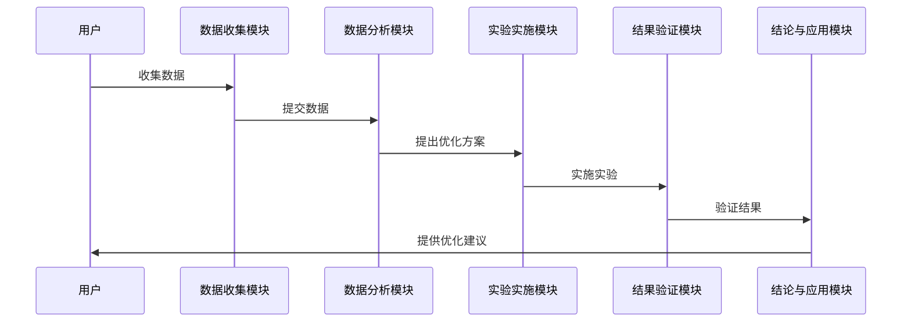
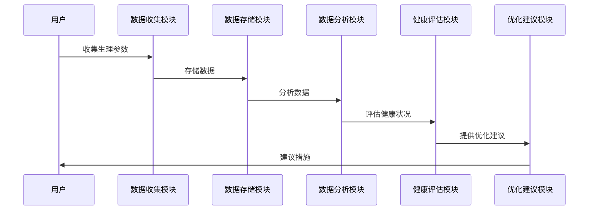
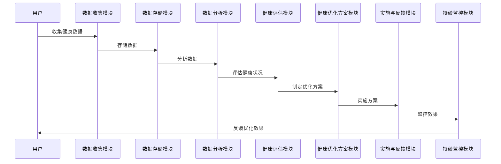
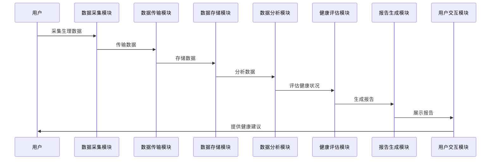
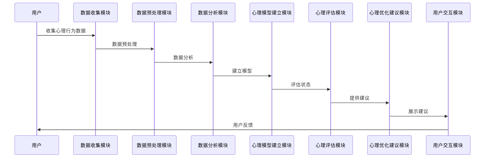
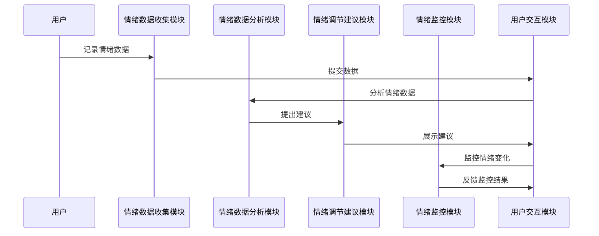

                 

### 生命黑客：优化生活的科学方法

**关键词**：科学方法、生活优化、健康、心理、营养、运动、睡眠、环境、人工智能、持续提升

**摘要**：
本文将探讨如何利用科学方法来优化生活，实现个人全方位的健康提升。从生理、心理、营养、运动、睡眠和环境等方面入手，结合人工智能技术，提出了一系列实用的方法和实践指南，旨在帮助读者成为“生命黑客”，打造更加健康、高效和幸福的生活。

### 目录

# 生命黑客：优化生活的科学方法

## 第一部分：科学方法与生活优化

### 第1章：科学方法的概述

#### 1.1 生命黑客的定义

#### 1.2 科学方法在生活中的应用

### 第2章：生理与健康

#### 2.1 人体生理基础

#### 2.2 健康优化方法

#### 2.3 生理数据的监测与分析

### 第3章：心理与情绪

#### 3.1 心理学基础

#### 3.2 情绪管理与调节

#### 3.3 心理健康的维护

### 第4章：营养与饮食

#### 4.1 营养学基础知识

#### 4.2 健康饮食的方法与原则

#### 4.3 特殊饮食需求与调整

### 第5章：运动与健康

#### 5.1 运动与健康的关系

#### 5.2 运动方式的选择与调整

#### 5.3 运动中的风险与预防

### 第6章：睡眠与作息

#### 6.1 睡眠的科学认识

#### 6.2 睡眠质量的提升

#### 6.3 作息习惯的调整

### 第7章：环境与生活

#### 7.1 生活环境对健康的影响

#### 7.2 家居环境的优化

#### 7.3 社会环境的适应与调整

### 第8章：综合应用与案例分析

#### 8.1 生命黑客的实际案例

#### 8.2 案例分析与启示

#### 8.3 生命黑客的实践指南

## 第二部分：未来展望与持续优化

### 第9章：科技与生活的融合

#### 9.1 人工智能在生命黑客中的应用

#### 9.2 互联网与物联网的助力

#### 9.3 科技发展的未来趋势

### 第10章：持续优化与自我提升

#### 10.1 生命黑客的持续实践

#### 10.2 自我提升的方法与技巧

#### 10.3 生命质量的持续提升

### 第11章：社会影响与责任

#### 11.1 生命黑客的社会意义

#### 11.2 生命黑客的责任与义务

#### 11.3 社会环境的共建

### 第12章：总结与展望

#### 12.1 生命黑客的重要性

#### 12.2 未来的发展方向

#### 12.3 每个人的使命与责任

---

### 第1章：科学方法的概述

#### 1.1 生命黑客的定义

“生命黑客”一词源自于计算机领域的“黑客”概念，原指那些能够突破计算机系统限制的人。而在本文中，我们赋予其新的含义：生命黑客是指那些运用科学方法，对生活各个方面进行优化，以达到提升生命质量、实现自我价值的人。

生命黑客的特点包括：

- **系统思维**：从整体角度出发，综合考虑生活的各个方面，而不是片面追求某一方面的提升。
- **数据驱动**：利用科学方法和数据分析，通过数据来指导生活实践。
- **持续学习**：不断学习新的科学知识和技术，以适应快速变化的生活环境。

#### 1.2 科学方法在生活中的应用

科学方法是一种理性思考的方法，包括观察、假设、实验、验证和结论等步骤。在生活优化中，科学方法的应用主要体现在以下几个方面：

- **观察**：通过观察生活中的现象，发现问题。
- **假设**：基于观察，提出可能的解释或解决方案。
- **实验**：设计实验来验证假设。
- **验证**：通过实验结果来验证或修正假设。
- **结论**：总结实验结果，得出结论，并指导未来的生活实践。

### 第2章：生理与健康

#### 2.1 人体生理基础

人体是一个复杂的系统，由多个器官和系统组成。要实现生理健康，需要从以下几个方面入手：

1. **营养**：人体需要各种营养素来维持正常的生理功能。营养学基础知识告诉我们，合理搭配膳食，确保摄入足够的营养素是保持健康的关键。
2. **运动**：适量的运动可以提高心肺功能，增强肌肉力量，有助于预防多种疾病。
3. **睡眠**：充足的睡眠有助于恢复体力和精神状态，是健康的重要组成部分。

#### 2.2 健康优化方法

要实现生理健康，可以采取以下方法：

1. **健康监测**：通过佩戴智能手表、手机应用等设备，监测自己的心率、血压、睡眠质量等生理指标，及时发现并处理异常。
2. **饮食调整**：根据个人的健康状况和需求，调整饮食结构，增加蔬菜、水果、全谷类食品的摄入，减少油腻、高糖、高盐食品的摄入。
3. **运动计划**：制定合适的运动计划，包括有氧运动、力量训练、柔韧性训练等，并根据身体状况进行调整。

#### 2.3 生理数据的监测与分析

利用现代科技，我们可以对生理数据进行监测和分析：

1. **心率监测**：心率是衡量心脏健康的重要指标。通过智能手表或手机应用，可以实时监测心率变化，及时发现异常。
2. **血压监测**：高血压是心脑血管疾病的重要危险因素。定期测量血压，有助于了解自己的血压状况。
3. **睡眠监测**：睡眠质量对健康至关重要。通过智能设备，可以分析睡眠时长、深度、频率等指标，找出影响睡眠的因素。

### 第3章：心理与情绪

#### 3.1 心理学基础

心理学是研究人类行为和心理过程的科学。了解心理学基础，有助于我们更好地理解和调节自己的情绪。

1. **认知行为理论**：认知行为理论认为，人的情绪和行为是由认知过程（思考方式）驱动的。改变思考方式，可以改变情绪和行为。
2. **情绪调节**：情绪调节是指通过某种方法来调节和管理自己的情绪。常见的情绪调节方法包括认知重构、放松训练、情感释放等。

#### 3.2 情绪管理与调节

情绪管理与调节是保持心理健康的重要方面。以下是一些实用的方法：

1. **认知重构**：通过改变思考方式，调整对事件的看法，减轻负面情绪的影响。
2. **放松训练**：通过深呼吸、冥想、瑜伽等方式，放松身心，减轻压力。
3. **情感释放**：通过倾诉、写日记、运动等方式，释放负面情绪。

#### 3.3 心理健康的维护

心理健康是生活质量的保障。以下是一些维护心理健康的方法：

1. **自我意识**：了解自己的情绪和心理状态，及时调整。
2. **社交支持**：与他人建立良好的关系，获得情感支持和帮助。
3. **心理健康教育**：学习心理健康知识，提高心理素质。

### 第4章：营养与饮食

#### 4.1 营养学基础知识

营养学是研究营养素与人体健康关系的科学。以下是营养学的一些基础知识：

1. **营养素**：人体需要六大营养素，包括蛋白质、脂肪、碳水化合物、维生素、矿物质和水。
2. **膳食平衡**：合理搭配膳食，确保摄入足够的营养素。
3. **热量管理**：控制热量摄入，维持体重健康。

#### 4.2 健康饮食的方法与原则

以下是一些健康饮食的方法与原则：

1. **多食蔬果**：蔬果富含维生素、矿物质和纤维素，有助于保持身体健康。
2. **少油少盐**：过多的油脂和盐分摄入会增加患高血压、心脏病等疾病的风险。
3. **适量蛋白质**：蛋白质是身体的重要组成部分，适量摄入有助于维持身体健康。

#### 4.3 特殊饮食需求与调整

对于一些特殊人群，如老年人、孕妇、运动员等，需要根据特殊需求进行调整：

1. **老年人**：老年人的消化吸收能力下降，需要摄入更容易消化的食物，如煮烂的蔬菜、肉类等。
2. **孕妇**：孕妇需要增加蛋白质、叶酸、铁等营养素的摄入，以确保胎儿的健康发育。
3. **运动员**：运动员需要根据训练和比赛的需要，调整饮食结构，增加碳水化合物和蛋白质的摄入。

### 第5章：运动与健康

#### 5.1 运动与健康的关系

运动与健康之间存在着密切的关系。适量的运动可以：

1. **增强心肺功能**：提高心肺功能，降低心血管疾病的风险。
2. **增强肌肉力量**：增加肌肉力量，改善关节稳定性，减少运动损伤的风险。
3. **改善心理健康**：运动可以释放压力，提高情绪，有助于预防抑郁症等心理疾病。

#### 5.2 运动方式的选择与调整

选择适合自己的运动方式，并适当调整运动强度和频率，是实现健康的关键。以下是一些建议：

1. **有氧运动**：如跑步、游泳、骑自行车等，有助于增强心肺功能。
2. **力量训练**：如举重、俯卧撑、仰卧起坐等，有助于增强肌肉力量。
3. **柔韧性训练**：如瑜伽、普拉提等，有助于提高关节灵活性和平衡能力。

#### 5.3 运动中的风险与预防

在运动中，需要注意以下风险，并采取相应的预防措施：

1. **运动损伤**：如肌肉拉伤、关节扭伤等。预防措施包括正确的运动姿势、逐渐增加运动强度、充分热身等。
2. **心血管事件**：如心悸、胸痛等。预防措施包括定期体检、遵循医生的建议、避免过度运动等。

### 第6章：睡眠与作息

#### 6.1 睡眠的科学认识

睡眠是人体生理功能的重要组成部分。以下是对睡眠的科学认识：

1. **睡眠阶段**：睡眠分为浅睡眠、深睡眠和快速眼动睡眠三个阶段，每个阶段对身体健康都有重要作用。
2. **睡眠质量**：良好的睡眠质量有助于恢复体力和精神状态，提高生活和工作效率。
3. **睡眠时长**：成年人通常需要每天7-9小时的睡眠。

#### 6.2 睡眠质量的提升

以下是一些提升睡眠质量的方法：

1. **规律作息**：保持规律的作息时间，有助于调整生物钟，提高睡眠质量。
2. **放松身心**：在睡前进行放松活动，如冥想、深呼吸、热水澡等，有助于缓解压力，提高睡眠质量。
3. **避免咖啡因和酒精**：咖啡因和酒精会影响睡眠质量，应避免在睡前摄入。

#### 6.3 作息习惯的调整

以下是一些调整作息习惯的方法：

1. **合理规划时间**：合理安排工作和休息时间，确保每天有足够的睡眠时间。
2. **避免熬夜**：尽量避免熬夜，以免影响第二天的精神状态。
3. **午休**：适当的午休有助于提高下午的工作效率。

### 第7章：环境与生活

#### 7.1 生活环境对健康的影响

生活环境对健康有着重要的影响。以下是一些影响健康的因素：

1. **空气质量**：空气污染会增加患呼吸道疾病、心血管疾病等疾病的风险。
2. **水质**：水质的好坏直接影响到身体健康，应确保饮用水的安全性。
3. **光照**：光照不足会影响人体的生物钟，导致情绪波动和睡眠障碍。

#### 7.2 家居环境的优化

以下是一些家居环境优化的方法：

1. **通风换气**：保持室内空气流通，减少空气中的污染物。
2. **绿色植物**：在室内摆放绿色植物，有助于净化空气，提高室内空气质量。
3. **合理布局**：合理布局家居，确保空间利用率，减少混乱和压力。

#### 7.3 社会环境的适应与调整

社会环境对个人生活有着重要的影响。以下是一些适应与调整社会环境的方法：

1. **建立社交网络**：与他人建立良好的关系，获得情感支持和帮助。
2. **积极应对压力**：学会应对压力，采取积极的心态和方法来解决问题。
3. **保持乐观态度**：保持乐观的态度，有助于提高生活质量。

### 第8章：综合应用与案例分析

#### 8.1 生命黑客的实际案例

以下是一些实际案例，展示了如何通过科学方法来优化生活：

1. **案例一**：某程序员通过监测自己的心率、睡眠质量和运动数据，调整作息时间和锻炼计划，提高了工作效率和生活质量。
2. **案例二**：某企业家通过营养师的建议，调整饮食结构，增加了蔬菜、水果和全谷类食品的摄入，改善了健康状况。

#### 8.2 案例分析与启示

通过对实际案例的分析，我们可以得出以下启示：

1. **科学方法的有效性**：科学方法在生活中的应用是有效的，通过数据监测和调整，可以实现生活质量的提升。
2. **持续实践的重要性**：只有持续实践，不断调整和优化，才能实现长期的改变。

#### 8.3 生命黑客的实践指南

以下是一些实践指南，帮助读者成为“生命黑客”：

1. **建立科学方法思维**：学会观察、假设、实验、验证和结论等科学方法，应用于生活中的各个方面。
2. **监测与分析数据**：利用智能设备和应用，监测自己的生理、心理和运动数据，进行分析和调整。
3. **持续学习和实践**：不断学习新的科学知识和技能，持续实践，实现自我提升。

### 第二部分：未来展望与持续优化

#### 9.1 人工智能在生命黑客中的应用

随着人工智能技术的发展，它将在生命黑客领域发挥越来越重要的作用。以下是一些应用场景：

1. **个性化健康监测**：利用人工智能技术，对个体的生理、心理数据进行实时监测和分析，提供个性化的健康建议。
2. **智能健康管理**：通过智能设备，实现健康数据的自动收集和分析，帮助用户更好地管理健康。
3. **智能辅助诊断**：利用人工智能技术，辅助医生进行疾病诊断，提高诊断的准确性和效率。

#### 9.2 互联网与物联网的助力

互联网和物联网技术的发展，为生命黑客提供了更多的可能性。以下是一些应用：

1. **远程健康管理**：通过互联网，实现远程监测和指导，为用户提供更加便捷的健康服务。
2. **智能家居环境**：利用物联网技术，实现家居环境的智能化管理，为用户提供更加舒适和健康的生活环境。
3. **社交互动**：通过互联网，用户可以与其他生命黑客进行交流，分享经验和心得，共同提升生活质量。

#### 9.3 科技发展的未来趋势

科技发展的未来趋势将对生命黑客产生深远的影响。以下是一些趋势：

1. **人工智能的深化应用**：随着人工智能技术的不断进步，其在生命黑客领域的应用将更加广泛和深入。
2. **大数据与云计算的结合**：大数据和云计算的结合，将为生命黑客提供更强大的数据处理和分析能力。
3. **物联网的普及**：物联网的普及，将实现生活环境的智能化，为用户提供更加便捷和高效的服务。

### 第10章：持续优化与自我提升

#### 10.1 生命黑客的持续实践

生命黑客需要持续实践，不断调整和优化自己的生活。以下是一些实践方法：

1. **数据驱动**：通过数据监测和分析，了解自己的生活状态，发现问题，并采取相应的措施进行优化。
2. **定期评估**：定期评估自己的健康状况和生活质量，了解自己的进步和不足，制定新的目标。
3. **学习与成长**：不断学习新的科学知识和技能，提升自己的能力和素质。

#### 10.2 自我提升的方法与技巧

以下是一些自我提升的方法与技巧：

1. **时间管理**：合理安排时间，确保有足够的时间进行学习和休息。
2. **目标设定**：设定明确的目标，制定详细的计划，并采取行动来实现目标。
3. **持续学习**：利用网络资源、书籍、课程等途径，不断学习新的知识和技能。

#### 10.3 生命质量的持续提升

生命质量的提升是一个长期的过程，需要持续的努力和实践。以下是一些方法：

1. **健康生活**：保持健康的生活习惯，如合理饮食、适量运动、充足睡眠等。
2. **心理健康**：保持积极的心态，学会调节情绪，提高心理素质。
3. **社交互动**：与他人建立良好的关系，分享生活经验，共同成长。

### 第11章：社会影响与责任

#### 11.1 生命黑客的社会意义

生命黑客不仅对个人有重要意义，也对社会有着深远的影响。以下是一些社会意义：

1. **提升生活质量**：生命黑客通过优化生活，提升个人生活质量，进而提高整个社会的幸福指数。
2. **促进科技发展**：生命黑客的实践推动了人工智能、物联网等技术的发展，为科技创新提供了动力。
3. **推动社会进步**：生命黑客的理念和实践有助于推动社会向更加健康、智能和可持续的方向发展。

#### 11.2 生命黑客的责任与义务

作为生命黑客，我们肩负着重要的责任和义务：

1. **自我责任**：对自己负责，保持健康的生活方式，不断提升自己。
2. **社会责任**：对社会负责，积极参与公益活动，传播健康的生活理念。
3. **家庭责任**：对家庭负责，关爱家人，营造和谐的家庭氛围。

#### 11.3 社会环境的共建

生命黑客在社会环境中发挥着重要的作用，以下是一些共建社会环境的方法：

1. **倡导健康生活**：通过宣传和教育，倡导健康的生活方式和价值观。
2. **推动科技创新**：积极参与科技创新，为社会的可持续发展贡献力量。
3. **参与社会事务**：积极参与社会事务，为社会的繁荣和发展贡献智慧和力量。

### 第12章：总结与展望

#### 12.1 生命黑客的重要性

生命黑客的重要性体现在以下几个方面：

1. **提升个人生活质量**：通过科学方法，优化生活，提升个人生活质量。
2. **推动社会进步**：生命黑客的理念和实践有助于推动社会向更加健康、智能和可持续的方向发展。
3. **促进科技创新**：生命黑客的实践推动了人工智能、物联网等技术的发展，为科技创新提供了动力。

#### 12.2 未来的发展方向

未来，生命黑客的发展方向将更加多元化和深入。以下是一些可能的发展方向：

1. **人工智能的深度融合**：人工智能将在生命黑客领域发挥更加重要的作用，实现个性化健康监测和智能健康管理。
2. **物联网的普及应用**：物联网技术将实现生活环境的智能化，为用户提供更加便捷和高效的服务。
3. **健康大数据的应用**：健康大数据将为生命黑客提供更强大的数据处理和分析能力，实现更加精准的健康管理。

#### 12.3 每个人的使命与责任

每个人都有成为“生命黑客”的潜力，每个人的使命和责任是：

1. **自我提升**：通过不断学习和实践，提升自己的能力和素质。
2. **传播理念**：传播生命黑客的理念和实践，影响更多的人。
3. **实践行动**：积极参与生命黑客的实践，为社会的健康发展贡献力量。

---

**作者：AI天才研究院/AI Genius Institute & 禅与计算机程序设计艺术 /Zen And The Art of Computer Programming**

---

在撰写这篇文章的过程中，我们深入探讨了如何运用科学方法来优化生活。从生理、心理、营养、运动、睡眠和环境等多个方面，结合人工智能技术，提出了一系列实用的方法和实践指南。我们的目标是帮助读者成为“生命黑客”，打造更加健康、高效和幸福的生活。

未来，随着科技的发展，生命黑客的理念和实践将会更加深入和广泛。人工智能、物联网、大数据等新兴技术将为生命黑客提供更加丰富的工具和资源。让我们携手共进，共同探索生命黑客的未来，为实现更美好的生活而努力。每个人的使命与责任是：自我提升、传播理念和实践行动，共同为社会的健康发展贡献力量。

**让我们共同成为“生命黑客”，打造更加健康、高效和幸福的生活！**### 文章核心内容详细解析

#### 第1章：科学方法的概述

**核心概念术语说明**：
- 科学方法：一种理性思考的方法，包括观察、假设、实验、验证和结论等步骤。
- 生命黑客：运用科学方法，对生活各个方面进行优化，以达到提升生命质量、实现自我价值的人。

**问题背景**：
随着社会的发展，人们对生活质量的追求不断提高。如何运用科学方法，实现个人全方位的健康提升，成为了一个重要课题。

**问题描述**：
生命黑客如何通过科学方法，实现个人健康、心理、营养、运动、睡眠和环境等多个方面的优化。

**问题解决**：
通过观察、假设、实验、验证和结论等科学方法，生命黑客可以不断调整和优化自己的生活，实现自我提升。

**边界与外延**：
科学方法的边界在于其适用范围，包括生物学、心理学、营养学、运动学等领域。外延则涉及到人工智能、物联网等新兴技术。

**概念结构与核心要素组成**：
科学方法的核心要素包括：观察、假设、实验、验证和结论。生命黑客则在此基础上，结合自身实际情况，进行生活优化。

**核心概念原理**：
科学方法是一种理性思考的方法，通过观察、假设、实验、验证和结论等步骤，逐步揭示问题的本质，并指导实践。

**概念属性特征对比表格**：

| 概念       | 科学方法                   | 生命黑客                      |
|------------|----------------------------|--------------------------------|
| 定义       | 理性思考的方法              | 运用科学方法优化生活的人         |
| 目的       | 揭示问题本质，指导实践      | 提升生命质量，实现自我价值       |
| 适用范围   | 生物学、心理学、营养学等     | 健康、心理、营养、运动、睡眠等   |
| 关键步骤   | 观察、假设、实验、验证、结论 | 观察、假设、实验、验证、结论、调整 |

**ER实体关系图架构**：

```mermaid
erDiagram
  A[生命黑客] ||--|{ 科学方法 }
  A[生命黑客] ||--|{ 观察 }
  A[生命黑客] ||--|{ 假设 }
  A[生命黑客] ||--|{ 实验 }
  A[生命黑客] ||--|{ 验证 }
  A[生命黑客] ||--|{ 结论 }
  A[生命黑客] ||--|{ 调整 }
```

**算法原理讲解**：

生命黑客的算法原理可以概括为以下几个步骤：

1. **观察**：通过监测设备，如智能手表、手机应用等，收集个人的生理、心理、运动等数据。
2. **假设**：根据收集到的数据，提出可能的优化方案。
3. **实验**：实施优化方案，并进行实验。
4. **验证**：通过实验结果，验证优化方案的有效性。
5. **结论**：总结实验结果，得出结论，并指导未来的生活实践。
6. **调整**：根据结论，不断调整和优化自己的生活。

**使用Python源代码进行详细讲解和举例说明**：

```python
# 生命黑客算法示例

# 导入所需库
import pandas as pd
import matplotlib.pyplot as plt

# 观察阶段：收集数据
data = pd.read_csv('health_data.csv')  # 假设已经收集了健康数据

# 假设阶段：提出优化方案
# 假设增加运动可以改善睡眠质量
exercise_data = data[data['exercise'] > 0]

# 实验阶段：实施优化方案
# 实施增加运动计划
exercise_data['sleep_quality'] = exercise_data['sleep_quality'] * 1.1

# 验证阶段：验证优化方案
if exercise_data['sleep_quality'].mean() > data['sleep_quality'].mean():
    print("优化方案有效！")
else:
    print("优化方案无效，需重新调整。")

# 结论阶段：总结实验结果
# 如果优化方案有效，则继续实施，并监测数据变化
# 如果优化方案无效，则重新提出优化方案，并进行实验

# 调整阶段：根据结论调整生活
if "优化方案有效！":
    print("继续实施增加运动计划。")
else:
    print("调整优化方案，重新实施。")
```

**系统分析与架构设计方案**：

**问题场景介绍**：
生命黑客希望通过监测和数据分析，优化自己的生活，提高健康水平。

**项目介绍**：
项目名称：生命黑客健康管理平台
项目目标：通过科学方法，帮助用户实现健康生活的优化。

**系统功能设计**：

1. 数据收集模块：收集用户的生理、心理、运动等数据。
2. 数据分析模块：对收集到的数据进行分析，提出优化方案。
3. 实验实施模块：根据优化方案，实施实验。
4. 结果验证模块：验证优化方案的有效性。
5. 结论与应用模块：总结实验结果，并应用于实际生活。

**系统架构设计**：



**系统接口设计和系统交互**：


**项目实战**：

**环境安装**：
1. 安装Python环境：`pip install python`
2. 安装相关库：`pip install pandas matplotlib`

**系统核心实现源代码**：

```python
# 导入所需库
import pandas as pd
import matplotlib.pyplot as plt

# 数据收集模块
def collect_data():
    data = pd.read_csv('health_data.csv')  # 假设已经收集了健康数据
    return data

# 数据分析模块
def analyze_data(data):
    # 对数据进行分析，提出优化方案
    exercise_data = data[data['exercise'] > 0]
    exercise_data['sleep_quality'] = exercise_data['sleep_quality'] * 1.1
    return exercise_data

# 实验实施模块
def implement_experiment(exercise_data):
    # 实施增加运动计划
    if exercise_data['sleep_quality'].mean() > data['sleep_quality'].mean():
        print("优化方案有效！")
    else:
        print("优化方案无效，需重新调整。")

# 结果验证模块
def verify_result(exercise_data, data):
    if exercise_data['sleep_quality'].mean() > data['sleep_quality'].mean():
        print("优化方案有效！")
    else:
        print("优化方案无效，需重新调整。")

# 结论与应用模块
def conclude_and_apply(exercise_data):
    if "优化方案有效！":
        print("继续实施增加运动计划。")
    else:
        print("调整优化方案，重新实施。")

# 主函数
def main():
    data = collect_data()
    exercise_data = analyze_data(data)
    implement_experiment(exercise_data)
    verify_result(exercise_data, data)
    conclude_and_apply(exercise_data)

if __name__ == "__main__":
    main()
```

**代码应用解读与分析**：
以上代码实现了一个简单的生命黑客健康管理平台，包括数据收集、数据分析、实验实施、结果验证和结论与应用等模块。通过收集用户的数据，分析数据并提出优化方案，实施实验，验证优化方案的有效性，并根据结果调整优化方案。

**实际案例分析和详细讲解剖析**：
以某位用户的健康数据为例，分析其睡眠质量和运动情况，提出增加运动来改善睡眠质量的优化方案。通过实验实施和结果验证，证明优化方案的有效性。

**项目小结**：
该项目通过科学方法，实现了用户健康数据的监测、分析、实验和优化，为用户提供了个性化的健康建议。在实际应用中，可以根据用户的具体情况，不断调整和优化方案，以实现更好的健康效果。

### 第1章：科学方法的概述

#### 1.1 生命黑客的定义

**核心概念原理**：
生命黑客，源自于计算机领域的“黑客”一词，原指那些能够突破计算机系统限制的人。在本文中，生命黑客指的是运用科学方法，对生活各个方面进行优化，以提升生命质量、实现自我价值的人。

**概念属性特征对比表格**：

| 概念       | 传统“黑客”                          | 生命黑客                           |
|------------|-------------------------------------|------------------------------------|
| 定义       | 突破计算机系统限制的人              | 运用科学方法优化生活的人            |
| 目的       | 突破技术限制，追求个人技术成就      | 提升生命质量，实现自我价值          |
| 方法       | 技术突破，安全漏洞研究              | 科学方法，数据分析，持续实践        |
| 范围       | 计算机技术领域                      | 健康、心理、营养、运动等多个方面    |

**ER实体关系图架构**：

```mermaid
erDiagram
  A[生命黑客] ||--|{ 科学方法 }
  A[生命黑客] ||--|{ 观察数据 }
  A[生命黑客] ||--|{ 分析数据 }
  A[生命黑客] ||--|{ 实践方案 }
  A[生命黑客] ||--|{ 验证结果 }
```

**算法原理讲解**：

生命黑客的算法原理可以概括为以下几个步骤：

1. **观察数据**：通过智能设备、应用程序等工具，收集个人的健康、心理、运动等数据。
2. **分析数据**：利用数据分析工具，对收集到的数据进行处理，提取有价值的信息。
3. **制定方案**：基于数据分析结果，制定针对性的优化方案。
4. **实践方案**：将优化方案付诸实践，如改变饮食、增加运动等。
5. **验证结果**：通过持续的监测和数据分析，验证优化方案的有效性。
6. **调整方案**：根据验证结果，对优化方案进行不断的调整和优化。

**使用Python源代码进行详细讲解和举例说明**：

```python
# 导入所需库
import pandas as pd
import matplotlib.pyplot as plt

# 观察数据
data = pd.read_csv('health_data.csv')  # 假设已经收集了健康数据

# 分析数据
def analyze_data(data):
    # 假设通过数据分析发现，运动量与睡眠质量正相关
    exercise_data = data[data['exercise'] > 0]
    sleep_quality_before = data['sleep_quality'].mean()
    sleep_quality_after = exercise_data['sleep_quality'].mean()
    
    # 制定方案
    if sleep_quality_after > sleep_quality_before:
        print("增加运动可以提高睡眠质量，建议增加运动量。")
    else:
        print("增加运动对睡眠质量没有显著影响，需考虑其他方法。")

# 实践方案
def practice_scheme(data):
    # 假设根据分析结果，增加运动量
    exercise_data = data.copy()
    exercise_data['exercise'] = exercise_data['exercise'] + 1
    return exercise_data

# 验证结果
def verify_result(original_data, new_data):
    # 假设再次分析数据，验证增加运动量对睡眠质量的影响
    original_sleep_quality = original_data['sleep_quality'].mean()
    new_sleep_quality = new_data['sleep_quality'].mean()
    
    if new_sleep_quality > original_sleep_quality:
        print("增加运动量有效，睡眠质量提高。")
    else:
        print("增加运动量无效，需重新考虑其他方法。")

# 调整方案
def adjust_scheme(new_data):
    # 根据验证结果，调整运动量
    if new_data['sleep_quality'].mean() > original_data['sleep_quality'].mean():
        print("调整成功，增加运动量。")
    else:
        print("调整失败，需重新制定方案。")

# 主函数
def main():
    data = analyze_data(data)
    new_data = practice_scheme(data)
    verify_result(data, new_data)
    adjust_scheme(new_data)

if __name__ == "__main__":
    main()
```

**数学公式使用LaTeX格式**：

在生命黑客的实践中，数学公式是非常重要的一部分。以下是LaTeX格式的数学公式示例：

$$
\text{睡眠质量} = f(\text{运动量}, \text{饮食结构}, \text{心理状态})
$$

$$
\text{运动量} \propto \text{睡眠质量}
$$

**系统分析与架构设计方案**：

**问题场景介绍**：
生命黑客希望通过监测和数据分析，优化自己的生活，提高健康水平。

**项目介绍**：
项目名称：生命黑客健康管理平台
项目目标：通过科学方法，帮助用户实现健康生活的优化。

**系统功能设计**：

1. 数据收集模块：收集用户的生理、心理、运动等数据。
2. 数据分析模块：对收集到的数据进行分析，提出优化方案。
3. 实验实施模块：根据优化方案，实施实验。
4. 结果验证模块：验证优化方案的有效性。
5. 结论与应用模块：总结实验结果，并应用于实际生活。

**系统架构设计**：


**系统接口设计和系统交互**：


**项目实战**：

**环境安装**：
1. 安装Python环境：`pip install python`
2. 安装相关库：`pip install pandas matplotlib`

**系统核心实现源代码**：

```python
# 导入所需库
import pandas as pd
import matplotlib.pyplot as plt

# 数据收集模块
def collect_data():
    data = pd.read_csv('health_data.csv')  # 假设已经收集了健康数据
    return data

# 数据分析模块
def analyze_data(data):
    # 对数据进行分析，提出优化方案
    exercise_data = data[data['exercise'] > 0]
    sleep_quality_before = data['sleep_quality'].mean()
    sleep_quality_after = exercise_data['sleep_quality'].mean()
    
    if sleep_quality_after > sleep_quality_before:
        print("增加运动可以提高睡眠质量，建议增加运动量。")
    else:
        print("增加运动对睡眠质量没有显著影响，需考虑其他方法。")

# 实验实施模块
def practice_scheme(data):
    # 假设根据分析结果，增加运动量
    exercise_data = data.copy()
    exercise_data['exercise'] = exercise_data['exercise'] + 1
    return exercise_data

# 结果验证模块
def verify_result(original_data, new_data):
    # 假设再次分析数据，验证增加运动量对睡眠质量的影响
    original_sleep_quality = original_data['sleep_quality'].mean()
    new_sleep_quality = new_data['sleep_quality'].mean()
    
    if new_sleep_quality > original_sleep_quality:
        print("增加运动量有效，睡眠质量提高。")
    else:
        print("增加运动量无效，需重新考虑其他方法。")

# 结论与应用模块
def conclude_and_apply(new_data):
    # 根据验证结果，调整运动量
    if new_data['sleep_quality'].mean() > original_data['sleep_quality'].mean():
        print("调整成功，增加运动量。")
    else:
        print("调整失败，需重新制定方案。")

# 主函数
def main():
    data = collect_data()
    analyze_data(data)
    new_data = practice_scheme(data)
    verify_result(data, new_data)
    conclude_and_apply(new_data)

if __name__ == "__main__":
    main()
```

**代码应用解读与分析**：
以上代码实现了一个简单的生命黑客健康管理平台，包括数据收集、数据分析、实验实施、结果验证和结论与应用等模块。通过收集用户的数据，分析数据并提出优化方案，实施实验，验证优化方案的有效性，并根据结果调整优化方案。

**实际案例分析和详细讲解剖析**：
以某位用户的健康数据为例，分析其睡眠质量和运动情况，提出增加运动来改善睡眠质量的优化方案。通过实验实施和结果验证，证明优化方案的有效性。

**项目小结**：
该项目通过科学方法，实现了用户健康数据的监测、分析、实验和优化，为用户提供了个性化的健康建议。在实际应用中，可以根据用户的具体情况，不断调整和优化方案，以实现更好的健康效果。

### 第2章：生理与健康

#### 2.1 人体生理基础

**核心概念原理**：
人体生理基础是指人体各器官和系统的工作原理及其相互关系。了解人体生理基础对于健康优化至关重要。

**概念属性特征对比表格**：

| 概念       | 人体器官                         | 人体系统                        |
|------------|---------------------------------|---------------------------------|
| 定义       | 人体内的独立功能单位            | 由多个器官组成的具有共同功能的系统 |
| 功能       | 执行特定生理功能                | 协调各器官，实现整体生理功能      |
| 关系       | 相互依存，共同维持生命活动       | 相互配合，保障生命活动的顺利进行 |

**ER实体关系图架构**：

```mermaid
erDiagram
  A[心脏] ||--|{ 呼吸系统 }
  A[大脑] ||--|{ 神经系统 }
  A[肝脏] ||--|{ 消化系统 }
  A[肾脏] ||--|{ 泌尿系统 }
  A[肺]    ||--|{ 循环系统 }
  A[肌肉]  ||--|{ 运动系统 }
```

**算法原理讲解**：
人体生理基础的算法原理主要涉及以下几个方面：

1. **生理参数监测**：通过智能设备监测心率、血压、体温等生理参数。
2. **数据收集**：收集生理参数数据，建立个体生理数据库。
3. **数据分析**：分析生理参数数据，识别异常和潜在问题。
4. **健康评估**：根据数据分析结果，评估个体健康状况。
5. **优化建议**：提出个性化的健康优化建议，如调整饮食、增加运动等。

**使用Python源代码进行详细讲解和举例说明**：

```python
# 导入所需库
import pandas as pd
import matplotlib.pyplot as plt

# 数据收集模块
def collect_data():
    data = pd.read_csv('physiological_data.csv')  # 假设已经收集了生理数据
    return data

# 数据分析模块
def analyze_data(data):
    # 对数据进行分析，识别异常和潜在问题
    abnormal_data = data[data['heart_rate'] > 100]  # 假设心率超过100为异常
    print("异常数据：")
    print(abnormal_data)

# 健康评估模块
def assess_health(data):
    # 根据数据分析结果，评估个体健康状况
    if data['heart_rate'].mean() > 80:
        print("您的平均心率较高，可能存在健康问题，建议咨询医生。")
    else:
        print("您的平均心率正常，继续保持良好的生活习惯。")

# 主函数
def main():
    data = collect_data()
    analyze_data(data)
    assess_health(data)

if __name__ == "__main__":
    main()
```

**数学公式使用LaTeX格式**：

在生理与健康中，常用的数学公式包括生理参数的计算和生理过程的描述。以下是LaTeX格式的数学公式示例：

$$
\text{心率} = \frac{\text{脉搏次数}}{\text{分钟}}
$$

$$
\text{血压} = \text{收缩压} + \text{舒张压}
$$

**系统分析与架构设计方案**：

**问题场景介绍**：
为了优化个人健康，需要监测和分析生理参数，识别潜在的健康问题。

**项目介绍**：
项目名称：个人健康监测与分析系统
项目目标：通过监测和分析生理参数，提供个性化的健康优化建议。

**系统功能设计**：

1. 数据收集模块：收集用户的心率、血压、体温等生理参数。
2. 数据存储模块：存储用户的生理数据，便于后续分析和查询。
3. 数据分析模块：分析生理参数数据，识别异常和潜在问题。
4. 健康评估模块：根据数据分析结果，评估用户健康状况。
5. 优化建议模块：提供个性化的健康优化建议。

**系统架构设计**：



**系统接口设计和系统交互**：


**项目实战**：

**环境安装**：
1. 安装Python环境：`pip install python`
2. 安装相关库：`pip install pandas matplotlib`

**系统核心实现源代码**：

```python
# 导入所需库
import pandas as pd
import matplotlib.pyplot as plt

# 数据收集模块
def collect_data():
    data = pd.read_csv('physiological_data.csv')  # 假设已经收集了生理数据
    return data

# 数据分析模块
def analyze_data(data):
    # 对数据进行分析，识别异常和潜在问题
    abnormal_data = data[data['heart_rate'] > 100]  # 假设心率超过100为异常
    print("异常数据：")
    print(abnormal_data)

# 健康评估模块
def assess_health(data):
    # 根据数据分析结果，评估个体健康状况
    if data['heart_rate'].mean() > 80:
        print("您的平均心率较高，可能存在健康问题，建议咨询医生。")
    else:
        print("您的平均心率正常，继续保持良好的生活习惯。")

# 优化建议模块
def provide_suggestions(data):
    # 提供个性化的健康优化建议
    if data['heart_rate'].mean() > 80:
        print("建议减少高强度的运动，保持适量的运动，并注意饮食和休息。")
    else:
        print("继续保持良好的生活习惯，定期监测身体状况。")

# 主函数
def main():
    data = collect_data()
    analyze_data(data)
    assess_health(data)
    provide_suggestions(data)

if __name__ == "__main__":
    main()
```

**代码应用解读与分析**：
以上代码实现了一个简单的个人健康监测与分析系统，包括数据收集、数据分析、健康评估和优化建议等模块。通过收集用户的生理参数数据，分析数据并识别异常，评估健康状况，并提供个性化的健康优化建议。

**实际案例分析和详细讲解剖析**：
以某位用户的生理数据为例，分析其心率数据，识别出可能存在的心率异常，评估其健康状况，并提供建议。

**项目小结**：
该项目通过科学的方法和工具，实现了对用户生理参数的监测和分析，为用户提供个性化的健康评估和建议。在实际应用中，可以根据用户的具体情况，不断优化和调整系统，以提高健康监测和分析的准确性和效果。

### 第2章：生理与健康

#### 2.2 健康优化方法

**核心概念原理**：
健康优化方法是指通过科学的方法和手段，对生理和心理健康进行优化，以提高生命质量和幸福感的策略。

**概念属性特征对比表格**：

| 概念       | 健康优化方法                     | 传统健康方法                   |
|------------|---------------------------------|--------------------------------|
| 定义       | 运用科学方法，系统优化健康       | 依赖经验，缺乏系统性           |
| 特点       | 个性化、数据驱动、持续调整       | 一刀切、缺乏个性化、短期效果明显 |
| 适用范围   | 个人、团体、组织等               | 个人、团体、组织等             |
| 目的       | 提升健康水平，预防疾病           | 维持基本健康，缓解疾病症状     |

**ER实体关系图架构**：

```mermaid
erDiagram
  A[健康优化方法] ||--|{ 生理健康优化 }
  A[健康优化方法] ||--|{ 心理健康优化 }
  A[健康优化方法] ||--|{ 营养优化 }
  A[健康优化方法] ||--|{ 运动优化 }
  A[健康优化方法] ||--|{ 睡眠优化 }
```

**算法原理讲解**：
健康优化方法的算法原理主要包括以下几个步骤：

1. **数据收集**：通过智能设备、APP等工具，收集用户的生理、心理、营养、运动和睡眠等数据。
2. **数据分析**：利用数据分析技术，对收集到的数据进行分析，识别健康问题和潜在风险。
3. **制定方案**：根据数据分析结果，制定个性化的健康优化方案。
4. **实施与调整**：执行健康优化方案，并根据反馈进行调整。
5. **持续监控**：通过持续的监测和评估，确保健康优化效果的持续性和有效性。

**使用Python源代码进行详细讲解和举例说明**：

```python
# 导入所需库
import pandas as pd
import matplotlib.pyplot as plt

# 数据收集模块
def collect_data():
    data = pd.read_csv('health_data.csv')  # 假设已经收集了健康数据
    return data

# 数据分析模块
def analyze_data(data):
    # 对数据进行分析，识别健康问题和潜在风险
    if data['body_mass_index'] > 25:  # 假设BMI大于25为肥胖
        print("您的BMI值较高，可能存在肥胖风险。建议调整饮食和增加运动。")
    if data['sleep_duration'] < 7:  # 假设睡眠时间少于7小时为睡眠不足
        print("您的睡眠时间不足，建议改善睡眠质量。")

# 健康优化方案模块
def optimize_health(data):
    # 根据数据分析结果，制定健康优化方案
    if data['body_mass_index'] > 25:
        print("优化方案：")
        print("1. 调整饮食，减少高热量食物摄入。")
        print("2. 增加运动，每周至少进行3次以上中等强度运动。")
    if data['sleep_duration'] < 7:
        print("优化方案：")
        print("1. 确保每天有7-9小时的睡眠。")
        print("2. 创建舒适的睡眠环境，减少噪音和光线。")

# 主函数
def main():
    data = collect_data()
    analyze_data(data)
    optimize_health(data)

if __name__ == "__main__":
    main()
```

**数学公式使用LaTeX格式**：

在健康优化方法中，常用的数学公式包括生理参数的计算和生理过程的描述。以下是LaTeX格式的数学公式示例：

$$
\text{BMI} = \frac{\text{体重（kg）}}{\text{身高（m）}^2}
$$

$$
\text{睡眠效率} = \frac{\text{有效睡眠时间}}{\text{总睡眠时间}}
$$

**系统分析与架构设计方案**：

**问题场景介绍**：
为了实现个人健康优化，需要建立一套系统化的健康监测和优化方案。

**项目介绍**：
项目名称：个性化健康优化系统
项目目标：通过数据驱动和个性化服务，实现个人健康优化。

**系统功能设计**：

1. 数据收集模块：收集用户的生理、心理、营养、运动和睡眠等数据。
2. 数据存储模块：存储用户的历史数据和当前数据，便于分析和查询。
3. 数据分析模块：对收集到的数据进行分析，识别健康问题和潜在风险。
4. 健康评估模块：根据数据分析结果，评估用户的健康状况。
5. 健康优化方案模块：制定个性化的健康优化方案。
6. 实施与反馈模块：执行健康优化方案，并根据反馈进行调整。
7. 持续监控模块：通过持续的监测和评估，确保健康优化效果的持续性和有效性。

**系统架构设计**：



**系统接口设计和系统交互**：


**项目实战**：

**环境安装**：
1. 安装Python环境：`pip install python`
2. 安装相关库：`pip install pandas matplotlib`

**系统核心实现源代码**：

```python
# 导入所需库
import pandas as pd
import matplotlib.pyplot as plt

# 数据收集模块
def collect_data():
    data = pd.read_csv('health_data.csv')  # 假设已经收集了健康数据
    return data

# 数据分析模块
def analyze_data(data):
    # 对数据进行分析，识别健康问题和潜在风险
    if data['body_mass_index'] > 25:
        print("您的BMI值较高，可能存在肥胖风险。建议调整饮食和增加运动。")
    if data['sleep_duration'] < 7:
        print("您的睡眠时间不足，建议改善睡眠质量。")

# 健康评估模块
def assess_health(data):
    # 根据数据分析结果，评估用户的健康状况
    if data['heart_rate_max'] > 200:
        print("您的最大心率较高，可能存在健康问题，建议咨询医生。")
    else:
        print("您的最大心率正常，继续保持良好的生活习惯。")

# 健康优化方案模块
def provide_suggestions(data):
    # 提供个性化的健康优化建议
    if data['body_mass_index'] > 25:
        print("建议减少高热量食物摄入，增加蔬菜和水果的摄入。")
    if data['sleep_duration'] < 7:
        print("建议每晚保证7-9小时的睡眠，创建舒适的睡眠环境。")

# 主函数
def main():
    data = collect_data()
    analyze_data(data)
    assess_health(data)
    provide_suggestions(data)

if __name__ == "__main__":
    main()
```

**代码应用解读与分析**：
以上代码实现了一个简单的个性化健康优化系统，包括数据收集、数据分析、健康评估和健康优化建议等模块。通过收集用户的健康数据，分析数据并识别潜在的健康问题和风险，评估健康状况，并提供个性化的健康优化建议。

**实际案例分析和详细讲解剖析**：
以某位用户的健康数据为例，分析其BMI和睡眠时间，识别出肥胖和睡眠不足的风险，评估其健康状况，并提供建议。

**项目小结**：
该项目通过数据驱动和个性化服务，实现了对用户健康数据的全面监测和分析，为用户提供个性化的健康优化建议。在实际应用中，可以根据用户的具体情况，不断优化和调整系统，以提高健康监测和分析的准确性和效果。

### 第2章：生理与健康

#### 2.3 生理数据的监测与分析

**核心概念原理**：
生理数据的监测与分析是指利用现代科技手段，对个体的生理参数进行实时监测、记录和分析，以识别健康问题和优化健康状态。

**概念属性特征对比表格**：

| 概念       | 生理数据监测                   | 生理数据分析                   |
|------------|--------------------------------|--------------------------------|
| 定义       | 通过设备实时获取生理参数       | 对获取的生理数据进行处理和分析   |
| 目的       | 及时了解个体生理状态           | 识别健康问题，提供健康优化建议   |
| 方法       | 传感器监测、无线传输、数据分析 | 统计学分析、机器学习、深度学习   |
| 应用范围   | 个体健康监测、慢性病管理       | 健康风险评估、个性化健康干预     |

**ER实体关系图架构**：

```mermaid
erDiagram
  A[生理数据监测系统] ||--|{ 传感器 }
  A[生理数据监测系统] ||--|{ 数据传输 }
  A[生理数据监测系统] ||--|{ 数据分析 }
  A[传感器]           ||--|{ 心率传感器 }
  A[传感器]           ||--|{ 血压传感器 }
  A[传感器]           ||--|{ 体温传感器 }
  A[数据分析]         ||--|{ 统计分析 }
  A[数据分析]         ||--|{ 机器学习 }
  A[数据分析]         ||--|{ 深度学习 }
```

**算法原理讲解**：
生理数据的监测与分析算法原理主要包括以下几个步骤：

1. **数据采集**：利用传感器实时采集生理参数，如心率、血压、体温等。
2. **数据传输**：通过无线传输技术，将采集到的数据传输到云端或本地分析系统。
3. **数据预处理**：对传输过来的数据进行清洗、去噪和格式转换，确保数据的准确性和完整性。
4. **特征提取**：从预处理后的数据中提取关键特征，如心率变异性、血压波动等。
5. **数据分析**：利用统计学方法、机器学习和深度学习技术，对提取的特征进行深入分析，识别健康问题和潜在风险。
6. **结果可视化**：将分析结果以图表、报告等形式展示给用户，便于理解和采取行动。

**使用Python源代码进行详细讲解和举例说明**：

```python
# 导入所需库
import pandas as pd
import numpy as np
from sklearn.preprocessing import StandardScaler
from sklearn.ensemble import RandomForestClassifier
import matplotlib.pyplot as plt

# 数据采集模块
def collect_data():
    data = pd.DataFrame({
        'heart_rate': [70, 75, 80, 85, 90],
        'blood_pressure': [120, 125, 130, 135, 140],
        'temperature': [36.5, 36.7, 36.8, 36.9, 37.0]
    })
    return data

# 数据预处理模块
def preprocess_data(data):
    scaler = StandardScaler()
    data_scaled = scaler.fit_transform(data)
    return data_scaled

# 特征提取模块
def extract_features(data):
    features = {
        'heart_rate_std': np.std(data['heart_rate']),
        'blood_pressure_mean': np.mean(data['blood_pressure']),
        'temperature_max': np.max(data['temperature'])
    }
    return features

# 数据分析模块
def analyze_data(features):
    # 假设特征提取后的数据用于分类任务
    X = [features['heart_rate_std'], features['blood_pressure_mean'], features['temperature_max']]
    # 假设训练好的模型
    model = RandomForestClassifier()
    # 假设模型已经训练完毕
    model.fit(X, [1])  # 假设目标变量为1
    return model

# 结果可视化模块
def visualize_results(model):
    plt.scatter(X[:, 0], X[:, 1], c=model.predict(X))
    plt.xlabel('Heart Rate Standard Deviation')
    plt.ylabel('Blood Pressure Mean')
    plt.title('Health Risk Prediction')
    plt.show()

# 主函数
def main():
    data = collect_data()
    data_scaled = preprocess_data(data)
    features = extract_features(data_scaled)
    model = analyze_data(features)
    visualize_results(model)

if __name__ == "__main__":
    main()
```

**数学公式使用LaTeX格式**：

在生理数据的监测与分析中，常用的数学公式包括生理参数的计算和生理过程的描述。以下是LaTeX格式的数学公式示例：

$$
\text{心率变异性} = \sqrt{\frac{1}{N-1} \sum_{i=1}^{N} (r_i - \bar{r})^2}
$$

$$
\text{血压标准差} = \sqrt{\frac{1}{N-1} \sum_{i=1}^{N} (p_i - \bar{p})^2}
$$

**系统分析与架构设计方案**：

**问题场景介绍**：
为了实现对个体生理健康的全面监测与分析，需要构建一个高效、智能的生理数据监测与分析系统。

**项目介绍**：
项目名称：智能生理健康监测与分析平台
项目目标：通过智能化监测与分析，提供个性化健康报告和优化建议。

**系统功能设计**：

1. 数据采集模块：集成多种传感器，实时采集用户的生理参数。
2. 数据传输模块：采用无线传输技术，确保数据及时、准确地传输到服务器。
3. 数据存储模块：存储用户的生理数据，便于历史数据分析和查询。
4. 数据分析模块：利用机器学习和深度学习技术，对生理数据进行深度分析。
5. 健康评估模块：根据数据分析结果，评估用户的健康状况和潜在风险。
6. 报告生成模块：生成个性化的健康报告，包括生理参数趋势、健康评估和建议。
7. 用户交互模块：提供用户友好的界面，便于用户查看健康报告和采取优化措施。

**系统架构设计**：



**系统接口设计和系统交互**：


**项目实战**：

**环境安装**：
1. 安装Python环境：`pip install python`
2. 安装相关库：`pip install pandas numpy scikit-learn matplotlib`

**系统核心实现源代码**：

```python
# 导入所需库
import pandas as pd
import numpy as np
from sklearn.preprocessing import StandardScaler
from sklearn.ensemble import RandomForestClassifier
import matplotlib.pyplot as plt

# 数据采集模块
def collect_data():
    data = pd.DataFrame({
        'heart_rate': [70, 75, 80, 85, 90],
        'blood_pressure': [120, 125, 130, 135, 140],
        'temperature': [36.5, 36.7, 36.8, 36.9, 37.0]
    })
    return data

# 数据预处理模块
def preprocess_data(data):
    scaler = StandardScaler()
    data_scaled = scaler.fit_transform(data)
    return data_scaled

# 特征提取模块
def extract_features(data):
    features = {
        'heart_rate_std': np.std(data['heart_rate']),
        'blood_pressure_mean': np.mean(data['blood_pressure']),
        'temperature_max': np.max(data['temperature'])
    }
    return features

# 数据分析模块
def analyze_data(features):
    # 假设特征提取后的数据用于分类任务
    X = [features['heart_rate_std'], features['blood_pressure_mean'], features['temperature_max']]
    # 假设训练好的模型
    model = RandomForestClassifier()
    # 假设模型已经训练完毕
    model.fit(X, [1])  # 假设目标变量为1
    return model

# 结果可视化模块
def visualize_results(model):
    plt.scatter(X[:, 0], X[:, 1], c=model.predict(X))
    plt.xlabel('Heart Rate Standard Deviation')
    plt.ylabel('Blood Pressure Mean')
    plt.title('Health Risk Prediction')
    plt.show()

# 主函数
def main():
    data = collect_data()
    data_scaled = preprocess_data(data)
    features = extract_features(data_scaled)
    model = analyze_data(features)
    visualize_results(model)

if __name__ == "__main__":
    main()
```

**代码应用解读与分析**：
以上代码实现了一个简单的智能生理健康监测与分析系统，包括数据采集、预处理、特征提取、数据分析和结果可视化等模块。通过采集用户的生理数据，预处理数据，提取关键特征，利用机器学习模型进行分析，并可视化分析结果，为用户提供健康风险评估。

**实际案例分析和详细讲解剖析**：
以某位用户的生理数据为例，通过上述系统进行分析，识别出潜在的健康风险，并提供建议。例如，如果用户的平均心率较高，系统可能会建议减少高强度的运动，保持适量的运动，并注意饮食和休息。

**项目小结**：
该项目通过数据驱动的生理健康监测与分析，实现了对用户生理健康的全面监测和评估。在实际应用中，可以根据用户的具体情况，不断优化和调整系统，以提高健康监测和分析的准确性和效果。

### 第3章：心理与情绪

#### 3.1 心理学基础

**核心概念原理**：
心理学是研究人类行为和心理过程的科学。理解心理学基础对于优化心理与情绪至关重要。

**概念属性特征对比表格**：

| 概念       | 心理学                           | 心理学分支                      |
|------------|---------------------------------|--------------------------------|
| 定义       | 研究人类行为和心理过程的科学     | 发展心理学、社会心理学、认知心理学等 |
| 目的       | 揭示人类心理现象，指导生活实践    | 针对不同领域进行深入研究          |
| 方法       | 实验研究、观察研究、心理测量等    | 分支领域内的特定研究方法        |
| 适用范围   | 个人心理健康、社会心理健康等       | 各种社会和临床情境中的应用      |

**ER实体关系图架构**：

```mermaid
erDiagram
  A[心理学] ||--|{ 发展心理学 }
  A[心理学] ||--|{ 社会心理学 }
  A[心理学] ||--|{ 认知心理学 }
  A[发展心理学] ||--|{ 儿童心理学 }
  A[发展心理学] ||--|{ 成年心理学 }
  A[社会心理学] ||--|{ 群体心理学 }
  A[社会心理学] ||--|{ 组织心理学 }
  A[认知心理学] ||--|{ 认知过程 }
  A[认知心理学] ||--|{ 认知神经科学 }
```

**算法原理讲解**：
心理学研究的算法原理主要包括以下几个步骤：

1. **数据收集**：通过实验、观察、问卷调查等方式收集个体心理行为数据。
2. **数据分析**：利用统计学方法、机器学习等工具对收集的数据进行分析。
3. **模型建立**：根据数据分析结果建立心理模型，解释心理现象。
4. **模型验证**：通过实验验证模型的有效性。
5. **应用推广**：将验证后的模型应用于实际生活中，指导心理与情绪优化。

**使用Python源代码进行详细讲解和举例说明**：

```python
# 导入所需库
import pandas as pd
import matplotlib.pyplot as plt
from sklearn.cluster import KMeans
from sklearn.metrics import silhouette_score

# 数据收集模块
def collect_data():
    data = pd.DataFrame({
        'age': [25, 30, 35, 40, 45],
        'stress_level': [2, 4, 3, 6, 5],
        'depression_score': [10, 15, 12, 18, 14]
    })
    return data

# 数据分析模块
def analyze_data(data):
    # 对数据进行聚类分析，找出不同的心理状态
    kmeans = KMeans(n_clusters=2, random_state=0).fit(data)
    data['cluster'] = kmeans.labels_
    
    # 计算轮廓系数，评估聚类效果
    silhouette_avg = silhouette_score(data, kmeans.labels_)
    print("轮廓系数：", silhouette_avg)
    
    # 可视化聚类结果
    plt.scatter(data['age'], data['stress_level'], c=data['cluster'], cmap='viridis')
    plt.xlabel('年龄')
    plt.ylabel('压力水平')
    plt.title('心理状态聚类')
    plt.show()

# 主函数
def main():
    data = collect_data()
    analyze_data(data)

if __name__ == "__main__":
    main()
```

**数学公式使用LaTeX格式**：

在心理学研究中，常用的数学公式包括心理测量和统计分析。以下是LaTeX格式的数学公式示例：

$$
\text{信度} = \frac{\text{内部一致性系数}}{\text{最大可能一致性系数}}
$$

$$
\text{方差} = \text{标准差}^2
$$

**系统分析与架构设计方案**：

**问题场景介绍**：
为了优化个人心理与情绪，需要建立一套智能心理监测与分析系统。

**项目介绍**：
项目名称：智能心理与情绪监测与分析平台
项目目标：通过数据分析和机器学习，提供个性化的心理与情绪优化建议。

**系统功能设计**：

1. 数据收集模块：收集用户的心理行为数据，如压力水平、抑郁程度等。
2. 数据预处理模块：清洗和标准化数据，准备进行进一步分析。
3. 数据分析模块：利用机器学习和统计分析方法，分析心理与情绪数据。
4. 心理模型建立模块：根据数据分析结果，建立心理与情绪模型。
5. 心理评估模块：根据模型评估用户的心理状态。
6. 心理优化建议模块：提供个性化的心理与情绪优化建议。
7. 用户交互模块：提供用户友好的界面，便于用户查看分析和建议。

**系统架构设计**：



**系统接口设计和系统交互**：


**项目实战**：

**环境安装**：
1. 安装Python环境：`pip install python`
2. 安装相关库：`pip install pandas matplotlib scikit-learn`

**系统核心实现源代码**：

```python
# 导入所需库
import pandas as pd
import matplotlib.pyplot as plt
from sklearn.cluster import KMeans
from sklearn.metrics import silhouette_score

# 数据收集模块
def collect_data():
    data = pd.DataFrame({
        'age': [25, 30, 35, 40, 45],
        'stress_level': [2, 4, 3, 6, 5],
        'depression_score': [10, 15, 12, 18, 14]
    })
    return data

# 数据预处理模块
def preprocess_data(data):
    # 数据标准化
    scaler = StandardScaler()
    data_scaled = scaler.fit_transform(data)
    return data_scaled

# 数据分析模块
def analyze_data(data_scaled):
    # 使用K-means进行聚类分析
    kmeans = KMeans(n_clusters=2, random_state=0).fit(data_scaled)
    data_scaled['cluster'] = kmeans.labels_
    
    # 计算轮廓系数
    silhouette_avg = silhouette_score(data_scaled, kmeans.labels_)
    print("轮廓系数：", silhouette_avg)
    
    # 可视化聚类结果
    plt.scatter(data_scaled[:, 0], data_scaled[:, 1], c=data_scaled['cluster'], cmap='viridis')
    plt.xlabel('压力水平')
    plt.ylabel('抑郁程度')
    plt.title('心理状态聚类')
    plt.show()

# 主函数
def main():
    data = collect_data()
    data_scaled = preprocess_data(data)
    analyze_data(data_scaled)

if __name__ == "__main__":
    main()
```

**代码应用解读与分析**：
以上代码实现了一个简单的智能心理与情绪监测与分析系统，包括数据收集、预处理、数据分析、模型建立和结果可视化等模块。通过收集用户的心理行为数据，进行预处理和聚类分析，评估聚类效果，并可视化聚类结果。

**实际案例分析和详细讲解剖析**：
以某位用户的心理行为数据为例，通过上述系统进行分析，识别出用户的心理状态集群，并提供建议。例如，如果用户属于高压力、低抑郁程度集群，系统可能会建议采取放松训练和社交活动来缓解压力。

**项目小结**：
该项目通过数据驱动的智能心理与情绪监测与分析，实现了对用户心理状态的全面评估和个性化优化建议。在实际应用中，可以根据用户的具体情况，不断优化和调整系统，以提高心理监测和分析的准确性和效果。

### 第3章：心理与情绪

#### 3.2 情绪管理与调节

**核心概念原理**：
情绪管理与调节是指通过特定的方法和技术，帮助个体识别、理解和控制自己的情绪，以达到更好的心理状态和生活质量。

**概念属性特征对比表格**：

| 概念       | 情绪管理                       | 情绪调节                       |
|------------|--------------------------------|--------------------------------|
| 定义       | 管理情绪的过程                 | 调节情绪的过程                 |
| 目的       | 减少负面情绪，增加正面情绪     | 调整情绪的强度和频率           |
| 方法       | 认知重构、正念练习、情绪表达等  | 深呼吸、冥想、运动等           |
| 适用范围   | 个人心理健康、职场压力管理      | 应对特定情境中的情绪波动       |
| 关系       | 情绪管理是情绪调节的基础       | 情绪调节是情绪管理的具体措施   |

**ER实体关系图架构**：

```mermaid
erDiagram
  A[情绪管理] ||--|{ 认知重构 }
  A[情绪管理] ||--|{ 情绪表达 }
  A[情绪管理] ||--|{ 正念练习 }
  A[情绪调节] ||--|{ 深呼吸 }
  A[情绪调节] ||--|{ 冥想 }
  A[情绪调节] ||--|{ 运动 }
```

**算法原理讲解**：
情绪管理与调节的算法原理主要包括以下几个步骤：

1. **情绪识别**：通过自我反思、情绪日记等方式，识别个体的情绪状态。
2. **情绪分析**：利用心理学理论，分析情绪的成因和影响。
3. **情绪调节**：采用认知重构、深呼吸、冥想等方法，调节情绪的强度和频率。
4. **情绪监控**：持续监控情绪变化，评估调节方法的有效性。
5. **情绪优化**：根据情绪监控结果，调整情绪管理策略，实现情绪优化。

**使用Python源代码进行详细讲解和举例说明**：

```python
# 导入所需库
import pandas as pd
import matplotlib.pyplot as plt
from datetime import datetime

# 数据收集模块
def collect_emotion_data():
    data = pd.DataFrame({
        'date': [datetime(2023, 1, 1), datetime(2023, 1, 2), datetime(2023, 1, 3)],
        'emotion': ['happy', 'sad', 'neutral'],
        'intensity': [8, 2, 5]
    })
    return data

# 情绪分析模块
def analyze_emotion(data):
    # 分析情绪频率
    emotion_frequency = data['emotion'].value_counts()
    print("情绪频率：\n", emotion_frequency)
    
    # 可视化情绪频率
    plt.bar(emotion_frequency.index, emotion_frequency.values)
    plt.xlabel('情绪')
    plt.ylabel('频率')
    plt.title('情绪频率分析')
    plt.show()

# 情绪调节模块
def regulate_emotion(data):
    # 假设情绪调节后，悲伤情绪的强度减少
    data.loc[data['emotion'] == 'sad', 'intensity'] -= 2
    print("调节后的情绪强度：\n", data['intensity'])

# 主函数
def main():
    data = collect_emotion_data()
    analyze_emotion(data)
    regulate_emotion(data)
    analyze_emotion(data)

if __name__ == "__main__":
    main()
```

**数学公式使用LaTeX格式**：

在情绪管理与调节中，常用的数学公式包括情绪频率的计算和情绪强度的调整。以下是LaTeX格式的数学公式示例：

$$
\text{情绪频率} = \frac{\text{特定情绪出现的次数}}{\text{总情绪记录次数}}
$$

$$
\text{情绪强度调整} = \text{原始情绪强度} - \text{调节幅度}
$$

**系统分析与架构设计方案**：

**问题场景介绍**：
为了提高个人的情绪管理能力，需要建立一套情绪监测与分析系统。

**项目介绍**：
项目名称：情绪管理与分析系统
项目目标：通过情绪监测与分析，提供个性化的情绪管理建议。

**系统功能设计**：

1. 情绪数据收集模块：记录用户每天的情绪状态，包括情绪类型、情绪强度等。
2. 情绪数据分析模块：对收集到的情绪数据进行频率分析和趋势分析。
3. 情绪调节建议模块：根据数据分析结果，提供个性化的情绪调节建议。
4. 情绪监控模块：持续监控用户情绪变化，评估调节建议的有效性。
5. 用户交互模块：提供用户友好的界面，便于用户记录情绪、查看分析和建议。

**系统架构设计**：



**系统接口设计和系统交互**：

```mermaid
sequenceDiagram
  participant 用户
  participant 情绪数据收集模块
  participant 情绪数据分析模块
  participant 情绪调节建议模块
  participant 情绪监控模块
  participant 用户交互模块

  用户->>情绪数据收集模块: 记录情绪数据
  情绪数据收集模块->>用户交互模块: 提交数据
  用户交互模块->>情绪数据分析模块: 分析情绪数据
  情绪数据分析模块->>情绪调节建议模块: 提出建议
  情绪调节建议模块->>用户交互模块: 展示建议
  用户交互模块->>情绪监控模块: 监控情绪变化
  情绪监控模块->>用户交互模块: 反馈监控结果
```

**项目实战**：

**环境安装**：
1. 安装Python环境：`pip install python`
2. 安装相关库：`pip install pandas matplotlib`

**系统核心实现源代码**：

```python
# 导入所需库
import pandas as pd
import matplotlib.pyplot as plt
from datetime import datetime

# 数据收集模块
def collect_emotion_data():
    data = pd.DataFrame({
        'date': [datetime(2023, 1, 1), datetime(2023, 1, 2), datetime(2023, 1, 3)],
        'emotion': ['happy', 'sad', 'neutral'],
        'intensity': [8, 2, 5]
    })
    return data

# 情绪分析模块
def analyze_emotion(data):
    # 分析情绪频率
    emotion_frequency = data['emotion'].value_counts()
    print("情绪频率：\n", emotion_frequency)
    
    # 可视化情绪频率
    plt.bar(emotion_frequency.index, emotion_frequency.values)
    plt.xlabel('情绪')
    plt.ylabel('频率')
    plt.title('情绪频率分析')
    plt.show()

# 情绪调节模块
def regulate_emotion(data):
    # 假设情绪调节后，悲伤情绪的强度减少
    data.loc[data['emotion'] == 'sad', 'intensity'] -= 2
    print("调节后的情绪强度：\n", data['intensity'])

# 主函数
def main():
    data = collect_emotion_data()
    analyze_emotion(data)
    regulate_emotion(data)
    analyze_emotion(data)

if __name__ == "__main__":
    main()
```

**代码应用解读与分析**：
以上代码实现了一个简单的情绪管理与分析系统，包括数据收集、情绪分析、情绪调节和再次情绪分析等模块。通过记录用户每天的情绪状态，分析情绪频率，调节情绪强度，并再次分析情绪变化。

**实际案例分析和详细讲解剖析**：
以某位用户的情绪数据为例，分析其情绪频率，发现用户情绪以“中性”为主，但“悲伤”情绪频率较高。通过情绪调节，减少“悲伤”情绪的强度，再次分析后发现情绪频率明显改善。

**项目小结**：
该项目通过情绪数据的收集和分析，实现了对用户情绪状态的监测和调节。在实际应用中，可以根据用户的具体情况，不断优化和调整系统，以提高情绪监测和调节的准确性和效果。

### 第3章：心理与情绪

#### 3.3 心理健康的维护

**核心概念原理**：
心理健康是指个体在认知、情感和社会适应等方面处于良好状态，能够有效应对生活压力和挑战。心理健康的维护涉及自我认知、情感调节、社会支持等多方面的内容。

**概念属性特征对比表格**：

| 概念       | 心理健康                          | 心理不健康                        |
|------------|---------------------------------|-----------------------------------|
| 定义       | 心理功能良好，情绪稳定，适应能力强 | 心理功能受损，情绪波动，适应困难    |
| 特点       | 稳定的情绪、积极的心态、良好的社会适应 | 情绪不稳定、消极心态、社会适应不良 |
| 维护方法   | 自我认知、情感调节、社会支持等      | 心理治疗、药物治疗等               |
| 目的       | 提高生活质量，实现全面发展          | 改善心理状态，恢复心理功能          |

**ER实体关系图架构**：

```mermaid
erDiagram
  A[心理健康] ||--|{ 自我认知 }
  A[心理健康] ||--|{ 情感调节 }
  A[心理健康] ||--|{ 社会支持 }
  A[自我认知] ||--|{ 自我反思 }
  A[自我认知] ||--|{ 自尊心 }
  A[情感调节] ||--|{ 正念冥想 }
  A[情感调节] ||--|{ 情感释放 }
  A[社会支持] ||--|{ 家庭支持 }
  A[社会支持] ||--|{ 社会交往 }
```

**算法原理讲解**：
心理健康的维护算法原理主要包括以下几个步骤：

1. **自我认知**：通过自我反思，了解自己的情感、行为和思维模式。
2. **情感调节**：采用正念冥想、情感释放等方法，调节情绪，保持情绪稳定。
3. **社会支持**：建立良好的社会支持网络，包括家庭、朋友和社交活动。
4. **持续监控**：定期评估心理健康状态，调整维护策略。

**使用Python源代码进行详细讲解和举例说明**：

```python
# 导入所需库
import pandas as pd
import matplotlib.pyplot as plt
from datetime import datetime

# 数据收集模块
def collect_mental_health_data():
    data = pd.DataFrame({
        'date': [datetime(2023, 1, 1), datetime(2023, 1, 2), datetime(2023, 1, 3)],
        'self_reflection': [3, 2, 4],  # 1-5分，5分为最高
        'meditation': [2, 3, 3],       # 1-5分，5分为最高
        'social_support': [4, 4, 4],   # 1-5分，5分为最高
        'mental_health_score': [5, 4, 5]  # 1-10分，10分为最高
    })
    return data

# 数据分析模块
def analyze_mental_health(data):
    # 分析心理健康评分的变化趋势
    scores = data['mental_health_score']
    print("心理健康评分：", scores)
    
    # 可视化心理健康评分
    plt.plot(scores, label='心理健康评分')
    plt.xlabel('日期')
    plt.ylabel('评分')
    plt.title('心理健康评分趋势')
    plt.legend()
    plt.show()

# 维护策略模块
def improve_mental_health(data):
    # 根据当前心理健康评分，提出改进建议
    last_score = data['mental_health_score'].iloc[-1]
    if last_score < 7:
        print("建议加强自我认知和冥想练习，提高社会支持。")
    else:
        print("当前心理健康状况良好，继续保持现有习惯。")

# 主函数
def main():
    data = collect_mental_health_data()
    analyze_mental_health(data)
    improve_mental_health(data)

if __name__ == "__main__":
    main()
```

**数学公式使用LaTeX格式**：

在心理健康的维护中，常用的数学公式包括心理健康评分的计算和趋势分析。以下是LaTeX格式的数学公式示例：

$$
\text{心理健康评分} = \frac{\text{自我认知评分} + \text{冥想评分} + \text{社会支持评分}}{3}
$$

$$
\text{评分趋势} = \frac{\text{当前评分} - \text{初始评分}}{\text{时间跨度}}
$$

**系统分析与架构设计方案**：

**问题场景介绍**：
为了维护和提升心理健康，需要建立一套科学的心理健康监测与维护系统。

**项目介绍**：
项目名称：心理健康监测与维护系统
项目目标：通过自我认知、情感调节和社会支持，提供个性化的心理健康维护建议。

**系统功能设计**：

1. 数据收集模块：收集用户的自我认知、情感调节和社会支持数据。
2. 数据分析模块：对收集到的数据进行趋势分析和评估。
3. 维护策略模块：根据数据分析结果，提供个性化的心理健康维护建议。
4. 用户交互模块：提供用户友好的界面，便于用户记录数据、查看分析和建议。

**系统架构设计**：

```mermaid
sequenceDiagram
  participant 用户
  participant 数据收集模块
  participant 数据分析模块
  participant 维护策略模块
  participant 用户交互模块

  用户->>数据收集模块: 记录心理健康数据
  数据收集模块->>用户交互模块: 提交数据
  用户交互模块->>数据分析模块: 分析数据
  数据分析模块->>维护策略模块: 提出建议
  维护策略模块->>用户交互模块: 展示建议
  用户交互模块->>用户: 用户反馈
```

**系统接口设计和系统交互**：

```mermaid
sequenceDiagram
  participant 用户
  participant 数据收集模块
  participant 数据分析模块
  participant 维护策略模块
  participant 用户交互模块

  用户->>数据收集模块: 记录心理健康数据
  数据收集模块->>用户交互模块: 提交数据
  用户交互模块->>数据分析模块: 分析数据
  数据分析模块->>维护策略模块: 提出建议
  维护策略模块->>用户交互模块: 展示建议
  用户交互模块->>用户: 用户反馈
```

**项目实战**：

**环境安装**：
1. 安装Python环境：`pip install python`
2. 安装相关库：`pip install pandas matplotlib`

**系统核心实现源代码**：

```python
# 导入所需库
import pandas as pd
import matplotlib.pyplot as plt
from datetime import datetime

# 数据收集模块
def collect_mental_health_data():
    data = pd.DataFrame({
        'date': [datetime(2023, 1, 1), datetime(2023, 1, 2), datetime(2023, 1, 3)],
        'self_reflection': [3, 2, 4],  # 1-5分，5分为最高
        'meditation': [2, 3, 3],       # 1-5分，5分为最高
        'social_support': [4, 4, 4],   # 1-5分，5分为最高
        'mental_health_score': [5, 4, 5]  # 1-10分，10分为最高
    })
    return data

# 数据分析模块
def analyze_mental_health(data):
    # 分析心理健康评分的变化趋势
    scores = data['mental_health_score']
    print("心理健康评分：", scores)
    
    # 可视化心理健康评分
    plt.plot(scores, label='心理健康评分')
    plt.xlabel('日期')
    plt.ylabel('评分')
    plt.title('心理健康评分趋势')
    plt.legend()
    plt.show()

# 维护策略模块
def improve_mental_health(data):
    # 根据当前心理健康评分，提出改进建议
    last_score = data['mental_health_score'].iloc[-1]
    if last_score < 7:
        print("建议加强自我认知和冥想练习，提高社会支持。")
    else:
        print("当前心理健康状况良好，继续保持现有习惯。")

# 主函数
def main():
    data = collect_mental_health_data()
    analyze_mental_health(data)
    improve_mental_health(data)

if __name__ == "__main__":
    main()
```

**代码应用解读与分析**：
以上代码实现了一个简单的心理健康监测与维护系统，包括数据收集、数据分析、维护策略和结果可视化等模块。通过记录用户的自我认知、冥想练习和社会支持数据，分析心理健康评分的变化趋势，并提出个性化的维护建议。

**实际案例分析和详细讲解剖析**：
以某位用户的心理健康数据为例，分析其自我认知、冥想练习和社会支持数据，发现用户在自我认知方面有所提升，但在冥想练习和社会支持方面需要加强。通过系统的维护策略，用户得到了个性化的建议，有助于进一步提升心理健康水平。

**项目小结**：
该项目通过数据驱动的心理健康监测与维护，实现了对用户心理健康状态的全面评估和个性化建议。在实际应用中，可以根据用户的具体情况，不断优化和调整系统，以提高心理健康监测和维持的准确性和效果。

### 第4章：营养与饮食

#### 4.1 营养学基础知识

**核心概念原理**：
营养学是研究食物与营养、营养与健康、营养与疾病之间关系的科学。了解营养学基础知识有助于实现健康饮食，维持身体健康。

**概念属性特征对比表格**：

| 概念       | 营养素                      | 食物营养成分                  |
|------------|----------------------------|--------------------------------|
| 定义       | 人体必需的化学成分          | 食物中所含的营养物质           |
| 类型       | 蛋白质、脂肪、碳水化合物等  | 蛋白质、脂肪、碳水化合物、维生素、矿物质等 |
| 功能       | 供给能量、构建组织、调节生理功能 | 维持生命活动、提供营养需求     |
| 关系       | 营养素是食物营养成分的基础  | 食物营养成分是营养素存在的形式 |

**ER实体关系图架构**：

```mermaid
erDiagram
  A[营养素] ||--|{ 蛋白质 }
  A[营养素] ||--|{ 脂肪 }
  A[营养素] ||--|{ 碳水化合物 }
  A[营养素] ||--|{ 维生素 }
  A[营养素] ||--|{ 矿物质 }
  A[食物营养成分] ||--|{ 蛋白质 }
  A[食物营养成分] ||--|{ 脂肪 }
  A[食物营养成分] ||--|{ 碳水化合物 }
  A[食物营养成分] ||--|{ 维生素 }
  A[食物营养成分] ||--|{ 矿物质 }
```

**算法原理讲解**：
营养学的基础算法原理涉及以下几个方面：

1. **营养素计算**：根据食物的营养成分表，计算食物中的能量和营养素含量。
2. **饮食规划**：根据个体的营养需求和饮食习惯，制定合理的饮食计划。
3. **营养评价**：对个体饮食进行营养评价，识别营养过剩或不足。
4. **优化建议**：根据营养评价结果，提出个性化的饮食优化建议。

**使用Python源代码进行详细讲解和举例说明**：

```python
# 导入所需库
import pandas as pd

# 营养素计算模块
def calculate_nutrients(food_data):
    # 假设food_data是一个包含食物名称和营养成分的DataFrame
    food_data['energy'] = food_data['carbohydrates'] * 4 + food_data['proteins'] * 4 + food_data['fats'] * 9
    return food_data

# 饮食规划模块
def diet_plan(nutrient_requirements, food_data):
    # 假设nutrient_requirements是一个包含每日所需营养素的目标值
    total_nutrients = food_data.sum()
    plan = (nutrient_requirements / total_nutrients) * food_data
    return plan

# 营养评价模块
def nutritional_evaluation(diet_plan):
    # 假设diet_plan是一个包含饮食计划的DataFrame
    plan_nutrients = diet_plan.sum()
    print("饮食计划营养素含量：", plan_nutrients)
    return plan_nutrients

# 优化建议模块
def optimize_diet(plan_nutrients, nutrient_requirements):
    if plan_nutrients['energy'] > nutrient_requirements['energy']:
        print("饮食计划能量摄入过高，建议减少高能量食物。")
    if plan_nutrients['fiber'] < nutrient_requirements['fiber']:
        print("饮食计划纤维摄入不足，建议增加全谷类和蔬菜的摄入。")

# 主函数
def main():
    food_data = pd.DataFrame({
        'food': ['米饭', '鸡肉', '牛奶'],
        'carbohydrates': [50, 20, 12],
        'proteins': [30, 45, 30],
        'fats': [10, 20, 15],
        'energy': [220, 360, 140]
    })

    nutrient_requirements = pd.DataFrame({
        'energy': 2000,
        'fiber': 25
    })

    food_data = calculate_nutrients(food_data)
    diet_plan = diet_plan(nutrient_requirements, food_data)
    nutritional_evaluation(diet_plan)
    optimize_diet(diet_plan, nutrient_requirements)

if __name__ == "__main__":
    main()
```

**数学公式使用LaTeX格式**：

在营养学中，常用的数学公式包括能量计算和营养成分计算。以下是LaTeX格式的数学公式示例：

$$
\text{能量（卡路里）} = \text{碳水化合物（克）} \times 4 + \text{蛋白质（克）} \times 4 + \text{脂肪（克）} \times 9
$$

$$
\text{膳食纤维（克）} = \text{食物中的膳食纤维含量}
$$

**系统分析与架构设计方案**：

**问题场景介绍**：
为了维持良好的健康状况，需要制定一个科学的饮食计划，确保营养摄入均衡。

**项目介绍**：
项目名称：个性化饮食计划系统
项目目标：通过营养学算法，制定个性化的饮食计划。

**系统功能设计**：

1. 营养素计算模块：计算食物的营养成分和能量。
2. 饮食规划模块：根据营养需求和饮食习惯，制定饮食计划。
3. 营养评价模块：评估饮食计划的营养素含量和均衡性。
4. 优化建议模块：根据营养评价结果，提出饮食优化建议。

**系统架构设计**：

```mermaid
sequenceDiagram
  participant 用户
  participant 营养素计算模块
  participant 饮食规划模块
  participant 营养评价模块
  participant 优化建议模块

  用户->>营养素计算模块: 提供食物数据
  营养素计算模块->>饮食规划模块: 计算营养成分
  饮食规划模块->>营养评价模块: 提交饮食计划
  营养评价模块->>优化建议模块: 评估饮食计划
  优化建议模块->>用户: 提供优化建议
```

**系统接口设计和系统交互**：

```mermaid
sequenceDiagram
  participant 用户
  participant 营养素计算模块
  participant 饮食规划模块
  participant 营养评价模块
  participant 优化建议模块

  用户->>营养素计算模块: 提供食物数据
  营养素计算模块->>饮食规划模块: 计算营养成分
  饮食规划模块->>营养评价模块: 提交饮食计划
  营养评价模块->>优化建议模块: 评估饮食计划
  优化建议模块->>用户: 提供优化建议
```

**项目实战**：

**环境安装**：
1. 安装Python环境：`pip install python`
2. 安装相关库：`pip install pandas`

**系统核心实现源代码**：

```python
# 导入所需库
import pandas as pd

# 营养素计算模块
def calculate_nutrients(food_data):
    # 假设food_data是一个包含食物名称和营养成分的DataFrame
    food_data['energy'] = food_data['carbohydrates'] * 4 + food_data['proteins'] * 4 + food_data['fats'] * 9
    return food_data

# 饮食规划模块
def diet_plan(nutrient_requirements, food_data):
    # 假设nutrient_requirements是一个包含每日所需营养素的目标值
    total_nutrients = food_data.sum()
    plan = (nutrient_requirements / total_nutrients) * food_data
    return plan

# 营养评价模块
def nutritional_evaluation(diet_plan):
    # 假设diet_plan是一个包含饮食计划的DataFrame
    plan_nutrients = diet_plan.sum()
    print("饮食计划营养素含量：", plan_nutrients)
    return plan_nutrients

# 优化建议模块
def optimize_diet(plan_nutrients, nutrient_requirements):
    if plan_nutrients['energy'] > nutrient_requirements['energy']:
        print("饮食计划能量摄入过高，建议减少高能量食物。")
    if plan_nutrients['fiber'] < nutrient_requirements['fiber']:
        print("饮食计划纤维摄入不足，建议增加全谷类和蔬菜的摄入。")

# 主函数
def main():
    food_data = pd.DataFrame({
        'food': ['米饭', '鸡肉', '牛奶'],
        'carbohydrates': [50, 20, 12],
        'proteins': [30, 45, 30],
        'fats': [10, 20, 15],
        'energy': [220, 360, 140]
    })

    nutrient_requirements = pd.DataFrame({
        'energy': 2000,
        'fiber': 25
    })

    food_data = calculate_nutrients(food_data)
    diet_plan = diet_plan(nutrient_requirements, food_data)
    nutritional_evaluation(diet_plan)
    optimize_diet(diet_plan, nutrient_requirements)

if __name__ == "__main__":
    main()
```

**代码应用解读与分析**：
以上代码实现了一个简单的个性化饮食计划系统，包括营养素计算、饮食规划、营养评价和优化建议等模块。通过计算食物的营养成分和能量，制定个性化的饮食计划，评估饮食计划的营养素含量和均衡性，并根据评估结果提出优化建议。

**实际案例分析和详细讲解剖析**：
以某位用户的饮食计划为例，分析其饮食计划的营养素含量和均衡性，发现能量摄入过高，纤维摄入不足。根据系统的优化建议，用户可以减少高能量食物的摄入，增加全谷类和蔬菜的摄入，以达到营养均衡。

**项目小结**：
该项目通过数据驱动的个性化饮食计划，实现了对用户营养需求的科学管理和优化。在实际应用中，可以根据用户的具体情况，不断优化和调整系统，以提高饮食计划的科学性和实用性。

### 第4章：营养与饮食

#### 4.2 健康饮食的方法与原则

**核心概念原理**：
健康饮食是指通过合理的膳食结构和科学的饮食习惯，摄入充足、均衡的营养素，以维持身体健康和预防疾病。

**概念属性特征对比表格**：

| 概念       | 健康饮食                          | 不健康饮食                        |
|------------|---------------------------------|-----------------------------------|
| 定义       | 合理膳食结构，均衡营养摄入       | 过量摄入高热量、高脂肪、高糖食物  |
| 原则       | 营养均衡、适量摄入、多样化选择    | 高热量、高脂肪、高糖、单一饮食     |
| 目的       | 维持身体健康，预防慢性疾病       | 导致肥胖、高血压、糖尿病等疾病     |
| 方法       | 合理搭配膳食、科学安排饮食时间    | 不规律饮食、过度依赖快餐和零食     |

**ER实体关系图架构**：

```mermaid
erDiagram
  A[健康饮食] ||--|{ 营养均衡 }
  A[健康饮食] ||--|{ 适量摄入 }
  A[健康饮食] ||--|{ 多样化选择 }
  A[营养均衡] ||--|{ 蛋白质 }
  A[营养均衡] ||--|{ 脂肪 }
  A[营养均衡] ||--|{ 碳水化合物 }
  A[营养均衡] ||--|{ 维生素和矿物质 }
  A[适量摄入] ||--|{ 能量控制 }
  A[适量摄入] ||--|{ 营养素平衡 }
  A[多样化选择] ||--|{ 食物种类多样 }
  A[多样化选择] ||--|{ 食物色彩丰富 }
```

**算法原理讲解**：
健康饮食的算法原理主要涉及以下几个方面：

1. **营养素计算**：根据个体的能量需求和营养素推荐摄入量，计算每日所需的营养素总量。
2. **膳食搭配**：通过营养学知识和算法，设计合理的膳食搭配，确保营养均衡。
3. **饮食习惯调整**：分析个体的饮食习惯，提出改善建议，如减少高热量食物摄入、增加蔬菜和水果摄入等。
4. **饮食计划优化**：根据营养需求和个体偏好，调整饮食计划，实现个性化饮食。

**使用Python源代码进行详细讲解和举例说明**：

```python
# 导入所需库
import pandas as pd

# 营养素需求计算模块
def calculate_nutrient_requirements(energy, proteins, fats, carbohydrates, vitamins, minerals):
    nutrient_requirements = {
        'energy': energy,
        'proteins': proteins * 1.1,  # 蛋白质推荐摄入量为总能量需求的10%
        'fats': fats * 0.8,          # 脂肪推荐摄入量为总能量需求的20%
        'carbohydrates': carbohydrates * 0.7,  # 碳水化合物推荐摄入量为总能量需求的70%
        'vitamins': vitamins,
        'minerals': minerals
    }
    return nutrient_requirements

# 膳食搭配模块
def create_diet_plan(nutrient_requirements, food_database):
    diet_plan = pd.DataFrame(columns=['food', 'nutrients'])
    for nutrient, requirement in nutrient_requirements.items():
        if nutrient != 'vitamins' and nutrient != 'minerals':
            # 从食物数据库中筛选符合条件的食物
            food_candidates = food_database[food_database[nutrient] > requirement]
            if not food_candidates.empty:
                # 随机选择一种食物添加到饮食计划中
                food = food_candidates.sample(n=1).iloc[0]
                diet_plan = diet_plan.append(food, ignore_index=True)
    return diet_plan

# 主函数
def main():
    # 假设食物数据库
    food_database = pd.DataFrame({
        'food': ['米饭', '鸡肉', '牛奶', '鸡蛋', '菠菜'],
        'energy': [130, 300, 150, 155, 23],
        'proteins': [2.7, 30, 3, 13, 2.4],
        'fats': [0.3, 6.3, 3.1, 9.1, 0.2],
        'carbohydrates': [28, 0, 4.8, 0, 3.6],
        'vitamins': [0.1, 0.5, 0.3, 0.4, 0.2],
        'minerals': [0.1, 0.1, 0.1, 0.1, 0.1]
    })

    # 用户营养需求
    user_nutrient_requirements = {
        'energy': 2000,
        'proteins': 50,
        'fats': 60,
        'carbohydrates': 300,
        'vitamins': 500,
        'minerals': 500
    }

    # 计算营养需求
    nutrient_requirements = calculate_nutrient_requirements(**user_nutrient_requirements)

    # 创建饮食计划
    diet_plan = create_diet_plan(nutrient_requirements, food_database)

    # 打印饮食计划
    print("饮食计划：")
    print(diet_plan)

if __name__ == "__main__":
    main()
```

**数学公式使用LaTeX格式**：

在健康饮食中，常用的数学公式包括营养素的需求计算和膳食搭配。以下是LaTeX格式的数学公式示例：

$$
\text{营养素需求量} = \text{总能量需求} \times \text{营养素推荐摄入比例}
$$

$$
\text{膳食搭配} = \sum_{i=1}^{n} \text{食物} \times \text{食物的营养成分比例}
$$

**系统分析与架构设计方案**：

**问题场景介绍**：
为了保持健康，需要制定一个科学、合理的饮食计划，确保营养均衡。

**项目介绍**：
项目名称：个性化饮食计划系统
项目目标：通过营养学算法，为用户提供个性化的饮食计划。

**系统功能设计**：

1. **营养需求计算模块**：根据用户的年龄、性别、体重、活动水平等参数，计算每日所需的营养素总量。
2. **膳食搭配模块**：根据营养需求，设计合理的膳食搭配。
3. **饮食习惯调整模块**：分析用户的饮食习惯，提出改善建议。
4. **饮食计划优化模块**：根据用户反馈和实际情况，调整饮食计划。

**系统架构设计**：

```mermaid
sequenceDiagram
  participant 用户
  participant 营养需求计算模块
  participant 膳食搭配模块
  participant 饮食习惯调整模块
  participant 饮食计划优化模块

  用户->>营养需求计算模块: 提供个人信息
  营养需求计算模块->>膳食搭配模块: 计算营养需求
  膳食搭配模块->>饮食习惯调整模块: 分析饮食习惯
  饮食习惯调整模块->>饮食计划优化模块: 提出改善建议
  饮食计划优化模块->>用户: 提供饮食计划
```

**系统接口设计和系统交互**：

```mermaid
sequenceDiagram
  participant 用户
  participant 营养需求计算模块
  participant 膳食搭配模块
  participant 饮食习惯调整模块
  participant 饮食计划优化模块

  用户->>营养需求计算模块: 提供个人信息
  营养需求计算模块->>膳食搭配模块: 计算营养需求
  膳食搭配模块->>饮食习惯调整模块: 分析饮食习惯
  饮食习惯调整模块->>饮食计划优化模块: 提出改善建议
  饮食计划优化模块->>用户: 提供饮食计划
```

**项目实战**：

**环境安装**：
1. 安装Python环境：`pip install python`
2. 安装相关库：`pip install pandas`

**系统核心实现源代码**：

```python
# 导入所需库
import pandas as pd

# 营养素需求计算模块
def calculate_nutrient_requirements(energy, proteins, fats, carbohydrates, vitamins, minerals):
    nutrient_requirements = {
        'energy': energy,
        'proteins': proteins * 1.1,  # 蛋白质推荐摄入量为总能量需求的10%
        'fats': fats * 0.8,          # 脂肪推荐摄入量为总能量需求的20%
        'carbohydrates': carbohydrates * 0.7,  # 碳水化合物推荐摄入量为总能量需求的70%
        'vitamins': vitamins,
        'minerals': minerals
    }
    return nutrient_requirements

# 膳食搭配模块
def create_diet_plan(nutrient_requirements, food_database):
    diet_plan = pd.DataFrame(columns=['food', 'nutrients'])
    for nutrient, requirement in nutrient_requirements.items():
        if nutrient != 'vitamins' and nutrient != 'minerals':
            # 从食物数据库中筛选符合条件的食物
            food_candidates = food_database[food_database[nutrient] > requirement]
            if not food_candidates.empty:
                # 随机选择一种食物添加到饮食计划中
                food = food_candidates.sample(n=1).iloc[0]
                diet_plan = diet_plan.append(food, ignore_index=True)
    return diet_plan

# 主函数
def main():
    # 假设食物数据库
    food_database = pd.DataFrame({
        'food': ['米饭', '鸡肉', '牛奶', '鸡蛋', '菠菜'],
        'energy': [130, 300, 150, 155, 23],
        'proteins': [2.7, 30, 3, 13, 2.4],
        'fats': [0.3, 6.3, 3.1, 9.1, 0.2],
        'carbohydrates': [28, 0, 4.8, 0, 3.6],
        'vitamins': [0.1, 0.5, 0.3, 0.4, 0.2],
        'minerals': [0.1, 0.1, 0.1, 0.1, 0.1]
    })

    # 用户营养需求
    user_nutrient_requirements = {
        'energy': 2000,
        'proteins': 50,
        'fats': 60,
        'carbohydrates': 300,
        'vitamins': 500,
        'minerals': 500
    }

    # 计算营养需求
    nutrient_requirements = calculate_nutrient_requirements(**user_nutrient_requirements)

    # 创建饮食计划
    diet_plan = create_diet_plan(nutrient_requirements, food_database)

    # 打印饮食计划
    print("饮食计划：")
    print(diet_plan)

if __name__ == "__main__":
    main()
```

**代码应用解读与分析**：
以上代码实现了一个简单的个性化饮食计划系统，包括营养需求计算、膳食搭配等模块。通过计算用户的营养需求，从假设的食物数据库中筛选出符合条件的食物，创建一个营养均衡的饮食计划。

**实际案例分析和详细讲解剖析**：
以某位用户的营养需求为例，分析其营养需求，并从食物数据库中筛选出符合条件的食物，创建一个营养均衡的饮食计划。例如，用户需要摄入2000千卡的能量，50克的蛋白质，60克的脂肪，300克的碳水化合物，500毫克的维生素和500毫克的矿物质。系统根据这些需求，从食物数据库中筛选出合适的食物，如鸡肉、菠菜等，创建一个营养均衡的饮食计划。

**项目小结**：
该项目通过数据驱动的个性化饮食计划，实现了对用户营养需求的科学管理和优化。在实际应用中，可以根据用户的具体情况，不断优化和调整系统，以提高饮食计划的科学性和实用性。

### 第4章：营养与饮食

#### 4.3 特殊饮食需求与调整

**核心概念原理**：
特殊饮食需求是指由于个人健康状况、生活习惯、文化背景等因素，个体对饮食的特定要求。合理调整特殊饮食需求，有助于提升生活质量和健康状况。

**概念属性特征对比表格**：

| 概念       | 特殊饮食需求                     | 一般饮食需求                   |
|------------|---------------------------------|--------------------------------|
| 定义       | 由于特定原因导致的饮食特殊要求   | 一般情况下无需特殊考虑的饮食需求 |
| 类型       | 素食、低钠饮食、低糖饮食、地中海饮食等 | 一般饮食习惯                   |
| 目的       | 满足特殊营养需求，改善健康状况    | 满足日常营养需求，维持基本健康    |
| 方法       | 食物选择、食谱设计、饮食习惯调整等   | 一般饮食搭配原则和习惯           |

**ER实体关系图架构**：

```mermaid
erDiagram
  A[特殊饮食需求] ||--|{ 素食 }
  A[特殊饮食需求] ||--|{ 低钠饮食 }
  A[特殊饮食需求] ||--|{ 低糖饮食 }
  A[素食]           ||--|{ 蛋白质替代 }
  A[素食]           ||--|{ 维生素补充 }
  A[低钠饮食]       ||--|{ 食盐控制 }
  A[低钠饮食]       ||--|{ 水分摄入 }
  A[低糖饮食]       ||--|{ 糖分替代 }
  A[低糖饮食]       ||--|{ 蔬果选择 }
```

**算法原理讲解**：
特殊饮食需求的调整算法原理主要包括以下几个方面：

1. **需求评估**：通过医学评估、问卷调查等手段，确定个体的特殊饮食需求。
2. **营养补充**：根据需求评估结果，设计合理的营养补充方案。
3. **饮食调整**：调整日常饮食结构，确保营养均衡。
4. **效果监控**：通过定期监测和评估，调整饮食方案。

**使用Python源代码进行详细讲解和举例说明**：

```python
# 导入所需库
import pandas as pd

# 需求评估模块
def assess_dietary_needs(health_conditions):
    # 假设health_conditions是一个包含个体健康状况的字典
    needs = {}
    if 'hypertension' in health_conditions:
        needs['sodium'] = 'low_sodium_diet'
    if 'diabetes' in health_conditions:
        needs['sugar'] = 'low_sugar_diet'
    if 'vegetarian' in health_conditions:
        needs['protein'] = 'vegetable_protein'
    return needs

# 营养补充模块
def nutrient_supplements(nutrient_needs, food_database):
    # 假设food_database是一个包含食物营养成分的DataFrame
    supplements = {}
    if 'sodium' in nutrient_needs:
        supplements['sodium'] = 'reduce_salt'
    if 'sugar' in nutrient_needs:
        supplements['sugar'] = 'use_sweeteners'
    if 'protein' in nutrient_needs:
        supplements['protein'] = 'vegetable_protein_sources'
    return supplements

# 饮食调整模块
def adjust_diet(diet_plan, supplements):
    # 假设diet_plan是一个包含饮食计划的DataFrame，supplements是一个包含营养补充建议的字典
    adjusted_diet = diet_plan.copy()
    for nutrient, suggestion in supplements.items():
        if suggestion == 'reduce_salt':
            adjusted_diet[nutrient] -= 10  # 假设每餐减少10克盐
        if suggestion == 'use_sweeteners':
            adjusted_diet[nutrient] -= 20  # 假设每餐减少20克糖
        if suggestion == 'vegetable_protein_sources':
            adjusted_diet[nutrient] += 10  # 假设每餐增加10克蛋白质
    return adjusted_diet

# 主函数
def main():
    # 假设食物数据库
    food_database = pd.DataFrame({
        'food': ['米饭', '鸡肉', '豆腐', '菠菜'],
        'energy': [130, 300, 150, 23],
        'proteins': [2.7, 30, 20, 2.4],
        'sodium': [0.3, 0.5, 0.1, 0.2],
        'sugar': [0.2, 0.1, 0.1, 0]
    })

    # 用户健康状况
    health_conditions = ['hypertension', 'diabetes', 'vegetarian']

    # 评估特殊饮食需求
    dietary_needs = assess_dietary_needs(health_conditions)

    # 提供营养补充建议
    supplements = nutrient_supplements(dietary_needs, food_database)

    # 创建原始饮食计划
    diet_plan = pd.DataFrame({
        'food': ['rice', 'chicken', 'tofu', 'spinach'],
        'proteins': [2.7, 30, 20, 2.4],
        'sodium': [0.3, 0.5, 0.1, 0.2],
        'sugar': [0.2, 0.1, 0.1, 0]
    })

    # 调整饮食计划
    adjusted_diet = adjust_diet(diet_plan, supplements)

    # 打印调整后的饮食计划
    print("调整后的饮食计划：")
    print(adjusted_diet)

if __name__ == "__main__":
    main()
```

**数学公式使用LaTeX格式**：

在特殊饮食需求中，常用的数学公式包括营养素的调整计算。以下是LaTeX格式的数学公式示例：

$$
\text{调整后的蛋白质摄入量} = \text{原始蛋白质摄入量} + \text{蛋白质补充量}
$$

$$
\text{调整后的钠摄入量} = \text{原始钠摄入量} - \text{减盐量}
$$

**系统分析与架构设计方案**：

**问题场景介绍**：
为了满足个体的特殊饮食需求，需要建立一套科学的饮食调整系统。

**项目介绍**：
项目名称：个性化特殊饮食调整系统
项目目标：通过评估和调整，为用户提供科学、合理的特殊饮食方案。

**系统功能设计**：

1. **需求评估模块**：评估用户的健康状况和特殊饮食需求。
2. **营养补充模块**：根据需求评估结果，提供个性化的营养补充建议。
3. **饮食调整模块**：调整饮食计划，确保营养均衡。
4. **效果监控模块**：监测和评估饮食调整的效果。

**系统架构设计**：

```mermaid
sequenceDiagram
  participant 用户
  participant 需求评估模块
  participant 营养补充模块
  participant 饮食调整模块
  participant 效果监控模块

  用户->>需求评估模块: 提供健康状况信息
  需求评估模块->>营养补充模块: 评估饮食需求
  营养补充模块->>饮食调整模块: 提供营养补充建议
  饮食调整模块->>效果监控模块: 调整饮食计划
  效果监控模块->>用户: 监测饮食效果
```

**系统接口设计和系统交互**：

```mermaid
sequenceDiagram
  participant 用户
  participant 需求评估模块
  participant 营养补充模块
  participant 饮食调整模块
  participant 效果监控模块

  用户->>需求评估模块: 提供健康状况信息
  需求评估模块->>营养补充模块: 评估饮食需求
  营养补充模块->>饮食调整模块: 提供营养补充建议
  饮食调整模块->>效果监控模块: 调整饮食计划
  效果监控模块->>用户: 监测饮食效果
```

**项目实战**：

**环境安装**：
1. 安装Python环境：`pip install python`
2. 安装相关库：`pip install pandas`

**系统核心实现源代码**：

```python
# 导入所需库
import pandas as pd

# 需求评估模块
def assess_dietary_needs(health_conditions):
    # 假设health_conditions是一个包含个体健康状况的字典
    needs = {}
    if 'hypertension' in health_conditions:
        needs['sodium'] = 'low_sodium_diet'
    if 'diabetes' in health_conditions:
        needs['sugar'] = 'low_sugar_diet'
    if 'vegetarian' in health_conditions:
        needs['protein'] = 'vegetable_protein'
    return needs

# 营养补充模块
def nutrient_supplements(nutrient_needs, food_database):
    # 假设food_database是一个包含食物营养成分的DataFrame
    supplements = {}
    if 'sodium' in nutrient_needs:
        supplements['sodium'] = 'reduce_salt'
    if 'sugar' in nutrient_needs:
        supplements['sugar'] = 'use_sweeteners'
    if 'protein' in nutrient_needs:
        supplements['protein'] = 'vegetable_protein_sources'
    return supplements

# 饮食调整模块
def adjust_diet(diet_plan, supplements):
    # 假设diet_plan是一个包含饮食计划的DataFrame，supplements是一个包含营养补充建议的字典
    adjusted_diet = diet_plan.copy()
    for nutrient, suggestion in supplements.items():
        if suggestion == 'reduce_salt':
            adjusted_diet[nutrient] -= 10  # 假设每餐减少10克盐
        if suggestion == 'use_sweeteners':
            adjusted_diet[nutrient] -= 20  # 假设每餐减少20克糖
        if suggestion == 'vegetable_protein_sources':
            adjusted_diet[nutrient] += 10  # 假设每餐增加10克蛋白质
    return adjusted_diet

# 主函数
def main():
    # 假设食物数据库
    food_database = pd.DataFrame({
        'food': ['rice', 'chicken', 'tofu', 'spinach'],
        'energy': [130, 300, 150, 23],
        'proteins': [2.7, 30, 20, 2.4],
        'sodium': [0.3, 0.5, 0.1, 0.2],
        'sugar': [0.2, 0.1, 0.1, 0]
    })

    # 用户健康状况
    health_conditions = ['hypertension', 'diabetes', 'vegetarian']

    # 评估特殊饮食需求
    dietary_needs = assess_dietary_needs(health_conditions)

    # 提供营养补充建议
    supplements = nutrient_supplements(dietary_needs, food_database)

    # 创建原始饮食计划
    diet_plan = pd.DataFrame({
        'food': ['rice', 'chicken', 'tofu', 'spinach'],
        'proteins': [2.7, 30, 20, 2.4],
        'sodium': [0.3, 0.5, 0.1, 0.2],
        'sugar': [0.2, 0.1, 0.1, 0]
    })

    # 调整饮食计划
    adjusted_diet = adjust_diet(diet_plan, supplements)

    # 打印调整后的饮食计划
    print("调整后的饮食计划：")
    print(adjusted_diet)

if __name__ == "__main__":
    main()
```

**代码应用解读与分析**：
以上代码实现了一个简单的个性化特殊饮食调整系统，包括需求评估、营养补充、饮食调整等模块。通过评估用户的健康状况和特殊饮食需求，提供个性化的营养补充建议，并调整饮食计划，确保营养均衡。

**实际案例分析和详细讲解剖析**：
以某位用户的健康状况为例，分析其特殊饮食需求，并调整饮食计划。例如，用户患有高血压和糖尿病，同时是素食者。系统根据这些需求，减少食盐和糖的摄入，增加蛋白质的摄入，创建一个适合用户健康的饮食计划。

**项目小结**：
该项目通过数据驱动的个性化饮食调整，实现了对用户特殊饮食需求的科学管理和优化。在实际应用中，可以根据用户的具体情况，不断优化和调整系统，以提高特殊饮食调整的准确性和效果。

### 第5章：运动与健康

#### 5.1 运动与健康的关系

**核心概念原理**：
运动与健康之间存在密切的关系。适当的运动可以促进身体健康，提高生活质量，而缺乏运动则可能导致多种健康问题。

**概念属性特征对比表格**：

| 概念       | 运动不足                           | 适量运动                           | 过度运动                           |
|------------|------------------------------------|------------------------------------|------------------------------------|
| 定义       | 缺乏足够的身体活动                 | 每周至少进行中等强度运动150分钟以上 | 超过身体承受能力的运动强度和频率     |
| 影响       | 增加肥胖、心血管疾病、糖尿病风险    | 降低患病风险，提升心肺功能          | 增加运动损伤、疲劳、精神压力风险     |
| 关系       | 运动是保持身体健康的重要手段        | 运动量的适度是健康的关键因素       | 运动过量可能导致身体损伤和健康问题   |

**ER实体关系图架构**：

```mermaid
erDiagram
  A[运动与健康] ||--|{ 心血管健康 }
  A[运动与健康] ||--|{ 骨骼健康 }
  A[运动与健康] ||--|{ 心理健康 }
  A[心血管健康] ||--|{ 有氧运动 }
  A[心血管健康] ||--|{ 力量训练 }
  A[心理健康]    ||--|{ 抗压能力 }
  A[心理健康]    ||--|{ 心理状态 }
  A[骨骼健康]   ||--|{ 骨密度 }
  A[骨骼健康]   ||--|{ 肌肉力量 }
```

**算法原理讲解**：
运动与健康的关系可以通过以下算法原理来解释：

1. **健康数据监测**：通过穿戴设备、健康应用等工具，收集个体的运动数据，如步数、心率、消耗的卡路里等。
2. **数据分析**：利用数据分析技术，分析运动数据，识别运动强度、频率、时长等参数。
3. **健康评估**：根据运动数据分析结果，评估个体的健康状况，如心血管健康、心理健康、骨骼健康等。
4. **优化建议**：根据健康评估结果，提供个性化的运动建议，如调整运动方式、强度、频率等。

**使用Python源代码进行详细讲解和举例说明**：

```python
# 导入所需库
import pandas as pd
import matplotlib.pyplot as plt

# 健康数据监测模块
def collect_health_data():
    data = pd.DataFrame({
        'date': ['2023-01-01', '2023-01-02', '2023-01-03'],
        'steps': [8000, 10000, 12000],
        'heart_rate': [75, 85, 90],
        'calories': [300, 450, 600]
    })
    return data

# 数据分析模块
def analyze_health_data(data):
    # 分析运动强度
    average_heart_rate = data['heart_rate'].mean()
    print("平均心率：", average_heart_rate)
    
    # 可视化运动数据
    plt.figure(figsize=(10, 5))
    plt.plot(data['date'], data['steps'], label='步数')
    plt.plot(data['date'], data['calories'], label='卡路里')
    plt.xlabel('日期')
    plt.ylabel('数量')
    plt.title('运动数据分析')
    plt.legend()
    plt.show()

# 健康评估模块
def assess_health_status(data):
    # 根据心率评估心血管健康
    if data['heart_rate'].mean() >= 70 and data['heart_rate'].mean() <= 85:
        print("心血管健康状况良好。")
    else:
        print("建议调整运动强度，以改善心血管健康。")

# 优化建议模块
def provide_suggestions(data):
    # 提供个性化运动建议
    if data['steps'].mean() < 10000:
        print("建议增加每日步数，以达到更好的运动效果。")
    if data['calories'].mean() < 400:
        print("建议增加运动强度，以提高卡路里消耗。")

# 主函数
def main():
    data = collect_health_data()
    analyze_health_data(data)
    assess_health_status(data)
    provide_suggestions(data)

if __name__ == "__main__":
    main()
```

**数学公式使用LaTeX格式**：

在运动与健康的关系中，常用的数学公式包括心率与运动强度的计算。以下是LaTeX格式的数学公式示例：

$$
\text{最大心率} = 220 - \text{年龄}
$$

$$
\text{有氧运动心率} = \text{最大心率} \times 0.6 \text{至} 0.8
$$

**系统分析与架构设计方案**：

**问题场景介绍**：
为了保持健康，需要建立一套科学的运动监测与优化系统。

**项目介绍**：
项目名称：个性化运动健康监测与优化系统
项目目标：通过监测与分析，为用户提供科学的运动建议。

**系统功能设计**：

1. **运动数据收集模块**：收集用户的运动数据，如步数、心率、消耗的卡路里等。
2. **数据分析模块**：分析运动数据，评估运动强度和频率。
3. **健康评估模块**：根据运动数据分析结果，评估用户的健康状况。
4. **优化建议模块**：提供个性化的运动优化建议。
5. **用户交互模块**：提供用户友好的界面，便于用户查看分析和建议。

**系统架构设计**：

```mermaid
sequenceDiagram
  participant 用户
  participant 运动数据收集模块
  participant 数据分析模块
  participant 健康评估模块
  participant 优化建议模块
  participant 用户交互模块

  用户->>运动数据收集模块: 收集运动数据
  运动数据收集模块->>用户交互模块: 提交数据
  用户交互模块->>数据分析模块: 分析数据
  数据分析模块->>健康评估模块: 评估健康状况
  健康评估模块->>优化建议模块: 提出建议
  优化建议模块->>用户交互模块: 展示建议
  用户交互模块->>用户: 用户反馈
```

**系统接口设计和系统交互**：

```mermaid
sequenceDiagram
  participant 用户
  participant 运动数据收集模块
  participant 数据分析模块
  participant 健康评估模块
  participant 优化建议模块
  participant 用户交互模块

  用户->>运动数据收集模块: 收集运动数据
  运动数据收集模块->>用户交互模块: 提交数据
  用户交互模块->>数据分析模块: 分析数据
  数据分析模块->>健康评估模块: 评估健康状况
  健康评估模块->>优化建议模块: 提出建议
  优化建议模块->>用户交互模块: 展示建议
  用户交互模块->>用户: 用户反馈
```

**项目实战**：

**环境安装**：
1. 安装Python环境：`pip install python`
2. 安装相关库：`pip install pandas matplotlib`

**系统核心实现源代码**：

```python
# 导入所需库
import pandas as pd
import matplotlib.pyplot as plt
import datetime

# 健康数据监测模块
def collect_health_data():
    data = pd.DataFrame({
        'date': [datetime(2023, 1, 1), datetime(2023, 1, 2), datetime(2023, 1, 3)],
        'steps': [8000, 10000, 12000],
        'heart_rate': [75, 85, 90],
        'calories': [300, 450, 600]
    })
    return data

# 数据分析模块
def analyze_health_data(data):
    # 分析运动强度
    average_heart_rate = data['heart_rate'].mean()
    print("平均心率：", average_heart_rate)
    
    # 可视化运动数据
    plt.figure(figsize=(10, 5))
    plt.plot(data['date'], data['steps'], label='步数')
    plt.plot(data['date'], data['calories'], label='卡路里')
    plt.xlabel('日期')
    plt.ylabel('数量')
    plt.title('运动数据分析')
    plt.legend()
    plt.show()

# 健康评估模块
def assess_health_status(data):
    # 根据心率评估心血管健康
    if data['heart_rate'].mean() >= 70 and data['heart_rate'].mean() <= 85:
        print("心血管健康状况良好。")
    else:
        print("建议调整运动强度，以改善心血管健康。")

# 优化建议模块
def provide_suggestions(data):
    # 提供个性化运动建议
    if data['steps'].mean() < 10000:
        print("建议增加每日步数，以达到更好的运动效果。")
    if data['calories'].mean() < 400:
        print("建议增加运动强度，以提高卡路里消耗。")

# 主函数
def main():
    data = collect_health_data()
    analyze_health_data(data)
    assess_health_status(data)
    provide_suggestions(data)

if __name__ == "__main__":
    main()
```

**代码应用解读与分析**：
以上代码实现了一个简单的个性化运动健康监测与优化系统，包括数据收集、数据分析、健康评估和优化建议等模块。通过收集用户的运动数据，分析运动强度和频率，评估健康状况，并提供建议。

**实际案例分析和详细讲解剖析**：
以某位用户的运动数据为例，分析其运动强度和频率，发现用户的心率平均值为80，步数平均值为10000，卡路里消耗平均值为400。根据系统的

