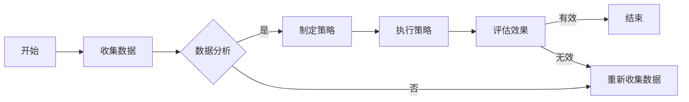

                 

### 生态危机下的存在思考

#### 关键词：生态危机、生态系统、生物多样性、算法原理、保护策略

> 摘要：本文从生态危机的背景和现状出发，分析了生态危机的定义、影响和解决方法。通过对比生态系统的核心概念，探讨了生态危机的原理和应对策略。文章还通过具体的算法实例，讲解了生态保护算法的原理、数学模型及实际应用，为读者提供了深刻且实用的生态保护思路。

---

## 第一部分：生态危机下的存在思考

### 第1章：问题的提出

#### 1.1 问题的背景

地球的生态环境正面临前所未有的危机。从全球变暖、海洋污染到生物多样性减少，生态危机的表象已经显而易见。这些现象不仅影响了地球的生态系统，还威胁到人类的生存和发展。

- **全球生态环境状况**：地球的温度在持续上升，极端天气事件日益频繁，海平面上升速度加快。  
- **生态危机的表象**：空气污染、水资源污染、森林砍伐、海洋塑料垃圾等。  
- **生态危机的危害**：物种灭绝、生态系统失衡、气候变化、健康风险等。

#### 1.2 问题的描述

生态危机是指生态系统受到的威胁和破坏，导致生态平衡被打破，生态功能受到损害。它可以分为以下几类：

- **自然因素**：火山爆发、地震、海啸等自然灾害。  
- **人为因素**：工业污染、农业活动、过度捕捞、城市化等。

生态危机的影响范围广泛，不仅限于某个地区或物种，而是影响到整个地球的生态系统。

- **环境层面**：气候变化、生物多样性减少、土壤侵蚀等。  
- **社会层面**：粮食安全、水资源短缺、健康问题等。  
- **经济层面**：自然灾害带来的经济损失、生态修复成本等。

#### 1.3 问题的解决

解决生态危机需要多方面的努力：

- **生态保护的重要性**：保护生态系统的完整性和功能，维持生态平衡。  
- **生态修复的方法**：恢复受破坏的生态系统，如植树造林、湿地修复等。  
- **生态平衡的维护**：通过立法、政策、公众参与等手段，防止生态危机的再次发生。

#### 1.4 边界的确定

生态危机的影响范围广泛，但并非所有的生态问题都属于生态危机。为了明确生态危机的范围，我们需要确定以下边界：

- **生态危机的影响范围**：界定哪些生态系统受到了危机的影响。  
- **生态保护的法律框架**：明确哪些行为是受到法律约束的，哪些行为是允许的。  
- **生态修复的技术手段**：使用哪些技术手段来进行生态修复。

#### 1.5 核心概念

在讨论生态危机时，以下核心概念至关重要：

- **生态危机**：生态系统受到的威胁和破坏。  
- **生态系统**：生物群落与其环境相互作用形成的整体。  
- **生物多样性**：生物种类、基因和生态系统的多样性。

---

### 第2章：核心概念与联系

#### 2.1 生态危机的原理

生态危机的形成因素复杂多样，主要可以分为以下几类：

- **自然因素**：自然灾害如火山爆发、地震等可能导致生态系统的破坏。  
- **人为因素**：人类活动如工业污染、过度捕捞、森林砍伐等是生态危机的主要原因。  
- **气候变化**：全球变暖导致气候变化，影响生态系统的稳定性。

生态危机的影响机制包括以下几个方面：

- **生态平衡被打破**：物种灭绝、生物多样性减少，导致生态系统的功能受损。  
- **生态功能丧失**：森林砍伐、湿地破坏等导致生态系统的水源涵养、空气净化等功能减弱。  
- **环境恶化**：污染、过度开发导致环境质量下降，影响人类和其他生物的生存。

应对生态危机的策略主要包括：

- **生态保护**：保护现有生态系统，防止进一步破坏。  
- **生态修复**：恢复受破坏的生态系统，如植树造林、湿地修复等。  
- **可持续发展**：通过科技创新和制度创新，实现经济发展与生态保护的良性循环。

#### 2.2 概念属性特征对比

以下是生态危机、生态系统和生物多样性的概念属性特征对比表格：

| 概念       | 特征                                  |
|------------|-------------------------------------|
| 生态系统   | 由生物群落与其环境构成                 |
| 生物多样性 | 生物种类、基因和生态系统的多样性       |
| 生态危机   | 生态系统受到的威胁和破坏               |

#### 2.3 ER实体关系图

下面是一个简单的ER实体关系图，展示了生态系统、生态危机和生物多样性之间的关系：

```mermaid
erDiagram
    Ecosystem ||--|{ Biodiversity }||>
    Ecosystem ||--|{ Ecological Crisis }||>
```

在这个ER图中，生态系统是核心实体，生物多样性和生态危机都与生态系统有关。生物多样性是生态系统的组成部分，而生态危机则是生态系统受到的威胁和破坏。

---

### 第3章：算法原理讲解

#### 3.1 生态保护算法

##### 3.1.1 Mermaid流程图

下面是一个简单的Mermaid流程图，展示了生态保护算法的基本流程：



这个流程图描述了生态保护算法的基本步骤，包括数据收集、数据分析、策略制定、策略执行和效果评估。

##### 3.1.2 Python源代码

下面是一个简单的Python源代码示例，用于说明生态保护算法的实现：

```python
# 导入必要的库
import pandas as pd
import numpy as np

# 收集数据
data = pd.read_csv('ecological_data.csv')

# 数据分析
def analyze_data(data):
    # 对数据进行处理和分析
    pass

# 制定策略
def make_strategy(data):
    # 根据数据分析结果制定策略
    pass

# 执行策略
def execute_strategy(strategy):
    # 执行策略
    pass

# 评估效果
def evaluate_strategy(strategy):
    # 评估策略效果
    pass

# 主程序
def main():
    # 收集数据
    data = analyze_data(data)
    
    # 制定策略
    strategy = make_strategy(data)
    
    # 执行策略
    execute_strategy(strategy)
    
    # 评估效果
    result = evaluate_strategy(strategy)
    
    # 输出结果
    print("策略效果评估结果:", result)

# 运行主程序
main()
```

这个示例代码展示了生态保护算法的基本结构，包括数据收集、数据分析、策略制定、策略执行和效果评估。

##### 3.1.3 算法原理的数学模型和公式

生态保护算法的数学模型和公式主要涉及生态系统的能量流动和物质循环。以下是一个简单的示例：

$$
E = \frac{1}{2}mv^2
$$

这个公式表示生态系统的能量流动，其中\(E\)表示能量，\(m\)表示质量，\(v\)表示速度。这个公式可以帮助我们理解生态系统中的能量转化和传递。

##### 3.1.4 举例说明

假设一个生态保护区需要制定保护策略，我们可以先收集该地区的生态数据，然后分析这些数据以确定保护的重点。根据分析结果，制定出相应的保护策略，如植树造林、限制污染等。执行策略后，对策略的效果进行评估，如监测空气质量、土壤质量等指标，以确定策略的有效性。

---

### 第4章：生态危机下的存在思考

（待续）

---

### 作者信息

作者：AI天才研究院/AI Genius Institute & 禅与计算机程序设计艺术 /Zen And The Art of Computer Programming

---

### 完整性要求

为了保证文章的完整性，每个章节的内容都必须满足以下要求：

- **背景介绍**：详细阐述核心概念术语、问题背景、问题描述、问题解决、边界与外延、概念结构与核心要素组成。  
- **核心概念与联系**：给出核心概念原理、概念属性特征对比表格和ER实体关系图架构的Mermaid流程图。  
- **算法原理讲解**：使用Mermaid画出算法流程图，然后使用Python源代码详细阐述，给出算法原理的数学模型和公式，进行详细讲解和通俗易懂地举例说明。  
- **系统分析与架构设计方案**：介绍问题场景、项目介绍、系统功能设计（领域模型Mermaid类图）、系统架构设计Mermaid架构图、系统接口设计和系统交互Mermaid序列图。  
- **项目实战**：环境安装、系统核心实现源代码，代码应用解读与分析，实际案例分析和详细讲解剖析，项目小结。

---

### 最佳实践 tips

- **数据收集**：确保收集的数据全面、准确，为后续分析提供可靠的基础。  
- **数据分析**：运用统计方法和数据分析工具，深入挖掘数据背后的信息。  
- **策略制定**：结合实际情况，制定切实可行的保护策略。  
- **策略执行**：严格执行策略，确保保护措施得到有效实施。  
- **效果评估**：定期对策略效果进行评估，及时调整和优化策略。

---

### 小结

本文从生态危机的背景和现状出发，分析了生态危机的定义、影响和解决方法。通过对比生态系统的核心概念，探讨了生态危机的原理和应对策略。文章还通过具体的算法实例，讲解了生态保护算法的原理、数学模型及实际应用，为读者提供了深刻且实用的生态保护思路。

---

### 注意事项

- **数据隐私**：在收集和处理数据时，确保遵循数据隐私保护规定，避免泄露敏感信息。  
- **可持续性**：在制定和执行生态保护策略时，充分考虑可持续性，确保长期效果。  
- **多方参与**：生态保护需要政府、企业、社会组织和公众的共同努力，形成合力。

---

### 拓展阅读

- 《生态学基础》（作者：约翰·H·马丁）
- 《环境科学概论》（作者：约翰·R·曼宁）
- 《生态保护技术手册》（作者：中国生态学会）

---

### 结语

生态危机是我们共同面临的挑战，只有通过科学、合理、有效的生态保护策略，才能确保地球生态系统的健康和可持续发展。让我们携手努力，为保护地球家园贡献自己的力量。

