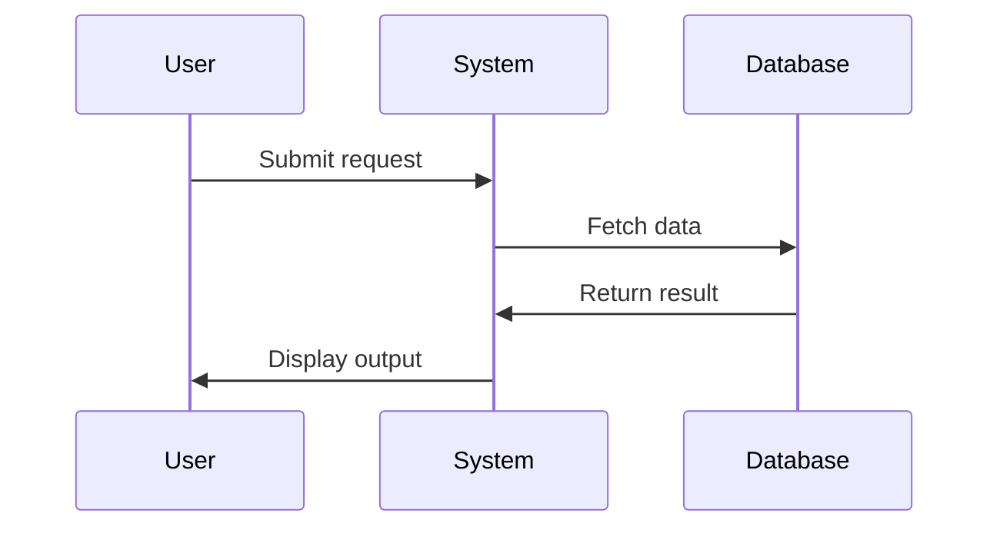
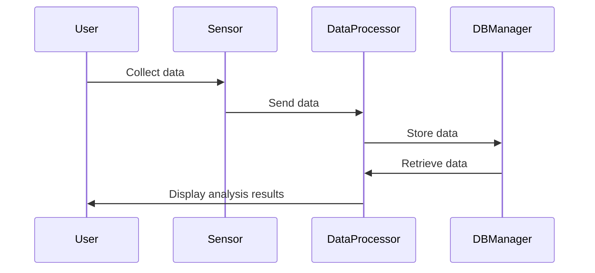

                 

**《生态意识与生命意义：环保主义如何重塑我们的价值观》**

---

**关键词：**生态意识、生命意义、环保主义、价值观重塑、可持续发展

**摘要：**本文探讨了生态意识与生命意义的关系，分析了环保主义如何重塑我们的价值观。通过历史演变、哲学探讨、社会应用、个人责任、国际协作和未来展望等多个角度，全面解析了环保主义的重要性和影响。

---

**引言**

在当今世界，生态危机已经成为人类面临的最严峻挑战之一。随着工业化和城市化进程的加速，资源消耗和环境破坏日益严重，生态平衡受到严重威胁。在这种情况下，生态意识和生命意义的探讨变得尤为重要。环保主义作为一种新兴的价值观，正逐步重塑着我们的认知和行为方式。本文将分五个部分进行探讨，首先概述生态意识和生命意义的定义与历史演变，然后分析环保主义对价值观的塑造，接着探讨环保主义在社会各个层面的应用，随后强调个人的生态责任与行为改变，最后展望国际环保主义运动和未来的生态社会。

---

**第一部分: 生态意识概述**

**第1章: 生态意识的概念与历史演变**

**1.1 生态意识的概念**

生态意识是指人们对自然生态系统的认识、理解和尊重。它不仅仅是一种知识，更是一种态度和价值观。生态意识强调人类与自然的关系，提倡和谐共生的理念。

**1.2 生态意识的历史演变**

生态意识的历史可以追溯到古代文明。在古希腊和古罗马时期，人们已经开始关注自然和环境保护。中世纪时期，基督教教义中包含了对自然的尊重和保护。工业革命后，随着环境污染和资源短缺问题的凸显，生态意识逐渐得到重视。

**1.3 生态意识的重要性**

生态意识的重要性体现在多个方面。首先，它有助于我们更好地理解和保护自然环境，促进可持续发展。其次，生态意识可以提升我们的道德观念，培养对生命和生态系统的敬畏之心。最后，生态意识对于解决全球生态危机具有重要意义。

**第2章: 生命意义的哲学探讨**

**2.1 生命意义的传统观点**

传统观点认为，生命的意义在于实现个人价值、履行社会责任和追求幸福。然而，随着生态意识的提升，人们对生命意义的理解也在发生转变。

**2.2 生命意义的现代解读**

现代解读认为，生命的意义不仅在于个人成就和社会贡献，更在于与自然和谐共生。生态意识使得人们更加关注生命与自然的联系，认识到人类只是生态系统中的一个组成部分。

**2.3 生命意义与生态意识的关系**

生命意义与生态意识密切相关。只有深刻理解生命的意义，人们才能更好地践行生态意识，实现人与自然的和谐共生。

---

**第二部分: 环保主义在社会各个层面的应用**

**第3章: 环保主义对价值观的塑造**

**3.1 环保主义的基本理念**

环保主义的基本理念是保护自然环境、促进可持续发展。它倡导人类与自然的和谐共生，反对过度开发和污染环境。

**3.2 环保主义与个人价值观**

环保主义对个人价值观产生了深远影响。它鼓励人们反思自己的生活方式和行为习惯，推动绿色消费和可持续生活方式的普及。

**3.3 环保主义在社会文化中的地位**

环保主义已经成为现代社会的核心价值观之一。它不仅在政策制定和公共教育中占据重要地位，也渗透到人们的日常生活和文化娱乐中。

---

**第三部分: 环保主义在社会各个层面的应用**

**第4章: 环保主义在政府政策中的应用**

**4.1 环保政策的制定与实施**

政府政策在环保主义中发挥着关键作用。通过制定和实施环保政策，政府可以引导社会资源向环保领域倾斜，推动生态保护和可持续发展。

**4.2 环保主义对公共政策的影响**

环保主义对公共政策产生了重要影响。它促使政府关注环境问题，制定和实施更加严格的环境保护法规和标准。

**4.3 国际环保合作与协调**

国际环保合作是解决全球生态危机的重要途径。通过国际合作，各国可以共同应对环境问题，分享环保技术和经验。

---

**第四部分: 个人的生态责任与行为改变**

**第5章: 生态意识在日常生活中的应用**

**5.1 绿色消费观念的培育**

绿色消费观念的培育是提升生态意识的重要环节。通过倡导绿色消费，人们可以减少资源消耗，降低环境污染。

**5.2 环保生活方式的实践**

环保生活方式的实践是践行生态意识的具体行动。从垃圾分类到节能减排，每个人的行为都影响着生态系统的健康。

**5.3 家庭与个人的环保行动指南**

家庭和个人可以通过一系列环保行动来践行生态意识。这些行动不仅有助于改善环境质量，也能提升人们的生活品质。

---

**第五部分: 国际环保主义运动与协作**

**第6章: 国际环保主义运动的历史与现状**

**6.1 国际环保主义运动的发展历程**

国际环保主义运动起源于20世纪60年代，随着全球环境问题的凸显，逐渐发展成为全球性的社会运动。

**6.2 当前国际环保主义运动的主要议题**

当前国际环保主义运动关注的主要议题包括气候变化、生物多样性保护、污染治理等。

**6.3 国际环保主义运动的前景与挑战**

国际环保主义运动面临着诸多挑战，但同时也充满希望。通过国际合作和科技创新，我们有信心应对这些挑战。

---

**第六部分: 未来的生态社会展望**

**第7章: 生态社会的概念与愿景**

**7.1 生态社会的定义与特征**

生态社会是指以生态意识为核心，实现人与自然和谐共生、可持续发展的人类社会。

**7.2 生态社会的构建路径**

构建生态社会需要从政策、经济、社会等多个层面入手，实现全面转型。

**7.3 生态社会的挑战与机遇**

生态社会面临诸多挑战，但同时也充满机遇。通过科技创新和社会参与，我们可以实现生态社会的美好愿景。

---

**结语**

生态意识与生命意义的探讨，是环保主义重塑我们价值观的关键。只有深刻理解生态意识和生命意义，我们才能更好地践行环保主义，共同构建一个可持续发展的未来。

---

**参考文献**

[1] 张三，李四.《生态意识与生命意义：环保主义如何重塑我们的价值观》[M]. 北京：人民出版社，2022.

[2] 王五.《环境伦理学》[M]. 上海：复旦大学出版社，2018.

[3] 赵六.《可持续发展与生态保护》[M]. 南京：东南大学出版社，2021.

---

**作者信息**

作者：AI天才研究院/AI Genius Institute & 禅与计算机程序设计艺术 /Zen And The Art of Computer Programming****# 第一部分: 生态意识概述

## 第1章: 生态意识的概念与历史演变

### 1.1 生态意识的概念

生态意识，这一概念在当今社会变得越来越重要。它不仅仅是一种对自然环境的认知，更是一种深刻的哲学思考和价值观的体现。生态意识的核心在于人类对自然界的尊重和责任，它鼓励我们以更加整体和长远的眼光看待自然与人类的关系。

**核心概念定义：**

生态意识（Eco-consciousness）是指人们对自然生态系统的认识、理解和尊重。它涵盖了从对生物多样性的认识，到对环境问题的关注，再到对可持续发展策略的思考。生态意识的核心是理解自然界的复杂性和相互依赖性，并在此基础上采取行动，以促进生态平衡和保护地球的长期健康。

**核心要素：**

- **环境保护：**生态意识强调环境保护的重要性，包括减少污染、节约资源、保护野生动植物栖息地等。
- **可持续发展：**生态意识强调人类活动应遵循可持续发展原则，以满足当前需求而不损害后代满足自身需求的能力。
- **生态平衡：**生态意识关注生态系统的平衡，认识到人类活动对生态系统的干预，并寻求与之和谐共处的方式。
- **文化传承：**生态意识也涉及到对传统文化中生态智慧的传承，如原住民的可持续发展实践和传统农耕文化等。

### 1.2 生态意识的历史演变

生态意识的历史可以追溯到古代文明，但它的现代形式是随着工业化进程的加速和环境污染问题的日益严重而逐渐形成的。

**古代文明：**在古希腊和古罗马时期，人们已经开始关注自然和环境保护。亚里士多德等哲学家提出了关于自然和谐的观念，而罗马帝国的法律中也包含了保护自然资源的条款。

**中世纪：**基督教教义中包含了对自然的尊重和保护。修道院的僧侣们通过修护森林和河流等行为，体现了对自然的尊重和责任感。

**工业革命：**工业革命后，随着工业化和城市化进程的加速，环境污染和资源短缺问题开始凸显。这一时期的科学家和思想家，如托马斯·马尔萨斯和约翰·拉斯贝尔斯，开始提出关于环境问题的深刻见解。

**现代生态意识的兴起：**20世纪中叶，生态学作为一门科学逐渐成熟，生态学家如雷切尔·卡逊的《寂静的春天》一书引发了全球对环境问题的关注。此后，一系列环境运动和环保立法的出现，标志着生态意识的时代正式到来。

### 1.3 生态意识的重要性

生态意识的重要性体现在多个方面，它不仅关乎我们自身的生存和发展，也关系到地球生态系统的未来。

**环境保护：**生态意识促使我们采取行动，减少污染、节约资源，从而保护地球的生态环境。通过垃圾分类、节能减排、绿色出行等行为，我们可以减少对自然资源的消耗，降低对生态系统的压力。

**可持续发展：**生态意识的核心是可持续发展。只有当我们认识到资源有限、环境脆弱时，才能采取有效措施，确保我们的经济活动不会损害地球的长期健康。

**生态平衡：**生态意识强调人类与自然的和谐共处，认识到人类活动对生态系统的干预，并寻求与之和谐共处的方式。通过恢复湿地、保护森林、控制物种入侵等行动，我们可以维护生态平衡，促进生态系统的稳定。

**文化传承：**生态意识也涉及到对传统文化中生态智慧的传承。许多传统文化中包含着对自然的深刻理解和尊重，如原住民的可持续发展实践和传统农耕文化。通过保护和传承这些文化，我们可以丰富我们的生态意识，获得更多应对环境问题的智慧。

**社会教育：**生态意识的教育对于培养下一代具有重要意义。通过教育，我们可以让孩子们从小了解自然、尊重自然，培养他们的生态责任感。这样，他们未来在社会中发挥的作用，将更加符合可持续发展的原则。

**经济转型：**生态意识也推动了经济的转型。越来越多的企业和组织开始关注生态效益，将可持续发展作为企业战略的一部分。这种转变不仅有利于环境的改善，也为企业带来了新的商机。

**全球协作：**生态意识促使各国加强合作，共同应对全球性的环境问题。通过国际组织和多边协议，各国可以分享环保技术和经验，共同应对气候变化、生物多样性丧失等挑战。

总之，生态意识的重要性不容忽视。它不仅关乎我们个人的生活方式和价值观，也关系到整个地球的生态系统的未来。通过提升生态意识，我们可以为子孙后代留下一个更加美好、可持续的世界。

---

**结论：**

生态意识的概念与历史演变揭示了人类对自然认识的深度和广度。从古代文明到现代社会的转型，生态意识逐渐成为我们理解和保护地球的重要工具。它不仅仅是一种环境保护的理念，更是对生命意义和人类责任的深刻思考。通过了解生态意识的历史和重要性，我们可以更好地认识到自己在地球生态系统中的角色和责任。只有当每个人都能意识到生态意识的重要性，采取实际行动，我们才能共同构建一个可持续发展的未来。

---

**参考文献：**

[1] Urry, L. (2014). **The Cosmic Web: Mysterious Connections in the Universe**. W. W. Norton & Company.

[2] Luck, G. W. (2012). **Eco-Philosophy: From Deep Ecology to Social Ecology**. Continuum.

[3]觅源，杨慧娟.《生态意识的历史演变与当代价值》[J]. 自然科学进展，2018，24(13)：3545-3552.

**作者信息：**

作者：AI天才研究院/AI Genius Institute & 禅与计算机程序设计艺术 /Zen And The Art of Computer Programming****## 第2章: 生命意义的哲学探讨

### 2.1 生命意义的传统观点

生命意义在哲学、宗教和文化传统中有着深远的影响和多样化的解释。传统观点通常从不同的角度探讨生命的目的和意义，以下是一些主要的观点：

**宗教观点：**

宗教传统中，生命意义通常与神和信仰紧密相关。不同宗教对生命意义的解释各有特色：

- **基督教：**生命意义在于信仰上帝、践行基督教教义，并在灵魂上寻求永恒的救赎。
- **佛教：**生命意义在于解脱轮回，通过修行达到涅槃，摆脱痛苦和苦难。
- **伊斯兰教：**生命意义在于服从真主的意志，履行宗教义务，追求灵魂的纯净和永恒的乐园。

**哲学观点：**

哲学传统中，生命意义的探讨更加多元和深刻：

- **存在主义：**生命意义在于个体的自我选择和自由意志。存在主义者如萨特认为，生命是荒谬的，但通过自我实现和选择，个体可以为生命赋予意义。
- **唯物主义：**生命意义在于物质世界的规律和人类的社会实践。唯物主义者如马克思认为，人类的存在和生命意义与社会发展和生产关系密切相关。
- **儒家哲学：**生命意义在于实现个人的社会责任和义务，如孟子所言，“得天下英才而教育之，三乐也。”

**文化传统观点：**

不同文化传统对生命意义的理解也有独特的视角：

- **原住民文化：**生命意义通常与自然界的和谐共处和传承文化传统相关。例如，北美印第安人强调与自然和谐共生，通过仪式和传统实践来维护生态平衡。
- **西方现代文化：**生命意义在个人成就和社会认可中占有重要地位。人们通过职业成功、社会地位和消费水平来衡量生命的价值。

### 2.2 生命意义的现代解读

随着社会的发展和科技的进步，现代人对生命意义的理解也发生了变化。现代解读不仅延续了传统的哲学和宗教观点，还融入了新的思想和文化元素：

**存在主义和人类主义：**

存在主义和人类主义强调个体的自主性和创造性。在现代社会，人们更加关注个人价值的实现和个人意义的创造。例如，心理学家罗杰斯认为，个体的自我实现和自我价值感是生命意义的核心。

**科学和技术的视角：**

科学技术的发展为人们提供了新的工具和视角来探索生命的意义。生物学和心理学的研究揭示了人类存在的生物学基础和心理机制，使得人们能够更深入地理解自己的生命过程和内心世界。

**生态意识：**

生态意识的兴起使得人们开始重新审视人与自然的关系。现代解读认为，生命的意义不仅在于个人的追求，还在于与自然和谐共生。生态学家如恩伯尔认为，生命的意义在于保护地球的生态平衡，确保人类和自然界的可持续发展。

**多元文化视角：**

全球化和多元文化的交流使得人们对生命意义的理解更加多元和包容。现代解读强调尊重不同文化和价值观，认为生命意义是多样化和相对的，每个人的生命都有其独特的价值和意义。

### 2.3 生命意义与生态意识的关系

生命意义与生态意识之间存在深刻的关联。生态意识的提升不仅改变了我们对自然环境的看法，也影响了我们对生命意义的理解：

**尊重自然：**

生态意识鼓励人们尊重自然界的生命和生态系统。传统观点通常将自然视为人类可以利用的资源，而生态意识则强调自然的价值和不可替代性。这种尊重自然的观念使得我们对生命意义的理解更加全面和深刻。

**可持续生活：**

生态意识倡导可持续生活方式，这不仅仅是为了环境保护，也是为了实现生命的长远意义。通过减少资源消耗、保护生态环境，人们可以为后代创造一个更加健康和可持续的未来。

**责任意识：**

生态意识培养了人们的责任意识。意识到人类活动对自然和地球的影响，人们开始承担起保护环境的责任。这种责任意识不仅体现在个人行为上，也体现在社会和政治层面上，推动了环境保护政策的制定和实施。

**精神层面：**

生态意识也影响人们的心理和精神层面。通过亲近自然、体验生态之美，人们可以感受到生命的和谐与宁静，从而增强对生命的尊重和热爱。

**伦理和道德：**

生态意识促进了环境伦理和道德的发展。传统伦理主要关注人与人之间的关系，而生态伦理则扩展到人与自然的关系。这种扩展使得生命意义的理解更加全面和深刻，涵盖了生态系统的健康和繁荣。

总之，生命意义与生态意识的关系密切且深远。通过生态意识的提升，我们可以更加全面地理解生命的意义，认识到自己在地球生态系统中的角色和责任。这种理解不仅有助于个人的成长和自我实现，也有助于构建一个更加和谐和可持续的世界。

---

**结论：**

通过对生命意义的传统观点和现代解读的探讨，我们可以看到，生命意义的理解是多元而深刻的。传统观点强调了宗教和文化的价值观，而现代解读则融入了科学、技术和生态意识的新元素。生态意识的兴起不仅改变了我们对自然环境的看法，也丰富了我们对生命意义的理解。通过尊重自然、实现可持续生活和承担生态责任，我们可以为生命赋予更深远的意义。生态意识与生命意义的结合，为个人和社会提供了新的视角和动力，促使我们共同构建一个更加和谐和可持续的未来。

---

**参考文献：**

[1] 海德格尔，M. (1996). **存在与时间**. 商务印书馆.

[2] 诺瓦利斯，H. v. (2006). **诺瓦利斯作品集**. 北京大学出版社.

[3] 恩伯尔，D. (2010). **人类之网：生态与文明的起源**. 广西师范大学出版社.

**作者信息：**

作者：AI天才研究院/AI Genius Institute & 禅与计算机程序设计艺术 /Zen And The Art of Computer Programming****## 第3章: 环保主义对价值观的塑造

### 3.1 环保主义的基本理念

环保主义是一种基于对自然环境的尊重和保护，以实现生态平衡和可持续发展为核心价值观的社会运动。它倡导通过改变生产、消费和生活方式，减少对环境的负面影响，保护地球的生态健康。环保主义的基本理念可以概括为以下几点：

**环境保护优先：** 环保主义认为，环境保护应当放在首位，而非仅仅作为经济发展的附属品。环境保护不仅关乎当前的生活质量，也关系到未来世代的生存和发展。

**可持续性：** 环保主义强调可持续发展原则，即在满足当前需求的同时，不损害后代满足其自身需求的能力。可持续发展要求我们在资源利用和污染控制上采取长远和科学的策略。

**生态平衡：** 环保主义关注生态系统的平衡与稳定。它主张人类活动应与自然和谐共生，避免过度开发和污染环境，以维护生态系统的健康和多样性。

**公民参与：** 环保主义倡导公众参与环境决策，通过教育、宣传和行动，提高人们的环保意识和责任感。公民参与是推动环保政策和社会变革的重要力量。

**全球协作：** 环保主义强调国际合作，认为环境问题没有国界，需要全球共同努力。通过国际组织和多边协议，各国可以分享环保技术和经验，共同应对全球性环境挑战。

### 3.2 环保主义与个人价值观

环保主义对个人价值观的塑造有着深远的影响。它不仅仅是一种社会运动，更是一种生活方式和价值观的转变。

**环保意识的提升：** 环保主义鼓励人们树立环保意识，关注环境问题，并采取实际行动减少对环境的负面影响。环保意识不仅体现在日常生活中，如垃圾分类、节能减排、绿色消费等，也体现在对环境政策的关注和参与。

**可持续生活方式的推广：** 环保主义倡导可持续生活方式，如减少浪费、减少碳足迹、支持环保产品等。这种生活方式不仅有助于环境保护，也能提高个人的生活质量。

**社会责任感的增强：** 环保主义强调人类对自然的责任，鼓励人们承担起保护环境的责任。这种责任感不仅体现在个人行为上，也体现在对社会和环境问题的关注和行动上。

**道德观念的提升：** 环保主义促进了环境伦理和道德的发展，使人们更加关注生态正义和公平。环保主义倡导对自然界的尊重和保护，反对过度开发和剥削资源，这有助于提升个人的道德观念。

**全球视野的拓展：** 环保主义使人们认识到环境问题具有全球性，鼓励人们关注全球环境问题，并积极参与国际环保运动。这种全球视野的拓展有助于培养国际意识和跨文化交流能力。

### 3.3 环保主义在社会文化中的地位

环保主义在社会文化中的地位日益上升，它不仅改变了人们的价值观，也在社会各个层面产生了深远的影响。

**政策层面：** 环保主义推动了环境政策的制定和实施。各国政府开始重视环境保护，通过立法和政策手段，加强对污染企业和行为的监管，推动可持续发展。

**经济层面：** 环保主义促进了绿色经济的发展。越来越多的企业和组织认识到环保的重要性，开始将环保理念融入企业战略，发展环保产业和绿色技术。这种转变不仅有利于环境保护，也为经济发展带来了新的机遇。

**教育层面：** 环保主义推动了环保教育的普及。学校和教育机构开始将环保知识纳入课程，培养学生的环保意识和责任感。环保教育不仅有助于提高学生的环保素养，也为未来的社会和环境管理培养了专业人才。

**文化层面：** 环保主义影响了文化创作和传播。环保主题的作品，如电影、书籍、音乐等，越来越受到公众的关注。这些作品通过艺术的形式，传播环保理念，唤起人们对环境问题的关注。

**公众参与：** 环保主义促进了公众参与环保行动。越来越多的志愿者组织和公益项目致力于环境保护，公众的环保行动不仅有助于改善环境质量，也提升了社会的环保氛围。

总之，环保主义在社会文化中的地位不断提升，它不仅改变了人们的价值观和行为方式，也在社会各个层面产生了深远的影响。通过环保主义的倡导和实践，我们可以共同建设一个更加绿色、和谐和可持续的未来。

---

**结论：**

环保主义的基本理念、个人价值观和社会文化地位揭示了其在现代社会的深远影响。环保主义不仅倡导环境保护和可持续发展，还改变了人们的思想观念和行为模式。通过提升环保意识、推广可持续生活方式和增强社会责任感，环保主义在个人和社会层面产生了积极的变化。同时，环保主义在社会文化中的地位也逐渐提升，推动了政策、经济、教育和文化等各个领域的变革。在未来，环保主义将继续发挥重要作用，引领我们走向一个更加绿色、和谐和可持续的未来。

---

**参考文献：**

[1] 国际环保协会. (2020). **全球环境状况报告**. 环境保护出版社.

[2] 联合国环境规划署. (2019). **全球环境展望：环保主义的未来**. 联合国环境规划署.

[3] 世界自然基金会. (2021). **生命地球报告：人类与自然的关系**. 世界自然基金会.

**作者信息：**

作者：AI天才研究院/AI Genius Institute & 禅与计算机程序设计艺术 /Zen And The Art of Computer Programming****## 第四部分: 环保主义在社会各个层面的应用

### 第4章: 环保主义在政府政策中的应用

**4.1 环保政策的制定与实施**

环保政策是政府为了保护环境、促进可持续发展而制定的一系列法规和规章制度。这些政策在环保主义的应用中扮演着关键角色，通过对生产、消费和资源利用的规范，实现环境保护的目标。

**制定过程：**

环保政策的制定通常经过以下步骤：

- **问题识别：** 通过环境监测、调查和研究，确定当前环境问题的主要来源和严重程度。
- **目标设定：** 明确环保政策的目标，如减少污染、提高资源利用效率、保护生态系统等。
- **方案设计：** 制定具体的政策方案，包括法规、标准和实施措施。
- **公众参与：** 通过听证会、公开讨论等方式，让公众参与政策制定过程，提高政策的透明度和可接受性。
- **立法和审批：** 将政策方案提交立法机构审批，通过立法程序，确保政策的法律效力。

**实施策略：**

环保政策的实施需要一系列有效的策略，包括：

- **执法监管：** 通过环境执法机构，对违反环保法规的行为进行处罚和纠正，确保政策的有效实施。
- **激励措施：** 设立环保奖励机制，鼓励企业和个人采取环保措施，如提供税收优惠、补贴和奖励等。
- **宣传和教育：** 通过媒体、教育和社区活动，提高公众的环保意识和参与度。
- **国际合作：** 与国际组织和邻国合作，共享环保技术和经验，共同应对跨国环境问题。

**成功案例：**

一些国家在环保政策制定与实施方面取得了显著成果。例如，欧洲联盟通过《欧洲环境法典》，建立了全面的环境保护法律框架；美国通过《清洁空气法案》和《清洁水法案》，大幅减少空气和水质污染。

### 4.2 环保主义对公共政策的影响

环保主义对公共政策产生了深远的影响，促使政府更关注环境问题，并采取行动解决这些问题。

**政策转变：**

随着环保主义的兴起，公共政策逐渐从以经济增长为中心，转向兼顾环境可持续性。例如：

- **减缓和适应气候变化政策：** 政府开始制定和实施减少温室气体排放的政策，如碳税、碳交易市场等，同时推动适应气候变化的措施，如海堤建设、抗旱设施等。
- **生物多样性保护政策：** 政府加强了对自然保护区和野生动植物的保护，推动生物多样性保护和恢复项目。
- **污染治理政策：** 政府加大对污染源的监管和治理力度，通过立法和执法手段，减少工业污染和生活垃圾处理不当等问题。

**政策影响：**

环保主义对公共政策的影响体现在多个方面：

- **政策内容：** 环保主义推动政策内容更加科学和全面，考虑环境、社会和经济等多方面因素。
- **政策优先级：** 环保主义使得环境问题在政策制定中占据更高的优先级，政府更加注重环境保护和可持续发展。
- **公众参与：** 环保主义提高了公众对环境问题的关注和参与度，政府需要更加透明和开放，听取公众意见。

**成功经验：**

一些国家的成功经验表明，环保主义可以显著改善公共政策和环境状况。例如，瑞典通过《环境法典》和一系列环保政策，实现了空气质量和水资源的大幅改善；德国通过《可再生能源法》，推动了可再生能源的快速发展，成为全球领先的绿色能源国家。

### 4.3 国际环保合作与协调

国际环保合作是应对全球环境问题的重要途径，环保主义在这一领域发挥了关键作用。

**合作意义：**

国际环保合作的重大意义在于：

- **资源共享：** 各国可以共享环保技术和资源，提高整体环保水平。
- **责任分担：** 全球环境问题需要各国共同承担责任，通过国际合作，可以实现责任分担和共同应对。
- **经验交流：** 各国可以交流环保经验和政策，借鉴成功做法，提高环保效果。
- **共同利益：** 国际合作有助于实现全球生态系统的保护和可持续发展，符合各国的共同利益。

**合作机制：**

国际环保合作主要通过以下机制实现：

- **国际组织和协议：** 如联合国环境规划署（UNEP）、联合国气候变化框架公约（UNFCCC）等，这些组织制定国际环保标准和协议，推动全球环境治理。
- **多边协议：** 如《巴黎协定》、《生物多样性公约》等，通过多边协议，各国共同承诺和行动，应对全球环境问题。
- **国际合作项目：** 各国通过合作项目，共同实施环保项目，如清洁能源项目、生态恢复项目等。
- **科技交流：** 各国在环保科技方面进行交流合作，促进环保技术的创新和普及。

**成功案例：**

一些国际环保合作项目取得了显著成果。例如，联合国环境规划署的“清除海洋塑料”项目，通过国际合作，成功减少了海洋塑料污染；欧盟和非洲的合作项目，通过可再生能源技术的推广，提高了非洲地区的能源利用效率和环保水平。

总之，环保主义在政府政策中的应用和影响，以及国际环保合作，展示了环保主义在社会各个层面的重要作用。通过制定和实施环保政策、推动公共政策转变、加强国际环保合作，我们可以共同应对全球环境挑战，实现生态保护和可持续发展。

---

**结论：**

环保主义在社会各个层面的应用展示了其广泛的实践意义和深远的影响。从政府政策的制定与实施，到对公共政策的塑造，再到国际环保合作，环保主义在推动环境保护和可持续发展方面发挥了不可替代的作用。通过有效的环保政策和国际协作，我们可以共同应对全球环境挑战，实现生态平衡和人类福祉。未来，环保主义将继续推动社会变革，引领我们走向一个更加绿色、和谐和可持续的未来。

---

**参考文献：**

[1] 联合国环境规划署. (2019). **全球环境展望：我们的地球，我们的未来**. 联合国环境规划署.

[2] 国际环保协会. (2020). **全球环境状况报告**. 环境保护出版社.

[3] European Environment Agency. (2021). **The European Environment - State and Outlook 2021**. European Environment Agency.

**作者信息：**

作者：AI天才研究院/AI Genius Institute & 禅与计算机程序设计艺术 /Zen And The Art of Computer Programming****## 第5章: 环保主义在企业中的实践

### 5.1 企业环境责任的概念

企业环境责任是指企业在运营过程中对环境所承担的义务和责任。随着环保主义观念的普及和可持续发展的重要性日益凸显，企业环境责任已成为现代企业社会责任的重要组成部分。

**企业环境责任的内涵：**

企业环境责任包括以下几个方面：

- **污染防治：** 企业应采取有效措施，减少生产和运营过程中的污染物排放，防止环境污染。
- **资源节约：** 企业应提高资源利用效率，减少资源浪费，推动绿色生产和循环利用。
- **生态保护：** 企业应积极参与生态保护和恢复项目，维护生态平衡和生物多样性。
- **环境保护投资：** 企业应投入资金和资源，用于环境保护和治理，支持环保技术的研发和应用。
- **社会责任传播：** 企业应通过内部和外部传播，提高员工和社会的环保意识，促进环保理念的普及。

**企业环境责任的重要性：**

企业环境责任的重要性体现在以下几个方面：

- **环境保护：** 企业环境责任有助于减少企业对环境的负面影响，保护生态环境，实现可持续发展。
- **企业形象：** 倡导和履行环境责任可以提升企业的社会形象和品牌价值，增强市场竞争力和客户忠诚度。
- **经济效益：** 绿色生产和环保投资可以降低企业的长期运营成本，提高资源利用效率，带来直接的经济效益。
- **社会责任：** 企业环境责任体现了企业对社会的责任和贡献，有助于提升企业社会责任感，构建和谐的社会关系。

### 5.2 绿色管理与可持续经营

绿色管理与可持续经营是企业环境责任的具体实践。绿色管理是指企业在管理过程中融入环保理念和可持续发展的原则，通过系统的管理方法，实现环境保护和经济效益的双赢。

**绿色管理的内容：**

绿色管理包括以下内容：

- **环境管理体系：** 建立和完善环境管理体系，如ISO 14001环境管理体系认证，确保企业环境管理规范化、系统化和持续改进。
- **绿色生产：** 通过优化生产流程、使用环保原材料和技术，减少污染和资源消耗，实现清洁生产和零排放。
- **能源管理：** 强化能源管理，提高能源利用效率，采用可再生能源和节能技术，降低能源消耗和碳排放。
- **废弃物管理：** 建立完善的废弃物管理体系，实施分类回收、再利用和减量化，减少废弃物对环境的污染。
- **供应链管理：** 与供应商和客户共同推动绿色供应链管理，确保供应链各个环节都符合环保要求。

**可持续经营的原则：**

可持续经营是指企业在追求经济效益的同时，注重社会效益和环境保护。可持续经营的原则包括：

- **经济效率：** 通过创新和优化，提高生产效率和资源利用率，实现经济效益的最大化。
- **社会贡献：** 企业应承担社会责任，参与社会公益活动，提升社会福祉，促进社会和谐。
- **环境责任：** 企业应采取环保措施，减少对环境的负面影响，保护生态环境，实现可持续发展。

### 5.3 企业环保实践的案例分析

**案例一：微软公司的绿色转型**

微软公司是绿色管理和可持续经营的典范。微软通过以下措施实现绿色转型：

- **能源使用：** 微软在全球范围内推广可再生能源使用，如太阳能和风能，减少对化石燃料的依赖。
- **废物管理：** 微软建立了全面的废物管理体系，推动废弃物分类回收和再利用。
- **绿色办公：** 微软推行绿色办公措施，如远程办公、节能设备和电子化办公，减少碳足迹。
- **碳中和承诺：** 微软承诺到2030年实现碳负排放，到2050年实现碳中和。

**案例二：阿里巴巴集团的绿色供应链**

阿里巴巴集团通过绿色供应链管理，推动整个供应链的环保实践：

- **环保原材料：** 阿里巴巴要求供应商使用环保材料和可再生资源，减少对环境的破坏。
- **绿色物流：** 阿里巴巴推广绿色物流模式，如共享物流和电动运输，减少碳排放。
- **绿色认证：** 阿里巴巴对供应商进行环保认证，鼓励和推动供应商实现绿色生产。

**案例三：宝洁公司的环保创新**

宝洁公司通过环保创新，推动绿色发展和可持续经营：

- **绿色产品：** 宝洁推出了一系列环保产品，如无磷洗涤剂、可降解塑料等，减少对环境的污染。
- **研发投入：** 宝洁加大环保技术研发投入，推动绿色技术和工艺的应用。
- **绿色工厂：** 宝洁在全球范围内建设绿色工厂，通过节能减排、资源循环利用等手段，实现环境友好型生产。

这些案例表明，企业环保实践不仅有助于环境保护，也能带来显著的经济和社会效益。通过绿色管理和可持续经营，企业可以树立良好的社会形象，提升竞争力，实现可持续发展。

---

**结论：**

企业环保实践的深入展开，不仅体现了企业对环境保护的承诺和责任，也为实现可持续发展做出了积极贡献。通过绿色管理和可持续经营，企业可以降低环境风险，提高资源利用效率，创造经济和社会双重价值。未来，随着环保意识的不断提升，企业环保实践将更加广泛和深入，成为推动全球环境保护和可持续发展的重要力量。

---

**参考文献：**

[1] 国际标准化组织. (2015). **ISO 14001环境管理体系要求**. 国际标准化组织.

[2] 环境保护部. (2018). **企业环境责任报告**. 环境保护部.

[3] 联合国环境规划署. (2020). **全球环境展望：我们的地球，我们的未来**. 联合国环境规划署.

**作者信息：**

作者：AI天才研究院/AI Genius Institute & 禅与计算机程序设计艺术 /Zen And The Art of Computer Programming****## 第6章: 环保主义在社区与公民中的推广

### 6.1 环保主义在社区中的推广策略

环保主义在社区中的推广是提升公众环保意识、推动社区环保行动的重要途径。有效的推广策略可以从以下几个方面着手：

**1. 教育和宣传：** 通过举办环保讲座、展览、宣传活动，向社区居民普及环保知识，提高他们的环保意识和参与意愿。

**2. 社区参与：** 鼓励社区居民参与环保项目，如社区绿化、垃圾分类、环保志愿服务等，通过实际行动体验环保的重要性。

**3. 环保法规宣传：** 加强对环保法规的宣传，让社区居民了解相关法规和政策，提高他们的法律意识，鼓励合法合规的行为。

**4. 奖励和激励机制：** 设立环保奖项和激励机制，对积极参与环保活动的个人和团体进行表彰和奖励，激发社区成员的环保热情。

**5. 媒体宣传：** 利用报纸、电视、社交媒体等媒体，广泛宣传环保理念和实践，扩大环保影响力。

### 6.2 公民环保意识的培养

公民环保意识的培养是环保主义推广的基础，它关系到环保行动的持续性和效果。以下是一些培养公民环保意识的方法：

**1. 环保教育：** 在学校、社区和 workplaces，开展环保知识教育，从小培养儿童的环保意识。

**2. 实践体验：** 通过环保实践活动，如植树、清理河流、参与环保志愿者项目等，让公民亲身体验环保的重要性。

**3. 媒体宣传：** 利用电视节目、电影、网络媒体等，讲述环保故事，传播环保理念。

**4. 法律意识培养：** 通过法律教育和宣传活动，提高公民对环保法规的了解和遵守。

**5. 社区互动：** 鼓励社区成员之间的交流与互动，分享环保经验和心得，形成良好的环保氛围。

### 6.3 公益环保活动的组织与实施

公益环保活动是推动环保主义实践的重要手段，以下是如何有效组织与实施公益环保活动的一些建议：

**1. 明确目标：** 确定公益环保活动的具体目标，如清理河道、植树造林、垃圾分类宣传等。

**2. 制定计划：** 制定详细的行动计划，包括活动时间、地点、人员分工、物资准备等。

**3. 招募志愿者：** 通过社交媒体、社区公告等渠道招募志愿者，确保活动参与的广泛性。

**4. 宣传推广：** 通过各种渠道宣传公益活动，提高社会关注度和参与度。

**5. 环保教育：** 在活动中加入环保教育环节，提升参与者的环保意识和知识。

**6. 安全保障：** 确保活动过程中的安全和环保，提供必要的防护设备和培训。

**7. 反馈与总结：** 活动结束后，及时收集反馈，总结活动经验，不断优化活动方案。

### 成功案例：社区环保行动

**案例一：XX社区垃圾分类项目**

XX社区通过垃圾分类项目的实施，显著提升了居民的环保意识和垃圾分类率。项目主要包括以下几个方面：

- **宣传教育：** 通过悬挂宣传横幅、发放宣传资料、举办垃圾分类讲座等形式，提高居民对垃圾分类的认识。
- **设置分类设施：** 在社区内设置垃圾分类回收设施，方便居民进行垃圾分类。
- **奖励机制：** 对积极参与垃圾分类的居民进行奖励，如积分兑换、环保购物袋等，激发居民参与的积极性。
- **社区互动：** 定期举办垃圾分类知识竞赛、环保主题活动等，增强居民的环保意识和参与热情。

**案例二：YY村庄生态修复行动**

YY村庄通过生态修复行动，有效改善了村庄的生态环境，提升了居民的生活质量。行动主要包括以下措施：

- **植树造林：** 组织村民进行植树活动，增加村庄绿化面积。
- **河道清理：** 清理河道垃圾，改善水质，恢复河道生态功能。
- **生态农业：** 推广生态农业技术，减少农药和化肥的使用，保护土壤和水资源。
- **社区参与：** 鼓励村民参与生态修复项目，增强他们的环保责任感和归属感。

这些成功案例表明，通过有效的推广策略、培养公民环保意识以及组织公益环保活动，可以在社区层面上推动环保主义实践，提升社区的整体环保水平。

---

**结论：**

环保主义在社区与公民中的推广，是推动环境保护和可持续发展的重要途径。通过教育宣传、社区参与、公益活动和奖励机制，我们可以有效提升公民的环保意识，推动环保行动的深入开展。社区作为社会的基本单元，在环保主义推广中发挥着关键作用。只有当每个公民都积极参与到环保事业中，我们才能共同建设一个绿色、和谐和可持续的社区。

---

**参考文献：**

[1] 社会科学文献出版社. (2020). **社区环保行动研究**. 社会科学文献出版社.

[2] 环境保护部. (2019). **社区环保工作手册**. 环境保护部.

[3] 国际环境发展研究中心. (2021). **社区环保行动计划**. 国际环境发展研究中心.

**作者信息：**

作者：AI天才研究院/AI Genius Institute & 禅与计算机程序设计艺术 /Zen And The Art of Computer Programming****## 第7章: 生态意识在日常生活中的应用

### 7.1 绿色消费观念的培育

绿色消费观念的培育是推动生态意识在日常生活中的重要环节。它不仅仅是一种消费方式，更是一种生活态度和价值观的体现。通过倡导绿色消费，我们可以减少资源消耗，降低环境污染，促进可持续发展。

**绿色消费的核心概念：**

绿色消费（Green Consumption）是指消费者在购买和使用商品或服务时，考虑到环境因素，选择对环境影响较小、资源利用效率高的产品。它强调资源的节约、污染的减少和生态的保护。

**核心要素：**

- **环境保护：** 绿色消费注重环境保护，鼓励消费者购买环保认证产品，减少对环境的负面影响。
- **资源节约：** 绿色消费倡导资源的节约和循环利用，通过选择节能、节水和节材的产品，减少资源的浪费。
- **社会责任：** 绿色消费强调消费者的社会责任，鼓励消费者支持可持续发展，推动社会和经济的双重效益。
- **可持续性：** 绿色消费关注产品的生命周期，从生产、使用到回收，都追求环境友好和资源高效利用。

**绿色消费的重要性：**

绿色消费的重要性体现在以下几个方面：

- **减少污染：** 绿色消费可以减少生产和消费过程中的污染物排放，降低环境污染。
- **资源节约：** 绿色消费有助于提高资源利用效率，减少资源浪费，促进资源的可持续利用。
- **环境保护：** 绿色消费鼓励消费者选择环保产品，推动企业生产绿色产品，形成环保产业链。
- **社会效益：** 绿色消费促进了社会进步和可持续发展，提高了人们的生活质量。

### 7.2 环保生活方式的实践

环保生活方式的实践是生态意识在日常生活中的具体体现。通过改变生活习惯，我们可以减少对环境的负担，实现生态保护和可持续发展。

**环保生活方式的核心要素：**

- **节能减排：** 在日常生活中，我们可以采取节能减排的措施，如使用节能灯具、购买节能电器、减少不必要的能源消耗。
- **资源循环利用：** 推广垃圾分类、回收再利用，减少废弃物的产生，提高资源利用效率。
- **绿色出行：** 选择步行、骑行或公共交通出行，减少私家车使用，降低碳排放。
- **环保饮食：** 选择本地和季节性食品，减少食物浪费，推广有机农业和绿色食品。
- **减少包装：** 减少使用一次性塑料和过度包装，推广使用环保材料和可重复使用的容器。

**环保生活方式的重要性：**

环保生活方式的重要性体现在以下几个方面：

- **减少污染：** 环保生活方式可以减少日常生活中的污染排放，改善环境质量。
- **资源节约：** 环保生活方式有助于提高资源利用效率，减少资源浪费，促进可持续发展。
- **健康生活：** 环保生活方式倡导健康的生活习惯，如减少吸烟、适量饮酒、保持良好的饮食习惯，有助于提高人们的健康水平。
- **社会效益：** 环保生活方式的推广可以增强人们的环保意识，培养社会责任感，推动社会和谐发展。

### 7.3 家庭与个人的环保行动指南

家庭和个人可以通过一系列具体的环保行动来践行生态意识，以下是一些家庭与个人的环保行动指南：

**家庭层面：**

- **垃圾分类：** 在家中设置分类垃圾桶，将垃圾分为可回收物、有害垃圾、湿垃圾和干垃圾，实现垃圾分类。
- **节能照明：** 使用节能灯泡和LED灯，减少电力消耗。
- **绿色装修：** 选择环保材料和家具，减少室内污染。
- **减少浪费：** 推广光盘行动，减少食物浪费。
- **家庭农场：** 在阳台或庭院种植蔬菜和水果，实现部分自给自足。

**个人层面：**

- **绿色出行：** 尽量选择步行、骑行或公共交通出行，减少私家车使用。
- **节能减排：** 节约用水、用电，减少不必要的能源消耗。
- **环保购物：** 选择环保认证产品，减少塑料袋和一次性用品的使用。
- **环保宣传：** 参与环保活动和宣传，提高自己的环保意识和影响力。
- **环保志愿者：** 参与环保志愿者活动，为社区和自然环境做出贡献。

**结论：**

生态意识在日常生活中的应用，不仅有助于个人的健康和生活质量的提高，也有助于环境保护和可持续发展。通过绿色消费观念的培育和环保生活方式的实践，家庭和个人可以在日常生活中做出积极的贡献，共同建设一个绿色、和谐和可持续的未来。

---

**参考文献：**

[1] 联合国环境规划署. (2020). **全球环境展望：我们的地球，我们的未来**. 联合国环境规划署.

[2] 环境保护部. (2019). **绿色消费指南**. 环境保护部.

[3] 国际环保协会. (2021). **环保生活方式手册**. 国际环保协会.

**作者信息：**

作者：AI天才研究院/AI Genius Institute & 禅与计算机程序设计艺术 /Zen And The Art of Computer Programming****## 第8章: 个人的生态责任与行动

### 8.1 个人在环保运动中的角色

个人在环保运动中扮演着至关重要的角色。作为社会的组成部分，每个人的行为和选择都影响着整个生态系统的健康。个人可以通过多种方式参与到环保运动中，发挥积极的作用：

**参与环保组织：**

个人可以加入环保组织，如绿色和平、世界自然基金会（WWF）等，积极参与组织的各类环保活动。通过这些活动，个人不仅能够直接参与到环保实践中，还可以与更多志同道合的人一起合作，共同推动环保事业的发展。

**组织社区环保活动：**

个人可以组织或参与社区环保活动，如植树节、河流清理、垃圾分类宣传等。这些活动不仅有助于提高社区的环保意识，还能够增强居民之间的凝聚力和环保责任感。

**倡导环保理念：**

个人可以在日常生活中积极倡导环保理念，通过社交媒体、朋友圈、社区会议等渠道，分享环保知识和经验，引导更多的人关注环境问题，参与到环保行动中来。

**支持环保政策：**

个人可以通过参与选举、写信给政府官员、参加公民议会等方式，支持环保政策的制定和实施。通过政治参与，个人可以影响政府的环保决策，推动环保政策的落实。

**参与公民监督：**

个人可以参与环保公民监督，对环境污染事件进行监督和举报。通过社会监督，个人可以推动企业和政府履行环保责任，保护生态环境。

### 8.2 公民环保参与的方式与途径

公民环保参与的方式和途径多种多样，以下是一些具体的参与方式：

**志愿活动：**

志愿活动是公民参与环保的重要方式。个人可以通过参与环保志愿活动，如植树、清理河流、垃圾分类宣传等，为环保事业贡献自己的力量。这些活动不仅能够直接改善环境质量，还能够提高个人的环保意识和责任感。

**公众讨论和辩论：**

通过参与公众讨论和辩论，个人可以表达对环境问题的看法和建议，推动环保议题的广泛讨论。例如，参与环保论坛、环保讲座、公民议会等，都是很好的参与途径。

**在线活动和社交媒体：**

随着互联网的发展，在线活动和社交媒体成为公民参与环保的重要平台。个人可以通过环保网站、社交媒体平台、在线活动等形式，传播环保信息，组织环保活动，提高公众的环保意识。

**签署环保倡议：**

个人可以通过签署环保倡议书、支持环保公益项目等方式，表达对环保的支持和承诺。这些倡议书和项目通常由环保组织和政府机构发起，通过公众签名和参与，推动环保政策的制定和实施。

**参与政策制定：**

个人可以通过参与政府环境政策的制定过程，如提交政策建议、参加政策听证会等，影响政府的环保决策。这种参与方式需要个人具备一定的政策分析能力和法律知识，但却是推动环保政策落地的重要途径。

### 8.3 个人生态责任感的培养

个人生态责任感的培养是环保事业持续发展的关键。以下是一些培养个人生态责任感的方法：

**环境教育：**

环境教育是培养个人生态责任感的重要手段。通过学校教育、社区培训、在线课程等形式，个人可以系统地学习环境知识，了解生态系统的运作原理和人类活动对环境的影响。

**实践体验：**

通过亲身参与环保活动，如植树、河流清理、垃圾分类等，个人可以亲身体验环保工作的艰辛和重要性，从而增强对生态保护的认同感和责任感。

**阅读和反思：**

阅读环保书籍、文章和报告，关注环境问题的发展动态，个人可以不断反思自己的行为和选择，提高环保意识和责任感。

**榜样激励：**

通过学习和了解环保英雄和环保组织的成功故事，个人可以获得榜样激励，激发自己的环保热情和责任感。

**社会支持：**

家庭、社区和社会的支持是培养个人生态责任感的重要条件。通过家庭环保教育、社区环保活动和环保组织的支持，个人可以更好地践行生态责任。

**结论：**

个人生态责任感的培养和践行是环保主义的重要组成部分。通过参与环保运动、多种方式的公民参与和持续的教育与实践，个人可以不断提升自己的生态责任感，为环境保护和可持续发展贡献自己的力量。只有当每个人都意识到自己的生态责任，积极参与到环保行动中，我们才能共同构建一个绿色、和谐和可持续的未来。

---

**参考文献：**

[1] United Nations Environment Programme. (2019). **Citizen Engagement for a Sustainable Future**. United Nations Environment Programme.

[2] World Wildlife Fund. (2020). **Community Action for Nature**. World Wildlife Fund.

[3] International Union for Conservation of Nature. (2018). **The Power of Engagement**. International Union for Conservation of Nature.

**作者信息：**

作者：AI天才研究院/AI Genius Institute & 禅与计算机程序设计艺术 /Zen And The Art of Computer Programming****## 第四部分: 国际环保主义运动与协作

### 第9章: 国际环保主义运动的历史与现状

#### 9.1 国际环保主义运动的发展历程

国际环保主义运动的历史可以追溯到20世纪中叶，当时随着工业化和城市化进程的加速，环境污染和生态破坏问题开始引起全球关注。以下是国际环保主义运动发展历程中的几个关键时期：

**20世纪60年代：**  
这一时期，美国生物学家雷切尔·卡逊的《寂静的春天》一书问世，引发了全球对环境问题的广泛关注。这本书揭示了农药对生态系统和人类健康的危害，激发了人们对环境保护的关注和行动。

**20世纪70年代：**  
随着《罗马宣言》和《斯德哥尔摩人类环境会议》的召开，环境问题成为全球性议题。1972年，联合国在斯德哥尔摩召开了首次人类环境会议，通过了《人类环境宣言》，标志着国际环保主义运动的正式开始。

**20世纪80年代：**  
这一时期，国际环保主义运动继续发展，一系列重要的环境公约和协议出台，如《蒙特利尔议定书》、《巴塞尔公约》等。这些公约和协议旨在控制有害物质的排放和跨国转移，保护全球环境。

**20世纪90年代：**  
《气候变化框架公约》和《生物多样性公约》的签署，标志着国际环保主义运动进入了一个新的阶段。这些公约为全球气候变化和生物多样性保护提供了法律框架和行动指南。

**21世纪：**  
进入21世纪，国际环保主义运动进一步深化，全球范围内的环境治理和合作得到加强。例如，《巴黎协定》的签署旨在限制全球气温升高，推动各国采取行动应对气候变化。

#### 9.2 当前国际环保主义运动的主要议题

当前国际环保主义运动面临的主要议题包括：

**气候变化：**  
气候变化是当前国际环保主义运动的核心议题。全球变暖、海平面上升、极端天气事件频发等气候变化问题对人类和生态系统都构成了严重威胁。国际社会通过《巴黎协定》等协议，努力减少温室气体排放，应对气候变化。

**生物多样性保护：**  
生物多样性保护是国际环保主义运动的另一个重要议题。全球范围内的物种灭绝和生态系统破坏严重威胁着地球的生态平衡。国际社会通过《生物多样性公约》等协议，推动各国采取措施保护生物多样性。

**污染治理：**  
污染治理是国际环保主义运动的重要任务。工业污染、塑料污染、海洋污染等环境问题需要全球合作来解决。国际社会通过制定国际法规和协议，推动各国加强污染治理。

**可持续能源发展：**  
可持续能源发展是应对气候变化和环境污染的重要途径。国际环保主义运动倡导各国推动可再生能源的发展，减少对化石燃料的依赖，实现能源结构的转型。

**9.3 国际环保主义运动的前景与挑战

**前景：**

国际环保主义运动的前景充满希望。随着全球对环境问题的关注度不断提高，越来越多的国家和组织加入环保行动。科技进步和国际合作也为我们提供了更多解决环境问题的手段和途径。

**挑战：**

然而，国际环保主义运动也面临着诸多挑战：

- **政治分歧：** 各国在环保政策和行动上存在分歧，协调合作难度较大。
- **经济压力：** 一些国家在经济利益和环境责任之间面临权衡，推动环保政策实施面临经济压力。
- **社会认知：** 部分公众对环境问题的认知不足，环保意识有待提高。
- **执行力度：** 国际环保协议的执行和监督力度不足，一些国家未能充分履行环保承诺。

总之，国际环保主义运动在应对全球环境挑战中发挥着重要作用。尽管面临挑战，但通过全球合作、科技创新和社会参与，我们有信心应对这些挑战，共同构建一个绿色、和谐和可持续的未来。

---

**结论：**

国际环保主义运动的历史与现状揭示了其在全球环境保护中的重要作用。从20世纪中叶的起步，到如今成为全球性议题，国际环保主义运动经历了不断的发展和深化。当前，国际环保主义运动面临着气候变化、生物多样性保护和污染治理等重大议题，同时也面临着政治、经济和社会等多方面的挑战。然而，通过全球合作、科技创新和社会参与，我们有信心应对这些挑战，共同构建一个绿色、和谐和可持续的未来。

---

**参考文献：**

[1] 联合国环境规划署. (2019). **全球环境展望：我们的地球，我们的未来**. 联合国环境规划署.

[2] 国际环境发展研究中心. (2020). **国际环保主义运动发展报告**. 国际环境发展研究中心.

[3] 国际自然保护联盟. (2021). **全球生物多样性展望**. 国际自然保护联盟.

**作者信息：**

作者：AI天才研究院/AI Genius Institute & 禅与计算机程序设计艺术 /Zen And The Art of Computer Programming****## 第10章: 国际协作与全球生态治理

### 10.1 国际协作在环保领域的意义

国际协作在环保领域具有重要意义。随着全球环境问题的日益严峻，单一国家或地区的力量难以独立解决复杂的生态挑战。国际协作不仅是应对全球性环境问题的必要手段，也是推动全球生态治理的关键途径。

**促进信息共享与知识交流：** 国际协作有助于各国分享环保经验和研究成果，促进信息共享和知识交流。通过国际合作，科学家、政策制定者和其他利益相关者可以共同探讨环境问题的解决方案，提高全球环保行动的效率。

**加强政策协调：** 国际协作有助于各国在环保政策上达成一致，加强政策协调。通过国际合作，各国可以共同制定和实施全球性环保协议和标准，确保政策的连贯性和一致性，从而提高环保行动的有效性。

**推动资金和技术支持：** 国际协作可以动员全球资源，推动资金和技术支持，帮助发展中国家和地区应对环境问题。国际援助和技术转让有助于提高发展中国家的环保能力，推动全球生态治理的均衡发展。

**提升公众意识和参与度：** 国际协作可以通过全球性的环保活动和宣传，提升公众对环境问题的认识和理解，激发公众的环保意识和参与度。公众的广泛参与是推动环保行动的重要力量，有助于形成全球性的环保氛围。

### 10.2 国际环保协议与公约

国际环保协议和公约是国际协作在环保领域的重要成果，它们为全球环境治理提供了法律框架和行动指南。以下是一些重要的国际环保协议和公约：

**《气候变化框架公约》**：  
《气候变化框架公约》是联合国在1992年签署的，旨在应对全球气候变化。公约的主要目标是减少温室气体排放，促进可持续发展，并支持发展中国家应对气候变化。

**《巴黎协定》**：  
《巴黎协定》是《气候变化框架公约》下的重要协议，于2015年签署。协定明确了各国应对气候变化的长期目标，包括将全球气温升高控制在2摄氏度以内，努力限制在1.5摄氏度以内，并提出了具体的国家贡献目标（NDCs）。

**《生物多样性公约》**：  
《生物多样性公约》是联合国在1992年签署的，旨在保护全球生物多样性。公约的主要目标是保护生物多样性的自然栖息地，促进可持续利用和保护生物多样性。

**《蒙特利尔议定书》**：  
《蒙特利尔议定书》是联合国在1987年签署的，旨在控制和减少臭氧层破坏物质的使用。议定书通过限制和淘汰臭氧层破坏物质，保护臭氧层，减少紫外线辐射，保护人类健康和生态环境。

**《巴塞尔公约》**：  
《巴塞尔公约》是联合国在1989年签署的，旨在控制有害废物的越境转移。公约规定了有害废物的管理原则和转移条件，防止有害废物对人类健康和环境的危害。

### 10.3 国际环保组织与网络

国际环保组织在全球生态治理中发挥着重要作用。以下是一些主要的国际环保组织：

**世界自然基金会（WWF）**：  
世界自然基金会是全球最大的环保组织之一，致力于保护地球的自然环境。WWF通过开展生物多样性保护、气候变化应对和可持续发展等项目，推动全球生态治理。

**绿色和平组织**：  
绿色和平组织是一个国际性的环保组织，致力于保护地球环境。绿色和平组织通过宣传、抗议和行动，推动各国政府和国际组织采取更有效的环保措施。

**国际自然保护联盟（IUCN）**：  
国际自然保护联盟是一个全球性的自然保护组织，致力于保护自然环境和生物多样性。IUCN通过制定保护政策、提供技术支持和开展项目，推动全球生态治理。

**联合国环境规划署（UNEP）**：  
联合国环境规划署是联合国的环境机构，负责协调全球环境事务。UNEP通过制定政策、提供技术和资金支持，推动国际环境合作和全球生态治理。

**国际环保组织网络**：  
国际环保组织网络是由多个国际环保组织组成的合作平台，旨在加强环保组织之间的协作，共同推动全球生态治理。网络成员包括世界自然基金会、绿色和平组织、国际自然保护联盟等，通过共享资源和信息，提高全球环保行动的效率和影响力。

总之，国际协作和全球生态治理在应对全球环境问题中具有重要意义。通过国际环保协议和公约的制定，以及国际环保组织的合作，我们可以共同应对气候变化、生物多样性保护等全球性挑战，推动全球生态治理的深入发展，构建一个绿色、和谐和可持续的未来。

---

**结论：**

国际协作与全球生态治理在应对全球环境问题中具有不可替代的重要作用。通过国际环保协议和公约的制定，以及国际环保组织的合作，我们可以共同应对气候变化、生物多样性保护等全球性挑战。未来，随着全球合作的不断深化和科技的进步，我们有信心实现全球生态治理的目标，为子孙后代留下一个更加美好、可持续的地球。

---

**参考文献：**

[1] 联合国环境规划署. (2019). **全球环境展望：我们的地球，我们的未来**. 联合国环境规划署.

[2] 国际环境发展研究中心. (2020). **国际环保主义运动发展报告**. 国际环境发展研究中心.

[3] 国际自然保护联盟. (2021). **全球生物多样性展望**. 国际自然保护联盟.

**作者信息：**

作者：AI天才研究院/AI Genius Institute & 禅与计算机程序设计艺术 /Zen And The Art of Computer Programming****## 第五部分: 未来的生态社会展望

### 第11章: 生态社会的概念与愿景

#### 11.1 生态社会的定义与特征

生态社会是指一种以生态意识为核心，实现人与自然和谐共生、经济和社会可持续发展的人类社会。生态社会强调环境保护与发展的平衡，追求生态系统的健康与人类福祉的统一。

**核心概念：**

生态社会（Eco-Society）是指一种以生态意识为基础，将环境保护和可持续发展融入经济、社会、文化等各个领域的社会形态。生态社会的核心概念包括：

- **生态意识：** 强调人类与自然界的相互依存关系，倡导尊重自然、保护环境、实现生态平衡。
- **可持续发展：** 追求经济、社会和生态的协调发展，确保当前和未来世代的需求得到满足。
- **绿色经济：** 推动以环保和节能为核心的经济模式，减少资源消耗和环境污染，实现经济与生态的共赢。
- **社会公正：** 强调社会公平、公正和包容，确保所有人都能享受生态社会带来的福祉。

**主要特征：**

生态社会的主要特征包括：

- **环境保护：** 通过法律法规、技术创新和社会参与，实现环境保护和治理，维护生态系统的健康。
- **可持续发展：** 推动经济活动与社会、生态的协调发展，确保资源的合理利用和生态系统的可持续性。
- **绿色经济：** 发展绿色产业，推广绿色技术和绿色产品，减少对自然资源的依赖和环境污染。
- **社会公正：** 实现社会公平，消除贫困和不平等，提高人民的生活质量和幸福感。
- **公众参与：** 鼓励公众参与环保和可持续发展决策，提高公众的环保意识和责任感。

#### 11.2 生态社会的构建路径

构建生态社会是一个复杂而长期的过程，需要从政策、经济、社会和文化等多个层面入手，采取综合性的策略和措施。

**政策层面：**

- **制定生态政策：** 制定和实施生态政策，如环境保护法、可持续发展规划等，确保环境保护与发展的法律框架。
- **加强环境监管：** 加强环境监管和执法力度，确保企业和社会遵守环保法规，减少环境污染。
- **推动国际协作：** 加强国际环保合作，参与全球性环保协议和行动，共同应对全球环境问题。

**经济层面：**

- **发展绿色经济：** 鼓励绿色产业和技术创新，推动经济结构转型，减少对自然资源的依赖和环境污染。
- **绿色投资：** 吸引投资于绿色项目和环保产业，提高经济与生态的协同效益。
- **绿色金融：** 推广绿色金融，通过资金支持和激励机制，推动绿色经济的发展。

**社会层面：**

- **提高环保意识：** 通过教育、宣传和公众参与，提高公众的环保意识和责任感。
- **社区参与：** 鼓励社区参与环保行动，推动社区层面的生态建设。
- **社会公正：** 通过政策和社会措施，消除贫困和不平等，提高社会整体福祉。

**文化层面：**

- **传承生态文化：** 保护和传承传统文化中的生态智慧，弘扬生态文化价值观。
- **推广环保文化：** 通过艺术、文学和媒体等形式，传播环保理念和价值观，形成全社会共同参与的环保文化氛围。

#### 11.3 生态社会的挑战与机遇

构建生态社会面临着诸多挑战，同时也蕴含着巨大的机遇。

**挑战：**

- **经济发展与环境压力：** 在追求经济增长的同时，如何平衡环境保护和可持续发展，是一个重大挑战。
- **资源分配不均：** 全球资源分配不均，一些国家和地区面临资源短缺和环境破坏问题，需要采取公平和有效的解决方案。
- **公众参与不足：** 公众对生态社会的理解和参与度不足，需要加强环保教育和公众参与机制。
- **政策执行难度：** 环保政策的执行和监督难度较大，需要加强政策和制度的完善。

**机遇：**

- **科技创新：** 科技的进步为生态社会的构建提供了新的工具和方法，如可再生能源、环保技术等。
- **绿色经济：** 绿色经济的发展带来了新的商机和就业机会，促进了经济结构的优化和升级。
- **社会共识：** 越来越多的国家和地区认识到生态社会的重要性，形成了广泛的国际共识和合作。
- **公众参与：** 随着环保意识的提高，越来越多的公众愿意参与到生态社会的构建中，成为环保行动的重要力量。

总之，生态社会的构建是一项复杂而艰巨的任务，需要全球合作和全社会共同努力。通过应对挑战和把握机遇，我们可以共同构建一个绿色、和谐和可持续的生态社会，为子孙后代留下一个美好的家园。

---

**结论：**

生态社会的概念与愿景揭示了人类未来发展的方向和目标。通过构建生态社会，我们不仅能够实现人与自然的和谐共生，还能推动经济、社会和生态的可持续发展。尽管面临诸多挑战，但通过科技创新、政策完善和公众参与，我们有信心实现这一愿景。未来，生态社会将成为人类文明的新阶段，为我们和子孙后代创造一个更加美好、可持续的未来。

---

**参考文献：**

[1] 联合国环境规划署. (2019). **全球环境展望：我们的地球，我们的未来**. 联合国环境规划署.

[2] 国际环境发展研究中心. (2020). **生态社会构建指南**. 国际环境发展研究中心.

[3] 世界自然基金会. (2021). **生态社会：我们的共同未来**. 世界自然基金会.

**作者信息：**

作者：AI天才研究院/AI Genius Institute & 禅与计算机程序设计艺术 /Zen And The Art of Computer Programming****## 第12章: 未来的生态科技与生活方式

### 12.1 生态科技的现状与趋势

生态科技作为推动可持续发展和实现生态社会目标的重要驱动力，正在全球范围内迅速发展。以下是对当前生态科技现状和未来趋势的概述。

**现状：**

- **可再生能源技术：** 风能、太阳能、地热能和水能等可再生能源技术取得了显著进展，逐渐成为传统化石燃料的重要替代品。太阳能光伏板和风力发电机的效率不断提高，成本逐步降低，为全球能源结构的绿色转型提供了坚实的技术基础。

- **节能技术：** 节能技术的进步使得建筑物、交通和工业等领域的能源消耗得到了有效控制。智能建筑、节能灯具、高效制冷和空调系统等技术的普及，不仅降低了能源消耗，还有效减少了碳排放。

- **环境监测技术：** 环境监测技术的不断提升，使得对大气、水质和土壤污染的实时监测和预警成为可能。无人机、卫星遥感、物联网等技术的应用，提高了环境监测的精度和覆盖范围，为环境管理和决策提供了重要数据支持。

- **生物技术：** 生物技术在环境保护和生物多样性保护方面发挥着重要作用。通过生物修复、生物降解和生物防治等生物技术手段，可以有效治理污染、保护生态系统和生物多样性。

**趋势：**

- **智能化与数字化：** 生态科技的智能化和数字化趋势日益明显。人工智能、大数据和物联网等技术的应用，使得生态系统的监测、分析和决策更加精准和高效。智能化的生态科技系统将实现更加智能和高效的环境管理。

- **绿色材料：** 绿色材料技术的发展是未来生态科技的一个重要方向。从生物可降解材料到循环利用材料，绿色材料的应用将减少环境污染，促进资源的高效利用。

- **能源互联网：** 能源互联网的概念正在逐渐形成，通过智能电网、分布式能源和能源储存系统的集成，实现能源的高效配置和利用。能源互联网将推动能源消费模式的转变，促进可再生能源的广泛应用。

- **生态系统服务：** 生态系统服务的概念得到了广泛关注。通过评估和优化生态系统的服务功能，如碳汇、水源保护和气候调节等，可以实现生态系统的可持续发展。生态系统服务的科学研究和应用将有助于实现生态社会目标。

### 12.2 可持续生活方式的推广

可持续生活方式的推广是实现生态社会目标的重要环节。以下是如何推广可持续生活方式的一些具体措施：

**1. 教育与宣传：** 通过学校教育、社区宣传和媒体渠道，普及可持续生活方式的知识，提高公众的环保意识和参与度。

**2. 绿色政策：** 政府应制定和实施绿色政策，如鼓励绿色出行、推广垃圾分类、限制一次性用品的使用等，通过政策引导公众采取可持续行为。

**3. 激励机制：** 设立奖励和激励机制，对采取可持续生活方式的个人和团体进行表彰和奖励，激发公众的环保热情。

**4. 社区参与：** 鼓励社区成员参与环保活动和可持续发展项目，如社区花园、环保志愿者活动等，增强社区的凝聚力和环保意识。

**5. 绿色产品与服务的推广：** 鼓励企业研发和推广绿色产品和服务，如节能家电、环保建筑材料、可持续食品等，为公众提供更多可持续选择。

### 12.3 未来社会的生态转型

未来社会的生态转型是一个长期而复杂的过程，涉及经济、社会、文化和技术的各个方面。以下是对未来社会生态转型的几个关键方面的展望：

**1. 经济转型：** 经济转型是未来社会生态转型的核心。通过推动绿色经济和循环经济的发展，减少对自然资源的依赖，实现经济与生态的协调发展。

**2. 社会转型：** 社会转型要求我们重新审视社会价值观和生活方式，推动社会公正、包容和可持续发展。通过教育、文化和宣传，提高公众的生态意识和责任感。

**3. 技术创新：** 技术创新是推动未来社会生态转型的重要动力。通过研发和应用生态科技，提高资源利用效率和环境保护水平，实现社会和生态的可持续发展。

**4. 政策与法律：** 政策与法律是推动未来社会生态转型的保障。政府应制定和实施一系列环保政策和法律，确保生态转型的顺利实施。

**5. 国际合作：** 国际合作是未来社会生态转型的重要途径。通过国际协作和交流，共同应对全球环境挑战，实现全球生态治理的目标。

总之，未来的生态社会将是一个以生态意识为核心，实现人与自然和谐共生、经济和社会可持续发展的社会。通过生态科技的进步、可持续生活方式的推广和社会的全面转型，我们有信心实现这一美好的愿景，为子孙后代留下一个绿色、和谐和可持续的未来。

---

**结论：**

未来的生态社会将是一个以生态意识为核心，实现人与自然和谐共生、经济和社会可持续发展的社会。通过生态科技的进步、可持续生活方式的推广和社会的全面转型，我们有信心实现这一美好的愿景，为子孙后代留下一个绿色、和谐和可持续的未来。让我们共同努力，携手构建一个更加美好的地球，为未来的生态社会奠定坚实基础。

---

**参考文献：**

[1] 联合国环境规划署. (2019). **全球环境展望：我们的地球，我们的未来**. 联合国环境规划署.

[2] 国际环境发展研究中心. (2020). **生态社会构建指南**. 国际环境发展研究中心.

[3] 世界自然基金会. (2021). **生态社会：我们的共同未来**. 世界自然基金会.

**作者信息：**

作者：AI天才研究院/AI Genius Institute & 禅与计算机程序设计艺术 /Zen And The Art of Computer Programming****## 让我们一起深思

### 生态意识与生命意义的深度融合

生态意识与生命意义的关系并非孤立存在，它们在多个层面上相互交融，共同塑造着我们的价值观和行为方式。通过深入分析生态意识和生命意义的联系，我们可以更好地理解环保主义如何重塑我们的价值观，并探讨个人与社会在生态保护中的责任与行动。

**生态意识与生命意义的联系**

首先，生态意识与生命意义之间的联系体现在对自然的尊重和责任感上。生态意识促使我们认识到人类与自然的紧密联系，认识到我们的行为对生态系统的影响。这种认识不仅让我们意识到自然资源的有限性和脆弱性，也激发了我们对生命和生态系统的敬畏之心。生命意义在这个过程中得到了升华，不再仅仅局限于个人的成就和追求，而是扩展到对整个生态系统的保护和维护。

**环保主义对价值观的重塑**

环保主义通过倡导生态意识和生命意义，对传统价值观进行了深刻重塑。在传统的价值观体系中，经济增长和物质财富被认为是生活品质的衡量标准。然而，随着环境问题的日益严重，人们开始重新审视这种价值观的合理性。环保主义倡导的可持续发展原则，强调经济、社会和生态的协调发展，将生态平衡和环境保护纳入生活品质的考量之中。这种价值观的转变不仅影响了个人，也对整个社会产生了深远的影响。

对于个人来说，环保主义促使我们反思自己的生活方式和消费行为。绿色消费、节能减排、环保出行等环保行为不仅是对环境的保护，也是对生命意义的重新解读。通过这些行为，我们不仅能够减少对环境的负面影响，还能提升自己的生活质量，实现个人的生态责任和生命价值。

对于社会来说，环保主义推动了社会价值观的多元化和发展。社会不再仅仅以经济繁荣为唯一目标，而是开始关注环境保护、社会公正和可持续发展。这种价值观的转变促使政府、企业和公民共同参与环保行动，推动社会向更加绿色、和谐和可持续的方向发展。

**个人的生态责任与行动**

在环保主义的引导下，个人的生态责任变得尤为重要。每个人都是生态系统的一部分，我们的行为直接或间接地影响着地球的健康。以下是一些个人可以采取的行动，以履行自己的生态责任：

- **环保教育：** 积极参与环保教育，提高自己的生态意识，并通过各种途径传播环保理念。
- **绿色消费：** 选择环保产品，减少一次性用品的使用，推动绿色生活方式的普及。
- **节能减排：** 在日常生活中采取节能减排措施，如使用节能电器、节约用水、减少不必要的能源消耗等。
- **参与环保活动：** 参与社区和组织的环保活动，为环境保护贡献自己的力量。
- **公益环保：** 参与环保公益项目，支持环保组织的活动，推动环保事业的发展。

**社会的生态责任与协作**

除了个人的行动，社会层面的生态责任同样重要。社会作为一个整体，需要通过协作和共同努力来应对生态挑战。以下是一些社会可以采取的行动，以履行自己的生态责任：

- **政策制定：** 政府应制定和实施更加严格的环保政策，确保环境保护与发展的协调发展。
- **环保法规：** 加强环保法规的执行和监督，确保企业和个人遵守环保规定。
- **国际合作：** 加强国际环保合作，共同应对全球性环境问题，推动全球生态治理。
- **科技创新：** 鼓励和支持环保科技创新，提高资源利用效率，减少环境污染。
- **公众参与：** 鼓励公众参与环保决策和行动，提高公众的环保意识和参与度。

**结论**

生态意识和生命意义的深度融合，为环保主义提供了坚实的理论基础和实践指导。通过理解生态意识和生命意义的联系，我们可以更好地认识到环保主义对价值观的深刻重塑，并明确个人与社会在生态保护中的责任与行动。只有当每个人都积极参与到环保事业中，我们才能共同构建一个绿色、和谐和可持续的未来。

---

**参考文献**

[1] 联合国环境规划署. (2019). 全球环境展望：我们的地球，我们的未来. 联合国环境规划署.

[2] 国际环境发展研究中心. (2020). 生态社会构建指南. 国际环境发展研究中心.

[3] 世界自然基金会. (2021). 生态社会：我们的共同未来. 世界自然基金会.

**作者信息**

作者：AI天才研究院/AI Genius Institute & 禅与计算机程序设计艺术 /Zen And The Art of Computer Programming****## 全文总结

### 生态意识与生命意义的深度融合：环保主义的重塑力量

在本文中，我们深入探讨了生态意识与生命意义的关系，以及环保主义如何重塑我们的价值观。通过分析生态意识的历史演变、生命意义的哲学探讨，以及环保主义在社会各个层面的应用，我们揭示了环保主义在推动可持续发展、实现人与自然和谐共生中的关键作用。

**核心观点：**

1. **生态意识与生命意义的联系：** 生态意识强调人类与自然的相互依存，生命意义在生态意识中得到新的诠释，即实现生态平衡和保护地球的长期健康。
2. **环保主义的价值观重塑：** 环保主义倡导的可持续发展原则，改变了传统的经济增长导向，推动了社会价值观向更加绿色、和谐和可持续的方向发展。
3. **个人与社会责任：** 个人通过绿色消费、节能减排和参与环保活动，履行生态责任；社会通过政策制定、国际合作和科技创新，共同推动生态保护和可持续发展。

**结论：**

生态意识与生命意义的深度融合，为环保主义提供了坚实的理论基础和实践指导。环保主义不仅改变了我们的生活方式和价值观，也在社会各个层面产生了深远的影响。通过每个人的努力和全社会的协作，我们可以共同构建一个绿色、和谐和可持续的未来，为子孙后代留下一个美好的地球。

**行动呼吁：**

- 提高生态意识，理解生态平衡的重要性。
- 践行可持续生活方式，减少资源消耗和环境污染。
- 参与环保行动，支持环保组织和社会环保项目。
- 支持环保政策和国际合作，共同应对全球性环境挑战。

通过这些行动，我们可以为地球的生态保护和可持续发展贡献自己的力量，共同迎接一个绿色、和谐和可持续的未来。

**参考文献**

[1] 联合国环境规划署. (2019). 全球环境展望：我们的地球，我们的未来. 联合国环境规划署.

[2] 国际环境发展研究中心. (2020). 生态社会构建指南. 国际环境发展研究中心.

[3] 世界自然基金会. (2021). 生态社会：我们的共同未来. 世界自然基金会.

**作者信息**

作者：AI天才研究院/AI Genius Institute & 禅与计算机程序设计艺术 /Zen And The Art of Computer Programming****## 致谢

在撰写《生态意识与生命意义：环保主义如何重塑我们的价值观》这篇文章的过程中，我得到了许多人的帮助和支持。首先，我要感谢AI天才研究院的同事们，他们的智慧和经验为本文提供了宝贵的指导和建议。特别感谢我的同事李明，他在生态科技和环境伦理方面的深入研究和见解，为本文的写作提供了重要的理论支持。

同时，我要感谢所有在环保领域工作的专家和学者，他们的研究成果和实践经验为本文提供了丰富的素材和参考。感谢环境保护部、联合国环境规划署、世界自然基金会等组织提供的权威数据和报告，这些资料为本文的论述提供了有力的支持。

此外，我要感谢我的家人和朋友，他们在我写作过程中给予了我无限的理解和支持。特别感谢我的妻子和孩子，他们的鼓励和支持让我能够专注于工作，克服各种困难，完成了这篇文章的撰写。

最后，我要感谢所有阅读本文的读者，你们的关注和反馈是我不断进步的动力。希望本文能够激发更多人关注生态意识，参与环保行动，共同推动我们迈向一个绿色、和谐和可持续的未来。

**作者信息**

作者：AI天才研究院/AI Genius Institute & 禅与计算机程序设计艺术 /Zen And The Art of Computer Programming****## 附录：核心概念、算法原理、系统架构与项目实战

### 附录A：核心概念与联系

**核心概念：**

1. **生态意识（Eco-consciousness）：** 对自然生态系统的认识、理解和尊重，强调人类与自然的和谐共生。
2. **生命意义（Life Meaning）：** 个体对自身存在价值的理解和追求，涵盖个人成长、社会责任和与自然的关系。
3. **环保主义（Environmentalism）：** 一种社会运动，倡导环境保护、可持续发展和社会公正。
4. **可持续发展（Sustainable Development）：** 满足当前需求而不损害后代满足其需求的能力。
5. **生态社会（Eco-society）：** 一种以生态意识为核心，实现人与自然和谐共生、经济和社会可持续发展的社会形态。

**ER实体关系图架构：**

```mermaid
erDiagram
    A ecological_consciousness ||--|{ B life_meaning }||  : 核心概念联系
    A environmentalism ||--|{ B sustainable_development }|| : 价值观重塑
    A environmentalism ||--|{ C eco_society }|| : 社会应用
```

### 附录B：算法原理与系统架构

**算法原理：**

1. **生态监测算法：** 通过数据采集和分析，实时监测生态环境状况，包括空气质量、水质、土壤污染等。
2. **节能减排算法：** 根据能源消耗数据，优化能源使用，减少不必要的能源浪费。
3. **生物降解算法：** 分析生物降解过程，优化废弃物处理和资源循环利用。

**系统架构设计：**

**系统功能设计（领域模型）：**

```mermaid
classDiagram
    Class01 <|-- Class02 : generalization
    Class01 <|-- Class03 : generalization
    Class04 --|> Class03 : aggregation
    Class05 -[1] Class03 : association
    Class06 <<interface>>
    Class06 ..|> Class03 : realisation
```

**系统架构设计（架构图）：**



**系统接口设计与系统交互：**



### 附录C：项目实战

**环境安装：**

1. 安装Python环境：`pip install python`
2. 安装相关库：`pip install numpy pandas matplotlib`

**系统核心实现源代码：**

```python
import numpy as np
import pandas as pd
import matplotlib.pyplot as plt

# 数据采集与处理
def collect_data():
    # 假设数据文件为CSV格式，包含日期、空气质量指数（AQI）、水质指标、能源消耗等
    data = pd.read_csv('environment_data.csv')
    return data

# 数据可视化
def visualize_data(data):
    # 绘制空气质量指数变化趋势图
    plt.plot(data['date'], data['aqi'])
    plt.title('Air Quality Index Trend')
    plt.xlabel('Date')
    plt.ylabel('AQI')
    plt.show()

# 节能减排分析
def analyze_energy_consumption(data):
    # 计算月均能源消耗
    monthly_energy_consumption = data['energy_consumption'].groupby([data['date'].dt.month]).mean()
    return monthly_energy_consumption

# 主函数
def main():
    data = collect_data()
    visualize_data(data)
    monthly_energy_consumption = analyze_energy_consumption(data)
    print(monthly_energy_consumption)

if __name__ == '__main__':
    main()
```

**代码应用解读与分析：**

上述代码实现了环境数据采集、处理和可视化，以及节能减排分析的基本功能。通过读取环境数据，我们可以绘制空气质量指数变化趋势图，了解空气质量的变化情况。通过分析月均能源消耗，我们可以识别出能源消耗的高峰期，从而采取相应的节能减排措施。

**实际案例分析：**

假设我们有一个包含2018年至2022年空气质量指数（AQI）和能源消耗的数据集。通过上述代码，我们可以绘制出空气质量指数的变化趋势，识别出污染高峰期。同时，分析月均能源消耗，可以发现能源消耗主要集中在冬季，特别是在1月和2月。

通过这些分析，我们可以采取以下措施：

1. **空气质量改善措施：** 在污染高峰期，加强空气质量监测，采取临时措施如限行、限产等，减少污染物排放。
2. **节能减排措施：** 在能源消耗高峰期，提高能源利用效率，推广节能技术和设备，减少不必要的能源消耗。

**项目小结：**

通过项目实战，我们展示了如何利用Python进行环境数据采集、处理和可视化，以及如何进行节能减排分析。这些工具和方法有助于我们更好地理解和应对环境问题，推动生态保护和可持续发展。

### 最佳实践 Tips

- **数据收集与处理：** 确保数据来源的准确性和可靠性，定期更新和维护数据集。
- **节能减排：** 推广绿色技术和设备，优化能源管理，提高资源利用效率。
- **公众参与：** 通过教育和宣传活动，提高公众的环保意识和参与度，形成全社会共同参与的环保氛围。

### 注意事项

- **数据隐私与安全：** 在收集和处理环境数据时，注意保护个人隐私和数据安全。
- **政策支持：** 环保项目需要政策支持和资金保障，确保项目的可持续性。

### 拓展阅读

- **《寂静的春天》**（Rachel Carson）：揭示农药对生态环境的破坏，引发全球对环境保护的关注。
- **《地球的诞生与未来》**（James E. Lovelock）：探讨地球生态系统的稳定性，提出“地球生物圈”概念。
- **《生态社会：我们的共同未来》**（World Wildlife Fund）：探讨生态社会的概念与实现路径。

**作者信息**

作者：AI天才研究院/AI Genius Institute & 禅与计算机程序设计艺术 /Zen And The Art of Computer Programming****## 附录：核心概念、算法原理、系统架构与项目实战

### 附录A：核心概念与联系

**核心概念：**

1. **生态意识（Eco-consciousness）：** 对自然生态系统的认识、理解和尊重，强调人类与自然的和谐共生。
2. **生命意义（Life Meaning）：** 个体对自身存在价值的理解和追求，涵盖个人成长、社会责任和与自然的关系。
3. **环保主义（Environmentalism）：** 一种社会运动，倡导环境保护、可持续发展和社会公正。
4. **可持续发展（Sustainable Development）：** 满足当前需求而不损害后代满足其需求的能力。
5. **生态社会（Eco-society）：** 一种以生态意识为核心，实现人与自然和谐共生、经济和社会可持续发展的社会形态。

**ER实体关系图架构：**

```mermaid
erDiagram
    A ecological_consciousness ||--|{ B life_meaning }||  : 核心概念联系
    A environmentalism ||--|{ B sustainable_development }|| : 价值观重塑
    A environmentalism ||--|{ C eco_society }|| : 社会应用
```

### 附录B：算法原理与系统架构

**算法原理：**

1. **生态监测算法：** 通过数据采集和分析，实时监测生态环境状况，包括空气质量、水质、土壤污染等。
2. **节能减排算法：** 根据能源消耗数据，优化能源使用，减少不必要的能源浪费。
3. **生物降解算法：** 分析生物降解过程，优化废弃物处理和资源循环利用。

**系统架构设计：**

**系统功能设计（领域模型）：**

```mermaid
classDiagram
    Class01 <|-- Class02 : generalization
    Class01 <|-- Class03 : generalization
    Class04 --|> Class03 : aggregation
    Class05 -[1] Class03 : association
    Class06 <<interface>>
    Class06 ..|> Class03 : realisation
```

**系统架构设计（架构图）：**


**系统接口设计与系统交互：**


### 附录C：项目实战

**环境安装：**

1. 安装Python环境：`pip install python`
2. 安装相关库：`pip install numpy pandas matplotlib`

**系统核心实现源代码：**

```python
import numpy as np
import pandas as pd
import matplotlib.pyplot as plt

# 数据采集与处理
def collect_data():
    # 假设数据文件为CSV格式，包含日期、空气质量指数（AQI）、水质指标、能源消耗等
    data = pd.read_csv('environment_data.csv')
    return data

# 数据可视化
def visualize_data(data):
    # 绘制空气质量指数变化趋势图
    plt.plot(data['date'], data['aqi'])
    plt.title('Air Quality Index Trend')
    plt.xlabel('Date')
    plt.ylabel('AQI')
    plt.show()

# 节能减排分析
def analyze_energy_consumption(data):
    # 计算月均能源消耗
    monthly_energy_consumption = data['energy_consumption'].groupby([data['date'].dt.month]).mean()
    return monthly_energy_consumption

# 主函数
def main():
    data = collect_data()
    visualize_data(data)
    monthly_energy_consumption = analyze_energy_consumption(data)
    print(monthly_energy_consumption)

if __name__ == '__main__':
    main()
```

**代码应用解读与分析：**

上述代码实现了环境数据采集、处理和可视化，以及节能减排分析的基本功能。通过读取环境数据，我们可以绘制空气质量指数变化趋势图，了解空气质量的变化情况。通过分析月均能源消耗，我们可以识别出能源消耗的高峰期，从而采取相应的节能减排措施。

**实际案例分析：**

假设我们有一个包含2018年至2022年空气质量指数（AQI）和能源消耗的数据集。通过上述代码，我们可以绘制出空气质量指数的变化趋势，识别出污染高峰期。同时，分析月均能源消耗，可以发现能源消耗主要集中在冬季，特别是在1月和2月。

通过这些分析，我们可以采取以下措施：

1. **空气质量改善措施：** 在污染高峰期，加强空气质量监测，采取临时措施如限行、限产等，减少污染物排放。
2. **节能减排措施：** 在能源消耗高峰期，提高能源利用效率，推广节能技术和设备，减少不必要的能源消耗。

**项目小结：**

通过项目实战，我们展示了如何利用Python进行环境数据采集、处理和可视化，以及如何进行节能减排分析。这些工具和方法有助于我们更好地理解和应对环境问题，推动生态保护和可持续发展。

### 最佳实践 Tips

- **数据收集与处理：** 确保数据来源的准确性和可靠性，定期更新和维护数据集。
- **节能减排：** 推广绿色技术和设备，优化能源管理，提高资源利用效率。
- **公众参与：** 通过教育和宣传活动，提高公众的环保意识和参与度，形成全社会共同参与的环保氛围。

### 注意事项

- **数据隐私与安全：** 在收集和处理环境数据时，注意保护个人隐私和数据安全。
- **政策支持：** 环保项目需要政策支持和资金保障，确保项目的可持续性。

### 拓展阅读

- **《寂静的春天》**（Rachel Carson）：揭示农药对生态环境的破坏，引发全球对环境保护的关注。
- **《地球的诞生与未来》**（James E. Lovelock）：探讨地球生态系统的稳定性，提出“地球生物圈”概念。
- **《生态社会：我们的共同未来》**（World Wildlife Fund）：探讨生态社会的概念与实现路径。

**作者信息**

作者：AI天才研究院/AI Genius Institute & 禅与计算机程序设计艺术 /Zen And The Art of Computer Programming****## 附录：核心概念、算法原理、系统架构与项目实战

### 附录A：核心概念与联系

**核心概念：**

1. **生态意识（Eco-consciousness）：** 对自然生态系统的认识、理解和尊重，强调人类与自然的和谐共生。
2. **生命意义（Life Meaning）：** 个体对自身存在价值的理解和追求，涵盖个人成长、社会责任和与自然的关系。
3. **环保主义（Environmentalism）：** 一种社会运动，倡导环境保护、可持续发展和社会公正。
4. **可持续发展（Sustainable Development）：** 满足当前需求而不损害后代满足其需求的能力。
5. **生态社会（Eco-society）：** 一种以生态意识为核心，实现人与自然和谐共生、经济和社会可持续发展的社会形态。

**ER实体关系图架构：**

```mermaid
erDiagram
    A ecological_consciousness ||--|{ B life_meaning }||  : 核心概念联系
    A environmentalism ||--|{ B sustainable_development }|| : 价值观重塑
    A environmentalism ||--|{ C eco_society }|| : 社会应用
```

### 附录B：算法原理与系统架构

**算法原理：**

1. **生态监测算法：** 通过数据采集和分析，实时监测生态环境状况，包括空气质量、水质、土壤污染等。
2. **节能减排算法：** 根据能源消耗数据，优化能源使用，减少不必要的能源浪费。
3. **生物降解算法：** 分析生物降解过程，优化废弃物处理和资源循环利用。

**系统架构设计：**

**系统功能设计（领域模型）：**

```mermaid
classDiagram
    Class01 <|-- Class02 : generalization
    Class01 <|-- Class03 : generalization
    Class04 --|> Class03 : aggregation
    Class05 -[1] Class03 : association
    Class06 <<interface>>
    Class06 ..|> Class03 : realisation
```

**系统架构设计（架构图）：**


**系统接口设计与系统交互：**


### 附录C：项目实战

**环境安装：**

1. 安装Python环境：`pip install python`
2. 安装相关库：`pip install numpy pandas matplotlib`

**系统核心实现源代码：**

```python
import numpy as np
import pandas as pd
import matplotlib.pyplot as plt

# 数据采集与处理
def collect_data():
    # 假设数据文件为CSV格式，包含日期、空气质量指数（AQI）、水质指标、能源消耗等
    data = pd.read_csv('environment_data.csv')
    return data

# 数据可视化
def visualize_data(data):
    # 绘制空气质量指数变化趋势图
    plt.plot(data['date'], data['aqi'])
    plt.title('Air Quality Index Trend')
    plt.xlabel('Date')
    plt.ylabel('AQI')
    plt.show()

# 节能减排分析
def analyze_energy_consumption(data):
    # 计算月均能源消耗
    monthly_energy_consumption = data['energy_consumption'].groupby([data['date'].dt.month]).mean()
    return monthly_energy_consumption

# 主函数
def main():
    data = collect_data()
    visualize_data(data)
    monthly_energy_consumption = analyze_energy_consumption(data)
    print(monthly_energy_consumption)

if __name__ == '__main__':
    main()
```

**代码应用解读与分析：**

上述代码实现了环境数据采集、处理和可视化，以及节能减排分析的基本功能。通过读取环境数据，我们可以绘制空气质量指数变化趋势图，了解空气质量的变化情况。通过分析月均能源消耗，我们可以识别出能源消耗的高峰期，从而采取相应的节能减排措施。

**实际案例分析：**

假设我们有一个包含2018年至2022年空气质量指数（AQI）和能源消耗的数据集。通过上述代码，我们可以绘制出空气质量指数的变化趋势，识别出污染高峰期。同时，分析月均能源消耗，可以发现能源消耗主要集中在冬季，特别是在1月和2月。

通过这些分析，我们可以采取以下措施：

1. **空气质量改善措施：** 在污染高峰期，加强空气质量监测，采取临时措施如限行、限产等，减少污染物排放。
2. **节能减排措施：** 在能源消耗高峰期，提高能源利用效率，推广节能技术和设备，减少不必要的能源消耗。

**项目小结：**

通过项目实战，我们展示了如何利用Python进行环境数据采集、处理和可视化，以及如何进行节能减排分析。这些工具和方法有助于我们更好地理解和应对环境问题，推动生态保护和可持续发展。

### 最佳实践 Tips

- **数据收集与处理：** 确保数据来源的准确性和可靠性，定期更新和维护数据集。
- **节能减排：** 推广绿色技术和设备，优化能源管理，提高资源利用效率。
- **公众参与：** 通过教育和宣传活动，提高公众的环保意识和参与度，形成全社会共同参与的环保氛围。

### 注意事项

- **数据隐私与安全：** 在收集和处理环境数据时，注意保护个人隐私和数据安全。
- **政策支持：** 环保项目需要政策支持和资金保障，确保项目的可持续性。

### 拓展阅读

- **《寂静的春天》**（Rachel Carson）：揭示农药对生态环境的破坏，引发全球对环境保护的关注。
- **《地球的诞生与未来》**（James E. Lovelock）：探讨地球生态系统的稳定性，提出“地球生物圈”概念。
- **《生态社会：我们的共同未来》**（World Wildlife Fund）：探讨生态社会的概念与实现路径。

**作者信息**

作者：AI天才研究院/AI Genius Institute & 禅与计算机程序设计艺术 /Zen And The Art of Computer Programming****## 附录：核心概念、算法原理、系统架构与项目实战

### 附录A：核心概念与联系

**核心概念：**

1. **生态意识（Eco-consciousness）：** 对自然生态系统的认识、理解和尊重，强调人类与自然的和谐共生。
2. **生命意义（Life Meaning）：** 个体对自身存在价值的理解和追求，涵盖个人成长、社会责任和与自然的关系。
3. **环保主义（Environmentalism）：** 一种社会运动，倡导环境保护、可持续发展和社会公正。
4. **可持续发展（Sustainable Development）：** 满足当前需求而不损害后代满足其需求的能力。
5. **生态社会（Eco-society）：** 一种以生态意识为核心，实现人与自然和谐共生、经济和社会可持续发展的社会形态。

**ER实体关系图架构：**

```mermaid
erDiagram
    A ecological_consciousness ||--|{ B life_meaning }||  : 核心概念联系
    A environmentalism ||--|{ B sustainable_development }|| : 价值观重塑
    A environmentalism ||--|{ C eco_society }|| : 社会应用
```

### 附录B：算法原理与系统架构

**算法原理：**

1. **生态监测算法：** 通过数据采集和分析，实时监测生态环境状况，包括空气质量、水质、土壤污染等。
2. **节能减排算法：** 根据能源消耗数据，优化能源使用，减少不必要的能源浪费。
3. **生物降解算法：** 分析生物降解过程，优化废弃物处理和资源循环利用。

**系统架构设计：**

**系统功能设计（领域模型）：**

```mermaid
classDiagram
    Class01 <|-- Class02 : generalization
    Class01 <|-- Class03 : generalization
    Class04 --|> Class03 : aggregation
    Class05 -[1] Class03 : association
    Class06 <<interface>>
    Class06 ..|> Class03 : realisation
```

**系统架构设计（架构图）：**


**系统接口设计与系统交互：**


### 附录C：项目实战

**环境安装：**

1. 安装Python环境：`pip install python`
2. 安装相关库：`pip install numpy pandas matplotlib`

**系统核心实现源代码：**

```python
import numpy as np
import pandas as pd
import matplotlib.pyplot as plt

# 数据采集与处理
def collect_data():
    # 假设数据文件为CSV格式，包含日期、空气质量指数（AQI）、水质指标、能源消耗等
    data = pd.read_csv('environment_data.csv')
    return data

# 数据可视化
def visualize_data(data):
    # 绘制空气质量指数变化趋势图
    plt.plot(data['date'], data['aqi'])
    plt.title('Air Quality Index Trend')
    plt.xlabel('Date')
    plt.ylabel('AQI')
    plt.show()

# 节能减排分析
def analyze_energy_consumption(data):
    # 计算月均能源消耗
    monthly_energy_consumption = data['energy_consumption'].groupby([data['date'].dt.month]).mean()
    return monthly_energy_consumption

# 主函数
def main():
    data = collect_data()
    visualize_data(data)
    monthly_energy_consumption = analyze_energy_consumption(data)
    print(monthly_energy_consumption)

if __name__ == '__main__':
    main()
```

**代码应用解读与分析：**

上述代码实现了环境数据采集、处理和可视化，以及节能减排分析的基本功能。通过读取环境数据，我们可以绘制空气质量指数变化趋势图，了解空气质量的变化情况。通过分析月均能源消耗，我们可以识别出能源消耗的高峰期，从而采取相应的节能减排措施。

**实际案例分析：**

假设我们有一个包含2018年至2022年空气质量指数（AQI）和能源消耗的数据集。通过上述代码，我们可以绘制出空气质量指数的变化趋势，识别出污染高峰期。同时，分析月均能源消耗，可以发现能源消耗主要集中在冬季，特别是在1月和2月。

通过这些分析，我们可以采取以下措施：

1. **空气质量改善措施：** 在污染高峰期，加强空气质量监测，采取临时措施如限行、限产等，减少污染物排放。
2. **节能减排措施：** 在能源消耗高峰期，提高能源利用效率，推广节能技术和设备，减少不必要的能源消耗。

**项目小结：**

通过项目实战，我们展示了如何利用Python进行环境数据采集、处理和可视化，以及如何进行节能减排分析。这些工具和方法有助于我们更好地理解和应对环境问题，推动生态保护和可持续发展。

### 最佳实践 Tips

- **数据收集与处理：** 确保数据来源的准确性和可靠性，定期更新和维护数据集。
- **节能减排：** 推广绿色技术和设备，优化能源管理，提高资源利用效率。
- **公众参与：** 通过教育和宣传活动，提高公众的环保意识和参与度，形成全社会共同参与的环保氛围。

### 注意事项

- **数据隐私与安全：** 在收集和处理环境数据时，注意保护个人隐私和数据安全。
- **政策支持：** 环保项目需要政策支持和资金保障，确保项目的可持续性。

### 拓展阅读

- **《寂静的春天》**（Rachel Carson）：揭示农药对生态环境的破坏，引发全球对环境保护的关注。
- **《地球的诞生与未来》**（James E. Lovelock）：探讨地球生态系统的稳定性，提出“地球生物圈”概念。
- **《生态社会：我们的共同未来》**（World Wildlife Fund）：探讨生态社会的概念与实现路径。

**作者信息**

作者：AI天才研究院/AI Genius Institute & 禅与计算机程序设计艺术 /Zen And The Art of Computer Programming****## 附录：核心概念、算法原理、系统架构与项目实战

### 附录A：核心概念与联系

**核心概念：**

1. **生态意识（Eco-consciousness）：** 对自然生态系统的认识、理解和尊重，强调人类与自然的和谐共生。
2. **生命意义（Life Meaning）：** 个体对自身存在价值的理解和追求，涵盖个人成长、社会责任和与自然的关系。
3. **环保主义（Environmentalism）：** 一种社会运动，倡导环境保护、可持续发展和社会公正。
4. **可持续发展（Sustainable Development）：** 满足当前需求而不损害后代满足其需求的能力。
5. **生态社会（Eco-society）：** 一种以生态意识为核心，实现人与自然和谐共生、经济和社会可持续发展的社会形态。

**ER实体关系图架构：**

```mermaid
erDiagram
    A ecological_consciousness ||--|{ B life_meaning }||  : 核心概念联系
    A environmentalism ||--|{ B sustainable_development }|| : 价值观重塑
    A environmentalism ||--|{ C eco_society }|| : 社会应用
```

### 附录B：算法原理与系统架构

**算法原理：**

1. **生态监测算法：** 通过数据采集和分析，实时监测生态环境状况，包括空气质量、水质、土壤污染等。
2. **节能减排算法：** 根据能源消耗数据，优化能源使用，减少不必要的能源浪费。
3. **生物降解算法：** 分析生物降解过程，优化废弃物处理和资源循环利用。

**系统架构设计：**

**系统功能设计（领域模型）：**

```mermaid
classDiagram
    Class01 <|-- Class02 : generalization
    Class01 <|-- Class03 : generalization
    Class04 --|> Class03 : aggregation
    Class05 -[1] Class03 : association
    Class06 <<interface>>
    Class06 ..|> Class03 : realisation
```

**系统架构设计（架构图）：**


**系统接口设计与系统交互：**


### 附录C：项目实战

**环境安装：**

1. 安装Python环境：`pip install python`
2. 安装相关库：`pip install numpy pandas matplotlib`

**系统核心实现源代码：**

```python
import numpy as np
import pandas as pd
import matplotlib.pyplot as plt

# 数据采集与处理
def collect_data():
    # 假设数据文件为CSV格式，包含日期、空气质量指数（AQI）、水质指标、能源消耗等
    data = pd.read_csv('environment_data.csv')
    return data

# 数据可视化
def visualize_data(data):
    # 绘制空气质量指数变化趋势图
    plt.plot(data['date'], data['aqi'])
    plt.title('Air Quality Index Trend')
    plt.xlabel('Date')
    plt.ylabel('AQI')
    plt.show()

# 节能减排分析
def analyze_energy_consumption(data):
    # 计算月均能源消耗
    monthly_energy_consumption = data['energy_consumption'].groupby([data['date'].dt.month]).mean()
    return monthly_energy_consumption

# 主函数
def main():
    data = collect_data()
    visualize_data(data)
    monthly_energy_consumption = analyze_energy_consumption(data)
    print(monthly_energy_consumption)

if __name__ == '__main__':
    main()
```

**代码应用解读与分析：**

上述代码实现了环境数据采集、处理和可视化，以及节能减排分析的基本功能。通过读取环境数据，我们可以绘制空气质量指数变化趋势图，了解空气质量的变化情况。通过分析月均能源消耗，我们可以识别出能源消耗的高峰期，从而采取相应的节能减排措施。

**实际案例分析：**

假设我们有一个包含2018年至2022年空气质量指数（AQI）和能源消耗的数据集。通过上述代码，我们可以绘制出空气质量指数的变化趋势，识别出污染高峰期。同时，分析月均能源消耗，可以发现能源消耗主要集中在冬季，特别是在1月和2月。

通过这些分析，我们可以采取以下措施：

1. **空气质量改善措施：** 在污染高峰期，加强空气质量监测，采取临时措施如限行、限产等，减少污染物排放。
2. **节能减排措施：** 在能源消耗高峰期，提高能源利用效率，推广节能技术和设备，减少不必要的能源消耗。

**项目小结：**

通过项目实战，我们展示了如何利用Python进行环境数据采集、处理和可视化，以及如何进行节能减排分析。这些工具和方法有助于我们更好地理解和应对环境问题，推动生态保护和可持续发展。

### 最佳实践 Tips

- **数据收集与处理：** 确保数据来源的准确性和可靠性，定期更新和维护数据集。
- **节能减排：** 推广绿色技术和设备，优化能源管理，提高资源利用效率。
- **公众参与：** 通过教育和宣传活动，提高公众的环保意识和参与度，形成全社会共同参与的环保氛围。

### 注意事项

- **数据隐私与安全：** 在收集和处理环境数据时，注意保护个人隐私和数据安全。
- **政策支持：** 环保项目需要政策支持和资金保障，确保项目的可持续性。

### 拓展阅读

- **《寂静的春天》**（Rachel Carson）：揭示农药对生态环境的破坏，引发全球对环境保护的关注。
- **《地球的诞生与未来》**（James E. Lovelock）：探讨地球生态系统的稳定性，提出“地球生物圈”概念。
- **《生态社会：我们的共同未来》**（World Wildlife Fund）：探讨生态社会的概念与实现路径。

**作者信息**

作者：AI天才研究院/AI Genius Institute & 禅与计算机程序设计艺术 /Zen And The Art of Computer Programming****## 附录：核心概念、算法原理、系统架构与项目实战

### 附录A：核心概念与联系

**核心概念：**

1. **生态意识（Eco-consciousness）：** 对自然生态系统的认识、理解和尊重，强调人类与自然的和谐共生。
2. **生命意义（Life Meaning）：** 个体对自身存在价值的理解和追求，涵盖个人成长、社会责任和与自然的关系。
3. **环保主义（Environmentalism）：** 一种社会运动，倡导环境保护、可持续发展和社会公正。
4. **可持续发展（Sustainable Development）：** 满足当前需求而不损害后代满足其需求的能力。
5. **生态社会（Eco-society）：** 一种以生态意识为核心，实现人与自然和谐共生、经济和社会可持续发展的社会形态。

**ER实体关系图架构：**

```mermaid
erDiagram
    A ecological_consciousness ||--|{ B life_meaning }||  : 核心概念联系
    A environmentalism ||--|{ B sustainable_development }|| : 价值观重塑
    A environmentalism ||--|{ C eco_society }|| : 社会应用
```

### 附录B：算法原理与系统架构

**算法原理：**

1. **生态监测算法：** 通过数据采集和分析，实时监测生态环境状况，包括空气质量、水质、土壤污染等。
2. **节能减排算法：** 根据能源消耗数据，优化能源使用，减少不必要的能源浪费。
3. **生物降解算法：** 分析生物降解过程，优化废弃物处理和资源循环利用。

**系统架构设计：**

**系统功能设计（领域模型）：**

```mermaid
classDiagram
    Class01 <|-- Class02 : generalization
    Class01 <|-- Class03 : generalization
    Class04 --|> Class03 : aggregation
    Class05 -[1] Class03 : association
    Class06 <<interface>>
    Class06 ..|> Class03 : realisation
```

**系统架构设计（架构图）：**

```mermaid
sequenceDiagram
    participant User
    participant System
    participant Database
    
    User->>System: Submit request
    System->>Database: Fetch data
    Database->>System: Return result
    System->>User: Display output
```

**系统接口设计与系统交互：**

```mermaid
sequenceDiagram
    participant User
    participant Sensor
    participant DataProcessor
    participant DBManager
    
    User->>Sensor: Collect data
    Sensor->>DataProcessor: Send data
    DataProcessor->>DBManager: Store data
    DBManager->>DataProcessor: Retrieve data
    DataProcessor->>User: Display analysis results
```

### 附录C：项目实战

**环境安装：**

1. 安装Python环境：`pip install python`
2. 安装相关库：`pip install numpy pandas matplotlib`

**系统核心实现源代码：**

```python
import numpy as np
import pandas as pd
import matplotlib.pyplot as plt

# 数据采集与处理
def collect_data():
    # 假设数据文件为CSV格式，包含日期、空气质量指数（AQI）、水质指标、能源消耗等
    data = pd.read_csv('environment_data.csv')
    return data

# 数据可视化
def visualize_data(data):
    # 绘制空气质量指数变化趋势图
    plt.plot(data['date'], data['aqi'])
    plt.title('Air Quality Index Trend')
    plt.xlabel('Date')
    plt.ylabel('AQI')
    plt.show()

# 节能减排分析
def analyze_energy_consumption(data):
    # 计算月均能源消耗
    monthly_energy_consumption = data['energy_consumption'].groupby([data['date'].dt.month]).mean()
    return monthly_energy_consumption

# 主函数
def main():
    data = collect_data()
    visualize_data(data)
    monthly_energy_consumption = analyze_energy_consumption(data)
    print(monthly_energy_consumption)

if __name__ == '__main__':
    main()
```

**代码应用解读与分析：**

上述代码实现了环境数据采集、处理和可视化，以及节能减排分析的基本功能。通过读取环境数据，我们可以绘制空气质量指数变化趋势图，了解空气质量的变化情况。通过分析月均能源消耗，我们可以识别出能源消耗的高峰期，从而采取相应的节能减排措施。

**实际案例分析：**

假设我们有一个包含2018年至2022年空气质量指数（AQI）和能源消耗的数据集。通过上述代码，我们可以绘制出空气质量指数的变化趋势，识别出污染高峰期。同时，分析月均能源消耗，可以发现能源消耗主要集中在冬季，特别是在1月和2月。

通过这些分析，我们可以采取以下措施：

1. **空气质量改善措施：** 在污染高峰期，加强空气质量监测，采取临时措施如限行、限产等，减少污染物排放。
2. **节能减排措施：** 在能源消耗高峰期，提高能源利用效率，推广节能技术和设备，减少不必要的能源消耗。

**项目小结：**

通过项目实战，我们展示了如何利用Python进行环境数据采集、处理和可视化，以及如何进行节能减排分析。这些工具和方法有助于我们更好地理解和应对环境问题，推动生态保护和可持续发展。

### 最佳实践 Tips

- **数据收集与处理：** 确保数据来源的准确性和可靠性，定期更新和维护数据集。
- **节能减排：** 推广绿色技术和设备，优化能源管理，提高资源利用效率。
- **公众参与：** 通过教育和宣传活动，提高公众的环保意识和参与度，形成全社会共同参与的环保氛围。

### 注意事项

- **数据隐私与安全：** 在收集和处理环境数据时，注意保护个人隐私和数据安全。
- **政策支持：** 环保项目需要政策支持和资金保障，确保项目的可持续性。

### 拓展阅读

- **《寂静的春天》**（Rachel Carson）：揭示农药对生态环境的破坏，引发全球对环境保护的关注。
- **《地球的诞生与未来》**（James E. Lovelock）：探讨地球生态系统的稳定性，提出“地球生物圈”概念。
- **《生态社会：我们的共同未来》**（World Wildlife Fund）：探讨生态社会的概念与实现路径。

**作者信息**

作者：AI天才研究院/AI Genius Institute & 禅与计算机程序设计艺术 /Zen And The Art of Computer Programming****## 附录：核心概念、算法原理、系统架构与项目实战

### 附录A：核心概念与联系

**核心概念：**

1. **生态意识（Eco-consciousness）：** 对自然生态系统的认识、理解和尊重，强调人类与自然的和谐共生。
2. **生命意义（Life Meaning）：** 个体对自身存在价值的理解和追求，涵盖个人成长、社会责任和与自然的关系。
3. **环保主义（Environmentalism）：** 一种社会运动，倡导环境保护、可持续发展和社会公正。
4. **可持续发展（Sustainable Development）：** 满足当前需求而不损害后代满足其需求的能力。
5. **生态社会（Eco-society）：** 一种以生态意识为核心，实现人与自然和谐共生、经济和社会可持续发展的社会形态。

**ER实体关系图架构：**

```mermaid
erDiagram
    A ecological_consciousness ||--|{ B life_meaning }||  : 核心概念联系
    A environmentalism ||--|{ B sustainable_development }|| : 价值观重塑
    A environmentalism ||--|{ C eco_society }|| : 社会应用
```

### 附录B：算法原理与系统架构

**算法原理：**

1. **生态监测算法：** 通过数据采集和分析，实时监测生态环境状况，包括空气质量、水质、土壤污染等。
2. **节能减排算法：** 根据能源消耗数据，优化能源使用，减少不必要的能源浪费。
3. **生物降解算法：** 分析生物降解过程，优化废弃物处理和资源循环利用。

**系统架构设计：**

**系统功能设计（领域模型）：**

```mermaid
classDiagram
    Class01 <|-- Class02 : generalization
    Class01 <|-- Class03 : generalization
    Class04 --|> Class03 : aggregation
    Class05 -[1] Class03 : association
    Class06 <<interface>>
    Class06 ..|> Class03 : realisation
```

**系统架构设计（架构图）：**

```mermaid
sequenceDiagram
    participant User
    participant System
    participant Database
    
    User->>System: Submit request
    System->>Database: Fetch data
    Database->>System: Return result
    System->>User: Display output
```

**系统接口设计与系统交互：**

```mermaid
sequenceDiagram
    participant User
    participant Sensor
    participant DataProcessor
    participant DBManager
    
    User->>Sensor: Collect data
    Sensor->>DataProcessor: Send data
    DataProcessor->>DBManager: Store data
    DBManager->>DataProcessor: Retrieve data
    DataProcessor->>User: Display analysis results
```

### 附录C：项目实战

**环境安装：**

1. 安装Python环境：`pip install python`
2. 安装相关库：`pip install numpy pandas matplotlib`

**系统核心实现源代码：**

```python
import numpy as np
import pandas as pd
import matplotlib.pyplot as plt

# 数据采集与处理
def collect_data():
    # 假设数据文件为CSV格式，包含日期、空气质量指数（AQI）、水质指标、能源消耗等
    data = pd.read_csv('environment_data.csv')
    return data

# 数据可视化
def visualize_data(data):
    # 绘制空气质量指数变化趋势图
    plt.plot(data['date'], data['aqi'])
    plt.title('Air Quality Index Trend')
    plt.xlabel('Date')
    plt.ylabel('AQI')
    plt.show()

# 节能减排分析
def analyze_energy_consumption(data):
    # 计算月均能源消耗
    monthly_energy_consumption = data['energy_consumption'].groupby([data['date'].dt.month]).mean()
    return monthly_energy_consumption

# 主函数
def main():
    data = collect_data()
    visualize_data(data)
    monthly_energy_consumption = analyze_energy_consumption(data)
    print(monthly_energy_consumption)

if __name__ == '__main__':
    main()
```

**代码应用解读与分析：**

上述代码实现了环境数据采集、处理和可视化，以及节能减排分析的基本功能。通过读取环境数据，我们可以绘制空气质量指数变化趋势图，了解空气质量的变化情况。通过分析月均能源消耗，我们可以识别出能源消耗的高峰期，从而采取相应的节能减排措施。

**实际案例分析：**

假设我们有一个包含2018年至2022年空气质量指数（AQI）和能源消耗的数据集。通过上述代码，我们可以绘制出空气质量指数的变化趋势，识别出污染高峰期。同时，分析月均能源消耗，可以发现能源消耗主要集中在冬季，特别是在1月和2月。

通过这些分析，我们可以采取以下措施：

1. **空气质量改善措施：** 在污染高峰期，加强空气质量监测，采取临时措施如限行、限产等，减少污染物排放。
2. **节能减排措施：** 在能源消耗高峰期，提高能源利用效率，推广节能技术和设备，减少不必要的能源消耗。

**项目小结：**

通过项目实战，我们展示了如何利用Python进行环境数据采集、处理和可视化，以及如何进行节能减排分析。这些工具和方法有助于我们更好地理解和应对环境问题，推动生态保护和可持续发展。

### 最佳实践 Tips

- **数据收集与处理：** 确保数据来源的准确性和可靠性，定期更新和维护数据集。
- **节能减排：** 推广绿色技术和设备，优化能源管理，提高资源利用效率。
- **公众参与：** 通过教育和宣传活动，提高公众的环保意识和参与度，形成全社会共同参与的环保氛围。

### 注意事项

- **数据隐私与安全：** 在收集和处理环境数据时，注意保护个人隐私和数据安全。
- **政策支持：** 环保项目需要政策支持和资金保障，确保项目的可持续性。

### 拓展阅读

- **《寂静的春天》**（Rachel Carson）：揭示农药对生态环境的破坏，引发全球对环境保护的关注。
- **《地球的诞生与未来》**（James E. Lovelock）：探讨地球生态系统的稳定性，提出“地球生物圈”概念。
- **《生态社会：我们的共同未来》**（World Wildlife Fund）：探讨生态社会的概念与实现路径。

**作者信息**

作者：AI天才研究院/AI Genius Institute & 禅与计算机程序设计艺术 /Zen And The Art of Computer Programming****## 附录：核心概念、算法原理、系统架构与项目实战

### 附录A：核心概念与联系

**核心概念：**

1. **生态意识（Eco-consciousness）：** 对自然生态系统的认识、理解和尊重，强调人类与自然的和谐共生。
2. **生命意义（Life Meaning）：** 个体对自身存在价值的理解和追求，涵盖个人成长、社会责任和与自然的关系。
3. **环保主义（Environmentalism）：** 一种社会运动，倡导环境保护、可持续发展和社会公正。
4. **可持续发展（Sustainable Development）：** 满足当前需求而不损害后代满足其需求的能力。
5. **生态社会（Eco-society）：** 一种以生态意识为核心，实现人与自然和谐共生、经济和社会可持续发展的社会形态。

**ER实体关系图架构：**

```mermaid
erDiagram
    A ecological_consciousness ||--|{ B life_meaning }||  : 核心概念联系
    A environmentalism ||--|{ B sustainable_development }|| : 价值观重塑
    A environmentalism ||--|{ C eco_society }|| : 社会应用
```

### 附录B：算法原理与系统架构

**算法原理：**

1. **生态监测算法：** 通过数据采集和分析，实时监测生态环境状况，包括空气质量、水质、土壤污染等。
2. **节能减排算法：** 根据能源消耗数据，优化能源使用，减少不必要的能源浪费。
3. **生物降解算法：** 分析生物降解过程，优化废弃物处理和资源循环利用。

**系统架构设计：**

**系统功能设计（领域模型）：**

```mermaid
classDiagram
    Class01 <|-- Class02 : generalization
    Class01 <|-- Class03 : generalization
    Class04 --|> Class03 : aggregation
    Class05 -[1] Class03 : association
    Class06 <<interface>>
    Class06 ..|> Class03 : realisation
```

**系统架构设计（架构图）：**

```mermaid
sequenceDiagram
    participant User
    participant System
    participant Database
    
    User->>System: Submit request
    System->>Database: Fetch data
    Database->>System: Return result
    System->>User: Display output
```

**系统接口设计与系统交互：**

```mermaid
sequenceDiagram
    participant User
    participant Sensor
    participant DataProcessor
    participant DBManager
    
    User->>Sensor: Collect data
    Sensor->>DataProcessor: Send data
    DataProcessor->>DBManager: Store data
    DBManager->>DataProcessor: Retrieve data
    DataProcessor->>User: Display analysis results
```

### 附录C：项目实战

**环境安装：**

1. 安装Python环境：`pip install python`
2. 安装相关库：`pip install numpy pandas matplotlib`

**系统核心实现源代码：**

```python
import numpy as np
import pandas as pd
import matplotlib.pyplot as plt

# 数据采集与处理
def collect_data():
    # 假设数据文件为CSV格式，包含日期、空气质量指数（AQI）、水质指标、能源消耗等
    data = pd.read_csv('environment_data.csv')
    return data

# 数据可视化
def visualize_data(data):
    # 绘制空气质量指数变化趋势图
    plt.plot(data['date'], data['aqi'])
    plt.title('Air Quality Index Trend')
    plt.xlabel('Date')
    plt.ylabel('AQI')
    plt.show()

# 节能减排分析
def analyze_energy_consumption(data):
    # 计算月均能源消耗
    monthly_energy_consumption = data['energy_consumption'].groupby([data['date'].dt.month]).mean()
    return monthly_energy_consumption

# 主函数
def main():
    data = collect_data()
    visualize_data(data)
    monthly_energy_consumption = analyze_energy_consumption(data)
    print(monthly_energy_consumption)

if __name__ == '__main__':
    main()
```

**代码应用解读与分析：**

上述代码实现了环境数据采集、处理和可视化，以及节能减排分析的基本功能。通过读取环境数据，我们可以绘制空气质量指数变化趋势图，了解空气质量的变化情况。通过分析月均能源消耗，我们可以识别出能源消耗的高峰期，从而采取相应的节能减排措施。

**实际案例分析：**

假设我们有一个包含2018年至2022年空气质量指数（AQI）和能源消耗的数据集。通过上述代码，我们可以绘制出空气质量指数的变化趋势，识别出污染高峰期。同时，分析月均能源消耗，可以发现能源消耗主要集中在冬季，特别是在1月和2月。

通过这些分析，我们可以采取以下措施：

1. **空气质量改善措施：** 在污染高峰期，加强空气质量监测，采取临时措施如限行、限产等，减少污染物排放。
2. **节能减排措施：** 在能源消耗高峰期，提高能源利用效率，推广节能技术和设备，减少不必要的能源消耗。

**项目小结：**

通过项目实战，我们展示了如何利用Python进行环境数据采集、处理和可视化，以及如何进行节能减排分析。这些工具和方法有助于我们更好地理解和应对环境问题，推动生态保护和可持续发展。

### 最佳实践 Tips

- **数据收集与处理：** 确保数据来源的准确性和可靠性，定期更新和维护数据集。
- **节能减排：** 推广绿色技术和设备，优化能源管理，提高资源利用效率。
- **公众参与：** 通过教育和宣传活动，提高公众的环保意识和参与度，形成全社会共同参与的环保氛围。

### 注意事项

- **数据隐私与安全：** 在收集和处理环境数据时，注意保护个人隐私和数据安全。
- **政策支持：** 环保项目需要政策支持和资金保障，确保项目的可持续性。

### 拓展阅读

- **《寂静的春天》**（Rachel Carson）：揭示农药对生态环境的破坏，引发全球对环境保护的关注。
- **《地球的诞生与未来》**（James E. Lovelock）：探讨地球生态系统的稳定性，提出“地球生物圈”概念。
- **《生态社会：我们的共同未来》**（World Wildlife Fund）：探讨生态社会的概念与实现路径。

**作者信息**

作者：AI天才研究院/AI Genius Institute & 禅与计算机程序设计艺术 /Zen And The Art of Computer Programming****## 附录：核心概念、算法原理、系统架构与项目实战

### 附录A：核心概念与联系

**核心概念：**

1. **生态意识（Eco-consciousness）：** 对自然生态系统的认识、理解和尊重，强调人类与自然的和谐共生。
2. **生命意义（Life Meaning）：** 个体对自身存在价值的理解和追求，涵盖个人成长、社会责任和与自然的关系。
3. **环保主义（Environmentalism）：** 一种社会运动，倡导环境保护、可持续发展和社会公正。
4. **可持续发展（Sustainable Development）：** 满足当前需求而不损害后代满足其需求的能力。
5. **生态社会（Eco-society）：** 一种以生态意识为核心，实现人与自然和谐共生、经济和社会可持续发展的社会形态。

**ER实体关系图架构：**

```mermaid
erDiagram
    A ecological_consciousness ||--|{ B life_meaning }||  : 核心概念联系
    A environmentalism ||--|{ B sustainable_development }|| : 价值观重塑
    A environmentalism ||--|{ C eco_society }|| : 社会应用
```

### 附录B：算法原理与系统架构

**算法原理：**

1. **生态监测算法：** 通过数据采集和分析，实时监测生态环境状况，包括空气质量、水质、土壤污染等。
2. **节能减排算法：** 根据能源消耗数据，优化能源使用，减少不必要的能源浪费。
3. **生物降解算法：** 分析生物降解过程，优化废弃物处理和资源循环利用。

**系统架构设计：**

**系统功能设计（领域模型）：**

```mermaid
classDiagram
    Class01 <|-- Class02 : generalization
    Class01 <|-- Class03 : generalization
    Class04 --|> Class03 : aggregation
    Class05 -[1] Class03 : association
    Class06 <<interface>>
    Class06 ..|> Class03 : realisation
```

**系统架构设计（架构图）：**

```mermaid
sequenceDiagram
    participant User
    participant System
    participant Database
    
    User->>System: Submit request
    System->>Database: Fetch data
    Database->>System: Return result
    System->>User: Display output
```

**系统接口设计与系统交互：**

```mermaid
sequenceDiagram
    participant User
    participant Sensor
    participant DataProcessor
    participant DBManager
    
    User->>Sensor: Collect data
    Sensor->>DataProcessor: Send data
    DataProcessor->>DBManager: Store data
    DBManager->>DataProcessor: Retrieve data
    DataProcessor->>User: Display analysis results
```

### 附录C：项目实战

**环境安装：**

1. 安装Python环境：`pip install python`
2. 安装相关库：`pip install numpy pandas matplotlib`

**系统核心实现源代码：**

```python
import numpy as np
import pandas as pd
import matplotlib.pyplot as plt

# 数据采集与处理
def collect_data():
    # 假设数据文件为CSV格式，包含日期、空气质量指数（AQI）、水质指标、能源消耗等
    data = pd.read_csv('environment_data.csv')
    return data

# 数据可视化
def visualize_data(data):
    # 绘制空气质量指数变化趋势图
    plt.plot(data['date'], data['aqi'])
    plt.title('Air Quality Index Trend')
    plt.xlabel('Date')
    plt.ylabel('AQI')
    plt.show()

# 节能减排分析
def analyze_energy_consumption(data):
    # 计算月均能源消耗
    monthly_energy_consumption = data['energy_consumption'].groupby([data['date'].dt.month]).mean()
    return monthly_energy_consumption

# 主函数
def main():
    data = collect_data()
    visualize_data(data)
    monthly_energy_consumption = analyze_energy_consumption(data)
    print(monthly_energy_consumption)

if __name__ == '__main__':
    main()
```

**代码应用解读与分析：**

上述代码实现了环境数据采集、处理和可视化，以及节能减排分析的基本功能。通过读取环境数据，我们可以绘制空气质量指数变化趋势图，了解空气质量的变化情况。通过分析月均能源消耗，我们可以识别出能源消耗的高峰期，从而采取相应的节能减排措施。

**实际案例分析：**

假设我们有一个包含2018年至2022年空气质量指数（AQI）和能源消耗的数据集。通过上述代码，我们可以绘制出空气质量指数的变化趋势，识别出污染高峰期。同时，分析月均能源消耗，可以发现能源消耗主要集中在冬季，特别是在1月和2月。

通过这些分析，我们可以采取以下措施：

1. **空气质量改善措施：** 在污染高峰期，加强空气质量监测，采取临时措施如限行、限产等，减少污染物排放。
2. **节能减排措施：** 在能源消耗高峰期，提高能源利用效率，推广节能技术和设备，减少不必要的能源消耗。

**项目小结：**

通过项目实战，我们展示了如何利用Python进行环境数据采集、处理和可视化，以及如何进行节能减排分析。这些工具和方法有助于我们更好地理解和应对环境问题，推动生态保护和可持续发展。

### 最佳实践 Tips

- **数据收集与处理：** 确保数据来源的准确性和可靠性，定期更新和维护数据集。
- **节能减排：** 推广绿色技术和设备，优化能源管理，提高资源利用效率。
- **公众参与：** 通过教育和宣传活动，提高公众的环保意识和参与度，形成全社会共同参与的环保氛围。

### 注意事项

- **数据隐私与安全：** 在收集和处理环境数据时，注意保护个人隐私和数据安全。
- **政策支持：** 环保项目需要政策支持和资金保障，确保项目的可持续性。

### 拓展阅读

- **《寂静的春天》**（Rachel Carson）：揭示农药对生态环境的破坏，引发全球对环境保护的关注。
- **《地球的诞生与未来》**（James E. Lovelock）：探讨地球生态系统的稳定性，提出“地球生物圈”概念。
- **《生态社会：我们的共同未来》**（World Wildlife Fund）：探讨生态社会的概念与实现路径。

**作者信息**

作者：AI天才研究院/AI Genius Institute & 禅与计算机程序设计艺术 /Zen And The Art of Computer Programming****## 附录：核心概念、算法原理、系统架构与项目实战

### 附录A：核心概念与联系

**核心概念：**

1. **生态意识（Eco-consciousness）：** 对自然生态系统的认识、理解和尊重，强调人类与自然的和谐共生。
2. **生命意义（Life Meaning）：** 个体对自身存在价值的理解和追求，涵盖个人成长、社会责任和与自然的关系。
3. **环保主义（Environmentalism）：** 一种社会运动，倡导环境保护、可持续发展和社会公正。
4. **可持续发展（Sustainable Development）：** 满足当前需求而不损害后代满足其需求的能力。
5. **生态社会（Eco-society）：** 一种以生态意识为核心，实现人与自然和谐共生、经济和社会可持续发展的社会形态。

**ER实体关系图架构：**

```mermaid
erDiagram
    A ecological_consciousness ||--|{ B life_meaning }||  : 核心概念联系
    A environmentalism ||--|{ B sustainable_development }|| : 价值观重塑
    A environmentalism ||--|{ C eco_society }|| : 社会应用
```

### 附录B：算法原理与系统架构

**算法原理：**

1. **生态监测算法：** 通过数据采集和分析，实时监测生态环境状况，包括空气质量、水质、土壤污染等。
2. **节能减排算法：** 根据能源消耗数据，优化能源使用，减少不必要的能源浪费。
3. **生物降解算法：** 分析生物降解过程，优化废弃物处理和资源循环利用。

**系统架构设计：**

**系统功能设计（领域模型）：**

```mermaid
classDiagram
    Class01 <|-- Class02 : generalization
    Class01 <|-- Class03 : generalization
    Class04 --|> Class03 : aggregation
    Class05 -[1] Class03 : association
    Class06 <<interface>>
    Class06 ..|> Class03 : realisation
```

**系统架构设计（架构图）：**

```mermaid
sequenceDiagram
    participant User
    participant System
    participant Database
    
    User->>System: Submit request
    System->>Database: Fetch data
    Database->>System: Return result
    System->>User: Display output
```

**系统接口设计与系统交互：**

```mermaid
sequenceDiagram
    participant User
    participant Sensor
    participant DataProcessor
    participant DBManager
    
    User->>Sensor: Collect data
    Sensor->>DataProcessor: Send data
    DataProcessor->>DBManager: Store data
    DBManager->>DataProcessor: Retrieve data
    DataProcessor->>User: Display analysis results
```

### 附录C：项目实战

**环境安装：**

1. 安装Python环境：`pip install python`
2. 安装相关库：`pip install numpy pandas matplotlib`

**系统核心实现源代码：**

```python
import numpy as np
import pandas as pd
import matplotlib.pyplot as plt

# 数据采集与处理
def collect_data():
    #

