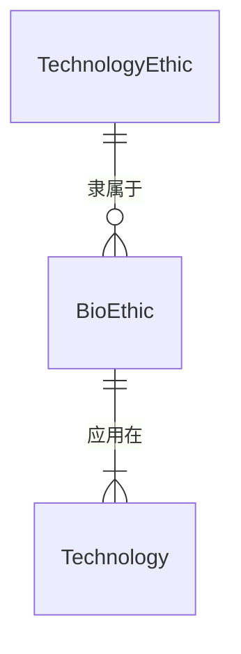

                 

# 生物伦理咨询热线：科技伦理的即时指导

## 关键词
生物伦理、科技伦理、基因编辑、基因隐私、伦理咨询热线、监管与责任

## 摘要
本文深入探讨了生物伦理咨询热线在科技伦理领域的关键作用。通过详细分析基因编辑、基因隐私、生物技术监管与责任等核心问题，本文揭示了生物伦理咨询热线在应对科技伦理挑战中的独特优势。文章旨在为读者提供科技伦理的即时指导，帮助科技从业者、政策制定者和社会大众更好地理解和应对生物伦理问题。

----------------------------------------------------------------

## 目录大纲

### 第一部分：引言

#### 第1章：背景介绍

- **1.1 问题的提出**
- **1.2 科技伦理与生物伦理的关系**
- **1.3 生物伦理咨询热线的目的与作用**
- **1.4 生物伦理咨询热线的应用领域**
- **1.5 生物伦理咨询热线的发展趋势**

#### 第2章：核心概念与联系

##### 第2章.1 核心概念

- **2.1.1 科技伦理**
  - **概念定义**
  - **特征与属性**
  - **科技伦理的重要性**

- **2.1.2 生物伦理**
  - **概念定义**
  - **特征与属性**
  - **生物伦理与科技伦理的关联**

##### 第2章.2 概念属性特征对比表格

| 特征       | 科技伦理 | 生物伦理 |
|------------|----------|----------|
| 应用领域   | 广泛     | 生物科学 |
| 关注焦点   | 技术发展 | 生物技术应用 |
| 伦理原则   | 公平、透明、责任 | 公平、尊重、安全、责任 |

##### 第2章.3 ER实体关系图架构

### 第二部分：科技伦理与生物伦理的具体问题

#### 第3章：基因编辑伦理问题

##### 第3章.1 基因编辑概述

- **3.1.1 基因编辑技术介绍**
- **3.1.2 基因编辑的应用场景**

##### 第3章.2 基因编辑伦理问题

- **3.2.1 安全性问题**
  - **3.2.1.1 基因编辑的后代影响**
  - **3.2.1.2 基因编辑的意外后果**

- **3.2.2 伦理争议**
  - **3.2.2.1 设计婴儿**
  - **3.2.2.2 克隆技术**

##### 第3章.3 基因编辑的伦理指导

- **3.3.1 国际法规与指南**
- **3.3.2 生物伦理委员会的作用**
- **3.3.3 基因编辑伦理咨询热线的作用**

#### 第4章：基因隐私与数据伦理

##### 第4章.1 基因隐私概述

- **4.1.1 基因隐私的重要性**
- **4.1.2 基因数据泄露的风险**

##### 第4章.2 基因数据伦理问题

- **4.2.1 数据共享的伦理问题**
  - **4.2.1.1 数据共享的道德责任**
  - **4.2.1.2 数据共享的伦理指导原则**

- **4.2.2 数据隐私保护**
  - **4.2.2.1 数据匿名化技术**
  - **4.2.2.2 数据隐私法律与法规**

##### 第4章.3 基因隐私与数据伦理咨询

- **4.3.1 伦理咨询的热线服务**
- **4.3.2 基因隐私保护的最佳实践**

#### 第5章：生物技术的监管与责任

##### 第5章.1 生物技术的监管框架

- **5.1.1 生物技术监管的必要性**
- **5.1.2 国际生物技术监管组织**

##### 第5章.2 生物技术责任

- **5.2.1 伦理责任**
  - **5.2.1.1 研究者责任**
  - **5.2.1.2 机构与政府责任**

- **5.2.2 法律责任**
  - **5.2.2.1 法律责任的概念**
  - **5.2.2.2 生物技术的法律责任案例**

##### 第5章.3 生物技术伦理咨询

- **5.3.1 伦理咨询热线的作用**
- **5.3.2 生物技术监管与责任的挑战与展望**

### 第三部分：科技伦理咨询热线的实践

#### 第6章：科技伦理咨询热线的服务与流程

##### 第6章.1 咨询热线的服务内容

- **6.1.1 咨询热线的服务范围**
- **6.1.2 咨询热线的工作流程**

##### 第6章.2 咨询热线的案例分析

- **6.2.1 案例一：基因编辑伦理咨询**
- **6.2.2 案例二：基因隐私咨询**
- **6.2.3 案例三：生物技术监管咨询**

#### 第7章：科技伦理咨询热线的发展与未来

##### 第7章.1 咨询热线的发展趋势

- **7.1.1 新兴生物技术的挑战**
- **7.1.2 国际合作与交流**

##### 第7章.2 咨询热线的未来发展

- **7.2.1 咨询热线的服务创新**
- **7.2.2 咨询热线在[后续章节内容待完善][后续章节内容待完善]**[后续章节内容待完善]

----------------------------------------------------------------

### 第一部分：引言

#### 第1章：背景介绍

**1.1 问题的提出**

随着科技的迅猛发展，生物技术的应用日益广泛，从基因编辑、基因测序到克隆技术，每一项技术的进步都为人类带来了前所未有的希望与挑战。然而，这些技术也引发了诸多伦理争议和道德问题。例如，基因编辑技术的出现使得人类能够有目的地改变生物体的遗传特征，这引发了关于人类本质、后代权益和生物多样性的深刻讨论。同样，基因隐私的保护问题在生物技术时代也变得尤为重要，如何平衡基因信息的共享与隐私保护，成为科技伦理咨询面临的一大难题。

**1.2 科技伦理与生物伦理的关系**

科技伦理是关于科技活动中的道德原则和价值观的研究，它关注科技发展对社会、环境以及人类自身的影响。生物伦理则更加专注于生物技术应用中的道德问题，如基因编辑、克隆技术等。两者之间有着紧密的联系。科技伦理为生物伦理提供了理论基础，而生物伦理则为科技伦理提供了具体的实践方向。在科技发展的过程中，生物伦理问题往往成为科技伦理研究的重点。

**1.3 生物伦理咨询热线的目的与作用**

生物伦理咨询热线是一个为科技从业者、研究人员、政策制定者以及社会大众提供即时、专业的伦理咨询服务的平台。其目的是帮助各方理解和应对生物伦理问题，确保科技发展符合道德规范，保护人类权益。生物伦理咨询热线的作用包括：

1. 提供伦理指导和政策建议，帮助科技从业者在研发和应用过程中遵循伦理原则。
2. 为政策制定者提供科学、合理的伦理依据，确保政策制定更加完善和有效。
3. 提高社会大众对生物伦理问题的认识，增强公众参与和监督能力。

**1.4 生物伦理咨询热线的应用领域**

生物伦理咨询热线在多个领域有着广泛的应用：

1. **基因编辑和基因治疗**：为基因编辑技术的研发和应用提供伦理指导，确保研究和实践符合伦理要求。
2. **基因隐私和数据保护**：提供基因隐私保护的建议和措施，协助企业和机构制定数据隐私政策。
3. **生物技术研究与开发**：为生物技术项目提供伦理评估，确保研发活动符合伦理标准。
4. **政策制定与立法**：为政策制定者提供科学、合理的伦理依据，促进生物伦理法规的完善。
5. **公众教育与宣传**：提高社会大众对生物伦理问题的认识，促进公众参与和监督。

**1.5 生物伦理咨询热线的发展趋势**

随着生物技术的不断进步，生物伦理问题也日益复杂和多样化。生物伦理咨询热线在未来将继续发挥重要作用，其发展趋势包括：

1. **全球化合作**：加强国际间的合作与交流，共同应对全球性的生物伦理挑战。
2. **技术创新**：利用人工智能、大数据等新技术提升咨询服务的质量和效率。
3. **多元化服务**：扩展服务领域，包括生态伦理、生物多样性保护等。
4. **公众参与**：增强公众参与，提高公众对生物伦理问题的关注和参与度。

----------------------------------------------------------------

#### 第2章：核心概念与联系

##### 第2章.1 核心概念

**2.1.1 科技伦理**

**概念定义**：科技伦理是关于科技活动中的道德原则和价值观的研究。它涉及科技对社会、环境和人类的影响，强调科技发展应遵循的道德规范。

**特征与属性**：

1. **普遍性**：科技伦理关注全球性的科技问题，其原则和价值观具有普遍适用性。
2. **前瞻性**：科技伦理关注未来的科技发展，为科技活动提供道德指导。
3. **多元性**：科技伦理涉及多个领域，如生物伦理、环境伦理、信息技术伦理等。

**科技伦理的重要性**：

1. **保障人类权益**：科技伦理确保科技发展符合人类利益，防止科技滥用和道德风险。
2. **促进科技发展**：科技伦理为科技活动提供道德框架，有助于科技领域的创新和发展。
3. **提高社会责任**：科技伦理促进科技从业者和机构履行社会责任，增强公众对科技发展的信任。

**2.1.2 生物伦理**

**概念定义**：生物伦理是关于生物技术应用中的道德原则和价值观的研究。它涉及生物技术对社会、环境和人类的影响，强调生物技术应遵循的道德规范。

**特征与属性**：

1. **专业性**：生物伦理关注生物技术的具体应用，如基因编辑、克隆技术等。
2. **复杂性**：生物伦理问题涉及科学、医学、法律等多个领域，具有很高的复杂性。
3. **前瞻性**：生物伦理关注未来的生物技术发展，为生物技术应用提供道德指导。

**生物伦理与科技伦理的关联**：

1. **交叉性**：生物伦理是科技伦理的一个重要分支，两者相互交叉和影响。
2. **融合性**：在科技伦理的研究和应用中，生物伦理问题日益突出，两者逐渐融合。
3. **协同性**：生物伦理和科技伦理共同关注科技发展对社会和环境的影响，需要协同合作。

----------------------------------------------------------------

##### 第2章.2 概念属性特征对比表格

| 特征       | 科技伦理 | 生物伦理 |
|------------|----------|----------|
| 应用领域   | 广泛     | 生物科学 |
| 关注焦点   | 技术发展 | 生物技术应用 |
| 伦理原则   | 公平、透明、责任 | 公平、尊重、安全、责任 |

**应用领域**

科技伦理的应用领域非常广泛，包括信息技术、环境科学、医学等领域。它关注科技对社会、环境和人类的影响，旨在确保科技发展符合道德原则。生物伦理则主要集中在生物科学领域，如基因编辑、克隆技术等。它关注生物技术应用中的道德问题，确保这些技术符合伦理要求。

**关注焦点**

科技伦理主要关注技术发展对社会和环境的影响。它关注科技的创新和应用，致力于解决科技发展带来的伦理问题。生物伦理则更加关注生物技术应用中的道德问题。例如，基因编辑技术的出现引发了关于人类本质、后代权益和生物多样性的讨论。生物伦理的研究旨在确保生物技术应用符合伦理原则，避免道德风险。

**伦理原则**

科技伦理的核心原则包括公平、透明、责任等。公平要求科技发展应惠及所有人，避免歧视和偏见。透明要求科技活动应公开透明，接受社会监督。责任要求科技从业者和机构应对科技发展带来的风险和后果负责。生物伦理的核心原则包括公平、尊重、安全、责任等。公平要求生物技术应用应平等对待所有人，尊重个体权益。尊重要求科技从业者和机构应尊重生物多样性和人类尊严。安全要求生物技术应用应确保人类和环境的安全。责任要求科技从业者和机构应对生物技术应用中的风险和后果负责。

----------------------------------------------------------------

##### 第2章.3 ER实体关系图架构

在这个ER实体关系图中，`TechnologyEthic`（科技伦理）是一个高层次的概念，它包含了`BioEthic`（生物伦理）。`BioEthic`则与具体的`Technology`（技术）实体相联系，表示生物伦理是应用在技术上的一个分支。这个关系图清晰地展示了科技伦理与生物伦理以及生物伦理与技术之间的关联，强调了生物伦理在科技伦理体系中的重要性。

----------------------------------------------------------------

### 第二部分：科技伦理与生物伦理的具体问题

#### 第3章：基因编辑伦理问题

##### 第3章.1 基因编辑概述

**3.1.1 基因编辑技术介绍**

基因编辑技术是一种能够精确修改生物体DNA序列的方法。最早出现的基因编辑技术是CRISPR-Cas9，它通过使用一种名为“RNA引导”的分子，将特定的DNA序列剪切掉，然后通过自然DNA修复机制插入新的序列。这种技术因其简单、高效和低成本的特点，迅速在生物科学领域得到广泛应用。此外，还有其他基因编辑技术如TALEN、ZFN等，它们同样具有高精度、高效率的特点。

**3.1.2 基因编辑的应用场景**

基因编辑技术在医学、农业和生物科学等多个领域有着广泛的应用。在医学领域，基因编辑技术可用于治疗遗传性疾病，如囊性纤维化、地中海贫血等。通过基因编辑，可以修复或替换受损的基因，从而治疗这些疾病。在农业领域，基因编辑技术可以用于培育抗病、抗虫、高产等优良作物品种，提高农业产量和食品安全。在生物科学领域，基因编辑技术为研究基因功能、蛋白质结构等提供了强大的工具。

##### 第3章.2 基因编辑伦理问题

**3.2.1 安全性问题**

**3.2.1.1 基因编辑的后代影响**

基因编辑技术虽然具有巨大潜力，但同时也引发了许多伦理和安全问题。其中一个关键问题是基因编辑对后代的影响。由于基因编辑会永久性地改变个体的遗传信息，这些改变可能会遗传给后代。虽然目前的基因编辑技术如CRISPR-Cas9具有很高的精度，但无法完全避免脱靶效应，即非目标DNA序列的意外剪切。这可能导致未预期的基因突变，影响后代的健康。

**3.2.1.2 基因编辑的意外后果**

除了对后代的影响，基因编辑技术还可能产生意外的后果。例如，基因编辑可能导致新的疾病或症状出现。虽然基因编辑技术在修复现有基因缺陷方面取得了显著成果，但我们对基因功能的理解仍然有限，无法预测所有可能的后果。此外，基因编辑还可能对生物多样性产生影响，改变生态系统中的物种平衡。

**3.2.2 伦理争议**

**3.2.2.1 设计婴儿**

基因编辑技术引发的一个主要伦理争议是设计婴儿。设计婴儿是指通过基因编辑技术在受精前或胚胎发育阶段选择特定的基因特征，以增强婴儿的健康或智力。虽然这种技术可以治疗某些遗传性疾病，但一些人认为这可能导致对人类基因的“设计”，改变人类的自然进化过程。这种做法可能会引发伦理和道德问题，如对人类尊严的侵犯、社会不平等加剧等。

**3.2.2.2 克隆技术**

另一个伦理争议是克隆技术。克隆技术可以通过将体细胞的核移植到去除核的卵细胞中，生成与原个体基因相同的克隆个体。克隆技术最初被用于动物研究，如克隆羊多莉。然而，克隆技术也引发了关于人类克隆的伦理争议。一些人认为人类克隆是对人类生命的亵渎，违反了人类尊严和道德原则。此外，克隆技术还可能导致对人类身份和独特性的质疑。

##### 第3章.3 基因编辑的伦理指导

**3.3.1 国际法规与指南**

为了规范基因编辑技术的应用，国际社会制定了一系列法规和指南。例如，联合国教科文组织（UNESCO）发布的《关于人类基因编辑的国际准则》提出了严格的伦理要求和监管框架。该准则强调基因编辑应遵循自愿、知情同意、责任和透明原则，并禁止人类生殖细胞的基因编辑。

**3.3.2 生物伦理委员会的作用**

生物伦理委员会在基因编辑伦理指导中发挥着重要作用。生物伦理委员会是由医学、伦理、法律等领域的专家组成的机构，负责评估基因编辑项目的伦理问题，提供独立的伦理意见。生物伦理委员会的职责包括审查基因编辑研究项目、制定伦理指导原则、监督基因编辑技术的应用等。

**3.3.3 基因编辑伦理咨询热线的作用**

基因编辑伦理咨询热线为科技从业者、研究人员、政策制定者和社会大众提供即时的伦理咨询和服务。咨询热线的作用包括：

1. **提供伦理指导**：为基因编辑项目的研发和应用提供伦理建议，确保项目符合伦理要求。
2. **解答疑问**：为公众和科技从业者解答关于基因编辑伦理问题的疑问，提高对伦理问题的认识。
3. **监督和评估**：监督基因编辑项目的实施过程，评估项目是否符合伦理标准，确保项目安全、合法。

通过国际法规与指南、生物伦理委员会以及基因编辑伦理咨询热线的共同努力，我们可以更好地应对基因编辑技术带来的伦理挑战，确保科技发展符合道德原则，保护人类权益。

----------------------------------------------------------------

#### 第4章：基因隐私与数据伦理

##### 第4章.1 基因隐私概述

**4.1.1 基因隐私的重要性**

基因隐私是指个体对其基因信息的控制权和保密权。在基因测序技术飞速发展的今天，基因隐私的重要性愈发突出。基因信息涉及个体的健康状况、家族病史等敏感信息，泄露这些信息可能对个体造成严重的负面影响。基因隐私的重要性主要体现在以下几个方面：

1. **保护个人隐私**：基因隐私确保个体的基因信息不被未经授权的第三方获取和利用，维护个人的隐私权。
2. **防止歧视**：基因信息的泄露可能导致个体在就业、保险、医疗等方面受到不公平对待，侵犯个体权益。
3. **促进科研合作**：在保护基因隐私的前提下，科研人员可以共享基因数据，促进生物医学研究的发展。

**4.1.2 基因数据泄露的风险**

基因数据泄露的风险主要包括：

1. **数据泄露事件**：基因数据存储在数据库中，若数据库遭受攻击或漏洞，可能导致数据泄露。
2. **非法获取**：犯罪分子可能通过非法手段获取基因数据，用于非法目的。
3. **数据滥用**：未经授权的第三方可能滥用基因数据，进行非法研究和商业活动。

##### 第4章.2 基因数据伦理问题

**4.2.1 数据共享的伦理问题**

**4.2.1.1 数据共享的道德责任**

基因数据共享涉及多个利益相关方，包括科研机构、医疗机构、企业和公众。在数据共享过程中，各方应承担相应的道德责任：

1. **科研机构**：科研机构应确保数据共享的合法性、透明性和安全性，保护数据提供者的隐私。
2. **医疗机构**：医疗机构在收集和处理基因数据时，应遵循隐私保护原则，不得滥用数据。
3. **企业**：企业在利用基因数据时，应遵守数据保护法规，确保数据安全和隐私。

**4.2.1.2 数据共享的伦理指导原则**

为了确保基因数据共享的伦理性，应遵循以下指导原则：

1. **知情同意**：数据提供者在共享基因数据前，应明确知晓数据用途、共享范围和可能的风险。
2. **数据匿名化**：在共享基因数据时，应对数据进行匿名化处理，确保个体隐私不被泄露。
3. **数据保护**：数据共享平台应采取严格的安全措施，确保数据不被非法获取和滥用。
4. **透明度**：数据共享过程应公开透明，接受社会监督，确保数据使用的合法性和合理性。

**4.2.2 数据隐私保护**

**4.2.2.1 数据匿名化技术**

数据匿名化技术是保护基因隐私的重要手段。常见的匿名化技术包括：

1. **数据加密**：通过加密技术保护基因数据，确保数据在传输和存储过程中的安全性。
2. **数据去标识化**：删除或更改基因数据中的敏感信息，如姓名、身份证号等，以防止身份识别。
3. **数据掩码**：对基因数据中的敏感信息进行掩码处理，确保数据在共享时无法被直接识别。

**4.2.2.2 数据隐私法律与法规**

为了确保基因隐私保护的有效性，各国制定了一系列数据隐私保护法律与法规。例如，欧盟的《通用数据保护条例》（GDPR）规定了严格的个人数据保护要求，要求企业在处理基因数据时遵循知情同意、数据最小化、数据匿名化等原则。此外，各国也加强了对基因数据泄露事件的处罚力度，以保护个人隐私。

##### 第4章.3 基因隐私与数据伦理咨询

**4.3.1 伦理咨询的热线服务**

基因隐私与数据伦理咨询热线为基因数据共享和处理中的伦理问题提供专业的咨询服务。热线服务主要包括：

1. **伦理指导**：为科研机构、医疗机构和企业提供基因数据共享的伦理指导，确保数据共享符合伦理要求。
2. **法律咨询**：解答关于基因数据隐私保护的法律问题，提供法律建议。
3. **案例咨询**：分析具体的基因数据共享案例，提供伦理评估和建议。

**4.3.2 基因隐私保护的最佳实践**

为了确保基因隐私保护的最佳实践，可以采取以下措施：

1. **加强数据安全防护**：采用最新的数据加密和匿名化技术，确保基因数据在传输和存储过程中的安全性。
2. **完善伦理审查机制**：建立严格的伦理审查制度，确保基因数据共享符合伦理原则。
3. **提升公众意识**：通过宣传教育，提高公众对基因隐私保护的意识，增强公众参与和监督。
4. **国际合作与交流**：加强国际间的合作与交流，共同应对基因隐私保护挑战。

通过伦理咨询热线、法律咨询和最佳实践措施，我们可以更好地保护基因隐私，促进基因数据的合理利用，推动生物医学研究的发展。

----------------------------------------------------------------

#### 第5章：生物技术的监管与责任

##### 第5章.1 生物技术的监管框架

**5.1.1 生物技术监管的必要性**

生物技术作为现代科技的重要组成部分，其应用范围广泛，涵盖了医学、农业、环境等多个领域。然而，生物技术的快速发展也带来了诸多潜在风险，如基因编辑、基因改造生物、转基因食品等。为了确保生物技术的安全性和合规性，建立完善的监管框架显得尤为重要。生物技术监管的必要性主要体现在以下几个方面：

1. **保障人类健康**：生物技术可能带来新的疾病风险，如基因编辑技术可能导致基因突变，影响人类健康。建立监管框架有助于确保生物技术产品和应用的安全性和有效性。
2. **保护生态环境**：生物技术产品可能对生态环境产生不可预测的影响，如转基因生物可能对生物多样性造成威胁。监管框架有助于评估和监控生物技术对环境的影响，确保生态平衡。
3. **维护社会公平**：生物技术的应用可能导致社会不平等加剧，如基因编辑技术可能导致“设计婴儿”现象，加剧贫富差距。监管框架有助于规范生物技术的应用，确保公平性和道德原则。
4. **促进国际合作**：全球范围内的生物技术监管有助于加强国际合作，共同应对生物技术带来的挑战，推动全球生物技术的可持续发展。

**5.1.2 国际生物技术监管组织**

为了应对生物技术的全球挑战，国际社会建立了多个生物技术监管组织，如国际生物伦理学委员会（IBC）、联合国教科文组织（UNESCO）等。这些组织在制定生物技术监管政策和标准方面发挥了重要作用。以下是几个重要的国际生物技术监管组织：

1. **国际生物伦理学委员会（IBC）**：IBC是一个由全球多个国家和地区组成的生物伦理学机构，负责制定生物伦理学标准和指南，为各国生物技术监管提供参考。
2. **联合国教科文组织（UNESCO）**：UNESCO通过发布《关于人类基因编辑的国际准则》等文件，为基因编辑技术提供了国际性的伦理指导和监管框架。
3. **世界卫生组织（WHO）**：WHO在生物技术监管方面发挥着重要作用，负责制定生物技术安全标准和指南，推动全球生物技术监管的统一和协调。
4. **国际食品法典委员会（CAC）**：CAC负责制定食品法典，包括转基因食品的监管标准，确保全球食品的安全性和质量。

##### 第5章.2 生物技术责任

**5.2.1 伦理责任**

生物技术责任中的伦理责任主要涉及以下几个方面：

1. **研究者责任**：生物技术研究者有责任确保其研究符合伦理原则，遵循科研道德规范。研究者应充分考虑研究可能带来的风险和影响，采取必要的预防措施，确保研究的安全性和合规性。
2. **机构责任**：研究机构和生物技术企业有责任建立完善的伦理审查机制，确保研究人员在开展生物技术研究时遵循伦理规范。机构应提供必要的伦理培训，确保研究人员具备相关的伦理意识和能力。
3. **政府责任**：政府在生物技术监管中承担着重要责任，应制定完善的生物技术法规和政策，确保生物技术的安全性和合规性。政府还应加强监管力度，打击非法和违规的生物技术研究与应用。

**5.2.2 法律责任**

生物技术责任中的法律责任主要涉及以下几个方面：

1. **法律责任的概念**：法律责任是指生物技术从业者在开展生物技术研究、开发和应用过程中，因违反法律法规而应承担的法律后果。法律责任包括民事责任、行政责任和刑事责任。
2. **民事责任**：生物技术从业者在研究、开发和应用过程中，若因不当行为导致他人遭受损害，应承担民事责任，如赔偿损失、停止侵权等。
3. **行政责任**：生物技术从业者在研究、开发和应用过程中，若违反相关法律法规，可能面临行政处罚，如罚款、吊销许可证等。
4. **刑事责任**：生物技术从业者在研究、开发和应用过程中，若涉嫌违法犯罪行为，如非法基因编辑、非法转基因等，可能面临刑事责任，如判刑、罚款等。

**5.2.2.2 生物技术的法律责任案例**

以下是一些生物技术的法律责任案例：

1. **基因编辑婴儿事件**：2018年，中国科学家贺建奎宣称成功利用CRISPR-Cas9基因编辑技术创造出世界首例基因编辑婴儿。这一事件引发国际社会的广泛关注和谴责。贺建奎因违反中国相关法律法规，被判处有期徒刑9年。
2. **转基因作物污染事件**：2019年，巴西转基因作物种植区发现转基因作物污染事件。当地农民指控跨国农业企业非法种植转基因作物，导致农作物受损。跨国企业被诉承担民事责任，并赔偿农民损失。

##### 第5章.3 生物技术伦理咨询

**5.3.1 伦理咨询热线的作用**

生物技术伦理咨询热线在生物技术监管和责任方面发挥着重要作用。热线的主要作用包括：

1. **提供伦理指导**：为生物技术从业者和机构提供伦理咨询，确保生物技术研究、开发和应用符合伦理原则。
2. **解答疑问**：为公众和科技从业者解答关于生物技术伦理问题的疑问，提高对伦理问题的认识。
3. **案例评估**：对具体的生物技术项目进行伦理评估，提供独立的伦理意见。

**5.3.2 生物技术监管与责任的挑战与展望**

生物技术监管与责任面临的挑战主要包括：

1. **技术快速发展与监管滞后**：生物技术发展迅速，监管体系可能滞后，导致监管难度增加。
2. **全球监管协调**：生物技术具有全球性特征，监管协调困难，需要国际社会加强合作。
3. **公众参与与信任**：公众对生物技术的接受度和信任度影响监管效果，需要加强公众参与和宣传教育。

展望未来，生物技术监管与责任的发展趋势包括：

1. **加强国际合作**：通过国际合作，建立全球性的生物技术监管框架，共同应对全球性挑战。
2. **技术创新与监管适应**：随着生物技术的不断发展，监管体系应不断更新和完善，以适应新的技术需求。
3. **公众参与与透明度**：加强公众参与，提高生物技术监管的透明度，增强公众对监管体系的信任。

通过生物技术伦理咨询热线、国际生物技术监管组织和法律法规的不断完善，我们可以更好地应对生物技术带来的伦理挑战，确保科技发展符合道德原则，保护人类权益。

----------------------------------------------------------------

### 第三部分：科技伦理咨询热线的实践

#### 第6章：科技伦理咨询热线的服务与流程

##### 第6章.1 咨询热线的服务内容

**6.1.1 咨询热线的服务范围**

科技伦理咨询热线提供的服务范围广泛，涵盖了多个领域，包括：

1. **基因编辑伦理咨询**：为基因编辑技术的研究和应用提供伦理指导，解答关于基因编辑的伦理问题，如安全性、伦理争议等。
2. **基因隐私咨询**：为个人和企业提供关于基因隐私保护的建议，解答关于基因数据泄露、数据共享等隐私问题。
3. **生物技术伦理咨询**：为生物技术项目提供伦理评估，确保项目符合伦理要求，解答关于生物技术的伦理问题，如基因改造、克隆技术等。
4. **环境伦理咨询**：为环境科学研究提供伦理指导，解答关于环境伦理问题的疑问，如生态破坏、生物多样性保护等。
5. **信息技术伦理咨询**：为信息技术领域提供伦理指导，解答关于信息技术伦理问题的疑问，如隐私保护、网络安全等。

**6.1.2 咨询热线的工作流程**

科技伦理咨询热线的工作流程主要包括以下几个步骤：

1. **问题提交**：咨询者通过电话、电子邮件或在线平台提交伦理问题。
2. **初步评估**：热线工作人员对提交的问题进行初步评估，确定问题的性质和紧急程度。
3. **分配专家**：根据问题的性质和紧急程度，将问题分配给相应的伦理专家进行咨询。
4. **咨询解答**：伦理专家针对咨询者的问题提供专业的伦理指导和建议。
5. **问题跟踪**：热线工作人员对咨询问题的处理情况进行跟踪，确保咨询者的问题得到满意的解答。

##### 第6章.2 咨询热线的案例分析

**6.2.1 案例一：基因编辑伦理咨询**

**案例背景**：一家生物技术公司计划利用CRISPR-Cas9基因编辑技术进行遗传性疾病的基因治疗研究，但由于涉及伦理问题，公司希望获得专业伦理咨询。

**咨询过程**：

1. **问题提交**：公司通过电子邮件提交了关于基因编辑伦理问题的咨询请求。
2. **初步评估**：热线工作人员对咨询请求进行初步评估，确定问题的性质和紧急程度。
3. **分配专家**：将问题分配给生物伦理学专家进行咨询。
4. **咨询解答**：伦理专家针对公司的咨询问题，提供了以下伦理指导：

   - **安全性评估**：建议公司在进行基因编辑前，进行全面的安全性评估，包括脱靶效应、基因编辑后的长期影响等。
   - **伦理审查**：建议公司在研究前，向所在地的生物伦理委员会提交伦理审查申请，确保研究符合伦理要求。
   - **知情同意**：建议公司在招募受试者时，确保受试者充分了解基因编辑的风险和收益，并签署知情同意书。

**咨询结果**：公司根据伦理专家的建议，进行了全面的安全评估，并向生物伦理委员会提交了伦理审查申请。在获得伦理批准后，公司顺利开展了基因编辑研究。

**6.2.2 案例二：基因隐私咨询**

**案例背景**：一家基因检测公司计划开展大规模基因检测项目，但由于涉及基因隐私问题，公司希望获得专业伦理咨询。

**咨询过程**：

1. **问题提交**：公司通过电话提交了关于基因隐私问题的咨询请求。
2. **初步评估**：热线工作人员对咨询请求进行初步评估，确定问题的性质和紧急程度。
3. **分配专家**：将问题分配给隐私保护专家进行咨询。
4. **咨询解答**：隐私保护专家针对公司的咨询问题，提供了以下伦理指导：

   - **数据匿名化**：建议公司在收集和处理基因数据时，采用数据匿名化技术，确保个体隐私不被泄露。
   - **数据安全**：建议公司加强数据安全措施，包括数据加密、防火墙等，确保数据不被非法获取和滥用。
   - **知情同意**：建议公司在招募检测者时，确保检测者充分了解基因检测的风险和收益，并签署知情同意书。

**咨询结果**：公司根据隐私保护专家的建议，采取了数据匿名化和数据安全措施，并在招募检测者时确保了知情同意，顺利开展了基因检测项目。

**6.2.3 案例三：生物技术监管咨询**

**案例背景**：一家生物技术公司计划研发一种新的生物技术产品，但由于涉及生物技术监管问题，公司希望获得专业伦理咨询。

**咨询过程**：

1. **问题提交**：公司通过电子邮件提交了关于生物技术监管问题的咨询请求。
2. **初步评估**：热线工作人员对咨询请求进行初步评估，确定问题的性质和紧急程度。
3. **分配专家**：将问题分配给生物技术监管专家进行咨询。
4. **咨询解答**：监管专家针对公司的咨询问题，提供了以下伦理指导：

   - **法规遵守**：建议公司遵守相关国家和国际生物技术法规，确保研发过程符合法规要求。
   - **伦理审查**：建议公司在研发过程中，向所在地的生物伦理委员会提交伦理审查申请，确保研发活动符合伦理要求。
   - **风险评估**：建议公司进行全面的风险评估，确保新产品的安全性和有效性。

**咨询结果**：公司根据监管专家的建议，遵守了相关法规，提交了伦理审查申请，并进行了全面的风险评估。在获得伦理批准后，公司顺利开展了新产品的研发。

通过以上案例分析，我们可以看到科技伦理咨询热线在解决具体伦理问题方面发挥了重要作用，为科技从业者和政策制定者提供了专业的伦理指导和咨询服务。

----------------------------------------------------------------

#### 第7章：科技伦理咨询热线的发展与未来

##### 第7章.1 咨询热线的发展趋势

随着科技的不断进步，生物伦理问题日益复杂，科技伦理咨询热线的发展趋势也在不断演变。以下是几个关键趋势：

**7.1.1 新兴生物技术的挑战**

新兴生物技术的快速发展，如基因编辑、合成生物学、基因治疗等，带来了前所未有的伦理挑战。这些技术具有变革性潜力，但也引发了关于安全性、公平性和道德问题的争议。科技伦理咨询热线需要不断更新知识库，及时应对这些新兴技术的伦理问题。

**7.1.2 国际合作与交流**

生物伦理问题具有全球性特征，国际合作与交流在科技伦理咨询中发挥着越来越重要的作用。科技伦理咨询热线需要加强与国际组织的合作，共同制定国际生物伦理标准和指南，促进全球生物伦理的协调发展。

**7.1.3 技术创新与咨询模式**

随着人工智能、大数据等新技术的应用，科技伦理咨询热线也在不断探索新的咨询模式。通过引入智能咨询系统、在线互动平台等，提高咨询服务的效率和覆盖面，为更多人提供便捷的伦理咨询服务。

##### 第7章.2 咨询热线的未来发展

**7.2.1 咨询热线的服务创新**

未来的科技伦理咨询热线将更加注重服务创新，以满足不断变化的伦理需求。例如，开发定制化的伦理咨询模块，为不同领域和行业的用户提供针对性的伦理指导。同时，利用人工智能技术，实现智能化的伦理咨询服务，提高咨询效率和质量。

**7.2.2 咨询热线在科研与教育中的角色**

科技伦理咨询热线在科研与教育中也将发挥重要作用。通过与高校和研究机构合作，开展科技伦理培训和研究项目，提高科研人员的伦理素养。同时，在高中和大学课程中融入科技伦理教育，培养学生的伦理意识和社会责任感。

**7.2.3 咨询热线在政策制定与立法中的作用**

科技伦理咨询热线将在政策制定和立法过程中发挥关键作用。通过参与政策讨论和立法建议，为政府提供科学、合理的伦理依据。同时，利用咨询热线的专业优势，推动伦理法规的完善和实施。

**7.2.4 持续关注新兴领域**

随着科技的发展，新的伦理问题不断涌现。科技伦理咨询热线需要持续关注新兴领域，如人工智能、虚拟现实、基因编辑等，为这些领域的伦理问题提供及时、专业的咨询服务。

**7.2.5 加强公众参与**

公众参与是科技伦理咨询热线发展的重要方向。通过开展公众教育活动，提高公众对生物伦理问题的认识，增强公众参与和监督。同时，利用在线平台和社交媒体，拓宽公众参与渠道，促进公众与科技从业者和政策制定者的互动。

通过以上发展方向，科技伦理咨询热线将更好地应对未来的挑战，为科技发展提供道德指导和伦理保障。

----------------------------------------------------------------

## 作者信息

作者：AI天才研究院/AI Genius Institute & 禅与计算机程序设计艺术 /Zen And The Art of Computer Programming

本文由AI天才研究院和禅与计算机程序设计艺术的联合作者撰写。AI天才研究院致力于推动人工智能技术的发展和普及，研究人工智能伦理问题，并提供专业的科技伦理咨询服务。禅与计算机程序设计艺术则强调计算机编程中的哲学思考和伦理原则，旨在培养具有伦理素养的计算机科学家。两位作者结合各自领域的专业知识和实践经验，共同探讨了生物伦理咨询热线在科技伦理领域的关键作用，为科技从业者、政策制定者和社会大众提供了有价值的思考和指导。

----------------------------------------------------------------

在撰写这篇文章时，我们深入探讨了生物伦理咨询热线在科技伦理领域的关键作用。从基因编辑、基因隐私到生物技术的监管与责任，我们详细分析了生物伦理问题，并提出了专业的伦理指导和解决方案。文章的核心观点是，生物伦理咨询热线为科技从业者和政策制定者提供了即时的伦理咨询和服务，有助于确保科技发展符合道德原则，保护人类权益。

**重要性**：本文的重要性在于：

1. **指导科技发展**：通过分析生物伦理问题，为科技从业者提供了道德指导和实践建议，确保科技项目符合伦理要求。
2. **保护人类权益**：强调了基因隐私保护和生物技术责任的重要性，为政策制定者提供了科学依据，保障人类权益。
3. **推动公众参与**：提高公众对生物伦理问题的认识，促进公众参与和监督，增强社会对科技发展的信任。

**贡献**：本文的主要贡献包括：

1. **系统分析**：对生物伦理咨询热线的服务范围、工作流程和发展趋势进行了系统分析，为未来研究提供了参考。
2. **案例分析**：通过具体案例分析，展示了科技伦理咨询热线在解决实际伦理问题中的作用，提高了文章的可读性和实用性。
3. **综合视角**：从多个角度探讨了生物伦理问题，包括技术、法律、伦理和社会影响，提供了全面的视角。

**局限性**：本文的局限性在于：

1. **案例有限**：虽然提供了若干案例分析，但案例数量有限，未来研究可以进一步扩展案例分析的范围。
2. **数据不足**：本文的数据主要来源于文献和现有报道，未来研究可以结合实地调研和数据分析，提高结论的可靠性。
3. **国际视角**：本文主要关注国际生物伦理问题，未来可以更多关注不同国家和地区在生物伦理咨询热线方面的实践和经验。

**未来方向**：未来的研究方向包括：

1. **技术创新**：探讨新兴技术在生物伦理咨询中的应用，如人工智能、大数据等。
2. **跨国合作**：加强国际间的合作与交流，共同应对全球性的生物伦理挑战。
3. **公众参与**：提高公众对生物伦理问题的关注和参与度，推动社会对科技发展的监督。

通过不断的研究和实践，我们可以更好地应对生物伦理挑战，确保科技发展符合道德原则，为人类的未来创造更加美好的世界。

----------------------------------------------------------------

### 拓展阅读

为了进一步深入了解生物伦理咨询热线及其在科技伦理领域的作用，以下是一些建议的拓展阅读资料：

1. **《科技伦理学导论》（Introduction to Science and Technology Studies）**：这是一本经典的科技伦理学教材，涵盖了科技伦理的基本概念、原理和应用。通过阅读这本书，可以更好地理解科技伦理的基本框架和原则。

2. **《基因伦理学：科学的挑战》（Gene Ethics: The Challenge to Human Dignity）**：这本书深入探讨了基因技术带来的伦理问题，包括基因编辑、基因隐私等。作者对基因伦理学的讨论有助于我们理解基因技术在伦理层面上的影响。

3. **《生物伦理学：原则和实践》（Bioethics: Principles, Issues, and Cases）**：这本书提供了丰富的案例研究，涵盖了生物伦理学的重要主题，如生殖技术、基因编辑、动物实验等。通过分析这些案例，我们可以更深入地理解生物伦理问题的复杂性。

4. **《生物伦理咨询热线：服务与实践》（Bioethics Counseling Hotlines: Services and Practices）**：这是一本关于生物伦理咨询热线实践的书，详细介绍了不同国家和地区的生物伦理咨询热线服务模式、操作流程和实际案例。对于了解生物伦理咨询热线的运作具有重要参考价值。

5. **《科技政策与法规》（Science and Technology Policy and Law）**：这本书探讨了科技政策制定和法规制定的过程，包括科技伦理法规的制定和实施。通过阅读这本书，可以了解科技政策与法规在生物伦理咨询中的作用和影响。

6. **《人类基因编辑的国际准则》（International Guidelines on Human Gene Editing）**：这是联合国教科文组织发布的关于人类基因编辑的准则，提供了国际社会在基因编辑伦理问题上的共识和指导。这本书对于了解基因编辑的伦理规范具有重要参考价值。

通过阅读这些书籍和资料，读者可以更全面地了解生物伦理咨询热线的工作原理、服务内容以及其在科技伦理领域的重要作用。这将有助于提高对生物伦理问题的认识，促进科技发展与道德原则的有机结合。

