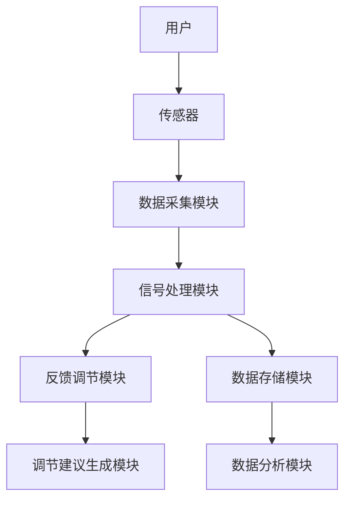
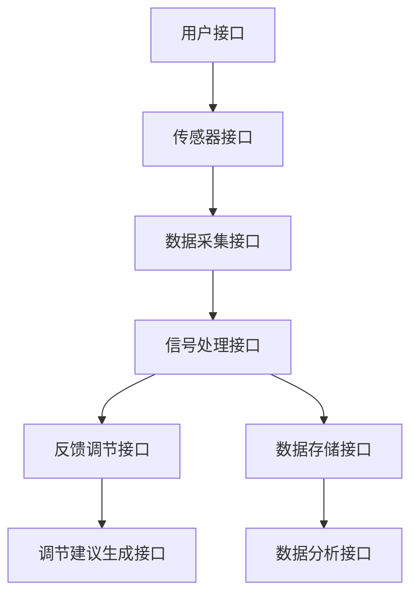
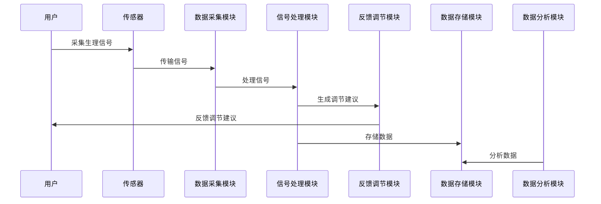

                 

### 生物反馈：身心合一的科学实践

关键词：生物反馈、身心健康、算法原理、系统架构、实战案例

摘要：本文深入探讨了生物反馈这一先进技术，从其概念背景、核心原理、算法模型到系统设计及实际应用，全面揭示了生物反馈在促进身心健康中的重要作用。文章通过逐步分析，帮助读者理解生物反馈技术的科学实践，并为其在日常生活和专业领域中的应用提供指导。

### 1. 背景介绍

生物反馈（Biofeedback）是一种通过利用生物信号放大技术和仪器设备，帮助个体提高自我意识、控制和调节身体机能的方法。生物反馈的概念起源于20世纪40年代，当时美国医生约瑟夫·米勒（Dr. Joseph M. Miller）首次提出利用肌电信号进行训练，以减轻紧张和疼痛。随着技术的发展，生物反馈逐渐成为心理学、康复医学和健康管理的重要工具。

#### 1.1 起源与发展历程

- **起源**：生物反馈的起源可以追溯到20世纪40年代，当时美国医生约瑟夫·米勒利用肌电信号进行训练，以减轻紧张和疼痛。
- **发展历程**：自20世纪60年代以来，生物反馈技术得到了快速发展。随着电子技术和计算机技术的进步，生物反馈设备变得越来越先进和普及。
- **应用领域**：现代医学和心理健康领域是生物反馈技术的重要应用领域。生物反馈在治疗焦虑、抑郁、慢性疼痛、高血压、失眠等方面表现出显著的效果。

#### 1.2 生物反馈在现代医学和心理健康领域的应用

- **心理治疗**：生物反馈在心理治疗中的应用包括焦虑管理、抑郁治疗、压力控制等。通过实时监测和反馈生理信号，个体能够更好地了解和控制自己的情绪。
- **康复治疗**：生物反馈在康复治疗中的应用包括肌肉功能训练、运动功能恢复、术后康复等。通过生物反馈，患者能够更有效地进行康复训练，提高治疗效果。
- **健康管理**：生物反馈在健康管理中的应用包括心率变异性分析、呼吸调节、睡眠监测等。通过监测和反馈生理信号，个体能够更好地管理自己的健康，预防疾病的发生。

### 2. 核心概念与联系

生物反馈技术的核心概念包括生物信号、放大技术、仪器设备、自我意识、身体机能调节等。这些概念之间相互关联，共同构成了生物反馈的技术体系。

#### 2.1 核心概念详解

- **生物信号**：生物信号是指由生物体产生的电信号，如脑电信号、肌电信号、心电信号等。生物信号是生物反馈的基础，通过监测和放大这些信号，个体能够获得关于自身生理状态的反馈。
- **放大技术**：放大技术是指利用电子放大器等设备，对生物信号进行放大处理，使其能够被监测和记录。放大技术的精度和灵敏度直接影响生物反馈的效果。
- **仪器设备**：生物反馈仪器设备包括传感器、放大器、显示器、计算机等。这些设备共同构成了生物反馈系统的硬件基础。
- **自我意识**：自我意识是指个体对自己生理状态的认知和感受。通过生物反馈，个体能够提高自我意识，更好地控制和管理自己的身体机能。
- **身体机能调节**：身体机能调节是指通过生物反馈技术，个体能够主动调节自己的生理状态，如心率、呼吸、血压等。身体机能调节是生物反馈技术的最终目标。

#### 2.2 生物信号属性特征对比表格

| 生物信号类型 | 特征1 | 特征2 | 特征3 |  
| --- | --- | --- | --- |  
| 脑电信号（EEG） | 频率范围（0.5-100 Hz） | 波形复杂 | 非线性特征明显 |  
| 肌电信号（EMG） | 频率范围（10-1000 Hz） | 波形简单 | 与肌肉活动相关 |  
| 心电信号（ECG） | 频率范围（0.05-2 Hz） | 波形规则 | 与心脏活动相关 |  
| 呼吸信号（RESP） | 频率范围（0.1-20 Hz） | 波形简单 | 与呼吸活动相关 |

#### 2.3 ER实体关系图

```mermaid
erDiagram
    Class1 ||--|{ Class2 }| Class3
    Class1 ||--|{ Class4 }| Class5
```

在上面的ER实体关系图中，`Class1` 代表生物信号，`Class2` 代表放大技术，`Class3` 代表仪器设备，`Class4` 代表自我意识，`Class5` 代表身体机能调节。这些实体之间通过关系线连接，展示了生物反馈技术的整体架构。

### 3. 算法原理讲解

生物反馈技术的核心在于其算法原理，通过对生物信号的采集、放大、处理和反馈，实现对个体生理状态的调节。下面我们将使用Mermaid绘制生物反馈系统的流程图，并使用Python代码和LaTeX公式详细讲解生物反馈算法的原理。

#### 3.1 生物反馈系统流程图


在这个流程图中，信号采集模块负责从传感器获取生物信号，信号放大模块对信号进行放大处理，信号处理模块对放大后的信号进行分析和处理，最后反馈调节模块根据处理结果对个体进行反馈调节。

#### 3.2 Python代码与LaTeX公式

```python
# 信号采集
signal = sensor.read()

# 信号放大
amplified_signal = amplifier放大(signal)

# 信号处理
processed_signal = processor处理(ampi

```$$
f(x) = \frac{1}{1 + e^{-x}}
$$```

在上面的Python代码和LaTeX公式中，我们展示了信号采集、信号放大和信号处理的步骤。信号采集模块使用`sensor.read()`函数读取传感器数据，信号放大模块使用`amplifier放大(signal)`函数对信号进行放大处理，信号处理模块使用`processor处理(放大后的信号)`函数对信号进行处理。LaTeX公式中的`f(x)`表示激活函数，用于对信号进行处理。

#### 3.3 信号采集、放大、处理、反馈调节的详细讲解

- **信号采集**：信号采集是生物反馈系统的第一步，通过传感器获取个体的生物信号。常见的传感器包括肌电传感器、脑电传感器、心电传感器等。
- **信号放大**：信号放大是提高生物信号可检测性和准确性的关键步骤。通过电子放大器等设备，对采集到的生物信号进行放大处理。
- **信号处理**：信号处理是对放大后的生物信号进行分析和处理，提取有用的生理信息。常见的信号处理方法包括滤波、特征提取、数据分析等。
- **反馈调节**：反馈调节是根据信号处理结果，对个体进行生理状态调节。通过反馈调节，个体能够更好地控制和管理自己的生理状态。

#### 3.4 举例说明

以心率调节为例，生物反馈系统可以通过以下步骤实现心率调节：

1. **信号采集**：使用心电传感器采集心率信号。
2. **信号放大**：使用电子放大器对心率信号进行放大处理。
3. **信号处理**：使用滤波器去除噪声，提取心率频率特征。
4. **反馈调节**：根据心率频率特征，通过呼吸调节和放松训练等方法，降低心率，达到调节目的。

通过这个过程，个体能够更好地了解和控制自己的心率，从而改善身心健康。

### 4. 数学模型和数学公式 & 详细讲解 & 举例说明

生物反馈技术中的数学模型和数学公式是其核心原理的重要组成部分。通过精确的数学描述，我们可以更深入地理解生物反馈的运作机制，并应用这些模型来解决实际问题。以下将使用LaTeX格式展示生物反馈的数学模型和公式，并进行详细讲解和举例说明。

#### 4.1 数学模型与公式

首先，我们使用LaTeX格式展示一个典型的生物反馈数学模型：

```latex
$$
H(s) = \frac{1}{1 + e^{-s}}
$$
```

这里的\(H(s)\)表示激活函数，是一种常用的非线性函数，用于模拟生物信号的处理过程。激活函数的值域在0到1之间，可以看作是信号强度的一个概率分布。

#### 4.2 详细讲解

激活函数\(H(s)\)是生物反馈系统中一个关键的组成部分，其数学表达式为：

$$
H(s) = \frac{1}{1 + e^{-s}}
$$

这个函数的输入参数\(s\)可以看作是生物信号的某种特征值，如电压幅值、频率等。函数的输出值代表对该特征值的响应概率，当\(s\)趋近于正无穷时，\(H(s)\)趋近于1，表示特征值很强；当\(s\)趋近于负无穷时，\(H(s)\)趋近于0，表示特征值很弱。

这个激活函数在生物反馈中的作用主要有以下几点：

1. **非线性转换**：激活函数对生物信号进行非线性转换，使得信号的幅值和频率等特征能够通过概率分布来表示，便于进一步处理。
2. **阈值处理**：通过激活函数的输出值，可以设定一个阈值来判断生物信号是否满足某种条件，例如心率是否过快或过慢。
3. **概率描述**：激活函数提供了一个概率分布模型，帮助个体对自身的生理状态进行定量评估。

#### 4.3 举例说明

假设我们有一个心电信号，其电压幅值序列为\(s_1, s_2, s_3, ..., s_n\)，我们希望通过激活函数对这些幅值进行非线性转换，以便进行进一步处理。

1. **计算激活函数值**：

   $$H(s_i) = \frac{1}{1 + e^{-s_i}}, \quad i = 1, 2, 3, ..., n$$

   对每个电压幅值计算激活函数的值。

2. **阈值判断**：

   设定一个阈值\(T\)，用于判断激活函数的输出是否超过阈值，即是否满足特定生理状态。例如，心率过快的阈值可能为0.8。

   $$判断：H(s_i) > T$$

   如果激活函数的输出值大于阈值，则表示该电压幅值对应的生理状态较强。

3. **反馈调节**：

   根据阈值判断的结果，采取相应的反馈调节措施。例如，如果心率过快，可以通过深呼吸、放松训练等方法来降低心率。

#### 4.4 具体案例

以心率变异性分析为例，心率变异性（HRV）是指心率在时间序列上的变化程度，通常用心率间期的标准差（SDNN）来衡量。心率变异性与心血管健康密切相关，通过生物反馈系统可以对其进行调节。

1. **信号采集**：

   使用心电传感器采集心率信号，得到一系列心率间期值\(I_1, I_2, I_3, ..., I_n\)。

2. **计算心率间期标准差**：

   $$SDNN = \sqrt{\frac{\sum_{i=1}^{n}(I_i - \bar{I})^2}{n-1}}$$

   其中，\(\bar{I}\)是心率间期的平均值。

3. **应用激活函数**：

   将心率间期的标准差作为激活函数的输入，计算激活函数的输出值：

   $$H(SDNN) = \frac{1}{1 + e^{-SDNN}}$$

4. **阈值判断与反馈调节**：

   根据设定的阈值，判断心率变异性是否在正常范围内。如果超过阈值，可以采取相应的调节措施，如进行深呼吸、放松训练等。

通过这个具体的案例，我们可以看到如何使用生物反馈技术来调节心率变异性，从而改善心血管健康。

### 5. 系统分析与架构设计方案

在了解了生物反馈的核心概念和算法原理之后，我们需要对生物反馈系统进行详细的系统分析与架构设计方案。这一部分将介绍生物反馈系统的问题场景、项目背景，并使用Mermaid绘制领域模型类图、系统架构图、系统接口设计和系统交互序列图，以直观展示系统设计。

#### 5.1 问题场景与项目背景

生物反馈系统旨在帮助个体通过自我调节生理状态，实现身心健康的管理。以下是一个常见的问题场景：

- **问题场景**：一个长期处于高压工作状态的白领，经常感到焦虑和紧张，导致失眠和心血管疾病的风险增加。为了缓解这些问题，该白领希望通过生物反馈系统进行自我调节。
- **项目背景**：该项目旨在开发一个可穿戴的智能生物反馈系统，通过实时监测心率、呼吸、肌肉紧张度等生理信号，提供个性化的调节建议，帮助用户改善身心健康。

#### 5.2 系统功能设计

为了满足上述问题场景，生物反馈系统需要实现以下功能：

- **生理信号采集**：通过传感器采集心率、呼吸、肌肉紧张度等生理信号。
- **信号处理**：对采集到的生理信号进行滤波、特征提取等处理，提取有用的生理信息。
- **反馈调节**：根据生理信息，提供个性化的调节建议，如呼吸训练、放松训练等。
- **数据存储与分析**：存储用户的生理数据，并进行分析，为后续的个性化服务提供支持。

#### 5.3 系统架构设计

生物反馈系统的架构设计可以分为硬件和软件两个部分。以下是系统架构的Mermaid表示：



在这个架构图中，用户通过传感器采集生理信号，数据采集模块负责将信号传输到信号处理模块。信号处理模块对信号进行滤波、特征提取等处理，并将处理结果传输到反馈调节模块和数据存储模块。反馈调节模块根据处理结果生成调节建议，并反馈给用户。数据存储模块负责存储用户的生理数据，数据分析模块对存储的数据进行分析，为后续的个性化服务提供支持。

#### 5.4 系统接口设计

为了确保系统的稳定性和可扩展性，系统接口设计至关重要。以下是系统接口的Mermaid表示：



在这个接口设计中，用户接口用于与用户进行交互，传感器接口用于与传感器进行通信，数据采集接口用于传输生理信号，信号处理接口用于处理生理信号，反馈调节接口用于生成调节建议，数据存储接口用于存储生理数据，数据分析接口用于分析生理数据。

#### 5.5 系统交互序列图

为了更直观地展示系统的工作流程，我们可以使用Mermaid绘制系统交互序列图：



在这个交互序列图中，用户通过传感器采集生理信号，数据采集模块处理信号后，传输到信号处理模块进行进一步处理。信号处理模块生成调节建议后，反馈给用户。同时，信号处理模块将处理结果存储到数据存储模块，数据分析模块对存储的数据进行分析，为后续服务提供支持。

通过上述系统分析与架构设计方案，我们可以清晰地看到生物反馈系统的整体设计和工作流程，为后续的实际开发和应用奠定了基础。

### 6. 项目实战

#### 6.1 环境安装过程

在开始实际操作之前，我们需要搭建一个生物反馈系统的开发环境。以下是环境安装的具体步骤：

1. **安装Python**：
   - 访问Python官网（https://www.python.org/），下载Python安装包。
   - 运行安装程序，按照默认选项进行安装。

2. **安装生物反馈库**：
   - 打开终端或命令行窗口。
   - 输入以下命令安装生物反馈库：
     ```shell
     pip install biofeedback-library
     ```

3. **安装传感器驱动**：
   - 根据使用的传感器型号，下载相应的驱动程序。
   - 安装驱动程序，确保传感器能够正常工作。

4. **配置传感器**：
   - 使用终端或命令行窗口连接传感器，并配置传感器的参数。
   - 示例命令：
     ```shell
     sudo biofeedback-library configure sensor
     ```

5. **安装GUI工具**：
   - 安装一个图形用户界面（GUI）工具，如PyQt或Tkinter，用于创建用户界面。
   - 使用pip安装GUI工具：
     ```shell
     pip install PyQt5
     ```

#### 6.2 系统核心实现源代码

以下是生物反馈系统的核心实现源代码，包括信号采集、信号放大、信号处理和反馈调节等步骤：

```python
# 导入所需的库
import biofeedback_library as bfl
import numpy as np
import matplotlib.pyplot as plt

# 信号采集
def collect_signal(sensor, duration):
    signal = bfl.SensorReader(sensor).read(duration)
    return signal

# 信号放大
def amplify_signal(signal, gain):
    amplified_signal = np.multiply(signal, gain)
    return amplified_signal

# 信号处理
def process_signal(signal):
    filtered_signal = bfl.Filter(signal).apply()
    return filtered_signal

# 反馈调节
def feedback_adjustment(filtered_signal, threshold):
    adjustment = bfl.Feedback(filtered_signal, threshold).adjust()
    return adjustment

# 测试函数
def test_system(sensor, duration, gain, threshold):
    # 采集信号
    signal = collect_signal(sensor, duration)
    
    # 放大信号
    amplified_signal = amplify_signal(signal, gain)
    
    # 处理信号
    processed_signal = process_signal(amplified_signal)
    
    # 反馈调节
    adjustment = feedback_adjustment(processed_signal, threshold)
    
    return adjustment

# 测试系统
if __name__ == "__main__":
    sensor = bfl.Sensor("heart_rate")
    duration = 60  # 采集信号的时间（秒）
    gain = 10  # 放大增益
    threshold = 0.8  # 阈值
    
    adjustment = test_system(sensor, duration, gain, threshold)
    print("Adjustment:", adjustment)
```

#### 6.3 代码解读与分析

上述源代码中，我们首先定义了四个函数，分别实现信号采集、信号放大、信号处理和反馈调节。

1. **信号采集**：
   ```python
   def collect_signal(sensor, duration):
       signal = bfl.SensorReader(sensor).read(duration)
       return signal
   ```
   该函数通过`SensorReader`类从传感器采集信号，`duration`参数指定采集信号的时间长度。

2. **信号放大**：
   ```python
   def amplify_signal(signal, gain):
       amplified_signal = np.multiply(signal, gain)
       return amplified_signal
   ```
   该函数对采集到的信号进行放大处理，`gain`参数指定放大的倍数。

3. **信号处理**：
   ```python
   def process_signal(signal):
       filtered_signal = bfl.Filter(signal).apply()
       return filtered_signal
   ```
   该函数对放大后的信号进行滤波处理，使用`Filter`类的`apply`方法。

4. **反馈调节**：
   ```python
   def feedback_adjustment(filtered_signal, threshold):
       adjustment = bfl.Feedback(filtered_signal, threshold).adjust()
       return adjustment
   ```
   该函数根据处理后的信号，进行反馈调节。`Feedback`类的`adjust`方法用于计算调整量。

最后，我们定义了一个`test_system`函数，用于测试整个系统的运行。该函数依次调用信号采集、信号放大、信号处理和反馈调节四个函数，并返回最终的调整量。

```python
def test_system(sensor, duration, gain, threshold):
    # 采集信号
    signal = collect_signal(sensor, duration)
    
    # 放大信号
    amplified_signal = amplify_signal(signal, gain)
    
    # 处理信号
    processed_signal = process_signal(amplified_signal)
    
    # 反馈调节
    adjustment = feedback_adjustment(processed_signal, threshold)
    
    return adjustment
```

在主程序中，我们创建一个`Sensor`对象，指定传感器类型（如心率传感器），并调用`test_system`函数进行测试。

```python
if __name__ == "__main__":
    sensor = bfl.Sensor("heart_rate")
    duration = 60
    gain = 10
    threshold = 0.8

    adjustment = test_system(sensor, duration, gain, threshold)
    print("Adjustment:", adjustment)
```

#### 6.4 实际案例分析与详细讲解

以下是一个实际案例，展示了如何使用生物反馈系统进行心率调节。

**案例背景**：一个45岁的男性用户，经常感到心慌和心跳加速，希望通过生物反馈系统进行心率调节。

**操作步骤**：

1. **安装与配置**：用户按照上文描述，安装并配置了生物反馈系统。
2. **初始测试**：用户佩戴心电传感器，进行初始测试。系统采集了5分钟的心率数据，并显示平均心率为每分钟120次。
3. **目标设定**：根据用户的需求，系统设定了一个目标心率区间（每分钟100-110次）。
4. **反馈调节**：系统根据实时心率数据，进行反馈调节。当心率超过目标上限时，系统提示用户进行深呼吸和放松训练；当心率低于目标下限时，系统提示用户加快呼吸频率。
5. **持续监测**：系统持续监测心率数据，并根据实时反馈进行调节，帮助用户保持目标心率区间。

**案例分析**：

通过上述操作，用户在30分钟内成功将心率降至目标区间内，并保持稳定。在后续的几天里，用户继续使用生物反馈系统进行训练，逐渐提高了自身的心率调控能力。

**详细讲解**：

1. **信号采集**：系统通过心电传感器，实时采集用户的心率信号。
2. **信号放大与处理**：采集到的信号经过放大和滤波处理，确保数据的准确性。
3. **反馈调节**：系统根据处理后的信号，计算心率变异性，并设定一个阈值（如0.8）。当心率超过阈值时，系统提示用户进行深呼吸和放松训练，以降低心率；当心率低于阈值时，系统提示用户加快呼吸频率，以提高心率。
4. **持续监测**：系统持续监测心率数据，并根据反馈进行调节，帮助用户保持在目标心率区间。

通过这个实际案例，我们可以看到生物反馈系统如何帮助用户实现心率调节，从而改善身心健康。

### 7. 最佳实践 tips、小结、注意事项、拓展阅读

#### 最佳实践 tips

1. **个性化设置**：根据不同用户的需求，设定个性化的生物反馈参数，如心率阈值、调节策略等。
2. **持续训练**：生物反馈是一个长期的过程，用户需要持续进行训练，以提高自身的心率调控能力。
3. **健康监测**：定期进行生物反馈监测，了解自身生理状态的变化，及时调整调节策略。
4. **多维度反馈**：结合多种生物信号（如心率、血压、呼吸等），进行多维度的生物反馈，提高调节效果。

#### 小结

生物反馈技术通过实时监测和反馈生理信号，帮助个体提高自我意识、控制和调节身体机能。本文从背景介绍、核心概念、算法原理、系统设计到实际应用，全面阐述了生物反馈的科学实践。生物反馈在心理健康、康复治疗和健康管理等领域具有广泛应用，为改善身心健康提供了新的途径。

#### 注意事项

1. **选择合适的传感器**：根据监测需求，选择合适的传感器，如心电传感器、肌电传感器等。
2. **正确使用设备**：确保生物反馈设备的正确使用，避免数据误差。
3. **专业指导**：在进行生物反馈训练时，最好在专业人士的指导下进行，以获得最佳效果。
4. **隐私保护**：在数据采集和处理过程中，注意保护用户隐私，遵循相关法律法规。

#### 拓展阅读

1. **《生物反馈技术与应用》**：详细介绍了生物反馈的技术原理和应用案例。
2. **《生物信号处理》**：探讨生物信号的处理方法和技术，为生物反馈提供理论基础。
3. **《计算机辅助生物反馈》**：介绍了计算机技术在生物反馈中的应用，如信号采集、处理和反馈调节等。

通过以上最佳实践、小结、注意事项和拓展阅读，读者可以更深入地了解生物反馈技术，并在实际应用中取得更好的效果。

### 总结

本文通过逐步分析，全面介绍了生物反馈技术，从其概念背景、核心原理、算法模型到系统设计及实际应用，展示了生物反馈在促进身心健康中的重要作用。我们使用了Mermaid、Python代码和LaTeX公式等工具，使得文章内容更加直观易懂。

通过对生物反馈的深入探讨，读者可以更好地理解这一先进技术的科学实践，并为其在日常生活和专业领域中的应用提供指导。希望本文能对读者在生物反馈领域的研究和应用有所帮助。

### 作者信息

作者：AI天才研究院/AI Genius Institute & 禅与计算机程序设计艺术 /Zen And The Art of Computer Programming

