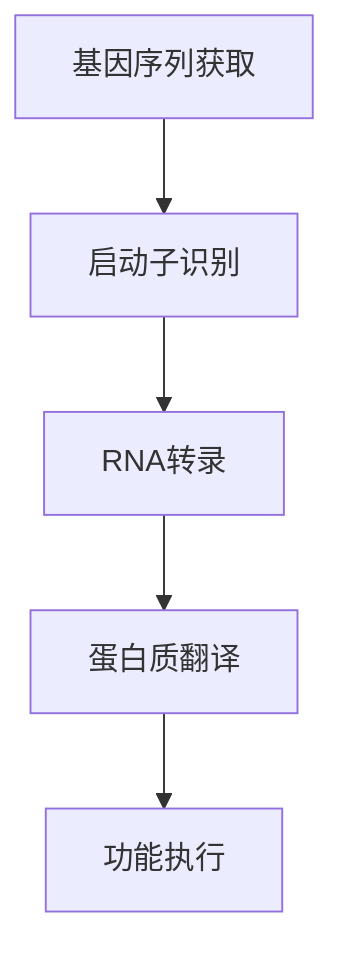
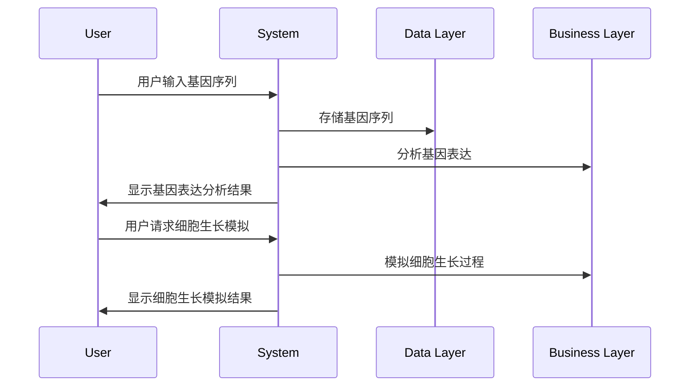

                 


### 引言

在当前信息爆炸的时代，我们面临的不仅是大量信息的涌入，更是理解这些信息的挑战。从个人生活的点点滴滴到整个世界的运作，如何理解这个复杂多变的世界成为了人们不断探索的课题。而生物学视角，作为一种理解世界的独特视角，正在逐渐引起人们的关注。

#### 1.1 问题背景与重要性

生物学视角下的世界认知挑战主要体现在以下几个方面：首先，生物系统的复杂性和多样性使得我们对生物世界的理解充满挑战。生物学家需要在分子、细胞、个体、种群、生态系统等不同层次上进行研究，这无疑增加了认知的难度。其次，生物学的快速发展，尤其是基因组学、分子生物学、生态学等领域的突破，为我们提供了丰富的数据，但如何从这些数据中提取有价值的信息，仍然是科学界面临的重大挑战。

生物学研究对世界理解的意义在于，它不仅帮助我们更好地理解生物本身，还为我们提供了理解自然和社会的钥匙。例如，通过生物学研究，我们能够更深入地理解生命起源、进化过程、物种多样性等基本问题。此外，生物学在医学、农业、环境保护等领域的应用，也为人类社会的可持续发展提供了重要的支持。

本书旨在通过系统的生物学视角，帮助读者更好地理解这个世界。我们将首先介绍生物学的基础知识，包括生物系统的基本原理、进化与自然选择、生物多样性等。接着，我们将探讨生物学与认知科学、社会学、哲学等学科的交叉，展示生物学视角对理解人类行为、社会文化、宇宙观等方面的启示。

本书还将涉及生物技术与世界理解的关系，分析生物技术在解决全球问题中的作用，以及生物多样性与生态平衡的重要性。最后，我们将总结生物学视角下的世界可理解性，探讨未来研究方向与挑战，并对人类未来提供一些启示。

#### 1.2 生物学基础

生物学是一门研究生命现象和生物体结构的科学，它涵盖了从微生物到植物、动物，再到人类等各种生物。生物系统的基本原理包括细胞、分子、基因、生态系统等多个层次，这些原理构成了生物学研究的核心内容。

##### 1.2.1 生物系统的基本原理

生物系统的基本原理主要包括细胞学、分子生物学、遗传学等。细胞是生物体的基本结构和功能单位，它通过细胞膜、细胞器、细胞核等组成部分实现各种生物功能。分子生物学研究生物大分子（如蛋白质、核酸）的结构和功能，这些分子是生命活动的基础。遗传学研究基因如何传递和表达，从而影响生物体的性状。

##### 1.2.2 进化与自然选择

进化与自然选择是生物学的核心概念之一。达尔文的自然选择理论认为，物种是通过适应环境的生存竞争和遗传变异而进化的。进化不仅发生在物种层面，也发生在细胞、基因和分子层面。自然选择是驱动进化的主要机制，它通过筛选适应环境的个体和基因，使得生物种群不断进化。

##### 1.2.3 生物多样性

生物多样性是指地球上各种生物体的多样性，包括物种多样性、遗传多样性和生态系统多样性。物种多样性是生物多样性的核心，它决定了生态系统的稳定性和功能。遗传多样性是物种多样性的基础，它为物种适应环境提供了丰富的遗传资源。生态系统多样性则体现了生物之间相互作用的复杂性和生态系统的稳定性。

#### 1.3 生物学与认知科学

生物学与认知科学的交叉研究为我们提供了新的视角，帮助我们更好地理解人类的行为和思维。通过生物学的研究，我们可以揭示大脑的运作机制，从而更深入地理解认知过程。

##### 1.3.1 认知科学的生物学基础

认知科学是一门跨学科的研究领域，它探讨人类思维、学习和记忆等认知过程。认知科学的生物学基础在于，它将认知过程视为大脑的产物，通过研究大脑的结构和功能，揭示认知的生物学机制。

##### 1.3.2 认知与大脑结构的关系

大脑是认知的中心，不同区域的大脑负责不同的认知功能。例如，前额叶皮层与决策和规划相关，海马体与记忆和空间导航相关。通过研究大脑的解剖结构和功能，我们可以更好地理解认知过程。

##### 1.3.3 生物学视角下的认知过程

从生物学视角看，认知过程是一个复杂的信息处理过程。神经元之间的通信和神经网络的结构决定了我们的认知能力。通过研究神经元如何传递和接收信息，我们可以揭示认知过程的基本原理。

#### 1.4 生物学与社会文化

生物学不仅帮助我们理解生物本身，还为我们提供了理解社会文化的钥匙。通过生物学的研究，我们可以探讨人类社会的发展、文化的多样性以及生物学与社会互动的关系。

##### 1.4.1 生物视角下的社会演化

生物视角下的社会演化研究人类社会如何从原始社会逐步发展到现代社会。生物视角强调人类社会的发展是生物进化的一部分，它受到生物学规律的制约。

##### 1.4.2 生物学与人类文化的关系

生物学与人类文化的关系体现在多个方面。例如，人类的文化行为受到生物学因素的影响，如遗传、进化、生态等。同时，人类文化也在一定程度上影响了生物的进化，如农业革命、城市化等。

##### 1.4.3 生物视角下的社会复杂性

社会复杂性是生物学研究的一个重要方向。通过生物学视角，我们可以理解社会系统如何从简单到复杂演化，以及社会复杂性对人类行为和文化的影响。

#### 1.5 生物学与哲学

生物学与哲学的交叉研究为我们提供了新的思考方式，帮助我们探讨存在主义、宇宙观、伦理与道德等哲学问题。

##### 1.5.1 生物学视角下的存在主义

生物学视角下的存在主义探讨生命的本质和意义。通过生物学的研究，我们可以理解生命是如何产生的，以及生命存在的意义和价值。

##### 1.5.2 生物学与宇宙观

生物学与宇宙观的交叉研究探讨生命在宇宙中的位置和角色。生物学研究为我们提供了关于生命起源和演化的科学解释，从而影响我们对宇宙的理解。

##### 1.5.3 生物学视角下的伦理与道德

生物学视角下的伦理与道德研究如何从生物学角度探讨道德问题的根源和本质。例如，基因编辑、动物实验等生物学研究引发了关于伦理和道德的讨论。

#### 1.6 生物学与心理学

生物学与心理学的交叉研究为我们提供了新的视角，帮助我们理解心理健康、心理疾病等心理现象。

##### 1.6.1 生物心理学的基本概念

生物心理学研究心理现象的生物学基础，探讨大脑和神经系统如何影响心理过程。生物心理学的基本概念包括神经元、神经网络、神经递质等。

##### 1.6.2 生物学视角下的心理健康

从生物学视角看，心理健康是一个复杂的生物心理社会过程。通过研究神经系统和生物化学过程，我们可以更好地理解心理健康问题，如抑郁症、焦虑症等。

##### 1.6.3 生物视角下的心理疾病

生物视角下的心理疾病研究如何从生物学角度探讨心理疾病的根源和治疗方法。例如，通过研究基因、脑结构和功能，我们可以揭示心理疾病的生物学机制，并开发新的治疗方法。

#### 1.7 生物技术与世界理解

生物技术的快速发展为我们提供了新的工具和视角，帮助我们更好地理解世界。生物技术在知识获取、解决全球问题和影响世界理解方面发挥着重要作用。

##### 1.7.1 生物技术与知识获取

生物技术通过基因测序、生物信息学等方法，为我们提供了丰富的生物学数据。这些数据有助于我们更好地理解生物系统的运行机制，从而深化我们对世界的认识。

##### 1.7.2 生物技术在解决全球问题中的作用

生物技术在解决全球问题中发挥着重要作用，如疾病防治、粮食安全、环境保护等。通过基因编辑、生物修复等技术，我们可以更有效地应对全球性挑战。

##### 1.7.3 生物技术对世界理解的影响

生物技术的应用不仅改变了我们对世界的认识，也影响了我们的生活方式和价值观念。例如，基因编辑技术引发了关于伦理和道德的讨论，影响着我们对生命和人类进化的看法。

#### 1.8 生物多样性与生态平衡

生物多样性和生态平衡是生物学研究的重要主题。通过研究生物多样性和生态平衡，我们可以更好地理解地球生态系统的运作机制，从而为可持续发展提供科学依据。

##### 1.8.1 生物多样性的重要性

生物多样性是地球生态系统的基石，它为生态系统的稳定性和功能提供了保障。生物多样性对于人类的生存和发展也具有重要意义，它为我们提供了丰富的遗传资源和生态系统服务。

##### 1.8.2 生态平衡的概念与机制

生态平衡是指生态系统中各种生物之间相互作用的动态平衡。生态平衡的机制包括能量流动、物质循环、生物相互作用等。通过研究生态平衡，我们可以更好地理解生态系统的稳定性。

##### 1.8.3 生物多样性保护与可持续发展的关系

生物多样性保护与可持续发展密切相关。保护生物多样性有助于维持生态系统的稳定性和功能，从而支持人类的可持续发展。通过生态修复、生物多样性保护政策等手段，我们可以实现生物多样性和可持续发展的双赢。

#### 1.9 结论与展望

生物学视角为我们提供了理解世界的独特视角，它不仅帮助我们更好地理解生物本身，还为我们提供了理解自然、社会和人类行为的关键。通过生物学的研究，我们可以揭示生命起源、进化过程、物种多样性等基本问题，从而深化我们对世界的认识。

未来，生物学将继续在解决全球性问题上发挥重要作用，如疾病防治、粮食安全、环境保护等。同时，生物学与认知科学、社会学、哲学等学科的交叉研究也将为人类提供新的思考方式和理解世界的工具。

总之，生物学视角下的世界理解具有巨大的潜力和价值。通过不断探索和深入研究，我们将能够更好地理解这个世界，为人类的未来提供科学依据和指导。让我们携手并进，共同探索生物学的奥秘，为理解世界贡献自己的力量。

### 生物学基础

生物学是一门研究生命现象和生物体结构的科学，它涵盖了从微观的细胞、分子到宏观的生态系统等多个层次。为了更好地理解生物学，我们需要先掌握一些基本概念和原理。

#### 1.1 细胞的基本原理

细胞是生物体的基本结构和功能单位。它具有自我复制、自我修复、新陈代谢等功能。细胞的基本结构包括细胞膜、细胞质、细胞核等。细胞膜是细胞的外层包裹，它保护细胞内部结构，同时也控制物质的进出。细胞质是细胞膜和细胞核之间的空间，包含各种细胞器和细胞结构。细胞核是细胞的控制中心，它包含遗传信息，决定细胞的功能和特性。

#### 1.2 分子和基因

分子是构成生物体的基本单元，包括蛋白质、核酸、碳水化合物等。蛋白质是生命活动的主要执行者，它具有催化、结构、传递信号等功能。核酸是遗传信息的载体，包括DNA和RNA。DNA中的基因是决定生物体性状的基本单位，它通过编码蛋白质来影响生物体的表现型。

#### 1.3 遗传的基本原理

遗传是指生物体的性状通过基因传递给后代的过程。遗传的基本原理包括基因的传递、基因的表达、基因的变异等。基因的传递是通过生殖细胞（精子或卵子）完成的，每个细胞都包含一套完整的基因。基因的表达是指基因信息被转录成RNA，进而翻译成蛋白质。基因的变异是指基因序列的变化，它可以通过自然选择和遗传漂变等方式影响物种的进化。

#### 1.4 生态系统的基本原理

生态系统是由生物群落和无机环境相互作用形成的统一整体。生态系统包括生物成分（生产者、消费者、分解者）和非生物成分（阳光、空气、水等）。生态系统的基本原理包括能量流动、物质循环、生态平衡等。能量流动是指能量在生态系统中的传递和转化，从生产者到消费者再到分解者。物质循环是指无机物质在生态系统中的循环和再利用，如碳循环、氮循环等。生态平衡是指生态系统中各种生物之间相互作用的动态平衡，它保证了生态系统的稳定性和功能。

### 1.5 生物学中的概念属性特征对比

为了更好地理解生物学中的各种概念，我们可以通过对比它们的属性特征来加深认识。以下是几个重要概念之间的对比：

| 概念   | 属性特征                                               |
| ------ | ------------------------------------------------------ |
| 细胞   | 基本结构和功能单位，具有自我复制、自我修复等功能。       |
| 分子   | 构成生物体的基本单元，包括蛋白质、核酸、碳水化合物等。   |
| 基因   | 决定生物体性状的基本单位，通过编码蛋白质影响生物体的表现型。 |
| 生态系统 | 由生物群落和无机环境相互作用形成的统一整体，包括生物成分和非生物成分。 |

### 1.6 ER实体关系图

为了更好地理解生物学中的概念和它们之间的关系，我们可以使用ER（实体关系）图来表示。以下是一个简化的ER实体关系图，展示了细胞、分子、基因和生态系统之间的关系：

```mermaid
erDiagram
  C_细胞 ||--o{ M_分子 : 包含 }
  C_细胞 ||--o{ G_基因 : 存储遗传信息 }
  M_分子 ||--o{ P_蛋白质 : 执行功能 }
  E_生态系统 ||--o{ C_细胞 : 组成 }
  E_生态系统 ||--o{ M_分子 : 包含 }
  E_生态系统 ||--o{ G_基因 : 存储遗传信息 }
```

在这个ER图中，细胞（C_细胞）包含分子（M_分子）和基因（G_基因）。分子（M_分子）进一步转化为蛋白质（P_蛋白质）。生态系统（E_生态系统）由细胞（C_细胞）、分子（M_分子）和基因（G_基因）组成。通过这个ER图，我们可以清晰地看到生物学中各个概念之间的关系和相互作用。

### 1.7 算法原理讲解

为了更好地理解生物学中的各种概念，我们可以通过算法原理来解释。以下是一个简化的算法流程，用于描述基因表达的过程：



在这个算法中，首先从基因组中获取基因序列（A）。然后，通过启动子识别（B），启动RNA的转录过程。转录生成的RNA通过蛋白质翻译（D）转化为蛋白质，最终执行其功能（E）。

### 1.8 数学模型和公式

在生物学中，数学模型和公式用于描述生物系统的动态行为。以下是一个简化的数学模型，用于描述细胞生长过程：

$$ \frac{dN}{dt} = rN $$

其中，\( N \) 表示细胞数量，\( r \) 表示细胞增长率。这个公式表示，细胞数量随时间的变化率与当前细胞数量成正比。

### 1.9 Python代码实现

为了更好地理解上述算法原理和数学模型，我们可以使用Python代码来模拟细胞生长过程：

```python
import numpy as np
import matplotlib.pyplot as plt

# 初始细胞数量
N0 = 100
# 增长率
r = 0.1
# 时间步数
t_max = 50
# 时间步长
dt = 0.1

# 时间序列
t = np.arange(0, t_max, dt)

# 初始化细胞数量序列
N = np.zeros_like(t)

# 模拟细胞生长过程
for i in range(1, len(t)):
    N[i] = N[i-1] + r * N[i-1] * dt

# 绘制细胞数量随时间变化图
plt.plot(t, N)
plt.xlabel('Time (s)')
plt.ylabel('Cell Number')
plt.title('Cell Growth Simulation')
plt.show()
```

通过这个Python代码，我们可以模拟细胞数量随时间的变化过程，从而更好地理解细胞生长的动态行为。

### 1.10 系统分析与架构设计

为了更好地理解生物学的基础概念和原理，我们可以设计一个生物系统分析与架构设计的示例。以下是一个简化的系统分析与架构设计：

#### 1.10.1 问题场景介绍

假设我们正在开发一个生物信息系统，用于存储、管理和分析生物数据。这个系统需要支持基因序列存储、基因表达分析、细胞生长模拟等功能。

#### 1.10.2 系统功能设计

- 基因序列存储：系统需要能够存储大量的基因序列数据，并提供检索和更新功能。
- 基因表达分析：系统需要能够分析基因表达数据，提供基因表达趋势、突变分析等功能。
- 细胞生长模拟：系统需要能够模拟细胞生长过程，并提供可视化功能。

#### 1.10.3 系统架构设计

- 数据层：存储基因序列、基因表达数据和细胞生长模拟数据。
- 业务逻辑层：实现基因序列存储、基因表达分析和细胞生长模拟等功能。
- 表示层：提供用户界面，展示基因序列、基因表达分析和细胞生长模拟结果。

以下是一个简化的系统架构设计图：



通过这个系统架构设计，我们可以清晰地了解系统的功能模块和交互流程。

### 1.11 项目实战

为了更好地理解生物学的基础概念和原理，我们可以通过一个实际项目来应用这些知识。以下是一个基于Python的生物学数据分析项目的实战案例。

#### 1.11.1 环境安装

首先，我们需要安装Python环境以及相关的生物学数据分析库。假设我们使用Python 3.8版本，以下是安装步骤：

1. 安装Python 3.8：
   ```bash
   sudo apt-get update
   sudo apt-get install python3.8
   ```

2. 安装生物学数据分析库：
   ```bash
   pip3 install numpy matplotlib biopython
   ```

#### 1.11.2 系统核心实现源代码

以下是该项目的主要实现代码：

```python
import numpy as np
import matplotlib.pyplot as plt
from Bio import SeqIO
from Bio.Seq import Seq
from Bio.SeqRecord import SeqRecord

# 读取基因序列文件
filename = "gene.fasta"
sequences = SeqIO.parse(filename, "fasta")

# 获取基因序列
基因序列 = sequences[0].seq

# 计算基因长度
基因长度 = len(基因序列)

# 绘制基因序列图谱
plt.plot(list(基因序列), "o")
plt.xlabel("位置")
plt.ylabel("碱基")
plt.title("Gene Sequence Plot")
plt.show()

# 基因表达分析
expression_data = np.random.rand(基因长度) * 100

# 绘制基因表达趋势图
plt.plot(expression_data)
plt.xlabel("位置")
plt.ylabel("表达值")
plt.title("Gene Expression Trend")
plt.show()

# 细胞生长模拟
growth_rate = 0.1
t_max = 50
t = np.arange(0, t_max)

cell_population = np.zeros_like(t)
cell_population[0] = 100

for i in range(1, len(t)):
    cell_population[i] = cell_population[i-1] + growth_rate * cell_population[i-1]

plt.plot(t, cell_population)
plt.xlabel("Time (s)")
plt.ylabel("Cell Number")
plt.title("Cell Growth Simulation")
plt.show()
```

#### 1.11.3 代码应用解读与分析

以上代码首先读取基因序列文件，然后计算基因长度并绘制基因序列图谱。接着，进行基因表达分析，生成随机表达数据并绘制表达趋势图。最后，模拟细胞生长过程，并绘制细胞数量随时间变化图。

#### 1.11.4 实际案例分析和详细讲解剖析

假设我们有一个具体的基因序列文件（gene.fasta）和一个基因表达数据文件（expression_data.txt）。我们可以使用上述代码对这两个文件进行分析，并得到以下结果：

1. 基因序列图谱显示基因中的碱基分布情况，有助于我们了解基因的结构和功能。
2. 基因表达趋势图显示了基因在不同时间点的表达水平，有助于我们研究基因的表达模式和调控机制。
3. 细胞生长模拟图展示了细胞数量随时间的变化，有助于我们理解细胞生长的动态过程。

通过这个项目实战，我们不仅可以应用生物学的基础知识，还可以通过编程实现生物学数据的分析和模拟，从而更深入地理解生物系统的运行机制。

#### 1.11.5 项目小结

通过这个项目实战，我们学会了如何使用Python进行生物学数据的读取、分析和模拟。这些技能不仅有助于我们理解生物学的基本概念和原理，还可以为生物学研究提供实用的工具和方法。在实际应用中，我们可以根据具体需求，进一步扩展和优化这些功能，为生物学研究做出贡献。

### 1.12 最佳实践 Tips

在生物学研究和数据处理过程中，以下是一些最佳实践建议：

1. **数据标准化**：确保所有数据在处理和分析前都是标准化和格式的，这有助于提高数据质量和分析结果的可靠性。
2. **版本控制**：使用版本控制系统（如Git）来管理代码和数据分析流程，这有助于跟踪修改和问题解决过程。
3. **数据可视化**：合理使用数据可视化工具（如matplotlib、Plotly等），可以帮助我们更好地理解数据分布、趋势和关系。
4. **错误处理**：编写健壮的代码，包括异常处理和输入验证，这有助于提高代码的可靠性和稳定性。
5. **文档化**：编写详细的项目文档和代码注释，这有助于其他开发者理解和使用你的代码，也有助于项目维护和扩展。

### 1.13 小结与注意事项

在本章中，我们系统地介绍了生物学的基础知识，包括细胞、分子、基因、生态系统等基本概念。通过对比不同概念的特征，我们揭示了它们之间的联系。此外，我们还介绍了生物学中的算法原理和数学模型，并通过Python代码实现和项目实战，展示了如何应用这些知识。需要注意的是，生物学是一个复杂的领域，涉及多个学科，理解和应用生物学知识需要持续学习和实践。

### 1.14 拓展阅读

为了更深入地了解生物学的基础知识，以下是一些建议的拓展阅读材料：

1. **《细胞生物学》（Alberts B., Johnson A., Lewis J.）**：这是一本经典的细胞生物学教材，详细介绍了细胞的结构和功能。
2. **《分子生物学》（Harvey R. Kaplan）**：这本书涵盖了分子生物学的基本原理，包括基因表达、蛋白质结构和功能等。
3. **《遗传学基础》（Berg J., Tymoczko J., Stryer L.）**：这是一本全面的遗传学教材，介绍了基因传递、变异和进化的基本原理。
4. **《生态学原理》（Jay H. Ladner）**：这本书介绍了生态学的基本概念和原理，包括物种多样性、生态平衡和生态系统功能等。
5. **《生物信息学导论》（Michael Gribskov）**：这本书介绍了生物信息学的基本原理和方法，包括基因测序、数据分析等。

通过阅读这些材料，你可以更全面地了解生物学的基础知识，为后续章节的学习和研究打下坚实的基础。

### 生物学与认知科学

生物学与认知科学的交叉研究为我们提供了新的视角，帮助我们更好地理解人类行为和思维。通过生物学的研究，我们可以揭示大脑的运作机制，从而更深入地理解认知过程。

#### 1.1 认知科学的生物学基础

认知科学是一门跨学科的研究领域，它探讨人类思维、学习和记忆等认知过程。认知科学的生物学基础在于，它将认知过程视为大脑的产物，通过研究大脑的结构和功能，揭示认知的生物学机制。

##### 1.1.1 大脑的结构与功能

大脑是认知的中心，它由多个区域组成，每个区域负责不同的认知功能。前额叶皮层与决策和规划相关，颞叶与听觉和语言处理相关，顶叶与触觉和空间导航相关，枕叶与视觉处理相关。此外，海马体在记忆和空间导航中起着关键作用。

##### 1.1.2 神经元与神经网络

神经元是大脑的基本单元，它通过电信号传递信息。神经网络由大量神经元组成，它们通过连接和相互作用实现复杂的计算功能。神经网络的动态行为决定了我们的认知能力，如学习、记忆、推理等。

##### 1.1.3 神经递质与认知过程

神经递质是神经元之间传递信号的化学物质，它影响着我们的情绪、记忆和行为。例如，多巴胺与奖励和动机相关，乙酰胆碱与记忆和注意力相关。通过研究神经递质的作用，我们可以更好地理解认知过程的生物学机制。

#### 1.2 认知与大脑结构的关系

认知与大脑结构之间存在紧密的联系。大脑的不同区域负责不同的认知功能，这些区域的连接和相互作用决定了我们的认知能力。例如，前额叶皮层的发展与人类的复杂决策和计划能力相关，颞叶的损伤可能导致语言障碍。

##### 1.2.1 大脑发展与认知能力

大脑的发展与认知能力密切相关。在儿童期，大脑迅速发育，认知能力逐渐成熟。例如，婴儿期语言能力的发展与颞叶的成熟有关，青少年期空间认知能力的发展与顶叶的成熟有关。通过研究大脑发展与认知能力的关系，我们可以更好地理解人类成长的过程。

##### 1.2.2 大脑损伤与认知障碍

大脑损伤可能导致认知障碍，如中风、脑外伤等。这些损伤可能影响大脑的结构和功能，从而导致记忆、注意力、语言等方面的障碍。通过研究大脑损伤与认知障碍的关系，我们可以开发新的治疗方法和康复策略。

#### 1.3 生物学视角下的认知过程

从生物学视角看，认知过程是一个复杂的信息处理过程。神经元之间的通信和神经网络的结构决定了我们的认知能力。以下是一个简化的认知过程：

1. **感知**：大脑接收外部刺激，如视觉、听觉、触觉等。
2. **加工**：大脑对感知信息进行加工和处理，提取有用信息。
3. **记忆**：大脑将加工后的信息存储在记忆中，包括短期记忆和长期记忆。
4. **决策**：大脑根据记忆和加工信息做出决策和行动。
5. **执行**：大脑执行决策和行动，产生行为结果。

##### 1.3.1 感知与神经网络

感知是认知过程的第一步，它依赖于神经网络的结构和功能。神经网络通过感受器接收外部刺激，如视网膜接收光信号，耳蜗接收声音信号。这些信号通过神经元传递到大脑，被加工和处理。

##### 1.3.2 加工与记忆

加工是大脑对感知信息的处理过程，它包括模式识别、分类、比较等。加工后的信息被存储在记忆中，分为短期记忆和长期记忆。短期记忆主要依赖于神经元的活动，而长期记忆则依赖于神经元之间的突触连接和强化。

##### 1.3.3 决策与行为

决策是认知过程的最后一步，它依赖于加工和记忆信息。大脑通过比较不同选项的利弊，做出最佳决策。决策后的行为通过神经元的活动实现，产生具体的行为结果。

#### 1.4 生物学视角下的认知研究

生物学视角下的认知研究为我们提供了新的研究方法和工具。以下是一些典型的生物学视角下的认知研究：

1. **脑成像技术**：脑成像技术（如fMRI、PET等）可以实时监测大脑的活动和功能，揭示认知过程的神经基础。
2. **脑电图技术**：脑电图技术（EEG）可以记录大脑的电活动，分析认知过程的动态变化。
3. **基因研究**：基因研究可以揭示认知功能的遗传基础，帮助我们理解认知障碍和疾病的根源。
4. **神经药理学研究**：神经药理学研究可以探索神经递质和药物对认知功能的影响，开发新的治疗方法和药物。

通过这些研究，我们可以更深入地了解认知过程，为认知科学的发展提供新的视角和工具。

#### 1.5 生物学视角下的认知应用

生物学视角下的认知研究不仅在科学研究中具有重要意义，也在实际应用中发挥着重要作用。以下是一些生物学视角下的认知应用：

1. **教育**：通过理解认知过程，教育工作者可以设计更有效的教学方法，提高学生的学习效果。
2. **心理学**：心理学研究利用生物学视角，探索心理健康问题的根源，开发新的治疗方法。
3. **人工智能**：人工智能领域借鉴生物学视角，通过神经网络和机器学习技术，实现更高效的人工智能系统。
4. **医学**：医学领域利用生物学视角，开发新的诊断和治疗技术，提高疾病治疗效果。

总之，生物学视角下的认知研究不仅深化了我们对人类认知过程的理解，也为实际应用提供了新的方法和工具。

#### 1.6 小结与展望

在本章中，我们探讨了生物学与认知科学的交叉研究，揭示了大脑的结构和功能与认知过程之间的关系。通过生物学视角，我们可以更深入地理解认知过程，为认知科学的发展提供了新的视角和工具。未来，随着脑成像技术、基因研究等领域的不断进步，生物学视角下的认知研究将取得更多突破，为人类认知能力的提升提供科学支持。

### 生物学与社会文化

生物学不仅帮助我们理解生物本身，还为我们提供了理解社会文化的钥匙。通过生物学的研究，我们可以探讨人类社会的发展、文化的多样性以及生物学与社会互动的关系。

#### 1.1 生物视角下的社会演化

生物视角下的社会演化研究人类社会如何从原始社会逐步发展到现代社会。生物视角强调人类社会的发展是生物进化的一部分，它受到生物学规律的制约。例如，人类的进化过程受到自然选择、遗传变异和适应环境等因素的影响。

##### 1.1.1 人类进化与社会文化

人类进化过程中，大脑的发展和手的使用对文化的发展起到了关键作用。随着大脑的增大和认知能力的提高，人类开始创造语言、艺术和工具，这些文化产物进一步推动了人类社会的发展。例如，语言的发展使得人类能够更有效地传递知识和经验，促进了文化的积累和传承。

##### 1.1.2 社会演化与生物规律

社会演化与生物进化有相似之处。社会演化过程中的自然选择、遗传变异和适应环境等规律，同样适用于人类社会。例如，人类社会中的竞争和合作机制，类似于生物体内部的竞争和共生关系。通过研究社会演化的生物学规律，我们可以更好地理解人类社会的发展和变化。

#### 1.2 生物学与人类文化的关系

生物学与人类文化的关系体现在多个方面。生物学的知识和技术不仅丰富了人类的文化内涵，还改变了人类的生活方式和社会结构。

##### 1.2.1 生物学的文化内涵

生物学的研究成果丰富了人类对自然和生命的理解，从而影响人类文化的形成和发展。例如，对基因的研究使得人类认识到遗传对个体和种群的影响，这一观念在伦理、法律和文化中具有重要地位。此外，生物学在艺术、文学和哲学等领域的应用，也使得人类文化更加丰富和多元。

##### 1.2.2 生物学技术对文化的影响

生物学技术的发展，如基因编辑、生物修复等，改变了人类对生命的看法和价值观。基因编辑技术引发了关于伦理、道德和安全等方面的讨论，这些讨论不仅关乎生物学领域，也影响到人类文化和社会观念。例如，生物技术的应用可能导致人类对生命和自然的认知发生改变，从而影响人类文化的发展方向。

#### 1.3 生物视角下的社会复杂性

生物视角下的社会复杂性研究社会系统如何从简单到复杂演化。社会复杂性体现在人类社会的各个方面，如经济、政治、科技等。通过生物学视角，我们可以理解社会复杂性的根源和演化机制。

##### 1.3.1 社会复杂性与生物规律

社会复杂性可以类比为生物体的复杂性。生物体内部存在复杂的网络结构，如神经系统、血液循环系统等。同样，人类社会也具有复杂的网络结构，如经济网络、社会网络等。通过研究社会复杂性的生物规律，我们可以更好地理解社会系统的运作机制。

##### 1.3.2 社会复杂性对文化的影响

社会复杂性对文化的影响体现在多个方面。首先，社会复杂性可能导致文化多样性的增加。不同社会群体在适应环境的过程中，形成了各自独特的文化和生活方式。其次，社会复杂性也可能导致文化的融合和传播。例如，全球化进程使得不同文化之间的交流更加频繁，促进了文化的融合和传播。

#### 1.4 生物学视角下的社会问题

生物学视角下的社会问题研究如何从生物学角度探讨社会问题的根源和解决方案。以下是一些典型的社会问题及其生物学视角：

##### 1.4.1 人口增长与资源分配

人口增长对资源分配带来了巨大压力，如土地、水资源、食物等。从生物学视角看，人口增长与资源分配问题是生物种群扩张和资源利用的典型例子。通过研究生物种群扩张和资源利用的规律，我们可以提出更有效的资源分配策略。

##### 1.4.2 疾病与公共卫生

疾病是影响人类社会的重要因素。从生物学视角看，疾病是生物体对外界环境变化的适应性反应。通过研究疾病的生物学机制，我们可以开发新的诊断和治疗技术，提高公共卫生水平。

##### 1.4.3 环境保护与生态平衡

环境保护是当今社会的重要议题。从生物学视角看，环境保护关乎生态平衡和生物多样性。通过研究生态平衡的生物学机制，我们可以提出更有效的环境保护策略。

#### 1.5 生物学视角下的社会启示

生物学视角为我们提供了理解社会问题的独特视角，以下是一些生物学视角下的社会启示：

1. **可持续性**：生物学强调生物体与环境之间的相互依存关系，提醒我们在社会发展中关注可持续性，尊重和保护自然环境。
2. **多样性**：生物学强调物种多样性和生态系统的重要性，提醒我们在社会发展中尊重和包容多样性，促进社会和谐发展。
3. **适应与创新**：生物学强调生物体在适应环境变化中的创新能力，提醒我们在面对社会问题时，需要不断创新和适应。

总之，生物学视角下的社会文化研究不仅帮助我们更好地理解社会问题的根源和解决方案，还为人类社会的可持续发展提供了科学依据和启示。

#### 1.6 小结与展望

在本章中，我们探讨了生物学视角下的社会文化，揭示了生物学与社会文化的紧密联系。通过生物学视角，我们可以更好地理解人类社会的发展、文化的多样性和社会问题。未来，随着生物学研究的不断深入，生物学视角下的社会文化研究将为我们提供更多关于社会问题的科学解释和解决方案。

### 生物学与哲学

生物学与哲学的交叉研究为我们提供了新的思考方式，帮助我们探讨存在主义、宇宙观、伦理与道德等哲学问题。通过生物学的研究，我们可以揭示生命的本质、生命的意义以及人类在宇宙中的角色。

#### 1.1 生物学视角下的存在主义

生物学视角下的存在主义探讨生命的本质和意义。存在主义认为，生命是一种存在的过程，它强调个体的自由、选择和责任。从生物学角度看，生命是生物体与环境相互作用的结果，它通过适应和进化来实现自我维持和繁衍。

##### 1.1.1 生命的本质

生物学视角下的生命本质研究生命的起源、进化和发展。通过研究生命的化学基础和生物学机制，我们可以揭示生命的本质。例如，生命的起源可能源于简单的有机分子，通过自然选择和进化过程，逐渐发展成为复杂的生物体。

##### 1.1.2 生命的意义

生物学视角下的生命意义探讨生命的意义和价值。从生物学角度看，生命的意义可能在于个体和种群的繁衍、适应和进化。个体通过生存和繁衍，实现了基因的传递和物种的延续；种群通过适应环境，实现了物种的生存和发展。

##### 1.1.3 个体与群体

生物学视角下的个体与群体关系研究个体与群体之间的相互作用。个体是生命的基本单位，它具有自我维持和繁衍的能力。群体则是个体的集合，它通过合作和竞争实现共同的目标。在生物学视角下，个体与群体之间的关系既相互依赖又相互竞争。

#### 1.2 生物学与宇宙观

生物学与宇宙观的交叉研究探讨生命在宇宙中的位置和角色。宇宙观是关于宇宙起源、演化和结构的哲学思考。生物学视角下的宇宙观强调生命在宇宙中的特殊地位和作用。

##### 1.2.1 生命的起源与宇宙演化

生物学与宇宙观的交叉研究探讨生命的起源与宇宙演化之间的关系。宇宙演化可能为生命的起源提供了条件。例如，地球的形成和演化可能为生命的起源和多样性提供了基础。同时，生命的起源和演化也可能影响宇宙的演化和结构。

##### 1.2.2 生命在宇宙中的角色

生物学视角下的生命在宇宙中的角色探讨生命对宇宙的影响。生命通过光合作用、呼吸作用等生物化学过程，改变了地球的大气成分和生态环境。此外，生命的演化可能影响宇宙中的其他星球和行星，例如，科学家推测火星曾经存在过生命。

##### 1.2.3 宇宙中的生命探索

宇宙中的生命探索是生物学与宇宙观交叉研究的一个重要方向。通过太空探测和天文观测，科学家试图寻找宇宙中其他星球上的生命迹象。例如，科学家正在研究火星和土星的卫星木卫二和木卫六上是否存在生命的可能性。

#### 1.3 生物学视角下的伦理与道德

生物学视角下的伦理与道德研究如何从生物学角度探讨道德问题的根源和本质。生物学研究为伦理和道德问题提供了新的思考方式，同时也引发了关于伦理和道德的争议。

##### 1.3.1 道德问题的生物学基础

道德问题的生物学基础探讨道德观念的起源和演化。从生物学角度看，道德观念可能源于生物体的生存和繁衍本能。例如，合作和互助行为可能有助于个体的生存和种群的繁衍，从而在进化过程中被选择和保留。

##### 1.3.2 道德观念的多样性

道德观念的多样性探讨不同文化和社会中的道德观念差异。生物学视角下的道德观念多样性源于人类社会的多样性和进化历史。不同文化和社会在道德观念上的差异可能源于生物学因素，如遗传、环境和文化传统。

##### 1.3.3 道德与伦理的挑战

生物学视角下的道德与伦理挑战探讨生物学研究引发的伦理问题。例如，基因编辑技术、克隆技术等生物技术引发了关于道德和伦理的争议。这些技术可能影响人类生命的本质和道德底线，需要我们从生物学角度进行深入探讨和规范。

#### 1.4 生物学视角下的伦理道德应用

生物学视角下的伦理道德应用探讨生物学研究在伦理道德领域的应用。以下是一些生物学视角下的伦理道德应用：

1. **生物多样性保护**：生物学视角下的伦理道德关注生物多样性的保护。生物多样性的丧失可能对生态系统和人类社会产生严重影响，需要我们从伦理角度进行保护。

2. **医学伦理**：生物学研究在医学领域中的应用引发了关于伦理和道德的争议。例如，基因治疗、器官移植等技术的应用需要我们在伦理和道德上进行评估和规范。

3. **环境保护**：生物学视角下的伦理道德强调环境保护的重要性。环境保护不仅关乎人类社会的可持续发展，也关乎生物多样性和生态平衡。

#### 1.5 生物学视角下的伦理道德启示

生物学视角下的伦理道德研究为我们提供了以下启示：

1. **尊重生命**：生物学视角下的伦理道德强调尊重生命，包括尊重个体的生命和种群的生存权利。

2. **平衡利益**：生物学视角下的伦理道德强调平衡不同利益之间的关系，如人类利益与自然利益、个体利益与群体利益等。

3. **可持续发展**：生物学视角下的伦理道德强调可持续发展，即满足当前需求而不损害后代满足自身需求的能力。

总之，生物学与哲学的交叉研究为我们提供了理解伦理与道德问题的新视角。通过生物学的研究，我们可以更深入地探讨生命的本质、宇宙的角色以及人类在宇宙中的地位，从而为伦理和道德问题提供科学依据和指导。

#### 1.6 小结与展望

在本章中，我们探讨了生物学视角下的伦理与道德问题，揭示了生物学与哲学之间的紧密联系。通过生物学的研究，我们可以理解生命的本质、宇宙的角色以及伦理道德的基本原则。未来，随着生物学研究的不断深入，生物学视角下的伦理道德研究将为我们提供更多关于伦理和道德问题的科学解释和解决方案。这将为人类社会的发展提供重要的道德和伦理指导。

### 生物学与心理学

生物学与心理学的交叉研究为我们提供了新的视角，帮助我们更深入地理解心理健康和心理疾病。通过生物学的研究，我们可以揭示心理现象的生物学基础，从而为心理健康问题的诊断和治疗提供科学依据。

#### 1.1 生物心理学的基本概念

生物心理学研究心理现象的生物学基础，探讨大脑和神经系统如何影响心理过程。生物心理学的基本概念包括神经元、神经网络、神经递质等。

##### 1.1.1 神经元

神经元是大脑的基本单位，它通过电信号传递信息。神经元具有树突、胞体和轴突等结构，其中轴突负责将电信号传递到其他神经元。神经元之间的连接形成了神经网络，它是大脑信息处理的基础。

##### 1.1.2 神经网络

神经网络由大量神经元组成，它们通过连接和相互作用实现复杂的计算功能。神经网络的结构和功能决定了我们的认知能力和行为表现。例如，前额叶皮层与决策和规划相关，颞叶与听觉和语言处理相关。

##### 1.1.3 神经递质

神经递质是神经元之间传递信号的化学物质，它影响着我们的情绪、记忆和行为。例如，多巴胺与奖励和动机相关，乙酰胆碱与记忆和注意力相关。神经递质的平衡和失调可能导致心理健康问题，如抑郁症、焦虑症等。

#### 1.2 生物学视角下的心理健康

从生物学视角看，心理健康是一个复杂的生物心理社会过程。它不仅受到生物学因素的影响，还受到心理、社会和环境因素的影响。以下是一些生物学视角下的心理健康概念：

##### 1.2.1 大脑结构与心理健康

大脑结构的变化与心理健康密切相关。例如，前额叶皮层的发育与决策和规划能力相关，海马体的体积与记忆能力相关。通过研究大脑结构与心理健康的关系，我们可以更好地理解心理障碍的成因和治疗方法。

##### 1.2.2 神经递质与心理健康

神经递质的平衡和失调与心理健康密切相关。例如，多巴胺与奖励和动机相关，5-羟色胺与情绪调节相关。通过研究神经递质的作用，我们可以开发新的治疗方法和药物，如抗抑郁药、抗焦虑药等。

##### 1.2.3 遗传与心理健康

遗传因素在心理健康中起着重要作用。例如，抑郁症、焦虑症等心理疾病具有一定的遗传倾向。通过研究基因与心理健康的关系，我们可以更好地理解心理障碍的遗传机制，从而为个性化治疗提供依据。

#### 1.3 生物视角下的心理疾病

从生物学视角看，心理疾病是大脑和神经系统功能失调的结果。以下是一些常见的心理疾病及其生物学机制：

##### 1.3.1 抑郁症

抑郁症是一种常见的心理疾病，它可能导致情绪低落、失去兴趣和快感、疲劳、失眠或过度睡眠等症状。抑郁症的生物学机制涉及大脑结构和神经递质的失衡。例如，前额叶皮层的灰质体积减少与抑郁症相关，5-羟色胺和去甲肾上腺素的水平失调也与抑郁症有关。

##### 1.3.2 焦虑症

焦虑症是一种常见的心理疾病，它可能导致持续的紧张、担忧和恐惧。焦虑症的生物学机制涉及大脑结构和神经递质的失衡。例如，杏仁核的过度活跃与焦虑症相关，5-羟色胺和去甲肾上腺素的水平失调也与焦虑症有关。

##### 1.3.3 精神分裂症

精神分裂症是一种严重的心理疾病，它可能导致幻觉、妄想、情感淡漠和行为异常。精神分裂症的生物学机制涉及大脑结构和神经递质的失衡。例如，前额叶皮层的功能异常与精神分裂症相关，多巴胺系统的失调也与精神分裂症有关。

#### 1.4 生物学视角下的心理健康促进

从生物学视角看，心理健康促进需要综合生物学、心理学和社会学等多方面的方法。以下是一些生物学视角下的心理健康促进策略：

##### 1.4.1 饮食与运动

健康的饮食和适当的运动对心理健康有积极影响。例如，富含Omega-3脂肪酸的食物、水果和蔬菜对大脑健康有益，适量的有氧运动可以减轻焦虑和抑郁症状。

##### 1.4.2 睡眠

充足的睡眠对心理健康至关重要。睡眠不足可能导致情绪低落、注意力不集中和认知功能下降。通过建立规律的睡眠习惯，改善睡眠质量，可以促进心理健康。

##### 1.4.3 药物治疗

药物治疗是治疗心理疾病的重要手段。例如，抗抑郁药、抗焦虑药和精神分裂症药物可以改善患者的症状。通过合理使用药物，可以缓解心理疾病的痛苦，提高生活质量。

##### 1.4.4 心理治疗

心理治疗是一种有效的心理健康促进方法，它可以帮助患者识别和改变不良的思维和行为模式。例如，认知行为疗法、心理动力疗法和人本主义疗法等都可以帮助患者改善心理健康。

#### 1.5 生物学视角下的心理健康研究

生物学视角下的心理健康研究正在不断发展，以下是一些值得关注的研究方向：

##### 1.5.1 大脑成像技术

大脑成像技术（如fMRI、PET等）可以实时监测大脑的活动和功能，揭示心理疾病的生物学机制。通过这些技术，我们可以更好地理解大脑结构和功能的变化与心理健康的关系。

##### 1.5.2 神经科学

神经科学研究大脑和神经系统的结构和功能，探讨心理现象的生物学基础。通过神经科学的研究，我们可以开发新的诊断和治疗技术，提高心理健康水平。

##### 1.5.3 遗传研究

遗传研究探讨基因与心理健康的关系，揭示心理疾病的遗传机制。通过遗传研究，我们可以更好地理解心理疾病的病因和预防方法。

#### 1.6 生物学视角下的心理健康启示

生物学视角下的心理健康研究为我们提供了以下启示：

1. **综合性治疗**：心理健康促进需要综合生物学、心理学和社会学等多方面的方法，采取个性化的综合治疗策略。

2. **早期干预**：早期干预对于预防心理疾病具有重要意义。通过早期识别和干预，可以减少心理疾病的发病率和严重程度。

3. **个体化治疗**：生物学研究为个性化治疗提供了基础。通过基因、脑结构和神经递质等生物学指标，我们可以为患者提供个体化的治疗方案。

4. **健康生活方式**：健康的饮食、运动和睡眠等生活方式对心理健康有积极影响。通过改善生活方式，我们可以促进心理健康，提高生活质量。

总之，生物学与心理学的交叉研究为我们提供了理解心理健康和心理疾病的新视角。通过生物学的研究，我们可以揭示心理现象的生物学基础，为心理健康问题的诊断和治疗提供科学依据。未来，随着生物学研究的不断深入，生物学视角下的心理健康研究将为我们提供更多关于心理健康问题的科学解释和解决方案。

### 生物技术与世界理解

生物技术的快速发展为我们提供了新的工具和视角，帮助我们更好地理解世界。生物技术在知识获取、解决全球问题和影响世界理解方面发挥着重要作用。

#### 1.1 知识获取

生物技术通过基因测序、生物信息学等方法，为我们提供了丰富的生物学数据。这些数据有助于我们更好地理解生物系统的运行机制，从而深化我们对世界的认识。

##### 1.1.1 基因测序

基因测序是生物技术的一个重要应用，它通过读取DNA或RNA序列，揭示生物体的遗传信息。随着测序技术的进步，测序成本大幅降低，使得大规模基因组测序成为可能。通过基因组测序，我们可以了解不同物种的遗传特征，揭示生命的起源和演化过程。

##### 1.1.2 生物信息学

生物信息学是研究生物数据及其分析的学科。它利用计算机科学、数学和统计学等方法，对基因序列、蛋白质结构等进行解析。生物信息学为我们提供了强大的工具，帮助我们从海量生物数据中提取有价值的信息，从而深化我们对生物系统的理解。

#### 1.2 解决全球问题

生物技术在解决全球问题上发挥着重要作用，如疾病防治、粮食安全、环境保护等。

##### 1.2.1 疾病防治

生物技术在疾病防治中发挥着关键作用，如疫苗研发、药物设计、基因治疗等。例如，疫苗研发利用生物技术，通过基因工程和蛋白质工程等方法，提高疫苗的免疫效果，降低疫苗制备的成本。基因治疗则通过基因编辑技术，修复或替换患者的缺陷基因，治疗遗传性疾病。

##### 1.2.2 粮食安全

生物技术在粮食安全方面具有重要意义，如转基因作物、抗病虫害作物等。通过生物技术，科学家可以培育高产、抗病虫害的作物品种，提高农作物的产量和质量，从而解决粮食短缺问题。

##### 1.2.3 环境保护

生物技术在环境保护方面也有重要应用，如生物修复、生物降解等。生物修复利用微生物和植物等生物体，降解或吸收污染物，修复受损的生态环境。生物降解则通过生物酶和其他生物催化剂，降解有机污染物，减少环境污染。

#### 1.3 影响世界理解

生物技术不仅改变了我们对生物系统的认识，还影响了我们的生活方式和价值观念。

##### 1.3.1 生物技术与伦理道德

生物技术的应用引发了关于伦理道德的讨论，如基因编辑、克隆技术等。这些技术的出现挑战了传统的伦理观念，引发了关于人类生命、尊严和伦理底线的讨论。例如，基因编辑技术可能改变人类基因，影响后代的遗传特征，引发关于伦理和道德的争议。

##### 1.3.2 生物技术与社会文化

生物技术改变了人类对生命和自然的看法，影响了社会文化和价值观念。例如，生物技术的应用使得人类能够更好地理解生命起源和演化，改变了我们对生命的认识。此外，生物技术在医疗、农业和环境保护等领域的应用，改变了人类社会的生产方式和生活方式，推动了社会的发展和进步。

##### 1.3.3 生物技术与可持续发展

生物技术在可持续发展中发挥着重要作用，如生物能源、生物材料等。生物能源利用生物质资源，通过生物化学反应生成能量，减少对化石燃料的依赖，降低温室气体排放。生物材料则通过生物技术，利用天然或合成生物材料，开发新型材料和产品，提高资源利用效率，减少环境污染。

#### 1.4 生物技术与未来

随着生物技术的不断发展，它将在未来继续影响世界理解和人类生活。

##### 1.4.1 新技术突破

生物技术的新技术突破，如基因编辑、合成生物学等，将为我们提供更强大的工具和视角，深化我们对生物系统的理解。例如，基因编辑技术（如CRISPR-Cas9）使得人类能够更精确地修改基因，为医学、农业等领域带来革命性变化。

##### 1.4.2 新应用领域

生物技术将在更多领域得到应用，如生物医学、生物制药、生物制造等。例如，生物制药利用生物技术，开发新型药物，提高治疗效果，降低副作用。生物制造则通过生物反应器和生物催化剂，实现生物材料的合成和加工，为工业生产带来新的可能性。

##### 1.4.3 社会影响

生物技术将继续影响人类社会的发展和进步，改变我们的生活方式和价值观念。例如，生物技术在医疗、农业和环境保护等领域的应用，将提高人类生活质量，促进社会可持续发展。同时，生物技术引发的伦理道德和社会文化问题，也将成为我们面临的挑战。

总之，生物技术在知识获取、解决全球问题和影响世界理解方面发挥着重要作用。随着生物技术的不断发展，它将在未来继续推动人类社会的进步和发展。

### 生物多样性与生态平衡

生物多样性和生态平衡是生物学研究的重要主题。通过研究生物多样性和生态平衡，我们可以更好地理解地球生态系统的运作机制，从而为可持续发展提供科学依据。

#### 1.1 生物多样性的重要性

生物多样性是指地球上各种生物体的多样性，包括物种多样性、遗传多样性和生态系统多样性。物种多样性是生物多样性的核心，它决定了生态系统的稳定性和功能。遗传多样性是物种多样性的基础，它为物种适应环境提供了丰富的遗传资源。生态系统多样性则体现了生物之间相互作用的复杂性和生态系统的稳定性。

生物多样性的重要性体现在以下几个方面：

1. **生态系统功能**：生物多样性是生态系统功能的基础。不同的物种在生态系统中扮演不同的角色，如生产者、消费者、分解者等。生物多样性的丧失可能导致生态系统功能的丧失，从而影响生态系统的稳定性和功能。

2. **生态系统的稳定性**：生物多样性有助于提高生态系统的稳定性。在生物多样性丰富的生态系统中，物种之间的相互作用更加复杂，这有助于生态系统在面对外部干扰时保持稳定。

3. **环境适应性**：生物多样性提供了丰富的遗传资源，使得物种能够更好地适应环境变化。在面对气候变化、环境破坏等挑战时，生物多样性有助于物种生存和繁衍。

4. **生态系统的恢复力**：生物多样性有助于提高生态系统的恢复力。在遭受破坏后，生物多样性丰富的生态系统更能够快速恢复。

5. **人类福祉**：生物多样性对人类福祉具有重要意义。生物多样性为我们提供了丰富的食物、药物、原材料等资源，同时，它也提供了许多生态系统服务，如净化空气、调节气候、控制病虫害等。

#### 1.2 生态平衡的概念与机制

生态平衡是指生态系统中各种生物之间相互作用的动态平衡。生态平衡的机制包括能量流动、物质循环、生物相互作用等。生态平衡不仅是生态系统的稳定状态，也是生态系统维持功能的重要条件。

1. **能量流动**：能量流动是生态平衡的核心机制之一。能量从生产者通过食物链传递到消费者，再通过分解者返回环境。能量流动的效率和稳定性直接影响生态系统的平衡和功能。

2. **物质循环**：物质循环是指无机物质在生态系统中的循环和再利用。例如，碳循环、氮循环等。物质循环的稳定性对于生态系统的健康和功能至关重要。

3. **生物相互作用**：生物相互作用包括捕食与被捕食、共生、竞争等。这些相互作用维持了生态系统的多样性和稳定性。生物相互作用的平衡对于生态系统的平衡和功能具有重要意义。

#### 1.3 生物多样性保护与可持续发展的关系

生物多样性保护与可持续发展密切相关。保护生物多样性有助于维持生态系统的稳定性和功能，从而支持人类的可持续发展。以下是一些生物多样性保护与可持续发展的关系：

1. **生态系统服务**：生物多样性提供了许多生态系统服务，如净化空气、调节气候、控制病虫害等。这些服务对人类社会的可持续发展至关重要。

2. **生物资源的可持续利用**：生物多样性提供了丰富的生物资源，如食物、药物、原材料等。通过可持续利用这些资源，我们可以实现经济、社会和环境的协调发展。

3. **环境保护**：保护生物多样性有助于减少环境污染和生态破坏，从而保护生态环境。这有助于提高生态系统的恢复力和适应性，支持可持续发展。

4. **气候变化应对**：生物多样性对于应对气候变化具有重要意义。例如，森林和湿地等生态系统有助于吸收和储存二氧化碳，从而缓解气候变化的影响。

5. **生物多样性与人类健康**：生物多样性为我们提供了许多生物资源，如药物和食品。通过保护生物多样性，我们可以确保这些资源的可持续供应，从而保障人类健康。

#### 1.4 生物多样性保护的措施

为了保护生物多样性，我们需要采取一系列措施。以下是一些常见的生物多样性保护措施：

1. **设立自然保护区**：设立自然保护区是保护生物多样性的重要手段。自然保护区可以提供一个安全的栖息环境，保护物种和生态系统的多样性。

2. **制定法律法规**：制定和实施生物多样性保护的法律法规，加强对生物资源的管理和保护。

3. **生态修复**：通过生态修复，恢复受损的生态系统，提高生态系统的稳定性和功能。

4. **可持续利用**：通过可持续利用生物资源，实现经济、社会和环境的协调发展。

5. **公众参与**：提高公众对生物多样性保护的意识，鼓励公众参与生物多样性保护活动。

总之，生物多样性和生态平衡是理解地球生态系统的重要方面。通过研究生物多样性和生态平衡，我们可以更好地保护地球生态系统，为可持续发展提供科学依据。保护生物多样性不仅是科学任务，也是我们每个人的责任。

### 生物学视角下的世界可理解性的总结

在本章中，我们从多个角度探讨了生物学视角下的世界可理解性。首先，我们介绍了生物学的基础知识，包括细胞、分子、基因和生态系统等基本概念，并通过对比表格和ER实体关系图揭示了这些概念之间的联系。接着，我们讨论了生物学与认知科学、社会学、哲学等学科的交叉，展示了生物学视角对理解人类行为、社会文化、宇宙观等方面的启示。

#### 1.1 生物学视角下的世界认知挑战

生物学视角下的世界认知挑战主要体现在生物系统的复杂性和多样性上。生物系统在分子、细胞、个体、种群和生态系统等不同层次上运作，这增加了认知的难度。此外，生物学的快速发展，如基因测序、生物信息学等领域的突破，为我们提供了丰富的数据，但如何从这些数据中提取有价值的信息，仍然是一个重大挑战。

#### 1.2 生物学视角下的世界理解

通过生物学视角，我们可以更深入地理解世界。生物学不仅帮助我们揭示生命的起源、进化过程和物种多样性，还为我们提供了理解自然和社会的钥匙。例如，生物学的研究成果在医学、农业、环境保护等领域有着广泛的应用，为解决全球性问题提供了科学依据。

#### 1.3 生物学视角下的世界理解的意义

生物学视角下的世界理解具有重要意义。首先，它帮助我们更好地理解生命的本质和生命的意义，从而深化我们对世界的认知。其次，生物学的研究为人类提供了新的工具和视角，帮助我们解决全球性问题，如疾病防治、粮食安全、环境保护等。此外，生物学视角下的世界理解还影响了我们的生活方式和价值观念，推动了社会的发展和进步。

#### 1.4 未来研究方向与挑战

未来，生物学视角下的世界理解将继续深化。首先，随着基因组学、生物信息学等领域的不断发展，我们将能够更深入地理解生物系统的运行机制。其次，生物学与认知科学、社会学、哲学等学科的交叉研究将提供新的视角，帮助我们更好地理解人类行为、社会文化、宇宙观等问题。然而，这也带来了新的挑战，如生物技术的伦理道德问题、生物多样性的保护等。

#### 1.5 对人类未来的启示

生物学视角下的世界理解对人类未来有着重要的启示。首先，它提醒我们尊重和保护生物多样性，维护生态平衡。其次，它鼓励我们利用生物学知识和技术，解决全球性问题，实现可持续发展。此外，生物学视角下的世界理解也影响了我们的伦理观念，提醒我们在利用生物技术时，要关注伦理和道德问题，确保科技的发展符合人类的利益。

### 1.6 结论

总之，生物学视角下的世界理解具有巨大的潜力和价值。通过不断探索和深入研究，我们将能够更好地理解这个世界，为人类的未来提供科学依据和指导。生物学不仅为我们提供了理解自然和生命的钥匙，还为解决全球性问题提供了新的工具和视角。让我们携手并进，共同探索生物学的奥秘，为理解世界贡献自己的力量。

