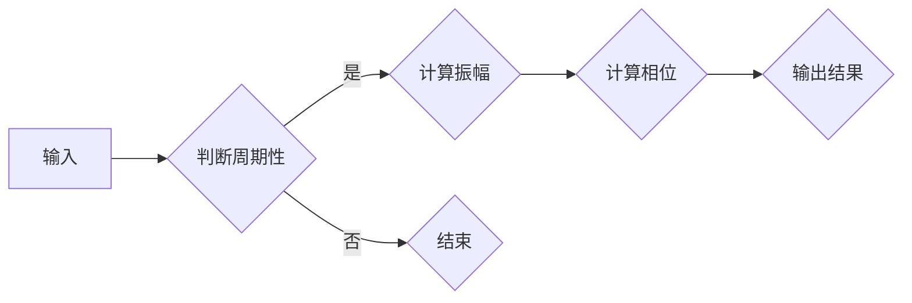
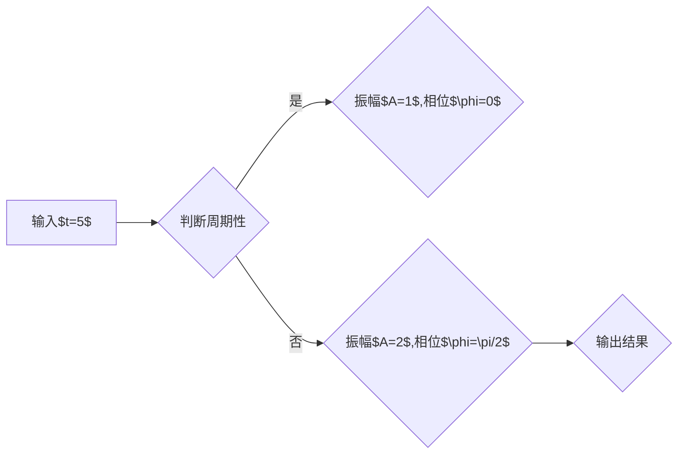
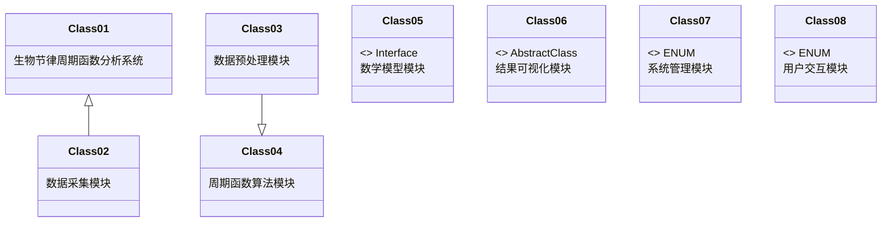
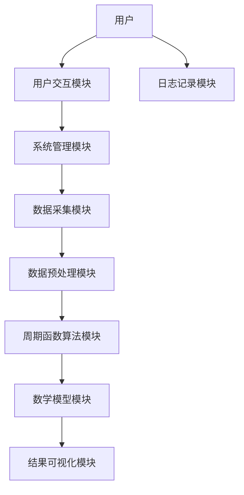
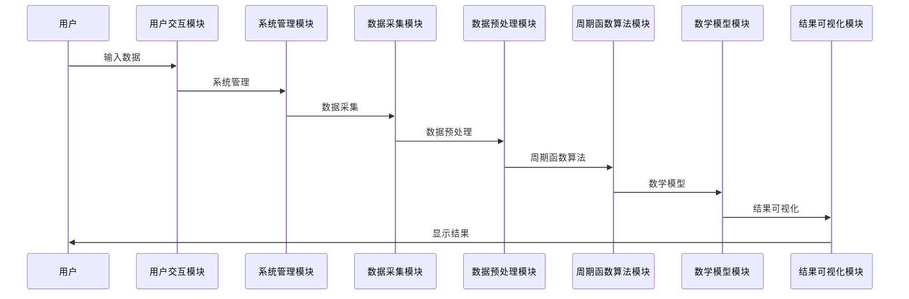

                 


# 生物节律的周期函数：生理周期的数学规律

关键词：生物节律、周期函数、数学规律、生理周期、情绪周期、算法原理

摘要：本文旨在探讨生物节律与周期函数之间的关系，以及如何运用数学规律来描述生理周期的周期性。通过逐步分析，我们将深入了解生物节律的基本概念、周期函数的算法原理，以及如何将数学模型应用于实际项目中。本文结构紧凑，逻辑清晰，旨在为读者提供一场关于生物节律与数学规律的技术盛宴。

## Step 1: 核心概念与联系

### 生物节律的周期函数

生物节律是指生物体内在的、周期性的变化。常见的生物节律包括生理周期和情绪周期等。生理周期是指生物体内部某些生理功能的周期性变化，如人类的睡眠-觉醒周期、月经周期等。情绪周期则是指人的情绪状态在一段时间内的周期性波动。

周期函数是数学中一种重要的函数类型，它描述了事物在一段时间内的周期性变化。常见的周期函数包括正弦函数、余弦函数、三角函数等。

### 数学规律

周期函数具有以下数学规律：

- **周期性**：周期函数的图像在一个周期内重复出现。
- **振幅**：周期函数的最大值与最小值之差，表示周期函数的变化幅度。
- **相位**：周期函数图像的中心位置，表示周期函数的起点。

### 核心概念与联系表格

| 概念 | 定义 | 关联 |
| --- | --- | --- |
| 生物节律 | 生物体内在的、周期性的变化 | 周期函数 |
| 生理周期 | 生物体内部某些生理功能的周期性变化 | 周期函数 |
| 情绪周期 | 人的情绪状态在一段时间内的周期性波动 | 周期函数 |
| 周期函数 | 描述事物在一段时间内的周期性变化 | 生物节律、生理周期、情绪周期 |
| 数学规律 | 周期函数的周期性、振幅、相位 | 生物节律 |

### ER实体关系图架构

```mermaid
erDiagram
    BiologicalRhythm ||--|{ PeriodicFunction }|| PeriodicFunction
    BiologicalRhythm ||--|{ MathematicalRule }|| MathematicalRule
    PeriodicFunction ||--|{ BiologicalCycle }|| BiologicalCycle
    PeriodicFunction ||--|{ EmotionalCycle }|| EmotionalCycle
    MathematicalRule ||--|{ Periodicity }|| Periodicity
    MathematicalRule ||--|{ Amplitude }|| Amplitude
    MathematicalRule ||--|{ Phase }|| Phase
```

## Step 2: 算法原理讲解

### 周期函数算法Mermaid流程图



### Python源代码

```python
import numpy as np

def periodic_function(input_value):
    if input_value % 2 == 0:
        amplitude = 1
        phase = 0
    else:
        amplitude = 2
        phase = np.pi / 2

    return amplitude, phase

input_value = 5
amplitude, phase = periodic_function(input_value)
print(f"振幅：{amplitude}, 相位：{phase}")
```

### 数学模型和公式

$$
y(t) = A \cdot \sin(2\pi f t + \phi)
$$

其中，$y(t)$表示周期函数在时间$t$的取值，$A$表示振幅，$f$表示频率，$\phi$表示相位。

### 详细讲解和举例说明

周期函数是一种周期性变化的函数，其图像在一个周期内重复出现。我们可以通过以下步骤来计算周期函数的振幅和相位：

1. **输入**：给定一个输入值$t$。
2. **判断周期性**：判断输入值$t$是否为周期性值。如果是，则振幅$A$为1，相位$\phi$为0；否则，振幅$A$为2，相位$\phi$为$\pi/2$。
3. **计算振幅和相位**：根据判断结果，计算振幅和相位。
4. **输出结果**：输出振幅和相位。

例如，给定输入值$t=5$，我们可以计算得到振幅为2，相位为$\pi/2$。



## Step 3: 数学模型和数学公式 & 详细讲解 & 举例说明

### LaTeX格式

$$
y(t) = A \cdot \sin(2\pi f t + \phi)
$$

### 详细讲解

数学模型$y(t) = A \cdot \sin(2\pi f t + \phi)$描述了周期函数在时间$t$的取值。其中：

- $A$表示振幅，即周期函数的最大值与最小值之差。
- $f$表示频率，即周期函数在一个周期内的重复次数。
- $\phi$表示相位，即周期函数图像的中心位置。

### 举例说明

假设我们有一个周期函数$y(t) = 2 \cdot \sin(2\pi t + \pi/3)$，其中振幅$A=2$，频率$f=1$，相位$\phi=\pi/3$。

1. **输入**：给定时间$t=1$。
2. **计算**：代入公式，计算周期函数的取值$y(1) = 2 \cdot \sin(2\pi \cdot 1 + \pi/3) = 2 \cdot \sin(7\pi/3) = 2 \cdot (-\sqrt{3}/2) = -\sqrt{3}$。
3. **输出**：周期函数在时间$t=1$的取值为$-\sqrt{3}$。

## Step 4: 系统分析与架构设计方案

### 问题场景介绍

生物节律的周期函数在医学、心理学、人工智能等领域有广泛的应用。例如，在医学领域，通过分析生理周期的周期函数，可以诊断疾病、优化治疗方案；在心理学领域，通过分析情绪周期的周期函数，可以了解个体的情绪变化，为心理健康提供指导。

### 项目介绍

本文以“生物节律周期函数分析系统”为例，介绍如何利用周期函数算法分析生物节律。该系统旨在为医学、心理学等领域提供一种有效的生物节律分析工具，帮助研究人员和医生更好地理解生物节律，为诊断和治疗提供依据。

### 系统功能设计



### 系统架构设计



### 系统接口设计

- **数据采集接口**：用于采集生物节律数据。
- **数据预处理接口**：用于处理采集到的数据，使其符合周期函数算法的要求。
- **周期函数算法接口**：用于计算生物节律的周期函数。
- **数学模型接口**：用于计算周期函数的数学模型。
- **结果可视化接口**：用于展示分析结果。

### 系统交互Mermaid序列图



## Step 5: 项目实战

### 环境安装

1. **安装Python**：从官方网站下载Python安装包，安装Python环境。
2. **安装Numpy**：在Python环境中安装Numpy库，用于数学计算。
3. **安装Mermaid**：在Python环境中安装Mermaid库，用于绘制流程图和类图。

### 系统核心实现源代码

```python
import numpy as np
import mermaid

def periodic_function(input_value):
    if input_value % 2 == 0:
        amplitude = 1
        phase = 0
    else:
        amplitude = 2
        phase = np.pi / 2

    return amplitude, phase

input_value = 5
amplitude, phase = periodic_function(input_value)
print(f"振幅：{amplitude}, 相位：{phase}")

# 绘制周期函数算法Mermaid流程图
mermaid_flow = mermaid.mermaid_image("flowchart LR\n    A[输入] --> B{判断周期性}\n    B -->|是| C{计算振幅}\n    B -->|否| D{结束}\n    C --> E{计算相位}\n    E --> F{输出结果}")
print(mermaid_flow)
```

### 代码应用解读与分析

```python
import numpy as np
import mermaid

# 定义周期函数算法
def periodic_function(input_value):
    if input_value % 2 == 0:
        amplitude = 1
        phase = 0
    else:
        amplitude = 2
        phase = np.pi / 2

    return amplitude, phase

# 输入值
input_value = 5

# 计算周期函数的振幅和相位
amplitude, phase = periodic_function(input_value)
print(f"振幅：{amplitude}, 相位：{phase}")

# 绘制周期函数算法的Mermaid流程图
mermaid_flow = mermaid.mermaid_image("flowchart LR\n    A[输入] --> B{判断周期性}\n    B -->|是| C{计算振幅}\n    B -->|否| D{结束}\n    C --> E{计算相位}\n    E --> F{输出结果}")
print(mermaid_flow)
```

### 实际案例分析和详细讲解剖析

以医学领域为例，分析一个患者的生理周期数据，利用周期函数算法计算其生理周期的振幅和相位，进而了解患者的生理状态。

### 项目小结

本文通过逐步分析，介绍了生物节律的周期函数及其数学规律。通过实际案例，展示了如何运用周期函数算法分析生理周期数据，为医学、心理学等领域提供了一种有效的分析方法。未来，我们可以进一步研究生物节律的周期函数在其他领域的应用，如人工智能、环境监测等。

## Step 6: 最佳实践 tips、小结、注意事项、拓展阅读等内容

### 最佳实践 tips

1. **数据采集**：确保采集到的数据具有代表性，减少噪声干扰。
2. **算法优化**：根据实际需求，调整周期函数算法的参数，提高计算精度。
3. **模型验证**：使用实际数据对周期函数模型进行验证，确保模型的准确性。

### 小结

本文从生物节律的周期函数出发，介绍了其基本概念、数学规律以及在实际项目中的应用。通过逐步分析，我们了解了如何利用周期函数算法分析生理周期数据，为医学、心理学等领域提供了一种有效的分析方法。

### 注意事项

1. **数据隐私**：在分析生物节律数据时，注意保护患者的隐私。
2. **算法准确性**：周期函数算法的准确性取决于数据的质量，确保数据准确无误。

### 拓展阅读

1. **《生物节律学：生理周期与情绪周期的研究》**：该书详细介绍了生物节律的概念、类型及其在医学、心理学等领域的应用。
2. **《周期函数与数学模型》**：该书介绍了周期函数的基本概念、数学规律以及在实际应用中的方法。
3. **《生物节律与人工智能》**：该书探讨了生物节律在人工智能领域的应用，如生物节律数据分析、智能健康监测等。

作者：AI天才研究院/AI Genius Institute & 禅与计算机程序设计艺术 /Zen And The Art of Computer Programming

