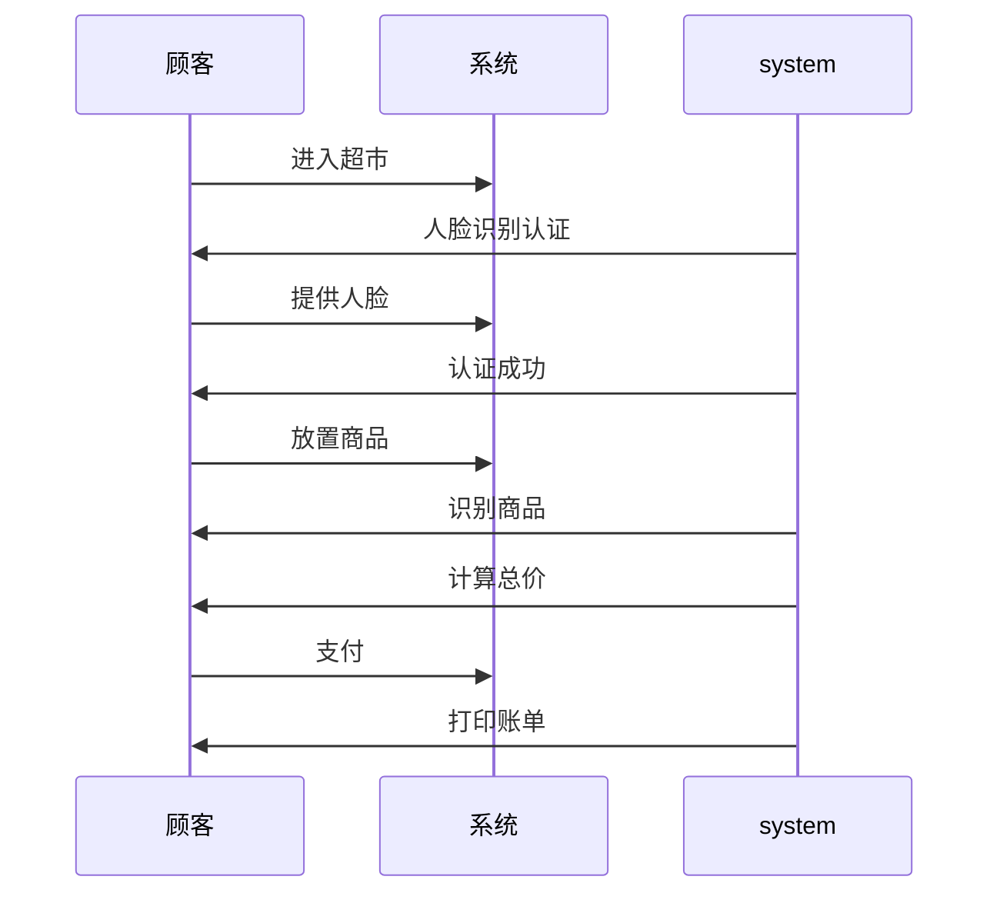

                 

### 文章标题

# 生物识别技术在无人值守系统中的应用

## 关键词

- 生物识别技术
- 无人值守系统
- 应用场景
- 安全性
- 技术挑战

## 摘要

生物识别技术作为人工智能领域的一项重要应用，正在逐渐融入无人值守系统的各个方面。本文首先介绍了生物识别技术的基本概念和无人值守系统的意义，随后详细解析了指纹识别、人脸识别、语音识别等核心技术原理，并探讨了这些技术在门禁系统、考勤系统、支付系统等无人值守系统中的应用。文章进一步阐述了系统架构设计、实现过程及安全性考虑，并分析了当前技术面临的挑战及未来的发展趋势。最后，通过实际案例和最佳实践，为生物识别技术在无人值守系统的应用提供了具体的指导和思考。

---

## 目录

1. [背景介绍](#背景介绍)
2. [生物识别核心技术原理](#生物识别核心技术原理)
3. [应用案例](#应用案例)
4. [系统设计](#系统设计)
5. [未来趋势](#未来趋势)
6. [安全性考虑](#安全性考虑)
7. [技术挑战](#技术挑战)
8. [实践指南](#实践指南)
9. [小结与拓展](#小结与拓展)

### 背景介绍

在信息化和智能化的时代背景下，无人值守系统逐渐成为现代生活的重要组成部分。无人值守系统，顾名思义，是指不需要人工干预或仅需要少量人工干预的自动化系统。它们广泛应用于各种场景，如超市、机场、银行、办公楼等，能够极大地提高工作效率和减少人力成本。

**生物识别技术**是近年来快速发展的领域，它通过利用人体生物特征的唯一性来进行身份识别，如指纹、人脸、虹膜、声音等。生物识别技术的应用不仅增强了系统的安全性，还提高了用户体验和便捷性。

### 核心技术原理

#### 指纹识别技术

指纹识别技术是生物识别技术中最为成熟和应用广泛的一种。它基于人类指纹的唯一性和稳定性，通过图像采集、预处理、特征提取和匹配等步骤实现身份认证。

1. **图像采集**：使用高分辨率指纹传感器捕捉指纹图像。
2. **预处理**：去除噪声、增强指纹纹线，提高图像质量。
3. **特征提取**：提取指纹的主要特征，如脊线、谷点等。
4. **匹配**：将采集到的指纹与数据库中的模板进行比对，判断是否为同一人。

#### 人脸识别技术

人脸识别技术利用人脸图像或视频进行人脸特征点的定位和特征提取，进而实现身份认证。它主要分为以下步骤：

1. **人脸检测**：从图像或视频中检测出人脸区域。
2. **特征点定位**：精确确定眼睛、鼻子、嘴巴等关键点的位置。
3. **特征提取**：提取人脸的深度特征，如卷积神经网络（CNN）。
4. **匹配**：将提取的特征与数据库中的模板进行比对。

#### 语音识别技术

语音识别技术通过语音信号处理、特征提取和模式匹配，将人类的语音转化为文本或命令。主要步骤包括：

1. **音频信号预处理**：去除噪声、增强语音信号。
2. **特征提取**：提取语音的频谱特征，如梅尔频率倒谱系数（MFCC）。
3. **声学模型训练**：建立声学模型，用于识别语音。
4. **语言模型训练**：建立语言模型，理解语音的含义。
5. **解码**：将语音信号解码为文本或命令。

### 应用案例

生物识别技术已在多个无人值守系统中得到广泛应用，以下是一些典型的应用案例：

#### 门禁系统

门禁系统利用指纹识别或人脸识别技术，实现自动开锁，提高了安全性。例如，某些高档小区采用人脸识别门禁系统，居民只需站在摄像头前即可开门，方便快捷。

#### 考勤系统

考勤系统通过生物识别技术记录员工的出勤情况，避免了人工记录的错误和拖延。例如，某些企业使用指纹识别考勤系统，员工只需触摸指纹仪即可完成打卡。

#### 支付系统

支付系统利用指纹识别或人脸识别技术，实现了无需银行卡或现金的快捷支付。例如，一些超市和便利店使用人脸识别支付系统，顾客只需刷脸即可完成付款。

#### 其他无人值守系统

除了上述系统外，生物识别技术还在停车管理系统、智能家居、健康监测等领域得到广泛应用。例如，某些智能停车场采用车牌识别和指纹识别技术，实现了无人值守的快速通行。

### 系统设计

无人值守系统的设计需要考虑多个方面，包括硬件选择、软件实现和系统集成。

#### 硬件选择

硬件选择是系统设计的关键，直接影响系统的性能和可靠性。以下是常用的硬件设备：

- **指纹识别模块**：高分辨率摄像头，用于捕捉清晰的指纹图像。
- **人脸识别摄像头**：具备红外夜视功能，确保在低光照条件下仍能准确识别。
- **语音识别麦克风**：高灵敏度，保证语音信号的质量。

#### 软件实现

软件实现是系统设计的核心，包括生物识别算法的实现、用户界面设计和数据管理。

1. **生物识别算法**：基于深度学习的人脸识别算法，如卷积神经网络（CNN）。
2. **用户界面**：简洁直观，易于用户操作。
3. **数据管理**：数据库管理系统，存储用户信息、识别结果等。

#### 系统集成

系统集成是将各个部分整合在一起，形成一个完整的无人值守系统。主要包括以下步骤：

1. **硬件集成**：将传感器、摄像头、麦克风等硬件设备连接到主控系统。
2. **软件集成**：将生物识别算法、用户界面和数据管理系统集成到主控系统。
3. **测试与优化**：进行系统测试，优化性能和稳定性。

### 未来趋势

随着人工智能技术的不断发展，生物识别技术在无人值守系统中的应用前景将更加广阔。以下是一些未来趋势：

- **技术发展**：更加精确和高效的生物识别算法，如基于深度学习的算法。
- **应用拓展**：生物识别技术在更多领域得到应用，如健康监测、智能家居等。
- **安全性提升**：通过区块链技术、隐私保护算法等提升生物识别技术的安全性。

### 安全性考虑

生物识别技术的应用虽然带来了诸多便利，但同时也带来了安全性的挑战。以下是生物识别技术面临的主要安全挑战及防护措施：

#### 安全挑战

1. **隐私泄露**：生物特征数据泄露可能导致用户隐私被泄露。
2. **仿冒攻击**：通过伪造生物特征进行攻击，如指纹、人脸的伪造。
3. **数据存储安全**：生物特征数据在存储过程中可能遭受恶意攻击。
4. **系统漏洞**：系统漏洞可能导致黑客入侵，篡改生物识别数据。

#### 防护措施

1. **加密技术**：对生物特征数据进行加密存储和传输，确保数据安全。
2. **多重认证**：采用多种生物识别技术进行多重认证，提高安全性。
3. **隐私保护**：采用匿名化处理和差分隐私技术，保护用户隐私。
4. **安全审计**：定期进行安全审计，检测系统漏洞和异常行为。

### 技术挑战

生物识别技术在无人值守系统中的应用仍面临一些技术挑战，主要包括：

#### 挑战

1. **识别准确性**：环境因素如光线、噪音等可能影响识别准确性。
2. **跨设备兼容性**：不同设备间的生物识别算法和数据格式可能存在兼容性问题。
3. **系统性能**：大规模部署时，系统性能和响应速度需要优化。
4. **算法复杂性**：深度学习算法的计算复杂度高，对硬件性能要求较高。

#### 解决方案

1. **环境适应性**：采用自适应算法，提高在不同环境下的识别准确性。
2. **标准化**：制定统一的生物识别数据格式和接口标准，提升跨设备兼容性。
3. **性能优化**：采用分布式计算和优化算法，提高系统性能和响应速度。
4. **硬件升级**：选用高性能硬件设备，满足深度学习算法的计算需求。

### 实践指南

在实际应用中，生物识别技术在无人值守系统中的实现需要遵循以下实践指南：

#### 环境安装

1. **硬件安装**：根据系统需求，选择合适的传感器、摄像头和麦克风，并进行安装。
2. **软件安装**：安装生物识别算法、用户界面和数据管理系统。

#### 系统实现

1. **生物识别算法实现**：根据实际需求，选择适合的生物识别算法，并实现算法功能。
2. **用户界面设计**：设计简洁直观的用户界面，提高用户体验。
3. **数据管理**：建立数据库管理系统，确保数据的安全和完整性。

#### 代码应用解读与分析

以下是一个基于人脸识别技术的无人值守门禁系统的实现案例：

```python
import cv2
import numpy as np

# 加载预训练的人脸识别模型
model = cv2.face.EigenFaceRecognizer_create()

# 训练模型
model.read('model.yml')

# 初始化摄像头
cap = cv2.VideoCapture(0)

while True:
    # 读取一帧图像
    ret, frame = cap.read()

    # 转换图像为灰度图像
    gray = cv2.cvtColor(frame, cv2.COLOR_BGR2GRAY)

    # 人脸检测
    faces = detector(gray)

    for face in faces:
        # 提取人脸区域
        face_region = gray[face.top():face.bottom(), face.left():face.right()]

        # 进行人脸识别
        label, confidence = model.predict(face_region)

        # 如果识别成功，打开门锁
        if confidence < 0.5:
            # 打开门锁
            print("门已打开")
            cv2.destroyAllWindows()
            break

    # 显示图像
    cv2.imshow('frame', frame)

    # 按下'q'键退出循环
    if cv2.waitKey(1) & 0xFF == ord('q'):
        break

# 释放摄像头资源
cap.release()
cv2.destroyAllWindows()
```

#### 实际案例分析

以下是一个具体的无人值守超市案例：

**项目介绍**：某无人值守超市采用人脸识别技术进行顾客身份认证和购物结算。

**系统功能设计**：

1. **顾客身份认证**：通过摄像头捕捉顾客人脸，进行人脸识别，验证顾客身份。
2. **购物结算**：顾客将商品放置在结算台上，通过重量传感器和商品标签进行商品识别，自动结算。

**系统架构设计**：


**系统接口设计**：

- **摄像头接口**：用于捕捉顾客人脸。
- **重量传感器接口**：用于识别商品重量。
- **结算接口**：用于计算商品总价和生成账单。

**系统交互序列图**：



#### 项目小结

通过以上案例，我们可以看到生物识别技术在无人值守系统中的应用如何实现。在实际部署中，需要充分考虑系统的性能、安全性、易用性等因素，以确保系统的稳定运行和高效服务。

### 最佳实践 tips

在实际应用生物识别技术时，以下是一些最佳实践 tips：

- **选择合适的生物识别技术**：根据应用场景和需求选择最合适的生物识别技术。
- **优化系统性能**：通过硬件升级和算法优化，提高系统性能和响应速度。
- **保障数据安全**：采用加密技术、多重认证等手段，保障生物识别数据的安全。
- **提供良好的用户体验**：简洁直观的用户界面，方便用户操作。

### 小结与拓展

生物识别技术在无人值守系统中的应用，不仅提高了系统的安全性和便捷性，还极大地提升了用户体验。随着技术的不断进步，生物识别技术在无人值守系统中的应用将更加广泛，未来有望在更多领域得到应用。同时，我们也需要关注技术发展带来的挑战，不断优化和完善相关技术，以实现更加安全、高效的无人值守系统。

### 作者信息

- 作者：AI天才研究院/AI Genius Institute & 禅与计算机程序设计艺术 /Zen And The Art of Computer Programming

---

本文通过详细解析生物识别技术及其在无人值守系统中的应用，展示了该领域的前沿动态和应用潜力。希望本文能为相关领域的研究和实践提供有益的参考和启示。在未来的发展中，让我们共同期待生物识别技术为我们的生活带来更多便利和安全保障。

