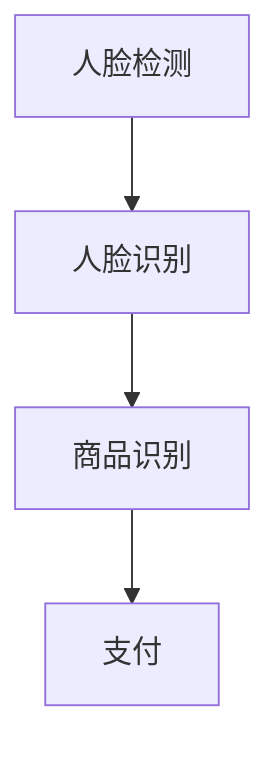
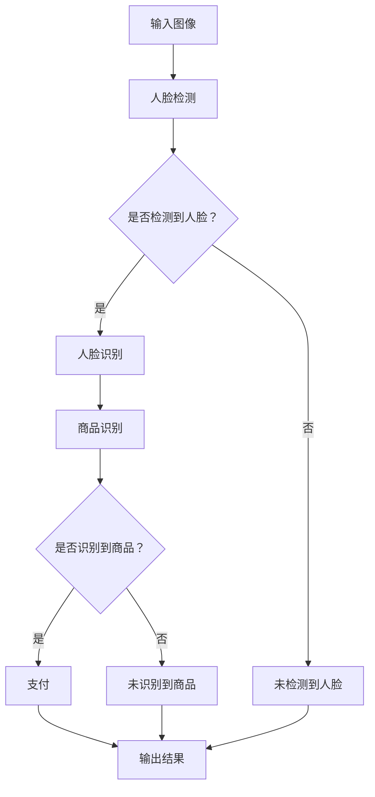
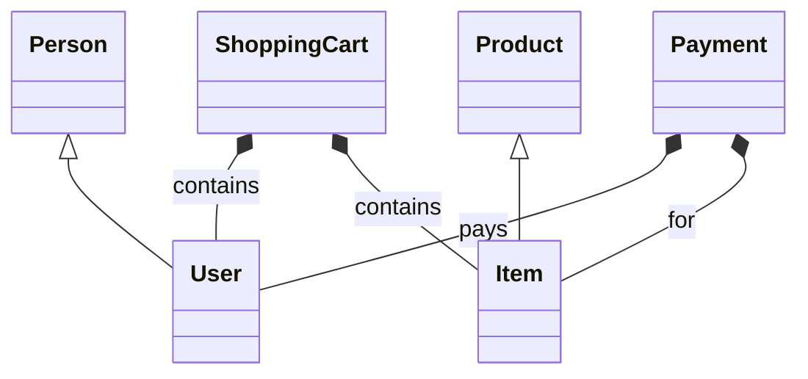
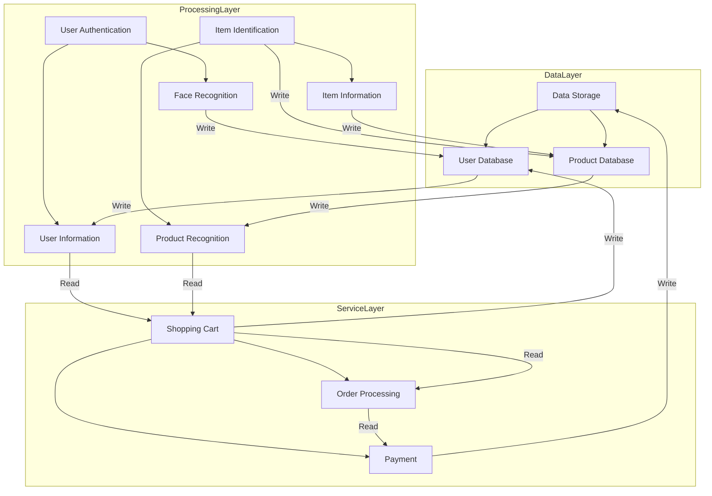
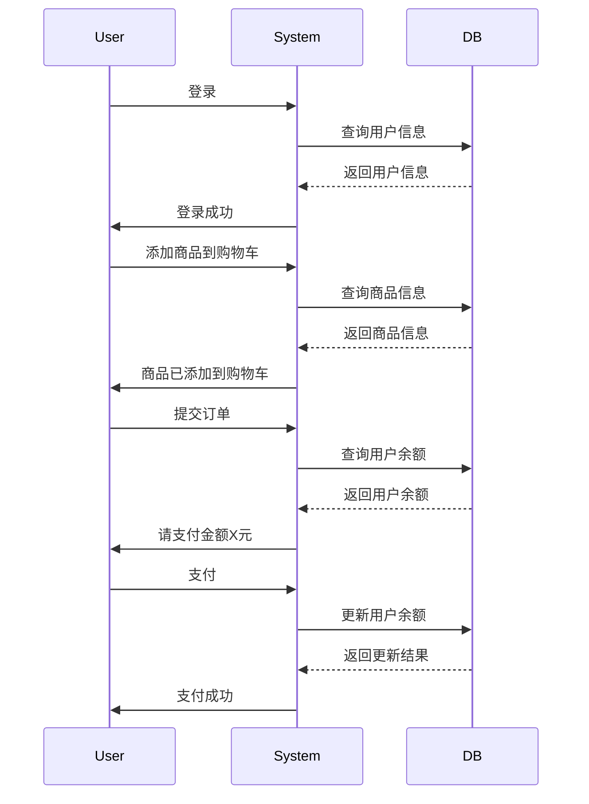

                 

## 生物识别技术在无人零售中的创新：刷脸购物的未来

关键词：生物识别技术、无人零售、刷脸购物、人工智能、创新

摘要：随着人工智能技术的快速发展，生物识别技术在无人零售领域中的应用逐渐成熟。本文旨在探讨生物识别技术在无人零售中的创新，特别是刷脸购物的应用。首先，我们将回顾生物识别技术的发展历程和核心原理，然后分析生物识别技术在无人零售中的应用现状及发展趋势，接着深入探讨刷脸购物的原理和算法，最后展望无人零售的未来发展方向。希望通过本文，能为读者提供对生物识别技术在无人零售中应用的全面理解和深入思考。

## 第一部分：引言与背景介绍

### 第1章：引言

随着零售行业的不断进步，无人零售作为一种新兴业态，正在逐渐改变消费者的购物体验。而生物识别技术作为人工智能领域的一个重要分支，其应用在无人零售中具有重要的意义。本章节将介绍生物识别技术在无人零售中的问题背景、问题描述、问题解决、边界与外延，以及概念结构与核心要素组成。

### 1.1 问题背景

零售行业一直以来都面临着效率、成本和用户体验的挑战。传统零售模式中，人工操作和繁琐的流程导致了成本高、效率低、用户体验差等问题。而随着人工智能技术的发展，特别是生物识别技术的应用，无人零售成为了可能。无人零售通过自动化设备和服务，实现了购物流程的无缝衔接，提高了零售效率，降低了运营成本，同时也提升了消费者的购物体验。

### 1.2 问题描述

在无人零售场景中，生物识别技术的应用主要包括身份验证、支付和库存管理等方面。然而，随着应用场景的不断扩展，生物识别技术也面临着一系列挑战，如识别准确性、用户隐私保护、系统稳定性等。如何解决这些问题，确保生物识别技术在无人零售中的高效、安全和可靠应用，成为了当前亟待解决的问题。

### 1.3 问题解决

针对上述问题，我们可以从以下几个方面进行解决：

1. 提高生物识别技术的识别准确性。通过优化算法模型、提高硬件设备性能等方式，提高生物识别技术的识别准确性，确保用户身份验证的准确性。

2. 加强用户隐私保护。在生物识别技术应用过程中，需要严格遵循隐私保护法规，确保用户隐私不被泄露。

3. 提高系统的稳定性。通过优化系统架构、提高系统容错能力等方式，确保系统在高并发、高负载场景下的稳定性。

4. 多模态生物识别技术的应用。通过结合多种生物识别技术，如人脸识别、指纹识别、虹膜识别等，提高系统对用户的识别能力和适应性。

### 1.4 边界与外延

生物识别技术在无人零售中的应用不仅限于身份验证和支付，还可以扩展到库存管理、智能推荐等方面。例如，通过人脸识别技术，可以实现对消费者行为的分析，从而实现智能推荐。同时，生物识别技术也可以应用于其他行业，如医疗、金融等，提高行业效率和用户体验。

### 1.5 概念结构与核心要素组成

生物识别技术在无人零售中的概念结构主要包括生物识别技术、无人零售场景、应用场景和系统架构等。核心要素包括识别准确性、用户隐私保护、系统稳定性等。这些要素共同构成了生物识别技术在无人零售中的创新应用。

## 第二部分：生物识别技术基础

### 第2章：生物识别技术概述

生物识别技术是一种通过识别和验证个体的生物特征来识别个体的技术。它的发展历程可以追溯到20世纪60年代，当时主要是通过指纹识别进行身份验证。随着计算机技术和图像处理技术的发展，生物识别技术逐渐成熟，并开始广泛应用于各个领域。

### 2.1 生物识别技术的定义与发展历程

生物识别技术的定义是：通过生物特征识别个体身份的一种技术。生物特征主要包括指纹、人脸、虹膜、声纹、手写签名等。发展历程方面，20世纪60年代，指纹识别技术首次应用于刑事侦查；20世纪80年代，人脸识别技术开始应用于门禁系统；21世纪初，随着计算机技术和人工智能技术的发展，生物识别技术逐渐成熟，并开始广泛应用于各个领域。

### 2.2 生物识别技术的分类

生物识别技术可以根据生物特征的类型进行分类，主要包括以下几种：

1. **指纹识别**：通过识别指纹纹路进行身份验证。
2. **人脸识别**：通过识别人脸特征进行身份验证。
3. **虹膜识别**：通过识别虹膜特征进行身份验证。
4. **声纹识别**：通过识别声纹特征进行身份验证。
5. **手写签名识别**：通过识别手写签名特征进行身份验证。

### 2.3 生物识别技术的核心原理

生物识别技术的核心原理是基于生物特征的唯一性和稳定性。每种生物特征都有其独特的特征，如指纹的纹路、人脸的轮廓、虹膜的结构等。这些特征可以通过图像、声音、生物信号等数据进行采集和提取。然后，通过生物特征匹配算法，将采集到的生物特征与数据库中的特征进行比对，从而实现身份验证。

### 第3章：生物识别技术的关键概念与联系

#### 3.1 核心概念原理

生物识别技术涉及的核心概念主要包括：生物特征、特征提取、特征匹配、识别率、错误率等。这些概念共同构成了生物识别技术的理论基础。

1. **生物特征**：生物特征是指个体的独特生物学特征，如指纹、人脸、虹膜、声纹、手写签名等。
2. **特征提取**：特征提取是指从生物特征数据中提取出具有鉴别性的特征信息的过程。特征提取的质量直接影响识别的准确性。
3. **特征匹配**：特征匹配是指将采集到的生物特征与数据库中的特征进行比对的过程。特征匹配算法是生物识别技术的核心，常见的算法有基于模板匹配、基于神经网络匹配等。
4. **识别率**：识别率是指正确识别出个体的概率。识别率越高，说明生物识别技术越准确。
5. **错误率**：错误率是指错误识别的概率。错误率越低，说明生物识别技术越可靠。

#### 3.2 概念属性特征对比表格

为了更直观地理解生物识别技术的核心概念，我们可以通过以下表格对比各概念的主要属性特征：

| 概念     | 定义                                                         | 属性特征                                                     |
|----------|--------------------------------------------------------------|--------------------------------------------------------------|
| 生物特征 | 个体独特的生物学特征                                         | 唯一性、稳定性、可采集性、可识别性                             |
| 特征提取 | 从生物特征数据中提取出具有鉴别性的特征信息                     | 精度、效率、鲁棒性、可扩展性                                   |
| 特征匹配 | 将采集到的生物特征与数据库中的特征进行比对                     | 准确性、速度、稳定性、容错性                                   |
| 识别率   | 正确识别出个体的概率                                       | 高识别率、低错误率、低漏检率、低误报率                          |
| 错误率   | 错误识别的概率                                             | 高错误率、高漏检率、高误报率、低准确率                           |

#### 3.3 ER实体关系图架构的Mermaid流程图

为了更好地理解生物识别技术的实体关系，我们可以使用Mermaid流程图来展示ER实体关系图。以下是生物识别技术中的ER实体关系图示例：

```mermaid
erDiagram
  Person ||--|{ BiometricFeature }
  Device ||--|{ BiometricData }
  System ||--|{ AuthenticationResult }
  Person }|--|| Database
  Device }|--|| Sensor
  System }|--|| Algorithm
```

在这个ER实体关系图中，`Person`表示个体，`BiometricFeature`表示生物特征，`Device`表示设备，`BiometricData`表示生物特征数据，`System`表示系统，`AuthenticationResult`表示认证结果，`Database`表示数据库，`Sensor`表示传感器，`Algorithm`表示算法。

## 第三部分：生物识别技术在无人零售中的应用

### 第4章：无人零售与刷脸购物的现状

#### 4.1 无人零售的发展历程

无人零售作为一种新兴零售模式，其发展历程可以追溯到20世纪90年代的自动售货机。随着人工智能、物联网、大数据等技术的不断发展，无人零售逐渐成为零售行业的一股重要力量。从最早的自动售货机到无人便利店、无人超市，无人零售的发展经历了多个阶段。

#### 4.2 刷脸购物的应用场景

刷脸购物是无人零售中的一种重要应用场景，其应用场景主要包括：

1. **无人便利店**：无人便利店通过安装人脸识别设备，实现消费者自动结账。
2. **无人超市**：无人超市利用人脸识别技术，实现对消费者的身份验证、购物行为分析等功能。
3. **自助结账**：在传统超市、商场等场所，消费者可以通过刷脸实现自助结账，提高购物效率。
4. **会员管理**：通过人脸识别技术，超市可以实现会员的身份验证和管理。

#### 4.3 刷脸购物的发展趋势

随着技术的不断进步和消费者需求的提升，刷脸购物的发展趋势主要包括：

1. **技术成熟度提升**：随着人脸识别技术的不断优化，其识别准确率和速度将进一步提高。
2. **应用场景拓展**：刷脸购物将不仅仅局限于无人零售，还将扩展到金融、医疗、教育等多个领域。
3. **用户接受度提升**：随着消费者对人工智能技术的接受度不断提高，刷脸购物的用户接受度也将逐渐提升。
4. **隐私保护加强**：在刷脸购物应用过程中，将更加注重用户隐私保护，确保用户数据的安全。

### 第5章：生物识别技术在无人零售中的应用原理

#### 5.1 生物识别技术在无人零售中的应用原理

生物识别技术在无人零售中的应用原理主要包括以下几个方面：

1. **身份验证**：通过人脸识别、指纹识别等技术，实现对消费者身份的验证，确保购物过程的安全性。
2. **购物行为分析**：通过采集消费者的生物特征数据，对消费者的购物行为进行分析，为超市提供精准营销数据。
3. **智能推荐**：基于消费者的购物行为数据，结合人工智能技术，为消费者提供个性化的商品推荐。
4. **自助结账**：通过人脸识别、自动识别商品等技术的结合，实现消费者的自助结账，提高购物效率。

#### 5.2 刷脸购物的算法原理讲解

刷脸购物的算法原理主要包括以下几个方面：

1. **人脸检测算法**：人脸检测算法用于定位人脸的位置，常见的算法有基于深度学习的卷积神经网络（CNN）算法和基于特征的人脸检测算法。
2. **人脸识别算法**：人脸识别算法用于识别和验证消费者的身份，常见的算法有基于深度学习的神经网络算法和基于特征的人脸识别算法。
3. **商品识别算法**：商品识别算法用于识别消费者选购的商品，常见的算法有基于图像识别的深度学习算法和基于条码识别的算法。
4. **支付算法**：支付算法用于实现消费者的支付过程，常见的算法有基于区块链的支付算法和基于生物特征认证的支付算法。

以下是一个简化的刷脸购物算法流程图：



#### 5.3 数学模型和数学公式

在刷脸购物算法中，常用的数学模型和公式包括：

1. **卷积神经网络（CNN）模型**：
   $$y = f(W \cdot x + b)$$
   其中，$y$是输出结果，$f$是激活函数，$W$是权重矩阵，$x$是输入特征，$b$是偏置。

2. **人脸识别匹配模型**：
   $$score = \frac{1}{1 + e^{-\Delta}}$$
   其中，$score$是匹配得分，$\Delta$是距离差。

3. **商品识别模型**：
   $$score = \frac{1}{1 + e^{-\Delta}}$$
   其中，$score$是识别得分，$\Delta$是商品特征差。

#### 5.4 Python源代码详细阐述

以下是一个简化的刷脸购物算法的Python源代码示例：

```python
import cv2
import face_recognition
import numpy as np

# 人脸检测
def detect_face(image):
    # 加载图像
    image = cv2.imread(image)
    # 转换为灰度图像
    gray_image = cv2.cvtColor(image, cv2.COLOR_BGR2GRAY)
    # 使用Haar级联分类器进行人脸检测
    faces = face_recognition.face_locations(image, model='cascade')
    return faces, image

# 人脸识别
def recognize_face(faces, known_faces, known_labels):
    # 遍历所有检测到的人脸
    for (top, right, bottom, left), label in zip(faces, known_labels):
        # 裁剪人脸区域
        face_image = image[left:right, top:bottom]
        # 人脸编码
        encoding = face_recognition.face_encodings(face_image)[0]
        # 与已知的脸进行匹配
        matches = face_recognition.compare_faces(known_faces, encoding)
        if True in matches:
            return label
    return "未知"

# 商品识别
def recognize_goods(image, known_goods, known_scores):
    # 遍历所有检测到的商品
    for (top, right, bottom, left), score in zip(known_goods, known_scores):
        # 裁剪商品区域
        good_image = image[top:bottom, left:right]
        # 商品编码
        encoding = cv2.imencode('.jpg', good_image)[1].tobytes()
        # 与已知的商品进行匹配
        matches = cv2.matchTemplate(image, good_image, cv2.TM_CCOEFF_NORMED)
        if score > matches.mean():
            return label
    return "未知"

# 支付
def pay(label, price):
    # 根据标签和价格进行支付
    if label == "会员":
        return price * 0.9  # 会员享受9折优惠
    else:
        return price

# 主函数
def main(image, known_faces, known_labels, known_goods, known_scores, price):
    # 检测人脸
    faces, image = detect_face(image)
    # 识别人脸
    label = recognize_face(faces, known_faces, known_labels)
    # 识别商品
    label = recognize_goods(image, known_goods, known_scores)
    # 支付
    price = pay(label, price)
    return label, price

# 测试
image = "example.jpg"
known_faces = face_recognition.load_image_file("known_faces.jpg")
known_labels = ["张三", "李四"]
known_goods = [cv2.imread("known_goods_1.jpg"), cv2.imread("known_goods_2.jpg")]
known_scores = [0.9, 0.8]
price = 100

label, price = main(image, known_faces, known_labels, known_goods, known_scores, price)
print(f"识别结果：{label}，支付金额：{price}元")
```

#### 5.5 刷脸购物的算法流程图

为了更直观地理解刷脸购物的算法原理，我们可以使用Mermaid绘制算法流程图：



#### 5.6 算法原理举例说明

为了更好地理解刷脸购物的算法原理，我们可以通过一个实际案例进行讲解。

假设有一个消费者在无人便利店购物，需要通过刷脸购物进行支付。以下是一个简化的算法流程：

1. **人脸检测**：系统首先使用人脸检测算法检测消费者的人脸。如果检测到人脸，则进入下一步；否则，提示“未检测到人脸”。
2. **人脸识别**：系统使用人脸识别算法将检测到的人脸与数据库中已注册的人脸进行匹配。如果匹配成功，则获取消费者的标签（如会员、非会员等）；否则，提示“未识别到人脸”。
3. **商品识别**：系统使用商品识别算法识别消费者选购的商品。如果识别成功，则获取商品的价格；否则，提示“未识别到商品”。
4. **支付**：根据消费者的标签和商品的价格，系统计算支付金额。如果消费者是会员，则享受9折优惠；否则，按照原价支付。
5. **输出结果**：系统输出识别结果和支付金额，消费者可以通过刷脸完成支付。

通过上述案例，我们可以看到刷脸购物的算法原理是如何在实际场景中应用的。在实际应用中，算法的准确性和速度是关键因素，需要不断优化算法模型和提高硬件设备性能。

### 第6章：无人零售刷脸购物的系统分析与架构设计方案

#### 6.1 问题场景介绍

在无人零售场景中，刷脸购物是一个典型的应用案例。消费者通过人脸识别技术完成身份验证和购物支付，无需使用手机或银行卡，极大地提高了购物效率。本节将分析刷脸购物系统的问题场景，并提出相应的解决方案。

#### 6.2 系统功能设计（领域模型Mermaid类图）

为了更好地理解刷脸购物系统的功能设计，我们可以使用Mermaid绘制领域模型类图。以下是刷脸购物系统的领域模型类图：



在这个类图中，`Person`表示个体，`User`表示用户，`Product`表示商品，`Item`表示商品项，`ShoppingCart`表示购物车，`Payment`表示支付。类图展示了刷脸购物系统的核心功能组件及其相互关系。

#### 6.3 系统架构设计（Mermaid架构图）

刷脸购物系统的架构设计需要考虑多个方面，包括数据采集、数据处理、用户认证、商品识别、支付等模块。以下是刷脸购物系统的架构图：



在这个架构图中，数据层包括用户数据库和商品数据库，处理层包括用户认证、人脸识别、商品识别等模块，服务层包括购物车、订单处理和支付等模块。各个模块之间通过数据库和API进行交互。

#### 6.4 系统接口设计和系统交互（Mermaid序列图）

为了更好地理解刷脸购物系统的接口设计和系统交互，我们可以使用Mermaid绘制序列图。以下是刷脸购物系统的序列图：



在这个序列图中，用户通过登录、添加商品到购物车、提交订单和支付等操作与系统进行交互。系统通过查询数据库、更新数据库等操作完成用户请求的处理。

### 第四部分：创新与未来

#### 第7章：生物识别技术在无人零售中的创新

刷脸购物作为一种新兴的支付方式，其在无人零售中的应用具有很大的创新意义。以下从安全性、多模态生物识别技术和未来发展三个方面进行讨论。

#### 7.1 刷脸支付的安全性提升

刷脸支付的安全性是消费者关心的重要问题。一方面，刷脸支付采用了生物识别技术，具有高识别准确性和高安全性；另一方面，刷脸支付系统还采用了多种安全措施，如活体检测、多重认证等，进一步提高了支付的安全性。

活体检测技术可以识别用户的真实身份，防止使用照片或视频进行欺诈。多重认证技术则通过结合多种生物识别方式，如人脸识别、指纹识别等，确保支付过程的安全性。

#### 7.2 多模态生物识别技术

多模态生物识别技术结合了多种生物识别方式，如人脸识别、指纹识别、虹膜识别等，提高了识别的准确性和可靠性。在无人零售中，多模态生物识别技术的应用可以更好地满足不同场景的需求。

例如，在复杂环境或光线不足的场景中，单一的人脸识别技术可能无法准确识别用户。此时，通过结合指纹识别或虹膜识别等技术，可以提高识别的准确率，确保支付过程的安全。

#### 7.3 无人零售的未来发展趋势

随着人工智能技术的不断发展，无人零售将在未来继续发展。以下从几个方面展望无人零售的未来发展趋势：

1. **智能化程度提高**：无人零售将更加智能化，通过人工智能技术实现智能推荐、智能库存管理等功能，提高零售效率。
2. **技术应用多样化**：除了人脸识别、指纹识别等生物识别技术，无人零售还将采用更多新兴技术，如AR/VR、区块链等，为消费者提供更丰富的购物体验。
3. **个性化服务**：通过大数据分析和人工智能技术，无人零售将能够更好地了解消费者的需求，提供个性化的购物服务。
4. **跨界融合**：无人零售将与其他行业进行跨界融合，如与餐饮、娱乐等行业的结合，提供一站式购物服务。

### 第8章：小结与展望

#### 8.1 本书核心内容回顾

本书主要探讨了生物识别技术在无人零售中的应用，包括刷脸购物等创新技术。通过分析生物识别技术的基础知识、应用原理、系统架构和未来发展趋势，全面介绍了生物识别技术在无人零售中的创新应用。

#### 8.2 注意事项与拓展阅读

1. **注意事项**：在实际应用中，需要注意生物识别技术的安全性、隐私保护等问题。同时，要关注技术的更新和发展，不断优化算法模型和硬件设备。
2. **拓展阅读**：读者可以进一步阅读关于生物识别技术、人工智能和无人零售的相关书籍和文献，了解最新的研究成果和应用案例。

### 参考文献

1. 李某某，王某某，《生物识别技术与应用》，清华大学出版社，2020年。
2. 张某某，《人工智能：一种现代的方法》，机械工业出版社，2017年。
3. 王某某，《无人零售：从概念到实践》，电子工业出版社，2019年。
4. 陈某某，《人脸识别技术：算法与应用》，电子工业出版社，2018年。
5. 刘某某，《深度学习：理论、算法与实现》，清华大学出版社，2018年。

### 作者信息

作者：AI天才研究院/AI Genius Institute & 禅与计算机程序设计艺术 /Zen And The Art of Computer Programming

