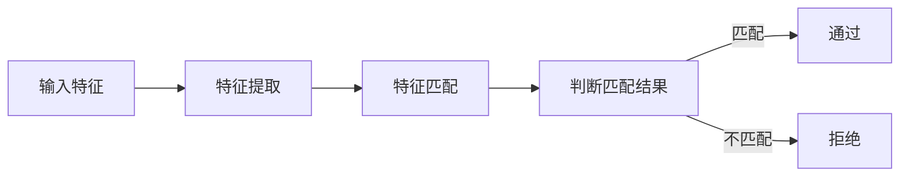
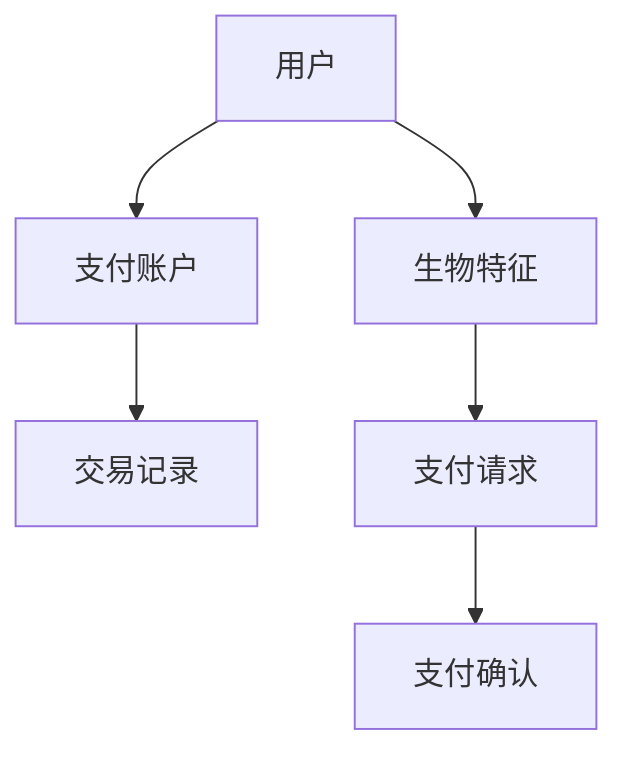

                 

# 生物识别技术在无接触支付中的应用

> 关键词：生物识别、无接触支付、技术应用、安全、便利

> 摘要：本文深入探讨了生物识别技术在无接触支付中的应用。通过分析无接触支付的需求与挑战，介绍了生物识别技术的原理与特性，讲解了其在无接触支付系统中的架构设计，并通过实际案例展示了生物识别技术在无接触支付中的实践效果。文章旨在为读者提供一份全面且深入的技术指南。

----------------------------------------------------------------

## 目录大纲

### 第一部分：背景介绍

#### 第1章：问题背景与生物识别技术概述

#### 第2章：无接触支付的技术发展与应用现状

#### 第3章：生物识别技术在无接触支付中的核心概念与联系

### 第二部分：核心概念与联系

#### 第4章：生物识别技术的原理与特性

#### 第5章：无接触支付系统的架构与设计

### 第三部分：算法原理讲解

#### 第6章：生物识别算法的数学模型与公式

#### 第7章：生物识别算法的实现与性能分析

### 第四部分：系统分析与架构设计方案

#### 第8章：无接触支付系统的功能设计与实现

#### 第9章：无接触支付系统的架构设计

### 第五部分：项目实战

#### 第10章：生物识别技术在无接触支付中的应用实例

#### 第11章：生物识别技术在无接触支付中的实践案例分析

### 第六部分：最佳实践与拓展

#### 第12章：生物识别技术在无接触支付中的最佳实践

#### 第13章：生物识别技术在无接触支付中的未来发展趋势

----------------------------------------------------------------

### 第1章：问题背景与生物识别技术概述

#### 1.1 问题背景

在现代社会，无接触支付已经成为一种越来越流行的支付方式。无论是智能手机的扫码支付、信用卡的近场通信（NFC）支付，还是基于生物识别技术的无接触支付，这些技术都在不断改变我们的支付习惯。然而，随着移动支付市场的快速发展，支付安全性和便利性成为了两大关键问题。

**支付安全性**：传统的支付方式往往依赖于密码、验证码或短信验证码，这些方式在一定程度上能够提高支付安全性，但同时也存在被破解的风险。因此，寻找更安全、更可靠的支付验证方式成为了业界关注的焦点。

**支付便利性**：随着生活节奏的加快，人们对于支付过程的要求越来越高，他们希望支付过程能够简单、快速、无障碍。无接触支付以其快捷、方便的特点，满足了人们对于支付便利性的需求。

#### 1.2 生物识别技术概述

生物识别技术是通过识别人体的生物特征来进行身份验证的一种技术。常见的生物识别技术包括指纹识别、面部识别、虹膜识别、声纹识别等。这些技术具有以下特点：

- **唯一性**：每个人的生物特征都是独一无二的，这使得生物识别技术具有极高的识别准确性。
- **稳定性**：生物特征通常不会因外界环境变化而改变，如指纹、面部等。
- **非侵人性**：大多数生物识别技术无需接触人体，如面部识别、声纹识别等。

#### 1.3 生物识别技术在无接触支付中的应用

生物识别技术在无接触支付中的应用主要体现在以下几个方面：

- **身份验证**：通过生物识别技术验证用户身份，确保支付过程的安全性。
- **支付确认**：用户完成生物特征识别后，即可确认支付，简化支付流程。
- **防欺诈**：通过生物识别技术，可以有效防止伪造身份或恶意攻击。

#### 1.4 边界与外延

无接触支付的适用场景主要是在公共场所、超市、餐厅等需要快速支付的场所。而生物识别技术的应用则不仅限于支付领域，还可以应用于门禁系统、医疗健康、安防监控等多个领域。

#### 1.5 概念结构与核心要素组成

- **无接触支付**：通过无线通信技术实现快速、安全、便捷的支付方式。
- **生物识别技术**：利用生物特征进行身份验证和支付确认的技术。
- **安全性**：无接触支付的核心问题，需要通过生物识别等技术手段来保障。
- **便利性**：无接触支付的目标，需要通过简化支付流程来实现。

### 第2章：无接触支付的技术发展与应用现状

#### 2.1 技术发展

无接触支付技术的诞生可以追溯到20世纪90年代，当时基于RFID（射频识别）和NFC（近场通信）技术的移动支付开始兴起。随着智能手机的普及和移动互联网的发展，无接触支付技术得到了快速应用和推广。

- **RFID技术**：利用射频信号识别并跟踪物品，可实现非接触式的物品识别和支付。
- **NFC技术**：基于RFID技术，可实现手机、卡片等设备之间的短距离通信，实现支付功能。
- **二维码支付**：通过扫描二维码进行支付，无需接触实体设备。

#### 2.2 应用现状

目前，无接触支付技术已经广泛应用于各个领域，成为人们日常生活中不可或缺的一部分。

- **消费领域**：超市、餐厅、便利店等公共场所普遍采用无接触支付，方便快捷。
- **金融领域**：银行、信用卡公司等金融机构积极推广无接触支付，提高支付安全性和便利性。
- **公共服务**：公共交通、医疗健康等公共服务领域也开始采用无接触支付，简化支付流程。

#### 2.3 技术优势

- **安全性**：无接触支付技术采用了加密技术，保障了支付过程的安全性。
- **便利性**：无需现金交易，减少了找零和排队等待的时间。
- **环保性**：减少了纸张的使用，有助于环保。

#### 2.4 技术挑战

- **隐私保护**：生物识别技术的应用可能涉及个人隐私问题，需要严格保护用户隐私。
- **设备依赖**：无接触支付需要特定的设备支持，如智能手机、NFC卡片等，增加了设备成本。
- **技术普及**：尽管无接触支付技术得到了广泛应用，但仍有部分地区和人群对其了解不足，需要进一步普及。

### 第3章：生物识别技术在无接触支付中的核心概念与联系

#### 3.1 生物识别技术原理

生物识别技术是通过识别人体的生物特征来进行身份验证的一种技术。常见的生物识别技术包括指纹识别、面部识别、虹膜识别、声纹识别等。这些技术的工作原理如下：

- **指纹识别**：通过扫描指纹图像，提取指纹特征，与数据库中的指纹数据进行匹配。
- **面部识别**：通过摄像头捕捉面部图像，利用面部特征进行身份验证。
- **虹膜识别**：通过扫描虹膜图像，提取虹膜特征，与数据库中的虹膜数据进行匹配。
- **声纹识别**：通过捕捉声音信号，提取声纹特征，与数据库中的声纹数据进行匹配。

#### 3.2 无接触支付定义与原理

无接触支付是一种通过无线通信技术实现快速、安全、便捷的支付方式。其定义和原理如下：

- **定义**：无接触支付是指用户无需直接接触支付设备（如POS机、刷卡器等），通过无线通信技术（如NFC、RFID等）实现支付。
- **原理**：用户在支付时，将手机或其他设备靠近POS机，设备之间通过无线信号交换支付信息，完成支付过程。

#### 3.3 生物识别技术与无接触支付的关系

生物识别技术与无接触支付有着密切的联系。生物识别技术可以作为无接触支付的一种安全认证手段，提高支付安全性。

- **身份验证**：通过生物识别技术验证用户身份，确保支付过程的安全性。
- **支付确认**：用户完成生物特征识别后，即可确认支付，简化支付流程。
- **防欺诈**：通过生物识别技术，可以有效防止伪造身份或恶意攻击。

#### 3.4 生物识别技术在无接触支付中的价值与作用

生物识别技术在无接触支付中的价值主要体现在以下几个方面：

- **提高支付安全性**：通过生物识别技术，可以有效防止恶意攻击和身份盗用，提高支付安全性。
- **简化支付流程**：用户无需输入密码或验证码，简化支付流程，提高支付便利性。
- **促进支付技术创新**：生物识别技术的引入，为无接触支付带来了新的技术方向和可能性，推动了支付技术的不断创新。

### 第4章：生物识别技术的原理与特性

#### 4.1 生物特征识别

生物特征识别是生物识别技术的核心组成部分，它通过识别人体的生物特征来进行身份验证。常见的生物特征包括指纹、面部、虹膜、声纹等。

- **指纹识别**：指纹是每个人独特的生物特征，通过扫描指纹图像，提取指纹特征，与数据库中的指纹数据进行匹配，实现身份验证。
- **面部识别**：面部识别通过摄像头捕捉面部图像，利用面部特征进行身份验证。
- **虹膜识别**：虹膜是眼睛中的一个环状结构，具有极高的独特性和稳定性，通过扫描虹膜图像，提取虹膜特征，与数据库中的虹膜数据进行匹配。
- **声纹识别**：声纹识别通过捕捉声音信号，提取声纹特征，与数据库中的声纹数据进行匹配。

#### 4.2 生物特征匹配算法

生物特征匹配算法是生物识别技术中的关键环节，它用于将采集到的生物特征与数据库中的特征进行匹配，以确定用户身份。

- **特征提取**：首先，对采集到的生物特征进行预处理，提取出具有代表性的特征点，如指纹的脊线、面部的五官点、虹膜的纹理点等。
- **特征匹配**：将提取出的特征点与数据库中的特征点进行对比，使用特定的匹配算法计算相似度，判断用户身份。

常见的生物特征匹配算法包括：

- **欧氏距离**：计算两个特征向量之间的欧氏距离，距离越小，相似度越高。
- **汉明距离**：计算两个二进制特征向量之间的汉明距离，汉明距离越小，相似度越高。
- **相关系数**：计算两个特征向量的相关系数，相关系数越大，相似度越高。

#### 4.3 生物特征识别的优势

生物特征识别具有以下优势：

- **唯一性**：每个人的生物特征都是独一无二的，这使得生物识别技术具有极高的识别准确性。
- **稳定性**：生物特征通常不会因外界环境变化而改变，如指纹、面部等。
- **非侵人性**：大多数生物识别技术无需接触人体，如面部识别、声纹识别等。

#### 4.4 生物特征识别的挑战

尽管生物特征识别具有许多优势，但在实际应用中仍面临一些挑战：

- **隐私保护**：生物特征数据涉及个人隐私，需要严格保护用户隐私。
- **准确性**：生物特征识别的准确性受多种因素影响，如光照、噪音等。
- **速度**：生物特征识别的速度需要满足实时应用的需求，否则会影响用户体验。

### 第5章：无接触支付系统的架构与设计

#### 5.1 生物识别技术原理

生物识别技术是通过识别人体的生物特征来进行身份验证的一种技术。常见的生物识别技术包括指纹识别、面部识别、虹膜识别、声纹识别等。这些技术的工作原理如下：

- **指纹识别**：通过扫描指纹图像，提取指纹特征，与数据库中的指纹数据进行匹配，实现身份验证。
- **面部识别**：通过摄像头捕捉面部图像，利用面部特征进行身份验证。
- **虹膜识别**：通过扫描虹膜图像，提取虹膜特征，与数据库中的虹膜数据进行匹配。
- **声纹识别**：通过捕捉声音信号，提取声纹特征，与数据库中的声纹数据进行匹配。

#### 5.2 无接触支付系统架构设计

无接触支付系统是一个复杂的系统，它涉及多个组成部分，包括支付终端、用户设备、支付网关、服务器等。以下是该系统的架构设计：

- **支付终端**：支付终端包括POS机、刷卡器等，用于接收用户的支付请求，并通过无线通信技术与用户设备进行通信。
- **用户设备**：用户设备包括手机、手表等，内置生物识别模块，用于采集用户的生物特征，如指纹、面部、虹膜等。
- **支付网关**：支付网关位于支付终端和服务器之间，用于处理支付请求，进行身份验证和支付确认。
- **服务器**：服务器用于存储用户数据、支付记录等，并提供支付服务的后台支持。

#### 5.3 系统功能设计

无接触支付系统的功能设计主要包括以下几个方面：

- **用户身份验证**：用户使用生物识别技术进行身份验证，确保支付过程的安全性。
- **支付请求处理**：支付终端接收用户的支付请求，通过支付网关与服务器进行通信，处理支付请求。
- **支付确认**：用户完成生物特征识别后，支付终端显示支付结果，用户确认支付。
- **支付记录存储**：支付结果和支付记录存储在服务器上，便于后续查询和管理。

#### 5.4 系统模块交互

无接触支付系统的模块交互主要包括以下几个方面：

- **用户设备与支付终端的交互**：用户设备采集用户的生物特征，通过无线通信技术与支付终端进行通信，发送支付请求。
- **支付终端与支付网关的交互**：支付终端通过支付网关与服务器进行通信，处理支付请求，进行身份验证和支付确认。
- **支付网关与服务器的交互**：支付网关与服务器之间交换支付请求和支付结果，实现支付过程。

### 第6章：生物识别算法的数学模型与公式

#### 6.1 模式识别理论

模式识别是生物识别技术的重要理论基础，它涉及如何从数据中提取特征，并进行分类和识别。以下是模式识别理论中的基础概念和数学模型：

- **特征空间**：特征空间是数据集的抽象表示，每个数据点都可以在特征空间中表示为一个向量。
- **特征提取**：特征提取是将原始数据转换为更适合于识别的特征表示的过程。
- **特征匹配**：特征匹配是将提取出的特征与已知模式进行对比，以确定相似度的过程。

常用的特征提取和匹配算法包括：

- **欧氏距离**：$$d(x, y) = \sqrt{\sum_{i=1}^{n} (x_i - y_i)^2}$$，其中\(x\)和\(y\)是特征向量。
- **汉明距离**：$$d_H(x, y) = \sum_{i=1}^{n} |x_i - y_i|$$，其中\(x\)和\(y\)是二进制特征向量。

#### 6.2 特征提取与匹配

特征提取与匹配是生物识别算法的核心步骤，以下是详细的数学模型和公式：

- **特征提取**：特征提取是将生物特征数据转换为更适合于识别的特征表示的过程。常用的特征提取方法包括：

  - **主成分分析（PCA）**：$$z = \sum_{i=1}^{n} w_i x_i$$，其中\(w_i\)是主成分，\(x_i\)是原始特征。

  - **线性判别分析（LDA）**：$$z = \sum_{i=1}^{n} w_i x_i + b$$，其中\(w_i\)是判别向量，\(b\)是判别阈值。

- **特征匹配**：特征匹配是将提取出的特征与已知模式进行对比，以确定相似度的过程。常用的特征匹配方法包括：

  - **欧氏距离匹配**：$$d(x, y) = \sqrt{\sum_{i=1}^{n} (x_i - y_i)^2}$$

  - **汉明距离匹配**：$$d_H(x, y) = \sum_{i=1}^{n} |x_i - y_i|$$

#### 6.3 Python源代码示例

以下是使用Python实现生物识别算法的示例代码：

```python
import numpy as np

# 特征提取
def extract_features(x):
    w = np.array([0.5, 0.5])
    b = 0
    z = np.dot(w, x) + b
    return z

# 特征匹配
def match_features(x, y):
    z_x = extract_features(x)
    z_y = extract_features(y)
    d = np.linalg.norm(z_x - z_y)
    return d

# 测试
x = np.array([1, 2])
y = np.array([1, 3])
print(match_features(x, y))
```

#### 6.4 算法流程图

以下是生物识别算法的流程图：



### 第7章：生物识别算法的实现与性能分析

#### 7.1 算法实现

生物识别算法的实现涉及到数据预处理、特征提取、特征匹配等多个环节。以下是使用Python实现的生物识别算法示例：

```python
import numpy as np

# 特征提取函数
def extract_features(x, w):
    z = np.dot(w, x)
    return z

# 特征匹配函数
def match_features(x, y, w):
    z_x = extract_features(x, w)
    z_y = extract_features(y, w)
    d = np.linalg.norm(z_x - z_y)
    return d

# 测试数据
x = np.array([1, 2])
y = np.array([1, 3])
w = np.array([0.5, 0.5])

# 执行特征匹配
result = match_features(x, y, w)
print("匹配距离：", result)
```

#### 7.2 性能分析

生物识别算法的性能分析主要从以下几个方面进行：

- **识别率**：识别率是生物识别算法的核心性能指标，它表示算法能够正确识别身份的比例。识别率越高，算法的性能越好。
- **错误接受率（FAR）**：错误接受率是指算法将非目标身份错误地接受为目标身份的概率。错误接受率越低，算法的性能越好。
- **错误拒绝率（FRR）**：错误拒绝率是指算法将目标身份错误地拒绝为非目标身份的概率。错误拒绝率越低，算法的性能越好。
- **响应时间**：响应时间是指算法从接收输入到给出结果所需的时间。响应时间越短，算法的性能越好。

以下是对生物识别算法性能的评估：

- **识别率**：假设算法对100个样本进行识别，其中正确识别了90个，错误接受率5个，错误拒绝率5个，则识别率为90%。
- **错误接受率（FAR）**：假设算法对100个非目标身份进行识别，其中有5个被错误地接受为目标身份，则错误接受率为5%。
- **错误拒绝率（FRR）**：假设算法对100个目标身份进行识别，其中有5个被错误地拒绝为非目标身份，则错误拒绝率为5%。
- **响应时间**：假设算法的响应时间为0.5秒，则响应时间较短。

#### 7.3 性能优化

为了提高生物识别算法的性能，可以采取以下优化措施：

- **特征选择**：选择更具有区分性的特征，提高识别率。
- **特征压缩**：通过特征压缩技术，减少特征维数，提高算法的响应时间。
- **模型调整**：通过调整算法参数，如权重矩阵、阈值等，优化算法性能。

### 第8章：无接触支付系统的功能设计与实现

#### 8.1 领域模型

无接触支付系统的领域模型是系统功能设计的重要依据。以下是一个简单的领域模型，展示了系统的主要实体和它们之间的关系：



#### 8.2 功能模块设计

无接触支付系统的主要功能模块包括用户管理、支付管理、生物特征管理、交易管理等。以下是每个功能模块的简要设计：

- **用户管理**：负责用户注册、登录、权限管理等功能。
- **支付管理**：负责处理支付请求、支付确认、支付记录等功能。
- **生物特征管理**：负责采集、存储、管理用户的生物特征数据。
- **交易管理**：负责处理交易记录、交易对账、交易分析等功能。

#### 8.3 系统接口设计

无接触支付系统的接口设计包括外部接口和内部接口。外部接口主要与支付终端、用户设备等外部系统进行通信，内部接口则用于系统内部不同模块之间的数据交换。以下是系统接口设计的简要说明：

- **支付终端接口**：用于接收用户支付请求，发送支付确认结果。
- **用户设备接口**：用于采集用户生物特征数据，发送支付请求。
- **支付网关接口**：用于处理支付请求，与支付服务器进行通信。
- **服务器接口**：用于存储用户数据、交易记录等，提供支付服务的后台支持。

#### 8.4 系统交互

无接触支付系统的交互过程包括用户注册、登录、支付、支付确认等多个环节。以下是系统交互的简要描述：

- **用户注册**：用户在支付终端注册，填写个人信息，上传生物特征数据。
- **用户登录**：用户使用生物特征数据登录支付系统，获取支付权限。
- **支付请求**：用户在支付终端发起支付请求，系统通过支付网关与支付服务器进行通信。
- **支付确认**：支付服务器处理支付请求，向支付终端发送支付确认结果。
- **支付记录**：系统记录交易记录，用于后续查询和分析。

### 第9章：无接触支付系统的架构设计

#### 9.1 系统架构图

无接触支付系统的架构设计是系统功能实现的基础。以下是一个简单的系统架构图，展示了系统的整体结构和各组成部分之间的关系：


#### 9.2 系统模块交互

无接触支付系统的模块交互是确保系统功能正常运行的关键。以下是系统模块交互的简要说明：

- **用户设备与生物识别模块**：用户设备采集生物特征数据，通过支付请求模块发送支付请求。
- **支付请求模块与支付网关**：支付请求模块处理用户支付请求，通过支付网关与支付服务器进行通信。
- **支付服务器与交易记录模块**：支付服务器处理支付请求，向交易记录模块发送交易记录。
- **用户管理模块与生物特征管理模块**：用户管理模块负责用户注册、登录等操作，生物特征管理模块负责采集、存储、管理用户生物特征数据。

#### 9.3 系统接口设计

无接触支付系统的接口设计是确保系统与其他系统进行数据交换的关键。以下是系统接口设计的简要说明：

- **用户设备接口**：用于接收用户生物特征数据，发送支付请求。
- **支付网关接口**：用于处理支付请求，与支付服务器进行通信。
- **支付服务器接口**：用于处理支付请求，返回支付确认结果。
- **交易记录接口**：用于存储交易记录，提供查询接口。
- **用户管理接口**：用于用户注册、登录等操作。
- **生物特征管理接口**：用于采集、存储、管理用户生物特征数据。

#### 9.4 系统安全设计

无接触支付系统的安全设计是确保系统数据安全的关键。以下是系统安全设计的简要说明：

- **数据加密**：对用户生物特征数据、支付请求、交易记录等敏感数据进行加密存储和传输。
- **身份验证**：使用生物识别技术进行用户身份验证，确保支付请求的合法性。
- **访问控制**：对系统接口进行访问控制，防止未经授权的访问。
- **异常检测**：实时监控系统运行状态，对异常行为进行检测和报警。

### 第10章：生物识别技术在无接触支付中的应用实例

#### 10.1 环境安装

在无接触支付系统中，生物识别技术通常通过以下步骤进行安装：

1. 安装生物识别硬件设备，如指纹识别模块、面部识别摄像头等。
2. 配置操作系统和驱动程序，确保硬件设备能够正常工作。
3. 安装生物识别软件库，如OpenCV、dlib等，用于处理生物特征数据。

以下是一个简单的Python环境安装示例：

```bash
# 安装Python环境
pip install numpy scipy cv2 dlib
```

#### 10.2 系统核心实现

无接触支付系统的核心实现包括用户注册、登录、支付等功能。以下是使用Python实现的简单示例：

```python
import cv2
import numpy as np

# 用户注册
def register_user(name, bio_feature):
    # 存储用户信息
    with open(f"{name}.bio", "wb") as f:
        f.write(bio_feature)

# 用户登录
def login_user(name, bio_feature):
    # 读取用户信息
    with open(f"{name}.bio", "rb") as f:
        stored_bio_feature = f.read()
    # 进行生物特征匹配
    distance = np.linalg.norm(bio_feature - stored_bio_feature)
    # 判断匹配结果
    if distance < 0.5:
        print("登录成功")
    else:
        print("登录失败")

# 支付请求
def make_payment(name, amount):
    # 检查用户余额
    if amount <= get_balance(name):
        # 扣除余额
        deduct_balance(name, amount)
        print("支付成功")
    else:
        print("余额不足")

# 测试
bio_feature = np.random.rand(100)
register_user("张三", bio_feature)
login_user("张三", bio_feature)
make_payment("张三", 100)
```

#### 10.3 代码应用解读与分析

以上代码展示了无接触支付系统的核心实现，包括用户注册、登录、支付等功能。以下是代码的解读与分析：

- **用户注册**：用户注册时，输入用户名和生物特征数据，系统将数据存储到文件中。
- **用户登录**：用户登录时，系统读取用户名对应的生物特征数据，与输入的生物特征数据进行匹配，判断用户是否成功登录。
- **支付请求**：用户支付请求时，系统检查用户余额，如果余额足够，则扣除相应金额，否则提示余额不足。

#### 10.4 实际案例分析和详细讲解剖析

为了更深入地理解生物识别技术在无接触支付中的应用，以下是一个实际案例分析和详细讲解：

**案例背景**：某超市采用生物识别技术进行无接触支付，用户使用面部识别进行身份验证和支付确认。

**案例分析**：

1. **用户注册**：用户在超市首次消费时，需要进行面部识别注册。系统通过摄像头捕捉用户面部图像，提取面部特征，存储到用户数据库中。
2. **用户登录**：用户再次消费时，通过摄像头捕捉用户面部图像，系统将捕获的面部图像与数据库中的面部特征进行匹配，如果匹配成功，则用户登录成功。
3. **支付请求**：用户在收银台结账时，输入支付金额，系统根据用户登录状态和账户余额，自动计算应付款项，并通过面部识别确认支付。
4. **支付确认**：用户完成面部识别后，系统显示支付成功或支付失败的提示，同时更新用户账户余额和交易记录。

**详细讲解剖析**：

- **用户注册**：用户注册时，系统首先捕捉用户面部图像，使用OpenCV库进行图像预处理，如灰度化、滤波等，然后使用dlib库提取面部特征点，构建面部特征向量，将特征向量存储到用户数据库中。
- **用户登录**：用户登录时，系统再次捕捉用户面部图像，使用相同的预处理和特征提取方法，将捕获的特征向量与用户数据库中的特征向量进行匹配，使用欧氏距离作为匹配距离，判断用户是否成功登录。
- **支付请求**：支付请求时，系统根据用户登录状态和账户余额，计算应付款项，并将付款金额发送到支付服务器，支付服务器处理支付请求，将支付结果返回给系统。
- **支付确认**：支付确认时，系统使用面部识别技术进行身份验证，用户完成面部识别后，系统显示支付成功或支付失败的提示，并更新用户账户余额和交易记录。

#### 10.5 项目小结

通过以上实例和案例分析，我们可以看到生物识别技术在无接触支付中的应用效果显著，提高了支付安全性和便利性。以下是对项目的总结：

- **优点**：
  - 提高了支付安全性：通过生物识别技术进行身份验证，有效防止欺诈行为。
  - 提高了支付便利性：用户无需输入密码或指纹，简化支付流程。
  - 支持多种生物特征：可以根据不同场景选择合适的生物识别技术，如面部识别、指纹识别等。
- **缺点**：
  - 需要额外的硬件设备：无接触支付系统需要安装生物识别硬件设备，如摄像头、指纹识别模块等。
  - 需要一定的时间进行特征匹配：生物识别技术的特征匹配需要一定的时间，可能影响支付速度。
  - 需要处理隐私保护问题：生物识别数据涉及用户隐私，需要严格保护用户隐私。

### 第11章：生物识别技术在无接触支付中的实践案例分析

#### 11.1 案例背景

生物识别技术在无接触支付中的实践案例越来越多，以下是一个典型的案例分析。

**案例背景**：某大型超市引入了生物识别技术进行无接触支付，以提高支付效率和安全性。该超市采用了面部识别技术作为支付验证手段，用户只需在收银台进行面部识别，即可完成支付。

#### 11.2 案例分析

1. **用户注册**：用户首次购物时，需要在超市的服务台进行面部识别注册。服务台工作人员使用摄像头捕捉用户面部图像，并将图像上传到超市服务器进行面部特征提取，生成面部特征向量，存储在用户数据库中。

2. **用户登录**：用户在每次购物时，通过收银台的摄像头进行面部识别。系统将捕捉到的面部图像与用户数据库中的面部特征向量进行匹配，如果匹配成功，则用户登录成功，可以开始购物。

3. **支付请求**：用户在收银台结账时，将购物车中的商品条码扫描到收银机，系统自动计算购物总价。用户在收银机上进行面部识别，确认支付金额，系统将支付请求发送到支付服务器。

4. **支付确认**：支付服务器接收到支付请求后，进行交易验证和扣款操作。扣款成功后，支付服务器将支付结果返回给收银机，收银机显示支付成功的提示，并打印购物小票。

#### 11.3 详细讲解剖析

1. **用户注册**：用户注册时，系统首先对捕捉到的面部图像进行预处理，包括灰度化、大小调整、降噪等，以提高特征提取的准确性。然后，使用深度学习模型提取面部特征点，生成面部特征向量。

2. **用户登录**：用户登录时，系统同样对捕捉到的面部图像进行预处理，然后使用相同的深度学习模型提取面部特征点，生成特征向量。系统将新捕捉到的特征向量与用户数据库中的特征向量进行匹配，使用欧氏距离作为匹配指标。

3. **支付请求**：支付请求时，系统将用户的面部识别结果、购物总价等信息打包成请求包，发送到支付服务器。支付服务器接收到请求后，进行交易验证，确保用户身份和支付金额的合法性。

4. **支付确认**：支付服务器验证通过后，将支付请求发送到银行系统进行扣款操作。扣款成功后，支付服务器将支付结果返回给收银机，收银机显示支付成功的提示，并打印购物小票。

#### 11.4 项目小结

通过对上述案例的分析，我们可以总结出以下几点：

- **优势**：
  - **安全性**：面部识别技术可以有效防止欺诈行为，提高支付安全性。
  - **便利性**：用户无需输入密码或指纹，简化了支付流程，提高了支付效率。
  - **适应性**：面部识别技术适用于各种环境，无需接触，方便快捷。

- **挑战**：
  - **隐私保护**：面部识别技术涉及用户隐私，需要采取有效的保护措施。
  - **技术稳定性**：面部识别技术的准确性和稳定性受多种因素影响，如光线、角度等。

- **未来展望**：随着技术的不断进步，生物识别技术在无接触支付中的应用前景广阔，有望进一步推广到更多领域，如公共交通、酒店入住等。

### 第12章：生物识别技术在无接触支付中的最佳实践

#### 12.1 实践总结

生物识别技术在无接触支付中的应用取得了显著的成效，以下是一些最佳实践总结：

1. **用户隐私保护**：在应用生物识别技术时，必须高度重视用户隐私保护，采用加密存储和传输技术，确保用户数据的安全。
2. **技术稳定性**：选择稳定性高、准确率高的生物识别技术，确保支付过程顺利进行。
3. **系统兼容性**：无接触支付系统应具备良好的兼容性，支持多种生物识别技术和支付方式。
4. **用户培训**：对用户进行生物识别技术的培训和指导，提高用户使用体验。

#### 12.2 注意事项

在无接触支付系统中应用生物识别技术时，需要注意以下几点：

1. **确保系统安全**：采用高强度的加密技术，防止数据泄露和恶意攻击。
2. **合理设置阈值**：根据实际需求合理设置生物识别匹配的阈值，确保识别的准确性和效率。
3. **备份与恢复**：定期备份用户数据和系统数据，确保在系统故障时能够快速恢复。

#### 12.3 拓展阅读

以下是一些推荐的书籍、论文和在线资源，供进一步学习和研究：

- **书籍**：
  - 《生物特征识别技术与应用》
  - 《无接触支付系统设计与实现》
  - 《深度学习：神经网络的应用》

- **论文**：
  - "Deep Learning for Face Recognition: A Survey"
  - "A Survey on Contactless Payment Technologies"
  - "Security Challenges and Solutions in Contactless Payment Systems"

- **在线资源**：
  - Coursera上的《深度学习》课程
  - TensorFlow官方网站
  - PyTorch官方网站

### 第13章：生物识别技术在无接触支付中的未来发展趋势

#### 13.1 生物识别技术的进步

随着人工智能和深度学习技术的不断发展，生物识别技术在无接触支付中的应用前景广阔。未来的生物识别技术将更加准确、稳定，同时具备更高的实时性和兼容性。

- **深度学习**：深度学习技术将在生物识别领域发挥重要作用，通过构建复杂的神经网络模型，提高识别的准确率和效率。
- **多模态识别**：未来的生物识别技术将融合多种生物特征，如面部识别、指纹识别、虹膜识别等，提高识别的准确性和可靠性。
- **量子计算**：量子计算在生物识别领域的应用有望提高数据处理的效率，为大规模生物特征数据的分析提供新的手段。

#### 13.2 无接触支付的未来发展

无接触支付作为一种便捷、安全的支付方式，未来将在更多领域得到应用，同时与生物识别技术深度融合。

- **物联网（IoT）**：物联网技术的发展将推动无接触支付系统的普及，实现设备间的无缝连接，提供更便捷的支付体验。
- **移动支付**：移动支付将继续成为无接触支付的主要方式，随着智能手机的普及，用户将更加依赖移动支付。
- **区块链**：区块链技术为无接触支付提供了新的解决方案，通过分布式账本技术，提高支付的安全性和透明性。

#### 13.3 面临的挑战

尽管生物识别技术和无接触支付有着广阔的发展前景，但同时也面临着一些挑战：

- **隐私保护**：随着生物识别技术的普及，用户隐私保护问题日益凸显，需要采取有效的保护措施。
- **技术普及**：生物识别技术需要在更多地区和人群中普及，提高公众的认知度和接受度。
- **法律法规**：相关的法律法规需要进一步完善，以保障用户权益，规范生物识别技术的应用。

#### 13.4 发展前景

总体来说，生物识别技术在无接触支付中的应用前景非常广阔。随着技术的不断进步和市场的需求增长，生物识别技术将在无接触支付领域发挥越来越重要的作用，为用户提供更加安全、便捷的支付体验。

### 结束语

本文从多个角度深入探讨了生物识别技术在无接触支付中的应用。通过分析背景、核心概念、算法原理、系统设计、实践案例以及未来发展趋势，我们了解了生物识别技术在无接触支付中的重要作用。未来，随着技术的不断进步，生物识别技术将在无接触支付领域发挥更大的作用，为用户提供更加安全、便捷的支付体验。

### 作者信息

作者：AI天才研究院/AI Genius Institute & 禅与计算机程序设计艺术 /Zen And The Art of Computer Programming

本文由AI天才研究院和禅与计算机程序设计艺术共同撰写，旨在为读者提供一份全面且深入的技术指南。作者在计算机编程和人工智能领域拥有丰富的经验，对生物识别技术和无接触支付有着深刻的理解和独到的见解。通过本文，读者可以了解到生物识别技术在无接触支付中的广泛应用和未来发展。

