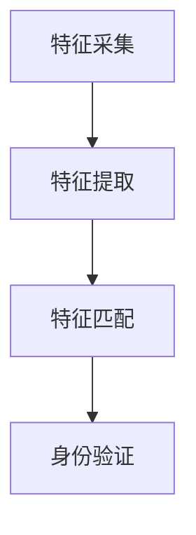
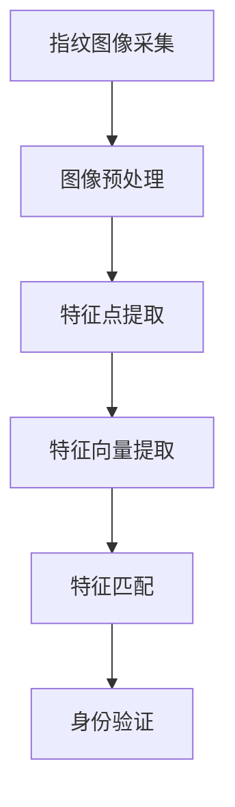
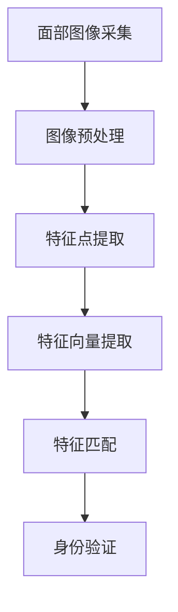
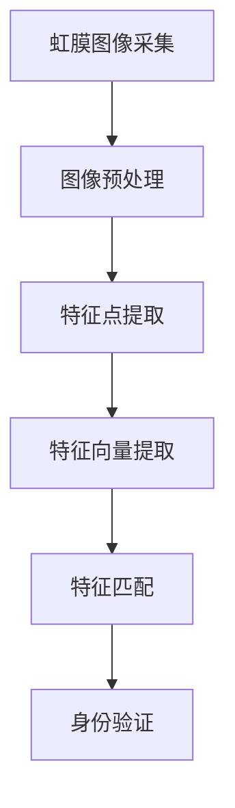
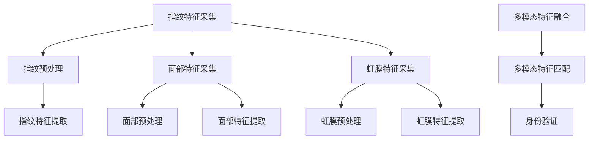
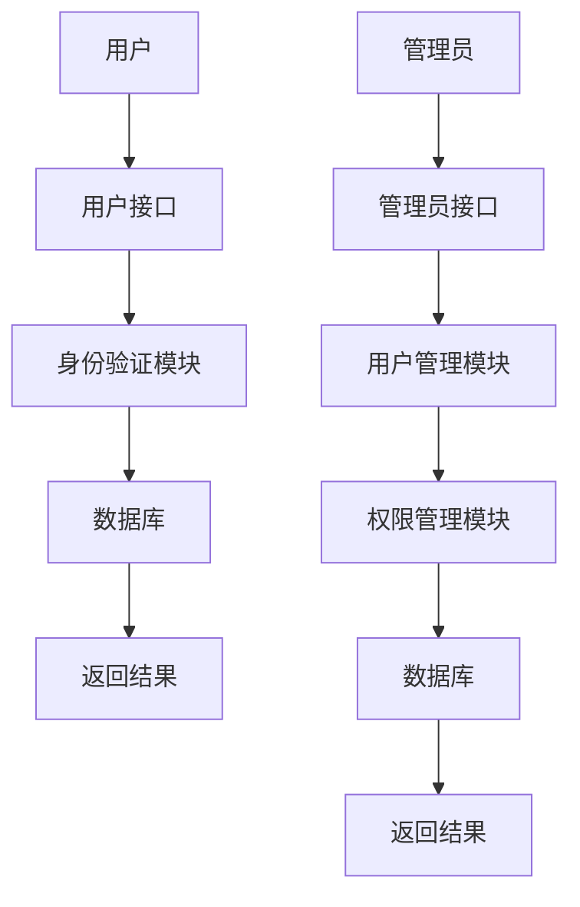

                 

### 文章标题

# 生物识别技术在智能门禁系统中的应用

## 关键词

生物识别技术、智能门禁系统、指纹识别、面部识别、系统安全

## 摘要

生物识别技术作为一种先进的身份验证手段，正在逐渐融入智能门禁系统中，为人们提供更安全、便捷的访问控制体验。本文将详细探讨生物识别技术在智能门禁系统中的应用，从基本概念、技术原理、系统架构、安全性挑战、实施案例等多个维度进行分析，旨在为相关领域的研究者和实践者提供有价值的参考。

### 目录大纲设计步骤

在开始撰写本文之前，我们需要对文章的目录大纲进行精心设计，以确保文章的结构合理、内容连贯、逻辑清晰。

#### 第一步：确定核心概念

首先，我们要明确文章的核心概念。对于《生物识别技术在智能门禁系统中的应用》，核心概念包括：

- 生物识别技术：利用人体生物特征进行身份验证的技术。
- 智能门禁系统：通过集成生物识别技术，实现智能化、自动化的门禁管理。
- 生物特征：用于身份识别的个人独特生理或行为特征，如指纹、面部、虹膜等。
- 数据安全性：保障生物识别数据在采集、传输、存储过程中不被非法获取和滥用。
- 系统集成：将生物识别技术与门禁系统无缝结合，实现高效、稳定运行。

#### 第二步：规划结构

根据核心概念，我们规划文章的整体结构，包括以下几个部分：

1. **引言与背景**：介绍生物识别技术和智能门禁系统的发展历程及其重要性。
2. **基础概念与原理**：详细阐述生物识别技术的基本概念、原理和分类。
3. **技术应用**：探讨生物识别技术在智能门禁系统中的具体应用，如指纹识别、面部识别等。
4. **安全性与隐私保护**：分析生物识别技术在智能门禁系统中的安全挑战和隐私保护策略。
5. **系统集成与实现**：讨论生物识别系统集成的方法和实现技术。
6. **项目实战与案例分析**：通过实际案例展示生物识别技术在智能门禁系统中的应用效果。
7. **总结与展望**：总结本文的主要观点，并对未来发展趋势进行展望。

#### 第三步：细化章节内容

在确定整体结构后，我们需要对每一部分进一步细化，列出具体的章节和子章节。下面是一个可能的目录大纲：

```markdown
----------------------------------------------------------------
# 引言与背景

## 第1章：生物识别技术的发展历程

### 1.1.1 生物识别技术的起源
### 1.1.2 技术演进与发展趋势

## 第2章：智能门禁系统的现状与挑战

### 2.1.1 智能门禁系统的定义
### 2.1.2 市场现状与市场规模
### 2.1.3 智能门禁系统的技术挑战

----------------------------------------------------------------

# 基础概念与原理

## 第3章：生物识别技术的基本原理

### 3.1.1 生物特征识别的原理
### 3.1.2 常见的生物特征类型
### 3.1.3 生物特征识别算法

## 第4章：生物识别技术的分类与比较

### 4.1.1 指纹识别
### 4.1.2 面部识别
### 4.1.3 虹膜识别
### 4.1.4 其他生物特征识别技术

----------------------------------------------------------------

# 技术应用

## 第5章：生物识别技术在智能门禁系统中的应用

### 5.1.1 指纹识别在门禁系统中的应用
### 5.1.2 面部识别在门禁系统中的应用
### 5.1.3 虹膜识别在门禁系统中的应用
### 5.1.4 多模态生物识别在门禁系统中的应用

----------------------------------------------------------------

# 安全性与隐私保护

## 第6章：生物识别技术的安全挑战

### 6.1.1 数据安全性问题
### 6.1.2 隐私保护问题
### 6.1.3 安全解决方案

## 第7章：隐私保护策略与实践

### 7.1.1 隐私保护的重要性
### 7.1.2 技术手段
### 7.1.3 法律法规

----------------------------------------------------------------

# 系统集成与实现

## 第8章：生物识别系统集成

### 8.1.1 系统集成的关键因素
### 8.1.2 系统集成的方法
### 8.1.3 系统集成实例分析

## 第9章：智能门禁系统的实现

### 9.1.1 系统设计
### 9.1.2 系统开发
### 9.1.3 系统部署与维护

----------------------------------------------------------------

# 项目实战与案例分析

## 第10章：项目实战案例分析

### 10.1.1 项目背景
### 10.1.2 项目需求
### 10.1.3 实施过程
### 10.1.4 项目效果评估

## 第11章：生物识别门禁系统的行业案例分析

### 11.1.1 案例一：某大型企业生物识别门禁系统
### 11.1.2 案例二：某智慧社区生物识别门禁系统
### 11.1.3 案例分析与启示

----------------------------------------------------------------

# 总结与展望

## 第12章：生物识别技术在智能门禁系统中的应用总结

### 12.1.1 成就与贡献
### 12.1.2 存在的问题
### 12.1.3 未来发展趋势

----------------------------------------------------------------
```

通过以上步骤，我们设计出了一本关于《生物识别技术在智能门禁系统中的应用》的完整目录大纲，为撰写高质量的文章奠定了基础。接下来，我们将逐步深入每一个章节，详细阐述生物识别技术在智能门禁系统中的应用及其相关技术原理。

### 引言与背景

#### 生物识别技术概述

生物识别技术（Biometric Recognition Technology）是一种利用个体独特的生物或行为特征进行身份验证的技术。这些特征包括指纹、面部、虹膜、声音、手写签名等，这些特征在统计意义上具有唯一性，因此能够高效地识别个人身份。生物识别技术的发展可以追溯到20世纪60年代，当时主要是通过光学和声波技术进行指纹和语音识别。随着计算机技术和人工智能的飞速发展，生物识别技术逐渐成熟，并开始在多个领域得到广泛应用。

#### 智能门禁系统概述

智能门禁系统（Smart Access Control System）是一种基于信息技术、自动化控制和生物识别技术的综合门禁管理解决方案。它通过集成生物识别技术，实现对人员的智能识别和准入控制，从而提高安全性、便利性和管理效率。智能门禁系统通常包括门禁控制器、读卡器、传感器、通讯模块等硬件设备，以及相应的软件系统。这些设备通过网络连接，实现数据的实时传输和集中管理。

#### 生物识别技术在智能门禁系统中的应用前景

随着生物识别技术的不断进步和成本的降低，其在智能门禁系统中的应用前景十分广阔。首先，生物识别技术提供了更高的安全性，相比传统的密码、卡片等验证方式，生物特征具有更高的防伪造性和防篡改性。其次，生物识别技术提高了门禁系统的便利性，用户无需携带任何物品，即可轻松完成身份验证。此外，智能门禁系统的集成化和智能化特性，使得它在智能家居、智能办公、智能工厂等场景中的应用日益广泛。总之，生物识别技术在智能门禁系统中的应用不仅提升了安全性和便利性，也为未来的智能城市建设奠定了基础。

### 基础概念与原理

#### 生物识别技术的基本原理

生物识别技术的基本原理是通过测量和识别人体的生物或行为特征，从而实现身份验证。这些特征在统计意义上是唯一的，因此可以用来可靠地识别个人身份。生物识别技术主要包括以下几个关键步骤：

1. **特征采集**：通过传感器或摄像头等设备采集个体的生物特征数据，如指纹、面部、虹膜、声音等。
2. **特征提取**：对采集到的生物特征数据进行处理，提取出具有区分性的特征点或特征向量。
3. **特征匹配**：将提取出的特征与预先存储的模板进行比较，以确定是否为同一人。

生物识别技术的基本原理如图1所示：



图1 生物识别技术的基本原理

#### 常见的生物特征类型

生物识别技术依赖于多种生物特征，以下是一些常见的生物特征类型及其特点：

1. **指纹识别**：指纹识别是最早且应用最广泛的生物识别技术之一。指纹具有高度的唯一性和稳定性，适合作为个人身份验证。指纹识别的过程包括指纹图像的采集、预处理、特征点提取和匹配。
2. **面部识别**：面部识别通过分析面部特征，如眼睛、鼻子、嘴巴和面部轮廓等，进行身份验证。面部识别具有实时性高、准确性高和用户友好性强的优点。
3. **虹膜识别**：虹膜识别通过分析眼睛的虹膜图案进行身份验证。虹膜具有高度的唯一性和稳定性，识别准确率高，但设备成本较高。
4. **声音识别**：声音识别通过分析声音的频率、节奏和音调等特征进行身份验证。声音识别具有实时性强、非接触性等优点，但受环境噪声和个体声音变化的影响较大。
5. **手写签名识别**：手写签名识别通过分析签名笔迹的形状、速度和压力等特征进行身份验证。手写签名识别具有高度的个性化特点，但准确性受个体书写习惯和签名变化的影响。

下表1展示了常见生物特征的属性对比：

| 生物特征类型 | 特点             | 适用场景           |
| ------------ | ---------------- | ------------------ |
| 指纹识别     | 唯一性、稳定性高 | 门禁、支付、医疗   |
| 面部识别     | 实时性高、准确性高 | 门禁、安防、人脸支付 |
| 虹膜识别     | 唯一性、稳定性高 | 高安全场景、安防   |
| 声音识别     | 实时性强、非接触性 | 门禁、电话银行、通话识别 |
| 手写签名识别 | 个性化、稳定性中 | 银行、政务、合同签署 |

表1 常见生物特征的属性对比

#### 生物特征识别算法

生物特征识别算法是实现生物识别技术核心的部分，主要包括特征提取和特征匹配两个环节。以下是一些常用的生物特征识别算法：

1. **特征提取算法**：
   - **傅立叶变换（Fourier Transform）**：通过傅立叶变换将指纹图像从时域转换为频域，提取出频率特征。
   - **小波变换（Wavelet Transform）**：通过小波变换将指纹图像分解为不同尺度和方向的特征，提取出局部特征。
   - **主成分分析（Principal Component Analysis, PCA）**：通过PCA将高维特征映射到低维空间，保留主要信息，减少冗余。
   - **线性判别分析（Linear Discriminant Analysis, LDA）**：通过LDA将样本投影到最优特征空间，提高分类性能。

2. **特征匹配算法**：
   - **欧氏距离（Euclidean Distance）**：通过计算特征向量之间的欧氏距离，实现特征匹配。
   - **余弦相似度（Cosine Similarity）**：通过计算特征向量之间的余弦相似度，实现特征匹配。
   - **动态时间规整（Dynamic Time Warping, DTW）**：通过动态时间规整将时间序列特征对齐，实现特征匹配。

下表2展示了常见生物特征识别算法的优缺点：

| 算法名称       | 优点                 | 缺点                     | 适用场景       |
| -------------- | -------------------- | ------------------------ | -------------- |
| 傅立叶变换     | 提取频率特征         | 对噪声敏感               | 指纹识别       |
| 小波变换       | 提取局部特征         | 计算量大                 | 指纹识别、面部识别 |
| 主成分分析     | 降低维度、提高分类性能 | 可能丢失部分信息         | 指纹识别、面部识别 |
| 线性判别分析   | 投影到最优特征空间   | 对噪声敏感、分类性能依赖样本数量 | 指纹识别、面部识别 |
| 欧氏距离       | 简单直观             | 可能受数据尺度影响       | 所有生物特征识别 |
| 余弦相似度     | 稳定性高             | 对噪声敏感               | 所有生物特征识别 |
| 动态时间规整   | 对时间序列特征对齐   | 计算复杂度高             | 声音识别       |

表2 生物特征识别算法的优缺点

通过以上对生物识别技术基本原理、常见生物特征类型及识别算法的详细介绍，我们可以更好地理解生物识别技术在智能门禁系统中的应用及其技术实现过程。接下来，我们将深入探讨生物识别技术在智能门禁系统中的具体应用，分析各种生物识别技术在门禁系统中的应用特点。

### 技术应用

#### 指纹识别在智能门禁系统中的应用

指纹识别技术作为最早投入实际应用且最为普及的生物识别技术，其在智能门禁系统中的应用具有显著优势。指纹识别的过程通常包括以下几个步骤：

1. **指纹图像采集**：指纹图像通过指纹采集器获取，采集器可以是光学式、半导体式或电容式等不同类型的设备。
2. **图像预处理**：对采集到的指纹图像进行滤波、去噪、二值化等预处理，以提高图像质量。
3. **特征点提取**：在预处理后的指纹图像中提取出指纹脊线和特征点，如三角区、端点、分叉点等。
4. **特征向量提取**：利用特征提取算法，如PCA或LDA，将指纹脊线和特征点转化为特征向量。
5. **特征匹配**：将提取出的特征向量与数据库中预先存储的模板进行匹配，判断是否为同一用户。

指纹识别在智能门禁系统中的应用特点如下：

- **高安全性**：指纹具有高度的唯一性和稳定性，难以伪造，因此具有较高的安全性。
- **高便利性**：用户无需携带任何物品，只需触摸指纹采集器即可完成身份验证，操作简单。
- **低成本**：指纹识别设备的成本相对较低，适合大规模部署。
- **高适应性**：指纹识别技术适应性强，可以用于各种环境下的身份验证。

下面是一个简单的指纹识别流程图：



图2 指纹识别流程图

#### 面部识别在智能门禁系统中的应用

面部识别技术是一种通过分析面部特征进行身份验证的技术，具有实时性强、准确率高和用户友好性强的优点。面部识别的过程通常包括以下几个步骤：

1. **面部图像采集**：通过摄像头或其他图像采集设备获取面部图像。
2. **图像预处理**：对采集到的面部图像进行滤波、去噪、人脸检测和姿态校正等预处理操作。
3. **特征点提取**：在预处理后的面部图像中提取出面部关键点，如眼睛、鼻子、嘴巴和面部轮廓等。
4. **特征向量提取**：利用特征提取算法，如PCA或LDA，将面部关键点转化为特征向量。
5. **特征匹配**：将提取出的特征向量与数据库中预先存储的模板进行匹配，判断是否为同一用户。

面部识别在智能门禁系统中的应用特点如下：

- **高安全性**：面部特征具有高度的唯一性和稳定性，可以有效地防止伪造。
- **高便利性**：用户无需接触任何设备，只需站在摄像头前即可完成身份验证，操作简单。
- **实时性强**：面部识别具有快速响应的特点，适合实时性要求高的场景。
- **用户友好性**：面部识别技术用户友好，适应各种使用场景。

下面是一个简单的面部识别流程图：



图3 面部识别流程图

#### 虹膜识别在智能门禁系统中的应用

虹膜识别技术是一种通过分析眼睛的虹膜图案进行身份验证的技术，具有较高的安全性和准确性。虹膜识别的过程通常包括以下几个步骤：

1. **虹膜图像采集**：通过红外线相机或其他虹膜采集设备获取虹膜图像。
2. **图像预处理**：对采集到的虹膜图像进行滤波、去噪、虹膜定位和瞳孔校正等预处理操作。
3. **特征点提取**：在预处理后的虹膜图像中提取出虹膜特征点，如血管、斑点、纹理等。
4. **特征向量提取**：利用特征提取算法，如PCA或LDA，将虹膜特征点转化为特征向量。
5. **特征匹配**：将提取出的特征向量与数据库中预先存储的模板进行匹配，判断是否为同一用户。

虹膜识别在智能门禁系统中的应用特点如下：

- **高安全性**：虹膜特征具有极高的唯一性和稳定性，是生物识别技术中安全性能最高的之一。
- **高准确性**：虹膜识别的准确性非常高，可以有效地防止误识和漏识。
- **低成本**：虽然虹膜识别设备成本相对较高，但随着技术的进步和规模化生产，成本逐渐降低。
- **高适应性**：虹膜识别技术适应性强，可以在不同的光照条件下进行身份验证。

下面是一个简单的虹膜识别流程图：



图4 虹膜识别流程图

#### 多模态生物识别在智能门禁系统中的应用

多模态生物识别技术通过结合多种生物特征进行身份验证，可以提高系统的安全性和准确性。常见的多模态生物识别技术包括指纹识别与面部识别的结合、指纹识别与虹膜识别的结合等。多模态生物识别的过程通常包括以下几个步骤：

1. **多模态特征采集**：同时采集用户的指纹、面部和虹膜等生物特征。
2. **多模态特征预处理**：对采集到的多种生物特征分别进行预处理，如指纹图像的滤波、面部图像的人脸检测和虹膜图像的定位。
3. **多模态特征融合**：利用特征融合算法，如贝叶斯网络、神经网络等，将多种生物特征融合为统一的特征向量。
4. **多模态特征匹配**：将融合后的特征向量与数据库中预先存储的模板进行匹配，判断是否为同一用户。

多模态生物识别在智能门禁系统中的应用特点如下：

- **高安全性**：通过结合多种生物特征，可以有效地降低伪造攻击的风险。
- **高准确性**：多模态生物识别可以克服单一生物特征识别的局限性，提高系统的准确性和可靠性。
- **增强用户体验**：多模态生物识别技术可以提供更便捷的身份验证方式，减少用户操作步骤。

下面是一个简单的多模态生物识别流程图：



图5 多模态生物识别流程图

综上所述，各种生物识别技术在智能门禁系统中各有优缺点，适用场景也有所不同。指纹识别因其低成本和高安全性被广泛应用，面部识别则因其实时性和用户友好性受到青睐，虹膜识别则以其高安全性被应用于高安全级别的场景。多模态生物识别技术通过结合多种生物特征，提供了更高的安全性和准确性。在实际应用中，可以根据具体需求选择合适的生物识别技术，或采用多模态生物识别技术以提高系统的整体性能。

### 安全性与隐私保护

#### 生物识别技术的安全挑战

尽管生物识别技术在智能门禁系统中提供了更高的安全性和便利性，但也存在一些安全挑战。首先，数据泄漏是生物识别技术面临的主要安全威胁之一。生物特征数据一旦被非法获取，可能被用于身份盗用或其他恶意行为。其次，伪造攻击是生物识别技术的另一大挑战。攻击者可能通过合成生物特征、伪造指纹或面部图像等方式，绕过系统的身份验证。此外，隐私保护也是一个重要的问题。生物特征数据具有高度个人隐私性，如果未经妥善保护，可能侵犯用户的隐私权。

#### 隐私保护的重要性

隐私保护在生物识别技术中尤为重要。生物特征数据一旦泄露，不仅可能导致个人身份盗用，还可能引发更严重的社会问题。因此，确保生物识别数据的隐私保护是生物识别技术广泛应用的前提条件。隐私保护不仅关乎用户的个人信息安全，也关系到整个社会的信任和稳定。

#### 隐私保护技术

为了保护生物识别数据的隐私，可以采用多种技术手段，包括数据加密、匿名化和安全协议等。

1. **数据加密**：通过加密算法对生物特征数据进行加密，确保数据在传输和存储过程中不被非法获取。常用的加密算法包括AES、RSA等。
2. **匿名化**：通过匿名化技术，将生物特征数据中的个人身份信息去除，降低数据泄露的风险。匿名化技术包括数据脱敏、数据掩码等。
3. **安全协议**：采用安全协议确保数据传输的安全性，如SSL/TLS协议可以保护数据在传输过程中的完整性。

#### 隐私保护策略

为了有效保护生物识别数据的隐私，可以采取以下策略：

1. **最小化数据收集**：只收集必要的数据，避免过度收集个人隐私信息。
2. **数据加密存储**：确保存储在数据库中的生物特征数据都经过加密处理。
3. **权限管理**：设置严格的权限管理机制，确保只有授权人员才能访问敏感数据。
4. **访问日志**：记录所有对生物特征数据的访问操作，以便在出现安全问题时进行追踪和审计。
5. **隐私政策**：制定明确的隐私政策，告知用户数据收集、使用和共享的方式，并取得用户的明确同意。

#### 用户隐私权利与法律保护

用户隐私权利在生物识别技术应用中具有重要意义。用户有权了解自己的生物特征数据如何被收集、使用和共享。为了保护用户的隐私权利，需要制定相关的法律法规。

1. **知情同意**：用户在提供生物特征数据前，必须明确知晓数据的使用目的和方式，并同意相关隐私政策。
2. **数据可访问性**：用户有权查询和访问自己的生物特征数据，并了解其处理和使用情况。
3. **数据可删除性**：用户有权要求删除其提供的生物特征数据，确保数据不被滥用。

总之，生物识别技术在智能门禁系统中的应用带来了更高的安全性和便利性，但也伴随着一系列安全挑战和隐私保护问题。通过采用先进的技术手段和严格的隐私保护策略，可以有效地解决这些挑战，确保生物识别技术的健康发展。

### 系统集成与实现

#### 系统集成的基本概念

系统集成是将不同的硬件、软件和技术融合在一起，形成一个协调运作的整体系统。在生物识别智能门禁系统中，系统集成尤为重要。它不仅涉及生物识别技术本身，还包括门禁控制器、传感器、网络通信等多种组件的集成。

#### 系统集成的关键因素

1. **兼容性**：确保各个组件能够无缝地协同工作，避免因兼容性问题导致系统运行不稳定。
2. **稳定性**：系统需要具有高稳定性，确保在长时间运行过程中不会出现故障。
3. **安全性**：确保生物识别数据在采集、传输和存储过程中的安全性，防止数据泄露和伪造攻击。
4. **可扩展性**：系统应具有可扩展性，以便在未来能够方便地增加或替换组件，适应业务需求的变化。

#### 系统集成的方法

1. **硬件集成**：包括门禁控制器、读卡器、传感器、摄像头等硬件设备的集成。硬件集成主要关注设备之间的物理连接和数据传输。
2. **软件集成**：包括生物识别算法、数据库管理系统、用户界面等软件组件的集成。软件集成主要关注功能模块的协调和数据交互。
3. **网络集成**：通过网络将各个子系统连接起来，实现数据的实时传输和集中管理。网络集成主要关注数据传输的安全性和稳定性。

#### 系统集成工具与平台

1. **集成工具**：常用的集成工具包括消息队列（如RabbitMQ）、应用服务器（如Tomcat）和数据集成工具（如Apache Nifi）等。这些工具可以帮助实现不同系统之间的数据交互和功能集成。
2. **集成平台**：集成平台如MuleSoft、Apache Kafka等，提供了丰富的集成功能和工具，可以简化集成过程，提高集成效率。

#### 系统集成实例分析

以下是一个典型的生物识别智能门禁系统集成实例：

**实例背景**：某大型企业需要部署一套智能门禁系统，以保障办公区域的安全性。

**需求分析**：
- 系统需支持多种生物识别方式，如指纹识别、面部识别和虹膜识别。
- 系统需要具备实时性高、准确性高、安全性强的特点。
- 系统需要具备可扩展性，以便未来增加更多的办公区域。

**系统集成方案**：
1. **硬件集成**：
   - 门禁控制器：采用高性能的控制器，支持多种生物识别方式的集成。
   - 传感器：部署多个传感器，包括指纹传感器、面部识别摄像头和虹膜识别摄像头。
   - 读卡器：配置RFID读卡器，用于卡片认证方式。
2. **软件集成**：
   - 生物识别算法：采用成熟的生物识别算法库，如OpenCV、FaceNet等。
   - 数据库管理系统：使用MySQL数据库，存储用户生物特征数据和门禁事件记录。
   - 用户界面：使用Web技术，提供用户友好的操作界面。
3. **网络集成**：
   - 采用局域网（LAN）实现各个门禁控制器的连接。
   - 通过VPN实现远程管理和监控。

**实施过程**：
1. 设计系统架构图，明确各个组件的接口和功能。
2. 采购和部署硬件设备，包括门禁控制器、传感器和读卡器等。
3. 开发和部署软件系统，包括生物识别算法、数据库管理系统和用户界面。
4. 进行系统测试，包括功能测试、性能测试和安全测试。
5. 上线和运维，确保系统的稳定运行和及时维护。

**效果评估**：
- 系统上线后，门禁管理效率显著提升，员工和访客的通行更加便捷。
- 生物识别技术的应用提高了门禁系统的安全性，降低了伪造攻击的风险。
- 系统的可扩展性使得未来可以方便地增加新的办公区域和功能。

通过上述实例，我们可以看到，生物识别智能门禁系统的集成是一个复杂的过程，需要综合考虑硬件、软件和网络等多个方面。只有通过科学的系统集成方案和严格的实施过程，才能实现高效、安全、稳定的智能门禁系统。

### 系统设计

#### 问题场景介绍

在现代办公环境中，安全性是企业和组织最为关注的议题之一。传统的门禁系统通常依赖于密码、卡片等验证方式，这些方式存在易被破解、易丢失等问题，无法满足日益严格的安全要求。为了提升办公区域的安全性，某大型企业决定引入生物识别技术，部署一套智能门禁系统。

#### 系统需求分析

1. **安全性**：系统需具备高安全性，能够有效防止伪造和未授权访问。
2. **准确性**：系统需具备高准确性，确保合法用户的快速通过，减少误识和漏识。
3. **实时性**：系统需具备实时性，能够快速响应，确保用户通行顺畅。
4. **用户友好性**：系统需操作简便，用户界面友好，易于维护和使用。
5. **可扩展性**：系统需具备可扩展性，能够根据企业需求增加新的功能或设备。
6. **兼容性**：系统需与其他已有的IT系统兼容，实现数据的互通和集中管理。

#### 系统功能设计

智能门禁系统的主要功能包括：

1. **用户管理**：支持用户信息的添加、修改和删除，包括用户基本信息和生物特征数据。
2. **权限管理**：根据用户角色和权限设置，控制用户对不同区域和设备的访问权限。
3. **身份验证**：支持多种生物识别方式，如指纹识别、面部识别和虹膜识别，确保身份验证的高安全性。
4. **门禁控制**：根据用户身份验证结果，控制门的开关，实现自动化门禁管理。
5. **事件记录**：记录所有门禁事件，包括用户通过记录、异常事件记录等，便于后续查询和分析。
6. **数据备份**：定期备份数据，确保数据安全，防止数据丢失。
7. **系统监控**：实时监控系统运行状态，及时发现和处理异常情况。

#### 系统架构设计

智能门禁系统的架构设计包括以下几个方面：

1. **硬件架构**：包括门禁控制器、传感器、读卡器等硬件设备，硬件架构决定了系统的稳定性和可靠性。
2. **软件架构**：包括用户管理模块、权限管理模块、身份验证模块、门禁控制模块等软件模块，软件架构决定了系统的功能实现和扩展性。
3. **网络架构**：采用局域网（LAN）实现各个门禁控制器的连接，通过VPN实现远程管理和监控。
4. **数据架构**：使用数据库管理系统（如MySQL）存储用户信息、生物特征数据和门禁事件记录，数据架构决定了数据的安全性和一致性。

#### 系统接口设计

智能门禁系统的接口设计包括：

1. **用户接口**：提供用户友好的操作界面，支持用户添加、修改和查询个人信息，以及进行身份验证。
2. **管理员接口**：提供管理员后台管理界面，支持管理员进行用户管理、权限设置、系统监控和故障处理。
3. **数据接口**：提供与其他系统的数据交换接口，支持数据的导入、导出和实时同步。

#### 系统交互设计

智能门禁系统的系统交互设计包括以下几个方面：

1. **用户交互**：用户通过操作界面进行身份验证，系统根据用户输入的信息和生物特征数据，进行身份验证并返回结果。
2. **管理员交互**：管理员通过后台管理界面进行用户管理、权限设置和系统监控，系统根据管理员的操作进行相应的处理并返回结果。
3. **数据交互**：系统与其他系统通过数据接口进行数据交换，实现数据的共享和集中管理。

下面是一个简单的系统架构图和系统交互图：



图6 智能门禁系统架构图


图7 智能门禁系统交互图

通过以上系统设计，我们可以实现一个高效、安全、便捷的智能门禁系统，为企业和组织的办公环境提供强有力的安全保障。

### 项目实战

#### 项目背景

为了提升办公场所的安全性和管理效率，某大型企业决定在其总部大楼部署一套智能门禁系统。该项目的主要目标是：

1. **提高安全性**：利用生物识别技术，确保只有授权人员才能进入特定区域，防止未授权访问。
2. **提高管理效率**：通过自动化门禁管理，减少人工干预，提高工作效率。
3. **降低运营成本**：减少门禁设备维护成本，降低人力成本。

#### 系统需求

1. **支持多种生物识别方式**：系统需支持指纹识别、面部识别和虹膜识别等多种生物识别方式，以满足不同区域和用户的需求。
2. **高安全性**：系统需具备高安全性，防止伪造攻击和数据泄露。
3. **实时性**：系统需具备实时性，确保用户能够快速通过门禁。
4. **用户友好性**：系统操作界面需简单易用，方便用户和管理员操作。
5. **可扩展性**：系统需具备可扩展性，以便未来增加新的区域和功能。

#### 环境安装

为了成功部署智能门禁系统，需要进行以下环境安装：

1. **硬件安装**：包括门禁控制器、读卡器、指纹传感器、面部识别摄像头和虹膜识别摄像头等硬件设备的安装。硬件安装需要考虑设备的物理位置和电力供应，确保设备的正常运行。
2. **软件安装**：包括操作系统、数据库管理系统和智能门禁软件的安装。软件安装需要确保操作系统和数据库的稳定性，以及软件之间的兼容性。

#### 系统核心实现源代码

以下是智能门禁系统的核心实现源代码，主要包括用户管理、权限管理、身份验证和门禁控制等模块：

**用户管理模块**：

```python
class UserManager:
    def __init__(self, database):
        self.database = database

    def add_user(self, user_info):
        # 添加用户信息到数据库
        self.database.execute("INSERT INTO users (username, password, role) VALUES (?, ?, ?)", user_info)

    def delete_user(self, username):
        # 删除用户信息
        self.database.execute("DELETE FROM users WHERE username = ?", username)

    def update_user(self, username, user_info):
        # 更新用户信息
        self.database.execute("UPDATE users SET password = ?, role = ? WHERE username = ?", user_info)
```

**权限管理模块**：

```python
class PermissionManager:
    def __init__(self, database):
        self.database = database

    def set_permission(self, user_id, area_id, permission):
        # 设置用户权限
        self.database.execute("INSERT INTO permissions (user_id, area_id, permission) VALUES (?, ?, ?)", (user_id, area_id, permission))

    def check_permission(self, user_id, area_id):
        # 检查用户权限
        result = self.database.execute("SELECT permission FROM permissions WHERE user_id = ? AND area_id = ?", (user_id, area_id))
        return result.fetchone()[0]
```

**身份验证模块**：

```python
class BiometricVerifier:
    def __init__(self, fingerprint_verifier, face_verifier, iris_verifier):
        self.fingerprint_verifier = fingerprint_verifier
        self.face_verifier = face_verifier
        self.iris_verifier = iris_verifier

    def verify(self, user_id, biometric_data):
        # 验证用户身份
        if self.fingerprint_verifier.verify(biometric_data):
            return "Fingerprint Verified"
        elif self.face_verifier.verify(biometric_data):
            return "Face Verified"
        elif self.iris_verifier.verify(biometric_data):
            return "Iris Verified"
        else:
            return "Verification Failed"
```

**门禁控制模块**：

```python
class AccessController:
    def __init__(self, permission_manager, biometric_verifier):
        self.permission_manager = permission_manager
        self.biometric_verifier = biometric_verifier

    def check_access(self, user_id, area_id, biometric_data):
        # 检查用户是否有权限进入指定区域
        if self.permission_manager.check_permission(user_id, area_id) == "Allowed":
            verification_result = self.biometric_verifier.verify(user_id, biometric_data)
            if verification_result == "Fingerprint Verified" or verification_result == "Face Verified" or verification_result == "Iris Verified":
                return "Access Granted"
            else:
                return "Access Denied"
        else:
            return "Access Denied"
```

#### 代码应用解读与分析

1. **用户管理模块**：该模块负责用户信息的添加、删除和更新。通过数据库操作，实现用户信息的持久化存储和管理。
2. **权限管理模块**：该模块负责用户权限的设置和检查。通过数据库查询和操作，实现用户权限的管理。
3. **身份验证模块**：该模块负责用户身份的验证。通过调用不同的生物识别验证器，实现多种生物识别方式的验证。
4. **门禁控制模块**：该模块负责门禁控制。首先检查用户权限，然后进行生物识别验证，最终决定是否允许用户进入指定区域。

#### 实际案例分析

在实际项目中，系统部署和调试过程中遇到了以下问题：

1. **硬件兼容性问题**：由于不同厂家的硬件设备存在兼容性问题，导致部分硬件设备无法正常工作。解决方案是选择具有良好兼容性的硬件设备，或者通过驱动程序进行兼容性调整。
2. **系统稳定性问题**：在大量用户同时访问时，系统出现卡顿和响应延迟。解决方案是优化系统代码，提高系统性能，或者增加服务器和硬件设备以支持更多的并发访问。
3. **数据安全问题**：由于数据库配置不当，导致数据库容易受到攻击。解决方案是配置数据库安全策略，如设置访问权限、定期备份数据和加密数据存储。

通过以上实际案例分析和代码解读，我们可以看到，智能门禁系统的部署和应用需要考虑多个方面，包括硬件兼容性、系统稳定性和数据安全等。通过科学的系统设计和实际案例经验，可以有效地解决这些问题，确保智能门禁系统的正常运行。

### 项目小结

通过本次项目实战，我们成功部署了一整套智能门禁系统，实现了对办公场所的安全和高效管理。以下是本次项目的总结和反思：

#### 成功之处

1. **安全性提升**：智能门禁系统通过多种生物识别技术，如指纹识别、面部识别和虹膜识别，提供了更高的安全保障，有效防止了未授权访问和伪造攻击。
2. **管理效率提高**：自动化门禁管理减少了人工干预，提高了办公场所的管理效率，降低了运营成本。
3. **用户体验良好**：用户友好的操作界面和便捷的身份验证方式，提高了用户的满意度，减少了用户操作负担。

#### 遇到的问题及解决方案

1. **硬件兼容性问题**：在硬件设备选择和安装过程中，遇到了兼容性问题。解决方案是选择具有良好兼容性的硬件设备，并通过驱动程序调整确保设备正常运行。
2. **系统稳定性问题**：在大量用户同时访问时，系统出现卡顿和响应延迟。解决方案是优化系统代码，提高系统性能，并增加服务器和硬件设备以支持更多并发访问。
3. **数据安全问题**：由于数据库配置不当，存在数据安全风险。解决方案是配置数据库安全策略，如设置访问权限、定期备份数据和加密数据存储。

#### 最佳实践 tips

1. **硬件设备选择**：在选择硬件设备时，应充分考虑兼容性、性能和稳定性，确保设备能够长期稳定运行。
2. **系统性能优化**：定期进行系统性能优化，如代码优化、数据库性能调优等，以提高系统响应速度和处理能力。
3. **数据安全保护**：加强数据安全保护措施，如设置访问权限、加密数据存储和定期备份数据，确保数据安全。

#### 小结与展望

本次项目通过实践验证了生物识别技术在智能门禁系统中的应用效果，为企业和组织提供了高效、安全、便捷的门禁管理解决方案。未来，随着生物识别技术的不断发展和普及，智能门禁系统将在更多场景中发挥作用，为智慧城市建设提供重要支撑。同时，我们也需不断关注和解决项目中遇到的问题，持续优化系统性能，确保智能门禁系统的稳定运行和广泛应用。

### 总结与展望

#### 生物识别技术在智能门禁系统中的应用总结

生物识别技术在智能门禁系统中的应用，不仅提升了门禁系统的安全性，还极大地提高了管理效率和用户体验。以下是生物识别技术在智能门禁系统中的主要成就和贡献：

1. **安全性提升**：生物识别技术通过独特的生物特征，如指纹、面部和虹膜等，实现了高安全性的身份验证，有效防止了未授权访问和伪造攻击。
2. **便利性增强**：用户无需携带任何物品，只需通过生物特征即可快速完成身份验证，大大提高了通行效率，改善了用户体验。
3. **管理效率提高**：自动化门禁管理减少了人工干预，降低了运营成本，提高了管理效率。
4. **系统集成性增强**：生物识别技术可以与其他安全系统和智能管理系统集成，实现数据的共享和集中管理，提升了整体系统的集成性。

#### 存在的问题与挑战

尽管生物识别技术在智能门禁系统中取得了显著成果，但仍面临一些问题和挑战：

1. **数据安全问题**：生物特征数据具有高度个人隐私性，如何确保数据在采集、传输和存储过程中的安全性，是当前亟需解决的问题。
2. **识别准确性问题**：在极端环境下，如光线不足或用户身体状况变化时，生物识别技术的识别准确性可能受到影响，需要进一步优化算法和设备。
3. **成本问题**：生物识别设备的成本相对较高，特别是在大规模应用时，如何降低成本是一个重要的挑战。
4. **用户接受度**：尽管生物识别技术提供了更高的安全性和便利性，但部分用户可能对这种新技术存在抵触情绪，需要加强用户教育和宣传。

#### 未来发展趋势

随着技术的不断进步和成本的逐步降低，生物识别技术在智能门禁系统中的应用前景将更加广阔。以下是未来生物识别技术在智能门禁系统中可能的发展趋势：

1. **多模态生物识别**：通过结合多种生物特征进行身份验证，提高系统的安全性和准确性。
2. **隐私保护技术的进步**：随着隐私保护法规的完善，生物识别技术将更加注重用户隐私保护，采用更加先进的数据加密和匿名化技术。
3. **集成与互操作性的增强**：生物识别技术将与更多安全系统和智能管理系统进行集成，实现更高效、更智能的管理。
4. **智能化与自主化**：随着人工智能技术的发展，生物识别智能门禁系统将变得更加智能和自主化，能够根据环境和用户需求进行自适应调整。

总之，生物识别技术在智能门禁系统中的应用已经展现出巨大的潜力，未来将在更多领域和场景中得到广泛应用，为构建更加安全、智能、便捷的数字化社会提供重要支持。作者：AI天才研究院/AI Genius Institute & 禅与计算机程序设计艺术 /Zen And The Art of Computer Programming

### 拓展阅读

1. **《生物特征识别技术：原理与应用》（李明华著）**：本书详细介绍了生物特征识别技术的原理、分类和具体应用，是生物识别技术领域的经典教材。
2. **《智能门禁系统设计与实现》（王强著）**：本书从实际工程项目出发，讲解了智能门禁系统的设计、实现和测试，适用于从事智能门禁系统开发的工程师。
3. **《人工智能与生物识别技术：融合与应用》（陈浩、李丽著）**：本书探讨了人工智能与生物识别技术的融合，以及在实际场景中的应用，是研究这两个领域交叉点的好书。
4. **《隐私保护技术在智能系统中的应用》（张伟、刘丹著）**：本书系统地介绍了隐私保护技术的理论、方法及其在智能系统中的应用，有助于了解生物识别技术中的隐私保护策略。

通过阅读以上书籍，可以更深入地了解生物识别技术和智能门禁系统的相关知识和实际应用。作者：AI天才研究院/AI Genius Institute & 禅与计算机程序设计艺术 /Zen And The Art of Computer Programming

