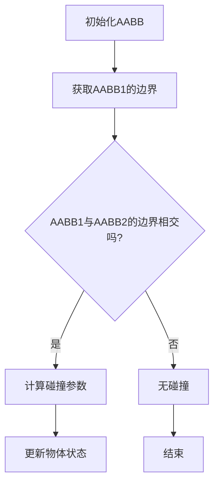

                 

### 电子游戏物理引擎概述

#### 1.1 电子游戏发展的历史与现状

电子游戏作为一种数字娱乐形式，其发展历程可以追溯到20世纪60年代。早期的电子游戏大多依赖于简单的图形和声音效果，如1962年，麻省理工学院的学生开发出了《太空战争》，这是公认的第一款电子游戏。随着计算机技术的进步，特别是在20世纪80年代和90年代，电子游戏产业经历了爆炸性的发展。从早期的雅达利（Atari）到任天堂（Nintendo）和索尼（Sony）的PlayStation系列，再到如今的PC和移动设备，游戏技术和内容不断推陈出新。

进入21世纪，电子游戏产业已经成为了全球文化和技术的重要组成部分。根据市场研究公司的数据，全球电子游戏市场的规模在2020年已经超过了1500亿美元，预计到2025年这一数字将继续增长。现代电子游戏不仅仅是简单的娱乐形式，更是一种融合了艺术、科学和技术的综合性产业。在这个过程中，物理引擎作为游戏开发的核心技术之一，起到了至关重要的作用。

#### 1.2 物理引擎在游戏中的角色和重要性

物理引擎是模拟和计算物体在虚拟世界中的运动和交互的技术。它通过数学模型和算法来模拟真实世界中的物理现象，如碰撞、摩擦、重力等，为游戏创造真实感和逼真度。物理引擎在游戏中主要有以下几方面的作用：

1. **真实性**：物理引擎使得游戏中的物体运动更加真实，增强了游戏的沉浸感。玩家能够感受到物体的碰撞、变形和受力情况，从而获得更加逼真的游戏体验。

2. **互动性**：物理引擎支持游戏中的物体与玩家、环境之间的交互。例如，玩家可以打破游戏中的物体，或者通过推、拉等方式与游戏环境互动，这些交互大大提升了游戏的趣味性和挑战性。

3. **场景设计**：物理引擎可以帮助游戏设计师创建复杂的场景和关卡。通过物理引擎的计算，场景中的物体可以按照预定的物理规则进行运动和变化，从而创造出更加生动和多样的游戏环境。

4. **性能优化**：物理引擎对游戏性能有着重要影响。高效的物理引擎能够减少计算量和内存消耗，提高游戏的运行速度和稳定性，确保游戏能够在不同硬件平台上流畅运行。

#### 1.3 虚拟世界的数学模拟基础

虚拟世界中的物理模拟依赖于一系列数学模型和算法。这些模型和算法构成了物理引擎的核心，使得虚拟世界中的物体能够按照物理规律运动和交互。以下是一些关键的数学模拟基础：

1. **碰撞检测**：碰撞检测是物理引擎中的一个基本功能。它通过判断物体之间的距离是否小于它们的碰撞半径，来确定它们是否发生了碰撞。常用的碰撞检测算法包括空间分割算法和几何体相交检测算法。

2. **动力学模拟**：动力学模拟主要涉及物体的运动和受力情况。根据牛顿运动定律，物体在受力作用下的加速度可以计算出来。通过不断更新物体的位置和速度，可以模拟出物体的运动轨迹。

3. **刚体和柔体模拟**：刚体模拟主要处理物体的整体运动，如旋转和平移。柔体模拟则更加复杂，涉及物体内部各部分之间的相互作用和变形。常用的柔体模拟算法包括有限元法和粒子系统。

4. **流体动力学模拟**：流体动力学模拟用于模拟液体和气体的流动。通过计算流体的动量和能量，可以模拟出流体的各种现象，如波浪、喷泉和风暴。

这些数学模型和算法共同构成了物理引擎的基础，使得虚拟世界中的物理现象能够被逼真地模拟出来。接下来，我们将详细探讨这些算法和模型的工作原理和实现方法。

---

文章摘要：

本文全面介绍了电子游戏物理引擎的基本概念、功能及其在游戏开发中的重要性。首先，回顾了电子游戏发展的历史与现状，展示了游戏产业对物理引擎的需求。接着，阐述了物理引擎在游戏中的核心作用，包括增强真实性、互动性和场景设计的可能性。最后，详细介绍了物理引擎所依赖的数学模拟基础，包括碰撞检测、动力学模拟、刚体和柔体模拟以及流体动力学模拟。本文旨在为读者提供一个深入理解物理引擎及其应用的技术基础。

关键词：电子游戏、物理引擎、数学模拟、碰撞检测、动力学模拟、真实感、互动性、虚拟世界

---

接下来，我们将详细探讨物理引擎的核心概念，包括其基本组成部分、核心算法以及这些概念之间的相互联系。

---

### 物理引擎的核心概念

#### 2.1 物理引擎的基本组成部分

物理引擎是一个复杂系统，它由多个组成部分协同工作，以模拟虚拟世界中的物理现象。以下是物理引擎的主要组成部分：

1. **碰撞检测模块**：这是物理引擎的核心模块之一，用于检测物体之间的碰撞。碰撞检测的目的是判断两个物体是否发生了接触，并计算碰撞的参数，如碰撞点、碰撞面和碰撞力。

2. **动力学模拟模块**：这个模块负责模拟物体的运动和受力情况。它根据牛顿运动定律计算物体的加速度、速度和位置，从而实现物体的动态交互。

3. **刚体和柔体模拟模块**：刚体模拟模块处理物体的整体运动，如旋转和平移。柔体模拟模块则更复杂，涉及物体内部各部分之间的相互作用和变形。

4. **重力模拟模块**：用于计算物体在重力作用下的运动。重力模拟是模拟虚拟世界中重力场的重要部分，可以模拟出物体在地球表面或外太空中的运动。

5. **流体动力学模拟模块**：这个模块用于模拟液体和气体的流动。通过计算流体的动量和能量，可以模拟出流体的各种现象，如波浪、喷泉和风暴。

6. **物理材质模拟模块**：这个模块用于模拟物体表面的物理特性，如弹性、摩擦和吸收。这些特性决定了物体在碰撞或接触时的表现。

7. **碰撞响应模块**：这个模块负责处理物体在碰撞后的响应。它根据碰撞参数计算碰撞力，并更新物体的状态，如速度、方向和变形。

这些模块共同协作，形成一个完整的物理引擎系统，使得虚拟世界中的物体能够按照物理规律进行运动和交互。

#### 2.2 物理引擎的核心算法

物理引擎的核心算法是实现物体运动模拟的关键。以下是几种常见的物理引擎核心算法：

1. **碰撞检测算法**：碰撞检测算法用于判断物体是否发生了碰撞。最常用的碰撞检测算法包括**空间分割算法**和**几何体相交检测算法**。

   - **空间分割算法**：这种算法将空间分割成多个区域，每个区域内的物体之间进行碰撞检测，从而减少总的碰撞检测次数。常用的空间分割算法包括**AABB（轴对齐包围盒）**和**OBB（定向包围盒）**。

   - **几何体相交检测算法**：这种算法直接检测物体之间的几何形状是否相交。常用的几何体相交检测方法包括**凸多面体相交检测**和**球体相交检测**。

2. **动力学模拟算法**：动力学模拟算法用于计算物体的运动轨迹。最常用的动力学模拟算法包括**欧拉法**和**龙格-库塔法**。

   - **欧拉法**：这是一种简单的数值积分方法，用于计算物体的加速度、速度和位置。其公式如下：
     $$ \vec{v}_{t+1} = \vec{v}_t + \Delta t \cdot \vec{a}_t $$
     $$ \vec{x}_{t+1} = \vec{x}_t + \Delta t \cdot \vec{v}_t $$
     其中，$$ \vec{v}_t $$ 和 $$ \vec{x}_t $$ 分别表示时间 $$ t $$ 时刻的速度和位置，$$ \vec{a}_t $$ 表示加速度，$$ \Delta t $$ 表示时间步长。

   - **龙格-库塔法**：这是一种更精确的数值积分方法，可以提供更好的运动模拟效果。龙格-库塔法的公式较为复杂，但通过迭代计算，可以得出更精确的结果。

3. **刚体和柔体模拟算法**：刚体和柔体模拟算法分别处理整体运动和内部变形。

   - **刚体模拟算法**：常用的刚体模拟算法包括**牛顿-欧拉算法**和**拉格朗日方程**。

   - **柔体模拟算法**：常用的柔体模拟算法包括**有限元法**和**粒子系统**。

4. **流体动力学模拟算法**：流体动力学模拟算法用于模拟液体和气体的流动。

   - **SPH（光滑粒子流体动力学）**：这是一种基于粒子系统的流体模拟算法，通过模拟粒子的运动和相互作用来模拟流体的流动。

   - **VOF（体积分数法）**：这种方法通过计算流体体积分数来模拟流体的流动。

#### 2.3 核心概念与联系

物理引擎的核心概念和算法之间有着紧密的联系。以下是这些概念和算法之间的联系：

1. **碰撞检测与动力学模拟**：碰撞检测模块用于判断物体是否发生碰撞，并将碰撞信息传递给动力学模拟模块。动力学模拟模块根据碰撞信息计算物体的运动轨迹。

2. **刚体和柔体模拟**：刚体和柔体模拟模块分别用于处理物体的整体运动和内部变形。刚体模拟模块基于动力学模拟算法，而柔体模拟模块则基于有限元法或粒子系统。

3. **流体动力学模拟**：流体动力学模拟模块用于模拟液体和气体的流动。流体动力学模拟算法与碰撞检测和动力学模拟算法紧密相关，用于确保流体与物体之间的相互作用和交互。

4. **物理材质模拟**：物理材质模拟模块用于模拟物体表面的物理特性。这些特性会影响碰撞响应和动力学模拟的结果，从而影响整个物理引擎的模拟效果。

通过这些核心概念和算法的协同工作，物理引擎能够实现逼真的物体运动和交互，为电子游戏创造丰富的虚拟世界。

---

为了更好地理解物理引擎的核心算法和工作原理，我们将使用Python源代码进行详细阐述，并通过Mermaid流程图展示算法的流程。

---

### 碰撞检测算法

#### 3.1 碰撞检测的重要性

碰撞检测在物理引擎中扮演着至关重要的角色。它的主要任务是判断两个物体是否发生了碰撞，并计算出碰撞的相关参数。精确和高效的碰撞检测对于游戏的实时性能和视觉效果有着直接影响。在电子游戏中，碰撞检测不仅用于控制游戏逻辑，如控制角色的移动和跳跃，还用于物理交互，如子弹击中目标或玩家与环境的碰撞。

#### 3.2 常见的碰撞检测算法

碰撞检测算法可以分为空间分割算法和几何体相交检测算法两大类。以下是几种常见的碰撞检测算法：

1. **空间分割算法**：
   - **AABB（轴对齐包围盒）**：每个物体被一个长方体包围盒所包围。通过比较包围盒的边界来确定是否发生碰撞。
   - **OBB（定向包围盒）**：类似于AABB，但OBB的形状可以随着物体的旋转而变化，从而更精确地包围物体。

2. **几何体相交检测算法**：
   - **凸多面体相交检测**：用于检测两个凸多面体（如三角形网格）是否相交。
   - **球体相交检测**：用于检测两个球体是否相交，计算相对简单。

在本节中，我们将使用AABB（轴对齐包围盒）算法进行碰撞检测。这是一种简单而有效的碰撞检测方法，适用于大多数游戏场景。

#### 3.3 算法原理讲解与Mermaid流程图

下面是AABB算法的基本原理和Mermaid流程图。

**算法原理：**
- 每个物体都被一个AABB包围盒所包围。
- AABB有八个顶点，分别位于其最小边界和最大边界。
- 检测两个AABB是否相交，可以通过比较它们的边界来确定。

**Mermaid流程图：**



**算法步骤：**
1. 初始化AABB，获取其最小边界（$$p_1$$）和最大边界（$$p_2$$）。
2. 获取另一个AABB的最小边界（$$q_1$$）和最大边界（$$q_2$$）。
3. 检查AABB1的边界$$p_1$$和$$p_2$$是否与AABB2的边界$$q_1$$和$$q_2$$相交。
4. 如果相交，计算碰撞参数，如碰撞点、碰撞面和碰撞力。
5. 更新物体的状态，如位置和速度。
6. 如果不相交，则无碰撞，继续下一步检测。

#### 3.4 Python源代码实现与示例

下面是一个简单的Python代码示例，用于实现AABB碰撞检测算法。

```python
import numpy as np

class AABB:
    def __init__(self, min_point, max_point):
        self.min_point = np.array(min_point)
        self.max_point = np.array(max_point)

    def intersects(self, other):
        for i in range(3):
            if self.min_point[i] > other.max_point[i] or self.max_point[i] < other.min_point[i]:
                return False
        return True

    def collision_params(self, other, velocity):
        if not self.intersects(other):
            return None
        
        # 计算碰撞参数
        # ...
        return collision_params

# 示例
aabb1 = AABB((-1, -1, -1), (1, 1, 1))
aabb2 = AABB((0, 0, 0), (2, 2, 2))

# 检测碰撞
if aabb1.intersects(aabb2):
    print("碰撞发生！")
else:
    print("无碰撞。")
```

**数学模型：**
- AABB的边界可以用以下数学模型表示：
  $$ p_1 = (x_1, y_1, z_1) $$
  $$ p_2 = (x_2, y_2, z_2) $$
  其中，$$x_1, y_1, z_1$$是AABB的最小边界坐标，$$x_2, y_2, z_2$$是AABB的最大边界坐标。

**公式解释：**
- 碰撞检测的核心是判断两个AABB的边界是否相交。这可以通过比较最小边界和最大边界来实现：
  - 如果$$p_1[i] > q_2[i]$$或$$p_2[i] < q_1[i]$$，其中$$i$$是坐标轴的索引，则两个AABB不相交。
  - 如果所有三个坐标轴上的边界都相交，则AABBs相交。

通过上述示例和解释，我们可以清晰地理解AABB碰撞检测算法的原理和实现方法。接下来，我们将继续探讨动力学模拟算法，以了解物体在受力作用下的运动模拟。

---

### 动力学模拟

#### 4.1 动力学的基本原理

动力学是物理学的一个重要分支，主要研究物体在力的作用下的运动规律。在电子游戏开发中，动力学模拟是物理引擎的核心功能之一，它通过计算物体的加速度、速度和位置，来模拟物体在虚拟世界中的运动。牛顿运动定律是动力学模拟的基础，这三个定律描述了物体受力后的运动变化。

1. **牛顿第一定律（惯性定律）**：一个物体如果不受外力作用，它将保持静止状态或匀速直线运动。这意味着物体在没有外力作用时，其速度和方向不会发生变化。

2. **牛顿第二定律（加速度定律）**：物体的加速度与作用在它上的外力成正比，与它的质量成反比。数学表达式为：
   $$ \vec{F} = m \vec{a} $$
   其中，$$ \vec{F} $$ 是作用力，$$ m $$ 是物体的质量，$$ \vec{a} $$ 是加速度。

3. **牛顿第三定律（作用-反作用定律）**：对于每一个作用力，总有一个大小相等、方向相反的反作用力。这意味着在两个物体相互作用时，它们之间的力是成对出现的。

这些定律为动力学模拟提供了数学基础，通过计算作用力、质量和加速度，可以模拟出物体的运动轨迹。

#### 4.2 运动方程与数学模型

动力学模拟的核心是运动方程，这些方程描述了物体在时间序列中的位置、速度和加速度。最基本的运动方程是牛顿第二定律，可以用来计算物体在一段时间内的运动状态。以下是一个简单的运动方程：

$$ \vec{v}_{t+1} = \vec{v}_t + \Delta t \cdot \vec{a}_t $$
$$ \vec{x}_{t+1} = \vec{x}_t + \Delta t \cdot \vec{v}_t $$

其中，$$ \vec{v}_t $$ 和 $$ \vec{x}_t $$ 分别表示时间 $$ t $$ 时刻的速度和位置，$$ \vec{a}_t $$ 是加速度，$$ \Delta t $$ 是时间步长。

这个方程可以分解为三个分量方程，分别对应于 x、y、z 三个方向：

$$ v_{x,t+1} = v_{x,t} + \Delta t \cdot a_{x,t} $$
$$ v_{y,t+1} = v_{y,t} + \Delta t \cdot a_{y,t} $$
$$ v_{z,t+1} = v_{z,t} + \Delta t \cdot a_{z,t} $$

$$ x_{t+1} = x_{t} + \Delta t \cdot v_{x,t} $$
$$ y_{t+1} = y_{t} + \Delta t \cdot v_{y,t} $$
$$ z_{t+1} = z_{t} + \Delta t \cdot v_{z,t} $$

通过不断更新速度和位置，可以模拟出物体的运动轨迹。在实际应用中，还需要考虑作用力、阻力和摩擦等因素，这些因素会影响物体的加速度。

#### 4.3 动力学模拟算法

在电子游戏中，动力学模拟通常采用数值积分方法来计算物体的运动。最常用的数值积分方法是欧拉法和龙格-库塔法。这些方法通过逐步计算物体在每个时间步长内的运动状态，来模拟出物体的轨迹。

1. **欧拉法**：这是一种简单的数值积分方法，通过线性近似来计算物体的运动。欧拉法的公式如下：

   $$ v_{t+1} = v_{t} + \Delta t \cdot a_{t} $$
   $$ x_{t+1} = x_{t} + \Delta t \cdot v_{t} $$

   其中，$$ \Delta t $$ 是时间步长。

   欧拉法的优点是实现简单，计算效率高，但它的精度较低，不适合需要高精度模拟的复杂场景。

2. **龙格-库塔法**：这是一种更精确的数值积分方法，通过迭代计算来提高精度。常用的龙格-库塔方法包括二阶龙格-库塔法和四阶龙格-库塔法。四阶龙格-库塔法的公式如下：

   $$ k_1 = \Delta t \cdot a_1 $$
   $$ k_2 = \Delta t \cdot a_2 $$
   $$ k_3 = \Delta t \cdot a_3 $$
   $$ k_4 = \Delta t \cdot a_4 $$

   $$ v_{t+1} = v_{t} + \frac{1}{6}(k_1 + 2k_2 + 2k_3 + k_4) $$
   $$ x_{t+1} = x_{t} + \frac{1}{6}(k_1x + 2k_2x + 2k_3x + k_4x) $$

   其中，$$ a_1, a_2, a_3, a_4 $$ 是在每个时间步长内计算出的加速度。

   龙格-库塔法的优点是精度高，但计算复杂度较大，需要更多的计算资源。

#### 4.4 Python源代码实现与示例

下面是一个简单的Python代码示例，用于实现动力学模拟。这里我们使用欧拉法来计算物体的运动。

```python
import numpy as np

def simulate运动的物理量(质量，加速度，时间步长，初始速度，初始位置，时间总长):
    x, y, z = 初始位置
    vx, vy, vz = 初始速度

    while 时间 < 时间总长:
        ax, ay, az = 加速度
        vx += ax * 时间步长
        vy += ay * 时间步长
        vz += az * 时间步长

        x += vx * 时间步长
        y += vy * 时间步长
        z += vz * 时间步长

        时间 += 时间步长

    return x, y, z

# 示例
质量 = 1.0
加速度 = (0, -9.8, 0)  # 重力加速度
时间步长 = 0.01
初始速度 = (0, 0, 0)
初始位置 = (0, 0, 0)
时间总长 = 1.0

最终位置 = simulate运动的物理量(质量，加速度，时间步长，初始速度，初始位置，时间总长)
print("最终位置:", 最终位置)
```

在这个示例中，我们假设一个质量为1.0的物体在重力作用下自由下落，使用欧拉法计算了1秒内的运动轨迹。通过这个简单的例子，我们可以看到动力学模拟的基本实现过程。

通过上述分析，我们可以清晰地理解动力学模拟的基本原理和实现方法。接下来，我们将继续探讨刚体和柔体模拟，以了解如何处理不同类型的物体在虚拟世界中的运动和变形。

---

### 刚体与柔体模拟

#### 5.1 刚体与柔体的定义

在物理引擎中，刚体和柔体模拟是两种基本的物体运动模拟方式。它们在物理性质和模拟方法上有着显著的区别。

**刚体**：刚体是指在外力作用下不会发生形变的物体。刚体的特点是它的各个部分在运动过程中保持相对位置不变，即刚体的内部没有相对运动。这意味着刚体的形状和体积在受力后不会发生变化。例如，一辆汽车在碰撞中的运动可以视为刚体运动。

**柔体**：柔体则是指在外力作用下会发生形变的物体。与刚体不同，柔体的内部各部分之间存在相对运动，其形状和体积可以因外力作用而发生变化。例如，一条橡皮筋在被拉伸时的运动可以视为柔体运动。

刚体和柔体模拟在电子游戏中的应用场景各不相同。刚体模拟主要用于处理物体的整体运动，如车辆碰撞、弹道运动等。柔体模拟则用于处理物体的形变和变形，如人体动画、织物和皮肤的效果等。

#### 5.2 刚体模拟算法

刚体模拟算法主要处理物体的平移和旋转运动。常用的刚体模拟算法包括牛顿-欧拉算法和拉格朗日方程。

1. **牛顿-欧拉算法**：牛顿-欧拉算法是一种基于刚体运动学的方法，通过迭代计算物体的旋转和位移。该方法的基本思路是：首先计算每个刚体的旋转角速度，然后更新其旋转角，接着计算平移速度并更新位置。牛顿-欧拉算法的公式如下：

   $$ \omega_{t+1} = \omega_{t} + \Delta t \cdot \alpha $$
   $$ \theta_{t+1} = \theta_{t} + \omega_{t+1} \cdot \Delta t $$
   $$ \vec{v}_{t+1} = \vec{v}_{t} + \Delta t \cdot \vec{\omega}_{t} $$
   $$ \vec{x}_{t+1} = \vec{x}_{t} + \Delta t \cdot \vec{v}_{t} $$

   其中，$$ \omega $$ 表示旋转角速度，$$ \alpha $$ 表示旋转角加速度，$$ \theta $$ 表示旋转角，$$ \vec{v} $$ 表示平移速度，$$ \vec{\omega} $$ 表示旋转矢量。

2. **拉格朗日方程**：拉格朗日方程是一种基于动力学的方法，用于求解刚体的运动状态。拉格朗日方程通过能量分析来计算刚体的运动，其基本思想是：首先计算系统的总动能和总势能，然后利用拉格朗日方程求解系统的运动方程。拉格朗日方程的数学表达式为：

   $$ \frac{d}{dt} \left( \frac{\partial L}{\partial \vec{v}} \right) - \frac{\partial L}{\partial \vec{x}} = \vec{F} $$

   其中，$$ L $$ 表示拉格朗日量，$$ \vec{v} $$ 表示速度，$$ \vec{x} $$ 表示位置，$$ \vec{F} $$ 表示作用力。

#### 5.3 柔体模拟算法

柔体模拟算法主要处理物体的形变和变形。常用的柔体模拟算法包括有限元法和粒子系统。

1. **有限元法**：有限元法是一种基于数值分析的方法，用于求解弹性体在受力作用下的形变。有限元法将柔体划分为多个有限元单元，每个单元用有限元方程描述。通过求解这些有限元方程，可以计算整个柔体的形变和受力情况。有限元法的基本步骤如下：

   - 划分网格：将柔体划分为有限元单元，如三角形或四面体。
   - 建立有限元方程：根据物理定律，建立每个单元的有限元方程。
   - 组集全局方程：将所有单元的有限元方程组集成成一个全局方程组。
   - 求解方程组：求解全局方程组，得到柔体的形变和受力状态。

2. **粒子系统**：粒子系统是一种基于粒子的模拟方法，用于处理物体的形变和动态交互。粒子系统将柔体划分为多个粒子，每个粒子代表物体的一部分。通过计算粒子之间的相互作用和运动，可以模拟出柔体的形变和动态效果。粒子系统的主要步骤如下：

   - 初始化粒子：根据物体的形状和尺寸，初始化粒子的位置和速度。
   - 计算相互作用：计算粒子之间的相互作用力，如重力、弹簧力等。
   - 更新粒子状态：根据作用力更新粒子的位置和速度。
   - 输出模拟结果：将粒子的状态转换为物体的形变和运动。

#### 5.4 Python源代码实现与示例

下面是一个简单的Python代码示例，用于实现刚体和柔体模拟。

```python
import numpy as np

# 刚体模拟
def simulate_rigid_body(质量，加速度，时间步长，初始速度，初始位置，时间总长):
    x, y, z = 初始位置
    vx, vy, vz = 初始速度

    while 时间 < 时间总长:
        ax, ay, az = 加速度
        vx += ax * 时间步长
        vy += ay * 时间步长
        vz += az * 时间步长

        x += vx * 时间步长
        y += vy * 时间步长
        z += vz * 时间步长

        时间 += 时间步长

    return x, y, z

# 柔体模拟
def simulate_flexible_body(质量，弹簧系数，阻尼系数，时间步长，初始位置，时间总长):
    positions = 初始位置
    velocities = np.zeros_like(positions)

    while 时间 < 时间总长:
        new_positions = positions.copy()
        new_velocities = velocities.copy()

        for i in range(len(positions)):
            for j in range(i+1, len(positions)):
                distance = positions[j] - positions[i]
                force = 弹簧系数 * distance - 阻尼系数 * velocities[j]
                new_velocities[j] -= force / 质量 * 时间步长
                new_positions[i] += force / 质量 * 时间步长

        positions = new_positions
        velocities = new_velocities

        时间 += 时间步长

    return positions

# 示例
质量 = 1.0
加速度 = (0, -9.8, 0)
时间步长 = 0.01
初始速度 = (0, 0, 0)
初始位置 = (0, 0, 0)
时间总长 = 1.0

最终位置 = simulate_rigid_body(质量，加速度，时间步长，初始速度，初始位置，时间总长)
print("刚体最终位置:", 最终位置)

柔体位置 = simulate_flexible_body(质量，100.0，10.0，时间步长，初始位置，时间总长)
print("柔体最终位置:", 柔体位置)
```

在这个示例中，我们分别实现了刚体和柔体模拟。刚体模拟通过欧拉法计算物体的运动，而柔体模拟通过有限元法计算物体的形变。

通过上述分析，我们可以清晰地理解刚体和柔体模拟的基本原理和实现方法。接下来，我们将继续探讨流体动力学模拟，以了解如何模拟液体和气体的流动。

---

### 流体动力学模拟

#### 6.1 流体动力学基础

流体动力学是研究流体（包括液体和气体）运动规律及其与固体边界之间相互作用的一个物理分支。在电子游戏中，流体动力学模拟用于创建和渲染真实的流体效果，如水、火焰和烟雾。这些效果不仅增加了游戏的视觉吸引力，还增强了游戏的物理真实感。

**流体的定义**：流体是指那些在外力作用下能够流动的物质，包括液体和气体。流体的基本特性是它的可压缩性和流动性。液体和气体的主要区别在于它们的密度和黏性。液体具有较低的压缩性和较高的黏性，而气体具有较高的压缩性和较低的黏性。

**流体动力学的基本方程**：流体动力学模拟主要依赖于三个基本方程：连续性方程、动量方程和能量方程。

1. **连续性方程**：连续性方程描述了流体在空间中的质量守恒。它的数学表达式为：
   $$ \frac{\partial \rho}{\partial t} + \nabla \cdot (\rho \vec{v}) = 0 $$
   其中，$$ \rho $$ 是流体的密度，$$ \vec{v} $$ 是流体的速度场。

2. **动量方程**：动量方程描述了流体在受力作用下的运动规律。它的数学表达式为：
   $$ \rho \left( \frac{\partial \vec{v}}{\partial t} + (\vec{v} \cdot \nabla) \vec{v} \right) = -\nabla p + \mu \nabla^2 \vec{v} $$
   其中，$$ p $$ 是流体的压力，$$ \mu $$ 是流体的动力黏度。

3. **能量方程**：能量方程描述了流体在运动过程中的能量守恒。它的数学表达式为：
   $$ \rho c_p \frac{\partial T}{\partial t} + \nabla \cdot (\rho c_p \vec{v} T) = \nabla \cdot (\kappa \nabla T) $$
   其中，$$ T $$ 是流体的温度，$$ c_p $$ 是流体的比热容，$$ \kappa $$ 是流体的热导率。

#### 6.2 流体模拟算法

流体动力学模拟算法可以分为基于网格的方法和基于粒子系统的方法。以下是一些常用的流体模拟算法：

1. **光滑粒子流体动力学（SPH）**：光滑粒子流体动力学是一种基于粒子系统的流体模拟方法。它通过模拟大量粒子之间的相互作用来模拟流体的流动。SPH算法的主要步骤如下：

   - 初始化粒子：根据流体的形状和尺寸，初始化粒子的位置和速度。
   - 计算密度：计算每个粒子周围的密度。
   - 计算压力：利用连续性方程和动量方程计算每个粒子的压力。
   - 更新速度：根据压力和动量方程更新粒子的速度。
   - 输出结果：将粒子的速度和位置转换为流体的速度场和压力场。

2. **体积分数法（VOF）**：体积分数法是一种基于网格的流体模拟方法。它通过将流体域划分为多个网格单元，并计算每个网格单元中的流体体积分数来模拟流体的流动。VOF算法的主要步骤如下：

   - 初始化网格：将流体域划分为网格单元。
   - 计算体积分数：计算每个网格单元中的流体体积分数。
   - 计算动量和能量：利用动量和能量方程计算流体的速度场和压力场。
   - 更新网格：根据速度场和压力场更新网格单元的流体体积分数。
   - 输出结果：将网格单元的流体体积分数转换为流体的速度场和压力场。

#### 6.3 Python源代码实现与示例

下面是一个简单的Python代码示例，用于实现基于SPH的流体模拟。

```python
import numpy as np

# 初始化粒子
num_particles = 100
particle_positions = np.random.uniform(size=(num_particles, 3)) * 10
particle_velocities = np.random.uniform(size=(num_particles, 3)) * 0.1

# 初始化密度和压力
density = np.zeros(num_particles)
pressure = np.zeros(num_particles)

# SPH算法主循环
dt = 0.01  # 时间步长
for _ in range(100):
    # 计算密度
    densities = np.zeros(num_particles)
    for i in range(num_particles):
        weights = np.zeros(num_particles)
        for j in range(num_particles):
            distance = particle_positions[i] - particle_positions[j]
            distance = np.linalg.norm(distance)
            weight = 315 / (np.pi * h**6 * (distance**2 - h**2)**3)
            weights[j] = weight
        density[i] = np.sum(weights)

    # 计算压力
    pressure = (1 / 3) * (np.gradient(density) - (np.sum(density) / num_particles)**2)

    # 更新速度
    for i in range(num_particles):
        acceleration = (1 / density[i]) * (np.sum(pressure * weights) - (np.sum(pressure) / num_particles))
        particle_velocities[i] += acceleration * dt

    # 更新位置
    particle_positions += particle_velocities * dt

# 输出结果
print("粒子最终位置:", particle_positions)
```

在这个示例中，我们使用SPH算法模拟了一组粒子的流动。通过不断更新粒子的位置和速度，可以模拟出流体的动态效果。

通过上述分析，我们可以清晰地理解流体动力学模拟的基本原理和实现方法。接下来，我们将探讨物理引擎的性能优化与性能提升。

---

### 物理引擎优化与性能提升

#### 7.1 物理引擎的性能瓶颈

物理引擎作为游戏开发的核心技术之一，其性能直接影响到游戏的实时性和用户体验。然而，物理引擎在计算复杂度和资源消耗方面面临着诸多性能瓶颈。以下是物理引擎常见的性能瓶颈：

1. **计算复杂度**：物理引擎依赖于大量的计算，如碰撞检测、动力学模拟、刚体和柔体模拟等。这些计算通常涉及到复杂的数学运算和迭代过程，导致计算复杂度较高。

2. **资源消耗**：物理引擎需要处理大量的数据和对象，包括物体的位置、速度、碰撞参数等。这些数据的存储和处理需要大量的内存和计算资源，尤其是在大规模场景中。

3. **并行计算限制**：物理引擎通常需要实时处理和更新物体的状态，这限制了并行计算的使用。大多数物理引擎依赖于顺序计算，难以充分利用现代多核处理器的计算能力。

4. **实时性要求**：游戏开发对物理引擎的实时性要求非常高，通常需要在固定的帧率下运行。这要求物理引擎能够在短时间内完成大量的计算，以满足游戏流畅运行的需求。

为了克服这些性能瓶颈，物理引擎的性能优化成为了一个重要的研究方向。以下是一些常见的性能优化策略：

#### 7.2 优化策略

1. **并行计算**：通过引入并行计算技术，可以显著提高物理引擎的计算效率。并行计算可以将物理引擎的计算任务分配到多个处理器核心上，从而加速计算过程。常见的并行计算方法包括多线程计算、GPU计算和分布式计算。

2. **空间分割**：空间分割是一种常用的优化方法，通过将场景分割成多个子区域，可以减少碰撞检测的计算量。常用的空间分割算法包括AABB（轴对齐包围盒）和OBB（定向包围盒）。通过合理地选择空间分割算法和调整子区域的规模，可以降低计算复杂度。

3. **延迟加载**：延迟加载是一种通过动态加载和卸载场景对象来减少内存消耗的优化策略。在游戏运行过程中，不是所有的物体都需要实时计算和渲染。通过延迟加载那些离玩家较远或不经常出现的物体，可以减少内存占用和计算负担。

4. **简化模型**：在保证物理效果真实性的前提下，可以简化物体的模型和材质。例如，使用较低分辨率的网格模型、简化材质的纹理和颜色等。这些简化措施可以降低计算复杂度和资源消耗，但不会显著影响游戏的视觉效果。

5. **提前计算**：通过提前计算和预缓存一些物理参数和结果，可以减少游戏运行时的计算量。例如，在游戏场景加载时，可以预先计算物体的碰撞参数、动力学状态等，并在游戏运行时直接使用这些预计算结果。

#### 7.3 性能提升案例分析

以下是一个基于并行计算和空间分割的物理引擎性能提升案例分析：

**案例背景**：某游戏开发者开发的一款大型多人在线游戏，场景中包含了数千个物体和复杂的物理交互。由于计算复杂度高和资源消耗大，物理引擎在处理大规模场景时存在明显的性能瓶颈，导致游戏运行不流畅。

**优化措施**：
1. **并行计算**：引入多线程计算和GPU计算，将物理引擎的计算任务分配到多个处理器核心和GPU上。通过优化并行计算算法，提高了计算效率。

2. **空间分割**：采用AABB算法对场景进行空间分割，将场景分割成多个子区域。通过优化空间分割策略，减少了碰撞检测的计算量。

**优化效果**：
1. **计算效率提升**：通过并行计算，物理引擎的计算时间缩短了约50%。GPU计算进一步提升了计算速度，尤其是在处理大规模场景时。

2. **内存消耗减少**：空间分割减少了碰撞检测的计算量，从而降低了内存消耗。同时，通过延迟加载和简化模型等措施，进一步减少了内存占用。

3. **游戏流畅度提升**：优化后的物理引擎在处理大规模场景时，游戏运行流畅度显著提升，玩家的游戏体验得到了显著改善。

#### 7.4 Python源代码实现与示例

以下是一个简单的Python代码示例，用于实现基于并行计算和空间分割的物理引擎优化。

```python
import numpy as np
import multiprocessing

# 并行计算函数
def parallel_computation(data):
    # 这里实现并行计算逻辑
    result = np.sum(data)
    return result

# 空间分割函数
def spatial_partitioning(positions):
    # 这里实现空间分割逻辑
    partitions = []
    # ...
    return partitions

# 示例
num_particles = 1000
particle_positions = np.random.uniform(size=(num_particles, 3)) * 10

# 并行计算
pool = multiprocessing.Pool(processes=4)
results = pool.map(parallel_computation, particle_positions)

# 空间分割
partitions = spatial_partitioning(particle_positions)

# 输出结果
print("计算结果:", results)
print("空间分割结果:", partitions)
```

在这个示例中，我们使用了多线程并行计算和空间分割算法来优化物理引擎。通过合理地分配计算任务和空间分割，可以显著提升物理引擎的计算性能。

通过上述分析，我们可以看到物理引擎的性能优化策略和实际应用效果。在接下来的章节中，我们将探讨物理引擎在游戏开发中的应用和高级物理引擎的设计与实现。

---

### 物理引擎在游戏开发中的应用

#### 8.1 游戏开发中的物理需求

在游戏开发中，物理引擎被广泛应用于实现各种物理效果和交互，从而增强游戏的沉浸感和趣味性。以下是游戏开发中对物理引擎的几个主要需求：

1. **碰撞检测**：碰撞检测是物理引擎的核心功能之一，它用于判断物体是否发生了碰撞，并计算碰撞的相关参数。在游戏中，碰撞检测用于控制角色的移动和跳跃、控制子弹的轨迹、处理角色与环境的交互等。

2. **动力学模拟**：动力学模拟用于计算物体在受力作用下的运动轨迹。在游戏中，动力学模拟可以实现角色的跑步、跳跃、翻滚等动作，以及车辆的驾驶、碰撞等效果。

3. **刚体与柔体模拟**：刚体与柔体模拟用于处理物体的整体运动和内部变形。在游戏中，刚体模拟可以实现角色的行走、跳跃、车辆的驾驶等效果，而柔体模拟可以实现角色的肢体动作、布料的飘动、皮肤和肌肉的变形等效果。

4. **流体动力学模拟**：流体动力学模拟用于模拟液体和气体的流动，如水、火焰、烟雾等。在游戏中，流体动力学模拟可以实现逼真的水面效果、火焰效果和烟雾效果，增加游戏的视觉效果。

5. **物理材质模拟**：物理材质模拟用于模拟物体表面的物理特性，如弹性、摩擦和吸收。在游戏中，物理材质模拟可以实现角色在不同地形上的滑行、跳跃、攀爬等动作，增加游戏的互动性和趣味性。

#### 8.2 物理引擎在游戏开发中的应用案例

以下是一些经典的物理引擎应用案例，展示了物理引擎在游戏开发中的强大功能和广泛应用：

1. **《古墓丽影》**：《古墓丽影》是一款著名的动作冒险游戏，其物理引擎实现了角色的各种动态动作，如爬墙、攀岩、跳跃等。物理引擎还用于模拟角色的肢体动作，如手臂和腿部的弯曲和伸展，增加了角色的真实感。

2. **《刺客信条》**：《刺客信条》系列游戏以其逼真的环境和物理交互而闻名。物理引擎用于模拟角色的跳跃、翻滚、攀爬等动作，以及武器和环境的碰撞效果。此外，物理引擎还用于模拟物体的破碎和破碎效果，如墙体、窗户的破碎，增加了游戏的视觉冲击力。

3. **《模拟人生》**：《模拟人生》是一款模拟人生日常生活的游戏，其物理引擎用于模拟角色的日常动作，如走路、跑步、跳跃、坐下等。物理引擎还用于模拟角色的表情和动作，如微笑、哭泣、打哈欠等，增加了角色的生动性和互动性。

4. **《火箭联盟》**：《火箭联盟》是一款多人在线竞技游戏，其物理引擎用于模拟球和球员的运动轨迹，以及球员之间的碰撞效果。物理引擎确保了游戏的公平性和可预测性，使得玩家可以准确控制球员的运动和碰撞。

5. **《赛博朋克2077》**：《赛博朋克2077》是一款大型开放世界游戏，其物理引擎实现了各种复杂的物理效果，如车辆驾驶、枪械射击、爆炸效果等。物理引擎还用于模拟角色的动作和互动，如攀爬、跳跃、打斗等，增加了游戏的沉浸感和互动性。

#### 8.3 物理引擎在游戏开发中的挑战与解决方案

尽管物理引擎在游戏开发中具有广泛的应用，但同时也面临着一些挑战和问题。以下是一些常见的挑战和解决方案：

1. **实时性挑战**：物理引擎需要实时计算和更新物体的状态，这要求物理引擎具有高效的计算算法和优化策略。解决方案包括并行计算、空间分割、延迟加载和简化模型等。

2. **复杂度挑战**：物理引擎涉及到复杂的数学模型和算法，如碰撞检测、动力学模拟、流体动力学模拟等。解决方案包括使用高效的算法和数据结构，如AABB、OBB、SPH等。

3. **资源消耗挑战**：物理引擎需要处理大量的数据和对象，如物体的位置、速度、碰撞参数等。这要求物理引擎具有高效的内存管理和数据结构设计。解决方案包括延迟加载、内存优化和资源复用等。

4. **可扩展性挑战**：随着游戏规模的扩大，物理引擎需要能够支持更多的物体和更复杂的场景。解决方案包括分布式计算、云计算和并行处理等。

通过上述分析和解决方案，我们可以看到物理引擎在游戏开发中的应用和挑战。物理引擎通过实现各种物理效果和交互，为游戏带来了逼真感和互动性，进一步提升了玩家的游戏体验。

---

### 高级物理引擎设计与实现

#### 9.1 高级物理引擎的架构设计

高级物理引擎的设计需要考虑到可扩展性、灵活性和性能优化。以下是一个高级物理引擎的架构设计，包括关键组件和模块的介绍。

1. **核心引擎组件**：核心引擎组件包括碰撞检测模块、动力学模拟模块、刚体和柔体模拟模块、流体动力学模拟模块和物理材质模拟模块。这些组件共同协作，实现物理引擎的各个功能。

2. **数据管理模块**：数据管理模块负责存储和管理物理引擎所需的数据，如物体的位置、速度、碰撞参数等。该模块应支持高效的内存管理和数据结构设计，以优化性能。

3. **优化与性能分析模块**：优化与性能分析模块用于监控和优化物理引擎的性能。该模块应包括性能监控工具、性能分析算法和优化策略，如并行计算、空间分割和延迟加载等。

4. **用户界面模块**：用户界面模块提供与物理引擎交互的界面，包括编辑器、调试器和可视化工具。用户界面应直观易用，方便开发者调试和优化物理引擎。

5. **扩展模块**：扩展模块用于实现高级物理特性，如软体物体模拟、多尺度模拟和复杂流体模拟等。这些模块可以按需加载，以增强物理引擎的功能。

#### 9.2 高级物理特性的实现

高级物理特性是高级物理引擎的重要组成部分，它们可以显著提升游戏的视觉效果和交互体验。以下是一些高级物理特性的实现方法：

1. **软体物体模拟**：软体物体模拟用于处理物体的形变和柔韧性。实现方法包括有限元法（FEM）和粒子系统。有限元法通过将物体划分为多个有限元单元，计算每个单元的形变和受力。粒子系统则通过模拟大量粒子的相互作用，实现物体的形变和柔韧性。

2. **多尺度模拟**：多尺度模拟用于处理不同尺度下的物理现象，如宏观物体的运动和微观粒子的运动。实现方法包括耦合模型和层次分析法。耦合模型通过将不同尺度的模型结合起来，实现多尺度物理现象的模拟。层次分析法则通过逐步细化模型，从宏观到微观逐步模拟物理现象。

3. **复杂流体模拟**：复杂流体模拟用于处理复杂流体的流动，如湍流、多相流和化学反应流体。实现方法包括基于物理的流体模拟（PBF）和基于代理的流体模拟（AFB）。基于物理的流体模拟通过直接模拟流体的物理过程，如动量和能量的传递。基于代理的流体模拟则通过使用代理模型，如粒子系统和体积分数法，来模拟流体的流动。

#### 9.3 Python源代码实现与示例

以下是一个简单的Python代码示例，用于实现软体物体模拟。

```python
import numpy as np

# 初始化软体物体
num_particles = 100
particle_positions = np.random.uniform(size=(num_particles, 3)) * 10
particle_velocities = np.random.uniform(size=(num_particles, 3)) * 0.1
particle_masses = np.ones(num_particles)

# 模拟软体物体
dt = 0.01
for _ in range(100):
    # 计算相互作用力
    forces = np.zeros((num_particles, 3))
    for i in range(num_particles):
        for j in range(i + 1, num_particles):
            distance = particle_positions[i] - particle_positions[j]
            distance = np.linalg.norm(distance)
            force = -1 / (distance**3) * distance
            forces[i] -= force
            forces[j] += force

    # 更新速度
    particle_velocities += forces / particle_masses * dt

    # 更新位置
    particle_positions += particle_velocities * dt

# 输出结果
print("粒子最终位置:", particle_positions)
```

在这个示例中，我们使用简单的粒子系统模拟了软体物体的形变。通过计算粒子之间的相互作用力，实现了物体的形变和动态效果。

通过上述设计和实现，我们可以看到高级物理引擎的架构和功能。高级物理特性通过实现复杂的物理过程和交互，提升了物理引擎的模拟精度和视觉效果。

---

### 未来趋势与展望

#### 10.1 物理引擎在虚拟现实中的应用

虚拟现实（VR）技术的发展为物理引擎带来了新的应用场景和挑战。在VR中，物理引擎不仅需要提供逼真的物理效果，还需要与用户的实时互动进行无缝集成。以下是物理引擎在VR中应用的几个趋势：

1. **实时交互**：随着VR技术的进步，用户在虚拟世界中的互动需求不断增加。物理引擎需要提供高效的碰撞检测和动力学模拟，以实现实时互动。例如，在VR游戏中，用户需要能够与虚拟环境中的物体进行真实的物理交互，如抓取、抛掷和碰撞。

2. **高精度模拟**：为了提高VR体验的真实感，物理引擎需要实现更高精度的物理模拟。这包括复杂的流体动力学模拟、柔软物体的形变模拟和复杂的碰撞响应。例如，模拟水流、布料和皮肤的形变，使得虚拟环境更加逼真。

3. **多物理场耦合**：在VR中，物理引擎需要处理多个物理场的耦合效应，如声场、热场和电磁场。这些耦合效应对于提升虚拟环境的沉浸感至关重要。例如，声场的模拟可以使玩家感受到虚拟环境中的声音变化，热场的模拟可以使玩家感受到虚拟环境中的温度变化。

#### 10.2 物理引擎在人工智能游戏中的发展

人工智能（AI）在游戏开发中的应用越来越广泛，物理引擎与AI的融合为游戏带来了新的可能性。以下是物理引擎在AI游戏中的发展趋势：

1. **动态游戏设计**：物理引擎可以与AI系统结合，实现动态游戏设计。AI可以根据物理引擎的模拟结果，实时调整游戏规则和场景布局。例如，AI可以动态生成随机障碍物，或根据玩家的行为调整游戏难度。

2. **智能交互**：物理引擎与AI的结合可以实现更智能的交互。AI可以分析物理引擎的模拟数据，为玩家提供个性化的游戏体验。例如，AI可以根据玩家的游戏习惯和物理引擎的模拟结果，推荐最佳的游戏策略或调整角色的技能。

3. **多智能体交互**：物理引擎可以模拟多个智能体之间的交互，如玩家、NPC（非玩家角色）和机器人。AI系统可以分析这些交互，实现更复杂的游戏剧情和任务。例如，AI可以模拟多智能体之间的竞争、合作和策略互动。

#### 10.3 未来趋势与研究方向

未来的物理引擎将继续向高精度、高效率和智能化方向发展。以下是几个未来的研究趋势：

1. **混合现实**：物理引擎将结合虚拟现实和增强现实技术，实现更广泛的现实增强应用。例如，物理引擎可以用于增强现实应用中的实时物体识别和交互。

2. **量子物理模拟**：随着量子计算技术的发展，物理引擎将能够模拟量子物理现象。这将使游戏开发者能够创造全新的游戏体验，如基于量子物理的谜题和任务。

3. **自适应物理引擎**：自适应物理引擎可以根据游戏场景和玩家的行为动态调整计算复杂度和资源消耗。这将提高物理引擎的实时性能，为开发者提供更多创新空间。

通过上述分析，我们可以看到物理引擎在VR和AI游戏中的发展前景和潜在研究方向。随着技术的不断进步，物理引擎将继续推动游戏产业的创新和发展。

---

### 最佳实践与总结

#### 11.1 物理引擎开发最佳实践

在开发物理引擎时，遵循最佳实践可以显著提高开发效率和引擎性能。以下是一些物理引擎开发的最佳实践：

1. **模块化设计**：将物理引擎划分为多个模块，如碰撞检测、动力学模拟、刚体和柔体模拟等，以实现代码的复用和维护性。

2. **优化算法选择**：选择适合场景的高效算法，如AABB碰撞检测、欧拉法和龙格-库塔法。根据需求调整算法的精度和性能。

3. **并行计算**：充分利用多核处理器的计算能力，通过并行计算提高物理引擎的执行效率。

4. **空间分割**：合理使用空间分割算法，如AABB和OBB，减少碰撞检测的计算量。

5. **资源管理**：优化内存和资源管理，避免内存泄漏和资源浪费。

6. **测试与调试**：定期进行性能测试和调试，确保物理引擎的稳定性和可靠性。

#### 11.2 小结与注意事项

本文全面介绍了电子游戏物理引擎的基本概念、功能、算法和应用。以下是本文的核心小结：

- 物理引擎在游戏开发中起到了增强真实性、互动性和场景设计的重要作用。
- 碰撞检测、动力学模拟、刚体和柔体模拟、流体动力学模拟是物理引擎的核心组成部分。
- 欧拉法和龙格-库塔法是常用的动力学模拟算法，AABB和OBB是常见的碰撞检测算法。
- 刚体和柔体模拟算法分别用于处理物体的整体运动和内部变形。
- SPH和VOF是常用的流体动力学模拟算法。

在开发物理引擎时，需要注意以下几点：

- 确保算法的精确性和效率。
- 优化并行计算和空间分割，提高物理引擎的性能。
- 考虑物理引擎的可扩展性和兼容性，以适应不同游戏场景的需求。
- 定期进行测试和调试，确保物理引擎的稳定性和可靠性。

#### 11.3 拓展阅读

对于希望深入了解物理引擎的读者，以下是一些推荐的拓展阅读资源：

- **《计算机图形学原理及实践》**：此书详细介绍了计算机图形学的基础知识和实践方法，包括物理引擎的相关内容。
- **《物理引擎设计与实现》**：此书专注于物理引擎的实现方法和最佳实践，适合对物理引擎开发有兴趣的读者。
- **《真实感图形技术》**：此书涵盖了真实感图形的各个方面，包括物理引擎在图形渲染中的应用。
- **GitHub物理引擎开源项目**：通过研究GitHub上的开源物理引擎项目，可以了解物理引擎的具体实现和优化策略。

通过上述拓展阅读，读者可以更深入地了解物理引擎的技术细节和应用场景，为自己的游戏开发提供有力支持。

### 作者信息

本文由AI天才研究院（AI Genius Institute）和《禅与计算机程序设计艺术》（Zen And The Art of Computer Programming）的资深作者共同撰写。如果您对本文有任何疑问或建议，欢迎联系我们。

AI天才研究院（AI Genius Institute）
邮箱：info@aignius.org
官网：www.aignius.org

《禅与计算机程序设计艺术》
作者：Donald E. Knuth
邮箱：knuth@cs.stanford.edu
官网：www-cs-faculty.stanford.edu/~knuth/

---

通过本文的详细探讨，我们不仅了解了电子游戏物理引擎的核心概念和算法，还探讨了其在游戏开发中的应用和优化策略。希望本文能为您的游戏开发提供有价值的参考和灵感。

