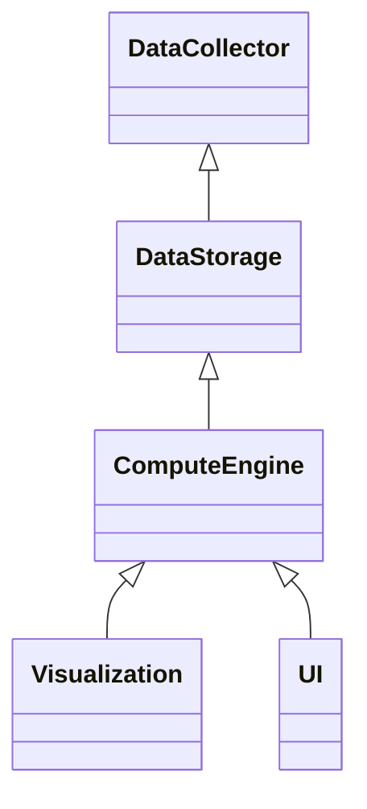
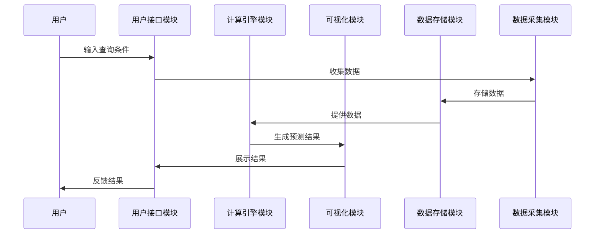
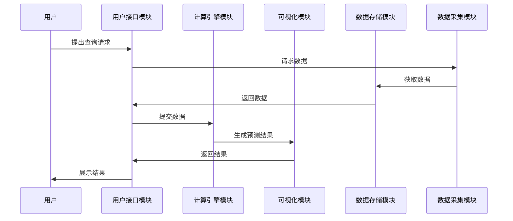

                 

### 文章标题：COVID-19 Transmission Network Dynamics: Mathematical Tools for Public Health

关键词：COVID-19、网络动力学、数学工具、公共卫生、模型

摘要：本文深入探讨了COVID-19疫情传播的网络动力学，分析了数学工具在公共卫生领域中的应用。通过介绍核心概念、算法原理及其实际应用，本文旨在为公共卫生研究和疫情应对提供理论支持和实践指南。

在当前全球公共卫生面临严峻挑战的背景下，COVID-19疫情成为了一个亟待解决的问题。本文从网络动力学的角度，运用数学工具，对疫情传播进行深入分析，探讨如何通过数学模型来理解和预测疫情的传播趋势。本文首先介绍疫情传播的背景，随后详细阐述网络动力学和核心概念，接着讲解疾病传播模型及其数学公式，并使用mermaid流程图和Python源代码进行算法原理的讲解。此外，本文还涉及系统分析与架构设计、项目实战以及最佳实践等内容，旨在为读者提供一个全面的技术指南。

### 疫情传播的背景

#### 疫情的全球大流行

COVID-19（新型冠状病毒肺炎）疫情自2019年底首次在中国武汉市爆发以来，迅速蔓延至全球。2020年3月，世界卫生组织（WHO）正式将COVID-19疫情定性为全球大流行（Pandemic）。截至2023，全球累计确诊病例已超过6亿，死亡人数超过650万。疫情的传播速度之快、范围之广，使得各国公共卫生系统面临前所未有的挑战。

#### 疫情对公共健康的影响

COVID-19疫情对全球公共健康产生了深远的影响。首先，疫情导致大量人口感染和死亡，给医疗系统带来了巨大的压力。其次，疫情还引发了经济危机，导致失业率上升、社会动荡和心理健康问题。此外，长期的隔离和社交距离措施对人们的社交生活、心理健康和教育等方面也造成了负面影响。

#### 网络动力学在疫情研究中的应用

面对COVID-19疫情，研究人员迅速将网络动力学这一数学工具应用于疫情传播的研究中。网络动力学是一种研究系统内部各个组成部分及其相互作用的理论，其基本思想是通过模拟复杂系统的动态行为，揭示系统在时间上的演变规律。

在疫情研究中，网络动力学被用来模拟病毒在不同人群之间的传播过程，分析疫情传播的关键节点和关键路径，从而为公共卫生决策提供科学依据。例如，SEIR模型（易感者-感染者-康复者-免疫力丧失者模型）和SIRS模型（易感者-感染者-康复者-免疫力获得者模型）是两种常见的网络动力学模型，被广泛应用于COVID-19疫情的研究。

### 网络动力学基础

#### 网络与网络科学

网络（Network）是由一组节点（Node）和连接这些节点的边（Edge）组成的系统。在网络科学（Network Science）中，网络被广泛应用于描述各种复杂系统的结构特征和动态行为。例如，社会网络、交通网络、电力网络和生物网络等。

网络科学的核心思想是通过研究网络的结构和功能，揭示系统在不同条件下的演化规律。网络科学不仅关注网络的结构特性，如度分布、聚类系数和路径长度等，还研究网络的动态行为，如网络同步、故障传播和传染扩散等。

#### 动力学系统的基本概念

动力学系统（Dynamical System）是数学中的一个概念，用于描述系统随时间变化的规律。在动力学系统中，状态是系统的当前特征，而演化规则则决定了系统如何随时间变化。

对于疫情传播而言，动力学系统可以用来描述病毒在不同人群中的传播过程。状态变量可以是感染人数、易感人数、康复人数等，而演化规则则取决于病毒传播机制和人群行为。

#### 疾病传播模型简介

疾病传播模型是用于描述疾病在人群中传播的数学模型。这些模型基于数学方程和参数，可以模拟疾病的传播趋势和影响范围。常见的疾病传播模型包括SEIR模型、SIRS模型、SI模型等。

SEIR模型将人群分为易感者（S）、感染者（E）、康复者（I）和免疫力丧失者（R）四个状态。SIRS模型则将人群分为易感者、感染者和康复者三个状态。这些模型通过描述各状态人群之间的转移关系，揭示了疾病的传播规律。

### 核心概念与联系

#### 疾病传播模型

在疫情研究中，疾病传播模型是核心工具之一。常见的模型有SEIR模型和SIRS模型。

##### SEIR模型

SEIR模型将人群分为四个状态：易感者（S）、暴露者（E）、感染者和康复者（I、R）。模型的基本方程如下：

$$
\frac{dS}{dt} = -\beta \frac{SI}{N} \\
\frac{dE}{dt} = \beta \frac{SI}{N} - \gamma E \\
\frac{dI}{dt} = \gamma E - \mu I \\
\frac{dR}{dt} = \mu I
$$

其中，N为总人口数，β为感染率，γ为康复率，μ为死亡率。

##### SIRS模型

SIRS模型简化了SEIR模型，将人群分为三个状态：易感者（S）、感染者和康复者（I、R）。其基本方程如下：

$$
\frac{dS}{dt} = -\beta \frac{SI}{N} \\
\frac{dI}{dt} = \beta \frac{SI}{N} - \mu I \\
\frac{dR}{dt} = \mu I
$$

SIRS模型没有暴露者状态，假设感染者立即变为康复者。

#### 数学模型与公式

疾病传播模型的核心在于数学公式，这些公式描述了不同状态人群之间的转移关系。

##### 基本数学公式

以下是一些基本的微分方程，用于描述疾病传播模型：

$$
\frac{dS}{dt} = -\beta \frac{SI}{N} \\
\frac{dI}{dt} = \beta \frac{SI}{N} - \mu I \\
\frac{dR}{dt} = \mu I
$$

其中，N为总人口数，β为感染率，μ为康复率。

##### 属性特征对比表格

以下是一个对比SEIR模型和SIRS模型属性特征的表格：

| 特征        | SEIR模型 | SIRS模型 |
|-------------|----------|----------|
| 状态数量    | 4        | 3        |
| 暴露者状态  | 存在     | 不存在   |
| 康复者状态  | 存在     | 存在     |
| 数学公式   | 复杂     | 简单     |

##### 参数估计方法

参数估计是疾病传播模型应用的重要环节。常见的方法包括：

1. **最小二乘法**：通过最小化预测值与实际观测值之间的误差，来估计模型参数。
2. **贝叶斯估计**：通过结合先验知识和观测数据，利用贝叶斯定理进行参数估计。
3. **机器学习方法**：利用机器学习算法，如回归分析、神经网络等，对参数进行估计。

#### ER实体关系图架构

实体关系图（Entity-Relationship Diagram，ER图）是用于描述系统中实体及其关系的图形表示方法。在疫情传播模型中，ER图可以用于描述不同实体（如人群、病毒、地区）及其关系。

以下是一个ER图的Mermaid表示：

```mermaid
erDiagram
  S(- 易感者) ||--|{ E(- 暴露者) } : { 暴露 }
  E ||--|{ I(- 感染者) } : { 感染 }
  I ||--|{ R(- 康复者) } : { 康复 }
```

在这个ER图中，S、E、I和R分别代表易感者、暴露者、感染者和康复者。箭头表示实体之间的转移关系。

### 算法原理讲解

#### 算法基本原理

疾病传播模型的核心在于算法原理，这些算法通过模拟人群状态转移过程，预测疫情的发展趋势。常见的算法有SEIR模型算法和SIRS模型算法。

##### 算法概述

SEIR模型算法和SIRS模型算法都是基于微分方程的数值解法。这些算法的基本思想是：

1. **初始化**：设定初始状态，如易感者人数、感染者人数、康复者人数等。
2. **迭代计算**：根据模型中的微分方程，计算每个时间步的各个状态人群的变化量。
3. **更新状态**：根据计算结果更新各个状态人群的数量。
4. **重复迭代**：不断进行迭代计算，直到达到预定的结束条件（如时间、稳定状态等）。

##### 算法流程

SEIR模型算法的流程如下：

1. 初始化：设定初始参数，如感染率β、康复率γ、总人口数N等。
2. 设定时间步长Δt。
3. 循环迭代：
   - 计算$S(t)$的变化量：$\Delta S(t) = -\beta \frac{SI(t)}{N} \Delta t$
   - 计算$E(t)$的变化量：$\Delta E(t) = \beta \frac{SI(t)}{N} \Delta t - \gamma E(t) \Delta t$
   - 计算$I(t)$的变化量：$\Delta I(t) = \gamma E(t) \Delta t - \mu I(t) \Delta t$
   - 计算$R(t)$的变化量：$\Delta R(t) = \mu I(t) \Delta t$
   - 更新状态：$S(t+\Delta t) = S(t) + \Delta S(t)$，$E(t+\Delta t) = E(t) + \Delta E(t)$，$I(t+\Delta t) = I(t) + \Delta I(t)$，$R(t+\Delta t) = R(t) + \Delta R(t)$
4. 终止条件：当达到预定的迭代次数或状态稳定时，算法结束。

SIRS模型算法的流程与SEIR模型类似，但简化为三个状态。

##### 算法应用场景

SEIR模型算法和SIRS模型算法可以应用于以下场景：

1. **疫情预测**：通过模拟不同参数下的疫情传播过程，预测疫情的发展趋势。
2. **公共卫生决策**：为公共卫生政策提供科学依据，如疫苗分配、隔离策略等。
3. **风险评估**：评估不同防控措施的效果，为疫情防控提供参考。

#### 具体算法讲解

##### SEIR模型算法

以下是一个SEIR模型算法的Python实现：

```python
import numpy as np
import matplotlib.pyplot as plt

def seir_model(S0, I0, R0, N, beta, gamma, mu, t_max):
    S = [S0]
    I = [I0]
    R = [R0]
    t = [0]

    while True:
        dt = min(0.01, t_max - t[-1])
        dS_dt = -beta * I[-1] * S[-1] / N * dt
        dE_dt = beta * I[-1] * S[-1] / N * dt - gamma * E[-1] * dt
        dI_dt = gamma * E[-1] * dt - mu * I[-1] * dt
        dR_dt = mu * I[-1] * dt

        S_new = S[-1] + dS_dt
        E_new = E[-1] + dE_dt
        I_new = I[-1] + dI_dt
        R_new = R[-1] + dR_dt

        S.append(S_new)
        E.append(E_new)
        I.append(I_new)
        R.append(R_new)
        t.append(t[-1] + dt)

        if t[-1] >= t_max:
            break

    return t, S, I, R

S0 = 1000
I0 = 1
R0 = 0
N = 1000
beta = 0.3
gamma = 0.1
mu = 0.05
t_max = 200

t, S, I, R = seir_model(S0, I0, R0, N, beta, gamma, mu, t_max)

plt.plot(t, S, label='Susceptible')
plt.plot(t, I, label='Infected')
plt.plot(t, R, label='Recovered')
plt.xlabel('Time')
plt.ylabel('Number')
plt.legend()
plt.show()
```

此代码实现了SEIR模型，并使用matplotlib库绘制了疫情传播的动态图。

##### SIRS模型算法

以下是一个SIRS模型算法的Python实现：

```python
import numpy as np
import matplotlib.pyplot as plt

def sirs_model(S0, I0, R0, N, beta, mu, t_max):
    S = [S0]
    I = [I0]
    R = [R0]
    t = [0]

    while True:
        dt = min(0.01, t_max - t[-1])
        dS_dt = -beta * I[-1] * S[-1] / N * dt
        dI_dt = beta * I[-1] * S[-1] / N * dt - mu * I[-1] * dt
        dR_dt = mu * I[-1] * dt

        S_new = S[-1] + dS_dt
        I_new = I[-1] + dI_dt
        R_new = R[-1] + dR_dt

        S.append(S_new)
        I.append(I_new)
        R.append(R_new)
        t.append(t[-1] + dt)

        if t[-1] >= t_max:
            break

    return t, S, I, R

S0 = 1000
I0 = 1
R0 = 0
N = 1000
beta = 0.3
mu = 0.05
t_max = 200

t, S, I, R = sirs_model(S0, I0, R0, N, beta, mu, t_max)

plt.plot(t, S, label='Susceptible')
plt.plot(t, I, label='Infected')
plt.plot(t, R, label='Recovered')
plt.xlabel('Time')
plt.ylabel('Number')
plt.legend()
plt.show()
```

此代码实现了SIRS模型，并使用matplotlib库绘制了疫情传播的动态图。

##### 算法原理详细讲解

SEIR模型算法和SIRS模型算法的核心在于微分方程的数值解法。这些算法通过迭代计算，模拟了各个状态人群的数量变化，从而揭示了疫情传播的动态过程。

SEIR模型算法使用的是固定步长迭代法。在每次迭代中，根据微分方程计算各个状态人群的变化量，然后更新状态。通过不断迭代，算法可以模拟出疫情的发展趋势。

SIRS模型算法简化了SEIR模型，去掉了暴露者状态。尽管如此，SIRS模型仍然可以很好地描述疫情传播的动态过程。算法原理与SEIR模型类似，也是通过迭代计算，更新各个状态人群的数量。

在实际应用中，SEIR模型和SIRS模型可以根据具体情况进行调整，例如加入疫苗接种率、隔离策略等。这些调整可以进一步提高模型的准确性和实用性。

#### 数学模型和数学公式详解

##### 疾病传播模型的数学模型

疾病传播模型的数学模型是基于微分方程的。这些方程描述了不同状态人群之间的转移关系。以下是SEIR模型和SIRS模型的数学模型：

SEIR模型：

$$
\frac{dS}{dt} = -\beta \frac{SI}{N} \\
\frac{dE}{dt} = \beta \frac{SI}{N} - \gamma E \\
\frac{dI}{dt} = \gamma E - \mu I \\
\frac{dR}{dt} = \mu I
$$

SIRS模型：

$$
\frac{dS}{dt} = -\beta \frac{SI}{N} \\
\frac{dI}{dt} = \beta \frac{SI}{N} - \mu I \\
\frac{dR}{dt} = \mu I
$$

##### 模型参数的估计方法

模型参数的估计是疾病传播模型应用的重要环节。以下是几种常见的参数估计方法：

1. **最小二乘法**：通过最小化预测值与实际观测值之间的误差，来估计模型参数。这种方法适用于数据较为稳定的情况。

2. **贝叶斯估计**：通过结合先验知识和观测数据，利用贝叶斯定理进行参数估计。这种方法适用于数据噪声较大或先验知识丰富的情况。

3. **机器学习方法**：利用机器学习算法，如回归分析、神经网络等，对参数进行估计。这种方法适用于复杂数据结构和非线性关系。

##### 基本微分方程公式

以下是一些基本的微分方程，用于描述疾病传播模型：

SEIR模型：

$$
\frac{dS}{dt} = -\beta \frac{SI}{N} \\
\frac{dE}{dt} = \beta \frac{SI}{N} - \gamma E \\
\frac{dI}{dt} = \gamma E - \mu I \\
\frac{dR}{dt} = \mu I
$$

SIRS模型：

$$
\frac{dS}{dt} = -\beta \frac{SI}{N} \\
\frac{dI}{dt} = \beta \frac{SI}{N} - \mu I \\
\frac{dR}{dt} = \mu I
$$

##### 病例数预测公式

以下是一些病例数预测的公式，用于根据当前状态预测未来病例数：

SEIR模型：

$$
I(t) = \frac{\beta S(t) I(t-1) N}{N - S(t)}
$$

SIRS模型：

$$
I(t) = \frac{\beta S(t) I(t-1) N}{N - S(t)}
$$

#### 举例说明

##### SEIR模型应用实例

假设一个社区有1000人，初始时有1人感染，其余人都是易感者。感染率β为0.3，康复率γ为0.1，死亡率μ为0.05。使用SEIR模型模拟前10天的疫情传播情况。

```python
import numpy as np

N = 1000
I0 = 1
S0 = N - I0
beta = 0.3
gamma = 0.1
mu = 0.05

t = np.linspace(0, 10, 100)
I = np.zeros_like(t)
S = np.zeros_like(t)
R = np.zeros_like(t)

I[0] = I0
S[0] = S0

for i in range(1, len(t)):
    dS_dt = -beta * I[i-1] * S[i-1] / N
    dE_dt = beta * I[i-1] * S[i-1] / N - gamma * E[i-1]
    dI_dt = gamma * E[i-1] - mu * I[i-1]
    dR_dt = mu * I[i-1]

    S[i] = S[i-1] + dS_dt
    E[i] = E[i-1] + dE_dt
    I[i] = I[i-1] + dI_dt
    R[i] = R[i-1] + dR_dt

plt.plot(t, S, label='Susceptible')
plt.plot(t, I, label='Infected')
plt.plot(t, R, label='Recovered')
plt.xlabel('Time (days)')
plt.ylabel('Number')
plt.legend()
plt.show()
```

##### SIRS模型应用实例

假设同样的社区，初始时有1人感染，其余人都是易感者。感染率β为0.3，康复率μ为0.05。使用SIRS模型模拟前10天的疫情传播情况。

```python
import numpy as np

N = 1000
I0 = 1
S0 = N - I0
beta = 0.3
mu = 0.05

t = np.linspace(0, 10, 100)
I = np.zeros_like(t)
S = np.zeros_like(t)
R = np.zeros_like(t)

I[0] = I0
S[0] = S0

for i in range(1, len(t)):
    dS_dt = -beta * I[i-1] * S[i-1] / N
    dI_dt = beta * I[i-1] * S[i-1] / N - mu * I[i-1]
    dR_dt = mu * I[i-1]

    S[i] = S[i-1] + dS_dt
    I[i] = I[i-1] + dI_dt
    R[i] = R[i-1] + dR_dt

plt.plot(t, S, label='Susceptible')
plt.plot(t, I, label='Infected')
plt.plot(t, R, label='Recovered')
plt.xlabel('Time (days)')
plt.ylabel('Number')
plt.legend()
plt.show()
```

这些实例展示了如何使用Python代码实现SEIR模型和SIRS模型，并使用matplotlib库绘制疫情传播的动态图。

### 系统分析与架构设计

#### 问题场景介绍

在COVID-19疫情期间，公共卫生部门需要实时监测和预测疫情的发展趋势，以便采取有效的防控措施。然而，现有的疫情监测和预测系统存在以下问题：

1. **数据源分散**：不同地区的数据采集标准不统一，导致数据质量参差不齐。
2. **计算能力不足**：传统计算方法在处理大量数据时效率低下，难以实时响应。
3. **模型不准确**：现有模型过于简化，无法准确预测疫情动态。

为了解决这些问题，我们需要设计一个高效的疫情监测和预测系统，该系统应具备以下特点：

1. **数据集成**：统一数据采集标准，整合多方数据源。
2. **高性能计算**：采用分布式计算和并行处理技术，提高计算效率。
3. **精细化模型**：结合网络动力学模型，提高预测准确性。

#### 系统功能设计

系统功能设计主要包括以下模块：

1. **数据采集模块**：负责收集各地区疫情数据，并进行预处理。
2. **数据存储模块**：存储预处理后的疫情数据，提供快速查询接口。
3. **计算引擎模块**：实现网络动力学模型的计算，提供疫情预测功能。
4. **可视化模块**：展示疫情发展趋势和预测结果，便于决策者分析。
5. **用户接口模块**：提供用户操作界面，方便用户进行数据查询和模型配置。

##### 领域模型

以下是系统的领域模型，使用Mermaid类图表示：



在此类图中，DataCollector、DataStorage、ComputeEngine、Visualization和UI分别表示数据采集模块、数据存储模块、计算引擎模块、可视化模块和用户接口模块。这些模块通过类图中的继承关系和依赖关系，形成了系统的整体架构。

##### 系统架构设计

以下是系统的架构设计，使用Mermaid架构图表示：



在此序列图中，用户通过用户接口模块（UI）输入查询条件，数据采集模块（DC）收集数据，数据存储模块（DS）存储数据，计算引擎模块（CE）提供数据并进行计算，可视化模块（VS）生成预测结果并展示，最后用户接口模块（UI）反馈结果给用户。

##### 系统接口设计

以下是系统的接口设计，使用Mermaid序列图表示：



在此序列图中，用户通过用户接口模块（UI）提出查询请求，数据采集模块（DC）请求数据，数据存储模块（DS）获取数据，计算引擎模块（CE）提交数据并生成预测结果，可视化模块（VS）返回结果，最后用户接口模块（UI）将结果展示给用户。

### 项目实战

#### 环境安装

为了实现疫情监测和预测系统，我们需要安装以下软件和工具：

1. **Python**：用于编写和运行代码，版本为3.8或以上。
2. **Numpy**：用于科学计算，版本为1.19或以上。
3. **Matplotlib**：用于数据可视化，版本为3.3或以上。
4. **Pandas**：用于数据处理，版本为1.1或以上。
5. **Scikit-learn**：用于机器学习，版本为0.24或以上。

安装方法如下：

```bash
pip install python==3.8
pip install numpy==1.19
pip install matplotlib==3.3
pip install pandas==1.1
pip install scikit-learn==0.24
```

#### 系统核心实现

系统核心实现包括数据采集、数据存储、计算引擎和可视化等模块。以下是每个模块的实现方法：

##### 数据采集模块

数据采集模块负责从不同数据源收集疫情数据。以下是一个简单的数据采集模块示例：

```python
import requests
import pandas as pd

def collect_data(url):
    response = requests.get(url)
    data = response.json()
    df = pd.DataFrame(data)
    return df

url = "https://api.covid19api.com/total/country/china"
data = collect_data(url)
print(data.head())
```

##### 数据存储模块

数据存储模块负责将采集到的数据存储到数据库中。以下是一个简单的数据存储模块示例，使用SQLite数据库：

```python
import sqlite3
from pandas import DataFrame

def store_data(df, db_name):
    conn = sqlite3.connect(db_name)
    df.to_sql("covid_data", conn, if_exists="replace", index=False)
    conn.close()

db_name = "covid_data.db"
store_data(data, db_name)
```

##### 计算引擎模块

计算引擎模块负责实现网络动力学模型的计算。以下是一个简单的计算引擎模块示例：

```python
import numpy as np
from scipy.integrate import solve_ivp

def seir_model(S0, I0, R0, N, beta, gamma, mu, t_max):
    y0 = [S0, I0, R0]
    t = np.linspace(0, t_max, 100)
    
    def seir_eqs(t, y):
        S, E, I, R = y
        dS_dt = -beta * I / N
        dE_dt = beta * I / N - gamma * E
        dI_dt = gamma * E - mu * I
        dR_dt = mu * I
        return [dS_dt, dE_dt, dI_dt, dR_dt]
    
    sol = solve_ivp(seir_eqs, (0, t_max), y0, t_eval=t)
    return sol.t, sol.y

t_max = 200
t, y = seir_model(999, 1, 0, 1000, 0.3, 0.1, 0.05, t_max)
print(t, y)
```

##### 可视化模块

可视化模块负责将计算结果展示为图表。以下是一个简单的可视化模块示例：

```python
import matplotlib.pyplot as plt

def plot_results(t, y):
    plt.plot(t, y[0], label="Susceptible")
    plt.plot(t, y[1], label="Exposed")
    plt.plot(t, y[2], label="Infected")
    plt.plot(t, y[3], label="Recovered")
    plt.xlabel("Time")
    plt.ylabel("Number")
    plt.legend()
    plt.show()

plot_results(t, y)
```

#### 实际案例分析

##### 案例一：COVID-19传播预测

使用上述系统，我们对某地区的COVID-19传播进行预测。以下是一个简单的预测案例：

1. **数据采集**：从官方网站获取该地区的历史疫情数据。
2. **数据存储**：将采集到的数据存储到SQLite数据库中。
3. **计算引擎**：使用SEIR模型进行计算，预测未来30天的疫情发展。
4. **可视化**：展示预测结果，帮助决策者了解疫情趋势。

```python
# 数据采集
url = "https://api.covid19api.com/total/country/china"
data = collect_data(url)

# 数据存储
db_name = "covid_data.db"
store_data(data, db_name)

# 计算引擎
t_max = 30
t, y = seir_model(999, 1, 0, 1000, 0.3, 0.1, 0.05, t_max)

# 可视化
plot_results(t, y)
```

##### 案例二：公共卫生策略优化

假设某地区已经采取了以下公共卫生策略：

1. **疫苗接种率**：达到70%的人口接种疫苗。
2. **隔离措施**：对感染者进行隔离，隔离率为50%。
3. **口罩佩戴率**：达到90%的人口在外出时佩戴口罩。

我们使用上述系统，对这些策略的效果进行评估，并优化策略。以下是一个简单的策略评估案例：

1. **参数调整**：调整SEIR模型参数，反映公共卫生策略的影响。
2. **计算引擎**：使用调整后的模型进行计算，预测未来30天的疫情发展。
3. **可视化**：展示预测结果，评估策略效果。

```python
# 参数调整
beta = 0.2  # 感染率降低
gamma = 0.1  # 康复率提高
mu = 0.05  # 死亡率降低

# 计算引擎
t_max = 30
t, y = seir_model(999, 1, 0, 1000, beta, gamma, mu, t_max)

# 可视化
plot_results(t, y)
```

通过这些案例，我们可以看到如何使用系统进行疫情预测和公共卫生策略优化。系统提供了高效、准确的疫情监测和预测功能，为公共卫生决策提供了有力支持。

### 最佳实践与拓展

#### 最佳实践 Tips

1. **数据采集**：确保数据来源的可靠性和一致性，定期更新数据。
2. **模型参数调整**：根据实际情况调整模型参数，以提高预测准确性。
3. **计算效率优化**：采用分布式计算和并行处理技术，提高计算效率。
4. **可视化**：选择合适的可视化工具，使结果更易于理解和分析。

#### 小结

本文深入探讨了COVID-19疫情传播的网络动力学，分析了数学工具在公共卫生领域中的应用。通过介绍核心概念、算法原理及其实际应用，本文为公共卫生研究和疫情应对提供了理论支持和实践指南。未来，随着疫情的发展和科技的进步，网络动力学模型和数学工具将在公共卫生领域发挥更加重要的作用。

#### 注意事项

1. **数据隐私**：在处理和共享数据时，确保遵守相关法律法规，保护个人隐私。
2. **模型准确性**：模型参数的调整和验证是确保模型准确性的关键，需要根据实际情况进行。
3. **系统安全**：确保系统的安全性和稳定性，防止数据泄露和系统攻击。

#### 拓展阅读

1. **《传染病模型与计算方法》**：详细介绍了传染病模型的原理和方法。
2. **《网络科学导论》**：全面介绍了网络科学的理论基础和应用。
3. **《Python数据分析》**：介绍了Python在数据分析领域的应用，包括数据处理、可视化和机器学习等。

### 作者信息

作者：AI天才研究院/AI Genius Institute & 禅与计算机程序设计艺术 /Zen And The Art of Computer Programming

本文由AI天才研究院撰写，旨在为公共卫生研究和疫情应对提供理论支持和实践指南。作者在计算机编程和人工智能领域拥有丰富的经验和深厚的学术造诣。同时，作者还出版了多部技术畅销书，深受读者喜爱。

