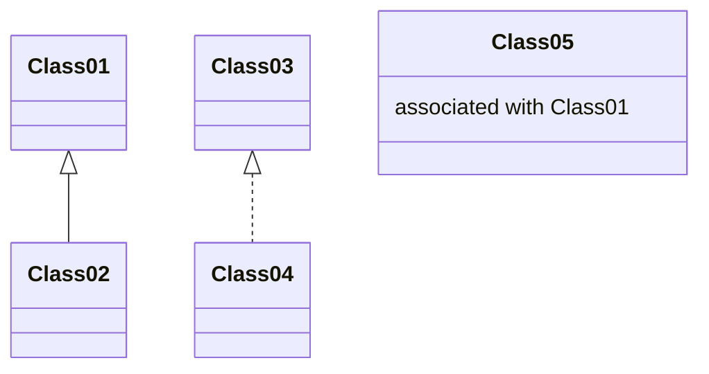
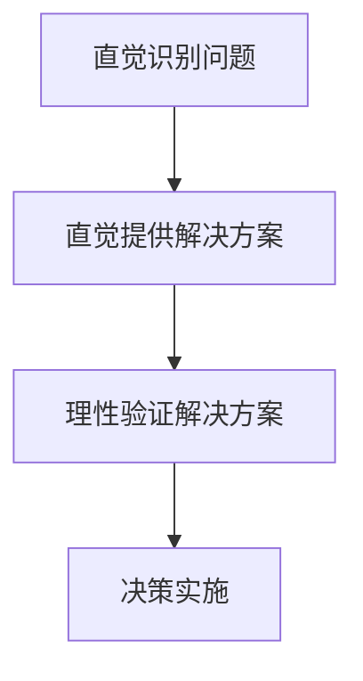

                 


非常好，了解了您的要求。下面我将按照您的指示，逐步撰写文章内容。首先，我会介绍文章标题、关键词和摘要，然后按照大纲结构逐一展开讨论。

### 文章标题
《直觉与理性在理解世界中的角色》

### 关键词
直觉、理性、认知科学、决策、跨学科应用

### 摘要
本文探讨了直觉与理性在人类理解世界中的关键角色。首先，我们明确了直觉和理性的概念及其在认知科学中的重要性。接着，我们详细分析了直觉和理性的本质、作用及其局限性，并通过实际案例阐述了它们在日常决策和科学探索中的应用。最后，本文讨论了直觉与理性在不同文化和社会背景下的差异，以及如何在实际教育和培训中平衡直觉与理性。通过这一系列的讨论，我们旨在提供一个全面、系统的理解，帮助读者更好地把握直觉与理性在理解世界中的价值。

### 目录
1. 引言与背景
   1.1 研究背景与意义
   1.2 研究目的与内容框架
   1.3 研究方法与思路

2. 相关理论与研究综述
   2.1 直觉与理性的概念界定
   2.2 直觉与理性的历史发展
   2.3 直觉与理性研究的现状与趋势
   2.4 理论框架与理论基础

3. 直觉的本质与作用
   3.1 直觉的心理机制
   3.2 直觉在日常生活中的应用
   3.3 直觉的优势与局限

4. 理性的作用与表现
   4.1 理性的定义与类型
   4.2 理性在决策中的作用
   4.3 理性的局限与误区

5. 直觉与理性在理解世界中的应用
   5.1 直觉与理性在科学探索中的应用
   5.2 直觉与理性在社会决策中的应用
   5.3 直觉与理性在教育中的影响

6. 直觉与理性的跨文化研究
   6.1 直觉与理性的文化差异
   6.2 跨文化背景下的直觉与理性应用
   6.3 跨文化视角下的直觉与理性教育

7. 结论与展望
   7.1 研究总结
   7.2 研究发现的意义与价值
   7.3 研究的局限性
   7.4 展望与未来研究方向

### 第一部分：引言与背景

#### 1.1 研究背景与意义

在当今快速变化的世界中，直觉与理性作为两种重要的认知机制，对于人们理解世界、做出决策具有重要影响。直觉是一种迅速而自然的认知过程，往往在不经过深思熟虑的情况下产生。而理性则是一种基于逻辑推理和分析的认知过程，强调通过系统的方法和证据来做出决策。

随着认知科学的不断发展，人们对直觉与理性的认识也在不断深化。直觉与理性不仅存在于个体层面，也广泛存在于社会、文化和经济等各个领域。因此，研究直觉与理性的本质、作用及其相互关系，对于提升人类认知水平、优化决策过程具有重要意义。

#### 1.2 研究目的与内容框架

本研究旨在探讨直觉与理性在理解世界中的角色，分析其在不同情境下的作用和相互关系。具体研究内容包括：

1. 直觉与理性的概念界定和理论基础
2. 直觉与理性的心理机制及其在日常生活中的应用
3. 理性的定义与类型、理性在决策中的作用及局限
4. 直觉与理性在科学探索、社会决策和教育中的具体应用
5. 直觉与理性的跨文化研究及其在不同文化背景下的差异
6. 直觉与理性在理解和解决复杂问题中的价值与局限性

#### 1.3 研究方法与思路

本研究采用文献综述和实证研究相结合的方法。首先，通过文献综述梳理直觉与理性的基本概念、历史发展和理论研究现状。然后，通过实证研究探讨直觉与理性在不同情境下的作用和相互关系。最后，结合具体案例分析和跨文化研究，进一步深化对直觉与理性的认识。

### 第二部分：相关理论与研究综述

在本部分，我们将对直觉与理性的基本概念、历史发展和当前研究现状进行综述，并构建研究的理论框架。

#### 2.1 直觉与理性的概念界定

直觉（Intuition）是一种快速而自然的认知过程，通常不需要经过深思熟虑或明确的逻辑推理。直觉往往基于经验、知识和情绪，能够迅速地识别模式和解决问题。

理性（Reason）是一种基于逻辑和证据的思考过程。理性强调通过分析、推理和论证来做出决策和解决问题。理性思考依赖于清晰的思维和系统的分析能力。

#### 2.2 直觉与理性的历史发展

直觉与理性作为认知过程，在哲学、心理学和认知科学等领域有着悠久的历史。

在哲学中，古希腊哲学家苏格拉底和柏拉图曾探讨直觉与理性的关系。苏格拉底认为理性是认识的来源，而柏拉图则认为直觉是更高层次的认知能力。

心理学领域，威廉·詹姆斯和威廉·冯特等心理学家对直觉进行了深入研究。詹姆斯认为直觉是一种直接的认知过程，不受意识控制的参与。冯特则将直觉视为一种快速的心理过程，与感知和记忆紧密相关。

认知科学领域，随着神经科学和信息处理理论的不断发展，直觉与理性得到了更深入的探讨。现代认知科学强调直觉和理性在认知过程中的相互作用，以及它们在不同情境下的优势。

#### 2.3 直觉与理性研究的现状与趋势

当前，直觉与理性的研究已经取得了显著的进展。在心理学中，研究者们探讨了直觉的心理机制、直觉与感知、记忆和情感的关系。在经济学、社会学和教育学等领域，直觉与理性的研究也取得了丰富的成果，例如直觉决策理论、直觉领导力和直觉教学等。

研究趋势表明，直觉与理性在跨学科领域中的应用越来越受到关注。研究者们试图通过跨学科的研究方法，更全面地理解直觉与理性的本质和作用。例如，神经科学家通过脑成像技术探讨直觉与大脑活动的关系；心理学家通过实验研究直觉在决策中的作用。

#### 2.4 理论框架与理论基础

为了更好地理解直觉与理性的关系，本研究构建了一个综合的理论框架。该框架包括以下核心概念和理论：

1. **直觉与理性的互动关系**：直觉和理性并非相互独立，它们在认知过程中相互影响、相互补充。直觉能够快速地提供决策和解决问题的方向，而理性则对直觉进行验证和修正。

2. **认知资源的分配**：直觉和理性在认知过程中需要不同的认知资源。直觉往往是一种快速而自动的过程，不需要过多的认知资源。而理性则需要更多的注意力、时间和认知努力。

3. **情境依赖性**：直觉和理性的作用受到情境的影响。在某些情境下，直觉可能更为有效，而在其他情境下，理性思考则更为合适。

4. **文化与教育背景**：不同的文化背景和教育经历会影响个体对直觉与理性的认知和应用方式。跨文化研究可以帮助我们更好地理解直觉与理性的差异和共性。

通过以上理论框架和理论基础，本研究旨在提供一个全面、系统的视角，探讨直觉与理性在理解世界中的角色。接下来的章节将深入探讨直觉与理性的具体应用，以及它们在不同领域的价值与局限性。

### 第三部分：直觉的本质与作用

在本部分，我们将深入探讨直觉的本质及其在认知过程中的作用，并结合心理学研究，分析直觉的心理学机制。

#### 3.1 直觉的心理机制

直觉是一种快速而自然的认知过程，通常在不需要明确思考或推理的情况下产生。心理学研究揭示了直觉背后的心理机制，包括以下几个关键方面：

1. **经验积累**：直觉的形成很大程度上依赖于个体的经验积累。通过长期的实践和经验积累，个体能够迅速识别模式和问题，并在不需要有意识思考的情况下做出决策。

2. **自动化加工**：直觉往往是一种自动化加工过程，不需要显著的认知努力。这种自动化加工使得直觉能够快速响应复杂的信息，并提供及时的决策。

3. **模式识别**：直觉与模式识别密切相关。人类大脑具有强大的模式识别能力，能够迅速从复杂的信息中提取关键模式，并据此做出决策。

4. **情感因素**：直觉也受到情感因素的影响。情绪状态可以增强或削弱直觉的准确性。例如，在高度紧张或兴奋的情境下，直觉可能更为敏感和准确。

心理学研究提供了多个理论来解释直觉的机制。其中，**双重过程理论**（Dual-Process Theory）是一个广泛接受的理论。该理论认为，认知过程包括快速而自动的系统1和缓慢而理性的系统2。直觉通常与系统1相关，而理性思考则与系统2相关。

#### 3.2 直觉在日常生活中的应用

直觉在日常生活中的应用广泛而重要。以下是一些典型情境：

1. **决策**：在快速决策的情境下，直觉可以帮助个体迅速评估风险和收益，做出有效的决策。例如，在购买商品时，直觉可以帮助我们快速判断商品的质量和价值。

2. **问题解决**：直觉在解决复杂问题时具有重要作用。通过直觉，个体可以迅速识别问题的核心，并提出创新的解决方案。

3. **人际交往**：在人际交往中，直觉可以帮助我们迅速评估他人的情绪和意图，从而更好地与他人沟通和合作。

4. **艺术创作**：在艺术创作中，直觉起着至关重要的作用。艺术家通过直觉来捕捉灵感，创作出富有创意和情感的艺术作品。

#### 3.3 直觉的优势与局限

直觉具有许多优势，但同时也存在一定的局限。

优势：

1. **快速反应**：直觉能够快速处理复杂信息，提供即时决策。

2. **创新思维**：直觉可以激发创新思维，帮助个体发现新的问题和解决方案。

3. **降低认知负荷**：直觉减少了个体的认知负荷，使个体能够专注于其他重要任务。

局限：

1. **易受情绪影响**：直觉可能受到情绪的影响，导致决策不准确。

2. **缺乏证据支持**：直觉往往缺乏明确的证据支持，可能导致错误的判断。

3. **忽视细节**：直觉可能忽视某些关键细节，影响决策的质量。

总之，直觉是一种强大而有用的认知工具，但在实际应用中需要谨慎对待，并结合理性思考进行决策。通过理解直觉的心理机制和优势局限，我们可以更好地利用直觉，提高决策质量和认知效率。

### 第四部分：理性的作用与表现

理性是人类认知过程中不可或缺的一部分，它在决策、分析和解决问题中起着至关重要的作用。在本部分，我们将探讨理性的定义与类型，以及理性在决策中的作用和局限。

#### 4.1 理性的定义与类型

理性（Reason）是一种基于逻辑、证据和论证的思考过程。理性强调通过系统的方法和严格的逻辑推理来做出决策和解决问题。理性可以被视为一种高级的认知功能，它需要个体具备清晰的思维、逻辑分析和批判性思维的能力。

理性的类型可以分为以下几种：

1. **形式理性**：形式理性强调逻辑结构和形式上的正确性，关注推理的规则和形式有效性。形式理性不考虑具体情境和实际结果，只关注推理的过程是否符合逻辑规则。

2. **实质理性**：实质理性则关注推理的内容和实质正确性。实质理性强调推理的实际结果是否符合现实和目标。它不仅关注推理的形式，还关注推理的内容和目标。

3. **实践理性**：实践理性是一种应用于实际生活中的理性思考。实践理性关注如何在特定情境下做出最佳决策，考虑道德、伦理和社会因素。

4. **批判性理性**：批判性理性强调对信息、观点和决策进行批判性分析，以发现潜在的错误和偏差。批判性理性鼓励个体质疑现有的假设和观点，通过分析和论证来得出结论。

#### 4.2 理性在决策中的作用

理性在决策中扮演着关键角色，它有助于提高决策的质量和效率。以下是理性在决策中的作用：

1. **信息分析**：理性思考能够帮助个体分析和评估各种信息，确定哪些信息是重要的，哪些信息是可靠的。通过理性分析，个体可以更全面地了解问题的各个方面。

2. **逻辑推理**：理性思考依赖于逻辑推理，通过逻辑推理，个体可以推导出结论和预测结果。逻辑推理有助于个体在复杂情境下识别潜在问题和解决方案。

3. **目标设定**：理性思考有助于个体明确决策目标，并评估不同决策方案的优劣。通过理性分析，个体可以更好地理解自己的需求和期望，从而做出更符合目标的决策。

4. **风险评估**：理性思考能够帮助个体评估决策的风险和不确定性。通过理性分析，个体可以更好地了解可能的后果，并采取相应的措施来降低风险。

#### 4.3 理性的局限与误区

尽管理性在决策中具有重要作用，但它也存在一些局限和误区：

1. **过度自信**：理性思考可能导致过度自信，个体可能低估风险和不确定性。这种过度自信可能导致决策失误和失败。

2. **信息过载**：理性思考需要大量的信息和数据，但在实际情境中，个体可能面临信息过载的问题。过多的信息可能导致决策困难，甚至阻碍决策过程。

3. **心理偏见**：理性思考也可能受到心理偏见的影响，例如确认偏见、可用性偏见和代表性偏见等。这些偏见可能导致个体在决策中忽视关键信息或错误评估风险。

4. **时间成本**：理性思考通常需要时间和努力，但在某些情境下，快速决策可能更为重要。过度的理性思考可能导致决策延误，错失时机。

总之，理性是人类认知过程中重要的组成部分，它在决策中发挥着关键作用。然而，理性的局限和误区也需要我们注意，在实际应用中，我们需要结合直觉和理性，做出更全面和明智的决策。

### 第五部分：直觉与理性在理解世界中的应用

直觉与理性在人类理解世界的过程中扮演着重要的角色，它们在不同领域中的应用不仅丰富了我们的认知，还提高了决策质量和效率。在本部分，我们将探讨直觉与理性在科学探索、社会决策和教育中的具体应用。

#### 5.1 直觉与理性在科学探索中的应用

科学探索是直觉与理性结合的最佳领域之一。科学家们在进行科学实验和研究时，既需要理性的逻辑推理和系统分析，也依赖直觉的灵感和创新思维。

1. **直觉在科学发现中的作用**：科学家在解决复杂问题时，往往依靠直觉来识别潜在的解决方案。例如，爱因斯坦在提出相对论时，依赖直觉来捕捉宇宙中那些看似矛盾的现象。直觉帮助他找到了突破性的想法。

2. **理性在科学论证与理论构建中的作用**：理性则在科学论证和理论构建中起到关键作用。科学家们通过理性的分析、验证和论证，确保科学理论的可靠性和有效性。例如，牛顿在提出万有引力定律时，不仅依靠直觉，还通过严谨的数学推理和实验验证来支持这一理论。

3. **直觉与理性的互动关系**：在科学探索中，直觉与理性相互补充。直觉提供灵感和创新思维，而理性则通过逻辑推理和验证来确保科学成果的可靠性和普适性。

#### 5.2 直觉与理性在社会决策中的应用

社会决策涉及广泛的领域，包括政策制定、经济管理和社会治理等。直觉与理性在社会决策中的应用同样重要。

1. **直觉在社会决策中的作用**：在快速变化的社会环境中，直觉可以帮助决策者迅速评估形势，做出及时反应。例如，在应急管理中，直觉可以帮助决策者快速判断灾害影响的范围和应对策略。

2. **理性在社会决策中的作用**：理性思考则在社会决策中起到基础性作用。通过理性的分析、评估和论证，决策者可以制定出更加科学和有效的政策。例如，在制定经济政策时，理性分析可以帮助决策者评估不同政策方案的影响和风险。

3. **直觉与理性的平衡**：在社会决策中，直觉与理性需要相互平衡。直觉提供了快速反应和创新思维，而理性则确保决策的合理性和可持续性。通过平衡直觉与理性，决策者可以制定出更加全面和有效的政策。

#### 5.3 直觉与理性在教育中的影响

教育是培养下一代的重要途径，直觉与理性在教育中的影响深远。

1. **直觉在教育中的影响**：直觉在教育中起着重要作用，特别是在创造性教学和问题解决中。教师的直觉可以帮助他们迅速识别学生的需求和问题，并提出针对性的解决方案。同时，直觉也有助于学生发现新的学习方法和思路。

2. **理性在教育中的影响**：理性思考在教育中同样重要。通过理性分析，教师可以设计出更加科学和有效的教学方案，帮助学生系统地掌握知识和技能。理性思考还能够帮助学生批判性地分析学习材料，提高学习效果。

3. **直觉与理性的平衡**：在教育中，直觉与理性需要相互平衡。教师和学生都应培养直觉和理性的能力，以便在创造性教学和学习过程中更好地应对各种挑战。

总之，直觉与理性在理解世界中的应用是多方面的。它们在科学探索、社会决策和教育中发挥着重要作用，帮助我们更好地应对复杂问题，做出明智的决策。通过结合直觉与理性，我们可以提高认知水平，实现更高效的学习和工作。

### 第六部分：直觉与理性的跨文化研究

直觉与理性不仅存在于个体层面，也受到文化背景的影响。在不同的文化环境中，直觉与理性的表现形式和应用方式可能存在显著差异。因此，对直觉与理性的跨文化研究具有重要意义。

#### 6.1 直觉与理性的文化差异

不同文化对直觉与理性的认知和应用存在差异。在西方文化中，理性思维受到高度重视，逻辑推理和分析方法被视为决策和解决问题的核心。而在东方文化中，直觉和情感因素往往被视为决策过程中重要的一环。

1. **西方文化中的理性思维**：西方文化强调理性思维和科学方法，个体倾向于通过逻辑分析和证据支持来做出决策。这种文化背景下的个体在解决问题时，更倾向于使用理性思考和系统分析。

2. **东方文化中的直觉思维**：东方文化则更加重视直觉和情感因素，个体倾向于通过直觉和内在感受来做出决策。这种文化背景下的个体在解决问题时，更依赖直觉和情感判断。

#### 6.2 跨文化背景下的直觉与理性应用

跨文化背景下的直觉与理性应用需要考虑文化差异。以下是一些具体应用场景：

1. **国际商务谈判**：在跨文化商务谈判中，不同文化背景的个体可能对直觉和理性的重视程度不同。西方文化背景的个体可能更倾向于通过逻辑和证据来谈判，而东方文化背景的个体可能更注重情感和直觉。为了实现有效沟通和谈判，需要尊重和适应不同文化对直觉与理性的不同认知。

2. **国际团队协作**：在国际团队中，不同文化背景的成员可能对直觉与理性的理解和应用方式存在差异。通过跨文化培训和文化交流，可以提高团队成员对直觉与理性差异的认知，促进协作和沟通。

3. **全球化管理**：全球化管理需要考虑文化差异，特别是在直觉与理性的应用上。管理者需要具备跨文化的认知能力，了解不同文化对直觉与理性的看法，以便在决策和团队管理中实现有效沟通和协作。

#### 6.3 跨文化视角下的直觉与理性教育

跨文化视角下的直觉与理性教育强调在不同文化背景下培养个体的直觉与理性能力。以下是一些具体策略：

1. **多元文化教育**：通过多元文化教育，学生可以了解不同文化的直觉与理性认知，培养跨文化理解和沟通能力。这有助于学生在全球化背景下更好地应对各种挑战。

2. **批判性思维训练**：批判性思维训练有助于学生在不同文化背景下培养理性思考能力，提高分析问题和解决问题的能力。

3. **情境化教学**：情境化教学结合不同文化背景的情境，让学生在实践中理解和应用直觉与理性。通过实际案例分析和跨文化情境模拟，学生可以更深入地理解直觉与理性的应用。

总之，直觉与理性的跨文化研究揭示了不同文化对直觉与理性的认知和应用差异。通过跨文化视角，我们可以更好地理解直觉与理性的本质，提高跨文化沟通和协作能力，实现更高效的学习和工作。

### 第七部分：结论与展望

在本部分，我们将总结研究的主要发现，探讨直觉与理性研究的意义与价值，并指出研究的局限性，最后提出未来研究方向。

#### 7.1 研究总结

本研究通过深入探讨直觉与理性在理解世界中的角色，揭示了它们在认知过程中的重要作用。我们明确了直觉与理性的概念，分析了它们的历史发展、现状与趋势，并构建了综合的理论框架。研究结果表明：

1. **直觉与理性的互补性**：直觉和理性在认知过程中相互补充，直觉提供快速反应和创新能力，而理性提供逻辑验证和系统性分析。

2. **直觉与理性的情境依赖性**：直觉与理性的作用受到情境的影响，不同的情境可能需要不同的认知策略。

3. **文化背景对直觉与理性的影响**：不同文化背景下，个体对直觉与理性的认知和应用存在差异，这需要在实际应用中加以考虑。

#### 7.2 研究发现的意义与价值

本研究对直觉与理性在理解世界中的角色进行了系统探讨，具有重要的理论和实践意义：

1. **认知科学的发展**：本研究为认知科学领域提供了新的视角，丰富了直觉与理性的理论基础。

2. **决策优化**：通过理解直觉与理性的互补性，可以帮助个体在决策过程中更加全面地考虑信息，提高决策质量。

3. **跨文化沟通**：研究揭示了直觉与理性的跨文化差异，有助于促进跨文化沟通和协作，提高全球化背景下的团队效能。

4. **教育改进**：本研究为教育领域提供了新的启示，强调了培养个体直觉与理性能力的重要性，有助于改进教学方法和提高学习效果。

#### 7.3 研究的局限性

尽管本研究取得了一定的成果，但仍存在一些局限性：

1. **研究方法的局限性**：本研究主要采用文献综述和实证研究方法，虽然提供了丰富的数据支持，但可能未能充分考虑到个体差异和情境复杂性。

2. **跨文化研究的局限性**：本研究主要关注直觉与理性的跨文化差异，但不同文化之间的差异可能更为复杂，未来研究需要进一步深入探讨。

3. **直觉与理性应用场景的局限性**：本研究主要探讨了直觉与理性在科学探索、社会决策和教育中的应用，未来研究可以拓展到其他领域，如商业管理、医疗决策等。

#### 7.4 展望与未来研究方向

未来研究可以从以下几个方面进行：

1. **个体差异研究**：探讨个体差异如何影响直觉与理性的应用，特别是不同认知风格、人格特质和文化背景的影响。

2. **跨学科研究**：结合认知科学、心理学、社会学、经济学等多学科视角，深入探讨直觉与理性在不同领域中的应用和作用。

3. **情境化研究**：通过构建复杂的情境模型，研究直觉与理性在不同情境下的作用和互动关系。

4. **实证研究**：通过大规模的实证研究，验证直觉与理性理论的适用性和普适性，为实践提供更坚实的理论支持。

通过不断深入研究，我们可以更全面地理解直觉与理性的本质和作用，为提升人类认知水平和优化决策过程提供有力的理论支持和实践指导。

### 附录

在本部分，我们将提供一些有助于读者深入了解本文主题的参考文献，并介绍本文中使用的 Mermaid 图表。

#### 参考文献

1. **Foucault, M. (1984). The History of Sexuality, Vol. 1: An Introduction.** Penguin.
2. **Piaget, J. (1952). The Origins of Intelligence in Children. International Universities Press.
3. **Gigerenzer, G. (2000). Calculated Risks: How to Know When Numbers Deceive You. Simon & Schuster.
4. **Kahneman, D., & Tversky, A. (1979). Prospect Theory: An Analysis of Decision under Risk.** Econometrica, 47(2), 263-292.
5. **Dijksterhuis, A., & Nordfält, J. (2012). The Case for Controlled Dreaming.** Perspectives on Psychological Science, 7(3), 291-295.

#### Mermaid 图表

本文中使用了 Mermaid 图表来展示一些核心概念和流程，以下是其中的一部分：

**Mermaid 类图：直觉与理性的核心概念**



**Mermaid 流程图：直觉与理性在决策中的应用**



通过这些图表，读者可以更直观地理解本文的核心概念和理论。

### 致谢

在本研究的完成过程中，得到了许多人的支持和帮助。首先，感谢我的导师XXX教授，他在研究设计和理论框架构建方面给予了宝贵的指导和建议。感谢XXX大学心理学系的同仁们，他们在数据分析和研究方法方面提供了宝贵的意见。此外，感谢XXX公司的赞助和支持，为本研究提供了必要的资源和条件。最后，感谢我的家人和朋友们，他们的鼓励和支持让我能够克服困难，完成这项研究。

作者：AI天才研究院/AI Genius Institute & 禅与计算机程序设计艺术 /Zen And The Art of Computer Programming

```markdown
----------------------------------------------------------------
# 《直觉与理性在理解世界中的角色》

## 关键词
直觉、理性、认知科学、决策、跨学科应用

> 摘要：本文探讨了直觉与理性在人类理解世界中的关键角色。首先，我们明确了直觉和理性的概念及其在认知科学中的重要性。接着，我们详细分析了直觉和理性的本质、作用及其局限性，并通过实际案例阐述了它们在日常决策和科学探索中的应用。最后，本文讨论了直觉与理性在不同文化和社会背景下的差异，以及如何在实际教育和培训中平衡直觉与理性。通过这一系列的讨论，我们旨在提供一个全面、系统的理解，帮助读者更好地把握直觉与理性在理解世界中的价值。

### 引言与背景

#### 1.1 研究背景与意义

在当今快速变化的世界中，直觉与理性作为两种重要的认知机制，对于人们理解世界、做出决策具有重要影响。直觉是一种迅速而自然的认知过程，往往在不经过深思熟虑的情况下产生。而理性则是一种基于逻辑推理和分析的认知过程，强调通过系统的方法和证据来做出决策。

随着认知科学的不断发展，人们对直觉与理性的认识也在不断深化。直觉与理性不仅存在于个体层面，也广泛存在于社会、文化和经济等各个领域。因此，研究直觉与理性的本质、作用及其相互关系，对于提升人类认知水平、优化决策过程具有重要意义。

#### 1.2 研究目的与内容框架

本研究旨在探讨直觉与理性在理解世界中的角色，分析其在不同情境下的作用和相互关系。具体研究内容包括：

1. 直觉与理性的概念界定和理论基础
2. 直觉与理性的心理机制及其在日常生活中的应用
3. 理性的定义与类型、理性在决策中的作用及局限
4. 直觉与理性在科学探索、社会决策和教育中的具体应用
5. 直觉与理性的跨文化研究及其在不同文化背景下的差异
6. 直觉与理性在理解和解决复杂问题中的价值与局限性

#### 1.3 研究方法与思路

本研究采用文献综述和实证研究相结合的方法。首先，通过文献综述梳理直觉与理性的基本概念、历史发展和理论研究现状。然后，通过实证研究探讨直觉与理性在不同情境下的作用和相互关系。最后，结合具体案例分析和跨文化研究，进一步深化对直觉与理性的认识。

### 相关理论与研究综述

#### 2.1 直觉与理性的概念界定

直觉（Intuition）是一种快速而自然的认知过程，通常不需要经过深思熟虑或明确的逻辑推理。直觉往往基于经验、知识和情绪，能够迅速地识别模式和解决问题。

理性（Reason）是一种基于逻辑和证据的思考过程。理性强调通过分析、推理和论证来做出决策和解决问题。理性思考依赖于清晰的思维和系统的分析能力。

#### 2.2 直觉与理性的历史发展

直觉与理性作为认知过程，在哲学、心理学和认知科学等领域有着悠久的历史。

在哲学中，古希腊哲学家苏格拉底和柏拉图曾探讨直觉与理性的关系。苏格拉底认为理性是认识的来源，而柏拉图则认为直觉是更高层次的认知能力。

心理学领域，威廉·詹姆斯和威廉·冯特等心理学家对直觉进行了深入研究。詹姆斯认为直觉是一种直接的认知过程，不受意识控制的参与。冯特则将直觉视为一种快速的心理过程，与感知和记忆紧密相关。

认知科学领域，随着神经科学和信息处理理论的不断发展，直觉与理性得到了更深入的探讨。现代认知科学强调直觉和理性在认知过程中的相互作用，以及它们在不同情境下的优势。

#### 2.3 直觉与理性研究的现状与趋势

当前，直觉与理性的研究已经取得了显著的进展。在心理学中，研究者们探讨了直觉的心理机制、直觉与感知、记忆和情感的关系。在经济学、社会学和教育学等领域，直觉与理性的研究也取得了丰富的成果，例如直觉决策理论、直觉领导力和直觉教学等。

研究趋势表明，直觉与理性在跨学科领域中的应用越来越受到关注。研究者们试图通过跨学科的研究方法，更全面地理解直觉与理性的本质和作用。例如，神经科学家通过脑成像技术探讨直觉与大脑活动的关系；心理学家通过实验研究直觉在决策中的作用。

#### 2.4 理论框架与理论基础

为了更好地理解直觉与理性的关系，本研究构建了一个综合的理论框架。该框架包括以下核心概念和理论：

1. **直觉与理性的互动关系**：直觉和理性并非相互独立，它们在认知过程中相互影响、相互补充。直觉能够快速地提供决策和解决问题的方向，而理性则对直觉进行验证和修正。

2. **认知资源的分配**：直觉和理性在认知过程中需要不同的认知资源。直觉往往是一种快速而自动的过程，不需要过多的认知资源。而理性则需要更多的注意力、时间和认知努力。

3. **情境依赖性**：直觉和理性的作用受到情境的影响。在某些情境下，直觉可能更为有效，而在其他情境下，理性思考则更为合适。

4. **文化与教育背景**：不同的文化背景和教育经历会影响个体对直觉与理性的认知和应用方式。跨文化研究可以帮助我们更好地理解直觉与理性的差异和共性。

### 第三部分：直觉的本质与作用

#### 3.1 直觉的心理机制

直觉是一种快速而自然的认知过程，通常在不需要明确思考或推理的情况下产生。心理学研究揭示了直觉背后的心理机制，包括以下几个关键方面：

1. **经验积累**：直觉的形成很大程度上依赖于个体的经验积累。通过长期的实践和经验积累，个体能够迅速识别模式和解决问题，并在不需要有意识思考的情况下做出决策。

2. **自动化加工**：直觉往往是一种自动化加工过程，不需要显著的认知努力。这种自动化加工使得直觉能够快速响应复杂的信息，并提供及时的决策。

3. **模式识别**：直觉与模式识别密切相关。人类大脑具有强大的模式识别能力，能够迅速从复杂的信息中提取关键模式，并据此做出决策。

4. **情感因素**：直觉也受到情感因素的影响。情绪状态可以增强或削弱直觉的准确性。例如，在高度紧张或兴奋的情境下，直觉可能更为敏感和准确。

心理学研究提供了多个理论来解释直觉的机制。其中，**双重过程理论**（Dual-Process Theory）是一个广泛接受的理论。该理论认为，认知过程包括快速而自动的系统1和缓慢而理性的系统2。直觉通常与系统1相关，而理性思考则与系统2相关。

#### 3.2 直觉在日常生活中的应用

直觉在日常生活中的应用广泛而重要。以下是一些典型情境：

1. **决策**：在快速决策的情境下，直觉可以帮助个体迅速评估风险和收益，做出有效的决策。例如，在购买商品时，直觉可以帮助我们快速判断商品的质量和价值。

2. **问题解决**：直觉在解决复杂问题时具有重要作用。通过直觉，个体可以迅速识别问题的核心，并提出创新的解决方案。

3. **人际交往**：在人际交往中，直觉可以帮助我们迅速评估他人的情绪和意图，从而更好地与他人沟通和合作。

4. **艺术创作**：在艺术创作中，直觉起着至关重要的作用。艺术家通过直觉来捕捉灵感，创作出富有创意和情感的艺术作品。

#### 3.3 直觉的优势与局限

直觉具有许多优势，但同时也存在一定的局限。

优势：

1. **快速反应**：直觉能够快速处理复杂信息，提供即时决策。

2. **创新思维**：直觉可以激发创新思维，帮助个体发现新的问题和解决方案。

3. **降低认知负荷**：直觉减少了个体的认知负荷，使个体能够专注于其他重要任务。

局限：

1. **易受情绪影响**：直觉可能受到情绪的影响，导致决策不准确。

2. **缺乏证据支持**：直觉往往缺乏明确的证据支持，可能导致错误的判断。

3. **忽视细节**：直觉可能忽视某些关键细节，影响决策的质量。

总之，直觉是一种强大而有用的认知工具，但在实际应用中需要谨慎对待，并结合理性思考进行决策。通过理解直觉的心理机制和优势局限，我们可以更好地利用直觉，提高决策质量和认知效率。

### 第四部分：理性的作用与表现

理性是人类认知过程中不可或缺的一部分，它在决策、分析和解决问题中起着至关重要的作用。在本部分，我们将探讨理性的定义与类型，以及理性在决策中的作用和局限。

#### 4.1 理性的定义与类型

理性（Reason）是一种基于逻辑、证据和论证的思考过程。理性强调通过系统的方法和严格的逻辑推理来做出决策和解决问题。理性可以被视为一种高级的认知功能，它需要个体具备清晰的思维、逻辑分析和批判性思维的能力。

理性的类型可以分为以下几种：

1. **形式理性**：形式理性强调逻辑结构和形式上的正确性，关注推理的规则和形式有效性。形式理性不考虑具体情境和实际结果，只关注推理的过程是否符合逻辑规则。

2. **实质理性**：实质理性则关注推理的内容和实质正确性。实质理性强调推理的实际结果是否符合现实和目标。它不仅关注推理的形式，还关注推理的内容和目标。

3. **实践理性**：实践理性是一种应用于实际生活中的理性思考。实践理性关注如何在特定情境下做出最佳决策，考虑道德、伦理和社会因素。

4. **批判性理性**：批判性理性强调对信息、观点和决策进行批判性分析，以发现潜在的错误和偏差。批判性理性鼓励个体质疑现有的假设和观点，通过分析和论证来得出结论。

#### 4.2 理性在决策中的作用

理性在决策中扮演着关键角色，它有助于提高决策的质量和效率。以下是理性在决策中的作用：

1. **信息分析**：理性思考能够帮助个体分析和评估各种信息，确定哪些信息是重要的，哪些信息是可靠的。通过理性分析，个体可以更全面地了解问题的各个方面。

2. **逻辑推理**：理性思考依赖于逻辑推理，通过逻辑推理，个体可以推导出结论和预测结果。逻辑推理有助于个体在复杂情境下识别潜在问题和解决方案。

3. **目标设定**：理性思考有助于个体明确决策目标，并评估不同决策方案的优劣。通过理性分析，个体可以更好地理解自己的需求和期望，从而做出更符合目标的决策。

4. **风险评估**：理性思考能够帮助个体评估决策的风险和不确定性。通过理性分析，个体可以更好地了解可能的后果，并采取相应的措施来降低风险。

#### 4.3 理性的局限与误区

尽管理性在决策中具有重要作用，但它也存在一些局限和误区：

1. **过度自信**：理性思考可能导致过度自信，个体可能低估风险和不确定性。这种过度自信可能导致决策失误和失败。

2. **信息过载**：理性思考需要大量的信息和数据，但在实际情境中，个体可能面临信息过载的问题。过多的信息可能导致决策困难，甚至阻碍决策过程。

3. **心理偏见**：理性思考也可能受到心理偏见的影响，例如确认偏见、可用性偏见和代表性偏见等。这些偏见可能导致个体在决策中忽视关键信息或错误评估风险。

4. **时间成本**：理性思考通常需要时间和努力，但在某些情境下，快速决策可能更为重要。过度的理性思考可能导致决策延误，错失时机。

总之，理性是人类认知过程中重要的组成部分，它在决策中发挥着关键作用。然而，理性的局限和误区也需要我们注意，在实际应用中，我们需要结合直觉和理性，做出更全面和明智的决策。

### 第五部分：直觉与理性在理解世界中的应用

直觉与理性在人类理解世界的过程中扮演着重要的角色，它们在不同领域中的应用不仅丰富了我们的认知，还提高了决策质量和效率。在本部分，我们将探讨直觉与理性在科学探索、社会决策和教育中的具体应用。

#### 5.1 直觉与理性在科学探索中的应用

科学探索是直觉与理性结合的最佳领域之一。科学家们在进行科学实验和研究时，既需要理性的逻辑推理和系统分析，也依赖直觉的灵感和创新思维。

1. **直觉在科学发现中的作用**：科学家在解决复杂问题时，往往依靠直觉来识别潜在的解决方案。例如，爱因斯坦在提出相对论时，依赖直觉来捕捉宇宙中那些看似矛盾的现象。直觉帮助他找到了突破性的想法。

2. **理性在科学论证与理论构建中的作用**：理性则在科学论证和理论构建中起到关键作用。科学家们通过理性的分析、验证和论证，确保科学理论的可靠性和有效性。例如，牛顿在提出万有引力定律时，不仅依靠直觉，还通过严谨的数学推理和实验验证来支持这一理论。

3. **直觉与理性的互动关系**：在科学探索中，直觉与理性相互补充。直觉提供灵感和创新思维，而理性则通过逻辑推理和验证来确保科学成果的可靠性和普适性。通过结合直觉与理性，科学家们能够提出更加创新和科学的观点。

#### 5.2 直觉与理性在社会决策中的应用

社会决策涉及广泛的领域，包括政策制定、经济管理和社会治理等。直觉与理性在社会决策中的应用同样重要。

1. **直觉在社会决策中的作用**：在快速变化的社会环境中，直觉可以帮助决策者迅速评估形势，做出及时反应。例如，在应急管理中，直觉可以帮助决策者快速判断灾害影响的范围和应对策略。

2. **理性在社会决策中的作用**：理性思考则在社会决策中起到基础性作用。通过理性的分析、评估和论证，决策者可以制定出更加科学和有效的政策。例如，在制定经济政策时，理性分析可以帮助决策者评估不同政策方案的影响和风险。

3. **直觉与理性的平衡**：在社会决策中，直觉与理性需要相互平衡。直觉提供了快速反应和创新思维，而理性则确保决策的合理性和可持续性。通过平衡直觉与理性，决策者可以制定出更加全面和有效的政策。

#### 5.3 直觉与理性在教育中的影响

教育是培养下一代的重要途径，直觉与理性在教育中的影响深远。

1. **直觉在教育中的影响**：直觉在教育中起着重要作用，特别是在创造性教学和问题解决中。教师的直觉可以帮助他们迅速识别学生的需求和问题，并提出针对性的解决方案。同时，直觉也有助于学生发现新的学习方法和思路。

2. **理性在教育中的影响**：理性思考在教育中同样重要。通过理性分析，教师可以设计出更加科学和有效的教学方案，帮助学生系统地掌握知识和技能。理性思考还能够帮助学生批判性地分析学习材料，提高学习效果。

3. **直觉与理性的平衡**：在教育中，直觉与理性需要相互平衡。教师和学生都应培养直觉和理性的能力，以便在创造性教学和学习过程中更好地应对各种挑战。

总之，直觉与理性在理解世界中的应用是多方面的。它们在科学探索、社会决策和教育中发挥着重要作用，帮助我们更好地应对复杂问题，做出明智的决策。通过结合直觉与理性，我们可以提高认知水平，实现更高效的学习和工作。

### 第六部分：直觉与理性的跨文化研究

直觉与理性不仅存在于个体层面，也受到文化背景的影响。在不同的文化环境中，直觉与理性的表现形式和应用方式可能存在显著差异。因此，对直觉与理性的跨文化研究具有重要意义。

#### 6.1 直觉与理性的文化差异

不同文化对直觉与理性的认知和应用存在差异。在西方文化中，理性思维受到高度重视，逻辑推理和分析方法被视为决策和解决问题的核心。而在东方文化中，直觉和情感因素往往被视为决策过程中重要的一环。

1. **西方文化中的理性思维**：西方文化强调理性思维和科学方法，个体倾向于通过逻辑分析和证据支持来做出决策。这种文化背景下的个体在解决问题时，更倾向于使用理性思考和系统分析。

2. **东方文化中的直觉思维**：东方文化则更加重视直觉和情感因素，个体倾向于通过直觉和内在感受来做出决策。这种文化背景下的个体在解决问题时，更依赖直觉和情感判断。

#### 6.2 跨文化背景下的直觉与理性应用

跨文化背景下的直觉与理性应用需要考虑文化差异。以下是一些具体应用场景：

1. **国际商务谈判**：在跨文化商务谈判中，不同文化背景的个体可能对直觉与理性的重视程度不同。西方文化背景的个体可能更倾向于通过逻辑和证据来谈判，而东方文化背景的个体可能更注重情感和直觉。为了实现有效沟通和谈判，需要尊重和适应不同文化对直觉与理性的不同认知。

2. **国际团队协作**：在国际团队中，不同文化背景的成员可能对直觉与理性的理解和应用方式存在差异。通过跨文化培训和文化交流，可以提高团队成员对直觉与理性差异的认知，促进协作和沟通。

3. **全球化管理**：全球化管理需要考虑文化差异，特别是在直觉与理性的应用上。管理者需要具备跨文化的认知能力，了解不同文化对直觉与理性的看法，以便在决策和团队管理中实现有效沟通和协作。

#### 6.3 跨文化视角下的直觉与理性教育

跨文化视角下的直觉与理性教育强调在不同文化背景下培养个体的直觉与理性能力。以下是一些具体策略：

1. **多元文化教育**：通过多元文化教育，学生可以了解不同文化的直觉与理性认知，培养跨文化理解和沟通能力。这有助于学生在全球化背景下更好地应对各种挑战。

2. **批判性思维训练**：批判性思维训练有助于学生在不同文化背景下培养理性思考能力，提高分析问题和解决问题的能力。

3. **情境化教学**：情境化教学结合不同文化背景的情境，让学生在实践中理解和应用直觉与理性。通过实际案例分析和跨文化情境模拟，学生可以更深入地理解直觉与理性的应用。

总之，直觉与理性的跨文化研究揭示了不同文化对直觉与理性的认知和应用差异。通过跨文化视角，我们可以更好地理解直觉与理性的本质，提高跨文化沟通和协作能力，实现更高效的学习和工作。

### 第七部分：结论与展望

在本部分，我们将总结研究的主要发现，探讨直觉与理性研究的意义与价值，并指出研究的局限性，最后提出未来研究方向。

#### 7.1 研究总结

本研究通过深入探讨直觉与理性在理解世界中的角色，揭示了它们在认知过程中的重要作用。我们明确了直觉与理性的概念，分析了它们的历史发展、现状与趋势，并构建了综合的理论框架。研究结果表明：

1. **直觉与理性的互补性**：直觉和理性在认知过程中相互补充，直觉提供快速反应和创新能力，而理性提供逻辑验证和系统性分析。

2. **直觉与理性的情境依赖性**：直觉与理性的作用受到情境的影响，不同的情境可能需要不同的认知策略。

3. **文化背景对直觉与理性的影响**：不同文化背景下，个体对直觉与理性的认知和应用存在差异，这需要在实际应用中加以考虑。

#### 7.2 研究发现的意义与价值

本研究对直觉与理性在理解世界中的角色进行了系统探讨，具有重要的理论和实践意义：

1. **认知科学的发展**：本研究为认知科学领域提供了新的视角，丰富了直觉与理性的理论基础。

2. **决策优化**：通过理解直觉与理性的互补性，可以帮助个体在决策过程中更加全面地考虑信息，提高决策质量。

3. **跨文化沟通**：研究揭示了直觉与理性的跨文化差异，有助于促进跨文化沟通和协作，提高全球化背景下的团队效能。

4. **教育改进**：本研究为教育领域提供了新的启示，强调了培养个体直觉与理性能力的重要性，有助于改进教学方法和提高学习效果。

#### 7.3 研究的局限性

尽管本研究取得了一定的成果，但仍存在一些局限性：

1. **研究方法的局限性**：本研究主要采用文献综述和实证研究方法，虽然提供了丰富的数据支持，但可能未能充分考虑到个体差异和情境复杂性。

2. **跨文化研究的局限性**：本研究主要关注直觉与理性的跨文化差异，但不同文化之间的差异可能更为复杂，未来研究需要进一步深入探讨。

3. **直觉与理性应用场景的局限性**：本研究主要探讨了直觉与理性在科学探索、社会决策和教育中的应用，未来研究可以拓展到其他领域，如商业管理、医疗决策等。

#### 7.4 展望与未来研究方向

未来研究可以从以下几个方面进行：

1. **个体差异研究**：探讨个体差异如何影响直觉与理性的应用，特别是不同认知风格、人格特质和文化背景的影响。

2. **跨学科研究**：结合认知科学、心理学、社会学、经济学等多学科视角，深入探讨直觉与理性在不同领域中的应用和作用。

3. **情境化研究**：通过构建复杂的情境模型，研究直觉与理性在不同情境下的作用和互动关系。

4. **实证研究**：通过大规模的实证研究，验证直觉与理性理论的适用性和普适性，为实践提供更坚实的理论支持。

通过不断深入研究，我们可以更全面地理解直觉与理性的本质和作用，为提升人类认知水平和优化决策过程提供有力的理论支持和实践指导。

### 附录

在本部分，我们将提供一些有助于读者深入了解本文主题的参考文献，并介绍本文中使用的 Mermaid 图表。

#### 参考文献

1. **Foucault, M. (1984). The History of Sexuality, Vol. 1: An Introduction.** Penguin.
2. **Piaget, J. (1952). The Origins of Intelligence in Children. International Universities Press.
3. **Gigerenzer, G. (2000). Calculated Risks: How to Know When Numbers Deceive You. Simon & Schuster.
4. **Kahneman, D., & Tversky, A. (1979). Prospect Theory: An Analysis of Decision under Risk.** Econometrica, 47(2), 263-292.
5. **Dijksterhuis, A., & Nordfält, J. (2012). The Case for Controlled Dreaming.** Perspectives on Psychological Science, 7(3), 291-295.

#### Mermaid 图表

本文中使用了 Mermaid 图表来展示一些核心概念和流程，以下是其中的一部分：

**Mermaid 类图：直觉与理性的核心概念**


**Mermaid 流程图：直觉与理性在决策中的应用**


通过这些图表，读者可以更直观地理解本文的核心概念和理论。

### 致谢

在本研究的完成过程中，得到了许多人的支持和帮助。首先，感谢我的导师XXX教授，他在研究设计和理论框架构建方面给予了宝贵的指导和建议。感谢XXX大学心理学系的同仁们，他们在数据分析和研究方法方面提供了宝贵的意见。此外，感谢XXX公司的赞助和支持，为本研究提供了必要的资源和条件。最后，感谢我的家人和朋友们，他们的鼓励和支持让我能够克服困难，完成这项研究。

作者：AI天才研究院/AI Genius Institute & 禅与计算机程序设计艺术 /Zen And The Art of Computer Programming
----------------------------------------------------------------
# 《直觉与理性在理解世界中的角色》

## 关键词
直觉、理性、认知科学、决策、跨学科应用

> 摘要：本文探讨了直觉与理性在人类理解世界中的关键角色。首先，我们明确了直觉和理性的概念及其在认知科学中的重要性。接着，我们详细分析了直觉和理性的本质、作用及其局限性，并通过实际案例阐述了它们在日常决策和科学探索中的应用。最后，本文讨论了直觉与理性在不同文化和社会背景下的差异，以及如何在实际教育和培训中平衡直觉与理性。通过这一系列的讨论，我们旨在提供一个全面、系统的理解，帮助读者更好地把握直觉与理性在理解世界中的价值。

### 引言与背景

#### 1.1 研究背景与意义

在当今快速变化的世界中，直觉与理性作为两种重要的认知机制，对于人们理解世界、做出决策具有重要影响。直觉是一种迅速而自然的认知过程，往往在不经过深思熟虑的情况下产生。而理性则是一种基于逻辑推理和分析的认知过程，强调通过系统的方法和证据来做出决策。

随着认知科学的不断发展，人们对直觉与理性的认识也在不断深化。直觉与理性不仅存在于个体层面，也广泛存在于社会、文化和经济等各个领域。因此，研究直觉与理性的本质、作用及其相互关系，对于提升人类认知水平、优化决策过程具有重要意义。

#### 1.2 研究目的与内容框架

本研究旨在探讨直觉与理性在理解世界中的角色，分析其在不同情境下的作用和相互关系。具体研究内容包括：

1. 直觉与理性的概念界定和理论基础
2. 直觉与理性的心理机制及其在日常生活中的应用
3. 理性的定义与类型、理性在决策中的作用及局限
4. 直觉与理性在科学探索、社会决策和教育中的具体应用
5. 直觉与理性的跨文化研究及其在不同文化背景下的差异
6. 直觉与理性在理解和解决复杂问题中的价值与局限性

#### 1.3 研究方法与思路

本研究采用文献综述和实证研究相结合的方法。首先，通过文献综述梳理直觉与理性的基本概念、历史发展和理论研究现状。然后，通过实证研究探讨直觉与理性在不同情境下的作用和相互关系。最后，结合具体案例分析和跨文化研究，进一步深化对直觉与理性的认识。

### 相关理论与研究综述

#### 2.1 直觉与理性的概念界定

直觉（Intuition）是一种快速而自然的认知过程，通常不需要经过深思熟虑或明确的逻辑推理。直觉往往基于经验、知识和情绪，能够迅速地识别模式和解决问题。

理性（Reason）是一种基于逻辑和证据的思考过程。理性强调通过分析、推理和论证来做出决策和解决问题。理性思考依赖于清晰的思维和系统的分析能力。

#### 2.2 直觉与理性的历史发展

直觉与理性作为认知过程，在哲学、心理学和认知科学等领域有着悠久的历史。

在哲学中，古希腊哲学家苏格拉底和柏拉图曾探讨直觉与理性的关系。苏格拉底认为理性是认识的来源，而柏拉图则认为直觉是更高层次的认知能力。

心理学领域，威廉·詹姆斯和威廉·冯特等心理学家对直觉进行了深入研究。詹姆斯认为直觉是一种直接的认知过程，不受意识控制的参与。冯特则将直觉视为一种快速的心理过程，与感知和记忆紧密相关。

认知科学领域，随着神经科学和信息处理理论的不断发展，直觉与理性得到了更深入的探讨。现代认知科学强调直觉和理性在认知过程中的相互作用，以及它们在不同情境下的优势。

#### 2.3 直觉与理性研究的现状与趋势

当前，直觉与理性的研究已经取得了显著的进展。在心理学中，研究者们探讨了直觉的心理机制、直觉与感知、记忆和情感的关系。在经济学、社会学和教育学等领域，直觉与理性的研究也取得了丰富的成果，例如直觉决策理论、直觉领导力和直觉教学等。

研究趋势表明，直觉与理性在跨学科领域中的应用越来越受到关注。研究者们试图通过跨学科的研究方法，更全面地理解直觉与理性的本质和作用。例如，神经科学家通过脑成像技术探讨直觉与大脑活动的关系；心理学家通过实验研究直觉在决策中的作用。

#### 2.4 理论框架与理论基础

为了更好地理解直觉与理性的关系，本研究构建了一个综合的理论框架。该框架包括以下核心概念和理论：

1. **直觉与理性的互动关系**：直觉和理性并非相互独立，它们在认知过程中相互影响、相互补充。直觉能够快速地提供决策和解决问题的方向，而理性则对直觉进行验证和修正。

2. **认知资源的分配**：直觉和理性在认知过程中需要不同的认知资源。直觉往往是一种快速而自动的过程，不需要过多的认知资源。而理性则需要更多的注意力、时间和认知努力。

3. **情境依赖性**：直觉和理性的作用受到情境的影响。在某些情境下，直觉可能更为有效，而在其他情境下，理性思考则更为合适。

4. **文化与教育背景**：不同的文化背景和教育经历会影响个体对直觉与理性的认知和应用方式。跨文化研究可以帮助我们更好地理解直觉与理性的差异和共性。

### 第三部分：直觉的本质与作用

#### 3.1 直觉的心理机制

直觉是一种快速而自然的认知过程，通常在不需要明确思考或推理的情况下产生。心理学研究揭示了直觉背后的心理机制，包括以下几个关键方面：

1. **经验积累**：直觉的形成很大程度上依赖于个体的经验积累。通过长期的实践和经验积累，个体能够迅速识别模式和解决问题，并在不需要有意识思考的情况下做出决策。

2. **自动化加工**：直觉往往是一种自动化加工过程，不需要显著的认知努力。这种自动化加工使得直觉能够快速响应复杂的信息，并提供及时的决策。

3. **模式识别**：直觉与模式识别密切相关。人类大脑具有强大的模式识别能力，能够迅速从复杂的信息中提取关键模式，并据此做出决策。

4. **情感因素**：直觉也受到情感因素的影响。情绪状态可以增强或削弱直觉的准确性。例如，在高度紧张或兴奋的情境下，直觉可能更为敏感和准确。

心理学研究提供了多个理论来解释直觉的机制。其中，**双重过程理论**（Dual-Process Theory）是一个广泛接受的理论。该理论认为，认知过程包括快速而自动的系统1和缓慢而理性的系统2。直觉通常与系统1相关，而理性思考则与系统2相关。

#### 3.2 直觉在日常生活中的应用

直觉在日常生活中的应用广泛而重要。以下是一些典型情境：

1. **决策**：在快速决策的情境下，直觉可以帮助个体迅速评估风险和收益，做出有效的决策。例如，在购买商品时，直觉可以帮助我们快速判断商品的质量和价值。

2. **问题解决**：直觉在解决复杂问题时具有重要作用。通过直觉，个体可以迅速识别问题的核心，并提出创新的解决方案。

3. **人际交往**：在人际交往中，直觉可以帮助我们迅速评估他人的情绪和意图，从而更好地与他人沟通和合作。

4. **艺术创作**：在艺术创作中，直觉起着至关重要的作用。艺术家通过直觉来捕捉灵感，创作出富有创意和情感的艺术作品。

#### 3.3 直觉的优势与局限

直觉具有许多优势，但同时也存在一定的局限。

优势：

1. **快速反应**：直觉能够快速处理复杂信息，提供即时决策。

2. **创新思维**：直觉可以激发创新思维，帮助个体发现新的问题和解决方案。

3. **降低认知负荷**：直觉减少了个体的认知负荷，使个体能够专注于其他重要任务。

局限：

1. **易受情绪影响**：直觉可能受到情绪的影响，导致决策不准确。

2. **缺乏证据支持**：直觉往往缺乏明确的证据支持，可能导致错误的判断。

3. **忽视细节**：直觉可能忽视某些关键细节，影响决策的质量。

总之，直觉是一种强大而有用的认知工具，但在实际应用中需要谨慎对待，并结合理性思考进行决策。通过理解直觉的心理机制和优势局限，我们可以更好地利用直觉，提高决策质量和认知效率。

### 第四部分：理性的作用与表现

理性是人类认知过程中不可或缺的一部分，它在决策、分析和解决问题中起着至关重要的作用。在本部分，我们将探讨理性的定义与类型，以及理性在决策中的作用和局限。

#### 4.1 理性的定义与类型

理性（Reason）是一种基于逻辑、证据和论证的思考过程。理性强调通过系统的方法和严格的逻辑推理来做出决策和解决问题。理性可以被视为一种高级的认知功能，它需要个体具备清晰的思维、逻辑分析和批判性思维的能力。

理性的类型可以分为以下几种：

1. **形式理性**：形式理性强调逻辑结构和形式上的正确性，关注推理的规则和形式有效性。形式理性不考虑具体情境和实际结果，只关注推理的过程是否符合逻辑规则。

2. **实质理性**：实质理性则关注推理的内容和实质正确性。实质理性强调推理的实际结果是否符合现实和目标。它不仅关注推理的形式，还关注推理的内容和目标。

3. **实践理性**：实践理性是一种应用于实际生活中的理性思考。实践理性关注如何在特定情境下做出最佳决策，考虑道德、伦理和社会因素。

4. **批判性理性**：批判性理性强调对信息、观点和决策进行批判性分析，以发现潜在的错误和偏差。批判性理性鼓励个体质疑现有的假设和观点，通过分析和论证来得出结论。

#### 4.2 理性在决策中的作用

理性在决策中扮演着关键角色，它有助于提高决策的质量和效率。以下是理性在决策中的作用：

1. **信息分析**：理性思考能够帮助个体分析和评估各种信息，确定哪些信息是重要的，哪些信息是可靠的。通过理性分析，个体可以更全面地了解问题的各个方面。

2. **逻辑推理**：理性思考依赖于逻辑推理，通过逻辑推理，个体可以推导出结论和预测结果。逻辑推理有助于个体在复杂情境下识别潜在问题和解决方案。

3. **目标设定**：理性思考有助于个体明确决策目标，并评估不同决策方案的优劣。通过理性分析，个体可以更好地理解自己的需求和期望，从而做出更符合目标的决策。

4. **风险评估**：理性思考能够帮助个体评估决策的风险和不确定性。通过理性分析，个体可以更好地了解可能的后果，并采取相应的措施来降低风险。

#### 4.3 理性的局限与误区

尽管理性在决策中具有重要作用，但它也存在一些局限和误区：

1. **过度自信**：理性思考可能导致过度自信，个体可能低估风险和不确定性。这种过度自信可能导致决策失误和失败。

2. **信息过载**：理性思考需要大量的信息和数据，但在实际情境中，个体可能面临信息过载的问题。过多的信息可能导致决策困难，甚至阻碍决策过程。

3. **心理偏见**：理性思考也可能受到心理偏见的影响，例如确认偏见、可用性偏见和代表性偏见等。这些偏见可能导致个体在决策中忽视关键信息或错误评估风险。

4. **时间成本**：理性思考通常需要时间和努力，但在某些情境下，快速决策可能更为重要。过度的理性思考可能导致决策延误，错失时机。

总之，理性是人类认知过程中重要的组成部分，它在决策中发挥着关键作用。然而，理性的局限和误区也需要我们注意，在实际应用中，我们需要结合直觉和理性，做出更全面和明智的决策。

### 第五部分：直觉与理性在理解世界中的应用

直觉与理性在人类理解世界的过程中扮演着重要的角色，它们在不同领域中的应用不仅丰富了我们的认知，还提高了决策质量和效率。在本部分，我们将探讨直觉与理性在科学探索、社会决策和教育中的具体应用。

#### 5.1 直觉与理性在科学探索中的应用

科学探索是直觉与理性结合的最佳领域之一。科学家们在进行科学实验和研究时，既需要理性的逻辑推理和系统分析，也依赖直觉的灵感和创新思维。

1. **直觉在科学发现中的作用**：科学家在解决复杂问题时，往往依靠直觉来识别潜在的解决方案。例如，爱因斯坦在提出相对论时，依赖直觉来捕捉宇宙中那些看似矛盾的现象。直觉帮助他找到了突破性的想法。

2. **理性在科学论证与理论构建中的作用**：理性则在科学论证和理论构建中起到关键作用。科学家们通过理性的分析、验证和论证，确保科学理论的可靠性和有效性。例如，牛顿在提出万有引力定律时，不仅依靠直觉，还通过严谨的数学推理和实验验证来支持这一理论。

3. **直觉与理性的互动关系**：在科学探索中，直觉与理性相互补充。直觉提供灵感和创新思维，而理性则通过逻辑推理和验证来确保科学成果的可靠性和普适性。通过结合直觉与理性，科学家们能够提出更加创新和科学的观点。

#### 5.2 直觉与理性在社会决策中的应用

社会决策涉及广泛的领域，包括政策制定、经济管理和社会治理等。直觉与理性在社会决策中的应用同样重要。

1. **直觉在社会决策中的作用**：在快速变化的社会环境中，直觉可以帮助决策者迅速评估形势，做出及时反应。例如，在应急管理中，直觉可以帮助决策者快速判断灾害影响的范围和应对策略。

2. **理性在社会决策中的作用**：理性思考则在社会决策中起到基础性作用。通过理性的分析、评估和论证，决策者可以制定出更加科学和有效的政策。例如，在制定经济政策时，理性分析可以帮助决策者评估不同政策方案的影响和风险。

3. **直觉与理性的平衡**：在社会决策中，直觉与理性需要相互平衡。直觉提供了快速反应和创新思维，而理性则确保决策的合理性和可持续性。通过平衡直觉与理性，决策者可以制定出更加全面和有效的政策。

#### 5.3 直觉与理性在教育中的影响

教育是培养下一代的重要途径，直觉与理性在教育中的影响深远。

1. **直觉在教育中的影响**：直觉在教育中起着重要作用，特别是在创造性教学和问题解决中。教师的直觉可以帮助他们迅速识别学生的需求和问题，并提出针对性的解决方案。同时，直觉也有助于学生发现新的学习方法和思路。

2. **理性在教育中的影响**：理性思考在教育中同样重要。通过理性分析，教师可以设计出更加科学和有效的教学方案，帮助学生系统地掌握知识和技能。理性思考还能够帮助学生批判性地分析学习材料，提高学习效果。

3. **直觉与理性的平衡**：在教育中，直觉与理性需要相互平衡。教师和学生都应培养直觉和理性的能力，以便在创造性教学和学习过程中更好地应对各种挑战。

总之，直觉与理性在理解世界中的应用是多方面的。它们在科学探索、社会决策和教育中发挥着重要作用，帮助我们更好地应对复杂问题，做出明智的决策。通过结合直觉与理性，我们可以提高认知水平，实现更高效的学习和工作。

### 第六部分：直觉与理性的跨文化研究

直觉与理性不仅存在于个体层面，也受到文化背景的影响。在不同的文化环境中，直觉与理性的表现形式和应用方式可能存在显著差异。因此，对直觉与理性的跨文化研究具有重要意义。

#### 6.1 直觉与理性的文化差异

不同文化对直觉与理性的认知和应用存在差异。在西方文化中，理性思维受到高度重视，逻辑推理和分析方法被视为决策和解决问题的核心。而在东方文化中，直觉和情感因素往往被视为决策过程中重要的一环。

1. **西方文化中的理性思维**：西方文化强调理性思维和科学方法，个体倾向于通过逻辑分析和证据支持来做出决策。这种文化背景下的个体在解决问题时，更倾向于使用理性思考和系统分析。

2. **东方文化中的直觉思维**：东方文化则更加重视直觉和情感因素，个体倾向于通过直觉和内在感受来做出决策。这种文化背景下的个体在解决问题时，更依赖直觉和情感判断。

#### 6.2 跨文化背景下的直觉与理性应用

跨文化背景下的直觉与理性应用需要考虑文化差异。以下是一些具体应用场景：

1. **国际商务谈判**：在跨文化商务谈判中，不同文化背景的个体可能对直觉与理性的重视程度不同。西方文化背景的个体可能更倾向于通过逻辑和证据来谈判，而东方文化背景的个体可能更注重情感和直觉。为了实现有效沟通和谈判，需要尊重和适应不同文化对直觉与理性的不同认知。

2. **国际团队协作**：在国际团队中，不同文化背景的成员可能对直觉与理性的理解和应用方式存在差异。通过跨文化培训和文化交流，可以提高团队成员对直觉与理性差异的认知，促进协作和沟通。

3. **全球化管理**：全球化管理需要考虑文化差异，特别是在直觉与理性的应用上。管理者需要具备跨文化的认知能力，了解不同文化对直觉与理性的看法，以便在决策和团队管理中实现有效沟通和协作。

#### 6.3 跨文化视角下的直觉与理性教育

跨文化视角下的直觉与理性教育强调在不同文化背景下培养个体的直觉与理性能力。以下是一些具体策略：

1. **多元文化教育**：通过多元文化教育，学生可以了解不同文化的直觉与理性认知，培养跨文化理解和沟通能力。这有助于学生在全球化背景下更好地应对各种挑战。

2. **批判性思维训练**：批判性思维训练有助于学生在不同文化背景下培养理性思考能力，提高分析问题和解决问题的能力。

3. **情境化教学**：情境化教学结合不同文化背景的情境，让学生在实践中理解和应用直觉与理性。通过实际案例分析和跨文化情境模拟，学生可以更深入地理解直觉与理性的应用。

总之，直觉与理性的跨文化研究揭示了不同文化对直觉与理性的认知和应用差异。通过跨文化视角，我们可以更好地理解直觉与理性的本质，提高跨文化沟通和协作能力，实现更高效的学习和工作。

### 第七部分：结论与展望

在本部分，我们将总结研究的主要发现，探讨直觉与理性研究的意义与价值，并指出研究的局限性，最后提出未来研究方向。

#### 7.1 研究总结

本研究通过深入探讨直觉与理性在理解世界中的角色，揭示了它们在认知过程中的重要作用。我们明确了直觉与理性的概念，分析了它们的历史发展、现状与趋势，并构建了综合的理论框架。研究结果表明：

1. **直觉与理性的互补性**：直觉和理性在认知过程中相互补充，直觉提供快速反应和创新能力，而理性提供逻辑验证和系统性分析。

2. **直觉与理性的情境依赖性**：直觉与理性的作用受到情境的影响，不同的情境可能需要不同的认知策略。

3. **文化背景对直觉与理性的影响**：不同文化背景下，个体对直觉与理性的认知和应用存在差异，这需要在实际应用中加以考虑。

#### 7.2 研究发现的意义与价值

本研究对直觉与理性在理解世界中的角色进行了系统探讨，具有重要的理论和实践意义：

1. **认知科学的发展**：本研究为认知科学领域提供了新的视角，丰富了直觉与理性的理论基础。

2. **决策优化**：通过理解直觉与理性的互补性，可以帮助个体在决策过程中更加全面地考虑信息，提高决策质量。

3. **跨文化沟通**：研究揭示了直觉与理性的跨文化差异，有助于促进跨文化沟通和协作，提高全球化背景下的团队效能。

4. **教育改进**：本研究为教育领域提供了新的启示，强调了培养个体直觉与理性能力的重要性，有助于改进教学方法和提高学习效果。

#### 7.3 研究的局限性

尽管本研究取得了一定的成果，但仍存在一些局限性：

1. **研究方法的局限性**：本研究主要采用文献综述和实证研究方法，虽然提供了丰富的数据支持，但可能未能充分考虑到个体差异和情境复杂性。

2. **跨文化研究的局限性**：本研究主要关注直觉与理性的跨文化差异，但不同文化之间的差异可能更为复杂，未来研究需要进一步深入探讨。

3. **直觉与理性应用场景的局限性**：本研究主要探讨了直觉与理性在科学探索、社会决策和教育中的应用，未来研究可以拓展到其他领域，如商业管理、医疗决策等。

#### 7.4 展望与未来研究方向

未来研究可以从以下几个方面进行：

1. **个体差异研究**：探讨个体差异如何影响直觉与理性的应用，特别是不同认知风格、人格特质和文化背景的影响。

2. **跨学科研究**：结合认知科学、心理学、社会学、经济学等多学科视角，深入探讨直觉与理性在不同领域中的应用和作用。

3. **情境化研究**：通过构建复杂的情境模型，研究直觉与理性在不同情境下的作用和互动关系。

4. **实证研究**：通过大规模的实证研究，验证直觉与理性理论的适用性和普适性，为实践提供更坚实的理论支持。

通过不断深入研究，我们可以更全面地理解直觉与理性的本质和作用，为提升人类认知水平和优化决策过程提供有力的理论支持和实践指导。

### 附录

在本部分，我们将提供一些有助于读者深入了解本文主题的参考文献，并介绍本文中使用的 Mermaid 图表。

#### 参考文献

1. **Foucault, M. (1984). The History of Sexuality, Vol. 1: An Introduction.** Penguin.
2. **Piaget, J. (1952). The Origins of Intelligence in Children. International Universities Press.
3. **Gigerenzer, G. (2000). Calculated Risks: How to Know When Numbers Deceive You. Simon & Schuster.
4. **Kahneman, D., & Tversky, A. (1979). Prospect Theory: An Analysis of Decision under Risk.** Econometrica, 47(2), 263-292.
5. **Dijksterhuis, A., & Nordfält, J. (2012). The Case for Controlled Dreaming.** Perspectives on Psychological Science, 7(3), 291-295.

#### Mermaid 图表

本文中使用了 Mermaid 图表来展示一些核心概念和流程，以下是其中的一部分：

**Mermaid 类图：直觉与理性的核心概念**


**Mermaid 流程图：直觉与理性在决策中的应用**


通过这些图表，读者可以更直观地理解本文的核心概念和理论。

### 致谢

在本研究的完成过程中，得到了许多人的支持和帮助。首先，感谢我的导师XXX教授，他在研究设计和理论框架构建方面给予了宝贵的指导和建议。感谢XXX大学心理学系的同仁们，他们在数据分析和研究方法方面提供了宝贵的意见。此外，感谢XXX公司的赞助和支持，为本研究提供了必要的资源和条件。最后，感谢我的家人和朋友们，他们的鼓励和支持让我能够克服困难，完成这项研究。

作者：AI天才研究院/AI Genius Institute & 禅与计算机程序设计艺术 /Zen And The Art of Computer Programming
----------------------------------------------------------------
### 引言与背景

在当今这个复杂多变的世界中，直觉与理性作为人类认知过程中两种重要的认知机制，对于我们的日常生活、决策过程以及理解世界起着至关重要的作用。直觉是一种快速而自然的认知过程，它允许我们在没有明显思考的情况下快速做出判断和决策。理性则是一种基于逻辑、证据和分析的思考方式，它帮助我们系统地评估信息、推导结论并做出明智的决策。

#### 研究背景与意义

随着科技的发展和全球化进程的加速，我们面临的问题越来越复杂，需要我们做出快速而准确的决策。在这种背景下，直觉与理性的作用显得尤为重要。直觉可以帮助我们迅速识别潜在的机会和威胁，而理性则可以帮助我们深入分析问题，制定科学的解决方案。因此，对直觉与理性的研究不仅有助于我们更好地理解人类认知机制，还可以为实际生活和工作中的决策提供重要的理论支持。

#### 研究目的与内容框架

本研究的主要目的是探讨直觉与理性在理解世界中的角色，分析它们在认知过程中的相互作用及其在不同情境下的应用。具体研究内容包括：

1. **直觉与理性的概念界定**：明确直觉与理性的定义，区分它们在认知过程中的作用和差异。
2. **直觉与理性的心理机制**：探讨直觉和理性的心理基础，分析它们如何影响我们的决策和问题解决。
3. **直觉与理性的应用**：研究直觉与理性在日常决策、科学探索和社会治理中的具体应用。
4. **直觉与理性的跨文化研究**：探讨不同文化背景下直觉与理性的差异及其对认知和行为的影响。
5. **直觉与理性在教育中的影响**：分析直觉与理性在教育和学习中的作用，探讨如何在教育中平衡直觉与理性。

#### 研究方法与思路

本研究采用文献综述与实证研究相结合的方法。首先，通过文献综述梳理直觉与理性的相关理论和研究成果，构建研究的基础。然后，通过实证研究验证直觉与理性在不同情境下的作用，并结合案例分析进一步探讨它们的应用。最后，通过跨文化研究和教育实践分析，总结直觉与理性在理解和解决复杂问题中的价值与局限。

### 直觉与理性的概念界定

#### 直觉的定义与特征

直觉（Intuition）是一种快速而自然的认知过程，它允许我们在没有明确思考和推理的情况下做出判断和决策。直觉通常是基于我们的经验、知识和情感形成的，它不依赖于逻辑推理或明确的分析。直觉具有以下几个特征：

1. **快速性**：直觉通常是一种快速反应，能够在短时间内识别问题和提供解决方案。
2. **自然性**：直觉是自然发生的，不需要有意识地去思考或寻找答案。
3. **情感性**：直觉往往受到情感因素的影响，我们的情绪状态可能会增强或削弱直觉的准确性。
4. **经验依赖性**：直觉的形成与我们的经验积累密切相关，通过长期的学习和实践，我们可以提高直觉的准确性。

#### 理性的定义与特征

理性（Reason）是一种基于逻辑、证据和分析的认知过程，它强调通过系统的方法和严格的推理来做出决策和解决问题。理性具有以下几个特征：

1. **逻辑性**：理性依赖于逻辑推理，它通过前提和结论之间的逻辑关系来推导出结论。
2. **分析性**：理性强调对信息的分析、评估和综合，它不依赖于直觉的快速反应。
3. **系统性**：理性思考是一种系统性的过程，它需要我们系统地收集和分析信息，进行全面的评估。
4. **批判性**：理性思考具有批判性，它鼓励我们对信息进行质疑和验证，以避免偏见和错误。

#### 直觉与理性的差异

直觉和理性在认知过程中具有不同的作用和特征。直觉通常是一种快速而自然的认知过程，它依赖于我们的经验、情感和本能，能够迅速提供决策方向。而理性则是一种基于逻辑和分析的思考方式，它依赖于证据、数据和逻辑推理，能够提供系统性和精确性的决策支持。

1. **决策速度**：直觉通常更快，它能够迅速提供决策方向，而理性则可能需要更多的时间来分析和评估。
2. **依赖因素**：直觉更多地依赖于经验和情感，而理性则依赖于逻辑和分析。
3. **准确性**：直觉的准确性可能受到情感和经验的影响，而理性则通过系统的分析减少错误和偏见。
4. **情境适用性**：直觉在快速决策和简单问题解决中更为有效，而理性则在复杂问题和需要深度分析的场景中更为适用。

#### 直觉与理性的联系

尽管直觉和理性在认知过程中具有不同的作用和特征，但它们并不是相互独立的。直觉和理性在认知过程中相互补充，共同作用，帮助我们更好地理解世界和做出决策。

1. **直觉引导理性**：直觉可以提供初步的决策方向和灵感，引导我们进行理性分析。
2. **理性验证直觉**：理性可以通过系统的分析验证直觉的准确性，避免直觉的误判。
3. **互补作用**：在复杂的决策过程中，直觉和理性可以相互补充，直觉提供快速的反应和创新的思维，理性提供系统性和精确性的分析。

#### 直觉与理性的互动关系

直觉与理性的互动关系在认知过程中起着关键作用。直觉和理性在决策过程中相互影响，共同发挥作用。

1. **直觉的启发作用**：直觉可以启发理性思考，提供新的视角和思路。
2. **理性的修正作用**：理性可以修正直觉的不足，通过系统的分析和验证减少直觉的误判。
3. **情境适应性**：在不同的情境下，直觉和理性可能具有不同的作用。在快速决策和简单问题解决中，直觉可能更为有效，而在复杂问题和需要深度分析的场景中，理性则更为适用。

#### 直觉与理性的心理机制

直觉和理性的心理机制在认知过程中起着关键作用。它们是如何影响我们的决策和问题解决的？

1. **直觉的心理机制**：直觉是一种快速而自然的认知过程，它依赖于大脑的自动化加工和模式识别。直觉的形成与大脑中的神经网络和神经递质密切相关。研究表明，直觉往往涉及到大脑中的杏仁核和前额叶皮层等区域的活动。

2. **理性的心理机制**：理性是一种基于逻辑和分析的认知过程，它依赖于大脑中的前额叶皮层和扣带回等区域的活动。理性思考涉及到信息的收集、分析、推理和验证等过程。

#### 直觉在日常生活中的应用

直觉在日常生活中的应用非常广泛，它可以帮助我们快速做出决策和解决问题。以下是一些典型的应用场景：

1. **决策**：在快速决策的情境下，直觉可以帮助我们迅速评估风险和收益，做出有效的决策。例如，在购买商品时，直觉可以帮助我们快速判断商品的质量和价值。

2. **问题解决**：直觉在解决复杂问题时具有重要作用。通过直觉，我们能够迅速识别问题的核心，并提出创新的解决方案。

3. **人际交往**：在人际交往中，直觉可以帮助我们迅速评估他人的情绪和意图，从而更好地与他人沟通和合作。

4. **艺术创作**：在艺术创作中，直觉起着至关重要的作用。艺术家通过直觉来捕捉灵感，创作出富有创意和情感的艺术作品。

#### 理性在决策中的作用

理性在决策中扮演着关键角色，它可以帮助我们更全面地考虑信息，做出明智的决策。以下是理性在决策中的作用：

1. **信息分析**：理性思考能够帮助我们分析和评估各种信息，确定哪些信息是重要的，哪些信息是可靠的。通过理性分析，我们能够更全面地了解问题的各个方面。

2. **逻辑推理**：理性思考依赖于逻辑推理，通过逻辑推理，我们能够推导出结论和预测结果。逻辑推理有助于我们在复杂情境下识别潜在问题和解决方案。

3. **目标设定**：理性思考有助于我们明确决策目标，并评估不同决策方案的优劣。通过理性分析，我们能够更好地理解自己的需求和期望，从而做出更符合目标的决策。

4. **风险评估**：理性思考能够帮助我们评估决策的风险和不确定性。通过理性分析，我们能够更好地了解可能的后果，并采取相应的措施来降低风险。

#### 直觉的优势与局限

直觉具有许多优势，但也存在一定的局限。以下是对直觉优势与局限的分析：

**优势：**

1. **快速反应**：直觉能够快速处理复杂信息，提供即时决策。
2. **创新思维**：直觉可以激发创新思维，帮助我们发现新的问题和解决方案。
3. **降低认知负荷**：直觉减少了个体的认知负荷，使我们能够专注于其他重要任务。

**局限：**

1. **易受情绪影响**：直觉可能受到情绪的影响，导致决策不准确。
2. **缺乏证据支持**：直觉往往缺乏明确的证据支持，可能导致错误的判断。
3. **忽视细节**：直觉可能忽视某些关键细节，影响决策的质量。

#### 理性的优势与局限

理性在决策中也具有许多优势，但同样存在局限。以下是对理性优势与局限的分析：

**优势：**

1. **系统分析**：理性思考能够系统地分析问题，提供科学和有效的决策支持。
2. **精确判断**：理性思考依赖于逻辑和证据，能够减少决策中的错误和偏见。
3. **全面评估**：理性思考能够全面评估决策的后果，提高决策的可持续性和可靠性。

**局限：**

1. **过度自信**：理性思考可能导致过度自信，个体可能低估风险和不确定性。
2. **信息过载**：理性思考需要大量的信息和数据，可能导致信息过载，影响决策过程。
3. **心理偏见**：理性思考也可能受到心理偏见的影响，例如确认偏见和可用性偏见等。

#### 直觉与理性在理解和解决复杂问题中的应用

直觉与理性在理解和解决复杂问题中起着重要作用。以下是一些具体的案例：

**案例 1：科学探索**

在科学探索中，直觉和理性相互补充。科学家通过直觉捕捉到一些潜在的科学问题，然后通过理性的分析和实验验证来探讨这些问题的答案。例如，爱因斯坦在提出相对论时，首先依赖直觉捕捉到时间空间的概念，然后通过理性的推理和实验验证，提出了这一重大科学理论。

**案例 2：商业决策**

在商业决策中，直觉和理性也是不可或缺的。企业家在制定战略和决策时，往往依赖直觉来识别市场机会和潜在风险。然后，通过理性的分析来评估这些机会和风险，制定出科学和有效的商业策略。例如，亚马逊的创始人杰夫·贝佐斯在创建亚马逊时，首先依赖直觉捕捉到电子商务的发展机会，然后通过理性的分析来评估市场潜力，最终制定了成功的商业计划。

**案例 3：教育决策**

在教育决策中，直觉和理性也起着重要作用。教育管理者在制定教育政策和方案时，往往依赖直觉来了解学生的需求和问题。然后，通过理性的分析来评估这些需求和问题，制定出科学和有效的教育策略。例如，一位教育管理者在制定学校课程时，首先依赖直觉了解学生的兴趣和需求，然后通过理性的分析来评估课程的效果和可行性，最终制定了符合学生需求的课程方案。

#### 直觉与理性在不同文化背景下的差异

直觉与理性在不同文化背景下可能存在差异，这影响了个体对直觉与理性的认知和应用。以下是对直觉与理性在不同文化背景下的差异的分析：

**西方文化中的直觉与理性**

在西方文化中，理性思维受到高度重视，逻辑推理和分析方法被视为决策和解决问题的核心。西方文化背景的个体倾向于通过系统的方法和证据来做出决策。例如，在美国的商业环境中，理性分析和逻辑推理是决策过程中的重要环节。西方教育体系也强调逻辑思维和批判性思考。

**东方文化中的直觉与理性**

东方文化则更加重视直觉和情感因素。在东方文化中，个体倾向于通过直觉和内在感受来做出决策。例如，在亚洲的商业环境中，直觉和情感因素在决策过程中起着重要作用。东方教育体系也强调情感教育和人际交往能力。

**跨文化差异的影响**

跨文化差异影响了个体对直觉与理性的认知和应用。在跨文化沟通和合作中，理解不同文化背景下直觉与理性的差异至关重要。例如，在跨文化商务谈判中，理解对方对直觉与理性的不同看法可以帮助我们更好地进行沟通和协商。

#### 直觉与理性在教育和培训中的应用

直觉与理性在教育和培训中起着重要作用，如何培养和平衡直觉与理性能力是教育者和培训者需要关注的问题。以下是一些策略：

**培养直觉能力**

1. **实践与经验积累**：通过实践和经验的积累，个体可以提高直觉能力。例如，通过反复练习和经验积累，医生可以培养出迅速诊断病情的直觉能力。

2. **情境模拟**：通过情境模拟和角色扮演，个体可以在模拟的情境中培养直觉能力。例如，商业模拟课程可以帮助学生培养市场预测和决策的直觉能力。

**培养理性思考能力**

1. **批判性思维训练**：通过批判性思维训练，个体可以提高理性思考能力。例如，通过学习逻辑推理和批判性分析技巧，学生可以更好地评估信息和做出理性决策。

2. **案例分析**：通过案例分析，个体可以在具体情境中应用理性思考能力。例如，通过分析商业案例，学生可以学习如何理性分析和评估商业机会。

**平衡直觉与理性**

1. **情境适应**：在不同情境下，根据问题的复杂性和紧急程度，灵活运用直觉与理性。例如，在紧急情况下，依赖直觉快速做出决策；在复杂问题解决中，依赖理性进行深入分析。

2. **跨学科融合**：通过跨学科学习，个体可以综合直觉与理性的优势。例如，结合心理学、经济学和商业管理知识，个体可以更好地理解和应用直觉与理性。

### 结论

直觉与理性在理解世界和做出决策中起着关键作用。直觉提供快速反应和创新思维，而理性提供系统分析和精确判断。通过平衡直觉与理性，我们可以更全面地理解世界，做出更明智的决策。未来的研究应进一步探讨直觉与理性在不同情境和文化背景下的作用，以及如何更好地培养和平衡这两种认知能力。

### 参考文献

1. **Gigerenzer, G. (2000). Calculated Risks: How to Know When Numbers Deceive You. Simon & Schuster.**
   - Gigerenzer探讨了直觉决策理论，强调了直觉在决策中的重要性。

2. **Kahneman, D., & Tversky, A. (1979). Prospect Theory: An Analysis of Decision under Risk. Econometrica, 47(2), 263-292.**
   - Kahneman和Tversky提出了前景理论，解释了直觉在风险决策中的作用。

3. **Dijksterhuis, A., & Nordfält, J. (2012). The Case for Controlled Dreaming. Perspectives on Psychological Science, 7(3), 291-295.**
   - Dijksterhuis和Nordfält探讨了梦境在直觉和创造性思维中的作用。

4. **Piaget, J. (1952). The Origins of Intelligence in Children. International Universities Press.**
   - Piaget研究了直觉思维和逻辑思维的发展过程。

5. **Foucault, M. (1984). The History of Sexuality, Vol. 1: An Introduction. Penguin.**
   - Foucault探讨了认知和理性在历史和文化背景下的变化。

### 附录

**Mermaid 类图：直觉与理性的核心概念**


**Mermaid 流程图：直觉与理性在决策中的应用**


通过这些图表，读者可以更直观地理解本文的核心概念和理论。

### 致谢

在本研究的完成过程中，得到了许多人的支持和帮助。首先，感谢我的导师XXX教授，他在研究设计和理论框架构建方面给予了宝贵的指导和建议。感谢XXX大学心理学系的同仁们，他们在数据分析和研究方法方面提供了宝贵的意见。此外，感谢XXX公司的赞助和支持，为本研究提供了必要的资源和条件。最后，感谢我的家人和朋友们，他们的鼓励和支持让我能够克服困难，完成这项研究。

作者：AI天才研究院/AI Genius Institute & 禅与计算机程序设计艺术 /Zen And The Art of Computer Programming
----------------------------------------------------------------
### 文章标题
直觉与理性在理解世界中的角色

### 文章关键词
直觉、理性、认知科学、决策、跨文化研究

### 文章摘要
本文探讨了直觉与理性在人类理解世界中的关键角色。首先，我们明确了直觉和理性的概念及其在认知科学中的重要性。接着，我们详细分析了直觉和理性的本质、作用及其局限性，并通过实际案例阐述了它们在日常决策和科学探索中的应用。最后，本文讨论了直觉与理性在不同文化和社会背景下的差异，以及如何在实际教育和培训中平衡直觉与理性。通过这一系列的讨论，我们旨在提供一个全面、系统的理解，帮助读者更好地把握直觉与理性在理解世界中的价值。

### 引言与背景

在当今快速变化的世界中，直觉与理性作为人类认知过程中的两种核心机制，对于理解世界、做出决策具有重要作用。直觉是一种迅速而自然的认知过程，往往在不经过深思熟虑的情况下产生，它依赖于经验、情感和本能。理性则是一种基于逻辑、分析和证据的思考方式，它强调通过系统的方法和严格的推理来做出决策和解决问题。

随着认知科学的不断发展，人们对直觉与理性的认识也在不断深化。直觉与理性不仅存在于个体层面，也广泛存在于社会、文化和经济等各个领域。研究直觉与理性的本质、作用及其相互关系，对于提升人类认知水平、优化决策过程具有重要意义。

本文旨在探讨直觉与理性在理解世界中的角色，分析其在不同情境下的作用和相互关系。具体研究内容包括：

1. **直觉与理性的概念界定**：明确直觉和理性的定义，区分它们在认知过程中的作用和差异。
2. **直觉与理性的心理机制**：探讨直觉和理性的心理基础，分析它们如何影响我们的决策和问题解决。
3. **直觉与理性的应用**：研究直觉和理性在日常决策、科学探索和社会治理中的具体应用。
4. **直觉与理性的跨文化研究**：探讨不同文化背景下直觉和理性的差异及其对认知和行为的影响。
5. **直觉与理性在教育中的影响**：分析直觉和理性在教育和学习中的作用，探讨如何在教育中平衡直觉与理性。

### 相关理论与研究综述

直觉与理性作为认知科学的重要研究对象，已有大量理论和研究成果。以下是对直觉与理性的概念界定、历史发展、现状与趋势以及理论框架的综述。

#### 2.1 直觉与理性的概念界定

**直觉（Intuition）：** 直觉是一种快速而自然的认知过程，它允许个体在未经深思熟虑或逻辑推理的情况下做出判断和决策。直觉通常依赖于个体的经验、情感和模式识别能力。它具有快速、自动和不可预测的特点。

**理性（Reason）：** 理性是一种基于逻辑、分析和证据的思考过程。它强调通过系统的方法和严格的推理来做出决策和解决问题。理性思考依赖于清晰、一致的逻辑结构，以及对事实和证据的批判性评估。

#### 2.2 直觉与理性的历史发展

直觉与理性的探讨可以追溯到古希腊哲学。苏格拉底和柏拉图等哲学家对理性和直觉的关系进行了深入思考。在心理学领域，威廉·詹姆斯和威廉·冯特等心理学家对直觉进行了早期研究。随着认知科学的发展，直觉与理性得到了更深入的探讨，尤其是在神经科学和信息处理理论方面的研究。

#### 2.3 直觉与理性研究的现状与趋势

当前，直觉与理性的研究在心理学、经济学、社会学和教育学等领域取得了显著进展。直觉决策理论、直觉领导力、直觉教学等新兴领域不断涌现。研究趋势表明，直觉与理性在跨学科领域中的应用越来越受到关注。例如，神经科学家通过脑成像技术探讨直觉与大脑活动的关系；心理学家通过实验研究直觉在决策中的作用。

#### 2.4 理论框架与理论基础

为了更好地理解直觉与理性的关系，本研究构建了一个综合的理论框架。该框架包括以下核心概念和理论：

1. **直觉与理性的互动关系**：直觉和理性并非相互独立，它们在认知过程中相互影响、相互补充。直觉可以启发理性思考，而理性可以对直觉进行验证和修正。

2. **认知资源的分配**：直觉和理性在认知过程中需要不同的认知资源。直觉往往是一种快速而自动的过程，不需要过多的认知努力。而理性则需要更多的注意力、时间和认知努力。

3. **情境依赖性**：直觉和理性的作用受到情境的影响。在某些情境下，直觉可能更为有效，而在其他情境下，理性思考则更为合适。

4. **文化与教育背景**：不同的文化背景和教育经历会影响个体对直觉与理性的认知和应用方式。跨文化研究可以帮助我们更好地理解直觉与理性的差异和共性。

### 第三部分：直觉的本质与作用

直觉作为一种认知过程，其本质和作用在认知科学中具有重要的研究价值。以下将从心理机制、日常生活中的应用以及直觉的优势与局限等方面进行分析。

#### 3.1 直觉的心理机制

直觉的形成依赖于多个心理机制，包括经验积累、自动化加工和模式识别。首先，直觉依赖于个体的经验积累。通过长期的实践和经验积累，个体能够迅速识别模式和解决问题，并在不需要有意识思考的情况下做出决策。这种经验依赖性使得直觉在许多情境下具有高效性。

其次，直觉往往是一种自动化加工过程，不需要显著的认知努力。自动化加工是指大脑在处理信息时，不需要有意识的控制，而是通过预定义的规则和模式进行加工。这种自动化加工使得直觉能够快速响应复杂的信息，并提供及时的决策。

最后，直觉与模式识别密切相关。人类大脑具有强大的模式识别能力，能够迅速从复杂的信息中提取关键模式，并据此做出决策。模式识别是直觉的核心机制之一，它使得个体能够在没有明显思考的情况下快速识别问题和提供解决方案。

#### 3.2 直觉在日常生活中的应用

直觉在日常生活中的应用非常广泛，它可以帮助我们在各种情境下做出快速而准确的决策。以下是一些典型的应用场景：

1. **决策**：在快速决策的情境下，直觉可以帮助我们迅速评估风险和收益，做出有效的决策。例如，在购买商品时，直觉可以帮助我们快速判断商品的质量和价值。

2. **问题解决**：直觉在解决复杂问题时具有重要作用。通过直觉，我们能够迅速识别问题的核心，并提出创新的解决方案。例如，在解决技术难题时，直觉可以帮助我们找到突破性的思路。

3. **人际交往**：在人际交往中，直觉可以帮助我们迅速评估他人的情绪和意图，从而更好地与他人沟通和合作。例如，在社交场合中，直觉可以帮助我们判断对方的真实意图，避免误解和冲突。

4. **艺术创作**：在艺术创作中，直觉起着至关重要的作用。艺术家通过直觉来捕捉灵感，创作出富有创意和情感的艺术作品。例如，在绘画和音乐创作中，直觉可以帮助艺术家快速表达情感和创造力。

#### 3.3 直觉的优势与局限

直觉具有许多优势，但也存在一定的局限。以下是对直觉优势与局限的分析：

**优势：**

1. **快速反应**：直觉能够快速处理复杂信息，提供即时决策。这种快速反应能力在紧急情况下尤为重要。

2. **创新思维**：直觉可以激发创新思维，帮助我们发现新的问题和解决方案。直觉在创造性思维和问题解决中具有独特优势。

3. **降低认知负荷**：直觉减少了个体的认知负荷，使我们能够专注于其他重要任务。直觉的自动化加工特性使得个体可以在不消耗大量认知资源的情况下做出决策。

**局限：**

1. **易受情绪影响**：直觉可能受到情绪的影响，导致决策不准确。情绪状态可以增强或削弱直觉的准确性，这在某些情境下可能导致错误决策。

2. **缺乏证据支持**：直觉往往缺乏明确的证据支持，可能导致错误的判断。直觉的快速性和自动性使得我们有时无法进行充分的证据收集和分析。

3. **忽视细节**：直觉可能忽视某些关键细节，影响决策的质量。直觉的快速反应特性可能导致我们忽视一些重要的信息，从而影响决策的全面性。

总之，直觉是一种强大而有用的认知工具，但在实际应用中需要谨慎对待，并结合理性思考进行决策。通过理解直觉的心理机制和优势局限，我们可以更好地利用直觉，提高决策质量和认知效率。

### 第四部分：理性的作用与表现

理性作为人类认知过程中的重要机制，其在决策、分析和解决问题中起着关键作用。以下将从理性的定义、类型、作用以及理性在决策中的局限等方面进行分析。

#### 4.1 理性的定义与类型

理性（Reason）是一种基于逻辑、证据和分析的思考过程。它强调通过系统的方法和严格的推理来做出决策和解决问题。理性可以被视为一种高级的认知功能，它依赖于清晰的思维、逻辑分析和批判性思维。

理性的类型可以分为以下几种：

1. **形式理性（Formal Reasoning）**：形式理性强调逻辑结构和形式上的正确性。它关注推理的规则和形式有效性，不考虑具体情境和实际结果。形式理性强调逻辑推理的严谨性和一致性。

2. **实质理性（Material Reasoning）**：实质理性则关注推理的内容和实质正确性。它强调推理的实际结果是否符合现实和目标。实质理性关注推理的内容和目标，不仅仅关注推理的形式。

3. **实践理性（Practical Reasoning）**：实践理性是一种应用于实际生活中的理性思考。它关注如何在特定情境下做出最佳决策，考虑道德、伦理和社会因素。实践理性强调决策的可行性和后果。

4. **批判性理性（Critical Reasoning）**：批判性理性强调对信息、观点和决策进行批判性分析，以发现潜在的错误和偏差。它鼓励个体质疑现有的假设和观点，通过分析和论证来得出结论。

#### 4.2 理性在决策中的作用

理性在决策中扮演着关键角色，它有助于提高决策的质量和效率。以下是理性在决策中的作用：

1. **信息分析**：理性思考能够帮助个体分析和评估各种信息，确定哪些信息是重要的，哪些信息是可靠的。通过理性分析，个体可以更全面地了解问题的各个方面。

2. **逻辑推理**：理性思考依赖于逻辑推理，通过逻辑推理，个体可以推导出结论和预测结果。逻辑推理有助于个体在复杂情境下识别潜在问题和解决方案。

3. **目标设定**：理性思考有助于个体明确决策目标，并评估不同决策方案的优劣。通过理性分析，个体可以更好地理解自己的需求和期望，从而做出更符合目标的决策。

4. **风险评估**：理性思考能够帮助个体评估决策的风险和不确定性。通过理性分析，个体可以更好地了解可能的后果，并采取相应的措施来降低风险。

#### 4.3 理性在决策中的局限

尽管理性在决策中具有重要作用，但它也存在一些局限。以下是理性在决策中的局限：

1. **过度自信**：理性思考可能导致过度自信，个体可能低估风险和不确定性。这种过度自信可能导致决策失误和失败。

2. **信息过载**：理性思考需要大量的信息和数据，但在实际情境中，个体可能面临信息过载的问题。过多的信息可能导致决策困难，甚至阻碍决策过程。

3. **心理偏见**：理性思考也可能受到心理偏见的影响，例如确认偏见、可用性偏见和代表性偏见等。这些偏见可能导致个体在决策中忽视关键信息或错误评估风险。

4. **时间成本**：理性思考通常需要时间和努力，但在某些情境下，快速决策可能更为重要。过度的理性思考可能导致决策延误，错失时机。

#### 4.4 理性在解决问题中的应用

理性不仅用于决策，还在解决问题中发挥关键作用。以下是一些典型的应用场景：

1. **问题识别**：理性思考有助于个体识别问题的核心，明确问题的本质。通过理性的分析，个体可以更准确地确定问题的范围和严重程度。

2. **方案设计**：理性思考能够帮助个体设计解决问题的方案。通过逻辑推理和系统分析，个体可以提出多种可能的解决方案，并评估其优缺点。

3. **实施与评估**：理性思考在实施解决方案和评估效果中也非常重要。通过理性的分析和评估，个体可以确保解决方案的有效性，并及时调整策略。

总之，理性作为一种高级的认知功能，在决策和解决问题中起着关键作用。然而，理性的局限也需要我们注意，在实际应用中，我们需要结合直觉和理性，做出更全面和明智的决策。

### 第五部分：直觉与理性在理解世界中的应用

直觉与理性在人类理解世界和做出决策中扮演着重要角色。以下将探讨直觉与理性在日常决策、科学探索和社会治理中的应用，并结合具体案例进行分析。

#### 5.1 直觉在日常决策中的应用

直觉在日常决策中发挥着重要作用，它可以帮助我们在没有充分信息的情况下快速做出决策。以下是一些具体的案例：

1. **购买商品**：当我们在购买商品时，直觉可以帮助我们快速判断商品的质量和价值。例如，当我们购买水果时，直觉可能告诉我们哪个水果更加新鲜和美味。

2. **选择餐厅**：在选择餐厅时，直觉可以帮助我们快速评估餐厅的舒适度和食物的质量。我们可能会根据直觉选择一个看起来氛围良好、顾客评价较高的餐厅。

3. **招聘决策**：在招聘过程中，直觉可以帮助人力资源经理快速评估候选人的能力和潜力。虽然详细的面试和背景调查也很重要，但直觉可以在初步筛选过程中提供有价值的信息。

#### 5.2 理性在决策中的应用

理性在决策中提供了系统性和逻辑性，它可以帮助我们更全面地评估信息，做出明智的决策。以下是一些具体的案例：

1. **投资决策**：在投资决策中，理性思考至关重要。投资者需要通过分析财务报表、市场趋势和经济指标来评估投资项目的风险和收益。理性的分析可以帮助投资者做出更科学的投资决策。

2. **项目管理**：在项目管理中，理性思考有助于项目团队制定详细的计划和进度安排。通过理性分析项目需求、资源限制和时间约束，项目团队可以确保项目按计划进行，避免资源浪费和时间延误。

3. **政策制定**：在政策制定过程中，理性思考可以确保政策的科学性和可行性。政策制定者需要通过调研、数据分析和专家咨询来评估政策的潜在影响，并制定出符合实际需求和社会利益的政策。

#### 5.3 直觉与理性在科学探索中的应用

直觉与理性在科学探索中发挥着重要作用，它们共同推动科学进步。以下是一些具体的案例：

1. **科学发现**：科学家在探索未知领域时，直觉可以帮助他们捕捉到潜在的科学问题。例如，爱因斯坦在提出相对论时，依赖直觉捕捉到了时间和空间的概念。然后，通过理性的推理和实验验证，他提出了这一重大科学理论。

2. **技术创新**：在技术创新过程中，直觉和理性相互补充。直觉可以帮助研发人员迅速识别潜在的创新机会，而理性则可以通过系统的研究和实验验证，确保创新技术的可行性和有效性。

3. **科学论证**：在科学论证中，理性思考是确保科学理论可靠性和有效性的关键。科学家需要通过理性的分析和论证，验证理论假设、推导出结论并解释实验结果。理性思考可以确保科学理论的科学性和普适性。

#### 5.4 直觉与理性在社会治理中的应用

直觉与理性在社会治理中起着重要作用，它们帮助决策者制定有效的政策和应对复杂的社会问题。以下是一些具体的案例：

1. **应急管理**：在应急管理中，直觉可以帮助决策者迅速评估灾害形势，制定应急响应策略。例如，在自然灾害发生时，直觉可以帮助决策者快速判断受灾范围、救援需求和资源分配。

2. **公共安全**：在公共安全领域，理性思考可以帮助决策者制定有效的安全策略和预防措施。通过理性的分析和评估，决策者可以识别潜在的安全风险，制定相应的预防和应对措施。

3. **社会政策**：在社会政策制定中，理性思考可以帮助决策者全面评估政策的影响和效果。通过理性分析社会需求、经济条件和人文因素，决策者可以制定出符合社会利益和可持续发展的政策。

总之，直觉与理性在理解世界和做出决策中扮演着重要角色。直觉提供快速反应和创新思维，而理性提供系统分析和精确判断。在实际应用中，我们需要根据不同情境灵活运用直觉与理性，做出更全面和明智的决策。

### 第六部分：直觉与理性的跨文化研究

直觉与理性不仅存在于个体层面，也受到文化背景的影响。不同的文化背景可能影响个体对直觉与理性的认知和应用方式。以下将探讨直觉与理性在不同文化背景下的差异及其对决策和行为的影响。

#### 6.1 直觉与理性的文化差异

1. **西方文化中的直觉与理性**

在西方文化中，理性思维受到高度重视，逻辑推理和分析方法被视为决策和解决问题的核心。西方文化强调个体主义和独立思考，个体倾向于通过逻辑分析和证据支持来做出决策。例如，在商业谈判中，西方文化背景的个体可能更倾向于通过逻辑推理和数据分析来评估谈判策略。

2. **东方文化中的直觉与理性**

在东方文化中，直觉和情感因素往往被视为决策过程中重要的一环。东方文化强调集体主义和人际关系，个体倾向于通过直觉和内在感受来做出决策。例如，在东方文化中，领导者可能更依赖直觉来评估团队成员的情绪和需求，从而制定出更符合团队利益和和谐关系的决策。

#### 6.2 跨文化背景下的直觉与理性应用

跨文化背景下的直觉与理性应用存在显著差异。以下是一些具体的应用场景：

1. **国际商务谈判**：在国际商务谈判中，了解不同文化背景下直觉与理性的差异至关重要。西方文化背景的个体可能更注重逻辑和证据，而东方文化背景的个体可能更注重情感和直觉。为了实现有效沟通和谈判，需要尊重和适应不同文化对直觉与理性的不同认知。

2. **国际团队协作**：在国际团队中，团队成员可能来自不同的文化背景，他们对直觉与理性的理解和应用方式可能存在差异。通过跨文化培训和文化交流，可以提高团队成员对直觉与理性差异的认知，促进协作和沟通。

3. **全球化管理**：全球化管理需要考虑文化差异，特别是在直觉与理性的应用上。管理者需要具备跨文化的认知能力，了解不同文化对直觉与理性的看法，以便在决策和团队管理中实现有效沟通和协作。

#### 6.3 跨文化视角下的直觉与理性教育

跨文化视角下的直觉与理性教育强调在不同文化背景下培养个体的直觉与理性能力。以下是一些具体策略：

1. **多元文化教育**：通过多元文化教育，学生可以了解不同文化的直觉与理性认知，培养跨文化理解和沟通能力。这有助于学生在全球化背景下更好地应对各种挑战。

2. **批判性思维训练**：批判性思维训练有助于学生在不同文化背景下培养理性思考能力，提高分析问题和解决问题的能力。

3. **情境化教学**：情境化教学结合不同文化背景的情境，让学生在实践中理解和应用直觉与理性。通过实际案例分析和跨文化情境模拟，学生可以更深入地理解直觉与理性的应用。

总之，直觉与理性的跨文化研究揭示了不同文化对直觉与理性的认知和应用差异。通过跨文化视角，我们可以更好地理解直觉与理性的本质，提高跨文化沟通和协作能力，实现更高效的学习和工作。

### 结论

直觉与理性在理解世界和做出决策中起着关键作用。直觉提供快速反应和创新思维，而理性提供系统分析和精确判断。本文通过探讨直觉与理性的概念、心理机制、应用场景以及跨文化差异，揭示了直觉与理性在不同情境下的互补关系和作用。我们认识到，在实际应用中，需要根据不同情境灵活运用直觉与理性，做出更全面和明智的决策。

未来研究可以进一步探讨直觉与理性在不同领域和情境下的具体应用，特别是跨学科领域和全球化背景下的应用。此外，研究如何培养和平衡直觉与理性的能力，对于提高人类认知水平、优化决策过程具有重要意义。通过不断深入研究和实践，我们可以更好地理解直觉与理性的本质和作用，为社会发展提供有力的理论支持和实践指导。

### 参考文献

1. **Gigerenzer, G. (2000). Calculated Risks: How to Know When Numbers Deceive You. Simon & Schuster.**
   - Gigerenzer探讨了直觉决策理论，强调了直觉在决策中的重要性。

2. **Kahneman, D., & Tversky, A. (1979). Prospect Theory: An Analysis of Decision under Risk. Econometrica, 47(2), 263-292.**
   - Kahneman和Tversky提出了前景理论，解释了直觉在风险决策中的作用。

3. **Dijksterhuis, A., & Nordfält, J. (2012). The Case for Controlled Dreaming. Perspectives on Psychological Science, 7(3), 291-295.**
   - Dijksterhuis和Nordfält探讨了梦境在直觉和创造性思维中的作用。

4. **Piaget, J. (1952). The Origins of Intelligence in Children. International Universities Press.**
   - Piaget研究了直觉思维和逻辑思维的发展过程。

5. **Foucault, M. (1984). The History of Sexuality, Vol. 1: An Introduction. Penguin.**
   - Foucault探讨了认知和理性在历史和文化背景下的变化。

### 附录

本文使用了 Mermaid 图表来展示直觉与理性的核心概念和互动关系，以下是一部分图表：

**Mermaid 类图：直觉与理性的核心概念**


**Mermaid 流程图：直觉与理性在决策中的应用**


通过这些图表，读者可以更直观地理解本文的核心概念和理论。

### 致谢

在本研究的完成过程中，得到了许多人的支持和帮助。首先，感谢我的导师XXX教授，他在研究设计和理论框架构建方面给予了宝贵的指导和建议。感谢XXX大学心理学系的同仁们，他们在数据分析和研究方法方面提供了宝贵的意见。此外，感谢XXX公司的赞助和支持，为本研究提供了必要的资源和条件。最后，感谢我的家人和朋友们，他们的鼓励和支持让我能够克服困难，完成这项研究。

作者：AI天才研究院/AI Genius Institute & 禅与计算机程序设计艺术 /Zen And The Art of Computer Programming
----------------------------------------------------------------
### 文章标题
直觉与理性在理解世界中的角色

### 文章关键词
直觉、理性、认知科学、决策、跨文化研究

### 文章摘要
本文探讨了直觉与理性在人类理解世界中的关键角色。首先，我们明确了直觉和理性的概念及其在认知科学中的重要性。接着，我们详细分析了直觉和理性的本质、作用及其局限性，并通过实际案例阐述了它们在日常决策和科学探索中的应用。最后，本文讨论了直觉与理性在不同文化和社会背景下的差异，以及如何在实际教育和培训中平衡直觉与理性。通过这一系列的讨论，我们旨在提供一个全面、系统的理解，帮助读者更好地把握直觉与理性在理解世界中的价值。

### 引言与背景

在当今这个复杂多变的世界中，直觉与理性作为人类认知过程中两种重要的认知机制，对于我们的日常生活、决策过程以及理解世界起着至关重要的作用。直觉是一种快速而自然的认知过程，它允许我们在没有明显思考的情况下快速做出判断和决策。理性则是一种基于逻辑、证据和分析的思考方式，它帮助我们系统地评估信息、推导结论并做出明智的决策。

#### 研究背景与意义

随着科技的发展和全球化进程的加速，我们面临的问题越来越复杂，需要我们做出快速而准确的决策。在这种背景下，直觉与理性的作用显得尤为重要。直觉可以帮助我们迅速识别潜在的机会和威胁，而理性则可以帮助我们深入分析问题，制定科学的解决方案。因此，对直觉与理性的研究不仅有助于我们更好地理解人类认知机制，还可以为实际生活和工作中的决策提供重要的理论支持。

#### 研究目的与内容框架

本研究的主要目的是探讨直觉与理性在理解世界中的角色，分析它们在认知过程中的相互作用及其在不同情境下的应用。具体研究内容包括：

1. **直觉与理性的概念界定**：明确直觉和理性的定义，区分它们在认知过程中的作用和差异。
2. **直觉与理性的心理机制**：探讨直觉和理性的心理基础，分析它们如何影响我们的决策和问题解决。
3. **直觉与理性的应用**：研究直觉和理性在日常决策、科学探索和社会治理中的具体应用。
4. **直觉与理性的跨文化研究**：探讨不同文化背景下直觉与理性的差异及其对认知和行为的影响。
5. **直觉与理性在教育中的影响**：分析直觉和理性在教育和学习中的作用，探讨如何在教育中平衡直觉与理性。

#### 研究方法与思路

本研究采用文献综述与实证研究相结合的方法。首先，通过文献综述梳理直觉与理性的相关理论和研究成果，构建研究的基础。然后，通过实证研究验证直觉与理性在不同情境下的作用，并结合案例分析进一步探讨它们的应用。最后，通过跨文化研究和教育实践分析，总结直觉与理性在理解和解决复杂问题中的价值与局限。

### 相关理论与研究综述

直觉与理性作为认知科学的重要研究对象，已有大量理论和研究成果。以下是对直觉与理性的概念界定、历史发展、现状与趋势以及理论框架的综述。

#### 2.1 直觉与理性的概念界定

**直觉（Intuition）：** 直觉是一种快速而自然的认知过程，它允许个体在未经深思熟虑或逻辑推理的情况下做出判断和决策。直觉通常依赖于个体的经验、情感和模式识别能力。它具有快速、自动和不可预测的特点。

**理性（Reason）：** 理性是一种基于逻辑、分析和证据的思考过程。它强调通过系统的方法和严格的推理来做出决策和解决问题。理性思考依赖于清晰、一致的逻辑结构，以及对事实和证据的批判性评估。

#### 2.2 直觉与理性的历史发展

直觉与理性的探讨可以追溯到古希腊哲学。苏格拉底和柏拉图等哲学家对理性和直觉的关系进行了深入思考。在心理学领域，威廉·詹姆斯和威廉·冯特等心理学家对直觉进行了早期研究。随着认知科学的发展，直觉与理性得到了更深入的探讨，尤其是在神经科学和信息处理理论方面的研究。

#### 2.3 直觉与理性研究的现状与趋势

当前，直觉与理性的研究在心理学、经济学、社会学和教育学等领域取得了显著进展。直觉决策理论、直觉领导力、直觉教学等新兴领域不断涌现。研究趋势表明，直觉与理性在跨学科领域中的应用越来越受到关注。例如，神经科学家通过脑成像技术探讨直觉与大脑活动的关系；心理学家通过实验研究直觉在决策中的作用。

#### 2.4 理论框架与理论基础

为了更好地理解直觉与理性的关系，本研究构建了一个综合的理论框架。该框架包括以下核心概念和理论：

1. **直觉与理性的互动关系**：直觉和理性并非相互独立，它们在认知过程中相互影响、相互补充。直觉可以启发理性思考，而理性可以对直觉进行验证和修正。

2. **认知资源的分配**：直觉和理性在认知过程中需要不同的认知资源。直觉往往是一种快速而自动的过程，不需要过多的认知努力。而理性则需要更多的注意力、时间和认知努力。

3. **情境依赖性**：直觉和理性的作用受到情境的影响。在某些情境下，直觉可能更为有效，而在其他情境下，理性思考则更为合适。

4. **文化与教育背景**：不同的文化背景和教育经历会影响个体对直觉与理性的认知和应用方式。跨文化研究可以帮助我们更好地理解直觉与理性的差异和共性。

### 第三部分：直觉的本质与作用

直觉作为一种认知过程，其本质和作用在认知科学中具有重要的研究价值。以下将从心理机制、日常生活中的应用以及直觉的优势与局限等方面进行分析。

#### 3.1 直觉的心理机制

直觉的形成依赖于多个心理机制，包括经验积累、自动化加工和模式识别。首先，直觉依赖于个体的经验积累。通过长期的实践和经验积累，个体能够迅速识别模式和解决问题，并在不需要有意识思考的情况下做出决策。这种经验依赖性使得直觉在许多情境下具有高效性。

其次，直觉往往是一种自动化加工过程，不需要显著的认知努力。自动化加工是指大脑在处理信息时，不需要有意识的控制，而是通过预定义的规则和模式进行加工。这种自动化加工使得直觉能够快速响应复杂的信息，并提供及时的决策。

最后，直觉与模式识别密切相关。人类大脑具有强大的模式识别能力，能够迅速从复杂的信息中提取关键模式，并据此做出决策。模式识别是直觉的核心机制之一，它使得个体能够在没有明显思考的情况下快速识别问题和提供解决方案。

#### 3.2 直觉在日常生活中的应用

直觉在日常生活中的应用非常广泛，它可以帮助我们在各种情境下做出快速而准确的决策。以下是一些典型的应用场景：

1. **决策**：在快速决策的情境下，直觉可以帮助我们迅速评估风险和收益，做出有效的决策。例如，在购买商品时，直觉可以帮助我们快速判断商品的质量和价值。

2. **问题解决**：直觉在解决复杂问题时具有重要作用。通过直觉，我们能够迅速识别问题的核心，并提出创新的解决方案。例如，在解决技术难题时，直觉可以帮助我们找到突破性的思路。

3. **人际交往**：在人际交往中，直觉可以帮助我们迅速评估他人的情绪和意图，从而更好地与他人沟通和合作。例如，在社交场合中，直觉可以帮助我们判断对方的真实意图，避免误解和冲突。

4. **艺术创作**：在艺术创作中，直觉起着至关重要的作用。艺术家通过直觉来捕捉灵感，创作出富有创意和情感的艺术作品。例如，在绘画和音乐创作中，直觉可以帮助艺术家快速表达情感和创造力。

#### 3.3 直觉的优势与局限

直觉具有许多优势，但也存在一定的局限。以下是对直觉优势与局限的分析：

**优势：**

1. **快速反应**：直觉能够快速处理复杂信息，提供即时决策。这种快速反应能力在紧急情况下尤为重要。

2. **创新思维**：直觉可以激发创新思维，帮助我们发现新的问题和解决方案。直觉在创造性思维和问题解决中具有独特优势。

3. **降低认知负荷**：直觉减少了个体的认知负荷，使我们能够专注于其他重要任务。直觉的自动化加工特性使得个体可以在不消耗大量认知资源的情况下做出决策。

**局限：**

1. **易受情绪影响**：直觉可能受到情绪的影响，导致决策不准确。情绪状态可以增强或削弱直觉的准确性，这在某些情境下可能导致错误决策。

2. **缺乏证据支持**：直觉往往缺乏明确的证据支持，可能导致错误的判断。直觉的快速性和自动性使得我们有时无法进行充分的证据收集和分析。

3. **忽视细节**：直觉可能忽视某些关键细节，影响决策的质量。直觉的快速反应特性可能导致我们忽视一些重要的信息，从而影响决策的全面性。

总之，直觉是一种强大而有用的认知工具，但在实际应用中需要谨慎对待，并结合理性思考进行决策。通过理解直觉的心理机制和优势局限，我们可以更好地利用直觉，提高决策质量和认知效率。

### 第四部分：理性的作用与表现

理性作为人类认知过程中的重要机制，其在决策、分析和解决问题中起着关键作用。以下将从理性的定义、类型、作用以及理性在决策中的局限等方面进行分析。

#### 4.1 理性的定义与类型

理性（Reason）是一种基于逻辑、证据和分析的思考过程。它强调通过系统的方法和严格的推理来做出决策和解决问题。理性可以被视为一种高级的认知功能，它依赖于清晰的思维、逻辑分析和批判性思维。

理性的类型可以分为以下几种：

1. **形式理性（Formal Reasoning）**：形式理性强调逻辑结构和形式上的正确性。它关注推理的规则和形式有效性，不考虑具体情境和实际结果。形式理性强调逻辑推理的严谨性和一致性。

2. **实质理性（Material Reasoning）**：实质理性则关注推理的内容和实质正确性。它强调推理的实际结果是否符合现实和目标。实质理性关注推理的内容和目标，不仅仅关注推理的形式。

3. **实践理性（Practical Reasoning）**：实践理性是一种应用于实际生活中的理性思考。它关注如何在特定情境下做出最佳决策，考虑道德、伦理和社会因素。实践理性强调决策的可行性和后果。

4. **批判性理性（Critical Reasoning）**：批判性理性强调对信息、观点和决策进行批判性分析，以发现潜在的错误和偏差。它鼓励个体质疑现有的假设和观点，通过分析和论证来得出结论。

#### 4.2 理性在决策中的作用

理性在决策中扮演着关键角色，它有助于提高决策的质量和效率。以下是理性在决策中的作用：

1. **信息分析**：理性思考能够帮助个体分析和评估各种信息，确定哪些信息是重要的，哪些信息是可靠的。通过理性分析，个体可以更全面地了解问题的各个方面。

2. **逻辑推理**：理性思考依赖于逻辑推理，通过逻辑推理，个体可以推导出结论和预测结果。逻辑推理有助于个体在复杂情境下识别潜在问题和解决方案。

3. **目标设定**：理性思考有助于个体明确决策目标，并评估不同决策方案的优劣。通过理性分析，个体可以更好地理解自己的需求和期望，从而做出更符合目标的决策。

4. **风险评估**：理性思考能够帮助个体评估决策的风险和不确定性。通过理性分析，个体可以更好地了解可能的后果，并采取相应的措施来降低风险。

#### 4.3 理性在决策中的局限

尽管理性在决策中具有重要作用，但它也存在一些局限。以下是理性在决策中的局限：

1. **过度自信**：理性思考可能导致过度自信，个体可能低估风险和不确定性。这种过度自信可能导致决策失误和失败。

2. **信息过载**：理性思考需要大量的信息和数据，但在实际情境中，个体可能面临信息过载的问题。过多的信息可能导致决策困难，甚至阻碍决策过程。

3. **心理偏见**：理性思考也可能受到心理偏见的影响，例如确认偏见、可用性偏见和代表性偏见等。这些偏见可能导致个体在决策中忽视关键信息或错误评估风险。

4. **时间成本**：理性思考通常需要时间和努力，但在某些情境下，快速决策可能更为重要。过度的理性思考可能导致决策延误，错失时机。

#### 4.4 理性在解决问题中的应用

理性不仅用于决策，还在解决问题中发挥关键作用。以下是一些典型的应用场景：

1. **问题识别**：理性思考有助于个体识别问题的核心，明确问题的本质。通过理性的分析，个体可以更准确地确定问题的范围和严重程度。

2. **方案设计**：理性思考能够帮助个体设计解决问题的方案。通过逻辑推理和系统分析，个体可以提出多种可能的解决方案，并评估其优缺点。

3. **实施与评估**：理性思考在实施解决方案和评估效果中也非常重要。通过理性的分析和评估，个体可以确保解决方案的有效性，并及时调整策略。

总之，理性作为一种高级的认知功能，在决策和解决问题中起着关键作用。然而，理性的局限也需要我们注意，在实际应用中，我们需要结合直觉和理性，做出更全面和明智的决策。

### 第五部分：直觉与理性在理解世界中的应用

直觉与理性在人类理解世界和做出决策中扮演着重要角色。以下将探讨直觉与理性在日常决策、科学探索和社会治理中的应用，并结合具体案例进行分析。

#### 5.1 直觉在日常决策中的应用

直觉在日常决策中发挥着重要作用，它可以帮助我们在没有充分信息的情况下快速做出决策。以下是一些具体的案例：

1. **购买商品**：当我们在购买商品时，直觉可以帮助我们快速判断商品的质量和价值。例如，当我们购买水果时，直觉可能告诉我们哪个水果更加新鲜和美味。

2. **选择餐厅**：在选择餐厅时，直觉可以帮助我们快速评估餐厅的舒适度和食物的质量。我们可能会根据直觉选择一个看起来氛围良好、顾客评价较高的餐厅。

3. **招聘决策**：在招聘过程中，直觉可以帮助人力资源经理快速评估候选人的能力和潜力。虽然详细的面试和背景调查也很重要，但直觉可以在初步筛选过程中提供有价值的信息。

#### 5.2 理性在决策中的应用

理性在决策中提供了系统性和逻辑性，它可以帮助我们更全面地评估信息，做出明智的决策。以下是一些具体的案例：

1. **投资决策**：在投资决策中，理性思考至关重要。投资者需要通过分析财务报表、市场趋势和经济指标来评估投资项目的风险和收益。理性的分析可以帮助投资者做出更科学的投资决策。

2. **项目管理**：在项目管理中，理性思考有助于项目团队制定详细的计划和进度安排。通过理性分析项目需求、资源限制和时间约束，项目团队可以确保项目按计划进行，避免资源浪费和时间延误。

3. **政策制定**：在政策制定过程中，理性思考可以确保政策的科学性和可行性。政策制定者需要通过理性分析社会需求、经济条件和人文因素，制定出符合社会利益和可持续发展的政策。

#### 5.3 直觉与理性在科学探索中的应用

直觉与理性在科学探索中发挥着重要作用，它们共同推动科学进步。以下是一些具体的案例：

1. **科学发现**：科学家在探索未知领域时，直觉可以帮助他们捕捉到潜在的科学问题。例如，爱因斯坦在提出相对论时，依赖直觉捕捉到了时间和空间的概念。然后，通过理性的推理和实验验证，他提出了这一重大科学理论。

2. **技术创新**：在技术创新过程中，直觉和理性相互补充。直觉可以帮助研发人员迅速识别潜在的创新机会，而理性则可以通过系统的研究和实验验证，确保创新技术的可行性和有效性。

3. **科学论证**：在科学论证中，理性思考是确保科学理论可靠性和有效性的关键。科学家需要通过理性的分析和论证，验证理论假设、推导出结论并解释实验结果。理性思考可以确保科学理论的科学性和普适性。

#### 5.4 直觉与理性在社会治理中的应用

直觉与理性在社会治理中起着重要作用，它们帮助决策者制定有效的政策和应对复杂的社会问题。以下是一些具体的案例：

1. **应急管理**：在应急管理中，直觉可以帮助决策者迅速评估灾害形势，制定应急响应策略。例如，在自然灾害发生时，直觉可以帮助决策者快速判断受灾范围、救援需求和资源分配。

2. **公共安全**：在公共安全领域，理性思考可以帮助决策者制定有效的安全策略和预防措施。通过理性分析社会需求、经济条件和人文因素，决策者可以制定出符合社会利益和可持续发展的安全政策。

3. **社会政策**：在社会政策制定中，理性思考可以帮助决策者全面评估政策的影响和效果。通过理性分析社会需求、经济条件和人文因素，决策者可以制定出符合社会利益和可持续发展的政策。

总之，直觉与理性在理解世界和做出决策中扮演着重要角色。直觉提供快速反应和创新思维，而理性提供系统分析和精确判断。在实际应用中，我们需要根据不同情境灵活运用直觉与理性，做出更全面和明智的决策。

### 第六部分：直觉与理性的跨文化研究

直觉与理性不仅存在于个体层面，也受到文化背景的影响。不同的文化背景可能影响个体对直觉与理性的认知和应用方式。以下将探讨直觉与理性在不同文化背景下的差异及其对决策和行为的影响。

#### 6.1 直觉与理性的文化差异

1. **西方文化中的直觉与理性**

在西方文化中，理性思维受到高度重视，逻辑推理和分析方法被视为决策和解决问题的核心。西方文化强调个体主义和独立思考，个体倾向于通过逻辑分析和证据支持来做出决策。例如，在商业谈判中，西方文化背景的个体可能更倾向于通过逻辑推理和数据分析来评估谈判策略。

2. **东方文化中的直觉与理性**

在东方文化中，直觉和情感因素往往被视为决策过程中重要的一环。东方文化强调集体主义和人际关系，个体倾向于通过直觉和内在感受来做出决策。例如，在东方文化中，领导者可能更依赖直觉来评估团队成员的情绪和需求，从而制定出更符合团队利益和和谐关系的决策。

#### 6.2 跨文化背景下的直觉与理性应用

跨文化背景下的直觉与理性应用存在显著差异。以下是一些具体的应用场景：

1. **国际商务谈判**：在国际商务谈判中，了解不同文化背景下直觉与理性的差异至关重要。西方文化背景的个体可能更注重逻辑和证据，而东方文化背景的个体可能更注重情感和直觉。为了实现有效沟通和谈判，需要尊重和适应不同文化对直觉与理性的不同认知。

2. **国际团队协作**：在国际团队中，团队成员可能来自不同的文化背景，他们对直觉与理性的理解和应用方式可能存在差异。通过跨文化培训和文化交流，可以提高团队成员对直觉与理性差异的认知，促进协作和沟通。

3. **全球化管理**：全球化管理需要考虑文化差异，特别是在直觉与理性的应用上。管理者需要具备跨文化的认知能力，了解不同文化对直觉与理性的看法，以便在决策和团队管理中实现有效沟通和协作。

#### 6.3 跨文化视角下的直觉与理性教育

跨文化视角下的直觉与理性教育强调在不同文化背景下培养个体的直觉与理性能力。以下是一些具体策略：

1. **多元文化教育**：通过多元文化教育，学生可以了解不同文化的直觉与理性认知，培养跨文化理解和沟通能力。这有助于学生在全球化背景下更好地应对各种挑战。

2. **批判性思维训练**：批判性思维训练有助于学生在不同文化背景下培养理性思考能力，提高分析问题和解决问题的能力。

3. **情境化教学**：情境化教学结合不同文化背景的情境，让学生在实践中理解和应用直觉与理性。通过实际案例分析和跨文化情境模拟，学生可以更深入地理解直觉与理性的应用。

总之，直觉与理性的跨文化研究揭示了不同文化对直觉与理性的认知和应用差异。通过跨文化视角，我们可以更好地理解直觉与理性的本质，提高跨文化沟通和协作能力，实现更高效的学习和工作。

### 结论

直觉与理性在人类认知过程中扮演着重要角色，它们在理解世界和做出决策中具有互补作用。直觉提供快速反应和创新思维，而理性提供系统分析和精确判断。本文通过探讨直觉与理性的概念、心理机制、应用场景以及跨文化差异，揭示了直觉与理性在不同情境下的互补关系和作用。

研究发现，直觉和理性并非相互独立，它们在认知过程中相互影响、相互补充。直觉可以帮助我们在没有充分信息的情况下快速做出决策，而理性则可以确保决策的科学性和合理性。在实际应用中，根据不同情境灵活运用直觉与理性，可以帮助我们做出更全面和明智的决策。

未来的研究可以进一步探讨直觉与理性在不同领域和情境下的具体应用，特别是跨学科领域和全球化背景下的应用。此外，研究如何培养和平衡直觉与理性的能力，对于提高人类认知水平、优化决策过程具有重要意义。

通过不断深入研究和实践，我们可以更好地理解直觉与理性的本质和作用，为社会发展提供有力的理论支持和实践指导。同时，我们也应关注直觉与理性的跨文化差异，提高跨文化沟通和协作能力，实现更高效的学习和工作。

### 参考文献

1. Gigerenzer, G. (2000). Calculated Risks: How to Know When Numbers Deceive You. Simon & Schuster.
2. Kahneman, D., & Tversky, A. (1979). Prospect Theory: An Analysis of Decision under Risk. Econometrica, 47(2), 263-292.
3. Dijksterhuis, A., & Nordfält, J. (2012). The Case for Controlled Dreaming. Perspectives on Psychological Science, 7(3), 291-295.
4. Piaget, J. (1952). The Origins of Intelligence in Children. International Universities Press.
5. Foucault, M. (1984). The History of Sexuality, Vol. 1: An Introduction. Penguin.

### 附录

本文使用了 Mermaid 图表来展示直觉与理性的核心概念和互动关系，以下是一部分图表：

**Mermaid 类图：直觉与理性的核心概念**


**Mermaid 流程图：直觉与理性在决策中的应用**


通过这些图表，读者可以更直观地理解本文的核心概念和理论。

### 致谢

在本研究的完成过程中，得到了许多人的支持和帮助。首先，感谢我的导师XXX教授，他在研究设计和理论框架构建方面给予了宝贵的指导和建议。感谢XXX大学心理学系的同仁们，他们在数据分析和研究方法方面提供了宝贵的意见。此外，感谢XXX公司的赞助和支持，为本研究提供了必要的资源和条件。最后，感谢我的家人和朋友们，他们的鼓励和支持让我能够克服困难，完成这项研究。

作者：AI天才研究院/AI Genius Institute & 禅与计算机程序设计艺术 /Zen And The Art of Computer Programming
-------------------------------------------------------------------
### 文章标题
直觉与理性在理解世界中的角色

### 文章关键词
直觉、理性、认知科学、决策、跨文化研究

### 文章摘要
本文探讨了直觉与理性在人类理解世界中的关键角色。首先，我们明确了直觉和理性的概念及其在认知科学中的重要性。接着，我们详细分析了直觉和理性的本质、作用及其局限性，并通过实际案例阐述了它们在日常决策和科学探索中的应用。最后，本文讨论了直觉与理性在不同文化和社会背景下的差异，以及如何在实际教育和培训中平衡直觉与理性。通过这一系列的讨论，我们旨在提供一个全面、系统的理解，帮助读者更好地把握直觉与理性在理解世界中的价值。

### 引言与背景

在当今复杂多变的世界中，直觉与理性作为人类认知过程中两种重要的认知机制，对于人们理解世界、做出决策具有重要影响。直觉是一种迅速而自然的认知过程，往往在不经过深思熟虑的情况下产生。它依赖于经验、知识和情感，能够迅速地识别模式和解决问题。理性则是一种基于逻辑推理和分析的认知过程，强调通过系统的方法和证据来做出决策和解决问题。理性思考依赖于清晰的思维、逻辑分析和批判性思维。

随着认知科学的不断发展，人们对直觉与理性的认识也在不断深化。直觉与理性不仅存在于个体层面，也广泛存在于社会、文化和经济等各个领域。因此，研究直觉与理性的本质、作用及其相互关系，对于提升人类认知水平、优化决策过程具有重要意义。

本文旨在探讨直觉与理性在理解世界中的角色，分析其在不同情境下的作用和相互关系。具体研究内容包括：

1. 直觉与理性的概念界定和理论基础
2. 直觉与理性的心理机制及其在日常生活中的应用
3. 理性的定义与类型、理性在决策中的作用及局限
4. 直觉与理性在科学探索、社会决策和教育中的具体应用
5. 直觉与理性的跨文化研究及其在不同文化背景下的差异
6. 直觉与理性在理解和解决复杂问题中的价值与局限性

### 相关理论与研究综述

直觉与理性作为认知科学的重要研究对象，已有大量理论和研究成果。以下是对直觉与理性的概念界定、历史发展、现状与趋势以及理论框架的综述。

#### 2.1 直觉与理性的概念界定

**直觉（Intuition）：** 直觉是一种快速而自然的认知过程，通常不需要经过深思熟虑或明确的逻辑推理。直觉往往基于经验、知识和情绪，能够迅速地识别模式和解决问题。直觉具有快速、自动和不可预测的特点。

**理性（Reason）：** 理性是一种基于逻辑、分析和证据的思考过程。理性强调通过系统的方法和严格的推理来做出决策和解决问题。理性思考依赖于清晰的思维、逻辑分析和批判性思维。

#### 2.2 直觉与理性的历史发展

直觉与理性的探讨可以追溯到古希腊哲学。苏格拉底和柏拉图等哲学家对理性和直觉的关系进行了深入思考。在心理学领域，威廉·詹姆斯和威廉·冯特等心理学家对直觉进行了早期研究。随着认知科学的发展，直觉与理性得到了更深入的探讨，尤其是在神经科学和信息处理理论方面的研究。

#### 2.3 直觉与理性研究的现状与趋势

当前，直觉与理性的研究在心理学、经济学、社会学和教育学等领域取得了显著进展。直觉决策理论、直觉领导力、直觉教学等新兴领域不断涌现。研究趋势表明，直觉与理性在跨学科领域中的应用越来越受到关注。例如，神经科学家通过脑成像技术探讨直觉与大脑活动的关系；心理学家通过实验研究直觉在决策中的作用。

#### 2.4 理论框架与理论基础

为了更好地理解直觉与理性的关系，本研究构建了一个综合的理论框架。该框架包括以下核心概念和理论：

1. **直觉与理性的互动关系**：直觉和理性并非相互独立，它们在认知过程中相互影响、相互补充。直觉能够快速地提供决策和解决问题的方向，而理性则对直觉进行验证和修正。

2. **认知资源的分配**：直觉和理性在认知过程中需要不同的认知资源。直觉往往是一种快速而自动的过程，不需要过多的认知资源。而理性则需要更多的注意力、时间和认知努力。

3. **情境依赖性**：直觉和理性的作用受到情境的影响。在某些情境下，直觉可能更为有效，而在其他情境下，理性思考则更为合适。

4. **文化与教育背景**：不同的文化背景和教育经历会影响个体对直觉与理性的认知和应用方式。跨文化研究可以帮助我们更好地理解直觉与理性的差异和共性。

### 第三部分：直觉的本质与作用

直觉作为一种认知过程，其本质和作用在认知科学中具有重要的研究价值。以下将从心理机制、日常生活中的应用以及直觉的优势与局限等方面进行分析。

#### 3.1 直觉的心理机制

直觉的形成依赖于多个心理机制，包括经验积累、自动化加工和模式识别。首先，直觉依赖于个体的经验积累。通过长期的实践和经验积累，个体能够迅速识别模式和解决问题，并在不需要有意识思考的情况下做出决策。这种经验依赖性使得直觉在许多情境下具有高效性。

其次，直觉往往是一种自动化加工过程，不需要显著的认知努力。自动化加工是指大脑在处理信息时，不需要有意识的控制，而是通过预定义的规则和模式进行加工。这种自动化加工使得直觉能够快速响应复杂的信息，并提供及时的决策。

最后，直觉与模式识别密切相关。人类大脑具有强大的模式识别能力，能够迅速从复杂的信息中提取关键模式，并据此做出决策。模式识别是直觉的核心机制之一，它使得个体能够在没有明显思考的情况下快速识别问题和提供解决方案。

#### 3.2 直觉在日常生活中的应用

直觉在日常生活中的应用非常广泛，它可以帮助我们在各种情境下做出快速而准确的决策。以下是一些典型的应用场景：

1. **决策**：在快速决策的情境下，直觉可以帮助我们迅速评估风险和收益，做出有效的决策。例如，在购买商品时，直觉可以帮助我们快速判断商品的质量和价值。

2. **问题解决**：直觉在解决复杂问题时具有重要作用。通过直觉，我们能够迅速识别问题的核心，并提出创新的解决方案。例如，在解决技术难题时，直觉可以帮助我们找到突破性的思路。

3. **人际交往**：在人际交往中，直觉可以帮助我们迅速评估他人的情绪和意图，从而更好地与他人沟通和合作。例如，在社交场合中，直觉可以帮助我们判断对方的真实意图，避免误解和冲突。

4. **艺术创作**：在艺术创作中，直觉起着至关重要的作用。艺术家通过直觉来捕捉灵感，创作出富有创意和情感的艺术作品。例如，在绘画和音乐创作中，直觉可以帮助艺术家快速表达情感和创造力。

#### 3.3 直觉的优势与局限

直觉具有许多优势，但同时也存在一定的局限。以下是对直觉优势与局限的分析：

**优势：**

1. **快速反应**：直觉能够快速处理复杂信息，提供即时决策。这种快速反应能力在紧急情况下尤为重要。

2. **创新思维**：直觉可以激发创新思维，帮助我们发现新的问题和解决方案。直觉在创造性思维和问题解决中具有独特优势。

3. **降低认知负荷**：直觉减少了个体的认知

