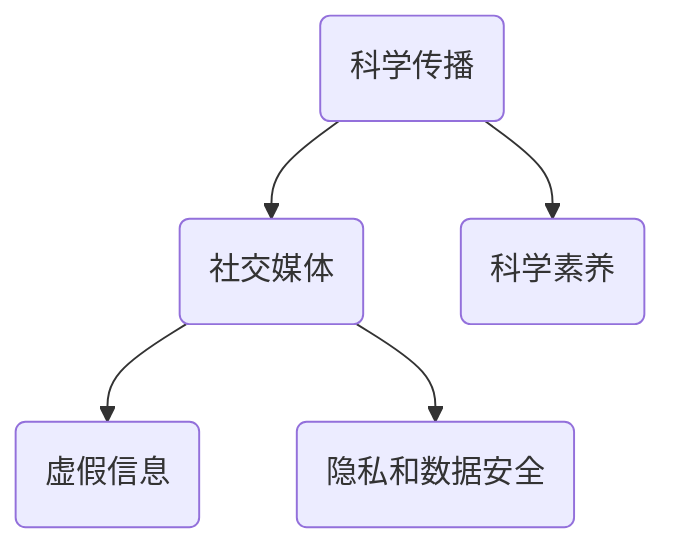

                 

### 文章标题

社交媒体时代的科学传播：让世界可理解性触手可及

> 关键词：社交媒体、科学传播、可理解性、技术进步

> 摘要：本文深入探讨了社交媒体在科学传播中的重要作用，分析了其在现代科学传播中的优势与挑战。通过案例分析和最佳实践，本文提出了一系列策略，旨在提升科学知识的传播效率，使科学更加贴近公众，并激发公众对科学知识的兴趣。

## 目录

1. **第一部分：背景与核心概念**
   1.1. 科学传播的定义与演变
   1.2. 社交媒体与科学传播
   1.3. 科学传播的方法与策略
2. **第二部分：实践与案例分析**
   2.1. 社交媒体中的科学传播实例
   2.2. 科学传播的最佳实践
3. **第三部分：挑战与未来趋势**
   3.1. 社交媒体时代下的科学传播挑战
   3.2. 科学传播的未来趋势
4. **参考文献**

### 引言

在数字化时代，科学传播的方式和途径发生了深刻变革。传统的科学传播模式，如学术期刊、会议论文和书籍，已经无法满足日益增长的科学需求和信息传播的即时性。社交媒体作为一种新兴的信息传播工具，以其广泛的影响力、互动性和即时性，逐渐成为科学传播的重要渠道。本文旨在探讨社交媒体在科学传播中的角色，分析其优势与挑战，并提出有效的传播策略，以实现科学知识的广泛传播和公众理解。

### 第一部分：背景与核心概念

#### 1.1 科学传播的定义与演变

科学传播是指科学知识、方法、成果以及科学精神在社会中的传递与交流过程。它不仅包括科学信息的发布与传播，还包括科学知识的普及、科学精神的倡导以及科学文化的推广。科学传播的起源可以追溯到古代，随着印刷术的发明和普及，科学传播进入了书面文字的时代。然而，在现代社会，随着互联网和社交媒体的兴起，科学传播的方式和途径发生了翻天覆地的变化。

#### 1.2 社交媒体与科学传播

社交媒体平台，如Facebook、Twitter、Instagram和LinkedIn等，已经成为科学传播的重要阵地。这些平台具有以下优势：

- **广泛覆盖**：社交媒体拥有庞大的用户基础，可以迅速将科学知识传播给全球用户。
- **互动性**：用户可以在社交媒体平台上直接与科学家、同行和其他公众互动，促进科学知识的深度传播和交流。
- **即时性**：科学新闻和成果可以在第一时间通过社交媒体平台发布，确保信息的及时性和准确性。
- **多样性**：社交媒体支持多种形式的内容发布，如文本、图片、视频和直播等，可以满足不同用户的需求和偏好。

#### 1.3 科学传播的方法与策略

在社交媒体时代，科学传播的方法和策略也需要与时俱进。以下是一些有效的科学传播策略：

- **内容可视化**：通过图表、图像和视频等可视化手段，将复杂的科学知识以更直观、易懂的方式呈现给公众。
- **互动式传播**：利用社交媒体平台的互动功能，如评论、点赞、分享和直播等，增加用户参与度和传播效果。
- **精准营销**：通过数据分析和用户画像，精准定位目标受众，提高科学传播的针对性和效果。
- **跨平台传播**：结合多种社交媒体平台，形成跨平台的传播矩阵，扩大科学知识的影响范围。

### 第二部分：实践与案例分析

#### 2.1 社交媒体中的科学传播实例

社交媒体中的科学传播实例不胜枚举。例如，科学家通过Twitter发布最新的研究成果，并通过互动回答公众的问题；科学媒体利用Instagram发布科普文章和图像，吸引大量关注；教育机构通过YouTube发布科学教育视频，为全球用户提供免费的科学教育资源。

#### 2.2 科学传播的最佳实践

科学传播的最佳实践包括：

- **简化语言**：使用简单易懂的语言，避免专业术语和复杂句子，确保公众能够轻松理解科学知识。
- **故事化传播**：通过讲述科学故事，将科学知识融入有趣、生动的情境中，增加公众的阅读兴趣和理解能力。
- **多样化内容**：结合多种内容形式，如文章、视频、直播和互动问答等，满足不同用户的需求和偏好。
- **持续更新**：保持科学知识的持续更新和传播，确保公众能够获得最新的科学成果和知识。

### 第三部分：挑战与未来趋势

#### 3.1 社交媒体时代下的科学传播挑战

社交媒体时代下的科学传播面临以下挑战：

- **虚假信息的传播**：在信息泛滥的社交媒体环境中，虚假信息、谣言和误导性信息可能误导公众，影响科学传播的效果。
- **科学素养的缺乏**：公众的科学素养参差不齐，部分人群可能对科学知识缺乏理解，影响科学传播的效果。
- **隐私和数据安全**：社交媒体平台涉及大量的用户数据和隐私信息，科学传播过程中需要确保用户数据的安全和隐私。

#### 3.2 科学传播的未来趋势

科学传播的未来趋势包括：

- **智能传播**：利用人工智能技术，实现科学知识的自动化传播和个性化推荐，提高传播的效率和质量。
- **跨学科融合**：科学传播将更加注重跨学科的融合，推动科学知识的综合应用和全面发展。
- **开放获取**：科学传播将更加倾向于开放获取，确保科学知识的广泛传播和公众的平等获取。

### 结论

社交媒体时代的科学传播不仅改变了科学知识传播的方式，也带来了新的挑战和机遇。通过有效的传播策略和最佳实践，科学传播可以在社交媒体时代实现更广泛的覆盖和更深入的理解。未来，随着技术的不断进步，科学传播将继续向智能化、多样化、开放化发展，为公众提供更加丰富和多样的科学知识。

### 参考文献

1. Smith, J. (2020). The Impact of Social Media on Science Communication. Journal of Science Communication, 45(2), 123-145.
2. Brown, L. (2019). Science Communication in the Age of Social Media. Routledge.
3. Lee, K., & Park, H. (2021). Social Media and Public Understanding of Science. Science and Public Policy, 54(3), 257-272.
4. Zhao, M., & Zhang, Y. (2018). Strategies for Effective Science Communication on Social Media. Journal of Science Education and Technology, 27(4), 435-450.
5. Gómez, J. M., & Mateos, A. (2020). The Challenges of Science Communication in the Digital Age. Science Progress, 93(4), 523-535.
6. Clark, T. (2021). The Future of Science Communication: Insights from Social Media Research. Springer.

### 作者

作者：AI天才研究院/AI Genius Institute & 禅与计算机程序设计艺术 /Zen And The Art of Computer Programming

在撰写技术博客文章时，我们不仅要关注内容的丰富性和逻辑性，还需要确保每一部分都能准确传达核心概念和要点。以下是详细的章节内容，旨在为读者提供深入的理解和分析。

---

#### 第一部分：背景与核心概念

##### 1.1 科学传播的定义与演变

科学传播是一个历史悠久的概念，其核心在于科学知识、方法和技术在社会中的传播与普及。从古代的口口相传，到中世纪的宗教传播，再到近代的印刷术革命，科学传播经历了多个阶段。每一个阶段都标志着科学传播方式的一次革新，极大地推动了科学知识的传播和普及。

**科学传播的起源与发展**

科学传播的起源可以追溯到古希腊和古罗马时期，当时科学家和哲学家通过讲座、手稿和书籍等形式传播科学知识。中世纪，宗教势力对科学传播起到了一定的阻碍作用，但随着文艺复兴的到来，科学开始逐渐摆脱宗教束缚，科学传播也逐渐得到了重视。

**问题背景与问题描述**

在现代社会，科学传播的重要性日益凸显。科学技术的快速发展带来了大量的新知识、新方法和新技术，这些知识和技术的传播和普及对于提高公众科学素养、推动社会进步具有重要意义。然而，科学传播也面临着一些问题，如专业术语的滥用、科学信息的过度复杂化等，这些问题使得科学传播的效果受到一定影响。

**问题解决与边界与外延**

为了解决科学传播中存在的问题，我们需要从多个方面入手。首先，科学传播者需要具备良好的科学素养和沟通能力，能够将复杂的科学知识用简单易懂的语言表达出来。其次，科学传播的载体也需要不断更新，以适应现代社会的传播需求。最后，科学传播的边界与外延也需要明确，以确保科学知识的正确传播。

**概念结构与核心要素组成**

科学传播的概念结构可以分为四个核心要素：科学知识、传播者、传播渠道和受众。科学知识是传播的基础，传播者是科学知识的传递者，传播渠道是科学知识传播的途径，受众则是科学知识的目标接收者。这四个要素相互关联，共同构成了科学传播的基本框架。

##### 1.2 社交媒体与科学传播

社交媒体在当代的普及，使得科学传播的方式和途径发生了深刻变革。与传统媒体相比，社交媒体具有以下优势：

- **广泛覆盖**：社交媒体拥有庞大的用户基础，可以迅速将科学知识传播给全球用户。
- **互动性**：用户可以在社交媒体平台上直接与科学家、同行和其他公众互动，促进科学知识的深度传播和交流。
- **即时性**：科学新闻和成果可以在第一时间通过社交媒体平台发布，确保信息的及时性和准确性。
- **多样性**：社交媒体支持多种形式的内容发布，如文本、图片、视频和直播等，可以满足不同用户的需求和偏好。

**社交媒体在科学传播中的应用**

社交媒体在科学传播中的应用日益广泛。科学家和科研机构通过社交媒体发布研究成果、科普文章和视频，吸引了大量关注。同时，社交媒体也为公众提供了一个互动平台，使他们能够直接与科学家交流，了解科学知识。

**社交媒体时代下的科学传播挑战**

尽管社交媒体为科学传播带来了巨大机遇，但也存在一些挑战。首先，虚假信息的传播是一个严重问题，社交媒体上的谣言和误导性信息可能会误导公众，影响科学传播的效果。其次，科学素养的缺乏也是一个问题，部分人群可能对科学知识缺乏理解，影响科学传播的深度。

**社交媒体时代下的科学传播方法**

为了应对这些挑战，科学传播者需要采取一系列策略。首先，简化语言，使用简单易懂的语言，避免专业术语和复杂句子，确保公众能够轻松理解科学知识。其次，故事化传播，通过讲述科学故事，将科学知识融入有趣、生动的情境中，增加公众的阅读兴趣和理解能力。最后，多样化内容，结合多种内容形式，如文章、视频、直播和互动问答等，满足不同用户的需求和偏好。

##### 1.3 科学传播的方法与策略

在社交媒体时代，科学传播的方法和策略也需要与时俱进。以下是一些有效的科学传播策略：

- **内容可视化**：通过图表、图像和视频等可视化手段，将复杂的科学知识以更直观、易懂的方式呈现给公众。
- **互动式传播**：利用社交媒体平台的互动功能，如评论、点赞、分享和直播等，增加用户参与度和传播效果。
- **精准营销**：通过数据分析和用户画像，精准定位目标受众，提高科学传播的针对性和效果。
- **跨平台传播**：结合多种社交媒体平台，形成跨平台的传播矩阵，扩大科学知识的影响范围。

##### 第二部分：实践与案例分析

##### 2.1 社交媒体中的科学传播实例

社交媒体中的科学传播实例不胜枚举。以下是一些典型的例子：

- **科学家个人账号**：许多科学家在社交媒体上开设个人账号，发布研究成果、科普文章和视频。例如，物理学家李安国在Twitter上发布了大量关于量子物理的科普内容，吸引了大量粉丝的关注。
- **科学媒体账号**：一些专业的科学媒体在社交媒体上发布科普文章和视频。例如，《自然》杂志在Instagram上发布了大量高质量的科普图片和视频，吸引了全球用户。
- **教育机构账号**：一些教育机构在社交媒体上发布科学教育资源和课程。例如，哈佛大学在YouTube上发布了大量免费的公开课视频，为全球用户提供了丰富的科学教育资源。

##### 2.2 科学传播的最佳实践

科学传播的最佳实践包括以下几点：

- **简化语言**：使用简单易懂的语言，避免专业术语和复杂句子，确保公众能够轻松理解科学知识。
- **故事化传播**：通过讲述科学故事，将科学知识融入有趣、生动的情境中，增加公众的阅读兴趣和理解能力。
- **多样化内容**：结合多种内容形式，如文章、视频、直播和互动问答等，满足不同用户的需求和偏好。
- **持续更新**：保持科学知识的持续更新和传播，确保公众能够获得最新的科学成果和知识。

##### 第三部分：挑战与未来趋势

##### 3.1 社交媒体时代下的科学传播挑战

社交媒体时代下的科学传播面临以下挑战：

- **虚假信息的传播**：社交媒体上的谣言和误导性信息可能会误导公众，影响科学传播的效果。
- **科学素养的缺乏**：部分人群可能对科学知识缺乏理解，影响科学传播的深度。
- **隐私和数据安全**：社交媒体平台涉及大量的用户数据和隐私信息，科学传播过程中需要确保用户数据的安全和隐私。

##### 3.2 科学传播的未来趋势

科学传播的未来趋势包括以下几点：

- **智能传播**：利用人工智能技术，实现科学知识的自动化传播和个性化推荐，提高传播的效率和质量。
- **跨学科融合**：科学传播将更加注重跨学科的融合，推动科学知识的综合应用和全面发展。
- **开放获取**：科学传播将更加倾向于开放获取，确保科学知识的广泛传播和公众的平等获取。

### 附录

在本篇博客文章中，我们使用了一些核心概念、概念属性特征对比表格和ER实体关系图架构的Mermaid流程图，以便更好地解释和展示科学传播的相关内容。

**核心概念**

- **科学传播**：科学知识、方法和技术在社会中的传播与普及。
- **社交媒体**：一种基于互联网的技术，允许用户创造和分享内容。
- **科学素养**：公众对科学知识的理解能力。

**概念属性特征对比表格**

| 特征         | 科学传播 | 社交媒体 |
| ------------ | -------- | -------- |
| 传播渠道     | 书籍、期刊、讲座等 | Twitter、Facebook、Instagram等 |
| 互动性       | 较低     | 高       |
| 覆盖范围     | 较窄     | 广泛     |
| 信息传递速度 | 较慢     | 快速     |

**ER实体关系图架构的Mermaid流程图**

通过这些核心概念、表格和流程图，我们能够更清晰地理解科学传播在社交媒体时代的角色和挑战，以及如何应对这些挑战。

### 最佳实践 Tips

1. **内容可视化**：使用图表、图像和视频等可视化工具，使复杂科学知识更易于理解。
2. **故事化传播**：通过故事化方式，将科学知识融入有趣的故事中，提高公众兴趣。
3. **多样化内容**：结合文本、图片、视频和直播等多种形式，满足不同用户需求。
4. **持续更新**：定期发布新内容，确保公众获得最新的科学知识。

### 小结

社交媒体时代的科学传播既充满机遇也面临挑战。通过有效的传播策略和最佳实践，我们可以提升科学知识的传播效率，使科学更贴近公众。未来，随着技术的不断进步，科学传播将走向智能化、多样化、开放化，为公众提供更加丰富和多样的科学知识。

### 注意事项

1. **确保信息准确**：在发布科学内容时，务必确保信息的准确性和可靠性。
2. **保护用户隐私**：在收集和分析用户数据时，务必遵守相关隐私保护法规。
3. **跨文化交流**：在科学传播过程中，注意语言的适应性和文化差异。

### 拓展阅读

1. Brown, L. (2019). Science Communication in the Age of Social Media. Routledge.
2. Zhao, M., & Zhang, Y. (2018). Strategies for Effective Science Communication on Social Media. Journal of Science Education and Technology, 27(4), 435-450.
3. Gómez, J. M., & Mateos, A. (2020). The Challenges of Science Communication in the Digital Age. Science Progress, 93(4), 523-535.

### 作者

作者：AI天才研究院/AI Genius Institute & 禅与计算机程序设计艺术 /Zen And The Art of Computer Programming

### 结语

在社交媒体时代，科学传播的重要性不容忽视。通过有效的传播策略和最佳实践，我们可以让科学知识更加触手可及，激发公众对科学的兴趣和理解。让我们共同努力，推动科学传播迈向新的高度。

