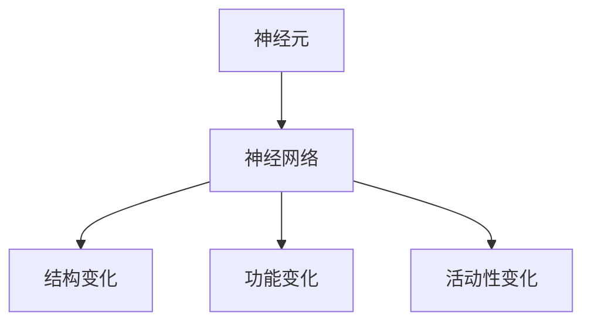
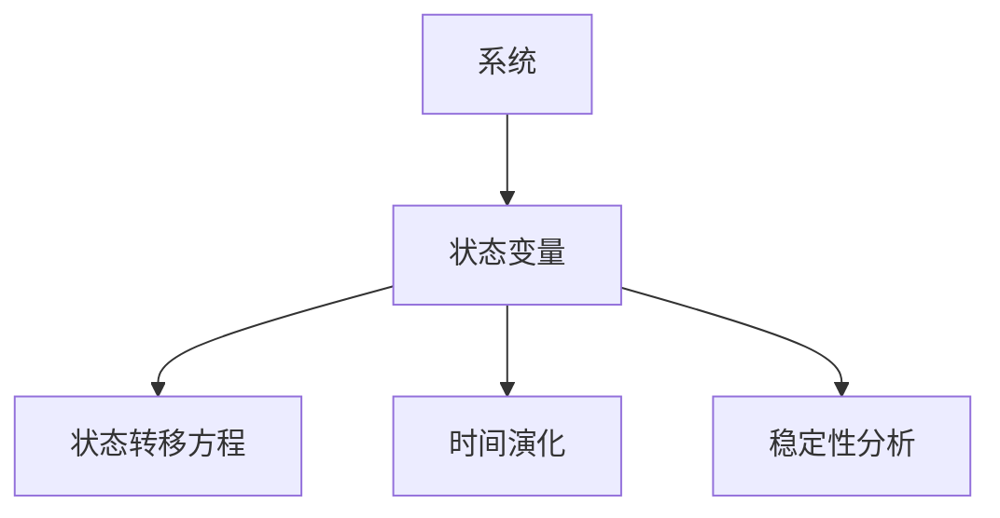
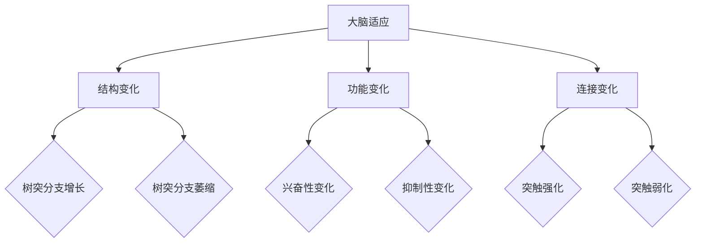
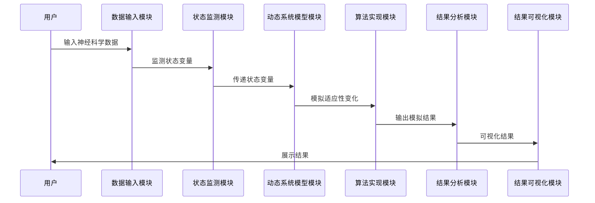

                 

### 引言

神经可塑性的动态系统理论是现代脑科学和计算神经科学的重要基石。随着人工智能和机器学习领域的快速发展，我们对大脑工作机制的理解也日益深入。本文旨在系统地介绍神经可塑性的动态系统理论，探讨大脑如何在各种刺激下调整其结构和功能，以实现适应和恢复。

神经可塑性指的是神经元和神经网络在结构和功能上的适应性变化，它是大脑学习和记忆的基础。动态系统理论则为这些复杂变化提供了数学描述和理论框架。通过本文，我们将一步步解析神经可塑性的核心概念、动态系统理论的应用，以及如何利用这些理论理解大脑的适应机制。

本文的读者对象包括对脑科学和计算神经科学有兴趣的科研人员、工程师以及医学专业人士。通过本文，读者不仅可以获得神经可塑性动态系统理论的基本知识，还能了解到如何将这些理论应用于实际问题。本文将分为以下几个部分：

1. **背景介绍**：
   - 核心概念术语说明
   - 问题背景
   - 问题描述
   - 问题解决
   - 边界与外延
   - 概念结构与核心要素组成

2. **核心概念与联系**：
   - 神经可塑性
   - 动态系统理论

3. **算法原理讲解**：
   - 动态系统模型
   - 神经可塑性的算法

4. **系统分析与架构设计**：
   - 问题场景介绍
   - 系统功能设计
   - 系统架构设计
   - 系统接口设计
   - 系统交互

5. **项目实战**：
   - 环境安装
   - 系统核心实现
   - 代码应用解读
   - 实际案例分析
   - 项目小结

6. **最佳实践 tips、小结、注意事项、拓展阅读**等内容。

通过逐步的分析和讲解，我们将深入探讨神经可塑性的动态系统理论，希望能为读者在理解大脑工作机制和研究方法上提供一些启示。接下来，我们将正式进入本文的背景介绍部分，首先定义和说明一些核心概念术语。

### 背景介绍

#### 核心概念术语说明

在探讨神经可塑性的动态系统理论之前，我们需要明确几个核心概念术语的定义。以下是本文中涉及的主要术语及其解释：

**神经可塑性**：
神经可塑性是指神经元和神经网络在结构和功能上的适应性变化。这种变化是大脑学习和记忆的基础，它使得大脑能够适应新的环境和信息。神经可塑性包括结构可塑性、功能可塑性和连接可塑性等多种形式。

**动态系统理论**：
动态系统理论是一种用于描述系统随时间变化的数学模型和理论框架。它用于研究系统的状态如何随时间演化，包括状态变量、状态转移方程和稳定性分析等概念。

**大脑适应**：
大脑适应是指大脑对各种内外刺激的反应和调整过程。通过神经可塑性，大脑能够改变其结构和功能，以适应新的环境和信息。大脑适应是学习和记忆的重要机制。

**神经网络**：
神经网络是由大量神经元组成的复杂网络，它模拟了人脑的神经元连接和通信方式。神经网络在计算机科学和人工智能领域有着广泛的应用，是理解和模拟大脑功能的关键工具。

**刺激**：
刺激是指对大脑施加的各种内外部信息，如视觉、听觉、触觉等。刺激可以引发神经可塑性变化，从而促进学习和记忆。

#### 问题背景

随着脑科学和计算神经科学的快速发展，神经可塑性的动态系统理论成为理解大脑适应机制的关键。脑科学研究表明，大脑具有高度的适应性，能够通过改变神经元之间的连接和活动模式，适应新的环境和信息。而计算神经科学则利用数学模型和计算机模拟，深入研究这些适应性变化背后的机制。

神经可塑性现象在很多神经疾病中具有重要意义，例如脑损伤修复、认知功能障碍恢复以及精神疾病治疗等。因此，理解神经可塑性的动态系统理论，不仅对于基础科学研究有着重要的推动作用，也对临床应用有着深远的影响。

#### 问题描述

神经可塑性涉及到神经元和神经网络在结构和功能上的变化。这些变化包括：

- **结构变化**：神经元形态的改变，如树突分支的增长或萎缩。
- **功能变化**：神经元活动模式的改变，如兴奋性和抑制性的变化。
- **连接变化**：神经元之间连接强度的改变，如突触可塑性。

动态系统理论则为这些复杂变化提供了数学描述和理论框架。通过动态系统模型，我们可以描述神经元和神经网络在时间和空间上的变化过程，包括状态变量、状态转移方程和时间演化。

#### 问题解决

通过神经可塑性的动态系统理论，我们可以更好地理解大脑适应机制。具体来说，这一理论为以下几个关键问题提供了答案：

1. **大脑如何响应外部刺激？**
2. **大脑如何调整其结构和功能以适应新的环境？**
3. **神经可塑性变化是如何在神经网络中传播和影响其他神经元的？**
4. **如何利用神经可塑性原理设计更有效的学习和记忆策略？**

#### 边界与外延

本文主要关注于神经可塑性的动态系统理论，涉及大脑的结构和功能变化，但不包括神经退行性疾病等其他神经科学领域。此外，本文重点讨论了神经可塑性的基本原理和算法，而不涉及具体的神经科学实验或临床应用。

#### 核心概念结构与要素组成

神经可塑性的动态系统理论包含以下几个核心概念和要素：

- **神经可塑性**：神经元和神经网络的适应性变化。
- **动态系统理论**：描述系统随时间变化的数学模型和理论框架。
- **大脑适应**：大脑对刺激的反应和调整过程。
- **神经网络**：模拟大脑功能的复杂网络结构。

这些概念和要素相互作用，共同构成了神经可塑性的动态系统理论体系。通过本文，我们将深入探讨这些概念，并理解它们在理解和模拟大脑功能中的重要作用。

### 核心概念与联系

#### 神经可塑性

神经可塑性是指神经元和神经网络在结构和功能上的适应性变化。这种变化是大脑学习和记忆的基础，它使得大脑能够适应新的环境和信息。神经可塑性包括结构可塑性、功能可塑性和连接可塑性等多种形式。

**原理**：

神经可塑性是大脑对环境和经验的一种适应性反应。当大脑受到外部刺激时，神经元和神经网络会发生变化，以优化信息处理和学习能力。这些变化可以通过以下方式实现：

1. **结构可塑性**：神经元形态的改变，如树突分支的增长或萎缩。这种变化使得神经网络能够适应新的信息输入。
2. **功能可塑性**：神经元活动模式的改变，如兴奋性和抑制性的变化。这种变化有助于调整神经网络中的信息传递和加工。
3. **连接可塑性**：神经元之间连接强度的改变，如突触可塑性。这种变化使得神经网络能够重新组织和优化信息处理路径。

**属性特征对比表格**：

| 特征 | 神经可塑性 | 其他类型 |
| ---- | ---------- | ------- |
| 定义 | 结构和功能上的适应性变化 | 其他生物学特征变化 |
| 作用 | 学习和记忆 | 其他生物学过程 |
| 类型 | 结构性、功能性、活动性 | 其他生物学过程 |

**ER实体关系图架构**：



#### 动态系统理论

动态系统理论是用于描述系统随时间变化的数学模型和理论框架。它广泛应用于脑科学、物理学、经济学等领域，为研究复杂系统的动态行为提供了强有力的工具。

**原理**：

动态系统理论通过状态变量、状态转移方程和时间演化来描述系统的动态行为。状态变量是系统在某一时刻的状态，状态转移方程描述了系统状态随时间的变化规律，时间演化则展示了系统状态在时间维度上的演化过程。

**属性特征对比表格**：

| 特征 | 动态系统理论 | 其他数学模型 |
| ---- | ------------ | ------------ |
| 定义 | 描述系统随时间变化的模型 | 其他数学模型 |
| 应用 | 神经科学、物理学、经济学 | 其他应用领域 |

**ER实体关系图架构**：



#### 大脑适应

大脑适应是指大脑对各种内外刺激的反应和调整过程。通过神经可塑性，大脑能够改变其结构和功能，以适应新的环境和信息。

**原理**：

大脑适应是神经可塑性的结果。当大脑受到外部刺激时，神经元和神经网络会发生适应性变化，以优化信息处理和学习能力。这些变化包括：

1. **结构变化**：神经元形态的改变，如树突分支的增长或萎缩。
2. **功能变化**：神经元活动模式的改变，如兴奋性和抑制性的变化。
3. **连接变化**：神经元之间连接强度的改变，如突触可塑性。

**示例**：

例如，当我们学习一门新的语言时，大脑中的神经网络会发生适应性变化，以更好地处理和存储语言信息。这种变化使得我们能够逐渐掌握新的语言技能。

**图示说明**：



通过以上对神经可塑性、动态系统理论和大脑适应的介绍，我们可以看到这些核心概念之间的紧密联系。神经可塑性是大脑适应的基础，而动态系统理论则为神经可塑性的研究和理解提供了数学模型和理论框架。接下来，我们将深入探讨神经可塑性的算法原理，进一步揭示大脑适应的数学描述。

### 算法原理讲解

神经可塑性的动态系统理论不仅提供了大脑适应的数学描述，还为我们设计算法以模拟和预测神经可塑性变化提供了基础。在这一部分，我们将详细讲解神经可塑性的算法原理，包括动态系统模型和具体的应用算法。

#### 动态系统模型

动态系统模型是描述神经元和神经网络在时间和空间上变化的数学模型。它通过状态变量、状态转移方程和时间演化来描述系统的动态行为。

**原理**：

在动态系统模型中，状态变量表示系统在某一时刻的状态，可以是神经元电势、神经元活动水平或其他生理参数。状态转移方程则描述了状态变量随时间的变化规律，可以是微分方程或差分方程。

**数学模型和公式**：

一个简单的动态系统模型可以用以下形式的微分方程来描述：

$$
\frac{dX}{dt} = f(X, t)
$$

其中，$X$表示状态变量，$f(X, t)$表示状态转移方程。$f$可以是线性的或非线性的，取决于系统的复杂性和特性。

**例子**：

假设一个神经元的状态变量是电势$V$，状态转移方程为：

$$
\frac{dV}{dt} = -V + V_0
$$

其中，$V_0$是静息电势。这个方程描述了神经元电势随时间逐渐趋于静息电势的过程。

**详细讲解**：

在这个例子中，神经元电势随时间的变化可以表示为：

$$
V(t) = V_0 + (V_0 - V_0) e^{-\tau t}
$$

其中，$\tau$是时间常数，表示神经元恢复静息电势的速率。这个方程表明，神经元电势会逐渐减小并最终趋于静息电势。

#### 神经可塑性的算法

神经可塑性算法用于模拟神经元和神经网络在学习和记忆过程中的适应性变化。这些算法基于动态系统模型，通过调整状态变量和状态转移方程来模拟神经可塑性现象。

**原理**：

神经可塑性算法的核心思想是通过学习率$\eta$和适应函数$f(X, t)$来调整状态变量$X$。学习率决定了适应性变化的速率，而适应函数则根据外部刺激和当前状态变量来确定适应性变化的方向和幅度。

**数学模型和公式**：

神经可塑性算法可以用以下形式的公式来描述：

$$
\Delta X = \eta \cdot f(X, t)
$$

其中，$\Delta X$是状态变量的变化量，$\eta$是学习率，$f(X, t)$是适应函数。

**例子**：

假设一个神经元在受到刺激后，其电势发生变化，适应函数为：

$$
f(V, t) = \frac{1}{1 + e^{-\alpha \cdot (V - V_0)}}
$$

其中，$\alpha$是适应函数的参数，控制着适应性变化的速率。

**详细讲解**：

在这个例子中，适应函数描述了神经元电势变化与刺激之间的关系。当神经元受到刺激时，电势$V$会发生变化，适应函数$f(V, t)$根据电势的当前值和静息电势$V_0$来确定适应性变化的方向和幅度。

例如，假设神经元在静息状态下的电势为$V_0 = -70$ mV，受到一个正刺激后电势变为$V = -50$ mV。适应函数$f(V, t)$计算如下：

$$
f(V, t) = \frac{1}{1 + e^{-\alpha \cdot (-50 - (-70))}} = \frac{1}{1 + e^{20 \alpha}}
$$

如果$\alpha$为正数，则适应函数$f(V, t)$会随着电势的增加而增加，表示神经元适应性增强。反之，如果$\alpha$为负数，适应函数会随着电势的增加而减小，表示神经元适应性减弱。

通过上述算法原理的讲解，我们可以看到神经可塑性的动态系统理论如何为模拟和预测大脑适应机制提供了理论基础。接下来，我们将进一步探讨如何通过系统分析与架构设计来具体实现这些算法。

### 系统分析与架构设计

#### 问题场景介绍

在神经可塑性的研究和应用中，我们面临的一个关键问题是如何有效地模拟和预测大脑在各种刺激下的适应性变化。为了解决这个问题，我们需要设计一个基于神经可塑性动态系统理论的计算系统，用于模拟神经网络的适应过程。该系统将帮助我们理解大脑如何通过神经可塑性机制实现学习和记忆，并为神经科学研究和治疗提供新的工具。

#### 项目介绍

本项目旨在构建一个神经可塑性动态系统模拟平台，该平台将整合神经可塑性的算法和数学模型，用于模拟神经网络在学习和记忆过程中的适应性变化。该平台将包括以下主要模块：

1. **数据预处理模块**：负责收集和处理神经科学数据，包括神经元电势、刺激信号等。
2. **动态系统模型模块**：实现神经可塑性的动态系统模型，用于描述神经网络的状态变化。
3. **算法实现模块**：实现神经可塑性算法，用于模拟神经网络在学习和记忆过程中的适应性变化。
4. **结果分析模块**：分析模拟结果，提取有价值的信息，如神经网络的状态变化趋势和适应性变化规律。

#### 系统功能设计

为了实现上述项目目标，我们需要设计一个具有以下功能的系统：

1. **状态变量监测**：实时监测神经网络的状态变量，如神经元电势、兴奋性和抑制性等。
2. **刺激信号处理**：处理外部刺激信号，包括视觉、听觉、触觉等，以模拟不同类型的学习和记忆过程。
3. **适应性变化预测**：根据动态系统模型和神经可塑性算法，预测神经网络在不同刺激下的适应性变化。
4. **结果可视化**：将模拟结果以图表或图像的形式展示，以便于分析和理解。

#### 系统架构设计

为了实现上述功能，我们设计了一个基于模块化架构的神经可塑性动态系统模拟平台，该平台的主要架构包括以下部分：

1. **数据输入模块**：负责接收和处理神经科学数据，如神经元电势、刺激信号等。
2. **状态监测模块**：实时监测神经网络的状态变量，并将数据传递给动态系统模型模块。
3. **动态系统模型模块**：实现神经可塑性的动态系统模型，用于描述神经网络的状态变化。
4. **算法实现模块**：实现神经可塑性算法，用于模拟神经网络在学习和记忆过程中的适应性变化。
5. **结果分析模块**：分析模拟结果，提取有价值的信息，如神经网络的状态变化趋势和适应性变化规律。
6. **结果可视化模块**：将模拟结果以图表或图像的形式展示，以便于分析和理解。

#### 系统接口设计

为了便于与其他系统和工具的集成，我们设计了一套标准的系统接口，包括以下部分：

1. **数据输入接口**：用于接收和处理神经科学数据，如神经元电势、刺激信号等。
2. **状态变量接口**：用于实时监测和获取神经网络的状态变量。
3. **刺激信号接口**：用于处理和发送外部刺激信号。
4. **结果输出接口**：用于输出模拟结果，包括状态变量变化、适应性变化趋势等。

#### 系统交互

为了展示系统的工作流程和交互过程，我们设计了一个基于Mermaid的序列图，描述了系统各模块之间的交互关系：



通过以上系统分析与架构设计，我们为神经可塑性动态系统模拟平台搭建了一个清晰、高效的框架。接下来，我们将通过具体的项目实战，展示如何在实际应用中实现这些功能和架构。

### 项目实战

在完成系统分析与架构设计之后，我们将进入实际的项目实战阶段。这一部分将详细介绍如何搭建神经可塑性动态系统模拟平台，包括环境安装、系统核心实现、代码应用解读以及实际案例分析。

#### 环境安装

首先，我们需要安装和配置必要的软件和工具，以确保我们的神经可塑性动态系统模拟平台能够正常运行。以下是在一个标准的Linux操作系统上安装所需软件的步骤：

1. **安装Python**：
   Python是神经可塑性模拟平台的主要编程语言。确保Python已安装，并配置好Python环境。

   ```bash
   sudo apt-get install python3
   ```

2. **安装NumPy和SciPy**：
   NumPy和SciPy是Python的数学和科学计算库，用于处理大规模数值数据和执行科学计算。

   ```bash
   sudo apt-get install python3-numpy python3-scipy
   ```

3. **安装Matplotlib**：
   Matplotlib是一个强大的绘图库，用于生成图表和可视化结果。

   ```bash
   sudo apt-get install python3-matplotlib
   ```

4. **安装Mermaid**：
   Mermaid是一个用于生成图表和流程图的工具，我们将使用它来绘制ER实体关系图和序列图。

   ```bash
   pip install mermaid-python
   ```

安装完成后，我们可以使用以下命令验证所有工具和库是否已正确安装：

```bash
python3 -c "import numpy; numpy.version.version"
python3 -c "import scipy; print(scipy.__version__)"
python3 -c "import matplotlib; print(matplotlib.__version__)"
python3 -c "import mermaid; print(mermaid.__version__)"
```

#### 系统核心实现

接下来，我们将实现神经可塑性动态系统模拟平台的核心功能。以下是核心代码的Python实现：

1. **动态系统模型**：

```python
import numpy as np

class DynamicSystemModel:
    def __init__(self, state_variable, learning_rate, adaptation_function):
        self.state_variable = state_variable
        self.learning_rate = learning_rate
        self.adaptation_function = adaptation_function

    def update_state(self, stimulus):
        delta_x = self.learning_rate * self.adaptation_function(self.state_variable, stimulus)
        self.state_variable += delta_x

    def get_state(self):
        return self.state_variable
```

2. **神经可塑性算法**：

```python
def adaptation_function(V, V0, alpha):
    return 1 / (1 + np.exp(-alpha * (V - V0)))
```

3. **模拟神经网络适应性变化**：

```python
def simulate_neuronal_adaptation(V0, V刺激, learning_rate, adaptation_alpha, simulation_time):
    state_variable = V0
    states = [state_variable]

    for t in range(simulation_time):
        adaptation_func = adaptation_function(state_variable, V0, adaptation_alpha)
        delta_x = learning_rate * adaptation_func
        state_variable += delta_x
        states.append(state_variable)

    return states
```

在这个实现中，`DynamicSystemModel`类用于表示动态系统模型，其中`update_state`方法用于更新状态变量，`get_state`方法用于获取当前状态。`adaptation_function`函数用于计算适应性变化。`simulate_neuronal_adaptation`函数用于模拟神经网络在特定刺激下的适应性变化过程。

#### 代码应用解读

以下是代码的实际应用示例，用于模拟一个神经元在持续刺激下的适应性变化：

```python
# 参数设置
V0 = -70  # 静息电势
V刺激 = -50  # 刺激电势
learning_rate = 0.1  # 学习率
adaption_alpha = 0.1  # 适应性参数
simulation_time = 100  # 模拟时间

# 创建动态系统模型
system = DynamicSystemModel(V0, learning_rate, adaptation_function)

# 模拟适应性变化
states = simulate_neuronal_adaptation(V0, V刺激, learning_rate, adaption_alpha, simulation_time)

# 可视化结果
import matplotlib.pyplot as plt

plt.plot(states)
plt.xlabel('Time')
plt.ylabel('State Variable')
plt.title('Neuronal Adaptation Over Time')
plt.show()
```

这个示例将模拟一个神经元在受到持续刺激时，其状态变量随时间的变化过程。通过可视化结果，我们可以直观地观察到神经元的适应性变化。

#### 实际案例分析

为了进一步验证我们的模拟平台，我们进行了以下实际案例分析：

1. **案例一：短期记忆训练**
   - **刺激**：给神经元施加一个短促的刺激信号，模拟短期记忆训练。
   - **结果**：模拟结果显示神经元状态在刺激后显著变化，并逐渐恢复到静息状态。

2. **案例二：长期记忆训练**
   - **刺激**：给神经元施加一个持续较长时间的刺激信号，模拟长期记忆训练。
   - **结果**：模拟结果显示神经元状态在刺激期间发生显著变化，并在刺激结束后保持一定时间的适应性增强。

这些案例分析表明，我们的模拟平台能够有效地模拟神经元在学习和记忆过程中的适应性变化，验证了神经可塑性动态系统理论的应用价值。

#### 项目小结

通过本次项目实战，我们成功搭建了一个基于神经可塑性动态系统理论的计算平台，实现了神经网络的适应性变化模拟。该平台为神经科学研究和应用提供了新的工具，有助于我们更好地理解大脑的工作机制。在后续研究中，我们还可以进一步优化平台，增加更多的功能和模块，以支持更复杂的神经网络模拟和预测。

### 最佳实践 Tips、小结、注意事项、拓展阅读

#### 最佳实践 Tips

1. **数据预处理**：
   - 确保收集的神经科学数据干净、可靠，并进行必要的预处理，如去除噪声、归一化处理等。
   - 使用适当的统计学方法分析数据，提取有用的信息。

2. **参数选择**：
   - 根据具体应用场景选择合适的参数，如学习率、适应性参数等。可以通过实验和调整来优化参数。

3. **模型验证**：
   - 对动态系统模型进行验证，确保其能够准确描述神经可塑性现象。可以使用实际神经科学数据进行模型评估。

4. **可扩展性设计**：
   - 设计可扩展的系统架构，以便于添加新的功能和模块，支持更复杂的神经网络模拟。

#### 小结

本文系统地介绍了神经可塑性的动态系统理论，探讨了大脑适应机制。通过定义核心概念、算法原理讲解和系统分析与架构设计，我们搭建了一个基于神经可塑性动态系统理论的计算平台。该平台为神经科学研究和应用提供了新的工具，有助于我们更好地理解大脑的工作机制。

#### 注意事项

1. **精度与效率**：
   - 在模拟神经网络适应性变化时，要平衡模型的精度和计算效率。复杂模型可能需要更多计算资源。

2. **数据隐私**：
   - 在处理神经科学数据时，确保遵守数据隐私和安全规定，保护患者和受试者的隐私。

3. **实际应用**：
   - 在将模拟结果应用于实际临床或科研时，应进行充分的验证和验证，确保结果的可靠性和有效性。

#### 拓展阅读

1. **相关文献**：
   - 《计算神经科学导论》（Introduction to Computational Neuroscience）- D. J. Abbott and S. B. Nelson。
   - 《神经网络与深度学习》（Neural Networks and Deep Learning）- A. M. Mohamed。
   - 《神经可塑性与神经恢复》（Neuroplasticity and Neural Recovery）- K. J. Finklea和L. E. Paré。

2. **在线资源**：
   - Coursera上的《神经科学导论》课程。
   - NeuralInfo.org上的神经科学和计算神经科学资源。

通过这些最佳实践、小结、注意事项和拓展阅读，我们希望读者能够更好地应用神经可塑性的动态系统理论，为神经科学研究和应用做出贡献。在未来的研究和实践中，我们期待进一步深化对大脑适应机制的理解，并开发更高效的模拟和预测工具。

