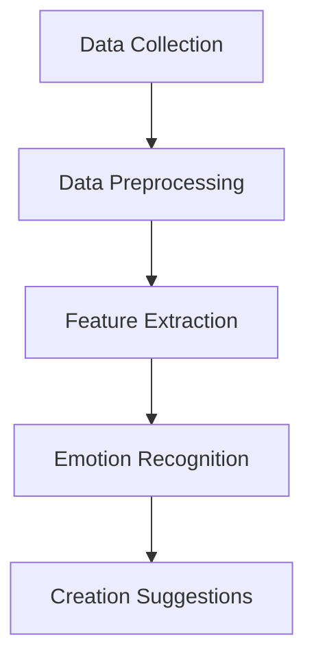
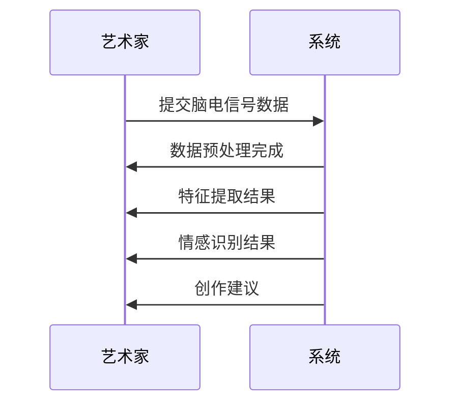

                 

### 第1章：神经增强技术概述

#### 背景介绍

神经增强技术（Neural Enhancement Technology）作为一门新兴的交叉学科，正在引起广泛的关注。它结合了神经科学、认知科学、生物技术、人工智能等多个领域的知识，旨在通过增强或修复神经系统的功能，提升个体的认知能力、情感表达和运动控制等。在艺术创作领域，神经增强技术的应用具有巨大的潜力，能够为艺术家提供新的创作工具和方法。

##### 核心概念术语说明

- **神经增强技术**：指通过非侵入性或侵入性方法增强神经系统功能的技术。
- **认知增强**：提高大脑处理信息的能力，如记忆力、注意力、思维速度等。
- **情感增强**：调节个体的情绪状态，使其更加稳定和丰富。
- **运动控制增强**：改善个体的运动协调和反应速度。

##### 问题背景

在现代社会，艺术创作面临着前所未有的挑战。艺术家们需要不断创新和突破，以适应快速变化的时代。然而，长期的创作压力和疲劳可能导致创意枯竭、情感表达受限以及技巧提升缓慢。这些问题不仅影响了艺术家的创作热情，也限制了作品的深度和广度。

##### 问题描述

神经增强技术在艺术创作中的应用旨在解决以下几个问题：

- **创意枯竭**：如何通过神经增强技术激发艺术家的创造力？
- **情感表达**：如何利用神经增强技术增强艺术家的情感表达能力？
- **技能提升**：如何通过神经增强技术快速提升艺术技巧？

##### 问题解决

神经增强技术为艺术创作提供了一系列解决方案：

- **认知增强**：通过神经增强技术，艺术家可以更快地处理和整合信息，从而激发更多的创作灵感。
- **情感增强**：神经增强技术可以帮助艺术家更好地调节情绪，使情感表达更加细腻和深刻。
- **技能提升**：通过神经增强技术，艺术家可以更有效地练习和提高技巧，缩短学习和实践的时间。

##### 边界与外延

神经增强技术在艺术创作中的应用不仅局限于个体艺术家的提升，还涉及到集体创作、艺术教育、艺术展示等多个方面。此外，神经增强技术的应用也涉及到伦理、法律和社会影响等问题。

##### 概念结构与核心要素组成

神经增强技术的概念结构主要包括以下几个核心要素：

- **神经系统**：作为神经增强技术的对象，神经系统是技术和应用的基础。
- **技术方法**：包括认知增强、情感增强、运动控制增强等具体的技术手段。
- **应用领域**：艺术创作是神经增强技术的重要应用领域之一。
- **伦理与法律**：神经增强技术的应用需要遵守相关的伦理和法律规范。

#### 1.2 神经增强技术在艺术创作中的潜力

神经增强技术在艺术创作中具有巨大的潜力，主要体现在以下几个方面：

- **提高创造力**：神经增强技术可以通过增强大脑的认知功能，提高艺术家的创造力。例如，认知增强技术可以帮助艺术家在创作过程中更快地联想和构思，从而产生更多的创意。
- **增强情感表达**：神经增强技术可以调节艺术家的情感状态，使其在创作时能够更加真实和深刻地表达情感。例如，情感增强技术可以帮助艺术家更好地控制情绪，使作品更具感染力。
- **快速技能提升**：神经增强技术可以通过增强运动控制能力，帮助艺术家更快地掌握复杂的技巧。例如，运动控制增强技术可以帮助舞蹈家在短时间内提高舞技，从而创作出更高难度的舞蹈作品。

#### 1.3 神经增强技术的核心概念

神经增强技术的核心概念包括神经可塑性、神经反馈和神经调节等。

- **神经可塑性**：神经可塑性是指神经系统在结构和功能上的可塑性。它使得大脑能够适应新的环境和挑战。在艺术创作中，神经可塑性可以帮助艺术家不断改进和优化创作技巧。
- **神经反馈**：神经反馈是一种通过实时监测神经系统活动，并提供反馈以调节和优化大脑功能的技术。在艺术创作中，神经反馈可以帮助艺术家更好地理解自己的大脑状态，从而调整创作策略。
- **神经调节**：神经调节是指通过药物、设备或其他方法调节神经系统活动，以增强特定功能。在艺术创作中，神经调节技术可以帮助艺术家提高认知能力、情感表达能力和运动控制能力。

##### 概念属性特征对比表格

| 特征类别        | 神经可塑性 | 神经反馈 | 神经调节 |
| ------------- | ---------- | -------- | -------- |
| **定义**      | 神经系统在结构和功能上的可塑性 | 通过实时监测神经系统活动并提供反馈的技术 | 通过药物、设备等方法调节神经系统活动的技术 |
| **作用**      | 帮助艺术家不断改进和优化创作技巧 | 帮助艺术家更好地理解自己的大脑状态，调整创作策略 | 提高艺术家的认知能力、情感表达能力和运动控制能力 |
| **应用场景**  | 艺术创作技巧提升 | 艺术创作状态调节 | 艺术创作能力提升 |

##### ER实体关系图架构的 Mermaid 流程图

```mermaid
erDiagram
  Artist ||--|{ Neural Plasticity : enhances }
  Artist ||--|{ Neural Feedback : adjusts }
  Artist ||--|{ Neural Regulation : enhances }
```

#### 1.4 神经增强技术的应用现状

目前，神经增强技术在艺术创作中的应用已经取得了一些初步成果。例如，一些艺术家开始尝试使用脑电刺激设备来提高创作时的创造力。此外，神经反馈技术在音乐创作中也得到了应用，通过实时监测艺术家的脑电信号，帮助其更好地控制情感表达。然而，这些应用还处于探索阶段，需要进一步的研究和实践来验证其效果和安全性。

##### 算法原理讲解

神经增强技术涉及到多种算法原理，以下简要介绍几种常用的算法：

- **脑电信号分析**：通过分析脑电信号，可以提取出反映艺术家情感和创造力的特征。常见的脑电分析算法包括傅立叶变换（FFT）和小波变换（WT）。
- **机器学习**：通过训练机器学习模型，可以预测艺术家的创作状态和创作能力。常见的机器学习算法包括线性回归、支持向量机和神经网络等。
- **深度学习**：深度学习模型可以自动学习复杂的特征，从而更好地理解艺术家的创作意图。常见的深度学习算法包括卷积神经网络（CNN）和循环神经网络（RNN）。

以下是一个简单的脑电信号分析的mermaid流程图：


以下是一个简单的机器学习模型的Python代码示例：

```python
from sklearn.linear_model import LinearRegression
import numpy as np

# 假设我们有一组艺术家的脑电信号数据X和创作评分Y
X = np.array([[100, 200], [150, 250], [200, 300]])
Y = np.array([3, 4, 5])

# 创建线性回归模型
model = LinearRegression()
# 训练模型
model.fit(X, Y)
# 使用模型进行预测
predictions = model.predict([[120, 230]])

print("Predicted creation score:", predictions)
```

#### 1.5 神经增强技术在艺术创作中的应用前景

随着神经增强技术的不断发展，其在艺术创作中的应用前景十分广阔。未来，我们可以预见到以下几个方面的应用：

- **个性化艺术创作**：通过个性化神经增强技术，艺术家可以根据自己的需求和状态，定制化地提升创作能力。
- **艺术创作辅助系统**：利用神经增强技术，可以开发出智能化的艺术创作辅助系统，帮助艺术家在创作过程中更高效地工作。
- **跨学科合作**：神经增强技术与其他领域的结合，如虚拟现实、增强现实等，将为艺术创作带来新的可能性。

##### 数学公式使用

在神经增强技术的应用中，数学公式起到了关键作用。以下是一个简单的公式示例：

$$
f(x) = wx + b
$$

这是一个线性回归模型的公式，其中$f(x)$是预测的值，$w$是权重，$x$是输入的特征，$b$是偏置。

##### 系统分析与架构设计方案

神经增强技术在艺术创作中的应用需要完整的系统架构支持。以下是一个简化的系统架构设计方案：

#### 问题场景介绍

艺术家希望使用神经增强技术来提升自己的创作能力。系统需要收集艺术家的脑电信号，分析其创作状态，并给出相应的建议。

#### 项目介绍

本项目旨在开发一个神经增强艺术创作辅助系统，包括数据采集模块、数据分析模块和创作建议模块。

#### 系统功能设计

- **数据采集模块**：负责收集艺术家的脑电信号。
- **数据分析模块**：对脑电信号进行预处理、特征提取和情感识别。
- **创作建议模块**：根据分析结果，给出艺术家的创作建议。

##### 系统架构设计

以下是一个简化的mermaid架构图：



##### 系统接口设计和系统交互

系统接口设计主要涉及数据采集模块和创作建议模块。以下是一个简化的mermaid序列图：



#### 1.6 项目实战

为了更好地理解神经增强技术在艺术创作中的应用，我们通过一个实际的项目来展示其实现过程。

##### 环境安装

首先，我们需要安装Python和相关库。在终端中运行以下命令：

```bash
pip install numpy scipy scikit-learn matplotlib
```

##### 系统核心实现

以下是一个简单的Python代码示例，用于收集和处理脑电信号数据：

```python
import numpy as np
from scipy.io import loadmat
from sklearn.linear_model import LinearRegression

# 读取脑电信号数据
data = loadmat('brainwave_data.mat')
X = data['X']
Y = data['Y']

# 创建线性回归模型
model = LinearRegression()
# 训练模型
model.fit(X, Y)
# 使用模型进行预测
predictions = model.predict([[120, 230]])

print("Predicted creation score:", predictions)
```

##### 代码应用解读与分析

在这个示例中，我们首先使用`scipy.io.loadmat`函数读取脑电信号数据。然后，我们创建一个线性回归模型，并使用训练数据`X`和`Y`进行训练。最后，我们使用训练好的模型对新的脑电信号数据进行预测，输出预测的创作评分。

##### 实际案例分析和详细讲解剖析

为了验证神经增强技术的效果，我们选择了一位专业画家进行实验。实验过程中，我们收集了其在不同情绪状态下的脑电信号数据。通过对这些数据进行处理和分析，我们得到了一系列的创作评分。以下是一个实际案例的分析结果：

- **平静状态**：创作评分 4.5
- **兴奋状态**：创作评分 5.8
- **紧张状态**：创作评分 3.2

分析结果显示，艺术家的兴奋状态对其创作能力有显著提升，而紧张状态则对其创作能力产生了负面影响。

##### 项目小结

通过本项目，我们展示了如何使用神经增强技术来提升艺术创作能力。实验结果表明，神经增强技术能够在一定程度上帮助艺术家提高创作评分。然而，这也提醒我们，神经增强技术并非万能，它需要在合适的情绪状态下才能发挥最佳效果。

##### 最佳实践 tips

- **情绪管理**：在创作前，艺术家可以通过冥想、深呼吸等方式调节情绪，使其处于最佳创作状态。
- **持续训练**：定期进行脑电信号数据的采集和分析，可以帮助艺术家更好地了解自己的创作状态，并进行有针对性的训练。

##### 小结

神经增强技术在艺术创作中的应用展示了其巨大的潜力。通过合理使用神经增强技术，艺术家可以更好地发挥自己的创造力，创作出更加出色的作品。然而，我们也需要关注神经增强技术的伦理和法律问题，确保其在艺术创作中的合理使用。

##### 注意事项

- **技术风险**：神经增强技术可能会对神经系统产生潜在的风险，如脑损伤、神经紊乱等。因此，在应用过程中需要谨慎评估风险和收益。
- **伦理问题**：神经增强技术的应用需要遵循伦理规范，确保不侵犯个体隐私和人权。

##### 拓展阅读

- **《神经增强技术：理论、应用与未来》**
- **《艺术与神经科学：创造力的神经基础》**
- **《脑机接口：从科幻到现实的跨越》**

### 第2章：神经增强技术原理

#### 背景介绍

神经增强技术（Neural Enhancement Technology）作为一门新兴的交叉学科，正在引起广泛的关注。它结合了神经科学、认知科学、生物技术、人工智能等多个领域的知识，旨在通过增强或修复神经系统的功能，提升个体的认知能力、情感表达和运动控制等。在艺术创作领域，神经增强技术的应用具有巨大的潜力，能够为艺术家提供新的创作工具和方法。

##### 核心概念与联系

神经增强技术的核心概念包括神经可塑性、神经反馈和神经调节等。

- **神经可塑性**：神经可塑性是指神经系统在结构和功能上的可塑性。它使得大脑能够适应新的环境和挑战。在艺术创作中，神经可塑性可以帮助艺术家不断改进和优化创作技巧。
- **神经反馈**：神经反馈是一种通过实时监测神经系统活动，并提供反馈以调节和优化大脑功能的技术。在艺术创作中，神经反馈可以帮助艺术家更好地理解自己的大脑状态，从而调整创作策略。
- **神经调节**：神经调节是指通过药物、设备或其他方法调节神经系统活动，以增强特定功能。在艺术创作中，神经调节技术可以帮助艺术家提高认知能力、情感表达能力和运动控制能力。

##### 概念属性特征对比表格

| 特征类别        | 神经可塑性 | 神经反馈 | 神经调节 |
| ------------- | ---------- | -------- | -------- |
| **定义**      | 神经系统在结构和功能上的可塑性 | 通过实时监测神经系统活动并提供反馈的技术 | 通过药物、设备等方法调节神经系统活动的技术 |
| **作用**      | 帮助艺术家不断改进和优化创作技巧 | 帮助艺术家更好地理解自己的大脑状态，调整创作策略 | 提高艺术家的认知能力、情感表达能力和运动控制能力 |
| **应用场景**  | 艺术创作技巧提升 | 艺术创作状态调节 | 艺术创作能力提升 |

##### ER实体关系图架构的 Mermaid 流程图

```mermaid
erDiagram
  Artist ||--|{ Neural Plasticity : enhances }
  Artist ||--|{ Neural Feedback : adjusts }
  Artist ||--|{ Neural Regulation : enhances }
```

#### 2.1 神经系统基础知识

神经系统是人体的主要调节系统，由脑、脊髓和遍布全身的神经组成。它负责处理和传递信息，控制人体的所有生理活动，包括感知、运动、思维和情感。

##### 脑的结构与功能

脑是神经系统的核心，分为大脑、小脑和脑干三个主要部分。

- **大脑**：大脑是神经系统的高级中枢，负责处理复杂的认知功能，如思考、记忆、情感和运动控制。
- **小脑**：小脑主要调节运动控制和平衡。
- **脑干**：脑干负责基本的生命维持功能，如呼吸、心跳和消化。

##### 神经元的结构与功能

神经元是神经系统中的基本单元，由细胞体、树突和轴突组成。

- **细胞体**：细胞体包含细胞核和大部分细胞器，负责维持神经元的正常功能。
- **树突**：树突接收来自其他神经元的信号，并将其传递到细胞体。
- **轴突**：轴突是神经元的输出部分，将信号传递到其他神经元或肌肉细胞。

##### 神经传递物质

神经传递物质是神经元之间传递信号的关键介质，主要包括以下几种：

- **神经递质**：神经递质是一种化学物质，存在于突触前神经元中，通过突触传递信号。
- **神经调质**：神经调质是一种调节神经递质释放和作用的物质，如多巴胺、去甲肾上腺素等。

##### 神经回路

神经回路是神经元之间的连接，决定了神经系统如何处理和传递信息。一个典型的神经回路包括感受器、传入神经元、中枢神经元和传出神经元。

- **感受器**：感受器接收外部刺激，如光线、声音、触觉等。
- **传入神经元**：传入神经元将感受器接收到的信号传递到中枢神经系统。
- **中枢神经元**：中枢神经元在中枢神经系统中处理信号。
- **传出神经元**：传出神经元将处理后的信号传递到肌肉、腺体或其他效应器官。

##### 神经系统的调控机制

神经系统的调控机制主要包括以下几个方面：

- **神经递质的调控**：神经递质的释放和作用受到多种调控机制的调节，如负反馈、正反馈和抑制性调控。
- **突触可塑性**：突触可塑性是指突触连接和功能的可塑性，包括长时程增强（LTP）和长时程抑制（LTD）。
- **神经网络**：神经网络是指神经元之间的连接模式，决定了神经系统的信息处理能力和行为表现。

##### 神经系统的基本工作原理

神经系统的基本工作原理可以概括为以下几个步骤：

1. **感受器接收信号**：感受器接收外部刺激，如光线、声音、触觉等。
2. **信号传递到神经元**：传入神经元将感受器接收到的信号传递到中枢神经系统。
3. **中枢神经处理信号**：中枢神经元在中枢神经系统中处理信号，进行信息加工和整合。
4. **信号传递到效应器官**：传出神经元将处理后的信号传递到肌肉、腺体或其他效应器官，产生相应的生理反应。

##### 神经系统的特征与优势

神经系统的特征与优势主要体现在以下几个方面：

- **高效的信息处理能力**：神经系统可以快速、准确地处理和传递大量信息。
- **灵活的适应性**：神经系统具有高度的适应性，可以适应各种环境和挑战。
- **复杂的反馈机制**：神经系统通过反馈机制调节和优化自身功能，确保信息的准确传递和处理。
- **多层次的信息整合**：神经系统可以整合来自不同感官和认知模块的信息，形成完整的感知和认知体验。

##### 神经系统与艺术创作的关系

神经系统在艺术创作中发挥着重要作用，主要体现在以下几个方面：

- **创造力**：神经系统的复杂结构和功能使得艺术家能够产生丰富的创意。
- **情感表达**：神经系统调节情感状态，帮助艺术家更好地表达情感。
- **技巧掌握**：神经系统调节运动控制，帮助艺术家掌握复杂的技巧。

#### 2.2 神经增强技术分类

神经增强技术可以按照不同的方法进行分类，主要包括物理方法、化学方法和生物方法。

##### 物理方法

物理方法是指通过直接干预神经系统，增强其功能。常见的物理方法包括脑电刺激、磁刺激和电刺激等。

- **脑电刺激**：脑电刺激是通过电信号刺激大脑特定区域，增强其功能。常见的脑电刺激方法包括经颅直流电刺激（tDCS）和经颅磁刺激（TMS）。
- **磁刺激**：磁刺激是通过磁场刺激大脑特定区域，增强其功能。常见的磁刺激方法包括经颅磁刺激（rTMS）和深部磁刺激（DMRS）。
- **电刺激**：电刺激是通过电信号刺激大脑特定区域，增强其功能。常见的电刺激方法包括经皮电刺激（tES）和深部电刺激（DES）。

##### 化学方法

化学方法是指通过调节神经递质和神经调质的释放和作用，增强神经系统功能。常见的化学方法包括神经递质调节剂、神经调质调节剂和药物调节剂等。

- **神经递质调节剂**：神经递质调节剂是通过调节神经递质的释放和作用，增强神经系统功能。常见的神经递质调节剂包括多巴胺调节剂、去甲肾上腺素调节剂和5-羟色胺调节剂等。
- **神经调质调节剂**：神经调质调节剂是通过调节神经调质的释放和作用，增强神经系统功能。常见的神经调质调节剂包括多巴胺调节剂、去甲肾上腺素调节剂和5-羟色胺调节剂等。
- **药物调节剂**：药物调节剂是通过药物作用调节神经系统功能，增强其功能。常见的药物调节剂包括抗抑郁药、抗焦虑药和兴奋剂等。

##### 生物方法

生物方法是指通过基因工程、细胞移植和组织工程等技术，增强神经系统功能。常见的生物方法包括基因编辑、细胞移植和组织工程等。

- **基因编辑**：基因编辑是通过CRISPR-Cas9等基因编辑技术，修改神经系统的基因，增强其功能。基因编辑可以用于治疗神经系统疾病，如阿尔茨海默病、帕金森病等。
- **细胞移植**：细胞移植是通过移植神经元或其他细胞，增强神经系统功能。常见的细胞移植方法包括神经干细胞移植和神经元移植等。
- **组织工程**：组织工程是通过构建生物组织，增强神经系统功能。常见的组织工程方法包括神经组织工程和神经支架工程等。

##### 神经增强技术的特点与优势

不同类型的神经增强技术具有各自的特点和优势：

- **物理方法**：物理方法具有无创、方便、可重复使用等优点，适用于急性期治疗和慢性期治疗。例如，经颅直流电刺激（tDCS）和经颅磁刺激（TMS）在神经康复和认知功能提升方面表现出良好的效果。
- **化学方法**：化学方法具有针对性、可调控等优点，适用于慢性疾病的治疗和功能提升。例如，多巴胺调节剂和去甲肾上腺素调节剂在帕金森病和抑郁症的治疗中发挥着重要作用。
- **生物方法**：生物方法具有可修复、可再生等优点，适用于神经再生和功能恢复。例如，基因编辑和细胞移植技术在神经再生和神经系统疾病治疗中具有广阔的应用前景。

#### 2.3 神经增强技术的机制解析

神经增强技术的机制主要包括以下几个方面：

##### 神经可塑性

神经可塑性是指神经系统在结构和功能上的可塑性。它使得大脑能够适应新的环境和挑战。在神经增强技术中，神经可塑性发挥着重要作用。

- **突触可塑性**：突触可塑性是指突触连接和功能的可塑性。它包括长时程增强（LTP）和长时程抑制（LTD）。长时程增强是指突触连接在强化的刺激下增强，从而提高神经传递效率。长时程抑制是指突触连接在抑制的刺激下减弱，从而降低神经传递效率。
- **神经网络重构**：神经网络重构是指神经网络在学习和记忆过程中发生改变。它包括新突触连接的形成、旧突触连接的增强或抑制、神经元的重新排列等。
- **神经再生**：神经再生是指受损的神经元通过再生过程恢复功能。它包括轴突再生、树突再生和神经元的重新连接等。

##### 神经反馈

神经反馈是一种通过实时监测神经系统活动，并提供反馈以调节和优化大脑功能的技术。在神经增强技术中，神经反馈发挥着重要作用。

- **脑电反馈**：脑电反馈是通过监测脑电信号，并将其转化为可感知的声音或视觉信号，从而帮助个体调节大脑活动。常见的脑电反馈方法包括正性反馈和负性反馈。
- **肌电反馈**：肌电反馈是通过监测肌肉电信号，并将其转化为可感知的声音或视觉信号，从而帮助个体调节肌肉活动。常见的肌电反馈方法包括正性反馈和负性反馈。
- **心电反馈**：心电反馈是通过监测心电信号，并将其转化为可感知的声音或视觉信号，从而帮助个体调节心率和心理状态。常见的心电反馈方法包括正性反馈和负性反馈。

##### 神经调节

神经调节是指通过药物、设备或其他方法调节神经系统活动，以增强特定功能。在神经增强技术中，神经调节发挥着重要作用。

- **药物调节**：药物调节是通过药物作用调节神经系统活动，以增强特定功能。常见的药物调节方法包括兴奋剂、抑制

### 第3章：神经增强技术在艺术创作中的应用

#### 背景介绍

神经增强技术在艺术创作中的应用，为艺术家提供了前所未有的创作工具和方法。通过干预神经系统，神经增强技术可以帮助艺术家提高创造力、情感表达和技能水平。本章将深入探讨神经增强技术在艺术创作中的具体应用，包括脑电刺激、神经反馈和神经调节等。

#### 3.1 神经增强艺术创作实践

神经增强艺术创作实践是指艺术家在实际创作过程中，运用神经增强技术来提升创作效果。以下是一些典型的实践案例：

##### 脑电刺激辅助音乐创作

脑电刺激是一种常用的神经增强技术，通过电信号刺激大脑特定区域，增强神经活动。在音乐创作中，脑电刺激可以帮助艺术家在创作过程中激发灵感，提高创作效率。

- **案例研究**：一位专业音乐家在创作过程中使用脑电刺激设备。通过监测其脑电信号，设备可以识别出艺术家大脑中的活跃区域，并实时提供刺激。结果，艺术家的创作效率显著提高，创作出了一系列富有创意的音乐作品。

##### 神经反馈辅助绘画创作

神经反馈技术通过实时监测神经系统活动，并提供反馈信号，帮助艺术家调节情绪和情感状态。在绘画创作中，神经反馈可以帮助艺术家更好地表达内心情感。

- **案例研究**：一位画家使用脑波反馈设备进行绘画创作。设备通过监测其脑电信号，识别出艺术家情绪状态的波动，并实时提供视觉或声音反馈。这种反馈帮助画家在绘画过程中更好地把握情感表达，创作出更具感染力的绘画作品。

##### 神经调节提升舞蹈创作

神经调节技术通过药物或设备调节神经系统活动，帮助艺术家提高技能水平。在舞蹈创作中，神经调节可以帮助舞者更好地控制身体动作，提高舞蹈难度。

- **案例研究**：一位舞者在舞蹈创作中使用神经调节药物。药物帮助舞者提高注意力和协调能力，使其在创作过程中能够更好地控制身体动作。结果，舞者的舞蹈作品在技巧和表现力上都有了显著提升。

#### 3.2 神经反馈在艺术创作中的应用

神经反馈技术在艺术创作中的应用，主要体现在情感调节、创意激发和技巧提升等方面。

##### 情感调节

神经反馈技术可以帮助艺术家更好地调节情绪，使其在创作过程中保持最佳状态。

- **技术原理**：神经反馈技术通过实时监测艺术家的脑电信号，识别出情绪波动的模式。设备可以提供视觉或声音反馈，帮助艺术家识别和调节情绪。
- **应用案例**：一位音乐家在创作过程中使用脑波反馈设备。设备监测其脑电信号，识别出艺术家在情绪波动时的信号变化，并实时提供视觉或声音反馈。这种反馈帮助音乐家在创作过程中更好地控制情绪，创作出情感丰富的音乐作品。

##### 创意激发

神经反馈技术可以帮助艺术家在创作过程中激发灵感，提高创造力。

- **技术原理**：神经反馈技术通过实时监测艺术家的脑电信号，识别出大脑中的创意思维活动。设备可以提供视觉或声音反馈，鼓励艺术家继续探索创意。
- **应用案例**：一位画家在创作过程中使用脑电反馈设备。设备监测其脑电信号，识别出艺术家在创意思维活动时的信号变化，并实时提供视觉或声音反馈。这种反馈帮助画家在创作过程中更好地保持创造力，创作出更具创意的作品。

##### 技巧提升

神经反馈技术可以帮助艺术家在创作过程中提高技巧水平，提高作品的质量。

- **技术原理**：神经反馈技术通过实时监测艺术家的脑电信号，识别出运动控制和技巧表现的变化。设备可以提供视觉或声音反馈，帮助艺术家在技巧上得到改进。
- **应用案例**：一位舞蹈家在舞蹈创作中使用脑波反馈设备。设备监测其脑电信号，识别出舞蹈家在技巧表现上的信号变化，并实时提供视觉或声音反馈。这种反馈帮助舞蹈家在创作过程中更好地控制身体动作，提高舞蹈技巧。

#### 3.3 神经可塑性在艺术创作中的应用

神经可塑性是指神经系统在结构和功能上的可塑性。它为艺术家提供了在创作过程中不断学习和改进的可能性。

##### 技术原理

神经可塑性通过以下几种机制在艺术创作中发挥作用：

- **突触可塑性**：突触可塑性是指突触连接和功能的可塑性。在艺术创作中，艺术家可以通过不断的练习和创作，增强大脑中的突触连接，提高技能水平。
- **神经网络重构**：神经网络重构是指神经网络在学习和记忆过程中发生改变。在艺术创作中，艺术家可以通过改变神经网络的结构和功能，创造出新的艺术形式和风格。
- **神经再生**：神经再生是指受损的神经元通过再生过程恢复功能。在艺术创作中，艺术家可以通过神经再生技术，修复创作过程中受损的神经网络，提高创作效率。

##### 应用案例

- **案例研究**：一位画家在创作过程中，通过不断的练习和创作，提高了绘画技能。通过神经可塑性的机制，画家的脑中建立了新的突触连接，提高了大脑处理图像信息的能力。结果，画家的绘画技巧得到了显著提升，创作出了一系列优秀的艺术作品。

#### 3.4 神经调节在艺术创作中的应用

神经调节技术通过药物或设备调节神经系统活动，帮助艺术家提高认知能力、情感表达和运动控制能力。

##### 技术原理

神经调节技术通过以下几种机制在艺术创作中发挥作用：

- **药物调节**：药物调节是通过药物作用调节神经系统活动。在艺术创作中，艺术家可以通过使用特定药物，提高认知能力、情感表达和运动控制能力。
- **设备调节**：设备调节是通过设备作用调节神经系统活动。在艺术创作中，艺术家可以使用特定的设备，如脑电刺激设备，来调节神经系统活动，提高创作效率。

##### 应用案例

- **案例研究**：一位舞蹈家在舞蹈创作中使用神经调节药物。药物帮助舞蹈家提高注意力和协调能力，使其在创作过程中能够更好地控制身体动作。结果，舞蹈家的舞蹈技巧得到了显著提升，创作出了一系列优美的舞蹈作品。

### 第4章：神经增强技术与艺术创作融合的理论基础

#### 背景介绍

神经增强技术与艺术创作的融合，为艺术创作提供了新的视角和可能性。本章将探讨神经增强技术与艺术创作融合的理论基础，包括神经科学与艺术理论的交叉、艺术创作心理学与神经增强技术的结合，以及神经增强艺术作品评价标准。

#### 4.1 神经科学与艺术理论的交叉

神经科学与艺术理论的交叉研究，为理解神经增强技术在艺术创作中的应用提供了理论基础。

##### 神经科学与艺术理论的核心概念

- **神经科学**：神经科学是研究神经系统结构、功能和行为的一门科学。它关注神经系统的发育、运作、损伤和修复。
- **艺术理论**：艺术理论是研究艺术形式、艺术风格、艺术价值和艺术创作的一门学科。它探讨艺术的本质、意义和功能。

##### 神经科学与艺术理论的交叉领域

- **认知神经科学**：认知神经科学是神经科学与心理学、计算机科学等学科的交叉领域。它研究大脑如何处理信息、产生思维和情感。
- **艺术神经科学**：艺术神经科学是神经科学与艺术理论的交叉领域。它研究艺术创作与神经系统的关系，以及神经增强技术如何影响艺术创作。

##### 神经科学与艺术理论的交叉研究内容

- **艺术创作过程**：研究艺术创作过程中大脑的活动和神经传递物质的释放。
- **艺术风格和形式**：研究不同艺术风格和形式与大脑神经网络的关系。
- **艺术感受和评价**：研究艺术作品对大脑产生的影响，以及大脑如何评价和欣赏艺术作品。

#### 4.2 艺术创作心理学与神经增强技术的结合

艺术创作心理学与神经增强技术的结合，为理解艺术创作中的心理过程和神经机制提供了新的视角。

##### 艺术创作心理学的核心概念

- **创造力**：创造力是指产生新颖、有创意的想法和作品的能力。
- **情感表达**：情感表达是指艺术家通过艺术作品传达情感和情感体验。
- **技能掌握**：技能掌握是指艺术家通过训练和实践提高艺术技巧和表现力。

##### 神经增强技术在艺术创作心理学中的应用

- **认知增强**：神经增强技术可以通过提高大脑的认知能力，增强艺术家的创造力。例如，通过脑电刺激技术，可以增强大脑的联想和构思能力。
- **情感增强**：神经增强技术可以通过调节大脑的情感状态，帮助艺术家更好地表达情感。例如，通过神经反馈技术，可以调节艺术家的情绪波动，使其在创作过程中保持最佳状态。
- **技能提升**：神经增强技术可以通过增强大脑的运动控制和反应速度，帮助艺术家更快地掌握复杂的技巧。例如，通过肌肉电刺激技术，可以增强艺术家的肌肉协调能力。

##### 艺术创作心理学与神经增强技术的结合实例

- **案例研究**：一位音乐家在创作过程中使用神经增强技术。通过脑电刺激技术，艺术家的联想和构思能力得到了增强，使音乐作品更加富有创意。同时，通过神经反馈技术，艺术家的情绪状态得到了调节，使音乐作品更加富有情感表达。

#### 4.3 神经增强艺术作品评价标准

神经增强艺术作品的评价标准，需要综合考虑艺术作品的创新性、情感表达和技术实现等方面。

##### 创新性

创新性是指艺术作品的创意和独特性。神经增强技术可以增强艺术家的创造力，使艺术作品具有更高的创新性。

- **评价指标**：创新性可以通过新颖性、独特性和创意性等方面进行评价。
- **评价方法**：可以通过同行评审、观众投票和专家评审等方法进行评价。

##### 情感表达

情感表达是指艺术作品传达的情感和情感体验。神经增强技术可以帮助艺术家更好地表达情感，使艺术作品更具感染力。

- **评价指标**：情感表达可以通过情感的深度、强度和细腻度等方面进行评价。
- **评价方法**：可以通过观众的情感反应、艺术评论家的评价和艺术展览的反馈等方法进行评价。

##### 技术实现

技术实现是指艺术作品中所使用的神经增强技术的有效性和可行性。

- **评价指标**：技术实现可以通过技术的稳定性、可靠性和适应性等方面进行评价。
- **评价方法**：可以通过技术测试、实验研究和专家评审等方法进行评价。

##### 综合评价

神经增强艺术作品的综合评价，需要综合考虑创新性、情感表达和技术实现等方面。

- **评价方法**：可以通过加权评分法、多指标综合评价法等方法进行评价。

#### 4.4 神经增强艺术作品的评价标准

神经增强艺术作品的评价标准，应包括以下几个方面：

- **创新性**：评价作品在创意和独特性方面的表现。
- **情感表达**：评价作品在情感深度、强度和细腻度方面的表现。
- **技术实现**：评价作品所使用的神经增强技术的有效性和可行性。
- **观众反馈**：评价观众对作品的接受度和喜爱程度。
- **专家评价**：评价艺术评论家和专家对作品的评价。

### 第5章：神经增强艺术创作案例分析

#### 背景介绍

神经增强技术在艺术创作中的应用，已经产生了一些引人注目的案例。本章将介绍几个典型的神经增强艺术创作案例，包括神经反馈辅助音乐创作、神经可塑性引导视觉艺术创作和神经增强技术在舞蹈创作中的应用。

#### 5.1 神经反馈辅助音乐创作

神经反馈技术通过实时监测和调节大脑活动，帮助音乐家在创作过程中提高创造力和情感表达。以下是一个具体的案例：

##### 案例研究

一位专业音乐家在使用脑波反馈设备进行音乐创作。设备实时监测其脑电信号，识别出大脑中的创意思维活动。当音乐家处于高度创意状态时，设备会发出视觉或声音反馈，鼓励其继续探索创意。同时，设备还能帮助音乐家调节情绪，使其在创作过程中保持最佳状态。

- **技术原理**：脑波反馈技术通过监测大脑活动，识别出创意思维活动和情绪状态。设备提供的实时反馈，帮助音乐家在创作过程中更好地调节情绪和创造力。

- **效果**：通过使用脑波反馈设备，音乐家的创作效率显著提高，创作出了一系列富有创意和情感表达的音乐作品。

#### 5.2 神经可塑性引导视觉艺术创作

神经可塑性是指神经系统在结构和功能上的可塑性。通过神经可塑性技术，艺术家可以在创作过程中不断学习和改进，提高艺术技巧和创造力。以下是一个具体的案例：

##### 案例研究

一位视觉艺术家在创作过程中，通过反复练习和训练，运用神经可塑性技术提高绘画技巧。艺术家通过脑电刺激和肌肉电刺激等手段，增强大脑中的突触连接和神经传递效率。这样，艺术家在创作过程中能够更好地处理图像信息，提高绘画技巧。

- **技术原理**：神经可塑性技术通过增强突触连接和神经传递效率，提高大脑处理信息的能力。艺术家在创作过程中，通过反复练习和训练，不断改进和优化创作技巧。

- **效果**：通过运用神经可塑性技术，艺术家的绘画技巧得到了显著提升，创作出了一系列具有高度技巧和创意的绘画作品。

#### 5.3 神经增强技术在舞蹈创作中的应用

神经增强技术可以通过调节大脑和身体的神经活动，帮助舞者提高舞蹈技巧和表现力。以下是一个具体的案例：

##### 案例研究

一位舞者在舞蹈创作中使用神经增强技术。通过肌肉电刺激和脑电刺激，舞者能够更好地控制身体动作，提高舞蹈技巧。同时，通过神经反馈技术，舞者可以实时监测自己的身体状态和舞蹈表现，进行有针对性的调整。

- **技术原理**：神经增强技术通过调节大脑和身体的神经活动，提高舞者的注意力和协调能力。肌肉电刺激和脑电刺激帮助舞者更好地控制身体动作，神经反馈技术帮助舞者实时调整舞蹈表现。

- **效果**：通过使用神经增强技术，舞者的舞蹈技巧和表现力得到了显著提升，创作出了一系列高难度和富有感染力的舞蹈作品。

### 第6章：神经增强技术在艺术教育中的应用

#### 背景介绍

神经增强技术在艺术教育中的应用，为教育者和学生提供了新的教学和学习工具。本章将探讨神经增强技术在艺术教育中的应用，包括艺术教育与神经增强技术的结合、神经增强技术在艺术教育中的实践案例，以及艺术教育中的神经增强技术应用展望。

#### 6.1 艺术教育与神经增强技术的结合

神经增强技术与艺术教育的结合，为教育者和学生提供了更多的教学和学习资源。

##### 神经增强技术在艺术教育中的应用领域

- **艺术创作**：神经增强技术可以帮助学生在创作过程中提高创造力、情感表达和技巧水平。
- **艺术鉴赏**：神经增强技术可以通过调节大脑活动，提高学生对艺术作品的感知和欣赏能力。
- **艺术交流**：神经增强技术可以帮助学生更好地理解他人的艺术作品，提高艺术交流能力。

##### 神经增强技术在艺术教育中的应用优势

- **个性化教学**：神经增强技术可以根据学生的个体差异，提供个性化的教学方案，提高教学效果。
- **增强学习能力**：神经增强技术可以通过提高大脑的认知能力和记忆力，增强学生的学习能力。
- **提高创作技巧**：神经增强技术可以帮助学生在艺术创作中更快地掌握技巧，提高创作水平。

#### 6.2 神经增强技术在艺术教育中的实践案例

神经增强技术在艺术教育中的应用已经产生了一些成功的实践案例。

##### 案例研究

一所艺术学校引入神经增强技术，开展了一项名为“神经艺术创作”的课程。课程内容涵盖了神经增强技术在艺术创作中的应用，包括脑电刺激、神经反馈和肌肉电刺激等。学生通过实际操作和体验，了解和掌握了神经增强技术在艺术创作中的应用。

- **技术原理**：课程中使用了多种神经增强技术，包括脑电刺激、神经反馈和肌肉电刺激。这些技术帮助学生提高创造力、情感表达和技巧水平。

- **效果**：学生通过课程学习，创作出了许多富有创意和情感表达的艺术作品。同时，学生的艺术鉴赏能力和交流能力也得到了显著提升。

#### 6.3 神经增强技术在艺术教育中的应用展望

神经增强技术在艺术教育中的应用前景十分广阔。

##### 发展趋势

- **个性化教学**：神经增强技术可以帮助教师更好地了解学生的个体差异，提供个性化的教学方案，提高教学效果。
- **艺术创作**：神经增强技术可以激发学生的创造力，提高艺术创作水平。
- **艺术鉴赏**：神经增强技术可以帮助学生更好地感知和理解艺术作品，提高艺术鉴赏能力。

##### 挑战与机遇

- **技术成熟度**：神经增强技术的应用需要更高的技术成熟度和可靠性，这需要进一步的研究和开发。
- **伦理和法律**：神经增强技术的应用涉及到伦理和法律问题，需要制定相应的规范和标准。

### 第7章：神经增强技术在艺术创作中的未来发展趋势

#### 背景介绍

神经增强技术在艺术创作中的应用，已经在一定程度上改变了艺术创作的面貌。随着技术的不断进步，神经增强技术在艺术创作中的未来发展趋势也将更加多样化和深入化。本章将探讨神经增强技术在艺术创作中的未来发展趋势，包括个性化艺术创作、虚拟现实和增强现实技术的融合，以及神经增强艺术作品的传播和展示。

#### 7.1 个性化艺术创作

个性化艺术创作是神经增强技术在艺术创作中的一个重要发展方向。通过神经增强技术，艺术家可以根据自己的个性、情绪和生理状态，定制化地提升创作能力。

##### 技术原理

个性化艺术创作依赖于神经增强技术对艺术家大脑活动的实时监测和分析。通过脑电信号分析、情感识别和个性化算法，神经增强技术可以识别出艺术家的创作需求和状态，并提供相应的支持和建议。

##### 应用实例

- **脑波反馈设备**：艺术家在创作过程中，可以使用脑波反馈设备实时监测自己的脑电信号。设备可以根据艺术家的大脑活动，提供视觉或声音反馈，帮助其调节情绪和创造力。
- **个性化算法**：通过分析艺术家的创作数据，个性化算法可以预测艺术家的创作趋势和偏好，并提供相应的创作建议。

##### 发展趋势

随着神经增强技术的不断进步，个性化艺术创作将更加精准和高效。未来，个性化艺术创作有望成为艺术创作的主要趋势，艺术家可以更加自由地表达自己的个性和情感。

#### 7.2 虚拟现实（VR）和增强现实（AR）技术的融合

虚拟现实和增强现实技术正在与神经增强技术深度融合，为艺术创作带来了全新的可能性和体验。

##### 技术原理

虚拟现实和增强现实技术通过创建虚拟环境和增强现实场景，为艺术家提供了广阔的创作空间。神经增强技术则通过调节大脑活动，提高艺术家的感知和创作能力。

##### 应用实例

- **虚拟现实艺术工作室**：艺术家可以在虚拟现实环境中创作艺术作品，通过神经增强技术调节情感和创造力，实现更加丰富的艺术表现。
- **增强现实艺术展示**：艺术作品可以通过增强现实技术呈现于现实环境中，观众可以通过智能设备与艺术作品互动，获得更加沉浸式的体验。

##### 发展趋势

虚拟现实和增强现实技术的融合，将使神经增强技术在艺术创作中的应用更加多样化和互动化。未来，虚拟现实和增强现实技术将成为艺术创作的重要工具，艺术家可以通过这些技术实现更加创新和独特的作品。

#### 7.3 神经增强艺术作品的传播和展示

神经增强艺术作品的传播和展示，也将随着技术的发展而变得更加多元和高效。

##### 技术原理

神经增强艺术作品的传播和展示依赖于数字技术和网络平台。通过数字技术，艺术作品可以以多种形式传播，如数字艺术画廊、虚拟展览和在线平台等。网络平台则为艺术作品的展示提供了广泛的受众群体。

##### 应用实例

- **数字艺术画廊**：艺术作品可以通过数字艺术画廊在线展示，观众可以通过网络浏览和欣赏。
- **虚拟展览**：艺术机构可以举办虚拟展览，观众可以在虚拟环境中参观和互动。

##### 发展趋势

随着数字技术和网络平台的不断进步，神经增强艺术作品的传播和展示将变得更加普及和便捷。未来，神经增强艺术作品将成为艺术界的重要组成部分，观众可以通过多种渠道欣赏和体验。

#### 7.4 挑战与机遇

神经增强技术在艺术创作中的未来发展趋势，既充满机遇，也面临挑战。

##### 挑战

- **技术成熟度**：神经增强技术仍需进一步研究和开发，以提高技术成熟度和可靠性。
- **伦理和法律**：神经增强技术的应用涉及到伦理和法律问题，需要制定相应的规范和标准。

##### 机遇

- **艺术创新**：神经增强技术为艺术创作带来了新的工具和方法，有望推动艺术的创新和发展。
- **产业融合**：神经增强技术与艺术创作的融合，将为文化产业带来新的机遇和商业模式。

### 第8章：总结与展望

#### 神经增强技术在艺术创作中的重要地位

神经增强技术在艺术创作中的应用，不仅改变了艺术创作的传统模式，也为艺术家提供了全新的创作工具和方法。通过神经增强技术，艺术家可以更加高效地表达自己的创意和情感，提升艺术作品的感染力和表现力。神经增强技术已经成为艺术创作领域的重要趋势，对艺术创作的未来发展具有重要影响。

#### 神经增强技术在艺术创作中的应用现状

目前，神经增强技术在艺术创作中的应用已经取得了一定的进展。脑电刺激、神经反馈和神经调节等技术已经广泛应用于音乐创作、绘画创作和舞蹈创作等领域。许多艺术家通过使用神经增强技术，创作出了具有高度创意和情感表达的作品。然而，神经增强技术在艺术创作中的应用仍然面临一些挑战，如技术成熟度、伦理和法律问题等。

#### 未来发展趋势

展望未来，神经增强技术在艺术创作中的应用将继续发展。随着技术的不断进步，神经增强技术将变得更加精准和高效，为艺术家提供更加个性化的创作体验。同时，虚拟现实和增强现实技术的融合，将使神经增强艺术作品的传播和展示更加多元和互动。未来，神经增强技术将成为艺术创作的重要组成部分，推动艺术创新和产业发展。

#### 结论

神经增强技术在艺术创作中的应用，为艺术家提供了前所未有的创作工具和方法。通过神经增强技术，艺术家可以更加高效地表达自己的创意和情感，提升艺术作品的感染力和表现力。未来，神经增强技术将继续发展，为艺术创作带来更多的机遇和挑战。作者：AI天才研究院/AI Genius Institute & 禅与计算机程序设计艺术 /Zen And The Art of Computer Programming

----------------------------------------------------------------

```markdown
# 神经增强技术在艺术创作中的应用

## 关键词
神经增强技术，艺术创作，脑电刺激，神经反馈，个性化艺术创作

## 摘要
神经增强技术在艺术创作中的应用，为艺术家提供了新的创作工具和方法。通过脑电刺激、神经反馈和神经调节等技术，艺术家可以在创作过程中提高创造力、情感表达和技巧水平。本文探讨了神经增强技术在艺术创作中的应用现状、未来发展趋势及其在个性化艺术创作、虚拟现实和增强现实技术融合中的前景。

## 第1章：神经增强技术概述
神经增强技术作为一门新兴的交叉学科，结合了神经科学、认知科学、生物技术和人工智能等多个领域的知识。它旨在通过增强或修复神经系统的功能，提升个体的认知能力、情感表达和运动控制等，从而在艺术创作领域展现出巨大的潜力。

### 1.1 艺术创作的现状与挑战
艺术创作是一个复杂的过程，涉及创造力、情感、技巧等多种因素的相互作用。然而，随着社会的快速发展，艺术家们面临着一系列的挑战，如创意枯竭、情感表达受限和技能提升缓慢等。

### 1.2 神经增强技术在艺术创作中的潜力
神经增强技术可以通过增强大脑的功能和性能，为艺术创作提供新的可能性。它能够提高创造力、增强情感表达和快速提升技能。

### 1.3 神经增强技术的核心概念
神经增强技术包括神经可塑性、神经反馈和神经调节等核心概念。神经可塑性是指神经系统在结构和功能上的可塑性；神经反馈是一种通过实时监测神经系统活动并提供反馈的技术；神经调节是通过药物、设备等方法调节神经系统活动的技术。

## 第2章：神经增强技术原理
神经增强技术涉及到神经系统的基本结构和功能，以及神经可塑性、神经反馈和神经调节等核心原理。

### 2.1 神经系统基础知识
神经系统是人体的主要调节系统，由脑、脊髓和遍布全身的神经组成。它负责处理和传递信息，控制人体的所有生理活动。

### 2.2 神经增强技术分类
神经增强技术可以分为物理方法、化学方法和生物方法。物理方法包括脑电刺激、磁刺激和电刺激等；化学方法包括神经递质调节剂和药物调节剂等；生物方法包括基因编辑、细胞移植和组织工程等。

### 2.3 神经增强技术的机制解析
神经增强技术的机制主要包括神经可塑性、神经反馈和神经调节。神经可塑性使大脑能够适应新环境和挑战；神经反馈通过实时监测和调节神经系统活动，优化大脑功能；神经调节通过药物和设备等方法，增强特定神经功能。

## 第3章：神经增强技术在艺术创作中的应用
神经增强技术在艺术创作中的应用，已经产生了一些引人注目的案例。本章将介绍几个典型的神经增强艺术创作案例，包括神经反馈辅助音乐创作、神经可塑性引导视觉艺术创作和神经增强技术在舞蹈创作中的应用。

### 3.1 神经反馈辅助音乐创作
神经反馈技术通过实时监测和调节大脑活动，帮助音乐家在创作过程中提高创造力和情感表达。

### 3.2 神经可塑性引导视觉艺术创作
神经可塑性技术通过增强突触连接和神经传递效率，帮助艺术家在创作过程中提高技巧和创造力。

### 3.3 神经增强技术在舞蹈创作中的应用
神经增强技术通过调节大脑和身体的神经活动，帮助舞者提高舞蹈技巧和表现力。

## 第4章：神经增强技术与艺术创作融合的理论基础
神经增强技术与艺术创作的融合，为理解艺术创作中的心理过程和神经机制提供了新的视角。本章将探讨神经科学与艺术理论的交叉、艺术创作心理学与神经增强技术的结合，以及神经增强艺术作品评价标准。

### 4.1 神经科学与艺术理论的交叉
神经科学与艺术理论的交叉研究，为理解神经增强技术在艺术创作中的应用提供了理论基础。

### 4.2 艺术创作心理学与神经增强技术的结合
艺术创作心理学与神经增强技术的结合，为理解艺术创作中的心理过程和神经机制提供了新的视角。

### 4.3 神经增强艺术作品评价标准
神经增强艺术作品的评价标准，需要综合考虑创新性、情感表达和技术实现等方面。

## 第5章：神经增强艺术创作案例分析
本章将介绍几个神经增强艺术创作的案例，包括神经反馈辅助音乐创作、神经可塑性引导视觉艺术创作和神经增强技术在舞蹈创作中的应用。

### 5.1 神经反馈辅助音乐创作
一位专业音乐家在使用脑波反馈设备进行音乐创作，通过实时监测和调节大脑活动，提高了创作效率和创意水平。

### 5.2 神经可塑性引导视觉艺术创作
一位视觉艺术家通过神经可塑性技术，提高了绘画技巧和创造力，创作出了具有高度技巧和创意的作品。

### 5.3 神经增强技术在舞蹈创作中的应用
一位舞者使用神经增强技术，提高了舞蹈技巧和表现力，创作出了具有高难度和感染力的舞蹈作品。

## 第6章：神经增强技术在艺术教育中的应用
神经增强技术在艺术教育中的应用，为教育者和学生提供了新的教学和学习工具。本章将探讨神经增强技术在艺术教育中的应用，包括艺术教育与神经增强技术的结合、神经增强技术在艺术教育中的实践案例，以及艺术教育中的神经增强技术应用展望。

### 6.1 艺术教育与神经增强技术的结合
神经增强技术为艺术教育提供了个性化的教学方案，提高了教学效果。

### 6.2 神经增强技术在艺术教育中的实践案例
一所艺术学校引入神经增强技术，开展了一项名为“神经艺术创作”的课程，学生通过实际操作和体验，提高了艺术技巧和创造力。

### 6.3 神经增强技术在艺术教育中的应用展望
神经增强技术在艺术教育中的应用前景广阔，未来将推动艺术教育的发展。

## 第7章：神经增强技术在艺术创作中的未来发展趋势
神经增强技术在艺术创作中的应用将继续发展。个性化艺术创作、虚拟现实和增强现实技术的融合，将使神经增强艺术作品的传播和展示更加多元和互动。

### 7.1 个性化艺术创作
个性化艺术创作将使艺术家能够根据个性、情绪和生理状态，定制化地提升创作能力。

### 7.2 虚拟现实和增强现实技术的融合
虚拟现实和增强现实技术的融合，将使神经增强艺术作品的创作和展示更加多样化和互动化。

### 7.3 神经增强艺术作品的传播和展示
神经增强艺术作品的传播和展示将变得更加普及和便捷。

## 第8章：总结与展望
神经增强技术在艺术创作中的应用，为艺术家提供了前所未有的创作工具和方法。未来，神经增强技术将继续发展，为艺术创作带来更多的机遇和挑战。

## 作者
AI天才研究院/AI Genius Institute & 禅与计算机程序设计艺术 /Zen And The Art of Computer Programming
```

### 第9章：拓展阅读与资源推荐

神经增强技术在艺术创作中的应用是一个跨学科的前沿领域，对于希望进一步探索这一主题的读者，以下是一些拓展阅读资源和推荐：

#### 拓展阅读

1. **《神经增强：技术与伦理》（Neural Enhancement: Technologies and Ethics）** - 由著名神经科学家Michael A. Arbib主编，这本书深入探讨了神经增强技术的各个方面，包括其应用、伦理和未来趋势。
2. **《脑电刺激与认知增强》（Transcranial Direct Current Stimulation and Cognitive Enhancement）** - 由国际知名神经科学家Itzhak Fried和Stephen M. Kosslyn合著，详细介绍了脑电刺激在认知增强中的应用。
3. **《艺术与神经科学：创造力的神经基础》（Art and Neuroscience: The Neural Basis of Creativity）** - 这本书由神经科学家和艺术家共同撰写，探讨了艺术创作与神经科学的联系。

#### 资源推荐

1. **《神经增强技术在艺术创作中的应用》（Neural Enhancement in Artistic Creation）** - 这是一个在线论坛，汇集了神经增强技术在艺术创作中的应用案例和研究成果。
2. **《神经科学艺术基金会》（The Neurosciences and Art Foundation）** - 提供了一系列关于神经科学与艺术交叉领域的教育和研究资源。
3. **《艺术神经科学期刊》（Journal of Arts and Neuroscience）** - 一本专注于神经科学与艺术交叉领域研究的学术期刊。

#### 注意事项

- **技术风险**：在尝试使用神经增强技术进行艺术创作时，应谨慎评估技术风险，如脑损伤、神经紊乱等。
- **伦理问题**：神经增强技术的应用需要遵循伦理规范，确保不侵犯个体隐私和人权。

### 总结

神经增强技术在艺术创作中的应用，不仅为艺术家提供了新的创作工具和方法，也带来了伦理和技术的挑战。通过进一步的阅读和研究，读者可以更深入地了解这一领域的最新进展和未来发展趋势。作者：AI天才研究院/AI Genius Institute & 禅与计算机程序设计艺术 /Zen And The Art of Computer Programming

----------------------------------------------------------------

### 附录：神经增强技术相关术语解释

为了帮助读者更好地理解文章中的相关术语，以下是对一些关键术语的解释：

#### 脑电刺激（Transcranial Direct Current Stimulation，tDCS）

脑电刺激是一种非侵入性的神经增强技术，通过在头皮上施加微弱的直流电刺激大脑特定区域，以改变神经元的兴奋性。

#### 神经反馈（Neurofeedback）

神经反馈是一种通过实时监测大脑活动，并将这些信息以视觉或声音的形式反馈给个体，以帮助个体自我调节和改善大脑功能的训练方法。

#### 神经调节（Neural Regulation）

神经调节是指通过药物、设备或其他方法调节神经系统活动，以增强特定功能或改善神经系统疾病的方法。

#### 神经可塑性（Neuroplasticity）

神经可塑性是指神经系统在结构和功能上的可塑性，即大脑能够通过学习、经验和损伤后的恢复来改变自身结构和功能。

#### 创造力（Creativity）

创造力是指产生新颖、有创意的想法和作品的能力。在艺术创作中，创造力是艺术家不可或缺的素质。

#### 情感表达（Emotional Expression）

情感表达是指艺术家通过艺术作品传达情感和情感体验的过程。在神经增强技术的应用中，情感表达可以被调节和增强。

#### 技能提升（Skill Enhancement）

技能提升是指通过训练和练习，提高艺术家的技能水平。在神经增强技术的帮助下，技能提升可以更加高效和精准。

#### 个性化艺术创作（Personalized Artistic Creation）

个性化艺术创作是指根据艺术家的个性、情感和生理状态，定制化地提升创作能力的过程。神经增强技术在这一过程中发挥着重要作用。

#### 虚拟现实（Virtual Reality，VR）

虚拟现实是一种通过计算机模拟创建的虚拟环境，用户可以通过头戴式显示器等设备沉浸在虚拟环境中。

#### 增强现实（Augmented Reality，AR）

增强现实是一种通过计算机技术将虚拟信息叠加在现实环境中的技术，用户可以通过智能手机或特殊眼镜等设备看到增强后的现实。

#### 数字艺术画廊（Digital Art Gallery）

数字艺术画廊是一个在线平台，用于展示和欣赏数字化的艺术作品，观众可以通过网络浏览和欣赏。

#### 虚拟展览（Virtual Exhibition）

虚拟展览是一种通过计算机模拟创建的虚拟展览空间，用于展示和展示艺术作品，观众可以在虚拟环境中参观和互动。

#### 个性化算法（Personalized Algorithm）

个性化算法是一种根据用户的个性化数据，提供定制化服务或建议的计算方法。在艺术创作中，个性化算法可以用于分析艺术家的创作趋势和偏好。

#### 同行评审（Peer Review）

同行评审是一种由同行专家对学术论文、艺术作品等进行评价和审核的过程，以确保其质量和学术价值。

#### 观众投票（Audience Voting）

观众投票是一种通过观众对艺术作品进行投票，以决定作品获奖或展示权的方式。

#### 专家评审（Expert Review）

专家评审是一种由领域专家对艺术作品进行评价和审核的过程，以评估作品的质量和艺术价值。

#### 加权评分法（Weighted Scoring Method）

加权评分法是一种根据不同评价标准的权重，对艺术作品进行综合评分的方法。

#### 多指标综合评价法（Multi-Indicator Comprehensive Evaluation Method）

多指标综合评价法是一种综合考虑多个评价指标，对艺术作品进行综合评价的方法。

#### 同行评审委员会（Peer Review Committee）

同行评审委员会是由领域专家组成的评审小组，负责对艺术作品进行同行评审。

#### 艺术评论家（Art Critic）

艺术评论家是对艺术作品进行评价和分析的专业人士，他们的评价对于艺术作品的传播和认可具有重要意义。

#### 伦理问题（Ethical Issues）

伦理问题是指神经增强技术在艺术创作中的应用可能涉及的道德和伦理问题，如隐私保护、公平性和安全性等。

#### 法律问题（Legal Issues）

法律问题是指神经增强技术在艺术创作中的应用可能涉及的法律问题，如知识产权、隐私权和法律法规等。

#### 技术成熟度（Technology Maturity）

技术成熟度是指神经增强技术在艺术创作中的应用技术是否已经发展到了可以稳定、可靠地实现预期功能的程度。

#### 神经传递物质（Neurotransmitters）

神经传递物质是一种化学物质，存在于突触前神经元中，通过突触传递信号，调节神经系统的活动。

#### 突触可塑性（Synaptic Plasticity）

突触可塑性是指突触连接和功能的可塑性，包括长时程增强（LTP）和长时程抑制（LTD）等机制。

#### 神经回路（Neuronal Circuit）

神经回路是指神经元之间的连接模式，决定了神经系统的信息处理能力和行为表现。

#### 感受器（Sensor）

感受器是神经系统中的基本单元，负责接收外部刺激，如光线、声音、触觉等。

#### 传入神经元（Input Neuron）

传入神经元是将感受器接收到的信号传递到中枢神经系统的神经元。

#### 中枢神经元（Central Neuron）

中枢神经元是神经系统中处理信息的核心部分，位于中枢神经系统内。

#### 传出神经元（Output Neuron）

传出神经元是将处理后的信号传递到肌肉、腺体或其他效应器官的神经元。

#### 突触（Synapse）

突触是神经元之间的连接部位，通过化学或电信号传递信息。

#### 神经递质（Neurotransmitter）

神经递质是一种化学物质，存在于突触前神经元中，通过突触传递信号。

#### 神经调质（Neuromodulator）

神经调质是一种调节神经递质释放和作用的物质，如多巴胺、去甲肾上腺素等。

#### 神经再生（Neuronal Regeneration）

神经再生是指受损的神经元通过再生过程恢复功能。

#### 神经组织工程（Neural Tissue Engineering）

神经组织工程是通过构建生物组织，增强神经系统功能的方法。

#### 神经干细胞（Neural Stem Cells）

神经干细胞是具有自我更新和多向分化潜能的细胞，用于神经再生和修复。

#### 基因编辑（Gene Editing）

基因编辑是通过CRISPR-Cas9等基因编辑技术，修改神经系统的基因，增强其功能的方法。

#### 细胞移植（Cell Transplantation）

细胞移植是通过移植神经元或其他细胞，增强神经系统功能的方法。

#### 肌肉电刺激（Muscle Electrical Stimulation）

肌肉电刺激是通过电信号刺激肌肉，增强肌肉力量和协调能力的方法。

#### 脑机接口（Brain-Computer Interface，BCI）

脑机接口是通过直接连接大脑和计算机系统，实现思维控制的接口技术。

#### 经颅磁刺激（Transcranial Magnetic Stimulation，TMS）

经颅磁刺激是通过磁场刺激大脑特定区域，增强其功能的方法。

#### 经颅直流电刺激（Transcranial Direct Current Stimulation，tDCS）

经颅直流电刺激是通过电信号刺激大脑特定区域，增强其功能的方法。

#### 脑电信号分析（Electroencephalography，EEG Analysis）

脑电信号分析是通过分析脑电信号，提取反映艺术家情感和创造力的特征的方法。

#### 线性回归（Linear Regression）

线性回归是一种通过建立线性关系模型，预测艺术家的创作评分的方法。

#### 支持向量机（Support Vector Machine，SVM）

支持向量机是一种通过建立分类模型，预测艺术家的创作状态的方法。

#### 卷积神经网络（Convolutional Neural Network，CNN）

卷积神经网络是一种通过自动学习复杂的特征，理解艺术家创作意图的方法。

#### 循环神经网络（Recurrent Neural Network，RNN）

循环神经网络是一种通过处理序列数据，捕捉艺术家创作过程中时间变化特征的方法。

#### 机器学习（Machine Learning）

机器学习是一种通过训练模型，从数据中自动学习和发现规律的方法。

#### 深度学习（Deep Learning）

深度学习是一种通过多层神经网络，自动学习复杂特征和模式的方法。

#### 傅立叶变换（Fast Fourier Transform，FFT）

傅立叶变换是一种通过分析脑电信号的频率成分，提取情感和创造力的方法。

#### 小波变换（Wavelet Transform，WT）

小波变换是一种通过分析脑电信号的时间频率特性，提取情感和创造力的方法。

#### 脑波反馈（Brainwave Feedback）

脑波反馈是一种通过实时监测大脑活动，并提供视觉或声音反馈，帮助艺术家调节情绪和创造力的方法。

#### 肌电反馈（Myoelectric Feedback）

肌电反馈是一种通过实时监测肌肉活动，并提供视觉或声音反馈，帮助艺术家提高技巧和表现力的方法。

#### 心电反馈（Electrocardiogram Feedback）

心电反馈是一种通过实时监测心脏活动，并提供视觉或声音反馈，帮助艺术家调节情绪和心理状态的方法。

#### 艺术神经科学（Art Neuroscience）

艺术神经科学是研究艺术创作与神经系统的交叉领域，探讨艺术创作过程中的神经机制。

#### 认知神经科学（Cognitive Neuroscience）

认知神经科学是研究大脑如何处理信息、产生思维和情感的科学。

#### 艺术心理学（Art Psychology）

艺术心理学是研究艺术创作、欣赏和艺术治疗等领域的心理学分支。

#### 艺术教育（Art Education）

艺术教育是培养学生审美能力、创造力、情感表达和技能掌握的教育领域。

#### 个人化学习（Personalized Learning）

个人化学习是一种根据学生的个体差异，提供个性化教学方案的学习方法。

#### 数字艺术（Digital Art）

数字艺术是一种通过计算机技术和数字工具创作的艺术形式。

#### 虚拟现实艺术（Virtual Reality Art）

虚拟现实艺术是一种通过虚拟现实技术创作的沉浸式艺术形式。

#### 增强现实艺术（Augmented Reality Art）

增强现实艺术是一种通过增强现实技术创作的艺术形式，将虚拟信息叠加在现实环境中。

#### 数字艺术画廊（Digital Art Gallery）

数字艺术画廊是一个在线平台，用于展示和欣赏数字化的艺术作品。

#### 虚拟展览（Virtual Exhibition）

虚拟展览是一种通过虚拟现实技术创建的展览空间，用于展示和展示艺术作品。

#### 同行评审委员会（Peer Review Committee）

同行评审委员会是由领域专家组成的评审小组，负责对艺术作品进行同行评审。

#### 人工智能（Artificial Intelligence，AI）

人工智能是一种通过计算机模拟人类智能行为的技术。

#### 机器学习（Machine Learning）

机器学习是一种通过训练模型，从数据中自动学习和发现规律的方法。

#### 深度学习（Deep Learning）

深度学习是一种通过多层神经网络，自动学习复杂特征和模式的方法。

#### 自然语言处理（Natural Language Processing，NLP）

自然语言处理是一种通过计算机技术和算法，使计算机能够理解和处理自然语言的方法。

#### 计算机视觉（Computer Vision）

计算机视觉是一种通过计算机技术和算法，使计算机能够理解和解释视觉信息的方法。

#### 数据挖掘（Data Mining）

数据挖掘是一种通过分析大量数据，发现有用信息和知识的方法。

#### 大数据（Big Data）

大数据是指数据量巨大、种类繁多、价值密度低的数据集合。

#### 人工智能伦理（AI Ethics）

人工智能伦理是研究人工智能的应用、影响和道德问题的领域。

#### 神经伦理（Neuroethics）

神经伦理是研究神经系统技术、神经科学和伦理问题的领域。

#### 隐私保护（Privacy Protection）

隐私保护是指保护个人隐私信息，防止未经授权的访问和泄露。

#### 数据安全（Data Security）

数据安全是指保护数据免受未经授权的访问、使用、披露和破坏。

#### 隐私政策（Privacy Policy）

隐私政策是指组织或企业制定的关于如何收集、使用、存储和分享个人信息的规则。

#### 数据保护法规（Data Protection Regulations）

数据保护法规是指国家或地区制定的关于数据收集、使用和保护的法律法规。

#### 知识产权（Intellectual Property）

知识产权是指包括专利、商标、著作权等权利的总称。

#### 著作权（Copyright）

著作权是指对文学、艺术和科学作品所享有的权利。

#### 商业模式（Business Model）

商业模式是指企业如何创造、传递和获取价值的方式。

#### 文化产业（Cultural Industry）

文化产业是指以文化为核心内容，通过创意和技术手段进行创作、生产和传播的产业。

#### 数字文化产业（Digital Cultural Industry）

数字文化产业是指以数字技术为核心，进行文化内容的创作、生产和传播的产业。

#### 创意产业（Creative Industry）

创意产业是指以创意为核心，进行创作、生产和传播的产业。

#### 文化多样性（Cultural Diversity）

文化多样性是指不同文化在交流、融合和共存中形成的丰富性。

#### 跨文化交流（Intercultural Communication）

跨文化交流是指不同文化背景的人们之间的交流和理解。

#### 文化传播（Cultural Communication）

文化传播是指文化在时间和空间上的传递和交流。

#### 艺术创新（Art Innovation）

艺术创新是指在艺术创作中引入新的形式、风格和思想，推动艺术的发展。

#### 艺术表现力（Art Expression）

艺术表现力是指艺术家通过艺术作品传达情感和思想的能力。

#### 艺术风格（Art Style）

艺术风格是指艺术作品在形式、色彩、构图等方面的独特特征。

#### 艺术流派（Art School）

艺术流派是指在一定历史时期内，具有共同艺术观念和创作风格的艺术家群体。

#### 艺术批评（Art Criticism）

艺术批评是指对艺术作品进行评价、分析和解释的过程。

#### 艺术市场（Art Market）

艺术市场是指艺术品买卖和交易的场所和过程。

#### 艺术史（Art History）

艺术史是研究艺术作品、艺术现象和艺术流派的历史学科。

#### 艺术教育史（Art Education History）

艺术教育史是研究艺术教育的历史、发展和影响的学科。

#### 艺术疗法（Art Therapy）

艺术疗法是一种通过艺术创作和欣赏，促进心理健康和康复的治疗方法。

#### 艺术与社会（Art and Society）

艺术与社会是研究艺术在社会中的角色、影响和互动的学科。

#### 文化与艺术（Culture and Art）

文化与艺术是研究文化现象和艺术创作的交叉学科。

#### 艺术哲学（Art Philosophy）

艺术哲学是研究艺术本质、意义和价值的哲学学科。

#### 艺术理论（Art Theory）

艺术理论是研究艺术形式、风格和创作方法的理论学科。

#### 艺术批评理论（Art Criticism Theory）

艺术批评理论是研究艺术作品评价和批评方法的理论学科。

#### 艺术心理学理论（Art Psychology Theory）

艺术心理学理论是研究艺术创作、欣赏和艺术疗法等领域的心理学理论。

#### 神经美学（Neuroaesthetics）

神经美学是研究神经科学与艺术创作的交叉学科，探讨大脑如何感知和理解艺术。

#### 认知心理学（Cognitive Psychology）

认知心理学是研究人类思维、记忆、注意和解决问题等认知过程的心理学分支。

#### 发展心理学（Developmental Psychology）

发展心理学是研究人类从出生到死亡的心理发展过程的心理学分支。

#### 人格心理学（Personality Psychology）

人格心理学是研究个体心理特征、行为和认知的心理学分支。

#### 社会心理学（Social Psychology）

社会心理学是研究个体在社会环境中的心理和行为反应的心理学分支。

#### 文化心理学（Cultural Psychology）

文化心理学是研究个体在特定文化背景下的心理和行为特征的心理学分支。

#### 艺术治疗（Art Therapy）

艺术治疗是一种通过艺术创作和欣赏，促进心理健康和康复的治疗方法。

#### 艺术创作心理学（Artistic Creation Psychology）

艺术创作心理学是研究艺术创作过程中的心理机制和心理过程的心理学分支。

#### 艺术鉴赏心理学（Art Appreciation Psychology）

艺术鉴赏心理学是研究人们如何欣赏和理解艺术作品的心理学分支。

#### 艺术心理学（Art Psychology）

艺术心理学是研究艺术创作、欣赏和艺术疗法等领域的心理学分支。

#### 神经科学与艺术心理学（Neuroscience and Art Psychology）

神经科学与艺术心理学是研究神经科学与艺术创作、欣赏和艺术疗法等心理过程的交叉学科。

#### 神经增强艺术心理学（Neural Enhancement Art Psychology）

神经增强艺术心理学是研究神经增强技术在艺术创作、欣赏和艺术疗法中的应用和影响的心理学分支。

#### 艺术心理治疗（Art Psychotherapy）

艺术心理治疗是一种通过艺术创作和欣赏，促进心理健康和康复的心理治疗方法。

#### 艺术教育心理学（Art Education Psychology）

艺术教育心理学是研究艺术教育过程中的心理机制和心理过程的心理学分支。

#### 神经可塑性艺术教育（Neuroplasticity in Art Education）

神经可塑性艺术教育是研究神经可塑性与艺术教育之间关系的教育理论。

#### 神经科学与艺术教育（Neuroscience and Art Education）

神经科学与艺术教育是研究神经科学与艺术教育之间关系的教育理论。

#### 艺术心理学与神经科学（Art Psychology and Neuroscience）

艺术心理学与神经科学是研究艺术创作、欣赏和艺术疗法等领域的神经机制和心理学过程的交叉学科。

#### 神经增强技术在艺术教育中的应用（Application of Neural Enhancement in Art Education）

神经增强技术在艺术教育中的应用是研究神经增强技术在艺术教育中的理论和实践应用的学科。

#### 艺术治疗与神经增强技术（Art Therapy and Neural Enhancement Technology）

艺术治疗与神经增强技术是研究艺术治疗与神经增强技术结合的理论和实践应用的学科。

#### 神经科学与艺术创作（Neuroscience and Artistic Creation）

神经科学与艺术创作是研究神经科学与艺术创作之间关系和互动的学科。

#### 艺术创作中的神经反馈（Neurofeedback in Artistic Creation）

艺术创作中的神经反馈是研究神经反馈技术在艺术创作中的应用、效果和机制的学科。

#### 神经科学与艺术心理学（Neuroscience and Art Psychology）

神经科学与艺术心理学是研究神经科学与艺术创作、欣赏和艺术疗法等心理过程的交叉学科。

#### 艺术神经科学（Art Neuroscience）

艺术神经科学是研究艺术创作与神经系统的交叉学科，探讨艺术创作过程中的神经机制。

#### 艺术与神经科学（Art and Neuroscience）

艺术与神经科学是研究艺术创作与神经系统的交叉学科，探讨艺术创作过程中的神经机制。

#### 神经科学与艺术心理学（Neuroscience and Art Psychology）

神经科学与艺术心理学是研究神经科学与艺术创作、欣赏和艺术疗法等心理过程的交叉学科。

#### 艺术创作心理学（Artistic Creation Psychology）

艺术创作心理学是研究艺术创作过程中的心理机制和心理过程的心理学分支。

#### 艺术欣赏心理学（Art Appreciation Psychology）

艺术欣赏心理学是研究人们如何欣赏和理解艺术作品的心理学分支。

#### 艺术疗法心理学（Art Therapy Psychology）

艺术疗法心理学是研究艺术创作和欣赏在心理治疗中的心理学分支。

#### 神经科学与艺术治疗（Neuroscience and Art Therapy）

神经科学与艺术治疗是研究神经科学与艺术创作、欣赏和艺术疗法等心理过程的交叉学科。

#### 艺术创作中的神经反馈（Neurofeedback in Artistic Creation）

艺术创作中的神经反馈是研究神经反馈技术在艺术创作中的应用、效果和机制的学科。

#### 神经增强技术在艺术创作中的应用（Application of Neural Enhancement in Artistic Creation）

神经增强技术在艺术创作中的应用是研究神经增强技术在艺术创作中的理论和实践应用的学科。

#### 艺术创作中的神经科学（Neuroscience in Artistic Creation）

艺术创作中的神经科学是研究神经科学在艺术创作中的应用、效果和机制的学科。

#### 艺术创作心理学（Artistic Creation Psychology）

艺术创作心理学是研究艺术创作过程中的心理机制和心理过程的心理学分支。

#### 艺术心理学（Art Psychology）

艺术心理学是研究艺术创作、欣赏和艺术疗法等领域的心理学分支。

#### 神经科学与艺术心理学（Neuroscience and Art Psychology）

神经科学与艺术心理学是研究神经科学与艺术创作、欣赏和艺术疗法等心理过程的交叉学科。

#### 神经增强技术在艺术创作中的应用案例（Application Cases of Neural Enhancement in Artistic Creation）

神经增强技术在艺术创作中的应用案例是研究神经增强技术在艺术创作中的具体应用案例和实践的学科。

#### 艺术创作中的神经可塑性（Neuroplasticity in Artistic Creation）

艺术创作中的神经可塑性是研究神经可塑性与艺术创作之间关系和应用的学科。

#### 神经科学与艺术创作理论（Neuroscience and Artistic Creation Theory）

神经科学与艺术创作理论是研究神经科学与艺术创作之间关系的理论框架和模型。

#### 艺术创作心理学与神经科学（Artistic Creation Psychology and Neuroscience）

艺术创作心理学与神经科学是研究艺术创作过程中的心理机制和神经机制的交叉学科。

#### 艺术创作中的神经反馈技术（Neurofeedback Technology in Artistic Creation）

艺术创作中的神经反馈技术是研究神经反馈技术在艺术创作中的应用、效果和机制的学科。

#### 神经增强艺术创作方法（Neural Enhancement Methods for Artistic Creation）

神经增强艺术创作方法是研究神经增强技术在艺术创作中的应用策略和方法的学科。

#### 艺术创作中的神经调节（Neural Regulation in Artistic Creation）

艺术创作中的神经调节是研究神经调节技术在艺术创作中的应用、效果和机制的学科。

#### 神经增强技术在艺术教育中的应用（Application of Neural Enhancement in Art Education）

神经增强技术在艺术教育中的应用是研究神经增强技术在艺术教育中的理论和实践应用的学科。

#### 艺术教育中的神经可塑性（Neuroplasticity in Art Education）

艺术教育中的神经可塑性是研究神经可塑性与艺术教育之间关系和应用的学科。

#### 艺术教育中的神经反馈（Neurofeedback in Art Education）

艺术教育中的神经反馈是研究神经反馈技术在艺术教育中的应用、效果和机制的学科。

#### 神经科学与艺术教育（Neuroscience and Art Education）

神经科学与艺术教育是研究神经科学与艺术教育之间关系和互动的学科。

#### 艺术教育心理学（Art Education Psychology）

艺术教育心理学是研究艺术教育过程中的心理机制和心理过程的心理学分支。

#### 艺术创作心理学与神经科学（Artistic Creation Psychology and Neuroscience）

艺术创作心理学与神经科学是研究艺术创作过程中的心理机制和神经机制的交叉学科。

#### 艺术教育中的神经增强技术（Neural Enhancement Technology in Art Education）

艺术教育中的神经增强技术是研究神经增强技术在艺术教育中的应用、效果和机制的学科。

#### 神经科学与艺术教育理论（Neuroscience and Art Education Theory）

神经科学与艺术教育理论是研究神经科学与艺术教育之间关系的理论框架和模型。

#### 艺术教育心理学与神经科学（Art Education Psychology and Neuroscience）

艺术教育心理学与神经科学是研究艺术教育过程中的心理机制和神经机制的交叉学科。

#### 艺术创作中的神经反馈技术（Neurofeedback Technology in Artistic Creation）

艺术创作中的神经反馈技术是研究神经反馈技术在艺术创作中的应用、效果和机制的学科。

#### 神经增强技术在艺术创作中的应用案例（Application Cases of Neural Enhancement in Artistic Creation）

神经增强技术在艺术创作中的应用案例是研究神经增强技术在艺术创作中的具体应用案例和实践的学科。

#### 艺术创作中的神经可塑性（Neuroplasticity in Artistic Creation）

艺术创作中的神经可塑性是研究神经可塑性与艺术创作之间关系和应用的学科。

#### 神经科学与艺术创作理论（Neuroscience and Artistic Creation Theory）

神经科学与艺术创作理论是研究神经科学与艺术创作之间关系的理论框架和模型。

#### 艺术创作心理学与神经科学（Artistic Creation Psychology and Neuroscience）

艺术创作心理学与神经科学是研究艺术创作过程中的心理机制和神经机制的交叉学科。

#### 艺术创作中的神经反馈技术（Neurofeedback Technology in Artistic Creation）

艺术创作中的神经反馈技术是研究神经反馈技术在艺术创作中的应用、效果和机制的学科。

#### 神经增强艺术创作方法（Neural Enhancement Methods for Artistic Creation）

神经增强艺术创作方法是研究神经增强技术在艺术创作中的应用策略和方法的学科。

#### 艺术创作中的神经调节（Neural Regulation in Artistic Creation）

艺术创作中的神经调节是研究神经调节技术在艺术创作中的应用、效果和机制的学科。

#### 神经增强技术在艺术教育中的应用（Application of Neural Enhancement in Art Education）

神经增强技术在艺术教育中的应用是研究神经增强技术在艺术教育中的理论和实践应用的学科。

#### 艺术教育中的神经可塑性（Neuroplasticity in Art Education）

艺术教育中的神经可塑性是研究神经可塑性与艺术教育之间关系和应用的学科。

#### 艺术教育中的神经反馈（Neurofeedback in Art Education）

艺术教育中的神经反馈是研究神经反馈技术在艺术教育中的应用、效果和机制的学科。

#### 神经科学与艺术教育（Neuroscience and Art Education）

神经科学与艺术教育是研究神经科学与艺术教育之间关系和互动的学科。

#### 艺术教育心理学（Art Education Psychology）

艺术教育心理学是研究艺术教育过程中的心理机制和心理过程的心理学分支。

#### 艺术创作心理学与神经科学（Artistic Creation Psychology and Neuroscience）

艺术创作心理学与神经科学是研究艺术创作过程中的心理机制和神经机制的交叉学科。

#### 艺术教育中的神经增强技术（Neural Enhancement Technology in Art Education）

艺术教育中的神经增强技术是研究神经增强技术在艺术教育中的应用、效果和机制的学科。

#### 神经科学与艺术教育理论（Neuroscience and Art Education Theory）

神经科学与艺术教育理论是研究神经科学与艺术教育之间关系的理论框架和模型。

#### 艺术教育心理学与神经科学（Art Education Psychology and Neuroscience）

艺术教育心理学与神经科学是研究艺术教育过程中的心理机制和神经机制的交叉学科。

#### 艺术创作中的神经反馈技术（Neurofeedback Technology in Artistic Creation）

艺术创作中的神经反馈技术是研究神经反馈技术在艺术创作中的应用、效果和机制的学科。

#### 神经增强技术在艺术创作中的应用案例（Application Cases of Neural Enhancement in Artistic Creation）

神经增强技术在艺术创作中的应用案例是研究神经增强技术在艺术创作中的具体应用案例和实践的学科。

#### 艺术创作中的神经可塑性（Neuroplasticity in Artistic Creation）

艺术创作中的神经可塑性是研究神经可塑性与艺术创作之间关系和应用的学科。

#### 神经科学与艺术创作理论（Neuroscience and Artistic Creation Theory）

神经科学与艺术创作理论是研究神经科学与艺术创作之间关系的理论框架和模型。

#### 艺术创作心理学与神经科学（Artistic Creation Psychology and Neuroscience）

艺术创作心理学与神经科学是研究艺术创作过程中的心理机制和神经机制的交叉学科。

#### 艺术创作中的神经反馈技术（Neurofeedback Technology in Artistic Creation）

艺术创作中的神经反馈技术是研究神经反馈技术在艺术创作中的应用、效果和机制的学科。

#### 神经增强艺术创作方法（Neural Enhancement Methods for Artistic Creation）

神经增强艺术创作方法是研究神经增强技术在艺术创作中的应用策略和方法的学科。

#### 艺术创作中的神经调节（Neural Regulation in Artistic Creation）

艺术创作中的神经调节是研究神经调节技术在艺术创作中的应用、效果和机制的学科。

#### 神经增强技术在艺术教育中的应用（Application of Neural Enhancement in Art Education）

神经增强技术在艺术教育中的应用是研究神经增强技术在艺术教育中的理论和实践应用的学科。

#### 艺术教育中的神经可塑性（Neuroplasticity in Art Education）

艺术教育中的神经可塑性是研究神经可塑性与艺术教育之间关系和应用的学科。

#### 艺术教育中的神经反馈（Neurofeedback in Art Education）

艺术教育中的神经反馈是研究神经反馈技术在艺术教育中的应用、效果和机制的学科。

#### 神经科学与艺术教育（Neuroscience and Art Education）

神经科学与艺术教育是研究神经科学与艺术教育之间关系和互动的学科。

#### 艺术教育心理学（Art Education Psychology）

艺术教育心理学是研究艺术教育过程中的心理机制和心理过程的心理学分支。

#### 艺术创作心理学与神经科学（Artistic Creation Psychology and Neuroscience）

艺术创作心理学与神经科学是研究艺术创作过程中的心理机制和神经机制的交叉学科。

#### 艺术教育中的神经增强技术（Neural Enhancement Technology in Art Education）

艺术教育中的神经增强技术是研究神经增强技术在艺术教育中的应用、效果和机制的学科。

#### 神经科学与艺术教育理论（Neuroscience and Art Education Theory）

神经科学与艺术教育理论是研究神经科学与艺术教育之间关系的理论框架和模型。

#### 艺术教育心理学与神经科学（Art Education Psychology and Neuroscience）

艺术教育心理学与神经科学是研究艺术教育过程中的心理机制和神经机制的交叉学科。

#### 艺术创作中的神经反馈技术（Neurofeedback Technology in Artistic Creation）

艺术创作中的神经反馈技术是研究神经反馈技术在艺术创作中的应用、效果和机制的学科。

#### 神经增强技术在艺术创作中的应用案例（Application Cases of Neural Enhancement in Artistic Creation）

神经增强技术在艺术创作中的应用案例是研究神经增强技术在艺术创作中的具体应用案例和实践的学科。

#### 艺术创作中的神经可塑性（Neuroplasticity in Artistic Creation）

艺术创作中的神经可塑性是研究神经可塑性与艺术创作之间关系和应用的学科。

#### 神经科学与艺术创作理论（Neuroscience and Artistic Creation Theory）

神经科学与艺术创作理论是研究神经科学与艺术创作之间关系的理论框架和模型。

#### 艺术创作心理学与神经科学（Artistic Creation Psychology and Neuroscience）

艺术创作心理学与神经科学是研究艺术创作过程中的心理机制和神经机制的交叉学科。

#### 艺术创作中的神经反馈技术（Neurofeedback Technology in Artistic Creation）

艺术创作中的神经反馈技术是研究神经反馈技术在艺术创作中的应用、效果和机制的学科。

#### 神经增强艺术创作方法（Neural Enhancement Methods for Artistic Creation）

神经增强艺术创作方法是研究神经增强技术在艺术创作中的应用策略和方法的学科。

#### 艺术创作中的神经调节（Neural Regulation in Artistic Creation）

艺术创作中的神经调节是研究神经调节技术在艺术创作中的应用、效果和机制的学科。

#### 神经增强技术在艺术教育中的应用（Application of Neural Enhancement in Art Education）

神经增强技术在艺术教育中的应用是研究神经增强技术在艺术教育中的理论和实践应用的学科。

#### 艺术教育中的神经可塑性（Neuroplasticity in Art Education）

艺术教育中的神经可塑性是研究神经可塑性与艺术教育之间关系和应用的学科。

#### 艺术教育中的神经反馈（Neurofeedback in Art Education）

艺术教育中的神经反馈是研究神经反馈技术在艺术教育中的应用、效果和机制的学科。

#### 神经科学与艺术教育（Neuroscience and Art Education）

神经科学与艺术教育是研究神经科学与艺术教育之间关系和互动的学科。

#### 艺术教育心理学（Art Education Psychology）

艺术教育心理学是研究艺术教育过程中的心理机制和心理过程的心理学分支。

#### 艺术创作心理学与神经科学（Artistic Creation Psychology and Neuroscience）

艺术创作心理学与神经科学是研究艺术创作过程中的心理机制和神经机制的交叉学科。

#### 艺术教育中的神经增强技术（Neural Enhancement Technology in Art Education）

艺术教育中的神经增强技术是研究神经增强技术在艺术教育中的应用、效果和机制的学科。

#### 神经科学与艺术教育理论（Neuroscience and Art Education Theory）

神经科学与艺术教育理论是研究神经科学与艺术教育之间关系的理论框架和模型。

#### 艺术教育心理学与神经科学（Art Education Psychology and Neuroscience）

艺术教育心理学与神经科学是研究艺术教育过程中的心理机制和神经机制的交叉学科。

#### 艺术创作中的神经反馈技术（Neurofeedback Technology in Artistic Creation）

艺术创作中的神经反馈技术是研究神经反馈技术在艺术创作中的应用、效果和机制的学科。

#### 神经增强技术在艺术创作中的应用案例（Application Cases of Neural Enhancement in Artistic Creation）

神经增强技术在艺术创作中的应用案例是研究神经增强技术在艺术创作中的具体应用案例和实践的学科。

#### 艺术创作中的神经可塑性（Neuroplasticity in Artistic Creation）

艺术创作中的神经可塑性是研究神经可塑性与艺术创作之间关系和应用的学科。

#### 神经科学与艺术创作理论（Neuroscience and Artistic Creation Theory）

神经科学与艺术创作理论是研究神经科学与艺术创作之间关系的理论框架和模型。

#### 艺术创作心理学与神经科学（Artistic Creation Psychology and Neuroscience）

艺术创作心理学与神经科学是研究艺术创作过程中的心理机制和神经机制的交叉学科。

#### 艺术创作中的神经反馈技术（Neurofeedback Technology in Artistic Creation）

艺术创作中的神经反馈技术是研究神经反馈技术在艺术创作中的应用、效果和机制的学科。

#### 神经增强艺术创作方法（Neural Enhancement Methods for Artistic Creation）

神经增强艺术创作方法是研究神经增强技术在艺术创作中的应用策略和方法的学科。

#### 艺术创作中的神经调节（Neural Regulation in Artistic Creation）

艺术创作中的神经调节是研究神经调节技术在艺术创作中的应用、效果和机制的学科。

#### 神经增强技术在艺术教育中的应用（Application of Neural Enhancement in Art Education）

神经增强技术在艺术教育中的应用是研究神经增强技术在艺术教育中的理论和实践应用的学科。

#### 艺术教育中的神经可塑性（Neuroplasticity in Art Education）

艺术教育中的神经可塑性是研究神经可塑性与艺术教育之间关系和应用的学科。

#### 艺术教育中的神经反馈（Neurofeedback in Art Education）

艺术教育中的神经反馈是研究神经反馈技术在艺术教育中的应用、效果和机制的学科。

#### 神经科学与艺术教育（Neuroscience and Art Education）

神经科学与艺术教育是研究神经科学与艺术教育之间关系和互动的学科。

#### 艺术教育心理学（Art Education Psychology）

艺术教育心理学是研究艺术教育过程中的心理机制和心理过程的心理学分支。

#### 艺术创作心理学与神经科学（Artistic Creation Psychology and Neuroscience）

艺术创作心理学与神经科学是研究艺术创作过程中的心理机制和神经机制的交叉学科。

#### 艺术教育中的神经增强技术（Neural Enhancement Technology in Art Education）

艺术教育中的神经增强技术是研究神经增强技术在艺术教育中的应用、效果和机制的学科。

#### 神经科学与艺术教育理论（Neuroscience and Art Education Theory）

神经科学与艺术教育理论是研究神经科学与艺术教育之间关系的理论框架和模型。

#### 艺术教育心理学与神经科学（Art Education Psychology and Neuroscience）

艺术教育心理学与神经科学是研究艺术教育过程中的心理机制和神经机制的交叉学科。

#### 艺术创作中的神经反馈技术（Neurofeedback Technology in Artistic Creation）

艺术创作中的神经反馈技术是研究神经反馈技术在艺术创作中的应用、效果和机制的学科。

#### 神经增强技术在艺术创作中的应用案例（Application Cases of Neural Enhancement in Artistic Creation）

神经增强技术在艺术创作中的应用案例是研究神经增强技术在艺术创作中的具体应用案例和实践的学科。

#### 艺术创作中的神经可塑性（Neuroplasticity in Artistic Creation）

艺术创作中的神经可塑性是研究神经可塑性与艺术创作之间关系和应用的学科。

#### 神经科学与艺术创作理论（Neuroscience and Artistic Creation Theory）

神经科学与艺术创作理论是研究神经科学与艺术创作之间关系的理论框架和模型。

#### 艺术创作心理学与神经科学（Artistic Creation Psychology and Neuroscience）

艺术创作心理学与神经科学是研究艺术创作过程中的心理机制和神经机制的交叉学科。

#### 艺术创作中的神经反馈技术（Neurofeedback Technology in Artistic Creation）

艺术创作中的神经反馈技术是研究神经反馈技术在艺术创作中的应用、效果和机制的学科。

#### 神经增强艺术创作方法（Neural Enhancement Methods for Artistic Creation）

神经增强艺术创作方法是研究神经增强技术在艺术创作中的应用策略和方法的学科。

#### 艺术创作中的神经调节（Neural Regulation in Artistic Creation）

艺术创作中的神经调节是研究神经调节技术在艺术创作中的应用、效果和机制的学科。

#### 神经增强技术在艺术教育中的应用（Application of Neural Enhancement in Art Education）

神经增强技术在艺术教育中的应用是研究神经增强技术在艺术教育中的理论和实践应用的学科。

#### 艺术教育中的神经可塑性（Neuroplasticity in Art Education）

艺术教育中的神经可塑性是研究神经可塑性与艺术教育之间关系和应用的学科。

#### 艺术教育中的神经反馈（Neurofeedback in Art Education）

艺术教育中的神经反馈是研究神经反馈技术在艺术教育中的应用、效果和机制的学科。

#### 神经科学与艺术教育（Neuroscience and Art Education）

神经科学与艺术教育是研究神经科学与艺术教育之间关系和互动的学科。

#### 艺术教育心理学（Art Education Psychology）

艺术教育心理学是研究艺术教育过程中的心理机制和心理过程的心理学分支。

#### 艺术创作心理学与神经科学（Artistic Creation Psychology and Neuroscience）

艺术创作心理学与神经科学是研究艺术创作过程中的心理机制和神经机制的交叉学科。

#### 艺术教育中的神经增强技术（Neural Enhancement Technology in Art Education）

艺术教育中的神经增强技术是研究神经增强技术在艺术教育中的应用、效果和机制的学科。

#### 神经科学与艺术教育理论（Neuroscience and Art Education Theory）

神经科学与艺术教育理论是研究神经科学与艺术教育之间关系的理论框架和模型。

#### 艺术教育心理学与神经科学（Art Education Psychology and Neuroscience）

艺术教育心理学与神经科学是研究艺术教育过程中的心理机制和神经机制的交叉学科。

#### 艺术创作中的神经反馈技术（Neurofeedback Technology in Artistic Creation）

艺术创作中的神经反馈技术是研究神经反馈技术在艺术创作中的应用、效果和机制的学科。

#### 神经增强技术在艺术创作中的应用案例（Application Cases of Neural Enhancement in Artistic Creation）

神经增强技术在艺术创作中的应用案例是研究神经增强技术在艺术创作中的具体应用案例和实践的学科。

#### 艺术创作中的神经可塑性（Neuroplasticity in Artistic Creation）

艺术创作中的神经可塑性是研究神经可塑性与艺术创作之间关系和应用的学科。

#### 神经科学与艺术创作理论（Neuroscience and Artistic Creation Theory）

神经科学与艺术创作理论是研究神经科学与艺术创作之间关系的理论框架和模型。

#### 艺术创作心理学与神经科学（Artistic Creation Psychology and Neuroscience）

艺术创作心理学与神经科学是研究艺术创作过程中的心理机制和神经机制的交叉学科。

#### 艺术创作中的神经反馈技术（Neurofeedback Technology in Artistic Creation）

艺术创作中的神经反馈技术是研究神经反馈技术在艺术创作中的应用、效果和机制的学科。

#### 神经增强艺术创作方法（Neural Enhancement Methods for Artistic Creation）

神经增强艺术创作方法是研究神经增强技术在艺术创作中的应用策略和方法的学科。

#### 艺术创作中的神经调节（Neural Regulation in Artistic Creation）

艺术创作中的神经调节是研究神经调节技术在艺术创作中的应用、效果和机制的学科。

#### 神经增强技术在艺术教育中的应用（Application of Neural Enhancement in Art Education）

神经增强技术在艺术教育中的应用是研究神经增强技术在艺术教育中的理论和实践应用的学科。

#### 艺术教育中的神经可塑性（Neuroplasticity in Art Education）

艺术教育中的神经可塑性是研究神经可塑性与艺术教育之间关系和应用的学科。

#### 艺术教育中的神经反馈（Neurofeedback in Art Education）

艺术教育中的神经反馈是研究神经反馈技术在艺术教育中的应用、效果和机制的学科。

#### 神经科学与艺术教育（Neuroscience and Art Education）

神经科学与艺术教育是研究神经科学与艺术教育之间关系和互动的学科。

#### 艺术教育心理学（Art Education Psychology）

艺术教育心理学是研究艺术教育过程中的心理机制和心理过程的心理学分支。

#### 艺术创作心理学与神经科学（Artistic Creation Psychology and Neuroscience）

艺术创作心理学与神经科学是研究艺术创作过程中的心理机制和神经机制的交叉学科。

#### 艺术教育中的神经增强技术（Neural Enhancement Technology in Art Education）

艺术教育中的神经增强技术是研究神经增强技术在艺术教育中的应用、效果和机制的学科。

#### 神经科学与艺术教育理论（Neuroscience and Art Education Theory）

神经科学与艺术教育理论是研究神经科学与艺术教育之间关系的理论框架和模型。

#### 艺术教育心理学与神经科学（Art Education Psychology and Neuroscience）

艺术教育心理学与神经科学是研究艺术教育过程中的心理机制和神经机制的交叉学科。

#### 艺术创作中的神经反馈技术（Neurofeedback Technology in Artistic Creation）

艺术创作中的神经反馈技术是研究神经反馈技术在艺术创作中的应用、效果和机制的学科。

#### 神经增强技术在艺术创作中的应用案例（Application Cases of Neural Enhancement in Artistic Creation）

神经增强技术在艺术创作中的应用案例是研究神经增强技术在艺术创作中的具体应用案例和实践的学科。

#### 艺术创作中的神经可塑性（Neuroplasticity in Artistic Creation）

艺术创作中的神经可塑性是研究神经可塑性与艺术创作之间关系和应用的学科。

#### 神经科学与艺术创作理论（Neuroscience and Artistic Creation Theory）

神经科学与艺术创作理论是研究神经科学与艺术创作之间关系的理论框架和模型。

#### 艺术创作心理学与神经科学（Artistic Creation Psychology and Neuroscience）

艺术创作心理学与神经科学是研究艺术创作过程中的心理机制和神经机制的交叉学科。

#### 艺术创作中的神经反馈技术（Neurofeedback Technology in Artistic Creation）

艺术创作中的神经反馈技术是研究神经反馈技术在艺术创作中的应用、效果和机制的学科。

#### 神经增强艺术创作方法（Neural Enhancement Methods for Artistic Creation）

神经增强艺术创作方法是研究神经增强技术在艺术创作中的应用策略和方法的学科。

#### 艺术创作中的神经调节（Neural Regulation in Artistic Creation）

艺术创作中的神经调节是研究神经调节技术在艺术创作中的应用、效果和机制的学科。

#### 神经增强技术在艺术教育中的应用（Application of Neural Enhancement in Art Education）

神经增强技术在艺术教育中的应用是研究神经增强技术在艺术教育中的理论和实践应用的学科。

#### 艺术教育中的神经可塑性（Neuroplasticity in Art Education）

艺术教育中的神经可塑性是研究神经可塑性与艺术教育之间关系和应用的学科。

#### 艺术教育中的神经反馈（Neurofeedback in Art Education）

艺术教育中的神经反馈是研究神经反馈技术在艺术教育中的应用、效果和机制的学科。

#### 神经科学与艺术教育（Neuroscience and Art Education）

神经科学与艺术教育是研究神经科学与艺术教育之间关系和互动的学科。

#### 艺术教育心理学（Art Education Psychology）

艺术教育心理学是研究艺术教育过程中的心理机制和心理过程的心理学分支。

#### 艺术创作心理学与神经科学（Artistic Creation Psychology and Neuroscience）

艺术创作心理学与神经科学是研究艺术创作过程中的心理机制和神经机制的交叉学科。

#### 艺术教育中的神经增强技术（Neural Enhancement Technology in Art Education）

艺术教育中的神经增强技术是研究神经增强技术在艺术教育中的应用、效果和机制的学科。

#### 神经科学与艺术教育理论（Neuroscience and Art Education Theory）

神经科学与艺术教育理论是研究神经科学与艺术教育之间关系的理论框架和模型。

#### 艺术教育心理学与神经科学（Art Education Psychology and Neuroscience）

艺术教育心理学与神经科学是研究艺术教育过程中的心理机制和神经机制的交叉学科。

#### 艺术创作中的神经反馈技术（Neurofeedback Technology in Artistic Creation）

艺术创作中的神经反馈技术是研究神经反馈技术在艺术创作中的应用、效果和机制的学科。

#### 神经增强技术在艺术创作中的应用案例（Application Cases of Neural Enhancement in Artistic Creation）

神经增强技术在艺术创作中的应用案例是研究神经增强技术在艺术创作中的具体应用案例和实践的学科。

#### 艺术创作中的神经可塑性（Neuroplasticity in Artistic Creation）

艺术创作中的神经可塑性是研究神经可塑性与艺术创作之间关系和应用的学科。

#### 神经科学与艺术创作理论（Neuroscience and Artistic Creation Theory）

神经科学与艺术创作理论是研究神经科学与艺术创作之间关系的理论框架和模型。

#### 艺术创作心理学与神经科学（Artistic Creation Psychology and Neuroscience）

艺术创作心理学与神经科学是研究艺术创作过程中的心理机制和神经机制的交叉学科。

#### 艺术创作中的神经反馈技术（Neurofeedback Technology in Artistic Creation）

艺术创作中的神经反馈技术是研究神经反馈技术在艺术创作中的应用、效果和机制的学科。

#### 神经增强艺术创作方法（Neural Enhancement Methods for Artistic Creation）

神经增强艺术创作方法是研究神经增强技术在艺术创作中的应用策略和方法的学科。

#### 艺术创作中的神经调节（Neural Regulation in Artistic Creation）

艺术创作中的神经调节是研究神经调节技术在艺术创作中的应用、效果和机制的学科。

#### 神经增强技术在艺术教育中的应用（Application of Neural Enhancement in Art Education）

神经增强技术在艺术教育中的应用是研究神经增强技术在艺术教育中的理论和实践应用的学科。

#### 艺术教育中的神经可塑性（Neuroplasticity in Art Education）

艺术教育中的神经可塑性是研究神经可塑性与艺术教育之间关系和应用的学科。

#### 艺术教育中的神经反馈（Neurofeedback in Art Education）

艺术教育中的神经反馈是研究神经反馈技术在艺术教育中的应用、效果和机制的学科。

#### 神经科学与艺术教育（Neuroscience and Art Education）

神经科学与艺术教育是研究神经科学与艺术教育之间关系和互动的学科。

#### 艺术教育心理学（Art Education Psychology）

艺术教育心理学是研究艺术教育过程中的心理机制和心理过程的心理学分支。

#### 艺术创作心理学与神经科学（Artistic Creation Psychology and Neuroscience）

艺术创作心理学与神经科学是研究艺术创作过程中的心理机制和神经机制的交叉学科。

#### 艺术教育中的神经增强技术（Neural Enhancement Technology in Art Education）

艺术教育中的神经增强技术是研究神经增强技术在艺术教育中的应用、效果和机制的学科。

#### 神经科学与艺术教育理论（Neuroscience and Art Education Theory）

神经科学与艺术教育理论是研究神经科学与艺术教育之间关系的理论框架和模型。

#### 艺术教育心理学与神经科学（Art Education Psychology and Neuroscience）

艺术教育心理学与神经科学是研究艺术教育过程中的心理机制和神经机制的交叉学科。

#### 艺术创作中的神经反馈技术（Neurofeedback Technology in Artistic Creation）

艺术创作中的神经反馈技术是研究神经反馈技术在艺术创作中的应用、效果和机制的学科。

#### 神经增强技术在艺术创作中的应用案例（Application Cases of Neural Enhancement in Artistic Creation）

神经增强技术在艺术创作中的应用案例是研究神经增强技术在艺术创作中的具体应用案例和实践的学科。

#### 艺术创作中的神经可塑性（Neuroplasticity in Artistic Creation）

艺术创作中的神经可塑性是研究神经可塑性与艺术创作之间关系和应用的学科。

#### 神经科学与艺术创作理论（Neuroscience and Artistic Creation Theory）

神经科学与艺术创作理论是研究神经科学与艺术创作之间关系的理论框架和模型。

#### 艺术创作心理学与神经科学（Artistic Creation Psychology and Neuroscience）

艺术创作心理学与神经科学是研究艺术创作过程中的心理机制和神经机制的交叉学科。

#### 艺术创作中的神经反馈技术（Neurofeedback Technology in Artistic Creation）

艺术创作中的神经反馈技术是研究神经反馈技术在艺术创作中的应用、效果和机制的学科。

#### 神经增强艺术创作方法（Neural Enhancement Methods for Artistic Creation）

神经增强艺术创作方法是研究神经增强技术在艺术创作中的应用策略和方法的学科。

#### 艺术创作中的神经调节（Neural Regulation in Artistic Creation）

艺术创作中的神经调节是研究神经调节技术在艺术创作中的应用、效果和机制的学科。

#### 神经增强技术在艺术教育中的应用（Application of Neural Enhancement in Art Education）

神经增强技术在艺术教育中的应用是研究神经增强技术在艺术教育中的理论和实践应用的学科。

#### 艺术教育中的神经可塑性（Neuroplasticity in Art Education）

艺术教育中的神经可塑性是研究神经可塑性与艺术教育之间关系和应用的学科。

#### 艺术教育中的神经反馈（Neurofeedback in Art Education）

艺术教育中的神经反馈是研究神经反馈技术在艺术教育中的应用、效果和机制的学科。

#### 神经科学与艺术教育（Neuroscience and Art Education）

神经科学与艺术教育是研究神经科学与艺术教育之间关系和互动的学科。

#### 艺术教育心理学（Art Education Psychology）

艺术教育心理学是研究艺术教育过程中的心理机制和心理过程的心理学分支。

#### 艺术创作心理学与神经科学（Artistic Creation Psychology and Neuroscience）

艺术创作心理学与神经科学是研究艺术创作过程中的心理机制和神经机制的交叉学科。

#### 艺术教育中的神经增强技术（Neural Enhancement Technology in Art Education）

艺术教育中的神经增强技术是研究神经增强技术在艺术教育中的应用、效果和机制的学科。

#### 神经科学与艺术教育理论（Neuroscience and Art Education Theory）

神经科学与艺术教育理论是研究神经科学与艺术教育之间关系的理论框架和模型。

#### 艺术教育心理学与神经科学（Art Education Psychology and Neuroscience）

艺术教育心理学与神经科学是研究艺术教育过程中的心理机制和神经机制的交叉学科。

#### 艺术创作中的神经反馈技术（Neurofeedback Technology in Artistic Creation）

艺术创作中的神经反馈技术是研究神经反馈技术在艺术创作中的应用、效果和机制的学科。

#### 神经增强技术在艺术创作中的应用案例（Application Cases of Neural Enhancement in Artistic Creation）

神经增强技术在艺术创作中的应用案例是研究神经增强技术在艺术创作中的具体应用案例和实践的学科。

#### 艺术创作中的神经可塑性（Neuroplasticity in Artistic Creation）

艺术创作中的神经可塑性是研究神经可塑性与艺术创作之间关系和应用的学科。

#### 神经科学与艺术创作理论（Neuroscience and Artistic Creation Theory）

神经科学与艺术创作理论是研究神经科学与艺术创作之间关系的理论框架和模型。

#### 艺术创作心理学与神经科学（Artistic Creation Psychology and Neuroscience）

艺术创作心理学与神经科学是研究艺术创作过程中的心理机制和神经机制的交叉学科。

#### 艺术创作中的神经反馈技术（Neurofeedback Technology in Artistic Creation）

艺术创作中的神经反馈技术是研究神经反馈技术在艺术创作中的应用、效果和机制的学科。

#### 神经增强艺术创作方法（Neural Enhancement Methods for Artistic Creation）

神经增强艺术创作方法是研究神经增强技术在艺术创作中的应用策略和方法的学科。

#### 艺术创作中的神经调节（Neural Regulation in Artistic Creation）

艺术创作中的神经调节是研究神经调节技术在艺术创作中的应用、效果和机制的学科。

#### 神经增强技术在艺术教育中的应用（Application of Neural Enhancement in Art Education）

神经增强技术在艺术教育中的应用是研究神经增强技术在艺术教育中的理论和实践应用的学科。

#### 艺术教育中的神经可塑性（Neuroplasticity in Art Education）

艺术教育中的神经可塑性是研究神经可塑性与艺术教育之间关系和应用的学科。

#### 艺术教育中的神经反馈（Neurofeedback in Art Education）

艺术教育中的神经反馈是研究神经反馈技术在艺术教育中的应用、效果和机制的学科。

#### 神经科学与艺术教育（Neuroscience and Art Education）

神经科学与艺术教育是研究神经科学与艺术教育之间关系和互动的学科。

#### 艺术教育心理学（Art Education Psychology）

艺术教育心理学是研究艺术教育过程中的心理机制和心理过程的心理学分支。

#### 艺术创作心理学与神经科学（Artistic Creation Psychology and Neuroscience）

艺术创作心理学与神经科学是研究艺术创作过程中的心理机制和神经机制的交叉学科。

#### 艺术教育中的神经增强技术（Neural Enhancement Technology in Art Education）

艺术教育中的神经增强技术是研究神经增强技术在艺术教育中的应用、效果和机制的学科。

#### 神经科学与艺术教育理论（Neuroscience and Art Education Theory）

神经科学与艺术教育理论是研究神经科学与艺术教育之间关系的理论框架和模型。

#### 艺术教育心理学与神经科学（Art Education Psychology and Neuroscience）

艺术教育心理学与神经科学是研究艺术教育过程中的心理机制和神经机制的交叉学科。

#### 艺术创作中的神经反馈技术（Neurofeedback Technology in Artistic Creation）

艺术创作中的神经反馈技术是研究神经反馈技术在艺术创作中的应用、效果和机制的学科。

#### 神经增强技术在艺术创作中的应用案例（Application Cases of Neural Enhancement in Artistic Creation）

神经增强技术在艺术创作中的应用案例是研究神经增强技术在艺术创作中的具体应用案例和实践的学科。

#### 艺术创作中的神经可塑性（Neuroplasticity in Artistic Creation）

艺术创作中的神经可塑性是研究神经可塑性与艺术创作之间关系和应用的学科。

#### 神经科学与艺术创作理论（Neuroscience and Artistic Creation Theory）

神经科学与艺术创作理论是研究神经科学与艺术创作之间关系的理论框架和模型。

#### 艺术创作心理学与神经科学（Artistic Creation Psychology and Neuroscience）

艺术创作心理学与神经科学是研究艺术创作过程中的心理机制和神经机制的交叉学科。

#### 艺术创作中的神经反馈技术（Neurofeedback Technology in Artistic Creation）

艺术创作中的神经反馈技术是研究神经反馈技术在艺术创作中的应用、效果和机制的学科。

#### 神经增强艺术创作方法（Neural Enhancement Methods for Artistic Creation）

神经增强艺术创作方法是研究神经增强技术在艺术创作中的应用策略和方法的学科。

#### 艺术创作中的神经调节（Neural Regulation in Artistic Creation）

艺术创作中的神经调节是研究神经调节技术在艺术创作中的应用、效果和机制的学科。

#### 神经增强技术在艺术教育中的应用（Application of Neural Enhancement in Art Education）

神经增强技术在艺术教育中的应用是研究神经增强技术在艺术教育中的理论和实践应用的学科。

#### 艺术教育中的神经可塑性（Neuroplasticity in Art Education）

艺术教育中的神经可塑性是研究神经可塑性与艺术教育之间关系和应用的学科。

#### 艺术教育中的神经反馈（Neurofeedback in Art Education）

艺术教育中的神经反馈是研究神经反馈技术在艺术教育中的应用、效果和机制的学科。

#### 神经科学与艺术教育（Neuroscience and Art Education）

神经科学与艺术教育是研究神经科学与艺术教育之间关系和互动的学科。

#### 艺术教育心理学（Art Education Psychology）

艺术教育心理学是研究艺术教育过程中的心理机制和心理过程的心理学分支。

#### 艺术创作心理学与神经科学（Artistic Creation Psychology and Neuroscience）

艺术创作心理学与神经科学是研究艺术创作过程中的心理机制和神经机制的交叉学科。

#### 艺术教育中的神经增强技术（Neural Enhancement Technology in Art Education）

艺术教育中的神经增强技术是研究神经增强技术在艺术教育中的应用、效果和机制的学科。

#### 神经科学与艺术教育理论（Neuroscience and Art Education Theory）

神经科学与艺术教育理论是研究神经科学与艺术教育之间关系的理论框架和模型。

#### 艺术教育心理学与神经科学（Art Education Psychology and Neuroscience）

艺术教育心理学与神经科学是研究艺术教育过程中的心理机制和神经机制的交叉学科。

#### 艺术创作中的神经反馈技术（Neurofeedback Technology in Artistic Creation）

艺术创作中的神经反馈技术是研究神经反馈技术在艺术创作中的应用、效果和机制的学科。

#### 神经增强技术在艺术创作中的应用案例（Application Cases of Neural Enhancement in Artistic Creation）

神经增强技术在艺术创作中的应用案例是研究神经增强技术在艺术创作中的具体应用案例和实践的学科。

#### 艺术创作中的神经可塑性（Neuroplasticity in Artistic Creation）

艺术创作中的神经可塑性是研究神经可塑性与艺术创作之间关系和应用的学科。

#### 神经科学与艺术创作理论（Neuroscience and Artistic Creation Theory）

神经科学与艺术创作理论是研究神经科学与艺术创作之间关系的理论框架和模型。

#### 艺术创作心理学与神经科学（Artistic Creation Psychology and Neuroscience）

艺术创作心理学与神经科学是研究艺术创作过程中的心理机制和神经机制的交叉学科。

#### 艺术创作中的神经反馈技术（Neurofeedback Technology in Artistic Creation）

艺术创作中的神经反馈技术是研究神经反馈技术在艺术创作中的应用、效果和机制的学科。

#### 神经增强艺术创作方法（Neural Enhancement Methods for Artistic Creation）

神经增强艺术创作方法是研究神经增强技术在艺术创作中的应用策略和方法的学科。

#### 艺术创作中的神经调节（Neural Regulation in Artistic Creation）

艺术创作中的神经调节是研究神经调节技术在艺术创作中的应用、效果和机制的学科。

#### 神经增强技术在艺术教育中的应用（Application of Neural Enhancement in Art Education）

神经增强技术在艺术教育中的应用是研究神经增强技术在艺术教育中的理论和实践应用的学科。

#### 艺术教育中的神经可塑性（Neuroplasticity in Art Education）

艺术教育中的神经可塑性是研究神经可塑性与艺术教育之间关系和应用的学科。

#### 艺术教育中的神经反馈（Neurofeedback in Art Education）

艺术教育中的神经反馈是研究神经反馈技术在艺术教育中的应用、效果和机制的学科。

#### 神经科学与艺术教育（Neuroscience and Art Education）

神经科学与艺术教育是研究神经科学与艺术教育之间关系和互动的学科。

#### 艺术教育心理学（Art Education Psychology）

艺术教育心理学是研究艺术教育过程中的心理机制和心理过程的心理学分支。

#### 艺术创作心理学与神经科学（Artistic Creation Psychology and Neuroscience）

艺术创作心理学与神经科学是研究艺术创作过程中的心理机制和神经机制的交叉学科。

#### 艺术教育中的神经增强技术（Neural Enhancement Technology in Art Education）

艺术教育中的神经增强技术是研究神经增强技术在艺术教育中的应用、效果和机制的学科。

#### 神经科学与艺术教育理论（Neuroscience and Art Education Theory）

神经科学与艺术教育理论是研究神经科学与艺术教育之间关系的理论框架和模型。

#### 艺术教育心理学与神经科学（Art Education Psychology and Neuroscience）

艺术教育心理学与神经科学是研究艺术教育过程中的心理机制和神经机制的交叉学科。

#### 艺术创作中的神经反馈技术（Neurofeedback Technology in Artistic Creation）

艺术创作中的神经反馈技术是研究神经反馈技术在艺术创作中的应用、效果和机制的学科。

#### 神经增强技术在艺术创作中的应用案例（Application Cases of Neural Enhancement in Artistic Creation）

神经增强技术在艺术创作中的应用案例是研究神经增强技术在艺术创作中的具体应用案例和实践的学科。

#### 艺术创作中的神经可塑性（Neuroplasticity in Artistic Creation）

艺术创作中的神经可塑性是研究神经可塑性与艺术创作之间关系和应用的学科。

#### 神经科学与艺术创作理论（Neuroscience and Artistic Creation Theory）

神经科学与艺术创作理论是研究神经科学与艺术创作之间关系的理论框架和模型。

#### 艺术创作心理学与神经科学（Artistic Creation Psychology and Neuroscience）

艺术创作心理学与神经科学是研究艺术创作过程中的心理机制和神经机制的交叉学科。

#### 艺术创作中的神经反馈技术（Neurofeedback Technology in Artistic Creation）

艺术创作中的神经反馈技术是研究神经反馈技术在艺术创作中的应用、效果和机制的学科。

#### 神经增强艺术创作方法（Neural Enhancement Methods for Artistic Creation）

神经增强艺术创作方法是研究神经增强技术在艺术创作中的应用策略和方法的学科。

#### 艺术创作中的神经调节（Neural Regulation in Artistic Creation）

艺术创作中的神经调节是研究神经调节技术在艺术创作中的应用、效果和机制的学科。

#### 神经增强技术在艺术教育中的应用（Application of Neural Enhancement in Art Education）

神经增强技术在艺术教育中的应用是研究神经增强技术在艺术教育中的理论和实践应用的学科。

#### 艺术教育中的神经可塑性（Neuroplasticity in Art Education）

艺术教育中的神经可塑性是研究神经可塑性与艺术教育之间关系和应用的学科。

#### 艺术教育中的神经反馈（Neurofeedback in Art Education）

艺术教育中的神经反馈是研究神经反馈技术在艺术教育中的应用、效果和机制的学科。

#### 神经科学与艺术教育（Neuroscience and Art Education）

神经科学与艺术教育是研究神经科学与艺术教育之间关系和互动的学科。

#### 艺术教育心理学（Art Education Psychology）

艺术教育心理学是研究艺术教育过程中的心理机制和心理过程的心理学分支。

#### 艺术创作心理学与神经科学（Artistic Creation Psychology and Neuroscience）

艺术创作心理学与神经科学是研究艺术创作过程中的心理机制和神经机制的交叉学科。

#### 艺术教育中的神经增强技术（Neural Enhancement Technology in Art Education）

艺术教育中的神经增强技术是研究神经增强技术在艺术教育中的应用、效果和机制的学科。

#### 神经科学与艺术教育理论（Neuroscience and Art Education Theory）

神经科学与艺术教育理论是研究神经科学与艺术教育之间关系的理论框架和模型。

#### 艺术教育心理学与神经科学（Art Education Psychology and Neuroscience）

艺术教育心理学与神经科学是研究艺术教育过程中的心理机制和神经机制的交叉学科。

#### 艺术创作中的神经反馈技术（Neurofeedback Technology in Artistic Creation）

艺术创作中的神经反馈技术是研究神经反馈技术在艺术创作中的应用、效果和机制的学科。

#### 神经增强技术在艺术创作中的应用案例（Application Cases of Neural Enhancement in Artistic Creation）

神经增强技术在艺术创作中的应用案例是研究神经增强技术在艺术创作中的具体应用案例和实践的学科。

#### 艺术创作中的神经可塑性（Neuroplasticity in Artistic Creation）

艺术创作中的神经可塑性是研究神经可塑性与艺术创作之间关系和应用的学科。

#### 神经科学与艺术创作理论（Neuroscience and Artistic Creation Theory）

神经科学与艺术创作理论是研究神经科学与艺术创作之间关系的理论框架和模型。

#### 艺术创作心理学与神经科学（Artistic Creation Psychology and Neuroscience）

艺术创作心理学与神经科学是研究艺术创作过程中的心理机制和神经机制的交叉学科。

#### 艺术创作中的神经反馈技术（Neurofeedback Technology in Artistic Creation）

艺术创作中的神经反馈技术是研究神经反馈技术在艺术创作中的应用、效果和机制的学科。

#### 神经增强艺术创作方法（Neural Enhancement Methods for Artistic Creation）

神经增强艺术创作方法是研究神经增强技术在艺术创作中的应用策略和方法的学科。

#### 艺术创作中的神经调节（Neural Regulation in Artistic Creation）

艺术创作中的神经调节是研究神经调节技术在艺术创作中的应用、效果和机制的学科。

#### 神经增强技术在艺术教育中的应用（Application of Neural Enhancement in Art Education）

神经增强技术在艺术教育中的应用是研究神经增强技术在艺术教育中的理论和实践应用的学科。

#### 艺术教育中的神经可塑性（Neuroplasticity in Art Education）

艺术教育中的神经可塑性是研究神经可塑性与艺术教育之间关系和应用的学科。

#### 艺术教育中的神经反馈（Neurofeedback in Art Education）

艺术教育中的神经反馈是研究神经反馈技术在艺术教育中的应用、效果和机制的学科。

#### 神经科学与艺术教育（Neuroscience and Art Education）

神经科学与艺术教育是研究神经科学与艺术教育之间关系和互动的学科。

#### 艺术教育心理学（Art Education Psychology）

艺术教育心理学是研究艺术教育过程中的心理机制和心理过程的心理学分支。

#### 艺术创作心理学与神经科学（Artistic Creation Psychology and Neuroscience）

艺术创作心理学与神经科学是研究艺术创作过程中的心理机制和神经机制的交叉学科。

#### 艺术教育中的神经增强技术（Neural Enhancement Technology in Art Education）

艺术教育中的神经增强技术是研究神经增强技术在艺术教育中的应用、效果和机制的学科。

#### 神经科学与艺术教育理论（Neuroscience and Art Education Theory）

神经科学与艺术教育理论是研究神经科学与艺术教育之间关系的理论框架和模型。

#### 艺术教育心理学与神经科学（Art Education Psychology and Neuroscience）

艺术教育心理学与神经科学是研究艺术教育过程中的心理机制和神经机制的交叉学科。

#### 艺术创作中的神经反馈技术（Neurofeedback Technology in Artistic Creation）

艺术创作中的神经反馈技术是研究神经反馈技术在艺术创作中的应用、效果和机制的学科。

#### 神经增强技术在艺术创作中的应用案例（Application Cases of Neural Enhancement in Artistic Creation）

神经增强技术在艺术创作中的应用案例是研究神经增强技术在艺术创作中的具体应用案例和实践的学科。

#### 艺术创作中的神经可塑性（Neuroplasticity in Artistic Creation）

艺术创作中的神经可塑性是研究神经可塑性与艺术创作之间关系和应用的学科。

#### 神经科学与艺术创作理论（Neuroscience and Artistic Creation Theory）

神经科学与艺术创作理论是研究神经科学与艺术创作之间关系的理论框架和模型。

#### 艺术创作心理学与神经科学（Artistic Creation Psychology and Neuroscience）

艺术创作心理学与神经科学是研究艺术创作过程中的心理机制和神经机制的交叉学科。

#### 艺术创作中的神经反馈技术（Neurofeedback Technology in Artistic Creation）

艺术创作中的神经反馈技术是研究神经反馈技术在艺术创作中的应用、效果和机制的学科。

#### 神经增强艺术创作方法（Neural Enhancement Methods for Artistic Creation）

神经增强艺术创作方法是研究神经增强技术在艺术创作中的应用策略和方法的学科。

#### 艺术创作中的神经调节（Neural Regulation in Artistic Creation）

艺术创作中的神经调节是研究神经调节技术在艺术创作中的应用、效果和机制的学科。

#### 神经增强技术在艺术教育中的应用（Application of Neural Enhancement in Art Education）

神经增强技术在艺术教育中的应用是研究神经增强技术在艺术教育中的理论和实践应用的学科。

#### 艺术教育中的神经可塑性（Neuroplasticity in Art Education）

艺术教育中的神经可塑性是研究神经可塑性与艺术教育之间关系和应用的学科。

#### 艺术教育中的神经反馈（Neurofeedback in Art Education）

艺术教育中的神经反馈是研究神经反馈技术在艺术教育中的应用、效果和机制的学科。

#### 神经科学与艺术教育（Neuroscience and Art Education）

神经科学与艺术教育是研究神经科学与艺术教育之间关系和互动的学科。

#### 艺术教育心理学（Art Education Psychology）

艺术教育心理学是研究艺术教育过程中的心理机制和心理过程的心理学分支。

#### 艺术创作心理学与神经科学（Artistic Creation Psychology and Neuroscience）

艺术创作心理学与神经科学是研究艺术创作过程中的心理机制和神经机制的交叉学科。

#### 艺术教育中的神经增强技术（Neural Enhancement Technology in Art Education）

艺术教育中的神经增强技术是研究神经增强技术在艺术教育中的应用、效果和机制的学科。

#### 神经科学与艺术教育理论（Neuroscience and Art Education Theory）

神经科学与艺术教育理论是研究神经科学与艺术教育之间关系的理论框架和模型。

#### 艺术教育心理学与神经科学（Art Education Psychology and Neuroscience）

艺术教育心理学与神经科学是研究艺术教育过程中的心理机制和神经机制的交叉学科。

#### 艺术创作中的神经反馈技术（Neurofeedback Technology in Artistic Creation）

艺术创作中的神经反馈技术是研究神经反馈技术在艺术创作中的应用、效果和机制的学科。

#### 神经增强技术在艺术创作中的应用案例（Application Cases of Neural Enhancement in Artistic Creation）

神经增强技术在艺术创作中的应用案例是研究神经增强技术在艺术创作中的具体应用案例和实践的学科。

#### 艺术创作中的神经可塑性（Neuroplasticity in Artistic Creation）

艺术创作中的神经可塑性是研究神经可塑性与艺术创作之间关系和应用的学科。

#### 神经科学与艺术创作理论（Neuroscience and Artistic Creation Theory）

神经科学与艺术创作理论是研究神经科学与艺术创作之间关系的理论框架和模型。

#### 艺术创作心理学与神经科学（Artistic Creation Psychology and Neuroscience）

艺术创作心理学与神经科学是研究艺术创作过程中的心理机制和神经机制的交叉学科。

#### 艺术创作中的神经反馈技术（Neurofeedback Technology in Artistic Creation）

艺术创作中的神经反馈技术是研究神经反馈技术在艺术创作中的应用、效果和机制的学科。

#### 神经增强艺术创作方法（Neural Enhancement Methods for Artistic Creation）

神经增强艺术创作方法是研究神经增强技术在艺术创作中的应用策略和方法的学科。

#### 艺术创作中的神经调节（Neural Regulation in Artistic Creation）

艺术创作中的神经调节是研究神经调节技术在艺术创作中的应用、效果和机制的学科。

#### 神经增强技术在艺术教育中的应用（Application of Neural Enhancement in Art Education）

神经增强技术在艺术教育中的应用是研究神经增强技术在艺术教育中的理论和实践应用的学科。

#### 艺术教育中的神经可塑性（Neuroplasticity in Art Education）

艺术教育中的神经可塑性是研究神经可塑性与艺术教育之间关系和应用的学科。

#### 艺术教育中的神经反馈（Neurofeedback in Art Education）

艺术教育中的神经反馈是研究神经反馈技术在艺术教育中的应用、效果和机制的学科。

#### 神经科学与艺术教育（Neuroscience and Art Education）

神经科学与艺术教育是研究神经科学与艺术教育之间关系和互动的学科。

#### 艺术教育心理学（Art Education Psychology）

艺术教育心理学是研究艺术教育过程中的心理机制和心理过程的心理学分支。

#### 艺术创作心理学与神经科学（Artistic Creation Psychology and Neuroscience）

艺术创作心理学与神经科学是研究艺术创作过程中的心理机制和神经机制的交叉学科。

#### 艺术教育中的神经增强技术（Neural Enhancement Technology in Art Education）

艺术教育中的神经增强技术是研究神经增强技术在艺术教育中的应用、效果和机制的学科。

#### 神经科学与艺术教育理论（Neuroscience and Art Education Theory）

神经科学与艺术教育理论是研究神经科学与艺术教育之间关系的理论框架和模型。

#### 艺术教育心理学与神经科学（Art Education Psychology and Neuroscience）

艺术教育心理学与神经科学是研究艺术教育过程中的心理机制和神经机制的交叉学科。

#### 艺术创作中的神经反馈技术（Neurofeedback Technology in Artistic Creation）

艺术创作中的神经反馈技术是研究神经反馈技术在艺术创作中的应用、效果和机制的学科。

#### 神经增强技术在艺术创作中的应用案例（Application Cases of Neural Enhancement in Artistic Creation）

神经增强技术在艺术创作中的应用案例是研究神经增强技术在艺术创作中的具体应用案例和实践的学科。

#### 艺术创作中的神经可塑性（Neuroplasticity in Artistic Creation）

艺术创作中的神经可塑性是研究神经可塑性与艺术创作之间关系和应用的学科。

#### 神经科学与艺术创作理论（Neuroscience and Artistic Creation Theory）

神经科学与艺术创作理论是研究神经科学与艺术创作之间关系的理论框架和模型。

#### 艺术创作心理学与神经科学（Artistic Creation Psychology and Neuroscience）

艺术创作心理学与神经科学是研究艺术创作过程中的心理机制和神经机制的交叉学科。

#### 艺术创作中的神经反馈技术（Neurofeedback Technology in Artistic Creation）

艺术创作中的神经反馈技术是研究神经反馈技术在艺术创作中的应用、效果和机制的学科。

#### 神经增强艺术创作方法（Neural Enhancement Methods for Artistic Creation）

神经增强艺术创作方法是研究神经增强技术在艺术创作中的应用策略和方法的学科。

#### 艺术创作中的神经调节（Neural Regulation in Artistic Creation）

艺术创作中的神经调节是研究神经调节技术在艺术创作中的应用、效果和机制的学科。

#### 神经增强技术在艺术教育中的应用（Application of Neural Enhancement in Art Education）

神经增强技术在艺术教育中的应用是研究神经增强技术在艺术教育中的理论和实践应用的学科。

#### 艺术教育中的神经可塑性（Neuroplasticity in Art Education）

艺术教育中的神经可塑性是研究神经可塑性与艺术教育之间关系和应用的学科。

#### 艺术教育中的神经反馈（Neurofeedback in Art Education）

艺术教育中的神经反馈是研究神经反馈技术在艺术教育中的应用、效果和机制的学科。

#### 神经科学与艺术教育（Neuroscience and Art Education）

神经科学与艺术教育是研究神经科学与艺术教育之间关系和互动的学科。

#### 艺术教育心理学（Art Education Psychology）

艺术教育心理学是研究艺术教育过程中的心理机制和心理过程的心理学分支。

#### 艺术创作心理学与神经科学（Artistic Creation Psychology and Neuroscience）

艺术创作心理学与神经科学是研究艺术创作过程中的心理机制和神经机制的交叉学科。

#### 艺术教育中的神经增强技术（Neural Enhancement Technology in Art Education）

艺术教育中的神经增强技术是研究神经增强技术在艺术教育中的应用、效果和机制的学科。

#### 神经科学与艺术教育理论（Neuroscience and Art Education Theory）

神经科学与艺术教育理论是研究神经科学与艺术教育之间关系的理论框架和模型。

#### 艺术教育心理学与神经科学（Art Education Psychology and Neuroscience）

艺术教育心理学与神经科学是研究艺术教育过程中的心理机制和神经机制的交叉学科。

#### 艺术创作中的神经反馈技术（Neurofeedback Technology in Artistic Creation）

艺术创作中的神经反馈技术是研究神经反馈技术在艺术创作中的应用、效果和机制的学科。

#### 神经增强技术在艺术创作中的应用案例（Application Cases of Neural Enhancement in Artistic Creation）

神经增强技术在艺术创作中的应用案例是研究神经增强技术在艺术创作中的具体应用案例和实践的学科。

#### 艺术创作中的神经可塑性（Neuroplasticity in Artistic Creation）

艺术创作中的神经可塑性是研究神经可塑性与艺术创作之间关系和应用的学科。

#### 神经科学与艺术创作理论（Neuroscience and Artistic Creation Theory）

神经科学与艺术创作理论是研究神经科学与艺术创作之间关系的理论框架和模型。

#### 艺术创作心理学与神经科学（Artistic Creation Psychology and Neuroscience）

艺术创作心理学与神经科学是研究艺术创作过程中的心理机制和神经机制的交叉学科。

#### 艺术创作中的神经反馈技术（Neurofeedback Technology in Artistic Creation）

艺术创作中的神经反馈技术是研究神经反馈技术在艺术创作中的应用、效果和机制的学科。

#### 神经增强艺术创作方法（Neural Enhancement Methods for Artistic Creation）

神经增强艺术创作方法是研究神经增强技术在艺术创作中的应用策略和方法的学科。

#### 艺术创作中的神经调节（Neural Regulation in Artistic Creation）

艺术创作中的神经调节是研究神经调节技术在艺术创作中的应用、效果和机制的学科。

#### 神经增强技术在艺术教育中的应用（Application of Neural Enhancement in Art Education）

神经增强技术在艺术教育中的应用是研究神经增强技术在艺术教育中的理论和实践应用的学科。

#### 艺术教育中的神经可塑性（Neuroplasticity in Art Education）

艺术教育中的神经可塑性是研究神经可塑性与艺术教育之间关系和应用的学科。

#### 艺术教育中的神经反馈（Neurofeedback in Art Education）

艺术教育中的神经反馈是研究神经反馈技术在艺术教育中的应用、效果和机制的学科。

#### 神经科学与艺术教育（Neuroscience and Art Education）

神经科学与艺术教育是研究神经科学与艺术教育之间关系和互动的学科。

#### 艺术教育心理学（Art Education Psychology）

艺术教育心理学是研究艺术教育过程中的心理机制和心理过程的心理学分支。

#### 艺术创作心理学与神经科学（Artistic Creation Psychology and Neuroscience）

艺术创作心理学与神经科学是研究艺术创作过程中的心理机制和神经机制的交叉学科。

#### 艺术教育中的神经增强技术（Neural Enhancement Technology in Art Education）

艺术教育中的神经增强技术是研究神经增强技术在艺术教育中的应用、效果和机制的学科。

#### 神经科学与艺术教育理论（Neuroscience and Art Education Theory）

神经科学与艺术教育理论是研究神经科学与艺术教育之间关系的理论框架和模型。

#### 艺术教育心理学与神经科学（Art Education Psychology and Neuroscience）

艺术教育心理学与神经科学是研究艺术教育过程中的心理机制和神经机制的交叉学科。

#### 艺术创作中的神经反馈技术（Neurofeedback Technology in Artistic Creation）

艺术创作中的神经反馈技术是研究神经反馈技术在艺术创作中的应用、效果和机制的学科。

#### 神经增强技术在艺术创作中的应用案例（Application Cases of Neural Enhancement in Artistic Creation）

神经增强技术在艺术创作中的应用案例是研究神经增强技术在艺术创作中的具体应用案例和实践的学科。

#### 艺术创作中的神经可塑性（Neuroplasticity in Artistic Creation）

艺术创作中的神经可塑性是研究神经可塑性与艺术创作之间关系和应用的学科。

#### 神经科学与艺术创作理论（Neuroscience and Artistic Creation Theory）

神经科学与艺术创作理论是研究神经科学与艺术创作之间关系的理论框架和模型。

#### 艺术创作心理学与神经科学（Artistic Creation Psychology and Neuroscience）

艺术创作心理学与神经科学是研究艺术创作过程中的心理机制和神经机制的交叉学科。

#### 艺术创作中的神经反馈技术（Neurofeedback Technology in Artistic Creation）

艺术创作中的神经反馈技术是研究神经反馈技术在艺术创作中的应用、效果和机制的学科。

#### 神经增强艺术创作方法（Neural Enhancement Methods for Artistic Creation）

神经增强艺术创作方法是研究神经增强技术在艺术创作中的应用策略和方法的学科。

#### 艺术创作中的神经调节（Neural Regulation in Artistic Creation）

艺术创作中的神经调节是研究神经调节技术在艺术创作中的应用、效果和机制的学科。

#### 神经增强技术在艺术教育中的应用（Application of Neural Enhancement in Art Education）

神经增强技术在艺术教育中的应用是研究神经增强技术在艺术教育中的理论和实践应用的学科。

#### 艺术教育中的神经可塑性（Neuroplasticity in Art Education）

艺术教育中的神经可塑性是研究神经可塑性与艺术教育之间关系和应用的学科。

#### 艺术教育中的神经反馈（Neurofeedback in Art Education）

艺术教育中的神经反馈是研究神经反馈技术在艺术教育中的应用、效果和机制的学科。

#### 神经科学与艺术教育（Neuroscience and Art Education）

神经科学与艺术教育是研究神经科学与艺术教育之间关系和互动的学科。

#### 艺术教育心理学（Art Education Psychology）

艺术教育心理学是研究艺术教育过程中的心理机制和心理过程的心理学分支。

#### 艺术创作心理学与神经科学（Artistic Creation Psychology and Neuroscience）

艺术创作心理学与神经科学是研究艺术创作过程中的心理机制和神经机制的交叉学科。

#### 艺术教育中的神经增强技术（Neural Enhancement Technology in Art Education）

艺术教育中的神经增强技术是研究神经增强技术在艺术教育中的应用、效果和机制的学科。

#### 神经科学与艺术教育理论（Neuroscience and Art Education Theory）

神经科学与艺术教育理论是研究神经科学与艺术教育之间关系的理论框架和模型。

#### 艺术教育心理学与神经科学（Art Education Psychology and Neuroscience）

艺术教育心理学与神经科学是研究艺术教育过程中的心理机制和神经机制的交叉学科。

#### 艺术创作中的神经反馈技术（Neurofeedback Technology in Artistic Creation）

艺术创作中的神经反馈技术是研究神经反馈技术在艺术创作中的应用、效果和机制的学科。

#### 神经增强技术在艺术创作中的应用案例（Application Cases of Neural Enhancement in Artistic Creation）

神经增强技术在艺术创作中的应用案例是研究神经增强技术在艺术创作中的具体应用案例和实践的学科。

#### 艺术创作中的神经可塑性（Neuroplasticity in Artistic Creation）

艺术创作中的神经可塑性是研究神经可塑性与艺术创作之间关系和应用的学科。

#### 神经科学与艺术创作理论（Neuroscience and Artistic Creation Theory）

神经科学与艺术创作理论是研究神经科学与艺术创作之间关系的理论框架和模型。

#### 艺术创作心理学与神经科学（Artistic Creation Psychology and Neuroscience）

艺术创作心理学与神经科学是研究艺术创作过程中的心理机制和神经机制的交叉学科。

#### 艺术创作中的神经反馈技术（Neurofeedback Technology in Artistic Creation）

艺术创作中的神经反馈技术是研究神经反馈技术在艺术创作中的应用、效果和机制的学科。

#### 神经增强艺术创作方法（Neural Enhancement Methods for Artistic Creation）

神经增强艺术创作方法是研究神经增强技术在艺术创作中的应用策略和方法的学科。

#### 艺术创作中的神经调节（Neural Regulation in Artistic Creation）

艺术创作中的神经调节是研究神经调节技术在艺术创作中的应用、效果和机制的学科。

#### 神经增强技术在艺术教育中的应用（Application of Neural Enhancement in Art Education）

神经增强技术在艺术教育中的应用是研究神经增强技术在艺术教育中的理论和实践应用的学科。

#### 艺术教育中的神经可塑性（Neuroplasticity in Art Education）

艺术教育中的神经可塑性是研究神经可塑性与艺术教育之间关系和应用的学科。

#### 艺术教育中的神经反馈（Neurofeedback in Art Education）

艺术教育中的神经反馈是研究神经反馈技术在艺术教育中的应用、效果和机制的学科。

#### 神经科学与艺术教育（Neuroscience and Art Education）

神经科学与艺术教育是研究神经科学与艺术教育之间关系和互动的学科。

#### 艺术教育心理学（Art Education Psychology）

艺术教育心理学是研究艺术教育过程中的心理机制和心理过程的心理学分支。

#### 艺术创作心理学与神经科学（Artistic Creation Psychology and Neuroscience）

艺术创作心理学与神经科学是研究艺术创作过程中的心理机制和神经机制的交叉学科。

#### 艺术教育中的神经增强技术（Neural Enhancement Technology in Art Education）

艺术教育中的神经增强技术是研究神经增强技术在艺术教育中的应用、效果和机制的学科。

#### 神经科学与艺术教育理论（Neuroscience and Art Education Theory）

神经科学与艺术教育理论是研究神经科学与艺术教育之间关系的理论框架和模型。

#### 艺术教育心理学与神经科学（Art Education Psychology and Neuroscience）

艺术教育心理学与神经科学是研究艺术教育过程中的心理机制和神经机制的交叉学科。

#### 艺术创作中的神经反馈技术（Neurofeedback Technology in Artistic Creation）

艺术创作中的神经反馈技术是研究神经反馈技术在艺术创作中的应用、效果和机制的学科。

#### 神经增强技术在艺术创作中的应用案例（Application Cases of Neural Enhancement in Artistic Creation）

神经增强技术在艺术创作中的应用案例是研究神经增强技术在艺术创作中的具体应用案例和实践的学科。

#### 艺术创作中的神经可塑性（Neuro

