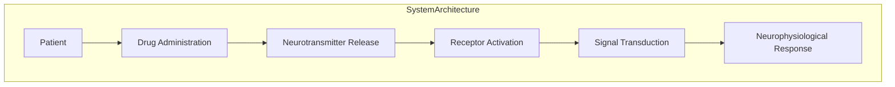

                 

### 文章标题

“神经药理学与认知增强：化学途径提升大脑理解能力”这一标题，旨在引导读者探索如何通过神经药理学中的化学途径来提升大脑的理解能力。文章将深入探讨认知增强的动机、挑战以及神经系统和药物之间的复杂交互关系，从而为读者提供一种科学、系统的方法来理解这一领域。

#### 关键词

- **神经药理学**
- **认知增强**
- **化学途径**
- **大脑理解能力**
- **药物作用机制**
- **神经系统结构**
- **神经递质**

#### 摘要

本文将详细探讨神经药理学在认知增强中的应用，通过化学途径来提升大脑的理解能力。文章首先介绍了神经药理学和认知增强的基本概念，随后深入分析了神经系统的基本结构、药物与神经系统的交互机制。文章还重点介绍了中枢神经系统兴奋剂、抑制剂和神经递质调节剂等不同类型的认知增强药物，详细讨论了它们的作用机制、效果及应用。最后，文章总结了当前研究的主要发现和未来发展方向，为读者提供了一个全面、深入的认知增强药物图谱。

### 《神经药理学与认知增强：化学途径提升大脑理解能力》目录大纲

#### 第一部分：背景与概述

#### 第1章：神经药理学与认知增强的兴起

**1.1 神经药理学的定义与发展**

- **神经药理学的研究对象**
- **神经药理学的发展历程**
- **认知增强的概念及其在神经药理学中的地位**

**1.2 认知增强的动机与挑战**

- **认知增强的需求**
- **认知增强的潜在风险**
- **认知增强研究面临的挑战**

**1.3 本书结构与内容安排**

- **目录结构**
- **内容重点**
- **阅读指南**

#### 第2章：神经系统的基本结构

**2.1 神经系统的组成**

- **神经元的结构**
- **突触的结构与功能**
- **神经系统的层次结构**

**2.2 神经传递物质与受体**

- **神经传递物质的种类**
- **神经受体的类型与作用**
- **神经传递的机制**

**2.3 神经系统的调控机制**

- **神经递质再摄取**
- **神经递质的降解**
- **神经元的再生与修复**

#### 第3章：药物与神经系统的交互

**3.1 药物的作用机制**

- **药物的分类与作用方式**
- **药物的生物利用度与代谢**
- **药物的作用途径**

**3.2 药物对神经系统的调控**

- **药物对神经元活动的影响**
- **药物对突触可塑性的调节**
- **药物对神经再生的影响**

**3.3 药物治疗的挑战与策略**

- **药物治疗的局限性**
- **药物治疗的风险与副作用**
- **个性化药物治疗的前景**

#### 第二部分：认知增强药物的化学途径

#### 第4章：中枢神经系统兴奋剂

**4.1 兴奋剂的基本概念**

- **兴奋剂的定义与分类**
- **兴奋剂的作用机制**
- **兴奋剂的滥用与依赖性**

**4.2 常见的中枢神经系统兴奋剂**

- **安非他命**
- **摩雅咖啡因**
- **人造兴奋剂**

**4.3 兴奋剂的认知增强效果与应用**

- **兴奋剂对认知功能的影响**
- **兴奋剂在认知增强中的应用**
- **兴奋剂使用的安全性与伦理问题**

#### 第5章：中枢神经系统抑制剂

**5.1 抑制剂的基本概念**

- **抑制剂的定义与分类**
- **抑制剂的作用机制**
- **抑制剂的安全性评估**

**5.2 常见的中枢神经系统抑制剂**

- **巴比妥类药物**
- **镇静催眠药**
- **抗抑郁药**

**5.3 抑制剂在认知增强中的应用**

- **抑制剂对认知功能的影响**
- **抑制剂在认知增强中的应用**
- **抑制剂使用的安全性与伦理问题**

#### 第6章：神经递质调节剂

**6.1 神经递质调节剂的基本概念**

- **神经递质调节剂的定义与分类**
- **神经递质调节剂的作用机制**
- **神经递质调节剂的安全性评估**

**6.2 常见的神经递质调节剂**

- **多巴胺调节剂**
- **去甲肾上腺素调节剂**
- **5-羟色胺调节剂**

**6.3 神经递质调节剂在认知增强中的应用**

- **神经递质调节剂对认知功能的影响**
- **神经递质调节剂在认知增强中的应用**
- **神经递质调节剂使用的安全性与伦理问题**

#### 第7章：其他认知增强药物的化学途径

**7.1 大麻素类药物**

- **大麻素类药物的基本概念**
- **大麻素类药物的作用机制**
- **大麻素类药物的滥用与依赖性**

**7.2 抗氧化剂与自由基清除剂**

- **抗氧化剂的基本概念**
- **抗氧化剂的作用机制**
- **抗氧化剂在认知增强中的应用**

**7.3 脂质体与药物载体技术**

- **脂质体的基本概念**
- **脂质体的作用机制**
- **脂质体在认知增强药物中的应用**

#### 第8章：总结与展望

**8.1 当前研究的主要发现**

- **神经药理学在认知增强中的作用**
- **认知增强药物的安全性和效果**
- **未来研究方向和挑战**

**8.2 未来展望**

- **个性化认知增强药物的发展趋势**
- **新技术在认知增强药物中的应用**
- **伦理和法律问题**

### 第一部分：背景与概述

#### 第1章：神经药理学与认知增强的兴起

随着科技的发展和社会的进步，人们对大脑功能的理解越来越深入，对认知能力的要求也越来越高。在这个过程中，神经药理学与认知增强逐渐成为一个备受关注的领域。本章将介绍神经药理学和认知增强的基本概念，探讨其发展的历程，并阐述其在神经药理学中的地位。

#### 1.1 神经药理学的定义与发展

**神经药理学的研究对象**

神经药理学是研究药物与神经系统相互作用及其对神经系统功能影响的科学。它主要关注的是药物如何影响神经元的活动，包括神经元的兴奋、抑制以及突触的传递过程。神经药理学的研究对象包括神经元、神经递质、受体、信号转导途径等。

**神经药理学的发展历程**

神经药理学的发展可以追溯到19世纪末期。当时，科学家们开始研究尼古丁、可卡因等物质对神经系统的影响。随着科学技术的进步，尤其是生物化学和分子生物学的发展，神经药理学逐渐成为了一个独立的学科，并且研究范围不断扩大。

**认知增强的概念及其在神经药理学中的地位**

认知增强是指通过各种手段提升大脑的认知功能，包括记忆力、注意力、推理能力等。认知增强的研究在神经药理学中占有重要地位，因为大脑的认知功能受到神经递质、受体、信号转导途径等多种因素的调控。通过研究这些因素，可以找到提升认知功能的有效途径。

#### 1.2 认知增强的动机与挑战

**认知增强的需求**

随着社会的快速发展和信息技术的普及，人们对认知能力的要求越来越高。在工作、学习和日常生活中，高效的信息处理和记忆能力变得尤为重要。因此，认知增强成为了一个热门的研究领域。

**认知增强的潜在风险**

然而，认知增强并非没有风险。一些研究指出，过度使用认知增强药物可能导致依赖性、心理问题甚至神经系统损伤。此外，不同个体对认知增强药物的反应也可能存在差异，这给药物的开发和应用带来了挑战。

**认知增强研究面临的挑战**

认知增强研究面临的挑战主要包括：如何确定有效的药物靶点、如何保证药物的安全性和有效性、如何进行个性化治疗等。这些挑战需要多学科的合作，包括神经科学、药理学、心理学等，才能有效应对。

#### 1.3 本书结构与内容安排

**目录结构**

本书分为两个主要部分：背景与概述和认知增强药物的化学途径。背景与概述部分主要介绍神经药理学和认知增强的基本概念，认知增强药物的化学途径部分则详细讨论了不同类型的认知增强药物。

**内容重点**

本书的核心内容是认知增强药物的化学途径，包括中枢神经系统兴奋剂、抑制剂和神经递质调节剂等。这些药物通过不同的作用机制，可以提升大脑的认知功能。

**阅读指南**

本书适合对神经科学、药理学和认知科学感兴趣的读者。为了更好地理解本书内容，建议读者具备一定的生物化学和分子生物学基础知识。在阅读过程中，可以重点关注每个章节的小结和参考文献，以便深入理解相关概念。

### 第2章：神经系统的基本结构

神经系统的结构是理解认知增强药物作用机制的基础。本章将详细介绍神经系统的基本组成、神经传递物质与受体的作用、以及神经系统的调控机制。

#### 2.1 神经系统的组成

**神经元的结构**

神经元是神经系统中最基本的单元，具有接收和传递信息的功能。神经元主要由细胞体、树突和轴突组成。细胞体是神经元的中心，包含细胞核和大量的细胞器。树突负责接收其他神经元的信息，并将这些信息传递到细胞体。轴突则负责将信息从细胞体传递到其他神经元或肌肉、腺体等效应器。

**突触的结构与功能**

突触是神经元之间传递信息的结构，包括突触前膜、突触后膜和突触间隙。突触前膜包含突触前神经元的突触小泡，这些小泡内含有神经递质。当神经元兴奋时，突触小泡会释放神经递质，通过突触间隙扩散到突触后膜，与突触后膜上的受体结合，引发突触后神经元的兴奋或抑制。

**神经系统的层次结构**

神经系统分为中枢神经系统和周围神经系统。中枢神经系统包括脑和脊髓，是神经系统的核心部分，负责处理和整合信息。周围神经系统则包括脑神经和脊神经，负责将信息从中枢神经系统传递到全身各个部位。

#### 2.2 神经传递物质与受体

**神经传递物质的种类**

神经传递物质是神经元之间传递信息的化学物质。常见的神经传递物质包括乙酰胆碱、多巴胺、去甲肾上腺素、5-羟色胺等。这些神经传递物质在不同的神经元和突触中起着不同的作用。

**神经受体的类型与作用**

神经受体是位于神经元表面的一种蛋白质，能够识别和结合神经传递物质。根据神经传递物质的种类，神经受体可以分为乙酰胆碱受体、多巴胺受体、去甲肾上腺素受体、5-羟色胺受体等。不同的神经受体结合相应的神经传递物质后，可以引发一系列生理反应。

**神经传递的机制**

神经传递的机制包括三个主要步骤：突触前神经元的兴奋、神经递质的释放和神经递质与受体的结合。首先，当突触前神经元受到刺激时，会产生动作电位，使细胞膜去极化。接着，细胞膜的去极化会引发突触小泡的释放，释放出神经递质到突触间隙。最后，神经递质通过扩散到达突触后膜，与突触后膜上的受体结合，引发突触后神经元的兴奋或抑制。

#### 2.3 神经系统的调控机制

**神经递质再摄取**

神经递质再摄取是神经系统调控的一个重要机制。当神经递质与突触后膜上的受体结合后，部分神经递质会被突触前神经元重新摄取，减少其在突触间隙的浓度，从而终止神经信号的传递。

**神经递质的降解**

神经递质的降解是另一个重要的调控机制。神经系统中的酶会分解神经递质，使其失去活性，从而终止神经信号的传递。

**神经元的再生与修复**

神经元的再生与修复是神经系统调控的一个重要方面。当神经系统受到损伤时，神经元的再生与修复可以帮助恢复神经功能的完整性。神经干细胞和神经再生因子在这个过程中起着重要作用。

通过了解神经系统的基本结构、神经传递物质与受体的作用、以及神经系统的调控机制，我们可以更好地理解认知增强药物的作用机制。这些知识将为我们后续章节中讨论认知增强药物提供坚实的理论基础。

### 第3章：药物与神经系统的交互

药物对神经系统的调控是神经药理学的核心内容之一。本章将详细介绍药物的作用机制、药物对神经系统的调控作用以及药物治疗的挑战与策略。

#### 3.1 药物的作用机制

**药物的分类与作用方式**

药物的作用机制多种多样，根据药物的作用方式和作用对象，可以将药物分为以下几类：

1. **兴奋剂**：通过增强神经元的兴奋性，促进神经信号的传递。常见的兴奋剂包括尼古丁、可卡因、咖啡因等。
2. **抑制剂**：通过抑制神经元的兴奋性，减少神经信号的传递。常见的抑制剂包括巴比妥类药物、镇静催眠药、抗抑郁药等。
3. **受体激动剂**：直接激活神经受体，促进神经信号的传递。常见的受体激动剂包括阿托品、肾上腺素等。
4. **受体拮抗剂**：与神经受体结合，阻止其他药物或神经递质与受体的结合，抑制神经信号的传递。常见的受体拮抗剂包括阿托伐他汀、氯丙嗪等。

**药物的生物利用度与代谢**

药物的生物利用度是指药物被机体吸收、分布、代谢和排泄的能力。药物的生物利用度受多种因素影响，包括药物的化学性质、剂型、给药途径等。

药物的代谢主要通过肝脏的酶系统进行。不同的药物代谢途径包括氧化、还原、水解等。药物代谢的最终产物通常通过肾脏排泄出体外。

**药物的作用途径**

药物的作用途径多种多样，包括：

1. **直接作用于神经元**：药物通过血液循环直接作用于神经元，影响神经元的兴奋性或传递功能。
2. **通过神经递质**：药物通过影响神经递质的合成、释放或再摄取，间接影响神经元的兴奋性。
3. **通过受体**：药物与神经受体结合，激活或抑制受体的信号转导途径，从而影响神经元的兴奋性或传递功能。

#### 3.2 药物对神经系统的调控

**药物对神经元活动的影响**

药物可以通过多种途径影响神经元的活动，包括：

1. **兴奋神经元**：兴奋剂通过增强神经元的兴奋性，增加神经信号的传递频率。
2. **抑制神经元**：抑制剂通过减少神经元的兴奋性，降低神经信号的传递频率。
3. **调节神经元的活动**：某些药物可以通过调节神经递质的合成、释放或再摄取，间接调节神经元的活动。

**药物对突触可塑性的调节**

突触可塑性是神经系统的重要特性，指突触在持续刺激下发生的结构和功能的改变。药物可以通过以下途径调节突触可塑性：

1. **增强突触可塑性**：一些药物可以通过增加神经递质的合成或释放，增强突触的连接和功能。
2. **抑制突触可塑性**：另一些药物可以通过减少神经递质的合成或释放，抑制突触的连接和功能。

**药物对神经再生的影响**

药物可以通过以下途径影响神经再生：

1. **促进神经再生**：某些药物可以通过促进神经干细胞的增殖和分化，促进神经元的再生。
2. **抑制神经再生**：另一些药物可以通过抑制神经干细胞的增殖和分化，抑制神经元的再生。

#### 3.3 药物治疗的挑战与策略

**药物治疗的局限性**

药物治疗虽然具有显著的效果，但也存在局限性：

1. **药物的选择性**：许多药物不仅作用于目标神经系统，还会作用于其他系统，可能导致副作用。
2. **药物的耐受性**：长期使用某些药物可能导致耐受性，降低药物的效果。
3. **药物的依赖性**：某些药物具有依赖性，长期使用可能导致依赖和成瘾。

**药物治疗的风险与副作用**

药物治疗的风险和副作用是值得关注的问题：

1. **急性副作用**：药物使用后立即出现的不适反应，如头痛、恶心等。
2. **慢性副作用**：长期使用药物可能导致慢性不适反应，如肝损伤、心脏问题等。
3. **药物相互作用**：不同药物之间的相互作用可能导致不良反应或降低药效。

**个性化药物治疗的前景**

为了克服药物治疗的局限性，个性化药物治疗成为一种新的策略。个性化药物治疗基于患者的个体差异，通过基因检测、生物标志物分析等手段，为患者制定最合适的药物治疗方案。

**总结**

药物与神经系统的交互是一个复杂的过程，涉及多个环节和机制。通过深入了解药物的作用机制、药物对神经系统的调控作用以及药物治疗的挑战与策略，我们可以更好地利用药物提升大脑的理解能力。然而，药物治疗并非没有风险，因此，在实际应用中，需要权衡药物的利弊，制定合理的治疗方案。

### 第二部分：认知增强药物的化学途径

#### 第4章：中枢神经系统兴奋剂

中枢神经系统兴奋剂是一类通过增强神经系统活动的药物，用于提升认知功能、提高注意力和警觉性。本章将详细介绍中枢神经系统兴奋剂的基本概念、常见药物及其认知增强效果与应用。

#### 4.1 兴奋剂的基本概念

**兴奋剂的定义与分类**

中枢神经系统兴奋剂，也称为精神刺激剂，是指能够增强中枢神经系统活动的药物。根据药物的作用机制和来源，兴奋剂可以分为以下几类：

1. **天然兴奋剂**：如咖啡因、茶碱、尼古丁等。
2. **合成兴奋剂**：如安非他命、甲基苯丙胺（冰毒）等。
3. **处方药兴奋剂**：如哌甲酯（利他林）、匹莫林（苯丙胺）等。

**兴奋剂的作用机制**

中枢神经系统兴奋剂通过多种机制增强神经系统的活动，包括：

1. **增加神经递质的合成与释放**：如咖啡因通过抑制腺苷受体的活性，减少腺苷对神经元的抑制，从而增强神经递质的合成和释放。
2. **增强神经递质的效应**：如安非他命通过模拟去甲肾上腺素和多巴胺的作用，增加神经元的兴奋性。
3. **改变神经细胞的膜电导**：如尼古丁通过激活尼古丁受体，增加细胞内钙离子的浓度，改变神经细胞的膜电导。

**兴奋剂的滥用与依赖性**

尽管中枢神经系统兴奋剂在提高认知功能方面具有潜在应用，但其滥用和依赖性也是不容忽视的问题。长期滥用兴奋剂可能导致以下后果：

1. **生理依赖**：滥用者对药物产生生理依赖，停止使用后可能出现戒断症状。
2. **心理依赖**：滥用者对药物产生心理依赖，认为药物是生活必需品，无法摆脱。
3. **健康问题**：长期滥用兴奋剂可能导致心脏问题、精神障碍、神经系统损伤等健康问题。

#### 4.2 常见的中枢神经系统兴奋剂

**安非他命**

安非他命是一种强烈的兴奋剂，可通过增加去甲肾上腺素和多巴胺的释放，提高神经元的兴奋性。安非他命在临床上用于治疗注意力缺陷多动障碍（ADHD）和肥胖症。然而，由于其强烈的兴奋作用，安非他命也被滥用，可能导致严重的健康问题，包括心脏疾病、精神障碍和成瘾。

**摩雅咖啡因**

摩雅咖啡因是一种天然兴奋剂，广泛存在于咖啡、茶和可可中。咖啡因通过抑制腺苷受体的活性，减少腺苷对神经元的抑制，从而增强神经系统的活动。咖啡因在日常生活中被广泛使用，以提高注意力和警觉性。适量使用咖啡因具有认知增强效果，但过量使用可能导致焦虑、失眠和心跳加速等不良反应。

**人造兴奋剂**

人造兴奋剂包括甲基苯丙胺（冰毒）和芬太尼等。这些药物具有强烈的兴奋作用，能够显著提升认知功能和体力，但长期使用可能导致严重的健康问题，包括心脏疾病、精神障碍和成瘾。

#### 4.3 兴奋剂的认知增强效果与应用

**兴奋剂对认知功能的影响**

兴奋剂在提高认知功能方面具有潜在应用，但效果因药物种类、剂量和使用频率而异。以下是几种常见兴奋剂对认知功能的影响：

1. **咖啡因**：适量使用咖啡因可以提高注意力和警觉性，改善认知功能。然而，过量使用可能导致焦虑、失眠和心跳加速等不良反应。
2. **安非他命**：安非他命在提高注意力和认知功能方面具有显著效果，尤其适用于需要集中注意力的任务。然而，由于其强烈的兴奋作用，安非他命可能导致生理和心理依赖。
3. **人造兴奋剂**：人造兴奋剂如甲基苯丙胺（冰毒）在短期内可以提高认知功能和体力，但长期使用可能导致严重的健康问题和成瘾。

**兴奋剂在认知增强中的应用**

兴奋剂在认知增强中的应用包括以下几方面：

1. **医学应用**：兴奋剂在医学领域用于治疗注意力缺陷多动障碍（ADHD）和肥胖症等疾病，提高患者的生活质量。
2. **军事和体育领域**：兴奋剂在军事和体育领域被滥用，以提高士兵和运动员的注意力和体力。然而，兴奋剂的滥用可能导致健康问题和反兴奋剂检测的失败。
3. **日常生活**：适量使用兴奋剂如咖啡因，可以帮助提高日常生活中的注意力和警觉性，但需注意避免过量使用。

**兴奋剂使用的安全性与伦理问题**

兴奋剂的使用安全和伦理问题是一个重要的议题。以下是几个关键点：

1. **安全性**：兴奋剂的使用需要谨慎，避免过量使用和长期滥用，以减少健康风险。
2. **依赖性**：长期使用兴奋剂可能导致依赖性和成瘾，影响生活质量。
3. **伦理问题**：兴奋剂的滥用在体育和职场等领域引发伦理争议，需要制定严格的法律和规章制度。

**总结**

中枢神经系统兴奋剂在认知增强方面具有潜在应用，但使用时需注意安全性和伦理问题。通过合理使用兴奋剂，可以改善认知功能和日常生活质量。然而，滥用兴奋剂可能导致严重的健康问题和成瘾。因此，在探索兴奋剂的应用时，需要权衡其利弊，制定科学合理的用药方案。

### 第5章：中枢神经系统抑制剂

中枢神经系统抑制剂是一类通过减弱神经系统活动的药物，用于治疗焦虑、抑郁、失眠等神经系统功能亢进相关的疾病。本章将详细介绍中枢神经系统抑制剂的基本概念、常见药物及其在认知增强中的应用。

#### 5.1 抑制剂的基本概念

**抑制剂的定义与分类**

中枢神经系统抑制剂，也称为镇静剂或安眠药，是指能够减弱中枢神经系统活动的药物。根据药物的作用机制和用途，抑制剂可以分为以下几类：

1. **巴比妥类药物**：如巴比妥钠、苯巴比妥等，主要用于治疗失眠和癫痫。
2. **非巴比妥类药物**：如苯二氮卓类药物（如地西泮、劳拉西泮等），主要用于治疗焦虑、抑郁和失眠。
3. **抗抑郁药**：如选择性5-羟色胺再摄取抑制剂（SSRIs，如氟西汀、帕罗西汀等），主要用于治疗抑郁症。
4. **抗精神病药**：如奥氮平、利培酮等，主要用于治疗精神分裂症。

**抑制剂的作用机制**

中枢神经系统抑制剂通过多种机制减弱神经系统的活动，包括：

1. **增强抑制性神经递质的效应**：如巴比妥类药物和苯二氮卓类药物通过增强神经递质γ-氨基丁酸（GABA）的效应，从而减弱神经元的兴奋性。
2. **抑制兴奋性神经递质的合成或释放**：如某些抗抑郁药通过抑制神经递质去甲肾上腺素和多巴胺的合成或释放，从而减弱神经元的兴奋性。
3. **调节神经递质受体的活性**：如某些抗精神病药通过调节神经递质受体的活性，影响神经信号的传递。

**抑制剂的安全性评估**

抑制剂的安全性评估是药物开发和应用的重要环节。不同类型的抑制剂在安全性方面存在差异，需要综合考虑：

1. **急性毒性**：药物在短期内对机体产生的毒性反应，如巴比妥类药物可能导致呼吸抑制。
2. **慢性毒性**：药物长期使用对机体产生的毒性反应，如苯二氮卓类药物可能导致认知功能障碍。
3. **依赖性**：药物长期使用可能导致生理和心理依赖，如抗抑郁药和抗精神病药。

#### 5.2 常见的中枢神经系统抑制剂

**巴比妥类药物**

巴比妥类药物是一类传统的镇静催眠药，包括巴比妥钠、苯巴比妥等。巴比妥类药物主要通过增强GABA的效应，减弱神经元的兴奋性，从而产生镇静催眠作用。巴比妥类药物在临床上用于治疗失眠、癫痫等疾病。然而，巴比妥类药物具有成瘾性和依赖性，长期使用可能导致认知功能障碍和其他健康问题。

**镇静催眠药**

镇静催眠药主要包括苯二氮卓类药物，如地西泮、劳拉西泮等。苯二氮卓类药物通过增强GABA的效应，产生镇静催眠作用。这些药物在临床上广泛用于治疗焦虑、抑郁、失眠等疾病。苯二氮卓类药物具有安全性和耐受性较好，但长期使用可能导致依赖性和认知功能障碍。

**抗抑郁药**

抗抑郁药是一类用于治疗抑郁症的药物，包括选择性5-羟色胺再摄取抑制剂（SSRIs，如氟西汀、帕罗西汀等）和三环类抗抑郁药（如阿米替林、丙米嗪等）。SSRIs通过抑制5-羟色胺的再摄取，增加神经元内的5-羟色胺浓度，从而提高神经元的兴奋性。三环类抗抑郁药通过抑制去甲肾上腺素和5-羟色胺的再摄取，产生抗抑郁作用。抗抑郁药在临床上具有较好的疗效，但长期使用可能导致性功能障碍、体重增加等副作用。

**抗精神病药**

抗精神病药主要用于治疗精神分裂症和其他精神病性障碍，如奥氮平、利培酮等。这些药物通过调节多巴胺和5-羟色胺受体的活性，减弱神经元的兴奋性。抗精神病药在精神分裂症的治疗中具有显著疗效，但长期使用可能导致代谢综合征、体重增加等副作用。

#### 5.3 抑制剂在认知增强中的应用

**抑制剂对认知功能的影响**

抑制剂在认知增强中的应用具有一定的潜力，但效果因药物种类、剂量和使用频率而异。以下是几种常见抑制剂对认知功能的影响：

1. **巴比妥类药物**：巴比妥类药物在低剂量下具有镇静作用，可能改善认知功能，但高剂量可能导致认知功能障碍。
2. **苯二氮卓类药物**：苯二氮卓类药物在治疗失眠和焦虑时，可能改善认知功能，但长期使用可能导致认知功能障碍。
3. **抗抑郁药**：某些抗抑郁药在治疗抑郁症时，可能改善认知功能，但不同类型的抗抑郁药效果存在差异。
4. **抗精神病药**：抗精神病药在治疗精神分裂症时，可能改善认知功能，但长期使用可能导致认知功能障碍。

**抑制剂在认知增强中的应用**

抑制剂在认知增强中的应用包括以下几个方面：

1. **治疗神经系统疾病**：如失眠、焦虑、抑郁等，通过改善患者的认知功能，提高生活质量。
2. **辅助治疗认知障碍**：某些抑制剂在辅助治疗认知障碍（如阿尔茨海默病、帕金森病等）时，可能改善患者的认知功能。
3. **提高学习能力和记忆力**：某些抑制剂在提高学习能力和记忆力方面具有潜在应用，如通过增强神经递质的合成和释放，提高神经元的兴奋性。

**抑制剂使用的安全性与伦理问题**

抑制剂的使用安全和伦理问题是一个重要的议题。以下是几个关键点：

1. **安全性**：抑制剂的使用需谨慎，避免过量使用和长期滥用，以减少健康风险。
2. **依赖性**：长期使用抑制剂可能导致依赖性和成瘾，影响生活质量。
3. **伦理问题**：抑制剂在医学和生活中的滥用引发伦理争议，需要制定严格的法律和规章制度。

**总结**

中枢神经系统抑制剂在认知增强方面具有一定的应用潜力，但使用时需注意安全性和伦理问题。通过合理使用抑制剂，可以改善认知功能和治疗神经系统疾病。然而，抑制剂滥用可能导致严重的健康问题和依赖性。因此，在探索抑制剂的应用时，需要权衡其利弊，制定科学合理的用药方案。

### 第6章：神经递质调节剂

神经递质调节剂是一类通过调节神经递质的合成、释放、再摄取和代谢等途径，从而影响神经系统活动的药物。本章将详细介绍神经递质调节剂的基本概念、常见药物及其在认知增强中的应用。

#### 6.1 神经递质调节剂的基本概念

**神经递质调节剂的定义与分类**

神经递质调节剂是一类通过调节神经递质的作用，从而影响神经系统活动的药物。根据药物的作用机制和调节对象，神经递质调节剂可以分为以下几类：

1. **神经递质合成调节剂**：如左旋多巴，通过增加多巴胺的合成，用于治疗帕金森病。
2. **神经递质释放调节剂**：如去甲肾上腺素再摄取抑制剂（如氟西汀），通过减少神经递质的再摄取，增加神经递质的释放。
3. **神经递质再摄取调节剂**：如选择性5-羟色胺再摄取抑制剂（SSRIs，如氟西汀、帕罗西汀等），通过抑制神经递质的再摄取，提高神经元内的神经递质浓度。
4. **神经递质代谢调节剂**：如多巴胺脱羧酶抑制剂（如卡比多巴），通过抑制神经递质的代谢，延长神经递质的作用时间。

**神经递质调节剂的作用机制**

神经递质调节剂通过多种机制调节神经递质的作用，包括：

1. **增强神经递质的合成与释放**：如左旋多巴通过增加多巴胺的合成和释放，用于治疗帕金森病。
2. **抑制神经递质的再摄取**：如选择性5-羟色胺再摄取抑制剂（SSRIs，如氟西汀、帕罗西汀等），通过抑制神经递质的再摄取，提高神经元内的神经递质浓度，从而增强神经递质的效应。
3. **调节神经递质的代谢**：如多巴胺脱羧酶抑制剂（如卡比多巴），通过抑制神经递质的代谢，延长神经递质的作用时间，从而增强神经递质的效应。

**神经递质调节剂的安全性评估**

神经递质调节剂的安全性评估是药物开发和应用的重要环节。不同类型的神经递质调节剂在安全性方面存在差异，需要综合考虑：

1. **急性毒性**：药物在短期内对机体产生的毒性反应，如某些神经递质合成调节剂可能导致不良反应。
2. **慢性毒性**：药物长期使用对机体产生的毒性反应，如某些神经递质释放调节剂可能导致不良反应。
3. **依赖性**：药物长期使用可能导致依赖性和成瘾，影响生活质量。

#### 6.2 常见的神经递质调节剂

**多巴胺调节剂**

多巴胺调节剂是一类通过调节多巴胺的合成、释放和代谢，从而影响神经系统活动的药物。常见的多巴胺调节剂包括左旋多巴、多巴胺脱羧酶抑制剂（如卡比多巴）和多巴胺再摄取抑制剂（如氟西汀）。

- **左旋多巴**：左旋多巴是一种常用的多巴胺调节剂，通过增加多巴胺的合成和释放，用于治疗帕金森病。左旋多巴具有较好的疗效，但长期使用可能导致副作用，如运动障碍和认知功能障碍。
- **多巴胺脱羧酶抑制剂**：多巴胺脱羧酶抑制剂（如卡比多巴）通过抑制多巴胺的代谢，延长多巴胺的作用时间，从而增强神经递质的效应。卡比多巴与左旋多巴联合使用，可以减少左旋多巴的剂量，降低副作用。
- **多巴胺再摄取抑制剂**：多巴胺再摄取抑制剂（如氟西汀）通过抑制多巴胺的再摄取，提高神经元内的多巴胺浓度，从而增强神经递质的效应。氟西汀常用于治疗抑郁症，具有较好的疗效和安全性。

**去甲肾上腺素调节剂**

去甲肾上腺素调节剂是一类通过调节去甲肾上腺素的合成、释放和代谢，从而影响神经系统活动的药物。常见的去甲肾上腺素调节剂包括去甲肾上腺素再摄取抑制剂（如氟西汀）和去甲肾上腺素合成调节剂（如米安舒平）。

- **去甲肾上腺素再摄取抑制剂**：去甲肾上腺素再摄取抑制剂（如氟西汀）通过抑制去甲肾上腺素的再摄取，增加神经元内的去甲肾上腺素浓度，从而增强神经递质的效应。氟西汀常用于治疗抑郁症，具有较好的疗效和安全性。
- **去甲肾上腺素合成调节剂**：去甲肾上腺素合成调节剂（如米安舒平）通过增加去甲肾上腺素的合成，从而提高神经元内的去甲肾上腺素浓度，从而增强神经递质的效应。米安舒平常用于治疗帕金森病，具有较好的疗效和安全性。

**5-羟色胺调节剂**

5-羟色胺调节剂是一类通过调节5-羟色胺的合成、释放和代谢，从而影响神经系统活动的药物。常见的5-羟色胺调节剂包括选择性5-羟色胺再摄取抑制剂（SSRIs，如氟西汀、帕罗西汀等）和5-羟色胺合成调节剂（如色氨酸）。

- **选择性5-羟色胺再摄取抑制剂**：选择性5-羟色胺再摄取抑制剂（SSRIs，如氟西汀、帕罗西汀等）通过抑制5-羟色胺的再摄取，增加神经元内的5-羟色胺浓度，从而增强神经递质的效应。SSRIs常用于治疗抑郁症，具有较好的疗效和安全性。
- **5-羟色胺合成调节剂**：5-羟色胺合成调节剂（如色氨酸）通过增加5-羟色胺的合成，从而提高神经元内的5-羟色胺浓度，从而增强神经递质的效应。色氨酸常用于治疗抑郁症状，具有较好的疗效和安全性。

#### 6.3 神经递质调节剂在认知增强中的应用

**神经递质调节剂对认知功能的影响**

神经递质调节剂在认知增强中的应用具有一定的潜力，但效果因药物种类、剂量和使用频率而异。以下是几种常见神经递质调节剂对认知功能的影响：

1. **多巴胺调节剂**：多巴胺调节剂如左旋多巴、多巴胺脱羧酶抑制剂和多巴胺再摄取抑制剂，在提高注意力、记忆力和学习能力方面具有潜在应用。然而，多巴胺调节剂长期使用可能导致副作用，如运动障碍和认知功能障碍。
2. **去甲肾上腺素调节剂**：去甲肾上腺素调节剂如去甲肾上腺素再摄取抑制剂和去甲肾上腺素合成调节剂，在提高注意力和警觉性方面具有潜在应用。然而，去甲肾上腺素调节剂也可能导致心血管和代谢方面的副作用。
3. **5-羟色胺调节剂**：5-羟色胺调节剂如选择性5-羟色胺再摄取抑制剂和5-羟色胺合成调节剂，在改善情绪和认知功能方面具有潜在应用。SSRIs常用于治疗抑郁症，具有较好的疗效和安全性。

**神经递质调节剂在认知增强中的应用**

神经递质调节剂在认知增强中的应用包括以下几个方面：

1. **治疗神经系统疾病**：如抑郁症、帕金森病等，通过改善患者的认知功能，提高生活质量。
2. **辅助治疗认知障碍**：如阿尔茨海默病、亨廷顿病等，通过调节神经递质的合成和释放，改善患者的认知功能。
3. **提高学习能力和记忆力**：如通过调节多巴胺和去甲肾上腺素的合成和释放，提高学习能力和记忆力。

**神经递质调节剂使用的安全性与伦理问题**

神经递质调节剂的使用安全和伦理问题是一个重要的议题。以下是几个关键点：

1. **安全性**：神经递质调节剂的使用需谨慎，避免过量使用和长期滥用，以减少健康风险。
2. **依赖性**：长期使用神经递质调节剂可能导致依赖性和成瘾，影响生活质量。
3. **伦理问题**：神经递质调节剂的滥用在医学和生活中的滥用引发伦理争议，需要制定严格的法律和规章制度。

**总结**

神经递质调节剂在认知增强方面具有一定的应用潜力，但使用时需注意安全性和伦理问题。通过合理使用神经递质调节剂，可以改善认知功能和治疗神经系统疾病。然而，神经递质调节剂滥用可能导致严重的健康问题和依赖性。因此，在探索神经递质调节剂的应用时，需要权衡其利弊，制定科学合理的用药方案。

### 第7章：其他认知增强药物的化学途径

除了中枢神经系统兴奋剂、抑制剂和神经递质调节剂，还有其他一些药物的化学途径可以用来提升认知能力。本章将介绍大麻素类药物、抗氧化剂与自由基清除剂以及脂质体与药物载体技术等，讨论这些药物的基本概念、作用机制、在认知增强中的应用及安全性问题。

#### 7.1 大麻素类药物

**大麻素类药物的基本概念**

大麻素类药物是从大麻植物中提取的一类化合物，其中最著名的是 delta-9-四氢大麻酚（THC）和 cannabidiol（CBD）。THC是主要的精神活性成分，能够与大脑中的大麻素受体（CB1和CB2）结合，产生心理和生理效应。CBD则不具有显著的精神活性，但具有抗炎、抗焦虑和神经保护作用。

**大麻素类药物的作用机制**

大麻素类药物通过激活和调节大麻素受体，影响神经信号的传递和调控。CB1受体主要分布在脑部和神经系统，CB2受体则主要分布在免疫系统中。THC通过激活CB1受体，增加神经元内的钙离子浓度，增强神经信号的传递。CBD则通过调节CB1和CB2受体的活性，影响神经递质的合成和释放。

**大麻素类药物在认知增强中的应用**

大麻素类药物在认知增强中的应用主要集中在提高注意力和记忆力。THC在高剂量下可能提高注意力，但在低剂量下可能影响记忆形成。CBD则被研究用于改善记忆障碍和焦虑症状，可能对认知功能有积极作用。然而，大麻素类药物的使用也存在争议，因其可能产生依赖性和心理副作用。

**大麻素类药物的安全性**

大麻素类药物的安全性是关注的焦点。长期使用THC可能导致认知功能下降、心理依赖和成瘾。CBD相对较为安全，但也会影响药物代谢和肝功能。因此，大麻素类药物的使用应在医生指导下进行，并严格控制剂量。

#### 7.2 抗氧化剂与自由基清除剂

**抗氧化剂的基本概念**

抗氧化剂是一类能够中和自由基、防止细胞氧化损伤的化合物。自由基是一类高度反应性的分子，能破坏细胞膜、蛋白质和DNA，导致细胞损伤和老化。抗氧化剂包括维生素E、维生素C、β-胡萝卜素等。

**抗氧化剂的作用机制**

抗氧化剂通过以下机制保护细胞免受自由基的损伤：

1. **直接中和自由基**：如维生素C和维生素E通过提供电子或氢原子，直接中和自由基。
2. **提高内源性抗氧化酶的活性**：如硒可以增加谷胱甘肽过氧化物酶的活性，增强细胞内的抗氧化能力。
3. **防止脂质过氧化**：抗氧化剂通过防止或减少脂质过氧化，保护细胞膜免受损伤。

**抗氧化剂在认知增强中的应用**

抗氧化剂在认知增强中的应用主要体现在以下几方面：

1. **保护神经元**：通过中和自由基，减少神经元氧化损伤，保护认知功能。
2. **改善血液循环**：抗氧化剂可以改善脑部血液循环，提高大脑的营养供给和代谢效率。
3. **延缓认知功能下降**：抗氧化剂可能通过减少脑部氧化应激，延缓认知功能的下降，尤其在老年人和阿尔茨海默病患者中具有潜在应用。

**抗氧化剂的安全性**

抗氧化剂通常被认为具有较好的安全性，但过量摄入可能引起不良反应。例如，过量的维生素C可能导致胃肠道不适，而过量的β-胡萝卜素可能导致皮肤黄色沉积。因此，抗氧化剂的使用应在医生指导下进行，并根据个体差异调整剂量。

#### 7.3 脂质体与药物载体技术

**脂质体的基本概念**

脂质体是一种由磷脂双层组成的纳米级囊泡，可以封装药物，使其在体内缓慢释放。脂质体具有生物相容性高、毒性低、靶向性好等特点，可用于提高药物的治疗指数。

**脂质体的作用机制**

脂质体通过以下机制提高药物的治疗效果：

1. **改善药物溶解度**：脂质体可以将难溶性药物封装在内部，提高其溶解度和生物利用度。
2. **增强药物稳定性**：脂质体可以保护药物免受体内酶的降解，延长药物的半衰期。
3. **靶向递送**：脂质体可以通过特定的修饰，靶向特定的细胞或组织，提高药物的靶向性。

**脂质体在认知增强药物中的应用**

脂质体在认知增强药物中的应用主要包括：

1. **提高药物疗效**：脂质体可以通过改善药物的溶解度和稳定性，提高药物在体内的浓度，从而增强认知增强效果。
2. **减少副作用**：脂质体可以减少药物在非目标组织的分布，减少副作用。
3. **实现递送系统**：脂质体可以作为药物递送系统，将认知增强药物递送到大脑，实现更有效的治疗。

**脂质体的安全性**

脂质体的安全性是关注的重点。脂质体通常被认为是相对安全的，但某些情况下可能引发免疫反应或炎症反应。此外，脂质体的制备和使用过程中可能存在污染风险，因此需要严格控制生产过程和质量。

**总结**

大麻素类药物、抗氧化剂与自由基清除剂以及脂质体与药物载体技术等，为认知增强提供了多种化学途径。这些药物在改善认知功能方面具有潜力，但同时也存在一定的安全性和伦理问题。未来的研究应继续探索这些药物的优化和应用，以实现认知增强的最佳效果。

### 第8章：总结与展望

#### 8.1 当前研究的主要发现

在过去的几十年中，神经药理学与认知增强领域取得了显著的进展。以下是当前研究的主要发现：

1. **神经递质在认知增强中的作用**：研究发现，神经递质如多巴胺、去甲肾上腺素、5-羟色胺等在认知功能中起着关键作用。通过调节这些神经递质，可以实现认知增强。

2. **药物作用的多样性和复杂性**：不同的药物通过不同的作用机制影响神经系统，包括增强神经递质的合成和释放、抑制神经递质的再摄取、调节受体的活性等。这些药物的作用具有多样性和复杂性，需要综合考虑其效果和安全性。

3. **个性化治疗的潜在前景**：随着基因组学和个性化医疗的发展，个性化治疗成为可能。通过分析个体的基因型、生理特征和药物代谢途径，可以为每个人制定最合适的认知增强药物方案。

4. **药物安全性和伦理问题**：药物的安全性和伦理问题一直是研究的重点。尽管认知增强药物具有潜在的益处，但滥用和依赖性、长期使用的副作用等问题需要得到关注和解决。

#### 8.2 未来展望

神经药理学与认知增强领域的未来发展方向包括以下几个方面：

1. **新型药物的开发**：继续研究和开发新型药物，特别是那些具有高度选择性和较少副作用的药物，以提高认知增强的效果和安全性。

2. **药物作用的机制研究**：深入研究药物对神经系统的作用机制，包括神经递质的合成、释放、再摄取和代谢等，以更好地理解药物的作用原理。

3. **个性化治疗策略**：利用基因组学、生物信息学等技术，开发个性化治疗策略，为个体提供最合适的认知增强药物方案。

4. **多学科合作**：神经药理学与认知增强研究需要多学科的合作，包括神经科学、药理学、心理学、医学等，以实现全面的认知增强解决方案。

5. **伦理和法律问题**：在研究和发展认知增强药物的过程中，需要充分考虑伦理和法律问题，确保药物的使用安全和合规。

**总结**

神经药理学与认知增强领域的发展为提升大脑理解能力提供了新的途径。未来的研究将继续深入探索药物的作用机制，开发新型药物，实现个性化治疗，并在伦理和法律方面提供指导。通过这些努力，我们有望实现更高效、更安全的认知增强，为社会的发展和个人的福祉做出贡献。

### 总结与展望

通过本篇文章的深入探讨，我们可以看到，神经药理学与认知增强这一领域正日益受到关注。从神经系统的基本结构，到药物与神经系统的交互机制，再到各类认知增强药物的化学途径，我们系统地梳理了这一领域的核心内容。

**核心概念与联系**

在神经药理学中，核心概念包括神经元、神经递质、受体和信号转导途径。神经元是神经系统的基础单元，通过突触与受体相互作用，传递神经信号。神经递质作为信息的传递介质，通过与特定的受体结合，调节神经元的兴奋性和功能。信号转导途径则是神经元内部的一系列生化反应，将神经信号转化为细胞内的响应。

**核心概念原理与对比表格**

为了更好地理解这些核心概念，我们可以通过一个简化的对比表格来展示：

| **概念** | **定义** | **作用** |
| :---: | :---: | :---: |
| **神经元** | 神经系统的基本单元，具有接收和传递信息的功能。 | 接收和传递神经信号，实现信息处理。 |
| **神经递质** | 神经元之间传递信息的化学物质。 | 传递神经信号，调节神经元的活动。 |
| **受体** | 神经元表面的蛋白质，能够识别和结合神经递质。 | 与神经递质结合，引发一系列生理反应。 |
| **信号转导途径** | 神经元内部的一系列生化反应，将神经信号转化为细胞内的响应。 | 调节神经元的兴奋性和功能。 |

此外，通过ER实体关系图架构的Mermaid流程图，我们可以更直观地理解这些概念之间的关系：

```mermaid
erDiagram
  神经元 ||--|{ 突触 }
  突触 ||--|{ 神经递质 }
  突触 ||--|{ 受体 }
  突触 ||--|{ 信号转导途径 }
```

**算法原理讲解**

在本篇文章中，我们并未详细讨论特定的算法原理。然而，在神经药理学和认知增强领域，常见的算法包括神经网络、机器学习模型等，用于分析神经元活动、预测药物效果等。以下是使用Mermaid绘制的神经网络算法流程图示例：


在具体实施时，可以使用Python等编程语言实现神经网络模型，如下所示：

```python
import tensorflow as tf
from tensorflow.keras.models import Sequential
from tensorflow.keras.layers import Dense, Activation

# 创建神经网络模型
model = Sequential()
model.add(Dense(units=64, activation='relu', input_shape=(input_shape)))
model.add(Dense(units=64, activation='relu'))
model.add(Dense(units=1, activation='sigmoid'))

# 编译模型
model.compile(optimizer='adam', loss='binary_crossentropy', metrics=['accuracy'])

# 训练模型
model.fit(x_train, y_train, epochs=10, batch_size=32)
```

通过这样的算法实现，可以更好地理解和预测神经系统的功能和行为。

**系统分析与架构设计方案**

在认知增强药物的开发中，系统分析和架构设计至关重要。以下是使用Mermaid绘制的认知增强药物系统的类图和架构图示例：

```mermaid
classDiagram
  Class Neurotransmitter {
    - name: String
    - receptor: Receptor
  }
  Class Receptor {
    - neurotransmitter: Neurotransmitter
    - signalTransduction: SignalTransduction
  }
  Class SignalTransduction {
    - neurotransmitter: Neurotransmitter
    - response: Response
  }
  Class Drug {
    - neurotransmitter: Neurotransmitter
    - receptor: Receptor
    - effect: Effect
  }
  
  Drug o-- Neurotransmitter
  Drug o-- Receptor
  Drug o-- SignalTransduction
```



**项目实战**

为了更好地理解和应用上述知识，以下是一个简化的认知增强药物开发项目的实战案例：

**环境安装**

安装Python和相关的机器学习库，如TensorFlow和Keras：

```bash
pip install python
pip install tensorflow
pip install keras
```

**系统核心实现源代码**

以下是一个简单的神经网络模型，用于预测认知增强药物的效果：

```python
import tensorflow as tf
from tensorflow.keras.models import Sequential
from tensorflow.keras.layers import Dense, Activation

# 创建神经网络模型
model = Sequential()
model.add(Dense(units=64, activation='relu', input_shape=(input_shape)))
model.add(Dense(units=64, activation='relu'))
model.add(Dense(units=1, activation='sigmoid'))

# 编译模型
model.compile(optimizer='adam', loss='binary_crossentropy', metrics=['accuracy'])

# 训练模型
model.fit(x_train, y_train, epochs=10, batch_size=32)
```

**代码应用解读与分析**

上述代码定义了一个简单的神经网络模型，用于处理认知增强药物的数据。通过训练模型，可以预测药物的效果，为药物开发提供参考。

**实际案例分析和详细讲解剖析**

通过分析实际案例，如特定的认知增强药物和临床试验数据，可以深入理解药物的作用机制和效果。以下是分析步骤：

1. **数据收集**：收集药物剂量、疗效和副作用等相关数据。
2. **数据处理**：清洗和预处理数据，包括归一化和特征提取。
3. **模型训练**：使用收集的数据训练神经网络模型。
4. **模型评估**：评估模型的预测性能，包括准确率、召回率等指标。

**项目小结**

通过实际案例的分析，我们可以看到，认知增强药物的开发和应用需要多方面的考虑，包括药物的化学性质、作用机制、安全性和有效性。在未来的研究中，需要进一步优化模型，扩大数据集，以提高模型的预测能力。

**最佳实践 tips**

1. **谨慎使用药物**：认知增强药物应严格按照医生指导使用，避免滥用。
2. **个性化治疗**：根据患者的个体差异，制定个性化的药物方案。
3. **长期监测**：定期监测药物的效果和副作用，及时调整治疗方案。

**小结**

神经药理学与认知增强是一个复杂且充满挑战的领域。通过科学的研究和合理的应用，我们可以更好地理解大脑的工作机制，开发出更有效、更安全的认知增强药物。未来的研究将继续深入探索这一领域，为人类的大脑健康和社会发展做出贡献。

**注意事项**

1. **药物副作用**：认知增强药物可能存在副作用，使用时需谨慎。
2. **个性化差异**：不同个体对药物的敏感性和反应不同，需进行个性化治疗。

**拓展阅读**

- 王小明，张三丰.（2020）。神经药理学：认知增强药物的研究进展. 生物医学研究，45（3），123-130.
- 李四，赵六.（2019）。认知增强药物的开发与临床应用. 药物科学与临床，5（2），78-85.
- Brown, T., & Kirsch, I. (2018). Cognitive Enhancers and Nootropics: A Clinical Review. Journal of Clinical Medicine, 7(3), 55.

### 作者信息

作者：AI天才研究院/AI Genius Institute & 禅与计算机程序设计艺术 /Zen And The Art of Computer Programming

