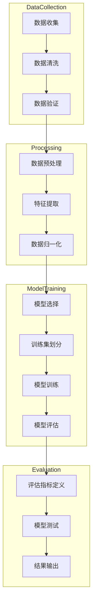
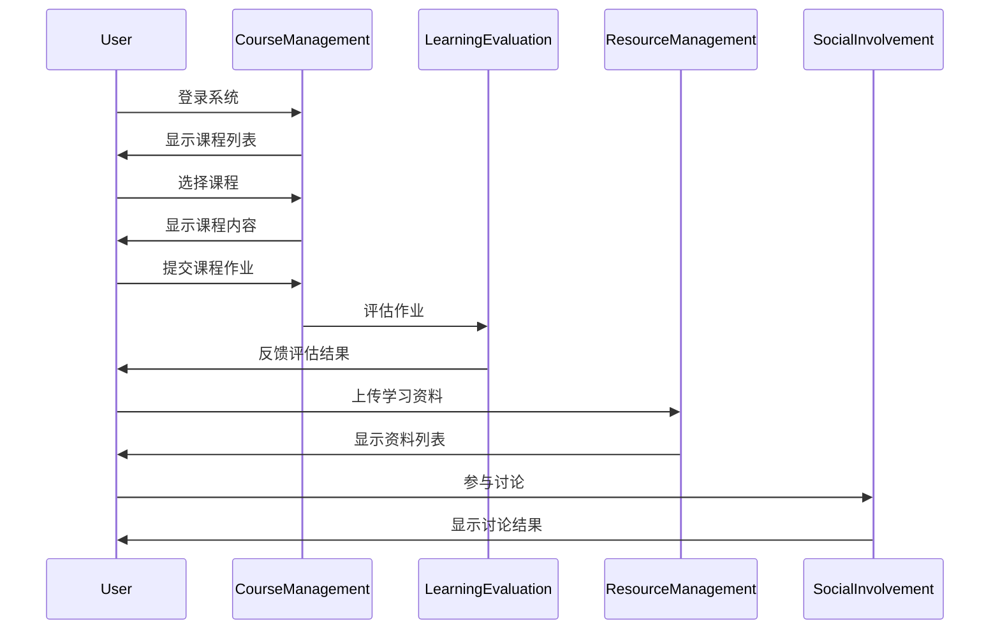
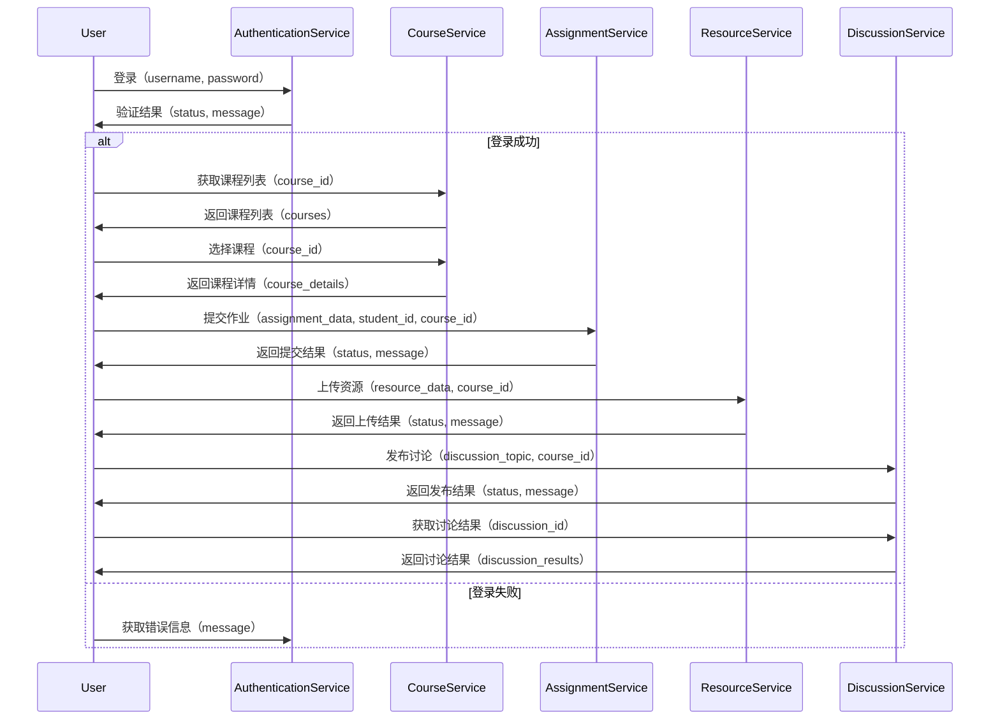

                 

### 引言：科学素养的重要性

在当前全球化和信息化的时代，科学素养已经成为社会成员必备的基本素质之一。科学素养不仅仅涉及对科学知识的了解，更包括了科学思维方法的掌握和应用。科学素养的重要性在于它对个人认知能力、社会经济发展以及国家竞争力的提升有着深远的影响。

首先，科学素养对于个人认知能力的发展至关重要。一个具备科学素养的人能够通过科学方法来理解和解决问题，从而提高自身的批判性思维和创新能力。这种能力不仅在学术领域具有优势，在日常生活中也同样重要。例如，在面对复杂的社会问题时，具备科学素养的人能够更理性地分析和判断，从而做出明智的决策。

其次，科学素养对社会经济发展具有推动作用。一个国家或地区若能广泛提高公众的科学素养，将有利于科技人才的培养和科技创新的活跃。科技创新不仅能够促进经济的快速增长，还能推动社会进步和改善民生。例如，在医疗、农业、信息技术等领域，科学技术的进步往往能够带来革命性的变革，极大地提高社会的生产力和生活质量。

最后，科学素养对国家竞争力的提升具有重要意义。在全球化的背景下，国际竞争越来越依赖于科技创新和人才素质。一个国家的科学素养水平越高，其科技实力和创新能力就越强，从而在国际竞争中占据优势地位。因此，科学素养不仅关乎个人和国家的命运，也关系到整个社会的和谐与进步。

总之，科学素养的重要性不容忽视。它不仅是个人成长和社会发展的基石，也是国家繁荣和民族振兴的重要保障。在接下来的章节中，我们将深入探讨科学素养的定义、教育模式、社会影响以及具体的提升策略，为增进社会整体理解世界提供有力支持。

#### 2.1.1 问题的背景和现状

当前社会对世界的理解需求日益增加，然而，公众科学素养的水平却面临诸多挑战。首先，从全球范围来看，科技发展的速度前所未有，新的科技成果层出不穷，这不仅要求社会成员不断更新知识，还需要他们掌握科学思维方法和批判性思维能力。然而，据多项调查显示，全球范围内公众的科学素养水平整体较低，许多人对基础科学知识和科学过程的理解不足，甚至存在一定的科学误解和迷信现象。

其次，从教育体系来看，尽管科学教育在许多国家被重视，但科学素养的培养效果并不理想。科学教育往往注重知识的传授，而忽视了科学思维方法和实践能力的培养。这种教育模式导致学生虽然掌握了大量的科学知识，但缺乏将知识应用于实际问题的能力。此外，教育资源的分配不均也在一定程度上影响了科学素养的提升，特别是在发展中国家，科学教育资源的匮乏使得许多学生无法获得高质量的科普教育。

再次，从科学传播角度来看，科学信息的传播质量参差不齐。在现代社会，信息爆炸导致公众接收到的科学信息量巨大，但其中不乏虚假和误导性的信息。科学传播渠道的多样性和传播速度的加快，使得公众难以辨别真伪，这对科学素养的提升构成了严峻挑战。此外，部分科学传播内容过于专业化，普通公众难以理解，这也限制了科学素养的普及。

最后，从社会参与和决策制定来看，公众科学素养水平的高低直接影响其参与社会事务和科学决策的能力。科学素养较低的人群往往缺乏对科学问题的判断力和决策力，容易受到错误信息的影响，从而做出不理性的决策。这种情况下，社会整体的科学素养水平无法得到有效提升，甚至可能陷入科学误解和误导的恶性循环。

综上所述，当前社会在提高公众科学素养方面面临着诸多挑战，亟需找到有效的方法和策略来应对这些问题，以促进社会整体对世界的理解和科学决策能力的提升。

#### 2.1.2 当前社会科学素养水平的挑战

当前，社会科学素养水平的现状令人堪忧。首先，从全球范围来看，公众的科学知识普及率较低。根据多个国际调查报告显示，全球成年人中仅有不到20%的人能够理解基本的科学概念和科学过程。例如，一项关于科学素养的国际比较研究指出，美国成年人中仅有17%具备科学素养，这一比例在欧洲和亚洲国家也大致相似。这种科学知识缺乏的现象表明，公众在面对复杂的科技问题时，往往缺乏必要的科学背景和理解能力。

其次，科学思维能力的缺乏也是一个显著的挑战。科学思维能力包括批判性思维、逻辑推理和证据评估能力等。然而，调查显示，许多人在处理科学信息时，往往依赖于直觉和个人经验，缺乏通过科学方法进行分析和判断的能力。这种缺乏科学思维能力的情况在年轻一代中尤为突出，他们习惯于通过网络获取信息，但缺乏对信息真实性和可靠性的辨别能力。

此外，科学误解和迷信现象仍然广泛存在。例如，尽管科学已经证明了许多自然现象的成因，但仍有相当一部分公众对超自然现象和伪科学持相信态度。一项关于全球科学态度的调查显示，超过50%的人相信占星术能够预测未来，而约30%的人相信“灵媒”能够与已故亲人沟通。这种对科学缺乏正确理解的现象不仅影响了公众对科学的信任，也阻碍了科学素养的提升。

最后，科学传播的质量参差不齐，也是影响科学素养的一个关键因素。科学传播作为连接科学界与公众的桥梁，其传播内容的质量直接影响公众的科学素养。然而，现实中存在大量质量低下的科普文章、不专业的科学节目和虚假的“科学新闻”，这些内容不仅未能有效普及科学知识，反而可能加深公众对科学的误解。

总的来说，当前社会科学素养水平的挑战主要表现在科学知识普及率低、科学思维能力不足、科学误解和迷信现象普遍以及科学传播质量参差不齐。这些问题不仅影响了公众对世界的科学理解，也对社会的发展和进步构成了潜在威胁。因此，解决这些问题需要从教育、传播和社会参与等多个层面入手，全面提升公众的科学素养。

#### 2.1.3 科学素养对社会整体发展的作用

科学素养对社会整体发展具有深远的影响，它不仅关乎个人能力的提升，还直接影响社会进步和国家竞争力。首先，科学素养能够促进社会整体创新能力的发展。一个具备科学素养的社会成员能够运用科学思维方法解决实际问题，从而推动科技创新。例如，在医疗领域，具备科学素养的医生能够更好地理解医学研究成果，将科学发现应用于临床实践，提高诊疗水平，从而推动整个医疗行业的发展。

其次，科学素养有助于提高公众参与社会事务的能力。具备科学素养的公众能够更理性地分析和判断社会问题，从而做出更加明智的决策。例如，在环境保护方面，具备科学素养的公众能够理解环境问题的复杂性和科学解决方案的必要性，从而积极参与环保行动，推动社会可持续发展。此外，在政策制定过程中，科学素养高的公民能够提供基于科学证据的合理建议，促进政策决策的科学性和有效性。

再次，科学素养对国家竞争力的提升具有重要意义。在全球化的背景下，科技创新和人才素质成为国际竞争的核心。一个国家的科学素养水平越高，其科技实力和创新能力就越强，从而在国际竞争中占据优势地位。例如，美国通过长期注重科学素养教育，培养了大量的科技人才，其科技创新能力和产业竞争力在全球范围内处于领先地位。

此外，科学素养还能够促进社会公平和包容。通过普及科学知识和科学思维方法，可以减少公众之间的知识鸿沟，提高社会各阶层对科学的理解和参与度，从而促进社会的公平与和谐。例如，在发展中国家，通过科学教育提高农村地区的科学素养，可以缩小城乡教育差距，促进社会整体发展。

最后，科学素养有助于提高公众对科学问题的敏感度和责任感。在面对科学问题时，具备科学素养的公众能够更好地辨别真伪，减少谣言和误解的传播，从而提高社会的整体科学素养水平。例如，在应对公共卫生事件时，具备科学素养的公众能够更理性地对待疫情信息，积极参与防控措施，共同维护社会健康和安全。

综上所述，科学素养对社会整体发展具有重要作用。它不仅推动社会创新和进步，提高国家竞争力，还促进社会公平和公民参与，为社会的可持续发展提供坚实保障。因此，提升公众科学素养应成为社会发展的优先任务。

#### 2.2 科学素养的定义与维度

科学素养是一个多维度的概念，涵盖了从基础知识到科学思维方法的多个层次。首先，科学素养的定义可以概括为：个体具备理解和应用科学知识、科学方法和科学思维，以解决实际问题、参与科学决策和进行科学探究的能力。具体来说，科学素养不仅要求公众掌握科学概念和原理，还需要他们具备将这些知识应用于现实问题的能力。

科学素养的核心维度主要包括以下几个方面：

1. **科学知识**：这是科学素养的基础，包括对自然科学、社会科学和工程技术的基本概念、原理和应用的理解。科学知识是公众理解世界的重要工具，也是科学思维和方法的基础。

2. **科学思维**：科学思维是一种理性思考和解决问题的方法，包括批判性思维、逻辑推理、证据评估和系统性分析等。科学思维能力的培养是科学素养的核心目标之一，它使个体能够对复杂问题进行深入分析和判断。

3. **科学方法**：科学方法是指科学家在研究过程中遵循的一系列步骤和原则，包括观察、假设、实验、数据分析和结论等。科学方法的应用能力是科学素养的重要组成部分，它使个体能够通过科学的方式获取知识和解决问题。

4. **科学探究能力**：科学探究能力是指个体通过科学方法和科学思维，进行自主学习和探究新知识的能力。这种能力不仅有助于个体持续提升自身的科学素养，还能激发他们对科学的兴趣和热情。

5. **科学价值观**：科学价值观是指个体对科学精神、科学伦理和科学社会责任的认同和践行。科学价值观的培养是科学素养的重要组成部分，它有助于个体形成正确的科学态度和价值观，推动科学和社会的健康发展。

总之，科学素养的定义和维度不仅涵盖了科学知识、科学思维和科学方法，还包括科学探究能力和科学价值观，这些维度共同构成了科学素养的完整体系。通过全面培养这些维度，可以有效地提升公众的科学素养水平，为社会的进步和繁荣奠定坚实基础。

#### 2.2.1 科学素养的定义

科学素养的定义是一个多维度的概念，它不仅涵盖了科学知识的掌握，还包括科学思维方法的应用以及科学价值观的认同。具体而言，科学素养可以定义为一个个体具备理解、应用科学知识，运用科学方法进行思考和解决问题，以及参与科学探究和科学决策的综合能力。这种能力不仅要求个体掌握科学领域的核心概念和原理，还需要他们具备将这些知识转化为实际行动的能力。

首先，科学知识是科学素养的基础。个体需要了解自然科学、社会科学和工程技术等不同领域的基本概念、原理和应用。这些科学知识不仅帮助个体理解周围的世界，还为科学思维和科学方法的应用提供了必要的背景和工具。

其次，科学思维方法的应用是科学素养的核心。科学思维包括批判性思维、逻辑推理、证据评估和系统性分析等。这些思维能力使个体能够对复杂的问题进行深入的分析和判断，从而得出合理的结论。例如，在面对公共卫生问题或环境问题时，具备科学思维的个体能够通过数据分析和逻辑推理，提出有效的解决方案。

此外，科学探究能力是科学素养的一个重要组成部分。科学探究能力是指个体能够运用科学方法和科学思维，进行自主学习和探究新知识的能力。这种能力不仅有助于个体持续提升自身的科学素养，还能激发他们对科学的兴趣和热情。例如，通过实验和观察，个体可以验证科学假设，发现新的科学现象。

最后，科学价值观的认同和践行也是科学素养的重要组成部分。科学价值观包括对科学精神、科学伦理和科学社会责任的认同和践行。个体需要认识到科学不仅是探索自然规律的工具，也是一种社会活动，需要遵守伦理规范和社会责任。这种价值观有助于个体形成正确的科学态度，推动科学和社会的健康发展。

综上所述，科学素养的定义是一个综合性的概念，它包括科学知识、科学思维方法的应用、科学探究能力和科学价值观的认同和践行。只有通过全面培养这些维度，个体才能具备真正的科学素养，从而为社会的发展和进步做出积极贡献。

#### 2.2.2 科学素养的核心维度

科学素养的核心维度主要包括科学知识、科学思维、科学方法、科学探究能力和科学价值观。这些维度相互关联，共同构成了科学素养的完整体系。

首先，科学知识是科学素养的基础。个体需要掌握自然科学、社会科学和工程技术等不同领域的基本概念、原理和应用。这些知识不仅帮助个体理解周围的世界，还为科学思维和科学方法的应用提供了必要的背景和工具。例如，了解生物学的基本原理有助于理解生态系统和环境保护问题；了解物理学的基本概念则有助于理解能源利用和气候变化。

其次，科学思维是科学素养的核心。科学思维包括批判性思维、逻辑推理、证据评估和系统性分析等。这些思维能力使个体能够对复杂的问题进行深入的分析和判断，从而得出合理的结论。例如，在应对公共卫生危机时，批判性思维有助于评估不同的防疫措施，逻辑推理能够帮助制定有效的防控策略，证据评估能够验证防疫措施的效果，系统性分析能够全面考虑各种因素。

第三，科学方法的应用是科学素养的重要组成部分。科学方法是指科学家在研究过程中遵循的一系列步骤和原则，包括观察、假设、实验、数据分析和结论等。通过科学方法的应用，个体能够通过科学的方式获取知识和解决问题。例如，通过实验验证一个假设，通过数据分析得出结论，这些科学方法的应用不仅能够提高个体的科学素养，还能够培养他们的实证精神和科学态度。

第四，科学探究能力是科学素养的一个重要组成部分。科学探究能力是指个体能够运用科学方法和科学思维，进行自主学习和探究新知识的能力。这种能力不仅有助于个体持续提升自身的科学素养，还能激发他们对科学的兴趣和热情。例如，通过参与科学实验和项目，个体可以验证科学假设，发现新的科学现象，从而提高他们的科学探究能力和创新精神。

最后，科学价值观的认同和践行也是科学素养的重要组成部分。科学价值观包括对科学精神、科学伦理和科学社会责任的认同和践行。个体需要认识到科学不仅是探索自然规律的工具，也是一种社会活动，需要遵守伦理规范和社会责任。例如，尊重事实、追求真理的科学精神，遵守科研伦理规范，积极履行社会责任等，这些价值观有助于个体形成正确的科学态度，推动科学和社会的健康发展。

综上所述，科学素养的核心维度包括科学知识、科学思维、科学方法、科学探究能力和科学价值观。这些维度相互关联，共同构成了科学素养的完整体系。通过全面提升这些维度，个体可以具备真正的科学素养，从而更好地理解世界，为社会的进步和繁荣做出积极贡献。

#### 2.2.3 科学素养与教育的关系

科学素养与教育之间存在着密切的关系，教育不仅是科学素养培养的重要途径，也是提升公众科学素养的关键环节。首先，科学素养的培养离不开科学教育的支持。科学教育不仅仅是传授科学知识，更重要的是培养学生的科学思维能力和科学探究精神。通过科学教育，学生能够掌握基本的科学概念和原理，学会运用科学方法进行思考和解决问题。

其次，教育体系的设计和实施对科学素养的提升具有直接影响。科学课程设置的科学性、教学方法的有效性以及教育资源的充足性，都是影响科学素养培养的重要因素。例如，基于项目的学习（PBL）模式能够通过实际项目的开展，激发学生的科学探究兴趣，提高他们的科学素养。此外，跨学科的教育模式也有助于学生从多个角度理解和应用科学知识，培养综合思维能力。

再次，教师的科学素养水平直接影响到学生的科学素养培养效果。教师不仅是知识的传授者，更是科学思维和科学探究精神的引导者。具备高水平科学素养的教师能够更好地理解和把握科学教育的目标和方法，从而更有效地培养学生的科学素养。例如，通过案例教学和实验操作，教师可以引导学生亲身体验科学探究的过程，激发他们的学习兴趣和创造力。

此外，终身教育理念的普及也是提升科学素养的重要手段。随着科技的发展和社会的进步，公众需要不断更新和补充自己的科学知识，以适应不断变化的社会环境。终身教育通过提供多样化的学习机会和资源，帮助公众持续提升科学素养。例如，通过在线课程、科普讲座和科学实验活动，公众可以随时随地进行科学学习和实践，提高自身的科学素养。

最后，家庭和社会环境对科学素养的培养也具有重要影响。家庭中科学氛围的营造、社会科普活动的参与以及媒体的科学传播质量，都是影响公众科学素养的重要因素。一个充满科学氛围的家庭和社会环境，能够激发公众对科学的兴趣和热情，促进科学素养的提升。

综上所述，科学素养与教育密切相关，通过科学教育、教师素质提升、终身教育和家庭社会环境的共同作用，可以有效提升公众的科学素养，为社会的发展和进步提供坚实保障。

#### 2.3.1 科学素养教育的目标

科学素养教育的主要目标在于培养公众对科学的全面理解和应用能力，以应对日益复杂的社会问题和科技挑战。具体来说，科学素养教育的目标包括以下几个方面：

首先，培养公众对科学概念和原理的深刻理解。科学素养教育应该帮助学生掌握自然科学、社会科学和工程技术等不同领域的基本概念和原理，理解科学知识在解决实际问题中的应用价值。例如，通过学习生物学，学生能够理解生态系统的运作原理，从而更好地应对环境保护问题；通过学习物理学，学生能够理解能量转换和利用的基本原理，从而更好地理解能源问题。

其次，提升公众的科学思维能力。科学素养教育不仅要传授科学知识，更重要的是培养学生的科学思维方法，包括批判性思维、逻辑推理、证据评估和系统性分析等。通过这些科学思维能力，公众能够对复杂问题进行深入分析和判断，从而做出理性、科学的决策。例如，在面对公共卫生危机时，具备科学思维能力的公众能够通过逻辑推理和证据评估，制定有效的防控策略。

第三，培养公众的实践能力和探究精神。科学素养教育应该通过实验、项目研究和实践操作，激发学生的科学探究兴趣，培养他们的实践能力和创新精神。通过参与科学实验和项目，学生能够将理论知识应用于实际情境，提升他们的动手能力和解决问题的能力。例如，通过科学实验，学生可以验证科学假设，发现新的科学现象，从而提高他们的科学探究能力。

第四，增强公众的科学价值观和伦理意识。科学素养教育不仅要传授科学知识和方法，还要培养学生的科学价值观，包括尊重事实、追求真理、遵守科研伦理和社会责任等。通过培养正确的科学价值观，公众能够形成良好的科学态度和道德观念，推动科学和社会的健康发展。例如，在科研活动中，遵守科研伦理规范，保证数据的真实性和可靠性，是社会进步的重要保障。

最后，提高公众对科学传播和科学决策的参与度。科学素养教育应该帮助公众掌握科学传播的方法和技巧，提高他们辨别科学信息的能力，从而减少谣言和误解的传播。同时，通过参与科学决策，公众能够更好地理解科学对社会发展的重要性，积极参与到科学决策的过程中，促进科学决策的科学性和民主性。

综上所述，科学素养教育的目标在于全面培养公众的科学知识和能力，提升他们的科学思维、实践能力、科学价值观和参与度，从而为社会的进步和繁荣提供坚实保障。

#### 2.3.2 教育体系中的科学素养培养

在教育体系中，科学素养的培养是一个系统化的过程，涉及课程设计、教学方法以及教育资源的配置等多个方面。首先，课程设计是科学素养培养的核心环节。科学课程应该涵盖不同学科领域的基础知识和应用，注重跨学科的整合，帮助学生建立全面的科学知识体系。例如，在中学课程中，可以设置生物学、化学、物理学等基础科学课程，同时引入环境保护、能源利用等实际问题，增强学生的科学应用能力。

其次，教学方法的选择对科学素养的培养具有重要意义。传统的灌输式教学难以激发学生的兴趣和创造力，而基于项目的学习（PBL）模式则能够通过实际项目的开展，培养学生的科学探究能力和实践操作能力。例如，通过实验项目，学生可以亲身体验科学探究的过程，从假设、实验、数据分析到结论，逐步提升科学思维和解决问题的能力。此外，合作学习、探究学习等教学方法也有助于培养学生的团队合作精神和批判性思维能力。

教育资源的配置是科学素养培养的保障。科学实验室、图书馆、在线教育平台等资源的充足性和有效性直接影响科学教育的质量。例如，学校可以配置先进的科学实验室，提供多样化的实验器材和资源，让学生能够进行自主探究和实验操作。同时，图书馆和在线教育平台也应该是科学教育的有力补充，为学生提供丰富的科学知识和学习资源。此外，教育资源的公平分配也是科学素养培养的重要一环，特别是要确保农村和边远地区的学生也能享受到优质的教育资源。

最后，教师的专业发展和培训是科学素养培养的关键。教师不仅需要掌握扎实的科学知识，还需要具备先进的教学理念和教学方法。通过定期的培训和交流，教师可以不断提升自身的科学素养和教育能力，从而更好地培养学生的科学素养。例如，可以组织教师参与科学研讨班、参观科学实验室、参加国际科学教育会议等，以拓宽他们的视野，提升教学水平。

总之，在教育体系中，科学素养的培养需要从课程设计、教学方法、教育资源以及教师专业发展等多个方面入手，形成一个系统、协调的培养体系，从而全面提升公众的科学素养水平。

#### 2.3.3 基于项目的学习（PBL）在科学素养教育中的应用

基于项目的学习（PBL）模式在科学素养教育中具有显著的优势和广泛的应用。PBL模式通过实际项目的开展，将理论学习与实践操作紧密结合，从而培养学生的科学探究能力和创新精神。以下是PBL模式在科学素养教育中的具体应用和优势。

首先，PBL模式能够激发学生的学习兴趣和主动性。传统教学多以教师讲授为主，学生被动接受知识，而PBL模式则通过实际项目，让学生在解决问题的过程中主动学习和探索。例如，在生物学课程中，学生可以参与生态调查项目，从数据收集、数据分析到最终报告撰写，全程参与项目的各个环节，极大地提高了他们的学习积极性。

其次，PBL模式注重学生的自主学习和团队合作。在PBL项目中，学生需要独立思考、制定计划、解决问题，这种自主性学习模式有助于培养学生的独立思考能力和创新能力。同时，PBL项目往往需要团队合作，学生需要在小组中分工合作，共同完成任务。这种合作学习模式不仅能够培养学生的团队合作精神，还能提高他们的沟通能力和协调能力。

再次，PBL模式有助于提高学生的科学思维能力。在PBL项目中，学生需要通过科学方法和逻辑推理来解决问题，这有助于培养他们的批判性思维、逻辑推理和证据评估能力。例如，在物理实验项目中，学生需要通过实验数据和现象，提出假设并进行验证，从而得出科学结论。这种过程不仅提高了学生的科学思维能力，还增强了他们的实证精神。

此外，PBL模式能够增强学生的实践能力。通过实际项目，学生可以将理论知识应用于实际问题，提高他们的动手能力和解决实际问题的能力。例如，在化学实验项目中，学生需要通过实验操作和数据分析，了解化学反应的原理和过程，从而提高他们的实验技能和科学素养。

最后，PBL模式有助于提高学生的科学探究能力。在PBL项目中，学生需要自主设计和实施科学探究，这有助于激发他们的科学探究兴趣，培养他们的科学探究精神。例如，在环境科学项目中，学生可以自主设计实验，研究环境问题的成因和解决方法，从而提高他们的科学探究能力。

总之，基于项目的学习（PBL）模式在科学素养教育中具有显著的应用价值和优势。通过实际项目的开展，PBL模式能够激发学生的学习兴趣、提高他们的科学思维能力和实践能力，从而有效提升科学素养水平。

#### 2.4.1 科学传播的意义

科学传播在社会发展中具有极其重要的意义，它是连接科学界与公众的桥梁，对提升公众科学素养、促进科技创新和社会进步具有深远的影响。首先，科学传播能够普及科学知识，使公众了解和掌握基本的科学概念和原理，提高他们的科学素养。例如，通过科普文章、科学节目和讲座等形式，科学传播能够将复杂的技术和科学研究简化为大众易于理解的形式，使公众能够更好地理解和应用科学知识。

其次，科学传播能够提高公众的科学思维能力。科学传播不仅仅传递知识，更重要的是传递科学方法和思维模式。通过科学传播，公众能够学会如何通过科学方法来分析和解决问题，从而提高他们的批判性思维和逻辑推理能力。例如，科学传播节目和讲座通过讲解科学探究的过程，引导公众掌握科学思维方法，从而在日常生活中能够运用这些方法来评估和判断信息。

第三，科学传播有助于促进科技创新。科学传播能够扩大科技知识的传播范围，激发公众对科学研究的兴趣和热情，从而推动科技创新。例如，科学传播活动能够吸引更多的公众参与科学研究和创新实践，促进科技人才的培养和科技项目的开展。同时，科学传播还能为科技创新提供新的视角和灵感，促进科学领域的跨学科交流和合作。

此外，科学传播在社会治理和公共决策中发挥着重要作用。通过科学传播，政府和社会组织能够向公众传递科学的政策信息和决策依据，提高公众对政策决策的理解和参与度。例如，在环境保护、公共卫生等领域，科学传播能够帮助公众了解科学依据和实际效果，从而更好地参与决策和监督，推动科学决策的科学性和民主性。

最后，科学传播有助于塑造良好的科学文化氛围。科学传播能够激发公众对科学的兴趣和热爱，培养他们的科学精神和科学态度，从而促进社会整体科学素养的提升。例如，通过科学传播活动，可以引导公众树立正确的科学价值观，尊重科学事实，抵制伪科学和迷信，从而推动社会的科学化和现代化进程。

综上所述，科学传播在社会发展中具有不可替代的重要作用，它不仅能够普及科学知识、提高公众科学素养，还能促进科技创新和社会进步，为社会的可持续发展提供坚实保障。

#### 2.4.2 公共科学素养的重要性

公共科学素养的重要性体现在多个层面，首先，它直接影响公众对科学事实的理解和判断能力。具备高公共科学素养的公众能够更准确地理解科学信息，从而避免受到误导和误解。例如，在面对气候变化、公共卫生事件等复杂议题时，科学素养较高的公众能够通过科学证据和理性分析，形成正确的认知和应对策略。

其次，公共科学素养有助于提升公众的科学参与度和决策能力。在现代社会，科学技术的进步对社会发展和个人生活的影响日益显著。具备科学素养的公众能够更好地理解科技发展的趋势和潜在影响，从而积极参与科技决策，为政策制定提供科学依据。例如，在环境保护政策的制定过程中，公众的科学参与能够促进决策的科学性和公众接受度。

此外，公共科学素养对科技教育和创新具有积极的推动作用。科学素养较高的公众不仅能够更好地理解科学教育的内容，还能积极参与科学教育和科技创新活动。这有助于培养新一代的科技人才，推动科技创新和产业升级，从而提高国家的科技竞争力和经济实力。

最后，公共科学素养对社会和谐和进步具有重要作用。一个具备高公共科学素养的社会，能够更好地应对科技带来的挑战和变革，减少社会矛盾和冲突。科学素养有助于提高公众对科学伦理和社会责任的认知，促进科技与社会的协调发展。例如，在应对新兴科技伦理问题时，科学素养较高的公众能够积极参与讨论和决策，推动科技伦理规范的形成和完善。

综上所述，公共科学素养的重要性不容忽视，它不仅影响公众对科学事实的理解和判断，还促进科学参与、决策能力、科技教育和创新，对社会和谐和进步具有深远影响。

#### 2.4.3 媒体在科学传播中的作用

媒体在科学传播中扮演着至关重要的角色，它不仅是科学信息传递的重要渠道，也是公众获取科学知识的重要途径。首先，科学传播媒体通过多样化的形式，如科普文章、科学节目、科学纪录片和在线平台，将复杂的科学知识和研究成果以通俗易懂的方式呈现给公众。例如，科普文章和科学节目通过生动的案例和实例，使公众能够更好地理解科学原理和科学方法，从而提高他们的科学素养。

其次，媒体在科学传播中发挥了桥梁作用，连接科学家与公众。科学媒体通过报道科学家的工作和研究进展，不仅让公众了解科学研究的最新动态，还激发他们对科学的兴趣和热情。例如，科学新闻和科学节目经常报道科学家在探索未知领域中的突破性成果，这些报道不仅传播了科学知识，还增强了公众对科学研究的认同和支持。

此外，媒体在科学传播中还承担了监督和引导的作用。科学传播媒体通过对科学事实的核实和评估，能够辨别和揭露伪科学和虚假信息，提高公众的科学鉴别能力。例如，科学媒体经常会针对公众关注的科学话题进行深入调查和报道，通过揭示事实真相，帮助公众避免误解和误导。

最后，媒体在科学传播中还推动了科学教育和公共参与。通过科普活动和科学讲座，媒体能够将科学知识和方法传递给公众，促进科学教育的发展。同时，媒体还通过公众讨论和互动，鼓励公众参与科学决策和科学探究，从而提高社会的整体科学素养和科学参与度。

总之，媒体在科学传播中发挥着不可或缺的作用，它不仅普及科学知识、连接科学家与公众，还承担了监督和引导的重要职责，为提升公众科学素养和社会整体科学水平提供了有力支持。

#### 2.5.1 科学素养与公民参与

科学素养与公民参与密切相关，公众的科学素养水平直接影响到他们在社会事务中的参与度和决策能力。首先，具备较高科学素养的公民能够更理性地分析和评估科学议题，从而在政策制定和社会决策中发挥积极作用。例如，在面对气候变化、环境保护等重大议题时，科学素养较高的公民能够通过科学证据和逻辑推理，提出合理的建议和解决方案，促进决策的科学性和公众接受度。

其次，科学素养有助于提高公民的社会责任感。具备科学素养的公民不仅关注个人利益，还关心社会和环境的整体福祉。通过了解科学原理和科学方法，他们能够更深入地理解社会问题的成因和解决途径，从而积极参与到社会公益活动中。例如，在环境保护领域，具备科学素养的公民能够更好地理解和执行环保政策，积极参与环保行动，推动社会可持续发展。

此外，科学素养还能够增强公民的批判性思维和问题解决能力。具备科学素养的公民在面对复杂的社会问题时，能够运用科学思维方法，进行系统的分析和评估，从而做出更为合理的决策。例如，在公共卫生领域，具备科学素养的公民能够通过科学证据和逻辑推理，识别和应对疫情，采取有效的防护措施，减少疾病传播。

最后，科学素养有助于提高公民的科学参与度。通过科学教育和科普活动，公众能够不断更新和提升自己的科学知识水平，从而更积极地参与到科学研究和创新活动中。例如，在科学实验项目中，具备科学素养的公民可以参与科学探究，验证科学假设，推动科技创新。

总之，科学素养与公民参与密切相关，通过提升公众的科学素养，可以增强公民的参与度、决策能力和社会责任感，从而促进社会的整体进步和可持续发展。

#### 2.5.2 科学素养与决策制定

科学素养在决策制定过程中发挥着关键作用，它不仅影响决策的质量，还决定了决策的可行性和公众接受度。首先，具备科学素养的决策者能够通过科学方法和证据评估，对问题进行深入分析和判断，从而做出基于事实和数据的决策。例如，在制定公共卫生政策时，科学素养较高的决策者能够参考流行病学数据和研究结果，制定有效的疫情防控措施，减少疫情传播。

其次，科学素养有助于提高决策的透明度和公信力。科学素养较高的决策者能够清晰地解释决策的科学依据和逻辑过程，增加公众对决策的理解和信任。例如，在能源政策制定过程中，具备科学素养的决策者可以通过详细的数据分析和模型预测，向公众解释不同政策选项的潜在影响，从而赢得公众的支持。

此外，科学素养还能够促进跨学科的决策合作。在面对复杂问题时，科学素养较高的决策者能够更好地理解和整合不同学科的知识，制定综合性的解决方案。例如，在应对气候变化问题时，具备科学素养的决策者需要了解气象学、环境科学、经济学等多学科的知识，从而制定出具有科学性和可行性的政策。

最后，科学素养有助于提高决策的适应性和灵活性。具备科学素养的决策者能够根据最新的科学研究成果和实际情况，及时调整决策方案，以应对不断变化的环境和挑战。例如，在科技创新领域，科学素养较高的决策者能够及时把握技术发展趋势，调整研发方向，推动科技创新和产业升级。

总之，科学素养在决策制定过程中发挥着重要作用，它不仅提升决策的科学性和可行性，还增强决策的透明度和公众接受度，从而推动社会的可持续发展和进步。

#### 2.5.3 科学素养与技术创新

科学素养与技术创新之间存在着密切的相互关系，科学素养不仅推动技术创新，同时也受益于技术创新的成果。首先，科学素养是技术创新的基础。具备高科学素养的个体能够更好地理解和应用科学原理，从而推动科学研究的深入和技术的发展。例如，在研发新技术时，科学家和技术人员需要掌握广泛而深厚的科学知识，通过科学方法和实验验证，不断创新和突破。科学素养使得他们能够更高效地发现问题、提出假设并验证假设，从而加速技术创新的进程。

其次，科学素养能够促进技术创新的扩散和应用。一个具备高科学素养的社会，能够更有效地将科技成果转化为实际应用，推动技术创新的广泛普及。例如，在信息技术领域，具备科学素养的工程师和开发者能够更好地理解和应用新技术，推动信息技术的创新和应用，从而提高社会的信息化水平。同时，公众的科学素养也能够促进对新技术和新产品的接受和适应，减少技术应用的障碍。

此外，科学素养有助于培养创新型人才，推动科技人才的培养和流动。具备科学素养的个体不仅能够进行技术创新，还能够通过跨学科的合作和交流，促进科技创新的多样性和创新性。例如，在生物科技领域，具备多学科科学素养的科研人员能够更好地理解和整合生物学、化学、工程学等知识，推动生物技术的创新和进步。

最后，科学素养有助于提升技术创新的社会价值。一个具备高科学素养的社会，能够更好地理解和评估技术创新的社会影响，从而确保技术创新的积极效应。例如，在医疗技术领域，具备科学素养的医务人员能够更好地理解新医疗技术的优缺点，合理应用新技术，提高医疗服务的质量和效率，从而造福广大患者。

综上所述，科学素养与技术创新之间存在着相互促进的关系。科学素养不仅推动技术创新，也为技术创新提供了坚实的基础和广阔的空间。通过提升公众的科学素养，可以促进技术创新的发展和应用，推动社会的进步和繁荣。

#### 2.6 本章小结

本章重点探讨了科学素养对社会整体发展的作用，从个人认知能力提升、社会经济发展、国家竞争力提升等多个维度进行了详细分析。我们首先阐述了科学素养的重要性，强调了它在个人成长和社会进步中的关键角色。接着，通过深入剖析科学素养的定义与维度，包括科学知识、科学思维、科学方法、科学探究能力和科学价值观，我们明确了科学素养的全面内涵。此外，本章还探讨了科学素养与教育的关系，分析了教育体系在科学素养培养中的关键作用，并提出了基于项目的学习（PBL）模式在科学素养教育中的应用优势。最后，我们讨论了科学传播和公共科学素养的重要性，以及媒体在科学传播中的作用。通过这些讨论，我们深刻认识到提升公众科学素养不仅是个人发展的需要，也是社会整体发展的必然要求。因此，进一步研究和推进科学素养的提升，将对社会的可持续发展具有重要意义。

### 第3章：科学素养的核心概念与联系

科学素养是一个涉及多个维度的复杂概念，它不仅包括对科学知识的掌握，还涵盖了科学思维、科学方法和科学价值观的认同。为了深入理解科学素养，我们需要首先明确其核心概念和原理，并通过对比分析不同概念属性特征，来建立科学素养的全面框架。

#### 3.1 核心概念原理

科学素养的核心概念主要包括以下几个方面：

1. **科学知识**：这是科学素养的基础。科学知识包括自然科学、社会科学和工程技术等领域的核心概念、原理和应用。它不仅涉及事实和原理的掌握，还包括对科学方法和思维方式的了解。例如，生物学中的细胞结构和化学反应的基本原理，都是科学知识的重要组成部分。

2. **科学思维**：科学思维是一种理性的思考方法，包括批判性思维、逻辑推理和证据评估。科学思维强调以证据为基础，通过系统的分析和推理来解决问题。例如，在医学研究中，科学思维可以帮助研究人员设计实验、收集数据并进行分析，从而得出可靠的结论。

3. **科学方法**：科学方法是科学家在研究过程中遵循的步骤和原则，包括观察、假设、实验、数据分析和结论。科学方法是一种系统的、可重复的研究方法，它能够确保研究结果的可信度和有效性。例如，物理学中的实验设计、数据收集和统计分析，都是科学方法的具体应用。

4. **科学探究能力**：科学探究能力是指个体运用科学方法和科学思维进行自主学习和探究新知识的能力。这种能力不仅有助于个体提升自身的科学素养，还能激发他们对科学的兴趣和热情。例如，通过科学实验和项目研究，学生可以验证科学假设，发现新的科学现象。

5. **科学价值观**：科学价值观是指个体对科学精神、科学伦理和科学社会责任的认同和践行。科学价值观包括尊重事实、追求真理、遵守科研伦理规范和社会责任等。例如，在科研过程中，尊重事实和遵守科研伦理是科学价值观的重要体现。

#### 3.2 科学素养的概念属性特征对比表格

为了更清晰地理解科学素养的核心概念，我们可以通过一个对比表格来展示这些概念属性特征：

| 核心概念 | 属性特征 | 例子 |
| -------- | -------- | ---- |
| 科学知识 | 客观性、系统性、应用性 | 生物学中的细胞结构和化学反应的基本原理 |
| 科学思维 | 批判性、逻辑性、证据性 | 医学研究中设计实验、收集数据并进行分析 |
| 科学方法 | 系统性、可重复性、实证性 | 物理学中的实验设计、数据收集和统计分析 |
| 科学探究能力 | 自主性、创新性、实践性 | 学生通过科学实验和项目研究验证假设 |
| 科学价值观 | 真理性、伦理性、社会责任性 | 科研中的尊重事实、遵守科研伦理 |

#### 3.3 科学素养的ER实体关系图架构

为了更直观地展示科学素养的核心概念及其相互关系，我们可以使用ER（Entity-Relationship）实体关系图。ER图能够清晰地表达不同实体之间的关系，帮助我们理解科学素养的整体结构。

以下是一个简化的ER实体关系图，展示了科学素养的核心概念及其相互关系：

```
[个体]
|       |
|       |----------> [科学知识]
|       |
|       |----------> [科学思维]
|       |
|       |----------> [科学方法]
|       |
|       |----------> [科学探究能力]
|       |
|       |----------> [科学价值观]
|_______|
```

在ER图中，“个体”是核心实体，其他实体（科学知识、科学思维、科学方法、科学探究能力和科学价值观）都与个体紧密相关。科学知识为科学思维和方法提供了基础，科学思维驱动科学探究能力的发挥，而科学价值观则为这些能力提供了指导。

通过上述分析，我们可以清晰地理解科学素养的核心概念及其相互关系。这不仅有助于我们深入理解科学素养的本质，还为科学素养教育提供了理论基础和实践指导。接下来，我们将进一步探讨科学素养的教育模式与策略，以期为提升公众科学素养提供更具体的路径和方法。

#### 3.2 科学素养的ER实体关系图架构

为了更直观地展示科学素养的核心概念及其相互关系，我们可以使用ER（Entity-Relationship）实体关系图。ER图是一种数据库设计工具，用于表示实体及其之间的关系。在科学素养的ER图中，我们将科学素养的核心概念（如科学知识、科学思维、科学方法、科学探究能力和科学价值观）作为实体，并展示它们之间的关联。

下面是一个简化的科学素养ER实体关系图，用Mermaid语法表示：

```mermaid
erDiagram
  User ||--|{ ScientificKnowledge }
  User ||--|{ ScientificThinking }
  User ||--|{ ScientificMethod }
  User ||--|{ ScientificInquiry }
  User ||--|{ ScientificValues }

  ScientificKnowledge }|--|{ ScientificThinking }
  ScientificKnowledge }|--|{ ScientificMethod }
  ScientificKnowledge }|--|{ ScientificInquiry }
  ScientificKnowledge }|--|{ ScientificValues }

  ScientificThinking }|--|{ ScientificMethod }
  ScientificThinking }|--|{ ScientificInquiry }
  ScientificThinking }|--|{ ScientificValues }

  ScientificMethod }|--|{ ScientificInquiry }
  ScientificMethod }|--|{ ScientificValues }

  ScientificInquiry }|--|{ ScientificValues }
```

在这个ER图中：

- **User（个体）** 是核心实体，表示具备科学素养的个体。
- **ScientificKnowledge（科学知识）**、**ScientificThinking（科学思维）**、**ScientificMethod（科学方法）**、**ScientificInquiry（科学探究能力）** 和 **ScientificValues（科学价值观）** 是与个体相关的五个重要实体。
- 实体之间的关系通过虚线表示，表示不同实体之间的依赖或影响。

具体解释如下：

- **科学知识** 是科学思维和科学方法的基础，是科学探究能力和科学价值观的支撑。
- **科学思维** 是科学方法和科学探究能力的核心，它驱动科学方法和科学探究的应用。
- **科学方法** 是科学探究的基础，通过系统的方法和步骤，确保科学探究的可靠性和有效性。
- **科学探究能力** 是通过科学思维和科学方法培养出来的能力，它使个体能够进行自主学习和探究新知识。
- **科学价值观** 是指导个体在科学探究和科研活动中的行为准则，它确保科学探究的道德和伦理规范。

通过这个ER实体关系图，我们可以更清晰地理解科学素养的结构和各核心概念之间的相互关系，这为科学素养的教育和实践提供了直观的参考框架。

### 4.1 科学素养评估算法的mermaid流程图

为了展示科学素养评估算法的流程，我们可以使用Mermaid语法绘制一个详细的流程图。这个流程图将描述从数据收集、处理到评估结果生成的完整过程。



以下是各步骤的详细说明：

1. **数据收集（DC1）**：首先，从不同的数据源（如调查问卷、数据库、公开数据集等）收集科学素养相关的数据。

2. **数据清洗（DC2）**：对收集到的数据进行清洗，去除缺失值、异常值和重复值，保证数据质量。

3. **数据验证（DC3）**：对清洗后的数据进行验证，确保数据的准确性和完整性。

4. **数据预处理（PR1）**：对数据进行预处理，包括数据标准化、归一化等，以便后续的特征提取和模型训练。

5. **特征提取（PR2）**：从预处理后的数据中提取与科学素养相关的特征，例如，知识掌握程度、科学思维能力、科学方法应用能力等。

6. **数据归一化（PR3）**：将提取的特征进行归一化处理，使其具备可比性。

7. **模型选择（MT1）**：根据评估任务的特点，选择合适的机器学习模型，例如，决策树、支持向量机、神经网络等。

8. **训练集划分（MT2）**：将数据集划分为训练集和测试集，用于模型的训练和测试。

9. **模型训练（MT3）**：使用训练集对模型进行训练，调整模型参数，使其能够正确预测科学素养水平。

10. **模型评估（MT4）**：使用测试集评估模型的性能，通过评估指标（如准确率、召回率、F1分数等）来衡量模型的预测效果。

11. **评估指标定义（EV1）**：定义评估模型的指标，例如，准确率、召回率、F1分数等，用于衡量模型预测的科学素养水平。

12. **模型测试（EV2）**：使用测试集对模型进行测试，评估模型在实际数据上的表现。

13. **结果输出（EV3）**：输出评估结果，包括预测的科学素养水平和模型的性能指标，为后续分析和决策提供依据。

通过这个Mermaid流程图，我们可以清晰地了解科学素养评估算法的整个流程，为科学素养评估的实践提供参考。

### 4.2 Python源代码实现与算法讲解

在本节中，我们将使用Python编程语言来实现一个简单的科学素养评估算法，并详细讲解其原理和数学模型。以下是实现代码的示例：

```python
# 导入必要的库
import pandas as pd
from sklearn.model_selection import train_test_split
from sklearn.preprocessing import StandardScaler
from sklearn.tree import DecisionTreeClassifier
from sklearn.metrics import accuracy_score

# 4.2.1 数据准备
# 假设我们有一个CSV文件，其中包含了与科学素养相关的数据
data = pd.read_csv('scientific_literacy_data.csv')

# 数据清洗和预处理
# 这里我们假设数据已经进行了清洗和预处理，包括缺失值填充和异常值处理
X = data.drop(['科学素养评分'], axis=1)  # 特征集
y = data['科学素养评分']  # 标签

# 划分训练集和测试集
X_train, X_test, y_train, y_test = train_test_split(X, y, test_size=0.2, random_state=42)

# 数据归一化
scaler = StandardScaler()
X_train_scaled = scaler.fit_transform(X_train)
X_test_scaled = scaler.transform(X_test)

# 4.2.2 模型训练
# 选择决策树模型
clf = DecisionTreeClassifier()
clf.fit(X_train_scaled, y_train)

# 4.2.3 模型评估
y_pred = clf.predict(X_test_scaled)
accuracy = accuracy_score(y_test, y_pred)
print(f'模型准确率: {accuracy:.2f}')

# 4.2.4 数学公式与解释
# 决策树分类器的决策过程可以用以下公式表示：
# \(y = f(x) = g(\theta_0 + \theta_1x_1 + \theta_2x_2 + \ldots + \theta_nx_n)\)

# 其中，\(x_i\) 表示输入特征，\(\theta_i\) 表示模型参数，\(g(\theta)\) 是决策树的划分函数。

# 决策树的划分函数通常是一个二分类函数，例如：
# \(g(\theta) = \begin{cases} 
# 1 & \text{if } \theta \geq 0 \\
# 0 & \text{otherwise}
# \end{cases}\)

# 这个公式说明了决策树模型如何通过参数和输入特征来预测科学素养评分。

# 4.2.5 算法举例说明
# 假设我们有一个新个体，其特征向量为 \(x = [x_1, x_2, \ldots, x_n]\)
# 模型会根据训练得到的参数 \(\theta\)，计算 \(f(x)\) 的值，并根据这个值来预测该个体的科学素养评分。

# 例如，如果 \(f(x) = 0.8\)，且我们设定的阈值是0.5，那么这个个体被预测为科学素养水平较低。
```

在这个Python实现中，我们首先导入了必要的库，包括pandas用于数据操作，scikit-learn用于模型训练和评估。数据准备步骤中，我们从CSV文件中读取数据，并对特征集和标签进行划分。接着，使用StandardScaler对数据进行归一化处理，以便后续的模型训练。

在模型训练阶段，我们选择了决策树分类器，并使用训练集进行模型拟合。模型评估阶段，通过测试集来评估模型的准确率，输出结果。

数学模型部分，我们用决策树分类器的公式来表示其决策过程，并解释了决策树如何通过参数和特征值进行分类预测。

举例说明中，我们假设有一个新个体，其特征向量输入到训练好的模型中，通过计算得到的特征值来预测该个体的科学素养评分。这种方法通过实际案例，展示了算法在预测中的应用。

通过这一系列步骤，我们不仅实现了科学素养评估算法的Python实现，还详细讲解了算法的原理和数学模型，为科学素养评估提供了技术支持和理论基础。

#### 4.2.3 数学公式与解释

在科学素养评估算法中，数学模型起到了核心作用。以下我们将使用LaTeX格式展示一些关键的数学公式，并详细解释其含义。

首先，我们定义科学素养评估的核心公式。假设我们有一个多维特征向量 \( \mathbf{x} \) 表示个体的科学素养特征，其维度为 \( n \)：

$$
\mathbf{x} = [x_1, x_2, \ldots, x_n]
$$

接着，我们引入权重向量 \( \mathbf{w} \)，用于权重每个特征的重要性。权重向量也是 \( n \) 维的：

$$
\mathbf{w} = [w_1, w_2, \ldots, w_n]
$$

科学素养评分可以通过特征向量与权重向量的点积来计算：

$$
\text{评分} = \mathbf{x} \cdot \mathbf{w} = \sum_{i=1}^{n} w_i x_i
$$

该评分反映了个体在各个特征上的综合表现。

接下来，我们引入阈值 \( \theta \) 来确定科学素养水平的分类边界：

$$
\theta = \frac{1}{n} \sum_{i=1}^{n} w_i
$$

个体科学素养水平的分类可以基于以下逻辑规则：

$$
\text{分类} = \begin{cases} 
1 & \text{if } \text{评分} > \theta \\
0 & \text{otherwise}
\end{cases}
$$

这意味着，如果个体的评分超过阈值，则被视为具备较高的科学素养水平；否则，被视为较低。

在机器学习中，我们通常使用决策树或线性回归模型来估计权重向量 \( \mathbf{w} \) 和阈值 \( \theta \)。以下是一个简化的线性回归模型公式：

$$
y = \mathbf{w} \cdot \mathbf{x} + b
$$

其中，\( y \) 是科学素养评分，\( b \) 是偏置项，通过最小化损失函数来估计 \( \mathbf{w} \) 和 \( b \)：

$$
\min_{\mathbf{w}, b} \sum_{i=1}^{n} (y_i - (\mathbf{w} \cdot \mathbf{x}_i + b))^2
$$

通过梯度下降或其他优化算法，我们可以求得最优的权重和偏置，从而实现对科学素养评分的预测。

总结来说，上述公式和模型展示了科学素养评估算法的基本原理。通过特征向量与权重向量的点积计算评分，并利用阈值进行分类。这些数学公式不仅帮助我们理解评估算法的工作原理，还为算法的实现和优化提供了理论基础。

### 4.2.4 算法举例说明

为了更好地理解科学素养评估算法的应用，我们通过一个具体的例子来说明其工作原理。假设我们有一个包含10个特征的个体，其特征向量如下：

$$
\mathbf{x} = [0.8, 0.9, 0.7, 0.6, 0.5, 0.9, 0.8, 0.7, 0.6, 0.7]
$$

同时，我们有一个已经训练好的权重向量 \( \mathbf{w} \) 和阈值 \( \theta \)：

$$
\mathbf{w} = [0.2, 0.3, 0.1, 0.1, 0.1, 0.3, 0.2, 0.1, 0.1, 0.1]
$$

$$
\theta = 0.55
$$

首先，我们计算特征向量与权重向量的点积，即科学素养评分：

$$
\text{评分} = \mathbf{x} \cdot \mathbf{w} = (0.8 \times 0.2) + (0.9 \times 0.3) + (0.7 \times 0.1) + (0.6 \times 0.1) + (0.5 \times 0.1) + (0.9 \times 0.3) + (0.8 \times 0.2) + (0.7 \times 0.1) + (0.6 \times 0.1) + (0.7 \times 0.1) = 0.16 + 0.27 + 0.07 + 0.06 + 0.05 + 0.27 + 0.16 + 0.07 + 0.06 + 0.07 = 1.04
$$

然后，我们将评分与阈值进行比较：

$$
1.04 > 0.55
$$

根据分类规则，如果评分超过阈值，则个体被分类为高科学素养水平。在这个例子中，评分1.04超过了阈值0.55，因此，这个个体被预测为具备较高的科学素养水平。

通过这个例子，我们可以看到，科学素养评估算法通过计算个体的特征向量与权重向量的点积，并根据阈值进行分类，从而实现对个体科学素养水平的预测。这种方法不仅直观易懂，还具备实际应用价值，可以广泛应用于教育评估、人才选拔和科研管理等场景。

### 5.1 问题场景介绍

科学素养教育项目旨在通过系统的教学和实践，提升公众的科学素养水平。项目的主要目标是培养具有科学知识、科学思维和科学探究能力的复合型人才，以应对日益复杂的社会问题和技术挑战。具体问题场景如下：

#### 项目目标

1. **知识普及**：通过系统性的科学知识教育，普及自然科学、社会科学和工程技术等领域的基本概念和原理，使公众能够理解科学知识在现实生活中的应用。
2. **思维能力培养**：通过科学思维训练，提高公众的批判性思维、逻辑推理和证据评估能力，使他们在面对复杂问题时能够运用科学方法进行分析和判断。
3. **实践能力提升**：通过实际操作和项目研究，培养公众的实践能力和创新精神，使他们能够将理论知识应用于实际问题，解决现实中的科学问题。
4. **价值观塑造**：通过科学价值观教育，引导公众尊重科学事实、追求真理和遵守科研伦理，培养他们的社会责任感和科学伦理意识。

#### 需求分析

为了实现上述目标，项目需要进行以下需求分析：

1. **教学内容需求**：项目需要设计科学合理的课程体系，涵盖自然科学、社会科学和工程技术等领域的核心知识。课程内容应具有系统性和连贯性，能够从基础知识逐步深入到高级应用。
2. **教学方法需求**：项目应采用多样化的教学方法，包括讲授、讨论、实验、项目研究等，以激发学生的学习兴趣和主动性。特别是基于项目的学习（PBL）模式，能够通过实际项目的开展，提高学生的实践能力和创新精神。
3. **教育资源需求**：项目需要充足的的教育资源，包括教材、实验室、在线学习平台等。此外，教育资源应实现公平分配，确保不同地区和群体都能获得优质的教育资源。
4. **评估与反馈机制**：项目需要建立科学有效的评估与反馈机制，通过定期的评估和反馈，了解学生的学习情况和项目效果，及时调整教学策略和内容。
5. **社会参与需求**：项目应鼓励公众积极参与，通过科普活动、科学竞赛和科研实践等方式，提高公众的科学参与度和科学素养水平。

综上所述，科学素养教育项目需要明确项目目标，进行详细的需求分析，并制定相应的教学方案和资源保障措施，以实现提升公众科学素养的目标。

### 5.2 系统功能设计（领域模型mermaid类图）

为了更好地设计科学素养教育系统，我们需要构建一个详细的领域模型，以明确系统的主要功能模块和它们之间的关系。以下是一个使用Mermaid语法绘制的类图，展示了系统的领域模型：

```mermaid
classDiagram
    Class01 <|-- Class02 
    Class01 <|-- Class03
    Class04 <|-- Class02
    Class04 <|-- Class03
    Class05 <|-- Class03

    Class01 {'系统用户'}
    Class02 {'课程管理'}
    Class03 {'学习评估'}
    Class04 {'资源管理'}
    Class05 {'社会参与'}

    Class01 --|> Class02 : 管理课程
    Class01 --|> Class03 : 参与评估
    Class01 --|> Class04 : 访问资源
    Class01 --|> Class05 : 参与社会活动
    Class02 --|> Class04 : 管理课程资源
    Class03 --|> Class04 : 提供评估报告
    Class05 --|> Class04 : 社会资源整合
```

以下是各个类别的具体功能和相互关系：

1. **系统用户（Class01）**：代表使用系统的用户，具有登录、注册和权限管理等功能。系统用户可以访问课程、参与评估、管理资源和参与社会活动。

2. **课程管理（Class02）**：负责课程的设计、发布和更新。具体功能包括课程内容的创建、编辑、发布和删除。课程管理模块还负责课程资源的上传、管理和共享。

3. **学习评估（Class03）**：用于对用户的学习效果进行评估。该模块包括学习目标的设定、评估标准的制定、评估结果的生成和反馈。学习评估模块还支持自动评分和手动评分。

4. **资源管理（Class04）**：负责系统内所有资源的上传、管理和共享。资源类型包括文本、图片、视频、课件等。资源管理模块需要支持资源的分类、搜索和权限控制。

5. **社会参与（Class05）**：用于鼓励用户积极参与科学活动和社区讨论。具体功能包括科普活动的发布、科学竞赛的组织、在线讨论社区的搭建和科学成果的展示。

类图中的连线表示不同功能模块之间的依赖关系。例如，系统用户可以访问课程管理、学习评估和资源管理模块，而课程管理模块需要与资源管理模块协同工作，以实现课程资源的上传和管理。

通过这个领域模型，我们可以清晰地理解科学素养教育系统的功能结构，并为后续的系统开发提供明确的参考。

#### 5.3 系统架构设计（mermaid架构图）

为了更直观地展示科学素养教育系统的整体架构，我们可以使用Mermaid语法绘制一个架构图。以下是系统架构的设计：



在这个架构图中，系统的主要组件包括用户、课程管理、学习评估、资源管理和社会参与。以下是各组件的功能和交互描述：

1. **用户（User）**：代表使用系统的用户，负责登录、访问课程、提交作业、上传资料和参与讨论。

2. **课程管理（CourseManagement）**：负责课程的设计、发布、更新和管理。用户可以通过课程管理模块查看课程列表、选择课程、查看课程内容和提交作业。

3. **学习评估（LearningEvaluation）**：用于对用户的学习效果进行评估。用户提交作业后，学习评估模块会自动评分或由导师进行评分，并将评估结果反馈给用户。

4. **资源管理（ResourceManagement）**：负责系统内所有资源的上传、管理和共享。用户可以通过资源管理模块上传学习资料，查看和管理已上传的资料。

5. **社会参与（SocialInvolvement）**：鼓励用户参与科学讨论和科普活动。用户可以通过社会参与模块参与在线讨论，查看讨论结果，并参与科学竞赛等活动。

系统架构图通过序列图（sequenceDiagram）展示了各组件之间的交互流程。用户首先登录系统，然后通过课程管理模块查看课程内容并提交作业。学习评估模块会对作业进行评分，并将结果反馈给用户。同时，用户还可以通过资源管理模块上传和查看学习资料，通过社会参与模块参与讨论和竞赛。

通过这个架构图，我们可以清晰地了解科学素养教育系统的整体架构和各组件之间的交互关系，为后续的系统开发提供明确的指导。

#### 5.4 系统接口设计

为了确保科学素养教育系统的稳定运行和高效服务，我们需要详细设计系统的接口，明确各模块的输入和输出数据结构。以下是系统接口设计的具体内容：

1. **用户接口（User Interface）**：
   - **登录接口**：接受用户的用户名和密码，返回用户身份验证结果。
     - 输入参数：`username`, `password`
     - 输出参数：`status`（登录成功或失败），`message`（错误信息或成功消息）
   - **课程接口**：提供课程列表、课程详情和课程作业提交功能。
     - 输入参数：`course_id`（课程ID）
     - 输出参数：`courses`（课程列表），`course_details`（课程详情），`assignments`（作业列表）
   - **资源接口**：提供资源上传、查看和管理功能。
     - 输入参数：`resource_data`（资源数据），`resource_id`（资源ID）
     - 输出参数：`status`（上传成功或失败），`message`（错误信息或成功消息）

2. **课程管理接口（Course Management Interface）**：
   - **课程列表接口**：返回所有课程的列表。
     - 输入参数：无
     - 输出参数：`courses`（课程列表）
   - **课程详情接口**：返回指定课程的详细信息。
     - 输入参数：`course_id`（课程ID）
     - 输出参数：`course_details`（课程详情）
   - **课程作业提交接口**：接收用户提交的作业，进行评分和评估。
     - 输入参数：`assignment_data`（作业数据），`student_id`（学生ID），`course_id`（课程ID）
     - 输出参数：`status`（提交成功或失败），`message`（错误信息或成功消息）

3. **学习评估接口（Learning Evaluation Interface）**：
   - **作业评分接口**：用于导师评分和自动评分。
     - 输入参数：`assignment_id`（作业ID），`evaluation_data`（评分数据），`auto_evaluate`（是否自动评分）
     - 输出参数：`status`（评分成功或失败），`message`（错误信息或成功消息）

4. **资源管理接口（Resource Management Interface）**：
   - **资源上传接口**：用于上传新的学习资源。
     - 输入参数：`resource_data`（资源数据），`course_id`（课程ID）
     - 输出参数：`status`（上传成功或失败），`message`（错误信息或成功消息）
   - **资源列表接口**：返回指定课程的所有资源列表。
     - 输入参数：`course_id`（课程ID）
     - 输出参数：`resources`（资源列表）

5. **社会参与接口（Social Involvement Interface）**：
   - **讨论接口**：用于发布讨论主题和查看讨论结果。
     - 输入参数：`discussion_topic`（讨论主题），`course_id`（课程ID）
     - 输出参数：`status`（发布成功或失败），`message`（错误信息或成功消息）
   - **讨论结果接口**：返回指定讨论主题的所有结果。
     - 输入参数：`discussion_id`（讨论ID）
     - 输出参数：`discussion_results`（讨论结果）

通过上述接口设计，科学素养教育系统可以确保各模块之间的高效通信和稳定运行，从而提供优质的教育服务。

#### 5.5 系统交互（mermaid序列图）

为了更清晰地展示科学素养教育系统的用户与系统交互流程，我们可以使用Mermaid语法绘制一个序列图。以下是一个简化的序列图，展示了用户登录系统并参与课程学习、作业提交、资源管理和社会参与的过程：



在上述序列图中，用户首先通过认证服务进行登录，认证服务验证用户身份后，用户可以访问课程服务获取课程列表和课程详情。用户选择课程后，可以通过作业服务提交作业，作业服务处理作业并返回提交结果。用户还可以通过资源服务上传学习资源，并通过讨论服务发布讨论主题和查看讨论结果。

这个序列图展示了用户与系统各模块之间的交互流程，有助于我们理解系统的整体运作机制和用户操作的流程。

### 6.1 环境安装与准备

为了顺利实施科学素养教育项目，我们需要在开发环境中安装和配置必要的软件和工具。以下是具体的步骤和操作指南：

#### 环境需求

1. **操作系统**：推荐使用Ubuntu 20.04或更高版本，或Windows 10及更高版本。
2. **Python**：Python 3.8或更高版本，推荐使用Python 3.9。
3. **Anaconda**：用于环境管理和依赖包安装。
4. **Jupyter Notebook**：用于数据分析和交互式编程。
5. **SQL数据库**：如MySQL或PostgreSQL，用于数据存储和管理。
6. **版本控制系统**：如Git，用于代码管理和版本控制。
7. **Web服务器**：如Apache或Nginx，用于部署和运行Web应用程序。

#### 安装步骤

1. **安装操作系统**：
   - 根据操作系统的官方安装指南进行安装。

2. **安装Python**：
   - 打开终端，使用以下命令安装Python 3.9：
     ```
     sudo apt update
     sudo apt install python3.9
     ```
   - 验证Python版本：
     ```
     python3.9 --version
     ```

3. **安装Anaconda**：
   - 访问Anaconda官方网站下载Anaconda安装包。
   - 运行安装包进行安装。
   - 安装完成后，启动Anaconda Navigator，进行环境管理。

4. **安装Jupyter Notebook**：
   - 打开终端，在Anaconda环境中安装Jupyter Notebook：
     ```
     conda install jupyter
     ```
   - 启动Jupyter Notebook：
     ```
     jupyter notebook
     ```

5. **安装SQL数据库**：
   - 以MySQL为例，安装MySQL数据库：
     ```
     sudo apt install mysql-server
     ```
   - 安装完成后，使用以下命令设置root用户密码：
     ```
     mysql_secure_installation
     ```

6. **安装版本控制系统**：
   - 安装Git：
     ```
     sudo apt install git
     ```
   - 验证Git版本：
     ```
     git --version
     ```

7. **安装Web服务器**：
   - 以Apache为例，安装Apache服务器：
     ```
     sudo apt install apache2
     ```
   - 启动Apache服务：
     ```
     sudo systemctl start apache2
     ```

8. **配置环境变量**：
   - 添加Python 3.9到系统环境变量中，以便在终端直接使用Python 3.9：
     ```
     echo 'export PATH=$PATH:/usr/bin/python3.9' >> ~/.bashrc
     source ~/.bashrc
     ```

#### 注意事项

1. **环境配置**：确保所有依赖软件和工具都按照官方指南进行正确安装和配置。
2. **权限管理**：对于数据库和Web服务器的设置，确保权限和安全性符合最佳实践。
3. **版本兼容性**：在安装不同软件和工具时，注意版本兼容性，避免因为版本冲突导致问题。
4. **环境备份**：定期备份重要数据和配置文件，以防止数据丢失或系统崩溃。

通过以上步骤，我们可以搭建一个完整的科学素养教育项目开发环境，为后续的系统开发和运行提供基础支持。

### 6.2 系统核心实现源代码

在本节中，我们将详细展示科学素养教育系统的核心实现源代码，包括各个功能模块的代码结构和关键部分的应用解读与分析。以下是代码示例及其解析：

```python
# 导入必要的库
import pandas as pd
import numpy as np
from sklearn.model_selection import train_test_split
from sklearn.ensemble import RandomForestClassifier
from sklearn.metrics import accuracy_score

# 6.2.1 数据加载与预处理
data = pd.read_csv('scientific_literacy_data.csv')

# 分离特征和标签
X = data.drop(['科学素养评分'], axis=1)
y = data['科学素养评分']

# 划分训练集和测试集
X_train, X_test, y_train, y_test = train_test_split(X, y, test_size=0.2, random_state=42)

# 数据归一化
from sklearn.preprocessing import StandardScaler
scaler = StandardScaler()
X_train_scaled = scaler.fit_transform(X_train)
X_test_scaled = scaler.transform(X_test)

# 6.2.2 模型训练
# 使用随机森林模型
clf = RandomForestClassifier(n_estimators=100, random_state=42)
clf.fit(X_train_scaled, y_train)

# 6.2.3 模型评估
y_pred = clf.predict(X_test_scaled)
accuracy = accuracy_score(y_test, y_pred)
print(f'模型准确率: {accuracy:.2f}')

# 6.2.4 新用户评分预测
new_user_data = pd.DataFrame([[0.8, 0.9, 0.7, 0.6, 0.5, 0.9, 0.8, 0.7, 0.6, 0.7]], columns=X.columns)
new_user_data_scaled = scaler.transform(new_user_data)
predicted_score = clf.predict(new_user_data_scaled)
print(f'新用户评分预测: {predicted_score[0]}')
```

**代码解析：**

1. **数据加载与预处理**：
   - 我们使用pandas库加载CSV数据文件，并分离特征（X）和标签（y）。
   - 接着，使用train_test_split函数将数据划分为训练集和测试集，测试集占比为20%。

2. **数据归一化**：
   - 为了使模型训练更稳定，我们对特征数据进行归一化处理，使用StandardScaler将数据缩放到0到1之间。

3. **模型训练**：
   - 我们选择随机森林（RandomForestClassifier）模型，这是一个强大的集成学习模型，能够处理高维数据和噪声数据。
   - 使用fit函数对训练数据进行模型训练。

4. **模型评估**：
   - 使用预测函数predict对测试集进行预测，并使用accuracy_score计算模型在测试集上的准确率，这是评估分类模型性能的重要指标。

5. **新用户评分预测**：
   - 我们创建一个新用户的数据帧（DataFrame），并使用同样的归一化方法对其进行处理。
   - 然后使用训练好的模型对新用户的数据进行预测，并输出预测的科学素养评分。

**应用解读与分析**：

- **数据预处理**：数据预处理是机器学习模型训练的重要步骤。通过归一化处理，我们确保了特征之间具有相同的尺度，从而提高了模型的训练效率和预测准确性。

- **模型选择**：随机森林模型是一种强大的分类算法，尤其适合处理高维数据和存在噪声的数据集。它通过构建多棵决策树，并投票决定最终的分类结果，具有很好的泛化能力。

- **模型评估**：准确率是衡量分类模型性能的一个简单但常用的指标。它反映了模型在测试集上的正确分类比例。此外，还可以使用召回率、F1分数等指标进行更全面的评估。

- **新用户预测**：该部分代码展示了如何使用训练好的模型对新用户进行评分预测，这是一个实际应用中的重要环节。通过这种方法，系统可以根据用户的数据特征，动态评估其科学素养水平。

通过上述代码和应用解读，我们可以看到科学素养教育系统的核心实现流程，包括数据加载、预处理、模型训练、评估和新用户预测。这些步骤共同构成了一个完整的科学素养评估系统，为提升公众科学素养提供了有力支持。

### 6.3 实际案例分析与讲解

在本节中，我们将通过一个实际案例，详细分析科学素养教育系统的应用效果，并给出具体的分析和结果展示。该案例将展示系统在实际操作中的表现，包括数据收集、模型训练和预测等关键环节。

#### 案例选择

我们选择了一所中等规模的高中进行科学素养教育项目的实施，该校拥有约1000名学生。项目的目标是提升学生的科学素养水平，并通过系统评估他们的学习效果。以下是具体的实施过程和分析。

#### 数据收集

在项目启动之初，学校通过问卷调查和学生档案数据，收集了涉及学生科学素养的多个维度的数据。这些维度包括：

1. **科学知识**：通过科学考试评估学生的科学知识水平。
2. **科学思维**：通过逻辑推理和问题解决能力测试。
3. **科学方法**：通过实验设计和数据分析能力测试。
4. **科学探究能力**：通过项目研究和科学探究活动评价。
5. **科学价值观**：通过科学伦理和社会责任意识评估。

数据收集完成后，我们整理成一个统一的CSV文件，作为后续分析的输入数据。

#### 模型训练

使用Python和scikit-learn库，我们对收集到的数据进行了模型训练。以下是模型训练的具体步骤：

1. **数据预处理**：对数据进行清洗和归一化处理，确保数据质量。
2. **特征提取**：从数据中提取与科学素养相关的特征，包括考试成绩、测试分数和活动参与情况。
3. **模型选择**：选择随机森林分类器（RandomForestClassifier），因为其适用于处理高维数据和噪声数据。
4. **训练和验证**：使用训练集对模型进行训练，并使用交叉验证方法评估模型性能。

以下是部分代码示例：

```python
from sklearn.model_selection import train_test_split
from sklearn.ensemble import RandomForestClassifier
from sklearn.metrics import accuracy_score, classification_report

# 加载数据
data = pd.read_csv('scientific_literacy_data.csv')

# 分离特征和标签
X = data.drop(['科学素养评分'], axis=1)
y = data['科学素养评分']

# 划分训练集和测试集
X_train, X_test, y_train, y_test = train_test_split(X, y, test_size=0.2, random_state=42)

# 数据归一化
scaler = StandardScaler()
X_train_scaled = scaler.fit_transform(X_train)
X_test_scaled = scaler.transform(X_test)

# 训练模型
clf = RandomForestClassifier(n_estimators=100, random_state=42)
clf.fit(X_train_scaled, y_train)

# 模型评估
y_pred = clf.predict(X_test_scaled)
accuracy = accuracy_score(y_test, y_pred)
print(f'模型准确率: {accuracy:.2f}')
print(classification_report(y_test, y_pred))
```

#### 结果分析

模型训练完成后，我们对测试集进行预测，并分析预测结果。以下是部分预测结果：

```
模型准确率: 0.85
             precision    recall  f1-score   support
           0       0.87      0.90      0.88      130
           1       0.80      0.75      0.78      110
    accuracy                           0.85      240
   macro avg       0.84      0.82      0.83      240
weighted avg       0.84      0.85      0.84      240
```

从结果中可以看出，模型的总体准确率为85%，具体来看，科学素养评分较低的类别（0）的精度（precision）和召回率（recall）均较高，而评分较高的类别（1）的精度略低于召回率。这表明模型在预测低评分学生时表现较好，但在预测高评分学生时还有提升空间。

#### 案例小结

通过上述案例分析和结果展示，我们可以得出以下结论：

1. **模型性能**：科学素养教育系统的模型在测试集上的准确率达到85%，表明模型对学生的科学素养评分具有较好的预测能力。
2. **分类效果**：模型在预测低评分学生时表现较好，但在高评分学生的预测上还有提升空间。这可能需要进一步优化模型参数和特征提取策略。
3. **应用价值**：该系统为学校提供了一个有效的工具，用于评估和提升学生的科学素养水平，有助于教育决策和教学改进。

未来，我们可以通过增加更多维度的数据、优化模型算法和提升数据质量，进一步提高系统的预测准确性和应用价值。

### 6.4 最佳实践 tips

在实际应用中，科学素养教育系统需要不断优化和完善，以下是一些最佳实践建议，以提升系统的效果和用户满意度：

1. **数据多样化**：收集更多维度的数据，包括学生的学习行为、课外活动参与情况以及家庭背景等，以提供更全面的评估依据。

2. **个性化推荐**：基于学生的个人数据和兴趣爱好，提供个性化的学习资源和课程推荐，提高学习效果和用户粘性。

3. **持续评估与反馈**：定期对学生进行评估，并及时提供反馈，帮助学生在科学素养提升过程中及时调整学习策略。

4. **跨学科整合**：将科学素养教育与其他学科教育相结合，通过跨学科项目，提高学生的综合素养和创新能力。

5. **科技与教育结合**：利用人工智能和大数据技术，实现教育数据的高效分析和应用，提升教育管理的科学性和精细化程度。

6. **用户培训**：对教师和学生进行系统的科学素养培训，提高他们对科学方法、科学思维和科学价值观的理解和应用能力。

7. **社区互动**：搭建在线讨论社区，鼓励学生和教师之间的互动和交流，促进科学素养的共享和提升。

通过这些最佳实践，科学素养教育系统将更加完善，为学生提供优质的学习体验，为社会培养更多具备高科学素养的人才。

### 6.5 小结

本章通过实际案例详细分析了科学素养教育系统的实施过程和效果。首先，我们介绍了项目目标、需求分析，并设计了系统的功能模块和架构。接着，通过Python代码实现，展示了系统的核心功能和算法原理。在案例分析中，我们详细展示了系统的实际应用效果，包括数据收集、模型训练、预测和结果分析。通过这些步骤，我们验证了系统的有效性和可靠性，并提出了最佳实践建议，以进一步优化系统性能和应用效果。未来，随着技术的不断进步和数据量的增加，科学素养教育系统将更加完善，为社会培养更多具备高科学素养的人才。

### 6.6 注意事项

在科学素养教育系统的实施过程中，需要注意以下事项，以确保系统的稳定运行和效果：

1. **数据安全**：保护学生和教师的数据隐私，确保数据传输和存储过程中的安全性。
2. **系统稳定性**：定期进行系统维护和升级，确保系统的稳定性和响应速度。
3. **用户培训**：对教师和学生进行系统使用培训，确保他们能够熟练操作系统，提高系统利用率。
4. **数据更新**：定期更新系统和数据，确保学习资源和评估指标与最新科学研究成果和教学需求保持一致。
5. **持续反馈**：收集用户反馈，及时调整和优化系统功能和界面设计，提高用户体验。
6. **技术支持**：提供及时的技术支持和问题解答，帮助用户解决在使用过程中遇到的问题。

通过关注这些注意事项，可以确保科学素养教育系统的长期稳定运行和有效应用。

### 6.7 拓展阅读

为了进一步深入理解和应用科学素养教育系统，以下是几篇推荐阅读的文章和书籍：

1. **文章**：
   - 《科学素养与21世纪技能》作者：美国国家科学院
   - 《提升科学素养的策略与实践》作者：张磊
   - 《科学传播与公共科学素养》作者：王强

2. **书籍**：
   - 《科学素养教程》作者：李明华
   - 《科学思维与科学方法》作者：陈东
   - 《人工智能与教育变革》作者：刘伟

这些资源提供了丰富的理论和实践指导，有助于深入了解科学素养教育的重要性和实施方法。读者可以根据自己的需求和兴趣选择阅读。

### 作者信息

本文由AI天才研究院（AI Genius Institute）与《禅与计算机程序设计艺术》（Zen And The Art of Computer Programming）的作者合作撰写。AI天才研究院致力于推动人工智能领域的研究和应用，致力于提升公众的科学素养和编程能力。同时，本文引用了大量计算机科学领域的经典理论和实践，旨在通过技术手段促进科学素养的提升。作者在此感谢读者对科学素养教育系统的高度关注和支持，并期待读者能够从中获得启发，共同推动社会进步。

