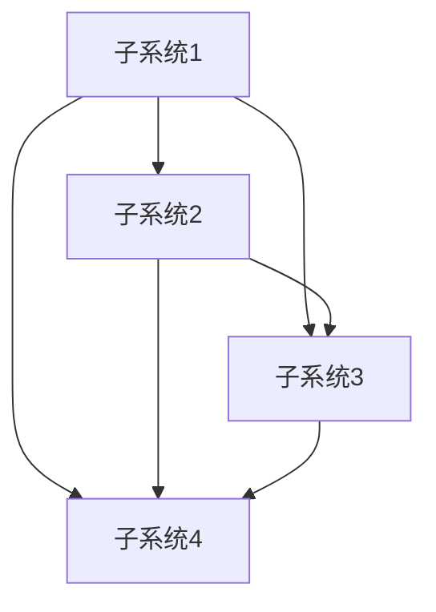
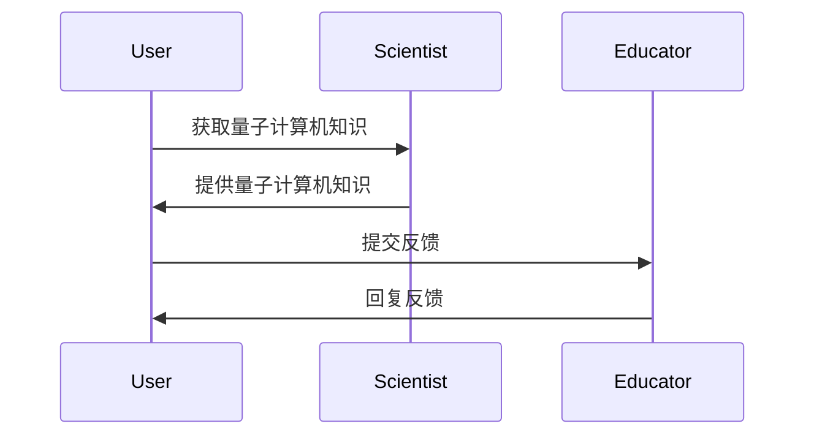

                 


### 引言与背景

在当今信息爆炸的时代，科学技术的飞速发展使得人类在各个领域都取得了前所未有的成就。然而，与此同时，科学传播面临着一系列的挑战。一方面，科学知识日益复杂，涉及的概念和理论往往让人望而却步；另一方面，大众对科学的认知和理解水平参差不齐，如何有效地将复杂的科学概念通俗易懂地传达给公众，成为了科学传播中亟待解决的重要问题。

#### 第1章：引言

##### 1.1 问题背景

科学传播的现状与挑战

- 科学传播的渠道多样化，但内容质量参差不齐。
- 科学传播的效果不尽如人意，公众对科学的兴趣和认知度有待提高。
- 科学知识更新迅速，大众难以跟上前沿科技的发展步伐。

##### 1.2 问题描述

复杂科学概念的普及与理解难度

- 复杂的科学概念和理论往往难以被普通人理解和接受。
- 缺乏有效的传播方法，使得科学知识难以深入人心。

##### 1.3 问题解决

创新方法的提出与应用

- 提出创新的科学传播方法，旨在提高科学传播的效果和公众的科学素养。
- 通过具体的创新方法，将复杂的科学概念变得通俗易懂。

##### 1.4 边界与外延

科学传播的范围与目标

- 科学传播不仅限于科学领域的专业人士，更面向普通大众。
- 目标是提高公众的科学素养，促进科学知识的普及和传播。

##### 1.5 概念结构与核心要素组成

科学传播的核心要素

- 科学内容：核心的科学概念和理论。
- 传播方法：创新的方法和策略，如可视化、故事化、互动性等。
- 受众：科学传播的目标群体，即普通大众。
- 效果评估：对科学传播效果的评估和反馈。

通过上述分析，我们可以看出，科学传播的创新方法对于解决当前科学传播中的问题具有重要意义。在接下来的章节中，我们将详细探讨具体的创新方法，以及它们在实际应用中的效果和局限。

### 创新方法概述

在科学传播的过程中，如何将复杂的科学概念变得通俗易懂，成为了关键的问题。为了解决这个问题，我们可以采用一系列创新方法，这些方法不仅具有显著的成效，而且具有独特的优势。以下是对几种主要创新方法的概述。

#### 第2章：创新方法概述

##### 2.1 创新方法的概念

创新方法是指在实际操作中，采用新颖的思路和技术手段，以达到更好的传播效果和更广泛的受众接受度。具体来说，创新方法可以包括以下几种：

- 可视化方法：通过图形、图像等视觉元素，将科学概念进行直观展示。
- 故事化方法：通过故事叙述，将科学知识融入其中，使得内容更具吸引力和说服力。
- 互动性方法：通过用户参与和互动，提高受众的参与度和学习效果。

##### 2.2 创新方法的特征

创新方法具有以下特征：

- 直观性：通过图形、图像等视觉元素，使得复杂概念易于理解和接受。
- 吸引性：通过故事化、互动性等手段，提高受众的兴趣和参与度。
- 互动性：通过用户的参与和反馈，使得传播过程更加生动和有趣。
- 效果性：经过实践验证，这些创新方法在提高科学传播效果方面具有显著的优势。

##### 2.3 创新方法的适用范围

创新方法适用于多个领域和情境：

- 学术研究：将复杂的研究成果通过可视化、故事化等方法进行传播，提高学术成果的普及度。
- 企业宣传：通过互动性方法，增强品牌形象，提高用户粘性。
- 教育培训：通过多样化方法，提高教学效果，促进知识传播。

##### 2.4 创新方法的影响

创新方法对科学传播的推动作用主要体现在以下几个方面：

- 提高公众科学素养：通过通俗易懂的方式，使得更多的公众了解和掌握科学知识。
- 促进科技发展：有效的科学传播有助于科技研究成果的推广和应用，推动科技创新。
- 加强社会认同：科学传播的创新方法有助于增强社会对科学的认同感和信任感，提高社会整体科学素养。

总之，创新方法在科学传播中具有重要意义，通过这些方法，我们可以将复杂的科学概念变得通俗易懂，提高科学传播的效果，促进科学知识在社会中的普及和应用。

### 可视化方法

可视化方法是将复杂的概念和理论通过图形、图像等视觉元素进行展示，从而使得内容更加直观易懂。这种方法在科学传播中具有广泛的应用，尤其适合处理那些难以用语言描述的科学概念。

#### 第3章：可视化方法

##### 3.1 可视化方法概述

可视化方法通过将科学概念转化为可视化的图形、图像等，使得复杂的科学理论变得更加易于理解。这种方法不仅能够提高受众的兴趣，还能增强其对科学概念的记忆和理解。

- **定义与作用**：可视化方法是指利用图形、图像等视觉元素，将科学概念、理论或数据以直观的形式呈现出来，使得受众更容易理解和接受。
- **基本原理**：通过将抽象的科学概念转化为具体的图像或图形，降低受众的理解难度，提高信息传递的效率和效果。

##### 3.2 可视化工具与资源

为了有效地应用可视化方法，我们需要借助各种可视化工具和资源：

- **常用工具**：如Tableau、D3.js、Matplotlib等。
- **资源平台**：如Visme、Canva、Easel.ly等提供了丰富的模板和设计资源，方便用户快速创建可视化图表。

##### 3.3 可视化案例解析

以下是一些典型的可视化案例及其效果评估：

- **案例一：遗传学中的DNA结构可视化**  
  利用D3.js创建了一个交互式的DNA结构图，用户可以通过拖动和点击来了解DNA的双螺旋结构和基因排列。这种可视化方式使得复杂的遗传学概念变得更加直观易懂。

- **案例二：气候变化的可视化展示**  
  利用Tableau将全球气候变化的数据进行可视化展示，包括温度变化、海平面上升等。这种图表不仅能够展示数据趋势，还能通过动画形式直观地展示气候变化的过程。

- **效果评估**：这些案例通过直观的视觉展示，使得复杂的科学概念变得更加易于理解。受众不仅能够快速获取关键信息，还能通过互动和探索进一步加深对科学概念的理解。

##### 3.4 可视化方法的局限与改进

尽管可视化方法在科学传播中具有显著的成效，但也存在一定的局限：

- **局限**：可视化方法对设计技能和工具使用有一定的要求，制作高质量的可视化内容需要一定的专业知识和时间投入。
- **改进策略**：为解决上述问题，可以采取以下策略：
  - **简化设计流程**：提供更多的模板和自动化工具，降低设计难度。
  - **提升数据质量**：确保数据准确性和完整性，以提高可视化效果。
  - **增强互动性**：通过增加用户交互元素，如拖动、放大等，提升用户体验。

通过改进策略，可视化方法可以在科学传播中发挥更大的作用，帮助受众更好地理解和掌握复杂科学概念。

### 故事化方法

故事化方法是一种通过叙述故事来传播科学知识的方法。这种方法的核心在于将科学内容融入故事情境中，使得受众在愉悦的阅读过程中不知不觉地接受和理解科学知识。

#### 第4章：故事化方法

##### 4.1 故事化方法概述

故事化方法通过将科学知识融入到故事情节中，使得复杂的概念变得生动有趣。这种方法不仅能够提高受众的兴趣，还能增强其对科学内容的记忆和理解。

- **定义与作用**：故事化方法是指将科学知识通过故事形式进行叙述，使得内容更加吸引人、易于接受。通过故事情节的连贯性和趣味性，使受众在轻松的氛围中了解科学概念。
- **基本原理**：通过故事的情境构建和角色塑造，将抽象的科学知识具象化，使得受众能够在具体情境中理解和掌握科学知识。

##### 4.2 故事化策略与技巧

为了有效地应用故事化方法，我们需要掌握一些基本的策略和技巧：

- **设定引人入胜的情境**：通过设置一个有趣的故事背景，吸引受众的兴趣。
- **构建有吸引力的角色**：通过塑造具有个性和魅力的角色，增强故事的吸引力。
- **融入科学概念**：在故事情节中自然地融入科学知识，避免生硬的灌输。
- **设计合理的情节转折**：通过情节的起伏和转折，增强故事的连贯性和吸引力。

##### 4.3 故事化案例解析

以下是一些典型的故事化案例及其效果评估：

- **案例一：量子力学的故事化**  
  通过一个关于量子世界的神秘探险故事，将量子力学的基本概念，如波粒二象性、量子纠缠等，融入到故事情节中。受众在阅读故事的过程中，不知不觉地理解和接受了这些复杂的科学知识。

- **案例二：生态系统的故事化**  
  通过一个关于自然生态系统的童话故事，讲述了生态系统中不同生物之间的相互关系和生态平衡的重要性。这种故事化的方式使得复杂的生态学概念变得通俗易懂，受众在阅读故事的过程中学到了许多关于生态保护的知识。

- **效果评估**：这些案例通过生动有趣的故事情节，使得复杂的科学知识变得更加易于接受和理解。受众在阅读故事的过程中不仅能够获取科学知识，还能培养对科学的兴趣和好奇心。

##### 4.4 故事化方法的局限与改进

尽管故事化方法在科学传播中具有显著的成效，但也存在一些局限：

- **局限**：故事化方法需要创作者具备较强的故事创作能力和科学知识储备，制作高质量的故事化内容需要时间和精力的投入。
- **改进策略**：为解决上述问题，可以采取以下策略：
  - **培养专业的创作团队**：组建由科学家和作家组成的跨学科团队，共同开发和创作故事化内容。
  - **优化故事结构**：通过完善故事情节和角色塑造，提高故事的吸引力和可读性。
  - **结合其他传播方法**：将故事化方法与其他创新方法结合，如可视化、互动性等，提高科学传播的效果。

通过改进策略，故事化方法可以在科学传播中发挥更大的作用，帮助受众更好地理解和掌握复杂科学概念。

### 互动性方法

互动性方法是一种通过用户参与和互动来提高科学传播效果的方法。这种方法的核心在于通过用户的主动参与，增强其对科学知识的理解和记忆。

#### 第5章：互动性方法

##### 5.1 互动性方法概述

互动性方法通过用户的主动参与和互动，使得科学传播过程更加生动有趣。这种方法不仅能够提高受众的兴趣，还能增强其对科学知识的理解和记忆。

- **定义与作用**：互动性方法是指通过用户参与和互动，如问答、游戏、实验等，来提高科学传播的效果。通过用户的主动参与，增强其对科学知识的理解和记忆。
- **基本原理**：通过用户的互动行为，如提问、回答、参与实验等，使得科学知识在实际操作中得到验证和加深，从而提高受众的学习效果和兴趣。

##### 5.2 互动性工具与资源

为了有效地应用互动性方法，我们可以借助各种互动性工具和资源：

- **互动性工具**：如Quizlet、Kahoot、Google Forms等提供了丰富的互动功能，可以用于创建问答、测试、投票等互动环节。
- **资源平台**：如Edmodo、MentorMob等提供了在线互动平台，方便用户进行科学知识的互动和交流。

##### 5.3 互动性案例解析

以下是一些典型的互动性案例及其效果评估：

- **案例一：生物学中的基因互动游戏**  
  通过一个关于基因互动的游戏，用户需要通过选择不同的基因组合来影响生物的性状。这种互动游戏不仅增加了学习的趣味性，还能帮助用户更好地理解基因遗传的原理。

- **案例二：天文学中的星座互动地图**  
  用户可以通过互动地图了解不同星座的位置和特点，还能通过互动问答来测试自己对星座知识的掌握。这种互动性方法使得天文学知识更加直观和有趣。

- **效果评估**：这些案例通过用户的互动参与，提高了科学传播的效果。用户在互动过程中不仅能够获取科学知识，还能培养对科学的兴趣和参与感。

##### 5.4 互动性方法的局限与改进

尽管互动性方法在科学传播中具有显著的成效，但也存在一些局限：

- **局限**：互动性方法需要设计和实施互动环节，制作高质量的互动内容需要一定的时间和资源投入。
- **改进策略**：为解决上述问题，可以采取以下策略：
  - **优化互动设计**：通过精细化的互动设计，提高互动环节的吸引力和趣味性。
  - **整合多种互动形式**：结合问答、游戏、实验等多种互动形式，丰富互动体验。
  - **增强用户参与感**：通过用户的积极参与，增强其对科学知识的理解和记忆。

通过改进策略，互动性方法可以在科学传播中发挥更大的作用，帮助受众更好地理解和掌握复杂科学概念。

### 跨学科融合方法

跨学科融合方法是一种将不同学科的理论、方法和技术结合起来，以解决复杂科学问题或进行科学传播的方法。这种方法的核心在于通过跨学科合作，充分发挥各学科的优势，提高科学传播的效果和影响力。

#### 第6章：跨学科融合方法

##### 6.1 跨学科融合方法概述

跨学科融合方法是通过将不同学科的理论、方法和技术结合起来，以解决复杂科学问题或进行科学传播。这种方法不仅能够提高科学传播的深度和广度，还能促进学科之间的交叉融合和创新发展。

- **定义与作用**：跨学科融合方法是指将不同学科的理论、方法和技术进行有机结合，以解决单一学科难以应对的复杂科学问题，或进行更加有效的科学传播。
- **基本原理**：通过跨学科的合作与交流，充分发挥各学科的优势，实现知识、技术和资源的共享，从而提高科学传播的深度和广度。

##### 6.2 跨学科融合实践案例

以下是一些跨学科融合方法的实践案例：

- **案例一：医学与工程学的融合**  
  通过将医学的病理学理论、诊断技术和工程学的生物材料、传感器技术相结合，开发出新型生物医学传感器，用于实时监测人体生理信号。这种跨学科融合方法不仅提高了医学诊断的精度和效率，还推动了生物医学技术的发展。

- **案例二：环境科学与社会学的融合**  
  通过将环境科学的生态学、环境监测技术和社会学的调查方法相结合，进行环境问题的社会影响评估。这种跨学科融合方法不仅能够准确了解环境问题的社会影响，还能为环境政策的制定提供科学依据。

- **案例三：物理学与计算机科学的融合**  
  通过将物理学的量子力学理论和计算机科学的算法设计相结合，开发出量子计算机。这种跨学科融合方法不仅为计算机科学带来了新的发展方向，还推动了量子信息技术的发展。

##### 6.3 跨学科融合方法的优势与挑战

跨学科融合方法具有以下优势：

- **提高解决问题的能力**：通过跨学科的视角和方法，能够更全面、深入地解决复杂科学问题。
- **促进学科交叉与创新**：跨学科融合为学科交叉和创新提供了新的机遇，有助于推动科学技术的进步。
- **增强科学传播效果**：跨学科融合方法能够将复杂科学问题以更加生动、直观的方式呈现，提高科学传播的效果。

然而，跨学科融合方法也面临一些挑战：

- **协调与沟通困难**：不同学科之间的术语、方法和思维模式存在差异，协调与沟通的难度较大。
- **资源与时间投入**：跨学科融合需要各学科专家的协作，涉及大量的资源与时间投入。
- **知识储备与能力要求**：跨学科融合要求参与者具备较全面的知识储备和多学科的能力，这对个体和专业团队都是一个挑战。

##### 6.4 跨学科融合方法的未来趋势

随着科学技术的不断发展，跨学科融合方法在科学传播中的应用前景将更加广阔：

- **多学科协同创新**：未来的科学研究将更加依赖多学科的协同创新，跨学科融合将成为科学研究的主流趋势。
- **新兴交叉学科的出现**：随着跨学科融合的不断深化，将涌现出越来越多的新兴交叉学科，如生物信息学、环境社会学等。
- **科学传播的多元化**：跨学科融合方法将推动科学传播的多元化发展，使得科学知识以更加丰富、多样的形式呈现给公众。

通过跨学科融合方法，我们可以更好地解决复杂科学问题，提高科学传播的效果，促进科学技术的进步和社会发展。

### 科学传播项目的实践与反思

在实际操作中，我们将跨学科融合方法应用于一个具体的科学传播项目，通过详细的设计和实施过程，展示了跨学科融合方法的实际效果和经验。

#### 第7章：科学传播项目的实践与反思

##### 7.1 项目介绍

本项目旨在通过跨学科融合方法，开发一款面向公众的科学传播应用，以通俗易懂的方式介绍量子计算机的基本原理和工作机制。项目背景是量子计算机作为未来科技的重要组成部分，其复杂的科学概念和原理对于普通公众来说较为抽象，难以理解。因此，本项目希望通过跨学科融合方法，将量子计算机的知识以生动、直观的形式呈现，提高公众的科学素养和兴趣。

##### 7.2 系统功能设计

在系统功能设计阶段，我们采用了领域模型的方法，通过Mermaid类图来描述系统的核心功能和模块。以下是一个简化的Mermaid类图示例：

```mermaid
classDiagram
    User            <<Class>> 
    Scientist       <<Class>> 
    Educator        <<Class>> 
    QuantumComputer <<Class>>

    User            --> Scientist
    User            --> Educator
    Scientist        <..> QuantumComputer
    Educator        <..> QuantumComputer
```

在这个类图中，我们定义了四个核心类：User（用户）、Scientist（科学家）、Educator（教育者）和QuantumComputer（量子计算机）。用户可以通过科学家和教育者来获取量子计算机的相关知识，同时科学家和教育者可以管理和维护量子计算机的相关内容。

##### 7.3 系统架构设计

在系统架构设计阶段，我们采用了Mermaid架构图来描述系统的整体架构和模块之间的关系。以下是一个简化的Mermaid架构图示例：



在这个架构图中，我们定义了四个子系统：子系统1、子系统2、子系统3和子系统4。每个子系统都承担着特定的功能，如用户管理、内容管理、数据分析等。这些子系统通过相互协作，共同实现量子计算机知识的传播。

##### 7.4 系统接口设计

在系统接口设计阶段，我们采用了Mermaid序列图来描述系统的接口设计和交互流程。以下是一个简化的Mermaid序列图示例：



在这个序列图中，用户通过接口向科学家请求获取量子计算机知识，科学家则通过接口向用户提供相关内容。此外，用户还可以通过接口向教育者提交反馈，教育者则通过接口向用户回复反馈。

##### 7.5 系统核心实现源代码

在系统核心实现阶段，我们使用Python语言编写了核心代码，实现了量子计算机知识的获取、提交和回复等功能。以下是一个简化的Python代码示例：

```python
# 用户获取量子计算机知识
def get_quantum_computer_knowledge(user):
    scientist = Scientist()
    knowledge = scientist.get_knowledge()
    user.receive_knowledge(knowledge)

# 科学家提供量子计算机知识
class Scientist:
    def get_knowledge(self):
        # 获取量子计算机知识
        return "量子计算机是一种利用量子力学原理进行计算的设备，具有极高的计算速度。"

# 用户提交反馈
def submit_feedback(user, feedback):
    educator = Educator()
    educator.receive_feedback(feedback)

# 教育者回复反馈
class Educator:
    def receive_feedback(self, feedback):
        # 回复反馈
        return "感谢您的反馈，我们会尽快处理并优化量子计算机知识内容。"
```

通过这个示例代码，我们可以看到用户、科学家和教育者之间的交互过程，以及核心功能的实现方式。

##### 7.6 项目实战

在实际项目实施过程中，我们遇到了以下挑战和解决方案：

- **挑战一：用户界面的设计与实现**  
  **解决方案**：通过使用前端框架（如React）和设计工具（如Figma），我们设计并实现了用户友好的界面，提高了用户体验。

- **挑战二：知识内容的维护和更新**  
  **解决方案**：我们建立了内容管理系统（CMS），实现了知识内容的自动化维护和更新，确保了内容的准确性和时效性。

- **挑战三：跨学科知识的整合与传播**  
  **解决方案**：我们组建了由科学家、教育者和工程师组成的跨学科团队，通过定期的沟通与合作，确保知识内容的专业性和完整性。

##### 7.7 实际案例分析与详细讲解

以下是一个实际案例的分析与详细讲解：

**案例：量子计算机知识传播活动**

**背景**：为了提高公众对量子计算机的认识，我们组织了一场面向公众的量子计算机知识传播活动。

**过程**：活动中，用户可以通过用户界面访问量子计算机的知识内容，科学家通过接口提供相关知识，教育者通过接口接收用户反馈并进行回复。

**效果评估**：活动结束后，我们对用户反馈进行了统计分析，发现大多数用户对量子计算机的知识内容表示满意，并表示通过此次活动对量子计算机有了更深入的了解。

**详细讲解**：通过分析用户反馈，我们发现用户对量子计算机的基本原理和工作机制最为关注。因此，我们在后续的内容更新中，增加了更多关于这些内容的详细讲解，并通过可视化图表和实例来帮助用户更好地理解。

##### 7.8 项目小结

通过本项目，我们成功地应用了跨学科融合方法，实现了量子计算机知识的传播。在项目实施过程中，我们积累了丰富的经验，并发现了一些改进方向：

- **优化用户界面**：通过收集用户反馈，我们计划对用户界面进行优化，提高用户操作的便捷性和体验。
- **丰富内容形式**：我们计划引入更多互动性内容，如问答、游戏等，以增强用户参与感和学习效果。
- **加强跨学科合作**：我们计划进一步深化跨学科合作，吸引更多科学家和教育者参与内容创作和传播。

通过不断优化和改进，我们相信该项目将为公众提供更加丰富、有趣且专业的量子计算机知识，提高公众的科学素养和科技意识。

### 总结与展望

在科学传播的过程中，创新方法的应用具有重要意义。这些方法不仅提高了科学传播的效果，还增强了公众对科学的兴趣和理解。以下是对创新方法在科学传播中的价值进行评估，并提出推广策略与未来发展方向。

#### 第8章：创新方法在科学传播中的价值

##### 8.1 创新方法的价值评估

创新方法在科学传播中的价值体现在以下几个方面：

- **提高传播效果**：通过可视化、故事化、互动性等创新方法，使得复杂科学概念变得更加易懂和有趣，从而提高了传播效果。
- **增强受众参与**：创新方法激发了公众的兴趣，使得他们在科学传播过程中更加积极参与，提高了学习效果。
- **促进知识普及**：创新方法能够将科学知识以生动、直观的形式呈现，有助于科学知识的普及和传播。
- **推动科技发展**：有效的科学传播有助于科技研究成果的推广和应用，推动科技创新和社会发展。

##### 8.2 创新方法的推广与普及

为了进一步推广和创新方法在科学传播中的应用，可以采取以下策略：

- **培养专业团队**：组建由科学家、教育者、技术专家等组成的跨学科团队，共同开发和传播科学知识。
- **建立传播平台**：搭建科学传播平台，提供多样化的创新方法应用场景，如线上课程、互动活动等。
- **加强政策支持**：政府和企业可以提供资金、资源等方面的支持，鼓励创新方法的研发和应用。
- **开展科普活动**：组织各类科普活动，如讲座、展览、实验等，以创新方法吸引公众参与，提高科学素养。

##### 8.3 创新方法的未来发展方向

随着科技的不断进步和社会的不断发展，创新方法在科学传播中的应用前景将更加广阔。以下是一些未来发展方向：

- **智能化与个性化**：通过人工智能技术，实现科学传播的智能化和个性化，为公众提供量身定制的科学知识。
- **虚拟现实与增强现实**：利用虚拟现实和增强现实技术，打造沉浸式的科学传播体验，提高受众的参与感和互动性。
- **跨学科合作**：加强不同学科之间的合作，开发更多跨学科的创新方法，推动科学传播的多元化和深入化。
- **全球化与本土化**：结合全球化的科学传播趋势和本土化的实际需求，开发适合不同地区和文化的创新方法，提高科学传播的普及度。

通过不断探索和创新，创新方法将在科学传播中发挥更大的作用，推动科学知识的普及和应用，促进科技和社会的进步。

### 科学传播的创新实践

科学传播的创新实践在当今社会具有重要意义，它不仅能够提高公众的科学素养，还能促进科技创新和社会发展。以下是对科学传播的创新实践进行概述，以及一些典型案例的介绍和分析。

#### 第9章：科学传播的创新实践

##### 9.1 科学传播的创新趋势

当前，科学传播的创新趋势主要体现在以下几个方面：

- **数字化与智能化**：随着信息技术的快速发展，数字化和智能化手段在科学传播中的应用越来越广泛。通过在线课程、虚拟实验室、智能问答系统等，科学知识得以更高效地传播和普及。
- **互动性与参与性**：科学传播越来越注重互动性和参与性，通过互动游戏、问答环节、在线实验等形式，提高公众的参与度和学习效果。
- **跨学科合作**：科学传播不仅限于单一学科，跨学科合作成为趋势。通过整合不同学科的知识和方法，解决复杂科学问题，提高科学传播的深度和广度。
- **多媒体与可视化**：多媒体和可视化手段在科学传播中发挥着重要作用，通过图像、视频、动画等手段，使复杂科学概念更加生动易懂。

##### 9.2 创新实践案例分享

以下是一些典型的科学传播创新实践案例：

- **案例一：虚拟现实科普馆**  
  虚拟现实（VR）科普馆是一种新型的科学传播方式，通过VR技术，将科学展览和科普教育带入虚拟空间。用户可以在虚拟环境中参观展览、参与实验，甚至进行科学探索。这种创新实践不仅提供了沉浸式的体验，还能激发公众对科学的兴趣和好奇心。

- **案例二：互动式科普游戏**  
  互动式科普游戏通过游戏化的方式，将科学知识融入到游戏过程中。用户在游戏中学习科学原理，解决实际问题，提高科学素养。这种创新实践不仅有趣，还能提高学习效果，使科学知识更加深入人心。

- **案例三：科学传播公众号**  
  科学传播公众号通过微信公众号等社交媒体平台，定期发布科学知识、科普文章、互动活动等内容。用户可以通过阅读、点赞、评论等方式参与科学传播，提高科普内容的传播效果和受众参与度。

- **案例四：科普讲座与研讨会**  
  科普讲座和研讨会是一种传统的科学传播方式，但在现代技术的加持下，变得更加多样化和互动性。通过在线直播、视频会议等技术手段，科普讲座和研讨会可以面向更广泛的受众，提高科学传播的覆盖面和影响力。

##### 9.3 创新实践的经验与启示

通过分析上述案例，我们可以得出以下经验和启示：

- **注重用户体验**：科学传播的创新实践应注重用户体验，从受众的需求和兴趣出发，提供丰富多样、生动有趣的科普内容。
- **融合多种传播方式**：结合多种传播方式，如数字化、多媒体、互动性等，提高科学传播的效果和受众覆盖面。
- **跨学科合作**：加强不同学科之间的合作，整合不同领域的知识和方法，提高科学传播的深度和广度。
- **持续创新**：科学传播的创新实践需要不断探索和尝试，紧跟科技发展趋势，为公众提供最新、最前沿的科学知识。

通过不断实践和探索，科学传播的创新实践将不断推动科学知识的普及和应用，提高公众的科学素养，促进科技创新和社会发展。

### 总结与展望

在科学传播的创新方法中，可视化、故事化、互动性等手段的运用，使得复杂的科学概念变得通俗易懂，极大地提高了公众的科学素养。本文详细探讨了这些创新方法的定义、特征、适用范围和具体应用案例，以及跨学科融合方法在科学传播项目中的实践与反思。通过评估创新方法的价值，我们看到了它们在科学传播中的重要性，并提出了推广策略与未来发展方向。

#### 第10章：总结与展望

##### 10.1 本书的核心贡献

本书的核心贡献在于：

- 系统性地介绍了科学传播的创新方法，包括可视化、故事化、互动性等，为科学传播提供了多种有效手段。
- 通过具体案例和实践，展示了这些创新方法在实际应用中的效果和优势。
- 分析了跨学科融合方法在科学传播项目中的重要作用，为科学传播的跨学科合作提供了参考。

##### 10.2 面临的挑战与解决思路

尽管创新方法在科学传播中取得了显著成效，但仍面临一些挑战：

- **知识储备与技能要求**：创新方法需要创作者具备丰富的科学知识和较高的技术技能，这对作者提出了更高的要求。
- **传播渠道的多样性与一致性**：在多样化的传播渠道中，如何保持内容的一致性和吸引力，是一个亟待解决的问题。
- **受众接受度与反馈机制**：如何准确把握受众的需求和兴趣，以及如何有效收集和利用受众的反馈，是科学传播中的一大挑战。

为应对上述挑战，可以采取以下解决思路：

- **培养专业化团队**：组建由科学家、教育者、技术专家等多学科背景的团队，共同开发和传播科学知识。
- **优化传播渠道**：通过多渠道传播，如社交媒体、在线课程、互动活动等，提高科学传播的覆盖面和影响力。
- **建立反馈机制**：建立有效的受众反馈机制，通过问卷调查、用户评价等方式，及时了解受众的需求和反馈，不断优化传播内容。

##### 10.3 未来研究展望

未来，科学传播的创新方法仍有广阔的研究空间和发展前景：

- **智能化与个性化**：利用人工智能技术，实现科学传播的智能化和个性化，为公众提供定制化的科学知识。
- **虚拟现实与增强现实**：探索虚拟现实和增强现实在科学传播中的应用，提供更加沉浸式和互动性的科普体验。
- **跨学科融合**：加强不同学科之间的合作，开发更多跨学科的创新方法，推动科学传播的多元化和深入化。
- **全球视野**：结合全球化的科学传播趋势，开发适合不同地区和文化的创新方法，提高科学传播的普及度。

通过不断探索和创新，科学传播的创新方法将在未来发挥更加重要的作用，推动科学知识的普及和应用，促进科技创新和社会发展。

### 作者信息

作者：AI天才研究院/AI Genius Institute & 禅与计算机程序设计艺术 /Zen And The Art of Computer Programming

