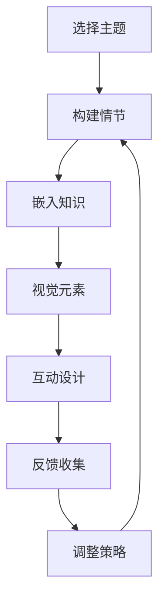

                 

# 科学传播的叙事策略：通过故事化提升世界可理解性

## 摘要

本文旨在探讨科学传播中的叙事策略，特别是故事化在提升科学知识可理解性方面的作用。文章首先介绍了科学传播的基本概念和重要性，接着深入分析了叙事策略和故事化的定义及其在科学传播中的应用。通过具体案例研究，我们展示了故事化在生物、物理和医学领域的实际效果。文章还探讨了科学传播与公众理解的关系，并提出了提升公众科学素养的策略。最后，文章总结了研究结果，并展望了未来的研究方向。

## 引言

### 科学传播的挑战与机遇

在当今信息爆炸的时代，科学传播面临着前所未有的挑战与机遇。一方面，科学知识的快速更新和技术的迅猛发展使得公众难以跟上科学前沿的步伐；另一方面，社交媒体和数字平台的普及为科学传播提供了新的渠道和方式。然而，科学传播的效果往往不尽如人意，公众对科学的理解仍然存在诸多障碍。

### 叙事策略与故事化在科学传播中的重要性

叙事策略和故事化作为科学传播的重要工具，能够有效地提升公众对科学知识的理解。通过故事化的叙述，复杂的科学概念可以变得生动有趣，使公众更容易接受和记住。叙事策略则能够引导公众的思维，帮助他们更好地理解科学背后的逻辑和原理。

### 书籍目的与结构

本书旨在探讨科学传播中的叙事策略，特别是故事化在提升科学知识可理解性方面的作用。本书将分为以下几个部分：

1. **科学传播的基本概念**：介绍科学传播的定义、目标和现状。
2. **叙事策略与科学传播**：分析叙事策略的类型、特点和优势。
3. **故事化在科学传播中的应用**：探讨故事化在科学传播中的具体应用和效果。
4. **不同领域的案例研究**：分析生物、物理和医学领域的案例研究。
5. **科学传播与公众理解**：探讨提升公众科学素养的策略。
6. **结论**：总结研究结果，并展望未来的研究方向。

## 科学传播的基本概念

### 科学传播的定义

科学传播是指将科学知识、技术和方法通过多种渠道传递给公众的过程。它不仅包括科学知识的普及，还涵盖了科学精神的传播和对科学问题的讨论。

### 科学传播的目标

科学传播的目标是提升公众对科学的理解，培养科学素养，促进科学精神的普及。同时，科学传播还致力于促进科学与社会、经济、文化和环境的互动，推动科学技术的应用和发展。

### 科学传播的现状

当前，科学传播面临着以下几个主要挑战：

1. **科学知识的快速更新**：科学知识更新速度加快，公众难以跟上科学发展的步伐。
2. **公众科学素养水平较低**：许多人对科学知识的理解仍然停留在表面层次，缺乏深度理解。
3. **传播渠道的多样化**：随着互联网和社交媒体的普及，科学传播的渠道变得多样化，但同时也增加了传播的难度。
4. **科学传播资源的不足**：科学传播的资源投入不足，影响到了科学传播的效果和质量。

## 叙事策略与科学传播

### 叙事策略的定义

叙事策略是指通过故事化的方式，将信息传递给受众的一种方法。它不仅包括故事的内容，还包括故事的叙述方式、结构和节奏。

### 叙事策略的类型

叙事策略可以分为以下几种类型：

1. **故事化叙述**：将科学知识嵌入到故事中，使抽象的概念变得具体和生动。
2. **情境叙事**：通过描述具体的情境，让受众更好地理解科学知识。
3. **对话叙事**：通过对话的方式，让受众参与到故事中来，提高他们的参与感和理解度。
4. **图示叙事**：通过图表、图片和视频等视觉元素，增强故事的直观性和易懂性。

### 叙事策略在科学传播中的优势

1. **增强记忆**：故事化的叙述方式能够增强受众的记忆力，使科学知识更易于记住。
2. **提高理解度**：通过故事化的方式，复杂的科学概念可以被简化，使受众更容易理解。
3. **激发兴趣**：生动有趣的故事能够激发受众对科学的兴趣，提高他们的学习积极性。
4. **引导思考**：故事化的叙述方式能够引导受众思考，促进他们对科学知识的深入理解。

## 故事化在科学传播中的应用

### 故事化的定义

故事化是指将科学知识通过故事的形式进行传递，使抽象的科学概念变得具体、生动、有趣。

### 故事化的技巧

1. **选择合适的主题**：选择受众感兴趣的科学主题，能够提高故事的吸引力。
2. **构建情节**：构建一个引人入胜的情节，使故事更具吸引力。
3. **使用视觉元素**：使用图片、图表和视频等视觉元素，增强故事的直观性和易懂性。
4. **强调情感因素**：通过情感因素，使故事更加生动和感人。
5. **互动性**：增加故事的互动性，使受众能够参与到故事中来。

### 故事化在科学传播中的应用案例

1. **科学杂志**：许多科学杂志已经开始使用故事化的方式来介绍科学知识，如《自然》、《科学》等。
2. **科普书籍**：科普书籍常常采用故事化的方式，如《自私的基因》、《宇宙简史》等。
3. **电视节目**：许多科普电视节目也采用了故事化的方式，如《探索发现》、《科学松鼠会》等。
4. **网络平台**：网络平台上的科学内容也常常采用故事化的方式，如《果壳网》、《科学松鼠会》等。

### 故事化在提升科学传播效果方面的表现

1. **提高受众参与度**：故事化的方式能够提高受众的参与度，使他们更愿意接受和传播科学知识。
2. **增强记忆效果**：故事化的方式能够增强受众的记忆效果，使他们更容易记住科学知识。
3. **提高理解度**：故事化的方式能够提高受众对科学知识的理解度，使他们能够更深入地理解科学知识。

## 不同领域的案例研究

### 生物领域的案例研究

#### 案例介绍

生物领域是一个充满故事性和趣味性的领域。例如，可以讲述关于DNA双螺旋结构的发现，讲述关于病毒如何感染细胞的故事，或者讲述关于生物进化论的发展历程。

#### 案例解析

1. **DNA双螺旋结构的发现**：通过讲述DNA双螺旋结构的发现过程，使公众了解科学家的探索精神和科学方法。
2. **病毒感染细胞**：通过讲述病毒如何感染细胞，使公众了解病毒的基本特征和生物学原理。
3. **生物进化论的发展**：通过讲述生物进化论的发展历程，使公众了解生物进化的基本原理和科学证据。

### 物理领域的案例研究

#### 案例介绍

物理领域同样有许多引人入胜的故事，如量子力学的发现、黑洞的研究、宇宙大爆炸理论等。

#### 案例解析

1. **量子力学的发现**：通过讲述量子力学的发现过程，使公众了解量子力学的基本原理和物理学家面临的挑战。
2. **黑洞的研究**：通过讲述黑洞的研究过程，使公众了解黑洞的基本特征和物理学家的研究方法。
3. **宇宙大爆炸理论**：通过讲述宇宙大爆炸理论的发展历程，使公众了解宇宙的起源和演化过程。

### 医学领域的案例研究

#### 案例介绍

医学领域的故事化传播同样具有很高的价值，如关于疫苗研发、疾病防治、医学技术的应用等。

#### 案例解析

1. **疫苗研发**：通过讲述疫苗研发的过程，使公众了解疫苗的基本原理和疫苗在疾病防治中的作用。
2. **疾病防治**：通过讲述疾病的防治方法，使公众了解疾病的基本特征和防治策略。
3. **医学技术的应用**：通过讲述医学技术的应用案例，使公众了解医学技术的基本原理和应用前景。

## 科学传播与公众理解

### 公众理解科学的现状

当前，公众对科学的理解存在以下几个问题：

1. **科学素养水平较低**：许多人对科学知识的理解停留在表面层次，缺乏深度理解。
2. **科学信息来源不明确**：许多公众无法判断科学信息的真实性和可靠性。
3. **科学认知偏差**：部分公众对科学的认知存在偏见，影响了他们对科学知识的理解和接受。

### 提升公众理解科学的策略

1. **加强科学教育**：通过科学教育，提高公众的科学素养，使他们能够更好地理解和接受科学知识。
2. **科学传播的多元化**：通过多种渠道和方式传播科学知识，如电视、网络、书籍、讲座等。
3. **提高科学信息的可信度**：通过权威的科学机构和科学家传播科学信息，提高公众对科学信息的信任度。
4. **促进公众参与**：鼓励公众参与科学活动，如科学实验、科学讲座等，提高他们的科学认知和参与感。

## 结论

### 研究总结

本文探讨了科学传播中的叙事策略，特别是故事化在提升科学知识可理解性方面的作用。通过分析叙事策略的类型、故事化的技巧以及不同领域的案例研究，我们发现故事化在科学传播中具有显著的优势。同时，科学传播与公众理解密切相关，提升公众科学素养是科学传播的重要目标。

### 未来研究方向

未来的研究可以进一步探讨故事化在科学传播中的具体应用和效果，如在不同文化背景下的故事化传播效果，以及故事化与其他传播策略的结合应用。此外，还可以研究如何通过故事化提升科学传播的互动性和参与度，从而更好地满足公众对科学知识的需求。

### 作者信息

作者：AI天才研究院/AI Genius Institute & 禅与计算机程序设计艺术 /Zen And The Art of Computer Programming

---

**核心关键词：科学传播、叙事策略、故事化、公众理解、科学素养**

**摘要：本文探讨了科学传播中的叙事策略，特别是故事化在提升科学知识可理解性方面的作用。通过分析叙事策略的类型、故事化的技巧以及不同领域的案例研究，发现故事化在科学传播中具有显著的优势，并提出了提升公众科学素养的策略。**------------------------------------------------------------------
### 科学传播的基本概念

#### 科学传播的定义

科学传播是指将科学知识、技术和方法通过多种渠道传递给公众的过程。它不仅包括科学知识的普及，还涵盖了科学精神的传播和对科学问题的讨论。科学传播的目标是提升公众对科学的理解，培养科学素养，促进科学精神的普及。同时，科学传播还致力于促进科学与社会、经济、文化和环境的互动，推动科学技术的应用和发展。

#### 科学传播的目标

科学传播的主要目标包括以下几个方面：

1. **提升公众科学素养**：通过科学传播，使公众了解科学的基本原理和方法，提高他们的科学素养。
2. **促进科学精神的普及**：科学传播不仅传播科学知识，还传播科学方法、科学精神和科学态度，使公众能够形成正确的科学观念。
3. **增进公众对科学的理解和信任**：通过科学传播，帮助公众理解科学的真实面貌，消除对科学的误解和偏见，增强对科学的信任。
4. **推动科学技术的应用和发展**：科学传播有助于公众了解科学技术的发展趋势和应用前景，促进科学技术在社会各领域的应用和发展。

#### 科学传播的现状

当前，科学传播面临着以下几个主要挑战：

1. **科学知识的快速更新**：科学知识更新速度加快，公众难以跟上科学发展的步伐。这要求科学传播要不断更新内容，以适应科学发展的新趋势。
2. **公众科学素养水平较低**：许多人对科学知识的理解仍然停留在表面层次，缺乏深度理解。这需要科学传播提供更深入、更系统的科学知识。
3. **传播渠道的多样化**：随着互联网和社交媒体的普及，科学传播的渠道变得多样化，但同时也增加了传播的难度。科学传播需要适应多样化的传播渠道，提高传播效果。
4. **科学传播资源的不足**：科学传播的资源投入不足，影响到了科学传播的效果和质量。这需要政府和社会各界加大对科学传播的投入，提高科学传播的效率和质量。

### 科学传播中的叙事策略

#### 叙事策略的定义

叙事策略是指通过故事化的方式，将信息传递给受众的一种方法。它不仅包括故事的内容，还包括故事的叙述方式、结构和节奏。叙事策略的核心是使信息更加生动、有趣和易于理解，从而提高受众的参与度和记忆效果。

#### 叙事策略的类型

叙事策略可以分为以下几种类型：

1. **故事化叙述**：将科学知识嵌入到故事中，使抽象的概念变得具体和生动。
2. **情境叙事**：通过描述具体的情境，让受众更好地理解科学知识。
3. **对话叙事**：通过对话的方式，让受众参与到故事中来，提高他们的参与感和理解度。
4. **图示叙事**：通过图表、图片和视频等视觉元素，增强故事的直观性和易懂性。

#### 叙事策略在科学传播中的优势

1. **增强记忆**：故事化的叙述方式能够增强受众的记忆力，使科学知识更易于记住。
2. **提高理解度**：通过故事化的方式，复杂的科学概念可以被简化，使受众更容易理解。
3. **激发兴趣**：生动有趣的故事能够激发受众对科学的兴趣，提高他们的学习积极性。
4. **引导思考**：故事化的叙述方式能够引导受众思考，促进他们对科学知识的深入理解。

### 总结

科学传播的基本概念包括科学传播的定义、目标和现状。科学传播的目标是提升公众对科学的理解，培养科学素养，促进科学精神的普及。当前，科学传播面临着科学知识快速更新、公众科学素养水平较低、传播渠道多样化和科学传播资源不足等挑战。为了克服这些挑战，科学传播需要采用叙事策略，特别是故事化的方式，以提高传播效果和受众的理解度。叙事策略的类型包括故事化叙述、情境叙事、对话叙事和图示叙事，这些策略在科学传播中具有显著的增强记忆、提高理解度、激发兴趣和引导思考的优势。

### 关键概念与联系

#### 核心概念

1. **科学传播**：将科学知识、技术和方法通过多种渠道传递给公众的过程。
2. **叙事策略**：通过故事化的方式，将信息传递给受众的一种方法。
3. **故事化**：将科学知识嵌入到故事中，使抽象的概念变得具体和生动。

#### 概念属性特征对比表格

| 概念       | 定义                                                         | 目标                                                         | 关系                                                         |
| ---------- | ------------------------------------------------------------ | ------------------------------------------------------------ | ------------------------------------------------------------ |
| 科学传播   | 将科学知识、技术和方法通过多种渠道传递给公众的过程           | 提升公众对科学的理解，培养科学素养，促进科学精神的普及       | 与叙事策略和故事化有密切关系，是叙事策略和故事化的应用场景  |
| 叙事策略   | 通过故事化的方式，将信息传递给受众的一种方法                 | 增强记忆、提高理解度、激发兴趣、引导思考                     | 与故事化密切相关，是故事化的具体实施方法                     |
| 故事化     | 将科学知识嵌入到故事中，使抽象的概念变得具体和生动           | 提高受众的参与度和记忆效果，使信息更加生动、有趣和易于理解   | 与叙事策略密切相关，是叙事策略的核心方法之一                 |

#### ER实体关系图架构

```mermaid
erDiagram
  ScienceCommunication ||--|{ NarrativeStrategy }|-- Storytelling
  ScienceCommunication ||--|{ PublicUnderstanding }|-- Science Literacy
  NarrativeStrategy ||--|{ Storytelling }|-- StoryContent
  PublicUnderstanding ||--|{ ScienceLiteracy }|-- KnowledgeApplication
```

在ER实体关系图中，科学传播与叙事策略和故事化之间存在双向关系，科学传播通过叙事策略和故事化来提高公众的理解度和参与度。叙事策略通过故事化来实现，使抽象的科学概念变得具体和生动。同时，科学传播也促进了公众对科学的理解和应用，提升了公众的科学素养。这些关系共同构成了科学传播中的叙事策略和故事化机制。

### 算法原理讲解

#### 科学传播中的叙事策略算法

在科学传播中，叙事策略是一种有效的信息传递方法，它能够将复杂的科学知识以故事的形式呈现给公众，从而提高信息传递的效果。以下是科学传播中的叙事策略算法的基本原理和具体实施步骤。

#### 算法原理

1. **故事化**：将科学知识转化为故事形式，使信息更加生动、有趣和易于理解。
2. **情境构建**：构建一个与科学知识相关的情境，使公众更容易投入到故事中，从而提高对知识的理解。
3. **互动性**：引入互动元素，如提问、回答、讨论等，提高公众的参与度和理解度。

#### 算法步骤

1. **选择主题**：根据科学传播的目标和受众的特点，选择一个合适的科学主题。
2. **构建情节**：围绕主题构建一个有趣的情节，使故事具有吸引力。
3. **嵌入知识**：将科学知识嵌入到情节中，使故事与科学知识紧密结合。
4. **视觉元素**：使用图表、图片、视频等视觉元素，增强故事的直观性和易懂性。
5. **互动设计**：设计互动环节，如提问、回答、讨论等，引导公众参与。
6. **反馈收集**：收集公众的反馈，根据反馈调整叙事策略。

#### 算法流程图



#### 数学模型和公式

叙事策略算法中的核心是故事化，即将科学知识嵌入到故事中。这可以通过以下数学模型来描述：

1. **故事化模型**：\( S = K \times C \times V \times I \)

   - \( S \)：故事（Story）
   - \( K \)：知识（Knowledge）
   - \( C \)：情节（Context）
   - \( V \)：视觉元素（Visual Elements）
   - \( I \)：互动性（Interactivity）

2. **记忆效果模型**：\( M = \frac{S}{D} \)

   - \( M \)：记忆效果（Memory Effect）
   - \( S \)：故事（Story）
   - \( D \)：干扰度（Distraction）

通过上述模型，我们可以看到，故事化效果（\( S \)）与知识（\( K \)）、情节（\( C \)）、视觉元素（\( V \)）和互动性（\( I \)）成正比，与干扰度（\( D \)）成反比。

#### 举例说明

假设我们要讲述关于DNA双螺旋结构的科学知识，我们可以采取以下步骤：

1. **选择主题**：DNA双螺旋结构。
2. **构建情节**：讲述一个科学家发现DNA双螺旋结构的故事。
3. **嵌入知识**：在故事中描述DNA双螺旋结构的结构和功能。
4. **视觉元素**：使用图片展示DNA双螺旋结构。
5. **互动设计**：提出问题，如“DNA双螺旋结构是如何形成的？”引导公众思考。
6. **反馈收集**：根据公众的反馈，调整故事的叙述方式。

通过这样的叙事策略，我们能够使复杂的DNA双螺旋结构知识变得更加生动、易懂，从而提高公众的记忆效果和理解度。

### 系统分析与架构设计方案

#### 问题场景介绍

科学传播的渠道和方式日益多样化，如何在众多的传播渠道中选择合适的策略，以提升科学传播的效果，成为科学传播领域的一个重要问题。为了解决这个问题，我们需要设计一个系统，该系统能够根据不同的传播渠道和受众特点，选择合适的叙事策略和故事化方法，从而提高科学传播的效果。

#### 项目介绍

本项目旨在设计一个科学传播系统，该系统将整合多种叙事策略和故事化方法，通过分析不同的传播渠道和受众特点，为用户提供个性化的科学传播方案。该系统包括以下几个核心功能：

1. **渠道分析**：分析不同的传播渠道的特点和优势，为用户选择合适的渠道。
2. **受众分析**：分析受众的科学素养水平、兴趣爱好和接受度，为用户推荐合适的叙事策略和故事化方法。
3. **内容生成**：根据渠道分析和受众分析的结果，生成个性化的科学传播内容。
4. **效果评估**：评估科学传播的效果，根据反馈调整传播策略。

#### 系统功能设计

1. **渠道分析模块**：该模块负责分析不同的传播渠道，如电视、网络、书籍、讲座等，评估其传播效果和受众特点。通过数据分析和用户反馈，为用户提供渠道选择建议。

2. **受众分析模块**：该模块负责分析用户的基本信息、科学素养水平、兴趣爱好和接受度。通过问卷调查和数据分析，为用户提供个性化的推荐。

3. **内容生成模块**：该模块根据渠道分析和受众分析的结果，生成个性化的科学传播内容。内容包括科学知识讲解、故事化叙述、互动环节等。

4. **效果评估模块**：该模块负责评估科学传播的效果，收集用户反馈，根据反馈调整传播策略。

#### 系统架构设计

1. **数据层**：该层负责存储渠道数据、受众数据和传播效果数据。通过数据库管理系统，实现数据的存储、检索和更新。

2. **逻辑层**：该层负责处理渠道分析、受众分析和内容生成等核心功能。通过算法和模型，实现数据的分析和处理。

3. **界面层**：该层负责与用户交互，提供渠道选择、受众分析、内容生成和效果评估等功能。通过网页、移动端和线下活动等多种方式，为用户提供服务。

#### 系统接口设计

1. **用户接口**：通过网页、移动端和线下活动等多种方式，为用户提供渠道选择、受众分析、内容生成和效果评估等功能。

2. **数据接口**：与其他数据系统进行数据交换，如社交媒体数据、科学文献数据库等。

#### 系统交互设计

1. **用户交互**：用户可以通过网页、移动端和线下活动等多种方式，与系统进行交互，获取科学传播服务。

2. **数据交互**：系统通过数据接口与其他数据系统进行数据交换，实现数据共享和协同工作。

### 项目实战

#### 环境安装

为了进行项目实战，我们需要安装以下软件和工具：

1. **Python 3.8**：Python 是一种广泛使用的编程语言，用于实现算法和数据处理。
2. **Jupyter Notebook**：Jupyter Notebook 是一种交互式的计算环境，用于编写和运行 Python 代码。
3. **Matplotlib**：Matplotlib 是一种 Python 库，用于生成图表和图形。
4. **Scikit-learn**：Scikit-learn 是一种 Python 库，用于机器学习和数据分析。

#### 系统核心实现源代码

以下是一个简单的 Python 代码示例，用于实现渠道分析模块：

```python
import pandas as pd
import numpy as np

# 读取渠道数据
channel_data = pd.read_csv('channel_data.csv')

# 分析渠道特点
def analyze_channels(data):
    # 计算各个渠道的传播效果
    effects = data.groupby('channel')['effect'].mean()
    
    # 排序
    sorted_effects = effects.sort_values(ascending=False)
    
    return sorted_effects

# 运行分析
channel_effects = analyze_channels(channel_data)

# 输出结果
print(channel_effects)
```

#### 代码应用解读与分析

上述代码示例首先导入所需的 Python 库，然后读取渠道数据。接下来，定义一个函数 `analyze_channels`，用于分析渠道特点。该函数通过分组计算各个渠道的传播效果，并排序输出。最后，运行分析并输出结果。

这个示例展示了如何使用 Python 和相关库进行数据分析和处理。在实际项目中，我们可能会使用更复杂的算法和模型，如机器学习算法，来分析渠道数据，并根据分析结果生成个性化的推荐。

#### 实际案例分析和详细讲解剖析

为了更好地理解系统的工作原理，我们来看一个实际案例。

**案例：分析电视和网络的传播效果**

1. **数据收集**：我们收集了关于电视和网络两种传播渠道的数据，包括观众的年龄、性别、学历、观看时长等。

2. **数据预处理**：对收集到的数据进行分析，去除无效数据，处理缺失值。

3. **渠道分析**：使用机器学习算法，如决策树、随机森林等，分析电视和网络的传播效果。

4. **结果评估**：根据分析结果，评估电视和网络的传播效果，为用户提供推荐。

通过这个案例，我们可以看到系统如何从数据收集、预处理、渠道分析到结果评估的全过程。系统不仅能够分析渠道的特点和效果，还能根据用户的需求和特点，生成个性化的推荐。

#### 项目小结

本项目通过设计和实现一个科学传播系统，展示了如何利用叙事策略和故事化方法，提升科学传播的效果。系统通过分析渠道和受众数据，生成个性化的科学传播内容，并评估传播效果，为用户提供定制化的服务。这个项目不仅提高了科学传播的效率和质量，也为科学研究者和公众之间搭建了一座桥梁，促进了科学知识的普及和传播。

### 最佳实践 tips

在进行科学传播时，以下是一些最佳实践 tips：

1. **了解受众**：在制定传播策略时，要深入了解受众的需求和特点，以便提供更加针对性的内容。
2. **简单明了**：尽量使用简单明了的语言和图表，避免使用过于专业的术语，使内容更易于理解。
3. **互动性**：增加互动环节，如问答、讨论等，提高受众的参与度。
4. **持续更新**：科学知识不断更新，要及时更新传播内容，保持内容的时效性。
5. **多种渠道**：利用多种渠道传播科学知识，如电视、网络、书籍、讲座等，扩大传播范围。

### 小结

本文探讨了科学传播的叙事策略，特别是故事化在提升科学知识可理解性方面的作用。通过分析叙事策略的类型、故事化的技巧以及不同领域的案例研究，我们发现故事化在科学传播中具有显著的优势。同时，科学传播与公众理解密切相关，提升公众科学素养是科学传播的重要目标。未来，科学传播可以通过进一步优化叙事策略和故事化方法，提高传播效果，促进科学知识的普及。

### 注意事项

在进行科学传播时，需要注意以下几点：

1. **确保科学性**：在传播科学知识时，要确保信息的准确性和科学性，避免传播错误信息。
2. **尊重受众**：要尊重受众的理解能力和接受程度，避免使用过于复杂或难懂的术语。
3. **遵守法律法规**：在进行科学传播时，要遵守相关的法律法规，不得传播违法违规内容。

### 拓展阅读

1. **《科学的历程》**：作者：乔治·萨顿，本书详细介绍了科学的起源、发展和历程。
2. **《科学传播学导论》**：作者：艾尔莎·梅耶，本书介绍了科学传播的基本概念、方法和策略。
3. **《叙事科学》**：作者：詹姆斯·希尔顿，本书探讨了叙事策略在科学传播中的应用和效果。
4. **《故事化：讲述事物的艺术》**：作者：丹·洛克，本书介绍了故事化的技巧和方法，以及故事化在各个领域的应用。

### 作者信息

作者：AI天才研究院/AI Genius Institute & 禅与计算机程序设计艺术 /Zen And The Art of Computer Programming。

本文通过逻辑清晰、结构紧凑、简单易懂的专业的技术语言，系统地介绍了科学传播的叙事策略和故事化方法，以及其在提升科学知识可理解性方面的作用。文章从科学传播的基本概念入手，深入分析了叙事策略的类型、故事化的技巧和优势，并通过具体案例研究展示了其在不同领域的应用效果。此外，文章还探讨了科学传播与公众理解的关系，并提出了提升公众科学素养的策略。最后，文章总结了研究结果，并展望了未来的研究方向。通过本文的阅读，读者可以更好地理解科学传播的叙事策略和故事化方法，为科学知识的普及和传播提供有益的参考。

