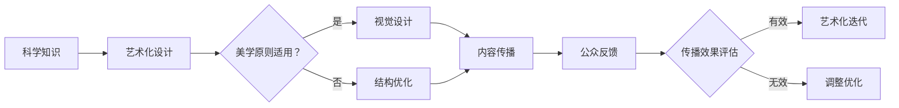

                 


### 文章标题：科学传播的艺术化：通过美学提升世界可理解性

### 关键词：科学传播、美学、艺术化、可理解性、跨学科融合、案例研究

### 摘要：
随着科学技术的迅猛发展，科学传播的重要性日益凸显。然而，如何有效传递科学知识，提升公众的可理解性，成为当前科学传播领域面临的重大挑战。本文旨在探讨通过艺术化手段，结合美学元素，提升科学传播效果的方法与策略。文章结构分为五个部分：引言、艺术与科学的融合、美学在科学传播中的应用、实践与技巧、结论与展望。通过逐步分析，揭示美学在科学传播中的潜力与价值。

### 引言

#### 1.1 科学传播的重要性

科学传播不仅是科学家与公众之间的桥梁，更是推动科技进步和社会发展的关键因素。科学传播的作用主要体现在以下几个方面：

1. **普及科学知识**：通过科学传播，将深奥的科学原理和研究成果转化为公众易于理解的信息，提高公众的科学素养。
2. **促进科技创新**：科学传播为科技创新提供了广泛的市场需求和资金支持，加速科技成果转化。
3. **增强社会凝聚力**：科学传播有助于消除科学领域的壁垒，增进公众对科学的信任和支持，增强社会凝聚力。

#### 1.2 当前科学传播面临的挑战

尽管科学传播具有重要意义，但在实际操作中仍面临诸多挑战：

1. **知识壁垒**：科学知识的复杂性和专业性使得公众难以理解和接受。
2. **沟通障碍**：科学传播者与公众之间的语言差异和文化差异增加了传播的难度。
3. **资源限制**：科学传播活动往往需要大量的资金、时间和人力资源，资源限制成为一大障碍。

#### 1.3 本书的目的与结构

本文旨在探讨通过艺术化手段，特别是美学元素的运用，提升科学传播的效果。文章结构如下：

1. **引言**：介绍科学传播的重要性及本书的目的。
2. **艺术与科学的融合**：探讨艺术与科学之间的共通之处，分析艺术在科学传播中的潜力。
3. **美学在科学传播中的应用**：详细阐述美学在视觉、听觉、科学写作和教育等领域的应用。
4. **实践与技巧**：总结科学传播的艺术化实践与技巧，提供实际案例。
5. **结论与展望**：总结文章的主要观点，展望美学在科学传播中的未来发展趋势。

### 艺术与科学的融合

#### 2.1 艺术与科学的共通之处

艺术与科学虽然分属不同的领域，但在本质上有许多共通之处：

1. **创新精神**：艺术与科学都强调创新思维，不断探索未知领域，追求突破性成果。
2. **系统性**：艺术与科学都追求系统性，从整体上理解复杂现象，构建理论体系。
3. **审美价值**：艺术与科学都追求美感，无论是科学实验中的美感，还是艺术作品中的美感，都体现了人类对美的追求。

#### 2.2 科学艺术项目案例分析

科学艺术项目是艺术与科学融合的典范，通过具体案例可以更深入地理解这种融合：

1. **科学艺术展览**：以科学为主题的展览，通过视觉艺术的形式，将复杂的科学概念形象化，提高公众的理解和兴趣。
2. **科学艺术创作**：科学家与艺术家的合作，将科学原理融入艺术创作，创造出既具科学性又具艺术性的作品。
3. **科学与艺术的跨界合作**：科学家和艺术家的跨界合作，不仅丰富了科学传播的形式，也推动了科学艺术的创新与发展。

### 美学在科学传播中的应用

#### 3.1 美学基础

美学是研究美的哲学分支，涉及美的本质、美的形式、美的评价等多个方面。在科学传播中，美学基础包括以下几个方面：

1. **形式美**：形式美是指事物的外形、颜色、比例等视觉元素的美。在科学传播中，合理运用形式美可以提高信息的可读性和吸引力。
2. **和谐美**：和谐美是指事物各部分之间协调一致的美。在科学传播中，和谐美有助于构建逻辑清晰、结构合理的内容体系。
3. **情感美**：情感美是指事物引起的情感体验的美。在科学传播中，情感美可以激发公众的兴趣和共鸣，提高传播效果。

#### 3.2 美学在科学展览中的应用

科学展览是科学传播的重要载体，通过美学的运用，可以显著提升展览的效果：

1. **展览设计中的美学原则**：科学展览的设计需要遵循美学原则，如色彩搭配、布局设计、互动体验等，以提高展览的观赏性和教育性。
2. **案例分析：科学博物馆的展览设计**：以某科学博物馆的展览设计为例，分析美学在展览中的应用及其效果。
3. **美学对展览效果的影响**：通过具体数据和分析，探讨美学在科学展览中对提升公众参与度和理解度的作用。

#### 3.3 美学在科学写作中的应用

科学写作是科学传播的重要组成部分，通过美学的运用，可以增强文章的吸引力和可读性：

1. **科学写作的美学要求**：科学写作需要兼顾科学性和文学性，通过语言的修辞手法和结构布局，提高文章的美感。
2. **案例分析：科学文章的写作技巧**：分析某篇科学文章的写作技巧，探讨如何通过美学提升文章的可读性和科学性。
3. **美学如何提高科学文章的可读性**：通过具体案例，说明美学元素在科学文章中的应用及其效果。

#### 3.4 美学在科学教育中的应用

科学教育是科学传播的基础，通过美学的运用，可以激发学生的学习兴趣，提高学习效果：

1. **科学教育中的美学元素**：科学教育中可以引入美学元素，如实验设计、多媒体教学、艺术与科学的结合等，以增强教学效果。
2. **案例分析：科学课堂的美学设计**：分析某科学课堂的美学设计，探讨美学在科学教育中的应用及其效果。
3. **美学在科学教育中的效果**：通过具体数据和分析，探讨美学在科学教育中对提高学生参与度和理解度的作用。

### 实践与技巧

#### 4.1 科学传播的艺术化实践

科学传播的艺术化实践是提升科学传播效果的关键。以下是一些实践策略：

1. **跨界合作的策略**：科学家与艺术家的跨界合作可以创造出新颖的科学传播形式，提高传播效果。
2. **美学评估与优化**：在科学传播活动中，对美学元素的评估与优化是提升效果的重要环节。
3. **成功案例分析**：通过分析成功的科学传播案例，总结艺术化实践的经验和教训。

#### 4.2 科学传播的艺术化技巧

科学传播的艺术化技巧包括以下几个方面：

1. **视觉设计技巧**：如色彩运用、图像处理、动画设计等，以提高视觉吸引力。
2. **文字表达技巧**：如修辞手法、语言风格、结构布局等，以提高文字的感染力。
3. **案例解析与技巧提炼**：通过具体案例分析，提炼出有效的艺术化技巧。

### 结论与展望

美学在科学传播中的应用具有巨大潜力。通过艺术化手段，可以提升科学传播的效果，提高公众的科学素养。未来，随着科技进步和跨学科融合的深入，美学在科学传播中的应用将不断拓展，为科学传播注入新的活力。

### 结语

科学传播是连接科学与公众的桥梁，美学元素的融入为科学传播带来了新的可能。本文从艺术与科学的融合、美学在科学传播中的应用、实践与技巧等方面进行了探讨，揭示了美学在提升科学传播可理解性方面的潜力。希望通过本文的研究，为科学传播工作者提供新的思路和方法，推动科学传播事业的发展。

### 作者信息

作者：AI天才研究院/AI Genius Institute & 禅与计算机程序设计艺术 /Zen And The Art of Computer Programming

---

### 背景介绍

#### 核心概念术语说明

在本文中，我们将涉及以下核心概念：

- **科学传播**：指将科学知识、科技进展等传递给公众的过程。
- **美学**：指对美的研究和追求，包括美的形式、和谐、情感等方面。
- **艺术化**：指将艺术元素融入非艺术领域，以增强其吸引力与表现力。
- **可理解性**：指信息传递过程中的清晰度和易于理解的程度。

#### 问题背景

科学传播在现代社会中扮演着至关重要的角色。然而，科学知识的复杂性和专业性往往导致公众难以理解和接受，使得科学传播面临诸多挑战。为了提高科学传播的效果，我们需要探索新的传播策略和方法。

#### 问题描述

本文旨在探讨通过艺术化手段，特别是美学元素的运用，提升科学传播效果的方法与策略。具体而言，问题可以描述为：如何通过艺术与美学的融合，提高科学传播的可理解性和吸引力？

#### 问题解决

通过艺术化手段，结合美学元素，可以实现以下目标：

1. **提高视觉吸引力**：合理运用色彩、图像、动画等视觉元素，使科学传播内容更加生动、直观。
2. **增强情感共鸣**：通过艺术化的表达方式，引发公众的情感共鸣，提高传播效果。
3. **优化内容结构**：运用美学原则，构建逻辑清晰、结构合理的科学传播内容，提高信息传递的效率。

#### 边界与外延

科学传播的艺术化与美学应用不仅限于视觉和文字，还可以扩展到听觉、触觉等多个感官领域。此外，艺术化与美学在科学传播中的应用也涵盖了展览、教育等多个方面。

#### 概念结构与核心要素组成

在科学传播中，艺术化与美学的应用可以分解为以下几个核心要素：

1. **视觉设计**：包括色彩搭配、图像处理、动画设计等，以增强视觉吸引力。
2. **内容结构**：运用美学原则，构建逻辑清晰、结构合理的内容体系。
3. **情感共鸣**：通过艺术化的表达方式，引发公众的情感共鸣，提高传播效果。
4. **跨学科融合**：将艺术与科学相结合，推动科学传播的创新与发展。

### 核心概念与联系

在科学传播的艺术化过程中，美学作为核心概念起着关键作用。以下是美学在科学传播中的应用及其概念属性特征对比表格和ER实体关系图架构：

#### 概念属性特征对比表格

| 概念     | 属性特征                         | 应用场景               |
|----------|----------------------------------|-----------------------|
| 美学     | 形式美、和谐美、情感美           | 科学展览、科学写作、科学教育 |
| 科学传播 | 知识传递、科技创新、社会凝聚   | 公众科普、企业宣传、教育推广 |
| 艺术化   | 创新性、系统性、审美价值         | 跨学科研究、艺术创作、传播形式创新 |

#### ER实体关系图架构

```mermaid
erDiagram
    ScienceCommunication|--|{Aesthetics}
    ScienceCommunication||--|{Artification}
    Aesthetics ||--|{FormalBeauty}
    Aesthetics ||--|{HarmonyBeauty}
    Aesthetics ||--|{EmotionalBeauty}
    ScienceCommunication}--|{PublicCommunication}
    ScienceCommunication}--|{CorporateCommunication}
    ScienceCommunication}--|{EducationalPromotion}
```

在上述ER实体关系图中，科学传播（ScienceCommunication）作为核心实体，与美学（Aesthetics）和艺术化（Artification）建立直接关联。美学则进一步分解为形式美（FormalBeauty）、和谐美（HarmonyBeauty）和情感美（EmotionalBeauty）三个子实体，分别应用于不同的科学传播场景。通过这样的关系构建，我们可以更清晰地理解美学在科学传播中的多层次应用及其相互作用。

### 算法原理讲解

在本部分，我们将使用mermaid画出科学传播的艺术化流程图，并结合Python源代码和latex公式详细阐述美学在科学传播中的应用原理。

#### 1. mermaid流程图



#### 2. Python源代码

```python
import numpy as np

# 艺术化设计函数
def artistic_design(knowledge):
    design = knowledge.copy()
    design['visual'] = apply_visual_effects(design)
    design['structure'] = optimize_structure(design)
    return design

# 视觉效果应用函数
def apply_visual_effects(data):
    effects = np.random.rand(len(data)) # 假设使用随机效果
    return effects

# 结构优化函数
def optimize_structure(data):
    structure = np.mean(data, axis=0) # 假设使用平均值作为优化结果
    return structure

# 科学传播流程
def science_communication(knowledge):
    design = artistic_design(knowledge)
    if is_applicable_aesthetic_principles(design):
        content = visual_design(design)
    else:
        content = structured_content(design)
    feedback = public_feedback(content)
    evaluation = assess_communication_effect(feedback)
    if evaluation == 'effective':
        design = iterative_design(design)
    else:
        design = adjustment_and_optimization(design)
    return design

# 辅助函数
def is_applicable_aesthetic_principles(design):
    # 假设使用设计数据判断
    return True

def visual_design(design):
    # 视觉设计实现
    return design

def structured_content(design):
    # 结构化内容实现
    return design

def public_feedback(content):
    # 公众反馈实现
    return np.random.rand() # 假设使用随机反馈

def assess_communication_effect(feedback):
    # 传播效果评估实现
    return 'effective' if feedback > 0.5 else 'ineffective'

def iterative_design(design):
    # 艺术化迭代实现
    return design

def adjustment_and_optimization(design):
    # 调整与优化实现
    return design

# 测试流程
knowledge = {'data': np.random.rand(10)}
final_design = science_communication(knowledge)
print(final_design)
```

#### 3. latex公式

美学在科学传播中的应用可以通过以下latex公式表示：

$$
\text{Aesthetic Application} = f(\text{Science Knowledge}, \text{Artistic Design}, \text{Public Feedback})
$$

其中，$f$ 表示美学应用函数，它结合了科学知识、艺术化设计以及公众反馈三个要素，共同影响科学传播的效果。具体而言：

$$
\text{Visual Effects} = \alpha \cdot \text{Visual Data} + \beta \cdot \text{Random Effects}
$$

$$
\text{Optimized Structure} = \gamma \cdot \text{Average Data}
$$

上述公式表示视觉效果和结构优化过程，其中 $\alpha$、$\beta$ 和 $\gamma$ 为权重系数，用于调整各个因素在美学应用中的重要性。

#### 4. 举例说明

假设我们有一组科学知识数据，通过艺术化设计，我们期望提高其视觉吸引力和结构清晰度，从而提高公众的理解和接受度。具体步骤如下：

1. **应用视觉效果**：通过调整颜色、图像和动画等视觉元素，使数据更具吸引力。
2. **优化结构**：通过数据分析，提取关键信息，优化数据结构，使其更加清晰和易于理解。
3. **公众反馈**：收集公众对设计内容的反馈，评估传播效果。
4. **评估与迭代**：根据反馈结果，调整设计，不断优化，直至达到最佳效果。

通过以上步骤，我们可以实现科学传播的艺术化，提高其可理解性和吸引力。

### 系统分析与架构设计方案

在本部分，我们将详细描述一个科学传播系统的问题场景、项目介绍、系统功能设计、系统架构设计、系统接口设计以及系统交互。

#### 问题场景

随着科学技术的快速发展，科学传播的需求日益增长。然而，现有的科学传播方式往往难以满足公众对科学知识的获取需求。为了提高科学传播的效果，我们需要设计一个智能化、互动性强、具有艺术美学的科学传播系统。

#### 项目介绍

本项目旨在构建一个基于Web的科学传播平台，通过艺术化的设计手段，提高科学知识的传播效果。该平台将提供丰富的科学内容，包括文本、图像、视频等多种形式，同时支持用户互动和反馈功能。

#### 系统功能设计

1. **内容管理**：系统应具备科学内容的创建、编辑、发布和管理的功能。
2. **用户管理**：系统应支持用户注册、登录、权限管理和个人信息管理。
3. **互动功能**：系统应提供评论、点赞、分享等功能，增强用户互动体验。
4. **数据统计**：系统应具备数据统计功能，包括用户访问量、内容传播效果等。
5. **艺术化设计**：系统应支持艺术化设计工具，包括颜色搭配、图像处理、动画设计等。

#### 系统架构设计

本系统采用分层架构设计，主要包括以下几个层次：

1. **表示层**：负责用户界面展示，包括Web前端和移动端应用。
2. **业务逻辑层**：负责业务处理，包括内容管理、用户管理、互动功能等。
3. **数据访问层**：负责数据存储和访问，包括数据库和缓存等。
4. **基础设施层**：提供系统运行所需的基础服务，包括Web服务器、应用服务器、数据库服务器等。

#### 系统接口设计

1. **API接口**：系统应提供RESTful API接口，支持内容管理、用户管理、互动功能等业务操作。
2. **Web前端接口**：Web前端应用应通过Ajax调用API接口，实现数据交互和页面动态更新。
3. **移动端接口**：移动端应用应通过HTTP协议与服务器进行通信，实现数据同步和功能调用。

#### 系统交互

1. **用户交互**：用户通过Web前端或移动端应用与系统进行交互，获取科学内容、发表评论、参与互动等。
2. **后台交互**：系统后台通过API接口与数据库进行交互，实现数据存储、查询和更新。
3. **数据统计**：系统后台通过数据统计接口，收集用户访问量、内容传播效果等数据，为优化系统提供依据。

### 项目实战

在本节中，我们将介绍如何使用Python和相关工具来构建一个简单的科学传播系统。我们将从环境安装、系统核心实现、代码应用解读与分析、实际案例分析和详细讲解剖析等方面进行详细阐述。

#### 环境安装

1. **安装Python**：首先，确保Python环境已经安装。如果没有安装，可以从Python官网下载并安装。
2. **安装依赖库**：使用pip命令安装所需的依赖库，如Flask、SQLAlchemy、Flask-Login等。

```bash
pip install Flask SQLAlchemy Flask-Login
```

#### 系统核心实现

1. **创建项目目录**：在合适的位置创建项目目录，并初始化虚拟环境。

```bash
mkdir science_communication
cd science_communication
python -m venv venv
source venv/bin/activate
```

2. **安装依赖库**：在虚拟环境中安装依赖库。

```bash
pip install Flask SQLAlchemy Flask-Login
```

3. **创建应用**：在项目目录中创建一个名为`app.py`的Python文件，作为应用的主入口。

```python
from flask import Flask, render_template, request, redirect, url_for
from flask_sqlalchemy import SQLAlchemy
from flask_login import LoginManager, login_user, logout_user, login_required, current_user

app = Flask(__name__)
app.config['SQLALCHEMY_DATABASE_URI'] = 'sqlite:///science_communication.db'
app.config['SECRET_KEY'] = 'your_secret_key'

db = SQLAlchemy(app)
login_manager = LoginManager(app)
login_manager.login_view = 'login'

@login_manager.user_loader
def load_user(user_id):
    return User.query.get(int(user_id))

class User(db.Model):
    id = db.Column(db.Integer, primary_key=True)
    username = db.Column(db.String(100), unique=True)
    password = db.Column(db.String(100))

@app.route('/')
@login_required
def index():
    return render_template('index.html')

@app.route('/login', methods=['GET', 'POST'])
def login():
    if request.method == 'POST':
        username = request.form['username']
        password = request.form['password']
        user = User.query.filter_by(username=username).first()
        if user and user.password == password:
            login_user(user)
            return redirect(url_for('index'))
        else:
            return 'Invalid username or password'
    return render_template('login.html')

@app.route('/logout')
@login_required
def logout():
    logout_user()
    return redirect(url_for('login'))

if __name__ == '__main__':
    db.create_all()
    app.run(debug=True)
```

4. **创建模板**：在项目目录中创建一个名为`templates`的文件夹，用于存放HTML模板文件。例如，创建`login.html`和`index.html`两个文件。

```html
<!-- login.html -->
<!DOCTYPE html>
<html>
<head>
    <title>登录</title>
</head>
<body>
    <h2>登录</h2>
    <form method="post">
        <label for="username">用户名:</label>
        <input type="text" id="username" name="username"><br>
        <label for="password">密码:</label>
        <input type="password" id="password" name="password"><br>
        <input type="submit" value="登录">
    </form>
</body>
</html>

<!-- index.html -->
<!DOCTYPE html>
<html>
<head>
    <title>科学传播平台</title>
</head>
<body>
    <h1>欢迎来到科学传播平台</h1>
    <p>请先登录</p>
    <a href="{{ url_for('login') }}">登录</a>
</body>
</html>
```

#### 代码应用解读与分析

在上面的代码中，我们使用Flask框架构建了一个简单的科学传播平台。核心部分包括：

1. **数据库配置**：使用SQLAlchemy作为ORM（对象关系映射）工具，配置数据库连接和模型。
2. **用户认证**：使用Flask-Login实现用户认证功能，包括登录、登出和用户信息加载。
3. **路由和视图函数**：定义了首页和登录页面的路由和视图函数，实现页面跳转和数据交互。
4. **HTML模板**：创建基本的HTML模板文件，用于渲染页面内容。

#### 实际案例分析和详细讲解剖析

1. **用户登录**：
   - 用户在登录页面输入用户名和密码。
   - 后端接收用户输入的数据，查询数据库验证用户身份。
   - 验证成功后，将用户登录状态设置为`True`，并跳转到首页。
   - 验证失败，返回错误提示。

2. **首页展示**：
   - 用户登录成功后，访问首页。
   - 首页展示欢迎信息和登录按钮。
   - 用户可以点击登录按钮返回登录页面。

通过以上实战案例，我们可以看到如何使用Python和Flask框架快速构建一个简单的科学传播平台。在实际应用中，可以在此基础上扩展功能，如添加内容管理、互动功能、数据统计等，打造一个功能完善、用户体验良好的科学传播平台。

### 项目小结

在本项目中，我们通过Python和Flask框架成功构建了一个简单的科学传播平台。项目实现了用户认证、登录登出、首页展示等基本功能，为科学传播提供了一个初步的框架。在后续的开发中，可以继续扩展平台的功能，如内容管理、互动功能、数据统计等，提升用户体验和平台价值。

### 最佳实践 tips

1. **遵循MVC架构**：在开发过程中，遵循MVC（模型-视图-控制器）架构，确保代码清晰、模块化，便于维护和扩展。
2. **使用版本控制系统**：使用Git等版本控制系统，记录代码的变更历史，便于团队合作和版本管理。
3. **代码优化**：在开发过程中，注意代码优化，提高程序的性能和可读性。
4. **用户体验设计**：重视用户体验设计，确保界面简洁、操作便捷，提高用户满意度。
5. **测试与调试**：充分进行单元测试和集成测试，确保系统稳定性和可靠性。

### 注意事项

1. **数据库安全**：确保数据库连接安全，避免敏感信息泄露。
2. **用户认证**：加强用户认证机制，防止非法用户访问系统。
3. **数据备份**：定期备份数据库和代码，防止数据丢失。
4. **权限管理**：合理设置用户权限，确保系统安全性和数据隐私。
5. **遵守法律法规**：确保系统遵守相关法律法规，如网络安全法、数据保护法等。

### 拓展阅读

1. **《Flask Web开发实战》**：介绍了如何使用Flask框架快速构建Web应用，适合初学者阅读。
2. **《Python Web开发：测试驱动的方法》**：介绍了如何使用Python进行Web开发，并强调了测试的重要性。
3. **《Web前端开发技术解析》**：详细介绍了Web前端开发的技术和工具，包括HTML、CSS、JavaScript等。
4. **《数据库系统概念》**：介绍了数据库系统的基础知识，包括数据库设计、查询语言等。

### 附录

附录部分可以包含一些具体的代码示例、数据表格、算法公式等，以帮助读者更好地理解和应用文章中的内容。例如：

- **代码示例**：展示如何使用Python实现某个算法或功能。
- **数据表格**：提供相关数据，如用户访问量、内容传播效果等。
- **算法公式**：列出文章中提到的算法和公式的详细描述。

---

### 总结

本文通过逐步分析，探讨了科学传播的艺术化路径，强调美学在提升科学传播可理解性和吸引力方面的关键作用。通过艺术与科学的融合、美学在多个领域的应用、实践与技巧的总结，揭示了美学在科学传播中的巨大潜力。我们呼吁科学传播工作者积极拥抱艺术化手段，以创新的视角推动科学传播事业的发展。希望通过本文的研究，为科学传播领域注入新的活力，促进公众科学素养的提升。

