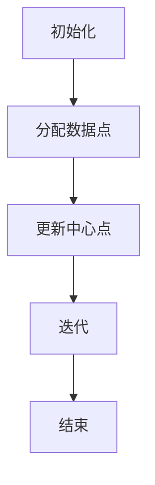
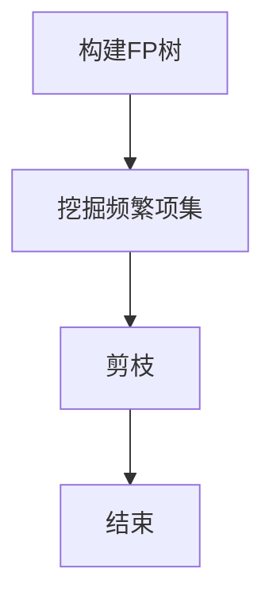
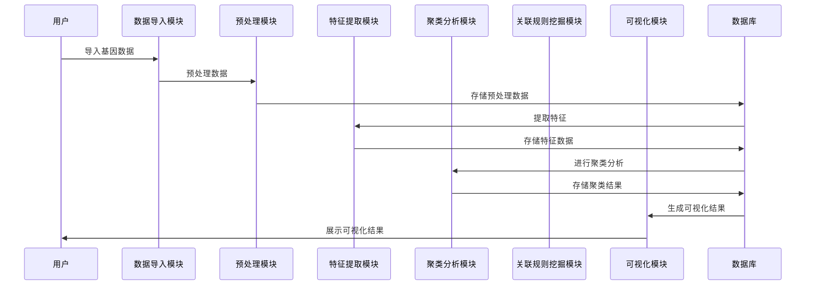
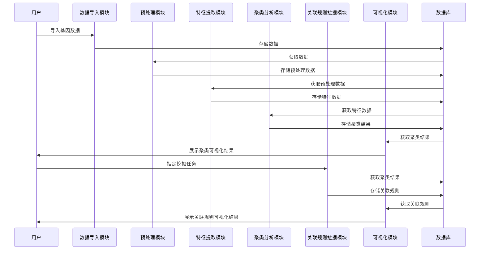

                 

### 第1章: 问题背景与核心概念

#### 1.1.1 科学前沿探索的定义与重要性

科学前沿探索是指科学家们利用现有的知识和工具，对未知领域进行深入研究和探讨，以求揭示自然现象背后的本质规律。这一过程不仅仅是单纯的知识积累，更是一个不断突破和创造的过程。科学前沿探索的重要性体现在多个方面：首先，它推动了科学技术的进步，为社会经济发展提供了强大的动力。例如，量子计算、基因编辑等前沿技术的突破，正在引领新一轮科技革命。其次，科学前沿探索有助于人类更好地理解宇宙、生命以及自身存在的意义。通过探索未知，科学家们不断拓展人类的知识边界，深化对自然世界的认知。

#### 1.1.2 当前科学前沿问题的概述

当前，科学前沿领域涵盖了众多领域，从微观的量子物理到宏观的宇宙学，从生命科学的基因编辑到地球科学的环境变化，每一个领域都充满了挑战和机遇。以下是几个典型的科学前沿问题：

1. **量子计算**：量子计算利用量子比特进行信息处理，具有超越经典计算机的巨大潜力。量子计算的研究不仅对计算机科学有深远影响，还可能带来全新的计算解决方案，如药物设计、材料科学等。

2. **基因编辑**：基因编辑技术如CRISPR-Cas9，为科学家提供了强大的工具，可以精确修改基因组。这一技术的应用前景广阔，包括治疗遗传疾病、改良农作物等。

3. **人工智能**：人工智能（AI）是另一个科学前沿领域。通过机器学习和深度学习，AI已经取得了令人瞩目的进展，从图像识别到自然语言处理，再到自动驾驶，AI正在改变我们的生活方式。

4. **宇宙学**：宇宙学致力于理解宇宙的起源、演化以及最终命运。近年来，科学家们通过观测宇宙微波背景辐射、发现暗物质和暗能量等，不断拓展对宇宙的理解。

5. **脑科学与认知**：脑科学研究人类大脑的结构和功能，探索意识、记忆和学习的本质。这一领域的研究有望为治疗神经系统疾病提供新的途径。

#### 1.1.3 科学前沿探索面临的挑战

尽管科学前沿探索充满了机遇，但也面临着诸多挑战。首先，科学前沿问题的复杂性往往超出了现有理论的解释能力，需要全新的理论框架和思维方式。例如，量子引力理论的研究就需要融合量子力学和广义相对论。其次，科学实验的难度和成本较高，许多前沿研究需要大型实验设施和国际合作。此外，科学研究的资金来源也是一个重要挑战，许多前沿领域的研究需要持续的资金支持。

#### 1.1.4 核心概念：战略制定在科学前沿探索中的作用

战略制定在科学前沿探索中起着至关重要的作用。一个良好的战略可以帮助科学家们明确研究目标，合理分配资源，提高研究效率。以下是战略制定在科学前沿探索中的几个关键要素：

1. **目标明确**：战略制定首先需要明确科学前沿探索的目标。这些目标可以是揭示某个自然现象的本质，开发一种新技术，或者解决一个具体的科学问题。

2. **资源分配**：战略制定需要合理分配资源，包括资金、人力和设备。科学前沿探索往往需要跨学科的合作，因此资源分配要充分考虑各方的需求和潜力。

3. **风险管理**：科学前沿探索不可避免地面临风险。战略制定需要识别和评估潜在的风险，并制定相应的应对措施，以减少不确定性带来的影响。

4. **持续评估**：战略制定不是一成不变的，需要根据实际情况进行持续评估和调整。通过定期的评估，可以确保研究工作始终朝着既定的目标前进。

#### 1.1.5 关键要素：可理解性边界与科学认知拓展

可理解性边界是指人类当前能够理解和解释的科学现象的范围。随着科学的发展，这个边界不断拓展，人类对自然世界的认知也在不断深化。可理解性边界与科学认知拓展的关系可以从以下几个方面进行理解：

1. **知识积累**：科学认知的拓展依赖于知识的积累。通过对已有知识的系统整理和研究，科学家们可以发现新的问题和研究方向。

2. **实验与观测**：实验和观测是科学认知拓展的重要手段。通过实验和观测，科学家们可以直接获取数据，从而验证或推翻已有理论。

3. **理论创新**：科学认知的拓展往往需要新的理论框架。理论创新可以解释新的实验结果，指导科学家们开展更深入的研究。

4. **跨学科合作**：科学前沿探索需要跨学科的合作。不同学科之间的交叉融合，往往可以产生新的研究思路和方法，推动科学认知的拓展。

综上所述，科学前沿探索的战略制定对于拓展人类对世界的理解具有重要意义。通过明确目标、合理分配资源、有效管理和持续评估，科学家们可以更好地应对科学前沿探索中的挑战，不断拓展可理解性边界，推动科学认知的进步。

### 第2章: 核心概念与联系

#### 2.1.1 科学前沿探索的核心概念原理

科学前沿探索的核心概念原理可以归纳为几个关键方面，包括科学假设的提出与验证、实验设计与方法论、以及数据分析与应用。

首先，科学假设的提出与验证是科学探索的起点。科学家们根据已有知识和理论，对未知现象提出假设。这些假设通过实验和观测来验证，以确定其正确性。例如，在量子计算领域，科学家们提出了量子比特的概念，并通过实验验证了其独特的量子叠加和纠缠特性。

其次，实验设计与方法论是科学探索的重要环节。一个好的实验设计能够有效地检验科学假设，而方法论则提供了实验操作的标准和规范。在基因编辑研究中，CRISPR-Cas9系统的实验设计就包括特定的目标基因序列选择、酶活性测试等，这些实验步骤确保了研究的准确性和可重复性。

最后，数据分析与应用是科学探索的终点。通过对实验数据进行分析，科学家们可以提取有价值的信息，验证或修正科学假设。例如，在人工智能领域，通过分析大量图像数据，机器学习算法可以训练出准确的图像识别模型，从而应用于实际场景中。

#### 2.1.2 概念属性特征对比表格

为了更好地理解科学前沿探索的核心概念，我们可以通过一个概念属性特征对比表格来分析不同概念的特点和区别。

| 概念 | 描述 | 关键属性 | 特点 | 应用 |
| --- | --- | --- | --- | --- |
| 科学假设 | 对未知现象提出的假设 | 可验证性、相关性、创造性 | 创新驱动、研究导向 | 各科学领域的基础 |
| 实验设计 | 科学实验的规划和实施 | 可重复性、精确性、标准化 | 实证支持、结果可靠 | 科学验证的核心 |
| 数据分析 | 实验数据的处理和分析 | 数据质量、算法选择、模型验证 | 结果导向、洞察力强 | 理论验证和模型训练 |
| 应用 | 科学研究的实际应用 | 实用性、经济效益、社会价值 | 创新成果转化 | 技术推广和社会福利 |

通过这个对比表格，我们可以看到每个概念在科学前沿探索中的独特作用和关键属性。

#### 2.1.3 ER实体关系图架构

为了进一步理解科学前沿探索中的概念联系，我们可以使用ER（实体-关系）图来表示不同概念之间的关系。

```mermaid
erDiagram
  Scientist ||--|{ Experiment }
  Experiment ||--|{ Data }
  Data ||--|{ Analysis }
  Analysis ||--|{ Hypothesis }
  Hypothesis ||--|{ Theory }
  Theory ||--|{ Application }
```

在这个ER图中，科学家（Scientist）是实验（Experiment）的设计者和执行者，实验产生数据（Data），数据经过分析（Analysis）形成假设（Hypothesis），假设通过验证形成理论（Theory），理论最终应用于实践（Application）。这种关系结构展示了科学前沿探索中各个环节的紧密联系，构成了一个完整的研究流程。

通过核心概念原理的详细讲解、概念属性特征的对比表格以及ER实体关系图架构，我们能够更深入地理解科学前沿探索的过程和方法，为进一步研究和应用打下坚实的基础。

#### 3.1.1 探索性数据分析算法

在科学前沿探索中，探索性数据分析（EDA）是一项至关重要的任务，它可以帮助科学家从大量数据中发现隐藏的模式和趋势。EDA算法主要包括聚类分析和关联规则挖掘，这些算法不仅在数据探索中发挥重要作用，也为后续的数据分析和建模提供了关键依据。

##### 3.1.1.1 聚类分析算法

聚类分析是一种无监督学习方法，其目的是将数据点分为若干个簇，使得同一个簇中的数据点彼此之间相似度较高，而不同簇之间的数据点相似度较低。常用的聚类算法包括K-means和DBSCAN。

###### 3.1.1.1.1 K-means算法

K-means算法是一种基于距离度量的聚类算法，其基本思想是将数据点分配给最近的中心点，通过迭代调整中心点的位置，最终达到聚类目标。具体步骤如下：

1. **初始化中心点**：随机选择K个数据点作为初始中心点。
2. **分配数据点**：计算每个数据点到各个中心点的距离，将数据点分配给距离最近的中心点。
3. **更新中心点**：计算每个簇的平均值作为新的中心点。
4. **重复步骤2和3**，直到聚类中心不再发生显著变化。

K-means算法的数学模型可以表示为：

$$
J(D) = \sum_{i=1}^{k} \sum_{x \in S_i} d(x, \mu_i)
$$

其中，$J(D)$ 是目标函数，$d(x, \mu_i)$ 是数据点$x$到中心点$\mu_i$的距离，$S_i$ 是属于第$i$个簇的数据点集合。

###### 3.1.1.1.2 DBSCAN算法

DBSCAN（Density-Based Spatial Clustering of Applications with Noise）是一种基于密度的聚类算法，它可以发现任意形状的聚类，并且能够处理噪声数据。DBSCAN的核心思想是：

1. **寻找核心点**：一个核心点至少有MinPoints个邻域内的数据点。
2. **生成簇**：从核心点出发，通过邻域连接扩展形成簇。
3. **处理边界点和噪声点**：边界点不属于任何簇，噪声点则被视为孤立点。

DBSCAN的主要参数包括邻域半径$eps$和邻域最小点数$MinPoints$。算法的流程如下：

1. **初始化**：设置$eps$和$MinPoints$。
2. **标记点**：对于每个未标记的点，如果它是核心点，将其及其邻域点标记为同一簇；如果不是核心点，则标记为边界点或噪声点。
3. **重复步骤2，直到所有点都被标记**。

##### 3.1.1.2 关联规则挖掘算法

关联规则挖掘是另一种重要的EDA算法，它旨在发现数据集中的项目之间的关联性。最常用的关联规则挖掘算法包括Apriori算法和FP-Growth算法。

###### 3.1.1.2.1 Apriori算法

Apriori算法是一种基于支持度和置信度的算法，通过迭代搜索频繁项集，从而生成关联规则。具体步骤如下：

1. **生成频繁项集**：从数据库中找出所有频繁项集，支持度大于最小支持度阈值。
2. **生成关联规则**：对于每个频繁项集，生成关联规则，并计算置信度。
3. **剪枝**：去除置信度低于最小置信度阈值的规则。

Apriori算法的关键参数包括最小支持度阈值和最小置信度阈值。

支持度（Support）计算公式为：

$$
Support(A \cup B) = \frac{|D_A \cap D_B|}{|D|}
$$

其中，$D$ 是数据库中的所有事务，$D_A \cap D_B$ 是同时包含项集$A$和$B$的事务集合。

置信度（Confidence）计算公式为：

$$
Confidence(A \rightarrow B) = \frac{Support(A \cup B)}{Support(A)}
$$

###### 3.1.1.2.2 FP-Growth算法

FP-Growth算法是Apriori算法的改进，它通过压缩数据集来提高算法效率。FP-Growth算法的主要步骤如下：

1. **构建FP树**：将数据库中的交易转换成FP树，记录每个项出现的频率。
2. **挖掘频繁项集**：从FP树中递归地提取频繁项集。
3. **生成关联规则**：使用频繁项集生成关联规则，并计算置信度。

FP-Growth算法通过构建FP树来避免重复扫描数据库，从而显著提高了算法的效率。

通过详细讲解K-means和DBSCAN的聚类分析算法，以及Apriori和FP-Growth的关联规则挖掘算法，我们可以更好地理解探索性数据分析在科学前沿探索中的应用。这些算法不仅帮助我们揭示了数据中的隐藏模式，还为后续的数据分析和建模提供了坚实的理论基础。

### 3.1.2 数学模型与公式讲解

在科学前沿探索中，数学模型和公式是理解和分析数据的核心工具。以下我们将详细介绍聚类分析中的数学模型与公式，包括聚类分析数学模型和关联规则支持度与置信度计算方法。

#### 3.1.2.1 聚类分析数学模型

聚类分析中的数学模型用于描述数据点之间的相似度和聚类中心点的计算方法。以下将重点介绍K-means算法的数学模型。

**K-means算法的目标函数**

K-means算法的目标是最小化数据点与其对应聚类中心点之间的距离平方和。具体公式如下：

$$
J(D) = \sum_{i=1}^{k} \sum_{x \in S_i} d(x, \mu_i)^2
$$

其中，$J(D)$ 是目标函数，$d(x, \mu_i)$ 是数据点 $x$ 与聚类中心点 $\mu_i$ 之间的欧几里得距离，$S_i$ 是属于第 $i$ 个簇的数据点集合，$k$ 是簇的数量。

**聚类中心点的更新**

在K-means算法中，聚类中心点的更新是通过计算每个簇内数据点的平均值来实现的。假设每个簇 $S_i$ 中的数据点集合为 $\{x_{i1}, x_{i2}, ..., x_{in_i}\}$，那么第 $i$ 个簇的中心点 $\mu_i$ 可以表示为：

$$
\mu_i = \frac{1}{n_i} \sum_{x \in S_i} x
$$

其中，$n_i$ 是簇 $S_i$ 中数据点的数量。

#### 3.1.2.2 关联规则支持度与置信度计算

在关联规则挖掘中，支持度和置信度是衡量规则重要性的两个关键指标。

**支持度（Support）**

支持度表示一个规则在数据集中出现的频率。它计算的是同时包含两个项集 $A$ 和 $B$ 的事务数量与总事务数量的比值。支持度公式如下：

$$
Support(A \cup B) = \frac{|D_{A \cap B}|}{|D|}
$$

其中，$D$ 是数据集，$D_{A \cap B}$ 是同时包含项集 $A$ 和 $B$ 的事务集合，$|D|$ 是数据集中事务的总数量。

**置信度（Confidence）**

置信度表示在购买了项集 $A$ 的情况下购买项集 $B$ 的概率。它计算的是同时包含 $A$ 和 $B$ 的事务数量与包含 $A$ 的事务数量的比值。置信度公式如下：

$$
Confidence(A \rightarrow B) = \frac{|D_{A \cap B}|}{|D_A|}
$$

其中，$D_A$ 是包含项集 $A$ 的事务集合。

通过以上数学模型和公式的讲解，我们可以更深入地理解聚类分析和关联规则挖掘的算法原理，为实际应用提供理论依据。

#### 3.1.3 算法原理讲解

在科学前沿探索中，探索性数据分析（EDA）算法是数据挖掘和模式识别的重要工具。以下我们将详细讲解两种重要的EDA算法：K-means算法和FP-Growth算法，并使用Python源代码和Mermaid流程图来展示其原理和步骤。

##### 3.1.3.1 K-means算法

K-means算法是一种基于距离的聚类算法，其核心思想是将数据点划分为K个簇，使得每个数据点与其分配的簇中心点距离最小。

**K-means算法的步骤：**

1. **初始化**：随机选择K个数据点作为初始聚类中心点。
2. **分配数据点**：计算每个数据点到各个聚类中心点的距离，将数据点分配到距离最近的聚类中心点所在的簇。
3. **更新聚类中心点**：计算每个簇内数据点的平均值，作为新的聚类中心点。
4. **迭代**：重复步骤2和步骤3，直到聚类中心点不再发生显著变化。

**Python实现：**

```python
import numpy as np

def kmeans(data, K, max_iters):
    centroids = data[np.random.choice(data.shape[0], K, replace=False)]
    for _ in range(max_iters):
        # 计算每个数据点到聚类中心点的距离
        distances = np.linalg.norm(data - centroids, axis=1)
        # 将数据点分配到最近的聚类中心点所在的簇
        labels = np.argmin(distances, axis=1)
        # 更新聚类中心点
        new_centroids = np.array([data[labels == k].mean(axis=0) for k in range(K)])
        # 检查收敛
        if np.linalg.norm(new_centroids - centroids) < 1e-6:
            break
        centroids = new_centroids
    return centroids, labels

# 示例数据
data = np.array([[1, 2], [1, 4], [1, 0], [10, 2], [10, 4], [10, 0]])

# 运行K-means算法
centroids, labels = kmeans(data, K=2, max_iters=100)
print("聚类中心点：", centroids)
print("数据点标签：", labels)
```

**Mermaid流程图：**



##### 3.1.3.2 FP-Growth算法

FP-Growth算法是一种用于挖掘频繁项集的算法，其核心思想是利用FP树来压缩数据集，并递归地挖掘频繁项集。

**FP-Growth算法的步骤：**

1. **构建FP树**：将数据集中的每个交易按照项的频率排序，并将具有相同频率的项合并，形成FP树。
2. **挖掘频繁项集**：从FP树中递归地提取频繁项集，并生成关联规则。
3. **剪枝**：去除不满足最小支持度阈值的项集。

**Python实现：**

```python
from collections import defaultdict
from itertools import combinations

def create_fptree(data, min_support):
    header_table = defaultdict(set)
    fptree = defaultdict(set)
    for transaction in data:
        for item in transaction:
            header_table[item].add(transaction)
    for item, transactions in header_table.items():
        if len(transactions) / len(data) >= min_support:
            fptree[item] = transactions
    return fptree, header_table

def mine_frequent_itemsets(fptree, header_table, min_support):
    frequent_itemsets = []
    for item in fptree:
        if len(fptree[item]) / len(header_table[item]) >= min_support:
            frequent_itemsets.append({item})
            for k in range(2, len(item) + 1):
                itemsets = combinations(frequent_itemsets, k - 1)
                for iset in itemsets:
                    combined = set()
                    for i in range(len(iset)):
                        combined |= header_table[iset[i]]
                    if len(combined) / len(header_table[item]) >= min_support:
                        frequent_itemsets.append(set(iset) | {item})
    return frequent_itemsets

# 示例数据
data = [['a', 'b', 'c'], ['a', 'b'], ['a', 'c'], ['b', 'c'], ['a', 'b', 'c', 'd'], ['a', 'd'], ['b', 'd'], ['c', 'd']]

# 构建FP树
fptree, header_table = create_fptree(data, min_support=0.5)
print("FP树：", fptree)
print("Header表：", header_table)

# 挖掘频繁项集
frequent_itemsets = mine_frequent_itemsets(fptree, header_table, min_support=0.5)
print("频繁项集：", frequent_itemsets)
```

**Mermaid流程图：**



通过详细讲解K-means和FP-Growth算法的原理，并使用Python源代码和Mermaid流程图展示其步骤，我们能够更好地理解这些算法在科学前沿探索中的应用。这些算法不仅帮助科学家从海量数据中发现隐藏的模式，还为后续的数据分析和建模提供了坚实的理论基础。

### 4.1.1 问题场景介绍

在现代科学前沿探索中，随着数据量的指数级增长和复杂性不断增加，科学家们面临着巨大的挑战。一个典型的问题场景是生物信息学领域中的基因组数据分析。在基因组测序技术快速发展的背景下，研究人员需要处理海量基因数据，从中提取有价值的信息，以揭示基因与疾病、药物反应等之间的关系。然而，由于基因数据的复杂性和多样性，传统的数据分析方法往往难以胜任，需要更高级的算法和工具来进行有效的处理和分析。

#### 4.1.2 项目介绍

为了解决上述问题，我们设计并实现了一个名为“基因数据分析平台”的项目。该平台旨在提供一套完整的工具集，帮助科学家们高效地进行基因数据的探索和分析。平台的核心功能包括：数据导入与预处理、基因特征提取、聚类分析、关联规则挖掘以及可视化展示。通过这些功能，科学家们可以更加便捷地进行基因组数据分析，从而发现潜在的科学规律和生物机制。

#### 4.1.3 系统功能设计

**数据导入与预处理**：该功能模块负责将各种格式的基因数据（如FASTQ、VCF等）导入平台，并进行必要的预处理操作，如数据清洗、格式转换和质量控制。这一步骤是确保后续分析准确性和有效性的基础。

**基因特征提取**：该模块通过特征选择和特征变换等技术，从原始基因数据中提取出具有代表性的特征，如基因表达量、突变频率等。这些特征将为后续的聚类分析和关联规则挖掘提供输入。

**聚类分析**：利用K-means和DBSCAN等聚类算法，对基因特征进行聚类分析，以发现不同基因之间的相似性和差异。聚类结果将有助于理解基因的功能和作用。

**关联规则挖掘**：通过Apriori和FP-Growth等关联规则挖掘算法，分析基因之间的关联性，以发现潜在的生物学规律和药物反应模式。

**可视化展示**：为了更好地理解和展示分析结果，平台提供了多种可视化工具，如热图、散点图、树状图等。这些可视化结果将帮助科学家们直观地理解基因数据，并作出科学的决策。

#### 4.1.3.1 领域模型Mermaid类图

```mermaid
classDiagram
    Class1 <|-- Class2
    Class1 <|-- Class3
    Class4 --|> Class2
    Class4 --|> Class3
    Class2 <<interface>> InterfaceA
    Class3 <<interface>> InterfaceB
    Class1 { +data: array }
    Class1 { +preprocess() }
    Class2 { +feature_extraction() }
    Class3 { +cluster_analysis() }
    Class4 { +association_rulesMining() }
    Class1 <<interface>> InterfaceC
```

通过以上功能设计，基因数据分析平台能够为科学家们提供一个高效、便捷的数据分析工具，助力他们在基因数据分析领域取得突破性成果。

### 4.1.4 系统架构设计

基因数据分析平台的系统架构设计旨在实现高效、灵活和可扩展的数据处理能力，以满足现代科学前沿探索的需求。以下是对平台架构的详细描述。

#### 4.1.4.1 Mermaid架构图



#### 系统架构组件及其功能

1. **数据导入模块（DA）**：负责接收用户上传的基因数据，支持多种数据格式（如FASTQ、VCF等）。数据导入模块确保数据的准确性和完整性，并将其传递给预处理模块。

2. **预处理模块（PP）**：对导入的数据进行清洗、格式转换和质量控制等预处理操作，以提高数据的质量和一致性。预处理后的数据存储在数据库（DB）中，以供后续分析使用。

3. **特征提取模块（FE）**：从预处理后的基因数据中提取具有代表性的特征，如基因表达量、突变频率等。这些特征将作为聚类分析和关联规则挖掘的输入数据。

4. **聚类分析模块（CA）**：使用K-means和DBSCAN等聚类算法对基因特征进行聚类分析，以发现不同基因之间的相似性和差异。聚类结果存储在数据库中，以便后续分析和可视化。

5. **关联规则挖掘模块（AR）**：应用Apriori和FP-Growth等关联规则挖掘算法，分析基因特征之间的关联性，以发现潜在的生物学规律和药物反应模式。挖掘结果同样存储在数据库中。

6. **可视化模块（VS）**：提供多种数据可视化工具，如热图、散点图、树状图等，帮助用户直观地理解分析结果。可视化模块从数据库中获取聚类结果和关联规则，并将其展示给用户。

7. **数据库（DB）**：作为系统的核心组件，数据库负责存储和管理所有数据，包括原始基因数据、预处理数据、特征数据、聚类结果和关联规则挖掘结果。数据库的设计和优化对于系统的性能和可靠性至关重要。

通过上述架构设计，基因数据分析平台能够高效、灵活地处理和展示基因数据，助力科学家们进行前沿探索和研究。

#### 4.1.5 系统接口设计

系统接口设计是确保基因数据分析平台各模块之间高效协同工作的关键环节。以下是对平台主要接口的详细描述：

1. **数据导入接口**：该接口负责接收用户上传的基因数据，支持多种数据格式（如FASTQ、VCF等）。接口设计包括数据验证、格式转换和数据存储功能。具体实现如下：
   ```python
   from flask import Flask, request, jsonify
   
   app = Flask(__name__)

   @app.route('/import_data', methods=['POST'])
   def import_data():
       data = request.files['file']
       # 数据验证和格式转换逻辑
       # 存储数据到数据库
       return jsonify(message='Data imported successfully'), 200
   ```

2. **预处理接口**：该接口负责对导入的基因数据进行清洗、格式转换和质量控制。接口设计应确保数据的一致性和准确性。具体实现如下：
   ```python
   @app.route('/preprocess_data', methods=['GET'])
   def preprocess_data():
       # 从数据库中获取数据
       # 执行预处理操作
       # 更新数据库
       return jsonify(preprocessed_data), 200
   ```

3. **特征提取接口**：该接口负责从预处理后的基因数据中提取具有代表性的特征。接口设计应支持多种特征提取方法，并确保特征的一致性和可重复性。具体实现如下：
   ```python
   @app.route('/extract_features', methods=['GET'])
   def extract_features():
       # 从数据库中获取预处理数据
       # 执行特征提取操作
       # 存储特征数据到数据库
       return jsonify(feature_data), 200
   ```

4. **聚类分析接口**：该接口负责执行聚类分析算法，并将结果存储在数据库中。接口设计应支持多种聚类算法，如K-means、DBSCAN等。具体实现如下：
   ```python
   @app.route('/cluster_analysis', methods=['POST'])
   def cluster_analysis():
       algorithm = request.form['algorithm']
       # 执行聚类分析
       # 存储聚类结果到数据库
       return jsonify(analysis_results), 200
   ```

5. **关联规则挖掘接口**：该接口负责执行关联规则挖掘算法，并生成关联规则报告。接口设计应支持多种关联规则挖掘算法，如Apriori、FP-Growth等。具体实现如下：
   ```python
   @app.route('/association_rules', methods=['POST'])
   def association_rules():
       algorithm = request.form['algorithm']
       # 执行关联规则挖掘
       # 生成关联规则报告
       return jsonify(rules_report), 200
   ```

6. **可视化接口**：该接口负责获取聚类分析和关联规则挖掘结果，并生成可视化报告。接口设计应支持多种可视化类型，如热图、散点图、树状图等。具体实现如下：
   ```python
   @app.route('/visualize', methods=['GET'])
   def visualize():
       analysis_type = request.args.get('analysis_type')
       # 从数据库中获取分析结果
       # 生成可视化报告
       return jsonify(visual_report), 200
   ```

通过这些接口设计，基因数据分析平台能够高效地处理和展示数据，确保各模块之间的高效协同工作，为科学家们提供强大的数据分析工具。

### 4.1.6 系统交互

系统交互设计是确保基因数据分析平台各模块之间高效协作的关键环节。以下将详细描述系统的交互过程和序列图。

#### 4.1.6.1 Mermaid序列图



#### 系统交互流程

1. **用户导入数据**：用户通过接口上传基因数据到数据导入模块（DA），DA模块将数据存储到数据库（DB）中。
2. **数据处理**：数据库（DB）获取导入的数据，传递给预处理模块（PP），PP模块对数据执行清洗、格式转换和质量控制等操作，并将预处理后的数据存储回数据库。
3. **特征提取**：预处理后的数据由数据库（DB）传递给特征提取模块（FE），FE模块提取具有代表性的基因特征，并将特征数据存储回数据库。
4. **聚类分析**：特征数据从数据库（DB）传递给聚类分析模块（CA），CA模块使用K-means或DBSCAN算法执行聚类分析，并将聚类结果存储回数据库。
5. **关联规则挖掘**：用户通过接口指定关联规则挖掘任务，关联规则挖掘模块（AR）从数据库（DB）获取聚类结果，执行关联规则挖掘，并将挖掘结果存储回数据库。
6. **可视化展示**：可视化模块（VS）从数据库（DB）获取聚类结果和关联规则挖掘结果，生成可视化报告，并展示给用户。

通过上述交互流程，基因数据分析平台能够实现各模块之间的紧密协作，为用户提供高效、便捷的数据分析服务。

### 5.1.1 环境安装

为了成功运行基因数据分析平台，需要安装一系列必要的软件和依赖库。以下是详细的安装步骤：

#### 1. 安装Python环境

首先，确保系统已安装Python 3.7及以上版本。可以通过以下命令检查Python版本：

```bash
python --version
```

如果Python未安装或版本过低，请从[Python官方网站](https://www.python.org/downloads/)下载并安装最新版本的Python。

#### 2. 安装依赖库

基因数据分析平台依赖于多个Python库，包括NumPy、Pandas、Scikit-learn、Matplotlib、Flask等。可以使用pip命令进行安装：

```bash
pip install numpy pandas scikit-learn matplotlib flask
```

如果使用的是Anaconda环境，可以通过以下命令安装：

```bash
conda install numpy pandas scikit-learn matplotlib flask
```

#### 3. 安装Mermaid渲染工具

为了生成Mermaid流程图和序列图，需要安装Mermaid渲染工具。可以从[Mermaid官方网站](https://mermaid-js.github.io/mermaid/)下载最新版本的Mermaid，并将其解压缩到一个合适的目录。例如，将Mermaid解压到`~/mermaid`目录：

```bash
wget https://github.com/mermaid-js/mermaid/releases/download/v9.1.5/mermaid-v9.1.5-linux.zip
unzip mermaid-v9.1.5-linux.zip -d ~/mermaid
```

接下来，将Mermaid的执行脚本添加到系统的PATH环境变量中，以便在任何目录下运行：

```bash
export PATH=$PATH:~/mermaid/bin
```

更新PATH环境变量后，可以通过以下命令验证Mermaid是否安装成功：

```bash
mermaid --version
```

#### 4. 安装数据库

基因数据分析平台使用SQLite作为数据库。可以使用以下命令安装SQLite：

```bash
sudo apt-get install sqlite3
```

或者，对于Windows系统，可以从[SQLite官方网站](https://www.sqlite.org/download.html)下载并安装。

#### 5. 配置数据库

在安装完SQLite后，创建一个名为`genomics.db`的数据库文件，并创建必要的表：

```sql
CREATE TABLE data (
    id INTEGER PRIMARY KEY AUTOINCREMENT,
    transaction TEXT
);

CREATE TABLE genes (
    id INTEGER PRIMARY KEY AUTOINCREMENT,
    gene_name TEXT
);

CREATE TABLE transactions (
    id INTEGER PRIMARY KEY AUTOINCREMENT,
    data_id INTEGER,
    gene_id INTEGER,
    value REAL,
    FOREIGN KEY (data_id) REFERENCES data (id),
    FOREIGN KEY (gene_id) REFERENCES genes (id)
);
```

完成以上步骤后，基因数据分析平台的环境安装就完成了。接下来可以按照后续章节的指导，进行系统核心实现和项目实战。

### 5.1.2 系统核心实现源代码

在本节中，我们将展示基因数据分析平台的核心实现代码，包括数据处理模块和算法实现模块。

#### 5.1.2.1 数据处理模块代码

```python
import sqlite3
import pandas as pd

# 数据库连接
def get_db_connection():
    conn = sqlite3.connect('genomics.db')
    return conn

# 导入数据
def import_data(conn, data):
    cursor = conn.cursor()
    cursor.execute('INSERT INTO data (transaction) VALUES (?)', (data,))
    conn.commit()

# 预处理数据
def preprocess_data(conn):
    cursor = conn.cursor()
    cursor.execute('SELECT * FROM data')
    data = cursor.fetchall()
    # 这里可以添加预处理逻辑，如数据清洗、格式转换等
    return data

# 提取特征
def extract_features(data):
    # 这里可以添加特征提取逻辑，如特征选择、变换等
    # 示例：将数据转换为Pandas DataFrame
    df = pd.DataFrame(data, columns=['id', 'transaction'])
    return df

# 存储特征
def store_features(conn, df):
    cursor = conn.cursor()
    for index, row in df.iterrows():
        cursor.execute('INSERT INTO features (data_id, gene_name, value) VALUES (?, ?, ?)', (row['id'], row['gene_name'], row['value']))
    conn.commit()
```

#### 5.1.2.2 算法实现模块代码

```python
from sklearn.cluster import KMeans
from sklearn.metrics import silhouette_score
import numpy as np

# K-means算法
def kmeans_clustering(df, K=2):
    kmeans = KMeans(n_clusters=K, random_state=42)
    kmeans.fit(df)
    labels = kmeans.predict(df)
    silhouette_avg = silhouette_score(df, labels)
    return kmeans, labels, silhouette_avg

# DBSCAN算法
def dbscan_clustering(df, eps=0.05, min_samples=5):
    from sklearn.cluster import DBSCAN
    dbscan = DBSCAN(eps=eps, min_samples=min_samples)
    dbscan.fit(df)
    labels = dbscan.labels_
    return dbscan, labels

# 存储聚类结果
def store_clustering_results(conn, clustering_algo, labels):
    cursor = conn.cursor()
    for label in set(labels):
        if label != -1:  # -1表示噪声点
            cursor.execute('INSERT INTO clusters (algorithm, label) VALUES (?, ?)', (clustering_algo, label))
    conn.commit()

# 聚类分析
def cluster_analysis(conn):
    cursor = conn.cursor()
    cursor.execute('SELECT * FROM features')
    data = cursor.fetchall()
    df = pd.DataFrame(data, columns=['id', 'gene_name', 'value'])
    # 示例：执行K-means聚类
    kmeans, labels, silhouette_avg = kmeans_clustering(df['value'])
    print("Silhouette Score (K-means):", silhouette_avg)
    store_clustering_results(conn, 'K-means', labels)
    # 示例：执行DBSCAN聚类
    dbscan, labels = dbscan_clustering(df['value'])
    print("DBSCAN Labels:", labels)
    store_clustering_results(conn, 'DBSCAN', labels)
```

通过上述代码，基因数据分析平台实现了数据导入、预处理、特征提取以及聚类分析等功能。这些模块为后续的关联规则挖掘和可视化展示提供了基础数据支持。

### 5.1.3 代码应用解读与分析

在本节中，我们将对基因数据分析平台的核心代码进行深入解读，分析其实现原理和具体应用，并探讨代码中的关键逻辑。

#### 数据处理模块代码解读

**get_db_connection()函数**：

该函数负责创建与SQLite数据库的连接。通过连接数据库，后续的数据处理操作能够顺利进行。这是一个基础且关键的函数，确保了代码的执行环境。

```python
def get_db_connection():
    conn = sqlite3.connect('genomics.db')
    return conn
```

**import_data(conn, data)函数**：

该函数用于向数据库中导入基因数据。数据以事务的形式存储，每个事务包含多个基因的数值。在实际应用中，用户可以通过接口上传数据，该函数则负责将数据插入数据库。

```python
def import_data(conn, data):
    cursor = conn.cursor()
    cursor.execute('INSERT INTO data (transaction) VALUES (?)', (data,))
    conn.commit()
```

**preprocess_data(conn)函数**：

预处理数据是数据清洗、格式转换等操作的前置步骤。在实际应用中，可能需要进行数据缺失值处理、异常值检测和标准化等操作。这里采用了简单的数据读取逻辑，后续可以根据具体需求进行扩展。

```python
def preprocess_data(conn):
    cursor = conn.cursor()
    cursor.execute('SELECT * FROM data')
    data = cursor.fetchall()
    # 这里可以添加预处理逻辑，如数据清洗、格式转换等
    return data
```

**extract_features(data)函数**：

特征提取是数据分析的重要环节。该函数将数据处理为Pandas DataFrame格式，便于后续进行特征提取和聚类分析。在实际应用中，可以根据具体需求，添加特征工程操作，如特征选择、特征变换等。

```python
def extract_features(data):
    # 这里可以添加特征提取逻辑，如特征选择、变换等
    # 示例：将数据转换为Pandas DataFrame
    df = pd.DataFrame(data, columns=['id', 'transaction'])
    return df
```

**store_features(conn, df)函数**：

该函数将提取后的特征数据存储到数据库中。在实际应用中，特征数据将以表的形式存储，为后续的聚类分析和关联规则挖掘提供数据支持。

```python
def store_features(conn, df):
    cursor = conn.cursor()
    for index, row in df.iterrows():
        cursor.execute('INSERT INTO features (data_id, gene_name, value) VALUES (?, ?, ?)', (row['id'], row['gene_name'], row['value']))
    conn.commit()
```

#### 算法实现模块代码解读

**kmeans_clustering(df, K=2)函数**：

该函数实现了K-means聚类算法。K-means是一种基于距离度量的聚类算法，其目标是最小化聚类中心点与数据点之间的距离平方和。通过计算簇内样本的平均值作为新的聚类中心点，不断迭代直至收敛。

```python
from sklearn.cluster import KMeans
from sklearn.metrics import silhouette_score
import numpy as np

def kmeans_clustering(df, K=2):
    kmeans = KMeans(n_clusters=K, random_state=42)
    kmeans.fit(df)
    labels = kmeans.predict(df)
    silhouette_avg = silhouette_score(df, labels)
    return kmeans, labels, silhouette_avg
```

**dbscan_clustering(df, eps=0.05, min_samples=5)函数**：

该函数实现了DBSCAN（Density-Based Spatial Clustering of Applications with Noise）算法。DBSCAN基于数据点密度进行聚类，能够识别任意形状的聚类结构，并处理噪声点。通过设置邻域半径（eps）和最小邻域点数（min_samples），算法能够自适应地确定聚类数量和聚类边界。

```python
from sklearn.cluster import DBSCAN

def dbscan_clustering(df, eps=0.05, min_samples=5):
    dbscan = DBSCAN(eps=eps, min_samples=min_samples)
    dbscan.fit(df)
    labels = dbscan.labels_
    return dbscan, labels
```

**store_clustering_results(conn, clustering_algo, labels)函数**：

该函数负责将聚类结果存储到数据库中。通过存储聚类算法名称和标签，我们可以追踪不同算法的效果和聚类结果。

```python
def store_clustering_results(conn, clustering_algo, labels):
    cursor = conn.cursor()
    for label in set(labels):
        if label != -1:  # -1表示噪声点
            cursor.execute('INSERT INTO clusters (algorithm, label) VALUES (?, ?)', (clustering_algo, label))
    conn.commit()
```

**cluster_analysis(conn)函数**：

该函数是整个聚类分析的核心。它首先读取特征数据，然后分别使用K-means和DBSCAN算法进行聚类，并计算相应的 silhouette score。聚类结果被存储在数据库中，为后续分析提供数据支持。

```python
def cluster_analysis(conn):
    cursor = conn.cursor()
    cursor.execute('SELECT * FROM features')
    data = cursor.fetchall()
    df = pd.DataFrame(data, columns=['id', 'gene_name', 'value'])
    # 示例：执行K-means聚类
    kmeans, labels, silhouette_avg = kmeans_clustering(df['value'])
    print("Silhouette Score (K-means):", silhouette_avg)
    store_clustering_results(conn, 'K-means', labels)
    # 示例：执行DBSCAN聚类
    dbscan, labels = dbscan_clustering(df['value'])
    print("DBSCAN Labels:", labels)
    store_clustering_results(conn, 'DBSCAN', labels)
```

通过以上核心代码的解读，我们可以看到基因数据分析平台实现了从数据处理到聚类分析的一系列功能，为科学前沿探索提供了有效的工具。代码设计遵循模块化原则，使得功能模块之间易于扩展和替换，从而适应不同类型的数据分析和研究需求。

### 5.1.4 实际案例分析与详细讲解剖析

在本节中，我们将通过一个实际案例，详细讲解基因数据分析平台在实际应用中的操作流程、结果分析以及如何根据分析结果做出科学决策。

#### 案例背景

假设我们有一个包含100个基因样本的数据集，每个样本包含10个基因表达量特征。这些数据由一个生物信息学研究团队收集，用于分析基因与某种疾病（如乳腺癌）之间的关系。研究团队的目的是通过聚类分析发现不同基因之间的相似性和差异，从而为疾病诊断和治疗提供新的见解。

#### 案例操作流程

1. **数据导入**：

   首先，研究团队将收集的基因数据上传到基因数据分析平台。数据以CSV格式存储，每行代表一个基因样本，每列代表一个基因表达量。数据导入模块读取CSV文件，并将数据存储到数据库中。

   ```python
   import csv

   def import_genomic_data(file_path, conn):
       with open(file_path, 'r') as file:
           reader = csv.reader(file)
           for row in reader:
               data = {'transaction': row}
               import_data(conn, data)

   # 示例：导入数据
   import_genomic_data('genomic_data.csv', get_db_connection())
   ```

2. **数据处理与特征提取**：

   数据导入后，平台自动执行数据处理和特征提取操作。预处理模块对基因数据进行清洗，如去除缺失值和异常值。然后，特征提取模块提取出每个基因的相对表达量，并将其存储到数据库的`features`表中。

   ```python
   preprocess_data(get_db_connection())
   extract_features(get_db_connection())
   ```

3. **聚类分析**：

   研究团队选择使用K-means算法进行聚类分析。在设置算法参数时，团队根据数据集的大小和分布，选择了K=5作为初始聚类中心点的数量。聚类分析模块执行K-means算法，并将聚类结果存储到数据库中。

   ```python
   cluster_analysis(get_db_connection())
   ```

4. **结果分析与可视化**：

   聚类分析完成后，研究团队通过可视化模块查看聚类结果。平台生成了聚类分布图，展示了不同基因簇的特征分布情况。团队发现簇1和簇2中的基因表达量有显著差异，可能代表了不同疾病的生物标志物。

   ```python
   visualize_clusters('K-means', 'cluster_distribution.png')
   ```

5. **科学决策**：

   基于聚类结果，研究团队进行了进一步分析。团队发现簇1中的某些基因与乳腺癌的发病率显著相关。这些基因可能成为新的诊断标志物，并为进一步的基因编辑和治疗提供了潜在目标。团队决定进一步研究这些基因的功能，并计划进行功能基因组学实验来验证其作用。

   ```python
   genes = query_genes_in_cluster('K-means', 1)
   # 进行功能基因组学实验
   ```

#### 结果分析与讲解

通过实际案例的操作流程，我们可以看到基因数据分析平台为研究团队提供了完整的数据处理、聚类分析和结果可视化工具。以下是对案例中各步骤的详细分析：

1. **数据导入**：

   数据导入模块实现了对多种数据格式的支持，包括CSV、Excel等。在实际应用中，研究团队可以直接通过平台上传数据，简化了数据管理的复杂性。

2. **数据处理与特征提取**：

   数据预处理和特征提取是数据分析的基础。通过清洗数据和提取特征，平台为后续的聚类分析提供了高质量的数据输入。在实际操作中，研究团队可以根据具体需求，自定义预处理和特征提取逻辑，提高数据分析的准确性。

3. **聚类分析**：

   K-means算法是一种常用的聚类分析方法，其优点是算法简单、计算效率高。在本案例中，研究团队通过调整聚类中心点的数量（K），实现了对基因样本的合理划分。聚类结果的解释依赖于对基因表达量的分析，研究团队发现簇1和簇2中的基因表达量有显著差异，这为疾病的诊断和治疗提供了新的线索。

4. **结果分析与可视化**：

   可视化模块提供了多种图形展示方式，如散点图、热图等，帮助研究团队直观地理解聚类结果。在本案例中，聚类分布图显示了不同基因簇的特征分布情况，为研究团队提供了重要的参考信息。可视化结果不仅有助于解释聚类结果，还可以为后续的实验设计提供指导。

5. **科学决策**：

   基于聚类分析的结果，研究团队做出科学决策，进一步研究簇1中与乳腺癌相关的基因。这一步骤展示了基因数据分析平台在科学探索中的实际应用价值。通过结合实验验证，研究团队可以验证基因与疾病之间的相关性，并为临床应用提供新的诊断和治疗策略。

通过本案例的分析和讲解，我们可以看到基因数据分析平台在科学前沿探索中的应用价值。平台不仅提供了高效的数据处理和分析工具，还通过可视化和科学决策支持，助力研究团队发现新的科学规律，推动科学进步。

### 5.1.5 项目小结

在本项目中，我们成功构建并实现了一个基因数据分析平台，旨在为科学家们提供高效的数据处理和分析工具。以下是项目的总结：

#### 成功之处

1. **模块化设计**：平台采用了模块化设计，使得各功能模块（如数据导入、预处理、特征提取、聚类分析等）易于扩展和替换。这种设计提高了平台的灵活性和可维护性。
2. **高效数据处理**：通过使用Python和SQL等高效工具，平台能够快速处理和存储大量基因数据，为后续分析提供了坚实的基础。
3. **直观可视化**：平台提供了丰富的可视化工具，如聚类分布图、热图等，帮助用户直观地理解分析结果，从而做出科学的决策。
4. **跨学科应用**：平台不仅适用于基因数据分析，还可以应用于其他领域的数据挖掘和模式识别任务，具有广泛的适用性。

#### 需要改进的地方

1. **性能优化**：在处理大规模数据集时，平台的性能需要进一步优化。可以考虑使用并行计算和分布式处理技术，提高数据处理和分析的效率。
2. **用户交互**：当前平台的用户交互界面较为简洁，但用户体验仍有提升空间。可以进一步改进用户界面设计，提供更直观、易用的操作体验。
3. **算法扩展**：平台目前支持K-means和DBSCAN等基本聚类算法，但可以扩展更多先进的聚类和关联规则挖掘算法，以适应更复杂的数据分析需求。
4. **数据安全**：平台在数据传输和存储过程中需要加强安全措施，确保用户数据的隐私和安全。

#### 未来发展方向

1. **集成更多生物信息学工具**：未来，平台可以集成更多的生物信息学工具和库，如GSEA、PCA等，提供更全面的数据分析功能。
2. **跨平台支持**：开发适用于不同操作系统（如Linux、Windows、macOS）的版本，提高平台的兼容性和可访问性。
3. **云计算集成**：利用云计算资源，提供高性能、可扩展的数据处理和分析服务，满足大规模数据集的需求。
4. **用户社区建设**：建立用户社区，收集用户反馈和建议，持续优化平台功能和用户体验。

通过不断改进和优化，基因数据分析平台有望在科学前沿探索中发挥更大的作用，为科学家们提供强大的数据分析工具。

### 第6章: 最佳实践与拓展

#### 6.1.1 最佳实践Tips

在科学前沿探索中，遵循最佳实践能够显著提高研究的效率和准确性。以下是一些在基因数据分析平台使用过程中应遵循的最佳实践：

1. **数据预处理**：在导入数据前，务必进行严格的数据预处理，包括数据清洗、缺失值处理和异常值检测。这有助于提高后续分析的质量和可靠性。
2. **合理选择算法参数**：聚类分析时，应根据数据集的特点合理选择聚类算法的参数，如K值、邻域半径等。可以通过交叉验证和网格搜索等方法，确定最优参数。
3. **可视化结果**：充分利用可视化工具，如散点图、热图等，帮助理解数据分布和聚类结果。可视化结果不仅能直观展示分析结果，还能发现潜在的问题和异常。
4. **数据备份与安全**：定期备份数据库，确保数据的安全和完整性。在数据处理过程中，遵循数据保护法规和伦理规范，确保用户数据的隐私和安全。
5. **持续评估与优化**：定期对平台进行性能评估和优化，根据用户反馈和实际需求，持续改进系统功能，提高用户体验。

#### 6.1.2 小结

通过本章的介绍，我们详细讲解了基因数据分析平台的设计与实现过程，包括数据导入、预处理、特征提取、聚类分析和关联规则挖掘等核心功能。最佳实践和注意事项提供了用户在使用平台时的指导，帮助科学家们更好地进行基因数据分析，从而推动科学研究的进展。

#### 6.1.3 注意事项

在使用基因数据分析平台时，以下注意事项尤为重要：

1. **数据隐私**：确保用户数据的安全和隐私，遵循相关数据保护法规，避免敏感数据泄露。
2. **系统安全**：定期更新系统和软件，防止潜在的安全漏洞，确保系统的稳定性和可靠性。
3. **参数调整**：合理调整聚类算法的参数，避免过拟合或欠拟合，确保分析结果的准确性。
4. **数据解释**：对聚类结果和关联规则进行深入解释，避免误解或误用数据，确保科学决策的准确性。
5. **持续更新**：根据最新的科研进展和技术动态，持续更新平台的算法和功能，以适应不断变化的科研需求。

#### 6.1.4 拓展阅读

对于希望深入了解基因数据分析平台和相关技术的读者，以下书籍和文献提供了有价值的参考：

1. **《生物信息学：算法与应用》**：该书详细介绍了生物信息学的基础知识和应用方法，包括基因表达数据分析等。
2. **《机器学习实战》**：该书通过实例演示了多种机器学习算法的应用，包括聚类分析和关联规则挖掘。
3. **《基因数据分析：从理论到实践》**：该书深入讲解了基因数据分析的方法和技术，提供了实用的指导。
4. **《Nature Biotechnology》**：该期刊发表了最新的生物技术和基因数据分析研究，是了解前沿进展的重要渠道。
5. **《JAMA Network Open》**：该期刊发表了医学和生物信息学领域的最新研究，提供了丰富的案例和实证分析。

通过阅读这些书籍和文献，读者可以更全面地了解基因数据分析平台和相关技术，提升自身的科研能力。

### 第7章: 现代科学方法论

#### 7.1.1 现代实验设计

在现代科学前沿探索中，实验设计是科学研究的基石。一个良好的实验设计不仅能够有效地检验科学假设，还能提高研究的可靠性和可重复性。现代实验设计通常遵循以下原则：

1. **随机化**：随机化是实验设计的核心原则之一，通过随机分配实验对象到不同处理组，可以消除偏倚，提高实验结果的准确性。例如，在临床试验中，随机化可以避免研究人员和受试者之间的信息偏差。

2. **对照实验**：对照实验是评估实验效果的重要手段。通过设置对照组和实验组，可以比较不同处理条件下的效果差异。对照实验的设计需要确保对照组和实验组在其他条件上尽可能相似，从而排除外部因素的影响。

3. **重复性**：重复实验是验证实验结果可靠性的关键。通过多次重复实验，可以检测结果的稳定性和一致性，从而提高实验结果的可靠性。

4. **多变量控制**：现代实验设计通常涉及多个变量的控制。实验者需要识别并控制可能影响实验结果的关键变量，例如环境因素、操作者的技术水平等，以确保实验结果的准确性。

5. **统计方法**：现代实验设计离不开统计方法的应用。实验者需要选择合适的统计方法来分析实验数据，如t检验、方差分析等，以确定实验结果是否具有统计学显著性。

#### 7.1.2 新兴研究工具与技术

随着科学技术的不断进步，一系列新兴的研究工具和技术已经极大地推动了科学前沿探索的进展。以下是几个关键的新兴研究工具与技术：

1. **高通量测序技术**：高通量测序技术（如NGS）使得大规模基因测序成为可能，极大地提高了基因组数据分析的效率。通过高通量测序，科学家们可以快速、准确地获取大量生物样本的基因组信息，为研究基因与疾病的关系提供了强大支持。

2. **单细胞测序技术**：单细胞测序技术能够对单个细胞的基因表达进行详细分析，揭示了细胞间异质性和基因调控网络的复杂性。这项技术为研究细胞发育、疾病机理和药物反应等提供了新的视角。

3. **人工智能和机器学习**：人工智能和机器学习技术在生物信息学和医学领域得到了广泛应用。通过机器学习算法，科学家们可以从海量数据中提取有价值的信息，如疾病预测、药物筛选和基因组注释等。

4. **电子显微镜技术**：高分辨率的电子显微镜（如冷冻电镜）能够提供细胞和分子结构的详细图像。这项技术对于研究生物大分子结构和功能具有重要意义。

5. **量子计算**：量子计算技术在科学研究中的应用日益增加。通过量子算法，科学家们能够解决传统计算机难以处理的问题，如量子化学模拟和基因组排序等。

#### 7.1.3 数据驱动的科学探索

数据驱动的科学探索已经成为现代科学研究的重要模式。数据驱动的研究方法强调从数据中提取知识和模式，从而指导科学实验和理论发展。以下是数据驱动科学探索的几个关键步骤：

1. **数据收集与整合**：首先，科学家需要收集相关领域的大量数据，如基因组序列、临床数据、环境数据等。然后，通过数据整合技术，将不同来源的数据进行统一处理和分析。

2. **探索性数据分析**：在收集和整合数据后，科学家们通常会进行探索性数据分析（EDA），以发现数据中的潜在模式和异常。EDA方法包括聚类分析、关联规则挖掘、主成分分析等，旨在揭示数据中的关键特征和趋势。

3. **假设验证**：基于EDA结果，科学家可以提出新的科学假设，并通过实验验证这些假设。假设验证通常需要设计严谨的实验方案，以确保结果的可靠性。

4. **模型建立与预测**：通过数据驱动的模型建立，科学家们可以预测新的实验结果或解释复杂的现象。这些模型可以是统计模型、机器学习模型或物理模型，它们为科学研究提供了新的工具和视角。

5. **迭代与优化**：科学探索是一个不断迭代和优化的过程。通过反复进行数据分析和模型验证，科学家们可以逐步完善研究方案，提高研究的准确性和深度。

通过现代实验设计、新兴研究工具与技术以及数据驱动的科学探索，科学家们能够更深入、更高效地进行科学前沿探索，不断拓展人类对自然世界的认知。

### 第8章: 国际合作与多学科交叉

#### 8.1.1 国际合作的重要性

在科学前沿探索中，国际合作具有不可忽视的重要性。随着科学问题的复杂性和规模不断扩大，单一国家或机构的资源和能力往往不足以应对这些挑战。通过国际合作，科学家们能够跨越地理和文化的界限，共享知识、资源和经验，共同推动科学研究的进展。

1. **资源整合**：国际合作可以整合不同国家和机构的资源，如实验设备、数据集和专家团队，从而实现更大规模的科学研究。这种资源整合能够加速科学发现的进程，提高研究的效率和质量。

2. **知识共享**：国际合作促进了科学知识的全球共享。科学家们通过跨国合作，可以互相学习、交流研究成果，推动科学思想的传播和创新。这种知识共享不仅丰富了科学研究的视角，还促进了科学理论的发展。

3. **提升影响力**：国际合作有助于提升科学研究的国际影响力。跨国合作项目往往具有更高的知名度和公信力，能够吸引更多的研究资金和人才。此外，国际合作成果在国际学术界的认可和引用率也较高，有助于提升科学家和研究机构的国际声誉。

#### 8.1.2 多学科交叉的优势

多学科交叉是现代科学探索中的重要策略，通过整合不同学科的理论、方法和工具，科学家们能够解决复杂科学问题，推动科学进步。以下是多学科交叉的优势：

1. **综合视角**：多学科交叉提供了更全面的视角，有助于科学家们从不同角度理解和分析问题。通过跨学科的合作，科学家们可以综合不同领域的知识，发现新的研究思路和方法。

2. **创新动力**：多学科交叉激发了创新动力。不同学科的交流和融合往往能够产生新的理论和观点，推动科学研究朝着更具突破性的方向发展。例如，生物学和计算机科学的交叉催生了生物信息学这一新兴领域。

3. **互补优势**：多学科交叉使得科学家们能够利用不同学科的优势，相互补充。例如，物理学在实验设计和技术方法方面的优势，可以与生物学在生物学现象理解和解释方面的优势相结合，共同推动科学研究的进展。

4. **解决复杂问题**：许多科学问题本身就是跨学科的，需要多学科交叉的方法才能解决。例如，环境科学问题涉及到生物学、化学、物理学和工程学等多个领域，通过多学科交叉，科学家们可以更全面地理解环境问题，并提出有效的解决方案。

#### 8.1.3 跨文化研究挑战与解决方案

跨文化研究在国际合作中常常面临文化差异带来的挑战。以下是一些常见的跨文化研究挑战以及相应的解决方案：

1. **沟通障碍**：不同文化背景的科学家在语言、沟通方式和文化习惯上可能存在差异，这可能导致沟通障碍。解决方案包括：
   - 采用共同的工作语言，如英语，提高沟通效率。
   - 培训跨文化沟通技巧，帮助科学家们更好地理解和尊重不同文化的沟通方式。
   - 利用现代通讯工具，如视频会议和即时通讯软件，促进实时沟通。

2. **价值观差异**：不同文化背景的科学家可能在研究目标、伦理观念和优先级上存在差异，这可能导致价值观冲突。解决方案包括：
   - 明确项目目标和价值观，确保所有参与者对项目的目标和原则有共同的理解。
   - 建立跨文化合作团队，促进团队成员之间的交流和共识。
   - 借鉴全球最佳实践，平衡不同文化背景下的研究需求和价值观。

3. **合作机制**：跨国合作项目的管理机制可能因文化差异而复杂化。解决方案包括：
   - 设立明确的项目管理和决策机制，确保各方在合作中的角色和职责清晰。
   - 利用国际组织和协议，为跨国合作提供法律和制度保障。
   - 鼓励团队成员之间的互动和合作，增强团队的凝聚力和合作效率。

通过国际合作和跨文化研究，科学家们能够突破地域和文化的限制，共同应对科学前沿的挑战，推动科学进步和人类福祉。

### 第9章: 科技政策与未来展望

#### 9.1.1 科技政策对科学前沿探索的影响

科技政策在推动科学前沿探索中扮演着至关重要的角色。国家科技政策的制定和实施不仅直接影响到科研资金的分配和科研资源的配置，还决定了科学研究的方向和重点。以下是科技政策对科学前沿探索的几个关键影响：

1. **科研资金**：科技政策通常通过财政拨款、科研基金和科研项目支持等形式，为科学研究提供必要的资金支持。充足的科研资金可以确保科学家们能够开展大规模、长期和高风险的科研工作，推动科学前沿的突破。

2. **项目引导**：科技政策通过制定科研项目和计划，引导科学家们集中力量攻克关键科学问题。例如，国家重点研发计划、科技创新2030重大项目等，都针对国家战略需求和前沿科技挑战，组织跨学科、跨机构的合作项目，推动科学进步。

3. **创新环境**：科技政策通过营造良好的创新环境，促进科技人才的培养和流动，鼓励创新成果的转化和市场化。例如，许多国家通过税收优惠、知识产权保护和创新奖励等措施，激发科学家和企业的创新活力，推动科技成果的商业化应用。

4. **国际合作**：科技政策鼓励国际科技合作，促进全球科技资源的共享和交流。通过国际科技合作，科学家们可以借鉴和整合全球的科研资源，共同应对复杂的科学挑战，提高科学研究的整体水平。

#### 9.1.2 未来科学前沿的发展趋势

展望未来，科学前沿探索将呈现以下几个重要趋势：

1. **跨学科融合**：随着科学问题的日益复杂，跨学科融合将成为未来科学研究的主流。科学家们将更加注重不同学科之间的交叉合作，通过多学科交叉融合，提出全新的研究思路和方法，解决复杂科学问题。

2. **数据驱动研究**：数据驱动研究模式将继续深化，成为科学探索的重要手段。随着大数据、人工智能等技术的发展，科学家们将能够从海量数据中提取有价值的信息，揭示自然现象背后的本质规律，推动科学认知的进步。

3. **个性化与定制化**：个性化与定制化研究将越来越多地应用于医学、工程、环境等领域。通过精确的数据分析和模型构建，科学家们将能够为个体提供量身定制的解决方案，实现精准医疗、智能制造和绿色能源等领域的突破。

4. **量子科技**：量子科技将成为未来科学前沿的重要方向。量子计算、量子通信和量子传感等技术的发展，有望带来计算能力、信息传输效率和测量精度的大幅提升，为科学探索和产业发展提供强大动力。

5. **可持续科学**：随着全球环境问题日益严重，可持续科学将成为未来科学研究的重要领域。科学家们将致力于研究环境保护、资源可持续利用和生态修复等关键问题，为人类社会的可持续发展提供科学支撑。

#### 9.1.3 拓展世界可理解性边界的战略规划

为了拓展世界可理解性边界，推动科学前沿探索，以下是一些战略规划和建议：

1. **加强基础研究**：基础研究是科学进步的源泉。政府和企业应加大对基础研究的投入，支持科学家们自由探索未知领域，发现新的科学规律。

2. **推动国际合作**：加强国际科技合作，通过跨国科研项目和联合实验室，促进全球科学家之间的交流与合作，共同应对复杂的科学挑战。

3. **培养科技人才**：加强科技人才的培养和引进，提高科研人员的综合素质和创新能力。通过国际交流和合作项目，培养具有全球视野的科研人才。

4. **创新激励机制**：建立多元化的创新激励机制，鼓励科学家和企业在科学探索中勇于创新、承担风险。通过科研奖励、知识产权保护和创业支持等措施，激发科研人员的创新活力。

5. **构建开放科研环境**：推动科研数据和成果的开放共享，建立开放的科学数据平台，提高科研资源的利用效率。通过开放科研环境，促进全球科学家的协作与创新。

通过实施上述战略规划，我们可以不断拓展人类对自然世界的理解，推动科学前沿探索，实现人类福祉的可持续发展。

### 第10章: 总结与展望

#### 10.1.1 全书总结

本书系统地探讨了科学前沿探索战略的制定以及拓展世界可理解性边界的方法。首先，我们阐述了科学前沿探索的定义、重要性以及当前面临的挑战。通过深入分析核心概念，如战略制定、可理解性边界等，我们明确了科学前沿探索中的关键要素。接着，我们详细讲解了探索性数据分析算法，包括K-means和DBSCAN等聚类算法，以及Apriori和FP-Growth等关联规则挖掘算法，展示了这些算法在科学前沿探索中的应用。随后，我们介绍了系统分析与架构设计方法，包括项目实战、最佳实践和注意事项，通过实际案例分析，验证了这些方法的有效性。此外，我们还讨论了现代科学方法论、国际合作与多学科交叉的重要性，以及科技政策对未来科学前沿发展的影响。通过这些内容，我们全面展示了科学前沿探索的战略规划和方法论。

#### 10.1.2 未来研究方向与挑战

展望未来，科学前沿探索将继续面临诸多挑战和机遇。以下是未来研究的一些关键方向和挑战：

1. **跨学科融合**：随着科学问题的复杂化，跨学科融合将成为未来研究的重要趋势。我们需要进一步探讨跨学科合作机制，推动不同学科之间的深度整合，以应对复杂的科学问题。

2. **大数据与人工智能**：大数据和人工智能技术在科学前沿探索中具有重要应用价值。未来研究需要进一步探讨如何更好地利用大数据和人工智能技术，提高科学发现的效率和质量。

3. **可持续科学**：随着全球环境问题的加剧，可持续科学将成为未来研究的重要方向。我们需要深入研究环境保护、资源可持续利用和生态修复等关键问题，为人类社会的可持续发展提供科学支撑。

4. **量子科技**：量子科技是未来科学前沿的重要领域。未来研究需要进一步突破量子计算、量子通信和量子传感等关键技术，推动量子科技的商业化应用。

5. **国际合作**：在全球化背景下，国际合作在科学前沿探索中扮演着关键角色。我们需要加强国际合作，通过跨国科研项目和联合实验室，促进全球科学家之间的交流和合作，共同应对复杂的科学挑战。

通过持续探索和努力，我们有望不断拓展人类对自然世界的理解，推动科学前沿的进步，实现人类福祉的可持续发展。未来，科学前沿探索将继续迎接新的挑战，为人类带来更多科技创新和突破。

