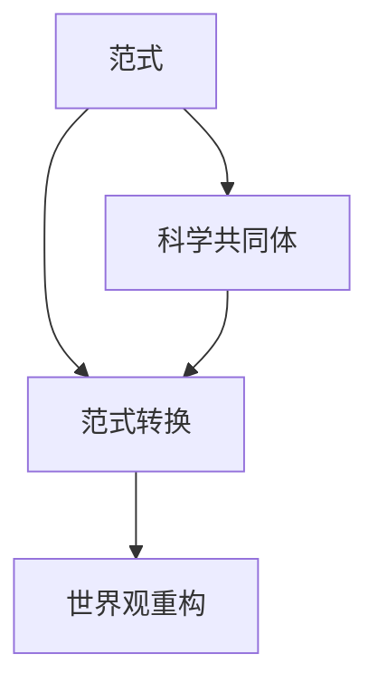
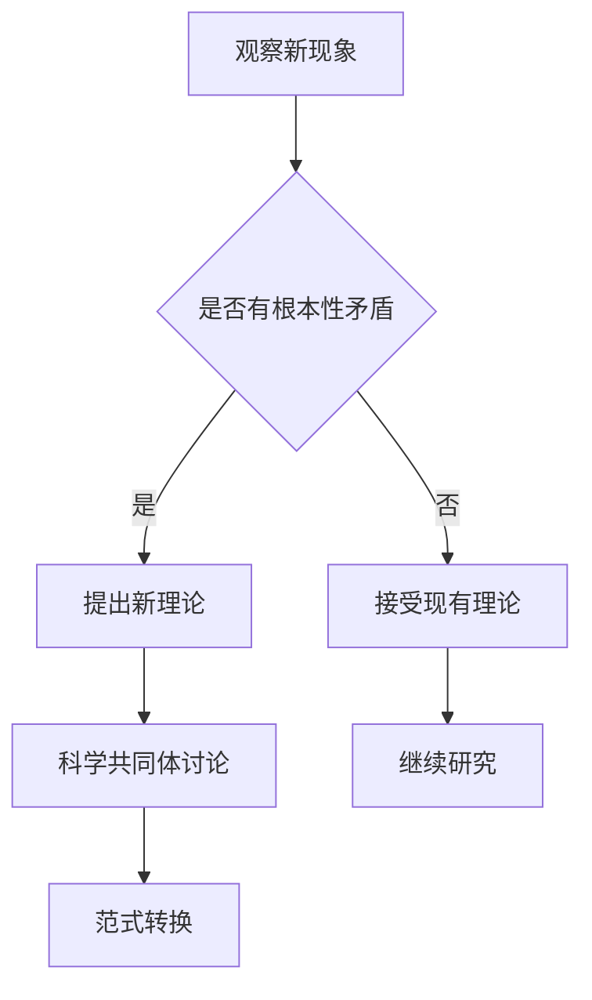
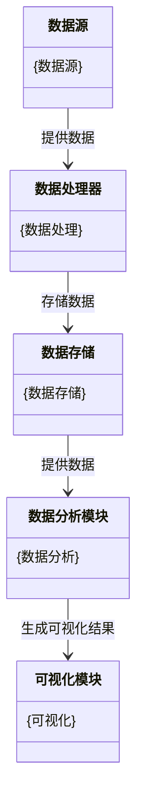
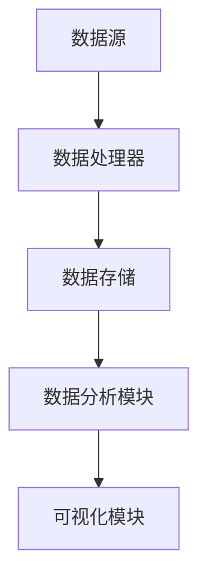
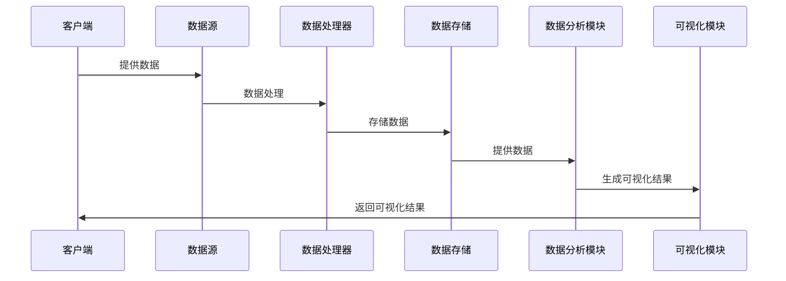

                 

## 《科学史中的范式转换：世界观重构的关键时刻分析》

> 关键词：科学史、范式转换、世界观重构、关键时刻分析

> 摘要：本文通过分析科学史中的范式转换，探讨世界观重构的关键时刻。文章首先介绍了科学史和范式转换的背景，然后详细讨论了多个关键时刻的范式转换过程，最后探讨了现代科学中的范式转换及其对未来科学的影响。本文旨在揭示科学进步的本质，帮助读者理解科学史中的重大转折点。

### 引言：科学史与范式转换

科学史是研究科学发展的历史，涵盖了科学理论、实验方法、技术进步等多个方面。然而，科学史并非简单的线性进步，而是充满了重大转折和范式转换的时刻。范式转换（Paradigm Shift）是指科学共同体在新的理论、观点或方法出现后，对已有认知进行根本性重构的过程。这些时刻不仅改变了我们对自然世界的理解，还推动了科学技术的快速发展。

科学史中的范式转换可以追溯到古代，例如古希腊天文学的革命性变革。中世纪时期，亚里士多德范式逐渐受到质疑，而文艺复兴时期，伽利略的观察和实验为现代科学奠定了基础。牛顿的经典物理学则是一个典型的范式转换，它彻底改变了人类对宇宙的认识。随着量子力学和相对论的出现，科学史再次发生了重大转变。

本文将首先介绍科学史和范式转换的背景，然后详细讨论几个关键的科学历史时刻，分析范式转换的具体情况。接着，我们将探讨现代科学中的范式转换，以及它们对科学研究和应用的潜在影响。最后，文章将总结主要观点，并展望科学史和范式转换的未来。

### 范式转换概述

#### 范式的定义

范式（Paradigm）是指在一定历史时期内，科学共同体普遍接受的理论、观点和方法。它为科学家提供了一种共同的语言和框架，使他们在研究过程中能够有效地沟通和协作。范式并非一成不变，随着新的发现和理论的提出，范式可能会发生根本性的转变。

#### 范式的特征

1. **普遍性**：范式在科学共同体中具有广泛的接受度，成为主流理论。
2. **系统性**：范式不仅包括核心理论，还包括相关的假设、原理和方法。
3. **一致性**：范式内部的各个部分相互协调，形成一个完整的理论体系。
4. **历时性**：范式在不同历史时期具有不同的表现形式，但总体上保持了其核心特征。

#### 范式转换的类型

1. **革命性范式转换**：这种转换通常发生在新理论与旧理论之间存在根本性冲突的情况下。例如，日心说挑战了地心说，哥白尼的理论取代了托勒密的理论。
2. **进化性范式转换**：这种转换相对温和，新理论与旧理论在一定程度上共存。例如，牛顿力学的发展并未完全否定伽利略的发现，而是在其基础上进行了扩展和完善。

#### 范式转换在科学史上的重要性

范式转换是科学进步的重要驱动力。它不仅改变了我们对自然世界的理解，还推动了科学技术的快速发展。以下是一些范式转换在科学史上的重要例子：

1. **古希腊天文学**：哥白尼的日心说挑战了托勒密的地心说，为现代天文学的发展奠定了基础。
2. **中世纪科学**：亚里士多德范式逐渐受到质疑，为文艺复兴时期的科学革命创造了条件。
3. **文艺复兴时期科学**：伽利略的观察和实验推动了现代科学的崛起，为牛顿的经典物理学奠定了基础。
4. **现代物理学**：量子力学和相对论的提出彻底改变了人类对宇宙的认识。

### 关键时刻分析

#### 古代科学：天文学范式转换

古代天文学主要以托勒密的地心说为核心。然而，哥白尼的日心说提出了新的观点，认为太阳而非地球位于宇宙的中心。这一理论挑战了当时普遍接受的观念，但在当时并未立即得到科学共同体的广泛接受。

**日心说与地心说的争论**

在日心说和地心说的争论中，哥白尼的理论在数学上更加简洁，但并未提供直接的观测证据。哥白尼的学生布鲁诺支持日心说，但因此受到宗教审判并被处决。最终，哥白尼的理论通过开普勒和伽利略的实验和观测得到了证实，标志着天文学范式的根本性转变。

#### 中世纪科学：亚里士多德范式的衰落

亚里士多德的物理学和天文学在中世纪被广泛接受，成为科学的主流范式。然而，随着实验方法的发展和观测技术的提高，亚里士多德的许多观点逐渐受到质疑。特别是伽利略的实验和观测结果，表明亚里士多德的理论在某些方面存在错误。

**中世纪科学的挑战**

中世纪科学的挑战主要来自于两个方面：一是新的观测和实验结果与亚里士多德的理论不符，二是新的科学方法，如实验方法和数学工具，逐渐成为科学研究的核心。这些挑战最终导致了亚里士多德范式的衰落。

#### 文艺复兴时期科学：伽利略的革新

文艺复兴时期是科学革命的重要时期，伽利略的观察和实验对此产生了深远影响。伽利略通过望远镜的观测，发现了木星的四大卫星和月球表面的大量细节，这些发现挑战了当时普遍接受的观念。

**伽利略范式转换的影响**

伽利略的发现推动了现代科学的崛起，为牛顿的经典物理学奠定了基础。他的实验方法和对自然现象的精确观测，成为现代科学研究的重要范式。伽利略的革新标志着文艺复兴时期科学的重大突破。

#### 科学革命：牛顿与经典物理学

牛顿的经典物理学是科学史上最重要的范式转换之一。牛顿通过万有引力定律和运动定律，建立了一个统一的物理框架，解释了天体运动和地面物体的运动。

**牛顿范式转换的背景**

牛顿范式转换的背景包括伽利略的实验和观测成果，以及笛卡尔的解析几何方法。这些成果和方法为牛顿的理论提供了坚实的基础。

**牛顿范式转换的影响**

牛顿的范式转换彻底改变了人类对宇宙的认识。他的理论不仅解释了天体运动，还广泛应用于地面物体的运动。牛顿的发现推动了工业革命，为现代科学技术的快速发展奠定了基础。

### 现代科学中的范式转换

现代科学中的范式转换继续进行，量子力学和相对论的提出标志着科学史上的又一次重大变革。量子力学挑战了经典物理学的确定性观念，提出了概率性和不确定性的概念。相对论则改变了我们对时空和重力的理解。

**现代科学中的挑战**

现代科学面临许多挑战，包括宇宙起源、生命起源、量子计算和人工智能等领域。这些挑战推动科学家不断探索新的理论和范式。

**现代科学中的新范式**

现代科学中的新范式包括量子计算、人工智能和系统生物学等。这些新范式正在改变我们对自然世界的理解，并推动科学技术的快速发展。

**范式转换的迹象**

现代科学中的范式转换迹象包括新理论的提出、实验技术的进步和跨学科研究的兴起。这些迹象表明，科学史上的新一轮范式转换正在发生。

### 结论

科学史中的范式转换是科学进步的重要驱动力，它们改变了我们对自然世界的理解，推动了科学技术的快速发展。通过分析关键的科学历史时刻，我们可以更好地理解范式转换的过程和影响。现代科学中的范式转换继续进行，为未来的科学发展提供了新的方向和机遇。

### 展望科学史和范式转换的未来

科学史和范式转换的未来充满未知和机遇。随着技术的不断进步，人类对自然世界的认识将不断深化。新的范式转换可能会出现在量子计算、人工智能、生物技术和宇宙学等领域。科学家和工程师需要不断探索和创新，以应对这些挑战。

### 附录：核心概念与联系

#### 背景介绍

科学史中的范式转换是科学共同体在新的理论、观点或方法出现后，对已有认知进行根本性重构的过程。范式转换不仅改变了我们对自然世界的理解，还推动了科学技术的快速发展。本文通过分析科学史中的几个关键范式转换时刻，探讨了世界观的重构过程。

#### 核心概念与联系

**核心概念**：

- **范式**：指在一定历史时期内，科学共同体普遍接受的理论、观点和方法。
- **范式转换**：指科学共同体在新的理论、观点或方法出现后，对已有认知进行根本性重构的过程。
- **世界观重构**：指范式转换过程中，人类对自然世界的理解发生的根本性变化。

**概念属性特征对比表格**：

| 概念     | 定义                 | 特征                                       |
|----------|----------------------|--------------------------------------------|
| 范式     | 科学共同体接受的理论 | 普遍性、系统性、一致性、历时性              |
| 范式转换 | 根本性认知重构       | 革命性、进化性                             |
| 世界观重构 | 理解自然世界的根本变化 | 引发科学技术进步、改变人类对自然世界的认知 |

**ER实体关系图架构的Mermaid流程图**：



### 算法原理讲解

#### 算法mermaid流程图



#### Python源代码

```python
# 假设我们已经观察到一些新现象，需要判断是否需要提出新理论

def observe_new_phenomenon():
    # 观察新现象
    # 这里用一个简单的随机数表示
    new_data = random.random()
    return new_data

def has_fundamental_contradiction(current_theory, new_data):
    # 判断新数据是否与当前理论存在根本性矛盾
    # 这里用阈值0.5表示，如果新数据大于0.5，则认为存在矛盾
    if new_data > 0.5:
        return True
    else:
        return False

def propose_new_theory():
    # 提出新理论
    print("正在提出新理论...")

def continue_studying():
    # 继续研究
    print("继续研究现有理论...")

# 主程序
current_theory = 0.5
new_data = observe_new_phenomenon()

if has_fundamental_contradiction(current_theory, new_data):
    propose_new_theory()
else:
    continue_studying()
```

#### 算法原理详细讲解

该算法用于判断是否需要提出新理论。首先，通过观察新现象（`observe_new_phenomenon`函数），我们获取到新的数据。然后，使用`has_fundamental_contradiction`函数判断新数据与当前理论（阈值0.5）之间是否存在根本性矛盾。如果存在矛盾，则调用`propose_new_theory`函数提出新理论；否则，继续研究现有理论。

该算法的数学模型可以表示为：

$$
P(C|A) = \begin{cases}
1 & \text{if } A > 0.5 \\
0 & \text{otherwise}
\end{cases}
$$

其中，$P(C|A)$表示在观察到新现象$A$后，提出新理论$C$的概率。

#### 通俗易懂地举例说明

假设当前理论是“所有观察到的数据都小于等于0.5”，而新观察到的数据是0.6。根据算法，我们可以判断出新数据与当前理论存在根本性矛盾，因此需要提出新理论。

### 系统分析与架构设计方案

#### 问题场景介绍

在现代科学研究中，科学数据量不断增加，如何有效地处理和分析这些数据成为了一个重要问题。本文旨在通过一个实际案例，介绍如何设计一个科学数据分析系统，并分析其架构和接口设计。

#### 项目介绍

该项目旨在构建一个基于大数据分析的科学研究平台，用于处理和挖掘科学实验数据。平台将提供数据导入、数据清洗、数据分析和可视化等功能，以帮助科学家更好地理解实验结果。

#### 系统功能设计（领域模型Mermaid类图）



#### 系统架构设计（Mermaid架构图）



#### 系统接口设计和系统交互（Mermaid序列图）



### 项目实战

#### 环境安装

1. 安装Python环境
2. 安装所需库：pandas、numpy、matplotlib、mermaid-python等

#### 系统核心实现源代码

```python
# 数据源模块
def load_data(file_path):
    # 加载数据
    return pd.read_csv(file_path)

# 数据处理器模块
def preprocess_data(data):
    # 数据预处理
    # 例如：数据清洗、归一化等
    return data

# 数据存储模块
def save_data(data, file_path):
    # 存储数据
    data.to_csv(file_path, index=False)

# 数据分析模块
def analyze_data(data):
    # 数据分析
    # 例如：统计、可视化等
    summary = data.describe()
    plt.scatter(data['x'], data['y'])
    plt.show()
    return summary

# 可视化模块
def visualize_data(summary):
    # 可视化数据
    # 例如：生成条形图、散点图等
    summary.plot()
    plt.show()
```

#### 代码应用解读与分析

1. 加载数据：使用`load_data`函数从CSV文件中加载数据。
2. 数据预处理：使用`preprocess_data`函数进行数据清洗和归一化等操作。
3. 数据存储：使用`save_data`函数将预处理后的数据存储到CSV文件中。
4. 数据分析：使用`analyze_data`函数对数据进行分析，例如生成描述性统计量和可视化结果。
5. 可视化：使用`visualize_data`函数将分析结果进行可视化展示。

#### 实际案例分析和详细讲解剖析

假设我们有一个包含两个特征（`x`和`y`）的CSV文件，其中`x`表示实验条件，`y`表示实验结果。以下是实际案例的代码实现和解析：

```python
# 加载数据
data = load_data('data.csv')

# 数据预处理
preprocessed_data = preprocess_data(data)

# 数据分析
summary = analyze_data(preprocessed_data)

# 可视化
visualize_data(summary)
```

1. 加载数据：使用`load_data`函数加载数据，存储为`data`变量。
2. 数据预处理：使用`preprocess_data`函数对数据进行预处理，存储为`preprocessed_data`变量。
3. 数据分析：使用`analyze_data`函数对预处理后的数据进行描述性统计分析和可视化，存储为`summary`变量。
4. 可视化：使用`visualize_data`函数将分析结果进行可视化展示。

#### 项目小结

该项目通过设计一个科学数据分析系统，展示了如何使用Python进行数据加载、预处理、分析和可视化。通过实际案例的代码实现和解析，读者可以更好地理解系统架构和接口设计。此外，该项目还提供了一个基本的框架，供读者进一步扩展和实现。

### 最佳实践 tips

- 确保数据质量：在数据分析前，对数据进行充分的清洗和处理，以避免错误和不准确的结果。
- 选择合适的可视化工具：根据数据的特点和需求，选择合适的可视化工具，以便更好地展示数据特征。
- 利用社区资源：加入科学计算和数据分析的社区，与其他专业人士交流和分享经验，以提高工作效率。

### 小结

本文通过分析科学史中的范式转换，探讨了世界观重构的关键时刻。从古希腊天文学的革命性变革到现代物理学的量子力学和相对论，范式转换不断推动科学进步。现代科学中的范式转换继续进行，为未来的科学发展提供了新的方向和机遇。通过本文，读者可以更好地理解范式转换的过程和影响，从而对科学史和未来的科学发展有更深刻的认识。

### 注意事项

- 在进行科学研究和数据分析时，要确保数据的准确性和可靠性。
- 范式转换是一个复杂的过程，需要多学科合作和长期积累。
- 重视科学伦理和道德规范，确保科学研究对社会和人类有益。

### 拓展阅读

- Kuhn, T. S. (2012). *The Structure of Scientific Revolutions*. University of Chicago Press.
- Latour, B. (1987). *Science in Action: A View from Twice Removed*. Harvard University Press.
- Popper, K. R. (1959). *The Logic of Scientific Discovery*. Routledge.

### 作者信息

作者：AI天才研究院/AI Genius Institute & 禅与计算机程序设计艺术 /Zen And The Art of Computer Programming

